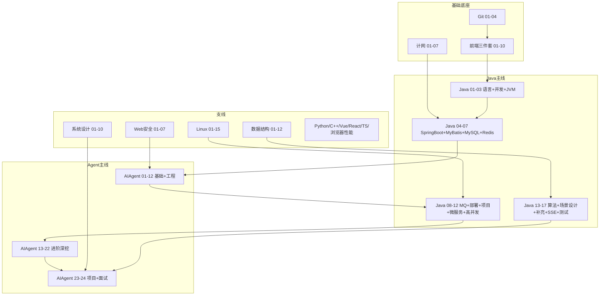

# Java + Agent 开发学习路线（目标：进大厂）

> 主线：**Java 后端 + AI Agent 开发**。支线：前端、网络、安全、系统设计、数据结构、Linux、Python、C++ 等围绕主线补充。
> 本路线**不设天数**——按"学完标准"推进，掌握一个再进下一个，比赶进度更重要。
> 配套资料全部在本仓库：`后端学习/`（Java/AIAgent/Linux/Python/C++/系统设计/数据结构）、`前端学习/`（HTML CSS JS/Vue/React/TypeScript/计网/Web安全/Git/浏览器与性能）。

---

## 0. 怎么用这份路线

### 0.1 三条线，分清主次

| 线 | 系列 | 优先级 |
|----|------|--------|
| **主线（必学，决定能否进大厂）** | Java、AIAgent | ⭐⭐⭐ 必须精通 |
| **强支线（必学，主线依赖或面试必考）** | Linux、计网、数据结构、系统设计、Web安全、Git、前端三件套 | ⭐⭐ 必须掌握 |
| **弱支线（选学，加分或特定方向）** | Vue/React（选一）、TypeScript、Python、C++、浏览器与性能 | ⭐ 按目标选学 |

### 0.2 不设天数的节奏建议

- **以"学完标准"为单位推进**，每章资料末尾都有「学完标准」「闭卷自测」「费曼检验」。自测 ≥7/10 + 能脱稿讲清核心，才算过关，再进下一章。
- **宁可慢而扎实，不要快而悬空**。Agent 岗面试深挖 3 层，悬空的知识第一层就崩。
- **每天保证"动手时间"**：看资料:动手 ≈ 3:7。只看不敲 = 假学（详见 §6 学习方法）。
- 时间不固定没关系，但**连续中断别超过 3 天**，否则遗忘曲线把前面的冲掉。

### 0.3 一句话总览

```
前端三件套打底 → Java 语言内功 → Java Web+数据库 → Agent 主线（核心目标）
→ 后端工程化补全 → Agent 进阶深挖 → 项目+面试冲刺
（Linux/计网/安全/系统设计/数据结构/Git 作为贯穿支线按需插入）
```

---

## 1. 全局地图

### 1.1 主线与支线串联图



### 1.2 14 个系列定位表

| 系列 | 路径 | 章数 | 在路线中的角色 |
|------|------|------|----------------|
| **Java** | `后端学习/Java/` | 17 | 主线之一，后端地基 |
| **AIAgent** | `后端学习/AIAgent/` | 24 | 主线之一，核心目标 |
| Linux | `后端学习/Linux/` | 15 | 强支线，部署运维必备 |
| 计算机网络 | `前端学习/计算机网络/` | 7 | 强支线，面试必考 + Agent 联调 |
| 数据结构 | `后端学习/数据结构/` | 12 | 强支线，手撕代码 + 算法面 |
| 系统设计 | `后端学习/系统设计/` | 10 | 强支线，场景设计题 |
| Web安全 | `前端学习/Web安全/` | 7 | 强支线，Java 鉴权 + LLM 安全 |
| Git | `前端学习/Git/` | 5 | 强支线，工程基本功 |
| HTML/CSS/JS | `前端学习/HTML CSS JS/` | 14 | 强支线，全栈联调 |
| Vue | `前端学习/Vue/` | 13 | 弱支线，简历项目前端（选一） |
| React | `前端学习/React/` | 14 | 弱支线，简历项目前端（选一） |
| TypeScript | `前端学习/TypeScript/` | 11 | 弱支线，前端工程化加分 |
| Python | `后端学习/Python/` | 15 | 弱支线，第二后端 + AI 评估脚本 |
| C++ | `后端学习/C++/` | 15 | 弱支线，底层/算法对照（可选） |
| 浏览器与性能 | `前端学习/浏览器与性能/` | 6 | 弱支线，前端性能加分 |

---

## 2. 阶段化路线（核心）

> 每个阶段含：**目标 / 学习内容（具体到章）/ 学完能做什么 / 过关标准**。按过关标准推进，不要按时间赶。

### 阶段 0｜环境与工具准备

**目标**：装好开发环境，会用 Git 和命令行，后续不再卡工具。

**学习内容**：
- `前端学习/Git/01-Git入门与安装配置.md` → `02-本地版本控制核心操作.md` → `03-分支管理与合并冲突.md` → `04-远程仓库与PullRequest协作.md`
- `后端学习/Linux/01-Linux入门与环境搭建.md` → `02-文件系统与目录结构.md` → `03-文件与目录操作命令.md`
- 装 JDK 17、IntelliJ IDEA、MySQL 8、Redis、Docker、Node.js（为后面准备）

**学完能做什么**：能用 Git 管理代码并推到 GitHub；能在 Linux 终端里增删改查文件。

**过关标准**：独立完成一次「建仓库→写代码→分支→提交→PR→合并」全流程；Linux 能不查文档完成 ls/cd/pwd/mkdir/rm/cp/mv/cat。

---

### 阶段 1｜前端三件套打底（全栈联调的前提）

**目标**：看懂前端、能写简单页面、能和后端联调。Agent 应用大多需要前端展示流式回答，不懂前端会卡。

**学习内容**：
- `前端学习/HTML CSS JS/01-HTML基础结构与常用标签.md` → `02-HTML表单表格多媒体与语义化.md`
- `03-CSS基础语法选择器与文本样式.md` → `04-CSS盒模型浮动定位与显示模式.md` → `05-CSS布局FlexGrid响应式与动画.md`
- `06-JavaScript基础语法与数据类型.md` → `07-JavaScript流程控制函数对象数组与ES6基础.md`
- `08-JavaScript-DOM-BOM与事件机制.md` → `09-JavaScript异步编程网络请求与本地存储.md`
- `10-浏览器HTTP网络与Web基础.md`（这一章是前后端衔接关键）
- 同步穿插 `前端学习/计算机网络/01-网络分层与通信基础.md` → `04-HTTP协议深入.md`（HTTP 是前后端共同语言）

**学完能做什么**：写一个带表单的静态页面；用 fetch 调后端接口拿数据渲染；看懂别人写的前端代码。

**过关标准**：能独立写一个「表单提交→fetch 调接口→渲染结果」的页面；能讲清 HTTP 请求/响应结构、常见状态码、GET vs POST。

> 选学：`11-前端工程化调试Git与包管理基础.md`、`12-前端页面实战组件思维与常见模块.md`、`13-前端高频场景题与面试专题.md` 有余力再看。

---

### 阶段 2｜Java 语言内功（主线起点）

**目标**：掌握 Java 语言核心 + 并发 + JVM，这是 Java 后端面试的"内功"，也是 Agent 开发的语言基础。

**学习内容**：
- `后端学习/Java/01-Java基础语法与面向对象.md`（基础语法、面向对象、封装继承多态）
- `02-Java常用类集合与泛型.md`（集合框架、泛型、IO）
- `03-Java并发编程与JVM.md`（**重点中的重点**：线程、synchronized、volatile、线程池、JVM 内存、GC、类加载；末尾「面试深挖补充」覆盖锁升级/AQS/线程池时序/CHM/G1-ZGC/打破双亲委派）

**学完能做什么**：写出线程安全的 Java 代码；用线程池管理并发任务；解释 JVM 内存结构和 GC 流程。

**过关标准**：
- 闭卷自测 ≥7/10
- 能脱稿讲清：synchronized 锁升级、AQS 原理、线程池执行顺序、ConcurrentHashMap JDK7 vs 8、G1 vs ZGC
- 手写一个线程安全的单例（DCL + volatile）和线程池示例

> 这章是面试深挖重灾区，**「面试深挖补充」一节务必精读**，每条都要能展开讲 1 分钟。

---

### 阶段 3｜Java Web 主线 + 数据库缓存（产出第一个后端服务）

**目标**：能写带数据库、缓存的 Spring Boot 接口——这是 Agent 服务的地基。

**学习内容**（严格按顺序）：
- `后端学习/Java/04-SpringBoot核心开发.md`（Spring Boot、Controller、接参校验、分层）
- `05-MyBatis事务与接口工程化.md`（MyBatis、事务、接口工程化）
- `06-MySQL基础索引与事务.md`（建表、CRUD、索引、B+树、事务隔离、MVCC；末尾「面试深挖补充」覆盖 ReadView/索引下推/间隙锁/change buffer）
- `07-Redis核心原理与缓存实战.md`（5 种数据结构、Cache Aside、三大缓存问题、分布式锁、持久化、哨兵/集群；末尾「面试深挖补充」覆盖数据结构底层/单线程+6.0多线程IO/RedLock争议/Redisson看门狗/混合持久化）

**穿插**：
- `前端学习/计算机网络/05-HTTPS与TLS加密.md` → `06-缓存Cookie与会话机制.md`（HTTPS 和 Cookie/Session 是登录鉴权基础）
- `前端学习/Web安全/01-XSS跨站脚本攻击与防御.md` → `02-CSRF跨站请求伪造与防御.md` → `03-认证与会话安全深入.md`（Java 04 做登录时配套看）

**学完能做什么**：写一个「Spring Boot 接口 + MySQL 持久化 + Redis 缓存」的 CRUD 服务，带登录鉴权。

**过关标准**：
- 能独立设计一个 3 表的电商小项目并实现接口
- 能讲清：B+ 树为什么适合索引、MVCC 怎么实现快照读、Cache Aside 读写流程、缓存穿透/击穿/雪崩对策、Redis 为什么快
- 闭卷自测各章 ≥7/10

> 这里是**进入 Agent 主线前的最后一道地基**。04-07 掌握扎实，Agent 章节才不卡。

---

### 阶段 4｜Agent 主线（核心目标，本路线的重心）

**目标**：掌握 Agent 开发全栈能力——Spring AI、流式、Tool、RAG、向量库、记忆、多智能体、可观测、生产化。这是你投 Agent 岗的核心筹码。

**学习内容**（严格按编号顺序）：

**基础与工程（01-12）**：
- `后端学习/AIAgent/01-大模型基础与API调用入门.md`（Token、Prompt、API、Ollama/DeepSeek）
- `02-SpringAI核心开发.md`（ChatClient、配置、分层）
- `03-流式对话与SSE实战.md`（SseEmitter、EventSource、打字机效果）
- `04-FunctionCalling与Tool设计.md`（@Tool、模型调 Java 方法）
- `05-Agent架构与ReAct模式.md`（多步推理、Router）
- `06-RAG检索增强生成基础.md`（分块、Embedding、检索）
- `07-向量数据库与知识库实战.md`（PGVector、入库 API）
- `08-对话记忆与会话管理.md`（Redis 会话、用户隔离）
- `09-LangChain4j进阶.md`（可选，对照 Spring AI）
- `10-Agent项目实战与面试准备.md`（串成简历级 demo）
- `11-生产化与安全.md`（限流、成本、Prompt 注入）
- `12-面试专题与知识点总表.md`（复习索引）

**配套穿插**：
- `后端学习/Java/16-SSE与WebSocket实时通信.md`（AIAgent 03 流式的 Java 原理补强）
- `前端学习/Web安全/07-LLM应用安全与Prompt注入防护.md`（AIAgent 11 生产化安全配套）

**学完能做什么**：从 0 搭一个「文档入库→检索→带引用流式问答→调工具→多轮记忆」的 Agent 服务。

**过关标准**：
- 亲手跑通 agent-demo（02-10 章维护的 demo 项目），不是看懂而是跑起来
- 能讲清：Token/Prompt/上下文窗口、Function Calling 原理与安全、RAG 全流程、ReAct 循环、SSE 流式原理
- 能独立给一个新业务场景设计 Agent 架构

> **这是路线的核心，也是你区别于普通 Java 后端的关键**。01-12 要做到能落地，不只是会背。

---

### 阶段 5｜后端工程化补全（让 Agent 服务能上线、能扛量）

**目标**：补齐消息队列、部署、微服务、高并发、测试，让你的服务具备生产级能力。

**学习内容**：
- `后端学习/Java/08-RabbitMQ与消息队列实战.md`（异步、解耦、削峰）
- `09-LinuxDockerNginx部署基础.md`（或直接用 Linux 系列深入，见下）
- `10-后端项目实战与面试准备.md`（完整后端项目）
- `11-微服务与SpringCloud基础.md`（服务发现、配置中心、熔断、网关）
- `12-高并发与分布式系统基础.md`（CAP、分布式锁、分布式 ID、一致性）
- `16-SSE与WebSocket实时通信.md`（若阶段 4 没看）
- `17-单元测试与Mockito深入.md`（JUnit 5、Mockito、Testcontainers）

**配套深入 Linux（强支线重点）**：
- `后端学习/Linux/04-文本查看编辑与搜索.md` → `05-用户组与文件权限.md` → `06-进程与服务管理.md`（含「面试深挖补充」：进程状态/僵尸孤儿/OOM/systemd unit）
- `07-网络命令与防火墙基础.md`（含「面试深挖补充」：TCP状态/TIME_WAIT/CLOSE_WAIT/tcpdump）
- `08-软件包管理与开发环境安装.md` → `09-Shell脚本入门.md` → `10-SSH远程登录与文件传输.md` → `11-日志分析与故障排查.md`
- `12-Docker容器基础.md` → `13-Nginx与Web服务部署.md` → `14-全栈项目Linux部署实战.md`

**学完能做什么**：把 Agent 服务用 Docker 部署到 Linux 服务器，配 Nginx 反代和 SSE；写单元测试；理解微服务和高并发套路。

**过关标准**：
- 能写 systemd unit 让 Java 服务开机自启
- 能用 ss/journalctl/tcpdump 排查线上问题
- 能讲清：消息队列解决什么问题、CAP 三选二、分布式锁方案演进、限流降级熔断

---

### 阶段 6｜Agent 进阶深挖（大厂 Agent 岗的深挖弹药）

**目标**：把 Agent 从"会用"提升到"懂底层、能优化、能选型"，应对大厂面试 3 层深挖。

**学习内容**（AIAgent 13-22）：

**工程深挖（13-16）**：
- `13-RAG进阶-检索优化与评估.md`（rerank、混合检索 BM25+向量+RRF、HyDE、chunk 策略、RAGAS 评估）
- `14-Agent进阶-多智能体与长程任务.md`（Router/Sequence/Parallel/Supervisor/Planner、长程任务、防 ReAct 绕圈）
- `15-LLM可观测性与评估体系.md`（Langfuse、trace、评估闭环）
- `16-向量库选型与进阶.md`（pgvector/Qdrant/Weaviate/Milvus/Pinecone/Chroma/Redis 对比、HNSW/IVF/PQ）

**大模型岗底层+前沿（17-22）**：
- `17-LLM原理与训练流程.md`（Transformer/Attention/Multi-Head/位置编码、Decoder-only vs Encoder vs Enc-Dec、BPE、Pretrain→SFT→RLHF/DPO/GRPO、上下文窗口/O(n²)/MoE/Scaling Law/幻觉）
- `18-PromptEngineering进阶与结构化输出.md`（few-shot/CoT/self-consistency、Spring AI entity()/BeanOutputConverter、版本管理）
- `19-成本与延迟优化.md`（prompt 缓存、模型路由、批处理、TTFT/ITL、KV Cache）
- `20-模型适配方法论与微调入门.md`（Prompt/RAG/Fine-tune/预训练选型、LoRA/QLoRA、SFT/DPO/RLHF/GRPO）
- `21-MCP-A2A协议与本地推理部署.md`（MCP/A2A 协议、Spring AI MCP 1.1+、vLLM/PagedAttention/Continuous Batching/量化/Ollama）
- `22-大模型生态选型与前沿推理范式.md`（开源/闭源选型、推理模型 o1/R1、Reflection/Plan-Execute/ToT/GoT/Reflexion）

**学完能做什么**：能优化 RAG 准确率、设计多智能体编排、做成本延迟优化、选型模型和向量库、讲清 LLM 原理和微调方法。

**过关标准**：
- 每章闭卷自测 ≥7/10
- 能讲清：混合检索+RRF、rerank 作用、多智能体模式、RAGAS 四指标、Transformer Attention、LoRA 原理、MCP 协议、vLLM 三大优化
- 能针对一个 RAG 效果差的真实问题，给出 3 个优化方向

> 这 10 章是大厂 Agent/大模型岗面试的"深挖弹药"，每章都有版本提醒（Spring AI rerank API/混合持久化/MCP 1.1+ 等），注意核对。

---

### 阶段 7｜项目与面试冲刺（从"会"到"面上"）

**目标**：把所有知识聚成面试战斗力——一个能写简历的项目 + 场景设计能力 + 手撕能力 + 八股 + 表达。

**学习内容**：
- `后端学习/AIAgent/23-Agent与Java端到端项目实战.md`（**核心**：端到端项目、架构、6 个选型深挖、4 个排障场景、面试追问应对）
- `24-大厂面试实战手册.md`（场景设计 4 步框架 + 5 高频题、6 道手撕、八股速查、项目深挖模板、简历优化、模拟面试）
- `后端学习/Java/14-高频场景设计与面试专题.md`（Java 场景设计题）
- `后端学习/Java/13-算法与数据结构基础.md`（算法入门）

**配套刷题（数据结构系列）**：
- `后端学习/数据结构/README.md` → `01-复杂度与基础/README.md` → `02-线性结构/README.md` → `03-哈希表/README.md`
- `04-树形结构/README.md` → `05-图结构/README.md` → `06-排序算法/README.md` → `07-查找算法/README.md`
- `08-高级算法专题/README.md` → `09-综合复习/README.md`

**配套系统设计（场景设计题）**：
- `后端学习/系统设计/01-系统设计方法论与面试框架.md`（4 步答题法）
- `02-限流熔断与降级.md` → `03-缓存架构设计.md` → `04-消息队列架构设计.md`
- `05-数据库扩展与读写分离.md` → `06-分布式一致性与CAP.md`
- `07-秒杀系统简化设计.md` → `08-短链服务设计.md` → `09-Feed流与时间线设计.md` → `10-面试专题与知识点总表.md`

**学完能做什么**：简历有一条能扛 3 轮追问的 Agent 项目；能答任意场景设计题；手撕 6 道高频题；面试 45 分钟能讲能写能扛。

**过关标准**（对照 `AIAgent/24` §8 自我检验清单）：
- 23 章项目最小版本亲手跑通
- 项目每个技术点的"为什么用/什么情况换/踩过什么坑"3 张牌都填了
- 八股速查表每条能展开讲 1 分钟
- 手撕 6 题任抽 1 题能 5 分钟内默写对
- 跑过 3 场以上完整模拟面试

---

## 3. 贯穿支线（按需插入，不必单独一次学完）

> 这些系列不单独占一个阶段，而是在主线相应位置穿插。下面给出"何时穿插"。

### 3.1 计算机网络（`前端学习/计算机网络/`，8 章）
- **何时学**：阶段 1 看 01/04（HTTP 基础）；阶段 3 看 05/06（HTTPS/Cookie）；面试前看 02/03/07 补全。
- **重点**：HTTP 协议、HTTPS/TLS、TCP/UDP、IP/DNS、缓存机制。面试必考。

### 3.2 Linux（`后端学习/Linux/`，15 章）
- **何时学**：阶段 0 看 01-03；阶段 5 深入 04-14；面试前看 15。
- **重点**：权限、进程/服务（含面试深挖）、网络排查（含面试深挖）、Docker、Nginx、Shell、日志排查。后端/SRE 必备。

### 3.3 Web 安全（`前端学习/Web安全/`，7 章）
- **何时学**：阶段 3 做 Java 登录鉴权时看 01-04；阶段 4 做 AIAgent 11 生产化时看 05/07（CORS + LLM 安全）。
- **重点**：XSS、CSRF、认证会话、HTTPS、CORS、LLM Prompt 注入。Agent 岗 LLM 安全是加分项。

### 3.4 数据结构（`后端学习/数据结构/`，12 章）
- **何时学**：阶段 7 面试冲刺时集中刷，与 Java 13 并行；平时可每天 1-2 题贯穿全程。
- **重点**：数组/链表/栈/队列/哈希/树/堆/图/排序查找/并查集Trie/LeetCode 路线。手撕代码和算法面必备。

### 3.5 系统设计（`后端学习/系统设计/`，10 章）
- **何时学**：阶段 5 学完 Java 12 高并发后看 01-06；阶段 7 面试前看 07-10。
- **重点**：4 步方法论、限流/缓存/MQ/分库分表/CAP/秒杀/短链/Feed。场景设计题必备，直接对应 AIAgent 24 的场景设计框架。

### 3.6 Git（`前端学习/Git/`，5 章）
- **何时学**：阶段 0 学 01-04；05 在做项目时按需。
- **重点**：版本控制、分支、PR。工程基本功。

### 3.7 前端框架（Vue 或 React，选一个）
- **何时学**：阶段 4 做 Agent 项目前端界面时（AIAgent 03 SSE 需要前端展示）。
- **选哪个**：Vue 上手快、中文资料多，推荐初学者；React 大厂用得多，简历加分。**选一个精通，别两个都浅**。
- **Vue 路径**：`前端学习/Vue/01-入门` → `02-模板语法` → `03-计算属性` → `04-组件` → `05-组合式API` → `06-Router` → `07-Pinia` → `08-Axios联调` → `09-Element-Plus` → `10-Vite部署` → `11-项目实战`
- **React 路径**：`前端学习/React/01-入门` → `02-JSX` → `03-State` → `04-组件通信` → `05-Hooks` → `06-Router` → `07-Zustand` → `08-Axios联调` → `09-Ant-Design` → `10-Vite部署` → `11-项目实战`
- **TypeScript 配套**（选学）：`前端学习/TypeScript/01-11`，学前端框架时配套看 07（Vue3+TS）或 08（React+TS）。

### 3.8 Python（`后端学习/Python/`，15 章，选学）
- **何时学**：阶段 6 做 RAGAS 评估时（评估脚本用 Python）；或作为第二后端语言。
- **重点**：基础语法、FastAPI、SQLAlchemy、MySQL、Redis、Celery、asyncio。AI 评估和数据处理常用 Python，Agent 工程师懂数 Python 是加分。
- **路径**：与 Java 系列结构对称，可对照学（01 基础→04 FastAPI→05 SQLAlchemy→06 MySQL→07 Redis→08 Celery）。

### 3.9 C++（`后端学习/C++/`，15 章，可选）
- **何时学**：**仅当**目标方向偏底层/高性能/算法（如推理引擎、系统开发）时学。纯 Agent + Java 业务方向**可跳过**。
- **重点**：指针内存、STL、现代 C++、多线程、性能分析。对理解 JVM 底层和算法有对照价值。

### 3.10 浏览器与性能（`前端学习/浏览器与性能/`，6 章，选学）
- **何时学**：前端阶段后或面试前，偏前端性能方向时看。
- **重点**：渲染原理、Core Web Vitals、DevTools 性能分析、资源加载优化。全栈加分项。

---

## 4. 主线快速通道（时间紧时只学这些）

> 如果时间非常紧，只想保"能投 Agent + Java 岗"的最小集，按这个子集走（会牺牲部分深度和加分项）：

```
Git 01-03 → HTML CSS JS 06-10 → Java 01-07 → AIAgent 01-12
→ Java 08-12 + Linux 06/07/12/13 → AIAgent 13-22 → AIAgent 23-24
→ 数据结构 02-09 + 系统设计 01-02-03-07 + 计网 04-05
```

跳过的：Vue/React、TypeScript、Python、C++、浏览器性能、Web安全（保留 01-03）、部分补充章。
**风险**：前端弱（Agent 项目前端界面会卡）、安全弱、加分项少。时间允许就别走快速通道。

---

## 5. 面试准备清单（阶段 7 对应）

到达阶段 7 后，按 `后端学习/AIAgent/24-大厂面试实战手册.md` 的清单逐项 ☑：

- [ ] 23 章项目最小版本亲手跑通
- [ ] 项目每个技术点的"3 张牌"（为什么用/什么情况换/踩过什么坑）填完
- [ ] Java/AIAgent/Linux 各章「面试深挖补充」能展开讲
- [ ] 24 章 §4 八股速查表每条能讲 1 分钟
- [ ] 24 章 §3 手撕 6 题任抽 1 题能 5 分钟默写对
- [ ] 24 章 §2 场景设计 4 步框架能套任意题
- [ ] 系统设计 5 道高频题（限流/短链/秒杀/RAG/IM）能答
- [ ] 数据结构 LeetCode 刷完 §11 路线的 70 题
- [ ] 简历每条能扛追问、有量化指标
- [ ] 跑过 3 场以上完整模拟面试

**全部 ☑ 再投简历**。准备不够 = 浪费机会 + 信心受挫。

---

## 6. 学习方法（决定能不能学会，比路线本身更重要）

> 资料是地图，路要自己走。光看资料**学不会**大部分计算机知识。下面是真正能学会的学法。

### 6.1 每个知识点配一段"跑得起来的代码"
看完一个点，**立刻写代码验证**。看 synchronized？写死锁 demo 用 jstack 抓。看 RAG？真把文档入库检索跑通。代码跑起来 + 自己改参数看变化 = 真懂一半。只看不跑 = 假懂。

### 6.2 主动制造问题再排查
故意写错看报错、故意把 JVM 参数调坏触发 Full GC、故意造缓存雪崩。**报错现场是最好的老师**，比看十遍文档管用。

### 6.3 费曼输出（每章必做）
学完一章，合上资料，用自己的话讲出来（对空气讲、写下来都行）。讲不出就是没懂，回去重学。每章末尾的「闭卷自测」和「费曼检验」就是干这个的——**跳过它们等于白看**。

### 6.4 做项目把知识串成网
23 章项目就是这个目的。散落的知识点是碎片，在一个真实系统里跑起来、出问题、排查，才变成网络。**有网才能在面试时随时调用，碎片调不出来。**

### 6.5 手撕靠重复写
看没用。LRU 默写 3 遍到一次写对，才算会。

### 6.6 间隔重复
遗忘曲线是真的，重要点隔几天回想一次，不然一周忘一半。

### 6.7 看:动手 ≈ 3:7
每天保证动手时间多于看资料时间。只看不敲是最大的学习陷阱。

---

## 7. 路线总览速查

| 阶段 | 主线内容 | 关键产出 | 过关就进下一阶段 |
|------|----------|----------|------------------|
| 0 | Git + Linux 入门 | 能管代码、能用终端 | ✅ |
| 1 | 前端三件套 + HTTP | 能写页面联调 | ✅ |
| 2 | Java 01-03 语言+并发+JVM | 能写并发代码、懂 JVM | ✅ |
| 3 | Java 04-07 + MySQL + Redis | 能写带库带缓存的接口 | ✅ |
| 4 | AIAgent 01-12 | 能搭 Agent 服务 | ✅ |
| 5 | Java 08-17 + Linux 深入 | 能部署、能扛量、能测试 | ✅ |
| 6 | AIAgent 13-22 进阶 | 能优化、能选型、懂底层 | ✅ |
| 7 | AIAgent 23-24 + 数据结构 + 系统设计 | 能写简历项目、能过面试 | ✅ 投简历 |

---

## 8. 最后的话

- **主线是 Java + Agent，别被支线带偏**。支线是为主线服务的，时间紧优先主线。
- **资料厚 ≠ 学会**。202 篇资料给你的是"地图"，能不能走到大厂靠"动手 + 自测 + 项目 + 模拟"。
- **每章的「面试深挖补充」「闭卷自测」「费曼检验」不是装饰，是核心**，跳过它们 = 白学。
- **Agent 岗是你的差异化机会**——纯 Java 后端卷，但 Java + Agent 复合背景的人少，这条路线就是冲这个差异化去的。

> 资料会持续维护，你学到任何一章发现卡住或想深入，可以直接对那一章提问。先动起来，比纠结路线更重要。
