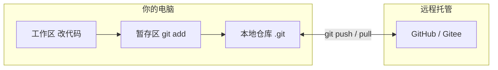
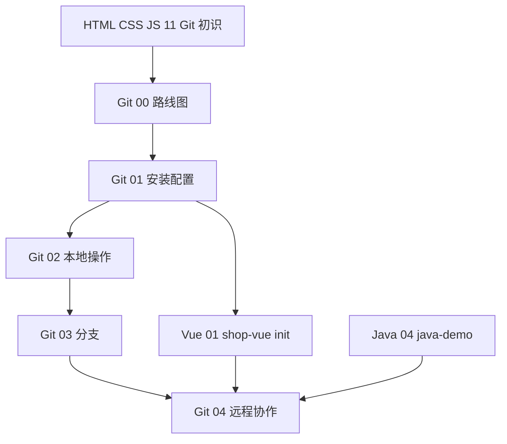

# Git 学习路线图与说明

> **文件编码**：本文件夹内所有 `.md` 均为 **UTF-8**。终端与编辑器建议 UTF-8；PowerShell / VS Code / Cursor 右下角确认编码。

---

## 本章与上一章的关系

你已经在 [HTML CSS JS 11](../HTML%20CSS%20JS/11-前端工程化调试Git与包管理基础.md) 里**见过 Git 的名字**：`git init`、`git add`、`git commit`、`git log` 各敲过一次。那一章的目标是「知道前端项目需要版本控制」，**不会**展开分支、合并、远程协作、冲突解决。

**本系列（`前端学习/Git/`）要做的事**：把 Git 从「听说过」变成「日常肌肉记忆」——能独立管理 `shop-vue` / `shop-react` / `java-demo` 仓库，能和队友在 Gitee / GitHub 上协作，能在面试里讲清楚「你们团队怎么用 Git」。

**前置要求（自检）**：

| 能力 | 对应章节 | 自检方式 |
|------|----------|----------|
| 会用终端 cd / ls | HTML CSS JS 11 | 能在 PowerShell 里进入项目目录 |
| 知道 npm / package.json | HTML CSS JS 11～12 | 能 `npm install` |
| 有 shop 或 demo 项目概念 | [Vue 00](../Vue/00-学习路线图与说明.md) / [Java 00](../../后端学习/Java/00-学习路线图与说明.md) | 知道 shop-vue 是什么 |

**什么时候学 Git？**

| 时机 | 建议 | 理由 |
|------|------|------|
| 学完 HTML CSS JS **12** 后 | ✅ 推荐 | 已有项目目录意识，学 Git 立刻能管练习代码 |
| 与 [Vue 01](../Vue/01-Vue入门与环境搭建.md) **并行** | ✅ 同样推荐 | Vue 01 第 11 节就建议 `git init shop-vue`，两边一起做最顺 |
| 完全零基础、连文件夹都没建过 | ⏸ 稍等 | 先完成 HTML CSS JS 01～05，至少会保存 `.html` 文件 |

---

## 1. 这套资料适合谁

- 已学过 HTML CSS JS **11 章**（工程化入门），想**系统掌握 Git** 的零基础同学
- 正在学 [Vue](../Vue/00-学习路线图与说明.md) / [React](../React/00-学习路线图与说明.md) / [TypeScript](../TypeScript/00-学习路线图与说明.md)，需要给 shop 项目打 commit、推远程、写 README 的学习者
- 计划与 [Java 后端](../../后端学习/Java/00-学习路线图与说明.md) 联调，前后端各自一个 Git 仓库、需要统一协作规范的同学
- 目标：能独立 **`init → commit → branch → merge → push → PR`**，能在简历写「熟悉 Git 工作流」而不心虚

**不适合**：

- 已多年 Git Flow / GitHub Actions 老手（可直接看后续 03～05 查漏补缺）
- 只想复制粘贴命令、不愿理解「工作区 / 暂存区 / 版本库」三层模型的人（Git 会反复坑你）

---

## 2. 为什么必须学 Git

### 2.1 没有版本控制时会发生什么

```text
项目文件夹/
├── index.html
├── index-备份.html
├── index-备份2-改导航.html
├── index-最终版.html
├── index-最终版-真的最终.html
└── index-给老板看的.html
```

真实场景里更糟：改了一行 CSS 整站崩了，**不知道是哪次改的**；队友覆盖了你的文件；面试问「你怎么协作」只能说「微信发 zip」。

### 2.2 Git 帮你解决什么

| 痛点 | Git 的能力 |
|------|------------|
| 改坏了想回到昨天 | 任意 commit 可 checkout / revert |
| 多人同时开发 | 分支 + 远程仓库 + 合并 |
| 谁改了哪一行 | `git log` / `git blame` |
| 功能开发不影响主线 | `feature` 分支 |
| 简历 / 开源展示 | GitHub / Gitee 公开仓库 |

### 2.3 为什么前端尤其离不开 Git

- **Node 项目**依赖 `node_modules`（不能提交）、`.env`（不能提交 secrets）——靠 `.gitignore` 管理
- **Vue / React** 脚手架自带 Git 友好结构，团队默认「每个功能一个分支 + PR」
- **联调**：前端 `shop-vue`、后端 `java-demo` 各一个仓库，接口文档和 commit 消息要对齐
- **CI/CD**：推送触发自动测试 / 部署（05 章预览）

### 2.4 深入：为什么建议和 Vue 01 同一天 init？

[Vue 01 §11](../Vue/01-Vue入门与环境搭建.md) 建议创建 `shop-vue` 后立刻 `git init`。原因有三：

1. **脚手架会改很多文件**：`npm install` 后 `node_modules` 不应进仓库，第一天就配 `.gitignore` 成本最低。
2. **每章一个 commit = 免费备份**：02 章改坏 `App.vue` 可 `git restore`；没有 commit 只能凭记忆重敲。
3. **简历与面试**：「shop-vue 仓库 30+ commit，message 规范」比「做过 Vue 项目」可信得多。

**小案例**：某同学学到 Router 章把 `main.js` 改崩，因 01 章 init 过，一条 `git restore src/main.js` 恢复，继续学；未 init 的同学重装脚手架，路由章节进度延后两天。

---

## 3. Git、GitHub、Gitee 分别是什么

很多人混为一谈，面试也常考：

| 名称 | 类型 | 类比 | 你要装 / 注册吗 |
|------|------|------|----------------|
| **Git** | 本地版本控制**软件** | 相机（在你电脑上拍照存历史） | ✅ 必须安装 |
| **GitHub** | 远程代码托管**网站** | 相册云（微软旗下，全球最大） | 注册账号，01 章后配置 |
| **Gitee** | 远程代码托管**网站** | 国内版相册云（码云） | 国内访问快，可选 |
| **GitLab** | 远程托管 + 自建 | 公司内网常用 | 入职后可能遇到 |

**关键句**：Git 是工具；GitHub / Gitee 是放 Git 仓库的服务器。没有 Git 也能在网页上改文件，但**专业开发**一定是本地 Git + 远程托管。



---

## 4. 与 HTML CSS JS 11 的关系

| 维度 | HTML CSS JS 11 | 本 Git 系列 |
|------|----------------|-------------|
| 深度 | 10 分钟扫过 Git 四条命令 | 01～05 系统讲 |
| 分支 / 合并 | 只提概念 | 03～04 手把手练 |
| 远程 / PR | 不涉及 | 04～05 主线 |
| `.gitignore` | 简单提及 | 01～02 详讲 node 模板 |
| 协作规范 | 无 | 04 Conventional Commits + PR |

**学习路径建议**：11 章当「预告片」，本系列当「正片」。若你 11 章已跟做过一次 `git commit`，01 章会从安装与配置**正式**开始，不重复废话。

---

## 5. 学习顺序（按编号 00～05）

```text
00 学习路线图（你现在在这里）
 ↓
01 Git 入门与安装配置（装 Git、git config、init、第一次 commit）
 ↓
02 本地版本控制核心操作（add、commit、log、diff、restore、reset、stash）
 ↓
03 分支管理与合并冲突（branch、merge、冲突、rebase 入门）
 ↓
04 远程仓库与 Pull Request 协作（remote、push、pull、PR、Code Review）
 ↓
05 前端项目实践与面试总表（三项目 .gitignore、日常流、Hooks、面试）
```

### 5.1 阶段目标总览

| 阶段 | 文档 | 核心目标 | 产出物 |
|------|------|----------|--------|
| 入门 | 01 | 本机 Git 可用、完成首次 commit | `hello-git` 或 shop 首次提交 |
| 本地 | 02 | 熟练 add/commit/log/diff/撤销 | 10+ 条有意义 commit 历史 |
| 分支 | 03 | 功能分支开发、解决简单冲突 | `feature/xxx` 合并进 main |
| 远程 | 04 | push 到 Gitee/GitHub、发 PR | 远程仓库 + README |
| 协作 | 05 | 三项目实践、PR、面试 | shop 完整 Git 工作流 |

### 5.2 与其他系列并行节奏

| 你的进度 | 同步学 Git | 说明 |
|----------|------------|------|
| HTML CSS JS 12 | Git 01 | 给静态练习项目 `git init` |
| Vue/React 01 | Git 01～02 | 与 shop 项目同一天 init |
| Vue/React 04～07 | Git 03 | 每个大功能一个分支 |
| Vue/React 08 联调 | Git 04 | 前后端仓库都 push，写联调 commit |
| Java 04+ | Git 04 | `java-demo` 同样纳入版本管理 |
| 面试前 | Git 02～05 复习 | 能画三区模型、讲 merge vs rebase |



---

## 6. 主线练手项目：三个仓库的 Git 演进

与全栈路线对齐，建议维护 **三个 Git 仓库**（可以都在 Gitee/GitHub 上，名称自定）：

### 6.1 shop-vue（前端 Vue）

```text
Git 01  git init + 首次 commit「chore: init shop-vue」
Git 02  每完成 Vue 一章 → 一个 commit（如 feat: product list v-for）
Git 03  feature/login-page 分支开发登录页 → merge
Git 04  push 到远程，README 写启动方式
Git 05  保护 main 分支，PR 合并规范
```

### 6.2 shop-react（若你走 React 线）

同上，与 [React 00](../React/00-学习路线图与说明.md) 的 shop-react 对应；Git 操作**完全一致**，只是项目目录不同。

### 6.3 java-demo（后端 Spring Boot）

```text
Git 01  在 Spring Initializr 生成项目后 git init
Git 02  每完成一个接口模块 commit（如 feat: user login API）
Git 04  与 shop 前端分开仓库，commit message 里可写「配合前端 #12」
```

**为什么前后端分仓库？** 真实公司常见：前端组、后端组权限不同、发布节奏不同；联调靠 API 文档 + 约定分支，不靠塞同一个文件夹。

---

## 7. 必备工具与环境

| 工具 | 用途 | 01 章是否安装 |
|------|------|---------------|
| Git for Windows | 核心 CLI | ✅ |
| PowerShell | 本资料默认终端 | 系统自带 |
| VS Code / Cursor | 编辑 + 内置 Git 面板 | 推荐 |
| Gitee 或 GitHub 账号 | 远程托管 | 04 章前注册即可 |

**验证环境**（01 章详讲）：

```powershell
git --version
```

预期输出示例：

```text
git version 2.43.0.windows.1
```

---

## 8. 每份文档怎么学（四步法）

1. **通读**：本章解决什么问题？和 11 章差在哪？
2. **跟敲**：在 `f:\study\projects\git-practice` 或 shop 项目里**真实敲命令**，对照预期输出
3. **练习**：做文档末尾分级练习，对照参考答案
4. **提交**：当天学习笔记也 commit 进仓库（meta：用 Git 学 Git）

---

## 9. 文档索引速查

| 编号 | 文件名 | 一句话 | 状态 |
|------|--------|--------|------|
| 00 | 学习路线图与说明 | 顺序、对照、三项目演进 | ✅ |
| 01 | Git 入门与安装配置 | 安装、config、init、首 commit | ✅ |
| 02 | 本地版本控制核心操作 | add、log、diff、撤销、stash | ✅ |
| 03 | 分支管理与合并冲突 | branch、merge、冲突 | ✅ |
| 04 | 远程仓库与 Pull Request 协作 | remote、push、PR | ✅ |
| 05 | 前端项目实践与面试总表 | 三项目实践、面试 | ✅ |

规范细节见 [修改规范](../../修改规范.md) §4。

---

## 10. 常见 FAQ

**Q：Git 和 SVN 学哪个？**  
新项目几乎全是 Git。SVN 只在部分老政企项目；本系列只教 Git，01 章会简要对比。

**Q：命令行还是图形界面？**  
**两者都要会**：CLI 是面试和服务器必备；VS Code / Cursor 图形面板提高效率。01 章介绍面板，02 起以 PowerShell 为主。

**Q：commit 消息写什么？**  
02 章引入 **Conventional Commits**（如 `feat:`、`fix:`、`chore:`），与 Vue / Java 资料里的提交习惯一致。

**Q：node_modules 要不要提交？**  
**永远不要。** 02 章给 Node / Vue / React 通用 `.gitignore` 模板。

**Q：和 TypeScript 有关系吗？**  
Git 管的是**文件历史**，与 TS/JS 无关；但 [TypeScript 10](../TypeScript/10-项目实战JS到TS迁移.md) 迁移时应用分支 + 小步 commit，便于回滚。

---

## 11. 与修改规范的对照

本系列遵循 [修改规范](../../修改规范.md) §4 的**七类必补内容**：

| 类型 | 00 章 | 01～02 章 |
|------|-------|-----------|
| 手把手实操 | 三项目演进路线 | 完整 init / commit / 撤销流程 |
| 常见报错表 | FAQ + 01/02 章表 | 每章 ≥8 行 |
| 深入解释「为什么」 | §2 为何学 Git | 暂存区、reset vs revert 等 |
| 命令预期输出 | §7 验证示例 | 每节命令块 |
| 练习 + 参考答案 | — | 分级 + 答案 |
| 章节衔接 | 开篇 + §12 预告 | 开篇 + 末章预告 |
| Mermaid 图 | §3、§5.2 | 三区模型、reset 模式 |

扩展路线 **第 2 项（Git 协作）** 在本文件夹落地；[TypeScript 00](../TypeScript/00-学习路线图与说明.md) §10 仍指向 HTML 11，以本系列为准深读。

---

## 12. 第一天 Checklist（跟 01 章一起做）

```text
□ 安装 Git，git --version 正常
□ git config user.name / user.email
□ 在 git-practice 或 shop-vue 执行 git init（若尚未 init）
□ 添加 .gitignore（含 node_modules、.env）
□ 第一次 commit：chore: init ...
□ 打开 Cursor Source Control，确认能看到 Changes
□ git log --oneline 至少 1 行
```

完成后在笔记区写下远程平台账号（Gitee/GitHub），04 章注册 SSH 时会用到。

---

## 13. 5 分钟跟做：验证 Git 环境（手把手）

不创建项目，只验证 01 章前置环境是否就绪：

```powershell
git --version
git config user.name
git config user.email
```

**预期**：

```text
git version 2.43.0.windows.1
张三
zhangsan@example.com
```

若 `user.name` 为空，立即执行：

```powershell
git config --global user.name "你的昵称"
git config --global user.email "your@email.com"
```

再建目录快速试跑（可选，01 章会详做）：

```powershell
mkdir f:\study\projects\git-sanity-check
cd f:\study\projects\git-sanity-check
git init
echo "# sanity" > README.md
git add README.md
git commit -m "chore: sanity check"
git log --oneline
```

**预期 log** 一行 `chore: sanity check`。成功后此文件夹可删或保留作对照。

---

## 14. 分级练习

**基础**：读完 00～01 后，用自己的话写 3 句话解释 Git / GitHub / Gitee 区别。

**进阶**：画出三区模型（工作区 → 暂存区 → 仓库），标出 `add` 和 `commit` 在哪两步。

**挑战**：列出 shop-vue、shop-react、java-demo 三个仓库，各写 1 条你计划使用的首 commit message。

### 14.1 参考答案

**基础**：

1. Git 是装在你电脑上的版本控制软件，记录每次代码快照。
2. GitHub / Gitee 是托管远程仓库的网站，方便备份和协作。
3. 没有 Git 也可以网页改代码，但专业开发一定是本地 Git + 远程托管。

**进阶**：见 §3 Mermaid 图；口诀「改完 add，add 完 commit」。

**挑战** 示例：

```text
shop-vue:    chore: init shop-vue via create-vue
shop-react:  chore: init shop-react via create-react-app
java-demo:   chore: init spring boot java-demo
```

---

## 15. 常见报错与排查（环境类）

| 报错信息（关键词） | 可能原因 | 解决方案 |
|-------------------|---------|---------|
| `'git' 不是内部或外部命令` | 未安装或未进 PATH | 安装 Git for Windows，重启终端 |
| `git version` 报错 | 安装不完整 | 卸载重装，勾选 PATH 选项 |
| `Author identity unknown` | 未配置 name/email | `git config --global user.name/email` |
| `fatal: not a git repository` | 目录无 `.git` | 先 `cd` 到项目根或 `git init` |
| 中文路径乱码 | 编码 / quotepath | UTF-8 编辑器；`core.quotepath false` |
| PowerShell 无法运行脚本 | 执行策略 | Git 命令不受影响；与 npm 脚本无关 |
| 混淆 Git 与 GitHub | 概念不清 | Git=软件；GitHub/Gitee=网站 |
| 以为 11 章已够 | 只扫过四条命令 | 本系列 01～02 系统补全 |

---

## 16. 学完标准

- [ ] 能区分 Git、GitHub、Gitee、GitLab
- [ ] 能说出 01～05 各章主题
- [ ] 知道何时学（HTML 12 后或并行 Vue 01）
- [ ] 能描述 shop-vue / java-demo 的 commit 节奏
- [ ] 完成 §13 环境验证，`git log --oneline` 至少 1 行（sanity check）
- [ ] 读过 [HTML CSS JS 11](../HTML%20CSS%20JS/11-前端工程化调试Git与包管理基础.md) 与本 00 的差异

---

## 17. 我的笔记区

```text
学习开始日期：
当前进度（编号）：
主练仓库：shop-vue / shop-react / java-demo
远程平台：Gitee / GitHub
薄弱点：
下周计划：
```

---

## 18. 下一章预告

00 章帮你建立了地图：Git 是什么、和 GitHub 的区别、01～05 学什么、和 shop / java-demo 怎么配合。

下一章（**01 Git 入门与安装配置**）你会在 Windows 上**真正装好 Git**，配置 `user.name` / `user.email`，执行 `git init`，看清 `.git` 文件夹里有什么，完成**人生第一个 commit**，并写好 `.gitignore` 避免把垃圾文件提交进去。还会认识 VS Code / Cursor 左侧的 **Source Control** 面板——以后不必所有操作都手打命令。

---

*下一章：[01 Git 入门与安装配置](./01-Git入门与安装配置.md)*
