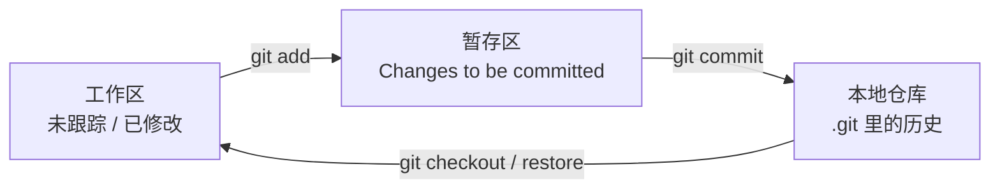

# Git 入门与安装配置

> **文件编码**：UTF-8。终端命令在 **PowerShell** 下执行。

---

## 0. 读前导读（零基础也能跟上）

### 0.1 用一句话弄懂本章

**Git** = 你电脑上的「**游戏存档系统**」——每次 `commit` 存一个**可命名的存档点**，改坏了可以读档回到任意历史版本；`.git` 文件夹就是**整个存档库**，删了等于删档。

**生活类比总表**：

| Git 概念 | 游戏存档类比 |
|----------|--------------|
| **工作区** | 当前正在玩的这一局（还没存盘） |
| **暂存区（staging）** | 「存盘界面里勾选要保存哪些进度」 |
| **commit** | 按下「存档 1 / 存档 2」，写入硬盘 |
| **git log** | 存档列表，看第几次存档、谁存的、备注啥 |
| **.gitignore** | 「这些临时文件别进存档」（如 node_modules 垃圾） |
| **分支（03 章）** | 平行宇宙存档线，主线 + 试玩支线 |
| **GitHub / Gitee** | 云存档备份（04 章 push） |

**与网络章节的区别**：Git 管**代码历史**，不管 TCP/HTTP；但 `git clone github.com` 时也要 DNS 解析——那是 计网 03 章的事。

### 0.2 你需要提前知道什么

| 能力 | 要求 | 不会怎么办 |
|------|------|------------|
| 文件夹、复制粘贴 | 会 | — |
| VS Code / Cursor 打开项目 | 会 | File → Open Folder |
| 命令行 `cd` 进目录 | 会基本即可 | 跟 §5 路径复制 |
| HTML / Vue | **不要求** | 有 shop-vue 更好，可同步 init |
| GitHub 账号 | **不要求** | 04 章再注册 |

**和 HTML 11 的关系**：[HTML 11](../HTML%20CSS%20JS/11-前端工程化调试Git与包管理基础.md) 可能提过 `git status`；本章从**安装、配置、第一次 commit** 补全基础。

### 0.3 本章知识地图（学完后应能勾选全部 ☐→☑）

```text
☐ git --version 有输出，Git 已进 PATH
☐ 已配置 user.name 与 user.email
☐ 能解释工作区、暂存区、版本库三区
☐ 会 git init / status / add / commit / log --oneline
☐ 知道 .git 是什么，不会乱删
☐ 会写基础 .gitignore（含 node_modules、.env）
☐ 能在 Cursor Source Control 完成一次 commit
☐ 能区分 Git（软件）与 GitHub/Gitee（网站）
☐ 能一句话对比 Git 与 SVN
```

### 0.4 建议学习时长与节奏

| 阶段 | 内容 | 时间 |
|------|------|------|
| 安装 + 配置 | §2～§3 | 30 分钟 |
| 第一个仓库 | §5 全流程 | 45 分钟 |
| GUI 面板 | §6 | 20 分钟 |
| 深入 + 练习 | §8～§14 | 40 分钟 |

**第一天目标**：`git-practice` 仓库至少 **2 条 commit**，working tree clean。

### 0.5 学完本章你能做什么（可验证的具体动作）

1. 新建空文件夹 → init → 写 `.gitignore` → 首次 commit → `git log --oneline` 看到记录。
2. 向同学演示：为什么改两个文件可以**分两次 commit**（暂存区的作用）。
3. `git status` 看到 `node_modules` **不应出现**（ignore 生效）。
4. 5 分钟内向他人演示完整 init 流程（不看书）。
5. 明确回答：Git ≠ GitHub，commit 作者信息来自哪条 config。

---

## 本章与上一章的关系

[00 路线图](./00-学习路线图与说明.md) 告诉你 Git 在全栈学习里的位置、和 GitHub/Gitee 的区别、以及 shop-vue / java-demo 的演进节奏。你在 [HTML CSS JS 11](../HTML%20CSS%20JS/11-前端工程化调试Git与包管理基础.md) 里可能已敲过 `git status`，但**未必装对、配对人名邮箱、或理解 `.git` 是什么**。

这一章你要完成：

1. 在 **Windows** 上安装 Git，PowerShell 里 `git --version` 有版本号
2. 全局配置 `user.name` 和 `user.email`（**每个 commit 都会带上**）
3. 新建练习目录，`git init`，观察 `.git` 文件夹
4. 完成**第一次 commit**，并配置 `.gitignore`
5. 会用 VS Code / Cursor **Source Control** 面板做基础操作
6. 知道 Git 和 SVN 的简要区别，面试能答一句

若你正在学 [Vue 01](../Vue/01-Vue入门与环境搭建.md)，可在 `shop-vue` 目录里**同步**做本章流程——两章产出是同一个「已 init 并首 commit 的项目」。

---

## 1. Git 是什么（再巩固一次）

Git 是**分布式**版本控制系统（VCS，Version Control System）。「分布式」意思是：**每个开发者电脑上都有一份完整的仓库历史**，不依赖中央服务器也能 commit、看 log、切分支。

### 1.1 三个区域（必须建立直觉）

| 区域 | 英文 | 你做什么 | Git 命令 |
|------|------|----------|----------|
| **工作区** | Working Directory | 用编辑器改文件 | 直接保存 |
| **暂存区** | Staging Area / Index | 挑选「下次提交要包含哪些改动」 | `git add` |
| **版本库** | Repository | 永久快照（commit） | `git commit` |



**为什么要有暂存区？** 见 §8.1 深入解释——这是 Git 和 SVN 等工具的重要差异。

### 1.2 本机 Git vs 远程仓库

- **本机**：`.git` 目录存所有历史（02 章会频繁读写）
- **远程**：GitHub / Gitee 上的 bare 仓库（04 章 `git push`）

初学阶段**只操作本机**即可；远程不着急。

---

## 2. 在 Windows 上安装 Git

### 2.1 下载

1. 打开 https://git-scm.com/download/win
2. 64-bit 安装包会自动下载（或选 **64-bit Git for Windows Setup**）
3. 国内也可搜「Git 淘宝镜像」加速（可选）

### 2.2 安装向导（推荐选项）

| 步骤 | 建议 |
|------|------|
| 安装路径 | 默认 `C:\Program Files\Git` |
| 组件 | 勾选 **Git Bash**、**Git from the command line and also from 3rd-party software** |
| 默认编辑器 | 选 **Use Visual Studio Code as Git's default editor**（或 Notepad++） |
| 分支名 | **Let Git decide** 或 **Override：main**（本资料默认 `main`） |
| PATH | **Git from the command line...**（PowerShell 能用 `git`） |
| HTTPS | **Use the OpenSSL library** 默认即可 |
| 换行符 | **Checkout Windows-style, commit Unix-style**（`core.autocrlf=true`） |
| 终端 | **Use Windows' default console window** 或 MinTTY 均可 |
| `git pull` | **Default (merge)** 即可 |
| 凭证 | **Git Credential Manager**（推 GitHub 时省事） |
| 其他 | 默认 Next |

安装完成后**关闭并重新打开** PowerShell（旧窗口读不到新 PATH）。

### 2.3 验证安装

```powershell
git --version
```

**预期输出**：

```text
git version 2.43.0.windows.1
```

（版本号 2.4x 均可，不必与示例完全一致。）

```powershell
where.exe git
```

**预期输出**（路径可能不同）：

```text
C:\Program Files\Git\cmd\git.exe
```

---

## 3. 首次配置：你是谁

每次 commit 都会记录**作者名**和**邮箱**。远程平台（Gitee/GitHub）靠邮箱关联你的账号。

### 3.1 全局配置（推荐初学者）

```powershell
git config --global user.name "你的昵称或真名"
git config --global user.email "your@email.com"
```

**Gitee/GitHub 建议**：邮箱用**注册平台的邮箱**，便于网页上显示头像和贡献图。

### 3.2 查看配置

```powershell
git config --global --list
```

**预期输出示例**：

```text
user.name=张三
user.email=zhangsan@example.com
core.autocrlf=true
```

```powershell
git config user.name
git config user.email
```

**预期输出**：

```text
张三
zhangsan@example.com
```

### 3.3 配置文件存在哪

| 级别 | 文件位置 | 作用范围 |
|------|----------|----------|
| `--system` | `C:\Program Files\Git\etc\gitconfig` | 整机 |
| `--global` | `C:\Users\你的用户名\.gitconfig` | 你所有仓库 |
| `--local` | 仓库内 `.git\config` | 仅当前项目 |

**单项目用不同邮箱**（公司 vs 个人）：

```powershell
cd f:\study\projects\company-project
git config user.email "work@company.com"
```

不加 `--global` 即只写进当前仓库的 local 配置。

### 3.4 其他常用全局配置（可选）

```powershell
git config --global init.defaultBranch main
git config --global core.quotepath false
```

- `init.defaultBranch`：新建仓库默认分支叫 `main` 而不是 `master`
- `core.quotepath false`：中文文件名在 `git status` 里正常显示，不乱码

---

## 4. Git vs SVN（简要对比）

| 对比项 | Git | SVN（Subversion） |
|--------|-----|-------------------|
| 架构 | 分布式，每人完整历史 | 集中式，强依赖中央服务器 |
| 分支 | 轻量、常用 | 相对重，分支目录复制 |
| 离线 | 可离线 commit、看 log | 多数操作要联网 |
| 暂存区 | 有 `git add` 两阶段提交 | 无，改完直接 commit |
| 行业现状 | 绝对主流 | 老项目维护 |
| 本资料 | ✅ 只教 Git | 知道即可 |

**面试一句话**：「Git 是分布式、分支便宜、有暂存区；SVN 集中式，适合早年单主干流程，新项目选 Git。」

---

## 5. 第一个仓库：手把手全流程

下面在 `f:\study\projects\git-practice` 从零跟做。目录可自定，路径统一即可。

### 5.1 创建项目目录与文件

```powershell
mkdir f:\study\projects\git-practice
cd f:\study\projects\git-practice
```

用 VS Code / Cursor 打开该文件夹，新建 `README.md`：

```markdown
# git-practice

Git 01 章练习仓库。
```

新建 `index.html`：

```html
<!DOCTYPE html>
<html lang="zh-CN">
<head>
  <meta charset="UTF-8" />
  <meta name="viewport" content="width=device-width, initial-scale=1.0" />
  <title>Git 练习页</title>
</head>
<body>
  <h1>Hello Git</h1>
  <p>第一次 commit 前的页面。</p>
</body>
</html>
```

保存时确认编辑器编码为 **UTF-8**。

### 5.2 初始化仓库 git init

```powershell
git init
```

**预期输出**：

```text
Initialized empty Git repository in F:/study/projects/git-practice/.git/
```

此时目录里多了一个隐藏文件夹 **`.git`**——这就是**本地版本库**，**不要手动删改**里面文件。

#### 5.2.1 查看 .git 目录（了解即可）

```powershell
Get-ChildItem -Force .git
```

**预期输出**（部分）：

```text
    Directory: F:\study\projects\git-practice\.git

Mode                 LastWriteTime         Length Name
----                 -------------         ------ ----
d-----          ...                            hooks
d-----          ...                            info
d-----          ...                            objects
d-----          ...                            refs
-a----          ...                            HEAD
-a----          ...                            config
-a----          ...                            description
```

| 子目录/文件 | 作用（入门只需知道） |
|-------------|----------------------|
| `objects/` | 所有 commit 的文件快照（压缩存储） |
| `refs/` | 分支、标签指针 |
| `HEAD` | 当前所在分支的指针 |
| `config` | 本仓库配置（remote 等，04 章用） |

**为什么 .git 不能乱删？** 见 §8.2——删了等于丢掉全部历史。

### 5.3 查看状态 git status

```powershell
git status
```

**预期输出**：

```text
On branch main

No commits yet

Untracked files:
  (use "git add <file>..." to include in what will be committed)
        README.md
        index.html

nothing added to commit but untracked files present (use "git add" to track)
```

关键词：

- **Untracked**：Git 发现了文件，但还没纳入版本管理
- **No commits yet**：还没有任何历史快照

### 5.4 配置 .gitignore（在第一次 add 之前）

新建 `.gitignore`（与 `README.md` 同级）：

```gitignore
# 操作系统
.DS_Store
Thumbs.db
desktop.ini

# 编辑器
.vscode/
.idea/
*.swp
*~

# 日志与临时
*.log
.tmp/

# Node（以后 shop-vue 会用到，先写上）
node_modules/
dist/
.env
.env.local
```

**为什么要 .gitignore？** 见 §8.3——避免把依赖、密钥、编译产物提交进历史。

```powershell
git status
```

**预期**：`.gitignore` 本身会出现在 Untracked 里；若你创建了 `node_modules` 测试目录，应**不会**出现在列表中。

### 5.5 添加到暂存区 git add

```powershell
git add README.md index.html .gitignore
```

或一次性添加当前目录所有**未被 ignore** 的文件：

```powershell
git add .
```

**注意**：`.` 表示「当前目录下所有改动」，**不会**添加 `.gitignore` 里规则匹配的文件。

```powershell
git status
```

**预期输出**：

```text
On branch main

No commits yet

Changes to be committed:
  (use "git rm --cached <file>..." to unstage)
        new file:   .gitignore
        new file:   README.md
        new file:   index.html
```

绿色 **Changes to be committed** = 已在暂存区，等待 commit。

### 5.6 第一次提交 git commit

```powershell
git commit -m "chore: init git-practice project"
```

**预期输出**：

```text
[main (root-commit) a1b2c3d] chore: init git-practice project
 3 files changed, 25 insertions(+)
 create mode 100644 .gitignore
 create mode 100644 README.md
 create mode 100644 index.html
```

- `a1b2c3d`：本次 commit 的**短哈希**（唯一 ID）
- `root-commit`：这是仓库的**第一个** commit

```powershell
git status
```

**预期输出**：

```text
On branch main
nothing to commit, working tree clean
```

**working tree clean** = 工作区与最新 commit 一致，是「干净」状态。

### 5.7 查看历史 git log

```powershell
git log
```

**预期输出**（作者、时间、哈希为你自己的）：

```text
commit a1b2c3d4e5f6789012345678901234567890abcd (HEAD -> main)
Author: 张三 <zhangsan@example.com>
Date:   Wed Jun 18 2026 10:30:00 +0800

    chore: init git-practice project
```

退出 log 分页：按 **`q`**。

```powershell
git log --oneline
```

**预期输出**：

```text
a1b2c3d (HEAD -> main) chore: init git-practice project
```

### 5.8 在 shop-vue 上重复（可选但强烈推荐）

若已按 [Vue 01](../Vue/01-Vue入门与环境搭建.md) 创建 `shop-vue`：

```powershell
cd f:\study\projects\shop-vue
git init
git add .
git commit -m "chore: init shop-vue via create-vue"
```

脚手架可能自带 `.gitignore`（已含 `node_modules`），**不要**再提交依赖目录。

---

## 6. VS Code / Cursor 的 Git 面板

图形界面和命令行**操作的是同一个 Git**，任选或混用。

### 6.1 打开 Source Control

- 左侧活动栏 **分支图标**（Source Control）
- 快捷键 `Ctrl + Shift + G`

未 init 的文件夹会提示 **Initialize Repository**，等价 `git init`。

### 6.2 面板里各区域含义

| UI 元素 | 对应命令 | 说明 |
|---------|----------|------|
| Changes 下列出的文件 | 工作区改动 | 改过的、未 add 的 |
| 文件旁 `+` | `git add <file>` | 暂存单个文件 |
| Changes 上方 `+`（Stage All） | `git add .` | 暂存全部 |
| Staged Changes | 暂存区 | 即将 commit 的内容 |
| 输入框 + ✓ | `git commit -m "..."` | 写消息并提交 |
| `...` 菜单 | log、pull、push 等 | 04 章常用 push |
| 左下角分支名 | 当前分支 | 默认 `main` |

### 6.3 推荐工作流（初学）

1. 改代码 → 保存
2. Source Control 看 diff（点文件可看左右对比）
3. Stage 需要的文件（不要误 add `.env`）
4. 写 commit message → Commit
5. 复杂操作用终端（reset、stash 等 02 章学）

### 6.4 集成终端

``Ctrl + ` `` 打开终端，默认在项目根目录，直接敲 `git status` 与面板状态应一致。

### 6.5  diff 视图与行内 blame（预览）

在 Source Control 中点击已修改文件：

- **左侧**：上次 commit 的版本
- **右侧**：当前工作区
- 红色竖条：删除；绿色：新增

行尾 **blame**（需 GitLens 插件，可选）显示「这行谁在哪次 commit 改的」——02 章 `git log -p` 的图形版。

### 6.6 初始化仓库的两种入口

| 方式 | 步骤 |
|------|------|
| 终端 | `git init` |
| Cursor | Source Control → **Initialize Repository** |

两者等价；初始化后左侧会出现 **U**（Untracked）标记的文件。

### 6.7 提交后左下角变化

commit 成功后：

- Changes 列表清空
- 左下角分支旁可能短暂显示 ✓
- `git log --oneline` 与面板历史一致

若面板仍显示 staged 文件，点 **Refresh** 或重开文件夹。

---

## 7. PowerShell 与 Git Bash 说明

本资料默认 **PowerShell**（Windows 11 自带）。Git 安装后也会带 **Git Bash**（类 Linux 终端）。

| 特性 | PowerShell | Git Bash |
|------|------------|----------|
| 路径 | `f:\study\projects` | `/f/study/projects` |
| 清屏 | `cls` | `clear` |
| 列出文件 | `Get-ChildItem` 或 `dir` | `ls` |
| Git 命令 | 完全相同 | 完全相同 |

**复制本资料命令时**：PowerShell 直接粘贴即可；Git Bash 需把反斜杠路径改为正斜杠或 `/f/...`。

示例（同一操作）：

```powershell
# PowerShell
cd f:\study\projects\git-practice
git status
```

```bash
# Git Bash
cd /f/study/projects/git-practice
git status
```

公司文档若指定 Git Bash，只换 shell，**Git 子命令不变**。

---

## 8. 常用命令速查（本章范围）

| 命令 | 作用 |
|------|------|
| `git init` | 当前目录变为 Git 仓库 |
| `git status` | 工作区 / 暂存区状态 |
| `git add <file>` | 暂存指定文件 |
| `git add .` | 暂存当前目录改动 |
| `git commit -m "msg"` | 提交快照 |
| `git log` | 查看历史 |
| `git log --oneline` | 单行历史 |
| `git config --global ...` | 全局配置 |

02 章会加：`diff`、`restore`、`reset`、`stash` 等。

---

## 9. 第一次 commit 完整终端实录（可复制对照）

下面是一次**从零到 clean** 的完整 PowerShell 会话（哈希与作者信息为你本机实际值）：

```powershell
PS F:\> mkdir f:\study\projects\git-practice

PS F:\study\projects\git-practice> git init
Initialized empty Git repository in F:/study/projects/git-practice/.git/

PS F:\study\projects\git-practice> git status
On branch main
No commits yet
Untracked files:
  (use "git add <file>..." to include in what will be committed)
        README.md
        index.html
nothing added to commit but untracked files present (use "git add" to track)

PS F:\study\projects\git-practice> git add .
PS F:\study\projects\git-practice> git status
On branch main
No commits yet
Changes to be committed:
  (use "git rm --cached <file>..." to unstage)
        new file:   README.md
        new file:   index.html

PS F:\study\projects\git-practice> git commit -m "chore: init git-practice project"
[main (root-commit) 7f3a9c2] chore: init git-practice project
 2 files changed, 18 insertions(+)
 create mode 100644 README.md
 create mode 100644 index.html

PS F:\study\projects\git-practice> git status
On branch main
nothing to commit, working tree clean

PS F:\study\projects\git-practice> git log --oneline
7f3a9c2 (HEAD -> main) chore: init git-practice project
```

**对照要点**：

- `root-commit` 只出现在第一次
- commit 后 `Untracked` / `Changes to be committed` 都应消失
- 若卡在 `Author identity unknown`，回到 §3 配 name/email

---

## 10. java-demo 初始化补充（后端同学）

若你按 [Java 00](../../后端学习/Java/00-学习路线图与说明.md) 创建了 Spring Boot 项目：

```powershell
cd f:\study\projects\java-demo
git init
```

新建或合并 `.gitignore`（至少包含）：

```gitignore
target/
.idea/
*.iml
*.log
application-local.yml
.env
```

```powershell
git add .
git status
# 确认没有 target/ 下 .class
git commit -m "chore: init spring boot java-demo"
```

前后端**两个仓库**分别 push（04 章），联调时 commit message 可互引：`feat(api): user login for shop-vue #issue-12`。

---

## 11. 深入解释：三个「为什么」

### 8.1 为什么 Git 要有暂存区（staging area）？

**场景**：你同时改了 `index.html`（已完成）和 `app.js`（改了一半、还不能跑）。若像 SVN 一样「保存即提交」，一次 commit 会把**半成品**和**成品**绑在同一快照里，回滚时很难只撤一部分。

Git 的设计：

1. 所有改动先留在**工作区**
2. 用 `git add` **挑选**本次要发布的文件 → 暂存区
3. `git commit` 只把暂存区做成快照

这样同一轮开发可以：

```powershell
git add index.html
git commit -m "feat: update landing page"
# app.js 仍在工作区 modified，下次再 add/commit
```

**小案例**：改 3 个文件，只 add 2 个 → `git status` 会同时显示 staged 和 unstaged，清晰可控。

### 8.2 为什么 .git 目录不能乱删、不要手改？

`.git` 里是 Git 的**数据库**：objects 存内容，refs 存分支指针，logs 存 reflog。你删 `.git` = **抹掉整个仓库历史**，远程没 push 的话无法恢复。

**可以删吗？** 只有当你确定「不要版本控制了、只要普通文件夹」时，才删 `.git`（或 `rm -rf .git`）。**永远不要**为了「减小体积」乱删 objects。

**手改 config？** 可以改 `remote` URL 等简单项，但别改 objects；出错用 `git fsck` 排查（进阶）。

### 8.3 为什么必须配置 .gitignore？

| 若提交了… | 后果 |
|-----------|------|
| `node_modules/` | 仓库体积爆炸（几万文件），clone 极慢 |
| `.env` 含 API 密钥 | **泄露 secrets**，GitHub 会扫密钥封号 |
| `dist/` 编译产物 | 无意义 diff，合并冲突多 |
| `.vscode/` 个人路径 | 队友 IDE 配置被覆盖 |

`.gitignore` 规则：**从未被 track 的文件**会被忽略；若已经 commit 过，需 `git rm --cached`（02 章）。

Node / Vue 官方模板通常已带好 `.gitignore`，**init 后先打开看一眼**再 `git add .`。

---

## 12. commit 消息入门（Conventional Commits 预告）

02 章会系统讲，本章先养成习惯：

```text
<type>: <简短说明>

常见 type：
  feat     新功能
  fix      修 bug
  chore    构建/工具/无关业务（如 init）
  docs     只改文档
  style    格式（不影响逻辑）
  refactor 重构
```

示例：

```text
chore: init git-practice project
feat: add product list page
fix: correct login form validation
```

**原则**：动词原形、说清「做了什么」、一条 commit 一件事。

---

## 13. 本章知识点清单（可自查）

- [ ] `git --version` 有输出
- [ ] 配置了 `user.name` 和 `user.email`
- [ ] 能解释工作区、暂存区、版本库
- [ ] 会 `git init`、`git status`、`git add`、`git commit`
- [ ] 知道 `.git` 是什么，不会乱删
- [ ] 会写基础 `.gitignore`
- [ ] 能在 VS Code / Cursor Source Control 里 commit
- [ ] 能区分 Git 与 GitHub / Gitee
- [ ] 能一句话对比 Git 与 SVN

---

## 14. 分级练习

**基础**：在 `git-practice` 里改 `index.html` 标题为「Git 练习 v2」，commit 消息 `docs: update page title`。

**进阶**：新建 `notes.txt` 写入学习日期，但**故意**先 `git add notes.txt` 再发现写错内容——用 `git restore --staged notes.txt` 取消暂存（02 章详讲），改对后再 commit。

**挑战**：在 `shop-vue`（或任意 Node 项目）执行 `npm install` 后 `git status`，确认 `node_modules` **未**出现；若出现，检查 `.gitignore` 是否含 `node_modules/`。

### 14.1 参考答案（基础）

```powershell
# 修改 index.html 后
git status
git add index.html
git commit -m "docs: update page title"
git log --oneline
```

**预期 log**：

```text
b2c3d4e (HEAD -> main) docs: update page title
a1b2c3d chore: init git-practice project
```

### 14.2 参考答案（进阶）

```powershell
echo "错误内容" > notes.txt
git add notes.txt
git status
# 应看到 notes.txt 在 Changes to be committed

git restore --staged notes.txt
git status
# notes.txt 回到 Untracked 或 modified，不在 staged

echo "2026-06-18 学习 Git 01" > notes.txt
git add notes.txt
git commit -m "docs: add study notes"
```

### 14.3 参考答案（挑战）

```powershell
cd f:\study\projects\shop-vue
npm install
git status
```

**预期**：不应列出 `node_modules/`。若列出：

```powershell
# 检查 .gitignore
Select-String -Path .gitignore -Pattern "node_modules"
# 若无，添加 node_modules/ 后：
git add .gitignore
git commit -m "chore: ignore node_modules"
```

---

## 15. 常见报错与排查

| 报错信息（关键词） | 可能原因 | 解决方案 |
|-------------------|---------|---------|
| `'git' 不是内部或外部命令` | 未安装或未进 PATH | 重装 Git，勾选 PATH；重启 PowerShell |
| `git version` 无输出 | 安装损坏 | 控制面板卸载后重装 |
| `Author identity unknown` / `empty ident` | 未配置 user.name/email | `git config --global user.name/email` |
| `fatal: not a git repository` | 当前目录没有 `.git` | `cd` 到项目根或 `git init` |
| `fatal: pathspec 'xxx' did not match` | add 的文件名错或不存在 | 检查路径、大小写 |
| `nothing to commit, working tree clean` | 没有新改动 | 先改文件再 status |
| `Untracked files` 一直有 node_modules | 缺少 .gitignore | 添加 `node_modules/` |
| 中文文件名乱码 | quotepath | `git config --global core.quotepath false` |
| `LF will be replaced by CRLF` | Windows 换行提示 | 正常警告；或设 `core.autocrlf` |
| `failed to push`（本章不应出现） | 尚未学 remote | 04 章再处理；本章只做本地 |
| Cursor/VS Code 不显示 Git | 未打开文件夹 | File → Open Folder 打开项目根 |
| 提交了 .env 到历史 | 未 ignore 就 add | 02 章 `git rm --cached`；密钥需轮换 |
| `Please tell me who you are` | 同 identity unknown | 配置 name/email 后重试 commit |

---

## 16. FAQ

**Q：要用 Git Bash 还是 PowerShell？**  
本资料用 **PowerShell**；Git Bash 是 Linux 风格 shell，命令多数相同。公司文档指定哪个用哪个。

**Q：defaultBranch 用 main 还是 master？**  
新项目用 **main**；老仓库可能仍是 master，不强行改名。

**Q：一个文件夹能 init 两次吗？**  
已有 `.git` 时再 `git init` 会提示 re-init，一般**不要**重复。

**Q：Git 面板和命令行冲突吗？**  
不冲突；同时操作注意刷新。习惯 **status 以终端为准** 排查问题。

**Q：需要学 GitHub Desktop 吗？**  
可选；会 CLI + VS Code 面板足够。Desktop 适合纯图形党。

**Q：java-demo 怎么 init？**  
在 Spring Boot 项目根目录（含 `pom.xml`）同样 `git init`，`.gitignore` 忽略 `target/`、`.idea/`（02 章模板）。

---

## 17. 学完标准

完成本章后，你应能**不看文档**完成：

1. 新目录 → `git init` → 写 `.gitignore` → `git add` → `git commit`
2. 说出三区模型，并解释「为什么要 git add 两次才 commit」
3. `git log --oneline` 看到自己至少 **2 条** commit
4. 在 Source Control 里完成一次 commit
5. 明确 Git（软件）≠ GitHub/Gitee（网站）

**量化自检**：

- [ ] 练习仓库 ≥ 2 commits
- [ ] `.gitignore` 含 `node_modules/`、`dist/`、`.env`
- [ ] 全局 user.name / user.email 已设
- [ ] 能向他人演示一次完整 init 流程（5 分钟内）

---

## 19. 闭卷自测（10 题）

### 概念题（6 题）

1. Git 三区模型：工作区、暂存区、版本库各是什么？用**游戏存档**类比各一句。
2. 为什么 Git 要有暂存区，不能像「保存即提交」一步到位？
3. `git config --global user.name/email` 写在哪个文件？commit 里哪里能看到？
4. `.gitignore` 里写 `node_modules/` 的作用？若已 commit 过 node_modules 怎么办（02 章预告）？
5. Git 与 GitHub/Gitee 的区别？Git 与 SVN 架构差异一句话。
6. `.git` 目录能否删除？删了会怎样？

### 动手题（2 题）

7. 写出从零到首次 commit 的命令序列（至少 4 条）。
8. `git status` 显示 `Changes to be committed` 绿色区域表示什么？

### 综合题（2 题）

9. 在 Source Control 里 Stage 单个文件对应什么命令？Commit 按钮对应什么？
10. 练习仓库 `working tree clean` 是什么状态？如何达到？

### 自测参考答案

**1.** 工作区=当前编辑；暂存区=勾选要存的内容；版本库=.git 里永久快照；类比见 §0.1 表。

**2.** 可挑选部分文件一次 commit，避免半成品和成品绑在同一存档。

**3.** `C:\Users\用户名\.gitconfig`；`git log` 的 Author 行。

**4.** 忽略依赖目录不进入版本库；需 `git rm --cached`（02 章）。

**5.** Git 是本地软件；GitHub/Gitee 是托管网站；Git 分布式，SVN 集中式。

**6.** 不能乱删；删 `.git` = 丢失全部历史，变普通文件夹。

**7.** `git init` → 建文件 → `git add .` → `git commit -m "..."`

**8.** 文件已在**暂存区**，下次 commit 会包含。

**9.** Stage → `git add <file>`；Commit → `git commit -m`

**10.** 工作区与最新 commit 一致；改文件 add+commit 或 restore 丢弃改动。

---

## 20. 费曼检验：3 分钟讲给零基础朋友

**对照是否讲到：**

1. **Git 像游戏存档**：改代码是玩；add 是勾选要存啥；commit 是按下存档；log 是存档列表。
2. **`.git` 是存档库本体**，别删；`.gitignore` 是「这些别进存档」。
3. **Git ≠ GitHub**：软件在本机；网站是云备份（04 章 push）。

---

## 20.1 安装验证步骤表

| 步骤 | 命令 | 预期 | 若不对 |
|------|------|------|--------|
| 1 | `git --version` | `git version 2.x` | §15 重装 + PATH |
| 2 | `where.exe git` | `...\Git\cmd\git.exe` | 重启 PowerShell |
| 3 | `git config --global user.name` | 你的昵称 | §3 配置 |
| 4 | `git init` 在练习目录 | `Initialized empty...` | cd 到正确文件夹 |
| 5 | 首次 commit 后 `git log --oneline` | 一行 hash + message | 检查 add / identity |

---

## 20.2 `.gitignore` 逐行读（shop 通用）

| 规则 | 含义 | 改错会怎样 |
|------|------|------------|
| `node_modules/` | 依赖目录 | 提交后 clone 极慢、体积爆炸 |
| `dist/` | 构建产物 | 无意义 diff、冲突多 |
| `.env` | 本地密钥 | **泄露 API Key** |
| `.vscode/` | 个人 IDE | 队友配置被覆盖 |
| `*.log` | 日志 | 仓库噪音 |

---

## 20.3 SVN 用户迁移 Git 对照（了解）

| 你习惯的 SVN | Git 等价 |
|--------------|----------|
| `svn commit` | `git add` + `git commit` |
| `svn update` | `git pull`（04 章） |
| 中央服务器必须在线才能 commit | 本地可 offline commit |
| 分支是目录复制 | 分支是指针，轻量（03 章） |

---

## 20.4 第一次 commit 常见心理误区

| 误区 | 真相 |
|------|------|
| 「commit 会上传到网上」 | 01 章仅**本地** `.git`，push 才上网 |
| 「message 随便写」 | 02 章 Conventional Commits 救未来的你 |
| 「node_modules 也要备份」 | 必须 ignore，用 `npm install` 还原 |
| 「.git 可以压缩删了」 | 删 `.git` = 删全部历史 |

---

## 20.5 模拟面试：Git 入门五问

1. **三区模型？** → 工作区 / 暂存区 / 版本库；游戏存档类比。  
2. **为何 git add？** → 挑选本次 commit 内容，两阶段提交。  
3. **user.email 作用？** → 写入 commit 作者，关联 GitHub/Gitee。  
4. **.gitignore 不生效？** → 文件已被 track，需 rm --cached（02 章）。  
5. **Git vs GitHub？** → 本地软件 vs 托管网站。

---

## 20.6 本章总复习清单

1. `git --version` + 全局 name/email 已配置。  
2. `git-practice` ≥2 commits，含 `.gitignore`。  
3. Source Control 完成 1 次 GUI commit。  
4. 向他人 5 分钟演示 init 流程。  
5. 闭卷自测 ≥8/10。  
6. 解释暂存区（游戏存档勾选界面）。  
7. 确认 `npm install` 后 status 无 node_modules。  
8. 费曼：Git 是本地存档，不是 GitHub。

---

## 20.7 附录：Git 入门一句话口语总结

- **Git** = 游戏存档，存在 `.git` 文件夹里。  
- **工作区** = 正在玩的一局。  
- **暂存区** = 存盘前勾选要保存的项目。  
- **commit** = 按下存档，写一句备注。  
- **git add** = 勾选；**git status** = 看还有啥没存。  
- **.gitignore** = 告诉 Git 哪些垃圾别进存档。  
- **user.email** = 存档上署名，关联 GitHub 头像。  
- **Git** 在本机；**push** 才是上传云（04 章）。  
- **不要提交** node_modules 和 .env，永远。

---

## 20.8 扩展 FAQ（Windows 向）

**Q：Git 安装时选 main 还是 master？**  
选 **main**，与 GitHub 默认一致。

**Q：LF will be replaced by CRLF 要管吗？**  
Windows 正常提示；团队跨平台可配 `.gitattributes`（05 章预览）。

**Q：Cursor 和 VS Code 的 Git 一样吗？**  
一样，都调同一个 `git.exe`；面板操作等价。

**Q：可以两个项目共用一个 .git 吗？**  
不可以；每个项目根目录一个 `.git`。

**Q：commit 后能改作者吗？**  
未 push 可 amend；已 push 勿改历史，初学避免。

**Q：java-demo 和 shop-vue 要同一个仓库吗？**  
不要；前后端**两个仓库**，04 章分别 push，联调用 commit message 互引 issue。

**Q：`.git` 很大怎么办？**  
勿乱删 objects；大文件误提交用 BFG 或 filter-repo（进阶），预防靠 `.gitignore`。

*本章已按 EXPANSION-STANDARD 扩充（§0+Git=游戏存档类比+自测+费曼+总复习）。*

**EXPANSION-STANDARD 自检**：☑ §0 导读 ☑ 安装步骤表 §20.1 ☑ ignore 逐行读 §20.2 ☑ 闭卷 10 题 ☑ 费曼 ☑ Windows FAQ §20.8 ☑ SVN 迁移对照 §20.3

| 扩充项 | 所在 § |
|--------|--------|
| Git=游戏存档 | §0.1 |
| 三区模型 | §1.1 |
| 首次 commit 全流程 | §5 |
| Source Control | §6 |
| 闭卷自测 | §19 |
| 费曼检验 | §20 |

---

## 21. 下一章预告

01 章你已经在本机有了仓库、会 status / add / commit、会看 log 一行版。但真实开发会频繁遇到：**改错了怎么撤？add 多了怎么 unstage？历史太长怎么查？改了一半要切分支怎么办？**

下一章（**02 本地版本控制核心操作**）系统讲 `git diff`、`git restore`、`git reset`（soft/mixed/hard）、`git revert`、`git stash`，以及 **Conventional Commits** 与 Node/Vue/React 通用 `.gitignore` 模板——让你在 shop 项目里敢改、敢提交、敢回滚。

---

*下一章：[02 本地版本控制核心操作](./02-本地版本控制核心操作.md)*
