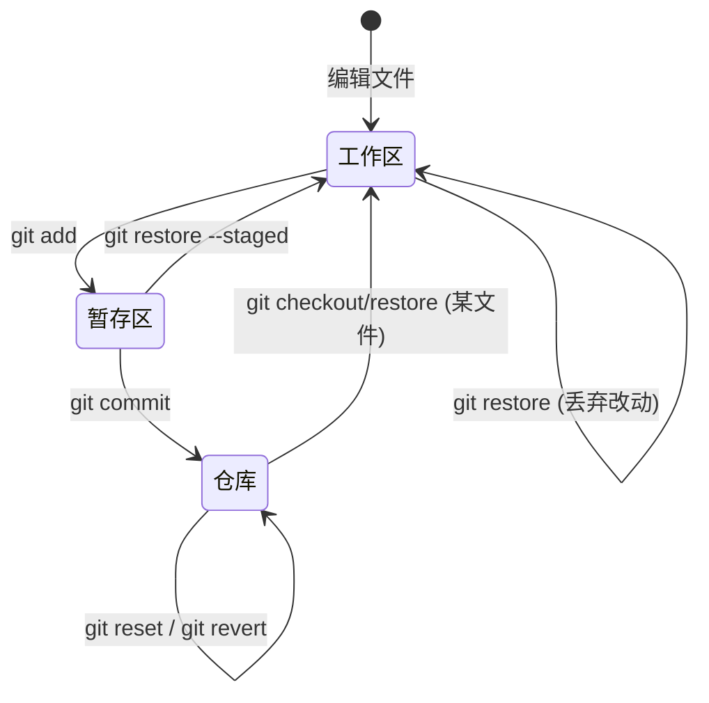
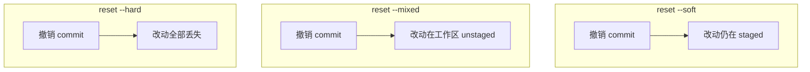

# 本地版本控制核心操作

> **文件编码**：UTF-8。终端命令在 **PowerShell** 下执行。

---

## 0. 读前导读（零基础也能跟上）

### 0.1 用一句话弄懂本章

在 [01 章](./01-Git入门与安装配置.md) 你会「存档」了；本章学 **改档、读档、删档、临时冻结**——像游戏里：看存档差异（diff）、读档到上一关（reset）、官方补丁撤销某次更新（revert）、切任务前把当前进度冻住（stash）。

**游戏存档类比延伸**：

| Git 操作 | 存档类比 |
|----------|----------|
| **git diff** | 对比「当前画面」和「上次存档」差在哪 |
| **git restore** | 放弃本局未存盘改动，回到上次存档内容 |
| **git restore --staged** | 存盘界面里取消勾选某个文件 |
| **reset --soft** | 撤销「存档 3」这次记录，但改动仍勾在存盘界面 |
| **reset --mixed** | 撤销记录，改动回到游戏里但未勾选 |
| **reset --hard** | **删档到上一关，本关进度全丢**（危险） |
| **git revert** | 不删历史，新增「反向补丁存档」——团队安全 |
| **git stash** | 暂停当前局，先去打别的副本，回来再 pop 恢复 |

### 0.2 你需要提前知道什么

| 前置 | 章节 | 必须？ |
|------|------|--------|
| init、add、commit、log | [01 章](./01-Git入门与安装配置.md) | ✅ 同一仓库继续练 |
| 至少 1 条 commit | 01 章 §5 | ✅ |
| shop-vue / git-practice | — | 强烈建议，勿新建空仓库 |

**01 章没完成？** 先做完首次 commit 再学本章，否则 `HEAD~1`、`diff` 无法练。

### 0.3 本章知识地图（学完后应能勾选全部 ☐→☑）

```text
☐ 能解释 git add 单文件 vs git add . 的风险
☐ 会用 Conventional Commits 写可读 message
☐ 会用 log --oneline --graph 与 git show
☐ 会用 diff / diff --staged 看行级改动
☐ 会用 restore 与 restore --staged
☐ 能口述 soft / mixed / hard reset 三列差异
☐ 知道何时 revert 而非 reset（已 push 场景）
☐ 会 stash / stash list / stash pop 全流程
☐ 能部署 Node/Java .gitignore 并用 git rm --cached
```

### 0.4 建议学习时长与节奏

| 阶段 | 内容 | 时间 |
|------|------|------|
| add + commit 规范 | §2～§3 | 40 分钟 |
| log + diff | §4～§5 | 45 分钟 |
| 撤销三板斧 | §6～§8 | 60 分钟 |
| stash + ignore | §9～§10 | 40 分钟 |

**警告**：`reset --hard` 只在**练习仓库、未 push** 时用；贴 §7.6 决策树在显示器旁。

### 0.5 学完本章你能做什么（可验证的具体动作）

1. 同一轮改动拆成 **2 个 type 不同的 commit**（如 feat + docs）。
2. 误 `git add .env` 后，用 `--staged` + `.gitignore` 修复且未 push 密钥。
3. 演示 **stash → 修 typo commit → pop** 完整流程。
4. 向队友解释：**已 push 的 bug 用 revert，不用 hard reset**。
5. 练习仓库 ≥ **5 条**规范 message 的 commit，log --graph 可读。

---

## 本章与上一章的关系

[01 章](./01-Git入门与安装配置.md) 你完成了 `git init`、首次 `commit`、`.gitignore` 初识和 Source Control 面板入门。日常开发里**80% 的时间**花在：改文件 → 看改了啥 → 暂存 → 提交 → 偶尔**撤销**或**临时存盘**。

若你已在 `shop-vue` / `shop-react` / `git-practice` 有至少 1 条 commit，本章**直接在同一仓库**继续练；不要新建空仓库，才有真实历史可以 log、diff、reset。

本章掌握：

1. `git add` 选文件 vs `git add .` 的区别与风险
2. **Conventional Commits** 写可读历史
3. `git log` / `--oneline` / `--graph` 查历史
4. `git diff` 看未暂存、已暂存、两次 commit 之间差异
5. `git restore` 丢弃工作区改动、`git restore --staged` 取消暂存
6. `git reset --soft|--mixed|--hard` 回退 commit（**hard 危险**）
7. `git revert` 用新 commit 抵消旧改动（公共分支安全）
8. `git stash` / `stash list` / `stash pop` 临时贮藏
9. Node / Vue / React / Java 常用 **`.gitignore` 模板**

---

## 1. 工作区、暂存区、仓库：操作地图



| 你想做什么 | 命令 |
|------------|------|
| 看哪些文件变了 | `git status` |
| 看具体改了哪几行 | `git diff` |
| 把改动放进暂存区 | `git add` |
| 取消暂存 | `git restore --staged <file>` |
| 丢弃工作区改动（未 add） | `git restore <file>` |
| 生成新快照 | `git commit` |
| 撤销最近一次 commit（保留改动） | `git reset --soft HEAD~1` |
| 撤销 commit + 取消暂存 | `git reset --mixed HEAD~1` |
| 彻底回到某 commit（危险） | `git reset --hard HEAD~1` |
| 公共分支上「反做」某 commit | `git revert <hash>` |
| 改到一半先存起来 | `git stash` |

---

## 2. git add：指定文件 vs 点号

### 2.1 git add 单个或多个文件

```powershell
git add src/App.vue
git add README.md CHANGELOG.md
```

**适用**：只想提交部分文件，其余 WIP（Work In Progress）留在工作区。

### 2.2 git add .

```powershell
git add .
```

含义：把**当前目录及子目录**下所有变更（新建、修改、删除）加入暂存区，**respect .gitignore**。

**风险**：若 `.gitignore` 不完整，可能误 add 敏感文件；若改了很多文件，一次全 stage 可能把**不该同 commit 的内容**绑在一起。

### 2.3 git add -A 与 git add -u（了解）

| 命令 | 范围 |
|------|------|
| `git add .` | 当前目录树下变更 |
| `git add -A` | 整个仓库所有变更（含删除） |
| `git add -u` | 只更新已跟踪文件的修改和删除，不含新文件 |

初学 **`git add .` + 仔细 `git status`** 足够。

### 2.4 交互式暂存（进阶预览）

```powershell
git add -p
```

逐块（hunk）询问是否 stage，适合大文件只提交部分改动。面试知道即可。

### 2.5 手把手：分两次 commit 同一轮改动

假设 `git-practice` 里同时改了 `index.html` 和 `notes.txt`：

```powershell
cd f:\study\projects\git-practice
# 编辑 index.html：加一行 <p>v2</p>
# 编辑 notes.txt：加一行学习笔记

git status
```

**预期**：

```text
Changes not staged for commit:
        modified:   index.html
        modified:   notes.txt
```

```powershell
git add index.html
git commit -m "feat: add v2 paragraph to index"
git add notes.txt
git commit -m "docs: update study notes"
git log --oneline
```

**预期 log**：

```text
c3d4e5f (HEAD -> main) docs: update study notes
b2c3d4e feat: add v2 paragraph to index
a1b2c3d chore: init git-practice project
```

**为什么分 commit？** 历史清晰，将来 `git revert` 或 cherry-pick 只影响单一功能。

---

## 3. git commit 与 Conventional Commits

### 3.1 基本用法

```powershell
git commit -m "feat: add user login form"
```

`-m` 后直接写标题；多行可用：

```powershell
git commit -m "fix: prevent double submit" -m "Add loading state on login button"
```

或不用 `-m`，会打开编辑器（01 章配置的 VS Code）写完整消息。

### 3.2 Conventional Commits 规范

格式：

```text
<type>(<scope>): <subject>

[optional body]

[optional footer]
```

| type | 何时用 | 示例 |
|------|--------|------|
| `feat` | 新功能 | `feat(cart): add quantity selector` |
| `fix` | 修 bug | `fix(auth): handle expired token` |
| `docs` | 文档 | `docs: update README install steps` |
| `style` | 格式、空格、无逻辑 | `style: format with prettier` |
| `refactor` | 重构 | `refactor(api): extract request helper` |
| `test` | 测试 | `test: add login unit test` |
| `chore` | 构建、依赖、工具 | `chore: upgrade vite to 5.1` |
| `perf` | 性能 | `perf: lazy load product images` |

**scope** 可选：模块名如 `cart`、`user`、`build`。

**与 shop 项目对齐示例**：

```text
feat(product): display list with v-for
feat(router): add /login route
fix(cart): correct total price calculation
chore: init shop-vue via create-vue
```

### 3.3 好 commit vs 坏 commit

| ❌ 坏 | ✅ 好 |
|-------|-------|
| `update` | `fix(nav): repair mobile menu toggle` |
| `改了一下` | `feat: add search filter on product list` |
| `aaa` | `chore: add .gitignore for node_modules` |
| 一次 commit 含 20 个无关功能 | 一个逻辑变更一条 commit |

**深入：为什么 commit 消息很重要？** 见 §12.1。

### 3.4 漏 add 文件后 amend（谨慎）

```powershell
git add forgotten-file.js
git commit --amend --no-edit
```

**仅用于**：commit **还没 push**、且是**你刚提交**的最后一次。已 push 再 amend 会改历史，需 force push（04 章再讲，初学避免）。

### 3.5 多行 commit 与编辑器

不加 `-m` 时 Git 打开默认编辑器：

```powershell
git commit
```

**预期**：VS Code / Cursor 打开临时文件，首行是标题，空行后可写 body：

```text
feat(nav): add mobile menu toggle

- Add hamburger icon on viewports below 768px
- Close menu on route change
```

保存并关闭编辑器窗口即完成 commit。若编辑器未弹出，检查：

```powershell
git config --global core.editor "code --wait"
```

### 3.6 breaking change 与 footer（了解）

大版本不兼容变更可在 footer 写：

```text
feat(api)!: remove legacy /v1/users endpoint

BREAKING CHANGE: clients must migrate to /v2/users
```

`!` 或 `BREAKING CHANGE:` 会触发 major 版本号 bump（配合 semantic-release 等工具，05 章预览）。

---

## 4. git log：读历史

### 4.1 完整 log

```powershell
git log
```

**预期**：每条含完整 hash、Author、Date、message。`q` 退出。

### 4.2 单行 log

```powershell
git log --oneline
```

**预期**：

```text
c3d4e5f (HEAD -> main) docs: update study notes
b2c3d4e feat: add v2 paragraph to index
a1b2c3d chore: init git-practice project
```

### 4.3 图形化分支（本章单分支也建议练）

```powershell
git log --oneline --graph --all
```

**预期**（单分支时是一条竖线）：

```text
* c3d4e5f (HEAD -> main) docs: update study notes
* b2c3d4e feat: add v2 paragraph to index
* a1b2c3d chore: init git-practice project
```

03 章有分支后，`--graph` 会显示分叉合并，非常直观。

### 4.4 其他实用参数

```powershell
git log -3
git log --oneline -5
git log --author="张三"
git log --grep="feat"
git log -p -1
```

| 参数 | 作用 |
|------|------|
| `-3` | 最近 3 条 |
| `--grep` | 按 message 搜 |
| `-p` | 显示每条 commit 的 diff |
| `--stat` | 文件变更统计 |

### 4.5 git show

```powershell
git show c3d4e5f
git show HEAD
```

查看**某一次 commit** 的详情 + diff，比 `log -p -1` 更直接。

---

## 5. git diff：看清每一行

### 5.1 工作区 vs 暂存区（默认）

改 `index.html` 但**不** add：

```powershell
git diff
```

**预期输出片段**：

```diff
diff --git a/index.html b/index.html
index abc1234..def5678 100644
--- a/index.html
+++ b/index.html
@@ -10,6 +10,7 @@
   <h1>Hello Git</h1>
+  <p>New line before commit</p>
   <p>第一次 commit 前的页面。</p>
```

- 行首 `-`：删掉的
- 行首 `+`：新增的

### 5.2 暂存区 vs 最后一次 commit

```powershell
git add index.html
git diff --staged
```

（旧版 Git 用 `--cached`，与 `--staged` 同义。）

**预期**：显示即将被 commit 的内容。

### 5.3 两次 commit 之间

```powershell
git diff a1b2c3d b2c3d4e
git diff HEAD~1 HEAD
```

`HEAD~1` = 上一个 commit。

### 5.4 只看某文件

```powershell
git diff index.html
git diff --staged README.md
```

### 5.5 VS Code / Cursor 图形 diff

Source Control → 点击 changed 文件 → 左右对比，与 `git diff` 一致。

---

## 6. git restore：撤销工作区与暂存区

Git 2.23+ 推荐用 **`git restore`** 替代部分旧命令（`git checkout -- file`、`git reset HEAD file`）。

### 6.1 丢弃工作区改动（未 add）

```powershell
# 先改 index.html，不要 add
git restore index.html
```

文件回到**最后一次 commit** 的内容；**未暂存的改动永久丢失**（无 commit 则无历史）。

### 6.2 取消暂存 git restore --staged

```powershell
git add index.html
git restore --staged index.html
```

**预期 status**：`index.html` 仍在「Changes not staged」，改动还在磁盘上，只是不在暂存区。

### 6.3 组合场景

| 状态 | 目标 | 命令 |
|------|------|------|
| 已 modify，未 add | 丢弃改动 | `git restore <file>` |
| 已 add | 只 unstage | `git restore --staged <file>` |
| 已 add | unstage + 丢弃 | 先 `--staged` 再 `restore` |
| 误删已跟踪文件 | 从 commit 恢复 | `git restore <file>` |

### 6.4 手把手：误 add 后纠正

```powershell
echo "secret-key=abc123" > .env
git add .env
git status
# 危险！.env 在 staged

git restore --staged .env
Remove-Item .env
echo ".env" >> .gitignore
git add .gitignore
git commit -m "chore: ensure .env is ignored"
```

**教训**：`git add .` 前必看 status；密钥文件 never commit。

---

## 7. git reset：移动 HEAD 指针

`reset` 把当前分支指针挪到指定 commit，并可选调整暂存区/工作区。

```text
HEAD~0 = HEAD（当前）
HEAD~1 = 上一个 commit
HEAD~2 = 上上个
```

### 7.1 三种模式对比

| 模式 | 命令 | commit 历史 | 暂存区 | 工作区文件 |
|------|------|-------------|--------|------------|
| **soft** | `git reset --soft HEAD~1` | 回退 1 步 | **保留** staged | **保留** 改动 |
| **mixed**（默认） | `git reset HEAD~1` | 回退 1 步 | **清空** staged | **保留** 改动 |
| **hard** | `git reset --hard HEAD~1` | 回退 1 步 | 清空 | **丢弃** 改动 |



### 7.2 soft 示例：重写最后一次 commit message

```powershell
git commit -m "feat: wrong message"
git reset --soft HEAD~1
git commit -m "feat: correct message for login button"
```

等价于「撤回 commit 但保留所有 staged 改动，重新 commit」。

### 7.3 mixed 示例：commit 拆太早，想重新 add

```powershell
git reset HEAD~1
git status
# 改动全在工作区
git add ...
git commit -m "..."
```

### 7.4 hard 示例（**仅本地练习仓库**）

```powershell
git reset --hard HEAD~1
```

**预期**：最新一条 commit 消失，工作区文件也回到上一版。**无法轻易找回**（reflog 进阶可救，不要依赖）。

**铁律**：**已对他人 push 的分支禁止 hard reset**；公共历史用 `revert`。

### 7.5 reset 到指定 hash

```powershell
git log --oneline
git reset --hard a1b2c3d
```

把 `main` 指到 `a1b2c3d`，其后 commit 从当前分支消失（仍可能在 reflog 里）。

### 7.6 误操作 recovery 决策树

```text
改坏了文件，还没 add
  → git restore <file>

改坏了，已经 add，还没 commit
  → git restore --staged <file>  然后改文件或 restore

commit 了，还没 push，想撤销 commit 但保留代码
  → git reset --soft HEAD~1

commit 了，还没 push，想撤销 commit 且 unstage
  → git reset HEAD~1

commit 了，还没 push，想全部扔掉
  → git reset --hard HEAD~1  （仅限练习仓库！）

已经 push，要撤销某次引入的 bug
  → git revert <hash>
```

打印此树贴显示器旁，可少踩 80% 新手坑。

---

## 8. git revert：安全地「反做」

`revert` **不删历史**，而是新增一个 commit，内容是**反向 patch**。

### 8.1 何时用 revert vs reset

| 场景 | 用 |
|------|-----|
| 本地刚 commit，还没 push，想重来 | `reset --soft` |
| 已 push 到团队仓库，要撤销某功能 | **`revert`** |
| 要彻底抹掉本地未 push 实验 | `reset --hard`（慎用） |

### 8.2 操作步骤

```powershell
git log --oneline
# 假设要撤销 b2c3d4e 这次 feat

git revert b2c3d4e
```

会打开编辑器，默认 message 如 `Revert "feat: add v2 paragraph to index"`，保存退出。

**预期**：

```text
[main d4e5f6a] Revert "feat: add v2 paragraph to index"
 1 file changed, 1 deletion(-)
```

```powershell
git log --oneline
```

**预期**：历史里 **b2c3d4e 仍在**，后面多一条 Revert commit。

### 8.3 revert 合并 commit（了解）

`git revert -m 1 <merge-commit-hash>` — 03 章 merge 后再学。

---

## 9. git stash：改到一半临时存盘

### 9.1 典型场景

正在改 `App.vue`，产品经理说要**立刻**修 production 的 typo（下章用分支更合适；stash 是「不想 commit 半成品」的快捷方式）。

### 9.2 贮藏

```powershell
git status
# modified: src/App.vue

git stash push -m "WIP: cart half done"
```

**预期输出**：

```text
Saved working directory and index state On main: WIP: cart half done
```

```powershell
git status
```

**预期**：`working tree clean`（改动被藏起来）。

简写：

```powershell
git stash
```

### 9.3 查看贮藏列表

```powershell
git stash list
```

**预期**：

```text
stash@{0}: On main: WIP: cart half done
stash@{1}: WIP on main: older stash
```

### 9.4 恢复

```powershell
git stash pop
```

应用**最新**一条 stash 并**从列表删除**。

```powershell
git stash apply stash@{0}
```

应用但**保留** stash 条目。

### 9.5 删除 stash

```powershell
git stash drop stash@{0}
git stash clear
```

`clear` 删除全部，谨慎。

### 9.6 stash 未跟踪文件

```powershell
git stash -u
```

`-u` 把 untracked 也贮藏（不含 ignore 的文件）。

### 9.7 手把手 stash 全流程

```powershell
cd f:\study\projects\git-practice
# 修改 index.html，不 commit
git stash push -m "wip html tweak"
git log --oneline -1
# 确认最后 commit 未变

# 假装处理别的事…
git stash list
git stash pop
git status
# 改动回到工作区
```

---

## 10. .gitignore 模板（Node / 前端 / Java）

### 10.1 通用 Node / Vue / React 模板

保存为项目根 `.gitignore`：

```gitignore
# 依赖
node_modules/
.pnp
.pnp.js

# 构建产物
dist/
dist-ssr/
build/
*.local

# 环境变量与密钥
.env
.env.*
!.env.example

# 日志
logs/
*.log
npm-debug.log*
pnpm-debug.log*
yarn-debug.log*
yarn-error.log*

# 编辑器（团队可协商是否提交 .vscode/extensions.json）
.idea/
*.suo
*.ntvs*
*.njsproj
*.sln
*.sw?

# 操作系统
.DS_Store
Thumbs.db
desktop.ini

# 测试覆盖率
coverage/

# Vite / 缓存
.vite/
.cache/

# TypeScript 编译输出（若 tsc 到 outDir）
*.tsbuildinfo
```

**说明**：

- `!.env.example`：允许提交**示例** env，不含真实密钥
- `node_modules/`：**永远不要**提交
- `dist/`：CI 会重新 build，不必进仓库

### 10.2 shop-vue / Vite 特有

create-vue 自带 `.gitignore` 通常已含上述项；额外可加：

```gitignore
# Vitest
/coverage

# 本地历史
*.local.md
```

### 10.3 shop-react

与 Vue 基本相同；若用 Next.js 再加：

```gitignore
.next/
out/
.vercel
```

### 10.4 java-demo（Spring Boot）

```gitignore
# Maven
target/
!.mvn/wrapper/maven-wrapper.jar
pom.xml.tag
pom.xml.releaseBackup

# Gradle（若用 Gradle）
.gradle/
build/

# IDE
.idea/
*.iml
.project
.classpath
.settings/

# 日志与本地配置
*.log
application-local.yml
application-local.properties

# 编译
*.class
*.jar
*.war
!**/src/main/**/target/
```

**注意**：`application.yml` 若含数据库密码，应改用 profile + `application-local.yml` 并 ignore。

### 10.5 已误提交的文件如何从跟踪移除

```powershell
git rm --cached .env
git rm -r --cached node_modules
git commit -m "chore: stop tracking sensitive and node_modules"
```

文件仍在磁盘，但 Git **不再跟踪**；配合 `.gitignore` 防止再次 add。

### 10.6 用 git check-ignore 验证规则

```powershell
git check-ignore -v node_modules/foo
```

**预期**（若被 ignore）：

```text
.gitignore:2:node_modules/    node_modules/foo
```

显示**哪一行规则**生效，排查「为什么 status 里看不到某文件」时用。

### 10.7 全局 gitignore（可选）

```powershell
git config --global core.excludesfile ~/.gitignore_global
```

在 `C:\Users\你的用户名\.gitignore_global` 写个人习惯（如 `.vscode/`），对所有仓库生效。**团队项目**仍以项目根 `.gitignore` 为准。

---

## 11. 本地工作流：手把手全流程（shop 场景）

模拟 Vue 02 章：在 `shop-vue` 做商品列表，分步 commit + 一次 stash + diff 检查。

### 11.1 初始状态

```powershell
cd f:\study\projects\shop-vue
git status
git log --oneline
```

### 11.2 开发商品列表（假数据）

改 `src/App.vue` 或新建组件，保存后：

```powershell
git diff
git add src/App.vue
git diff --staged
git commit -m "feat(product): add static product list with v-for"
```

### 11.3 改到一半被叫走

继续改购物车相关（未完成）：

```powershell
git stash push -m "WIP: cart button layout"
git status
```

### 11.4 先修小 typo

```powershell
# 改 README  typo
git add README.md
git commit -m "docs: fix typo in README"
git log --oneline --graph -5
```

### 11.5 恢复半成品

```powershell
git stash pop
git add .
git status
# 确认没有 node_modules
git commit -m "feat(cart): add cart button placeholder"
```

### 11.6 查看图状历史

```powershell
git log --oneline --graph --all
```

**预期**：线性多条 `feat` / `docs` commit，message 可读。

---

## 12. 深入解释

### 12.1 为什么 commit 消息要规范（Conventional Commits）？

**场景**：三个月后的你查「登录 bug 哪次引入的」：

```powershell
git log --grep="login"
git log --oneline --grep="fix(auth)"
```

若全是 `update`、`fix`，搜索无效。规范 type + scope 后：

- `CHANGELOG` 可半自动生成
- Code Review 一眼懂风险（`feat` vs `chore`）
- 与 [Vue](../Vue/00-学习路线图与说明.md) / [Java](../../后端学习/Java/00-学习路线图与说明.md) 团队规范一致

**小案例**：生产故障需 revert 最后一次 `feat(payment)` → `git revert` 搜 message 即可定位。

### 12.2 为什么 reset --hard 在团队仓库是禁区？

Git 历史是**协作契约**。你 `push` 后同事基于你的 commit 开发；你若 `reset --hard` 再 `force push`，他们的历史与你**分叉冲突**，可能丢工作。

**正确做法**：已共享的改动用 **`git revert`** 产生「 forward 撤销」commit，所有人 `pull` 即可。

**仅本地**：练习仓库、未 push 的实验分支，hard reset 可用来「从头再来」。

### 12.3 HEAD 与 detached HEAD（预习）

`HEAD` 通常指向**当前分支名**（如 `main`），分支再指向最新 commit：

```text
HEAD → main → c3d4e5f
```

若 `git checkout` 某旧 hash（03 章），会进入 **detached HEAD**——像「点名到历史快照，不在任何分支上」。此时新 commit 易丢，应 `git switch -c fix-branch` 建分支再改。02 章只需知道名词，03 章实操。

---

## 13. 命令 + 预期输出速查表

| 操作 | 命令 | 成功时长什么样 |
|------|------|----------------|
| 暂存全部 | `git add .` | 无输出；status 显示 staged |
| 提交 | `git commit -m "feat: x"` | `[main xxx] feat: x` + files changed |
| 单行历史 | `git log --oneline` | 每行 `hash message` |
| 图历史 | `git log --oneline --graph` | `*` 开头的树 |
| 未暂存 diff | `git diff` | `diff --git` 块 |
| 已暂存 diff | `git diff --staged` | 同上 |
|  unstage | `git restore --staged f` | 无输出；status unstaged |
| 丢弃改动 | `git restore f` | 无输出；文件恢复 |
| soft reset | `git reset --soft HEAD~1` | `HEAD is now at ...` |
| hard reset | `git reset --hard HEAD~1` | `HEAD is now at ...` 且文件变 |
| revert | `git revert <hash>` | 新 revert commit |
| stash | `git stash push -m "w"` | `Saved working directory...` |
| stash 列表 | `git stash list` | `stash@{0}: On main: w` |
| pop | `git stash pop` | `Dropped refs/stash@{0}` 或冲突提示 |

---

## 14. 本章知识点清单

- [ ] 能解释 `git add file` vs `git add .`
- [ ] 会用 Conventional Commits 写 message
- [ ] 会用 `log --oneline --graph`
- [ ] 会用 `diff` / `diff --staged`
- [ ] 会用 `restore` 和 `restore --staged`
- [ ] 能说出 soft / mixed / hard reset 区别
- [ ] 知道何时 revert 而非 reset
- [ ] 会用 stash / list / pop
- [ ] 能部署 Node/Java `.gitignore` 模板

---

## 15. 分级练习

**基础**：在练习仓库制造 3 个文件改动，分 **2 次 commit**（不同 type）。

**进阶**：故意 `git add .` 包含一个不应提交的文件（如 `tmp.log`），用 `restore --staged` + 更新 `.gitignore` 修复。

**挑战**：连续 3 个 commit 后 `git reset --mixed HEAD~2`，重新整理为 1 个有意义的 commit；用 `git log` 验证。

### 15.1 参考答案（基础）

```powershell
echo "a" > a.txt
echo "b" > b.txt
echo "c" > c.txt
git add a.txt b.txt
git commit -m "feat: add a and b files"
git add c.txt
git commit -m "feat: add c file"
git log --oneline -3
```

### 15.2 参考答案（进阶）

```powershell
echo "debug" > tmp.log
git add .
git status
git restore --staged tmp.log
echo "*.log" >> .gitignore
git add .gitignore
git commit -m "chore: ignore log files"
```

### 15.3 参考答案（挑战）

```powershell
# 假设当前 HEAD 为 C，历史 A-B-C
git reset --mixed HEAD~2
git status
git add .
git commit -m "feat: add abc files in single commit"
git log --oneline
# 应只剩 ... + 新的单 commit，旧 B、C 从分支消失
```

---

## 16. 常见报错与排查

| 报错信息（关键词） | 可能原因 | 解决方案 |
|-------------------|---------|---------|
| `error: pathspec 'x' did not match` | restore/add 路径错 | 检查文件名、是否在项目根 |
| `Please commit your changes or stash` | 有未提交改动 blocking 操作 | commit、stash 或 restore |
| `Your local changes would be overwritten` | checkout/merge 会覆盖改动 | stash 或 commit 后再操作 |
| `nothing to commit, working tree clean` | 无改动可提交 | 先编辑文件 |
| `no changes added to commit` | 未 git add | `git add` 后再 commit |
| `fatal: bad revision 'HEAD~1'` | 仓库只有 0/1 个 commit | 无法 reset 上一版 |
| `CONFLICT (content)` on stash pop | stash 与当前改动冲突 | 手动解决冲突文件后 `git add` |
| `Cannot delete branch`（预告） | 03 章内容 | 当前可忽略 |
| `hint: You have divergent branches` | 本地远程不一致 | 04 章 pull/rebase |
| `error: Entry 'x' not uptodate` | 冲突的 stash/merge 状态 | status 查状态，resolve 后继续 |
| `fatal: ambiguous argument 'HEAD'` | 空仓库无 commit | 先完成首次 commit |
| `refusing to merge unrelated histories` | 两仓库强行合 | 04 章 `--allow-unrelated` 慎用 |
| `Permission denied` / `failed to push` | 远程权限 | 04 章 SSH/HTTPS 配置 |
| `The following untracked files would be overwritten` | reset/checkout 覆盖未跟踪 | 移走或 add+stash 文件 |
| `error: cannot lock ref` | 并发 git 或损坏 | 关其他 Git 进程；`git gc` |

---

## 17. FAQ

**Q：restore 和 checkout 区别？**  
2.23+ 用 `restore` 管文件、`switch` 管分支；旧教程的 `checkout` 仍可用但易混淆。

**Q：discard changes 在 VS Code 里安全吗？**  
等同 `git restore`，**不可 undo**（除非 Time Machine / 编辑器本地历史）。

**Q：stash 会 stash 已 add 的吗？**  
默认 **会**，工作区和暂存区一起存；pop 后一般回到 staged 状态（视版本略有差异）。

**Q：.gitignore 不生效？**  
文件若**已被 track**，需 `git rm --cached`。

**Q：和 [TypeScript 00](../TypeScript/00-学习路线图与说明.md) 迁移关系？**  
TS 10 章大改应用 `feat(ts): migrate App.vue to script setup lang=ts` 小步 commit，便于 bisect。

---

## 18. 学完标准

1. **不看文档**完成：modify → diff → add → commit → log --graph
2. 能演示 **unstage**（`restore --staged`）与 **丢弃工作区**（`restore`）区别
3. 能口述 **soft / mixed / hard** 三列差异（表格式）
4. 能说明 **reset vs revert** 使用场景
5. 完成一次 **stash → 其他 commit → pop** 流程
6. shop 或练习仓库 ≥ **5 条**规范 message 的 commit
7. `.gitignore` 已覆盖 node_modules、dist、.env

**量化自检**：

- [ ] 独立写出 Node 项目 `.gitignore` 核心 5 行
- [ ] 故意做一次 mixed reset 并恢复 commit（练习仓库）
- [ ] 常见报错表遇过至少 2 项并能自己查表解决

---

## 20. 闭卷自测（10 题）

### 概念题（6 题）

1. `git add .` 与 `git add 单文件` 的风险差异？什么情况下用哪个？
2. Conventional Commits 里 `feat` / `fix` / `chore` 各何时用？写一条 shop 示例。
3. `git diff` 与 `git diff --staged` 各比较什么？
4. **soft / mixed / hard** reset 对暂存区、工作区各有什么影响？
5. 已 push 到团队仓库要撤销某 commit，用 reset 还是 revert？为什么？
6. `git stash pop` 与 `git stash apply` 区别？

### 动手题（2 题）

7. 误 `git add .env` 后尚未 commit，如何 unstage 并确保以后 ignore？
8. 写出查看最近 5 条单行历史并带分支图的命令。

### 综合题（2 题）

9. 用决策树说明：改坏文件未 add / 已 add 未 commit / 已 commit 未 push 各用什么命令？
10. Vite proxy 联调与 Git 无关，但 shop-vue 应如何用小步 commit 配合本章规范？

### 自测参考答案

**1.** `.` 暂存当前目录全部变更，易误 add；部分完成时用单文件或分次 add。

**2.** feat 新功能、fix 修 bug、chore 工具构建；例 `feat(cart): add quantity selector`。

**3.** diff：工作区 vs 暂存区；--staged：暂存区 vs 最后 commit。

**4.** soft 保留 staged+工作区；mixed 清空 staged 保留工作区；hard 全丢。

**5.** **revert**；reset 改历史，force push 害队友。

**6.** pop 应用并删除 stash；apply 应用但保留 stash 条目。

**7.** `git restore --staged .env`；删或移走文件；`.gitignore` 加 `.env`；`git add .gitignore` commit。

**8.** `git log --oneline --graph -5`

**9.** 未 add→restore；已 add→restore --staged；已 commit 未 push→reset --soft/mixed；已 push→revert。

**10.** 每完成一小功能（列表页、登录表单）一条 type 清晰的 commit，便于 revert/bisect。

---

## 21. 费曼检验：3 分钟讲给零基础朋友

**对照是否讲到：**

1. **diff 看改了啥**，add 勾选，commit 存档；message 写清楚方便以后搜。
2. **restore 撤改动**，reset 撤 commit（hard 危险），revert 是团队里安全的「反向补丁」。
3. **stash 是冻结当前进度**，处理别的事再 pop；`.gitignore` 别让 node_modules 进存档。

---

## 21.1 reset 三模式对照表（必背）

| 模式 | 命令 | commit 历史 | 暂存区 | 工作区文件 | 典型场景 |
|------|------|-------------|--------|------------|----------|
| soft | `--soft HEAD~1` | 回退 | 保留 staged | 保留 | 改 commit message |
| mixed | `HEAD~1` 默认 | 回退 | 清空 staged | 保留 | 重新挑选 add |
| hard | `--hard HEAD~1` | 回退 | 清空 | **丢弃** | 练习仓库毁尸灭迹 |

**已 push 到远程**：以上三种都可能伤害团队 → 用 **revert**。

---

## 21.2 Conventional Commits 与 shop 对照

| shop 场景 | 推荐 message |
|-----------|--------------|
| 初始化脚手架 | `chore: init shop-vue via create-vue` |
| 商品列表页 | `feat(product): add static list with v-for` |
| 修登录校验 | `fix(auth): validate empty password` |
| 只改 README | `docs: fix typo in install steps` |
| 升级 Vite | `chore: upgrade vite to 5.x` |

---

## 21.3 手把手：stash 步骤表

| 步骤 | 命令 | 预期 |
|------|------|------|
| 1 | 改文件不 commit | status 显示 modified |
| 2 | `git stash push -m "WIP: xxx"` | Saved working directory... |
| 3 | `git status` | working tree clean |
| 4 | 做别的 commit | log 多一条 |
| 5 | `git stash pop` | 改动回来；可能有冲突 |

---

## 21.4 git diff 输出读法（逐行）

```diff
--- a/index.html
+++ b/index.html
@@ -10,6 +10,7 @@
   <h1>Hello Git</h1>
+  <p>New line</p>
```

| 符号 | 含义 |
|------|------|
| `--- a/` | 旧版本（上次 commit） |
| `+++ b/` | 新版本（工作区或 staged） |
| `-` 行 | 删除的内容 |
| `+` 行 | 新增的内容 |
| `@@` | 行号范围 |

---

## 21.5 与 TypeScript / Vue 迁移（02 章延伸）

大改 TS 时建议小步 commit，便于 `git bisect` 定位：

```text
chore: add typescript deps
refactor: rename utils to .ts
feat(ts): migrate App.vue to script setup lang=ts
```

每步 `npm run build` 通过再 commit，避免一次 hard reset 丢失全天工作。

---

## 21.6 模拟面试：本地 Git 六问

1. **soft/mixed/hard** 区别？→ 见 §21.1 表。  
2. **reset vs revert**？→ 未 push 可 reset；已 push 用 revert。  
3. **stash 场景？** → 改到一半切任务，不 commit 半成品。  
4. **git add . 风险？** → 误 add 敏感文件；status 先看。  
5. **Conventional Commits**？→ feat/fix/chore + scope + subject。  
6. **diff vs diff --staged**？→ 工作区 vs 暂存区对照 commit。

---

## 21.7 本章总复习清单

1. 同一仓库 ≥5 条 Conventional Commits。  
2. 演示 mixed reset 重组 commit（练习库）。  
3. 完成 stash 全流程一次。  
4. `git rm --cached` + `.gitignore` 练一次（假 .env）。  
5. 闭卷自测 ≥8/10。  
6. 打印 §7.6 决策树贴显示器旁。  
7. shop-vue 每小功能一 commit。  
8. 费曼：reset 危险，revert 团队安全。

---

## 21.8 附录：本地 Git 一句话口语总结

- **git diff** = 看这次改动和上次存档差在哪。  
- **restore** = 放弃未存盘的修改（读档到上次 commit 内容）。  
- **restore --staged** = 存盘界面里取消勾选。  
- **reset --soft** = 撤销存档记录，勾选还在。  
- **reset --hard** = 删档，进度全丢，慎用。  
- **revert** = 新做一个「反向补丁」存档，团队安全。  
- **stash** = 冻结当前局，先去打别的副本。  
- **Conventional Commits** = 存档备注写清楚 feat/fix/chore。  
- **已 push** 别 hard reset；用 revert。  
- **.gitignore** 漏了就用 `git rm --cached` 补救。

*本章已按 EXPANSION-STANDARD 扩充（§0+存档类比延伸+reset 对照表+自测+费曼）。*

**EXPANSION-STANDARD 自检**：☑ §0 导读 ☑ reset 三模式 §21.1 ☑ diff 读法 §21.4 ☑ stash 步骤 §21.3 ☑ 闭卷 10 题 ☑ 费曼 ☑ 决策树 §7.6

| 扩充项 | 所在 § |
|--------|--------|
| 存档类比延伸 | §0.1 |
| Conventional Commits | §3 |
| restore / reset / revert | §6～§8 |
| .gitignore 模板 | §10 |
| 闭卷自测 | §20 |
| 费曼检验 | §21 |

---

## 22. 下一章预告

02 章你在**单分支**上把本地 Git 练熟了：add、commit、查历史、diff、撤销、stash。真实项目与团队协作离不开 **分支**：功能开发不能直接在 `main` 上乱改；要能 `merge`、处理冲突、在 Gitee/GitHub 上发 **Pull Request**。

下一章（**03 分支与合并基础**，规划中）将讲 `git branch`、`git switch`/`checkout`、`git merge`、快进与三方合并、冲突标记 `<<<<<<<` 的处理，以及 shop 项目「一个功能一个分支」的实操。

在那之前，请用本章方法维护 [Vue 01](../Vue/01-Vue入门与环境搭建.md) 起的 **shop-vue**：每完成一小功能就 commit，历史就是你的学习日记。

---

*下一章：03 分支与合并基础（规划中）*
