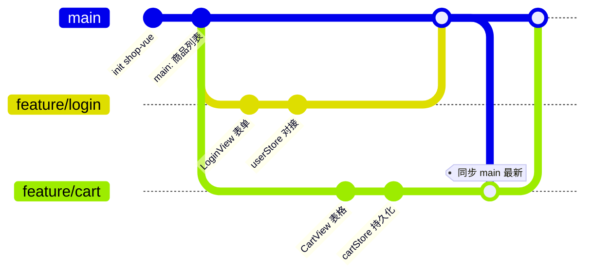
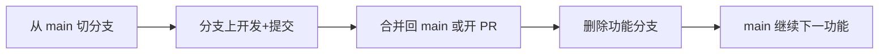
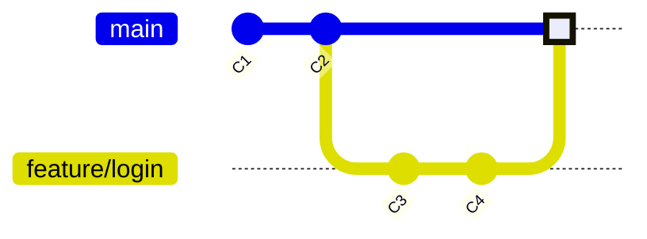
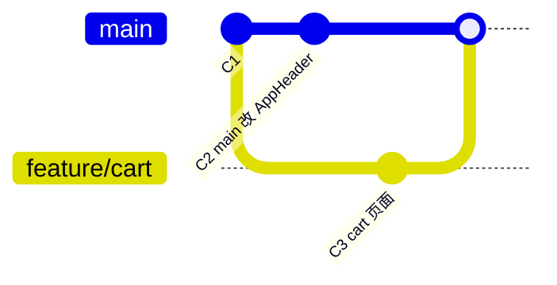
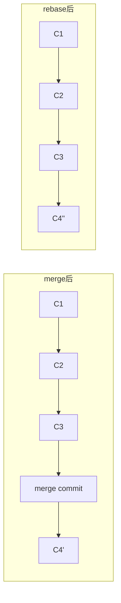
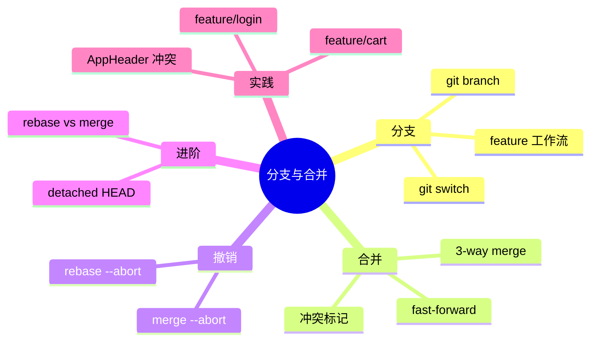

# 分支管理与合并冲突

> **文件编码**：UTF-8。本章假设你已完成 [01-Git 入门与安装配置](./01-Git入门与安装配置.md) 与 [02-本地版本控制核心操作](./02-本地版本控制核心操作.md)，并在本地有一个可提交的 `shop-vue` 仓库（或任意练习项目）。

---

## 0. 读前导读（零基础也能跟上）

### 0.1 用一句话弄懂本章

**分支（branch）** = 游戏里的**平行存档线**——从 `main` 主线开 `feature/login` 支线改登录页，队友同时开 `feature/cart` 改购物车，互不踩脚；改完用 **merge** 把支线进度**合并回主线**，若改了同一行代码则出现 **冲突**，需人工选留哪版。

**生活类比总表**

| Git 概念 | 类比 |
|----------|------|
| `main` 分支 | 主线剧情，随时可演示、可部署 |
| `feature/login` | 登录副本支线，改 LoginView |
| `git switch -c` | 新开一条支线并开始玩 |
| `git merge` | 把支线结局写进主线 |
| **冲突** `<<<<<<<` | 两个存档改了同一句话，游戏问你选哪个 |
| **fast-forward** | 主线没动，支线直接接上去，无分叉点 |
| **rebase** | 把支线「挪到」主线最新进度后再接（历史更直） |

### 0.2 你需要提前知道什么

| 前置 | 章节 | 必须？ |
|------|------|--------|
| add / commit / log | [02 章](./02-本地版本控制核心操作.md) | ✅ |
| `.gitignore`、stash | 02 章 | 建议 |
| shop-vue 目录结构 | [Vue 11](../Vue/11-Vue项目实战与面试准备.md) | 建议 |

### 0.3 本章知识地图（学完后应能勾选全部 ☐→☑）

```text
☐ 能解释分支是指向 commit 的可移动指针
☐ 会 git branch / switch / merge 基本流程
☐ 能识别并解决 <<<<<<< ======= >>>>>>> 冲突
☐ 能区分 fast-forward 与三方合并
☐ 知道 merge --abort / rebase --abort 如何撤退
☐ 能说明 merge vs rebase 团队选用边界
☐ 独立完成 feature/login + feature/cart 合并演练
```

### 0.4 建议学习时长与节奏

| 阶段 | 内容 | 时间 |
|------|------|------|
| 概念 + 创建分支 | §1～§3 | 40 分钟 |
| merge + 冲突 | §4～§8 | 90 分钟（含动手） |
| rebase 进阶 | §9～§12 | 45 分钟 |
| 自测 | 章末闭卷 + 费曼 | 25 分钟 |

### 0.5 学完本章你能做什么（可验证的具体动作）

1. 在 shop-vue 创建 `feature/login`，提交 2 次 commit，merge 回 `main`。
2. 故意制造 `AppHeader.vue` 冲突并正确解决，`npm run dev` 通过。
3. 画 `git log --oneline --graph` 分叉合并图给同学看。
4. 面试 1 分钟答：merge 和 rebase 区别，为什么不能 rebase 已 push 的公共分支。
5. 闭卷自测 ≥8/10。

---

## 本章衔接

02 章你在 **单条主线（main）** 上完成了 `git add`、`git commit`、`git log`、`git reset` 等操作——就像只有一条车道的高速公路，所有人排队往前开。

真实项目里，**不可能**所有人同时改同一条线：

- 你在做 `LoginView.vue` 登录页（[Vue 09 章](../Vue/09-Element-Plus与UI工程化.md)）
- 队友在做 `CartView.vue` 购物车（[Vue 07 章](../Vue/07-Pinia状态管理.md)）
- `main` 分支必须随时可部署、可演示（[Vue 11 章 shop-vue MVP](../Vue/11-Vue项目实战与面试准备.md)）

**分支（branch）** 就是 Git 给你的「平行宇宙」：从 `main` 切出 `feature/login` 独立开发，完成后再 **合并（merge）** 回主线。本章用 `shop-vue` 的 `feature/login`、`feature/cart` 两条功能分支，手把手走完 **创建 → 开发 → 合并 → 解决冲突** 全流程。



**与前后章关系**：

| 章节 | 内容 | 本章用到 |
|------|------|----------|
| [01 章](./01-Git入门与安装配置.md) | 安装、config | 环境已就绪 |
| [02 章](./02-本地版本控制核心操作.md) | add/commit/log | 分支上的提交操作相同 |
| [Vue 11 章](../Vue/11-Vue项目实战与面试准备.md) | shop-vue MVP | 分支命名与模块对应 |
| [Java 10 章](../../后端学习/Java/10-后端项目实战与面试准备.md) | 后端联调 | 前后端可各开 feature 分支 |

---

## 1. 分支是什么？为什么需要分支？

### 1.1 一句话定义

**分支** 是指向某次提交的 **可移动指针**。`main` 是最常用的默认分支名；新建 `feature/login` 时，Git 从当前提交「长」出一条新线，两条线上的提交互不影响，直到你主动合并。

### 1.2 为什么需要分支？（深入）

**原因 1：隔离未完成的功能**

若直接在 `main` 上改登录页，改到一半要修线上 bug，你 either 把半成品 commit 推上去（危险），or 用 `git stash` 临时藏改动（02 章学过，但大功能仍乱）。**功能分支** 让 `main` 始终保持「可演示的 MVP」，登录、购物车各自在分支里迭代。

**原因 2：并行开发与 Code Review**

团队里 A 做 `feature/login`、B 做 `feature/cart`，两人各自 push 到远程分支，通过 Pull Request 合并（04 章详讲）。没有分支，只能串行改同一目录，冲突概率和沟通成本都飙升。

**原因 3：与 shop-vue 模块对齐**

| 分支名 | 对应模块 | 主要改动文件 |
|--------|----------|--------------|
| `feature/login` | 用户登录 | `views/LoginView.vue`、`stores/user.js`、`api/auth.js` |
| `feature/cart` | 购物车 | `views/CartView.vue`、`stores/cart.js`、`components/CartItem.vue` |
| `main` | 稳定可部署版本 | 合并后的全集 |

### 1.3 分支 vs 复制文件夹

初学者常把整个项目复制一份改——**不要这样做**：

- 复制文件夹无法共享 Git 历史，合并只能手工 copy
- 分支共享同一 `.git`，合并时 Git 能自动对比差异
- 分支占用空间极小（只是指针 + 新提交）

---

## 2. 查看与创建分支：`git branch`

### 2.1 查看分支

```powershell
cd f:\projects\shop-vue
git branch
```

**预期输出**（只有 main 时）：

```text
* main
```

星号 `*` 表示 **当前所在分支**（HEAD 指向的分支）。

查看本地 + 远程全部分支：

```powershell
git branch -a
```

**预期输出**（04 章 push 之后）：

```text
* main
  feature/login
  remotes/origin/main
  remotes/origin/feature/login
```

### 2.2 创建分支（不切换）

```powershell
git branch feature/login
git branch
```

**预期输出**：

```text
  feature/login
* main
```

此时仍在 `main`，`feature/login` 与 `main` 指向 **同一提交**。

### 2.3 创建并切换到新分支（推荐写法）

```powershell
git switch -c feature/login
```

或旧写法（等价，02 章可能见过）：

```powershell
git checkout -b feature/login
```

**预期输出**：

```text
Switched to a new branch 'feature/login'
```

```powershell
git branch
```

**预期输出**：

```text
* feature/login
  main
```

### 2.4 删除分支

合并完成后删除已合入的分支：

```powershell
git branch -d feature/login
```

**预期输出**：

```text
Deleted branch feature/login (was a1b2c3d).
```

若分支 **未合并** 就删，Git 会拒绝：

```powershell
git branch -D feature/login
```

`-D` 强制删除（会丢该分支独有提交，慎用）。

---

## 3. 切换分支：`git switch` 与 `git checkout`

### 3.1 现代命令 `git switch`（Git 2.23+）

| 场景 | 命令 |
|------|------|
| 切换到已有分支 | `git switch main` |
| 创建并切换 | `git switch -c feature/cart` |
| 切到上一个分支 | `git switch -` |

```powershell
git switch main
```

**预期输出**：

```text
Switched to branch 'main'
```

### 3.2 旧命令 `git checkout`（仍广泛使用）

```powershell
git checkout feature/cart
git checkout -b feature/cart
```

面试和旧文档里大量出现 `checkout`，含义与上表对应项相同。

### 3.3 切换分支的前提：工作区要干净

若 `LoginView.vue` 有 **未提交修改**，切换分支时 Git 可能：

- **拒绝切换**（修改与目标分支冲突）
- 或 **带改动一起切换**（若两边改的不是同一文件）

**最佳实践**：切换前 `git status` 确认 clean，或先 `commit` / `stash`（见 02 章）。

```powershell
git status
```

**预期输出（可切换）**：

```text
On branch feature/login
nothing to commit, working tree clean
```

**预期输出（不可切换，需先处理）**：

```text
error: Your local changes to the following files would be overwritten by checkout:
        src/views/LoginView.vue
Please commit your changes or stash them before you switch branches.
```

---

## 4. 功能分支工作流（Feature Branch Workflow）

### 4.1 标准流程（shop-vue 版）



**约定**：

1. **永远从最新的 `main` 切分支**（或 `develop`，团队规范而定）
2. 分支命名：`feature/功能`、`fix/bug描述`、`hotfix/紧急修复`
3. 小步提交，commit message 清晰（02 章规范）
4. 合并前拉取 `main` 最新，减少冲突

### 4.2 示例：开发 feature/login

```powershell
git switch main
git pull origin main
git switch -c feature/login
```

在 `feature/login` 上改代码并提交：

```powershell
# 编辑 src/views/LoginView.vue、src/stores/user.js ...
git add .
git commit -m "feat(login): 完成登录表单与 userStore"
```

**预期输出**：

```text
[feature/login 3f8a2b1] feat(login): 完成登录表单与 userStore
 2 files changed, 87 insertions(+), 12 deletions(-)
```

合并回 `main`（本地自测通过后）：

```powershell
git switch main
git merge feature/login
git branch -d feature/login
```

### 4.3 示例：并行 feature/cart

A 同学合完 `feature/login` 后，B 同学：

```powershell
git switch main
git pull
git switch -c feature/cart
# ... 开发 CartView、cartStore ...
git commit -m "feat(cart): 购物车列表与数量步进器"
```

若 B 开发期间 `main` 又有新提交，合并前应先：

```powershell
git switch feature/cart
git merge main
# 或 04 章学的 git pull origin main 后再 merge
```

---

## 5. 合并分支：`git merge`

### 5.1 基本用法

在 **目标分支** 上执行 merge，把 **源分支** 的提交合进来：

```powershell
git switch main
git merge feature/login
```

### 5.2 快进合并（Fast-forward）

**条件**：`main` 在切出 `feature/login` 之后 **没有新提交**，`main` 仍是分支的「祖先」。



```powershell
git merge feature/login
```

**预期输出**：

```text
Updating e3b4c5d..a1b2c3f
Fast-forward
 src/views/LoginView.vue | 45 ++++++++++++++++++++++++++++++++
 src/stores/user.js      | 22 ++++++++++++++++
 2 files changed, 67 insertions(+)
```

快进时 **不产生新的 merge commit**，`main` 指针直接移到 `feature/login` 顶端，历史是一条直线。

### 5.3 三方合并（3-way merge）

**条件**：`main` 与 `feature/cart` **都有各自的新提交**（分叉了）。



```powershell
git switch main
git merge feature/cart
```

**预期输出（无冲突）**：

```text
Merge made by the 'ort' strategy.
 src/views/CartView.vue | 38 ++++++++++++++++++++++++++++++++++++++
 src/stores/cart.js     | 31 +++++++++++++++++++++++++++++++
 2 files changed, 69 insertions(+)
```

Git 会新建一个 **merge commit**，有两个父提交（`main` 顶端 + `feature/cart` 顶端）。

查看图状历史：

```powershell
git log --oneline --graph -10
```

**预期输出**：

```text
*   f7e8d9c (HEAD -> main) Merge branch 'feature/cart'
|\
| * a1b2c3d (feature/cart) feat(cart): 购物车列表
| * d4e5f6a feat(cart): cartStore 初始化
* | 9a8b7c6 fix: AppHeader 显示购物车角标
|/
* 3f2a1b0 feat: 商品列表页
```

### 5.4 `--no-ff`：强制产生 merge commit

即使可以快进，团队有时要求保留「功能合并」节点：

```powershell
git merge --no-ff feature/login -m "merge: 合入登录功能"
```

**为什么？** 历史里能一眼看到「某次发布了登录功能」，而不是散落在直线 commit 里难以追溯。

---

## 6. 合并冲突：从标记到解决

### 6.1 冲突何时发生？

当 **同一文件的同一区域**，两个分支都做了不同修改，Git 无法自动决定保留哪边，就会 **冲突（conflict）**。

**shop-vue 典型场景**：`feature/login` 和 `feature/cart` 都改了 `src/components/AppHeader.vue`——登录分支加了「用户名」，购物车分支加了「角标数量」。

### 6.2 制造冲突（练习用）

**分支 A（feature/login）** 改 `AppHeader.vue`：

```vue
<span>{{ userStore.displayName }}</span>
```

**分支 B（feature/cart）** 在同一位置改成：

```vue
<el-badge :value="cartStore.totalCount" />
```

先合 A 到 `main`，再合 B，就会冲突。

### 6.3 冲突文件长什么样？

```powershell
git merge feature/cart
```

**预期输出**：

```text
Auto-merging src/components/AppHeader.vue
CONFLICT (content): Merge conflict in src/components/AppHeader.vue
Automatic merge failed; fix conflicts and then commit the result.
```

打开 `AppHeader.vue`，Git 插入 **冲突标记**：

```vue
<template>
  <header class="app-header">
<<<<<<< HEAD
    <span>{{ userStore.displayName }}</span>
=======
    <el-badge :value="cartStore.totalCount">
      <el-icon><ShoppingCart /></el-icon>
    </el-badge>
>>>>>>> feature/cart
  </header>
</template>
```

**标记含义**：

| 标记 | 含义 |
|------|------|
| `<<<<<<< HEAD` | 当前分支（你在 `main` 上 merge，HEAD = main）的内容开始 |
| `=======` | 分隔线 |
| `>>>>>>> feature/cart` | 被合并进来的分支的内容结束 |

### 6.4 解决冲突逐步操作

**第 1 步：确认冲突文件**

```powershell
git status
```

**预期输出**：

```text
On branch main
You have unmerged paths.
  (fix conflicts and run "git commit")
  (use "git merge --abort" to abort the merge)

Unmerged paths:
  (use "git add <file>..." to mark resolution)
        both modified:   src/components/AppHeader.vue
```

**第 2 步：编辑文件，删掉标记，保留正确代码**

合并两边需求（登录名 + 购物车角标）：

```vue
<template>
  <header class="app-header">
    <span>{{ userStore.displayName }}</span>
    <el-badge :value="cartStore.totalCount">
      <el-icon><ShoppingCart /></el-icon>
    </el-badge>
  </header>
</template>
```

**第 3 步：标记为已解决**

```powershell
git add src/components/AppHeader.vue
```

**第 4 步：完成 merge commit**

```powershell
git commit -m "merge: 解决 AppHeader 登录与购物车冲突"
```

若未改 message，Git 可能打开编辑器，默认已有 `Merge branch 'feature/cart'`。

**预期输出**：

```text
[main 8c9d0e1] merge: 解决 AppHeader 登录与购物车冲突
```

**第 5 步：验证**

```powershell
git status
npm run dev
```

**预期**：`working tree clean`，页面 Header 同时显示用户名和角标。

### 6.5 用 VS Code / Cursor 解决冲突

1. 打开冲突文件，编辑器顶部出现 **Accept Current / Accept Incoming / Accept Both**
2. 或点击「Compare Changes」并排对比
3. 保存后 `git add`，再 `git commit`

比手删 `<<<<<<<` 更不易漏删标记。

### 6.6 冲突解决原则

- **不要** 把 `<<<<<<<`、`=======`、`>>>>>>>` 留进最终代码（会导致编译失败）
- **与改同一文件的同事沟通**，避免覆盖对方逻辑
- 冲突 frequent 的文件（路由、Header、全局样式）改前先看 `main` 是否有更新
- 后端联调时，`application.yml`、接口 DTO 也是冲突高发区（见 [Java 10 章](../../后端学习/Java/10-后端项目实战与面试准备.md)）

---

## 7. 放弃合并：`git merge --abort`

合并过程中发现改乱了、想重来：

```powershell
git merge --abort
```

**预期输出**：

```text
```

（无输出即成功）

```powershell
git status
```

**预期输出**：

```text
On branch main
nothing to commit, working tree clean
```

仓库回到 **执行 merge 之前** 的状态。冲突标记、半完成的 merge 全部撤销。

**注意**：若冲突文件里你已经手动改了一部分，`--abort` 会 **丢弃** 这些改动（回到 merge 前快照）。不确定时先 `git stash` 或复制文件备份。

---

## 8. Rebase 入门：与 merge 怎么选？

### 8.1 `git rebase` 做什么？

把当前分支的提交 **「摘下来」**，接到另一条分支最新提交 **之后**，历史变直线。

```powershell
git switch feature/cart
git rebase main
```

**预期输出（无冲突）**：

```text
Successfully rebased and updated refs/heads/feature/cart.
```



### 8.2 merge vs rebase 对比

| 维度 | merge | rebase |
|------|-------|--------|
| 历史形状 | 有分叉 + merge commit | 一条直线 |
| 是否改已有 commit hash | 否（新增 merge commit） | 是（replay 生成新 commit） |
| 适用场景 | 公共分支、已 push 的协作分支 | **本地**功能分支同步 main 最新 |
| 风险 | 历史复杂 | **禁止**对已 push 且他人基于其开发的分支 rebase |

### 8.3 为什么团队常说「不要 rebase 公共分支」？（深入）

Rebase 会 **重写提交历史**。若 `feature/login` 已经 push 到 GitHub，你 rebase 后再 `git push`，远程历史与本地不一致，队友 pull 时会一团糟（需 force push，极危险）。

**安全用法**：

```powershell
# 本地 feature 分支落后 main，想先同步
git switch feature/cart
git fetch origin
git rebase origin/main
# 解决冲突 → git add → git rebase --continue
# 仅当该分支只有你自己用时，才可 git push --force-with-lease
```

**团队默认**：合入 `main` 用 **merge** 或 **PR 界面上的 squash**（04 章）；个人本地整理 commit 可用 **interactive rebase**（`git rebase -i`，进阶话题）。

### 8.4 rebase 冲突处理

```powershell
git rebase main
```

**预期输出**：

```text
CONFLICT (content): Merge conflict in src/router/index.js
error: could not apply a1b2c3d... feat: 添加 /cart 路由
```

解决文件后：

```powershell
git add src/router/index.js
git rebase --continue
```

放弃 rebase：

```powershell
git rebase --abort
```

---

## 9. 分离 HEAD（Detached HEAD）简要说明

### 9.1 什么是 HEAD？

**HEAD** 通常指向 **当前分支名**（如 `main`），分支再指向某 commit。  
**分离 HEAD** = HEAD 直接指向某个 commit，**不在任何分支上**。

### 9.2 如何进入？

```powershell
git checkout a1b2c3d
# 或
git switch --detach a1b2c3d
```

**预期输出**：

```text
Note: switching to 'a1b2c3d'.

You are in 'detached HEAD' state. You can look around, make experimental
changes and commit them, and you can discard any commits you make without
impacting any branches by switching away.
```

### 9.3 有什么风险？

在 detached HEAD 下新 commit **不属于任何分支**，切走后这些 commit 可能被 Git 回收（gc），**找不到**。

**正确做法**：

- 只是 **看旧代码**：看完 `git switch main` 切回即可
- 想 **基于旧版本修 bug**：`git switch -c hotfix/from-old a1b2c3d` 先建分支再改

### 9.4 和 shop-vue 的关系

排查「上周版本登录还能用」时，可能 `git log` 找到旧 hash 临时 checkout 对比——记得别在 detached 状态直接开发大功能。

---

## 10. 手把手：shop-vue 双功能分支完整演练

### 10.1 准备

```powershell
cd f:\projects\shop-vue
git switch main
git status
```

确保 clean。若没有仓库，可先：

```powershell
git init
git add .
git commit -m "chore: init shop-vue"
```

### 10.2 分支一 feature/login

```powershell
git switch -c feature/login
```

创建 `src/views/LoginView.vue`（或改现有文件），提交：

```powershell
git add src/views/LoginView.vue src/stores/user.js
git commit -m "feat(login): LoginView 与 userStore"
```

合回 main：

```powershell
git switch main
git merge feature/login
git branch -d feature/login
```

**预期**：Fast-forward 或 merge commit，视 main 是否有并行提交而定。

### 10.3 分支二 feature/cart（故意制造冲突）

```powershell
git switch -c feature/cart
```

改 `CartView.vue` 并 **同时改** `AppHeader.vue`（加角标），提交：

```powershell
git commit -am "feat(cart): CartView 与 Header 角标"
```

回到 main，**也改** `AppHeader.vue`（加用户名，与 cart 分支同一行区域不同内容），提交：

```powershell
git switch main
# 编辑 AppHeader.vue 加 displayName
git commit -am "feat: Header 显示用户名"
git merge feature/cart
```

按 **§6.4** 解决冲突 → `git add` → `git commit`。

### 10.4 验证历史

```powershell
git log --oneline --graph -8
git branch -d feature/cart
```

---

## 11. 命令速查表

| 目的 | 命令 |
|------|------|
| 列出分支 | `git branch` / `git branch -a` |
| 创建分支 | `git branch 名` / `git switch -c 名` |
| 切换分支 | `git switch 名` / `git checkout 名` |
| 合并 | `git merge 源分支` |
| 放弃合并 | `git merge --abort` |
| 变基 | `git rebase main` |
| 放弃变基 | `git rebase --abort` |
| 删分支 | `git branch -d 名` |
| 图状日志 | `git log --oneline --graph --all` |

---

## 12. 常见报错与排查（完整表）

| 现象 | 可能原因 | 排查步骤 | 解决方案 |
|------|----------|----------|----------|
| `error: Your local changes would be overwritten by checkout` | 有未提交修改 | `git status` | commit 或 `git stash` 后再 switch |
| `fatal: A branch named 'feature/login' already exists` | 重复创建同名分支 | `git branch` | 直接 `git switch feature/login` 或换名 |
| `CONFLICT (content): Merge conflict in xxx` | 两分支改同一处 | 打开文件搜 `<<<<<<<` | 手工合并 → `git add` → `git commit` |
| `Automatic merge failed; fix conflicts and then commit` | 同上 | `git status` 看 Unmerged | 按 §6.4 处理 |
| merge 后页面白屏 / 语法错 | 冲突标记未删净 | 文件内搜 `<<<<<<<` | 删标记，保留正确代码 |
| `error: Entry 'xxx' not uptodate. Cannot merge.` | 冲突文件未 add | `git status` | 解决后必须 `git add` |
| `fatal: Not possible to fast-forward, aborting` | 配置了 `pull.ff only` 且非 FF | 看 merge 策略 | `git merge --no-ff` 或 `git pull --no-ff` |
| `error: Cannot delete branch checked out` | 正在该分支上 | `git branch` | 先 `git switch main` 再 `-d` |
| `error: The branch 'feature/x' is not fully merged` | 未合并就删分支 | `git log main..feature/x` | 确认不要了用 `-D`；否则先 merge |
| `You are in detached HEAD state` | 直接 checkout 到 hash | `git status` | `git switch main` 或 `-c 新分支` |
| `rebase CONFLICT` | rebase 时文件冲突 | 同 merge | 改文件 → `add` → `rebase --continue` |
| `Merge branch 'x' into main` 乱码 | 编辑器编码 | commit message | 设 `git config core.quotepath false` |

---

## 13. 常见问题 FAQ

**Q：一个 commit 可以属于多个分支吗？**  
可以。切分支前的提交被多个分支共享，直到某分支有新 commit 才分叉。

**Q：feature 分支要活多久？**  
合入 `main` 并验证通过后 **尽快删除**，避免分支列表爆炸。远程分支 04 章用 `git push origin --delete feature/login` 清理。

**Q：合并后还要在 feature 分支上改怎么办？**  
一般 **新开分支** 或继续在同一分支再提 PR；已删分支可从 `main` 重新切。

**Q：和 [Vue 11 章](../Vue/11-Vue项目实战与面试准备.md) 项目怎么配合？**  
Week 2 做登录开 `feature/login`，Week 3 做购物车开 `feature/cart`，Week 4 联调在 `main` 或 `release/*` 上打 tag。

---

## 14. 学完标准

- [ ] 能解释分支是指向 commit 的可移动指针
- [ ] 会用 `git branch`、`git switch -c`、`git merge` 完成功能分支闭环
- [ ] 能区分 **快进合并** 与 **三方合并**，读懂 `git log --graph`
- [ ] 能识别并手工解决含 `<<<<<<<` 的冲突，或用编辑器工具解决
- [ ] 会使用 `git merge --abort` 安全撤销合并
- [ ] 能说明 merge 与 rebase 的适用场景，知道不能乱 rebase 已共享分支
- [ ] 知道 detached HEAD 是什么、如何避免丢 commit
- [ ] 在 shop-vue（或练习仓库）独立完成 `feature/login` + `feature/cart` 合并演练

---

## 15. 分级练习

### 基础

1. 在练习仓库创建 `feature/demo`，改 README 一行，合并回 `main`。
2. 执行 `git log --oneline --graph`，截图分叉与合并点。
3. 故意制造冲突并解决一次。

### 进阶

1. 从 `main` 切 `feature/login`，提交 2 个 commit；`main` 上再 1 个 commit；merge 观察 3-way。
2. 在 `feature/cart` 上 `git rebase main`，体验直线历史。
3. 用 `git merge --no-ff` 合入并对比 `git log` 差异。

### 挑战

1. 模拟两人协作：`main` 合 login 后，cart 分支 rebase main 再 merge，全程零冲突。
2. 在 `src/router/index.js` 制造冲突，合并后 `npm run dev` 验证路由正常。
3. 写团队分支规范文档（命名、何时删分支、merge vs squash）一页纸。

### 参考答案要点

**基础 1**：

```powershell
git switch -c feature/demo
echo "## demo" >> README.md
git commit -am "docs: demo section"
git switch main
git merge feature/demo
git branch -d feature/demo
```

**基础 3 冲突解决**：保留双方修改或选其一 → 删除全部冲突标记 → `git add` → `git commit`。

**进阶 2 rebase**：

```powershell
git switch feature/cart
git rebase main
# 有冲突则改文件 → git add → git rebase --continue
git switch main
git merge feature/cart
# 往往 FF
```

**挑战 1 要点**：cart 分支开发前先 `git merge main` 或 `git rebase main`，减少最后合 main 时的大冲突。

---

## 16. 本章小结



分支让你 **并行开发** shop-vue 的登录与购物车；合并把成果收回 `main`；冲突是协作常态，按标记逐步解决即可。下一章把这些分支 **推到 GitHub / Gitee**，用 **Pull Request** 做 Code Review，并与 [Vue 11 章](../Vue/11-Vue项目实战与面试准备.md)、[Java 10 章](../../后端学习/Java/10-后端项目实战与面试准备.md) 的远程仓库规范对齐。

---

## 下一章预告

04 章进入 **远程协作**：`git remote`、`git push -u`、`git pull` vs `fetch`、`git clone`、Windows 下 **SSH 密钥**、GitHub 与 **Gitee** 双平台、Fork 工作流、**创建 Pull Request**（网页 step-by-step）、可选 **gh CLI**、Review 要点、PR 冲突解决、**Squash merge** 与 **Merge commit** 怎么选。学完可在团队里规范地提交 `feature/login` 而不是直接 push `main`。

---

*下一章：[04-远程仓库与 Pull Request 协作](./04-远程仓库与PullRequest协作.md)*

---

## 17. 常见问题 FAQ（扩充）

**Q1：merge 和 rebase 面试怎么答？**  
merge 保留分叉历史、安全用于已共享分支；rebase 线性历史、仅适合本地未 push 或团队允许 force-with-lease 的分支。

**Q2：冲突标记删不干净会怎样？**  
Vue/JS **语法错误**，页面白屏；搜 `<<<<<<<` 全局排查。

**Q3：为什么切换分支前要 clean？**  
未提交改动可能被覆盖或带到错误分支，Git 会拒绝 switch。

**Q4：fast-forward 还有 merge commit 吗？**  
没有；main 指针直接移到 feature 顶端。用 `--no-ff` 可强制产生 merge 节点。

**Q5：detached HEAD 下 commit 了怎么办？**  
`git switch -c rescue-branch` 把 commit 挂到新分支上。

**Q6：feature 分支命名规范？**  
常见 `feature/`、`fix/`、`hotfix/` + 短描述；与 Jira/禅道 ticket 对齐更好。

---

## 18. 手把手：冲突解决步骤表

| 步骤 | 命令/动作 | 预期 | 若不对 |
|------|-----------|------|--------|
| 1 | `git merge feature/x` | CONFLICT 提示 | 已 up-to-date 则无合 |
| 2 | `git status` | Unmerged paths 列表 | — |
| 3 | 编辑器打开冲突文件 | 见 <<<<<<< | 用 VS Code Accept Both |
| 4 | 删光冲突标记，保存 | 文件可编译 | npm run dev 报错 |
| 5 | `git add 文件` | staged | 忘记 add 无法 commit |
| 6 | `git commit` | merge 完成 | 用 merge --abort 重来 |

---

## 19. merge vs rebase 决策树

```text
是否已 push 且他人可能基于该分支？
├─ 是 → 用 merge（或 PR 界面 squash），不要 rebase
└─ 否 → 想整理历史？
         ├─ 是 → 本地 rebase main 后再 merge 到 main
         └─ 否 → git merge feature/x
```

---

## 20. 闭卷自测（10 题）

### 概念题（6 题）

1. 用「**平行存档线**」解释分支与 merge。
2. fast-forward 与三方合并各在什么条件下发生？
3. 冲突文件里 `<<<<<<< HEAD` 表示哪一侧内容？
4. `git merge --abort` 做什么？已手改一半冲突会怎样？
5. 为什么不能对公共分支 rebase？
6. detached HEAD 是什么？如何避免丢 commit？

### 动手题（2 题）

7. 写出从 main 创建 `feature/demo`、提交一次、merge 回 main、删分支的命令序列（5 行内）。
8. 如何用 `git log --oneline --graph` 判断某次合并是 FF 还是 merge commit？

### 综合题（2 题）

9. shop-vue 上 login 与 cart 都改 AppHeader 同一行，描述从 merge 到解决的完整步骤。
10. 团队要求「合 main 必须 --no-ff」，说明原因与一条示例命令。

### 自测参考答案

**1.** main 是主线；feature 是副本线；merge 把副本进度写回主线。

**2.** FF：main 无新提交；3-way：双方都有独立提交。

**3.** 当前所在分支（执行 merge 时 HEAD 指向的分支）一侧。

**4.** 撤销 merge 回到 merge 前；手改部分会丢弃。

**5.** rebase 改写了 commit hash，他人 pull 会历史冲突，需危险 force push。

**6.** HEAD 直接指向 commit 不在分支上；用 `switch -c 新分支` 再开发。

**7.** `git switch -c feature/demo` → 改文件 → `git commit -am "..."` → `git switch main` → `git merge feature/demo` → `git branch -d feature/demo`

**8.** FF 无分叉 merge 节点；有 `Merge branch` 且 graph 出现 `\|` 分叉为 merge commit。

**9.** merge cart → CONFLICT → 编辑保留用户名+角标 → add → commit → dev 验证。

**10.** 保留功能合并节点便于追溯；`git merge --no-ff feature/login -m "merge: login"`

---

## 21. 费曼检验：3 分钟讲给零基础朋友

**对照是否讲到：**

1. **分支像游戏副本**，主线 main 随时能演示，功能在副本里改。
2. **合并是把副本结局写进主线**；两人改同一句话会冲突，游戏让你选留哪段。
3. **rebase 是挪副本进度到最新主线**，已上传给别人用的副本不能乱挪（rebase）。

---

*本章已按 EXPANSION-STANDARD 扩充（§0+平行存档类比+FAQ+闭卷自测+费曼）。*

**EXPANSION-STANDARD 自检**：☑ §0 导读 ☑ 平行存档类比 §0.1 ☑ 冲突步骤 §18 ☑ merge/rebase 决策 §19 ☑ FAQ §17 ☑ 闭卷 10 题 §20 ☑ 费曼 §21

---

## 22. feature 分支命名与 shop 模块对照（团队规范草案）

| 分支名 | shop-vue 模块 | 合并时机 |
|--------|---------------|----------|
| `feature/login` | LoginView、userStore | 登录验收通过 |
| `feature/cart` | CartView、cartStore | 购物车 CRUD 通过 |
| `feature/router` | vue-router、懒加载 | 路由表稳定 |
| `fix/header-badge` | AppHeader 角标 bug | 随时，短分支 |
| `hotfix/prod-login` | 线上登录紧急修复 | 从 main 或 tag 切 |

**约定**：合并前 `git merge main` 或 `rebase main` 同步一次，减少 PR 大冲突。

---

## 23. 冲突高发文件清单（shop-vue）

| 文件 | 原因 | 预防 |
|------|------|------|
| `AppHeader.vue` | 多 feature 改导航 | 合并前沟通 UI |
| `router/index.js` | 各 feature 加路由 | 约定路由注册顺序 |
| `vite.config.js` | proxy 端口改动 | 统一 dev 约定 |
| `package.json` | 依赖版本 | 少改 lock，用 npm ci |

---

## 24. 本章总复习清单

1. 独立完成 §10 双分支演练含冲突。  
2. `git log --graph` 截图 FF 与 merge commit 各一例。  
3. 闭卷 §20 ≥8/10。  
4. 费曼 3 分钟录音。  
5. 打印 §19 决策树。  
6. 说明 `--no-ff` 团队价值。

---

## 25. 模拟面试：分支四连问

1. **分支本质是什么？** → 指向 commit 的可移动指针。  
2. **HEAD 是什么？** → 当前分支引用；detached 时直接指 commit。  
3. **merge 后 feature 删吗？** → 合入验证后删本地+远程，保持列表整洁。  
4. **两人改同一文件如何减少冲突？** → 小步 merge main、沟通高发文件、模块边界清晰。
