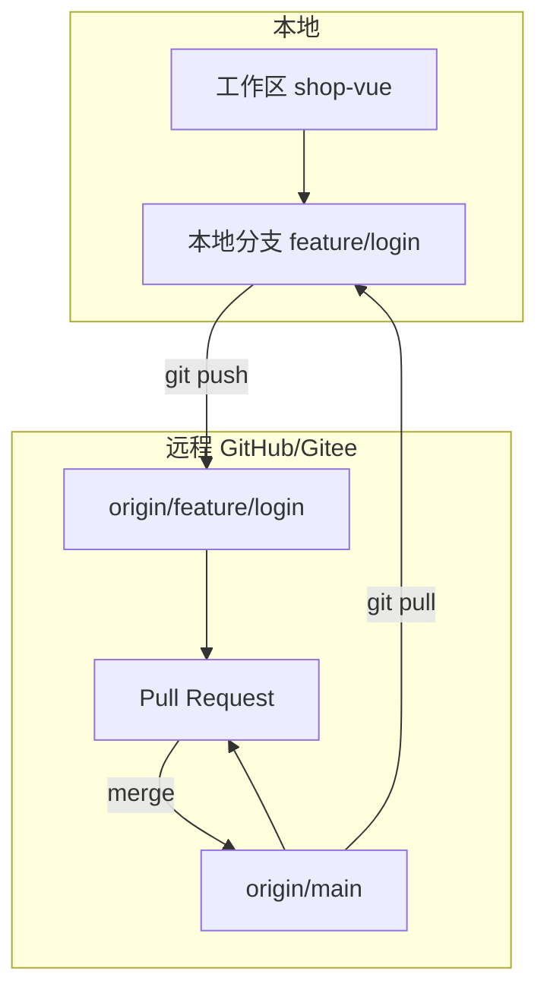
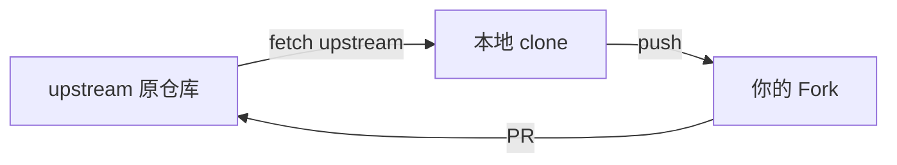
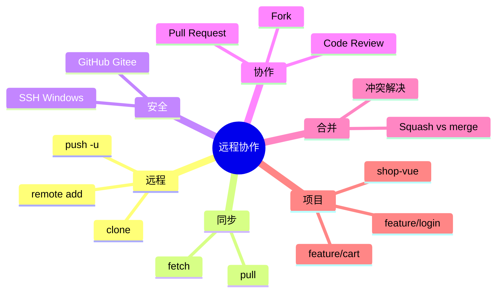

# 远程仓库与 Pull Request 协作

> **文件编码**：UTF-8。本章假设你已完成 [01-Git 入门与安装配置](./01-Git入门与安装配置.md)、[02-本地版本控制核心操作](./02-本地版本控制核心操作.md) 与 [03-分支管理与合并冲突](./03-分支管理与合并冲突.md)，并在本地用 `feature/login`、`feature/cart` 等功能分支开发 `shop-vue`。

---

## 本章衔接

03 章的分支与合并都在 **本机 `.git` 目录** 里完成——像在自己笔记本上写草稿。但真实协作需要 **中央远程仓库**：

- 代码备份、换电脑能 clone
- 队友能看到你的 `feature/login`，不用 U 盘拷项目
- 通过 **Pull Request（PR）** 合并前做 **Code Review**
- 与 [Vue 11 章 shop-vue 项目](../Vue/11-Vue项目实战与面试准备.md) 的「Git 仓库含 README、可演示 URL」对齐
- 后端 `demo-api` 同样托管在 GitHub / Gitee（[Java 10 章](../../后端学习/Java/10-后端项目实战与面试准备.md)）

**Git** = 版本控制工具；**GitHub / Gitee** = 托管 Git 仓库的网站（01 章已区分）。本章把本地 `shop-vue` **推上远程**，走完 **clone → 分支 push → 开 PR → Review → 合并** 完整协作链。



**前置检查**（01 章应已完成）：

```powershell
git config --global user.name
git config --global user.email
git --version
```

**预期输出示例**：

```text
Zhang San
zhangsan@example.com
git version 2.43.0.windows.1
```

---

## 1. 远程仓库概念：`origin` 与 `remote`

### 1.1 远程是什么？

**远程（remote）** 是本地仓库记录的 **别名的 URL**，默认常用名 **`origin`**，指向 GitHub / Gitee 上的 bare 仓库。  
本地分支（如 `main`）可 **跟踪（track）** 远程分支（如 `origin/main`），push/pull 时有默认上下游。

### 1.2 查看远程

```powershell
cd f:\projects\shop-vue
git remote -v
```

**未配置远程时**：无输出。

**已配置后预期输出**：

```text
origin  git@github.com:yourname/shop-vue.git (fetch)
origin  git@github.com:yourname/shop-vue.git (push)
```

---

## 2. 关联远程：`git remote add origin`

### 2.1 在平台上先建空仓库

**GitHub**：右上角 **New repository** → 名 `shop-vue` → 不勾选「Initialize with README」（本地已有代码时）→ Create。

**Gitee（码云）**：右上角 **+** → **新建仓库** → 路径 `shop-vue` → 创建。

记下 **HTTPS** 或 **SSH** 地址，例如：

| 平台 | HTTPS | SSH |
|------|-------|-----|
| GitHub | `https://github.com/yourname/shop-vue.git` | `git@github.com:yourname/shop-vue.git` |
| Gitee | `https://gitee.com/yourname/shop-vue.git` | `git@gitee.com:yourname/shop-vue.git` |

### 2.2 添加 origin

```powershell
git remote add origin git@github.com:yourname/shop-vue.git
git remote -v
```

**预期输出**：

```text
origin  git@github.com:yourname/shop-vue.git (fetch)
origin  git@github.com:yourname/shop-vue.git (push)
```

### 2.3 修改 / 删除远程

```powershell
# 改 URL（HTTPS 换 SSH 等）
git remote set-url origin git@gitee.com:yourname/shop-vue.git

# 删除
git remote remove origin
```

### 2.4 为什么推荐 SSH 而不是 HTTPS？（深入）

| 方式 | 优点 | 缺点 |
|------|------|------|
| HTTPS | 不用配密钥，clone 简单 | 每次 push 可能弹窗要 **Personal Access Token**（GitHub 已不支持账户密码） |
| SSH | 配好密钥后 **免密 push**，适合日常开发 | Windows 需一次密钥生成与平台绑定 |

团队长期开发、频繁 push `feature/login` 时，**SSH 更省事**。下文 §6 讲 Windows 生成密钥。

---

## 3. 首次推送：`git push -u origin main`

### 3.1 基本语法

```powershell
git push -u origin main
```

| 部分 | 含义 |
|------|------|
| `push` | 上传本地提交到远程 |
| `-u` / `--set-upstream` | 建立 **跟踪关系**：以后在该分支可直接 `git push` / `git pull` |
| `origin` | 远程名 |
| `main` | 本地分支名（推送到远程同名 `main`） |

**预期输出（首次成功）**：

```text
Enumerating objects: 42, done.
Counting objects: 100% (42/42), done.
Delta compression using up to 8 threads
Compressing objects: 100% (38/38), done.
Writing objects: 100% (42/42), 125.32 KiB | 2.10 MiB/s, done.
Total 42 (delta 5), reused 0 (delta 0), pack-reused 0
remote: Resolving deltas: 100% (5/5), done.
To github.com:yourname/shop-vue.git
 * [new branch]      main -> main
branch 'main' set up to track 'origin/main'.
```

### 3.2 推送功能分支

```powershell
git switch feature/login
git push -u origin feature/login
```

**预期输出**：

```text
...
 * [new branch]      feature/login -> feature/login
branch 'feature/login' set up to track 'origin/feature/login'.
```

之后在该分支：

```powershell
git push
```

即可，无需再写 `origin feature/login`。

### 3.3 查看跟踪关系

```powershell
git branch -vv
```

**预期输出**：

```text
* feature/login a1b2c3d [origin/feature/login] feat(login): LoginView
  main          e4f5g6h [origin/main] chore: init
```

---

## 4. 拉取更新：`git pull` vs `git fetch`

### 4.1 `git fetch`：只下载，不合并

```powershell
git fetch origin
```

**预期输出**：

```text
remote: Enumerating objects: 8, done.
...
   e4f5g6h..i7j8k9l  main       -> origin/main
```

本地 `main` **不变**，仅更新 `origin/main` 指针。适合 **先看看远程改了什么** 再决定 merge/rebase。

查看差异：

```powershell
git log main..origin/main --oneline
```

### 4.2 `git pull`：fetch + merge（或 rebase）

```powershell
git pull origin main
```

等价于：

```powershell
git fetch origin
git merge origin/main
```

**预期输出（已是最新）**：

```text
Already up to date.
```

**预期输出（有更新）**：

```text
Updating a1b2c3d..e4f5g6h
Fast-forward
 src/views/ProductList.vue | 12 +++++++-----
 1 file changed, 7 insertions(+), 5 deletions(-)
```

### 4.3 为什么很多团队建议先 fetch 再 merge？（深入）

`git pull` 一步到位，若远程与本地 **同一文件都改了**，会直接进入 merge 冲突，有时在错误的分支上合入。更稳妥：

```powershell
git fetch origin
git log HEAD..origin/main --oneline
git merge origin/main
```

或在功能分支：

```powershell
git fetch origin
git rebase origin/main
```

**习惯**：每天开工前 `git pull`（在 `main` 上）；功能分支合 main 前 `fetch` + merge/rebase。

### 4.4 pull 与 rebase 配置

```powershell
git config --global pull.rebase false
```

默认 merge；若希望 pull 时用 rebase：

```powershell
git config --global pull.rebase true
```

---

## 5. 克隆仓库：`git clone`

### 5.1 从零克隆 shop-vue

换电脑或队友加入项目：

```powershell
cd f:\projects
git clone git@github.com:yourname/shop-vue.git
cd shop-vue
```

**预期输出**：

```text
Cloning into 'shop-vue'...
remote: Enumerating objects: 42, done.
...
Receiving objects: 100% (42/42), 125.32 KiB | 1.50 MiB/s, done.
Resolving deltas: 100% (5/5), done.
```

```powershell
git branch -a
```

**预期输出**：

```text
* main
  remotes/origin/HEAD -> origin/main
  remotes/origin/main
  remotes/origin/feature/login
```

### 5.2 克隆后安装依赖

```powershell
npm install
npm run dev
```

与 [Vue 01 章](../Vue/01-Vue入门与环境搭建.md) 本地启动一致。

### 5.3 克隆指定分支

```powershell
git clone -b feature/cart --single-branch git@github.com:yourname/shop-vue.git shop-vue-cart
```

### 5.4 浅克隆（可选，省流量）

```powershell
git clone --depth 1 git@github.com:yourname/shop-vue.git
```

只拉最近一次 commit，CI 常用。

---

## 6. Windows 下配置 SSH 密钥

### 6.1 检查是否已有密钥

```powershell
ls ~\.ssh
```

若已有 `id_ed25519` / `id_ed25519.pub`（或 `id_rsa` 对），可跳过生成，直接 §6.3。

### 6.2 生成新密钥

```powershell
ssh-keygen -t ed25519 -C "zhangsan@example.com"
```

提示 **Enter file in which to save the key**：直接回车（默认 `C:\Users\你的用户名\.ssh\id_ed25519`）。

提示 **passphrase**：可回车空密码，或设密码更安全。

**预期输出**：

```text
Generating public/private ed25519 key pair.
Your identification has been saved in C:\Users\honor\.ssh\id_ed25519
Your public key has been saved in C:\Users\honor\.ssh\id_ed25519.pub
The key fingerprint is:
SHA256:xxxxxxxx zhangsan@example.com
```

### 6.3 复制公钥到平台

```powershell
Get-Content ~\.ssh\id_ed25519.pub | clip
```

公钥内容一行，以 `ssh-ed25519` 开头。

**GitHub**：Settings → **SSH and GPG keys** → **New SSH key** → Title 填 `Win11-PC` → Key 粘贴 → Add。

**Gitee**：设置 → **SSH 公钥** → 粘贴 → 确定。

### 6.4 测试连接

```powershell
ssh -T git@github.com
```

**预期输出**：

```text
Hi yourname! You've successfully authenticated, but GitHub does not provide shell access.
```

Gitee：

```powershell
ssh -T git@gitee.com
```

**预期输出**：

```text
Hi yourname! You've successfully authenticated...
```

### 6.5 多平台 / 多账号（可选）

同一密钥可同时加到 GitHub 和 Gitee。若公司 GitLab + 个人 GitHub 需不同密钥，在 `~\.ssh\config` 配置 Host 别名（进阶，面试可提）。

---

## 7. GitHub 与 Gitee 双平台对照

| 能力 | GitHub | Gitee |
|------|--------|-------|
| 公开仓库 | 免费 | 免费 |
| 私有仓库 | 免费 | 免费 |
| Pull Request 名称 | Pull Request | **Pull Request**（界面类似） |
| 国内访问速度 | 有时需代理 | 通常更快 |
| 简历 / 开源展示 | 国际主流 | 国内 HR 也认 |
| Actions / CI | GitHub Actions | Gitee Go / 第三方 |

**学习建议**：主仓库放 GitHub（与国外文档一致）；Gitee 可 **镜像备份** 或公司内网用。命令层 **完全一致**，仅 URL 不同。

```powershell
git remote add github git@github.com:you/shop-vue.git
git remote add gitee git@gitee.com:you/shop-vue.git
git push github main
git push gitee main
```

---

## 8. Fork 工作流（参与开源 / 无写权限）

### 8.1 什么时候 Fork？

你没有对方仓库 **push 权限**（如 vuejs/core、公司主仓库），但要提 PR：

1. 在 GitHub 点 **Fork** → 复制到你账号下 `yourname/shop-vue`
2. 克隆 **你的 Fork**：

```powershell
git clone git@github.com:yourname/shop-vue.git
cd shop-vue
```

3. 添加上游（可选，同步原仓库）：

```powershell
git remote add upstream git@github.com:original/shop-vue.git
git fetch upstream
git merge upstream/main
```

4. 改代码 → push 到 **你的 Fork** → 向 **原仓库** 开 PR



### 8.2 shop-vue 课程场景

课程模板在老师账号 `teacher/shop-vue-template`，你 Fork 后改成自己的 MVP，PR 交作业——与 Fork 开源项目流程相同。

---

## 9. 手把手：feature/login 从 push 到 PR 合并

### 9.1 本地开发并推送

```powershell
cd f:\projects\shop-vue
git switch main
git pull origin main
git switch -c feature/login
# 开发 LoginView、userStore ...
git add .
git commit -m "feat(login): 登录页与 Pinia userStore"
git push -u origin feature/login
```

### 9.2 在 GitHub 网页创建 Pull Request

1. 打开 `https://github.com/yourname/shop-vue`
2. 黄色条 **Compare & pull request**（push 后常自动出现），或 **Pull requests** → **New pull request**
3. **base**: `main` ← **compare**: `feature/login`
4. 填写 **Title**：`feat(login): 用户登录与 token 持久化`
5. 填写 **Description**（模板示例）：

```markdown
## 变更说明
- 新增 LoginView 表单校验
- userStore 对接 localStorage
- 路由守卫跳转 /login?redirect=

## 测试
- [ ] 本地 npm run dev 登录成功
- [ ] 未登录访问 /cart 跳转登录

## 关联
- Vue 09 登录页 UI
- 待联调 POST /api/login（Java 04+）
```

6. 右侧选 **Reviewers**（队友或助教）
7. 点 **Create pull request**

### 9.3 Gitee 上创建 PR

**Pull Requests** → **新建 Pull Request** → 源分支 `feature/login` → 目标 `main` → 同填标题与说明 → 创建。

### 9.4 PR 创建后本地继续改

Review 意见要改表单校验：

```powershell
git switch feature/login
# 修改代码
git commit -am "fix(login): 密码长度校验"
git push
```

**同一 PR 自动更新**，无需新建 PR。

---

## 10. GitHub CLI（`gh`）可选

### 10.1 安装

Windows：`winget install GitHub.cli` 或 [官网 MSI](https://cli.github.com/)。

```powershell
gh auth login
gh --version
```

### 10.2 用 CLI 创建 PR

```powershell
cd f:\projects\shop-vue
git push -u origin feature/cart
gh pr create --base main --head feature/cart --title "feat(cart): 购物车 MVP" --body "见 shop-vue Week3 计划"
```

**预期输出**：

```text
Creating pull request for feature/cart into main in yourname/shop-vue

https://github.com/yourname/shop-vue/pull/3
```

### 10.3 常用命令

```powershell
gh pr list
gh pr view 3
gh pr checkout 3
gh pr merge 3 --squash
```

CLI 与网页等价，适合喜欢终端的工作流；**初学先用网页**更直观。

---

## 11. Code Review 基础

### 11.1 Review 在查什么？

| 维度 | 关注点 | shop-vue 例子 |
|------|--------|---------------|
| 正确性 | 逻辑、边界 | 登录失败是否清 token |
| 可读性 | 命名、结构 | store 是否过大 |
| 安全 | 敏感信息 | 有无 commit `.env` |
| 性能 | 明显浪费 | 列表是否 unnecessary 重渲染 |
| 测试 | 可验证 | PR 描述是否写测试步骤 |
| 规范 | 分支、commit | 是否从 main 最新切出 |

### 11.2 作者（PR 提交者）礼仪

- PR **尽量小**（一个功能一条 PR：`feature/login` 与 `feature/cart` 分开）
- 描述写 **怎么测**、截图/GIF
- 自己先 `npm run build` 过一遍
- 回复 Review 评论，改完 push，必要时 **Re-request review**

### 11.3 Reviewer 操作（GitHub）

1. 打开 PR → **Files changed**
2. 行号旁 **+** 写评论
3. **Review changes** → Comment / Approve / Request changes
4. 合并权通常给 Maintainer，见 §13

### 11.4 与后端协作

前端 PR 改 `VITE_API_BASE_URL`、接口字段时，@ 后端同学对照 [Java 04 REST 规范](../../后端学习/Java/04-SpringBoot核心开发.md)，避免联调阶段才发现契约不一致。

---

## 12. 解决 Pull Request 里的冲突

### 12.1 冲突从哪来？

PR 期间 `main` 又有新 merge（如队友先合了 `feature/cart`），你的 `feature/login` 与 `main` **分叉**，GitHub 显示：

```text
This branch has conflicts that must be resolved
```

### 12.2 方式 A：本地解决（推荐，可控）

```powershell
git switch feature/login
git fetch origin
git merge origin/main
```

或：

```powershell
git rebase origin/main
```

按 [03 章](./03-分支管理与合并冲突.md) 解决 `AppHeader.vue` 等冲突 → `git add` → `git commit`（merge）或 `git rebase --continue`（rebase）。

```powershell
git push origin feature/login
```

若 rebase 改写了历史且之前 push 过：

```powershell
git push --force-with-lease origin feature/login
```

PR 页冲突消失，变为可合并。

### 12.3 方式 B：GitHub 网页 Resolve conflicts

简单冲突可在 PR 页 **Resolve conflicts** 在线编辑；复杂逻辑（Vue 组件）建议 **本地 IDE 解决**。

### 12.4 方式 C：同步 main 到分支（GitHub 按钮）

部分仓库有 **Update branch** 按钮，等价于把 main merge 进功能分支（可能产生 merge commit）。

---

## 13. 合并 PR：Squash merge vs Merge commit

### 13.1 三种合并方式（GitHub）

| 方式 | 历史效果 | 适用 |
|------|----------|------|
| **Create a merge commit** | 保留分支全部 commit + 一个 merge commit | 想保留完整开发过程 |
| **Squash and merge** | 分支上 N 个 commit **压成 1 个** 进 main | 功能分支 commit 较乱、「fix typo」很多 |
| **Rebase and merge** | 线性 replay commit 到 main | 要直线历史且保留多个有意义 commit |

### 13.2 为什么很多团队默认 Squash？（深入）

`feature/login` 开发中可能有：

```text
wip login
fix typo
fix review
feat(login): 最终版
```

Squash 后 `main` 上只有一条：

```text
feat(login): 用户登录与 token 持久化 (#12)
```

**优点**：`main` 历史干净，每个 PR 对应一个功能点，方便 `git bisect` 和 changelog。  
**缺点**：丢失中间 commit 粒度；若需要保留「每一步怎么修 bug」用 merge commit。

### 13.3 shop-vue 推荐实践

| 场景 | 建议 |
|------|------|
| 个人练手 / 课程作业 | Squash and merge |
| 团队发布分支 | merge commit 或按规范 |
| 已 push 的公共分支 | **不要** rebase 后 force push |

合并后：

```powershell
git switch main
git pull origin main
git branch -d feature/login
git push origin --delete feature/login
```

**预期**：远程分支删除，保持仓库整洁。

---

## 14. 手把手：feature/cart 完整远程协作

### 14.1 队友 A 已合 login，你开发 cart

```powershell
git clone git@github.com:team/shop-vue.git
cd shop-vue
git switch -c feature/cart
# CartView、cartStore ...
git commit -am "feat(cart): 购物车表格"
git push -u origin feature/cart
```

### 14.2 开 PR，Review 要求改 Pinia 持久化

改 `stores/cart.js`，`git push`。Reviewer Approve。

### 14.3 Maintainer Squash 合并

网页 **Squash and merge** → 确认 message → Confirm。

### 14.4 全员同步

```powershell
git switch main
git pull origin main
git log --oneline -3
```

**预期输出**：

```text
b2c3d4e feat(cart): 购物车表格与持久化 (#15)
a1b2c3d feat(login): 用户登录 (#12)
...
```

---

## 15. 保护 main 与协作规范（团队向）

### 15.1 分支保护规则

GitHub：**Settings** → **Branches** → **Add rule** → Branch name `main`：

- Require a pull request before merging
- Require approvals（1+）
- 可选：Require status checks（CI 绿才合）

这样 **禁止直接 push main**，与 03 章功能分支流程一致。

### 15.2 与 Vue / Java 项目联调

| 仓库 | 典型分支 | 说明 |
|------|----------|------|
| shop-vue | main + feature/* | 前端 PR |
| demo-api | main + feature/* | [Java 10](../../后端学习/Java/10-后端项目实战与面试准备.md) 后端 PR |
| 约定 | API 变更先合后端或同步文档 | 减少 08 章联调 404 |

---

## 16. 命令速查表

| 目的 | 命令 |
|------|------|
| 添加远程 | `git remote add origin <url>` |
| 首次推送 | `git push -u origin main` |
| 推送当前分支 | `git push` |
| 拉取并合并 | `git pull` |
| 仅下载 | `git fetch origin` |
| 克隆 | `git clone <url>` |
| 看远程 | `git remote -v` |
| 删远程分支 | `git push origin --delete feature/login` |
| 跟踪关系 | `git branch -vv` |

---

## 17. 常见报错与排查（完整表）

| 现象 | 可能原因 | 排查步骤 | 解决方案 |
|------|----------|----------|----------|
| `Permission denied (publickey)` | SSH 未配或公钥未上传 | `ssh -T git@github.com` | 按 §6 生成并添加公钥 |
| `remote: Repository not found` | URL 错或无权限 | 检查 remote URL、账号 | 修正 URL；确认仓库存在 / 被邀请 |
| `failed to push some refs` | 远程比本地新 | `git fetch` + `git log` | 先 `git pull --rebase` 再 push |
| `Updates were rejected (non-fast-forward)` | 同上 | `git status` | pull/rebase 后再 push |
| `error: remote origin already exists` | 重复 add | `git remote -v` | 用 `set-url` 或 `remove` 后重加 |
| HTTPS push 弹窗失败 | 用了过期密码 | GitHub 需 PAT | 换 SSH 或生成 Personal Access Token |
| `fatal: refusing to merge unrelated histories` | 本地与远程各自 init | 是否空仓库合已有 | `git pull origin main --allow-unrelated-histories`（慎用，理清再合） |
| PR 显示冲突 | main 已更新 | 本地 merge main | §12 本地解决后 push |
| `Support for password authentication was removed` | GitHub HTTPS 禁密码 | — | 用 PAT 或 SSH |
| `Could not resolve host: github.com` | 网络/DNS | ping github.com | 检查网络、代理、 hosts |
| Gitee 403 | 未实名 / 私有库无权限 | 网页能否访问 | 实名认证；确认成员权限 |
| `gh: command not found` | 未装 CLI | `where gh` | winget 安装 gh |
| push 很大文件失败 | 超平台 100MB 限制 | 看报错文件 | 用 Git LFS；勿提交 `node_modules`、`dist` |
| clone 慢或中断 | 网络 | 换 Gitee 镜像 | 浅克隆 `--depth 1` |

---

## 18. 常见问题 FAQ

**Q：push 时要不要推 `node_modules`？**  
**不要**。用 `.gitignore` 忽略；队友 `git clone` 后 `npm install`（02 章 / Vue 01 章）。

**Q：`.env` 里有密钥怎么办？**  
勿提交；提供 `.env.example`。若误推，需轮换密钥并从历史中移除（进阶：`git filter-repo`）。

**Q：PR 和 03 章本地 merge 有什么区别？**  
本地 merge 不经过 Review；PR 是 **提议合入**，讨论、CI、审批后再在远程（或本地 pull）完成合并。

**Q：Gitee PR 和 GitHub 一样吗？**  
流程几乎相同，按钮文案可能为「合并请求」。命令行 git 操作一致。

**Q：简历写 GitHub 还是 Gitee？**  
可都写；GitHub 链接国际化更好。确保 README 与 [Vue 11 章](../Vue/11-Vue项目实战与面试准备.md) 模板一致。

---

## 19. 学完标准

- [ ] 会在 GitHub **或** Gitee 创建远程仓库并 `git remote add origin`
- [ ] 会用 `git push -u origin main` 和功能分支 push
- [ ] 能解释 `git fetch` 与 `git pull` 区别，并安全同步 main
- [ ] 会用 `git clone` 拉项目并 `npm install` 跑起来
- [ ] 在 Windows 完成 SSH 密钥配置并通过 `ssh -T` 测试
- [ ] 能独立完成 **feature/login** 或 **feature/cart** 的 PR 创建与描述
- [ ] 知道 Review 查什么、如何在 PR 冲突时本地 merge main 再 push
- [ ] 能说明 Squash merge 与 Merge commit 的差异并选对策略
- [ ] （可选）会用 `gh pr create` / `gh pr merge`

---

## 20. 分级练习

### 基础

1. 把本地练习仓库 push 到 Gitee 或 GitHub 的 `main`。
2. 创建 `feature/readme`，只改 README，push 并开 PR（可自合练习）。
3. 另一目录 `git clone` 该仓库，确认文件一致。

### 进阶

1. 模拟冲突：A 合 PR 改 `AppHeader`；B 的 `feature/cart` PR 冲突，本地解决后 push。
2. 配置 `git remote` 同时指向 GitHub + Gitee，双 push。
3. 用 Squash 合并 PR，对比 `git log main` 与 merge commit 方式差异。

### 挑战

1. Fork 课程模板仓库，完成 login + cart 两个 PR 到 **自己的 main**（Fork 内自审）。
2. 写 `.github/pull_request_template.md`（变更说明、测试清单、截图）。
3. 与 [Java 10 章](../../后端学习/Java/10-后端项目实战与面试准备.md) 后端仓库联调：前端 PR 注明依赖的后端 commit / 接口版本。

### 参考答案要点

**基础 1**：

```powershell
git remote add origin git@gitee.com:you/git-practice.git
git push -u origin main
```

**基础 2**：

```powershell
git switch -c feature/readme
# 编辑 README
git commit -am "docs: 补充本地启动说明"
git push -u origin feature/readme
# 网页 New PR → Squash merge
git switch main && git pull
```

**进阶 1 冲突**：

```powershell
git switch feature/cart
git fetch origin
git merge origin/main
# 解决 AppHeader.vue
git add . && git commit
git push origin feature/cart
```

**挑战 2 模板路径**：仓库根目录 `.github/pull_request_template.md`，GitHub 新建 PR 时自动填充。

---

## 21. 本章小结



本地 Git（01～03 章）+ 远程平台（本章）= 现代前端 **必备协作能力**。把 shop-vue 推到 GitHub、用 PR 合入功能分支，是与 [Vue 11 章](../Vue/11-Vue项目实战与面试准备.md) 简历要求、「可演示仓库」直接对应的一步；后端 `demo-api` 同样流程见 [Java 10 章](../../后端学习/Java/10-后端项目实战与面试准备.md)。

---

## 下一章预告

05 章（规划见 [00-学习路线图与说明](./00-学习路线图与说明.md)）可深入：**`.gitignore` 与敏感文件**、**commit 规范与 Conventional Commits**、**Git stash / cherry-pick**、**tag 与 release**、**GitHub Actions 自动 build shop-vue**。也可回到 [Vue 08 章](../Vue/08-Axios网络请求与前后端联调.md) 在 `main` 稳定线上做前后端联调。

---

*相关章节：[03-分支管理与合并冲突](./03-分支管理与合并冲突.md) · [Vue 11-项目实战](../Vue/11-Vue项目实战与面试准备.md) · [Java 10-后端项目实战](../../后端学习/Java/10-后端项目实战与面试准备.md)*
