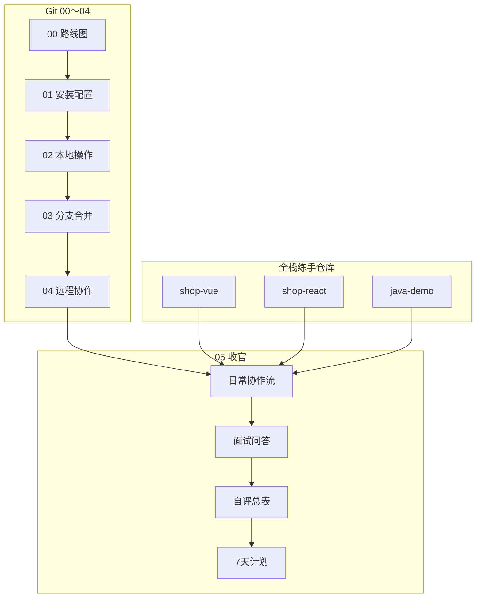
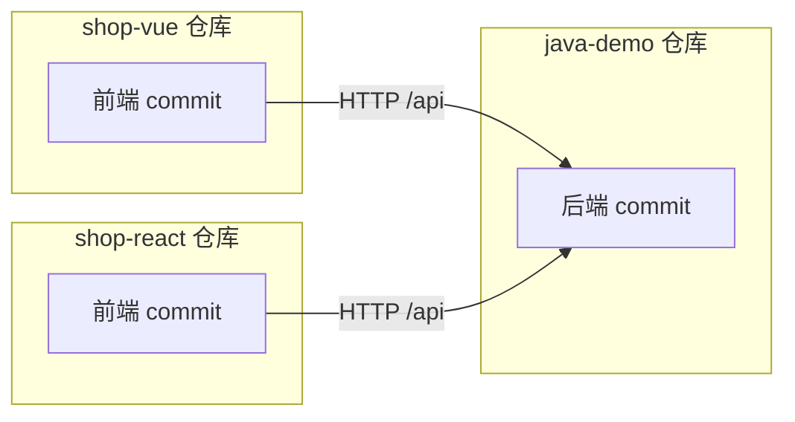
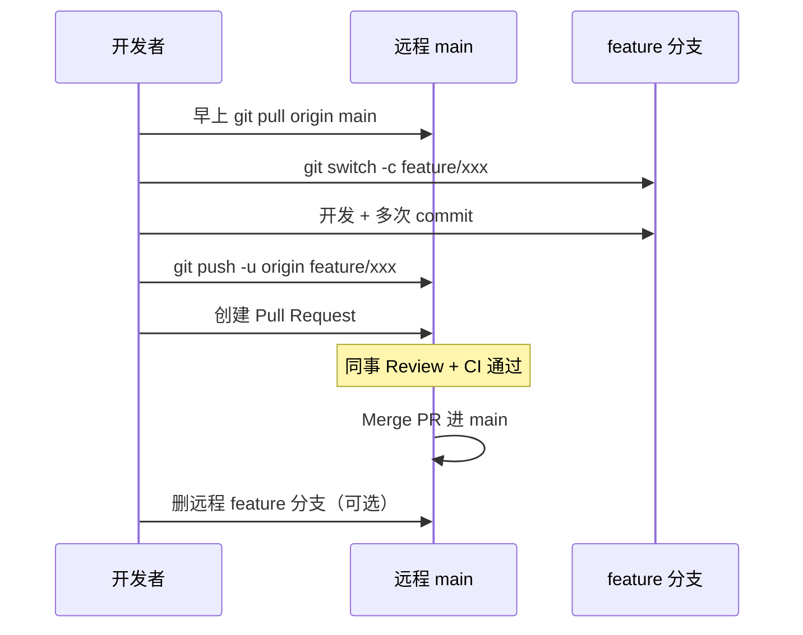
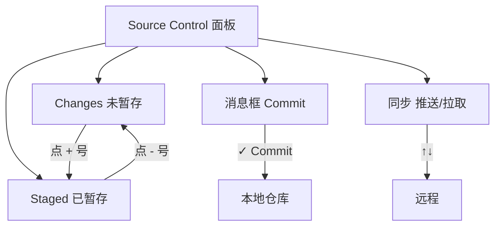
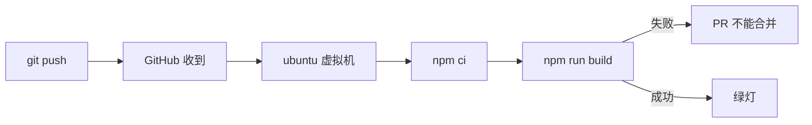

# 前端项目实践与面试总表

> **文件编码**：UTF-8。本章是 Git 系列的**收官篇**：把 [00～04](./00-学习路线图与说明.md) 的知识点落到 **shop-vue / shop-react / java-demo** 真实仓库，提供 **25+ 面试问答**、与 [Vue 14](../Vue/14-补充知识点总表.md) 同风格的 **自评总表**，以及 **7 天复习计划**。  
> **复习索引**：逐项自评 **⬜ 知道 / 🔶 会用 / ✅ 会讲**。详细讲解见对应编号文档。

---

## 0. 读前导读（零基础也能跟上）

### 0.1 用一句话弄懂本章

Git 系列 **收官篇**：不再教新命令语法，而是回答入职/面试三问——**团队每天怎么用 Git**、**三个练手仓库该忽略什么**、**推错分支/泄露密钥怎么办**；并提供 **25+ 面试问答**、**自评总表**、**7 天复习计划**。

**类比：05 章 = 入职手册 + 模拟面试 + 三项目 checklist**

| 区块 | 解决什么问题 |
|------|--------------|
| §1～§3 三仓库 `.gitignore` | shop-vue / shop-react / java-demo 什么不能 commit |
| §4～§8 日常协作流 | 早上 pull、feature 分支、PR、Review |
| §9 面试 25+ 问 | 口述 Git 原理 + shop 例子 |
| §10～§11 自评 + 7 天 | 与 Vue 14 同风格复盘 |

### 0.2 你需要提前知道什么

| 前置 | 章节 |
|------|------|
| 01～04 全系列 | 本章是**汇总**，不是入门 |
| 至少维护过 1 个真实仓库 | shop-vue 或 git-practice |

### 0.3 本章知识地图（学完后应能勾选全部 ☐→☑）

```text
☐ 三项目 .gitignore 各列 5 项必忽略内容
☐ 能口述「一天协作流」：pull → branch → commit → push → PR
☐ 能查 §8 报错表独立解决 ≥5 种问题
☐ 能解释 reset vs revert、merge vs rebase、fetch vs pull
☐ §10 自评 80%+ 为 🔶 或 ✅
☐ §9 至少 15 题能结合项目举例
☐ 完成 1 次真实或模拟 PR
```

### 0.4 建议学习时长与节奏

| 阶段 | 时间 |
|------|------|
| 三仓库 ignore + 协作流 | 90 分钟 |
| §9 面试题逐题口述 | 3～4 小时（可分 2 天） |
| §11 七天计划 | 7 天 × 45min |
| 自测 + 费曼 | 30 分钟 |

### 0.5 学完本章你能做什么（可验证的具体动作）

1. 检查 shop-vue 仓库：`git ls-files` 无 `node_modules`、无 `.env`。
2. 2 分钟口述 merge vs rebase + 团队边界。
3. 模拟「main 误 commit」用分支 rescue + reset 恢复。
4. 填写 §18 笔记区 + §10 自评全表。
5. 闭卷自测 ≥8/10。

---

## 本章衔接

01～04 章分别解决「装 Git → 本地 commit → 分支合并 → 远程 PR」。本章不再教新命令语法，而是回答三个面试/入职必问的问题：

1. **你们团队每天怎么用 Git？**（晨会 pull、功能分支、PR、Code Review）
2. **三个项目仓库各自该忽略什么？**（`.gitignore` 与 secrets）
3. **出事了怎么办？**（推错分支、泄露密钥、想撤销已 push 的 commit）



**平行系列对照**：

| 系列 | 项目章 | 与 Git 的关系 |
|------|--------|---------------|
| [HTML CSS JS 11](../HTML%20CSS%20JS/11-前端工程化调试Git与包管理基础.md) | 工程化入门 | Git 初识四条命令 |
| [Vue 11](../Vue/11-Vue项目实战与面试准备.md) | shop-vue MVP | 每模块一个 commit |
| [React 11](../React/11-React项目实战与面试准备.md) | shop-react MVP | 同上 |
| [Java 10](../../后端学习/Java/10-后端项目实战与面试准备.md) | demo 商城后端 | 接口模块分 commit |
| [TypeScript 10](../TypeScript/10-项目实战JS到TS迁移.md) | JS→TS 迁移 | 分支 + 小步提交 |

**使用方式**：

1. 每题先 **自己口述 2 分钟**，再对照参考答案查漏
2. 每题准备 **1 个 shop / demo 例子**（如 `feature/login-page` 分支、`feat: add cart API`）
3. 回答结构：**定义 → 原理/流程 → 场景 → 项目实践 → 对比/边界**

---

## 0. 资料章节速查（Git 00～05）

| 编号 | 主题 | 重点小节 | 对应项目产出 |
|------|------|----------|--------------|
| 00 | 学习路线图 | §6 三仓库演进 | 知道学 Git 的顺序 |
| 01 | 入门与安装 | §1 三区模型、§5 首 commit | `git init` + `.gitignore` |
| 02 | 本地核心操作 | §10 ignore 模板、§6 stash | 10+ 有意义 commit |
| 03 | 分支与合并 | branch、merge、冲突 | `feature/xxx` 合并 main |
| 04 | 远程与协作 | push、pull、PR | 远程仓库 + README |
| 05 | 实践与面试 | 本章 | 能 demo 协作流、能讲面试题 |

---

## 1. 三项目仓库与 .gitignore 实战

与 [00 章 §6](./00-学习路线图与说明.md) 对齐，全栈路线建议维护 **三个独立 Git 仓库**（前后端分仓是行业常态）。

### 1.1 shop-vue（Vue 3 + Vite）

**何时 init**：跟 [Vue 01](../Vue/01-Vue入门与环境搭建.md) `create-vue` 同一天，见 [01 章](./01-Git入门与安装配置.md)。

```text
shop-vue/
├── .git/                 # Git 历史（勿手删）
├── .gitignore            # create-vue 自带，检查是否完整
├── src/
├── public/
├── package.json
├── vite.config.js
└── README.md             # 04 章 push 前写好启动说明
```

**推荐 commit 节奏**（配合 [Vue 11](../Vue/11-Vue项目实战与面试准备.md)）：

| Vue 章节 | 建议 commit message | 分支建议 |
|----------|---------------------|----------|
| 02 列表 | `feat: product list with v-for` | main 或 `feature/product-list` |
| 06 路由 | `feat: add router and lazy views` | `feature/router` |
| 07 Pinia | `feat: user and cart stores` | `feature/pinia` |
| 08 联调 | `feat: axios interceptors for /api` | `feature/api` |

**shop-vue 补充 .gitignore**（在 [02 章 §10.2](./02-本地版本控制核心操作.md) 基础上）：

```gitignore
# Vitest 覆盖率
/coverage

# 本地笔记（可选）
*.local.md

# 误生成的环境文件
.env.local
```

### 1.2 shop-react（React 18 + Vite）

与 Vue 线 **Git 操作完全一致**，目录对应 [React 11](../React/11-React项目实战与面试准备.md) 的 `shop-react`。

```text
shop-react/
├── src/pages/
├── src/components/
├── src/stores/           # Zustand
├── src/api/
└── ...
```

**与 shop-vue 相同的忽略项** + 若将来迁 Next.js 再加 `.next/`、`out/`（见 [02 章 §10.3](./02-本地版本控制核心操作.md)）。

**联调 commit 示例**：

```text
feat: integrate login API with java-demo
fix: handle 401 redirect on token expire
```

### 1.3 java-demo（Spring Boot 后端）

对应 [Java 00 §3.2](../../后端学习/Java/00-学习路线图与说明.md) 的 `demo` 项目演进；Git 仓库名可用 `java-demo` 或 `shop-backend`。

```text
java-demo/
├── .gitignore
├── pom.xml
├── src/main/java/
├── src/main/resources/
│   ├── application.yml      # 勿提交含真实密码的版本
│   └── application-local.yml  # 加入 .gitignore
└── target/                    # 必须忽略
```

**Spring Boot .gitignore 要点**（详见 [02 章 §10.4](./02-本地版本控制核心操作.md)）：

```gitignore
# 构建产物
target/
build/
.gradle/

# IDE
.idea/
*.iml

# 本地配置（含数据库密码、JWT secret）
application-local.yml
application-*.local.yml
*.env

# 日志
logs/
*.log
```

**深入：为什么 `target/` 不能提交？**  
Maven/Gradle 编译输出可随时 `mvn package` 再生；提交会让 diff 巨大、合并冲突频繁，且 jar 与源码不同步时难以排查。CI 服务器会自己 build。

### 1.4 三仓库协作关系



前后端 **不共享一个 Git 仓库**；联调靠 API 约定 + commit message 互相引用（如 `feat: order API for shop-vue #8`）。

---

## 2. 团队日常协作工作流（手把手）

以下流程适用于 Gitee / GitHub 上的真实小组，也是面试「描述你们 Git 工作流」的标准答案。

### 2.1 一天的标准节奏



### 2.2 早上第一件事：同步主线

```powershell
# 在 main 分支
git switch main
git pull origin main
```

**预期输出（成功）**：

```text
Already up to date.
# 或
Updating a1b2c3d..e4f5g6h
Fast-forward
 src/views/Login.vue | 12 +++++++-----
 1 file changed, 8 insertions(+), 4 deletions(-)
```

**为什么先 pull？** 避免你在过时 main 上开分支，合并时产生大量冲突。见 [04 章](./04-远程仓库与PullRequest协作.md) 的 fast-forward 与 merge 说明。

### 2.3 开功能分支

```powershell
git switch -c feature/cart-checkout
```

命名惯例：`feature/`、`fix/`、`hotfix/`、`chore/` 前缀 + 英文短横线描述。

**与 [Vue 08](../Vue/08-Axios网络请求与前后端联调.md) 联调示例**：购物车结算接口就绪时，前端在 `feature/cart-checkout`、后端在 `feature/order-create`，两边 PR 可并行，联调通过后再合并各自 main。

### 2.4 开发中：小步 commit

```powershell
git status
git add src/views/Cart.vue src/api/order.js
git commit -m "feat: submit order from cart page"
```

原则：**一个 commit 做一件事**，方便 `git revert` 和 Code Review。不要把「改 CSS + 写接口 + 修 README」塞进一条 commit。

### 2.5 推远程并提 PR

```powershell
git push -u origin feature/cart-checkout
```

在 Gitee/GitHub 网页：**Compare & pull request** → 填写标题（常同首条 commit 或汇总）→ 指定 Reviewer → 等 CI 绿灯 → Merge。

**PR 描述模板**：

```markdown
## 做了什么
- 购物车页调用 POST /api/orders
- 401 时跳转登录

## 如何验证
1. npm run dev
2. 登录 → 加购 → 结算

## 关联
- 后端 PR: java-demo#12
```

### 2.6 合并后清理

```powershell
git switch main
git pull origin main
git branch -d feature/cart-checkout
git push origin --delete feature/cart-checkout   # 团队允许时
```

---

## 3. Commit Message 规范总表

与 [02 章 §3](./02-本地版本控制核心操作.md) Conventional Commits 一致；团队越规范，`git log` 越可读。

### 3.1 类型对照表

| 类型 | 含义 | shop-vue 示例 | java-demo 示例 |
|------|------|---------------|----------------|
| `feat` | 新功能 | `feat: add product search bar` | `feat: product list API with pagination` |
| `fix` | 修 bug | `fix: cart total price rounding` | `fix: NPE when product stock is null` |
| `docs` | 仅文档 | `docs: update README install steps` | `docs: add API swagger notes` |
| `style` | 格式（不改逻辑） | `style: format ProductCard.vue` | `style: apply google-java-format` |
| `refactor` | 重构 | `refactor: extract useCart composable` | `refactor: split OrderService` |
| `perf` | 性能 | `perf: lazy load product images` | `perf: add Redis cache for product detail` |
| `test` | 测试 | `test: add cart store unit test` | `test: order controller integration test` |
| `chore` | 构建/工具 | `chore: upgrade vite to 5.1` | `chore: bump spring-boot version` |
| `ci` | CI 配置 | `ci: add github actions build` | `ci: add maven verify on push` |
| `revert` | 撤销某 commit | `revert: feat: experimental payment` | 同上 |

### 3.2 格式与反例

**推荐格式**：

```text
<type>(<scope>): <subject>

[optional body]

[optional footer: Closes #12]
```

**好的例子**：

```text
feat(cart): persist items to localStorage
fix(auth): redirect to login when token expired
chore: add .gitignore for .env files
```

**差的例子**：

```text
update
fix bug
完成了登录功能！！！
WIP
```

### 3.3 与 PR 标题的关系

很多团队 **PR 标题 = squash merge 后的 commit message**。合并时选 **Squash and merge** 可把整个 feature 分支压成一条干净历史。

---

## 4. VS Code / Cursor Source Control 手把手

[01 章](./01-Git入门与安装配置.md) 已介绍面板入口；本章给出**与 CLI 等价的完整 GUI 流程**（Cursor 与 VS Code 一致）。

### 4.1 打开与认识界面

1. 左侧活动栏点击 **分支图标**（Source Control），或 `Ctrl+Shift+G`
2. 顶部显示 **当前分支名**（如 `feature/login-page`）
3. **Changes**：工作区未暂存改动
4. **Staged Changes**：已 `git add`、待 commit



### 4.2 日常操作步骤（等价命令）

| GUI 操作 | 等价 CLI | 说明 |
|----------|----------|------|
| 文件旁 **+** | `git add <file>` | 暂存单个文件 |
| Changes 标题旁 **+** | `git add .` | 暂存全部（慎用） |
| 消息框输入 + **✓ Commit** | `git commit -m "..."` | 提交 |
| **…** → Push | `git push` | 推送 |
| **…** → Pull | `git pull` | 拉取 |
| 左下角分支名 → 选分支 | `git switch` | 切换/创建分支 |
| 文件右键 **Discard Changes** | `git restore <file>` | 丢弃工作区改动 |
| **…** → Stash | `git stash` | 临时贮藏 |

### 4.3 查看 Diff 与历史

- 点击 **Changes** 里文件名 → 右侧 **并排 diff**
- 底部 **Timeline** 或扩展 **GitLens**（可选）→ 看文件历史
- 命令面板 `Git: View History` → 图形化 log

### 4.4 解决冲突（GUI）

`git pull` 或 merge 冲突后：

1. 冲突文件标 **C**（Conflict）
2. 打开文件 → 点击 **Accept Current / Incoming / Both**
3. 保存 → Source Control 里 **Stage** → **Commit**

CLI 等价见 [03 章](./03-分支管理与合并冲突.md) 冲突段落。

### 4.5 推荐设置

| 设置项 | 建议值 | 原因 |
|--------|--------|------|
| `git.autofetch` | true | 定期 fetch 感知远程更新 |
| `git.confirmSync` | true | 防止误 push/pull |
| `git.enableSmartCommit` | false | 避免未 stage 就 commit 全部 |

---

## 5. Git Hooks 与 Husky 简介

**Git Hook（钩子）**：在 `commit`、`push` 等生命周期**自动执行脚本**的机制。钩子脚本在 `.git/hooks/`，默认可执行文件（如 `pre-commit`）。

### 5.1 常见钩子

| 钩子 | 触发时机 | 典型用途 |
|------|----------|----------|
| `pre-commit` | `git commit` 之前 | ESLint、Prettier、禁止提交大文件 |
| `commit-msg` | 写完 message 后 | 校验 Conventional Commits 格式 |
| `pre-push` | `git push` 之前 | 跑单元测试 |
| `post-merge` | `merge` 之后 | `npm install` 同步依赖 |

### 5.2 Husky 是什么

**Husky** 是 Node 生态里管理 Git hooks 的工具，把钩子配置进 `package.json`，**团队 clone 后 `npm install` 即生效**（比手改 `.git/hooks` 可维护）。

**shop-vue 最小示例**：

```powershell
cd shop-vue
npm install -D husky lint-staged
npx husky init
```

`.husky/pre-commit` 示例：

```sh
npx lint-staged
```

`package.json` 片段：

```json
{
  "lint-staged": {
    "*.{js,vue}": ["eslint --fix", "prettier --write"]
  }
}
```

**深入：为什么公司爱用 pre-commit？**  
把「格式不对、console.log 残留」挡在 commit 之前，比 CI 失败再改省时间；但钩子**不能替代 Code Review**，也挡不住故意 `--no-verify` 跳过（应配合分支保护）。

```powershell
# 紧急时跳过钩子（团队应限制此习惯）
git commit -m "hotfix: prod issue" --no-verify
```

---

## 6. Push 触发 CI（GitHub Actions 概念）

**CI（Continuous Integration，持续集成）**：每次 push / PR 时，云端自动执行构建、测试、lint，失败则阻止合并。

### 6.1 GitHub Actions 是什么

GitHub 内置的 CI/CD 平台。配置文件放在仓库 `.github/workflows/*.yml`。

### 6.2 shop-vue 最小 workflow 示例

`.github/workflows/ci.yml`：

```yaml
name: CI
on:
  push:
    branches: [main]
  pull_request:
    branches: [main]
jobs:
  build:
    runs-on: ubuntu-latest
    steps:
      - uses: actions/checkout@v4
      - uses: actions/setup-node@v4
        with:
          node-version: "20"
      - run: npm ci
      - run: npm run build
```

**流程**：



**java-demo 类比**：`mvn -B verify` 或 `./mvnw test` 代替 `npm run build`。

**与 Git 的关系**：CI 不改变你本地 Git 用法；它约束 **远程合并质量**。面试可说：「我们 main 保护分支，PR 必须 CI 通过 + 一人 Approve。」

---

## 7. 团队事故场景与处理

### 7.1 在错误分支上开发了半天

**现象**：本该在 `feature/login`，却在 `main` 上改了 5 个文件且已 commit。

**处理（未 push）**：

```powershell
# 基于当前 HEAD 创建正确分支（改动跟着走）
git switch -c feature/login
# main 回退到远程一致
git switch main
git reset --hard origin/main
```

**处理（已 commit 多次）**：也可用 `git cherry-pick` 把 commit 摘到正确分支，见面试题 §23。

### 7.2 不小心 push 了密钥（.env、数据库密码）

**黄金法则**：**立即轮换密钥**，不要只删 commit——Git 历史里可能仍存在。

**步骤**：

1. 从配置中心/云控制台**作废旧密钥**，生成新密钥
2. 本地确保 `.env` 在 `.gitignore`（[02 章 §10](./02-本地版本控制核心操作.md)）
3. 若已 push，用 `git rm --cached .env` + 新 commit，并联系管理员清理历史（`git filter-repo` / BFG）
4. 启用 **secret scanning**（GitHub 会扫描已 push 的 token）

```powershell
git rm --cached .env
echo ".env" >> .gitignore
git add .gitignore
git commit -m "chore: remove tracked .env and ignore secrets"
git push
```

### 7.3 想撤销「上一次 push」

| 情况 | 方案 | 风险 |
|------|------|------|
| 仅自己用的分支 | `git reset --hard HEAD~1` + `git push --force-with-lease` | 覆盖远程，需确认无人基于该 commit |
| 已合并进 main / 多人可见 | **`git revert`** 生成反向 commit | 安全，不改写历史 |
| 误 merge 了整个分支 | `git revert -m 1 <merge-commit-hash>` | 需懂 merge commit 结构 |

**推荐口述**：「公共分支用 revert，个人 feature 分支才考虑 force push。」

### 7.4 其他高频场景速查

| 场景 | 命令/操作 |
|------|-----------|
| pull 冲突 | 手动改冲突 → `git add` → `git commit` |
| 暂存区加错文件 | `git restore --staged <file>` |
| 改到一半要切分支 | `git stash` → switch → `git stash pop` |
| 想看谁改了这行 | `git blame <file>` |
| 合并前更新 feature | `git switch feature/x` → `git merge main` 或 `git rebase main` |

---

## 8. 常见报错与排错表（≥8 项）

| 报错 / 现象 | 可能原因 | 解决方向 |
|-------------|----------|----------|
| `fatal: not a git repository` | 当前目录没有 `.git` | `cd` 到项目根或 `git init` |
| `Please tell me who you are` | 未配置 user.name/email | `git config --global user.name/email`（见 01 章） |
| `error: failed to push some refs` | 远程比本地新，缺 pull | 先 `git pull --rebase` 再 push |
| `CONFLICT (content): Merge conflict in` | 同一行两人都改了 | 编辑冲突标记 → add → commit（03 章） |
| `! [rejected] main -> main (fetch first)` | 非 fast-forward | pull 合并或 rebase 后再 push |
| `Support for password authentication was removed` | GitHub 用密码 push | 改用 **Personal Access Token** 或 SSH |
| `Permission denied (publickey)` | SSH 密钥未配 | `ssh-keygen` + 添加到 GitHub/Gitee |
| `node_modules` 出现在 Changes | 未 ignore 或曾被跟踪 | 写 `.gitignore` + `git rm -r --cached node_modules` |
| `The following paths are ignored but not removed` | 已跟踪文件后来才 ignore | `git rm --cached <file>` |
| `You have unstaged changes` | 有未提交改动时 switch/merge | commit、stash 或 restore |
| `cannot lock ref` | 并发 git 操作或残留 lock | 关 IDE 重试；删 `.git/index.lock`（确认无 git 进程） |
| `refusing to merge unrelated histories` | 两仓库强行合 | `--allow-unrelated-histories`（慎用，先想清楚） |
| push 后 CI 失败 `npm ERR!` | 依赖/脚本/Node 版本 | 本地复现 `npm ci && npm run build` |
| `git stash pop` 冲突 | stash 与当前代码冲突 | 手动解冲突后 `git stash drop` |

---

## 9. 面试专题：25+ 问答

> 回答一律建议结合 shop-vue / java-demo 举例。框架见 [Vue 13 §0](../Vue/13-高频场景题与面试专题.md)。

### 9.1 基础概念

#### Q1. Git 和 SVN 有什么区别？

**框架**：Git 是**分布式**版本控制，每人本地有完整历史；SVN 是**集中式**，历史主要在中央服务器。

| 维度 | Git | SVN |
|------|-----|-----|
| 架构 | 分布式 | 集中式 |
| 分支 | 轻量、常用 | 相对重 |
| 离线 commit | ✅ 可以 | ❌ 需连服务器 |
| 暂存区 | 有 | 无 |
| 行业现状 | 主流 | 老项目 |

**项目**：shop-vue 我在本地 feature 分支多次 commit，周末没网也能写；周一 push 开 PR。

---

#### Q2. Git 工作区、暂存区、仓库是什么？

见 [01 章 §1.1](./01-Git入门与安装配置.md)。**暂存区**让你精确选择「这次提交包含哪些改动」，比 SVN 一次提交全部更灵活。

---

#### Q3. `git add`、`git commit`、`git push` 分别做什么？

- `add`：工作区 → 暂存区
- `commit`：暂存区 → **本地**仓库快照
- `push`：本地分支 → **远程**仓库（04 章）

---

#### Q4. Git 和 GitHub / Gitee 是什么关系？

Git 是工具；GitHub/Gitee 是托管远程仓库的网站。类比：Git 是相机，GitHub 是云相册。

---

#### Q5. `.gitignore` 原理？已跟踪的文件怎么忽略？

规则对**未跟踪**文件生效。已跟踪需 `git rm --cached` 停止跟踪，再加 ignore（02 章 §10）。

---

### 9.2 分支与合并

#### Q6. 分支是什么？为什么需要 feature 分支？

分支是指向 commit 的可移动指针。feature 分支让开发隔离，main 保持可发布。shop-vue 登录页在 `feature/login` 开发，合并前不影响主站。

---

#### Q7. `merge` 和 `rebase` 区别？团队怎么选？

| | merge | rebase |
|---|-------|--------|
| 历史 | 保留分叉 + merge commit | 线性，改写 feature 提交 |
| 风险 | 冲突一次解决 | 多次冲突可能 |
| 适用 | 公共分支合并 | 个人分支整理历史 |

**口述**：「我们合 main 用 merge PR；个人分支推送前有时 `rebase main` 保持整洁，**不 rebase 已共享的公共分支**。」

---

#### Q8. Fast-forward 是什么？

当 main 没有新提交、feature 直接在前方时，merge 只移动指针，不产生 merge commit。`git pull` 常看到 `Fast-forward`。

---

#### Q9. 合并冲突怎么产生？怎么解决？

两人改同一文件相邻或相同行 → Git 无法自动合并 → 冲突标记 `<<<<<<<`。**解决**：沟通保留逻辑 → 删标记 → add → commit。我在 shop-vue 和队友同时改 `Cart.vue` 的结算按钮文案时遇到过。

---

#### Q10. `git cherry-pick` 做什么？

把**指定 commit** 复制到当前分支。场景：hotfix 在 main 修了 bug，需要摘到 release 分支。

```powershell
git cherry-pick a1b2c3d
```

---

### 9.3 撤销与贮藏

#### Q11. `git reset --soft/mixed/hard` 区别？

| 模式 | commit | 暂存区 | 工作区 |
|------|--------|--------|--------|
| soft | 回退 | 保留 | 保留 |
| mixed（默认） | 回退 | 清空 | 保留 |
| hard | 回退 | 清空 | **丢弃** |

**hard 危险**，仅个人分支且确认不要改动时用。

---

#### Q12. `git revert` 和 `git reset` 何时用？

- **reset**：改写历史，适合**未 push** 或私人分支
- **revert**：新增反向 commit，适合**已 push 的 main**

---

#### Q13. `git stash` 使用场景？

改到一半要切分支修 urgent bug：`git stash` → switch → 修完 → `git stash pop`。shop-vue 改购物车一半，临时去修登录 401。

---

#### Q14. `git restore` 和 `git checkout`（文件）？

Git 2.23+ 推荐 `restore` 恢复文件；`checkout` 仍可用但职责过多。未暂存丢弃用 `git restore <file>`。

---

### 9.4 远程与协作

#### Q15. `git fetch` 和 `git pull` 区别？

- `fetch`：只下载远程更新，**不合并**
- `pull` = `fetch` + `merge`（或 rebase，看配置）

先 `fetch` 再 `log origin/main` 更安全。

---

#### Q16. `origin` 是什么？

`git remote add origin <url>` 时起的默认远程名。`git push origin main` 即推到该 URL 的 main。

---

#### Q17. 什么是 Pull Request / Merge Request？

请求把 feature 分支合并进 main 的流程，附带 **Code Review、讨论、CI**。Gitee 叫 PR，GitLab 叫 MR。

---

#### Q18. `--force` 和 `--force-with-lease`？

都强制更新远程分支；`--force-with-lease` 在远程有**他人新提交**时会拒绝，更安全。

---

#### Q19. 如何写好 commit message？

Conventional Commits：`type(scope): subject`。见本章 §3 表。

---

### 9.5 工程化与团队

#### Q20. pre-commit 钩子解决什么问题？

提交前自动 lint/format，减少低级错误进仓库。Husky + lint-staged 是前端常见组合。

---

#### Q21. 为什么 node_modules 不提交？

体积巨大、平台相关、可 `npm ci` 复现；应只提交 `package-lock.json` / `pnpm-lock.yaml`。

---

#### Q22. 前后端两个仓库如何协作？

API 文档约定 + 独立 PR；commit message 互相引用 issue/PR 号；联调环境用统一 staging URL。

---

#### Q23. 描述一下你的一天 Git 工作流

**模板**：早上 `pull main` → `switch -c feature/xxx` → 小步 commit → push → 开 PR → Review 修改 → merge → 本地删分支。结合 shop-vue 具体功能举例。

---

#### Q24. Git Flow / GitHub Flow 听过吗？

- **GitHub Flow**：main 可部署 + 短生命周期 feature + PR（中小团队常见）
- **Git Flow**：develop、release、hotfix 多分支（发布节奏复杂时）

初学 shop 项目用 **GitHub Flow** 即可。

---

#### Q25. `git blame` 和 `git log` 用在什么场景？

- `log`：查历史、谁何时提交
- `blame`：查**某行**最后谁改的，定位背锅与理解上下文

---

#### Q26. 子模块 submodule 了解吗？

大仓嵌套另一个 Git 仓库的指针。shop 单体项目一般**不需要**；微服务 monorepo 可能遇到。

---

#### Q27. `git tag` 做什么？

给重要 commit 打标签，常标记**发布版本**如 `v1.0.0`。`git tag v1.0.0 && git push origin v1.0.0`。

---

#### Q28. 二进制大文件怎么处理？

Git 不适合大二进制；用 **Git LFS** 或放对象存储，仓库只放链接。前端图片一般放 `public/` 或 CDN。

---

#### Q29. SSH 和 HTTPS 克隆区别？

- HTTPS：配 Token，上手快
- SSH：配公钥，免输密码，公司常用

---

#### Q30. 面试题：如何保证 main 分支质量？

分支保护：禁止直接 push main、必须 PR、必须 CI 绿、必须 Review、可选 signed commit。

---

## 10. 知识点自评总表

与 [Vue 14](../Vue/14-补充知识点总表.md) 同风格，面试前逐项勾选 **⬜ → 🔶 → ✅**。

### 10.1 入门与配置（01）

| 知识点 | 文档 | 掌握标准 | 自评 |
|--------|------|----------|------|
| Git vs GitHub/Gitee | 01 / 00 | 能区分工具与托管 | ⬜ |
| 三区模型 | 01 | 能画图口述 | ⬜ |
| `git config` 用户名邮箱 | 01 | commit 带正确作者 | ⬜ |
| `git init` / `.git` | 01 | 知道历史在 .git | ⬜ |
| 首次 commit 流程 | 01 | shop 已有一条提交 | ⬜ |
| Source Control 面板 | 01 / 05 | 能 GUI commit | ⬜ |

### 10.2 本地操作（02）

| 知识点 | 文档 | 掌握标准 | 自评 |
|--------|------|----------|------|
| `git status` / `diff` | 02 | 能看懂改了什么 | ⬜ |
| `git add` 粒度控制 | 02 | 知 add . 风险 | ⬜ |
| Conventional Commits | 02 / 05 | 至少用过 feat/fix | ⬜ |
| `git log --oneline --graph` | 02 | 能查历史 | ⬜ |
| `git restore` | 02 | 丢弃未暂存改动 | ⬜ |
| `git reset` 三模式 | 02 | 知 hard 危险 | ⬜ |
| `git revert` | 02 | 公共分支撤销 | ⬜ |
| `git stash` | 02 | 临时切任务 | ⬜ |
| Node/Vue/Java ignore 模板 | 02 / 05 | 三项目配齐 | ⬜ |

### 10.3 分支合并（03）

| 知识点 | 文档 | 掌握标准 | 自评 |
|--------|------|----------|------|
| `git branch` / `switch` | 03 | 创建 feature 分支 | ⬜ |
| `git merge` | 03 | 合并进 main | ⬜ |
| 冲突解决 | 03 | 改过冲突标记 | ⬜ |
| fast-forward | 03 | 能解释 | ⬜ |
| `git rebase` 入门 | 03 / 05 | 知与 merge 区别 | ⬜ |
| `cherry-pick` | 03 / 05 | 知使用场景 | ⬜ |

### 10.4 远程协作（04）

| 知识点 | 文档 | 掌握标准 | 自评 |
|--------|------|----------|------|
| `remote` / `clone` | 04 | 关联 origin | ⬜ |
| `push` / `pull` | 04 | 每日同步 | ⬜ |
| `fetch` vs `pull` | 04 / 05 | 能对比 | ⬜ |
| PR 流程 | 04 / 05 | 开过至少 1 个 PR | ⬜ |
| SSH / Token | 04 | 能无密码 push | ⬜ |
| README 与协作规范 | 04 | 远程仓有说明 | ⬜ |

### 10.5 团队与工程化（05）

| 知识点 | 文档 | 掌握标准 | 自评 |
|--------|------|----------|------|
| 晨间 pull 习惯 | 05 | 开工前同步 main | ⬜ |
| feature 分支工作流 | 05 | 能口述一天流程 | ⬜ |
| 推错分支 / secrets 处理 | 05 | 知 revert 与轮换密钥 | ⬜ |
| Husky / pre-commit | 05 | 知作用 | ⬜ |
| GitHub Actions 概念 | 05 | 知 push 触发 build | ⬜ |
| Git vs SVN | 05 §9 | 面试能答 | ⬜ |
| merge vs rebase | 05 §9 | 面试能答 | ⬜ |

### 10.6 三项目 Git 验收

| 验收项 | shop-vue | shop-react | java-demo | 自评 |
|--------|----------|------------|-----------|------|
| 已 git init | ⬜ | ⬜ | ⬜ | |
| .gitignore 完整 | ⬜ | ⬜ | ⬜ | |
| 无 node_modules/target 跟踪 | ⬜ | ⬜ | ⬜ | |
| 10+ 有意义 commit | ⬜ | ⬜ | ⬜ | |
| 至少 1 个 feature 分支 | ⬜ | ⬜ | ⬜ | |
| 已 push 远程 | ⬜ | ⬜ | ⬜ | |
| 至少 1 次 PR（或模拟） | ⬜ | — | ⬜ | |

---

## 11. 7 天 Git 复习计划

| 天 | 主题 | 动作 | 对应章节 |
|----|------|------|----------|
| D1 | 三区 + 首 commit | 在 shop-vue 重做 status/add/commit/log | 01 |
| D2 | diff + 撤销 + stash | 故意改错用 restore；stash 切分支练习 | 02 |
| D3 | ignore 大扫除 | 三项目检查 ignore；`git rm --cached` 演练 | 02 / 05 §1 |
| D4 | 分支 merge | `feature/review-day4` 改 README → merge | 03 |
| D5 | 冲突实战 | 与同学或第二 clone 制造冲突并解决 | 03 |
| D6 | 远程 + PR | push + 开 PR + 写描述模板 | 04 |
| D7 | 面试冲刺 | 口述 §9 任意 15 题 + 自评表全勾 🔶 以上 | 05 |

**D7 口述清单建议**：Q1、Q7、Q9、Q12、Q15、Q17、Q20、Q23、Q24、Q30 + 画三区图 + 画一天工作流时序图。

---

## 12. 与全栈资料交叉索引

| 本文档 | 相关章节 |
|--------|----------|
| Git 入门 | [HTML CSS JS 11](../HTML%20CSS%20JS/11-前端工程化调试Git与包管理基础.md) |
| shop-vue 项目 | [Vue 01](../Vue/01-Vue入门与环境搭建.md)、[Vue 10](../Vue/10-Vite构建与项目部署.md)、[Vue 11](../Vue/11-Vue项目实战与面试准备.md)、[Vue 14](../Vue/14-补充知识点总表.md) |
| shop-react 项目 | [React 01](../React/01-React入门与环境搭建.md)、[React 10](../React/10-Vite构建与项目部署.md)、[React 11](../React/11-React项目实战与面试准备.md)、[React 14](../React/14-补充知识点总表.md) |
| java-demo | [Java 04](../../后端学习/Java/04-SpringBoot核心开发.md)、[Java 10](../../后端学习/Java/10-后端项目实战与面试准备.md)、[Java 15](../../后端学习/Java/15-补充知识点总表.md) |
| TS 迁移提交习惯 | [TypeScript 10](../TypeScript/10-项目实战JS到TS迁移.md)、[TypeScript 11](../TypeScript/11-面试专题与知识点总表.md) |
| Git 系列 | [00](./00-学习路线图与说明.md)、[01](./01-Git入门与安装配置.md)、[02](./02-本地版本控制核心操作.md)、[03](./03-分支管理与合并冲突.md)、[04](./04-远程仓库与PullRequest协作.md) |

**复习组合**：Git 05 自评 + Vue/React 14 自评 + 框架 13 场景题 + Java 15 总表 = **全栈面试前 1 小时速览**。

---

## 13. 手把手：从零完成一次完整 PR（综合演练）

**目标**：在 shop-vue（或 `git-practice`）完成「添加贡献者名单」功能并走通 PR 全流程。

### 步骤 1：同步主线

```powershell
cd f:\study\projects\shop-vue   # 或你的路径
git switch main
git pull origin main
```

### 步骤 2：创建分支并开发

```powershell
git switch -c docs/contributors
# 编辑 CONTRIBUTING.md 或 README.md 加入你的名字
git add README.md
git commit -m "docs: add contributor list"
```

### 步骤 3：推送

```powershell
git push -u origin docs/contributors
```

### 步骤 4：网页开 PR

标题：`docs: add contributor list`  
描述：按 §2.5 模板填写。

### 步骤 5：合并后清理

```powershell
git switch main
git pull origin main
git branch -d docs/contributors
```

**验收**：远程 main 有你的合并记录；本地 `git log --oneline -5` 可见该 commit。

---

## 14. 练习建议

### 基础题

1. 不看文档画出 Git 三区模型，并标出 add/commit 箭头。
2. 列举 shop-vue `.gitignore` 必须包含的 5 项。
3. 写一条符合规范的 commit message（feat/fix/docs 各 1 条）。

### 进阶题

4. 模拟「在 main 误 commit」：创建分支保留改动并让 main 回退。
5. 用 Source Control 完成 add → commit → push，不对照 CLI。
6. 口述 merge 与 rebase 区别及团队选用策略（2 分钟）。

### 挑战题

7. 为 shop-vue 添加最小 Husky pre-commit（eslint 或 echo 测试）。
8. 30 分钟内口述 §9 中 10 道题，录音自评。
9. 根据 §10 自评表标出所有 ⬜，制定二轮 3 天补强计划。

---

## 15. 练习参考答案

### 基础题 1（三区图要点）

工作区（编辑）→ `git add` → 暂存区 → `git commit` → 本地仓库；`git push` 到远程（04 章）。

### 基础题 2（5 项）

`node_modules/`、`dist/`、`.env`、`.env.*`（含 `!.env.example`）、`*.log` / `logs/`。

### 基础题 3（示例）

```text
feat(cart): add quantity stepper on cart item
fix(auth): clear token on 401 response
docs: document npm run dev port in README
```

### 进阶题 4（思路）

```powershell
git switch -c rescue/my-work    # 当前误提交留在新分支
git switch main
git reset --hard HEAD~1         # 未 push 时回退 main
# 或已 push 则 revert + 协调团队
```

### 进阶题 5（GUI 检查点）

Changes 点 + → 写 message → ✓ Commit → … → Push；确认远程网页有新 commit。

### 进阶题 6（30 秒版）

merge 保留分叉历史、产生 merge commit，适合合公共分支；rebase 把提交接到新基底、历史线性，适合整理本地未共享提交；**不 rebase 已 push 且他人可能基于的分支**。

### 挑战题 7（最小 husky）

```powershell
npm install -D husky
npx husky init
# .husky/pre-commit 写：npm run lint 或 echo "hook ok"
```

---

## 16. 学完标准

- [ ] 能独立维护 shop-vue / shop-react / java-demo 三个仓库的 `.gitignore`，确认无 secrets、无 `node_modules`/`target` 被跟踪
- [ ] 能口述 **早上 pull → feature 分支 → commit → push → PR** 完整一天流程
- [ ] 熟练使用 **CLI + Source Control GUI** 完成 add、commit、push、discard
- [ ] 能查 §8 报错表独立解决 **至少 5 种** 常见问题
- [ ] 能解释 **Git vs SVN、merge vs rebase、fetch vs pull、reset vs revert**
- [ ] 知道 **推错密钥** 时轮换密钥 + `git rm --cached` 流程
- [ ] 知道 **pre-commit / Husky / GitHub Actions** 在团队中的位置
- [ ] 完成 **至少 1 次真实或模拟 PR**
- [ ] §10 自评表 **80% 以上** 达到 🔶 或 ✅
- [ ] 能结合 shop / demo 项目回答 §9 **至少 15 题**

---

## 17. 系列完结说明

**Git 00～05 系列到此完结。** 你已从 [HTML CSS JS 11](../HTML%20CSS%20JS/11-前端工程化调试Git与包管理基础.md) 的「四条命令」走到能协作、能排错、能面试。

**建议下一步**：

- 把 Git 习惯贯彻到 [Vue 11](../Vue/11-Vue项目实战与面试准备.md) / [React 11](../React/11-React项目实战与面试准备.md) / [Java 10](../../后端学习/Java/10-后端项目实战与面试准备.md) 项目里程碑
- 面试前用 **§10 自评 + §11 七天计划 + §9 问答** 三轮复习
- 入职后向团队索要：**分支命名规范、PR 模板、是否 rebase、CI 地址**

```text
Git 系列复盘：
00 地图 → 01 安装 → 02 本地 → 03 分支 → 04 远程 → 05 实践面试（本章）
```

---

## 18. 我的笔记区

```text
学习完成日期：
三仓库远程地址：
已开 PR 次数：
面试口述最弱 3 题：
入职后待确认的团队规范：
```

---

*系列索引：[00 学习路线图](./00-学习路线图与说明.md) · [01 入门配置](./01-Git入门与安装配置.md) · [02 本地操作](./02-本地版本控制核心操作.md) · [03 分支合并](./03-分支管理与合并冲突.md) · [04 远程协作](./04-远程仓库与PullRequest协作.md) · **05 本文***

---

## 19. 常见问题 FAQ（扩充）

**Q1：三个仓库必须分开吗？**  
全栈练习**建议分仓**：前后端发布节奏、权限、CI 不同；面试可说「行业常态」。

**Q2：`.env` 误 commit 了怎么办？**  
轮换所有密钥 → `git rm --cached .env` → 加强 ignore → 考虑 BFG 清历史（已 push 时）。

**Q3：Husky 和 GitHub Actions 区别？**  
Husky **本地** commit 前钩子；Actions **云端** push 后跑 CI。互补。

**Q4：Conventional Commits 必须吗？**  
大团队/开源常用；小项目至少 message 可读，便于 `git log` 和 changelog。

**Q5：入职第一天 Git 要问什么？**  
分支策略、能否 push main、PR 模板、是否 squash、CI 地址、rebase 是否允许。

**Q6：Source Control GUI 和 CLI 怎么选？**  
都要会：GUI 看 diff 直观；CLI 脚本化、面试常考。

---

## 20. 三项目 .gitignore 对照表（必背）

| 规则 | shop-vue | shop-react | java-demo |
|------|----------|------------|-----------|
| 依赖目录 | `node_modules/` | `node_modules/` | — |
| 构建产物 | `dist/` | `dist/` / `build/` | `target/` |
| 环境变量 | `.env` `.env.*` | 同左 | `application-local.yml` |
| IDE | `.idea/` `.vscode/*` | 同左 | 同左 |
| 日志 | `*.log` | 同左 | `logs/` |

**示例保留**：`!.env.example` 可提交模板。

---

## 21. 一天协作流步骤表（入职版）

| 时段 | 动作 | 命令/工具 |
|------|------|-----------|
| 到岗 | 同步主线 | `git switch main && git pull` |
| 开发 | 切 feature | `git switch -c feature/xxx` |
| 开发 | 小步 commit | `git add` + Conventional message |
| 提交前 | 自检 | `git status`、lint、无 .env |
| 上传 | push 分支 | `git push -u origin feature/xxx` |
| 协作 | 开 PR | 网页 + 模板 + 指 Reviewer |
| 合并后 | 清理 | main pull、删本地/远程 feature |

---

## 22. 闭卷自测（10 题）

### 概念题（6 题）

1. 用「**入职手册**」说明本章与 01～04 的关系。
2. shop-vue `.gitignore` 必忽略 5 项？
3. reset 与 revert 何时用？
4. merge 与 rebase 团队边界？
5. fetch 与 pull 区别？
6. 推错 API Key 到 GitHub 的应急步骤？

### 动手题（2 题）

7. 写三条 Conventional Commits：`feat`/`fix`/`docs` 各一（shop 场景）。
8. 用 GUI 完成 add→commit→push 要检查哪 3 个点？

### 综合题（2 题）

9. 2 分钟口述「我们团队 Git 一天流程」含 PR。
10. §10 自评若 80% 未达 🔶，如何按 §11 七天计划安排二轮？

### 自测参考答案

**1.** 01～04 教命令；05 汇总三项目实践、协作流、面试、自评。

**2.** node_modules、dist、.env、日志、IDE 配置（或 .env.local）。

**3.** 未 push 改历史用 reset；已 push 用 revert 保团队安全。

**4.** 合公共分支 merge/squash；本地整理可用 rebase；不 rebase 已共享分支。

**5.** fetch 只下载；pull 还合并。

**6.** 轮换密钥、rm --cached、通知团队、必要时清历史。

**7.** 见 §15 基础题 3 示例。

**8.** staged 文件正确、message 清晰、push 远程分支非误 push main。

**9.** （提纲）pull → feature → commit → push → PR → Review → merge → pull → 删分支。

**10.** 标 ⬜ 最多章节优先 D1～D3；D7 再全表自评。

---

## 23. 费曼检验：3 分钟讲给零基础朋友

**对照是否讲到：**

1. **Git 是存档，GitHub 是云备份**，换电脑 clone 就能继续。
2. **每天先 pull 再开分支**，改完 push 发 PR 请人看，不能乱改公司主线。
3. **密码和 node_modules 不能进存档**，漏了要换密码并从历史里抠出来。

---

*本章已按 EXPANSION-STANDARD 扩充（§0+入职手册类比+三项目 ignore+闭卷自测+费曼）。*

**EXPANSION-STANDARD 自检**：☑ §0 导读 ☑ 三项目 ignore §20 ☑ 协作流步骤 §21 ☑ FAQ §19 ☑ 闭卷 10 题 §22 ☑ 费曼 §23

| 扩充项 | 所在 § |
|--------|--------|
| 三仓库 ignore | §1、§20 |
| 25+ 面试问答 | §9 |
| 7 天计划 | §11 |
| 闭卷自测 | §22 |
| 费曼检验 | §23 |

---

## 24. 模拟面试：Git 十连问（结合 shop）

1. **Git 和 GitHub 区别？** → 软件 vs 托管平台。  
2. **三区模型？** → 工作区/暂存区/仓库。  
3. **merge vs rebase？** → 见 03 章决策树。  
4. **reset vs revert？** → 未 push / 已 push。  
5. **为何 ignore node_modules？** → 体积、可 npm install 再生。  
6. **.env 泄露怎么办？** → 轮换密钥 + rm --cached。  
7. **一天协作流？** → §21 表。  
8. **Conventional Commits？** → feat/fix/chore + scope。  
9. **Husky 作用？** → commit 前本地检查。  
10. **三个仓库为何分开？** → 前后端发布与权限独立。

---

## 25. 入职第一周 Git 任务清单

```text
☐ clone 三项目（或团队仓库）
☐ 配 SSH + git config user
☐ 读团队 CONTRIBUTING / 分支规范
☐ 从 good first issue 开 feature 分支
☐ 完成 1 次 PR（含 Review 修改）
☐ 确认 CI 绿勾含义
☐ 不问人完成一次 pull --rebase 或 merge main
```

---

## 26. 系列完结总复习（00～05 串联）

| 章 | 一句话 | 必会命令/动作 |
|----|--------|---------------|
| 00 | 地图 | 三仓库节奏 |
| 01 | 安装+首 commit | init, config, ignore |
| 02 | 本地核心 | add, commit, reset, stash |
| 03 | 分支合并 | branch, merge, 冲突 |
| 04 | 远程 PR | push, pull, PR |
| 05 | 实践面试 | 协作流+ignore+口述 |
