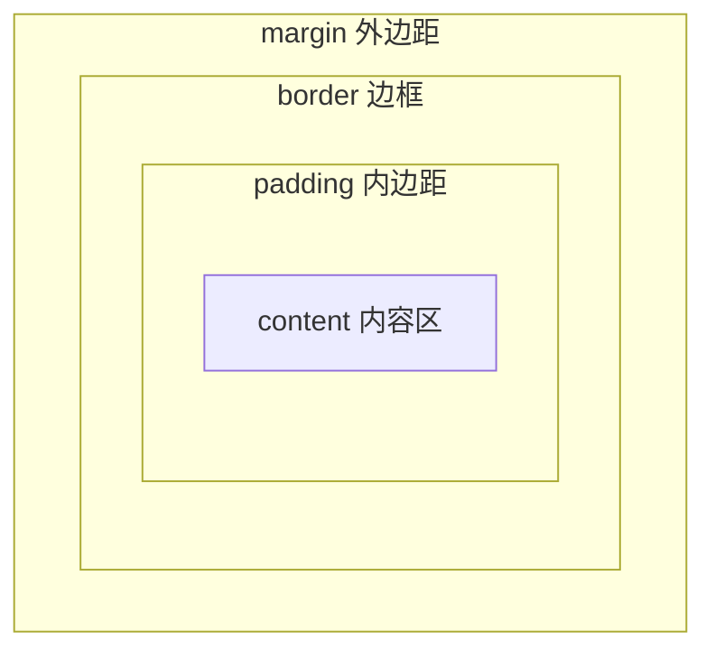

# CSS 盒模型、浮动、定位与显示模式

## 1. 为什么这一份很重要

很多人学 CSS 最难受的地方不是颜色和字体，而是：

- 为什么元素大小不对
- 为什么元素不在预期位置
- 为什么一排排不开
- 为什么布局塌了

这些问题大多和：

- 盒模型
- 显示模式
- 浮动
- 定位

有关。

这一份文档会带你从「盒子」出发，逐步理解元素如何占位、如何排列、如何叠放。学完以后，你应该能：

- 用 DevTools 一眼看出元素实际占了多少空间
- 解释 margin 为什么「合并」而不是相加
- 知道什么时候该用 `position`，什么时候该用 Flex/Grid
- 独立做出：角标卡片、固定按钮、居中弹窗

---

## 2. 盒模型是什么

你可以把每个 HTML 元素都看成一个**盒子（box）**。

CSS 盒模型通常包含四层，从里到外依次是：


| 层级  | 英文      | 作用         |
| --- | ------- | ---------- |
| 内容区 | content | 放文字、图片、子元素 |
| 内边距 | padding | 内容与边框之间的留白 |
| 边框  | border  | 可见的边线，占空间  |
| 外边距 | margin  | 盒子与盒子之间的间距 |


### 2.1 盒模型图解（标准盒模型 content-box）

```
┌─────────────────────────────────────────────┐  ← margin 外边距（透明，不占背景色）
│  ┌───────────────────────────────────────┐  │
│  │           border 边框                 │  │
│  │  ┌─────────────────────────────────┐  │  │
│  │  │         padding 内边距          │  │  │
│  │  │  ┌───────────────────────────┐  │  │  │
│  │  │  │      content 内容区       │  │  │  │
│  │  │  │   width × height 在这里   │  │  │  │
│  │  │  └───────────────────────────┘  │  │  │
│  │  └─────────────────────────────────┘  │  │
│  └───────────────────────────────────────┘  │
└─────────────────────────────────────────────┘
```

**记忆口诀**：内容在内，padding 包一层，border 再包一层，margin 在最外面和其他元素隔开。

### 2.2 盒模型图解（border-box）

当设置 `box-sizing: border-box` 时，`width` 和 `height` 指的是**从 border 内边缘到对边 border 内边缘**的总尺寸，padding 和 border 会「吃」进你写的宽高里：

```
你写的 width: 200px
┌──────────────────────────────────────┐
│←──────────── 200px 总宽 ────────────→│
│ border │ padding │ content │ padding │ border │
└──────────────────────────────────────┘
```

### 2.3 用 Mermaid 理解两层关系




---

## 3. 内容区 content

内容区就是文字、图片、子元素真正放置的区域。

你设置：

```css
width: 200px;
height: 100px;
```

在默认 `box-sizing: content-box` 下，是在控制**内容区**尺寸，不包括 padding 和 border。

### 3.1 示例：内容区与可见区域的区别

```html
<div class="box">Hello</div>
```

```css
.box {
  width: 200px;
  height: 100px;
  padding: 20px;
  border: 5px solid #333;
  background: #e3f2fd;
}
```

此时：

- 内容区宽 = 200px
- 可见背景区域宽 = 200 + 20×2 + 5×2 = **250px**

初学者常误以为「我写了 200px，盒子就应该是 200px 宽」——在默认盒模型下并非如此。

---

## 4. padding 内边距

内边距表示：

- 内容和边框之间的距离
- 会扩大元素背景色的可见范围
- **不会影响 margin 合并**（margin 在 border 外侧）

```css
padding: 20px;           /* 四边相同 */
padding: 10px 20px;      /* 上下 10，左右 20 */
padding: 10px 20px 15px 25px; /* 上 右 下 左（顺时针） */
```

也可以拆写：

```css
padding-top: 10px;
padding-right: 20px;
padding-bottom: 10px;
padding-left: 20px;
```

### 4.1 padding 百分比的特殊规则

`padding` 和 `margin` 的百分比值，参照的是**父元素的宽度**（上下 padding 的百分比也按父元素宽度算，这是 CSS 规范的历史设计）。

```css
.parent { width: 400px; }
.child {
  width: 100%;
  padding-top: 50%; /* 实际是 400 × 50% = 200px，不是按高度算 */
}
```

这在做「宽高比固定」的容器时很有用，但也容易让人困惑。

---

## 5. border 边框

```css
border: 1px solid #ccc;
/* 等价于 */
border-width: 1px;
border-style: solid;
border-color: #ccc;
```

边框会占据空间（在 `content-box` 下会额外增加总宽高）。

### 5.1 简写与圆角

```css
border-radius: 8px;           /* 四角圆角 */
border-radius: 50%;           /* 正圆（需宽高相等） */
border-top-left-radius: 12px; /* 单角 */
```

---

## 6. margin 外边距

外边距表示：

- 当前盒子和其他盒子之间的距离
- 背景色**不会**延伸到 margin 区域
- margin 可以是负值（用于重叠、微调位置，慎用）

```css
margin: 20px;
margin: 0 auto;  /* 块级水平居中（需有宽度） */
```

### 6.1 margin 与 padding 怎么选


| 场景         | 更常用            |
| ---------- | -------------- |
| 让文字离边框远一点  | padding        |
| 让两个卡片之间隔开  | margin         |
| 点击区域变大（按钮） | padding        |
| 块级元素水平居中   | margin: 0 auto |


---

## 7. 盒模型总尺寸怎么计算

### 7.1 content-box（默认）

总宽度：

```
总宽 = width
     + padding-left + padding-right
     + border-left + border-right
```

总高度同理。

这也是为什么你明明写了 `width: 200px`，结果看起来却比 200 更宽。

### 7.2 border-box

总宽度：

```
总宽 = width（已包含 padding 和 border）
```

### 7.3 计算练习

```css
.box {
  box-sizing: content-box;
  width: 100px;
  padding: 10px;
  border: 2px solid black;
  margin: 5px;
}
```

- 内容区宽：100px
- border-box 宽（占布局空间）：100 + 20 + 4 = **124px**
- 与相邻元素间距：margin 5px（合并规则另算）

---

## 8. `box-sizing`

这是非常重要的属性，现代项目几乎都会全局设置。

### 默认值：`content-box`

`width` / `height` 只算内容区。

### 常用值：`border-box`

`width` / `height` 包含内容、padding、border。

```css
* {
  box-sizing: border-box;
}
```

这在现代开发里非常常见，因为：

- 写 `width: 100%` 时不会因为 padding 导致溢出
- 心算布局更简单

### 8.1 对比表


| 属性值         | width 含义         | 加 padding 后总宽 | 推荐场景     |
| ----------- | ---------------- | ------------- | -------- |
| content-box | 仅内容区             | 变大            | 老项目、特殊计算 |
| border-box  | 含 padding+border | 不变（内容区缩小）     | 现代布局、响应式 |


---

## 9. margin 的一些特殊现象

### 9.1 块级元素水平居中

```css
.box {
  width: 300px;
  margin: 0 auto;
}
```

前提：

- 元素有明确宽度
- 通常是块级元素（或 `display: block`）
- 父元素宽度大于子元素

`margin: 0 auto` 的原理：`margin-left` 和 `margin-right` 同为 `auto` 时，浏览器会平分剩余空间。

### 9.2 垂直外边距合并（margin collapse）

上下相邻块级元素的垂直 `margin` 可能不会简单相加，而是**合并为一个较大的值**。

这是初学者常见迷惑点。

#### 9.2.1 兄弟元素之间的合并

```html
<div class="a">A</div>
<div class="b">B</div>
```

```css
.a { margin-bottom: 30px; }
.b { margin-top: 20px; }
```

**实际间距是 30px，不是 50px**（取较大值）。

```
┌─────────┐
│    A    │
└─────────┘
    ↕ 30px（合并后，不是 30+20）
┌─────────┐
│    B    │
└─────────┘
```

#### 9.2.2 父子元素之间的合并

```html
<div class="parent">
  <div class="child">子元素</div>
</div>
```

```css
.parent {
  margin-top: 20px;
  /* 没有 border、padding、BFC 等阻隔时 */
}
.child {
  margin-top: 30px;
}
```

子元素的 `margin-top` 可能「穿透」父元素，与父元素的 `margin-top` 合并，甚至让父元素顶部看起来没有按预期留白。

**解决办法之一**：给父元素加 `padding-top: 1px`、或 `border-top: 1px solid transparent`、或触发 BFC（见第 10 节）。

#### 9.2.3 空块级元素自身合并

```html
<div class="empty"></div>
```

```css
.empty {
  margin-top: 20px;
  margin-bottom: 30px;
}
```

若元素没有 border、padding、内容、行高、高度，上下 margin 会合并，最终对外只表现 **30px**（较大值）。

#### 9.2.4 什么情况下不会合并

- 行内元素（inline）的左右 margin 不合并，上下也不按块级规则合并
- 浮动元素、绝对定位元素的 margin 不参与普通流合并
- 有 `overflow` 非 visible 且形成 BFC 的容器可阻隔父子合并
- flex / grid 子项的 margin **不会**按传统方式合并

#### 9.2.5 margin 合并速查表


| 情况                             | 是否合并 | 合并结果   |
| ------------------------------ | ---- | ------ |
| 兄弟块级，上+下 margin                | 是    | 取最大值   |
| 父子块级，子 margin-top + 父无阻隔       | 是    | 可能穿透合并 |
| 空元素 margin-top + margin-bottom | 是    | 取最大值   |
| 左右 margin                      | 否    | 相加     |
| Flex 子项垂直 margin               | 否    | 各自生效   |


---

## 10. BFC 概念入门

**BFC**（Block Formatting Context，块级格式化上下文）是 CSS 布局中的一个「独立渲染区域」。

你可以先把它理解成：**盒子内部的一套独立排版规则**，内外互不影响（在一定意义上）。

### 10.1 为什么初学者需要知道 BFC

BFC 能解释很多「魔法」：

- 为什么加 `overflow: hidden` 父元素高度就不塌了
- 为什么清除浮动用 `::after { clear: both }` 有效
- 为什么父子 margin 有时「穿透」

### 10.2 如何触发 BFC（常见方式）


| 方式                      | 示例                                 |
| ----------------------- | ---------------------------------- |
| 浮动                      | `float: left / right`              |
| 绝对定位                    | `position: absolute / fixed`       |
| 非 visible 的 overflow    | `overflow: hidden / auto / scroll` |
| `display: flow-root`    | 专为创建 BFC 设计，推荐                     |
| `display: inline-block` | 元素自身形成 BFC                         |
| Flex / Grid 子项          | 子项各自有独立格式化上下文                      |


### 10.3 BFC 能解决什么问题

1. **包含浮动子元素**（防止高度塌陷）
2. **阻止 margin 合并**（父子之间）
3. **阻止浮动元素覆盖**（两栏布局时，非浮动列可与浮动列并排）

### 10.4 最小示例：用 BFC 包住浮动

```html
<div class="wrapper">
  <div class="float-item">浮动</div>
</div>
```

```css
.float-item {
  float: left;
  width: 100px;
  height: 100px;
  background: #ffcc80;
}

/* 给父元素触发 BFC */
.wrapper {
  overflow: hidden; /* 或 display: flow-root; 更语义化 */
  background: #e0e0e0;
}
```

没有 BFC 时，`.wrapper` 高度可能为 0；触发 BFC 后，父元素能包住浮动子元素。

### 10.5 `display: flow-root` 推荐

```css
.clear-bfc {
  display: flow-root;
}
```

专门用于创建 BFC，副作用比 `overflow: hidden` 小（不会意外裁剪内容）。

---

## 11. 显示模式

常见有三种基础认知：

- 块级元素（block）
- 行内元素（inline）
- 行内块元素（inline-block）

此外还有 Flex、Grid 等布局级 display 值（本份先打基础，详细见后续 Flex/Grid 文档）。

---

## 12. 块级元素

特点通常包括：

- 默认独占一行（宽度默认撑满父级 content 区）
- 可设置 `width`、`height`
- 上下 margin、padding 按块级规则生效
- 内部可再放块级或行内子元素（依 HTML 规范）

常见标签：

- `div`、`p`、`h1`~`h6`
- `ul`、`ol`、`li`
- `section`、`article`、`header`、`footer`

```html
<p>段落一</p>
<p>段落二</p>
<!-- 两个 p 默认上下排列，各占一行 -->
```

---

## 13. 行内元素

特点通常包括：

- 默认在一行内从左到右排列，空间不够才换行
- 设置 `width` / `height` 通常**无效**
- 垂直方向 margin、padding 对行高有影响，但不改变「行框」逻辑（历史细节较绕，初学先记：垂直 padding 可能压住上下行）
- 左右 margin、padding 有效

常见标签：

- `span`、`a`、`strong`、`em`
- `label`、`code`

```html
<span>甲</span><span>乙</span><span>丙</span>
<!-- 默认在同一行 -->
```

---

## 14. 行内块元素

特点：

- 一行内排列（像行内）
- 也能设置 `width`、`height`（像块级）
- 元素之间可能出现 **基线对齐空隙**（因 `vertical-align` 默认 baseline，与字体行高有关）

常见：

- `img`、`input`、`button`、`select`、`textarea`
- `display: inline-block` 后的任意元素

```css
img {
  display: block; /* 常见：去掉图片底部空隙 */
}
```

---

## 15. `display` 属性

可以改变元素显示方式。

### 15.1 各 display 值对比表（初学重点）


| display 值              | 是否独占一行      | 可设宽高 | 典型用途         | 注意点           |
| ---------------------- | ----------- | ---- | ------------ | ------------- |
| `block`                | 是           | 是    | 容器、段落、布局列    | 默认宽度 100%     |
| `inline`               | 否           | 否    | 文本强调、链接      | 不要用来做大布局      |
| `inline-block`         | 否           | 是    | 按钮组、标签、图标+文字 | 元素间可能有空隙      |
| `none`                 | —           | —    | 完全隐藏         | 不占空间、不可交互     |
| `flex`                 | 是（块级flex容器） | —    | 一维布局         | 子项变 flex item |
| `grid`                 | 是           | —    | 二维布局         | 见 Grid 文档     |
| `flow-root`            | 是           | 是    | 创建 BFC       | 清除浮动/包浮动      |
| `table` / `table-cell` | 特殊          | 特殊   | 老布局模拟表格      | 现较少用          |


### 15.2 `display: block`

把元素变成块级。

```css
a {
  display: block; /* 导航里常把链接做成块，扩大点击区域 */
  padding: 12px 16px;
}
```

### 15.3 `display: inline`

把元素变成行内。

```css
li {
  display: inline; /* 老式横向菜单，现多用 flex */
}
```

### 15.4 `display: inline-block`

兼顾一行排列和可设宽高。

```css
.tag {
  display: inline-block;
  padding: 4px 8px;
  border-radius: 4px;
}
```

**消除 inline-block 间隙小技巧**：父元素 `font-size: 0`，子元素再设回正常字号；或直接用 Flex。

### 15.5 `display: none`

隐藏元素且不占空间，屏幕阅读器通常也读不到（除非配合 aria）。

```css
.modal--hidden {
  display: none;
}
```

### 15.6 `visibility` 与 `opacity` 对比


| 属性                   | 占空间 | 可点击     | 子元素可单独显示     |
| -------------------- | --- | ------- | ------------ |
| `display: none`      | 否   | 否       | 否            |
| `visibility: hidden` | 是   | 否       | 可以 `visible` |
| `opacity: 0`         | 是   | 是（仍挡点击） | 继承透明         |


---

## 16. `visibility: hidden`

隐藏元素，但仍占空间。

```css
.ghost {
  visibility: hidden;
}
```

这和 `display: none` 是有区别的：前者「隐身占位」，后者「从布局中移除」。

---

## 17. overflow 溢出处理

当内容超出盒子大小时，可以用：


| 值         | 行为            |
| --------- | ------------- |
| `visible` | 默认，溢出画在盒子外    |
| `hidden`  | 裁剪溢出，无滚动条     |
| `scroll`  | 始终显示滚动条（常占空间） |
| `auto`    | 需要时才出现滚动条     |


```css
overflow: hidden;
overflow-x: auto;
overflow-y: hidden;
```

常见场景：

- 裁剪超出内容（轮播图窗口）
- 处理固定高度容器（评论列表）
- 触发 BFC（副作用）
- 单行文字省略常配合 `text-overflow: ellipsis`（需 `white-space: nowrap`）

```css
.ellipsis {
  width: 200px;
  white-space: nowrap;
  overflow: hidden;
  text-overflow: ellipsis;
}
```

---

## 18. 浮动 float

在 Flex 普及前，浮动曾是页面布局的重要方式。

```css
.item {
  float: left;  /* 或 right */
}
```

### 18.1 浮动效果基础理解

- 元素向左或向右**靠齐**，直到碰到父元素边缘或前一个浮动元素
- **脱离文档流**（不完全脱离：仍影响父元素宽度计算等，但文字会环绕）
- 行内内容会环绕浮动元素（文字绕图排版）

```
正常流：  [块1]
          [块2]

浮动后：  [float][文字文字文字文字环绕]
          [文字继续环绕............]
          [块2 可能上移填补 float 左侧留下的「行框」空间]
```

### 18.2 浮动布局完整案例：两栏 + 页脚

```html
<div class="page clearfix">
  <aside class="sidebar">侧边栏 200px</aside>
  <main class="main">主内容区自适应</main>
</div>
<footer class="footer">页脚必须清浮动后在下方</footer>
```

```css
.sidebar {
  float: left;
  width: 200px;
  min-height: 300px;
  background: #bbdefb;
}

.main {
  margin-left: 200px; /* 为左侧浮动留出空间 */
  min-height: 300px;
  background: #f5f5f5;
}

.footer {
  clear: both;
  background: #333;
  color: #fff;
  padding: 16px;
}
```

### 18.3 浮动布局完整案例：图文环绕

```html
<article class="article clearfix">
  
  <p>正文围绕图片环绕。浮动常用于杂志式排版……</p>
</article>
```

```css
.thumb {
  float: left;
  width: 120px;
  margin: 0 16px 8px 0;
}
```

### 18.4 三栏「圣杯」思路简述（了解即可）

中间主栏 `float: left` + 左右栏也浮动，通过负 margin 调整位置——经典面试题，现代项目请用 **Grid** 或 **Flex**，但读老代码时会遇到。

---

## 19. 为什么要了解浮动

虽然现代布局更多用 Flex 和 Grid，但你依然应该了解浮动，因为：

- 旧项目、后台模板、邮件 HTML 里很常见
- 面试和阅读老代码会遇到
- `clear`、`BFC` 与浮动问题紧密相关，理解浮动有助于理解布局本质

---

## 20. 浮动带来的常见问题

### 20.1 父元素高度塌陷

如果子元素**全部**浮动，父元素在计算高度时可能忽略浮动子元素，导致高度为 0 或只剩 padding/border。

```html
<div class="parent">
  <div class="child">浮动子元素</div>
</div>
<!-- parent 看起来是一条线，没有包住 child -->
```

### 20.2 周围元素错位

非浮动元素会与浮动元素在同一行「环绕」，若未 `clear`，页脚可能跑到侧边栏旁边而不是下方。

### 20.3 浮动元素重叠

同一方向多个浮动，宽度之和超过父级时会**掉下去**（wrap），有时不是预期换行。

---

## 21. 清除浮动

清除浮动的本质是：让元素**不要**再环绕前面的浮动，并迫使父级在计算高度时包含浮动（视方法而定）。

### 21.1 多种方法对比表


| 方法                     | 代码要点                       | 优点       | 缺点         | 推荐度   |
| ---------------------- | -------------------------- | -------- | ---------- | ----- |
| 空元素 `clear: both`      | `<div style="clear:both">` | 简单       | 多余 DOM，不推荐 | ★☆☆☆☆ |
| 父元素 `overflow: hidden` | 触发 BFC                     | 无额外标签    | 可能裁剪阴影/下拉  | ★★★☆☆ |
| `display: flow-root`   | 专门 BFC                     | 语义清晰     | 老浏览器需考虑    | ★★★★☆ |
| **clearfix 伪元素**       | `::after { clear: both }`  | 经典、无额外标签 | 需记得加 class | ★★★★★ |
| 父元素也浮动                 | 父级 `float`                 | —        | 连锁塌陷       | ★☆☆☆☆ |


### 21.2 clearfix 标准写法（推荐）

```css
.clearfix::after {
  content: "";
  display: block;
  clear: both;
}
```

使用：

```html
<div class="parent clearfix">
  <div class="child" style="float:left">...</div>
</div>
```

### 21.3 子元素 `clear: both`

```css
.footer {
  clear: both;
}
```

适合页脚、分隔块，**不能**单独解决父高度塌陷，需配合 BFC 或 clearfix。

### 21.4 `display: flow-root` 一行清除

```css
.parent {
  display: flow-root;
}
```

现代项目里可与 clearfix 二选一，优先 `flow-root`。

---

## 22. position 定位

定位是 CSS 中非常重要的一类能力。

常见值：


| 值          | 脱离文档流          | 参照物         |
| ---------- | -------------- | ----------- |
| `static`   | 否              | 无           |
| `relative` | 否（仍占位）         | 自身原位置       |
| `absolute` | 是              | 最近已定位祖先     |
| `fixed`    | 是              | 视口 viewport |
| `sticky`   | 滚动前类似 relative | 滚动后粘在某个阈值   |


---

## 23. `static` 完整示例

默认定位方式，元素按正常文档流排列。`top` / `left` / `z-index` 对 static 元素**无效**（写了也不生效）。

```html
<div class="box static-box">静态定位</div>
```

```css
.static-box {
  position: static;
  top: 50px;   /* 无效 */
  left: 50px;  /* 无效 */
  background: #c8e6c9;
  padding: 16px;
}
```

---

## 24. `relative` 完整示例

相对定位：相对**自己原本应该在的位置**偏移，**原占位保留**，不拖垮其他元素的大布局（与 absolute 对比）。

```html
<div class="card">
  <span class="badge">NEW</span>
  <h3>商品标题</h3>
</div>
```

```css
.card {
  position: relative; /* 常作为 absolute 子元素的参照 */
  width: 240px;
  padding: 16px;
  border: 1px solid #ddd;
}

.badge {
  position: absolute; /* 相对 .card */
  top: 8px;
  right: 8px;
  background: #e53935;
  color: #fff;
  font-size: 12px;
  padding: 2px 6px;
  border-radius: 4px;
}
```

**仅 relative 偏移自身**（不当地基）：

```css
.nudge {
  position: relative;
  top: 10px;
  left: 20px;
}
/* 视觉上下移 10px、右移 20px，但原位置仍占着 */
```

---

## 25. `absolute` 完整示例

绝对定位：脱离文档流，相对**最近的 `position` 不为 `static` 的祖先**定位；若没有，则相对初始包含块（通常是 viewport 或 html/body 链）。

### 25.1 角标（父 relative + 子 absolute）

```html
<div class="product">
  
  <span class="tag">热卖</span>
</div>
```

```css
.product {
  position: relative;
  width: 200px;
}

.product img {
  width: 100%;
  display: block;
}

.product .tag {
  position: absolute;
  top: 0;
  left: 0;
  background: rgba(0, 0, 0, 0.7);
  color: #fff;
  padding: 4px 8px;
}
```

### 25.2 居中弹窗内容区（absolute + transform）

```html
<div class="overlay">
  <div class="dialog">对话框</div>
</div>
```

```css
.overlay {
  position: fixed;
  inset: 0;
  background: rgba(0, 0, 0, 0.5);
}

.dialog {
  position: absolute;
  top: 50%;
  left: 50%;
  transform: translate(-50%, -50%);
  width: 320px;
  padding: 24px;
  background: #fff;
  border-radius: 8px;
}
```

### 25.3 填满父元素（四边归零）

```css
.cover {
  position: absolute;
  top: 0;
  right: 0;
  bottom: 0;
  left: 0;
  /* 或简写：inset: 0; */
  background: rgba(0, 0, 0, 0.4);
}
```

---

## 26. `fixed` 完整示例

固定定位：相对**浏览器视口**，滚动页面时位置不变。

### 26.1 右下角返回顶部按钮

```html
<button class="fab" type="button" aria-label="返回顶部">↑</button>
```

```css
.fab {
  position: fixed;
  right: 24px;
  bottom: 24px;
  width: 48px;
  height: 48px;
  border: none;
  border-radius: 50%;
  background: #1976d2;
  color: #fff;
  font-size: 20px;
  cursor: pointer;
  box-shadow: 0 4px 12px rgba(0, 0, 0, 0.2);
  z-index: 100;
}
```

### 26.2 固定顶栏

```css
.header {
  position: fixed;
  top: 0;
  left: 0;
  right: 0;
  height: 56px;
  background: #fff;
  box-shadow: 0 1px 4px rgba(0, 0, 0, 0.08);
  z-index: 200;
}

/* 正文需留出顶栏高度 */
body {
  padding-top: 56px;
}
```

**注意**：移动端 `position: fixed` 在软键盘弹出时偶有抖动，属已知兼容话题，进阶可用 `sticky` 或 JS 辅助。

---

## 27. `sticky` 完整示例

粘性定位：在 `top` / `left` 等阈值触发前表现为 `relative`，滚动到阈值后「粘」在视口边缘，像 `fixed` 但**限制在父元素盒内**。

```html
<div class="section">
  <h2 class="sticky-title">章节标题（滚动试试）</h2>
  <p>很长很长的内容……</p>
</div>
```

```css
.sticky-title {
  position: sticky;
  top: 0;
  background: #fff3e0;
  padding: 12px;
  z-index: 10;
}
```

**生效条件**（常见踩坑）：

- 必须设置 `top` / `bottom` / `left` / `right` 之一
- 祖先不能有 `overflow: hidden` 截断（否则粘不住）
- 父元素高度要够滚动

---

## 28. `z-index` 与层叠上下文

`z-index` 控制**同一层叠上下文内**定位元素的上下顺序。数值越大，越靠上（越挡住下面）。

```css
.modal {
  z-index: 1000;
}
.dropdown {
  z-index: 100;
}
```

### 28.1 前提

通常元素需要 `position` 为 `relative` / `absolute` / `fixed` / `sticky`，且 `z-index` 不是 `auto`，才参与比较。

### 28.2 层叠上下文（stacking context）入门

**层叠上下文**像一层「透明玻璃板」。每个上下文内部自己比 `z-index`，**子元素再高也盖不住别的上下文里更高的板**。

#### 常见会创建新层叠上下文的情况

- `position` 定位且 `z-index` 不是 `auto`
- `opacity` 小于 1
- `transform` 不为 `none`
- `filter` 不为 `none`
- `flex` / `grid` 子项且 `z-index` 不是 `auto`
- `isolation: isolate`

#### 图解：为什么「子 z-index 9999 仍被挡」

```
页面
├── 上下文 A（z-index: 1）  ← 整块板子在下面
│     └── 子元素 z-index: 9999
└── 上下文 B（z-index: 2）  ← 整块板子在上面
      └── 子元素 z-index: 1   ← 仍然盖住 A 里的 9999
```

### 28.3 实战层级建议


| 层级       | 建议 z-index 范围 |
| -------- | ------------- |
| 普通内容     | auto / 0      |
| 下拉菜单     | 100 ~ 200     |
| 固定头栏     | 200 ~ 300     |
| 遮罩层      | 1000          |
| 弹窗       | 1001          |
| Toast 提示 | 1100          |


同一页面尽量用**设计令牌**统一管理，避免到处写 `99999`。

### 28.4 示例：弹窗盖住固定按钮

```css
.fab { z-index: 100; }
.overlay { z-index: 1000; }
.dialog { z-index: 1001; }
```

---

## 29. 定位的常见应用

- 角标（relative + absolute）
- 弹窗与遮罩（fixed + absolute 居中）
- 悬浮按钮（fixed）
- 下拉菜单（absolute + z-index）
- 轮播图箭头（absolute 叠在图片上）
- 视频播放控件覆盖层

---

## 30. DevTools 调试盒模型技巧

Chrome / Edge / Firefox 开发者工具是布局学习的「显微镜」。

### 30.1 查看盒模型示意图

1. 打开 DevTools（F12 或右键「检查」）
2. 选中元素（左上角箭头图标）
3. 右侧 **Styles** 面板下方或 **Computed** 面板中的 **Box Model** 图

你会看到 content、padding、border、margin 的**计算后像素值**，比手算更准确。

### 30.2 高亮 margin / padding

- Chrome：在 Box Model 图上点击 margin/padding 区域，可**临时编辑**数值看效果
- 勾选 **Layout** 相关 overlay，可显示网格、flex 线（后续文档会多用）

### 30.3 查「谁把我挤下去了」

1. Computed 里看 `width`、`box-sizing`
2. 看 `margin` 是否合并（试给父元素加 `outline` 观察间距）
3. 看是否有 `float` 未清除
4. **Elements** 面板悬停 DOM 树，页面会高亮该元素占用区域（含 margin 虚线）

### 30.4 查定位参照物

对 `position: absolute` 元素：

1. 看 Computed 的 `position`
2. 向上遍历父元素，找第一个 `position` 非 `static` 的节点
3. 在 Styles 里勾选 `position: relative` 试父级，看子元素是否跟着动

### 30.5 强制状态调试

- `:hov` 按钮可强制 `:hover`、`:active`、`:focus`
- 调试下拉、菜单显示时非常有用

### 30.6 截图与测量

Firefox 标尺工具、Chrome 的 **Inspect** 尺寸提示，可量元素间距，验证 margin 合并后的实际距离。

---

## 31. 常见布局 bug 排查清单

遇到「布局不对」时，按下面顺序自查，能解决大部分初学者问题。

### 31.1 尺寸不对

- [ ] 是否 `box-sizing: content-box` 导致 padding/border 撑大？
- [ ] `width: 100%` 再加 padding 是否溢出父级？
- [ ] 是否有 `min-width` / `max-width` 覆盖？
- [ ] 图片未设 `max-width: 100%` 撑破容器？

### 31.2 间距不对

- [ ] 垂直 margin 是否合并？用 DevTools 看实际距离
- [ ] 是否把 padding 当成 margin 在调？
- [ ] inline-block 间隙是否来自 HTML 换行符？

### 31.3 高度塌陷 / 重叠

- [ ] 子元素是否全浮动？父级是否 BFC / clearfix？
- [ ] 是否误用 `height: 100%` 但父级无高度？
- [ ] absolute 子元素是否不参与父高度？

### 31.4 定位不对

- [ ] absolute 的参照父级是否 `position: relative`？
- [ ] fixed 是否被祖先 `transform` 影响（变相当 absolute）？
- [ ] sticky 祖先是否有 `overflow: hidden`？
- [ ] z-index 是否在不同层叠上下文里比大小？

### 31.5 显示异常

- [ ] `display: none` 与 `visibility: hidden` 用错？
- [ ] `overflow: hidden` 是否裁掉了阴影或下拉？
- [ ] 浮动未 `clear` 导致页脚上移？

---

## 32. 完整实战：角标卡片 + 固定按钮 + 居中弹窗

下面是一个**可复制运行**的完整小页面，综合运用盒模型、定位、z-index。

```html
<!DOCTYPE html>
<html lang="zh-CN">
<head>
  <meta charset="UTF-8" />
  <meta name="viewport" content="width=device-width, initial-scale=1.0" />
  <title>布局实战 Demo</title>
  <style>
    * {
      box-sizing: border-box;
      margin: 0;
      padding: 0;
    }

    body {
      font-family: system-ui, sans-serif;
      background: #f0f2f5;
      padding: 24px;
      min-height: 200vh; /* 方便测试滚动与 fixed */
    }

    /* 角标卡片 */
    .card {
      position: relative;
      width: 280px;
      padding: 20px;
      background: #fff;
      border-radius: 12px;
      box-shadow: 0 2px 8px rgba(0, 0, 0, 0.08);
      margin-bottom: 24px;
    }

    .card__badge {
      position: absolute;
      top: -8px;
      right: -8px;
      background: #e53935;
      color: #fff;
      font-size: 12px;
      font-weight: bold;
      padding: 4px 10px;
      border-radius: 999px;
      box-shadow: 0 2px 6px rgba(229, 57, 53, 0.4);
      z-index: 1;
    }

    .card__title {
      font-size: 18px;
      margin-bottom: 8px;
    }

    .card__desc {
      color: #666;
      font-size: 14px;
      line-height: 1.6;
    }

    /* 打开弹窗的按钮 */
    .open-btn {
      padding: 10px 20px;
      border: none;
      border-radius: 8px;
      background: #1976d2;
      color: #fff;
      cursor: pointer;
      font-size: 14px;
    }

    .open-btn:hover {
      background: #1565c0;
    }

    /* 固定右下角 FAB */
    .fab {
      position: fixed;
      right: 24px;
      bottom: 24px;
      width: 52px;
      height: 52px;
      border: none;
      border-radius: 50%;
      background: #43a047;
      color: #fff;
      font-size: 22px;
      cursor: pointer;
      box-shadow: 0 4px 14px rgba(0, 0, 0, 0.2);
      z-index: 100;
    }

    /* 遮罩 + 居中弹窗 */
    .modal {
      display: none;
      position: fixed;
      inset: 0;
      z-index: 1000;
    }

    .modal.is-open {
      display: block;
    }

    .modal__backdrop {
      position: absolute;
      inset: 0;
      background: rgba(0, 0, 0, 0.45);
    }

    .modal__panel {
      position: absolute;
      top: 50%;
      left: 50%;
      transform: translate(-50%, -50%);
      width: min(90vw, 360px);
      padding: 24px;
      background: #fff;
      border-radius: 12px;
      box-shadow: 0 8px 32px rgba(0, 0, 0, 0.2);
      z-index: 1001;
    }

    .modal__title {
      font-size: 20px;
      margin-bottom: 12px;
    }

    .modal__actions {
      margin-top: 20px;
      text-align: right;
    }

    .modal__close {
      padding: 8px 16px;
      border: 1px solid #ddd;
      border-radius: 6px;
      background: #fff;
      cursor: pointer;
    }
  </style>
</head>
<body>
  <article class="card">
    <span class="card__badge">HOT</span>
    <h2 class="card__title">入门学习卡</h2>
    <p class="card__desc">
      这张卡片演示了 relative 容器 + absolute 角标。
      注意角标用负 top/right 露出卡片外缘。
    </p>
  </article>

  <button class="open-btn" type="button" id="openModal">打开居中弹窗</button>

  <button class="fab" type="button" aria-label="帮助">?</button>

  <div class="modal" id="modal" role="dialog" aria-modal="true" aria-labelledby="modalTitle">
    <div class="modal__backdrop" id="backdrop"></div>
    <div class="modal__panel">
      <h3 class="modal__title" id="modalTitle">提示</h3>
      <p>这是 fixed 遮罩 + absolute 居中的弹窗。FAB 在 z-index: 100，弹窗在 1000+。</p>
      <div class="modal__actions">
        <button class="modal__close" type="button" id="closeModal">关闭</button>
      </div>
    </div>
  </div>

  <script>
    const modal = document.getElementById('modal');
    document.getElementById('openModal').onclick = () => modal.classList.add('is-open');
    document.getElementById('closeModal').onclick = () => modal.classList.remove('is-open');
    document.getElementById('backdrop').onclick = () => modal.classList.remove('is-open');
  </script>
</body>
</html>
```

### 32.1 本实战知识点对照


| 效果       | 技术点                                 |
| -------- | ----------------------------------- |
| 卡片留白     | padding + border-box                |
| 角标露出外缘   | 父 relative，子 absolute，负偏移           |
| 右下角按钮    | fixed + z-index: 100                |
| 弹窗遮罩     | fixed 全屏 + rgba 背景                  |
| 弹窗居中     | absolute + top/left 50% + translate |
| 弹窗盖住 FAB | 更高 z-index 层叠上下文                    |


---

## 33. 初学者常见错误

### 33.1 不理解为什么宽度超了

通常是盒模型问题：默认 `content-box` 下 padding/border 会加在 width 外面。解决：全局 `border-box` 或心算总宽。

### 33.2 父元素高度塌陷

通常和浮动有关：子元素全 float，父级未 BFC / clearfix。

### 33.3 absolute 定位找不到参照物

通常是父级没设 `position: relative`，子元素相对更远的祖先或视口定位，看起来「跑偏」。

### 33.4 用定位硬写全页面布局

全站 `absolute` 会导致响应式差、维护难。页面级布局优先 **Flex / Grid**，定位用于「叠在某块区域上」的组件。

### 33.5 z-index 无限加大

`z-index: 999999` 不能解决层叠上下文错误，反而难维护。

### 33.6 忽略 margin 合并

两个区块间距「怎么调都不对」，可能是合并；试只改一侧 margin，或中间加 padding/border 阻隔。

---

## 34. 分级练习

按难度递进，建议每级都**自己敲代码**并打开 DevTools 验证。

### 34.1 入门级

1. 做一个宽 300px 的卡片：`padding: 16px`、`border: 2px solid #ccc`、`margin: 0 auto` 居中。
2. 用 `box-sizing` 对比：同一 width 下 content-box 与 border-box 的总宽差异（写在笔记里）。
3. 两个 `div` 各设 `margin-top` / `margin-bottom`，用 DevTools 验证合并后的间距。

### 34.2 进阶级

1. 左图右文：图片 `float: left`，文字环绕；父级用 `clearfix` 或 `flow-root` 包住。
2. 商品卡片：图片上左上角「新品」角标（relative + absolute）。
3. 模拟 margin 塌陷：父子各设 `margin-top`，再分别用 `padding-top`、`overflow: hidden`、`flow-root` 修复。

### 34.3 挑战级

1. 固定底栏 + 正文 `padding-bottom` 避免被挡；底栏 z-index 与内容关系写清。
2. 实现居中弹窗（不用 JS 库），支持点击遮罩关闭；层级盖住页面内所有 fixed 元素。
3. 做 `position: sticky` 表头：表格滚动时表头粘在容器顶部（注意父级 overflow）。

### 34.4 自检标准

- 能向别人讲清 content / padding / border / margin 四层
- 能说出 3 种清除浮动方式及优缺点
- 能独立写出角标 + fixed 按钮 + 弹窗 Demo

---

## 35. FAQ 常见问题

### Q1：`margin: 0 auto` 为什么不居中？

常见原因：元素没有固定宽度（块级会占满一行，看不出居中）；元素是 `inline` 或 `float`；父级比子级还窄。

### Q2：padding 和 margin 百分比相对谁？

都相对**包含块宽度**（一般是父元素 content 宽），不是相对自身高度。

### Q3：浮动还要学吗？

要**理解**，新布局用 Flex/Grid；读老代码、处理图文环绕、面试仍会遇到。

### Q4：absolute 和 fixed 有什么区别？

`absolute` 相对已定位祖先（或初始包含块）；`fixed` 相对视口，滚动也不动（除非祖先 transform 等创建特殊包含块）。

### Q5：为什么设置了 z-index 还是被挡住？

多半在**另一个层叠上下文**里比较；提高子 z-index 不如提高**正确那一层**父级的 z-index，或调整 DOM 结构。

### Q6：`display: none` 和 `visibility: hidden` 选哪个？

不占位、彻底隐藏用 `none`；占位、布局不抖动用 `visibility`；动画渐隐常用 `opacity`。

### Q7：图片下面有一条缝？

inline 默认基线对齐，图片底下会留行高空隙。常设 `display: block` 或 `vertical-align: top`。

### Q8：sticky 不生效？

检查是否写了 `top`；祖先 `overflow: hidden`；父高度不够；元素自身 `display` 是否合适。

### Q9：清除浮动用 overflow:hidden 有什么副作用？

可能裁剪**溢出**的阴影、下拉菜单、角标（负定位）。更推荐 `flow-root` 或 clearfix。

### Q10：全站 `* { box-sizing: border-box }` 安全吗？

现代项目普遍安全且推荐；第三方组件若依赖 content-box，个别需单独覆盖（少见）。

### Q11：margin-bottom 和 margin-top 同时设，哪个生效？

相邻块级元素的垂直 margin 会**合并**，取较大值而不是相加。比如上元素 `margin-bottom: 30px`，下元素 `margin-top: 20px`，间距是 30px（不是 50px）。

### Q12：为什么 `position: sticky` 不粘？

检查三个条件：① 是否设置了 `top`/`bottom`/`left`/`right`（必须）；② 祖先元素是否有 `overflow: hidden`（会破坏 sticky）；③ 父元素高度是否足够滚动。

### Q13：absolute 子元素为什么跑到屏幕左上角去了？

因为它的所有祖先元素都没有 `position: relative/absolute/fixed/sticky`。给它想依附的父元素加上 `position: relative` 即可。

---

## 37. 盒模型计算器（交互式练习思路）

学习盒模型时，建议在浏览器开发者工具里做以下练习（F12 → Elements → Styles 边改边看 Computed）：

### 练习步骤

```css
/* 1. 在下面这段 CSS 上逐条修改，观察 Computed 面板的数值变化 */
.box {
  width: 200px;
  height: 100px;
  padding: 20px;
  border: 5px solid #333;
  margin: 15px;
  box-sizing: content-box; /* 改成 border-box 看差异 */
}
```

### 练习记录表


| 练习  | 操作             | content-box 总宽               | border-box 内容宽            |
| --- | -------------- | ---------------------------- | ------------------------- |
| 1   | 初始值（width:200） | = 200 + 40 + 10 = **250px**  | = 200 — 内容区自动缩小           |
| 2   | width 改为 300   | = 300 + 40 + 10 = **350px**  | = 300（含 padding + border） |
| 3   | padding 改为 40  | = 200 + 80 + 10 = **290px**  | = 200（padding 大了内容区更小）    |
| 4   | border 改为 10   | = 200 + 40 + 20 = **260px**  | = 200（border 大了内容区更小）     |
| 5   | margin 改为 50   | **总宽不变** = 250px（margin 在外层） | 不变（margin 不参与 width 计算）   |


### 关键发现

- content-box：加 padding/border → 元素变宽（容易溢出）
- border-box：加 padding/border → 内容区缩小（总宽不变，布局更稳）
- margin 不占盒模型宽度——它在盒模型"外面"

---

## 38. margin collapse 完整可视化

### 兄弟元素合并（取最大值）

```
<div class="box-a" style="margin-bottom:30px; background:#bbdefb;">A</div>
<div class="box-b" style="margin-top:20px; background:#c8e6c9;">B</div>

期望间距: 30 + 20 = 50px
实际间距: max(30, 20) = 30px ← 塌陷了！

┌─────────┐
│  A (蓝)  │  margin-bottom: 30px ─┐
└─────────┘                       ├─ 合并 → 30px
┌─────────┐  margin-top: 20px ────┘
│  B (绿)  │
└─────────┘
```

### 父子元素合并（子 margin 穿透父）

```
┌────────────────────┐
│  .parent            │  ← 无 border/padding/BFC
│  ┌──────────────┐  │
│  │ .child        │  │  child 的 margin-top: 30px
│  │ margin-top:30 │──│──可能穿透到 parent 上面！
│  └──────────────┘  │
└────────────────────┘
```

**修复方式（选一种）**：

```css
.parent {
  /* 方案 1：加 padding */
  padding-top: 1px;
  
  /* 方案 2：加 border */
  border-top: 1px solid transparent;
  
  /* 方案 3：触发 BFC（推荐） */
  overflow: hidden;
  /* 或 */ display: flow-root;
}
```

---

## 39. BFC 触发方式速查（完整版）


| 方式                      | CSS 代码                   | 副作用       | 推荐度   |
| ----------------------- | ------------------------ | --------- | ----- |
| `display: flow-root`    | `display: flow-root;`    | 无（专为此设计）  | ⭐⭐⭐⭐⭐ |
| `overflow: hidden`      | `overflow: hidden;`      | 可能裁剪阴影/下拉 | ⭐⭐⭐   |
| `overflow: auto`        | `overflow: auto;`        | 可能出现滚动条   | ⭐⭐⭐   |
| `display: inline-block` | `display: inline-block;` | 元素变行内块    | ⭐⭐    |
| `float: left`           | `float: left;`           | 脱离文档流     | ⭐     |
| `position: absolute`    | `position: absolute;`    | 完全脱离文档流   | ⭐     |
| Flex/Grid 子项            | 父元素 `display: flex/grid` | 子项自动有 BFC | —     |


### 推荐方案

```css
/* 需要创建 BFC 的容器 — 一行搞定 */
.clearfix-new {
  display: flow-root;
}
```

---

## 40. sticky 失效场景排查指南

### 必须满足的条件

1. **必须指定** `top`/`bottom`/`left`/`right` 中至少一个值
2. **祖先不能有** `overflow: hidden`/`scroll`/`auto`（否则粘性定位计算被截断）
3. **父元素高度**必须大于 sticky 元素（否则没有滚动空间，"粘"不起来）
4. sticky 元素的父元素不能有 `height: 100%` 且祖先是 flex 容器（在某些浏览器有 bug）

### 排查步骤

```css
/* 第 1 步：确认写了阈值 */
.sticky-title {
  position: sticky;
  top: 0;  /* ← 必须有！否则不粘 */
}

/* 第 2 步：检查所有祖先 */
/* 用 DevTools 逐个检查父级是否有 overflow: hidden */

/* 第 3 步：确认父元素有足够高度 */
/* 父元素高度要 > sticky 元素高度 */
```

### 完整可运行示例

```html
<style>
  .scroll-container {
    height: 400px; overflow-y: auto; /* 这个 overflow 可以，因为它在 sticky 祖先上面 */
    border: 1px solid #ccc;
  }
  .section { margin-bottom: 16px; }
  .section-title {
    position: sticky; top: 0;
    background: #fff3e0; padding: 12px;
    z-index: 1;
  }
</style>
<div class="scroll-container">
  <div class="section">
    <h3 class="section-title">第一章</h3>
    <p>内容...</p><p>内容...</p><p>内容...</p>
  </div>
  <div class="section">
    <h3 class="section-title">第二章</h3>
    <p>内容...</p><p>内容...</p><p>内容...</p>
  </div>
</div>
```

---

## 41. 多层级弹窗系统实战

```html
<!DOCTYPE html>
<html lang="zh-CN">
<head>
  <meta charset="UTF-8" />
  <style>
    * { box-sizing: border-box; margin: 0; padding: 0; }
    body { font-family: system-ui, sans-serif; padding: 24px; }

    /* ===== 层级设计 ===== */
    /* 100-199: 下拉、tooltip */
    /* 200-299: 固定导航 */
    /* 1000-1099: 遮罩 + 弹窗 */
    /* 1100+: Toast/通知 */

    .page-header {
      position: sticky; top: 0; z-index: 200;
      background: #fff; padding: 16px; box-shadow: 0 1px 4px rgba(0,0,0,.1);
    }

    /* 下拉菜单 */
    .dropdown { position: relative; display: inline-block; }
    .dropdown-menu {
      position: absolute; top: 100%; left: 0;
      z-index: 150;
      background: #fff; border: 1px solid #e2e8f0;
      border-radius: 8px; box-shadow: 0 8px 24px rgba(0,0,0,.12);
      padding: 8px 0; min-width: 160px;
      display: none;
    }
    .dropdown-menu.show { display: block; }

    /* 遮罩层 */
    .overlay {
      position: fixed; inset: 0; z-index: 1000;
      background: rgba(0,0,0,.5);
      display: none;
    }
    .overlay.show { display: block; }

    /* 弹窗 */
    .modal {
      position: fixed; top: 50%; left: 50%;
      transform: translate(-50%, -50%);
      z-index: 1001;
      background: #fff; padding: 24px; border-radius: 12px;
      width: min(90vw, 400px);
      box-shadow: 0 16px 48px rgba(0,0,0,.2);
      display: none;
    }
    .modal.show { display: block; }

    /* Toast 通知 — 最高层级 */
    .toast {
      position: fixed; bottom: 24px; left: 50%;
      transform: translateX(-50%);
      z-index: 1200;
      background: #1e293b; color: #fff;
      padding: 12px 24px; border-radius: 999px;
      display: none;
    }
    .toast.show { display: block; }
  </style>
</head>
<body>
  <header class="page-header">
    <span style="font-weight:700;">MyApp</span>
    <div class="dropdown">
      <button onclick="document.getElementById('dropMenu').classList.toggle('show')">菜单 ▼</button>
      <div class="dropdown-menu" id="dropMenu">
        <a href="#" style="display:block;padding:8px 16px;">编辑</a>
        <a href="#" style="display:block;padding:8px 16px;">删除</a>
      </div>
    </div>
    <button onclick="openModal()">打开弹窗</button>
  </header>

  <!-- 弹窗遮罩 -->
  <div class="overlay" id="overlay"
       onclick="closeModal()"></div>

  <!-- 弹窗 -->
  <div class="modal" id="modal">
    <h3>确认操作</h3>
    <p>这个弹窗在 z-index: 1001，覆盖了固定导航（200）。</p>
    <p>下拉菜单（150）则被弹窗盖住。</p>
    <button onclick="closeModal()">关闭</button>
  </div>

  <!-- Toast -->
  <div class="toast" id="toast">✅ 操作成功</div>

  <p style="margin-top:24px; line-height: 1.8;">
    长内容...<br/>长内容...<br/>长内容...
  </p>

  <script>
    function openModal() {
      document.getElementById('overlay').classList.add('show');
      document.getElementById('modal').classList.add('show');
    }
    function closeModal() {
      document.getElementById('overlay').classList.remove('show');
      document.getElementById('modal').classList.remove('show');
      // 弹窗关闭时显示 Toast
      const toast = document.getElementById('toast');
      toast.classList.add('show');
      setTimeout(() => toast.classList.remove('show'), 2000);
    }
    // 点击下拉菜单外部关闭
    document.addEventListener('click', (e) => {
      if (!e.target.closest('.dropdown')) {
        document.getElementById('dropMenu').classList.remove('show');
      }
    });
  </script>
</body>
</html>
```

**本示例知识点对照**：

- 层叠上下文分层管理（150/200/1000/1001/1200）
- 下拉菜单、弹窗遮罩、Toast 通知
- 点击外部关闭模式
- z-index 没有出现 `99999`——一切都按层级体系分配

---

## 36. 练习建议（综合）

建议你自己做：

1. 一个带 margin 和 padding 的卡片，并用 DevTools 读出四层数值
2. 一个左右浮动两栏布局 + clearfix 页脚
3. 一个带绝对定位角标的图片卡片
4. 一个固定在页面右下角的按钮 + 更高层级的弹窗
5. 一份「布局 bug 排查」笔记，记录你踩过的 3 个问题及原因

---

## 37. 学完标准

如果你能做到这些，这一份就掌握得不错：

- 知道盒模型四层构成，能画示意图说明 content-box 与 border-box
- 会用 margin、padding、border，理解垂直 margin 合并的几种情况
- 知道 BFC 是什么、能触发 BFC 的常用方式、能解决浮动塌陷
- 理解 block、inline、inline-block 及 display 对比表
- 理解浮动、清除浮动的多种方法及对比
- 能写 relative / absolute / fixed / sticky 的完整小例子
- 理解 z-index 与层叠上下文，不会盲目叠 `99999`
- 会用 DevTools Box Model 调试布局
- 能独立完成角标卡片 + 固定按钮 + 居中弹窗实战

---

## 38. 与后续内容的衔接

- **Flex 弹性布局**：一维排列、对齐、分布，可替代多数浮动分栏
- **Grid 网格布局**：二维页面骨架，适合整页布局
- **响应式**：`max-width`、`媒体查询` 与盒模型配合

把本份的「盒子 + 定位」打牢，后面学 Flex/Grid 会轻松很多——因为它们同样是围绕「容器如何分配空间」展开的，只是规则更强大、更直观。

---

*文档版本：扩充版 | 建议学习时长：4~6 小时（含练习）*