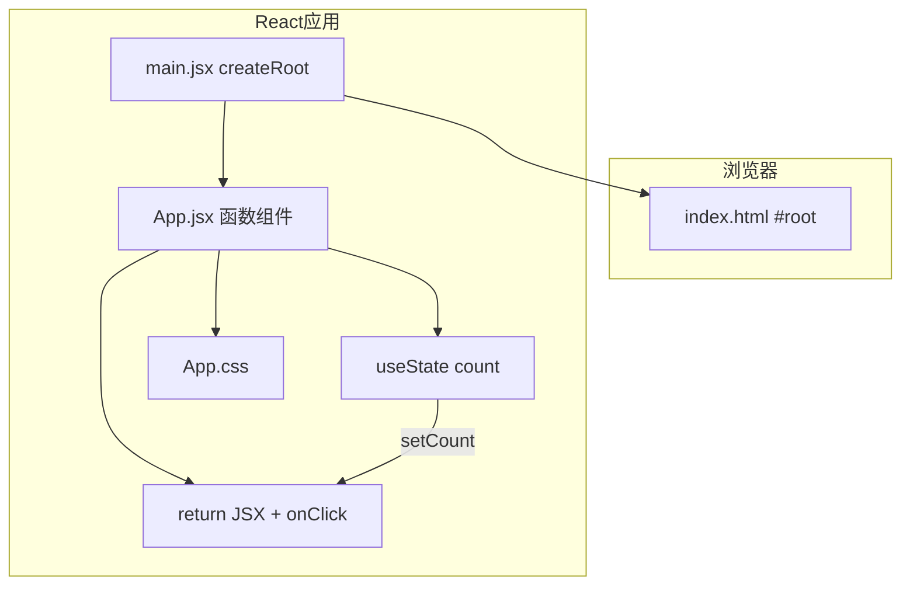

# React 入门与环境搭建

## 本章与上一章的关系

00 路线图告诉你 React 学什么、按什么顺序、用什么工具。前提是你已经会用 HTML/CSS/JS 搭静态页、会用 `fetch` 调接口、会在浏览器 F12 里看 Console 和 Network——React **不是替代**这些基础，而是让你用**更工程化、更可维护**的方式组织它们。

如果你还不会 HTML 标签、CSS 选择器、JS 变量和函数，请先回到 [HTML CSS JS 01～07](../HTML%20CSS%20JS/00-学习路线图与说明.md)。地基不牢，学框架会很痛苦：不是 React 难，而是你不知道 React 在帮你省掉哪些原生 DOM 操作的脏活。

若你学过 [Vue 01](../Vue/01-Vue入门与环境搭建.md)，本章可对照理解：Vue 用 `.vue` 单文件 + 模板；React 用 **JSX 写在 `.jsx` 文件里**，逻辑与视图同文件、同语言（JavaScript）。

这一章你要完成三件具体的事：

1. 在本机装好 Node.js 和 VS Code 插件
2. 用 Vite 官方模板创建 `shop-react` 项目并成功 `npm run dev`
3. 看懂 `main.jsx` / `App.jsx` 入口结构，写出第一个带计数器的页面

这是后面 02～11 章共用同一个项目仓库的起点。

---

## 1. React 是什么

### 1.1 一句话定义

React 是由 Meta（Facebook）开源的、用于构建用户界面的 **JavaScript 库**（常被称作框架使用），当前主流版本是 **React 18**，**React 19** 已发布并逐步普及。

### 1.2 通俗理解

你可以把 React 理解成三层能力叠加：

| 能力 | 说明 | 对应你以前怎么干 |
|------|------|------------------|
| **声明式 UI** | 用 JSX 描述「界面长什么样」，React 负责更新 DOM | 以前：自己 `innerHTML` 或拼字符串 |
| **组件化** | 页面拆成独立、可复用的函数组件（`.jsx` 文件） | 以前：一个 HTML 几千行，或复制粘贴 |
| **单向数据流** | 数据从父到子通过 props，变更通过 setState 触发重渲染 | 以前：多处改同一变量，难以追踪 |

### 1.3 库 vs 框架

React 官方定位是 **UI 库**：只负责视图层。路由（React Router）、状态（Zustand/Redux）、请求（Axios）需要**自行选型组合**——本资料会给出与 Vue 全家桶对等的默认组合。

### 1.4 React 在真实工作中的位置

```text
用户浏览器
  ↓ 请求 HTML/JS/CSS
Nginx / CDN 托管 React 打包后的 dist
  ↓ React 应用运行
Axios 发 HTTP 请求
  ↓ JSON
Spring Boot 后端（你后端学习资料里的 demo）
  ↓
MySQL / Redis
```

前端岗位日常：

- 按设计稿/原型用 React 写页面和交互
- 调后端 REST 接口，渲染列表、表单、详情
- 处理 loading、报错、空数据、权限跳转
- 和后端、产品联调

### 1.5 React 生态一览（现在不必全会，先有个地图）

| 名称 | 作用 | 本资料哪章学 |
|------|------|-------------|
| React 18 核心 | 组件、Hooks、并发特性基础 | 01～05 |
| React Router | 多页面路由（SPA） | 06 |
| Zustand | 全局状态管理 | 07 |
| Axios | HTTP 请求 | 08 |
| Ant Design | UI 组件库 | 09 |
| Vite | 开发与打包工具 | 01 用、10 详讲 |
| React Query | 服务端状态（可选） | 进阶可选 |
| Next.js | SSR/全栈框架 | 进阶可选 |

---

## 2. React 18 与 React 19 怎么选

**本资料以 React 18 概念为主线**，Vite 模板可能安装 React 18 或 19，API 绝大部分相同。

| 对比项 | React 18（2022） | React 19（2024） |
|--------|------------------|------------------|
| 渲染 | 自动批处理、Concurrent 基础 | Actions、useOptimistic |
| 表单 | 受控组件为主 | 原生 form action 集成 |
| ref | forwardRef | ref 可作为 props |
| 状态 | useState / useReducer | 与 18 兼容 |
| 生态 | 最成熟 | 新库逐步适配 |

**面试怎么说**：「项目用 React 18 + Hooks + 函数组件；了解 React 19 的 Actions 与文档新特性。」

### 2.1 Class 组件长什么样（了解即可，12 章对比）

```jsx
// 旧写法，本资料不作为主力
import { Component } from 'react'

class Counter extends Component {
  state = { count: 0 }

  increment = () => {
    this.setState({ count: this.state.count + 1 })
  }

  render() {
    return (
      <button onClick={this.increment}>{this.state.count}</button>
    )
  }
}
```

问题：`this`、生命周期分散、逻辑难复用。React 16.8+ 主推 **函数组件 + Hooks**——相关逻辑用自定义 Hook 抽离（05 章详讲）。

---

## 3. 环境准备（Windows 详细步骤）

### 3.1 安装 Node.js

1. 打开 https://nodejs.org/
2. 下载 **LTS** 版本（推荐 18 或 20）
3. 安装时勾选「Add to PATH」
4. 安装完成后打开 **PowerShell** 或 **CMD**：

```bash
node -v
# 预期输出：v18.x.x 或 v20.x.x

npm -v
# 预期输出：9.x.x 或 10.x.x
```

**若提示不是内部或外部命令**：

- 重启终端；仍不行则检查系统环境变量 `Path` 是否包含 Node 安装目录
- Windows：设置 → 系统 → 关于 → 高级系统设置 → 环境变量

### 3.2 配置 npm 镜像（国内建议，可选但强烈推荐）

```bash
npm config set registry https://registry.npmmirror.com

npm config get registry
# 预期输出：https://registry.npmmirror.com/
```

### 3.3 VS Code 插件

| 插件 | 作用 |
|------|------|
| **ES7+ React/Redux/React-Native snippets** | 输入 `rafce` 等快捷生成组件 |
| ESLint | 代码规范检查 |
| Prettier | 格式化（可选） |

VS Code 右下角编码确认为 **UTF-8**。

### 3.4 浏览器与 React DevTools

- 浏览器：Chrome 或 Edge
- 扩展商店搜索 **React Developer Tools**，安装后 F12 会出现 **Components** / **Profiler** 面板

---

## 4. 第一个 React 项目：手把手全流程

### 4.1 创建 shop-react

在你想放项目的目录（例如 `f:\study\projects`）打开终端：

```bash
npm create vite@latest shop-react -- --template react
```

**说明**：

- `npm create vite@latest` 是 Vite 官方脚手架
- `--` 后面传给 create-vite 的参数
- `--template react` 选 **JavaScript + React** 模板（非 react-ts）

交互过程（若未传 template 会询问）：

```text
✔ Project name: … shop-react
✔ Select a framework: › React
✔ Select a variant: › JavaScript
```

```bash
cd shop-react
npm install
```

```text
# 预期：大量 added xxx packages，最后无 ERR!
```

**与 Vue 对照**：Vue 用 `npm create vue@latest shop-vue`；React 用 Vite 的 `react` 模板，**不**使用已废弃的 `create-react-app`（CRA）。

### 4.2 启动开发服务器

```bash
npm run dev
```

```text
# 预期输出：
  VITE v5.x.x  ready in 500 ms

  ➜  Local:   http://localhost:5173/
  ➜  Network: use --host to expose
  ➜  press h + enter to show help
```

浏览器访问 `http://localhost:5173/`：

- 看到 Vite + React  logo 与计数器 demo → **成功**
- 终端不要关，它负责热更新

**停止服务**：终端里 `Ctrl + C`。

### 4.3 完整目录结构说明

```text
shop-react/
├── public/                  ← 静态资源，原样复制到 dist 根目录
│   └── vite.svg
├── src/                     ← 你 99% 的时间都在这里写代码
│   ├── assets/              ← 需要打包处理的资源（图片、全局 css）
│   │   └── react.svg
│   ├── App.jsx              ← 根组件
│   ├── App.css              ← App 样式
│   ├── index.css            ← 全局样式（main.jsx 引入）
│   └── main.jsx             ← 入口：createRoot 挂载
├── index.html               ← 整个 SPA 唯一 HTML 壳子
├── package.json             ← 依赖、脚本命令
├── vite.config.js           ← Vite 配置（代理、别名等，08 章改）
├── eslint.config.js         ← ESLint 配置（可选）
└── README.md
```

**后续章节会新增**：

```text
src/
├── components/    ← 02～04 章
├── pages/         ← 06 章
├── hooks/         ← 05 章
├── stores/        ← 07 章
├── api/           ← 08 章
└── router/        ← 06 章
```

### 4.4 index.html：整个应用的壳

```html
<!DOCTYPE html>
<html lang="zh-CN">
  <head>
    <meta charset="UTF-8" />
    <link rel="icon" type="image/svg+xml" href="/vite.svg" />
    <meta name="viewport" content="width=device-width, initial-scale=1.0" />
    <title>shop-react 商城</title>
  </head>
  <body>
    <div id="root"></div>
    <script type="module" src="/src/main.jsx"></script>
  </body>
</html>
```

要点：

- 挂载点是 `<div id="root">`（Vue 模板默认是 `#app`）
- `type="module"` 表示 ES Module，Vite 依赖这个
- **没有** 传统多页面的几十个 html 文件——这是 SPA 的特点

### 4.5 main.jsx：应用入口

```jsx
import { StrictMode } from 'react'
import { createRoot } from 'react-dom/client'
import './index.css'
import App from './App.jsx'

createRoot(document.getElementById('root')).render(
  <StrictMode>
    <App />
  </StrictMode>,
)
```

执行顺序：

1. 引入全局样式
2. `createRoot(...)` 创建 React 18 根节点（替代旧版 `ReactDOM.render`）
3. `.render(<App />)` 把根组件渲染进 `#root`
4. `StrictMode` 开发模式下双重调用部分函数，帮助发现副作用问题（可保留）

后面章节会在这里包 `<BrowserRouter>`、引入全局样式等。

### 4.6 package.json：依赖与脚本

```json
{
  "name": "shop-react",
  "private": true,
  "version": "0.0.0",
  "type": "module",
  "scripts": {
    "dev": "vite",
    "build": "vite build",
    "preview": "vite preview"
  },
  "dependencies": {
    "react": "^18.3.1",
    "react-dom": "^18.3.1"
  },
  "devDependencies": {
    "@vitejs/plugin-react": "^4.3.1",
    "vite": "^5.4.0"
  }
}
```

| 命令 | 作用 |
|------|------|
| `npm run dev` | 开发模式，支持热更新 HMR |
| `npm run build` | 生产打包到 `dist/` |
| `npm run preview` | 本地预览打包后的 dist |

---

## 5. JSX 初识（02 章系统讲）

### 5.1 什么是 JSX

JSX = JavaScript + XML 语法扩展，让你在 JS 里写**看起来像 HTML** 的结构：

```jsx
const element = <h1>Hello, shop-react!</h1>
```

**为什么不是模板字符串？** JSX 有编译期检查、组件组合、表达式插值，且与 TypeScript 配合好。Vite 通过 `@vitejs/plugin-react` 把 JSX 转成 `React.createElement` 调用。

### 5.2 第一条规则：一个组件 return 一个根元素

```jsx
// ❌ 错误：相邻 JSX 元素
return (
  <h1>标题</h1>
  <p>段落</p>
)

// ✅ 用 Fragment 或 div 包裹
return (
  <>
    <h1>标题</h1>
    <p>段落</p>
  </>
)
```

### 5.3 插值表达式 `{ }`

```jsx
const shopName = 'shop-react 练习商城'
const count = 0

return (
  <div>
    <h1>{shopName}</h1>
    <p>{count + 1}</p>
    <p>{count >= 10 ? '很多' : '继续点'}</p>
  </div>
)
```

### 5.4 className 不是 class

JSX 里 HTML 的 `class` 写成 **`className`**（因为 `class` 是 JS 保留字）。

---

## 6. 改写 App.jsx：第一个完整页面（计数器）

删除脚手架默认内容，把 `src/App.jsx` **整文件替换**为：

```jsx
import { useState } from 'react'
import './App.css'

function App() {
  const [shopName] = useState('shop-react 练习商城')
  const [count, setCount] = useState(0)
  const slogan = '数据驱动视图，告别手动改 DOM'

  function increment() {
    setCount(count + 1)
  }

  function decrement() {
    setCount((prev) => (prev > 0 ? prev - 1 : 0))
  }

  function reset() {
    setCount(0)
  }

  return (
    <div className="app">
      <header className="header">
        <h1>{shopName}</h1>
        <p className="slogan">{slogan}</p>
      </header>

      <main className="main">
        <section className="counter-card">
          <h2>点击计数器（useState 入门）</h2>
          <p className="count-display">
            当前计数：<strong>{count}</strong>
          </p>
          <div className="btn-group">
            <button type="button" className="btn" onClick={decrement}>
              －
            </button>
            <button type="button" className="btn btn-primary" onClick={increment}>
              ＋
            </button>
            <button type="button" className="btn btn-ghost" onClick={reset}>
              重置
            </button>
          </div>
          {count >= 10 && (
            <p className="tip">🎉 已经点了 10 次以上了！</p>
          )}
        </section>
      </main>

      <footer className="footer">
        <small>第 01 章 · React 入门 · 保存文件后页面应自动刷新</small>
      </footer>
    </div>
  )
}

export default App
```

`src/App.css` 替换为：

```css
.app {
  min-height: 100vh;
  display: flex;
  flex-direction: column;
  font-family: system-ui, -apple-system, 'Segoe UI', sans-serif;
  background: #f5f7fa;
  color: #1f2937;
}
.header {
  text-align: center;
  padding: 48px 16px 24px;
}
.header h1 {
  font-size: 28px;
  margin-bottom: 8px;
}
.slogan {
  color: #6b7280;
}
.main {
  flex: 1;
  display: flex;
  justify-content: center;
  padding: 16px;
}
.counter-card {
  background: #fff;
  border-radius: 12px;
  padding: 32px;
  box-shadow: 0 4px 20px rgba(0, 0, 0, 0.06);
  width: 100%;
  max-width: 420px;
  text-align: center;
}
.count-display {
  font-size: 20px;
  margin: 20px 0;
}
.count-display strong {
  color: #61dafb;
  font-size: 32px;
}
.btn-group {
  display: flex;
  gap: 12px;
  justify-content: center;
}
.btn {
  padding: 10px 20px;
  border: 1px solid #d1d5db;
  border-radius: 8px;
  background: #fff;
  cursor: pointer;
  font-size: 16px;
}
.btn:hover {
  border-color: #61dafb;
}
.btn-primary {
  background: #20232a;
  color: #61dafb;
  border-color: #20232a;
}
.btn-ghost {
  color: #6b7280;
}
.tip {
  margin-top: 16px;
  color: #0891b2;
}
.footer {
  text-align: center;
  padding: 16px;
  color: #9ca3af;
}
```

**验证步骤**：

1. 保存 `App.jsx`
2. 浏览器应**自动刷新**（Vite HMR），无需 F5
3. 点「＋」「－」「重置」，数字变化
4. 计数到 10 以上出现祝贺文案（条件渲染 `{count >= 10 && ...}`）



---

## 7. 函数组件结构深入

### 7.1 为什么用 .jsx 而不是 .js

| 方式 | 问题 |
|------|------|
| 一个巨大 index.html | HTML/CSS/JS 混在一起，难维护 |
| JS 里 `React.createElement` | 冗长、难读 |
| **JSX + 函数组件** | 结构清晰，编辑器友好，组件可复用 |

### 7.2 一个组件文件的标准形态

```jsx
// ① 导入
import { useState } from 'react'
import './MyComponent.css'

// ② 函数组件（名字 PascalCase）
function MyComponent({ title }) {
  // ③ Hooks 与逻辑
  const [open, setOpen] = useState(false)

  // ④ 事件处理
  function handleClick() {
    setOpen(!open)
  }

  // ⑤ 返回 JSX
  return (
    <div className="my-component">
      <h2>{title}</h2>
      <button onClick={handleClick}>切换</button>
    </div>
  )
}

// ⑥ 默认导出
export default MyComponent
```

### 7.3 与 Vue SFC 的对比

| 对比项 | Vue SFC | React JSX |
|--------|---------|-----------|
| 文件扩展名 | `.vue` | `.jsx` / `.tsx` |
| 视图 | `<template>` | `return (...)` |
| 逻辑 | `<script setup>` | 函数体 + Hooks |
| 样式 | `<style scoped>` | 单独 `.css` 或 CSS Modules |
| 响应式 | `ref` 自动解包 | `useState` 解构 `[值, set值]` |

### 7.4 和原生 JS 的对比（同一功能）

**原生写法**：

```html
<p id="countEl">0</p>
<button id="addBtn">+1</button>
<script>
  let count = 0
  const el = document.getElementById('countEl')
  document.getElementById('addBtn').addEventListener('click', () => {
    count++
    el.textContent = count
  })
</script>
```

**React 写法**：

```jsx
function Counter() {
  const [count, setCount] = useState(0)
  return (
    <>
      <p>{count}</p>
      <button onClick={() => setCount(count + 1)}>+1</button>
    </>
  )
}
```

数据 `count` 变 → 组件 **重新执行函数** → React diff 后更新 DOM。这就是「声明式 UI」。

---

## 8. useState 与响应式入门（03 章深入）

### 8.1 为什么需要 useState

```jsx
let count = 0  // 普通变量
count++        // React 不会重渲染，界面不更新
```

```jsx
const [count, setCount] = useState(0)
setCount(count + 1)  // 触发重渲染，界面更新
```

### 8.2 函数式更新

依赖上一次状态时，用 **updater 函数**（避免闭包旧值）：

```jsx
setCount((prev) => prev + 1)
```

### 8.3 在 DevTools 里观察

F12 → **Components** → 选中 `<App>` → 右侧 Hooks → 看 `count` 值，点击按钮时同步变。

---

## 9. 事件与条件渲染速览（02、03 章系统讲）

| 语法 | Vue 等价 | React 示例 |
|------|----------|------------|
| 文本插值 | `{{ msg }}` | `{msg}` |
| 条件 | `v-if` | `{ok && <p>…</p>}` 或三元 |
| 列表 | `v-for` | `{list.map(item => ...)}` |
| 属性 | `:disabled` | `disabled={loading}` |
| 事件 | `@click` | `onClick={handler}` |
| 双向绑定 | `v-model` | 受控组件 value + onChange（03 章） |
| class | `:class` | `className={...}` |

---

## 10. 虚拟 DOM 是什么（建立直觉）

浏览器操作真实 DOM 比较慢。React 先在内存里维护一棵「虚拟 DOM 树」（JS 对象描述节点），状态变化时：

1. 组件函数重新执行，生成新的虚拟 DOM
2. 和旧的做 **diff** 对比
3. 只把**真正变化**的部分更新到真实 DOM

所以你写 `{count}` 就行，不用操心具体改哪个 DOM 节点——但要知道：**不是魔法，是 React 在帮你 diff**。

---

## 11. 热更新 HMR 是什么

开发时保存 `.jsx` 文件，Vite 通过 **HMR（热模块替换）** 只替换改动的模块，**尽量保持页面状态**（有时状态会丢，刷新即可）。

比「改一行代码就整页刷新」高效得多。

---

## 12. React vs Vue 入门对照表

| 主题 | Vue 3（shop-vue） | React 18（shop-react） |
|------|-------------------|------------------------|
| 创建项目 | `npm create vue@latest` | `npm create vite@latest -- --template react` |
| 入口 | `main.js` → `#app` | `main.jsx` → `#root` |
| 根组件 | `App.vue` | `App.jsx` |
| 局部状态 | `ref(0)` + `.value` | `useState(0)` + `setCount` |
| 模板/视图 | `<template>` | `return (JSX)` |
| 条件 | `v-if` | `{cond && <Node />}` |
| 列表 | `v-for` | `.map()` + `key` |
| 样式隔离 | `scoped` | CSS Modules / 命名约定 |
| DevTools | Vue 面板 | Components 面板 |

---

## 13. 用 Git 管理 shop-react（强烈建议第一天就做）

```bash
cd shop-react
git init
git add .
git commit -m "chore: init shop-react via vite react template"
```

每完成一章练习打一次 commit，方便回滚。

---

## 14. 手把手扩展：拆 Counter 子组件（挑战预习）

`src/components/Counter.jsx`：

```jsx
import { useState } from 'react'

function Counter({ initial = 0 }) {
  const [count, setCount] = useState(initial)

  return (
    <div className="counter-card">
      <p>计数：<strong>{count}</strong></p>
      <button type="button" onClick={() => setCount((c) => c + 1)}>+1</button>
    </div>
  )
}

export default Counter
```

`App.jsx` 中：

```jsx
import Counter from './components/Counter'

// 在 main 里：<Counter initial={0} />
```

02 章会系统讲 props 与组件拆分。

---

## 15. 本章知识点清单（可自查）

- [ ] Node.js、npm 可用
- [ ] `npm create vite@latest shop-react -- --template react` 创建项目
- [ ] 能解释 `index.html`、`main.jsx`、`App.jsx` 各自职责
- [ ] 能解释函数组件 + `export default` 结构
- [ ] 会用 `useState`，会 `setCount` 与函数式更新
- [ ] 会用 `onClick`、`{ }` 插值、 `{cond && ...}` 条件
- [ ] 知道 React 18 与 Class 组件的区别
- [ ] 会开 React DevTools 看组件与 Hooks

---

## 16. 分级练习

**基础**：把 `shopName` 改成你的昵称  
**进阶**：加「减少」「重置」按钮，`count` 不小于 0（上文已含）  
**挑战**：拆 `Counter.jsx` 子组件，通过 `initial` props 传入初值

### 16.1 参考答案（挑战）

`src/components/Counter.jsx`：

```jsx
import { useState } from 'react'

function Counter({ initial = 0 }) {
  const [count, setCount] = useState(initial)
  const parity = count % 2 === 0 ? '偶数' : '奇数'

  return (
    <div>
      <p>计数：{count}（{parity}）</p>
      <button type="button" onClick={() => setCount((c) => c + 1)}>+1</button>
      <button type="button" onClick={() => setCount((c) => (c > 0 ? c - 1 : 0))}>-1</button>
    </div>
  )
}

export default Counter
```

### 16.2 进阶练习：改页面标题

在 `index.html` 里改 `<title>`，或在 `main.jsx` 里：

```jsx
document.title = 'shop-react 商城'
```

---

## 17. 常见报错与排查（务必收藏）

| 报错信息（关键词） | 可能原因 | 解决方案 |
|-------------------|---------|---------|
| `'npm' 不是内部或外部命令` | Node 未装或未进 PATH | 重装 Node LTS，重启终端 |
| `npm create vite` 很慢/失败 | 网络 | 配置 npmmirror 镜像 |
| `Port 5173 is in use` | 端口占用 | 关掉其他 Vite；或 `npm run dev -- --port 5174` |
| `Adjacent JSX elements must be wrapped` | 多个根元素 | 用 `<>...</>` 或 `<div>` 包裹 |
| `Failed to resolve import` | 路径错或文件不存在 | 检查 import 路径大小写、是否缺 `.jsx` |
| 页面一片空白 | `#root` 不存在或 render 失败 | 看 `index.html` 和 `main.jsx` |
| 改了代码不更新 | 未保存或 dev 进程挂了 | Ctrl+S；重启 `npm run dev` |
| `count is not defined` | 未声明 state | 确认 `useState` |
| 点击按钮数字不变 | 直接改变量未 setState | 必须用 `setCount` |
| `React is not defined` | 极旧配置 | Vite React 插件默认自动 JSX runtime |
| JSX 在 .js 文件报错 | 扩展名 | 改为 `.jsx` 或配置 `eslint` |
| 中文乱码 | 编码不是 UTF-8 | VS Code 右下角改 UTF-8 保存 |
| `Invalid hook call` | Hooks 写在条件/循环里 | 只在组件顶层调 Hooks |
| HMR 后状态丢失 | 修改了组件签名 | 正常，刷新或接受 |

---

## 18. FAQ

**Q：React 和 Vue 怎么选？**  
国内 Vue 岗位很多；React 全球生态最大。会一个，另一个学起来快。本路线选 React；对照 [Vue 01](../Vue/01-Vue入门与环境搭建.md) 可加速理解。

**Q：要学 TypeScript 吗？**  
初学先用 JavaScript；熟练后用 `npm create vite@latest shop-react -- --template react-ts`。

**Q：create-vite 和 create-react-app 区别？**  
CRA 已不推荐；**Vite + React 模板**是 2024 年后主流，启动与 HMR 更快。

**Q：一个 .jsx 文件是一个组件吗？**  
通常是的。文件名一般 PascalCase，如 `ProductCard.jsx`。

**Q：必须用 VS Code 吗？**  
推荐 VS Code + ESLint；WebStorm 对 React 支持也很好。

**Q：为什么按钮要加 `type="button"`？**  
在 `<form>` 里，button 默认 `type="submit"` 会触发表单提交；普通按钮建议显式写 `type="button"`。

**Q：StrictMode 导致 useEffect 执行两次？**  
仅开发环境，用于暴露副作用问题；生产不会双调。05 章详讲。

**Q：能否在 HTML 里写 onclick？**  
React 里用 `onClick={fn}`，不要混用原生 `onclick` 字符串。

---

## 19. 学完标准

- [ ] 独立创建并启动 shop-react，无终端报错
- [ ] 口头说明 main.jsx → App.jsx → useState 数据流
- [ ] 完成分级练习「基础 + 进阶」
- [ ] 能在 DevTools 里找到 App 组件与 count 状态
- [ ] 对照 Vue 01 能说出 3 处语法差异

---

## 20. 下一章预告

这一章你能跑起 `shop-react`、改 `App.jsx`、理解 `useState` 和 JSX 基础了——但真实商城要展示**一堆商品**，要根据库存显示「售罄」，要循环渲染卡片，要把列表拆成子组件。

下一章（02 JSX 语法与组件基础）系统讲 JSX 规则、函数组件、props、children、列表 `map` 与 `key`、事件对象，以及**完整 ProductList 组件**——那是你 shop-react 的第一个「像业务」的页面。

---

*下一章：02 JSX 语法与组件基础*
