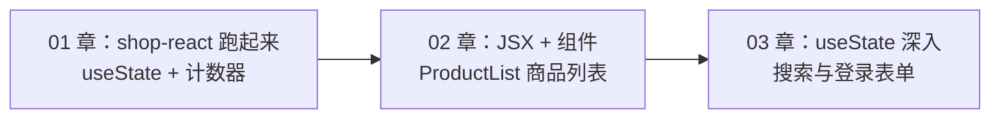
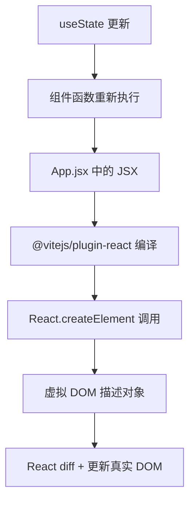
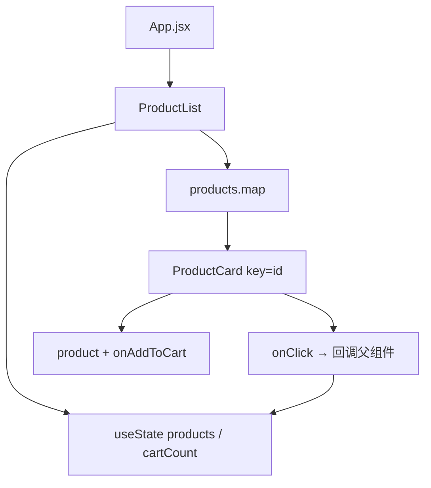

# JSX 语法与组件基础

<!-- 修改说明: 2026-06-30 按 EXPANSION-STANDARD 扩充 §0 导读、JSX=HTML+JS 类比、FAQ≥10、闭卷自测、费曼检验 -->

## 0. 读前导读（零基础也能跟上）

> **读者假设**：01 章 shop-react 能跑、计数器能点。本章系统学 **JSX = HTML + JS 混合** 的拼装语法，并写出第一个业务向 **ProductList**。

### 0.1 用一句话弄懂本章

**一句话**：在 JS 里用 JSX 描述 UI，用 **props** 给子组件（乐高块）传规格，用 `map + key` 渲染商品列表——把 01 章计数器页升级成静态商城列表。

**生活类比**：

| 概念 | 生活类比 | 代码 |
|------|----------|------|
| **JSX** | 说明书上的拼装图（HTML 外形 + `{}` 里写 JS） | `<p>{product.name}</p>` |
| **函数组件** | 标准乐高块 ProductCard | `function ProductCard({ product })` |
| **props** | 包装盒上的规格标签（只读） | `price={99}` |
| **children** | 积木预留的插槽 | `<Card>内容</Card>` |
| **key** | 仓库货架编号（React 认货用） | `key={product.id}` |

**为什么重要**：02 章是 React 日常 80% 的写法；与 [Vue 02 模板语法](../Vue/02-模板语法与响应式原理.md) 对照可快速迁移。

**本章用到的地方**：§2 规则、§15 ProductList 手把手、§20 FAQ。

---

### 0.2 你需要提前知道什么

| 水平 | 建议 |
|------|------|
| 01 章未完成 | 先完成 [01 入门](01-React入门与环境搭建.md) 计数器 |
| 会 Vue v-for | 对照 §12 Vue 映射，重点 className 与 map |
| 已写 ProductList | 快速过 §0，做闭卷自测 |

---

### 0.3 本章知识地图（☐→☑）

- [ ] JSX 单一根、闭合标签、className、htmlFor
- [ ] `{ expression }` 插值与禁止直接渲染对象
- [ ] props 解构、默认值、children、**不修改 props**
- [ ] 列表 `map` + 稳定 `key`（不用 index 作 key 的场景能说清）
- [ ] 条件：`&&`、三元、提前 return
- [ ] 事件 `onClick` 与 `onClick={() => fn(id)}` 传参
- [ ] 完成 ProductList + ProductCard 并运行
- [ ] 对照 [Vue 02](../Vue/02-模板语法与响应式原理.md) 说 5 处差异
- [ ] 知道 MOCK 数据结构与将来 [Java 04](../../后端学习/Java/04-SpringBoot核心开发.md) JSON 对齐
- [ ] 闭卷自测 ≥ 8/10

---

### 0.4 建议学习时长：通读 1h + 跟敲 ProductList 2h + 练习 1h

### 0.5 可验证成果

1. shop-react 显示 ≥3 个商品卡片，库存为 0 显示「售罄」。
2. 点击「加入购物车」父组件 `cartCount` 增加（回调 props）。
3. 改 `MOCK_PRODUCTS` 一项 name，页面自动更新。
4. DevTools 选中 ProductCard，看到 props.product。

---

## 本章与上一章的关系

01 章你在 `shop-react` 里完成了环境搭建，改写了 `App.jsx` 计数器，第一次接触了 `useState`、`{ }` 插值和 `onClick` 事件。那一章的重点是「项目能跑起来、入口与函数组件结构能看懂」。

**这一章是 React 核心写法的第一次系统展开**：JSX 规则（在 JS 里写 UI）、函数组件、props 传参、条件与列表渲染。学完后，你要把 01 章的计数器页面**升级**为带商品列表、库存状态、动态样式的**静态商城列表页**——数据仍写在前端，不接后端，但组件结构已经和真实项目非常接近。



**前置检查**（本章开始前请确认）：

- `npm run dev` 能正常打开 `http://localhost:5173/`
- `App.jsx` 里计数器点击有反应
- 知道函数组件 `return (...)`、`useState`、`export default` 的基本写法

---

## 1. JSX 是什么：JavaScript 里的「视图语法」

JSX 不是 HTML，也不是字符串模板，而是 **JavaScript 的语法扩展**。编译后变成 `React.createElement(type, props, ...children)` 调用。

### 1.1 为什么用 JSX 而不是模板

| 方式 | 优点 | 缺点 |
|------|------|------|
| 模板（Vue template） | 对 HTML 作者友好 | 与 JS 两套语法 |
| **JSX** | 逻辑与 UI 同语言、组合灵活 | 需适应 `{}`、className |
| createElement | 无编译 | 冗长难读 |

React 社区默认 **JSX + 函数组件**；Vue 默认 **template + script**。没有绝对优劣，本资料走 JSX 线。

### 1.2 JSX 编译流程（直觉）



**为什么要知道这个？** 面试常问「React 怎么更新 DOM」；日常遇到「改了 state 页面不更新」，要区分是 **setState 没调** 还是 **JSX 条件写错**。

---

## 2. JSX 核心规则

### 2.1 必须有单一根元素（或 Fragment）

```jsx
// ❌
return (
  <h1>标题</h1>
  <p>段落</p>
)

// ✅ Fragment 不增加 DOM 节点
return (
  <>
    <h1>标题</h1>
    <p>段落</p>
  </>
)

// ✅ 或用 div
return (
  <div className="page">
    <h1>标题</h1>
    <p>段落</p>
  </div>
)
```

### 2.2 所有标签必须闭合

```jsx

<input type="text" />
<br />
```

### 2.3 用 className 代替 class

```jsx
<div className="card hot">商品</div>
```

**为什么？** `class` 在 JavaScript 里是保留字；Vue 模板里仍写 `class`，React JSX 写 `className`。

### 2.4 用 htmlFor 代替 for（label）

```jsx
<label htmlFor="username">用户名</label>
<input id="username" />
```

### 2.5 驼峰命名 DOM 属性

| HTML | JSX |
|------|-----|
| `tabindex` | `tabIndex` |
| `readonly` | `readOnly` |
| `onclick` | `onClick` |
| `maxlength` | `maxLength` |

### 2.6 样式：对象写法或 className

```jsx
// 内联 style 必须是对象，属性名 camelCase
<p style={{ color: 'red', fontSize: '14px' }}>促销</p>

// 推荐：抽 CSS 文件
<p className="price-tag">¥99</p>
```

**为什么 style 双花括号？** 外层 `{}` 是 JSX 表达式，内层 `{}` 是 JS 对象字面量。

### 2.7 注释

```jsx
return (
  <div>
    {/* 这是 JSX 注释，在大括号里 */}
    <p>商品</p>
  </div>
)
```

不能在 `{}` 外写 `//` 注释夹在标签中间。

---

## 3. JSX 中的 JavaScript 表达式

### 3.1 插值 `{ expression }`

```jsx
const shopName = 'shop-react 练习商城'
const price = 99
const stock = 0

return (
  <div>
    <h1>{shopName}</h1>
    <p>{price * 0.8}</p>
    <p>{stock > 0 ? '有货' : '售罄'}</p>
    <p>{['Java', 'Spring', 'React'].join(' · ')}</p>
  </div>
)
```

### 3.2 能写什么、不能写什么

| 能写 | 不能写 |
|------|--------|
| 变量、三元、算术 | `if/for/while` **语句** |
| 函数调用 `formatPrice(p.price)` | 多行带 `return` 的函数体 |
| 可选链 `user?.name` | `const x = 1` 声明语句 |
| 数组 map filter | 对象字面量单独一行易混淆，注意括号 |

**为什么？** `{}` 里必须是**表达式**，有返回值；分支用三元或抽函数，循环用 `map`。

### 3.3 避免在 JSX 里写复杂逻辑

```jsx
// ❌ 不推荐
return (
  <ul>
    {products.filter(p => p.stock > 0).map(p => (
      <li key={p.id}>{p.name}</li>
    ))}
  </ul>
)

// ✅ 抽到组件外或 useMemo（05 章）
const inStock = products.filter((p) => p.stock > 0)
return (
  <ul>
    {inStock.map((p) => (
      <li key={p.id}>{p.name}</li>
    ))}
  </ul>
)
```

---

## 4. 函数组件基础

### 4.1 定义与命名

```jsx
// 函数名必须 PascalCase —— React 靠首字母大写区分组件与 HTML 标签
function ProductCard() {
  return <div className="card">商品卡片</div>
}

export default ProductCard
```

```jsx
// 箭头函数写法（等价）
const ProductCard = () => {
  return <div className="card">商品卡片</div>
}
```

**为什么必须 PascalCase？** `<productCard />` 会被当成 HTML 未知标签；`<ProductCard />` 才走 React 组件。

### 4.2 组件使用

```jsx
import ProductCard from './components/ProductCard'

function App() {
  return (
    <main>
      <ProductCard />
      <ProductCard />
    </main>
  )
}
```

### 4.3 组件组合

```jsx
function PageLayout({ children }) {
  return (
    <div className="layout">
      <header>shop-react</header>
      <main>{children}</main>
    </div>
  )
}

function App() {
  return (
    <PageLayout>
      <h1>商品列表</h1>
    </PageLayout>
  )
}
```

大组件由小组件嵌套而成——**组合优于继承**（React 官方哲学）。

---

## 5. Props：父传子

### 5.1 基本传递

```jsx
function ProductCard({ name, price, stock }) {
  return (
    <article className="product-card">
      <h3>{name}</h3>
      <p className="price">¥{price}</p>
      <p className={stock > 0 ? 'in-stock' : 'sold-out'}>
        {stock > 0 ? `库存 ${stock}` : '售罄'}
      </p>
    </article>
  )
}

function ProductList({ products }) {
  return (
    <div className="product-grid">
      {products.map((p) => (
        <ProductCard
          key={p.id}
          name={p.name}
          price={p.price}
          stock={p.stock}
        />
      ))}
    </div>
  )
}
```

### 5.2 props 是只读的

```jsx
function ProductCard({ price }) {
  price = 0  // ❌ 不要修改 props
  return <p>¥{price}</p>
}
```

**为什么？** **单向数据流**：数据从父到子，子要通过 **回调通知父改**（03、04 章）。

### 5.3 默认值与解构

```jsx
function Badge({ label = '热卖', variant = 'hot' }) {
  return <span className={`badge badge-${variant}`}>{label}</span>
}

// 或
function Badge(props) {
  const { label = '热卖', variant = 'hot' } = props
  return <span className={`badge badge-${variant}`}>{label}</span>
}
```

### 5.4 展开传递 props

```jsx
const product = { id: 1, name: 'Java 书', price: 99, stock: 10 }

<ProductCard {...product} />
// 等价于 name="Java 书" price={99} stock={10}，但 id 也会传下去 unless 组件不用
```

### 5.5 children 特殊 prop

```jsx
function Card({ title, children }) {
  return (
    <section className="card">
      <h2>{title}</h2>
      <div className="card-body">{children}</div>
    </section>
  )
}

<Card title="今日推荐">
  <p>任意 JSX 都可以作为 children</p>
  <button type="button">购买</button>
</Card>
```

---

## 6. 条件渲染

### 6.1 与 Vue v-if 对照

| 场景 | Vue | React |
|------|-----|-------|
| 布尔与 | `v-if="ok"` | `{ok && <Node />}` |
| 二选一 | `v-if / v-else` | `{ok ? <A /> : <B />}` |
| 多分支 | `v-else-if` | 嵌套三元或抽函数 |
| 频繁切换显隐 | `v-show` | `style={{ display: ok ? 'block' : 'none' }}` 或 class |

### 6.2 && 短路注意 falsy 值

```jsx
// ❌ count 为 0 时页面会显示数字 0
{count && <p>有货</p>}

// ✅ 转成布尔
{count > 0 && <p>有货</p>}
{Boolean(count) && <p>有货</p>}
```

**为什么？** `0 && <p>` 在 React 中会渲染 `0`。

### 6.3 提前 return（守卫）

```jsx
function ProductDetail({ product }) {
  if (!product) {
    return <p className="empty">商品不存在</p>
  }

  return (
    <div>
      <h1>{product.name}</h1>
      <p>¥{product.price}</p>
    </div>
  )
}
```

组件函数里**可以**写 `if` 语句，只是 `{}` 表达式里不能写。

### 6.4 多条件抽函数

```jsx
function renderStockTag(stock) {
  if (stock <= 0) return <span className="tag sold">售罄</span>
  if (stock < 5) return <span className="tag warn">仅剩 {stock} 件</span>
  return <span className="tag ok">有货</span>
}

// JSX 里
{renderStockTag(product.stock)}
```

---

## 7. 列表渲染与 key

### 7.1 map 生成列表

```jsx
const products = [
  { id: 1, name: 'Java 编程思想', price: 99, stock: 10 },
  { id: 2, name: 'Spring Boot 实战', price: 79, stock: 0 },
  { id: 3, name: 'React 设计原理', price: 89, stock: 5 },
]

function ProductList() {
  return (
    <ul className="product-list">
      {products.map((product) => (
        <li key={product.id}>
          {product.name} — ¥{product.price}
        </li>
      ))}
    </ul>
  )
}
```

Vue 的 `v-for="p in products" :key="p.id"` 在 React 里就是 **`products.map(...)` + `key={p.id}`**。

### 7.2 为什么需要 key

React 用 key 识别列表项身份，diff 时**高效复用 DOM**。没有稳定 key 或用 index 当 key（在增删排序时）会导致：

- 状态错位（输入框内容跑到别的行）
- 不必要的重渲染

```jsx
// ❌ 列表会增删排序时不要用 index
{products.map((p, index) => (
  <ProductCard key={index} {...p} />
))}

// ✅ 用业务唯一 id
{products.map((p) => (
  <ProductCard key={p.id} {...p} />
))}
```

### 7.3 key 放在 map 直接子元素

```jsx
// ✅
{products.map((p) => (
  <ProductCard key={p.id} product={p} />
))}

// ❌ key 在内部无效
{products.map((p) => (
  <div>
    <ProductCard key={p.id} product={p} />
  </div>
))}
```

### 7.4 空列表友好提示

```jsx
{products.length === 0 ? (
  <p className="empty">暂无商品</p>
) : (
  products.map((p) => <ProductCard key={p.id} product={p} />)
)}
```

---

## 8. 事件处理

### 8.1 基本写法

```jsx
function Counter() {
  const [count, setCount] = useState(0)

  function handleClick() {
    setCount(count + 1)
  }

  return <button type="button" onClick={handleClick}>+1</button>
}
```

| Vue | React |
|-----|-------|
| `@click="fn"` | `onClick={fn}` |
| `@click="fn($event, item)"` | `onClick={(e) => fn(e, item)}` |

### 8.2 传参

```jsx
function ProductList({ products, onAddToCart }) {
  return products.map((p) => (
    <button
      key={p.id}
      type="button"
      disabled={p.stock === 0}
      onClick={() => onAddToCart(p)}
    >
      加入购物车
    </button>
  ))
}
```

**为什么用箭头函数？** `onClick={onAddToCart(p)}` 会**立即执行**；`onClick={() => onAddToCart(p)}` 才是点击时执行。

### 8.3 阻止默认行为

```jsx
function handleSubmit(e) {
  e.preventDefault()
  // 处理表单
}

<form onSubmit={handleSubmit}>...</form>
```

Vue 的 `@submit.prevent` 在 React 里手动 `e.preventDefault()`（03 章表单）。

### 8.4 合成事件 SyntheticEvent

React 事件是跨浏览器封装的对象，用法类似原生 `event`：

```jsx
function handleClick(e) {
  console.log(e.type)       // click
  console.log(e.target)     // 触发 DOM
  e.stopPropagation()
}
```

---

## 9. className 动态样式

### 9.1 字符串拼接

```jsx
<span className={'badge ' + (isHot ? 'badge-hot' : '')}>促销</span>
```

### 9.2 模板字符串

```jsx
<span className={`badge ${isHot ? 'badge-hot' : ''}`}>促销</span>
```

### 9.3 多 class 对象（需 clsx 库或手写，本章手写）

```jsx
const classes = [
  'product-card',
  stock === 0 ? 'sold-out' : '',
  isHot ? 'hot' : '',
].filter(Boolean).join(' ')

<article className={classes}>...</article>
```

### 9.4 与 Vue :class 对照

```vue
<!-- Vue -->
<span :class="{ hot: isHot, 'sold-out': stock === 0 }">
```

```jsx
// React
<span className={[isHot && 'hot', stock === 0 && 'sold-out'].filter(Boolean).join(' ')}>
```

---

## 10. 特殊 JSX 内容

### 10.1 渲染 null / undefined / false

这些值 React **不渲染**任何 DOM 节点（与 `0` 不同）：

```jsx
{error && <p className="err">{error}</p>}
{loading ? null : <ProductList />}
```

### 10.2 危险：dangerouslySetInnerHTML

```jsx
const html = '<strong>加粗</strong>'

<div dangerouslySetInnerHTML={{ __html: html }} />
```

**必须信任内容来源**；用户输入绝不能直接插入，否则 XSS。Vue 对应 `v-html`。

### 10.3 布尔属性

```jsx
<button disabled={stock === 0}>购买</button>
<input readOnly={true} />
```

---

## 11. 组件文件组织建议

```text
src/
├── components/
│   ├── ProductCard.jsx
│   ├── ProductList.jsx
│   ├── EmptyState.jsx
│   └── ProductCard.css      ← 可选，与组件同名
├── App.jsx
└── main.jsx
```

| 原则 | 说明 |
|------|------|
| 一个文件一个主组件 | 便于定位 |
| 子组件私有可不 export | 仅父组件 import |
| 样式 | 全局 index.css + 组件 css，或 CSS Modules（10 章） |

---

## 12. 手把手：ProductCard 子组件

`src/components/ProductCard.jsx`：

```jsx
import './ProductCard.css'

function formatPrice(price) {
  return `¥${price.toFixed(2)}`
}

function ProductCard({ product, onAddToCart }) {
  const { id, name, price, stock, image, isHot } = product
  const soldOut = stock <= 0

  function handleAdd() {
    if (!soldOut && onAddToCart) {
      onAddToCart(product)
    }
  }

  return (
    <article
      className={[
        'product-card',
        soldOut ? 'sold-out' : '',
        isHot ? 'hot' : '',
      ].filter(Boolean).join(' ')}
    >
      
      <div className="product-body">
        <h3 className="product-name">{name}</h3>
        {isHot && <span className="badge-hot">热卖</span>}
        <p className="product-price">{formatPrice(price)}</p>
        <p className="product-stock">
          {soldOut ? '售罄' : `库存 ${stock} 件`}
        </p>
        <button
          type="button"
          className="btn-add"
          disabled={soldOut}
          onClick={handleAdd}
        >
          {soldOut ? '已售罄' : '加入购物车'}
        </button>
      </div>
    </article>
  )
}

export default ProductCard
```

`src/components/ProductCard.css`（节选）：

```css
.product-card {
  border: 1px solid #e5e7eb;
  border-radius: 12px;
  overflow: hidden;
  background: #fff;
  transition: box-shadow 0.2s;
}
.product-card:hover {
  box-shadow: 0 8px 24px rgba(0, 0, 0, 0.08);
}
.product-card.sold-out {
  opacity: 0.65;
}
.product-card.hot {
  border-color: #f59e0b;
}
.product-image {
  width: 100%;
  height: 160px;
  object-fit: cover;
}
.product-body {
  padding: 16px;
}
.product-price {
  font-size: 18px;
  font-weight: 600;
  color: #dc2626;
}
.btn-add {
  width: 100%;
  margin-top: 12px;
  padding: 8px;
  border: none;
  border-radius: 8px;
  background: #20232a;
  color: #61dafb;
  cursor: pointer;
}
.btn-add:disabled {
  background: #d1d5db;
  color: #6b7280;
  cursor: not-allowed;
}
.badge-hot {
  display: inline-block;
  font-size: 12px;
  padding: 2px 8px;
  background: #fef3c7;
  color: #b45309;
  border-radius: 4px;
}
```

---

## 13. 手把手：完整 ProductList 页面

`src/components/ProductList.jsx`：

```jsx
import { useState } from 'react'
import ProductCard from './ProductCard'
import EmptyState from './EmptyState'
import './ProductList.css'

const MOCK_PRODUCTS = [
  {
    id: 1,
    name: 'Java 编程思想（第4版）',
    price: 99,
    stock: 10,
    isHot: true,
    image: 'https://via.placeholder.com/320x200?text=Java',
  },
  {
    id: 2,
    name: 'Spring Boot 实战',
    price: 79,
    stock: 0,
    isHot: false,
    image: 'https://via.placeholder.com/320x200?text=Spring',
  },
  {
    id: 3,
    name: 'React 设计原理',
    price: 89,
    stock: 5,
    isHot: true,
    image: 'https://via.placeholder.com/320x200?text=React',
  },
  {
    id: 4,
    name: 'MySQL 必知必会',
    price: 45,
    stock: 20,
    isHot: false,
    image: 'https://via.placeholder.com/320x200?text=MySQL',
  },
]

function ProductList() {
  const [products] = useState(MOCK_PRODUCTS)
  const [cartCount, setCartCount] = useState(0)

  function handleAddToCart(product) {
    setCartCount((c) => c + 1)
    console.log('加入购物车:', product.name)
  }

  return (
    <div className="product-list-page">
      <header className="list-header">
        <h1>shop-react 商品列表</h1>
        <p className="cart-hint">购物车数量：{cartCount}</p>
      </header>

      {products.length === 0 ? (
        <EmptyState message="暂无商品，请稍后再来" />
      ) : (
        <div className="product-grid">
          {products.map((product) => (
            <ProductCard
              key={product.id}
              product={product}
              onAddToCart={handleAddToCart}
            />
          ))}
        </div>
      )}
    </div>
  )
}

export default ProductList
```

`src/components/EmptyState.jsx`：

```jsx
function EmptyState({ message = '暂无数据' }) {
  return (
    <div className="empty-state">
      <p>{message}</p>
    </div>
  )
}

export default EmptyState
```

`src/App.jsx`：

```jsx
import ProductList from './components/ProductList'
import './App.css'

function App() {
  return (
    <div className="app">
      <ProductList />
    </div>
  )
}

export default App
```

`src/components/ProductList.css`：

```css
.product-list-page {
  max-width: 960px;
  margin: 0 auto;
  padding: 24px 16px;
}
.list-header {
  margin-bottom: 24px;
}
.list-header h1 {
  font-size: 24px;
  margin-bottom: 8px;
}
.cart-hint {
  color: #6b7280;
}
.product-grid {
  display: grid;
  grid-template-columns: repeat(auto-fill, minmax(220px, 1fr));
  gap: 20px;
}
.empty-state {
  text-align: center;
  padding: 48px;
  color: #9ca3af;
}
```



**验证**：

1. 四张商品卡片网格展示
2. 库存 0 的「Spring Boot」显示售罄、按钮 disabled
3. 热卖商品有 badge
4. 点击「加入购物车」控制台有日志，`cartCount` 增加

---

## 14. 与 Vue 02 章对照速查

| 能力 | Vue 02 | React 02 |
|------|--------|----------|
| 插值 | `{{ x }}` | `{x}` |
| 属性 | `:src="url"` | `src={url}` |
| 事件 | `@click="fn"` | `onClick={fn}` |
| 条件 | `v-if` | `&&` / 三元 / if return |
| 列表 | `v-for="p in list" :key` | `list.map(p => ... key={})` |
| 组件 | `<ProductCard :product="p" />` | `<ProductCard product={p} />` |
| 样式 class | `:class="{ hot }"` | `className={...}` |

---

## 15. 常见误区汇总

| 误区 | 正确做法 |
|------|----------|
| 组件名小写 `<productCard />` | PascalCase `<ProductCard />` |
| 写 `class="card"` | `className="card"` |
| `onClick={add(1)}` 立即执行 | `onClick={() => add(1)}` |
| 修改 props | 父组件改 state，子只读 props |
| map 不写 key | `key={item.id}` |
| `{count && <p>}` count 为 0 显示 0 | `{count > 0 && <p>}` |
| 在 `{}` 里写 if 语句 | 三元或抽函数或组件外 if |

---

## 16. DevTools 调试技巧

1. F12 → **Components** → 选中 `ProductList`
2. 查看 **hooks**：`products`、`cartCount`
3. 选中 `ProductCard` → **props**：`product`、`onAddToCart`
4. 点击加购，观察 `cartCount` 变化

---

## 17. 与后端数据的对应关系（预习）

后端 `GET /api/products` 返回的 JSON 数组，字段名对齐即可直接 `setProducts(data)`（08 章）：

```json
{
  "code": 200,
  "data": [
    { "id": 1, "name": "Java 书", "price": 99, "stock": 10, "image": "..." }
  ]
}
```

本章 `MOCK_PRODUCTS` 结构即按此设计。

---

## 18. 分级练习

### 18.1 基础

在 `ProductList` 顶部增加一句：`共 {products.length} 件商品`。

<details>
<summary>参考答案</summary>

```jsx
<p className="summary">共 {products.length} 件商品</p>
```

</details>

### 18.2 进阶

仅展示 `stock > 0` 的商品；若全无库存显示 `EmptyState`。

<details>
<summary>参考答案</summary>

```jsx
const inStockProducts = products.filter((p) => p.stock > 0)

{inStockProducts.length === 0 ? (
  <EmptyState message="全部售罄" />
) : (
  inStockProducts.map((p) => (
    <ProductCard key={p.id} product={p} onAddToCart={handleAddToCart} />
  ))
)}
```

</details>

### 18.3 挑战

给 `ProductCard` 增加 `onFavorite` 回调，父组件用 `useState` 维护 `favoriteIds` 数组，点击心形图标切换收藏（图标可用文字 ♥ / ♡）。

<details>
<summary>参考答案（节选）</summary>

```jsx
// ProductList.jsx
const [favoriteIds, setFavoriteIds] = useState([])

function toggleFavorite(id) {
  setFavoriteIds((ids) =>
    ids.includes(id) ? ids.filter((x) => x !== id) : [...ids, id]
  )
}

<ProductCard
  key={product.id}
  product={product}
  isFavorite={favoriteIds.includes(product.id)}
  onToggleFavorite={() => toggleFavorite(product.id)}
  onAddToCart={handleAddToCart}
/>
```

</details>

---

## 19. 常见报错与排查

| 报错 / 现象 | 原因 | 处理 |
|-------------|------|------|
| `Adjacent JSX elements must be wrapped` | 多根节点 | Fragment 或 div 包裹 |
| `class is not valid prop` | 用了 class | 改 className |
| `Each child in a list should have a unique key` | map 缺 key | 加 key={item.id} |
| `Objects are not valid as a React child` | 直接渲染对象 `{product}` | 渲染 `{product.name}` |
| 组件不显示 | 默认 export /import 路径错 | 检查文件名大小写 |
| 点击无反应 | onClick 绑错 | 检查是否写成立即调用 |
| 按钮永远 disabled | 表达式恒 true | 检查 stock 类型与比较 |
| 图片裂图 | URL 无效 | 换 placeholder 或本地 assets |
| props 全是 undefined | 属性名不一致 | 父 `{ name }` 子 `{ title }` 要对齐 |
| Maximum update depth exceeded | render 里 setState | 移到事件或 useEffect |

---

## 20. FAQ

**Q：JSX 和 HTML 有什么区别？**  
JSX 是 JS 语法：className、camelCase 属性、必须闭合、表达式用 `{}`。

**Q：为什么 map 里 key 不能是 random？**  
每次 render 随机 key 会导致 React 认为全是新节点，状态丢失、性能差。

**Q：组件必须 default export 吗？**  
习惯 default export 主组件；也可 named export 多个小组件。

**Q：能否在组件里定义组件？**  
能但不推荐（每次父 render 会创建新函数类型，导致子树卸载）。抽到单独文件。

**Q：Fragment 和 div 选哪个？**  
需要布局样式用 div；仅避免多根节点用 `<>...</>`。

**Q：和 Vue 的 slot 对应什么？**  
`children` prop；具名插槽 04 章讲组合模式。

**Q：和 Vue 的 slot 对应什么？**  
`children` prop；具名插槽 04 章讲组合模式。

**Q：props 和 Java Controller 入参像吗？**  
像 **只读 DTO**：父传子、子不能改 props，只能展示或 callback 通知父——后端 [Java 04](../../后端学习/Java/04-SpringBoot核心开发.md) 的 `@RequestBody` 是另一端的「入参约定」。

**Q：为什么 JSX 里不能写 `if/for` 语句？**  
`{}` 里要**表达式**；用三元、`&&`、或在外面算好变量再插值；列表用 `.map()`。

**Q：组件名必须 PascalCase 吗？**  
必须。小写会被当成 HTML 原生标签。

**Q：能写 `<div class="card">` 吗？**  
应写 `className`；写 class 控制台会 warning。

**Q：MOCK 数据何时换真接口？**  
[08 章 Axios](08-Axios网络请求与前后端联调.md) 对接 Java 04 的 `/api/products`；本章结构保持不变，只换数据来源。

**Q：ProductCard 要拆文件吗？**  
本章可在同文件；[04 章](04-组件通信与组合.md) 会拆到 `components/ProductCard.jsx`。

**Q：和 Vue 02 最大区别？**  
Vue **template 指令**（v-if、v-for）；React **JS 表达式 + map**（JSX=HTML+JS 混合）。

---

## 20.1 闭卷自测

1. JSX 编译后大致变成什么 API 调用？
2. 为什么列表需要 `key`？能用 `Math.random()` 吗？
3. props 为什么只读？子组件想改父数据怎么办？
4. `onClick={handleClick}` 与 `onClick={handleClick()}` 区别？
5. 条件渲染三种写法各举一例（&&、三元、提前 return）。
6. `className` 动态拼接常用什么库/写法？（本章 string 拼接即可）
7. `children` 是什么？举一种使用场景。
8. **动手**：写一行 JSX 显示「共 N 件商品」（N 来自 props 或变量）。
9. **动手**：map 渲染时缺 key 控制台报什么？补上 id 后消失。
10. **综合**：对照 [Vue 02](../Vue/02-模板语法与响应式原理.md)，把 `v-for="p in products"` 改写成 React 等价 JSX（含 key）。

### 20.2 自测参考答案

1. `React.createElement(type, props, ...children)`（经 Babel/Vite 插件）。
2. 帮助 diff 识别节点身份；**random 每次 render 变**会导致重建与状态丢失。
3. 单向数据流；**callback props** 如 `onAddToCart(id)` 通知父改 state。
4. 前者点击时调用；后者**渲染时立刻执行**（常误用）。
5. `{ok && <p>ok</p>}`；`{a ? <A/> : <B/>}`；`if (!data) return null`。
6. 模板字符串或 `clsx`/`classnames`（进阶）；`className={stock ? 'hot' : ''}`。
7. 标签之间的内容；Layout 包页面、Card 包正文。
8. `<p>共 {products.length} 件商品</p>`。
9. `Each child in a list should have a unique "key" prop`。
10. `{products.map(p => <ProductCard key={p.id} product={p} />)}`。

---

## 20.3 费曼检验

用 **3 分钟** 解释「JSX 怎么拼出商品列表」：

1. **JSX** = HTML 样子 + `{}` 里写 JS，像 **混合说明书**。
2. **父组件** 持有一份商品数组，**map** 成多个 **ProductCard 乐高块**，每块 **props** 传 `product`。
3. **key** 像货架号；点按钮用 **回调** 告诉父组件加购物车——数据仍由父管（03 章 state 深入）。

---

## 21. 学完标准

- [ ] 独立写出带 map + key 的商品列表
- [ ] 正确传递 props，不修改 props
- [ ] 会用 &&、三元、提前 return 做条件渲染
- [ ] 完成 ProductList + ProductCard 手把手代码并运行
- [ ] 完成分级练习「基础 + 进阶」
- [ ] 能对照 Vue 02 说出 5 处语法差异

---

## 22. 知识点清单

- [ ] JSX 单一根、闭合标签、className
- [ ] `{ expression }` 插值规则
- [ ] 函数组件 PascalCase + export default
- [ ] props 解构、默认值、children
- [ ] 列表 map + 稳定 key
- [ ] onClick 与传参写法
- [ ] 动态 className
- [ ] ProductList 完整结构

---

## 下一章预告

02 章你能用 JSX 展示商品列表、通过 props 和回调做简单交互了——但搜索框输入、登录表单、多个组件共享「关键词」还需要 **useState 的深入用法**、**受控组件**和**状态提升**。

下一章（03 State 与事件处理）系统讲不可变更新、表单 onChange、父组件统一管理搜索词、登录表单校验，以及 useEffect 的预习——把 shop-react 升级成「可搜索、可登录」的页面。

---

*下一章：03 State 与事件处理*
