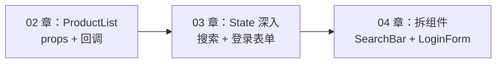
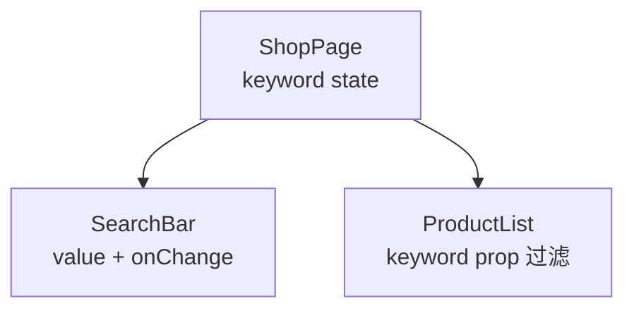
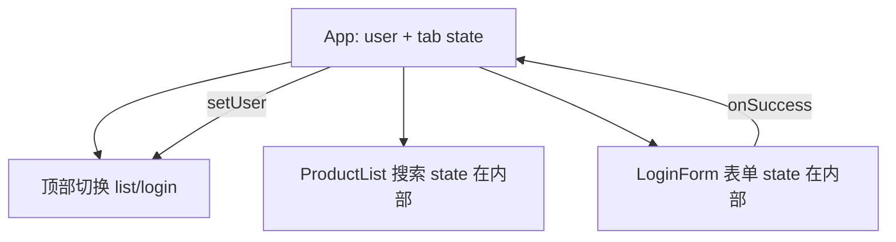

# State 与事件处理

## 本章与上一章的关系

02 章你在 `shop-react` 里用 `map` 渲染了静态商品列表，用 `ProductCard` 接收 `product` props，用 `onAddToCart` 回调更新父组件 `cartCount`。页面能「展示」，但还缺三类真实交互：

1. **搜索框**：用户输入关键词，列表实时过滤
2. **表单**：登录、注册——输入框和 JS 数据要**双向同步**，还要校验
3. **状态归属**：搜索词、用户信息应该放在哪个组件？多个兄弟如何共享？

这一章深入 **useState**、**受控组件**、**不可变更新**、**状态提升（Lifting State Up）**，并**预习 useEffect**。把 02 章的商品列表页升级成「可搜索、可登录」的页面。04 章再把 `SearchBar`、`LoginForm` 拆成独立组件文件。



**前置检查**：

- 02 章 `ProductList` 能正常显示
- 理解 props 只读、子通过回调通知父
- 终端 `npm run dev` 正常运行

---

## 1. useState 深入

### 1.1 基本形态回顾

```jsx
import { useState } from 'react'

const [count, setCount] = useState(0)
// count     —— 当前状态值
// setCount  —— 更新函数，触发重渲染
// useState(0) —— 初始值，仅首次 render 使用
```

与 Vue 3 `ref(0)` 对照：

| | Vue ref | React useState |
|---|---------|----------------|
| 读值 | `count.value`（script） | `count` |
| 写值 | `count.value++` | `setCount(count + 1)` |
| 模板 | `{{ count }}` 自动解包 | `{count}` |

### 1.2 为什么必须用 setState

```jsx
function Wrong() {
  const [count, setCount] = useState(0)

  function add() {
    count++           // ❌ 改了变量，React 不知道
    console.log(count)
  }
}
```

React 通过 **setState** 调度更新：把新 state 放入队列，触发组件**重新执行**，再 diff DOM。

### 1.3 函数式更新（依赖上一次 state 时）

```jsx
function add() {
  setCount(count + 1)
  setCount(count + 1)  // ❌ 同一轮 render，count 仍是旧值，只 +1
}

function addTwice() {
  setCount((c) => c + 1)
  setCount((c) => c + 1)  // ✅ 基于最新 prev，共 +2
}
```

**为什么？** 多次 `setCount(count + 1)` 闭包里的 `count` 相同；updater 函数 `(c) => c + 1` 链式接收最新值。

### 1.4 初始值为函数（昂贵计算）

```jsx
const [products, setProducts] = useState(() => {
  const raw = localStorage.getItem('products')
  return raw ? JSON.parse(raw) : MOCK_PRODUCTS
})
```

**为什么？** `useState(compute())` 每次 render 都会执行 `compute`；传函数只在**首次 mount** 执行。

### 1.5 多个 state vs 一个对象

```jsx
// ✅ 简单字段分开（推荐入门）
const [keyword, setKeyword] = useState('')
const [loading, setLoading] = useState(false)

// ✅ 表单字段多时可合并对象
const [form, setForm] = useState({
  username: '',
  password: '',
})
```

对象 state 更新见 §2 不可变更新。

### 1.6 state 更新是异步批处理的

React 18 在事件处理、Promise 等中会**自动批处理**多次 setState，只触发一次 render：

```jsx
function handleClick() {
  setCount((c) => c + 1)
  setFlag(true)
  // 不会 render 两次
}
```

**注意**：不能在同一函数里「立刻」读到更新后的 state：

```jsx
setCount(count + 1)
console.log(count)  // 仍是旧值
```

---

## 2. 不可变更新（Immutable Updates）

### 2.1 为什么强调不可变

React 用 **Object.is** 比较 state 引用是否变化。若直接改原对象/数组，引用不变，可能**跳过渲染**或导致子组件 props 比较失效。

```jsx
// ❌ 直接改数组
const [items, setItems] = useState([1, 2, 3])
items.push(4)
setItems(items)  // 同一引用，可能不更新

// ✅ 新数组
setItems([...items, 4])
```

### 2.2 数组常见操作

```jsx
// 追加
setItems([...items, newItem])

// 删除 id=2
setItems(items.filter((item) => item.id !== 2))

// 更新 id=2 的 name
setItems(
  items.map((item) =>
    item.id === 2 ? { ...item, name: '新名字' } : item
  )
)

// 排序（复制后 sort）
setItems([...items].sort((a, b) => a.price - b.price))
```

Vue 的 reactive 数组可直接 `push`；React **必须**返回新引用。

### 2.3 对象常见操作

```jsx
const [user, setUser] = useState({ name: 'Tom', age: 18 })

// 更新单个字段
setUser({ ...user, age: 19 })

// 嵌套更新
setUser({
  ...user,
  address: { ...user.address, city: '上海' },
})
```

### 2.4 表单对象统一更新

```jsx
function handleChange(e) {
  const { name, value } = e.target
  setForm((prev) => ({ ...prev, [name]: value }))
}
```

---

## 3. 受控组件（Controlled Components）

### 3.1 什么是受控组件

表单元素的值由 **React state** 控制：

```jsx
const [keyword, setKeyword] = useState('')

<input
  value={keyword}
  onChange={(e) => setKeyword(e.target.value)}
/>
```

数据流：

```text
state keyword → input value 显示
用户输入 → onChange → setKeyword → 重新 render → input 更新
```

Vue 的 `v-model="keyword"` 等价于上面两行合一（03 章 Vue 资料）。

### 3.2 非受控组件（了解）

用 `useRef` 直接读 DOM 值，React **不**实时持有输入值（05 章 useRef）。登录表单等场景优先**受控**。

### 3.3 各类表单控件

#### 文本

```jsx
<input
  type="text"
  name="username"
  value={form.username}
  onChange={handleChange}
/>
<textarea
  name="remark"
  value={form.remark}
  onChange={handleChange}
/>
```

#### 复选框

```jsx
const [agree, setAgree] = useState(false)

<input
  type="checkbox"
  checked={agree}
  onChange={(e) => setAgree(e.target.checked)}
/>
```

#### 多个 checkbox → 数组

```jsx
const [hobbies, setHobbies] = useState([])

function toggleHobby(value) {
  setHobbies((prev) =>
    prev.includes(value)
      ? prev.filter((h) => h !== value)
      : [...prev, value]
  )
}
```

#### 单选

```jsx
const [payMethod, setPayMethod] = useState('alipay')

<input
  type="radio"
  value="alipay"
  checked={payMethod === 'alipay'}
  onChange={(e) => setPayMethod(e.target.value)}
/>
```

#### 下拉

```jsx
<select
  name="category"
  value={form.category}
  onChange={handleChange}
>
  <option value="all">全部分类</option>
  <option value="book">图书</option>
</select>
```

### 3.4 修饰：trim 与 number

React 无 `v-model.trim`，在 onChange 里处理：

```jsx
onChange={(e) => setKeyword(e.target.value.trim())}

// number
onChange={(e) => setAge(Number(e.target.value))}
// 或 type="number" 时 parseInt(e.target.value, 10)
```

---

## 4. 事件处理进阶

### 4.1 合成事件与池化（了解）

React 17+ 不再复用事件对象，可 async 里安全使用 `e.persist()` 已不需要。

### 4.2 表单 submit

```jsx
function handleSubmit(e) {
  e.preventDefault()  // 阻止页面刷新
  console.log('提交', form)
}

<form onSubmit={handleSubmit}>...</form>
```

### 4.3 禁用按钮与 loading

```jsx
<button type="submit" disabled={loading}>
  {loading ? '登录中...' : '登录'}
</button>
```

---

## 5. 状态提升（Lifting State Up）

### 5.1 问题场景

`SearchBar` 和 `ProductList` 是兄弟组件，都需要 `keyword`：

- 搜索框在 SearchBar 里输入
- 列表在 ProductList 里过滤

**state 应放在最近公共父组件** `ShopPage`，通过 props 下发。



### 5.2 为什么不在子组件各存一份

两份 state 无法同步，会出现「输入框一个词、列表按另一个词过滤」的 bug。

### 5.3 代码结构

```jsx
function ShopPage() {
  const [keyword, setKeyword] = useState('')
  const [products] = useState(MOCK_PRODUCTS)

  const filtered = products.filter((p) =>
    p.name.toLowerCase().includes(keyword.trim().toLowerCase())
  )

  return (
    <div>
      <SearchBar keyword={keyword} onKeywordChange={setKeyword} />
      <ProductList products={filtered} total={products.length} />
    </div>
  )
}
```

```jsx
function SearchBar({ keyword, onKeywordChange }) {
  return (
    <input
      type="search"
      placeholder="搜索商品"
      value={keyword}
      onChange={(e) => onKeywordChange(e.target.value)}
    />
  )
}
```

**单向数据流**：父 `keyword` → 子 `value`；子 `onChange` → 父 `setKeyword`。

---

## 6. 搜索过滤完整实现

### 6.1 在 ProductList 内联版（本章先合一文件）

`src/components/ProductList.jsx` 升级：

```jsx
import { useState, useMemo } from 'react'
import ProductCard from './ProductCard'
import EmptyState from './EmptyState'
import './ProductList.css'

const MOCK_PRODUCTS = [
  { id: 1, name: 'Java 编程思想', price: 99, stock: 10, isHot: true, image: 'https://via.placeholder.com/320x200?text=Java' },
  { id: 2, name: 'Spring Boot 实战', price: 79, stock: 0, isHot: false, image: 'https://via.placeholder.com/320x200?text=Spring' },
  { id: 3, name: 'React 设计原理', price: 89, stock: 5, isHot: true, image: 'https://via.placeholder.com/320x200?text=React' },
  { id: 4, name: 'MySQL 必知必会', price: 45, stock: 20, isHot: false, image: 'https://via.placeholder.com/320x200?text=MySQL' },
]

function ProductList() {
  const [products] = useState(MOCK_PRODUCTS)
  const [keyword, setKeyword] = useState('')
  const [category, setCategory] = useState('all')
  const [cartCount, setCartCount] = useState(0)

  const filteredProducts = useMemo(() => {
    const kw = keyword.trim().toLowerCase()
    return products.filter((p) => {
      const matchKeyword = !kw || p.name.toLowerCase().includes(kw)
      const matchCategory =
        category === 'all' ||
        (category === 'hot' && p.isHot) ||
        (category === 'instock' && p.stock > 0)
      return matchKeyword && matchCategory
    })
  }, [products, keyword, category])

  function handleAddToCart(product) {
    setCartCount((c) => c + 1)
    console.log('加入购物车:', product.name)
  }

  function handleClearSearch() {
    setKeyword('')
  }

  return (
    <div className="product-list-page">
      <header className="list-header">
        <h1>shop-react 商品列表</h1>
        <p className="cart-hint">购物车：{cartCount} 件</p>
      </header>

      <section className="search-bar">
        <input
          type="search"
          className="search-input"
          placeholder="搜索商品名称"
          value={keyword}
          onChange={(e) => setKeyword(e.target.value)}
        />
        {keyword && (
          <button type="button" className="btn-clear" onClick={handleClearSearch}>
            清空
          </button>
        )}
        <select
          className="category-select"
          value={category}
          onChange={(e) => setCategory(e.target.value)}
        >
          <option value="all">全部分类</option>
          <option value="hot">仅热卖</option>
          <option value="instock">仅有货</option>
        </select>
      </section>

      <p className="summary">
        显示 {filteredProducts.length} / {products.length} 件
        {keyword && ` · 关键词「${keyword}」`}
      </p>

      {filteredProducts.length === 0 ? (
        <EmptyState message="没有匹配的商品，换个关键词试试" />
      ) : (
        <div className="product-grid">
          {filteredProducts.map((product) => (
            <ProductCard
              key={product.id}
              product={product}
              onAddToCart={handleAddToCart}
            />
          ))}
        </div>
      )}
    </div>
  )
}

export default ProductList
```

### 6.2 为什么用 useMemo

`filter` 在每次 render 都会执行；商品多时可用 `useMemo` **缓存**结果，仅当 `products/keyword/category` 变时重算。Vue 对应 `computed`（见 [Vue 03](../Vue/03-计算属性侦听器与表单绑定.md)）。

**注意**：几十条假数据不用 useMemo 也行；养成「派生数据可 memo」的习惯。

### 6.3 搜索栏 CSS 补充

```css
.search-bar {
  display: flex;
  gap: 12px;
  flex-wrap: wrap;
  margin-bottom: 16px;
}
.search-input {
  flex: 1;
  min-width: 200px;
  padding: 10px 12px;
  border: 1px solid #d1d5db;
  border-radius: 8px;
}
.category-select {
  padding: 10px 12px;
  border-radius: 8px;
}
.btn-clear {
  padding: 10px 16px;
  border: 1px solid #d1d5db;
  border-radius: 8px;
  background: #fff;
  cursor: pointer;
}
.summary {
  color: #6b7280;
  margin-bottom: 16px;
}
```

---

## 7. 登录表单完整示例

### 7.1 需求

- 用户名、密码受控输入
- 提交时校验非空、密码长度 ≥ 6
- 提交中 loading、错误提示
- 成功后显示欢迎语（模拟，08 章接真实接口）

### 7.2 LoginForm 组件

`src/components/LoginForm.jsx`：

```jsx
import { useState } from 'react'
import './LoginForm.css'

const INITIAL_FORM = { username: '', password: '' }

function LoginForm({ onSuccess }) {
  const [form, setForm] = useState(INITIAL_FORM)
  const [errors, setErrors] = useState({})
  const [loading, setLoading] = useState(false)
  const [serverError, setServerError] = useState('')

  function handleChange(e) {
    const { name, value } = e.target
    setForm((prev) => ({ ...prev, [name]: value }))
    setErrors((prev) => ({ ...prev, [name]: '' }))
    setServerError('')
  }

  function validate() {
    const next = {}
    const username = form.username.trim()
    const password = form.password

    if (!username) next.username = '请输入用户名'
    if (!password) next.password = '请输入密码'
    else if (password.length < 6) next.password = '密码至少 6 位'

    setErrors(next)
    return Object.keys(next).length === 0
  }

  async function handleSubmit(e) {
    e.preventDefault()
    if (!validate()) return

    setLoading(true)
    setServerError('')

    try {
      // 08 章替换为 await loginApi(form)
      await new Promise((r) => setTimeout(r, 800))
      if (form.username === 'admin' && form.password === '123456') {
        onSuccess?.({ username: form.username.trim() })
        setForm(INITIAL_FORM)
      } else {
        setServerError('用户名或密码错误（试试 admin / 123456）')
      }
    } finally {
      setLoading(false)
    }
  }

  return (
    <form className="login-form" onSubmit={handleSubmit} noValidate>
      <h2>用户登录</h2>

      <div className="field">
        <label htmlFor="username">用户名</label>
        <input
          id="username"
          name="username"
          type="text"
          autoComplete="username"
          value={form.username}
          onChange={handleChange}
          placeholder="admin"
        />
        {errors.username && <p className="error">{errors.username}</p>}
      </div>

      <div className="field">
        <label htmlFor="password">密码</label>
        <input
          id="password"
          name="password"
          type="password"
          autoComplete="current-password"
          value={form.password}
          onChange={handleChange}
          placeholder="至少 6 位"
        />
        {errors.password && <p className="error">{errors.password}</p>}
      </div>

      {serverError && <p className="error server">{serverError}</p>}

      <button type="submit" className="btn-submit" disabled={loading}>
        {loading ? '登录中...' : '登录'}
      </button>
    </form>
  )
}

export default LoginForm
```

`src/components/LoginForm.css`：

```css
.login-form {
  max-width: 360px;
  margin: 0 auto;
  padding: 32px;
  background: #fff;
  border-radius: 12px;
  box-shadow: 0 4px 20px rgba(0, 0, 0, 0.06);
}
.login-form h2 {
  margin-bottom: 24px;
  text-align: center;
}
.field {
  margin-bottom: 16px;
}
.field label {
  display: block;
  margin-bottom: 6px;
  font-size: 14px;
  color: #374151;
}
.field input {
  width: 100%;
  padding: 10px 12px;
  border: 1px solid #d1d5db;
  border-radius: 8px;
  box-sizing: border-box;
}
.field input:focus {
  outline: none;
  border-color: #61dafb;
}
.error {
  margin-top: 6px;
  font-size: 13px;
  color: #dc2626;
}
.error.server {
  text-align: center;
}
.btn-submit {
  width: 100%;
  padding: 12px;
  margin-top: 8px;
  border: none;
  border-radius: 8px;
  background: #20232a;
  color: #61dafb;
  font-size: 16px;
  cursor: pointer;
}
.btn-submit:disabled {
  opacity: 0.6;
  cursor: not-allowed;
}
```

### 7.3 在 App 中组合列表与登录

`src/App.jsx`：

```jsx
import { useState } from 'react'
import ProductList from './components/ProductList'
import LoginForm from './components/LoginForm'
import './App.css'

function App() {
  const [user, setUser] = useState(null)
  const [tab, setTab] = useState('list') // 'list' | 'login'

  function handleLoginSuccess(profile) {
    setUser(profile)
    setTab('list')
  }

  function handleLogout() {
    setUser(null)
  }

  return (
    <div className="app">
      <nav className="top-nav">
        <button
          type="button"
          className={tab === 'list' ? 'active' : ''}
          onClick={() => setTab('list')}
        >
          商品
        </button>
        <button
          type="button"
          className={tab === 'login' ? 'active' : ''}
          onClick={() => setTab('login')}
        >
          登录
        </button>
        {user && (
          <>
            <span className="user-info">你好，{user.username}</span>
            <button type="button" onClick={handleLogout}>退出</button>
          </>
        )}
      </nav>

      <main>
        {tab === 'list' && <ProductList />}
        {tab === 'login' && !user && (
          <LoginForm onSuccess={handleLoginSuccess} />
        )}
        {tab === 'login' && user && (
          <p className="already-login">已登录为 {user.username}</p>
        )}
      </main>
    </div>
  )
}

export default App
```



**说明**：`keyword` 仍在 `ProductList` 内；若 04 章拆 `SearchBar`，再把 `keyword` **提升到** `App` 或 `ShopPage`。登录成功后 `user` 已在 App，06 章路由 + 07 章 Zustand 会接管。

---

## 8. useEffect 预习（05 章详讲）

### 8.1 解决什么问题

useState 管**同步 UI 状态**；**副作用**（请求接口、订阅、操作 DOM、定时器）放 **useEffect**：

```jsx
import { useState, useEffect } from 'react'

function ProductList() {
  const [products, setProducts] = useState([])
  const [loading, setLoading] = useState(true)

  useEffect(() => {
    let cancelled = false

    async function load() {
      setLoading(true)
      try {
        const res = await fetch('/api/products')
        const json = await res.json()
        if (!cancelled) setProducts(json.data ?? [])
      } finally {
        if (!cancelled) setLoading(false)
      }
    }

    load()
    return () => { cancelled = true }  // 清理：组件卸载时忽略结果
  }, [])  // 空依赖：仅 mount 时执行一次

  if (loading) return <p>加载中...</p>
  // ...
}
```

Vue 对应 `onMounted` + `watch`（见 [Vue 05](../Vue/05-组合式API与script-setup.md)）。

### 8.2 依赖数组直觉

| 依赖 | 行为 |
|------|------|
| `[]` | 仅 mount / unmount 清理 |
| `[keyword]` | keyword 变时重新执行 |
| 不传第二参数 | 每次 render 都执行（少用） |

### 8.3 本章仍用假数据

08 章接 Axios 后，把 `MOCK_PRODUCTS` 换成 `useEffect` 请求；现在先把 **useState + 表单 + 过滤** 练熟。

---

## 9. 实时校验 vs 提交时校验

| 策略 | 做法 | 适用 |
|------|------|------|
| 提交时校验 | `handleSubmit` 里 `validate()` | 登录、注册（本章） |
| 失焦校验 | `onBlur` 调 validate 单字段 | 复杂注册 |
| 实时校验 | `onChange` 里校验 | 密码强度条 |

```jsx
function handleBlur(e) {
  const { name, value } = e.target
  if (name === 'password' && value && value.length < 6) {
    setErrors((prev) => ({ ...prev, password: '密码至少 6 位' }))
  }
}
```

---

## 10. 与 Spring Boot 登录字段对应（预习）

后端常见 DTO：

```json
POST /api/login
{ "username": "admin", "password": "123456" }
```

响应：

```json
{ "code": 200, "data": { "token": "eyJ...", "username": "admin" } }
```

08 章 `LoginForm` 的 `handleSubmit` 改为 Axios POST，token 存 Zustand / localStorage。

---

## 11. 手把手：状态提升到 ShopPage（04 章预习）

若要把 `SearchBar` 拆出去且与列表共享 keyword，新建 `src/pages/ShopPage.jsx`：

```jsx
import { useState, useMemo } from 'react'
import SearchBar from '../components/SearchBar'
import ProductGrid from '../components/ProductGrid'
import { MOCK_PRODUCTS } from '../data/products'

function ShopPage() {
  const [keyword, setKeyword] = useState('')
  const [products] = useState(MOCK_PRODUCTS)

  const filtered = useMemo(() => {
    const kw = keyword.trim().toLowerCase()
    if (!kw) return products
    return products.filter((p) => p.name.toLowerCase().includes(kw))
  }, [products, keyword])

  return (
    <div>
      <SearchBar value={keyword} onChange={setKeyword} />
      <ProductGrid products={filtered} />
    </div>
  )
}

export default ShopPage
```

04 章会完整拆文件；本章理解**状态在父、UI 在子**即可。

---

## 12. 常见误区汇总

| 误区 | 正确 |
|------|------|
| 直接改 state 对象 | spread 生成新对象 |
| input 无 value 却有 onChange | 受控必须 value + onChange 成对 |
| 受控 input value={undefined} | 用 `''` 空字符串 |
| 在 render 里 setState | 放事件或 useEffect |
| 子组件改 props | 回调通知父改 state |
| useEffect 无清理的 fetch | unmount 后 setState 报警告 |

---

## 13. 分级练习

### 13.1 基础

给搜索框增加 `onKeyDown`：按 **Escape** 清空关键词。

<details>
<summary>参考答案</summary>

```jsx
function handleKeyDown(e) {
  if (e.key === 'Escape') setKeyword('')
}

<input
  value={keyword}
  onChange={(e) => setKeyword(e.target.value)}
  onKeyDown={handleKeyDown}
/>
```

</details>

### 13.2 进阶

登录表单增加「记住用户名」：勾选 checkbox 时，登录成功把 username 写入 `localStorage`；下次打开自动填充。

<details>
<summary>参考答案</summary>

```jsx
const [remember, setRemember] = useState(false)

useEffect(() => {
  const saved = localStorage.getItem('remember_username')
  if (saved) setForm((f) => ({ ...f, username: saved }))
}, [])

// 登录成功时
if (remember) {
  localStorage.setItem('remember_username', form.username.trim())
} else {
  localStorage.removeItem('remember_username')
}
```

</details>

### 13.3 挑战

在 `ProductList` 增加价格区间过滤：`minPrice`、`maxPrice` 两个受控 number input，过滤 `price` 在区间内商品。

<details>
<summary>参考答案（filter 片段）</summary>

```jsx
const [minPrice, setMinPrice] = useState('')
const [maxPrice, setMaxPrice] = useState('')

const filteredProducts = useMemo(() => {
  const min = minPrice === '' ? -Infinity : Number(minPrice)
  const max = maxPrice === '' ? Infinity : Number(maxPrice)
  return products.filter((p) => {
    const matchPrice = p.price >= min && p.price <= max
    // ... 合并 keyword、category
    return matchPrice && matchKeyword && matchCategory
  })
}, [products, keyword, category, minPrice, maxPrice])
```

</details>

---

## 14. 常见报错与排查

| 报错 / 现象 | 原因 | 处理 |
|-------------|------|------|
| `Too many re-renders` | render 中 setState | 移到事件/useEffect |
| input 变不可输入 | 受控无 onChange | 补 onChange |
| 输入框只显示第一字符 | value 绑错字段 | 检查 name 与 state 字段 |
| `Cannot read properties of undefined` | 嵌套对象未初始化 | `user?.name` 或完整初始 state |
| 表单提交刷新页面 | 未 preventDefault | onSubmit 里 e.preventDefault() |
| 过滤不生效 | 大小写 / trim | toLowerCase + trim |
| useEffect 无限循环 | 依赖每次是新对象 | 依赖改原始值或 useMemo |
| Warning: A component is changing uncontrolled input to be controlled | 初始 undefined | 初始 `''` |
| 登录成功 state 不更新 | 异步里未 setState | 检查 try/catch/finally |
| Maximum update depth | 父 render 创建新函数导致子 effect 循环 | useCallback（05 章） |

---

## 15. FAQ

**Q：useState 和 useReducer 怎么选？**  
简单字段用 useState；复杂多分支更新用 useReducer（12 章）。购物车增减可先用 useState。

**Q：为什么 React 没有 v-model？**  
哲学是单向数据流；受控组件显式 value + onChange，更清晰。

**Q：setState 后立刻读不到新值正常吗？**  
正常。要在下次 render 用新值，或 updater 函数里处理。

**Q：多个 state 会合并 render 吗？**  
React 18 自动批处理，多次 setState 通常一次 render。

**Q：登录 token 放哪？**  
07 章 Zustand + persist；或 localStorage（注意 XSS，勿存敏感明文密码）。

**Q：useMemo 和 useEffect 区别？**  
useMemo 缓存**计算结果**；useEffect 跑**副作用**，不应用来纯算 filtered（除非要 sync 到别处）。

---

## 16. 学完标准

- [ ] 正确使用 setState / 函数式更新
- [ ] 数组、对象不可变更新写法熟练
- [ ] 写出完整受控登录表单 + 校验
- [ ] 实现 keyword 搜索过滤 + 分类筛选
- [ ] 能解释状态提升是什么、为什么需要
- [ ] 能说出 useEffect 用途（不要求独立写复杂 effect）
- [ ] 完成分级练习「基础 + 进阶」

---

## 17. 知识点清单

- [ ] useState 初始值、updater 函数
- [ ] 不可变：spread、map、filter
- [ ] 受控 input/textarea/select/checkbox
- [ ] onSubmit + preventDefault
- [ ] 状态提升与单向数据流
- [ ] useMemo 派生 filteredProducts
- [ ] LoginForm 完整流程
- [ ] useEffect 预习与清理函数

---

## 下一章预告

03 章你把搜索、登录表单做进 shop-react 了，但 `ProductList.jsx` 越来越长——搜索栏、卡片、空状态、登录表单混在不同层级。

下一章（04 组件通信与组件设计）系统讲组件拆分准则、props 回调命名、`children` 组合、容器/展示组件划分，并把 `SearchBar`、`LoginForm` 整理成可复用模块——为 05 章 `useProducts` 自定义 Hook 和 06 章 Router 打基础。

---

*下一章：04 组件通信与组件设计*
