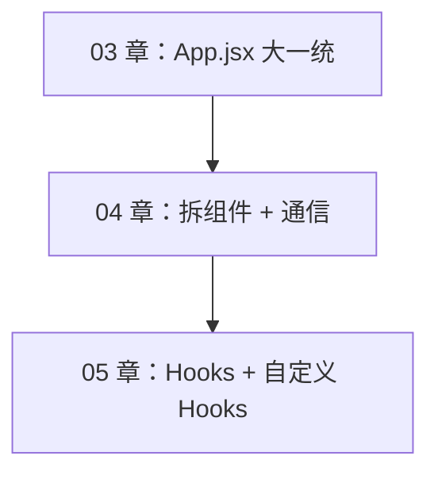
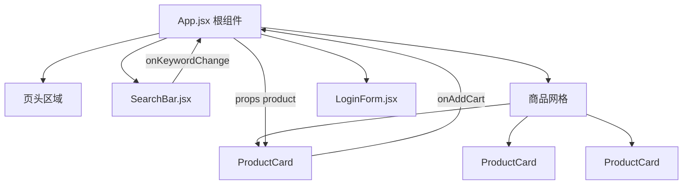
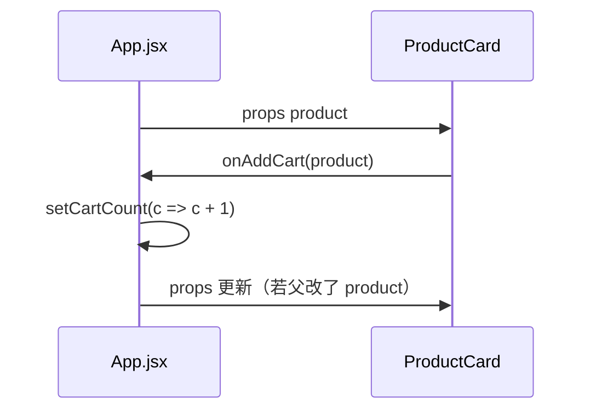
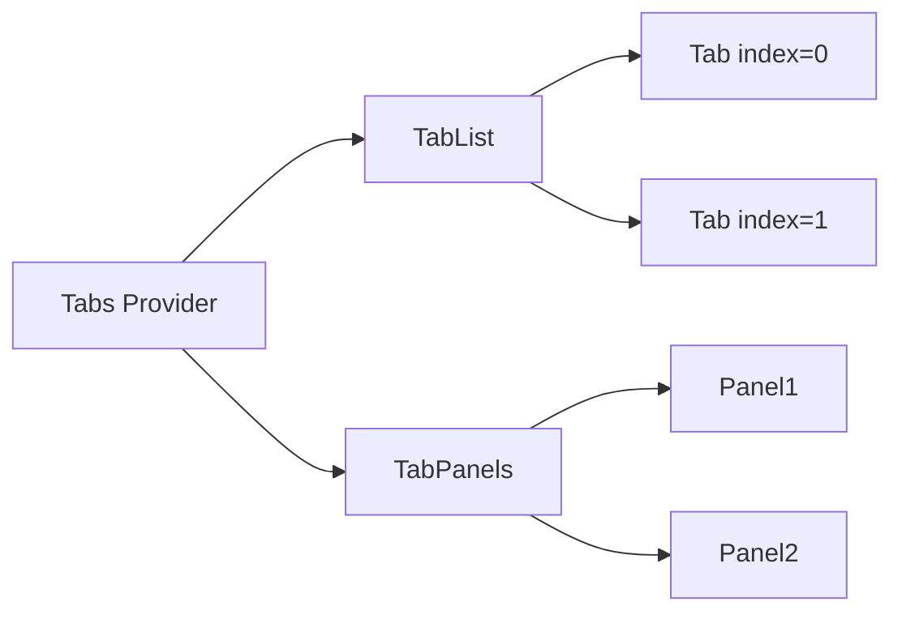
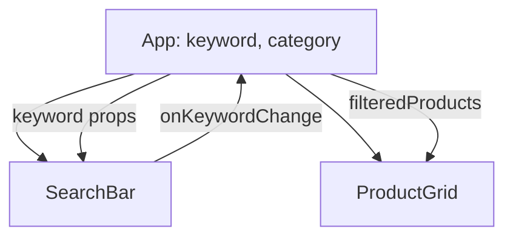
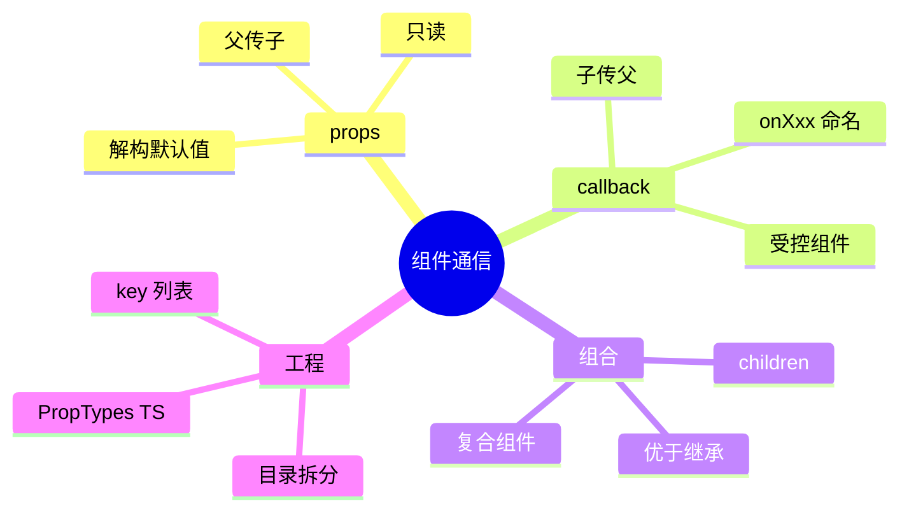

# 组件通信与组合

## 本章与上一章的关系

03 章你在 `shop-react` 的 `App.jsx` 里用 `useState` 实现了搜索过滤、统计条、登录表单、Tab 切换——功能完整，但**一个文件承担太多职责**：商品卡片 JSX 重复、搜索逻辑和列表耦在一起、登录表单无法复用到别的页面。

React 的核心工程化手段是**组件化**：每个 `.jsx` 文件是一个独立、可复用、可测试的 UI 单元。这一章把 03 章的页面拆成：

```text
App.jsx
├── SearchBar.jsx       ← 搜索 + 分类
├── ProductCard.jsx     ← 单个商品（map 复用 N 次）
├── LoginForm.jsx       ← 登录表单
└── CartBadge.jsx       ← 购物车角标
```

学会 **props 父→子**、**callback props 子→父**、**组合优于继承**，是后面 Hooks 深入、React Router、Zustand 的基础。



**前置检查**：

- 03 章 shop-react 搜索、登录功能正常
- 理解 JSX 与 `useState` 基本用法
- `src/components/` 目录已存在（Vite + React 脚手架自带）

---

## 1. 什么是 React 组件

### 1.1 定义

组件 = 可复用的 UI 函数（或 Class），接收 **props** 返回 **JSX**。

**类比后端**：一个组件像 Spring 里的一个「小 Controller + 小 DTO + 小视图片段」，但前后端一体封装在 `.jsx` 里。

### 1.2 函数组件 vs 类组件

| 对比项 | 函数组件（本资料主力） | 类组件（Legacy） |
|--------|------------------------|------------------|
| 写法 | `function Foo() { return <div/> }` | `class Foo extends Component` |
| 状态 | `useState` | `this.state` |
| 生命周期 | `useEffect` | `componentDidMount` 等 |
| 官方推荐 | ✅ React 18+ 默认 | 维护老项目才需 |

本章及后续全部使用**函数组件**。

### 1.3 为什么要拆

| 不拆 | 拆组件后 |
|------|----------|
| `App.jsx` 500+ 行 | 每个文件 50～120 行 |
| 改卡片样式要在大文件里找 | 只打开 `ProductCard.jsx` |
| 登录表单无法复用 | `LoginForm` 挂到任意页 |
| 难以分工 | 多人并行改不同组件 |

### 1.4 组件树



---

## 2. 创建与组织组件

### 2.1 文件放哪

约定：`src/components/` 放**通用**组件；`src/views/` 或 `src/pages/` 放**页面级**组件（06 章 Router 用）。

```text
shop-react/src/
├── components/
│   ├── SearchBar.jsx
│   ├── ProductCard.jsx
│   ├── LoginForm.jsx
│   └── CartBadge.jsx
├── App.jsx
└── main.jsx
```

### 2.2 局部引入（默认方式）

```jsx
import ProductCard from './components/ProductCard.jsx'

function App() {
  return <ProductCard product={p} />
}
```

**注意**：Vite 项目可省略 `.jsx` 后缀；本资料为清晰起见有时保留。

### 2.3 默认导出 vs 命名导出

```jsx
// ProductCard.jsx — 默认导出（一个文件一个主组件时常用）
export default function ProductCard() { /* ... */ }

// utils.js — 命名导出（工具函数、多个小组件）
export function formatPrice(n) { /* ... */ }
export function CartIcon() { /* ... */ }
```

---

## 3. 单向数据流

React 推荐：**数据从父到子用 props 流下去；子要通知父通过 callback props**。

```text
父 state (products, keyword)
    ↓ props
子组件展示
    ↓ onAddCart(product)
父组件 setState 更新
    ↓ props 自动更新
子组件重新渲染
```

**为什么？** 数据流向可预测，不会出现「多个子组件 secretly 改同一份数据」的调试噩梦。



**与 Vue 对比**：

| Vue | React |
|-----|-------|
| `defineProps` | 函数参数 `props` 或解构 |
| `defineEmits` | callback props，如 `onAddCart` |
| `v-model:keyword` | 受控组件：`value` + `onChange` |

---

## 4. props：父传子

### 4.1 基本用法

父：

```jsx
<ProductCard product={p} showPrice={true} />
```

子 `ProductCard.jsx`：

```jsx
function ProductCard({ product, showPrice = true }) {
  return (
    <article>
      <h3>{product.name}</h3>
      {showPrice && <p>¥{product.price}</p>}
    </article>
  )
}

export default ProductCard
```

### 4.2 解构 props

```jsx
// 推荐：参数解构 + 默认值
function SearchBar({ keyword = '', category = 'all', onKeywordChange }) {
  // ...
}

// 也可先收 props 再解构
function SearchBar(props) {
  const { keyword, onKeywordChange } = props
}
```

### 4.3 props 只读

```jsx
// ❌ 不要直接改 props
function ProductCard({ product }) {
  product.stock--  // 违反单向数据流
}

// ✅ 通知父组件
function ProductCard({ product, onAddCart }) {
  function handleAdd() {
    onAddCart(product)
  }
}
```

### 4.4 传递多种类型

```jsx
<ProductCard product={p} />           {/* 对象 */}
<CartBadge count={99} />              {/* 数字 */}
<ProductCard showPrice={idx === 0} /> {/* 布尔表达式 */}
<SearchBar onKeywordChange={setKeyword} /> {/* 函数 */}
```

### 4.5 展开运算符传 props

```jsx
const cardProps = { product: p, showPrice: true }
<ProductCard {...cardProps} />
```

---

## 5. callback props：子传父

### 5.1 命名约定

React 社区约定 callback 以 **`on` + 事件名** 命名：

| 子组件定义 | 父组件传入 |
|-----------|-----------|
| `onAddCart` | `onAddCart={handleAddCart}` |
| `onLoginSuccess` | `onLoginSuccess={handleLogin}` |
| `onKeywordChange` | `onKeywordChange={setKeyword}` |

### 5.2 完整示例

子 `ProductCard.jsx`：

```jsx
function ProductCard({ product, onAddCart, onViewDetail }) {
  function handleAdd() {
    if (product.stock <= 0) return
    onAddCart?.(product)  // 可选链：父未传时不报错
  }

  function handleView() {
    onViewDetail?.(product.id)
  }

  return (
    <article>
      <button type="button" onClick={handleAdd}>加入购物车</button>
      <button type="button" onClick={handleView}>详情</button>
    </article>
  )
}
```

父：

```jsx
function App() {
  function handleAddCart(product) {
    setCartCount(c => c + 1)
    console.log('加购', product.name)
  }

  return (
    <ProductCard
      product={p}
      onAddCart={handleAddCart}
      onViewDetail={(id) => console.log('查看', id)}
    />
  )
}
```

### 5.3 受控组件模式（等价 Vue v-model）

Vue 的 `v-model:keyword` 在 React 中拆成 **value + onChange** 两个 props：

```jsx
// 父
const [keyword, setKeyword] = useState('')
<SearchBar keyword={keyword} onKeywordChange={setKeyword} />

// 子 SearchBar — 不持有 keyword 的「真相」，只展示 + 上报
<input
  value={keyword}
  onChange={(e) => onKeywordChange(e.target.value)}
/>
```

**为什么叫「受控」？** 输入框的值完全由 React state（父）控制，DOM 只是展示层。

---

## 6. 组合 vs 继承

### 6.1 React 官方立场

> 在 React 中，组合（Composition）优于继承（Inheritance）。

React 没有类似 Vue `extends` 或 class 继承组件 UI 的推荐模式。复用 UI 靠：

| 手段 | 说明 |
|------|------|
| **props + children** | 最常用，类似 Vue 默认 slot |
| **render props** | 父传函数，子调函数拿 UI |
| **复合组件** | 一组组件共享隐式 context（本节 §7 简介） |
| **自定义 Hooks** | 复用**逻辑**（05 章详讲） |

### 6.2 children：默认插槽

```jsx
// Card.jsx
function Card({ title, children }) {
  return (
    <div className="card">
      <h3>{title}</h3>
      <div className="card-body">{children}</div>
    </div>
  )
}

// 使用
<Card title="商品统计">
  <p>共 {count} 件商品</p>
</Card>
```

**与 Vue slot 对比**：

| Vue | React |
|-----|-------|
| `<slot />` | `{children}` |
| `<slot name="footer" />` | 多个 props，如 `footer={<.../>}` |

### 6.3 特殊化组件（组合的一种）

```jsx
function Dialog({ title, children, actions }) {
  return (
    <div className="dialog">
      <header>{title}</header>
      <main>{children}</main>
      <footer>{actions}</footer>
    </div>
  )
}

function ConfirmDialog({ message, onConfirm, onCancel }) {
  return (
    <Dialog
      title="确认"
      actions={
        <>
          <button onClick={onCancel}>取消</button>
          <button onClick={onConfirm}>确定</button>
        </>
      }
    >
      <p>{message}</p>
    </Dialog>
  )
}
```

---

## 7. 复合组件（Compound Components）简介

一组组件**协同工作**，通过 Context 共享状态，对外 API 像「一个组件家族」。

### 7.1 典型结构

```jsx
// Tabs.jsx — 简化示意
import { createContext, useContext, useState } from 'react'

const TabsContext = createContext(null)

function Tabs({ defaultIndex = 0, children }) {
  const [activeIndex, setActiveIndex] = useState(defaultIndex)
  return (
    <TabsContext.Provider value={{ activeIndex, setActiveIndex }}>
      <div className="tabs">{children}</div>
    </TabsContext.Provider>
  )
}

function TabList({ children }) {
  return <div className="tab-list">{children}</div>
}

function Tab({ index, children }) {
  const { activeIndex, setActiveIndex } = useContext(TabsContext)
  return (
    <button
      type="button"
      className={activeIndex === index ? 'active' : ''}
      onClick={() => setActiveIndex(index)}
    >
      {children}
    </button>
  )
}

function TabPanels({ children }) {
  const { activeIndex } = useContext(TabsContext)
  const panels = Array.isArray(children) ? children : [children]
  return <div>{panels[activeIndex]}</div>
}

function TabPanel({ children }) {
  return <div>{children}</div>
}

Tabs.List = TabList
Tabs.Tab = Tab
Tabs.Panels = TabPanels
Tabs.Panel = TabPanel

export default Tabs
```

使用：

```jsx
<Tabs defaultIndex={0}>
  <Tabs.List>
    <Tabs.Tab index={0}>商品</Tabs.Tab>
    <Tabs.Tab index={1}>登录</Tabs.Tab>
  </Tabs.List>
  <Tabs.Panels>
    <Tabs.Panel>商品列表内容</Tabs.Panel>
    <Tabs.Panel>登录表单</Tabs.Panel>
  </Tabs.Panels>
</Tabs>
```

**何时用？** UI 库（Radix、Headless UI）常见；shop-react 现阶段用简单 Tab state 即可，知道模式即可。



---

## 8. PropTypes 与 TypeScript

### 8.1 PropTypes（JavaScript 项目）

```bash
npm install prop-types
```

```jsx
import PropTypes from 'prop-types'

function ProductCard({ product, showPrice, onAddCart }) {
  // ...
}

ProductCard.propTypes = {
  product: PropTypes.shape({
    id: PropTypes.number.isRequired,
    name: PropTypes.string.isRequired,
    price: PropTypes.number.isRequired,
    stock: PropTypes.number,
  }).isRequired,
  showPrice: PropTypes.bool,
  onAddCart: PropTypes.func,
}

ProductCard.defaultProps = {
  showPrice: true,
}

export default ProductCard
```

开发模式下类型不匹配会在控制台警告。

### 8.2 TypeScript（进阶推荐）

```tsx
// ProductCard.tsx
export interface Product {
  id: number
  name: string
  price: number
  stock?: number
  isHot?: boolean
  img?: string
}

interface ProductCardProps {
  product: Product
  showPrice?: boolean
  onAddCart?: (product: Product) => void
}

export default function ProductCard({
  product,
  showPrice = true,
  onAddCart,
}: ProductCardProps) {
  // ...
}
```

| 方案 | 适用 |
|------|------|
| PropTypes | 纯 JS 项目，零配置 |
| TypeScript | 新项目、团队协作、IDE 提示更强 |

本资料主线用 **JS + PropTypes 注释说明**；面试可提 TS 是一等公民。

---

## 9. 手把手：ProductCard.jsx

**创建** `src/components/ProductCard.jsx`：

```jsx
function formatPrice(price) {
  return Number(price).toFixed(2)
}

function ProductCard({ product, onAddCart }) {
  const isSoldOut = product.stock === 0

  function handleAdd() {
    if (isSoldOut) return
    onAddCart?.(product)
  }

  const cardClass = [
    'card',
    product.isHot ? 'card--hot' : '',
    isSoldOut ? 'card--sold' : '',
  ].filter(Boolean).join(' ')

  return (
    <article className={cardClass}>
      {product.img && (
        
      )}
      {product.isHot && <span className="tag tag-hot">热卖</span>}
      <h3 className="title">{product.name}</h3>
      <p className="price">¥{formatPrice(product.price)}</p>
      {product.stock > 0 ? (
        <p className="stock">库存 {product.stock}</p>
      ) : (
        <p className="sold">售罄</p>
      )}
      <button
        type="button"
        className="btn"
        disabled={isSoldOut}
        onClick={handleAdd}
      >
        {isSoldOut ? '暂时缺货' : '加入购物车'}
      </button>
    </article>
  )
}

export default ProductCard
```

**`src/components/ProductCard.css`**（或写在 App.css）：

```css
.card {
  background: #fff;
  border: 1px solid #e5e7eb;
  border-radius: 12px;
  padding: 16px;
}
.card--hot { border-color: #fca5a5; }
.card--sold { opacity: 0.65; }
.cover { width: 100%; border-radius: 8px; margin-bottom: 10px; }
.tag-hot {
  font-size: 11px;
  background: #fee2e2;
  color: #dc2626;
  padding: 2px 8px;
  border-radius: 4px;
}
.title { font-size: 16px; margin: 8px 0; }
.price { color: #e74c3c; font-size: 20px; font-weight: 700; }
.stock { color: #059669; font-size: 13px; }
.sold { color: #9ca3af; }
.btn {
  width: 100%;
  padding: 10px;
  border: none;
  border-radius: 8px;
  background: #61dafb;
  color: #20232a;
  font-weight: 600;
  cursor: pointer;
}
.btn:disabled { background: #d1d5db; cursor: not-allowed; }
```

---

## 10. 手把手：SearchBar.jsx

**受控组件方案**（keyword 在父，SearchBar 只展示 + 回调，推荐）：

```jsx
const CATEGORIES = [
  { value: 'all', label: '全部分类' },
  { value: 'book', label: '图书' },
  { value: 'digital', label: '数码' },
]

function SearchBar({ keyword, category, onKeywordChange, onCategoryChange }) {
  return (
    <div className="search-bar">
      <input
        type="search"
        className="input"
        placeholder="搜索商品..."
        value={keyword}
        onChange={(e) => onKeywordChange(e.target.value)}
      />
      <select
        className="select"
        value={category}
        onChange={(e) => onCategoryChange(e.target.value)}
      >
        {CATEGORIES.map((c) => (
          <option key={c.value} value={c.value}>
            {c.label}
          </option>
        ))}
      </select>
    </div>
  )
}

export default SearchBar
```

```css
.search-bar { display: flex; gap: 12px; margin-bottom: 16px; flex-wrap: wrap; }
.input { flex: 1; min-width: 200px; max-width: 400px; padding: 10px 12px; border: 1px solid #d1d5db; border-radius: 8px; }
.select { padding: 10px; border-radius: 8px; border: 1px solid #d1d5db; }
```

父组件用法：

```jsx
const [keyword, setKeyword] = useState('')
const [category, setCategory] = useState('all')

<SearchBar
  keyword={keyword}
  category={category}
  onKeywordChange={setKeyword}
  onCategoryChange={setCategory}
/>
```

---

## 11. 手把手：LoginForm.jsx

表单 UI 与校验封装在子组件；**提交结果通过 callback 给父**：

```jsx
import { useState } from 'react'

function LoginForm({ onLoginSuccess }) {
  const [username, setUsername] = useState('')
  const [password, setPassword] = useState('')
  const [remember, setRemember] = useState(false)
  const [errors, setErrors] = useState({})
  const [loading, setLoading] = useState(false)

  function validate() {
    const next = {}
    if (!username.trim()) next.username = '请输入用户名'
    if (!password) next.password = '请输入密码'
    else if (password.length < 6) next.password = '密码至少 6 位'
    setErrors(next)
    return Object.keys(next).length === 0
  }

  function handleSubmit(e) {
    e.preventDefault()
    if (!validate()) return

    setLoading(true)
    setTimeout(() => {
      setLoading(false)
      onLoginSuccess?.({ username, remember })
    }, 600)
  }

  return (
    <form className="login-form" onSubmit={handleSubmit}>
      <h2>用户登录</h2>
      <div className="field">
        <input
          value={username}
          onChange={(e) => setUsername(e.target.value.trim())}
          placeholder="用户名"
        />
        {errors.username && <p className="err">{errors.username}</p>}
      </div>
      <div className="field">
        <input
          type="password"
          value={password}
          onChange={(e) => setPassword(e.target.value)}
          placeholder="密码（≥6 位）"
        />
        {errors.password && <p className="err">{errors.password}</p>}
      </div>
      <label className="remember">
        <input
          type="checkbox"
          checked={remember}
          onChange={(e) => setRemember(e.target.checked)}
        />
        记住我
      </label>
      <button type="submit" disabled={loading}>
        {loading ? '登录中...' : '登录'}
      </button>
    </form>
  )
}

export default LoginForm
```

```css
.login-form {
  max-width: 360px;
  margin: 0 auto;
  padding: 28px;
  background: #fff;
  border-radius: 12px;
  box-shadow: 0 1px 3px rgba(0,0,0,0.08);
}
.field { margin-bottom: 12px; }
.field input {
  width: 100%;
  padding: 10px;
  box-sizing: border-box;
  border: 1px solid #d1d5db;
  border-radius: 8px;
}
.err { color: #e74c3c; font-size: 12px; margin-top: 4px; }
.remember { display: flex; gap: 8px; margin-bottom: 16px; font-size: 14px; }
.login-form button {
  width: 100%;
  padding: 10px;
  background: #61dafb;
  color: #20232a;
  font-weight: 600;
  border: none;
  border-radius: 8px;
  cursor: pointer;
}
.login-form button:disabled { opacity: 0.6; cursor: not-allowed; }
```

父：

```jsx
<LoginForm onLoginSuccess={handleLoginSuccess} />
```

---

## 12. 手把手：CartBadge.jsx

```jsx
function CartBadge({ count = 0 }) {
  return (
    <span className={`badge ${count === 0 ? 'badge--empty' : ''}`}>
      🛒 {count}
    </span>
  )
}

export default CartBadge
```

```css
.badge {
  background: #61dafb;
  color: #20232a;
  padding: 8px 16px;
  border-radius: 999px;
  font-weight: 600;
}
.badge--empty { background: #9ca3af; color: #fff; }
```

---

## 13. 组装 App.jsx（完整可运行）

```jsx
import { useState, useMemo } from 'react'
import SearchBar from './components/SearchBar.jsx'
import ProductCard from './components/ProductCard.jsx'
import LoginForm from './components/LoginForm.jsx'
import CartBadge from './components/CartBadge.jsx'
import './App.css'

const MOCK_PRODUCTS = [
  { id: 1, name: 'React 18 实战教程', price: 69.9, category: 'book', stock: 50, isHot: true },
  { id: 2, name: '机械键盘', price: 399, category: 'digital', stock: 12 },
  { id: 3, name: '显示器支架', price: 129, category: 'digital', stock: 0 },
  { id: 4, name: 'TypeScript 入门', price: 49.9, category: 'book', stock: 30 },
]

function App() {
  const [activeTab, setActiveTab] = useState('products')
  const [keyword, setKeyword] = useState('')
  const [category, setCategory] = useState('all')
  const [cartCount, setCartCount] = useState(0)
  const [loggedInUser, setLoggedInUser] = useState(null)

  const filteredProducts = useMemo(() => {
    const kw = keyword.trim().toLowerCase()
    return MOCK_PRODUCTS.filter((p) => {
      const matchCat = category === 'all' || p.category === category
      const matchKw = !kw || p.name.toLowerCase().includes(kw)
      return matchCat && matchKw
    })
  }, [keyword, category])

  function handleAddCart(product) {
    setCartCount((c) => c + 1)
    console.log('加购:', product.name)
  }

  function handleLoginSuccess({ username }) {
    setLoggedInUser(username)
    setActiveTab('products')
    alert(`欢迎，${username}！`)
  }

  return (
    <div className="app">
      <header className="header">
        <h1 className="logo">⚛️ shop-react 练习商城</h1>
        <nav className="tabs">
          <button
            type="button"
            className={activeTab === 'products' ? 'tab active' : 'tab'}
            onClick={() => setActiveTab('products')}
          >
            商品
          </button>
          <button
            type="button"
            className={activeTab === 'login' ? 'tab active' : 'tab'}
            onClick={() => setActiveTab('login')}
          >
            登录
          </button>
        </nav>
        <CartBadge count={cartCount} />
        {loggedInUser && <span className="user">你好，{loggedInUser}</span>}
      </header>

      <main className="main">
        {activeTab === 'products' && (
          <section>
            <SearchBar
              keyword={keyword}
              category={category}
              onKeywordChange={setKeyword}
              onCategoryChange={setCategory}
            />
            <p className="stats">
              共 {filteredProducts.length} 件商品
              {keyword && `（关键词：${keyword}）`}
            </p>
            <div className="grid">
              {filteredProducts.map((p) => (
                <ProductCard
                  key={p.id}
                  product={p}
                  onAddCart={handleAddCart}
                />
              ))}
            </div>
            {filteredProducts.length === 0 && (
              <p className="empty">没有匹配的商品</p>
            )}
          </section>
        )}

        {activeTab === 'login' && (
          <LoginForm onLoginSuccess={handleLoginSuccess} />
        )}
      </main>
    </div>
  )
}

export default App
```

**`src/App.css`** 补充：

```css
* { box-sizing: border-box; }
body { margin: 0; font-family: system-ui, -apple-system, sans-serif; background: #fafafa; }
.app { max-width: 1200px; margin: 0 auto; padding: 16px; }
.header {
  display: flex;
  align-items: center;
  gap: 16px;
  flex-wrap: wrap;
  padding-bottom: 16px;
  border-bottom: 1px solid #eee;
  margin-bottom: 24px;
}
.logo { font-size: 1.25rem; margin: 0; color: #20232a; }
.tabs { display: flex; gap: 8px; flex: 1; }
.tab {
  padding: 8px 16px;
  border: 1px solid #d1d5db;
  background: #fff;
  border-radius: 8px;
  cursor: pointer;
}
.tab.active { background: #61dafb; border-color: #61dafb; font-weight: 600; }
.user { font-size: 14px; color: #666; }
.main { min-height: 400px; }
.grid {
  display: grid;
  grid-template-columns: repeat(auto-fill, minmax(240px, 1fr));
  gap: 16px;
}
.stats { color: #666; margin-bottom: 16px; }
.empty { text-align: center; color: #9ca3af; padding: 40px; }
```

运行验证：

```bash
cd shop-react
npm run dev
# 预期：搜索、分类、加购计数、登录 Tab 均正常
```

---

## 14. key 与列表渲染

```jsx
{filteredProducts.map((p) => (
  <ProductCard key={p.id} product={p} onAddCart={handleAddCart} />
))}
```

| 规则 | 说明 |
|------|------|
| 用稳定唯一 id | `key={p.id}`，不要用数组 index（排序/filter 会乱） |
| key 在兄弟间唯一 | 不要求全局唯一 |
| key 不传 dev 警告 | 列表 diff 性能差、状态错位 |

---

## 15. 条件渲染与 Fragment

```jsx
import { Fragment } from 'react'

// 三元
{activeTab === 'products' ? <ProductList /> : <LoginForm />}

// && 短路（注意左侧不能是 0）
{cartCount > 0 && <span>有商品</span>}

// Fragment 避免多余 DOM
<>
  <SearchBar ... />
  <div className="grid">...</div>
</>
```

---

## 16. 提升 state（Lifting State Up）

当两个子组件需要同一份数据时，把 state **提升到最近共同父组件**：



05 章会用自定义 Hooks 进一步抽逻辑；07 章跨路由共享用 Zustand。

---

## 17. 分级练习

### 17.1 基础：EmptyState 组件

**要求**：无商品时显示 `EmptyState`，props 传 `message`。

<details>
<summary>参考答案</summary>

```jsx
// EmptyState.jsx
function EmptyState({ message = '暂无数据' }) {
  return <div className="empty-state">{message}</div>
}
export default EmptyState
```

```jsx
{filteredProducts.length === 0 && (
  <EmptyState message="没有匹配商品，换个关键词试试" />
)}
```

</details>

### 17.2 进阶：ProductCard 加「查看详情」callback

**要求**：点击详情按钮，父组件 `console.log` 商品 id。

<details>
<summary>参考答案</summary>

子组件增加 `onViewDetail` prop 和按钮；父传 `onViewDetail={(id) => console.log(id)}`。

</details>

### 17.3 挑战：受控 vs 非受控 SearchBar

**要求**：再写一个 `SearchBarUncontrolled`，内部自己管 keyword，只在点击「搜索」按钮时 `onSearch(keyword)` 通知父。

<details>
<summary>思路</summary>

非受控适合「点搜索才过滤」；受控适合「输入即过滤」。对比两种 UX。

</details>

### 17.4 挑战+：简单 Tabs 复合组件

**要求**：仿 §7 实现 `Tabs` + `Tabs.Tab` + `Tabs.Panel`，替换 App 里两个 button Tab。

---

## 18. 常见报错与排查

| 报错/现象 | 可能原因 | 解决方案 |
|-----------|----------|----------|
| `Cannot read properties of undefined (reading 'name')` | 父未传 product 或传 null | 检查 props；子组件加可选链 `product?.name` |
| 子组件改了数据父不更新 | 直接改 props 对象字段 | 父里 immutable 更新：`setProducts(prev => ...)` |
| 输入框无法输入 | 受控组件缺 `onChange` | 补 `value` + `onChange` |
| 输入框一闪回退 | value 绑定了旧 state | 确认 `onChange` 调的是正确的 setter |
| `Each child in a list should have a unique key` | map 缺 key | 加 `key={item.id}` |
| 样式不生效 | class 名拼写或未 import CSS | 检查 import 与 className |
| 事件触发两次 | Strict Mode 双调用（dev） | 生产正常；注意副作用清理（05 章） |
| `Functions are not valid as a React child` | 误写 `{handleClick}` 而非 `{handleClick()}` | 传函数作 prop 用 `onClick={handleClick}` |
| PropTypes 警告 | 类型不匹配 | 按控制台提示修正 props |
| 组件不更新 | 父 state 引用未变 | 创建新对象/数组，不要 mutate |

---

## 19. 常见问题 FAQ

### Q1：props 能传函数吗？

能，且这是子传父的标准方式。也可传格式化函数，但通常格式化放子组件内部。

### Q2：兄弟组件怎么通信？

提升到共同父组件，或 07 章 Zustand 全局 store。

### Q3：必须写 PropTypes / TS 吗？

小练习可选；团队项目强烈建议，减少运行时 bug。

### Q4：callback 命名必须 onXxx 吗？

约定俗成，非强制；但遵循可提升可读性，且与 DOM 事件 `onClick` 一致。

### Q5：为什么 LoginForm 的 form state 放子组件？

表单 UI 与校验封装在一起；提交结果 callback 给父——职责清晰。若父需要读 username，再提升 state 或通过 callback 传。

### Q6：和 Vue 的 props/emit 一样吗？

概念类似；Vue 有 `v-model` 语法糖，React 用受控组件 `value + onChange` 实现同等效果。

### Q7：defaultProps 还能用吗？

React 18.3+ 推荐函数参数默认值 `showPrice = true`，少用 `Component.defaultProps`。

---

## 20. 本章小结



你已为 `shop-react` 拆好四个核心组件。下一章系统讲 **Hooks**：`useEffect` 副作用、`useMemo` 优化，以及 `useProducts` / `useCart` 自定义 Hooks 抽逻辑。

---

## 21. 学完标准

- [ ] 能创建 `.jsx` 组件并在父级 import 使用
- [ ] 熟练使用 props 与 callback props
- [ ] 理解单向数据流，不直接改 props
- [ ] 会用受控组件模式（value + onChange）
- [ ] 完成 SearchBar + ProductCard + LoginForm + CartBadge 拆分
- [ ] 理解组合 vs 继承、children、复合组件概念
- [ ] 知道 PropTypes 与 TypeScript 选型

---

## 22. 知识点清单

| 序号 | 知识点 | 自评 |
|------|--------|------|
| 1 | 函数组件与目录结构 | ☐ |
| 2 | 单向数据流 | ☐ |
| 3 | props 解构与默认值 | ☐ |
| 4 | callback props | ☐ |
| 5 | 受控组件 | ☐ |
| 6 | children 组合 | ☐ |
| 7 | 复合组件概念 | ☐ |
| 8 | PropTypes / TS | ☐ |
| 9 | key 与列表 | ☐ |
| 10 | 提升 state | ☐ |
| 11 | shop-react 四组件实操 | ☐ |

---

## 下一章预告

04 章组件能拆了，但 `filteredProducts`、`cartCount` 逻辑仍堆在 `App.jsx`，且缺少「挂载后拉数据」「卸载清理定时器」等能力。05 章系统讲 **Hooks 核心与自定义 Hooks**：`useEffect` 副作用、`useRef` DOM 引用、`useMemo` / `useCallback` 优化，以及 `useProducts` + `useCart` 抽逻辑——让组件只负责「拼 UI」，业务逻辑可测试、可复用。

---

*下一章：05 Hooks 核心与自定义 Hooks*
