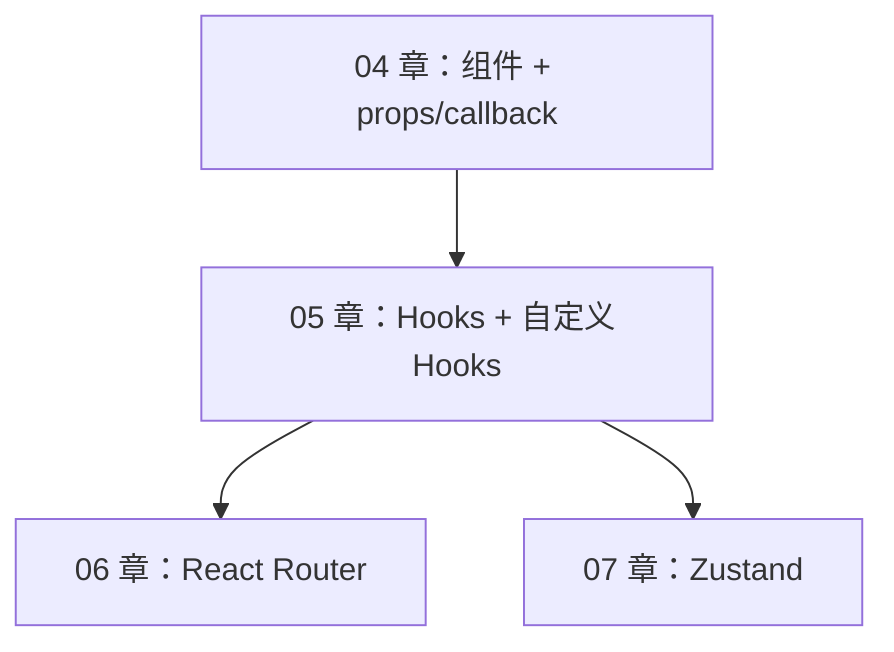
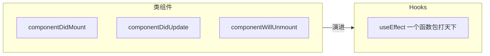
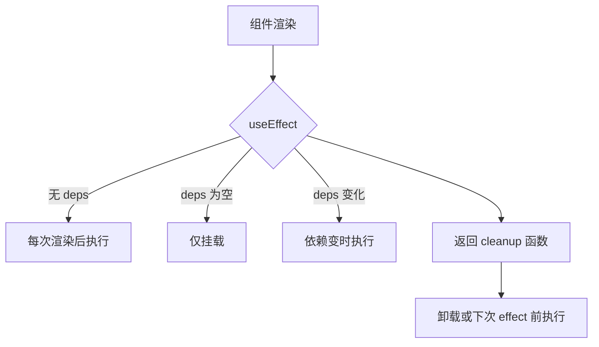
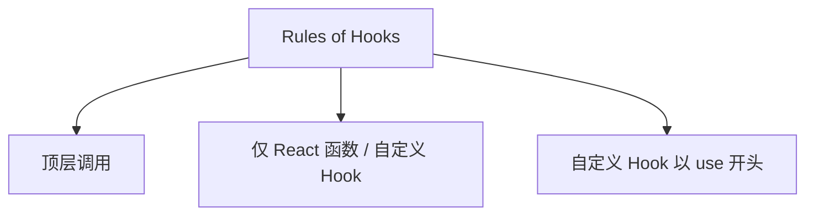
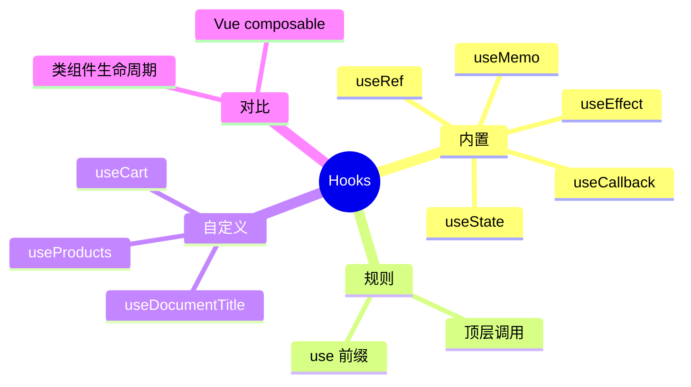

# Hooks 核心与自定义 Hooks

## 本章与上一章的关系

04 章把 `shop-react` 拆成了 `SearchBar`、`ProductCard`、`LoginForm`、`CartBadge`，通信用 props 与 callback props 完成。但 `App.jsx` 里仍堆着：

- 商品假数据与过滤逻辑
- 购物车计数
- 登录态
- 缺少「组件挂载后请求数据」「卸载时清理定时器」等生命周期能力

**Hooks** 是 React 16.8+ 在函数组件里使用 state、副作用、 ref、性能优化的官方 API。配合**自定义 Hooks**（`useProducts`、`useCart`），可以把逻辑从 UI 里抽出去——类似 Vue 3 的 composables。

这一章重构 `shop-react`，为 06 章 Router 多页面、07 章 Zustand 全局状态打基础。



**前置检查**：

- 04 章四个组件拆分完成
- 理解 `useState` 基本用法（03 章）
- Node 18+，shop-react 可 `npm run dev`

---

## 1. 为什么需要 Hooks

### 1.1 类组件的痛点

| 问题 | 表现 |
|------|------|
| 逻辑难复用 | 高阶组件、render props 嵌套地狱 |
| 生命周期分散 | 同一逻辑拆在 mount/update/unmount |
| `this` 绑定 | 事件 handler 需 bind 或箭头函数 |
| 巨型组件 | state 越多，class 越臃肿 |

### 1.2 Hooks 解决了什么

- **按功能组织代码**，而非按生命周期拆方法
- **自定义 Hook** 复用有状态逻辑（无 UI）
- 函数组件成为**唯一推荐**写法



---

## 2. useState：状态与更新

### 2.1 基本用法

```jsx
import { useState } from 'react'

function Counter() {
  const [count, setCount] = useState(0)

  return (
    <button type="button" onClick={() => setCount(count + 1)}>
      {count}
    </button>
  )
}
```

### 2.2 函数式更新

当新 state 依赖旧 state 时，用**更新函数**避免闭包陈旧值：

```jsx
// ✅ 推荐
setCount((prev) => prev + 1)

// ⚠️ 快速连点可能丢更新
setCount(count + 1)
```

### 2.3 对象与数组 state

**不可变更新**（immutable）：永远创建新对象/新数组，不要 mutate：

```jsx
const [user, setUser] = useState({ name: '', age: 0 })

// ❌
user.name = 'Tom'

// ✅
setUser((prev) => ({ ...prev, name: 'Tom' }))

const [items, setItems] = useState([])

// ✅ 追加
setItems((prev) => [...prev, newItem])

// ✅ 删除
setItems((prev) => prev.filter((i) => i.id !== id))
```

### 2.4 惰性初始 state

```jsx
// 仅首次渲染执行 expensiveInit
const [data, setData] = useState(() => {
  const cached = localStorage.getItem('key')
  return cached ? JSON.parse(cached) : []
})
```

### 2.5 与 Vue ref 对比

| Vue 3 | React |
|-------|-------|
| `const count = ref(0)` | `const [count, setCount] = useState(0)` |
| `count.value++` | `setCount(c => c + 1)` |
| 自动解包 | 直接使用 `count` |

---

## 3. useEffect：副作用

### 3.1 什么是副作用

**副作用** = 渲染之外的操作：请求 API、订阅、改 document.title、定时器、localStorage 同步等。

```jsx
import { useEffect } from 'react'

useEffect(() => {
  document.title = `购物车 (${count})`
})
```

### 3.2 依赖数组 deps

```jsx
// 1. 无 deps：每次渲染后都执行（少用）
useEffect(() => { /* ... */ })

// 2. 空数组 []：仅挂载后执行一次（类似 componentDidMount）
useEffect(() => {
  console.log('mounted')
}, [])

// 3. 有 deps：deps 变化时执行（类似 componentDidUpdate 针对特定值）
useEffect(() => {
  fetchProduct(id)
}, [id])
```



### 3.3 cleanup 清理函数

```jsx
useEffect(() => {
  const timer = setInterval(() => {
    console.log('tick')
  }, 1000)

  // 卸载或 deps 变化重新执行前调用
  return () => {
    clearInterval(timer)
  }
}, [])
```

**典型场景**：

| 副作用 | cleanup |
|--------|---------|
| `setInterval` | `clearInterval` |
| `addEventListener` | `removeEventListener` |
| WebSocket 订阅 | `socket.close()` |
| AbortController 请求 | `abort()` |

### 3.4 拉取商品列表示例

```jsx
function ProductList() {
  const [products, setProducts] = useState([])
  const [loading, setLoading] = useState(true)
  const [error, setError] = useState(null)

  useEffect(() => {
    let cancelled = false
    setLoading(true)

    async function load() {
      try {
        // 08 章换真实 API
        await new Promise((r) => setTimeout(r, 400))
        const data = MOCK_PRODUCTS
        if (!cancelled) setProducts(data)
      } catch (e) {
        if (!cancelled) setError(e.message)
      } finally {
        if (!cancelled) setLoading(false)
      }
    }

    load()
    return () => { cancelled = true }
  }, [])

  if (loading) return <p>加载中...</p>
  if (error) return <p>错误：{error}</p>
  return (/* 渲染 products */)
}
```

**为什么需要 `cancelled` 标志？** 组件卸载后异步回调仍可能 `setState`，React 会警告；用标志或 `AbortController` 避免。

### 3.5 常见 deps  mistake

```jsx
// ❌ 漏掉 keyword，搜索不会随 keyword 变
useEffect(() => {
  search(keyword)
}, [])

// ✅
useEffect(() => {
  search(keyword)
}, [keyword])
```

**eslint-plugin-react-hooks** 的 `exhaustive-deps` 规则会提示遗漏依赖。

---

## 4. useRef：DOM 引用与可变盒子

### 4.1 访问 DOM

```jsx
import { useRef, useEffect } from 'react'

function SearchBar({ keyword, onKeywordChange }) {
  const inputRef = useRef(null)

  useEffect(() => {
    inputRef.current?.focus()
  }, [])

  return (
    <input
      ref={inputRef}
      value={keyword}
      onChange={(e) => onKeywordChange(e.target.value)}
    />
  )
}
```

### 4.2 保存不触发渲染的可变值

```jsx
const renderCount = useRef(0)
renderCount.current++  // 改 .current 不会 re-render

const prevId = useRef(id)
useEffect(() => {
  prevId.current = id
}, [id])
```

### 4.3 useRef vs useState

| | useState | useRef |
|---|----------|--------|
| 改值后 re-render | ✅ | ❌ |
| 适用 | UI 要反映的数据 | DOM、定时器 id、上一次的值 |

---

## 5. useMemo：缓存计算结果

当**派生数据计算昂贵**时，避免每次 render 重算：

```jsx
import { useMemo } from 'react'

const filteredProducts = useMemo(() => {
  const kw = keyword.trim().toLowerCase()
  return products.filter((p) => {
    const matchCat = category === 'all' || p.category === category
    const matchKw = !kw || p.name.toLowerCase().includes(kw)
    return matchCat && matchKw
  })
}, [products, keyword, category])
```

**不要滥用**：简单 `filter` 不必 memo；只有列表很大或计算很重时才值得。

**与 Vue computed 对比**：

| Vue | React |
|-----|-------|
| `computed(() => ...)` | `useMemo(() => ..., [deps])` |
| 自动收集依赖 | 手动写 deps 数组 |

---

## 6. useCallback：缓存函数引用

返回**记忆化的函数**，deps 不变则引用不变：

```jsx
import { useCallback } from 'react'

const handleAddCart = useCallback((product) => {
  setCartItems((prev) => {
    const exist = prev.find((i) => i.id === product.id)
    if (exist) {
      return prev.map((i) =>
        i.id === product.id ? { ...i, qty: i.qty + 1 } : i
      )
    }
    return [...prev, { ...product, qty: 1 }]
  })
}, [])
```

**何时用？**

- 把 callback 传给**包了 `React.memo` 的子组件**，避免子组件无意义 re-render
- 作为其他 Hook 的 deps（如 `useEffect(..., [fetchData])`）

**不要滥用**：普通传给普通子组件，通常不必 `useCallback`。

---

## 7. React.memo（补充）

配合 `useCallback` 优化子组件：

```jsx
import { memo } from 'react'

const ProductCard = memo(function ProductCard({ product, onAddCart }) {
  console.log('render', product.id)
  return (/* ... */)
})
```

父组件 re-render 时，若 `product` 与 `onAddCart` 引用未变，`ProductCard` 跳过渲染。

---

## 8. Hooks 规则（Rules of Hooks）

### 8.1 两条铁律

1. **只在最顶层调用 Hooks** — 不要在循环、条件、嵌套函数里调用
2. **只在 React 函数组件或自定义 Hook 里调用** — 不要在普通 JS 函数里

```jsx
// ❌ 条件里调用
if (loggedIn) {
  const [x, setX] = useState(0)
}

// ✅
const [x, setX] = useState(0)
if (!loggedIn) return null
```

**为什么？** React 靠 Hook **调用顺序**在内部数组里对应 state，顺序乱了 state 就错位。

### 8.2 自定义 Hook 命名

必须以 **`use` 开头**：`useProducts`、`useCart`、`useLocalStorage`。



---

## 9. 自定义 Hook：useProducts

**`src/hooks/useProducts.js`**：

```js
import { useState, useMemo } from 'react'

const MOCK_PRODUCTS = [
  { id: 1, name: 'React 18 实战教程', price: 69.9, category: 'book', stock: 50, isHot: true },
  { id: 2, name: '机械键盘', price: 399, category: 'digital', stock: 12 },
  { id: 3, name: '显示器支架', price: 129, category: 'digital', stock: 0 },
  { id: 4, name: 'TypeScript 入门', price: 49.9, category: 'book', stock: 30 },
]

export function useProducts(initialKeyword = '', initialCategory = 'all') {
  const [keyword, setKeyword] = useState(initialKeyword)
  const [category, setCategory] = useState(initialCategory)
  const [products] = useState(MOCK_PRODUCTS)

  const filteredProducts = useMemo(() => {
    const kw = keyword.trim().toLowerCase()
    return products.filter((p) => {
      const matchCat = category === 'all' || p.category === category
      const matchKw = !kw || p.name.toLowerCase().includes(kw)
      return matchCat && matchKw
    })
  }, [products, keyword, category])

  const stats = useMemo(() => ({
    total: products.length,
    filtered: filteredProducts.length,
    soldOut: filteredProducts.filter((p) => p.stock === 0).length,
  }), [products, filteredProducts])

  return {
    keyword,
    setKeyword,
    category,
    setCategory,
    products,
    filteredProducts,
    stats,
  }
}
```

**08 章扩展**：在 Hook 内 `useEffect` 调 axios 替换 `MOCK_PRODUCTS`。

---

## 10. 自定义 Hook：useCart

两种模式：

| 模式 | 说明 | 适用 |
|------|------|------|
| 实例隔离 | 每次 `useCart()` 新建 state | 每个组件独立购物车 |
| 模块单例 | state 放模块顶层 | 跨组件共享（07 章改 Zustand） |

**本章用模块单例**（与 04 章 App 全局 cart 一致）：

**`src/hooks/useCart.js`**：

```js
import { useState, useCallback, useMemo } from 'react'

// 模块级 state — 所有调用 useCart 的组件共享同一份
let cartItems = []
let listeners = []

function emitChange() {
  listeners.forEach((l) => l())
}

function subscribe(listener) {
  listeners.push(listener)
  return () => {
    listeners = listeners.filter((l) => l !== listener)
  }
}

function getSnapshot() {
  return cartItems
}

// 供非组件代码读（如 06 章路由守卫前的过渡方案）
export function getCartSnapshot() {
  return cartItems
}

export function useCart() {
  const items = useSyncExternalStore(subscribe, getSnapshot)

  const totalCount = useMemo(
    () => items.reduce((sum, i) => sum + i.qty, 0),
    [items]
  )

  const totalPrice = useMemo(
    () => items.reduce((sum, i) => sum + i.price * i.qty, 0),
    [items]
  )

  const add = useCallback((product) => {
    const exist = cartItems.find((i) => i.id === product.id)
    if (exist) {
      cartItems = cartItems.map((i) =>
        i.id === product.id ? { ...i, qty: i.qty + 1 } : i
      )
    } else {
      cartItems = [
        ...cartItems,
        { id: product.id, name: product.name, price: product.price, qty: 1 },
      ]
    }
    emitChange()
  }, [])

  const remove = useCallback((productId) => {
    cartItems = cartItems.filter((i) => i.id !== productId)
    emitChange()
  }, [])

  const updateQty = useCallback((productId, qty) => {
    if (qty <= 0) {
      cartItems = cartItems.filter((i) => i.id !== productId)
    } else {
      cartItems = cartItems.map((i) =>
        i.id === productId ? { ...i, qty } : i
      )
    }
    emitChange()
  }, [])

  const clear = useCallback(() => {
    cartItems = []
    emitChange()
  }, [])

  return {
    items,
    totalCount,
    totalPrice,
    isEmpty: items.length === 0,
    add,
    remove,
    updateQty,
    clear,
  }
}

// 需要 useSyncExternalStore — React 18 内置
import { useSyncExternalStore } from 'react'
```

**简化版（初学友好，不用 useSyncExternalStore）**：

若觉得上面偏进阶，可先用 **组件内 useState + Context** 或等 07 章 Zustand。下面给出**简化单例版**（用 forceUpdate 模式）：

```js
import { useState, useCallback, useMemo, useEffect } from 'react'

const cartStore = {
  items: [],
  listeners: new Set(),
  subscribe(fn) {
    this.listeners.add(fn)
    return () => this.listeners.delete(fn)
  },
  notify() {
    this.listeners.forEach((fn) => fn())
  },
}

export function useCart() {
  const [, forceUpdate] = useState(0)

  useEffect(() => cartStore.subscribe(() => forceUpdate((n) => n + 1)), [])

  const items = cartStore.items

  const totalCount = useMemo(
    () => items.reduce((sum, i) => sum + i.qty, 0),
    [items]
  )

  const add = useCallback((product) => {
    const exist = items.find((i) => i.id === product.id)
    if (exist) exist.qty += 1
    else cartStore.items.push({ ...product, qty: 1 })
    cartStore.notify()
  }, [items])

  const clear = useCallback(() => {
    cartStore.items = []
    cartStore.notify()
  }, [])

  return { items, totalCount, add, clear }
}
```

**07 章会用 Zustand 替代手写 store**，API 更清晰、支持 persist。

---

## 11. 自定义 Hook：useDocumentTitle

```js
import { useEffect } from 'react'

export function useDocumentTitle(title) {
  useEffect(() => {
    const prev = document.title
    document.title = title
    return () => {
      document.title = prev
    }
  }, [title])
}
```

---

## 12. 重构 App.jsx（Hooks 版）

```jsx
import { useState } from 'react'
import SearchBar from './components/SearchBar.jsx'
import ProductCard from './components/ProductCard.jsx'
import LoginForm from './components/LoginForm.jsx'
import CartBadge from './components/CartBadge.jsx'
import { useProducts } from './hooks/useProducts.js'
import { useCart } from './hooks/useCart.js'
import { useDocumentTitle } from './hooks/useDocumentTitle.js'
import './App.css'

function App() {
  const [activeTab, setActiveTab] = useState('products')
  const [loggedInUser, setLoggedInUser] = useState(null)

  const {
    keyword,
    setKeyword,
    category,
    setCategory,
    filteredProducts,
    stats,
  } = useProducts()

  const { totalCount, add } = useCart()

  useDocumentTitle(`shop-react (${totalCount})`)

  function handleLoginSuccess({ username }) {
    setLoggedInUser(username)
    setActiveTab('products')
  }

  return (
    <div className="app">
      <header className="header">
        <h1 className="logo">⚛️ shop-react 练习商城</h1>
        <nav className="tabs">
          <button
            type="button"
            className={activeTab === 'products' ? 'tab active' : 'tab'}
            onClick={() => setActiveTab('products')}
          >
            商品
          </button>
          <button
            type="button"
            className={activeTab === 'login' ? 'tab active' : 'tab'}
            onClick={() => setActiveTab('login')}
          >
            登录
          </button>
        </nav>
        <CartBadge count={totalCount} />
        {loggedInUser && <span className="user">你好，{loggedInUser}</span>}
      </header>

      <main className="main">
        {activeTab === 'products' && (
          <section>
            <SearchBar
              keyword={keyword}
              category={category}
              onKeywordChange={setKeyword}
              onCategoryChange={setCategory}
            />
            <p className="stats">
              共 {stats.filtered} / {stats.total} 件
              {stats.soldOut > 0 && `，其中 ${stats.soldOut} 件售罄`}
            </p>
            <div className="grid">
              {filteredProducts.map((p) => (
                <ProductCard
                  key={p.id}
                  product={p}
                  onAddCart={add}
                />
              ))}
            </div>
          </section>
        )}

        {activeTab === 'login' && (
          <LoginForm onLoginSuccess={handleLoginSuccess} />
        )}
      </main>
    </div>
  )
}

export default App
```

---

## 13. 配置路径别名 `@`

**`vite.config.js`**：

```js
import { defineConfig } from 'vite'
import react from '@vitejs/plugin-react'
import path from 'path'

export default defineConfig({
  plugins: [react()],
  resolve: {
    alias: {
      '@': path.resolve(__dirname, 'src'),
    },
  },
})
```

**`jsconfig.json`**（IDE 提示）：

```json
{
  "compilerOptions": {
    "baseUrl": ".",
    "paths": {
      "@/*": ["src/*"]
    }
  }
}
```

之后：

```jsx
import { useCart } from '@/hooks/useCart'
import ProductCard from '@/components/ProductCard'
```

---

## 14. 常用 Hooks 速查

| Hook | 作用 |
|------|------|
| `useState` | 组件 state |
| `useEffect` | 副作用 + cleanup |
| `useRef` | DOM / 可变值 |
| `useMemo` | 缓存计算 |
| `useCallback` | 缓存函数 |
| `useContext` | 读 Context（07 章对比 Zustand） |
| `useReducer` | 复杂 state 类似 reducer |
| `useId` | 生成稳定 id（无障碍 label） |
| `useSyncExternalStore` | 订阅外部 store |

---

## 15. 类组件 vs 函数组件 + Hooks

| 类组件 | Hooks 等价 |
|--------|-----------|
| `this.state` | `useState` |
| `this.setState` | setter 函数 |
| `componentDidMount` | `useEffect(fn, [])` |
| `componentDidUpdate` | `useEffect(fn, [deps])` |
| `componentWillUnmount` | `useEffect` 的 cleanup |
| `shouldComponentUpdate` | `React.memo` |
| Context `static contextType` | `useContext` |

**新代码只写函数组件**；维护老项目需能读懂 class。

---

## 16. Strict Mode 与双调用

React 18 开发模式下 **Strict Mode** 会**故意双调用** mount/unmount，检验 cleanup 是否正确：

```jsx
// main.jsx
createRoot(document.getElementById('root')).render(
  <StrictMode>
    <App />
  </StrictMode>
)
```

现象：`useEffect` 可能 mount → cleanup → mount。生产环境只 mount 一次。

---

## 17. 分级练习

### 17.1 基础：useDocumentTitle

**要求**：切换 Tab 时标题变为 `商品 - shop-react` 或 `登录 - shop-react`。

<details>
<summary>参考答案</summary>

```jsx
useDocumentTitle(
  activeTab === 'products' ? '商品 - shop-react' : '登录 - shop-react'
)
```

</details>

### 17.2 进阶：useCounter

**要求**：实现 `useCounter(initial)`，返回 `count`、`increment`、`decrement`、`reset`。

<details>
<summary>参考答案</summary>

```js
export function useCounter(initial = 0) {
  const [count, setCount] = useState(initial)
  return {
    count,
    increment: () => setCount((c) => c + 1),
    decrement: () => setCount((c) => c - 1),
    reset: () => setCount(initial),
  }
}
```

</details>

### 17.3 挑战：useCart + ProductCard 联动

**要求**：加购后 CartBadge 实时变；售罄商品拒绝加购（04 章 ProductCard 已 disabled，Hook 内再校验 stock）。

<details>
<summary>参考答案</summary>

```js
const add = useCallback((product) => {
  if (product.stock <= 0) return
  // ... 原有 add 逻辑
}, [items])
```

</details>

### 17.4 挑战：useLocalStorage

**要求**：封装 `useLocalStorage(key, defaultValue)`，keyword 刷新后仍在。

<details>
<summary>参考答案</summary>

```js
import { useState, useEffect } from 'react'

export function useLocalStorage(key, defaultValue = '') {
  const [value, setValue] = useState(() => {
    const raw = localStorage.getItem(key)
    return raw !== null ? raw : defaultValue
  })

  useEffect(() => {
    localStorage.setItem(key, value)
  }, [key, value])

  return [value, setValue]
}
```

</details>

---

## 18. 常见报错与排查

| 报错/现象 | 可能原因 | 解决方案 |
|-----------|----------|----------|
| `Rendered more hooks than during the previous render` | 条件里调用 Hook | Hook 提到组件顶层 |
| `Cannot update a component while rendering` | render 里直接 setState | 移到 event handler 或 useEffect |
| `useEffect` 无限循环 | setState 触发 deps 又变 | 检查 deps；避免 effect 里无脑 set |
| 闭包拿到旧 state | 缺函数式更新 | `setX(prev => ...)` |
| 卸载后 setState 警告 | 异步未取消 | cleanup + cancelled 标志 |
| `useCart` 各组件数据不同步 | 每次调用新建 useState | 模块单例或 07 Zustand |
| `@/` 路径无法解析 | 未配 alias | 配置 vite + jsconfig §13 |
| effect 执行两次 | Strict Mode dev | 正常；确保 cleanup 正确 |
| useMemo 不更新 | deps 漏项 | 补全 deps |
| `useSyncExternalStore` 报错 | React 版本 < 18 | 升级 React 或用简化版 useCart |

---

## 19. 常见问题 FAQ

### Q1：新项目还要学类组件吗？

要**能读懂**老代码；**新写**只用函数组件 + Hooks。

### Q2：useEffect 和事件 handler 何时调接口？

- **事件触发**（点击搜索）→ handler 里调
- **随 props 变化自动拉取**（详情页 id 变）→ `useEffect(..., [id])`
- **纯初始化**→ `useEffect(..., [])`

### Q3：useCart 和 Zustand 选哪个？

本章 demo 用手写 Hook 理解原理；**多页面共享 + 持久化**用 Zustand（07 章）。

### Q4：自定义 Hook 能互相调用吗？

能。如 `useCheckout` 内部 `useCart()`。

### Q5：为什么 ref 改 .current 不 re-render？

React 不追踪 ref 变化；要 UI 更新仍用 state。

### Q6：和 Vue composable 一样吗？

相似（逻辑复用）；Vue composable 调用顺序限制较松，React Hooks **必须顶层同步调用**。

### Q7：useMemo 和 useCallback 区别？

`useMemo` 缓存**值**；`useCallback` 缓存**函数**（等价 `useMemo(() => fn, deps)`）。

---

## 20. 本章小结



`shop-react` 逻辑已抽到 Hooks。下一章 **React Router** 把 Tab 换成真实 URL：`/products`、`/login`、`/cart`——SPA 的标准形态。

---

## 21. 学完标准

- [ ] 熟练使用 `useState`（含函数式更新、immutable）
- [ ] 熟练使用 `useEffect`（deps、cleanup、异步取消）
- [ ] 理解 `useRef`、`useMemo`、`useCallback` 适用场景
- [ ] 遵守 Rules of Hooks
- [ ] 能编写 `hooks/useProducts.js`、`hooks/useCart.js`
- [ ] 完成 App.jsx Hooks 重构
- [ ] 配置 `@` 路径别名
- [ ] 理解类组件与 Hooks 生命周期对照

---

## 22. 知识点清单

| 序号 | 知识点 | 自评 |
|------|--------|------|
| 1 | useState 与 immutable 更新 | ☐ |
| 2 | useEffect deps 与 cleanup | ☐ |
| 3 | useRef 两种用途 | ☐ |
| 4 | useMemo / useCallback | ☐ |
| 5 | Rules of Hooks | ☐ |
| 6 | 自定义 Hook 结构 | ☐ |
| 7 | useProducts 实现 | ☐ |
| 8 | useCart 单例模式 | ☐ |
| 9 | React.memo 概念 | ☐ |
| 10 | Strict Mode 双调用 | ☐ |
| 11 | 路径别名 @ | ☐ |
| 12 | shop-react 05 章重构 | ☐ |

---

## 下一章预告

05 章 `shop-react` 仍是「一个 App.jsx 里 Tab 切换商品/登录」——不像真实商城有多 URL。06 章引入 **React Router v6**：`/products`、`/login`、`/cart` 各对应独立页面组件，浏览器地址栏、前进后退、路由守卫、懒加载都能用起来——这才是 SPA 的标准形态。

---

*下一章：06 React Router 路由管理*
