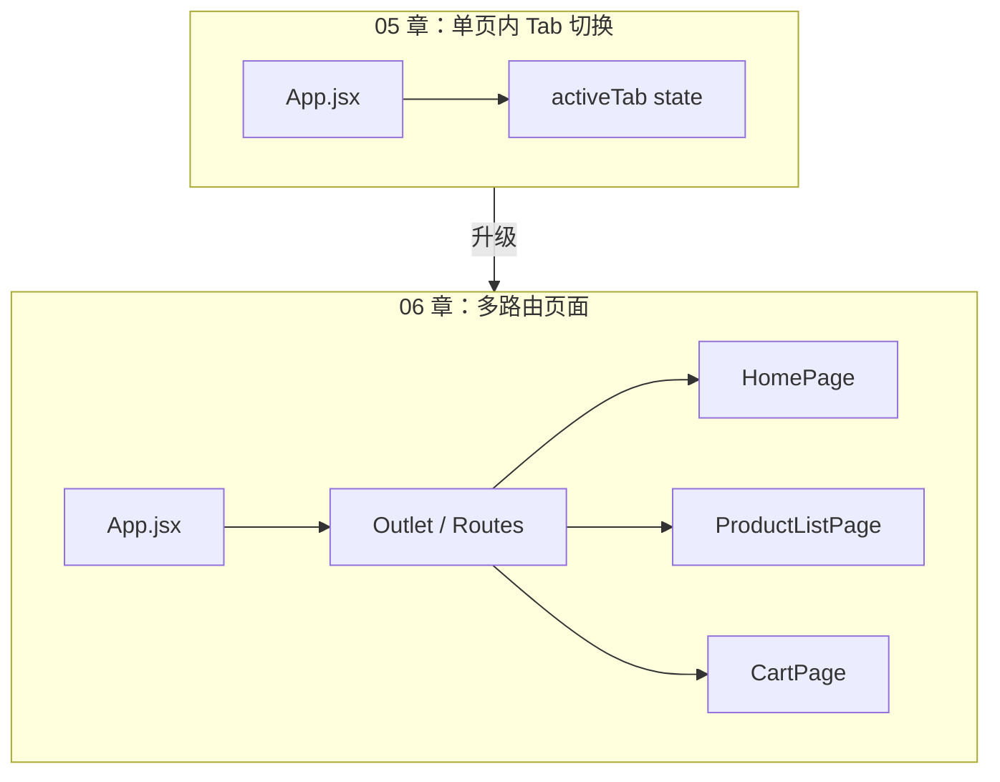
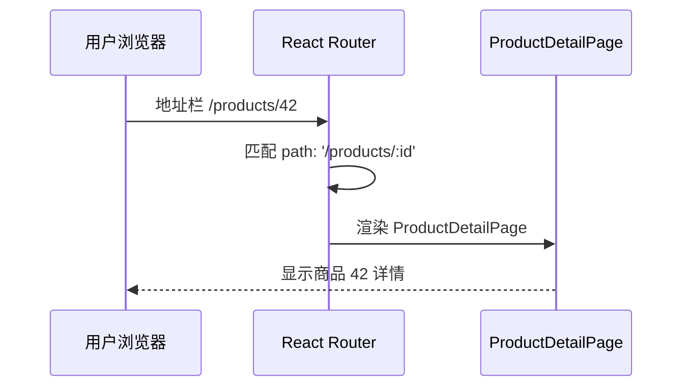
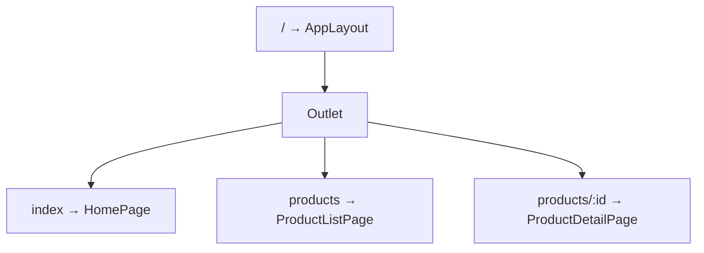
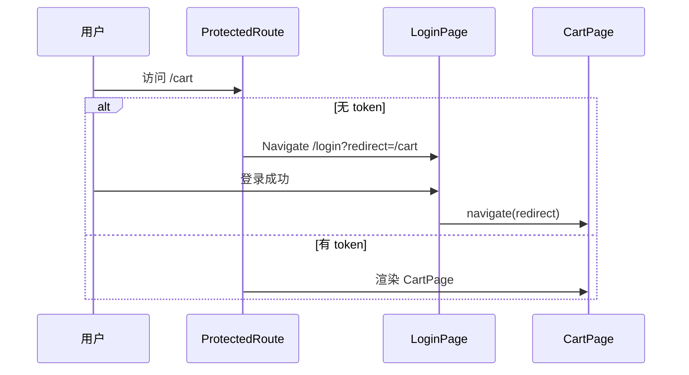
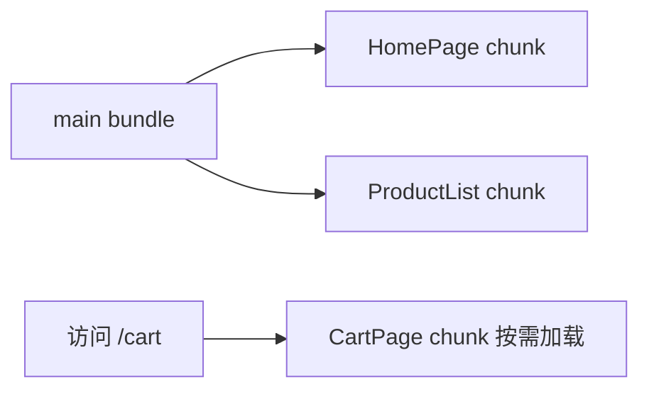
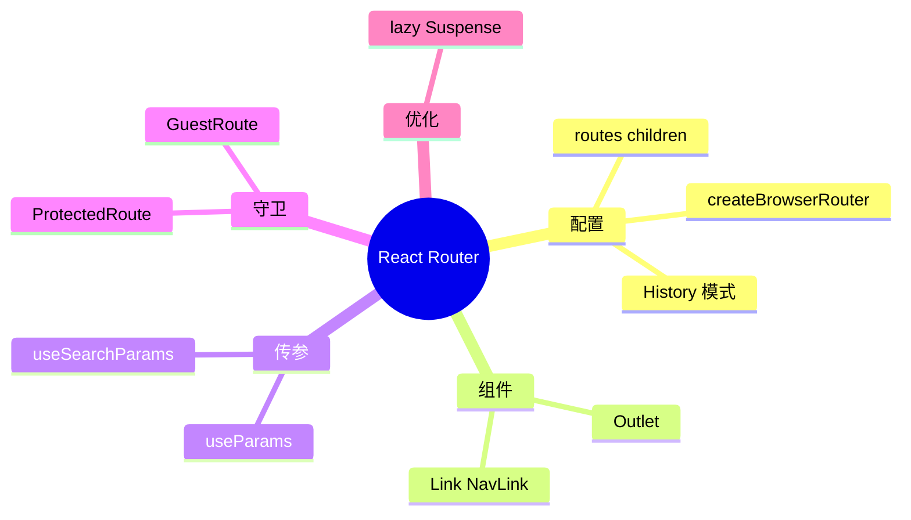

# React Router 路由管理

## 本章与上一章的关系

05 章之前，`shop-react` 的所有内容都在**一个页面**里通过 Tab 按钮切换来展示。真实商城项目有首页、商品列表、商品详情、登录、购物车、个人中心等——每个功能对应一个「页面」，但 SPA（单页应用）不能每次跳转都整页刷新。

**React Router**（`react-router-dom` v6）是 React 生态最主流的路由库，负责：

- 把 **URL 路径** 映射到 **React 组件**
- 在 `<Outlet />` / 匹配 Route 处切换视图，**无整页刷新**
- 支持传参、导航守卫、懒加载、嵌套路由

这一章给 `shop-react` 加上完整路由体系，为 07 章 Zustand 跨页面共享状态、08 章按页面调不同接口打基础。



---

## 1. SPA 是什么？为什么需要路由

### 1.1 单页应用 vs 传统多页

| 对比项 | 传统多页（MPA） | SPA + React Router |
|--------|------------------|-------------------|
| 页面切换 | 浏览器整页刷新，白屏闪烁 | 只替换路由出口区域 |
| HTML 文件 | 每个页面一个 `.html` | 通常只有一个 `index.html` |
| 状态共享 | 跨页需 Cookie / Session | Zustand 内存态即时共享 |
| 首屏加载 | 每页独立加载 | 首次加载 JS 较多，后续极快 |
| SEO | 天然友好 | 需 SSR/Next.js 等方案（进阶） |
| 典型场景 | 官网、博客 | 后台管理、商城前台 |

### 1.2 URL 与视图的映射关系

用户访问 `http://localhost:5173/products/42` 时：



**为什么不用 `<a href="/products">`？**  
普通 `<a>` 会触发整页刷新，React 应用重新初始化，Zustand 状态丢失。必须用 `<Link>` 或 `useNavigate()`，由 Router 在客户端切换组件。

---

## 2. React Router v6 核心概念速览

| 概念 | 说明 |
|------|------|
| `createBrowserRouter` | 创建 Data Router 实例（推荐） |
| `RouterProvider` | 把 router 注入应用 |
| `Route` / `routes` 配置 | path → element 映射 |
| `<Link>` | 声明式导航 |
| `<NavLink>` | 带 active 类名的 Link |
| `useParams` | 读动态路由参数 |
| `useNavigate` | 编程式导航 |
| `useLocation` | 读当前 location（pathname、search） |
| `loader` / `action` | 数据加载与 mutation（进阶，本章略提） |
| `lazy` | 路由级代码分割 |

**v6 vs v5 重要变化**：

| v5 | v6 |
|----|-----|
| `<Switch>` | `<Routes>` |
| `component={Home}` | `element={<Home />}` |
| `useHistory` | `useNavigate` |
| 嵌套路由写法不同 | 相对 path + `<Outlet />` |

---

## 3. 安装 React Router

### 3.1 创建项目时（可选）

```bash
npm create vite@latest shop-react -- --template react
```

### 3.2 现有项目手动安装

```bash
cd shop-react
npm install react-router-dom@6
```

验证：

```bash
npm list react-router-dom
# 预期：react-router-dom@6.x.x
```

---

## 4. 项目目录规划（shop-react 路由版）

完成本章后，`shop-react` 路由相关目录如下：

```text
shop-react/
├── src/
│   ├── router/
│   │   └── index.jsx          ← 路由配置中心
│   ├── pages/                 ← 页面级组件（与路由一一对应）
│   │   ├── HomePage.jsx
│   │   ├── ProductListPage.jsx
│   │   ├── ProductDetailPage.jsx
│   │   ├── LoginPage.jsx
│   │   ├── CartPage.jsx
│   │   └── NotFoundPage.jsx
│   ├── components/            ← 可复用小组件
│   │   ├── AppLayout.jsx
│   │   ├── AppHeader.jsx
│   │   ├── ProductCard.jsx
│   │   └── SearchBar.jsx
│   ├── hooks/
│   ├── App.jsx                ← 或仅 RouterProvider
│   └── main.jsx
└── vite.config.js
```

**约定**：`pages/` 放「页面」，`components/` 放「部件」。一个路由通常对应一个 page。

---

## 5. 手把手：完整路由配置 `src/router/index.jsx`

```jsx
import { createBrowserRouter, Navigate } from 'react-router-dom'
import AppLayout from '@/components/AppLayout.jsx'

// 懒加载：首屏只加载当前页，其他页按需下载（§18 详讲）
const HomePage = lazy(() => import('@/pages/HomePage.jsx'))
const ProductListPage = lazy(() => import('@/pages/ProductListPage.jsx'))
const ProductDetailPage = lazy(() => import('@/pages/ProductDetailPage.jsx'))
const LoginPage = lazy(() => import('@/pages/LoginPage.jsx'))
const CartPage = lazy(() => import('@/pages/CartPage.jsx'))
const NotFoundPage = lazy(() => import('@/pages/NotFoundPage.jsx'))

import { lazy, Suspense } from 'react'

function LazyPage({ children }) {
  return (
    <Suspense fallback={<div className="page-loading">页面加载中...</div>}>
      {children}
    </Suspense>
  )
}

/** 路由守卫：需登录（07 章改读 Zustand userStore） */
function requireAuth() {
  const token = localStorage.getItem('shop_token')
  if (!token) {
    return redirectToLogin()
  }
  return null
}

function redirectToLogin() {
  const redirect = encodeURIComponent(window.location.pathname + window.location.search)
  return `/login?redirect=${redirect}`
}

export const router = createBrowserRouter([
  {
    path: '/',
    element: <AppLayout />,
    children: [
      {
        index: true,
        element: (
          <LazyPage>
            <HomePage />
          </LazyPage>
        ),
        handle: { title: '首页' },
      },
      {
        path: 'products',
        element: (
          <LazyPage>
            <ProductListPage />
          </LazyPage>
        ),
        handle: { title: '商品列表' },
      },
      {
        path: 'products/:id',
        element: (
          <LazyPage>
            <ProductDetailPage />
          </LazyPage>
        ),
        handle: { title: '商品详情' },
      },
      {
        path: 'login',
        element: (
          <LazyPage>
            <LoginPage />
          </LazyPage>
        ),
        handle: { title: '登录', guestOnly: true },
      },
      {
        path: 'cart',
        element: (
          <LazyPage>
            <CartPage />
          </LazyPage>
        ),
        handle: { title: '购物车', requiresAuth: true },
        loader: () => {
          const token = localStorage.getItem('shop_token')
          if (!token) {
            throw new Response('', {
              status: 302,
              headers: { Location: redirectToLogin() },
            })
          }
          return null
        },
      },
      {
        path: '*',
        element: (
          <LazyPage>
            <NotFoundPage />
          </LazyPage>
        ),
        handle: { title: '页面不存在' },
      },
    ],
  },
])
```

**更常见的 v6 守卫写法**（独立组件 + `Navigate`）见 §16；上面 `loader` 抛 redirect 是 Data Router 风格，两种择一即可。

---

## 6. 简化版路由（推荐初学）

**`src/router/index.jsx`**（清晰易懂版）：

```jsx
import { createBrowserRouter } from 'react-router-dom'
import { lazy, Suspense } from 'react'
import AppLayout from '@/components/AppLayout.jsx'
import ProtectedRoute from '@/components/ProtectedRoute.jsx'
import GuestRoute from '@/components/GuestRoute.jsx'

const HomePage = lazy(() => import('@/pages/HomePage.jsx'))
const ProductListPage = lazy(() => import('@/pages/ProductListPage.jsx'))
const ProductDetailPage = lazy(() => import('@/pages/ProductDetailPage.jsx'))
const LoginPage = lazy(() => import('@/pages/LoginPage.jsx'))
const CartPage = lazy(() => import('@/pages/CartPage.jsx'))
const NotFoundPage = lazy(() => import('@/pages/NotFoundPage.jsx'))

function withSuspense(Component) {
  return (
    <Suspense fallback={<p className="page-loading">加载中...</p>}>
      <Component />
    </Suspense>
  )
}

export const router = createBrowserRouter([
  {
    path: '/',
    element: <AppLayout />,
    children: [
      { index: true, element: withSuspense(HomePage) },
      { path: 'products', element: withSuspense(ProductListPage) },
      { path: 'products/:id', element: withSuspense(ProductDetailPage) },
      {
        path: 'login',
        element: (
          <GuestRoute>
            {withSuspense(LoginPage)}
          </GuestRoute>
        ),
      },
      {
        path: 'cart',
        element: (
          <ProtectedRoute>
            {withSuspense(CartPage)}
          </ProtectedRoute>
        ),
      },
      { path: '*', element: withSuspense(NotFoundPage) },
    ],
  },
])
```

---

## 7. 注册路由：`src/main.jsx`

```jsx
import { StrictMode } from 'react'
import { createRoot } from 'react-dom/client'
import { RouterProvider } from 'react-router-dom'
import { router } from './router/index.jsx'
import './index.css'

createRoot(document.getElementById('root')).render(
  <StrictMode>
    <RouterProvider router={router} />
  </StrictMode>
)
```

```bash
npm run dev
# 预期：http://localhost:5173 可访问，控制台无报错
```

---

## 8. 布局组件：`src/components/AppLayout.jsx`

```jsx
import { Outlet, useMatches } from 'react-router-dom'
import AppHeader from './AppHeader.jsx'

export default function AppLayout() {
  const matches = useMatches()
  const lastMatch = matches[matches.length - 1]
  const title = lastMatch?.handle?.title

  if (title) {
    document.title = `${title} - shop-react`
  }

  return (
    <div id="app">
      <AppHeader />
      <main className="main-content">
        <Outlet />
      </main>
    </div>
  )
}
```

**`<Outlet />`**：嵌套路由的子路由渲染出口，等价 Vue 的 `<router-view>`。

```css
/* index.css 片段 */
* { box-sizing: border-box; margin: 0; padding: 0; }
body { font-family: system-ui, -apple-system, sans-serif; background: #fafafa; }
.main-content { max-width: 1200px; margin: 0 auto; padding: 24px 16px; }
.page-loading { text-align: center; padding: 40px; color: #666; }
```

---

## 9. 导航栏：`src/components/AppHeader.jsx`

```jsx
import { NavLink, useLocation } from 'react-router-dom'
import CartBadge from './CartBadge.jsx'
import { useCart } from '@/hooks/useCart.js'

export default function AppHeader() {
  const location = useLocation()
  const { totalCount } = useCart()

  return (
    <header className="header">
      <NavLink to="/" className="logo">
        ⚛️ shop-react
      </NavLink>
      <nav>
        <NavLink to="/" end>
          首页
        </NavLink>
        <NavLink to="/products">商品</NavLink>
        <NavLink to="/cart">
          购物车
          {totalCount > 0 && <CartBadge count={totalCount} />}
        </NavLink>
        <NavLink to="/login">登录</NavLink>
      </nav>
      <span className="debug">当前：{location.pathname}</span>
    </header>
  )
}
```

```css
.header {
  display: flex;
  align-items: center;
  gap: 24px;
  padding: 12px 24px;
  background: #fff;
  border-bottom: 1px solid #eee;
  position: sticky;
  top: 0;
  z-index: 100;
}
.logo { font-weight: bold; font-size: 1.2rem; text-decoration: none; color: #61dafb; }
nav { display: flex; gap: 16px; flex: 1; }
nav a {
  text-decoration: none;
  color: #666;
  padding: 4px 8px;
  border-radius: 4px;
}
nav a.active {
  color: #20232a;
  font-weight: 600;
  background: #61dafb;
}
.debug { font-size: 12px; color: #999; }
```

**`NavLink` vs `Link`**：

| 组件 | 说明 |
|------|------|
| `Link` | 普通导航 |
| `NavLink` | 当前匹配时自动加 `active` class（可自定义 `className={({ isActive }) => ...}`） |

**`end` prop**：`/`` 仅完全匹配根路径时高亮，避免所有子路径都亮「首页」。

---

## 10. 六个页面完整代码

### 10.1 `src/pages/HomePage.jsx`

```jsx
import { Link } from 'react-router-dom'

export default function HomePage() {
  return (
    <section className="home">
      <h1>欢迎来到 shop-react 商城</h1>
      <p>这是首页。点击导航栏「商品」浏览商品列表。</p>
      <Link to="/products" className="btn">
        去逛逛 →
      </Link>
    </section>
  )
}
```

```css
.home { text-align: center; padding: 60px 20px; }
.home h1 { margin-bottom: 16px; color: #333; }
.home p { color: #666; margin-bottom: 24px; }
.btn {
  display: inline-block;
  padding: 12px 24px;
  background: #61dafb;
  color: #20232a;
  font-weight: 600;
  text-decoration: none;
  border-radius: 6px;
}
```

### 10.2 `src/pages/ProductListPage.jsx`

```jsx
import ProductCard from '@/components/ProductCard.jsx'
import SearchBar from '@/components/SearchBar.jsx'
import { useProducts } from '@/hooks/useProducts.js'
import { useCart } from '@/hooks/useCart.js'

export default function ProductListPage() {
  const {
    keyword,
    setKeyword,
    category,
    setCategory,
    filteredProducts,
    stats,
  } = useProducts()

  const { add } = useCart()

  return (
    <section>
      <h2>商品列表</h2>
      <SearchBar
        keyword={keyword}
        category={category}
        onKeywordChange={setKeyword}
        onCategoryChange={setCategory}
      />
      <p className="stats">共 {stats.filtered} 件商品</p>
      <div className="grid">
        {filteredProducts.map((p) => (
          <ProductCard key={p.id} product={p} onAddCart={add} />
        ))}
      </div>
      {filteredProducts.length === 0 && (
        <p className="empty">没有匹配的商品</p>
      )}
    </section>
  )
}
```

```css
.grid {
  display: grid;
  grid-template-columns: repeat(auto-fill, minmax(240px, 1fr));
  gap: 16px;
}
.stats { color: #666; margin-bottom: 16px; }
.empty { text-align: center; color: #9ca3af; padding: 40px; }
```

### 10.3 更新 `ProductCard.jsx`（链到详情）

在卡片内增加详情链接：

```jsx
import { Link } from 'react-router-dom'

// 在 return 内增加：
<Link to={`/products/${product.id}`} className="link">
  查看详情
</Link>
```

```css
.link { color: #61dafb; text-decoration: none; font-size: 14px; }
```

### 10.4 `src/pages/ProductDetailPage.jsx`

```jsx
import { useMemo } from 'react'
import { useParams, useNavigate, Link } from 'react-router-dom'

const PRODUCT_MAP = {
  1: { id: 1, name: 'React 18 实战教程', price: 69.9, desc: '从入门到实战' },
  2: { id: 2, name: '机械键盘', price: 399, desc: '青轴，RGB 背光' },
  3: { id: 3, name: '显示器支架', price: 129, desc: '气压升降' },
  4: { id: 4, name: 'TypeScript 入门', price: 49.9, desc: '类型系统详解' },
}

export default function ProductDetailPage() {
  const { id } = useParams()
  const navigate = useNavigate()

  const product = useMemo(() => PRODUCT_MAP[id] ?? null, [id])

  if (!product) {
    return (
      <section>
        <p>商品不存在</p>
        <Link to="/products">返回列表</Link>
      </section>
    )
  }

  return (
    <section>
      <button type="button" className="back" onClick={() => navigate(-1)}>
        ← 返回
      </button>
      <h2>{product.name}</h2>
      <p className="price">¥ {product.price}</p>
      <p>{product.desc}</p>
      <p className="meta">路由 params.id = {id}</p>
    </section>
  )
}
```

```css
.back { margin-bottom: 16px; cursor: pointer; padding: 8px 12px; }
.price { color: #e74c3c; font-size: 1.5rem; margin: 12px 0; }
.meta { margin-top: 24px; font-size: 12px; color: #999; }
```

**`useParams`**：读 `/products/:id` 中的 `id`。

**详情页 id 变化数据不更新？** 同一组件实例复用时，靠 `useParams` + `useMemo([id])` 或 `useEffect([id])` 重新拉数据。

### 10.5 `src/pages/LoginPage.jsx`

```jsx
import { useNavigate, useSearchParams } from 'react-router-dom'
import LoginForm from '@/components/LoginForm.jsx'

export default function LoginPage() {
  const navigate = useNavigate()
  const [searchParams] = useSearchParams()
  const redirect = searchParams.get('redirect') || '/'

  function handleLoginSuccess({ username }) {
    // 07 章改 userStore.setLogin
    localStorage.setItem('shop_token', 'demo-token-' + Date.now())
    localStorage.setItem('shop_username', username)
    navigate(redirect, { replace: true })
  }

  return (
    <section className="login-page">
      <LoginForm onLoginSuccess={handleLoginSuccess} />
      {searchParams.get('redirect') && (
        <p className="hint">请先登录以访问：{searchParams.get('redirect')}</p>
      )}
    </section>
  )
}
```

```css
.login-page { max-width: 400px; margin: 40px auto; }
.hint { margin-top: 12px; font-size: 13px; color: #666; text-align: center; }
```

### 10.6 `src/pages/CartPage.jsx`

```jsx
import { useCart } from '@/hooks/useCart.js'
import { Link } from 'react-router-dom'

export default function CartPage() {
  const { items, totalCount, totalPrice, updateQty, remove, clear } = useCart()

  if (items.length === 0) {
    return (
      <section>
        <h2>购物车</h2>
        <p>购物车是空的</p>
        <Link to="/products">去逛逛</Link>
      </section>
    )
  }

  return (
    <section>
      <h2>购物车（{totalCount} 件）</h2>
      <ul className="cart-list">
        {items.map((item) => (
          <li key={item.id} className="cart-item">
            <span>{item.name}</span>
            <span>¥{item.price}</span>
            <input
              type="number"
              min="1"
              value={item.qty}
              onChange={(e) => updateQty(item.id, Number(e.target.value))}
            />
            <button type="button" onClick={() => remove(item.id)}>
              删除
            </button>
          </li>
        ))}
      </ul>
      <p className="total">合计：¥{totalPrice.toFixed(2)}</p>
      <button type="button" onClick={clear}>清空购物车</button>
    </section>
  )
}
```

```css
.cart-list { list-style: none; padding: 0; }
.cart-item {
  display: flex;
  align-items: center;
  gap: 12px;
  padding: 12px;
  background: #fff;
  border-radius: 8px;
  margin-bottom: 8px;
}
.total { font-size: 1.2rem; font-weight: 700; margin: 16px 0; }
```

### 10.7 `src/pages/NotFoundPage.jsx`

```jsx
import { Link } from 'react-router-dom'

export default function NotFoundPage() {
  return (
    <section className="not-found">
      <h1>404</h1>
      <p>页面不存在</p>
      <Link to="/">回首页</Link>
    </section>
  )
}
```

---

## 11. Link 与编程式导航

### 11.1 声明式：Link / NavLink

```jsx
import { Link, NavLink } from 'react-router-dom'

<Link to="/products">商品</Link>
<Link to={`/products/${id}`}>详情</Link>
<Link to="/login?redirect=/cart">登录</Link>

<NavLink
  to="/products"
  className={({ isActive }) => (isActive ? 'nav-active' : '')}
>
  商品
</NavLink>
```

### 11.2 编程式：useNavigate

```jsx
import { useNavigate } from 'react-router-dom'

function LoginPage() {
  const navigate = useNavigate()

  function afterLogin() {
    navigate('/cart')           // push
    navigate('/', { replace: true })  // replace，不可后退
    navigate(-1)                // 后退
  }
}
```

### 11.3 读 query：useSearchParams

```jsx
const [searchParams, setSearchParams] = useSearchParams()
const redirect = searchParams.get('redirect')
setSearchParams({ page: '2' })
```

---

## 12. 动态路由与 useParams

```jsx
// 路由配置
{ path: 'products/:id', element: <ProductDetailPage /> }

// 组件内
const { id } = useParams()
// URL /products/42 → id === '42'（字符串！比较时注意 Number(id)）
```

可选：路由配置传 props（v6 需自己从 useParams 取，无 Vue `props: true` 等价项）。

---

## 13. 嵌套路由

父路由渲染布局，子路由渲染 `<Outlet />`：



**用户中心嵌套示例**（扩展）：

```jsx
{
  path: 'user',
  element: <UserLayout />,
  children: [
    { index: true, element: <Navigate to="profile" replace /> },
    { path: 'profile', element: <ProfilePage /> },
    { path: 'orders', element: <OrdersPage /> },
  ],
}
```

`UserLayout.jsx`：

```jsx
import { Outlet, NavLink } from 'react-router-dom'

export default function UserLayout() {
  return (
    <div className="user-layout">
      <aside>
        <NavLink to="profile">资料</NavLink>
        <NavLink to="orders">订单</NavLink>
      </aside>
      <Outlet />
    </div>
  )
}
```

子 path **相对**父 path，无需写 `/user/profile` 全路径（也可写绝对 path `/user/profile`）。

---

## 14. 路由表一览（shop-react）

| path | 页面 | 说明 |
|------|------|------|
| `/` | HomePage | 首页 |
| `/products` | ProductListPage | 列表 + 搜索 |
| `/products/:id` | ProductDetailPage | 详情 |
| `/login` | LoginPage | 登录，guestOnly |
| `/cart` | CartPage | 购物车，requiresAuth |
| `*` | NotFoundPage | 404 兜底 |

---

## 15. 传参方式：params vs query

| 方式 | URL 示例 | 读取 | 适用 |
|------|----------|------|------|
| params | `/products/42` | `useParams()` | RESTful 资源 id |
| query | `/products?cat=book` | `useSearchParams()` | 筛选、可选参数 |
| state | 无显示 | `useLocation().state` | 临时传对象（刷新丢失） |

```jsx
navigate('/products', { state: { from: 'home' } })
const { state } = useLocation()
```

---

## 16. 路由守卫：ProtectedRoute

**`src/components/ProtectedRoute.jsx`**：

```jsx
import { Navigate, useLocation } from 'react-router-dom'

export default function ProtectedRoute({ children }) {
  const location = useLocation()
  const token = localStorage.getItem('shop_token')

  if (!token) {
    return (
      <Navigate
        to={`/login?redirect=${encodeURIComponent(location.pathname)}`}
        replace
      />
    )
  }

  return children
}
```

**`src/components/GuestRoute.jsx`**（已登录勿进登录页）：

```jsx
import { Navigate } from 'react-router-dom'

export default function GuestRoute({ children }) {
  const token = localStorage.getItem('shop_token')
  if (token) {
    return <Navigate to="/" replace />
  }
  return children
}
```



**07 章升级**：守卫内改读 `useUserStore.getState().isLoggedIn`，与 Pinia/Zustand 统一。

---

## 17. 全局守卫（了解）

Data Router 可在 `router` 上配 `loader`，或在根 layout 用 `useEffect` 做鉴权日志。

v6 无 Vue `beforeEach` 同名 API；常用模式：

- **布局级** `ProtectedRoute` 组件（本章推荐）
- **`createBrowserRouter` + loader** 里 redirect
- 第三方如 `react-router-auth`

---

## 18. 懒加载与代码分割

```jsx
const CartPage = lazy(() => import('@/pages/CartPage.jsx'))

<Suspense fallback={<p>加载中...</p>}>
  <CartPage />
</Suspense>
```

**效果**：首屏 bundle 不含 CartPage，访问 `/cart` 时才下载对应 chunk。

Vite 构建后可在 `dist/assets/` 看到 `CartPage-xxxxx.js` 分块文件。



---

## 19. Hash 模式 vs History 模式

```jsx
import { createHashRouter } from 'react-router-dom'

// URL: http://localhost:5173/#/products
createHashRouter(routes)
```

| 模式 | API | URL | 部署 |
|------|-----|-----|------|
| History | `createBrowserRouter` | `/products` 无 # | 需服务器 fallback |
| Hash | `createHashRouter` | `/#/products` | 静态托管开箱即用 |

开发阶段 Vite 已支持 History；生产 Nginx 需 `try_files`（10 章）。

---

## 20. 与 Vue Router 对照

| Vue Router 4 | React Router 6 |
|--------------|----------------|
| `createRouter` | `createBrowserRouter` |
| `<router-view>` | `<Outlet />` |
| `<router-link>` | `<Link>` / `<NavLink>` |
| `useRoute()` | `useLocation()` + `useParams()` |
| `useRouter()` | `useNavigate()` |
| `beforeEach` | `ProtectedRoute` / loader |
| `meta.requiresAuth` | route `handle` 或自定义 |
| `props: true` | `useParams()` 手动取 |

---

## 21. 分级练习

### 21.1 基础：新增「关于」页

**要求**：增加 `/about` 路由与 AboutPage。

<details>
<summary>参考答案</summary>

```jsx
{ path: 'about', element: withSuspense(AboutPage) }
```

AppHeader 加 `<NavLink to="/about">关于</NavLink>`。

</details>

### 21.2 进阶：商品列表 query 分类

**要求**：`/products?category=book` 进入时 SearchBar 默认选中 book。

<details>
<summary>思路</summary>

`ProductListPage` 内 `useSearchParams` 读 `category`，同步到 `useProducts` 初始值或 `useEffect` 设置。

</details>

### 21.3 挑战：未登录访问 /cart

**要求**：

1. 清除 token：`localStorage.removeItem('shop_token')`
2. 访问 `/cart` → 应跳 `/login?redirect=/cart`
3. 登录 → 应回到 `/cart`

### 21.4 挑战+：404 页面

**要求**：访问 `/abc` 显示 404，不白屏。

**参考答案**：路由表末尾 `{ path: '*', element: <NotFoundPage /> }`。

---

## 22. 常见报错与排查

| 报错信息 | 可能原因 | 排查步骤 | 解决方案 |
|---------|---------|---------|---------|
| 页面空白，无内容 | Layout 没有 `<Outlet />` | 检查 AppLayout | 添加 `<Outlet />` |
| `No routes matched location` | 路径未配置 | 对比 URL 与 routes | 添加路由或 `*` 404 |
| 点击链接整页刷新 | 用了 `<a href>` | 检查导航 | 改用 `<Link to>` |
| `NavLink` 不高亮 | 路径不匹配 | DevTools 看 class | 确认 path；根路由加 `end` |
| 刷新页面 404（生产） | 服务器未 SPA fallback | 直访子路径 | Nginx `try_files $uri /index.html` |
| params 为 undefined | 路由 path 无 `:id` | 看 route 配置 | 配 `products/:id` |
| 详情切换 id 不更新 | 组件复用 | `/products/1` → `2` | `useMemo`/`useEffect` 依赖 id |
| 嵌套子页空白 | 父组件缺 Outlet | 检查 Layout | 父加 `<Outlet />` |
| lazy 报错 Suspense | 未包 Suspense | 看报错栈 | 外层包 `<Suspense>` |
| 守卫死循环 | login 页也包 Protected | 查组件树 | login 用 GuestRoute 或不保护 |
| `useNavigate` 报错 | 不在 Router 上下文 | 组件是否在 RouterProvider 下 | 检查 main.jsx |

---

## 23. 常见问题 FAQ

### Q1：React Router 5 和 6 有什么区别？

v6 统一用 `element`、`<Routes>` 替代 `<Switch>`、`useNavigate` 替代 `useHistory`，嵌套路由更简洁，推荐新项目只用 v6。

### Q2：应该用 createBrowserRouter 还是 BrowserRouter？

`createBrowserRouter` + `RouterProvider` 是 v6.4+ 推荐（支持 loader/action）；简单项目也可用 `<BrowserRouter><Routes>` JSX 写法。

### Q3：多个 Outlet 怎么用？

需 **layout 路由** 或命名 outlet（React Router 无 Vue 命名视图一等支持，通常多 layout 嵌套解决）。

### Q4：守卫里能发 fetch 吗？

可以但不推荐阻塞太久。常见：守卫查本地 token，权限详情在页面 `useEffect` 拉。

### Q5：如何实现离开页确认？

```jsx
import { useBlocker } from 'react-router-dom'
// 或 beforeunload + 自定义 modal（data router 用 useBlocker）
```

### Q6：路由和 Zustand 谁先挂载？

`RouterProvider` 包在外层或同层均可；守卫读 store 时用 `useUserStore.getState()` 可在组件外调用（07 章）。

---

## 24. 本章小结



你已为 `shop-react` 搭好多页面骨架。下一章用 **Zustand** 把登录态、购物车从 localStorage 和手写 Hook 抽到全局 store，路由守卫也会更优雅。

---

## 25. 学完标准

- [ ] 理解 SPA 与客户端路由
- [ ] 会配置 `createBrowserRouter` 与嵌套 children
- [ ] 熟练使用 `Link`、`NavLink`、`useNavigate`、`useParams`
- [ ] 完成 6 个 pages 与 AppLayout
- [ ] 实现 ProtectedRoute / GuestRoute
- [ ] 会路由级 lazy + Suspense
- [ ] 知道 History vs Hash 与生产 fallback

---

## 26. 知识点清单

| 序号 | 知识点 | 自评 |
|------|--------|------|
| 1 | SPA 与路由必要性 | ☐ |
| 2 | createBrowserRouter | ☐ |
| 3 | Outlet 嵌套 | ☐ |
| 4 | Link / NavLink | ☐ |
| 5 | useNavigate | ☐ |
| 6 | useParams / useSearchParams | ☐ |
| 7 | ProtectedRoute | ☐ |
| 8 | lazy + Suspense | ☐ |
| 9 | 404 兜底 | ☐ |
| 10 | shop-react 六页面 | ☐ |

---

## 下一章预告

路由能切换页面了，但「当前登录用户」「购物车里有什么」多个页面都要用——props 一层层传太痛苦，localStorage 手工同步容易出 bug。下一章（07 Zustand）用**全局状态管理**集中存放，任意组件都能读写，并与路由守卫深度联动。

---

*下一章：07 Zustand 状态管理*
