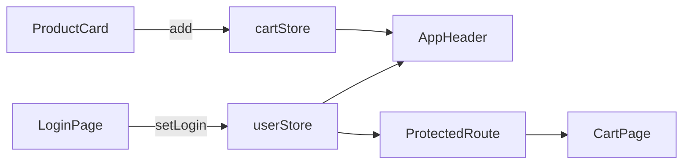
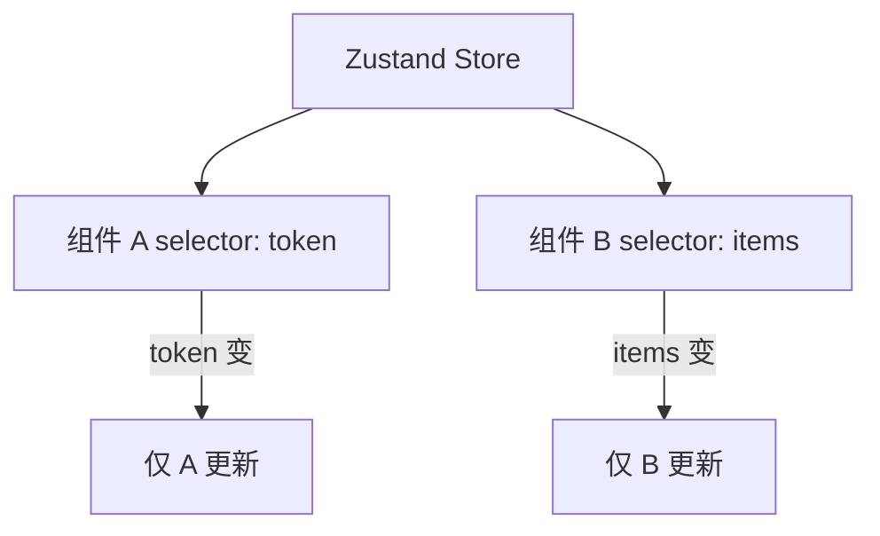
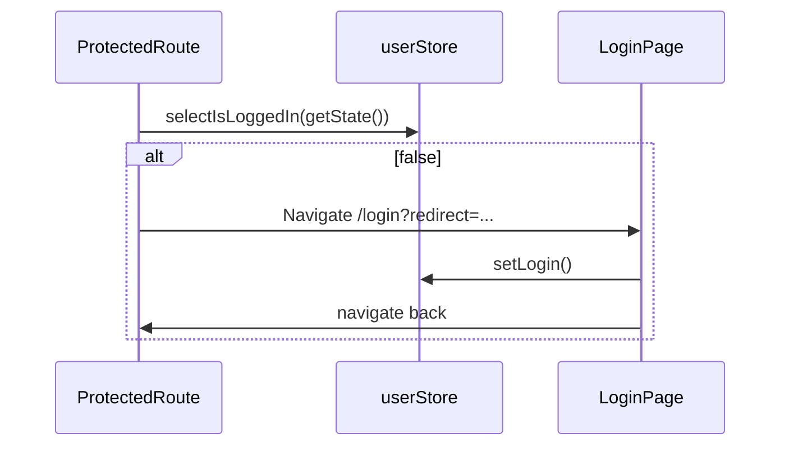
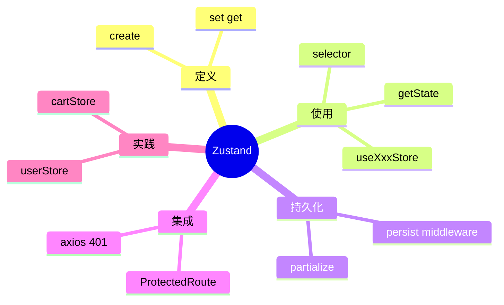

# Zustand 状态管理

## 本章与上一章的关系

06 章给 `shop-react` 加上了多页面路由。现在你会遇到新问题：

- 导航栏要显示「当前登录用户」和「购物车数量」——但它们在 `AppHeader`，数据却在 `LoginPage` 和 `ProductCard` 里产生
- 路由守卫要判断「是否登录」——06 章临时用 `localStorage.getItem('shop_token')`，和组件里的登录逻辑重复
- 刷新页面后，05 章手写 `useCart` 模块单例与 localStorage 不同步，维护成本高

**Zustand** 是 React 生态轻量状态库（可类比 Vue 的 **Pinia**），把「跨组件、跨路由」的共享数据集中到一个 **Store** 里，任意组件 `useXxxStore()` 即可读写，且完全响应式。

这一章给 `shop-react` 加 `userStore` 和 `cartStore`，并和 06 章路由守卫联动，为 08 章「登录后带 token 调 Spring Boot 接口」做准备。



---

## 1. 什么时候需要 Zustand？什么时候不需要？

| 场景 | 推荐方案 | 原因 |
|------|----------|------|
| 父 → 子传数据 | props | 简单直接 |
| 子 → 父通知 | callback props | 单向数据流 |
| 2～3 个兄弟组件共享 | 提升到共同父组件，或 **自定义 Hook** | 范围有限 |
| **跨路由、跨多层组件** | **Zustand** | 避免 prop drilling |
| 用户信息、token、购物车 | **Zustand** | 全局业务态 |
| 主题、语言、侧边栏折叠 | **Zustand** | 全局 UI 态 |
| 仅表单内部临时状态 | 组件内 `useState` | 无需全局 |
| 服务端列表数据 | 组件/Hook + API | 一般不进 store（除非缓存） |

**经验法则**：如果两个不相关的页面组件需要同一份数据，就该考虑 Zustand。

---

## 2. Zustand vs Redux vs Context

| 对比 | React Context | Redux Toolkit | Zustand |
|------|---------------|---------------|---------|
| 样板代码 | 中（Provider + reducer） | 多（slice、dispatch） | **极少** |
| 性能 | 任一 context 变则全量消费组件更新 | 好（selector） | 好（selector） |
| DevTools | 无内置 | ✅ | ✅ 可选 middleware |
| 学习曲线 | 低 | 高 | **低** |
| 持久化 | 手写 | redux-persist | **persist 中间件** |
| 组件外读写 | 难 | 可以 | **`getState()` / `setState()`** |
| 体积 | 内置 | 较大 | **~1KB** |

**和 Pinia 对照**：

| Pinia | Zustand |
|-------|---------|
| `defineStore('user', () => {...})` | `create((set, get) => ({...}))` |
| `useUserStore()` | `useUserStore()` |
| `storeToRefs` | 直接 selector：`useUserStore(s => s.token)` |
| `$patch` | `set({ ... })` 或 `set(state => ({...}))` |
| pinia-plugin-persistedstate | `persist` middleware |

---

## 3. 安装与项目配置

### 3.1 安装

```bash
cd shop-react
npm install zustand
```

可选持久化已内置在 `zustand/middleware`，无需额外包。

### 3.2 无需 Provider（默认）

与 Redux / Context 不同，Zustand **不需要**在根组件包 `<Provider>`：

```jsx
// main.jsx — 保持 RouterProvider 即可，不必包 StoreProvider
createRoot(document.getElementById('root')).render(
  <StrictMode>
    <RouterProvider router={router} />
  </StrictMode>
)
```

### 3.3 目录结构

```text
src/
├── stores/
│   ├── userStore.js       ← 用户 / 登录态
│   ├── cartStore.js       ← 购物车
│   └── index.js           ← 可选：统一导出
├── components/
├── pages/
└── main.jsx
```

---

## 4. 创建 Store 基础语法

```js
import { create } from 'zustand'

export const useCounterStore = create((set, get) => ({
  count: 0,
  double: () => get().count * 2,
  increment: () => set((state) => ({ count: state.count + 1 })),
  reset: () => set({ count: 0 }),
}))
```

组件中使用：

```jsx
function Counter() {
  const count = useCounterStore((state) => state.count)
  const increment = useCounterStore((state) => state.increment)

  return <button onClick={increment}>{count}</button>
}
```

**selector 的好处**：只订阅 `count`，其他 state 变不会导致本组件 re-render。



---

## 5. 手把手：完整 userStore

**`src/stores/userStore.js`**：

```js
import { create } from 'zustand'
import { persist, createJSONStorage } from 'zustand/middleware'

const STORAGE_KEY = 'shop-user'

export const useUserStore = create(
  persist(
    (set, get) => ({
      token: '',
      username: '',

      get isLoggedIn() {
        return !!get().token
      },

      get displayName() {
        return get().username || '游客'
      },

      setLogin: ({ token, username }) => {
        set({ token, username })
      },

      logout: () => {
        set({ token: '', username: '' })
      },

      /** 08 章：App 启动时可用 token 换用户信息 */
      fetchProfile: async () => {
        const { token } = get()
        if (!token) return
        // 08 章对接 GET /api/users/me
        // const data = await api.get('/users/me')
        // set({ username: data.name })
      },
    }),
    {
      name: STORAGE_KEY,
      storage: createJSONStorage(() => localStorage),
      partialize: (state) => ({
        token: state.token,
        username: state.username,
      }),
    }
  )
)
```

**注意**：getter 在 persist 里不能可靠序列化；组件侧用 selector 计算更好（见 §8 修正版）。

**推荐写法（无 getter，用 selector 或独立函数）**：

```js
import { create } from 'zustand'
import { persist, createJSONStorage } from 'zustand/middleware'

export const useUserStore = create(
  persist(
    (set) => ({
      token: '',
      username: '',

      setLogin: ({ token, username }) => set({ token, username }),

      logout: () => set({ token: '', username: '' }),

      fetchProfile: async () => {
        // 08 章实现
      },
    }),
    {
      name: 'shop-user',
      storage: createJSONStorage(() => localStorage),
      partialize: (state) => ({
        token: state.token,
        username: state.username,
      }),
    }
  )
)

// 组件外也可读 — 路由守卫常用
export const selectIsLoggedIn = (state) => !!state.token
export const selectDisplayName = (state) => state.username || '游客'
```

**为什么 token 存 persist？**

- 刷新页面后 Zustand 内存清空，persist 从 localStorage 恢复
- 08 章 axios 拦截器从 store 读 token 发 Header
- 生产环境更推荐 httpOnly Cookie（安全进阶）

---

## 6. 手把手：完整 cartStore

**`src/stores/cartStore.js`**：

```js
import { create } from 'zustand'
import { persist, createJSONStorage } from 'zustand/middleware'

function calcTotalCount(items) {
  return items.reduce((sum, item) => sum + item.qty, 0)
}

function calcTotalPrice(items) {
  return items.reduce((sum, item) => sum + item.price * item.qty, 0)
}

export const useCartStore = create(
  persist(
    (set, get) => ({
      items: [],

      getTotalCount: () => calcTotalCount(get().items),

      getTotalPrice: () => calcTotalPrice(get().items),

      add: (product) => {
        if (product.stock <= 0) return
        set((state) => {
          const exist = state.items.find((i) => i.id === product.id)
          if (exist) {
            return {
              items: state.items.map((i) =>
                i.id === product.id ? { ...i, qty: i.qty + 1 } : i
              ),
            }
          }
          return {
            items: [
              ...state.items,
              {
                id: product.id,
                name: product.name,
                price: product.price,
                qty: 1,
              },
            ],
          }
        })
      },

      remove: (productId) => {
        set((state) => ({
          items: state.items.filter((i) => i.id !== productId),
        }))
      },

      updateQty: (productId, qty) => {
        if (qty <= 0) {
          get().remove(productId)
          return
        }
        set((state) => ({
          items: state.items.map((i) =>
            i.id === productId ? { ...i, qty } : i
          ),
        }))
      },

      clear: () => set({ items: [] }),
    }),
    {
      name: 'shop-cart',
      storage: createJSONStorage(() => localStorage),
      partialize: (state) => ({ items: state.items }),
    }
  )
)

export const selectTotalCount = (state) =>
  state.items.reduce((sum, i) => sum + i.qty, 0)

export const selectTotalPrice = (state) =>
  state.items.reduce((sum, i) => sum + i.price * i.qty, 0)

export const selectIsEmpty = (state) => state.items.length === 0
```

---

## 7. 统一导出（可选）`src/stores/index.js`

```js
export { useUserStore, selectIsLoggedIn, selectDisplayName } from './userStore'
export {
  useCartStore,
  selectTotalCount,
  selectTotalPrice,
  selectIsEmpty,
} from './cartStore'
```

---

## 8. 在组件中使用 Store

### 8.1 基本用法

```jsx
import { useUserStore, selectIsLoggedIn } from '@/stores/userStore'
import { useCartStore, selectTotalCount } from '@/stores/cartStore'

function AppHeader() {
  const isLoggedIn = useUserStore(selectIsLoggedIn)
  const username = useUserStore((s) => s.username)
  const logout = useUserStore((s) => s.logout)

  const totalCount = useCartStore(selectTotalCount)
  const add = useCartStore((s) => s.add)

  // ...
}
```

### 8.2 避免多余 re-render

```jsx
// ❌ 订阅整个 store，任何字段变都 re-render
const store = useCartStore()

// ✅ 只订阅需要的切片
const items = useCartStore((s) => s.items)
const totalCount = useCartStore(selectTotalCount)
```

### 8.3 修改 state 的方式

```js
// 1. 调 action（推荐）
useCartStore.getState().add(product)

// 2. set 批量
useCartStore.setState({ items: [] })

// 3. 组件内
const add = useCartStore((s) => s.add)
add(product)
```

### 8.4 组件外读写（路由守卫关键）

```js
import { useUserStore, selectIsLoggedIn } from '@/stores/userStore'

// 不在 React 组件内也能读
const isLoggedIn = selectIsLoggedIn(useUserStore.getState())

useUserStore.getState().logout()
```

**这是 Zustand 相对 Context 的核心优势之一**——`ProtectedRoute` 和 axios 拦截器都能直接访问。

---

## 9. 更新 AppHeader.jsx（完整）

**`src/components/AppHeader.jsx`**：

```jsx
import { NavLink, useNavigate } from 'react-router-dom'
import { useUserStore, selectIsLoggedIn, selectDisplayName } from '@/stores/userStore'
import { useCartStore, selectTotalCount } from '@/stores/cartStore'

export default function AppHeader() {
  const navigate = useNavigate()
  const isLoggedIn = useUserStore(selectIsLoggedIn)
  const displayName = useUserStore(selectDisplayName)
  const logout = useUserStore((s) => s.logout)
  const clearCart = useCartStore((s) => s.clear)
  const totalCount = useCartStore(selectTotalCount)

  function handleLogout() {
    logout()
    clearCart()
    navigate('/login')
  }

  return (
    <header className="header">
      <NavLink to="/" className="logo">
        ⚛️ shop-react
      </NavLink>
      <nav>
        <NavLink to="/" end>首页</NavLink>
        <NavLink to="/products">商品</NavLink>
        <NavLink to="/cart">
          购物车
          {totalCount > 0 && (
            <span className="badge">{totalCount}</span>
          )}
        </NavLink>
      </nav>
      <div className="user-area">
        {isLoggedIn ? (
          <>
            <span>{displayName}</span>
            <button type="button" className="link-btn" onClick={handleLogout}>
              退出
            </button>
          </>
        ) : (
          <NavLink to="/login">登录</NavLink>
        )}
      </div>
    </header>
  )
}
```

```css
.badge {
  background: #e74c3c;
  color: #fff;
  font-size: 12px;
  padding: 2px 6px;
  border-radius: 10px;
  margin-left: 4px;
}
.user-area { display: flex; gap: 12px; align-items: center; }
.link-btn { background: none; border: none; color: #666; cursor: pointer; }
```

---

## 10. 更新 LoginPage.jsx（完整）

**`src/pages/LoginPage.jsx`**：

```jsx
import { useState } from 'react'
import { useNavigate, useSearchParams } from 'react-router-dom'
import { useUserStore } from '@/stores/userStore'

export default function LoginPage() {
  const navigate = useNavigate()
  const [searchParams] = useSearchParams()
  const redirect = searchParams.get('redirect') || '/'

  const setLogin = useUserStore((s) => s.setLogin)

  const [username, setUsername] = useState('')
  const [password, setPassword] = useState('')
  const [loading, setLoading] = useState(false)
  const [errMsg, setErrMsg] = useState('')

  async function handleSubmit(e) {
    e.preventDefault()
    if (!username || !password) {
      setErrMsg('请填写用户名和密码')
      return
    }
    setLoading(true)
    setErrMsg('')
    try {
      await new Promise((r) => setTimeout(r, 500))
      setLogin({
        token: 'demo-jwt-' + Date.now(),
        username,
      })
      navigate(redirect, { replace: true })
    } catch (e) {
      setErrMsg(e.message || '登录失败')
    } finally {
      setLoading(false)
    }
  }

  return (
    <section className="login">
      <h2>用户登录</h2>
      <form onSubmit={handleSubmit}>
        <label>
          用户名
          <input
            value={username}
            onChange={(e) => setUsername(e.target.value)}
            placeholder="admin"
          />
        </label>
        <label>
          密码
          <input
            type="password"
            value={password}
            onChange={(e) => setPassword(e.target.value)}
            placeholder="123456"
          />
        </label>
        {errMsg && <p className="err">{errMsg}</p>}
        <button type="submit" disabled={loading}>
          {loading ? '登录中...' : '登录'}
        </button>
      </form>
      {searchParams.get('redirect') && (
        <p className="hint">登录后将跳转到：{searchParams.get('redirect')}</p>
      )}
    </section>
  )
}
```

---

## 11. 更新 ProductCard 与 CartPage

### 11.1 ProductCard.jsx

```jsx
import { Link } from 'react-router-dom'
import { useCartStore } from '@/stores/cartStore'

export default function ProductCard({ product }) {
  const add = useCartStore((s) => s.add)
  const isSoldOut = product.stock === 0

  return (
    <article className="card">
      <h3>{product.name}</h3>
      <p className="price">¥ {product.price}</p>
      <button type="button" disabled={isSoldOut} onClick={() => add(product)}>
        {isSoldOut ? '缺货' : '加入购物车'}
      </button>
      <Link to={`/products/${product.id}`}>查看详情</Link>
    </article>
  )
}
```

### 11.2 CartPage.jsx

```jsx
import { Link } from 'react-router-dom'
import {
  useCartStore,
  selectTotalCount,
  selectTotalPrice,
} from '@/stores/cartStore'

export default function CartPage() {
  const items = useCartStore((s) => s.items)
  const totalCount = useCartStore(selectTotalCount)
  const totalPrice = useCartStore(selectTotalPrice)
  const updateQty = useCartStore((s) => s.updateQty)
  const remove = useCartStore((s) => s.remove)
  const clear = useCartStore((s) => s.clear)

  if (items.length === 0) {
    return (
      <section>
        <h2>购物车</h2>
        <p>购物车是空的</p>
        <Link to="/products">去逛逛</Link>
      </section>
    )
  }

  return (
    <section>
      <h2>购物车（{totalCount} 件）</h2>
      <ul className="cart-list">
        {items.map((item) => (
          <li key={item.id} className="cart-item">
            <span>{item.name}</span>
            <span>¥{item.price}</span>
            <input
              type="number"
              min="1"
              value={item.qty}
              onChange={(e) => updateQty(item.id, Number(e.target.value))}
            />
            <button type="button" onClick={() => remove(item.id)}>删除</button>
          </li>
        ))}
      </ul>
      <p className="total">合计：¥{totalPrice.toFixed(2)}</p>
      <button type="button" onClick={clear}>清空</button>
    </section>
  )
}
```

---

## 12. persist 中间件详解

### 12.1 基本配置

```js
persist(
  (set, get) => ({ /* state */ }),
  {
    name: 'shop-cart',           // localStorage key
    storage: createJSONStorage(() => localStorage),
    partialize: (state) => ({ items: state.items }),  // 只持久化部分字段
  }
)
```

### 12.2 恢复时机

页面加载时 Zustand 自动从 localStorage hydrate；首屏可能闪一下「未登录」——可用 `persist.onFinishHydration` 或 `skipHydration`（进阶）。

```js
persist(storeCreator, {
  name: 'shop-user',
  onRehydrateStorage: () => (state) => {
    console.log('hydration finished', state)
  },
})
```

### 12.3 与 05 章 useCart 对比

| 05 章手写 useCart | 07 章 cartStore |
|-------------------|-----------------|
| 模块变量 + notify | Zustand 内置订阅 |
| 手动 persist | persist middleware |
| 无 DevTools | 可接 devtools 中间件 |
| 难在组件外读 | `getState()` |

**迁移步骤**：删除或废弃 `hooks/useCart.js`，全局改 `useCartStore`。

---

## 13. 与路由守卫集成

### 13.1 升级 ProtectedRoute

**`src/components/ProtectedRoute.jsx`**：

```jsx
import { Navigate, useLocation } from 'react-router-dom'
import { useUserStore, selectIsLoggedIn } from '@/stores/userStore'

export default function ProtectedRoute({ children }) {
  const location = useLocation()
  const isLoggedIn = useUserStore(selectIsLoggedIn)

  if (!isLoggedIn) {
    return (
      <Navigate
        to={`/login?redirect=${encodeURIComponent(location.pathname)}`}
        replace
      />
    )
  }

  return children
}
```

### 13.2 升级 GuestRoute

```jsx
import { Navigate } from 'react-router-dom'
import { useUserStore, selectIsLoggedIn } from '@/stores/userStore'

export default function GuestRoute({ children }) {
  const isLoggedIn = useUserStore(selectIsLoggedIn)
  if (isLoggedIn) {
    return <Navigate to="/" replace />
  }
  return children
}
```

### 13.3 组件外守卫（loader 风格）

若路由 loader 在非 React 环境运行：

```js
import { redirect } from 'react-router-dom'
import { useUserStore, selectIsLoggedIn } from '@/stores/userStore'

export function cartLoader() {
  const isLoggedIn = selectIsLoggedIn(useUserStore.getState())
  if (!isLoggedIn) {
    return redirect('/login?redirect=/cart')
  }
  return null
}
```



---

## 14. 订阅 store 变化（非组件）

```js
const unsub = useCartStore.subscribe(
  (state) => state.items,
  (items) => console.log('cart changed', items)
)
// unsub()
```

axios 响应 401 时：

```js
useUserStore.getState().logout()
window.location.href = '/login'
```

---

## 15. devtools 中间件（可选）

```js
import { devtools } from 'zustand/middleware'

export const useCartStore = create(
  devtools(
    persist(/* ... */),
    { name: 'CartStore' }
  )
)
```

浏览器装 Redux DevTools 扩展即可查看 action 与时间旅行（开发调试用）。

---

## 16. 移除 05 章 useCart 的迁移清单

| 文件 | 改动 |
|------|------|
| `hooks/useCart.js` | 删除或标记 deprecated |
| `AppHeader.jsx` | `useCartStore(selectTotalCount)` |
| `ProductListPage.jsx` | `useCartStore(s => s.add)` |
| `CartPage.jsx` | 全面改用 cartStore |
| `ProductCard.jsx` | add 来自 cartStore |

`useProducts` 仍可保留在 hooks——列表数据 08 章走 API，不必进 store。

---

## 17. 多 Store vs 单 Store

| 方案 | 说明 |
|------|------|
| 多 Store（推荐） | `userStore` + `cartStore`，职责清晰，类似 Pinia 多 store |
| 单 Store 切片 | 一个大 store 分 `user`、`cart` key，小项目可行 |

shop-react 用**多 Store**，与 Vue 版 shop-vue 结构对齐。

---

## 18. 分级练习

### 18.1 基础：持久化验证

**要求**：登录后刷新，仍显示用户名；加购后刷新，购物车仍在。

**验证**：Application → Local Storage → `shop-user`、`shop-cart`。

### 18.2 进阶：uiStore

**要求**：新增 `uiStore` 管理 `sidebarCollapsed`，AppHeader 加按钮切换。

<details>
<summary>参考答案</summary>

```js
export const useUiStore = create((set) => ({
  sidebarCollapsed: false,
  toggleSidebar: () => set((s) => ({ sidebarCollapsed: !s.sidebarCollapsed })),
}))
```

</details>

### 18.3 挑战：退出清空购物车

**要求**：见 §9 `handleLogout`：`logout()` + `clearCart()` + `navigate('/login')`。

### 18.4 挑战+：hydration 后跳 redirect

**要求**：未登录访问 `/cart`，登录成功回 `/cart`；刷新 `/cart` 且 token 有效时不跳登录。

---

## 19. 常见报错与排查

| 报错信息 | 可能原因 | 排查步骤 | 解决方案 |
|---------|---------|---------|---------|
| 刷新丢失登录态 | persist 未配或 partialize 漏 token | Application → LS | 检查 persist name 与 partialize |
| 两页面购物车不同步 | 仍混用 useCart 与 cartStore | 全局搜索 useCart | 统一 useCartStore |
| 修改 state 无效 | 直接改 items 数组元素未 set | 看是否 mutate | 用 `set(state => ({ items: [...] }))` |
| 守卫 isLoggedIn 永远 false | hydration 未完成 | 首屏闪登录 | 等 rehydrate 或读 persist 状态 |
| 无限 re-render | selector 每次返回新对象 | `useStore(s => ({ a: s.a }))` | 分开订阅或 shallow compare |
| JSON.parse 失败 | localStorage 被手动改坏 | Console | try/catch；clear 坏 key |
| getState is not a function | import 错 | 是否 default export | `create` 导出 useStore |
| 购物车 qty 变字符串 | input value 未 Number() | CartPage onChange | `Number(e.target.value)` |
| Strict Mode 双 mount | dev 正常现象 | 看 persist 是否写两次 | 生产无此问题 |
| 循环依赖 | store A import B 顶层互引 | import 链 | action 内动态 getState |

---

## 20. 常见问题 FAQ

### Q1：Zustand 和 localStorage 同时用会不会重复？

persist 中间件已封装：state 变 → 自动写 LS；启动 → 自动 hydrate。不必在 action 里手写 `localStorage.setItem`（除非特殊字段不想 persist）。

### Q2：要不要把所有 API 数据都放 Zustand？

不必。列表页数据通常组件内 `useState` + `useEffect` 拉取；需要跨页缓存（如筛选条件）再放 store。

### Q3：Zustand 和 Redux 怎么选？

大团队、复杂 middleware、现有 Redux 资产 → Redux；新项目、要极简 → **Zustand**。shop-react 与 shop-vue（Pinia）对标，选 Zustand。

### Q4：多个 tab 页签会共享吗？

同域多 tab 共享 localStorage；一个 tab logout 清 persist，另一 tab 需监听 `storage` 事件或 `useUserStore.persist.onFinishHydration` 同步。

### Q5：Zustand 能替代 Context 吗？

全局客户端状态可以；主题、auth 适合 Zustand。极局部、变化少的静态配置仍可用 Context。

### Q6：生产环境 token 放 localStorage 安全吗？

有 XSS 风险。进阶：httpOnly Cookie + SameSite、短 token + refresh。初学先理解流程。

### Q7：和 Pinia 最大区别？

Pinia 绑 Vue 响应式；Zustand 绑 React 订阅模型，但 **`getState()` 在组件外可用**更自然，与 React Router loader 配合好。

---

## 21. 本章小结



Zustand 管好了登录态和购物车，但商品数据仍是 Mock 数组。下一章用 **Axios / fetch** 对接 Spring Boot REST 接口，让页面显示**真数据**。

---

## 22. 学完标准

- [ ] 理解何时需要全局状态 vs props / 本地 state
- [ ] 会创建 `userStore`、`cartStore` 并配置 persist
- [ ] 熟练使用 selector 避免多余渲染
- [ ] 会在组件外 `getState()` 供路由守卫使用
- [ ] 完成 AppHeader、LoginPage、CartPage、ProductCard 改造
- [ ] 升级 ProtectedRoute / GuestRoute 读 userStore
- [ ] 能对比 Zustand、Redux、Context、Pinia

---

## 23. 知识点清单

| 序号 | 知识点 | 自评 |
|------|--------|------|
| 1 | 何时用 Zustand | ☐ |
| 2 | create set/get | ☐ |
| 3 | selector 订阅 | ☐ |
| 4 | persist 中间件 | ☐ |
| 5 | getState 组件外 | ☐ |
| 6 | userStore 实现 | ☐ |
| 7 | cartStore 实现 | ☐ |
| 8 | 路由守卫集成 | ☐ |
| 9 | vs Redux Context Pinia | ☐ |
| 10 | 迁移 useCart | ☐ |

---

## 下一章预告

07 章 store 能存 token 了，08 章将：**封装 fetch/Axios** → **调 `/api/login`、`/api/products`** → **Vite 代理 / CORS 联调** → **登录流程打通**。这是 React 学习路线与后端 Spring Boot 路线的**交汇点**。

---

*下一章：08 网络请求与前后端联调（规划）*
