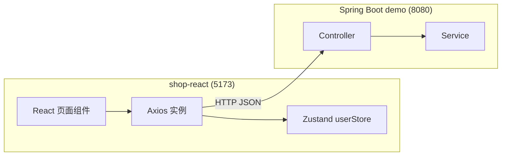
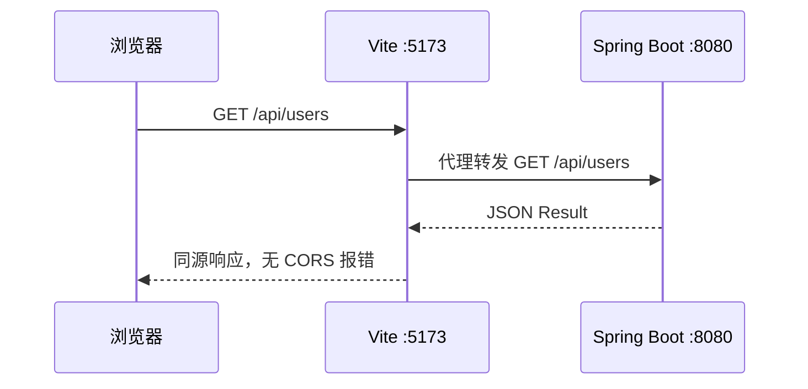
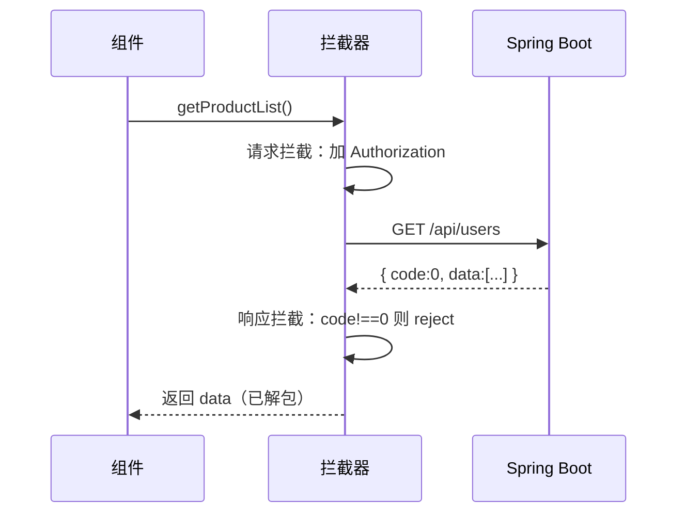
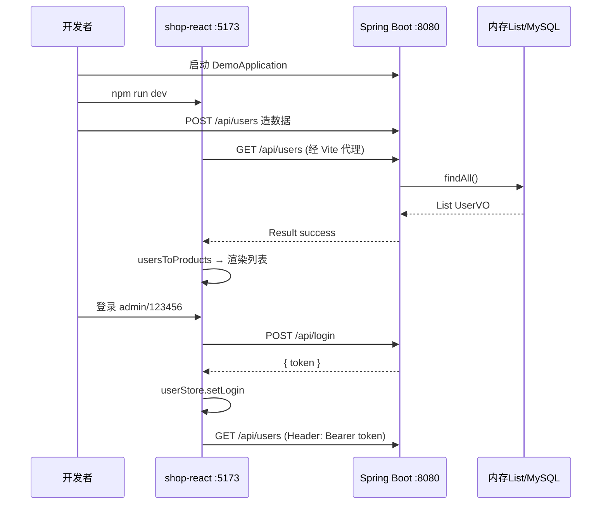
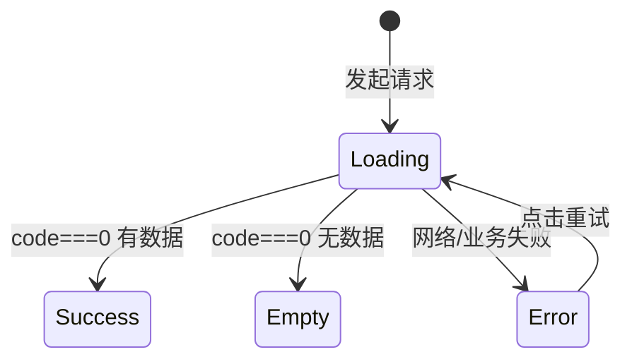
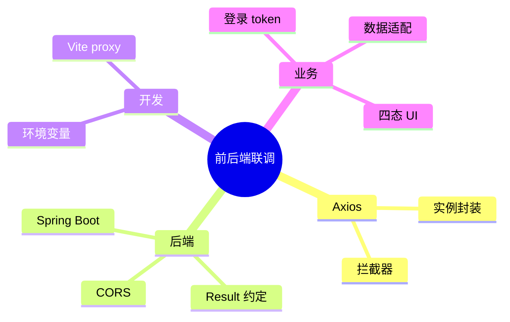

# Axios 网络请求与前后端联调

<!-- 修改说明: 2026-06-30 按 EXPANSION-STANDARD 扩充 §0 导读、request 逐行读、Network/DevTools、计网06 CORS、FAQ 12 题、闭卷自测、费曼检验 -->

> **文件编码**：UTF-8。本章在 `shop-react` 项目上演示，请先完成 01～07 章（React 基础、Hooks、Router、Zustand 状态管理）。

## 0. 读前导读（零基础也能跟上）

> **读者假设**：07 章 Zustand 能存 token，但商品仍是假数据。本章用 **Axios** 调 Spring Boot 接口，完成前后端联调——React 路线与 Java 路线的**交汇点**。

### 0.1 用一句话弄懂本章

**一句话**：Axios 是浏览器里的「快递员」——按 [Java 04 REST 约定](../../后端学习/Java/04-SpringBoot核心开发.md) 发 HTTP 请求，拦截器自动带 token、统一解析 `{ code, message, data }`，组件只关心 `data`。

**生活类比**：

| 概念 | 类比 |
|------|------|
| **Axios 实例** | 专属快递公司：统一地址、超时、包装规范 |
| **请求拦截器** | 出库贴单：每个包裹自动贴会员号（Bearer token） |
| **响应拦截器** | 收货验货：`code !== 0` 拒收并报错 |
| **Vite proxy** | 前台代收：浏览器以为寄给 5173，实际转 8080 |

**为什么重要**：没有联调，React 只是本地玩具；联调后 shop-react 与 [Java 04 demo](../../后端学习/Java/04-SpringBoot核心开发.md) 形成完整全栈闭环。

---

### 0.2 你需要提前知道什么

| 水平 | 建议 |
|------|------|
| 07 章 Zustand/token 不熟 | 先完成 [07-Zustand状态管理](./07-Zustand状态管理.md) |
| HTTP 方法/status 不熟 | 补 [计网 04 HTTP](../计算机网络/04-HTTP协议深入.md) |
| CORS 红字看不懂 | 必读 [计网 06 §10 CORS](../计算机网络/06-缓存Cookie与会话机制.md) |
| 已会 07 章 | **从 §2 联调清单跟做 §6～§13** |

**后端必配（Java 路线）**：

| 章 | 内容 |
|----|------|
| [Java 04](../../后端学习/Java/04-SpringBoot核心开发.md) | Controller、`Result<T>`、`POST /api/login`、CorsConfig |
| [Java 06](../../后端学习/Java/06-MySQL基础索引与事务.md) | 05 章后真实 `/api/products` 来自 MySQL |
| [Java 07](../../后端学习/Java/07-Redis核心原理与缓存实战.md) | JWT/session 存 Redis（进阶） |

---

### 0.3 本章知识地图（☐→☑）

- [ ] 封装 Axios 实例 + 请求/响应拦截器
- [ ] 对接 Spring Boot `Result`（code === 0）
- [ ] 配置 Vite proxy；理解 CORS 与 [计网 06](../计算机网络/06-缓存Cookie与会话机制.md) 一致
- [ ] 登录 POST /api/login → token → Zustand → 后续 Bearer
- [ ] 列表/详情四态 UI（loading/error/empty/success）
- [ ] Network 面板验收请求与响应
- [ ] 闭卷自测 ≥ 8/10

---

### 0.4 建议学习时长

| 阶段 | 时间 |
|------|------|
| 联调清单 + proxy §2～§4 | 1 小时 |
| request.js + API 模块 §6～§8 | 2 小时 |
| 页面改造 + 联调流程 §12～§14 | 2.5 小时 |
| CORS 排查 + Network + 自测 | 1 小时 |

---

### 0.5 可验证成果

1. `curl localhost:8080/api/users` 与浏览器 Network 里 `/api/users` 均 200。
2. 登录 admin/123456 后，后续请求 Header 含 `Authorization: Bearer ...`。
3. 后端未启动时，页面显示「网络错误」而非白屏。
4. 能口述：dev 用 proxy 为何无 CORS；生产用 Nginx 同域（10 章）。

---

### 0.6 核心术语三件套

**术语（CORS 跨域资源共享）**：浏览器安全策略——不同源（协议/域/端口）的 JS 默认不能读对方 API 响应；需后端 `Access-Control-Allow-*` 或 dev proxy 同源转发。
**生活类比**：保安（浏览器）不让 A 店的人读 B 店仓库清单，除非 B 店老板签字（CORS 头）。详见 [计网 06 §10～§11](../计算机网络/06-缓存Cookie与会话机制.md)。
**为什么重要**：5173 调 8080 必遇；不懂 CORS 联调必卡。
**本章用到的地方**：§4 Vite proxy、§2.2 CorsConfig、§25 报错表。

**术语（拦截器 Interceptor）**：请求发出前/响应返回后的统一钩子。
**生活类比**：快递出库自动贴会员号；入库统一验货盖章。
**为什么重要**：token、401 登出、Result 解包只写一次。
**本章用到的地方**：§6 request.js。

**术语（Vite dev proxy）**：开发服务器把 `/api` 转发到后端，浏览器只请求同源 5173。
**生活类比**：前台代收——你交给 5173 前台，它转给 8080 仓库，保安不拦。
**为什么重要**：本地开发首选，避免配 CORS 也能联调。
**本章用到的地方**：§4 vite.config.js。

---

## 本章与上一章的关系

07 章 Zustand 管好了登录态（token）和购物车，但 `ProductListPage` 里的商品仍是**写死的假数组**。后端 [Java 04-SpringBoot核心开发](../../后端学习/Java/04-SpringBoot核心开发.md) 或 [Python 04-FastAPI核心开发](../../后端学习/Python/04-FastAPI核心开发.md) 已经教你搭建了 `demo` / `demo-api` 项目，提供：

- `GET /api/users` — 用户列表
- `GET /api/users/{id}` — 单个用户
- `POST /api/users` — 新增用户
- `POST /api/login` — JWT 登录（04 章挑战练习）
- 统一返回 `Result<T>`：`{ code, message, data }`

这一章用 **Axios** 调这些接口，完成 **前后端联调**。商城场景下，我们暂时用 `/api/users` 数据**模拟商品列表**（id → 商品 id，name → 商品名），08 章重点是打通「请求 → 解析 → 渲染 → 登录带 token」全链路；后端接 MySQL 后可换成真实 `/api/products`。



**这是 React 学习路线和后端学习路线的交汇点。**

---

## 1. 为什么用 Axios 而不是 fetch？

| 能力 | fetch | Axios |
|------|-------|-------|
| JSON 自动解析 | 需手动 `.json()` | 自动 |
| 请求/响应拦截器 | 无 | ✅ 统一 token、错误 |
| 超时控制 | 需 AbortController | `timeout` 配置 |
| 取消请求 | AbortController | AbortController / CancelToken |
| 浏览器/Node 同 API | 部分差异 | 一致 |
| 上传进度 | 有限 | `onUploadProgress` |
| 并发 helper | 无 | `Promise.all` 自行封装 |

**生产项目几乎都用 Axios 或封装 fetch mimicking Axios。** 本章用 Axios Industry 标准做法。

### 1.1 React 生态中的请求方案对比

| 方案 | 特点 | 适用 |
|------|------|------|
| **Axios + 手写 hook** | 灵活、与 Vue 版思路一致 | 本章、面试项目 |
| **TanStack Query** | 缓存、重试、四态内置 | 中大型项目 |
| **SWR** | 轻量数据获取 | Next.js 场景 |
| **RTK Query** | Redux 生态 | 已用 Redux 的团队 |

本章用 **Axios + 自定义 `useRequest` hook**，便于理解底层；11 章项目完成后可升级为 TanStack Query。

---

## 2. 联调前检查清单

### 2.1 后端 demo 已启动

```bash
# 在 IDEA 运行 DemoApplication，或：
cd demo
./mvnw spring-boot:run

# Windows:
mvnw.cmd spring-boot:run

# 预期控制台：
Started DemoApplication in 2.xxx seconds
```

验证：

```bash
curl http://localhost:8080/api/users
# 预期：{"code":0,"message":"success","data":[...]}
```

### 2.2 后端 CORS 已配置

直连 `http://localhost:8080` 时浏览器会触发 **CORS** 校验（[计网 06 §10](../计算机网络/06-缓存Cookie与会话机制.md)）。开发环境推荐 Vite proxy（§4）；若不用 proxy，必须在 [Java 04 CorsConfig](../../后端学习/Java/04-SpringBoot核心开发.md) 开启：

参考 [Java 04 章](../../后端学习/Java/04-SpringBoot核心开发.md)：

```java
@Configuration
public class CorsConfig implements WebMvcConfigurer {
    @Override
    public void addCorsMappings(CorsRegistry registry) {
        registry.addMapping("/api/**")
            .allowedOriginPatterns("*")
            .allowedMethods("GET", "POST", "PUT", "DELETE", "OPTIONS")
            .allowedHeaders("*")
            .allowCredentials(true);
    }
}
```

### 2.3 统一返回结构 Result

04 章 demo 约定 **`code === 0` 表示成功**：

```json
{
  "code": 0,
  "message": "success",
  "data": { "id": 1, "name": "张三", "age": 20 }
}
```

业务失败：

```json
{
  "code": 1,
  "message": "用户名不能为空",
  "data": null
}
```

前端拦截器必须按此约定解析。注意：部分教程用 `code === 200`，联调时**与后端同学对齐一种约定**，不要混用。

### 2.4 shop-react 项目骨架

若尚未创建项目：

```bash
npm create vite@latest shop-react -- --template react
cd shop-react
npm install
npm install axios react-router-dom zustand
```

---

## 3. 安装 Axios

```bash
cd shop-react
npm install axios
```

---

## 4. Vite 开发代理（推荐）

开发环境前端 `http://localhost:5173`，后端 `http://localhost:8080`，浏览器视为**跨域**。两种方案：

| 方案 | 原理 | 适用 |
|------|------|------|
| **Vite proxy** | 开发服务器转发 `/api` | 本地开发首选 |
| **CORS** | 后端允许跨域 Header | 直连后端、生产 |

**`vite.config.js`**：

```js
import { defineConfig } from 'vite'
import react from '@vitejs/plugin-react'
import { fileURLToPath, URL } from 'node:url'

export default defineConfig({
  plugins: [react()],
  resolve: {
    alias: {
      '@': fileURLToPath(new URL('./src', import.meta.url)),
    },
  },
  server: {
    port: 5173,
    proxy: {
      '/api': {
        target: 'http://localhost:8080',
        changeOrigin: true,
      },
    },
  },
})
```

代理后，前端 `baseURL` 设为 `/api`，请求 `/api/users` 会被 Vite 转发到 `http://localhost:8080/api/users`，**浏览器无跨域问题**。

### 4.1 CORS 与 [计网 06](../计算机网络/06-缓存Cookie与会话机制.md) 对照

**同源**：协议 + 域名 + 端口三者相同。`http://localhost:5173` 与 `http://localhost:8080` **不同源**（端口不同）。

| 现象 | 原因 | 解决 |
|------|------|------|
| Console 红字 `blocked by CORS policy` | 浏览器收到响应但无 `Access-Control-Allow-Origin` | dev 用 §4 proxy；或 [Java 04 CorsConfig](../../后端学习/Java/04-SpringBoot核心开发.md) |
| Postman 正常、浏览器失败 | CORS 是**浏览器**策略，Postman 不校验 | 配后端 CORS 或 proxy |
| OPTIONS 预检失败 | 带 `Authorization`、`Content-Type: application/json` 触发预检 | [计网 06 §10.2](../计算机网络/06-缓存Cookie与会话机制.md) 允许 OPTIONS |

**与 Java 04 一致的后端配置**（直连 8080 时必开）：

```java
// 见 Java 04 CorsConfig — 与计网 06 §11.2 相同
registry.addMapping("/api/**")
    .allowedOriginPatterns("*")
    .allowedMethods("GET", "POST", "PUT", "DELETE", "OPTIONS")
    .allowedHeaders("*")
    .allowCredentials(true);
```

**生产环境**：Nginx 同域托管静态 + `/api` 反代（10 章），浏览器视为同源，**无需 CORS**（[计网 06 §11.3](../计算机网络/06-缓存Cookie与会话机制.md)）。

### 4.2 联调启动手把手步骤表

| 步骤 | 你的动作 | 预期看到什么 | 若不对 |
|------|----------|--------------|--------|
| 1 | IDEA 运行 DemoApplication | 8080 Started | [Java 04](../../后端学习/Java/04-SpringBoot核心开发.md) demo 未建 |
| 2 | `curl localhost:8080/api/users` | code:0 + data 数组 | Controller 路径 |
| 3 | `cd shop-react && npm run dev` | 5173 可开 | 依赖未装 |
| 4 | 改 vite.config 后 | **重启** dev server | proxy 不生效 |
| 5 | 浏览器 /products | Network GET /api/users 200 | 后端未启 |
| 6 | Console | 无 CORS 红字 | 未走 proxy 或缺 CorsConfig |
| 7 | Postman 同 URL | 与浏览器 Response 一致 | 业务逻辑问题 |



---

## 5. 环境变量

**`.env.development`**：

```env
VITE_API_BASE_URL=/api
VITE_API_PROXY_TARGET=http://localhost:8080
```

**`.env.production`**：

```env
VITE_API_BASE_URL=/api
```

生产环境由 Nginx 把 `/api` 反代到 Spring Boot（10 章）。

### 5.1 TypeScript 类型（可选 `src/vite-env.d.ts`）

```ts
/// <reference types="vite/client" />

interface ImportMetaEnv {
  readonly VITE_API_BASE_URL: string
}

interface ImportMeta {
  readonly env: ImportMetaEnv
}
```

---

## 6. 手把手：封装 Axios 实例 `src/api/request.js`

React 与 Vue 的关键差异：**不能在模块顶层直接 `useUserStore()`**，因为 hook 只能在组件或自定义 hook 内调用。拦截器里用 **Zustand 的 `getState()`** 读取 token。

```js
import axios from 'axios'
import { useUserStore } from '@/stores/userStore'

// 用于拦截器、路由跳转（避免循环依赖）
let navigateFn = null

export function setNavigate(navigate) {
  navigateFn = navigate
}

const request = axios.create({
  baseURL: import.meta.env.VITE_API_BASE_URL || '/api',
  timeout: 15000,
  headers: {
    'Content-Type': 'application/json',
  },
})

// ========== 请求拦截器 ==========
request.interceptors.request.use(
  (config) => {
    const token = useUserStore.getState().token
    if (token) {
      config.headers.Authorization = `Bearer ${token}`
    }
    return config
  },
  (error) => Promise.reject(error)
)

// ========== 响应拦截器 ==========
request.interceptors.response.use(
  (response) => {
    const res = response.data

    // 与 Spring Boot Result 约定：code === 0 成功
    if (res.code !== 0) {
      return Promise.reject(new Error(res.message || '业务请求失败'))
    }

    // 直接返回 data 字段，组件里少写一层 .data
    return res.data
  },
  (error) => {
    const status = error.response?.status
    const message = error.response?.data?.message || error.message

    if (status === 401) {
      useUserStore.getState().logout()
      const redirect = window.location.pathname + window.location.search
      if (navigateFn) {
        navigateFn(`/login?redirect=${encodeURIComponent(redirect)}`)
      } else {
        window.location.href = `/login?redirect=${encodeURIComponent(redirect)}`
      }
      return Promise.reject(new Error('登录已过期，请重新登录'))
    }

    if (status === 403) {
      return Promise.reject(new Error('没有权限'))
    }

    if (status === 404) {
      return Promise.reject(new Error('接口不存在'))
    }

    if (status >= 500) {
      return Promise.reject(new Error('服务器错误，请稍后重试'))
    }

    if (error.code === 'ECONNABORTED') {
      return Promise.reject(new Error('请求超时'))
    }

    if (!error.response) {
      return Promise.reject(new Error('网络错误，请检查后端是否启动'))
    }

    return Promise.reject(new Error(message))
  }
)

export default request
```

### 6.1 `request.js` 逐行读

| 行号/字段 | 含义 | 改错会怎样 |
|-----------|------|------------|
| `axios.create({ baseURL, timeout })` | 独立实例，不污染全局 axios | 直接用 axios 难统一配置 |
| `import.meta.env.VITE_API_BASE_URL` | 环境变量，build 时注入 | 忘 `VITE_` 前缀则 undefined |
| `useUserStore.getState().token` | React 拦截器内读 Zustand（不能调 Hook） | 用 `useUserStore()` 会违反 Hooks 规则 |
| 请求拦截 `Authorization` | 从 store 读 token 贴 Bearer | 漏则后端 401（[Java 04](../../后端学习/Java/04-SpringBoot核心开发.md)） |
| `res.code !== 0` reject | 对齐 Spring `Result` 业务失败 | 只认 HTTP 200 会漏业务错误 |
| `return res.data` | 组件直接拿 data，少写一层 | 改 return 整个 res 则组件要 `.data.data` |
| `status === 401` | token 失效统一 logout + 跳登录 | 漏则用户卡在错误页反复 401 |
| `setNavigate(navigate)` | 拦截器内跳转需注入 React Router | 只用 `window.location` 会丢 SPA 状态 |
| `!error.response` | 后端未启动/断网 | 应提示「检查后端是否启动」 |

### 6.2 在 App 中注入 navigate

**`src/App.jsx`**：

```jsx
import { useEffect } from 'react'
import { useNavigate } from 'react-router-dom'
import { setNavigate } from '@/api/request'
import AppRouter from '@/router'

export default function App() {
  const navigate = useNavigate()

  useEffect(() => {
    setNavigate(navigate)
  }, [navigate])

  return <AppRouter />
}
```



---

## 7. API 模块拆分

### 7.1 `src/api/auth.js`

```js
import request from './request'

/** 登录 — 对应 04 章 LoginController */
export function login(data) {
  return request.post('/login', data)
  // data: { username, password }
  // 返回 data: { token: 'xxx' }
}

/** 注册（若后端实现了 /api/register） */
export function register(data) {
  return request.post('/register', data)
}
```

> 注意：`baseURL` 已是 `/api`，路径写 `/login` 即可，最终请求 `/api/login`。

### 7.2 `src/api/product.js`

```js
import request from './request'

/**
 * 商品列表 — 本章用 /api/users 模拟
 * 后端返回 UserVO[]，前端映射为商品结构
 */
export function getProductList(params = {}) {
  return request.get('/users', { params })
}

/** 商品详情 — 用 /api/users/{id} 模拟 */
export function getProductById(id) {
  return request.get(`/users/${id}`)
}

/** 后端有真实 Product 接口时可替换为： */
// export function getProductList(params) {
//   return request.get('/products', { params })
// }
```

### 7.3 `src/api/user.js`

```js
import request from './request'

export function createUser(data) {
  return request.post('/users', data)
}

export function deleteUser(id) {
  return request.delete(`/users/${id}`)
}
```

### 7.4 `src/api/index.js`（统一导出）

```js
export * from './auth'
export * from './product'
export * from './user'
```

---

## 8. 数据适配：UserVO → 商品展示

后端 `UserVO` 结构：

```json
{ "id": 1, "name": "张三", "age": 20 }
```

前端商品卡片需要 `{ id, name, price }`。在工具模块里做适配：

**`src/utils/productAdapter.js`**：

```js
/** 将 UserVO 映射为商品展示结构（联调模拟用） */
export function userToProduct(user) {
  return {
    id: user.id,
    name: user.name,
    price: (user.age || 1) * 10,  // 用 age 模拟价格，仅演示
    category: user.age > 25 ? 'premium' : 'normal',
    desc: `年龄 ${user.age} 岁`,
  }
}

export function usersToProducts(users) {
  return (users || []).map(userToProduct)
}
```

---

## 9. 自定义 Hook：`useRequest`

**`src/hooks/useRequest.js`**：

```js
import { useState, useCallback } from 'react'

/**
 * 通用异步请求 Hook，封装 loading / error / data 三态
 * @param {Function} asyncFn - 返回 Promise 的 API 函数
 */
export function useRequest(asyncFn) {
  const [data, setData] = useState(null)
  const [loading, setLoading] = useState(false)
  const [error, setError] = useState('')

  const execute = useCallback(
    async (...args) => {
      setLoading(true)
      setError('')
      try {
        const result = await asyncFn(...args)
        setData(result)
        return result
      } catch (e) {
        setError(e.message || '请求失败')
        throw e
      } finally {
        setLoading(false)
      }
    },
    [asyncFn]
  )

  const reset = useCallback(() => {
    setData(null)
    setError('')
    setLoading(false)
  }, [])

  return { data, loading, error, execute, reset }
}
```

---

## 10. 更新 ProductListPage（完整四态）

**`src/pages/ProductListPage.jsx`**：

```jsx
import { useEffect, useState } from 'react'
import { getProductList } from '@/api/product'
import { usersToProducts } from '@/utils/productAdapter'
import ProductCard from '@/components/product/ProductCard'
import './ProductListPage.css'

export default function ProductListPage() {
  const [list, setList] = useState([])
  const [loading, setLoading] = useState(false)
  const [error, setError] = useState('')
  const [isEmpty, setIsEmpty] = useState(false)

  async function loadData() {
    setLoading(true)
    setError('')
    setIsEmpty(false)
    try {
      const data = await getProductList()
      const products = usersToProducts(data)
      setList(products)
      setIsEmpty(products.length === 0)
    } catch (e) {
      setError(e.message || '加载失败')
    } finally {
      setLoading(false)
    }
  }

  useEffect(() => {
    loadData()
  }, [])

  if (loading) {
    return (
      <section className="product-list">
        <h2>商品列表</h2>
        <div className="state-box">加载中...</div>
      </section>
    )
  }

  if (error) {
    return (
      <section className="product-list">
        <h2>商品列表</h2>
        <div className="state-box error">
          <p>{error}</p>
          <button type="button" onClick={loadData}>重试</button>
        </div>
      </section>
    )
  }

  if (isEmpty) {
    return (
      <section className="product-list">
        <h2>商品列表</h2>
        <div className="state-box">
          <p>暂无商品，请先在后台添加用户数据</p>
          <p className="hint">
            curl -X POST http://localhost:8080/api/users -H &quot;Content-Type: application/json&quot;
            -d &quot;{`{"name":"React教程","age":59}`}&quot;
          </p>
        </div>
      </section>
    )
  }

  return (
    <section className="product-list">
      <h2>商品列表</h2>
      <div className="grid">
        {list.map((p) => (
          <ProductCard key={p.id} product={p} />
        ))}
      </div>
    </section>
  )
}
```

**`src/pages/ProductListPage.css`**：

```css
.product-list h2 {
  margin-bottom: 20px;
}

.grid {
  display: grid;
  grid-template-columns: repeat(auto-fill, minmax(240px, 1fr));
  gap: 16px;
}

.state-box {
  padding: 40px;
  text-align: center;
  color: #666;
}

.state-box.error {
  color: #e74c3c;
}

.hint {
  font-size: 12px;
  margin-top: 8px;
  word-break: break-all;
}

.state-box button {
  margin-top: 12px;
  padding: 8px 16px;
  cursor: pointer;
}
```

---

## 11. 更新 ProductDetailPage

**`src/pages/ProductDetailPage.jsx`**：

```jsx
import { useEffect, useState } from 'react'
import { useParams, useNavigate } from 'react-router-dom'
import { getProductById } from '@/api/product'
import { userToProduct } from '@/utils/productAdapter'
import { useCartStore } from '@/stores/cartStore'

export default function ProductDetailPage() {
  const { id } = useParams()
  const navigate = useNavigate()
  const addItem = useCartStore((s) => s.addItem)

  const [product, setProduct] = useState(null)
  const [loading, setLoading] = useState(false)
  const [error, setError] = useState('')

  useEffect(() => {
    async function loadDetail() {
      setLoading(true)
      setError('')
      setProduct(null)
      try {
        const data = await getProductById(id)
        setProduct(userToProduct(data))
      } catch (e) {
        setError(e.message)
      } finally {
        setLoading(false)
      }
    }
    if (id) loadDetail()
  }, [id])

  if (loading) return <div>加载中...</div>
  if (error) return <div className="err">{error}</div>
  if (!product) return null

  return (
    <section>
      <button type="button" className="back" onClick={() => navigate(-1)}>
        ← 返回
      </button>
      <h2>{product.name}</h2>
      <p className="price">¥ {product.price}</p>
      <p>{product.desc}</p>
      <button type="button" onClick={() => addItem(product)}>
        加入购物车
      </button>
    </section>
  )
}
```

---

## 12. 更新 LoginPage（真实接口）

**`src/pages/LoginPage.jsx`**：

```jsx
import { useState } from 'react'
import { useNavigate, useSearchParams } from 'react-router-dom'
import { login } from '@/api/auth'
import { useUserStore } from '@/stores/userStore'

export default function LoginPage() {
  const navigate = useNavigate()
  const [searchParams] = useSearchParams()
  const setLogin = useUserStore((s) => s.setLogin)

  const [form, setForm] = useState({ username: '', password: '' })
  const [loading, setLoading] = useState(false)
  const [errMsg, setErrMsg] = useState('')

  function handleChange(e) {
    const { name, value } = e.target
    setForm((prev) => ({ ...prev, [name]: value }))
  }

  async function onSubmit(e) {
    e.preventDefault()
    setLoading(true)
    setErrMsg('')
    try {
      const data = await login(form)
      setLogin({ token: data.token, username: form.username })
      const redirect = searchParams.get('redirect') || '/'
      navigate(redirect, { replace: true })
    } catch (err) {
      setErrMsg(err.message)
    } finally {
      setLoading(false)
    }
  }

  return (
    <section className="login">
      <h2>用户登录</h2>
      <form onSubmit={onSubmit}>
        <label>
          用户名
          <input
            name="username"
            value={form.username}
            onChange={handleChange}
            required
          />
        </label>
        <label>
          密码
          <input
            name="password"
            type="password"
            value={form.password}
            onChange={handleChange}
            required
          />
        </label>
        {errMsg && <p className="err">{errMsg}</p>}
        <button type="submit" disabled={loading}>
          {loading ? '登录中...' : '登录'}
        </button>
      </form>
    </section>
  )
}
```

### 12.1 userStore 配合联调

**`src/stores/userStore.js`**：

```js
import { create } from 'zustand'
import { persist } from 'zustand/middleware'

export const useUserStore = create(
  persist(
    (set) => ({
      token: '',
      username: '',
      isLoggedIn: false,

      setLogin: ({ token, username }) =>
        set({ token, username, isLoggedIn: true }),

      logout: () =>
        set({ token: '', username: '', isLoggedIn: false }),
    }),
    {
      name: 'shop-user',
      partialize: (state) => ({
        token: state.token,
        username: state.username,
        isLoggedIn: state.isLoggedIn,
      }),
    }
  )
)
```

---

## 13. Spring Boot 后端：Login 接口（联调必备）

若你尚未实现 04 章 JWT 挑战，可先加**简化版登录**（无 JWT，返回假 token）：

**`dto/LoginDTO.java`**：

```java
package com.example.demo.dto;

import jakarta.validation.constraints.NotBlank;

public class LoginDTO {
    @NotBlank(message = "用户名不能为空")
    private String username;
    @NotBlank(message = "密码不能为空")
    private String password;

    public String getUsername() { return username; }
    public void setUsername(String username) { this.username = username; }
    public String getPassword() { return password; }
    public void setPassword(String password) { this.password = password; }
}
```

**`controller/LoginController.java`**：

```java
package com.example.demo.controller;

import com.example.demo.common.Result;
import com.example.demo.dto.LoginDTO;
import jakarta.validation.Valid;
import org.springframework.web.bind.annotation.*;

import java.util.Map;
import java.util.UUID;

@RestController
public class LoginController {

    @PostMapping("/api/login")
    public Result<Map<String, String>> login(@Valid @RequestBody LoginDTO dto) {
        if ("admin".equals(dto.getUsername()) && "123456".equals(dto.getPassword())) {
            String token = UUID.randomUUID().toString();
            return Result.success(Map.of("token", token));
        }
        return Result.fail("用户名或密码错误");
    }
}
```

测试：

```bash
curl -X POST http://localhost:8080/api/login \
  -H "Content-Type: application/json" \
  -d "{\"username\":\"admin\",\"password\":\"123456\"}"
# 预期：{"code":0,"message":"success","data":{"token":"..."}}
```

完整 JWT 版见 [04 章挑战参考答案](../../后端学习/Java/04-SpringBoot核心开发.md)。

---

## 14. 完整联调流程



### 14.1 逐步验证

```bash
# 终端 1：后端
cd demo && ./mvnw spring-boot:run

# 终端 2：前端
cd shop-react && npm run dev

# 终端 3：造数据
curl -X POST http://localhost:8080/api/users \
  -H "Content-Type: application/json" \
  -d "{\"name\":\"React18教程\",\"age\":59}"
curl -X POST http://localhost:8080/api/users \
  -H "Content-Type: application/json" \
  -d "{\"name\":\"机械键盘\",\"age\":39}"
```

浏览器：

1. 打开 `http://localhost:5173/products` → 应看到商品卡片
2. F12 → Network → 看到 `/api/users` 状态 200
3. 登录 `admin` / `123456` → 应跳首页，localStorage 有 `shop-user`

---

## 15. 页面四态设计规范

每个依赖接口的页面必须处理：

| 状态 | 变量 | UI 建议 |
|------|------|---------|
| loading | `loading === true` | Spin 组件、骨架屏（09 章 Ant Design） |
| error | `error !== ''` | 错误文案 + 重试按钮 |
| empty | `list.length === 0` | Empty 组件 + 引导文案 |
| success | 以上皆否 | 正常业务 UI |



### 15.1 四态与 React 渲染模式

```jsx
// 模式 A：早返回（本章采用，可读性好）
if (loading) return <Loading />
if (error) return <Error onRetry={loadData} />
if (isEmpty) return <Empty />
return <List data={list} />

// 模式 B：单一 JSX 分支（适合 Ant Design Spin 包裹）
return (
  <Spin spinning={loading}>
    {error ? <Alert type="error" /> : null}
    {!error && isEmpty ? <Empty /> : null}
    {!error && !isEmpty ? <List /> : null}
  </Spin>
)
```

---

## 16. 401 处理与路由守卫联动

### 16.1 拦截器层（全局）

响应拦截器捕获 HTTP 401 → `logout()` → 跳 `/login?redirect=当前路径`。适用于 token 过期、后端鉴权失败。

### 16.2 路由层（页面级）

**`src/router/ProtectedRoute.jsx`**：

```jsx
import { Navigate, useLocation } from 'react-router-dom'
import { useUserStore } from '@/stores/userStore'

export default function ProtectedRoute({ children }) {
  const isLoggedIn = useUserStore((s) => s.isLoggedIn)
  const location = useLocation()

  if (!isLoggedIn) {
    return (
      <Navigate
        to={`/login?redirect=${encodeURIComponent(location.pathname)}`}
        replace
      />
    )
  }

  return children
}
```

**路由配置**：

```jsx
{
  path: '/cart',
  element: (
    <ProtectedRoute>
      <CartPage />
    </ProtectedRoute>
  ),
}
```

| 场景 | 谁处理 |
|------|--------|
| 未登录访问 /cart | ProtectedRoute → 跳登录 |
| 已登录但 token 过期调接口 | Axios 拦截器 401 → 跳登录 |
| 登录成功回跳 | LoginPage 读 `redirect` 参数 |

---

## 17. 常见联调问题排查

| 现象 | 可能原因 | 解决 |
|------|----------|------|
| Network 显示 CORS 错误 | 未配 proxy 且后端无 CORS | 检查 vite.config proxy |
| 404 Not Found | 路径多写/少写 `/api` | 对齐 baseURL 与路径 |
| 200 但页面报错 | `code !== 0` 未处理 | 检查拦截器 |
| 登录成功仍 401 | Header 格式错 | 应为 `Bearer ${token}` |
| 代理不生效 | 改了 config 未重启 dev | 重启 `npm run dev` |
| 响应 data 为 undefined | 后端字段名不一致 | 对照 Result 结构 |
| 无限重定向登录 | token 无效仍 isLoggedIn | logout 清干净状态 |

### 17.1 DevTools 调试技巧

1. **Network** → 筛选 XHR → 看 Request URL、Status、Response
2. **Application** → Local Storage → 查 `shop-user`
3. 在拦截器临时 `console.log(config.headers)` 确认 token 已带
4. 用 curl 直接打后端，排除前端因素

---

## 18. POST 请求与表单提交

**`src/api/user.js` 新增用户示例**：

```js
export function createUser(data) {
  // data: { name: string, age: number }
  return request.post('/users', data)
}
```

**组件中调用**：

```jsx
async function handleCreate() {
  try {
    await createUser({ name: '测试商品', age: 88 })
    message.success('创建成功')
    loadData()
  } catch (e) {
    message.error(e.message)
  }
}
```

Axios 自动把 JS 对象序列化为 JSON，`Content-Type: application/json` 由实例默认 headers 保证。

---

## 19. 并发请求与依赖请求

### 19.1 并发加载首页数据

```jsx
useEffect(() => {
  async function loadHome() {
    setLoading(true)
    try {
      const [hotProducts, banners] = await Promise.all([
        getProductList({ limit: 8 }),
        getBanners(),  // 假设后端有该接口
      ])
      setHot(usersToProducts(hotProducts))
      setBannerList(banners)
    } catch (e) {
      setError(e.message)
    } finally {
      setLoading(false)
    }
  }
  loadHome()
}, [])
```

### 19.2 详情页依赖 id

```jsx
// id 变化时重新请求 — useEffect 依赖数组写 [id]
useEffect(() => {
  if (!id) return
  loadDetail(id)
}, [id])
```

---

## 20. 与 Vue 版 shop-vue 对照

| 维度 | Vue (08 章) | React (本章) |
|------|-------------|--------------|
| 状态读 token | `useUserStore()` 在拦截器外需注意 | `useUserStore.getState()` |
| 路由跳转 | `router.push` | `navigate` + `setNavigate` 注入 |
| 列表加载 | `onMounted` + `ref` | `useEffect` + `useState` |
| 请求复用 | `useRequest` composable | `useRequest` hook |
| 四态模板 | `v-if` / `v-else` | 早返回或三元 |
| 代理配置 | 相同 | 相同 |

---

## 21. 面试常问：Axios 封装思路

**Q：为什么要封装 Axios 实例而不是直接用 axios.get？**  
A：统一 baseURL、超时、拦截器；业务代码只关心 API 函数，不散落 token 和错误处理。

**Q：React 里拦截器怎么拿 token？**  
A：Zustand/Redux 的 `getState()` 可在非组件环境读取；Context 需通过 ref 或模块级变量注入。

**Q：401 在拦截器处理好还是组件处理好？**  
A：拦截器统一跳登录；组件可额外 Toast。避免每个请求重复写。

**Q：Vite proxy 和 Nginx 反代的区别？**  
A：proxy 仅开发时 Node 转发；生产由 Nginx 把同域 `/api` 转到 Spring Boot，用户无跨域。

---

## 22. 常见报错与排查

| 报错信息 | 可能原因 | 排查步骤 | 解决方案 |
|---------|---------|---------|---------|
| `Network Error` | 后端未启动或端口错 | `curl localhost:8080/api/users` | 启动 DemoApplication |
| CORS policy blocked | 没用代理且后端无 CORS | 看 Console 红字 | 配 Vite proxy 或 [Java 04 CorsConfig](../../后端学习/Java/04-SpringBoot核心开发.md) |
| `404 Not Found` on /api/xxx | 路径或方法不对 | 对比 Controller 注解 | 修正 URL；GET 勿用 POST |
| `401 Unauthorized` | token 无效/过期/未带 | 看 Request Headers | 重新登录；检查 Bearer 格式 |
| 数据是 undefined | 拦截器解包层级错 | 看 Network Response 原始 JSON | 对齐 `res.data.data` 或改拦截器 |
| `code !== 0` 业务失败 | 参数校验失败 | 看 message 字段 | 对齐 [Java 04 DTO](../../后端学习/Java/04-SpringBoot核心开发.md) 字段名 |
| `timeout of 15000ms exceeded` | 后端慢或死锁 | 看后端日志 | 调大 timeout；修后端 |
| 代理不生效 | vite.config 改完未重启 | 重启 dev server | `npm run dev` |
| 登录成功但立刻 401 | token 格式与后端不一致 | 看后端 Interceptor | 对齐 JWT 解析逻辑 |
| 刷新后请求不带 token | Zustand 未持久化 | Application localStorage | userStore setLogin 写 storage |
| OPTIONS 预检失败 | CORS 未允许 OPTIONS | Network 里 OPTIONS 红 | [计网 06 §10.2](../计算机网络/06-缓存Cookie与会话机制.md) + CorsConfig |

---

## 23. 常见问题 FAQ

### Q1：开发用 proxy，生产怎么办？

生产 Nginx：`location /api { proxy_pass http://backend:8080; }`，前端 `VITE_API_BASE_URL=/api`，同域无跨域（[计网 06 §11.3](../计算机网络/06-缓存Cookie与会话机制.md)）。

### Q2：为什么拦截器 return res.data 而不是整个 res？

减少组件里 `.data.data` 重复书写；业务失败已在拦截器 reject。

### Q3：React 拦截器为什么不能 `useUserStore()`？

Hooks 只能在组件或自定义 Hook 顶层调用；拦截器在模块加载时注册，用 `useUserStore.getState()` 读取。

### Q4：GET 请求 params 怎么传？

```js
request.get('/users', { params: { pageNum: 1, pageSize: 10 } })
// 实际 URL: /api/users?pageNum=1&pageSize=10
```

### Q5：前后端字段名不一致怎么办？

adapter 层映射（见 §8），或后端 `@JsonProperty`，或统一命名规范。

### Q6：axios 和 fetch 能混用吗？

能但不推荐；统一实例便于拦截器治理。

### Q7：为什么 dev 用 proxy 生产用 Nginx？

dev：Vite 内置转发，零 CORS 烦恼。生产：同域 `/api` 反代到 Spring Boot（[Java 09 Nginx](../../后端学习/Java/09-LinuxDockerNginx部署基础.md)），与 [计网 06 §11.3](../计算机网络/06-缓存Cookie与会话机制.md) 一致。

### Q8：OPTIONS 预检是什么？

浏览器对「非简单请求」先发 OPTIONS 问服务器是否允许跨域；见 [计网 06 §10.2](../计算机网络/06-缓存Cookie与会话机制.md)。CorsConfig 必须允许 OPTIONS。

### Q9：本章为何用 `/api/users` 模拟商品？

[Java 04](../../后端学习/Java/04-SpringBoot核心开发.md) demo 已有 User CRUD；[Java 06 MySQL](../../后端学习/Java/06-MySQL基础索引与事务.md) 接 product 表后改 `/api/products` 即可。

### Q10：LoginDTO 字段名必须一致吗？

必须。前端 `{ username, password }` 与 [Java 04 LoginDTO](../../后端学习/Java/04-SpringBoot核心开发.md) 一致，否则 400 或校验失败。

### Q11：Bearer 和 Cookie 会话选哪个？

前后端分离 JWT + Header 常见；Cookie 会话见 [计网 06 §8 Session](../计算机网络/06-缓存Cookie与会话机制.md)。shop-react 路线用 Bearer + Zustand persist。

### Q12：401 和 code!==0 有何区别？

401 是 HTTP 层未授权；code!==0 是 HTTP 200 但业务失败（如「用户名不能为空」）。拦截器要分别处理。

---

## 24. 本章小结



接口通了，但手写 HTML/CSS 做表格、表单、分页太慢。下一章（09 Ant Design）接入主流 UI 组件库，快速搭出专业界面。

---

## 25. 闭卷自测

1. 为什么生产项目常用 Axios 而不是裸 fetch？
2. Vite proxy 如何解决开发环境跨域？
3. 响应拦截器为何判断 `res.code !== 0`？
4. React 请求拦截器如何自动带 token？（与 Vue Pinia 有何不同？）
5. params 与 query 在 axios.get 中如何传递？
6. 页面四态指哪四种？各用什么变量表示？
7. CORS 错误时 Postman 为何可能正常？（见 [计网 06](../计算机网络/06-缓存Cookie与会话机制.md)）
8. **动手**：Network 确认 GET /api/users 200 且 Preview 有 data 数组。
9. **动手**：登录后任意 API 请求 Headers 含 Authorization。
10. **综合**：画出 5173→proxy→8080→[Java 04 Controller](../../后端学习/Java/04-SpringBoot核心开发.md) 的数据流。

### 25.1 自测参考答案

1. 拦截器、超时、JSON 自动解析、统一错误处理。
2. 浏览器只请求同源 5173，Vite 服务端转发到 8080，无跨域。
3. Spring Boot 统一 Result 约定 code===0 成功，否则业务错误应 reject。
4. `useUserStore.getState().token`，设 `config.headers.Authorization = 'Bearer '+token`；Vue 可在 setup 外用 store 实例，React 必须用 getState。
5. `request.get(url, { params: { page: 1 } })` → `?page=1`。
6. loading、error、empty、success；见 §15 表。
7. CORS 是浏览器策略，Postman 不执行同源限制。
8. F12 Network → users → Status 200 → Preview 见 code:0 与 data 数组。
9. 登录后 Network → 任选一 API → Request Headers → Authorization。
10. React 组件 → axios → Vite proxy /api → Spring Boot Controller → Service → 返回 Result JSON → 拦截器解包 → 组件渲染。

---

## 26. 费曼检验

3 分钟解释前后端联调：

1. **快递员（Axios）**：前端不直接碰数据库，只按约定 URL 要 JSON；[Java 04](../../后端学习/Java/04-SpringBoot核心开发.md) 负责真正查数据。
2. **贴会员号（token）**：登录后每个包裹自动贴 Bearer，后端认才给货；React 用 Zustand getState 在拦截器里读 token。
3. **保安与前台（CORS/proxy）**：开发时 Vite 前台代收避免保安拦；生产同域 Nginx 一家店不拦（[计网 06](../计算机网络/06-缓存Cookie与会话机制.md)）。

---

## 练习建议

1. **基础**：完成 `request.js` 封装，用 curl 验证后端后，让 ProductListPage 显示真实数据
2. **登录**：实现 LoginPage 调 `/api/login`，刷新页面后仍保持登录（Zustand persist）
3. **四态**：故意停掉后端，验证 error 态与重试按钮；清空数据验证 empty 态
4. **401**：在拦截器里模拟 401（或用过期 token），验证自动跳登录且带 redirect
5. **进阶**：把 `loadData` 改为 `useRequest(getProductList)`，对比代码量
6. **挑战**：对接真实 `/api/products`（若后端已建表），替换 adapter 逻辑

---

## 学完标准

- [ ] 能独立配置 Vite `server.proxy` 并解释原理
- [ ] `request.js` 正确解析 Spring Boot `Result`，`code !== 0` 时 reject
- [ ] 请求拦截器自动携带 `Authorization: Bearer token`
- [ ] 响应拦截器处理 401 并跳转登录页（带 redirect）
- [ ] ProductListPage 具备 loading / error / empty / success 四态
- [ ] LoginPage 能调通 `/api/login` 并持久化 token
- [ ] 能用 DevTools Network 独立排查联调问题
- [ ] 能口述 Axios 封装分层：instance → interceptors → api modules → pages
- [ ] 能解释 CORS 与 proxy 区别，并指向 [计网 06](../计算机网络/06-缓存Cookie与会话机制.md)

---

**下一章**：[09-Ant-Design与UI工程化](./09-Ant-Design与UI工程化.md) — 用 Ant Design 5 升级登录表单、商品表格、购物车页面，替换原生 HTML 反馈。
