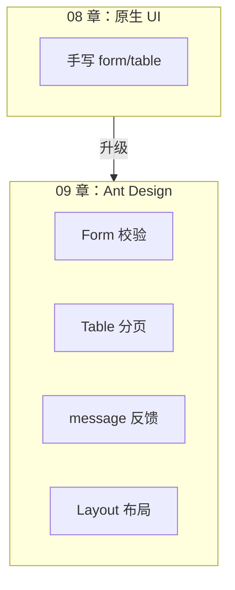
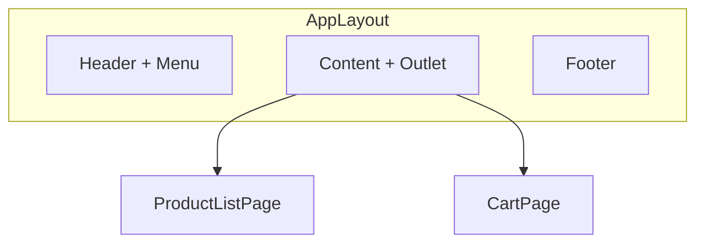

# Ant Design 与 UI 工程化

> **文件编码**：UTF-8。本章在 `shop-react` 项目上演示，请先完成 08 章 Axios 联调。

---

## 本章与上一章的关系

08 章 `shop-react` 已能调 Spring Boot 接口、展示真实数据，但界面仍是原生 HTML + 手写 CSS：表单没有校验提示、表格没有条纹和 loading、操作反馈靠 `alert`。在团队协作和企业项目中，这种效率无法支撑中后台、商城运营台等场景。

**Ant Design**（简称 AntD）是蚂蚁集团开源的 React UI 组件库，提供 Button、Form、Table、Layout、Menu 等 **60+** 开箱即用组件，是国内 React 中后台项目的**事实标准**。本章给 `shop-react` 全面接入 Ant Design 5，并介绍布局工程化、主题定制、与 Element Plus 的对比——为 10 章生产构建部署做好 UI 基础。



---

## 1. 为什么选 Ant Design？

| 组件库 | 框架 | 特点 |
|--------|------|------|
| **Ant Design** | React | 中后台首选，设计规范严格，生态最大 |
| Element Plus | Vue 3 | Vue 生态对应物，API 风格不同 |
| Material UI (MUI) | React | Google Material 风格，国际化多 |
| Arco Design | React/Vue | 字节系，较新 |
| shadcn/ui | React | 无头组件 + Tailwind，偏定制 |

**选型理由（shop-react / 初学）**：

- 国内 React 岗位需求极高，简历和面试常问
- 与 08 章 Spring Boot 后台管理场景天然契合
- 中文文档完善：https://ant.design/docs/react/introduce-cn
- Ant Design 5 使用 CSS-in-JS，主题定制比 4.x 更灵活

---

## 2. 安装

```bash
cd shop-react
npm install antd
npm install @ant-design/icons   # 图标包，几乎必装
```

验证：

```bash
npm list antd
# antd@5.x.x
```

### 2.1 与 08 章依赖并存

```json
{
  "dependencies": {
    "antd": "^5.20.0",
    "@ant-design/icons": "^5.4.0",
    "axios": "^1.7.0",
    "react": "^18.3.0",
    "react-dom": "^18.3.0",
    "react-router-dom": "^6.26.0",
    "zustand": "^4.5.0"
  }
}
```

---

## 3. 引入方式对比

| 方式 | 包体积 | 复杂度 | 适用 |
|------|--------|--------|------|
| **全量引入** | 大 | 低 | 学习、小项目 |
| **按需引入** | 小 | 中 | 生产推荐（antd 5 默认 tree-shaking） |
| **手动 babel 插件** | 最小 | 高 | 极致优化（一般不需要） |

Ant Design 5 基于 ES Module，Vite 构建时会 **自动 Tree-shaking**，直接 `import { Button } from 'antd'` 即可，无需 `babel-plugin-import`。

本章采用**按组件 import** 的写法，兼顾可读性与体积。

---

## 4. 全局配置 `src/main.jsx`

```jsx
import React from 'react'
import ReactDOM from 'react-dom/client'
import { ConfigProvider } from 'antd'
import zhCN from 'antd/locale/zh_CN'
import { BrowserRouter } from 'react-router-dom'
import App from './App'
import './index.css'

ReactDOM.createRoot(document.getElementById('root')).render(
  <React.StrictMode>
    <ConfigProvider locale={zhCN}>
      <BrowserRouter>
        <App />
      </BrowserRouter>
    </ConfigProvider>
  </React.StrictMode>
)
```

**ConfigProvider** 作用：

- 设置全局中文 `locale`
- 统一主题 `theme`（§25）
- 组件默认尺寸 `componentSize`

```bash
npm run dev
# 预期：DatePicker 等组件显示中文，无样式错乱
```

---

## 5. 常用组件速览

| 组件 | 引入 | 典型场景 |
|------|------|----------|
| 按钮 | `Button` | 提交、操作 |
| 输入框 | `Input` | 表单字段 |
| 表单 | `Form` | 校验、布局 |
| 表格 | `Table` | 数据列表 |
| 分页 | 内置于 `Table` 或 `Pagination` | 列表分页 |
| 卡片 | `Card` | 内容分组 |
| 消息 | `message` | 成功/失败提示 |
| 对话框 | `Modal` | 确认、编辑弹窗 |
| 布局 | `Layout` 系列 | 后台整体框架 |
| 菜单 | `Menu` | 侧边导航 |
| 加载 | `Spin` | 区域 loading |
| 空状态 | `Empty` | 无数据 |
| 标签 | `Tag` | 状态展示 |
| 选择器 | `Select` | 筛选 |
| 步骤条 | `Steps` | 下单流程 |
| 描述列表 | `Descriptions` | 详情页 |

官方文档每个组件都有示例，本章聚焦 shop-react 实战。

---

## 6. 布局工程化：AppLayout

商城前台采用经典 **Header + Content + Footer**；若做管理台可扩展 Sider。

**`src/layouts/AppLayout.jsx`**：

```jsx
import { Layout, Menu, Button, Space, Typography } from 'antd'
import {
  HomeOutlined,
  ShoppingOutlined,
  ShoppingCartOutlined,
  UserOutlined,
} from '@ant-design/icons'
import { Link, useLocation, useNavigate } from 'react-router-dom'
import { useUserStore } from '@/stores/userStore'
import './AppLayout.css'

const { Header, Content, Footer } = Layout
const { Text } = Typography

const menuItems = [
  { key: '/', icon: <HomeOutlined />, label: <Link to="/">首页</Link> },
  { key: '/products', icon: <ShoppingOutlined />, label: <Link to="/products">商品</Link> },
  { key: '/cart', icon: <ShoppingCartOutlined />, label: <Link to="/cart">购物车</Link> },
]

export default function AppLayout({ children }) {
  const location = useLocation()
  const navigate = useNavigate()
  const { isLoggedIn, username, logout } = useUserStore()

  const selectedKey =
    menuItems.find((m) => location.pathname.startsWith(m.key) && m.key !== '/')
      ?.key || (location.pathname === '/' ? '/' : location.pathname)

  return (
    <Layout className="app-layout">
      <Header className="app-header">
        <div className="logo">🛒 shop-react</div>
        <Menu
          mode="horizontal"
          selectedKeys={[selectedKey]}
          items={menuItems}
          className="nav-menu"
        />
        <Space>
          {isLoggedIn ? (
            <>
              <Text><UserOutlined /> {username}</Text>
              <Button type="link" onClick={() => { logout(); navigate('/login') }}>
                退出
              </Button>
            </>
          ) : (
            <Button type="primary" onClick={() => navigate('/login')}>
              登录
            </Button>
          )}
        </Space>
      </Header>

      <Content className="app-content">{children}</Content>

      <Footer className="app-footer">
        shop-react ©{new Date().getFullYear()} — React 学习项目
      </Footer>
    </Layout>
  )
}
```

**`src/layouts/AppLayout.css`**：

```css
.app-layout {
  min-height: 100vh;
}

.app-header {
  display: flex;
  align-items: center;
  padding: 0 24px;
  background: #001529;
}

.logo {
  color: #fff;
  font-size: 18px;
  font-weight: 600;
  margin-right: 32px;
  white-space: nowrap;
}

.nav-menu {
  flex: 1;
  min-width: 0;
  background: transparent;
  border-bottom: none;
}

.app-content {
  padding: 24px;
  background: #f5f5f5;
  min-height: calc(100vh - 64px - 70px);
}

.app-footer {
  text-align: center;
}
```

### 6.1 嵌套路由

```jsx
// src/router/index.jsx
import AppLayout from '@/layouts/AppLayout'

const routes = [
  {
    path: '/',
    element: <AppLayout />,
    children: [
      { index: true, element: <HomePage /> },
      { path: 'products', element: <ProductListPage /> },
      { path: 'products/:id', element: <ProductDetailPage /> },
      { path: 'cart', element: <ProtectedRoute><CartPage /></ProtectedRoute> },
    ],
  },
  { path: '/login', element: <LoginPage /> },
]
```



---

## 7. 手把手：登录页（完整 Ant Design 版）

**`src/pages/LoginPage.jsx`**：

```jsx
import { useState } from 'react'
import { useNavigate, useSearchParams } from 'react-router-dom'
import { Card, Form, Input, Button, Alert, message } from 'antd'
import { UserOutlined, LockOutlined } from '@ant-design/icons'
import { login } from '@/api/auth'
import { useUserStore } from '@/stores/userStore'
import './LoginPage.css'

export default function LoginPage() {
  const navigate = useNavigate()
  const [searchParams] = useSearchParams()
  const setLogin = useUserStore((s) => s.setLogin)
  const [loading, setLoading] = useState(false)
  const [form] = Form.useForm()

  const redirect = searchParams.get('redirect') || '/'

  async function onFinish(values) {
    setLoading(true)
    try {
      const data = await login(values)
      setLogin({ token: data.token, username: values.username })
      message.success('登录成功')
      navigate(redirect, { replace: true })
    } catch (e) {
      message.error(e.message || '登录失败')
    } finally {
      setLoading(false)
    }
  }

  return (
    <div className="login-page">
      <Card title="用户登录" className="login-card">
        <Form
          form={form}
          layout="vertical"
          onFinish={onFinish}
          autoComplete="off"
        >
          <Form.Item
            name="username"
            label="用户名"
            rules={[
              { required: true, message: '请输入用户名' },
              { min: 2, max: 20, message: '长度 2～20 字符' },
            ]}
          >
            <Input prefix={<UserOutlined />} placeholder="admin" allowClear />
          </Form.Item>

          <Form.Item
            name="password"
            label="密码"
            rules={[
              { required: true, message: '请输入密码' },
              { min: 6, message: '密码至少 6 位' },
            ]}
          >
            <Input.Password
              prefix={<LockOutlined />}
              placeholder="123456"
            />
          </Form.Item>

          <Form.Item>
            <Button type="primary" htmlType="submit" loading={loading} block>
              登录
            </Button>
            <Button block style={{ marginTop: 8 }} onClick={() => form.resetFields()}>
              重置
            </Button>
          </Form.Item>
        </Form>

        {redirect !== '/' && (
          <Alert
            type="info"
            showIcon
            message={`登录后将跳转到：${redirect}`}
          />
        )}
      </Card>
    </div>
  )
}
```

**`src/pages/LoginPage.css`**：

```css
.login-page {
  min-height: 100vh;
  display: flex;
  align-items: center;
  justify-content: center;
  background: linear-gradient(135deg, #1677ff 0%, #722ed1 100%);
}

.login-card {
  width: 420px;
}
```

**为什么用 `message` 而不是 `alert`？**

- 非阻塞，用户体验好
- 风格统一，可配置 `duration`、`type`
- 08 章 axios 拦截器也可统一 `message.error`

---

## 8. 手把手：商品表格 + 分页 + 搜索

**`src/pages/ProductListPage.jsx`**（Ant Design 完整版）：

```jsx
import { useEffect, useState } from 'react'
import { useNavigate } from 'react-router-dom'
import {
  Card, Table, Form, Input, Button, Space, Tag, message,
} from 'antd'
import { ReloadOutlined } from '@ant-design/icons'
import { getProductList } from '@/api/product'
import { usersToProducts } from '@/utils/productAdapter'
import { useCartStore } from '@/stores/cartStore'

export default function ProductListPage() {
  const navigate = useNavigate()
  const addItem = useCartStore((s) => s.addItem)
  const [form] = Form.useForm()

  const [tableData, setTableData] = useState([])
  const [loading, setLoading] = useState(false)
  const [total, setTotal] = useState(0)
  const [query, setQuery] = useState({ keyword: '', pageNum: 1, pageSize: 10 })

  async function loadData(params = query) {
    setLoading(true)
    try {
      const data = await getProductList({
        pageNum: params.pageNum,
        pageSize: params.pageSize,
      })
      let products = usersToProducts(data)

      if (params.keyword) {
        products = products.filter((p) => p.name.includes(params.keyword))
      }

      setTableData(products)
      setTotal(products.length)
    } catch (e) {
      message.error(e.message)
    } finally {
      setLoading(false)
    }
  }

  useEffect(() => {
    loadData()
  }, [])

  function handleSearch() {
    const values = form.getFieldsValue()
    const next = { ...query, keyword: values.keyword || '', pageNum: 1 }
    setQuery(next)
    loadData(next)
  }

  function handleReset() {
    form.resetFields()
    const next = { keyword: '', pageNum: 1, pageSize: 10 }
    setQuery(next)
    loadData(next)
  }

  function handleAddCart(record) {
    addItem(record)
    message.success(`已加入购物车：${record.name}`)
  }

  const columns = [
    { title: 'ID', dataIndex: 'id', width: 80, sorter: (a, b) => a.id - b.id },
    { title: '商品名', dataIndex: 'name', ellipsis: true },
    {
      title: '价格',
      dataIndex: 'price',
      width: 120,
      render: (price) => <span style={{ color: '#ff4d4f', fontWeight: 600 }}>¥ {price}</span>,
    },
    {
      title: '分类',
      dataIndex: 'category',
      width: 120,
      render: (cat) => (
        <Tag color={cat === 'premium' ? 'gold' : 'blue'}>{cat}</Tag>
      ),
    },
    {
      title: '操作',
      width: 200,
      fixed: 'right',
      render: (_, record) => (
        <Space>
          <Button type="link" onClick={() => navigate(`/products/${record.id}`)}>
            详情
          </Button>
          <Button type="link" onClick={() => handleAddCart(record)}>
            加购
          </Button>
        </Space>
      ),
    },
  ]

  return (
    <Card
      title="商品管理"
      extra={
        <Button icon={<ReloadOutlined />} onClick={() => loadData()} />
      }
    >
      <Form form={form} layout="inline" style={{ marginBottom: 16 }}>
        <Form.Item name="keyword" label="关键字">
          <Input placeholder="商品名称" allowClear onPressEnter={handleSearch} />
        </Form.Item>
        <Form.Item>
          <Space>
            <Button type="primary" onClick={handleSearch}>搜索</Button>
            <Button onClick={handleReset}>重置</Button>
          </Space>
        </Form.Item>
      </Form>

      <Table
        rowKey="id"
        columns={columns}
        dataSource={tableData}
        loading={loading}
        pagination={{
          current: query.pageNum,
          pageSize: query.pageSize,
          total,
          showSizeChanger: true,
          showTotal: (t) => `共 ${t} 条`,
          onChange: (page, pageSize) => {
            const next = { ...query, pageNum: page, pageSize }
            setQuery(next)
            loadData(next)
          },
        }}
        scroll={{ x: 800 }}
      />
    </Card>
  )
}
```

### 8.1 Table 与 Vue el-table 对照

| 能力 | Element Plus `el-table` | Ant Design `Table` |
|------|-------------------------|---------------------|
| 列定义 | `el-table-column` 子组件 | `columns` 数组配置 |
| 加载 | `v-loading` 指令 | `loading` prop |
| 分页 | 外置 `el-pagination` | 内置 `pagination` prop |
| 插槽 | `#default="{ row }"` | `render` 函数 |
| 固定列 | `fixed="right"` | `fixed: 'right'` |

React 更倾向**数据驱动列配置**，适合动态表格；Vue 模板式对初学者更直观。

---

## 9. 商品详情页 Ant Design 版

**`src/pages/ProductDetailPage.jsx`**：

```jsx
import { useEffect, useState } from 'react'
import { useParams, useNavigate } from 'react-router-dom'
import { Card, Descriptions, Button, Spin, Empty, message, PageHeader } from 'antd'
import { getProductById } from '@/api/product'
import { userToProduct } from '@/utils/productAdapter'
import { useCartStore } from '@/stores/cartStore'

export default function ProductDetailPage() {
  const { id } = useParams()
  const navigate = useNavigate()
  const addItem = useCartStore((s) => s.addItem)

  const [product, setProduct] = useState(null)
  const [loading, setLoading] = useState(false)

  useEffect(() => {
    async function loadDetail() {
      setLoading(true)
      setProduct(null)
      try {
        const data = await getProductById(id)
        setProduct(userToProduct(data))
      } catch (e) {
        message.error(e.message)
      } finally {
        setLoading(false)
      }
    }
    if (id) loadDetail()
  }, [id])

  function handleAddCart() {
    addItem(product)
    message.success('已加入购物车')
  }

  return (
    <Card>
      <PageHeader
        onBack={() => navigate(-1)}
        title="商品详情"
      />
      <Spin spinning={loading}>
        {product ? (
          <>
            <Descriptions bordered column={1} style={{ marginBottom: 24 }}>
              <Descriptions.Item label="ID">{product.id}</Descriptions.Item>
              <Descriptions.Item label="名称">{product.name}</Descriptions.Item>
              <Descriptions.Item label="价格">
                <span style={{ color: '#ff4d4f', fontSize: 18 }}>¥ {product.price}</span>
              </Descriptions.Item>
              <Descriptions.Item label="描述">{product.desc}</Descriptions.Item>
            </Descriptions>
            <Button type="primary" size="large" onClick={handleAddCart}>
              加入购物车
            </Button>
          </>
        ) : (
          !loading && <Empty description="商品不存在" />
        )}
      </Spin>
    </Card>
  )
}
```

---

## 10. 手把手：购物车页面

**`src/pages/CartPage.jsx`**：

```jsx
import { useNavigate } from 'react-router-dom'
import {
  Card, Table, InputNumber, Button, Space, Statistic, Row, Col, Popconfirm, Empty, message,
} from 'antd'
import { useCartStore } from '@/stores/cartStore'

export default function CartPage() {
  const navigate = useNavigate()
  const { items, totalCount, totalPrice, updateQty, removeItem, clear } = useCartStore()

  const columns = [
    { title: '商品名', dataIndex: 'name' },
    {
      title: '单价',
      dataIndex: 'price',
      render: (p) => `¥ ${p}`,
    },
    {
      title: '数量',
      dataIndex: 'qty',
      render: (_, record) => (
        <InputNumber
          min={1}
          max={99}
          value={record.qty}
          onChange={(val) => updateQty(record.id, val || 1)}
        />
      ),
    },
    {
      title: '小计',
      render: (_, record) => `¥ ${(record.price * record.qty).toFixed(2)}`,
    },
    {
      title: '操作',
      render: (_, record) => (
        <Popconfirm
          title="确定删除该商品？"
          onConfirm={() => removeItem(record.id)}
        >
          <Button type="link" danger>删除</Button>
        </Popconfirm>
      ),
    },
  ]

  function handleCheckout() {
    if (items.length === 0) {
      message.warning('购物车为空')
      return
    }
    message.success('结算成功（演示）')
    clear()
    navigate('/orders')
  }

  if (items.length === 0) {
    return (
      <Card title="购物车">
        <Empty description="购物车是空的">
          <Button type="primary" onClick={() => navigate('/products')}>
            去逛逛
          </Button>
        </Empty>
      </Card>
    )
  }

  return (
    <Card title={`购物车（${totalCount} 件）`}>
      <Table
        rowKey="id"
        columns={columns}
        dataSource={items}
        pagination={false}
      />

      <Row justify="end" style={{ marginTop: 24 }}>
        <Col>
          <Space size="large" align="center">
            <Statistic title="合计" value={totalPrice} precision={2} prefix="¥" />
            <Popconfirm title="清空购物车？" onConfirm={clear}>
              <Button>清空</Button>
            </Popconfirm>
            <Button type="primary" size="large" onClick={handleCheckout}>
              去结算
            </Button>
          </Space>
        </Col>
      </Row>
    </Card>
  )
}
```

### 10.1 cartStore 需支持的方法

```js
// src/stores/cartStore.js
import { create } from 'zustand'

export const useCartStore = create((set, get) => ({
  items: [],

  get totalCount() {
    return get().items.reduce((s, i) => s + i.qty, 0)
  },

  get totalPrice() {
    return get().items.reduce((s, i) => s + i.price * i.qty, 0)
  },

  addItem: (product, qty = 1) =>
    set((state) => {
      const exist = state.items.find((i) => i.id === product.id)
      if (exist) {
        return {
          items: state.items.map((i) =>
            i.id === product.id
              ? { ...i, qty: Math.min(i.qty + qty, 99) }
              : i
          ),
        }
      }
      return { items: [...state.items, { ...product, qty }] }
    }),

  updateQty: (id, qty) =>
    set((state) => ({
      items: state.items.map((i) =>
        i.id === id ? { ...i, qty: Math.max(1, qty) } : i
      ),
    })),

  removeItem: (id) =>
    set((state) => ({
      items: state.items.filter((i) => i.id !== id),
    })),

  clear: () => set({ items: [] }),
}))
```

> 注意：Zustand 中 `get totalCount()` 作为 getter 在组件里需用 `useCartStore(s => s.items)` 配合 `useMemo` 计算，或改为普通方法。生产代码推荐：

```js
// 组件内
const items = useCartStore((s) => s.items)
const totalPrice = items.reduce((s, i) => s + i.price * i.qty, 0)
```

---

## 11. 表单校验规则深入

Ant Design Form 校验基于 **async-validator**，与 Element Plus 规则类似：

```jsx
<Form.Item
  name="email"
  rules={[
    { required: true, message: '请输入邮箱' },
    { type: 'email', message: '邮箱格式不正确' },
  ]}
>
  <Input />
</Form.Item>
```

### 11.1 自定义异步校验

```jsx
{
  validator: async (_, value) => {
    if (!value) return Promise.resolve()
    const exists = await checkUsernameExists(value)
    if (exists) return Promise.reject(new Error('用户名已存在'))
    return Promise.resolve()
  },
}
```

### 11.2 与 08 章接口错误联动

- 表单**字段级**错误：Form rules 处理
- 接口**业务级**错误：`message.error(e.message)` 或 `form.setFields([{ name: 'username', errors: [e.message] }])`

---

## 12. 反馈组件：message / notification / Modal

```jsx
import { message, notification, Modal } from 'antd'

message.success('操作成功')
message.error('操作失败')
message.loading('提交中...', 0)  // 手动关闭

notification.open({
  message: '系统通知',
  description: '您有一条新订单',
  placement: 'topRight',
})

Modal.confirm({
  title: '确认删除？',
  onOk: () => deleteUser(id),
})
```

**选用建议**：

| 组件 | 场景 |
|------|------|
| `message` | 轻量操作反馈（3 秒消失） |
| `notification` | 需标题 + 详情的通知 |
| `Modal.confirm` | 破坏性操作二次确认 |

---

## 13. 主题定制（Ant Design 5）

Ant Design 5 使用 **Design Token**，通过 `ConfigProvider` 的 `theme` 属性定制：

**`src/main.jsx`**：

```jsx
import { ConfigProvider, theme } from 'antd'

const shopTheme = {
  token: {
    colorPrimary: '#1677ff',
    borderRadius: 6,
    fontSize: 14,
  },
  components: {
    Layout: {
      headerBg: '#001529',
    },
    Button: {
      primaryShadow: 'none',
    },
  },
}

<ConfigProvider locale={zhCN} theme={shopTheme}>
  ...
</ConfigProvider>
```

### 13.1 暗色模式

```jsx
import { ConfigProvider, theme } from 'antd'

const isDark = false  // 可接 Zustand 开关

<ConfigProvider
  theme={{
    algorithm: isDark ? theme.darkAlgorithm : theme.defaultAlgorithm,
    token: { colorPrimary: '#1677ff' },
  }}
>
```

### 13.2 与 Element Plus 主题对比

| 维度 | Element Plus | Ant Design 5 |
|------|--------------|--------------|
| 方式 | SCSS 变量覆盖 | Design Token + CSS-in-JS |
| 动态切换 | 需重新编译 CSS | `ConfigProvider` 运行时切换 |
| 定制粒度 | 按组件 SCSS | token + components 两级 |
| 暗色 | 官方 dark css | `darkAlgorithm` 内置 |

---

## 14. Ant Design vs Element Plus 全面对照

面向同时学 Vue 和 React 的同学：

| 维度 | Element Plus (Vue) | Ant Design (React) |
|------|-------------------|---------------------|
| 框架绑定 | 仅 Vue 3 | 仅 React |
| 设计风格 | 饿了么蓝绿 | 蚂蚁蓝 |
| 表单 | `el-form` + `el-form-item` | `Form` + `Form.Item` |
| 表格 | 模板列 `el-table-column` | `columns` 配置数组 |
| 消息 | `ElMessage` | `message` |
| 图标 | `@element-plus/icons-vue` 组件 | `@ant-design/icons` 组件 |
| 布局 | `el-container` | `Layout` |
| 国际化 | `locale` 对象 | `locale` 对象 |
| 国内岗位 | Vue 岗多 | React 岗更多 |
| 学习曲线 | 模板直观 | columns/render 偏函数式 |

**选型建议**：

- 公司技术栈是 React → Ant Design
- 公司技术栈是 Vue → Element Plus
- 面试练手：**两个都会是加分项**，但深度做一个即可

---

## 15. 图标使用规范

```jsx
import { UserOutlined, ShoppingCartOutlined } from '@ant-design/icons'

<Button icon={<ShoppingCartOutlined />}>购物车</Button>
```

Ant Design 5 图标均为 React 组件，**不要**用字符串 class 名（那是 antd 3 旧写法）。

---

## 16. 响应式与栅格

```jsx
import { Row, Col } from 'antd'

<Row gutter={[16, 16]}>
  <Col xs={24} sm={12} md={8} lg={6}>
    <ProductCard />
  </Col>
</Row>
```

| 断点 | 宽度 |
|------|------|
| xs | <576px |
| sm | ≥576px |
| md | ≥768px |
| lg | ≥992px |
| xl | ≥1200px |

---

## 17. 在 Axios 拦截器中使用 message

```js
import { message } from 'antd'

request.interceptors.response.use(
  (response) => { /* ... */ },
  (error) => {
    if (error.message) {
      message.error(error.message)
    }
    return Promise.reject(error)
  }
)
```

注意：避免与页面内 `catch` 重复弹窗，可约定「拦截器只处理 401，业务错误由页面处理」。

---

## 18. UI 工程化最佳实践

### 18.1 组件分层

```text
src/
├── components/
│   ├── common/       # 通用：PageLoading、EmptyState
│   ├── product/      # 业务：ProductCard
│   └── order/        # 业务：OrderStatusTag
├── layouts/          # AppLayout
└── pages/            # 路由页面，组装组件
```

### 18.2 页面不负责样式细节

- 页面：拼组件、调接口、管状态
- 组件：可复用 UI
- 样式：优先 Ant Design props，其次 CSS Module

### 18.3 统一表格操作列

```jsx
// components/common/TableActions.jsx
export function TableActions({ onView, onEdit, onDelete }) {
  return (
    <Space>
      {onView && <Button type="link" onClick={onView}>查看</Button>}
      {onEdit && <Button type="link" onClick={onEdit}>编辑</Button>}
      {onDelete && (
        <Popconfirm title="确定删除？" onConfirm={onDelete}>
          <Button type="link" danger>删除</Button>
        </Popconfirm>
      )}
    </Space>
  )
}
```

---

## 19. 常见坑与解决

| 现象 | 原因 | 解决 |
|------|------|------|
| 样式丢失 | 未引入 antd 样式（5.x 自动） | 确认 antd 5.x 版本 |
| Form 不校验 | 未 `onFinish` 而用 onClick | 用 `htmlType="submit"` |
| Table 无数据 | `rowKey` 缺失 | 设置 `rowKey="id"` |
| 中文乱码 | 未 ConfigProvider locale | 引入 `zh_CN` |
| Modal 层级问题 | 嵌套在 overflow 容器 | `getContainer={() => document.body}` |
| 样式闪烁 | CSS-in-JS 注水 | 使用官方 SSR 指南（一般 Vite SPA 无此问题） |

---

## 20. 面试常问

**Q：Ant Design 和 Element Plus 怎么选？**  
看团队框架。React 项目用 Ant Design；Vue 项目用 Element Plus。都是中后台成熟方案。

**Q：Table 的 columns 为什么用配置而不是 JSX？**  
方便动态列、权限控制显示列、与后端列配置对接；render 函数就是 React 的「插槽」。

**Q：Ant Design 5 主题怎么改？**  
`ConfigProvider` 的 `theme.token` 改 Design Token；`theme.components` 改单组件 token。

**Q：如何减小 antd 体积？**  
按需 import 组件 + Vite tree-shaking；`manualChunks` 把 antd 单独分包（10 章）。

---

## 练习建议

1. **基础**：完成 `ConfigProvider` + 中文 locale，登录页 Form 校验跑通
2. **布局**：实现 `AppLayout`，Header 菜单与路由联动高亮
3. **表格**：ProductListPage 用 Table 替换卡片列表，加分页和搜索
4. **购物车**：完成 CartPage，数量步进器 + 合计 + 清空确认
5. **主题**：把 `colorPrimary` 改成品牌色，截图对比
6. **对比**：列出 5 个与 Element Plus 的 API 差异（写在 README）
7. **进阶**：封装 `useTable` hook，统一 loading、分页、搜索逻辑

---

## 学完标准

- [ ] `shop-react` 已安装 antd 5 与 icons，全局 ConfigProvider 中文生效
- [ ] LoginPage 使用 Form 校验，成功/失败用 message 反馈
- [ ] ProductListPage 使用 Table + 分页 + 搜索，loading 正常
- [ ] ProductDetailPage 使用 Descriptions + Spin + Empty 四态
- [ ] CartPage 使用 Table + InputNumber + Popconfirm + Statistic
- [ ] AppLayout 含 Menu 导航，登录态显示用户名与退出
- [ ] 能说明 Ant Design 与 Element Plus 的 3 个以上差异
- [ ] 能通过 ConfigProvider 修改主题主色

---

**下一章**：[10-Vite构建与项目部署](./10-Vite构建与项目部署.md) — 环境变量、生产构建、Nginx、Docker、SPA fallback。
