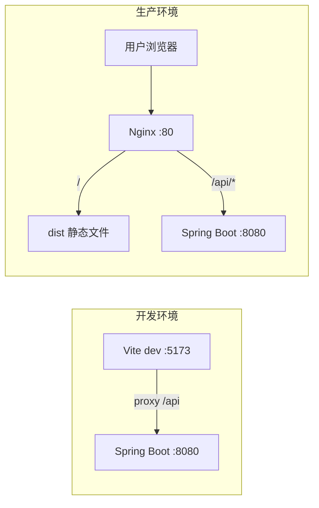
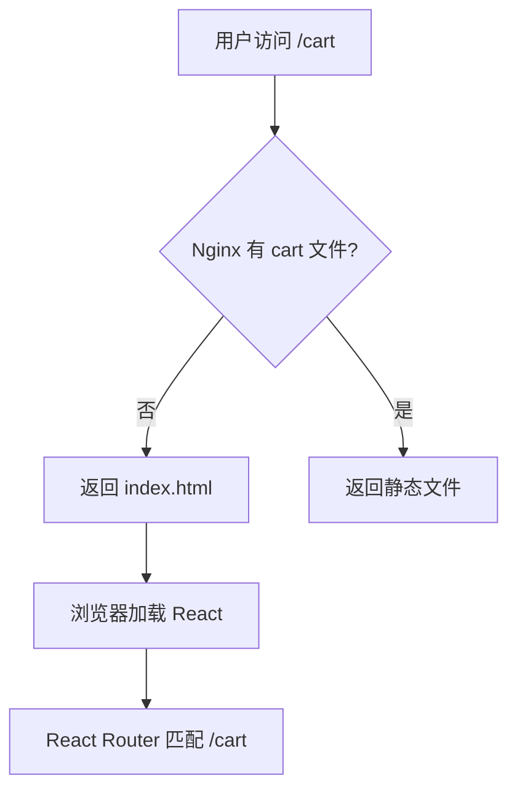

# Vite 构建与项目部署

<!-- 修改说明: 2026-06-30 按 EXPANSION-STANDARD 扩充 §0 导读、DevTools/Network 部署验收、FAQ 12 题、闭卷自测、费曼检验 -->

> **文件编码**：UTF-8。本章在 `shop-react` 项目上演示，请先完成 01～09 章。

## 0. 读前导读（零基础也能跟上）

> **读者假设**：09 章 UI 完善，`npm run dev` 本地正常。本章把开发成果 **build 成 dist**，用 **Nginx** 部署，与 [Java 09 Nginx](../../后端学习/Java/09-LinuxDockerNginx部署基础.md) 衔接。

### 0.1 用一句话弄懂本章

**一句话**：`npm run build` 把 React 源码打成静态文件；Nginx 托管 `dist` 并反代 `/api` 到 Spring Boot——用户通过域名访问，无需 CORS（[计网 06 §11.3](../计算机网络/06-缓存Cookie与会话机制.md)）。

**生活类比**：

| 概念 | 类比 |
|------|------|
| **dev 模式** | 装修中的样板间，随时改随时看 |
| **build** | 工厂打包成可发货的成品箱（dist） |
| **try_files** | 前台：找不到具体房间就带客人回大厅（index.html） |
| **/api 反代** | 同一地址牌下，静态页和后端 API 分工 |

---

### 0.2 你需要提前知道什么

| 水平 | 建议 |
|------|------|
| 08 章 proxy 不熟 | 回 [08 §4](./08-Axios网络请求与前后端联调.md) |
| 06 章 History 路由 | 部署必须 fallback，见 [06 章](./06-React-Router路由管理.md) |
| Linux/Nginx 零基础 | 并行 [Java 09](../../后端学习/Java/09-LinuxDockerNginx部署基础.md) |

**后端衔接**：[Java 04](../../后端学习/Java/04-SpringBoot核心开发.md) 8080 接口；[Java 06 MySQL](../../后端学习/Java/06-MySQL基础索引与事务.md) 生产数据。

---

### 0.3 本章知识地图（☐→☑）

- [ ] 理解 Vite dev vs build 差异
- [ ] 配置 `.env.production`、`vite.config.js` build
- [ ] `npm run build` + `preview` 本地验收
- [ ] Nginx：root + try_files + `/api` proxy_pass
- [ ] Network 验收生产环境无 localhost 硬编码
- [ ] 闭卷自测 ≥ 8/10

---

### 0.4 建议学习时长

| 阶段 | 时间 |
|------|------|
| Vite 原理 + 脚本 §1～§3 | 1 小时 |
| build + env + 优化 §4～§6 | 2 小时 |
| Nginx + Docker §7～§11 | 2.5 小时 |
| 部署验收 + 自测 | 1 小时 |

---

### 0.5 可验证成果

1. `dist/` 生成且 `npm run preview` 可访问。
2. 本地 Nginx 或 preview 下刷新 `/cart` 不 404。
3. Network 里 API 走 `/api`，无 `localhost:8080` 硬编码。
4. 登录→列表→加购流程在生产模式可用。

---

## 本章与上一章的关系

09 章 `shop-react` 在 `npm run dev` 下跑得好好的——页面刷新快、热更新顺手。但 **Vite 开发服务器不能给用户用**：它未压缩、未优化、且通常只监听 localhost。

这一章学 **生产构建与部署**：

1. 理解 Vite 开发模式 vs 生产模式的差异
2. 配置 `vite.config.js`、环境变量、路径别名
3. `npm run build` 生成 `dist` 静态资源
4. 用 Nginx 托管 SPA，并反代 `/api` 到 Spring Boot
5. 可选 Docker 一键部署前后端
6. 打包优化与常见故障排查

对应 [后端 09 章 Linux/Docker/Nginx](../../后端学习/Java/09-LinuxDockerNginx部署基础.md) 的 Nginx 反代——**前后端联调的最后一块拼图**。完成后，用户通过 `http://你的域名/` 访问商城前台，通过同域 `/api` 访问后端，无需 CORS。



---

## 1. Vite 是什么

Vite（法语「快」）是现代前端**构建工具**，React、Vue、Svelte 均可用。React 官方文档推荐用 Vite 或 CRA 创建项目；**新项目首选 Vite**。

### 1.1 开发模式（`npm run dev`）

- 利用浏览器原生 **ES Module**，源码不预先打包
- 依赖用 **esbuild** 预构建（极快）
- 修改文件 → **HMR** 热更新，React 借助 `@vitejs/plugin-react` 的 Fast Refresh
- 启动时间：**秒级**（Webpack 大项目可能分钟级）

### 1.2 生产模式（`npm run build`）

- 使用 **Rollup** 打包、Tree-shaking、代码分割
- 输出静态文件：`index.html` + `assets/*.js` + `assets/*.css`
- 文件名带 **content hash**（利于 CDN 缓存）
- 默认 esbuild minify

### 1.3 与 Webpack / CRA 对比（面试口述）

| 维度 | Vite | Create React App (Webpack) |
|------|------|----------------------------|
| 开发启动 | ESM 按需加载，快 | 全量打包后启动，慢 |
| 热更新 | Fast Refresh，精确到模块 | 可能较慢 |
| 生产打包 | Rollup | Webpack |
| 维护状态 | 活跃，生态主流 | 官方已不推荐新项目 |
| React 配置 | `@vitejs/plugin-react` | react-scripts 黑盒 |

---

## 2. 项目脚本与产物结构

`package.json` 典型脚本：

```json
{
  "scripts": {
    "dev": "vite",
    "build": "vite build",
    "preview": "vite preview",
    "lint": "eslint . --ext js,jsx"
  }
}
```

| 命令 | 作用 | 典型场景 |
|------|------|----------|
| `npm run dev` | 启动开发服务器 | 日常开发 |
| `npm run build` | 生产构建 → `dist/` | 上线前 |
| `npm run preview` | 本地预览 dist | 验证 build 结果 |

### 2.1 生产构建手把手步骤表

| 步骤 | 你的动作 | 预期看到什么 | 若不对 |
|------|----------|--------------|--------|
| 1 | 确认 `.env.production` 为 `/api` | 无 localhost:8080 | 硬编码 baseURL |
| 2 | `npm run build` | dist/ 生成，无 error | TS/语法错 |
| 3 | `npm run preview` | 4173 可访问 | 端口占用 |
| 4 | preview 下登录+列表 | 功能与 dev 一致 | env 未 VITE_ 前缀 |
| 5 | 刷新 `/products/1` | 不 404（preview 自带 SPA） | 路由 mode 错 |
| 6 | Network 看 API | 请求 `/api/*` 非绝对 8080 | baseURL 错 |
| 7 | 配置 Nginx try_files | 生产刷新子路由正常 | 缺 fallback |

### 2.2 Nginx 配置逐行读（SPA + API 反代）

| 行号/指令 | 含义 | 改错会怎样 |
|-----------|------|------------|
| `listen 80` | HTTP 端口 | 与防火墙/域名解析不一致 |
| `root /usr/share/nginx/html` | dist 静态根目录 | 指错目录白屏 |
| `index index.html` | 默认入口 | 缺则目录访问 403 |
| `location / { try_files $uri $uri/ /index.html; }` | SPA fallback | 缺则刷新子路由 404 |
| `location /api { proxy_pass http://127.0.0.1:8080; }` | API 反代 [Java 04](../../后端学习/Java/04-SpringBoot核心开发.md) | 路径重复 /api/api |
| `proxy_set_header Host $host` | 传递原始 Host | 后端虚拟主机错 |
| 同域部署 | 浏览器无跨域 | 见 [计网 06 §11.3](../计算机网络/06-缓存Cookie与会话机制.md) |

**build 成功后 dist 结构**：

```text
dist/
├── index.html                 # 入口 HTML，引用 hashed JS/CSS
├── favicon.ico
└── assets/
    ├── index-a1b2c3d4.js      # 主包 + 路由 chunk
    ├── index-e5f6g7h8.css
    ├── ProductList-i9j0k1l2.js  # 懒加载路由 chunk（若配置了）
    └── ...
```

---

## 3. vite.config.js 完整配置详解

在 `shop-react` 根目录创建或完善 `vite.config.js`：

```js
import { fileURLToPath, URL } from 'node:url'
import { defineConfig, loadEnv } from 'vite'
import react from '@vitejs/plugin-react'

// https://vitejs.dev/config/
export default defineConfig(({ command, mode }) => {
  const env = loadEnv(mode, process.cwd(), '')
  const isDev = command === 'serve'

  return {
    base: env.VITE_BASE_URL || '/',

    plugins: [react()],

    resolve: {
      alias: {
        '@': fileURLToPath(new URL('./src', import.meta.url)),
      },
    },

    server: {
      host: '0.0.0.0',
      port: 5173,
      open: true,
      proxy: {
        '/api': {
          target: env.VITE_API_PROXY_TARGET || 'http://localhost:8080',
          changeOrigin: true,
        },
      },
    },

    preview: {
      port: 4173,
      proxy: {
        '/api': {
          target: 'http://localhost:8080',
          changeOrigin: true,
        },
      },
    },

    build: {
      outDir: 'dist',
      assetsDir: 'assets',
      sourcemap: false,
      chunkSizeWarningLimit: 800,
      rollupOptions: {
        output: {
          manualChunks: {
            react: ['react', 'react-dom', 'react-router-dom'],
            antd: ['antd', '@ant-design/icons'],
            vendor: ['axios', 'zustand'],
          },
        },
      },
    },

    css: {
      devSourcemap: true,
    },
  }
})
```

### 3.1 配置项说明

| 配置 | 含义 | 常见坑 |
|------|------|--------|
| `base` | 静态资源公共路径 | 子目录部署忘改 → 白屏 |
| `resolve.alias` | `@` → `src` | 需配合 jsconfig paths |
| `server.proxy` | 开发环境跨域 | 只 dev 有效，生产靠 Nginx |
| `build.outDir` | 输出目录 | 默认 dist |
| `manualChunks` | 分包策略 | 避免单 js 过大 |
| `plugins: [react()]` | React Fast Refresh | 勿与旧版 react-refresh 插件混用 |

### 3.2 jsconfig.json（配合 @ 别名）

```json
{
  "compilerOptions": {
    "baseUrl": ".",
    "paths": {
      "@/*": ["src/*"]
    },
    "jsx": "react-jsx"
  },
  "include": ["src"],
  "exclude": ["node_modules", "dist"]
}
```

TypeScript 项目用 `tsconfig.json` 同样配置 `paths`。

---

## 4. 环境变量体系

Vite 使用 **dotenv** 加载 `.env*` 文件。规则：

1. 只有 **`VITE_` 前缀** 的变量会暴露给客户端（`import.meta.env`）
2. 不要在前端 env 里放密钥（任何人能在打包 js 里看到）
3. `mode` 决定加载哪个文件

### 4.1 文件优先级（高 → 低）

```text
.env                # 所有模式
.env.local          # 所有模式，git 忽略
.env.[mode]         # 指定模式，如 .env.production
.env.[mode].local   # 指定模式，本地覆盖
```

### 4.2 shop-react 推荐 env 文件

**.env**（公共默认值）：

```env
VITE_APP_TITLE=Shop React 商城
```

**.env.development**：

```env
VITE_API_BASE_URL=/api
VITE_API_PROXY_TARGET=http://localhost:8080
VITE_BASE_URL=/
```

**.env.production**：

```env
VITE_API_BASE_URL=/api
VITE_BASE_URL=/
```

**.env.staging**（可选预发）：

```env
VITE_API_BASE_URL=https://staging.example.com/api
VITE_BASE_URL=/
```

### 4.3 在代码中使用

```js
// src/api/request.js
import axios from 'axios'

const request = axios.create({
  baseURL: import.meta.env.VITE_API_BASE_URL,
  timeout: 15000,
})

console.log(import.meta.env.MODE)           // development | production
console.log(import.meta.env.PROD)           // boolean
console.log(import.meta.env.VITE_APP_TITLE)
```

### 4.4 页面标题动态设置

```jsx
// src/App.jsx
import { useEffect } from 'react'

useEffect(() => {
  document.title = import.meta.env.VITE_APP_TITLE || 'shop-react'
}, [])
```

### 4.5 多环境 build 命令

```json
{
  "scripts": {
    "build": "vite build",
    "build:staging": "vite build --mode staging"
  }
}
```

---

## 5. base 路径与子目录部署

### 5.1 根路径部署（最常见）

```js
export default defineConfig({
  base: '/',
})
```

Nginx：

```nginx
location / {
    root /usr/share/nginx/html/shop;
    try_files $uri $uri/ /index.html;
}
```

### 5.2 子路径部署（如 https://example.com/shop/）

```js
export default defineConfig({
  base: '/shop/',
})
```

```env
# .env.production
VITE_BASE_URL=/shop/
```

Nginx：

```nginx
location /shop/ {
    alias /usr/share/nginx/html/shop/;
    try_files $uri $uri/ /shop/index.html;
}
```

**React Router** 需同步：

```jsx
import { BrowserRouter } from 'react-router-dom'

<BrowserRouter basename={import.meta.env.BASE_URL}>
  <App />
</BrowserRouter>
```

> `import.meta.env.BASE_URL` 由 Vite 根据 `base` 配置自动注入，与 `VITE_BASE_URL` 保持一致即可。

---

## 6. 生产构建流程

### 6.1 标准步骤

```bash
# 1. 安装依赖（CI 或首次）
npm ci

# 2. 生产构建
npm run build

# 预期终端输出：
# vite v5.x.x building for production...
# ✓ 256 modules transformed.
# dist/index.html                   0.48 kB
# dist/assets/index-xxxxx.js      180.00 kB │ gzip: 62 kB
# dist/assets/antd-xxxxx.js       320.00 kB │ gzip: 98 kB
# ✓ built in 6.12s
```

### 6.2 本地预览 dist

```bash
npm run preview
# ➜  Local:   http://localhost:4173/
```

**注意**：preview 不会自动帮你配后端。若页面要调接口：

- preview 的 proxy 已在 vite.config 配置，或
- 手动起 Nginx 反代，或
- 临时改 `.env.production` 指向可访问的后端（不推荐提交）

### 6.3 build 前检查清单

- [ ] `.env.production` 中 `VITE_API_BASE_URL` 正确
- [ ] 无 `console.log` 敏感信息（可选 eslint 规则）
- [ ] `BrowserRouter` 使用 `basename={import.meta.env.BASE_URL}`
- [ ] 图片大文件是否放 `public/` 或 CDN
- [ ] `npm run build` 无 ERROR（WARN 可暂时忽略）
- [ ] 路由懒加载 `React.lazy` 无拼写错误

---

## 7. React 路由懒加载与代码分割

```jsx
import { lazy, Suspense } from 'react'
import { Spin } from 'antd'

const ProductListPage = lazy(() => import('@/pages/ProductListPage'))
const CartPage = lazy(() => import('@/pages/CartPage'))

function AppRouter() {
  return (
    <Suspense fallback={<div style={{ textAlign: 'center', padding: 48 }}><Spin size="large" /></div>}>
      <Routes>
        <Route path="/products" element={<ProductListPage />} />
        <Route path="/cart" element={<CartPage />} />
      </Routes>
    </Suspense>
  )
}
```

Vite 自动为每个 `import()` 生成独立 chunk，配合 `manualChunks` 进一步优化缓存。

---

## 8. Nginx 部署前端（详细）

### 8.1 上传 dist

```bash
# 本地打包后上传到服务器
scp -r dist/* user@your-server:/usr/share/nginx/html/shop/
```

或使用 CI/CD 在服务器上 `git pull && npm ci && npm run build`。

### 8.2 完整 Nginx 配置（前后端同机）

```nginx
# /etc/nginx/conf.d/shop.conf

upstream spring_boot {
    server 127.0.0.1:8080;
    keepalive 32;
}

server {
    listen 80;
    server_name localhost;

    gzip on;
    gzip_types text/plain text/css application/json application/javascript text/xml;
    gzip_min_length 1024;

    # React 静态资源
    location / {
        root /usr/share/nginx/html/shop;
        index index.html;
        try_files $uri $uri/ /index.html;
    }

    # 静态资源强缓存（带 hash 的文件）
    location /assets/ {
        root /usr/share/nginx/html/shop;
        expires 1y;
        add_header Cache-Control "public, immutable";
    }

    # API 反代到 Spring Boot
    location /api/ {
        proxy_pass http://spring_boot;
        proxy_http_version 1.1;
        proxy_set_header Host $host;
        proxy_set_header X-Real-IP $remote_addr;
        proxy_set_header X-Forwarded-For $proxy_add_x_forwarded_for;
        proxy_set_header X-Forwarded-Proto $scheme;
        proxy_connect_timeout 60s;
        proxy_read_timeout 60s;
    }

    location /nginx-health {
        return 200 'ok';
        add_header Content-Type text/plain;
    }
}
```

### 8.3 为什么需要 try_files（SPA fallback）

SPA 只有物理文件 `index.html`，路由如 `/products/1` **没有** `products/1.html`。

用户 **刷新** 或直接访问 `/cart` 时，Nginx 会按路径找文件 → 404。  
`try_files $uri $uri/ /index.html` 表示：找不到就 fallback 到 `index.html`，由 **React Router** 在浏览器里解析路由。



### 8.4 HTTPS（生产建议）

```nginx
server {
    listen 443 ssl http2;
    server_name yourdomain.com;

    ssl_certificate     /etc/nginx/ssl/fullchain.pem;
    ssl_certificate_key /etc/nginx/ssl/privkey.pem;

    # ... 同上 location / 和 /api/
}

server {
    listen 80;
    server_name yourdomain.com;
    return 301 https://$host$request_uri;
}
```

### 8.5 验证与重载

```bash
nginx -t
nginx -s reload
```

浏览器访问 `http://服务器IP/`，F12 → Network：

- `index.html` 200
- `assets/*.js` 200
- 登录后 `/api/login` 200（同域）

---

## 9. Docker 部署方案

### 9.1 仅前端 Docker（Nginx 托管 dist）

**Dockerfile**（放在 shop-react 根目录）：

```dockerfile
# 阶段 1：构建
FROM node:20-alpine AS builder
WORKDIR /app
COPY package*.json ./
RUN npm ci
COPY . .
RUN npm run build

# 阶段 2：运行
FROM nginx:1.25-alpine
COPY --from=builder /app/dist /usr/share/nginx/html
COPY nginx/default.conf /etc/nginx/conf.d/default.conf
EXPOSE 80
CMD ["nginx", "-g", "daemon off;"]
```

**nginx/default.conf**：

```nginx
server {
    listen 80;
    server_name localhost;
    root /usr/share/nginx/html;
    index index.html;

    location / {
        try_files $uri $uri/ /index.html;
    }

    location /api/ {
        proxy_pass http://backend:8080;
        proxy_set_header Host $host;
        proxy_set_header X-Real-IP $remote_addr;
    }
}
```

### 9.2 docker-compose 前后端一起（推荐）

```yaml
# docker-compose.yml
version: '3.8'

services:
  mysql:
    image: mysql:8.0
    environment:
      MYSQL_ROOT_PASSWORD: 123456
      MYSQL_DATABASE: study_db
    ports:
      - "3306:3306"
    volumes:
      - mysql_data:/var/lib/mysql

  redis:
    image: redis:7-alpine
    ports:
      - "6379:6379"

  backend:
    build: ./demo
    container_name: shop-backend
    ports:
      - "8080:8080"
    depends_on:
      - mysql
      - redis
    environment:
      SPRING_PROFILES_ACTIVE: prod

  frontend:
    build: ./shop-react
    container_name: shop-frontend
    ports:
      - "80:80"
    depends_on:
      - backend

volumes:
  mysql_data:
```

**构建与启动**：

```bash
docker compose build
docker compose up -d
docker compose ps
```

访问 `http://localhost/` 应看到 React 商城，接口走同域 `/api`。

### 9.3 .dockerignore

```text
node_modules
dist
.git
*.md
.env.local
```

减小构建上下文，加快 `docker build`。

---

## 10. CI/CD 简要（GitHub Actions 示例）

**.github/workflows/deploy.yml`**：

```yaml
name: Deploy shop-react

on:
  push:
    branches: [main]

jobs:
  build:
    runs-on: ubuntu-latest
    steps:
      - uses: actions/checkout@v4
      - uses: actions/setup-node@v4
        with:
          node-version: '20'
          cache: 'npm'
      - run: npm ci
      - run: npm run build
      - name: Upload dist
        uses: actions/upload-artifact@v4
        with:
          name: dist
          path: dist/
```

产物 `dist` 可再由后续 job SCP 到服务器或推送到 OSS/CDN。

---

## 11. 打包分析与优化

### 11.1 可视化分析

```bash
npm install -D rollup-plugin-visualizer
```

```js
// vite.config.js
import { visualizer } from 'rollup-plugin-visualizer'

plugins: [
  react(),
  visualizer({ open: true, gzipSize: true }),
],
```

打开 `stats.html` 查看 antd、react 各占多少体积。

### 11.2 优化手段

| 手段 | 效果 |
|------|------|
| 路由懒加载 | 减小首屏 js |
| `manualChunks` | 利用浏览器缓存 |
| 图片压缩 / WebP | 减小 assets |
| CDN 加载 react（不推荐初学） | 减小自建包 |
| 按需 import antd 组件 | tree-shaking |

### 11.3 antd 体积说明

Ant Design 完整打包后 chunk 较大（~300KB+ gzip 前），对商城后台可接受。若极致优化可考虑：

- 只 import 用到的组件
- 使用 `babel-plugin-import`（antd 5 通常不需要）
- 评估 Arco / 更轻的组件库（面试项目不必过度优化）

---

## 12. 环境差异排查表

| 现象 | 开发正常，生产异常 | 排查 |
|------|-------------------|------|
| 接口 404 | baseURL 错误 | `.env.production` |
| 白屏 | base 路径错 | `base` + Router basename |
| 刷新 404 | 无 SPA fallback | Nginx try_files |
| 样式丢失 | 资源路径错 | Network 看 assets 是否 404 |
| 跨域 | 生产未同域 | 应走 Nginx /api 反代 |
| 环境变量 undefined | 未 VITE_ 前缀 | 改名并 rebuild |

---

## 13. public 目录与静态资源

```text
public/
├── favicon.ico      # 原样复制到 dist 根目录
└── logo.png         # 引用：/logo.png（不走打包 hash）
```

```jsx

```

`src/assets/` 下的资源会被打包并带 hash，适合组件内 import。

---

## 14. 与 Vue 10 章对照

| 维度 | shop-vue | shop-react |
|------|----------|------------|
| 插件 | `@vitejs/plugin-vue` | `@vitejs/plugin-react` |
| 路由 base | `createWebHistory(BASE_URL)` | `BrowserRouter basename` |
| manualChunks | vue + element-plus | react + antd |
| 其余 | proxy、env、Nginx、Docker **相同** | 相同 |

---

## 15. 面试常问

**Q：Vite 为什么开发快？**  
开发用原生 ESM，浏览器按需请求模块；依赖预构建用 esbuild；生产才 Rollup 打包。

**Q：SPA 为什么刷新 404？**  
服务器按 URL 路径找物理文件，/cart 无对应文件；需 fallback 到 index.html 交给前端路由。

**Q：开发 proxy 和生产 Nginx 反代有什么区别？**  
都是把 `/api` 转到后端；proxy 是 Vite 开发服务器做的，Nginx 是生产环境做的，代码里 baseURL 都写 `/api` 即可。

**Q：build 后还能改 env 吗？**  
`VITE_*` 在 build 时打入 js，**不能**像后端那样改配置文件生效，需重新 build。

**Q：build 后还能改 env 吗？**  
`VITE_*` 在 build 时打入 js，**不能**像后端那样改配置文件生效，需重新 build。

---

## 16. 常见报错与排查

| 现象 | 开发正常，生产异常 | 排查 |
|------|-------------------|------|
| 接口 404 | baseURL 错误 | `.env.production` |
| 白屏 | base 路径错 | `base` + Router basename |
| 刷新 404 | 无 SPA fallback | Nginx try_files |
| 样式丢失 | 资源路径错 | Network 看 assets 是否 404 |
| 跨域 | 生产未同域 | 应走 Nginx /api 反代（[计网 06 §11.3](../计算机网络/06-缓存Cookie与会话机制.md)） |
| 环境变量 undefined | 未 VITE_ 前缀 | 改名并 rebuild |

---

## 17. 常见问题 FAQ

### Q1：Vite 为什么比 Webpack 开发快？

开发用原生 ESM 按需加载；依赖预构建用 esbuild；生产才 Rollup 打包。

### Q2：SPA 为什么刷新 404？

服务器按 URL 路径找物理文件，`/cart` 无对应文件；需 `try_files $uri $uri/ /index.html` 交给 React Router。

### Q3：开发 proxy 和生产 Nginx 反代有什么区别？

都是把 `/api` 转到后端；proxy 是 Vite 开发服务器做的，Nginx 是生产环境做的，代码里 baseURL 都写 `/api` 即可。

### Q4：manualChunks 拆 react 和 antd 有什么好处？

浏览器可分别缓存；升级业务代码时用户不必重下 react/antd 大包。

### Q5：Docker 多阶段构建为何用 nginx:alpine 做最终镜像？

只含 dist 静态文件，体积小；不含 Node 运行时。

### Q6：子路径部署 `base: '/shop/'` 要注意什么？

vite.config `base`、Router `basename`、Nginx location 三者一致。

### Q7：preview 和 dev 有何不同？

preview 服务的是 build 后的 dist，接近生产；无 HMR。

### Q8：生产还需要 [Java 04 CorsConfig](../../后端学习/Java/04-SpringBoot核心开发.md) 吗？

同域 Nginx 反代时浏览器无跨域，CORS 可收紧；前后端不同域时仍需 CORS（[计网 06](../计算机网络/06-缓存Cookie与会话机制.md)）。

### Q9：dist 里 JS 文件名为何带 hash？

内容变则 hash 变，CDN 可长期缓存未变文件。

### Q10：GitHub Actions 部署前端典型步骤？

checkout → npm ci → npm run build → scp/rsync dist 或 docker build push。

### Q11：visualizer 插件看什么？

antd、react 各占多少 KB；决定是否 lazy 路由或按需优化。

### Q12：10 章完成后下一步？

[11-React项目实战与面试准备](./11-React项目实战与面试准备.md) 把 shop-react 串成可演示 MVP。

---

## 18. 闭卷自测

1. Vite dev 和 build 分别用什么打包/加载策略？
2. `VITE_` 前缀环境变量何时注入？
3. Nginx `try_files` 在 SPA 中的作用？
4. 生产环境为何推荐 `/api` 同域反代而非 CORS？
5. `manualChunks` 解决什么问题？
6. Docker 多阶段构建第一阶段和第二阶段各做什么？
7. 刷新 `/products/1` 404 的根因与修复？
8. **动手**：`npm run build` 后 dist 目录有 index.html 和 assets/*.js。
9. **动手**：`npm run preview` 访问与 dev 功能一致。
10. **综合**：画 dev（proxy）vs 生产（Nginx）请求路径对比图。

### 18.1 自测参考答案

1. dev：ESM + esbuild 预构建；build：Rollup 打包 + minify。
2. `npm run build` / `npm run dev` 启动时读 .env，打入 import.meta.env。
3. 找不到物理文件时 fallback 到 index.html，由前端路由接管。
4. 同域无跨域，Cookie/凭证更简单（[计网 06 §11.3](../计算机网络/06-缓存Cookie与会话机制.md)）。
5. 拆分 vendor chunk，利用浏览器缓存。
6. 第一阶段 node 镜像 npm build；第二阶段 nginx 镜像只 COPY dist。
7. History 模式无物理路径；加 try_files 或改 hash 路由。
8. 终端 build 成功，ls dist 可见结构。
9. preview 端口（通常 4173）可登录浏览商品。
10. dev：5173→proxy→8080；生产：用户→Nginx:80→静态或 proxy_pass 8080。

---

## 19. 费曼检验

3 分钟解释部署：

1. **打包（build）**：把 JSX 编译成浏览器能跑的 JS/CSS，放进 dist 箱子。
2. **托管（Nginx）**：用户访问域名，Nginx 发静态文件；`/api` 转给 [Java 04](../../后端学习/Java/04-SpringBoot核心开发.md) 后端。
3. **fallback（try_files）**：刷新任意路由都回 index.html，React Router 在浏览器里换页。

---

## 练习建议

1. **构建**：执行 `npm run build` + `npm run preview`，确认页面与 dev 一致
2. **分析**：安装 visualizer，截图 antd chunk 占比写入 README
3. **Nginx**：本地或虚拟机配置 try_files，验证 `/products` 刷新不 404
4. **Docker**：编写 Dockerfile， `docker build` 成功并浏览器访问
5. **子路径**：试 `base: '/shop/'` + Router basename，理解资源路径
6. **CI**：创建 GitHub Actions workflow，push 自动 build

---

## 学完标准

- [ ] 能解释 Vite dev 与 build 的技术差异
- [ ] 正确配置 `.env.development` / `.env.production` 与 `vite.config.js`
- [ ] `npm run build` 成功，dist 目录结构清晰
- [ ] 能写出含 `try_files` 和 `/api` 反代的 Nginx 配置
- [ ] 理解 SPA fallback 原理，能口述给面试官
- [ ] 能完成多阶段 Dockerfile 构建 shop-react
- [ ] 配置 `manualChunks` 分离 react 与 antd
- [ ] 知道生产环境接口应同域，避免 CORS

---

**下一章**：[11-React项目实战与面试准备](./11-React项目实战与面试准备.md) — shop-react MVP 规格、API 清单、四周计划、简历与面试话术。
