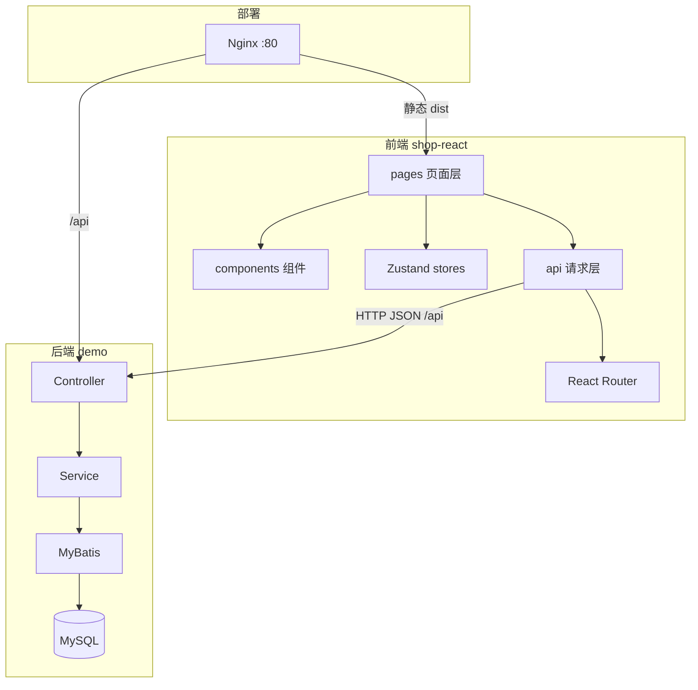
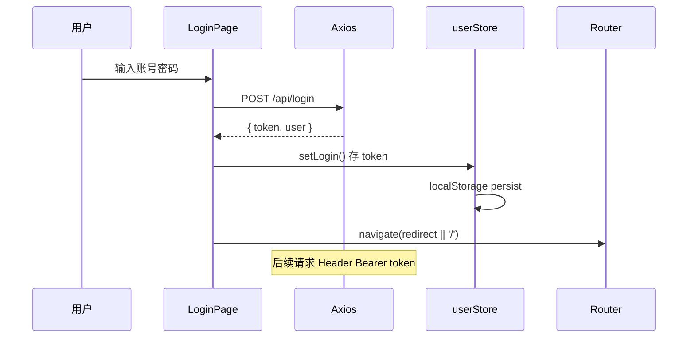
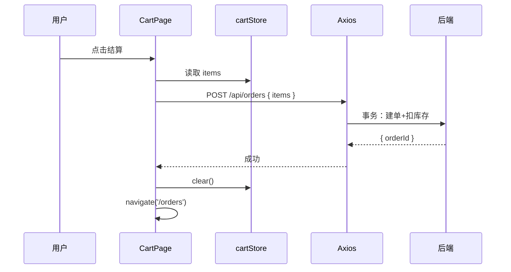
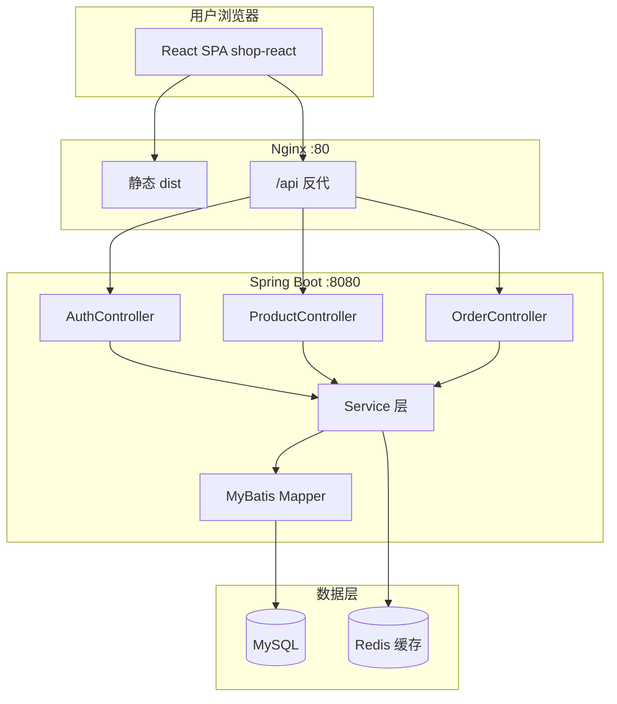

# React 项目实战与面试准备

> **文件编码**：UTF-8。本章假设你已完成 01～10 章，拥有可运行的 `shop-react` 骨架。

---

## 本章与上一章的关系

01～10 章你把 React 技术栈都过了一遍——但知识还是「点状」的：02 写列表、06 配路由、07 建 store、08 调接口，每一章各自为战。

这一章就是 **总装车间**：把 `shop-react` 串成能写进简历、面试能讲 **20 分钟** 的**商城前台 MVP**，并与 Spring Boot 后端配套演示。11 章不要求大量新语法，而是要求你 **串起来、做出来、讲清楚**。



---

## 1. 为什么最后一定要落到项目

你学 React、Router、Zustand、Axios，不是为了背 API，而是为了 **做项目**。

没有项目，你会：

- 知识点散，不知道状态放 Zustand 还是 props
- 面试讲「用过 React」，追问购物车怎么设计就卡住
- 简历空泛，HR 筛不过

**一个能演示的 shop-react + 能对接的后端**，是初级前端/全栈岗位的核心筹码。

---

## 2. 项目定位：shop-react 商城前台

**类型**：C 端简易电商前台（用户浏览、加购、下单）  
**用户角色**：普通用户（不含复杂商家后台）  
**数据**：真实 MySQL 接口（非纯 mock）；初学阶段可用 04 章 demo 的 `/api/users` 模拟商品

### 2.1 功能范围（MVP 必做 vs 可选）

| 模块 | MVP 必做 | 可选加分 |
|------|----------|----------|
| 用户 | 注册、登录、退出、个人信息展示 | 修改头像、忘记密码 |
| 商品 | 列表分页、详情、关键词搜索 | 分类筛选、排序 |
| 购物车 | 加购、改数量、删除、算总价 | 持久化到服务端 |
| 订单 | 提交订单、订单列表、订单详情 | 取消订单、模拟支付 |
| 工程 | 路由守卫、Axios 拦截、Loading | 骨架屏、Error Boundary |

### 2.2 技术栈清单

| 层次 | 技术 | 版本建议 |
|------|------|----------|
| 框架 | React | 18.3+ |
| 构建 | Vite | 5.x |
| 路由 | React Router | 6.x |
| 状态 | Zustand | 4.x |
| HTTP | Axios | 1.x |
| UI | Ant Design | 5.x |
| 后端 | Spring Boot + MyBatis | 见后端 04～10 |
| 部署 | Nginx +（可选）Docker | 见 10 章 |

---

## 3. 完整 MVP 需求规格说明（PRD 简版）

### 3.1 用户故事

1. **访客** 打开首页，看到推荐商品与入口
2. **访客** 浏览商品列表，搜索商品名，点进详情
3. **用户** 注册账号并登录
4. **登录用户** 将商品加入购物车，修改数量
5. **登录用户** 在购物车提交订单，看到订单列表
6. **未登录用户** 访问购物车/下单时，跳转登录页，登录后回跳

### 3.2 页面清单

| 路由 | 页面 | 组件要点 |
|------|------|----------|
| `/` | HomePage | 轮播/横幅、热门商品卡片 |
| `/login` | LoginPage | Ant Design Form 校验 |
| `/register` | RegisterPage | 二次确认密码 |
| `/products` | ProductListPage | Table 或卡片 grid、分页、搜索 |
| `/products/:id` | ProductDetailPage | 详情、库存、加购按钮 |
| `/cart` | CartPage | 表格、数量步进器、结算 |
| `/orders` | OrderListPage | 订单表格、状态标签 |
| `/orders/:id` | OrderDetailPage | 明细行、金额汇总 |

### 3.3 非功能需求

- 首屏加载：路由 `React.lazy` 懒加载
- 接口超时：15s，超时 message 提示
- 401：清 token，跳 `/login?redirect=`
- 移动端：PC 优先，Ant Design 栅格基本响应式（可选）

---

## 4. 推荐目录结构（完整版）

```text
shop-react/
├── public/
│   └── favicon.ico
├── nginx/
│   └── default.conf          # Docker 用
├── src/
│   ├── api/
│   │   ├── request.js        # Axios 实例 + 拦截器
│   │   ├── auth.js           # login / register / profile
│   │   ├── product.js        # list / detail / search
│   │   └── order.js          # create / list / detail
│   ├── assets/
│   │   └── styles/
│   │       └── global.css
│   ├── components/
│   │   ├── layout/
│   │   │   └── AppLayout.jsx
│   │   ├── product/
│   │   │   ├── ProductCard.jsx
│   │   │   └── ProductSearch.jsx
│   │   └── common/
│   │       ├── PageLoading.jsx
│   │       └── EmptyState.jsx
│   ├── hooks/
│   │   ├── useRequest.js
│   │   └── useAuth.js
│   ├── layouts/
│   │   └── AppLayout.jsx
│   ├── pages/
│   │   ├── HomePage.jsx
│   │   ├── LoginPage.jsx
│   │   ├── RegisterPage.jsx
│   │   ├── ProductListPage.jsx
│   │   ├── ProductDetailPage.jsx
│   │   ├── CartPage.jsx
│   │   ├── OrderListPage.jsx
│   │   └── OrderDetailPage.jsx
│   ├── router/
│   │   ├── index.jsx
│   │   └── ProtectedRoute.jsx
│   ├── stores/
│   │   ├── userStore.js
│   │   └── cartStore.js
│   ├── utils/
│   │   ├── productAdapter.js
│   │   └── format.js         # 价格格式化
│   ├── App.jsx
│   └── main.jsx
├── .env.development
├── .env.production
├── vite.config.js
├── Dockerfile
├── package.json
├── README.md
└── docs/
    └── API.md                # 接口对照表（可选）
```

---

## 5. 核心代码骨架（面试能讲）

### 5.1 Axios 封装 request.js

```js
import axios from 'axios'
import { message } from 'antd'
import { useUserStore } from '@/stores/userStore'

let navigateFn = null
export function setNavigate(navigate) {
  navigateFn = navigate
}

const request = axios.create({
  baseURL: import.meta.env.VITE_API_BASE_URL,
  timeout: 15000,
})

request.interceptors.request.use((config) => {
  const token = useUserStore.getState().token
  if (token) {
    config.headers.Authorization = `Bearer ${token}`
  }
  return config
})

request.interceptors.response.use(
  (response) => {
    const res = response.data
    if (res.code !== 0) {
      return Promise.reject(new Error(res.message || '请求失败'))
    }
    return res.data
  },
  (error) => {
    if (error.response?.status === 401) {
      useUserStore.getState().logout()
      const redirect = window.location.pathname
      navigateFn?.(`/login?redirect=${encodeURIComponent(redirect)}`)
    }
    message.error(error.message || '网络异常')
    return Promise.reject(error)
  }
)

export default request
```

### 5.2 userStore

```js
import { create } from 'zustand'
import { persist } from 'zustand/middleware'
import { login as loginApi } from '@/api/auth'

export const useUserStore = create(
  persist(
    (set, get) => ({
      token: '',
      userInfo: null,

      get isLoggedIn() {
        return !!get().token
      },

      async login(form) {
        const data = await loginApi(form)
        set({
          token: data.token,
          userInfo: data.user || { username: form.username },
        })
      },

      logout() {
        set({ token: '', userInfo: null })
      },

      setLogin: ({ token, username }) =>
        set({ token, userInfo: { username } }),
    }),
    { name: 'shop-user' }
  )
)
```

### 5.3 cartStore

```js
import { create } from 'zustand'

export const useCartStore = create((set, get) => ({
  items: [],

  addItem(product, qty = 1) {
    set((state) => {
      const exist = state.items.find((i) => i.id === product.id)
      if (exist) {
        return {
          items: state.items.map((i) =>
            i.id === product.id
              ? { ...i, qty: Math.min(i.qty + qty, product.stock || 99) }
              : i
          ),
        }
      }
      return { items: [...state.items, { ...product, qty }] }
    })
  },

  removeItem(id) {
    set((state) => ({
      items: state.items.filter((i) => i.id !== id),
    }))
  },

  updateQty(id, qty) {
    set((state) => ({
      items: state.items.map((i) =>
        i.id === id ? { ...i, qty: Math.max(1, qty) } : i
      ),
    }))
  },

  clear() {
    set({ items: [] })
  },
}))

// 选择器（在组件中使用）
export const selectCartCount = (s) =>
  s.items.reduce((sum, i) => sum + i.qty, 0)

export const selectCartTotal = (s) =>
  s.items.reduce((sum, i) => sum + i.price * i.qty, 0)
```

### 5.4 路由守卫 ProtectedRoute

```jsx
import { Navigate, useLocation } from 'react-router-dom'
import { useUserStore } from '@/stores/userStore'

export default function ProtectedRoute({ children }) {
  const token = useUserStore((s) => s.token)
  const location = useLocation()

  if (!token) {
    return (
      <Navigate
        to={`/login?redirect=${encodeURIComponent(location.pathname)}`}
        replace
      />
    )
  }

  return children
}
```

### 5.5 路由配置（含懒加载）

```jsx
import { lazy, Suspense } from 'react'
import { Routes, Route, Outlet } from 'react-router-dom'
import { Spin } from 'antd'
import AppLayout from '@/layouts/AppLayout'
import ProtectedRoute from './ProtectedRoute'

const HomePage = lazy(() => import('@/pages/HomePage'))
const LoginPage = lazy(() => import('@/pages/LoginPage'))
const ProductListPage = lazy(() => import('@/pages/ProductListPage'))
const CartPage = lazy(() => import('@/pages/CartPage'))

function Lazy({ children }) {
  return (
    <Suspense fallback={<Spin style={{ display: 'block', margin: '48px auto' }} />}>
      {children}
    </Suspense>
  )
}

export default function AppRouter() {
  return (
    <Routes>
      <Route path="/login" element={<Lazy><LoginPage /></Lazy>} />
      <Route path="/" element={<AppLayout><Outlet /></AppLayout>}>
        <Route index element={<Lazy><HomePage /></Lazy>} />
        <Route path="products" element={<Lazy><ProductListPage /></Lazy>} />
        <Route
          path="cart"
          element={
            <ProtectedRoute>
              <Lazy><CartPage /></Lazy>
            </ProtectedRoute>
          }
        />
      </Route>
    </Routes>
  )
}
```

---

## 6. 完整 API 接口清单（前后端契约）

与 [后端 04 章 demo](../../后端学习/Java/04-SpringBoot核心开发.md) 及 [后端 10 章](../../后端学习/Java/10-后端项目实战与面试准备.md) 对齐。统一响应：

```json
{
  "code": 0,
  "message": "success",
  "data": { }
}
```

### 6.1 认证模块

| 接口 | 方法 | 请求体 / 参数 | 响应 data | 前端调用处 |
|------|------|---------------|-----------|------------|
| `/api/register` | POST | `{ username, password, nickname? }` | `{ userId }` | RegisterPage |
| `/api/login` | POST | `{ username, password }` | `{ token, user: { id, username, nickname } }` | LoginPage |
| `/api/user/profile` | GET | Header: Bearer token | `{ id, username, nickname, avatar? }` | AppLayout |
| `/api/logout` | POST | Header: token | null | 退出（可选） |

**初学联调简化版**（04 章 demo）：

| 接口 | 说明 |
|------|------|
| `POST /api/login` | 返回 `{ token }`，admin/123456 |
| `GET /api/users` | 模拟商品列表 |
| `GET /api/users/{id}` | 模拟商品详情 |

### 6.2 商品模块（完整版）

| 接口 | 方法 | 参数 | 响应 data | 前端 |
|------|------|------|-----------|------|
| `/api/products` | GET | `pageNum`, `pageSize`, `keyword?` | `{ list: Product[], total }` | ProductListPage |
| `/api/products/{id}` | GET | path id | `Product` 详情 | ProductDetailPage |
| `/api/products/hot` | GET | `limit=8` | `Product[]` | HomePage |

**Product 字段示例**：

```json
{
  "id": 1,
  "name": "无线鼠标",
  "price": 99.00,
  "stock": 100,
  "description": "...",
  "imageUrl": "/images/mouse.jpg",
  "categoryId": 2
}
```

### 6.3 订单模块

| 接口 | 方法 | 请求 | 响应 | 前端 |
|------|------|------|------|------|
| `/api/orders` | POST | `{ items: [{ productId, quantity }] }` | `{ orderId, orderNo, totalAmount }` | CartPage 结算 |
| `/api/orders` | GET | `pageNum`, `pageSize` | `{ list, total }` | OrderListPage |
| `/api/orders/{id}` | GET | path id | 订单 + 明细行 | OrderDetailPage |
| `/api/orders/{id}/cancel` | PUT | — | null | 可选 |

### 6.4 错误码约定

| code | 含义 | 前端处理 |
|------|------|----------|
| 0 | 成功 | 正常取 data |
| 1+ | 业务失败 | message 展示 message |
| 401 | 未登录 | 拦截器跳登录 |
| 403 | 无权限 | 提示 |
| 500 | 服务器错误 | 提示 + 日志 |

---

## 7. 四周里程碑（Week-by-Week 详细计划）

### Week 1：骨架 + 路由 + 假数据

**目标**：页面能切换，Layout 统一，商品列表用本地 JSON。

| 天 | 任务 | 产出 |
|----|------|------|
| D1 | `npm create vite` 创建 shop-react；装依赖 | 项目跑起来 |
| D2 | AppLayout + React Router 全部路由 | 8 个空页面能跳转 |
| D3 | ProductCard + ProductListPage 假数据 | 列表 UI |
| D4 | ProductDetailPage 假数据 + useParams | `/products/1` |
| D5 | HomePage 热门区 + 样式微调 | W1 验收 |

**验收**：

- [ ] 3 个以上页面可切换，浏览器前进后退正常
- [ ] 详情页 URL 带 id
- [ ] README 写启动命令

### Week 2：Zustand + 登录 + 路由守卫

| 天 | 任务 | 产出 |
|----|------|------|
| D1 | userStore + LoginPage 表单 | 表单校验 |
| D2 | persist 持久化 token | 刷新仍登录 |
| D3 | cartStore 加购/删/算价 | 详情页加购 |
| D4 | ProtectedRoute 保护 /cart | 未登录不进购物车 |
| D5 | 登录 redirect 回跳 | W2 验收 |

**验收**：

- [ ] 未登录访问 `/cart` → `/login?redirect=/cart`
- [ ] 登录后进购物车，加购数量正确

### Week 3：Axios 联调 + Ant Design

| 天 | 任务 | 产出 |
|----|------|------|
| D1 | request.js 拦截器 | 统一 Result |
| D2 | 对接 GET /api/users 或 /api/products | 列表来自后端 |
| D3 | 对接 login + profile | 真实 token |
| D4 | 对接 detail + POST order | 详情与下单 |
| D5 | Ant Design Table 订单列表 | W3 验收 |

**验收**：

- [ ] Network 见 `/api/users` 或 `/api/products` 200
- [ ] 登录后 Header 带 Authorization
- [ ] 下单后订单列表有数据

### Week 4：打磨 + 部署 + 文档 + 面试准备

| 天 | 任务 | 产出 |
|----|------|------|
| D1 | 空状态、错误提示、边界（库存不足） | UX |
| D2 | npm run build + Nginx 或 Docker | 可访问部署版 |
| D3 | README：架构图、接口表、截图 | 文档 |
| D4 | 写 1min / 3min 项目介绍，录音 | 面试稿 |
| D5 | 模拟面试 20 分钟 | W4 验收 |

**验收**：

- [ ] 部署环境完整走通：注册→登录→加购→下单
- [ ] Git 仓库公开或可提供
- [ ] 15 分钟内讲清架构

---

## 8. 业务流程图

### 8.1 登录流程



### 8.2 下单流程



### 8.3 系统架构总览



---

## 9. 与后端 demo 联调指南

### 9.1 最小联调（仅 04 章 demo）

无需 MySQL，使用内存用户列表：

```bash
# 终端 1
cd demo && mvnw spring-boot:run

# 终端 2
cd shop-react && npm run dev

# 终端 3：造数据
curl -X POST http://localhost:8080/api/users \
  -H "Content-Type: application/json" \
  -d "{\"name\":\"React实战教程\",\"age\":79}"
```

前端 `productAdapter.js` 将 UserVO 映射为商品。接口清单见 [08 章](./08-Axios网络请求与前后端联调.md)。

### 9.2 完整联调（后端 05～10 章）

1. 启动 MySQL + 导入表结构
2. Spring Boot 配置 `application.yml` 数据源
3. 实现 ProductController、OrderController
4. 前端替换 `getProductList` 为 `/api/products`
5. 删除 `productAdapter` 或仅作兼容层

### 9.3 后端仓库关联方式

README 中写清：

```markdown
## 后端依赖

- 仓库：[demo-api](https://github.com/你的用户名/demo-api)
- 分支：main
- 最低版本：支持 `/api/login` 与 `/api/products`
- 本地默认：http://localhost:8080
```

面试时能说：**「前端 shop-react 与后端 demo 按 REST 契约联调，统一 Result 结构。」**

---

## 10. 项目亮点（面试怎么说）

不要只说「用了 React」——要说 **解决了什么问题**：

| 亮点 | 问题 | 方案 | 可追问准备 |
|------|------|------|------------|
| Zustand 购物车 | 跨页面共享 cart | cartStore 集中状态 | 为何不用 props 层层传 |
| ProtectedRoute | 未登录访问受保护页 | 包装组件 + Navigate | 与 401 拦截器分工 |
| Axios 拦截器 | 每个请求手写 token | 请求拦截统一 Header | 为何用 getState |
| 环境分离 | 开发/生产 API 不同 | .env + Vite proxy / Nginx | build 后 env 能否改 |
| 路由懒加载 | 首屏 js 过大 | React.lazy + Suspense | 如何分析体积 |
| 与后端联调 | 跨域 | dev proxy + 生产同域 | CORS 原理 |
| Ant Design 工程化 | UI 不统一 | ConfigProvider + 布局组件 | 与 Element Plus 差异 |

---

## 11. 简历描述模板

### 11.1 标准版（可直接改）

```text
【项目名称】shop-react 简易电商前台 | React 18 + Vite + Zustand + Ant Design
【时间】2025.xx - 2025.xx
【项目链接】https://github.com/你的用户名/shop-react
【描述】
- 基于 React 18 函数组件与 Hooks 完成商品浏览、搜索、详情、购物车、订单等核心页面，组件化拆分 ProductCard、AppLayout 等 10+ 组件
- 使用 Zustand 管理用户登录态与购物车，React Router 6 配置 ProtectedRoute 实现未登录拦截与 redirect 回跳
- 封装 Axios 请求/响应拦截器，对接 Spring Boot REST 接口，统一处理 Result 结构与 401 跳转
- Ant Design 5 构建表单校验、表格分页与商城 Layout；Vite 打包后经 Nginx 与后端同域部署
【技术栈】React, Vite, Zustand, React Router, Axios, Ant Design, Nginx
【个人职责】独立负责前端全部模块设计与实现，与后端约定 REST 接口并完成联调
```

### 11.2 精简版（一行项目）

```text
shop-react：React 商城前台，Zustand 购物车 + Router 鉴权 + Axios 对接 Spring Boot，Nginx 部署
```

### 11.3 全栈联合描述（前后端都写）

```text
【全栈练手】简易电商系统
- 前端 shop-react：React 18 + Zustand + Ant Design，完成 C 端购物流程
- 后端 demo-api：Spring Boot + MyBatis + Redis 商品缓存，JWT 登录，下单事务扣库存
- 部署：Docker Compose 起 MySQL/Redis，Nginx 托管前端并反代 /api
```

**原则**：每条 **动词 + 技术 + 效果**，能经得住追问。

---

## 12. 面试话术脚本

### 12.1 自我介绍（1 分钟）

```text
面试官您好，我是 XXX，目前主攻前端 / 全栈方向。系统学习过 HTML/CSS/JS 和 React 生态，
完成了一个名为 shop-react 的电商前台项目。技术栈是 React 18、Vite、Zustand、React Router
和 Ant Design。项目中我负责整体页面结构、状态管理和后端接口联调：用户登录后 token 由 Zustand
配合 persist 持久化，Axios 拦截器通过 getState 统一携带；购物车用 cartStore 跨页面维护；
ProtectedRoute 拦截未登录访问。部署上使用 Vite 打包，Nginx 托管静态资源并反代 API 到 Spring Boot。
希望找前端 / 全栈实习或初级岗位，谢谢。
```

### 12.2 项目介绍（3 分钟）

```text
【背景】这是一个简易 B2C 商城的用户端，配合 Spring Boot 后端，实现从浏览到下单的完整链路。

【架构】前端是标准 SPA：pages 负责页面，components 复用 UI，Zustand 管 user 和 cart 两个 store，
api 层封装 Axios。路由按业务拆分，列表和详情用动态路由传 id，懒加载减小首屏。

【核心流程 1 - 登录】用户提交 Ant Design Form，POST /api/login，后端返回 JWT。前端存 Zustand
和 localStorage，之后请求拦截器自动加 Authorization。401 时清 token 跳登录，并带上 redirect 方便回跳。

【核心流程 2 - 购物车】加购时调 cartStore.addItem，同一商品合并数量。结算时把 items 映射为
{ productId, quantity } POST 创建订单，成功后清空购物车并跳订单列表。

【难点】一个是部署后刷新子路由 404，通过 Nginx try_files 解决；另一个是 React 拦截器里不能
直接 useHook，用 Zustand getState 读 token；开发环境跨域用 Vite proxy，生产同域反代。

【收获】理解了状态该放哪一层、前后端接口契约怎么定、以及 SPA 部署和联调的区别。
```

### 12.3 常见追问应答要点

**Q：为什么用 Zustand 不用 Redux？**  
Zustand API 极简，无 boilerplate，适合 MVP；Redux 适合大型团队协作和规范中间件，初学项目 Zustand 足够。

**Q：Zustand 和 Context 区别？**  
Context 适合低频更新的全局配置；频繁更新的购物车、用户信息用 Zustand 避免全树重渲染，且可在拦截器 getState。

**Q：购物车为什么放前端 store 不每次调后端？**  
MVP 阶段简化，减少接口；生产可同步服务端购物车，登录时 merge 本地与远程。

**Q：怎么防止重复下单？**  
前端：结算按钮 loading + 禁用；后端：幂等键 / 订单号唯一。

**Q：token 存哪？安全吗？**  
localStorage + Zustand persist，方便 SPA；有 XSS 风险，需防注入；HttpOnly Cookie 更安全但跨域复杂。

**Q：React 和 Vue 版本你都做过，怎么选？**  
看团队技术栈；React 函数组件 + Hooks 与 Vue 3 Composition API 思路接近，状态管理分别是 Zustand 和 Pinia。

---

## 13. 前后端联调演示步骤（面试可现场操作）

1. 启动 MySQL：`docker compose up -d mysql`（或后端 09 章 compose）
2. 启动 Spring Boot：`mvn spring-boot:run` 或 IDEA Run（8080）
3. 验证后端：`curl http://localhost:8080/api/users` 或 `/api/products?pageNum=1&pageSize=10`
4. 启动前端：`cd shop-react && npm run dev`（5173）
5. 浏览器：注册 → 登录 → 商品列表 → 详情加购 → 购物车 → 下单 → 订单列表
6. DevTools → Network：检查 `/api/login`、Authorization Header、响应 code

**生产演示**：Nginx 80 端口同样流程。

**仅 demo 版演示**：只需 Spring Boot 04 章 + shop-react，用 users 模拟商品。

---

## 14. README 模板（复制到仓库）

```markdown
# shop-react

简易电商前台，React 18 + Vite + Zustand + Ant Design。

## 功能

- 用户注册 / 登录
- 商品列表、搜索、详情
- 购物车、提交订单、订单列表

## 技术栈

React 18, Vite, React Router 6, Zustand, Axios, Ant Design 5

## 本地启动

\`\`\`bash
npm install
npm run dev
\`\`\`

需后端运行在 http://localhost:8080，见 [后端 04 章](../../后端学习/Java/04-SpringBoot核心开发.md)。

## 构建

\`\`\`bash
npm run build
npm run preview
\`\`\`

## 架构

（贴 mermaid 架构图截图）

## 接口说明

见 docs/API.md 或后端 Swagger。

## 截图

（贴首页、列表、购物车截图）

## 作者

XXX
```

---

## 15. 项目迭代版本规划

| 版本 | 内容 | 面试价值 |
|------|------|----------|
| v0.1 | 假数据 + 路由 | 低 |
| v0.5 | Zustand + ProtectedRoute | 中 |
| v1.0 MVP | 全接口联调 | **简历可用** |
| v1.1 | 部署 + README | 高 |
| v2.0 | TanStack Query、TS、Error Boundary | 加分 |

---

## 16. 项目难点准备（至少 2 个）

### 难点 1：401 与登录回跳

- **问题**：token 过期后用户仍停留在需登录页，操作报一堆错
- **原因**：仅 ProtectedRoute 不够，接口也会 401
- **解决**：响应拦截器统一 logout + redirect query
- **不足**：未做 refresh token

### 难点 2：生产环境刷新 404

- **问题**：本地 dev 正常，部署后刷新 `/cart` Nginx 404
- **原因**：SPA history 模式无物理文件
- **解决**：`try_files $uri $uri/ /index.html`
- **不足**：子路径部署时 base 与 Router basename 易配错

### 难点 3：拦截器中获取登录态

- **问题**：Axios 拦截器在 React 组件外，不能 `useUserStore()`
- **原因**：Hooks 规则限制
- **解决**：`useUserStore.getState().token`
- **对比**：Vue Pinia 在部分场景也需 `storeToRefs` 或模块外访问模式

---

## 17. React vs Vue 项目对照（面试加分）

| 维度 | shop-vue | shop-react |
|------|----------|------------|
| 状态 | Pinia | Zustand |
| 路由守卫 | `beforeEach` | `ProtectedRoute` 组件 |
| UI 库 | Element Plus | Ant Design |
| 请求复用 | composable | custom hook |
| 列表渲染 | `v-for` | `map()` |
| 条件渲染 | `v-if` | `&&` / 三元 |
| 构建部署 | 相同 Vite + Nginx | 相同 |

能说清「做过两个栈的同款项目，理解框架差异但工程思路相通」是加分项。

---

## 18. 学完标准（全路线 + 本章）

- [ ] shop-react 可演示完整业务流程（登录→加购→下单）
- [ ] Git 仓库含 README、接口说明、至少 3 张截图
- [ ] 8+ 页面、2 个 Zustand store、Axios 封装完整
- [ ] 能在 **15 分钟**内讲清架构与个人职责
- [ ] 能回答：为什么 Zustand、为什么拦截器用 getState、SPA 部署注意什么
- [ ] 有 1 分钟 / 3 分钟项目介绍稿
- [ ] （可选）部署版 URL 可给面试官访问
- [ ] 能指向后端 demo 并说明联调方式

---

## 19. 分级练习

**基础**：按 Week 1 完成路由 + 假数据列表  
**进阶**：按 Week 3 完成全部 API 联调  
**挑战**：Docker 一键起前后端 + 15 分钟无卡顿项目答辩录音  
**对比挑战**：用一周把 shop-vue 和 shop-react 都跑通，写一份技术选型笔记

---

## 20. FAQ

**Q：只做前端够吗？**  
纯前端岗可以；实习/全栈建议后端也能 demo。接口可以先用 Mock（json-server），但 **真实联调** 更有说服力。

**Q：要做管理后台吗？**  
MVP 不做。有余力可做简易 admin：商品 CRUD 表格，练 Ant Design Form + Table。

**Q：要用 TypeScript 吗？**  
MVP 可用 JS；求职加分可逐步迁移 TS，先完成 v1.0 再重构。

**Q：Git 提交太乱怎么办？**  
按 Week squash 或 rebase 整理 commit message，体现迭代过程。

**Q：和 shop-vue 重复做有意义吗？**  
有意义。简历可写「双栈实现同一业务」，面试展示你对 React/Vue 生态的理解，而非只会一个框架。

---

## 练习建议

1. 按 **Week 1～4** 计划推进，每周做验收 checklist
2. 完成 **docs/API.md**，与后端接口字段逐一对照
3. 录制 **3 分钟项目介绍** 视频，自查是否流畅
4. 找同学 **模拟面试 20 分钟**，记录卡住的追问
5. 部署到云服务器或 Docker，README 贴访问地址
6. 补充 **2 个项目难点** 的 STAR 描述（情境-任务-行动-结果）

---

## 下一章预告

11 章项目能跑了——还有一些 React 特性平时做项目会碰到：**useReducer、useContext 进阶、性能优化 memo/useMemo、Error Boundary、自定义 Hook 模式**。后续章节查漏补缺，并为面试深挖打基础。

---

*配合后端 [04-SpringBoot核心开发](../../后端学习/Java/04-SpringBoot核心开发.md) 与 [10-后端项目实战与面试准备](../../后端学习/Java/10-后端项目实战与面试准备.md) 完成全栈闭环。*
