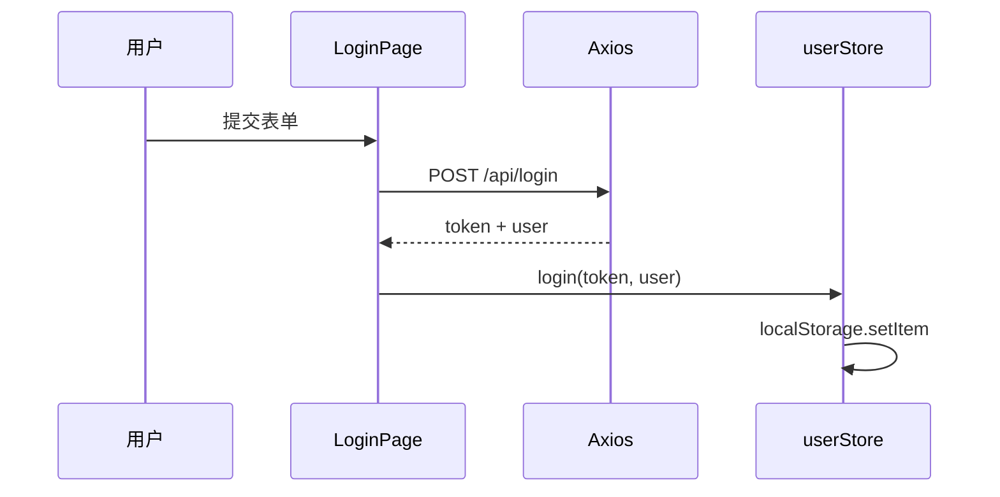

# 高频场景题与面试专题

<!-- 修改说明: 2026-06-30 按 EXPANSION-STANDARD 扩充 §0 读前导读、跨域/CORS 专题链计网06、FAQ 扩展、闭卷自测、费曼检验 -->

> **文件编码**：UTF-8。本章是「怎么讲」——建议配合 [11 章 shop-react](./11-React项目实战与面试准备.md) 项目，每题尽量结合自己做过的功能回答。

## 0. 读前导读（零基础也能跟上）

> **读者假设**：01～12 技术会写，但面试「请介绍一下 React」容易散。本章练**口述框架**，每题绑定 shop-react 例子。

### 0.1 用一句话弄懂本章

**一句话**：把 React 知识点翻译成**面试官能听懂的 2 分钟答案**，并用 shop-react + [Java 04 后端](../../后端学习/Java/04-SpringBoot核心开发.md) 证明你做过项目。

### 0.2 你需要提前知道什么

| 水平 | 建议 |
|------|------|
| shop-react 未做完 | 至少完成 [11 章 Week 1～2](./11-React项目实战与面试准备.md) |
| 跨域题不会 | 精读 [08 章 CORS](./08-Axios网络请求与前后端联调.md) + [计网 06 §10](../计算机网络/06-缓存Cookie与会话机制.md) |

### 0.3 本章知识地图（☐→☑）

- [ ] 25+ 题能按五步法口述
- [ ] 10 题能结合 shop-react
- [ ] 3 分钟项目介绍不卡壳
- [ ] 跨域/CORS 题链计网 06 + Java 04
- [ ] 闭卷自测 ≥ 8/10

### 0.4 建议学习时长

每天 5 题 × 7 天；面试前 1 天过 §31 速记 + 11 章项目稿。

### 0.5 可验证成果

1. 录音 3 分钟项目介绍，回听无明显卡顿。
2. 白板画出登录时序：LoginPage → Axios → [Java 04 /api/login](../../后端学习/Java/04-SpringBoot核心开发.md) → Zustand。

---

## 本章与上一章的关系

01～12 章教 **怎么做**（写组件、配路由、调接口）；13 章教 **怎么讲**（面试口述、场景设计、追问应对）。

**使用方式**：

1. 每题先 **自己口述 2 分钟**，再对照框架查漏  
2. 每题准备 **1 个 shop-react 例子**（没有就说学习项目）  
3. 回答结构：**定义 → 原理/作用 → 场景 → 项目实践 → 不足/扩展**

## 0. 通用回答框架

### 0.1 技术题五步法

1. **一句话定义**（让面试官知道你会）  
2. **原理或机制**（展开深度）  
3. **使用场景**（证明有工程经验）  
4. **项目里怎么用**（shop-react 具体模块）  
5. **边界 / 优化 / 对比**（加分项）

### 0.2 项目场景题 STAR

- **S**ituation：业务背景  
- **T**ask：你的任务  
- **A**ction：技术方案  
- **R**esult：效果或可量化结果  

### 0.3 三分钟项目介绍框架

```text
【30 秒】项目是什么：shop-react 商城前台，技术栈 React + Router + Zustand + Ant Design + Vite
【60 秒】核心功能：注册登录、商品浏览、购物车、下单、订单列表；对接 Spring Boot REST API
【60 秒】技术亮点：Axios 拦截器统一 token；路由懒加载；Zustand 管购物车；路由守卫鉴权
【30 秒】难点与收获：401 双保险、部署 SPA 404、性能 memo 优化（选 1～2 个真实踩坑）
```

---

## 1. 说说你对 React 的理解？React 有什么特点？

**框架（30 秒）**  
React 是 Facebook 开源的 **UI 库**（不是完整框架），用 **组件化** + **声明式** 方式构建界面。核心是 **数据驱动视图**：state 变 → 重新执行组件函数 → 生成新 Virtual DOM → diff → 更新真实 DOM。

**React 特点（1 分钟）**  
- **JSX**：在 JS 里写类似 HTML 的语法，编译后变 `React.createElement`  
- **单向数据流**：数据自顶向下；子改父用回调或状态管理  
- **Hooks**：函数组件拥有 state、副作用、Context 等能力  
- **生态丰富**：Router、Zustand/Redux、Next.js 等  
- **跨平台**：React Native 复用思路  

**项目结合**  
我在 shop-react 用 React 18 函数组件 + Hooks 完成商城前台，Zustand 管用户和购物车，Axios 对接 Spring Boot。

**对比 Vue（若被追问）**  
React 用 JSX + 手动优化渲染；Vue 用模板 + 自动依赖追踪。思想都是组件化、声明式 UI。

---

## 1.1 React 核心概念速记表（面试 30 秒版）

| 概念 | 一句话 | shop-react 例子 |
|------|--------|-----------------|
| JSX | JS 里的 UI 语法糖 | ProductCard return 块 |
| 单向数据流 | props 下传，回调/upload | addItem 回调 |
| Hooks | 函数组件状态与副作用 | useState/useEffect |
| VDOM | 内存 DOM 树 diff | 列表 key={id} |
| 合成事件 | 跨浏览器事件委托 | onClick 非原生绑定 |
| 受控组件 | value+onChange 由 state 控 | Login Form |
| 全局状态 | Zustand 跨页共享 | userStore/cartStore |

---

## 2. 什么是 Virtual DOM？为什么需要它？

**定义**  
Virtual DOM（虚拟 DOM）是真实 DOM 的 **轻量 JS 对象表示**，包含 type、props、children 等字段。

**为什么需要**  
- 直接操作 DOM 慢且 API 繁琐  
- 每次 setState 若直接改 DOM，难以批量、难以跨组件协调  
- VDOM 让 React 在内存中 **先算出新旧差异（diff）**，再 **批量、最小化** 更新真实 DOM  

**流程口述**  
`state 变化` → `render 生成新 VDOM 树` → `diff 旧树与新树` → `得到 patch 列表` → `commit 应用到 DOM`

**项目**  
shop-react 商品列表 `products` 更新时，React 按 key diff 列表项，不是整页销毁重建。

**边界**  
VDOM 不是银弹；极简单页面可能直接 DOM 更快；React 的价值在 **组件化 + 调度 + 生态**。

---

## 3. React 的 diff 算法大致是怎样的？

**原则（同层比较）**  
- 只对 **同一层级** 节点比较，不跨层移动（跨层视为删除+新建）  
- **不同类型** 元素：直接卸载旧树、挂载新树  
- **同类型** 元素：更新 props，递归子节点  

**列表与 key**  
- 子节点是数组时，用 **key** 标识身份，复用 DOM 节点  
- **index 作 key**：增删排序时 index 变，导致 **错复用**（输入框内容串行、状态错乱）  
- **稳定 id 作 key**：`key={product.id}`  

**项目**  
ProductList 用 `product.id` 作 key；购物车列表用 `cartItem.id`。

**对比 Vue**  
都是同层 diff + key；Vue 3 编译期有静态提升、补丁标记等优化，思路相近。

---

## 4. JSX 是什么？和 HTML 有什么区别？

**定义**  
JSX 是 JavaScript 的语法扩展，看起来像 HTML，编译后变成 `React.createElement(type, props, ...children)`。

```jsx
const el = <h1 className="title">Hello</h1>
// 编译后近似
const el = React.createElement('h1', { className: 'title' }, 'Hello')
```

**与 HTML 区别**

| JSX | HTML |
|-----|------|
| `className` | `class` |
| `htmlFor` | `for` |
| 驼峰事件 `onClick` | 小写 `onclick` |
| 必须闭合标签 | 部分可省略 |
| 插值用 `{expression}` | 模板引擎 |
| 防止注入：默认转义 | — |

**项目**  
shop-react 组件全是 `.jsx`；`{product.price.toFixed(2)}` 动态展示价格。

---

## 5. 类组件和函数组件区别？为什么现在用函数组件？

| 维度 | 类组件 | 函数组件 + Hooks |
|------|--------|------------------|
| 写法 | class + lifecycle | 函数 + useEffect 等 |
| state | `this.state` | `useState` |
| 逻辑复用 | HOC、render props | 自定义 Hook |
| 性能 | 实例开销略大 | 更轻 |
| this 绑定 | 易踩坑 | 无 this |
| 趋势 | 遗留代码 | **官方推荐** |

**项目**  
shop-react 全部函数组件；仅 Error Boundary 可能用 class（12 章）。

---

## 6. Hooks 规则是什么？为什么有这些规则？

**规则**  
1. 只在 **函数组件顶层** 调用，不在 if/for/嵌套函数里  
2. 只在 **React 函数组件或自定义 Hook** 里调用  
3. 自定义 Hook 名以 **`use`** 开头  

**为什么**  
React 靠 Hook **调用顺序** 在链表上存 state/effect；条件调用会破坏顺序，导致 state 错位。

**项目**  
`useCartStore`、`useEffect` 拉商品详情都在组件顶层；抽 `useDebounce` 复用防抖逻辑。

**追问：如何在条件里「类似」使用？**  
把条件放进 Hook 内部，或提前 return 前已调完所有 Hook。

---

## 7. useState 和 useReducer 区别？什么时候用哪个？

**useState**  
单个或少量独立状态，`setX` 直接更新。

**useReducer**  
`dispatch(action)` 管理 **复杂状态转换**，类似 Redux，适合多字段、多步骤更新。

```jsx
function cartReducer(state, action) {
  switch (action.type) {
    case 'ADD':
      return mergeItem(state, action.payload)
    case 'REMOVE':
      return state.filter((i) => i.id !== action.payload)
    default:
      return state
  }
}

const [items, dispatch] = useReducer(cartReducer, [])
```

**选型**

| 场景 | 用 |
|------|-----|
| 表单字段、开关 | useState |
| 购物车 items 多操作 | useReducer 或 Zustand |
| 跨组件全局 | Zustand / Redux |

**项目**  
shop-react 购物车用 Zustand（比 useReducer 更简洁）；表单 Login 用多个 `useState` 或 Ant Design Form。

---

## 8. useEffect 是干什么的？和生命周期怎么对应？

**作用**  
处理 **副作用**：请求接口、订阅、操作 DOM、定时器。

```jsx
useEffect(() => {
  fetchDetail(id)
  return () => {
    // 清理：取消订阅、清定时器、AbortController
  }
}, [id])
```

**与类生命周期对应（近似）**

| useEffect | 类组件 |
|---------|--------|
| 无依赖 `[]` | componentDidMount |
| 清理函数 return | componentWillUnmount |
| 有依赖 `[id]` | componentDidUpdate 中判断 id 变 |

**注意**  
- 不是「变成生命周期」，是 **声明副作用**  
- 开发 StrictMode 会 **双调** 帮助发现清理遗漏  
- 应用 **依赖数组** 避免无限循环  

**项目**  
ProductDetail：`useEffect(() => fetchDetail(id), [id])`；卸载时 `abortController.abort()`。

---

## 9. useLayoutEffect 和 useEffect 区别？

| | useEffect | useLayoutEffect |
|---|-----------|-----------------|
| 执行时机 | paint 之后（异步） | DOM 更新后、pain 之前（同步） |
| 是否阻塞绘制 | 否 | 是 |
| 场景 | 大多数副作用 | 需读布局、同步改 DOM 避免闪烁 |

**项目**  
一般接口请求用 `useEffect`；Tooltip 定位微调可用 `useLayoutEffect`（少用）。

---

## 10. 自定义 Hook 怎么写？举例

**定义**  
把可复用 **状态 + 副作用 + 逻辑** 抽成函数，内部可调用其他 Hook。

```jsx
export function useDebounce(value, delay = 300) {
  const [debounced, setDebounced] = useState(value)
  useEffect(() => {
    const timer = setTimeout(() => setDebounced(value), delay)
    return () => clearTimeout(timer)
  }, [value, delay])
  return debounced
}

export function useProducts(keyword) {
  const [list, setList] = useState([])
  const [loading, setLoading] = useState(false)
  const debouncedKw = useDebounce(keyword, 300)

  useEffect(() => {
    setLoading(true)
    getProductList({ keyword: debouncedKw })
      .then(setList)
      .finally(() => setLoading(false))
  }, [debouncedKw])

  return { list, loading }
}
```

**项目**  
`useAuth` 封装登录态判断；`useCart` 封装加购（或直接 Zustand）。

**规则**  
必须以 `use` 开头；只在顶层调 Hook。

---

## 11. React 组件通信有哪些方式？你怎么选？

| 方式 | 场景 | shop-react 例子 |
|------|------|-----------------|
| props 向下 | 父传子 | ProductList → ProductCard 传 product |
| 回调向上 | 子传父 | `onAddCart` 回调 |
| 状态提升 | 兄弟共享 | 少见，用 store |
| Context | 跨层少变配置 | ThemeContext |
| Zustand / Redux | 全局共享 | user、cart |
| ref + imperative | 调子方法 | Form.validateFields |
| 事件总线 | 不推荐 | 用 store 替代 |

**选型原则**  
能局部不全局；能 props 不上 Zustand；跨页面持久 → Zustand。

---

## 12. 受控组件和非受控组件区别？

**受控**  
表单值由 React state 控制，`value` + `onChange` 绑定。

```jsx
const [username, setUsername] = useState('')
<input value={username} onChange={(e) => setUsername(e.target.value)} />
```

**非受控**  
DOM 自己管值，用 `ref` 读取。

```jsx
const inputRef = useRef()
<input ref={inputRef} defaultValue="" />
// 提交时 inputRef.current.value
```

**项目**  
Login 用 Ant Design Form（受控封装）；简单搜索框可用受控 `keyword` state。

**对比 Vue**  
类似 `v-model`（受控）与原生 ref 取值（非受控）。

---

## 13. 状态管理有哪些方案？为什么 shop-react 用 Zustand？

| 方案 | 特点 |
|------|------|
| useState + 提升 | 小范围 |
| Context | 跨层、易全量刷新 |
| Redux Toolkit | 规范、中间件、devtools、样板多 |
| Zustand | 轻量、无 Provider、API 简单 |
| Jotai / Recoil | 原子化状态 |
| React Query | 服务端状态缓存 |

**为什么 Zustand**  
- 比 Redux 样板少，学习成本低  
- 比 Context 性能好，细粒度订阅  
- 够用的 devtools 和持久化中间件  

**项目**  
`useUserStore`：token、login、logout；`useCartStore`：items、totalPrice、addItem。

**对比 Pinia**  
都是「store + actions」；Zustand 更函数式，Pinia 更 Vue 生态一体。

---

## 14. React Router 怎么做登录鉴权？

**方案**  
1. 路由配置 `meta` 或包装 `<ProtectedRoute>`  
2. 无 token 重定向 `/login?redirect=当前路径`  
3. Axios 响应拦截 401 清 token 再跳登录（**双保险**）

```jsx
function ProtectedRoute({ children }) {
  const token = useUserStore((s) => s.token)
  const location = useLocation()
  if (!token) {
    return <Navigate to={`/login?redirect=${location.pathname}`} replace />
  }
  return children
}

<Route path="/cart" element={
  <ProtectedRoute><Cart /></ProtectedRoute>
} />
```

**项目**  
`/cart`、`/orders` 需登录；Login 成功后读 `searchParams.get('redirect')` 跳回。

**守卫顺序口述**  
React Router v6 无多级全局守卫链，用 **布局路由 + ProtectedRoute** 或 `loader`（Data Router）实现。

---

## 15. 如何优化 React 应用首屏和运行性能？

**加载阶段**  
- `React.lazy` + `Suspense` 路由懒加载  
- 动态 import 重组件  
- Ant Design 按需导入  
- gzip / Brotli、CDN  
- 图片 lazy、WebP  

**运行阶段**  
- `memo` + `useCallback` + `useMemo`  
- 状态下沉、避免大 Context  
- Zustand selector 细订阅  
- 虚拟列表、分页  
- `useTransition` 大列表筛选  

**分析**  
`npm run build` 看 chunk；React DevTools Profiler。

**项目**  
shop-react 路由全 lazy；ProductCard memo；build 时 manualChunks 拆 react 和 antd。

---

## 16. 场景：列表页搜索防抖怎么做？

**需求**  
输入 keyword 不要每个字符都请求接口。

**方案**  
1. 自定义 `useDebounce(keyword, 300)`  
2. `useEffect` 依赖 debounced 值再请求  
3. AbortController 取消上一次未完成请求  

```jsx
const [keyword, setKeyword] = useState('')
const debouncedKw = useDebounce(keyword, 300)

useEffect(() => {
  const ctrl = new AbortController()
  fetchProducts(debouncedKw, { signal: ctrl.signal })
  return () => ctrl.abort()
}, [debouncedKw])
```

**项目**  
ProductList 搜索框 300ms 后调 `GET /api/products?keyword=`。

---

## 17. 场景：登录流程怎么设计？token 存哪？

**流程**  
注册/登录 → 后端 JWT → 存 Zustand + localStorage → 请求拦截器带 Header → 401 清 token 跳登录。



**存储选型**

| 位置 | 优点 | 缺点 |
|------|------|------|
| localStorage | 简单、持久 | XSS 可读 |
| sessionStorage | 关 tab 失效 | 同左 |
| HttpOnly Cookie | 防 XSS 读 | 跨域、CSRF 要配 |

**项目**  
shop-react 用 localStorage + Bearer；能说清 XSS 风险更佳。

---

## 18. 场景：购物车状态怎么设计？

**数据结构**  
```js
items: [{ id, name, price, qty, stock }]
```

**派生**  
`totalCount`、`totalPrice` 用 Zustand 内 computed 或组件 `useMemo`。

**操作**  
`addItem` 合并同 id；`removeItem`；`clear` 下单成功后。

**持久化**  
`zustand/middleware` persist 插件；登录后可与服务端 cart merge（进阶）。

**下单**  
POST `/api/orders` body: `{ items: [{ productId, quantity }] }`。

**项目**  
cartStore 独立于页面，Header 显示 badge 数量。

---

## 19. 场景：前后端联调跨域怎么解决？

| 环境 | 方案 | 文档 |
|------|------|------|
| 开发 | Vite `server.proxy`：`/api` → `localhost:8080` | [08 §4](./08-Axios网络请求与前后端联调.md) |
| 生产 | Nginx 同域反代 `/api` | [10 章](./10-Vite构建与项目部署.md)、[计网 06 §11.3](../计算机网络/06-缓存Cookie与会话机制.md) |
| 直连后端 | [Java 04 CorsConfig](../../后端学习/Java/04-SpringBoot核心开发.md) | [计网 06 §10～§11](../计算机网络/06-缓存Cookie与会话机制.md) |
| 代码 | Axios `baseURL: '/api'`，环境只改部署层 | — |

**CORS 口述（对齐计网 06）**  
- **同源**：协议+域名+端口相同（[计网 06 §10.1](../计算机网络/06-缓存Cookie与会话机制.md)）。  
- **5173 vs 8080**：不同源，浏览器默认拦读响应。  
- **简单请求 vs 预检**：带 `Authorization`、JSON POST 会先发 **OPTIONS**（[计网 06 §10.2](../计算机网络/06-缓存Cookie与会话机制.md)），后端须允许 OPTIONS。  
- **Postman 正常浏览器失败**：CORS 是浏览器策略，非 HTTP 协议本身。  
- **生产推荐**：Nginx 同域反代，用户只访问一个域名，**无需 CORS**。

**项目结合 shop-react**  
dev：`vite.config.js` proxy；登录调 [Java 04 POST /api/login](../../后端学习/Java/04-SpringBoot核心开发.md)；token 走 Bearer 触发预检，故 CorsConfig 或 proxy 二选一必配。

**追问应对**  
「为什么不用 JSONP？」——只支持 GET、不安全，现代 REST 用 CORS 或 proxy。  
「credentials 和 Bearer 区别？」——Cookie 会话见 [计网 06 §8](../计算机网络/06-缓存Cookie与会话机制.md)；shop-react 用 Header Bearer + Zustand。

---

## 20. 场景：SPA 部署后刷新子路由 404 怎么办？

**原因**  
Browser History 模式下 `/cart` 无物理文件，Nginx 默认找文件 404。

**解决**  
```nginx
try_files $uri $uri/ /index.html;
```

**同时检查**  
`vite.config base`、Router `basename`。

**项目**  
10 章部署踩坑；面试讲 Network 里 js 404 vs 路由 404 区别。

---

## 21. React 和 Vue 的区别？（常问）

| React | Vue |
|-------|-----|
| UI 库，需自选路由/状态 | 渐进式框架，官方 Router/Pinia |
| JSX | 模板 + SFC |
| 手动优化（memo/useMemo） | 自动依赖追踪 |
| 函数式 + Hooks | Composition API + script setup |
| 学习曲线较陡（生态选型） | 上手相对平缓 |
| 就业：外企、大厂、全栈 Next | 国内中小厂多 |

**态度**  
框架是工具；懂组件化、状态管理、性能优化可迁移。有 Vue 经验学 React 重点适应 JSX 和显式依赖。

---

## 22. key 的作用？为什么列表不要用 index 作 key？

**key**  
帮助 diff 识别节点身份，**复用 DOM** 而非错复用。

**index 问题**  
增删排序时 index 变，React 认为「同 key 的节点还在」，只更新内容 → **组件内部 state 错位**。

**正确**  
`key={product.id}`。

**例外**  
静态、永不重排的列表可勉强 index（仍不推荐）。

---

## 23. 如何封装 Axios？拦截器做什么？

**封装**  
`axios.create({ baseURL, timeout })` 单例。

**请求拦截**  
加 token、`Authorization: Bearer`、Content-Type。

**响应拦截**  
解包 `{ code, data, message }`；401 跳登录；统一 message 错误。

**项目**  
见 11 章 `request.js`；业务 `getProductList(params)` 只关心 data。

---

## 24. React.memo、useMemo、useCallback 分别解决什么？

| API | 解决 |
|-----|------|
| React.memo |  props 不变则跳过 **子组件 render** |
| useMemo | 缓存 **计算结果**，稳定对象引用 |
| useCallback | 缓存 **函数引用**，配合 memo |

**口述链**  
父 state 变 → 子默认跟着 render → memo 挡 props 相同时的 render → 但内联函数每次都是新引用 → useCallback 稳定 → memo 才生效。

**项目**  
ProductCard memo + `handleAddCart` useCallback。

**误区**  
到处包 useMemo 反而慢；先 Profiler 再优化。

---

## 25. Error Boundary 是什么？和 try/catch 区别？

**Error Boundary**  
class 组件，捕获 **子树渲染阶段** 错误，展示 fallback UI，防止整页白屏。

**try/catch**  
捕获 **命令式代码**、事件处理器、异步回调里的错误。

**项目**  
商品模块包一层 Boundary；接口错误用 `error` state + 空态页。

---

## 26. Suspense 和 React.lazy 怎么用？

**lazy**  
`const Page = lazy(() => import('./Page'))` 代码分割。

**Suspense**  
加载中显示 `fallback={<Spin />}`。

**项目**  
所有路由页面 lazy；App 外包 Suspense。

**追问**  
Suspense 数据获取需配合 React Query / Next.js 等；传统 useEffect 项目路由懒加载就够用。

---

## 27. Portals 解决什么问题？

**问题**  
Modal 在组件树深处，受 `overflow`、`z-index` 影响。

**解决**  
`createPortal(children, document.body)` 挂到 body，事件仍冒泡 React 树。

**项目**  
商品大图预览；Ant Design Modal 默认 append to body。

---

## 28. React 18 并发特性你了解吗？

**要点**  
- `createRoot` 开启并发模式  
- `useTransition`：标记低优先级更新（大列表筛选）  
- `useDeferredValue`：延迟派生值  
- 自动批处理扩展到 setTimeout/Promise  

**项目**  
可选在搜索页用 useTransition；能说场景即可，不必全项目改造。

---

## 29. 你项目中最大的难点是什么？（开放题模板）

**模板 1：401 与登录态**  
问题：token 过期后操作报错。  
解决：响应拦截器统一 logout + redirect。  
不足：未做 refresh token。

**模板 2：部署刷新 404**  
问题：Nginx 未配 try_files。  
解决：SPA fallback + base 对齐。

**模板 3：购物车跨页**  
问题：props 无法跨路由。  
解决：Zustand cartStore。

**模板 4：列表性能**  
问题：父组件搜索导致所有卡片 re-render。  
解决：memo + useCallback，Profiler 验证。

选 **真实踩过的坑**，别编没做过的分布式。

---

## 30. 说说 Fiber 架构？（进阶加分）

**背景**  
React 16 前递归 diff，长时间任务阻塞主线程，动画卡顿。

**Fiber**  
把渲染工作拆成 **小单元**，可暂停、恢复、设优先级；协调阶段（reconciliation）可中断，提交阶段（commit）一次性应用 DOM。

**面试**  
不必背源码；说清 **可中断渲染 + 优先级调度** 为 React 18 并发打基础即可。

---

## 31. 口述题速记卡（考前 10 分钟）

### React 核心
- VDOM：内存树 + diff + 批量更新  
- diff：同层、type、key  
- Hooks：顶层、顺序、use 前缀  
- 受控：value + onChange  

### 工程
- lazy + Suspense 代码分割  
- Vite dev ESM / build Rollup  
- SPA：try_files  

### 项目
- Zustand：user + cart  
- ProtectedRoute + 401 双保险  
- proxy vs Nginx 反代  

---

## 32. 手写题常考（简要思路）

### 防抖 debounce

```js
function debounce(fn, delay) {
  let timer
  return function (...args) {
    clearTimeout(timer)
    timer = setTimeout(() => fn.apply(this, args), delay)
  }
}
```

### 深拷贝（简化）

```js
function deepClone(obj, map = new WeakMap()) {
  if (obj === null || typeof obj !== 'object') return obj
  if (map.has(obj)) return map.get(obj)
  const clone = Array.isArray(obj) ? [] : {}
  map.set(obj, clone)
  for (const key of Object.keys(obj)) {
    clone[key] = deepClone(obj[key], map)
  }
  return clone
}
```

### 简易 useDebounce Hook

```js
function useDebounce(value, delay) {
  const [v, setV] = useState(value)
  useEffect(() => {
    const t = setTimeout(() => setV(value), delay)
    return () => clearTimeout(t)
  }, [value, delay])
  return v
}
```

---

## 33. 分级准备计划

| 等级 | 要求 |
|------|------|
| 基础 | 30 题每题能讲 1 分钟 |
| 进阶 | 每题结合 shop-react 举 1 例 |
| 冲刺 | 模拟面试 45 分钟 + 录音复盘 |

**建议节奏**  
- 项目完成后：每天 5 题  
- 面试前 1 周：全部过一遍  
- 面试前 1 天：§31 速记 + 11 章 3 分钟项目稿  

---

## 34. FAQ

**Q：没做过大型项目怎么答？**  
诚实说学习项目量级；强调 **设计思路、技术选型、踩坑与解决**。

**Q：Vue 转 React 面试怎么说？**  
说清 JSX、Hooks、显式优化差异；强调组件化思想可迁移。

**Q：要背源码吗？**  
初级：VDOM、diff、Fiber、Hooks 链表 **口述级别** 即可。

**Q：Redux 还要学吗？**  
很多岗位 Zustand 够用；大厂可能问 Redux 中间件，了解 `createSlice` 即可。

**Q：跨域题必背哪三句？**  
同源定义；dev proxy / 生产 Nginx 同域；预检 OPTIONS（[计网 06](../计算机网络/06-缓存Cookie与会话机制.md)）+ [Java 04 CorsConfig](../../后端学习/Java/04-SpringBoot核心开发.md)。

---

## 35. 学完标准

- [ ] 本文 **25+ 题**均能按五步法回答  
- [ ] 至少 **10 题**能结合 shop-react  
- [ ] 准备好 **2 个项目难点** STAR 故事  
- [ ] 能画登录、下单时序图（白板）  
- [ ] 能口述 3 分钟项目介绍不严重卡顿  
- [ ] 手写防抖、useDebounce 能不卡壳  
- [ ] 跨域题能链 [计网 06](../计算机网络/06-缓存Cookie与会话机制.md) 与 [Java 04](../../后端学习/Java/04-SpringBoot核心开发.md)

---

## 36. 闭卷自测

1. 技术题五步法是哪五步？
2. STAR 各字母含义？
3. Virtual DOM 为什么需要？（结合 shop-react 列表）
4. 为什么列表 key 不能用 index？
5. Zustand 和 Redux 选型一句话？
6. 跨域 dev vs 生产各用什么方案？（链计网 06）
7. SPA 刷新 404 原因与 Nginx 修复？
8. **动手**：口述 3 分钟 shop-react 项目介绍（录音）。
9. **动手**：白板画登录时序含 [Java 04](../../后端学习/Java/04-SpringBoot核心开发.md)。
10. **综合**：401 在拦截器和 ProtectedRoute 如何分工？

### 36.1 自测参考答案

1. 定义→原理→场景→项目实践→边界/扩展。
2. Situation Task Action Result。
3. 批量 diff、最小 DOM 更新；products 更新按 id diff 行。
4. 增删排序 index 变，错复用 DOM 导致状态串行。
5. 中小项目 Zustand 轻量；大型或中间件生态 Redux/RTK。
6. dev Vite proxy；生产 Nginx 同域反代（计网 06 §11.3）。
7. History 无物理文件；try_files fallback index.html。
8. 自评：技术栈+功能+亮点+难点是否齐全。
9. LoginPage→axios→/api/login→token→Zustand→后续 Bearer。
10. 未登录进页 ProtectedRoute；已登录 token 过期接口 401 拦截器 logout。

---

## 37. 费曼检验

3 分钟模拟面试：

1. **React 是什么**：UI 库、组件化、声明式、数据驱动视图（Hooks）。
2. **项目亮点**：Axios 拦截器 + Zustand + 路由守卫 + Ant Design 四态。
3. **跨域怎么讲**：先同源（计网 06），再 proxy/Nginx，最后 Java 04 CorsConfig 兜底。

---

## 下一章预告

13 章是「怎么答」——14 章是「有没有漏」。用总表逐项自评 ⬜ / 🔶 / ✅，面试前 30 分钟快速过薄弱项，并配合 [后端 15 章总表](../../后端学习/Java/15-补充知识点总表.md) 做全栈复习。

---

*下一章：14 补充知识点总表*
