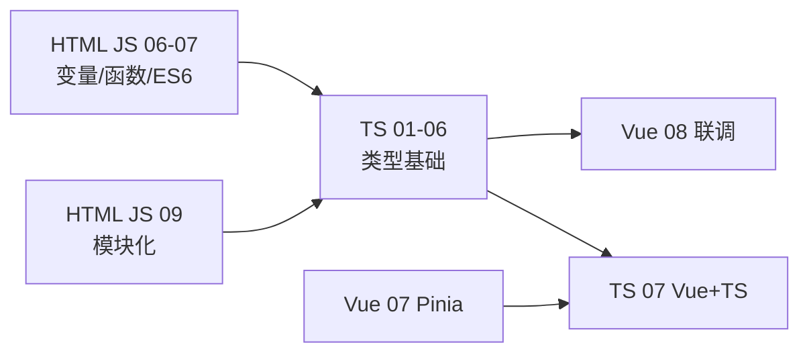
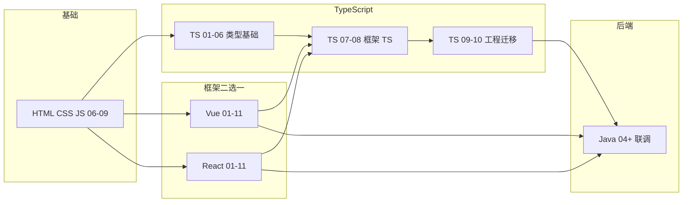

# TypeScript 学习路线图与说明

> **文件编码**：本文件夹内所有 `.md` 均为 **UTF-8**。`.ts` / `.tsx` 源文件建议 UTF-8；VS Code / Cursor 右下角确认编码。

<!-- 修改说明: 2026-06-30 按 EXPANSION-STANDARD 扩充 §0、FAQ≥12、闭卷自测、费曼；链 Vue 07/08、HTML JS 06-07 -->

---

## 0. 读前导读（零基础也能跟上）

> **读者假设**：你已学完 [HTML CSS JS 06～07](../HTML%20CSS%20JS/06-JavaScript基础语法与数据类型.md)（变量、数组、函数、ES6 基础），或正在同步学 Vue/React 01。TypeScript **不是新语言**，是在 JavaScript 上 **给代码贴类型标签**——像给快递盒贴「易碎 / 2kg / 内含手机」的说明，仓库（编译器）在发货前就能发现贴错标签的包裹。

### 0.1 用一句话弄懂本系列

**一句话**：TypeScript = JavaScript + 编译期类型检查；写 `.ts` → `tsc` 或 Vite 转 `.js` → 浏览器仍跑 JS，但写代码时 IDE 和编译器帮你抓错。

**核心类比（贯穿 01～06 章）**：

| TS 概念 | 生活类比 | 对应章节 |
|---------|----------|----------|
| **TypeScript 整体** | 给 JS 贴类型标签 | 01 入门 |
| **interface** | 合同——约定对象必须有哪些字段 | 03 接口 |
| **泛型 `<T>`** | 万能模具——一套逻辑适配多种形状 | 04 泛型 |
| **类型收窄** | 安检分流——`if` 后编译器知道具体类型 | 05 收窄 |
| **.d.ts 声明** | 外文菜单翻译——让 TS 认识 JS 库 | 06 模块 |

**为什么重要**：Vue [07 Pinia](../Vue/07-Pinia状态管理.md) / [08 联调](../Vue/08-Axios网络请求与前后端联调.md) 与 React 08 都需要 `ApiResult<T>`、`Product` 等类型；没有 TS 01～06，框架章里的 `defineProps<{...}>()` 会看不懂。

---

### 0.2 你需要提前知道什么

| 水平 | 建议 |
|------|------|
| 完全零基础 | 先学 [HTML CSS JS 06](../HTML%20CSS%20JS/06-JavaScript基础语法与数据类型.md) 变量/数组/对象，再开 TS 01 |
| 会 JS 06～07 | **从 TS 01 开始**，与 Vue/React 01 并行 |
| 已开 Vue/React | 框架 08 联调前 **必须完成 TS 01～06** |
| 后端 Java 背景 | 03 章 `interface`≈DTO 合同，04 章泛型≈`Result<T>`，概念相通 |

**真不会就先跳到哪一章**：

| 缺什么 | 跳到哪 |
|--------|--------|
| 不会 `let`/`const`、函数 | [JS 06](../HTML%20CSS%20JS/06-JavaScript基础语法与数据类型.md) |
| 不会 `async/await` | [JS 07](../HTML%20CSS%20JS/07-JavaScript流程控制函数对象数组与ES6基础.md) |
| 不会 `import/export` | [JS 09](../HTML%20CSS%20JS/11-前端工程化调试Git与包管理基础.md) |
| 不会创建 Vite 项目 | [Vue 01](../Vue/01-Vue入门与环境搭建.md) 环境部分 |

---

### 0.3 本系列知识地图（学完后应能勾选全部 ☐→☑）

- [ ] 01：能跑 `tsc`、`npx tsc -v`，创建 vue-ts / react-ts 项目
- [ ] 02：会写 `string`/`number`/`boolean`、数组、元组、`unknown` vs `any`
- [ ] 03：能用 **interface（合同）** 描述 `Product`、`ApiResult<T>`
- [ ] 04：会写泛型函数 `request<T>()`，会用 `Partial`/`Pick`/`Omit`
- [ ] 05：会用 `class`、`enum`，会用 `typeof`/`in` 做类型收窄
- [ ] 06：会 `import type`、写 `.d.ts`、配置 `@/` 别名
- [ ] 07/08：Vue 或 React 组件 props / store 类型化
- [ ] 闭卷自测：00～06 每章 ≥ 7/10

---

### 0.4 建议学习时长与节奏

| 阶段 | 章节 | 时间 | 节奏 |
|------|------|------|------|
| 入门 | 01 | 2～3 小时 | 跟敲 hello.ts + ts-playground |
| 类型基础 | 02～03 | 各 3～4 小时 | 定义 shop 的 Product/User |
| 函数泛型 | 04 | 4 小时 | 实现 `request<T>()` |
| 类与收窄 | 05 | 3～4 小时 | CartService + 订单状态 |
| 模块工程 | 06 | 3 小时 | 搭建 `src/types/` |
| 框架 TS | 07 或 08 | 4～6 小时 | 按主线精读一条 |
| **合计 01～06** | — | **约 18～22 小时** | 可与 Vue/React 01～07 并行 |

---

### 0.5 学完 01～06 你能做什么（可验证）

1. 在 `ts-playground` 里 `npx tsc` 零报错编译 `shop-types.ts`。
2. 独立写出 `interface Product` 和 `ApiResult<T>`，字段与 [Java 04 Result](../../后端学习/Java/04-SpringBoot核心开发.md) JSON 对齐。
3. 用泛型 `request<Product>()` 封装 axios，在 Vue [08 联调](../Vue/08-Axios网络请求与前后端联调.md) 时响应有类型提示。
4. 为无 `@types` 的包写 `declare module` 声明文件。
5. 向同学 **3 分钟口述**：TS 与 JS 区别、interface 合同类比、泛型万能模具类比（见本章末费曼提纲）。

---

### 0.6 与 HTML/JS、Vue 的衔接一览



| 你刚学完 | 下一步 TS | 同步框架 |
|----------|-----------|----------|
| [JS 06 数据类型](../HTML%20CSS%20JS/06-JavaScript基础语法与数据类型.md) | TS 02 基本类型 | Vue 01 可并行 |
| [JS 07 流程 ES6](../HTML%20CSS%20JS/07-JavaScript流程控制函数对象数组与ES6基础.md) | TS 04 函数泛型 | Vue 02～04 |
| JS 09 模块化 | TS 06 模块声明 | Vue 05～07 |
| TS 06 完成 | [TS 07 Vue+TS](./07-Vue3与TypeScript.md) | Vue 08 联调 |

---

### 0.7 三类比速记卡（01～06 贯穿）

```text
┌─────────────────────────────────────────────────────────┐
│  TypeScript = 给 JavaScript 贴类型标签                    │
│  interface   = 合同（对象必须有哪些字段）                 │
│  泛型 <T>    = 万能模具（一套逻辑，多种数据形状）         │
└─────────────────────────────────────────────────────────┘
```

| 场景 | 用哪个类比 | 例子 |
|------|------------|------|
| 变量/参数注解 | 贴标签 | `price: number` |
| Product/User 定义 | 合同 | `interface Product { id; name; ... }` |
| axios 封装 | 万能模具 | `request<Product>(url)` |
| 可选字段 `?` | 合同附录 | `description?: string` |
| `.d.ts` | 外文菜单翻译 | `declare module 'legacy-lib'` |

---

### 0.8 开学前环境自检（5 分钟）

| 步骤 | 命令 | 期望 | 失败则 |
|------|------|------|--------|
| 1 | `node -v` | v18+ 或 v20+ | 安装 Node LTS |
| 2 | `npx tsc -v` | Version 5.x | [TS 01 §3](./01-TypeScript入门与环境配置.md) |
| 3 | VS Code 打开任意 `.ts` | 悬停有类型 | 确认扩展名 `.ts` |
| 4 | 读过 JS 06 变量/数组 | 能写 `map/filter` | 先补 JS 06 |
| 5 | 读过 JS 07 箭头函数 | 能改写箭头函数 | 先补 JS 07 |

---

### 0.9 与 React 主线的 TS 节奏

选 **React** 的同学：TS 01～06 **与 Vue 线完全相同**；框架 TS 改读 [TS 08 React+TS](./08-React与TypeScript.md)，与 [React 07 Zustand](../React/07-Zustand状态管理.md) 并行。联调仍依赖 03 章 `ApiResult<T>` + 04 章 `request<T>()`。

---

## 1. 这套资料适合谁

- 已学完 [HTML/CSS/JS](../HTML%20CSS%20JS/00-学习路线图与说明.md) **06～09 章**（ES6、异步、模块化）的同学
- 正在学 [Vue 3](../Vue/00-学习路线图与说明.md) 或 [React](../React/00-学习路线图与说明.md)，想把项目从 `.js` 升级到 `.ts` 的学习者
- 计划投递前端/全栈岗位，需要补齐 **TypeScript** 这一面试与入职硬门槛的同学
- 目标：能独立配置 `tsconfig`、写带类型的函数与接口、给 Vue/React 组件补全类型、完成 **shop 项目 JS→TS 迁移**

**不适合**：

- 完全零基础、连 JS 变量和函数都不熟（请先学 HTML CSS JS 06～07）
- 已多年 TS + 复杂泛型体操的资深开发者（可直接看 09、11 查漏补缺）

**前置要求（自检）**：

| 能力 | 对应章节 | 自检方式 |
|------|----------|----------|
| ES6 箭头函数、解构 | JS 06～07 | 能改写 `function` 为箭头函数 |
| 模块化 import/export | JS 09 | 能拆多文件 |
| async/await | JS 08 | 能写 `await fetch` |
| 对象与数组操作 | JS 06～07 | 会用 map/filter/reduce |
| 读过 Vue 或 React 01 | 框架 01 | 能创建 Vite 项目 |

---

## 2. 为什么单独学 TypeScript

真实业务里 **Vue 3 / React 新项目大多默认 TS**。只学 JS 版框架会遇到：

| 场景 | 只有 JS 时 | 有 TS 时 |
|------|------------|----------|
| API 返回字段拼错 | 运行时才报错 | 编写时红线提示 |
| 组件 props 传错类型 | 控制台 warning | 编译期拦截 |
| 重构改函数签名 | 靠全局搜索碰运气 | IDE 自动列出所有引用 |
| 面试 | 「了解 TS」不够 | 能讲 interface、泛型、utility types |

TypeScript **不是新语言**，是 **JavaScript + 类型层**。运行时仍是 JS，类型在编译阶段被擦掉（erase）。

---

## 3. 技术栈主线

```text
TypeScript 入门（tsc / Vite+TS / tsconfig 初识）
  → 基本类型与类型注解（string / number / boolean / array / tuple）
  → 接口、类型别名、联合与交叉（interface vs type）
  → 函数类型与泛型（泛型约束、Partial / Pick / Omit 入门）
  → 类、枚举与类型收窄（class / enum / typeof / in）
  → 模块、声明文件与 @types（.d.ts / 三方库类型）
  → Vue 3 + TS（script setup lang=ts / defineProps / Pinia 类型）
  → React + TS（FC / useState 泛型 / 事件类型 / Zustand 类型）
  → 工程化（strict / paths / ESLint）
  → shop 项目 JS→TS 迁移实战
  → 面试专题与总表
```

与 Vue / React 平行对照：

| 能力 | JavaScript 写法 | TypeScript 写法 |
|------|-----------------|-----------------|
| 变量 | `let count = 0` | `let count: number = 0` |
| 函数 | `(a, b) => a + b` | `(a: number, b: number): number => a + b` |
| 对象形状 | 无 compile 检查 | `interface User { id: number; name: string }` |
| 组件 props | `defineProps(['title'])` | `defineProps<{ title: string }>()` |
| API 响应 | `res.data` 任意 | `interface Result<T> { code: number; data: T }` |
| 配置 | 无 | `tsconfig.json` strict 模式 |

---

## 4. 学习顺序（按编号）

```text
00 学习路线图（你现在在这里）
 ↓
01 TypeScript 入门与环境配置
 ↓
02 基本类型与类型注解
 ↓
03 接口、类型别名与联合交叉
 ↓
04 函数类型与泛型
 ↓
05 类、枚举与类型收窄
 ↓
06 模块、声明文件与三方库
 ↓
07 Vue 3 + TypeScript
 ↓
08 React + TypeScript
 ↓
09 工程化与 tsconfig 深入
 ↓
10 项目实战 JS→TS 迁移
 ↓
11 面试专题与知识点总表
```

### 4.1 阶段目标总览

| 阶段 | 文档 | 核心目标 | 产出物 |
|------|------|----------|--------|
| 入门 | 01～02 | 会跑 tsc、写基本类型 | `hello.ts` + 类型报错实验 |
| 类型系统 | 03～05 | interface、泛型、类型收窄 | `types/user.ts`、`api/result.ts` |
| 工程 | 06、09 | 声明文件、strict、paths | 完整 tsconfig + ESLint |
| 框架 | 07～08 | Vue/React 组件类型化 | 组件 props + store 类型 |
| 实战 | 10 | shop 项目迁移 | `.vue`/`.tsx` 全 TS 化 |
| 巩固 | 11 | 面试 + 自评 | 能口述 TS 与 JS 区别 |

### 4.2 与 Vue / React 并行节奏（推荐）

| 你的进度 | 同步学 TypeScript | 说明 |
|----------|-------------------|------|
| Vue/React 01～03 | TS 01～03 | 先建立类型直觉，框架仍可用 JS |
| Vue/React 04～07 | TS 04～06 | 泛型与模块，为 API 层打类型基础 |
| Vue/React 08 联调前 | **TS 01～06 必须完成** | axios 响应、store 需要类型 |
| Vue/React 08～11 | TS 07～10 | 框架 TS 化 + 项目迁移 |
| 面试前 | TS 11 + 框架 13/14 | 全栈复习 |



---

## 5. 主线练手项目：shop 类型化

与 [shop-vue](../Vue/00-学习路线图与说明.md) / [shop-react](../React/00-学习路线图与说明.md) **共用业务概念**，TypeScript 系列负责 **类型层演进**：

| 章节 | 在 shop 项目里做什么 |
|------|----------------------|
| 02 | 定义 `Product`、`User` 基础 interface |
| 03 | `ApiResult<T>`、`PageResult<T>` 统一响应类型 |
| 04 | 泛型工具函数 `request<T>()`、`formatPrice()` |
| 06 | 为无类型的 npm 包补声明；配置 `@/` 路径别名类型 |
| 07 或 08 | 组件 props、emit、store 全部类型化 |
| 09 | 开启 `strict: true`，修完所有红线 |
| 10 | 全项目 `.js` → `.ts` / `.tsx` 迁移清单验收 |

---

## 6. 必备工具与环境

| 工具 | 用途 | 安装 |
|------|------|------|
| Node.js 18+ | 运行 Vite、tsc | 官网 LTS |
| VS Code / Cursor | 编辑 + TS 语言服务 | 内置 TS 支持 |
| TypeScript | 编译器 | `npm i -g typescript` 或项目内 devDependency |

**验证环境**（01 章会详讲，这里先自检）：

```bash
node -v          # 期望 v18.x 或 v20.x
npx tsc -v       # 期望 Version 5.x
```

预期输出示例：

```text
v20.11.0
Version 5.4.5
```

---

## 7. 每份文档怎么学（四步法）

1. **通读**：本章解决什么问题？和 JS 写法差在哪？
2. **跟敲**：把示例完整敲一遍，**故意写错类型**看 TS 报什么错
3. **练习**：做文档末尾分级练习，对照参考答案
4. **迁移**：把当天学的类型用到 shop 项目对应文件

---

## 8. 常见 FAQ

### Q1：TS 要在 Vue/React 之前学吗？

**不必全部学完再开框架。** 推荐：JS 09 完成后 **同时开** 框架 01 和 TS 01；在框架 08（联调）前 **至少完成 TS 01～06**。

### Q2：Vue 用 TS 还是 React 用 TS 都要学吗？

**类型基础（01～06）只学一遍。** 07 章 Vue、08 章 React **按你选的主线精读，另一条浏览即可**。

### Q3：strict 模式太严格怎么办？

先 `strict: false` 跑通，09 章再逐步开 `strictNullChecks`、`noImplicitAny`。真实项目最终应开 strict。

### Q4：类型写太复杂怎么办？

能跑就行，优先 **interface 描述数据形状** + **泛型描述 API 响应**。高级体操（条件类型、infer）面试前看 11 章即可。

### Q5：和后端 Java 类型有什么关系？

概念相通（类、接口、泛型），但 TS 类型 **只在编译期存在**。联调时重点是 **前后端 JSON 字段对齐**，见 [Java 04](../../后端学习/Java/04-SpringBoot核心开发.md) 与 [Vue 08](../Vue/08-Axios网络请求与前后端联调.md)。

### Q6：TypeScript 和「给 JS 贴类型标签」是一回事吗？

是。**运行时仍是 JS**，标签（类型注解）在 `tsc` 编译时被擦掉。价值在写代码和编译阶段抓错，不是新运行时。

### Q7：interface 和 type 路线图里怎么记？

**interface = 合同**（03 章）：约定对象有哪些字段。**type = 别名/联合**（03 章）：给复杂类型起名。对象实体优先 interface。

### Q8：泛型 `<T>` 必须 04 章才学吗？

01～02 会见到 `ApiResult<T>` 预览；**系统学在 04 章**。记住 **万能模具**：一套 `request<T>()` 适配 Product、User、Order。

### Q9：学完 01～06 够 Vue 08 联调吗？

**够。** 08 联调需要：`ApiResult<T>`、`request<T>()`、组件 props 类型——对应 03、04、07 章。06 章的 `@/` 别名在真实项目里也会用到。

### Q10：没有 Mac 能学吗？

可以。01 章步骤以 **Windows PowerShell** 为准；Node、tsc、Vite 全平台一致。

### Q11：TS 报错英文看不懂怎么办？

每章末有 **报错对照表**；常见 `TS2345` = 实参类型不对，`TS2322` = 赋值类型不对。01 章起养成「读报错行号 + 关键词」习惯。

### Q12：shop 项目必须先有 JS 版才能迁 TS 吗？

不必。可直接 `vue-ts` / `react-ts` 模板起步；[10 章迁移](./10-项目实战JS到TS迁移.md) 给 JS→TS 清单。类型定义从 02～03 章的 `Product`/`User` 开始叠。

---

## 8.1 闭卷自测（路线图）

> 不看资料，10 题自测；≥ 7/10 再开 01 章。

1. **概念**：用一句话说明 TypeScript 与 JavaScript 的关系（超集？编译？类型擦除？）。
2. **概念**：「给 JS 贴类型标签」类比指什么阶段起作用？
3. **概念**：interface 合同类比——改合同字段名会影响什么？
4. **概念**：泛型万能模具——`request<Product>()` 和 `request<User>()` 共用哪部分逻辑？
5. **概念**：TS 01～06 与 Vue 08 联调的先后关系是什么？
6. **动手**：写出验证环境的两条命令及期望大版本（Node、tsc）。
7. **动手**：shop 项目在 02、03、04 章各定义哪类类型/函数？
8. **综合**：画 mentally：从 JS 06 到 Vue 08 的最短学习路径（至少 4 个节点）。
9. **综合**：为什么 Vue 07 Pinia 和 TS 07 建议先后或并行学？
10. **综合**：strict 模式长期关闭有什么风险？

### 自测参考答案

1. TS 是 JS 超集；`.ts` 经 tsc/Vite 编译成 `.js`；类型仅编译期存在，运行时被擦除。
2. **编写时** IDE 红线 + **编译时** `tsc` 报错；运行时不检查类型。
3. 所有引用该 interface 的文件编译报错，IDE 可追踪引用——合同改了，签约方必须改。
4. 共用 `request` 函数体（fetch、解析 JSON、错误处理）；`T` 决定 `data` 字段类型。
5. 框架 08 联调前 **至少完成 TS 01～06**；可与框架 01～07 并行。
6. `node -v` → v18/v20；`npx tsc -v` → Version 5.x。
7. 02：`Product`/`User` 基础 interface；03：`ApiResult<T>`/`PageResult<T>`；04：泛型 `request<T>()`。
8. 例：JS 06→07 → TS 01→02→03→04→05→06 → Vue 01～07 → Vue 08 联调。
9. Pinia store 需要 `User`、`CartItem` 等类型；TS 07 教 `defineStore` 泛型与 TS 07 Vue 文档对照。
10. 隐式 any、空值未检查、重构漏改；线上运行时才发现字段拼错。

---

## 8.2 费曼检验（路线图）

**请在不看资料的情况下，用 3 分钟向没学过编程的朋友解释：为什么前端要学 TypeScript。**

**对照提纲（应提到）**：

1. **贴标签**：JS 能跑但容易写错字段；TS 在写代码时就提醒，像快递贴易碎标。
2. **合同与模具**：interface 约定数据长什么样；泛型让一套请求函数适配多种数据。
3. **与框架/后端**：Vue/React 新项目默认 TS；与 Java 后端 JSON 对齐时，类型是前后端共同语言。

---

## 9. 文档索引速查

| 编号 | 文件名 | 一句话 | 状态 |
|------|--------|--------|------|
| 00 | 学习路线图与说明 | 顺序、对照、FAQ | ✅ |
| 01 | TypeScript 入门与环境配置 | tsc、Vite+TS | ✅ |
| 02 | 基本类型与类型注解 | 原始类型、array、tuple | ✅ |
| 03 | 接口、类型别名与联合交叉 | interface vs type | ✅ |
| 04 | 函数类型与泛型 | 泛型、Partial/Pick | ✅ |
| 05 | 类、枚举与类型收窄 | class、enum、收窄 | ✅ |
| 06 | 模块、声明文件与三方库 | .d.ts、@types | ✅ |
| 07 | Vue 3 + TypeScript | setup + Pinia 类型 | ✅ |
| 08 | React + TypeScript | FC、Hooks 类型 | ✅ |
| 09 | 工程化与 tsconfig 深入 | strict、paths | ✅ |
| 10 | 项目实战 JS→TS 迁移 | shop 迁移清单 | ✅ |
| 11 | 面试专题与知识点总表 | 自评 + 常考题 | ✅ |

---

## 10. 与「强烈建议补」五项的关系

本文件夹对应扩展路线 **第 1 项（TypeScript）**。后续四项规划见 [修改规范](../../修改规范.md) §1.4：

| 顺序 | 主题 | 计划位置 |
|------|------|----------|
| 2 | Git 协作 | 扩写 HTML CSS JS/11 |
| 3 | 计算机网络 | 扩写 HTML CSS JS/10 |
| 4 | 浏览器与性能 | 待新建 |
| 5 | Web 安全 | 待新建 |

---

## 11. 我的笔记区

```text
学习开始日期：
当前进度（编号）：
Vue 还是 React 主线：
shop 项目是否已迁 TS：
薄弱点：
下周计划：
```

---

祝你学习顺利。**TypeScript 的核心价值 = 让大型前端项目的修改可预测、让 IDE 成为第二双眼睛。**
