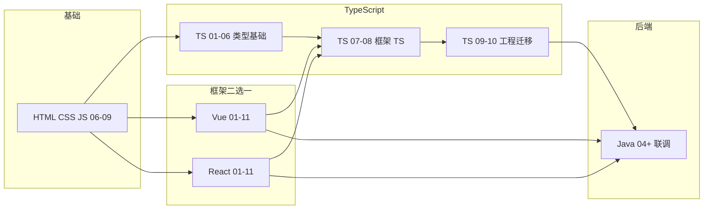

# TypeScript 学习路线图与说明

> **文件编码**：本文件夹内所有 `.md` 均为 **UTF-8**。`.ts` / `.tsx` 源文件建议 UTF-8；VS Code / Cursor 右下角确认编码。

---

## 1. 这套资料适合谁

- 已学完 [HTML/CSS/JS](../HTML%20CSS%20JS/00-学习路线图与说明.md) **06～09 章**（ES6、异步、模块化）的同学
- 正在学 [Vue 3](../Vue/00-学习路线图与说明.md) 或 [React](../React/00-学习路线图与说明.md)，想把项目从 `.js` 升级到 `.ts` 的学习者
- 计划投递前端/全栈岗位，需要补齐 **TypeScript** 这一面试与入职硬门槛的同学
- 目标：能独立配置 `tsconfig`、写带类型的函数与接口、给 Vue/React 组件补全类型、完成 **shop 项目 JS→TS 迁移**

**不适合**：

- 完全零基础、连 JS 变量和函数都不熟（请先学 HTML CSS JS 06～07）
- 已多年 TS + 复杂泛型体操的资深开发者（可直接看 09、11 查漏补缺）

**前置要求（自检）**：

| 能力 | 对应章节 | 自检方式 |
|------|----------|----------|
| ES6 箭头函数、解构 | JS 06～07 | 能改写 `function` 为箭头函数 |
| 模块化 import/export | JS 09 | 能拆多文件 |
| async/await | JS 08 | 能写 `await fetch` |
| 对象与数组操作 | JS 06～07 | 会用 map/filter/reduce |
| 读过 Vue 或 React 01 | 框架 01 | 能创建 Vite 项目 |

---

## 2. 为什么单独学 TypeScript

真实业务里 **Vue 3 / React 新项目大多默认 TS**。只学 JS 版框架会遇到：

| 场景 | 只有 JS 时 | 有 TS 时 |
|------|------------|----------|
| API 返回字段拼错 | 运行时才报错 | 编写时红线提示 |
| 组件 props 传错类型 | 控制台 warning | 编译期拦截 |
| 重构改函数签名 | 靠全局搜索碰运气 | IDE 自动列出所有引用 |
| 面试 | 「了解 TS」不够 | 能讲 interface、泛型、utility types |

TypeScript **不是新语言**，是 **JavaScript + 类型层**。运行时仍是 JS，类型在编译阶段被擦掉（erase）。

---

## 3. 技术栈主线

```text
TypeScript 入门（tsc / Vite+TS / tsconfig 初识）
  → 基本类型与类型注解（string / number / boolean / array / tuple）
  → 接口、类型别名、联合与交叉（interface vs type）
  → 函数类型与泛型（泛型约束、Partial / Pick / Omit 入门）
  → 类、枚举与类型收窄（class / enum / typeof / in）
  → 模块、声明文件与 @types（.d.ts / 三方库类型）
  → Vue 3 + TS（script setup lang=ts / defineProps / Pinia 类型）
  → React + TS（FC / useState 泛型 / 事件类型 / Zustand 类型）
  → 工程化（strict / paths / ESLint）
  → shop 项目 JS→TS 迁移实战
  → 面试专题与总表
```

与 Vue / React 平行对照：

| 能力 | JavaScript 写法 | TypeScript 写法 |
|------|-----------------|-----------------|
| 变量 | `let count = 0` | `let count: number = 0` |
| 函数 | `(a, b) => a + b` | `(a: number, b: number): number => a + b` |
| 对象形状 | 无 compile 检查 | `interface User { id: number; name: string }` |
| 组件 props | `defineProps(['title'])` | `defineProps<{ title: string }>()` |
| API 响应 | `res.data` 任意 | `interface Result<T> { code: number; data: T }` |
| 配置 | 无 | `tsconfig.json` strict 模式 |

---

## 4. 学习顺序（按编号）

```text
00 学习路线图（你现在在这里）
 ↓
01 TypeScript 入门与环境配置
 ↓
02 基本类型与类型注解
 ↓
03 接口、类型别名与联合交叉
 ↓
04 函数类型与泛型
 ↓
05 类、枚举与类型收窄
 ↓
06 模块、声明文件与三方库
 ↓
07 Vue 3 + TypeScript
 ↓
08 React + TypeScript
 ↓
09 工程化与 tsconfig 深入
 ↓
10 项目实战 JS→TS 迁移
 ↓
11 面试专题与知识点总表
```

### 4.1 阶段目标总览

| 阶段 | 文档 | 核心目标 | 产出物 |
|------|------|----------|--------|
| 入门 | 01～02 | 会跑 tsc、写基本类型 | `hello.ts` + 类型报错实验 |
| 类型系统 | 03～05 | interface、泛型、类型收窄 | `types/user.ts`、`api/result.ts` |
| 工程 | 06、09 | 声明文件、strict、paths | 完整 tsconfig + ESLint |
| 框架 | 07～08 | Vue/React 组件类型化 | 组件 props + store 类型 |
| 实战 | 10 | shop 项目迁移 | `.vue`/`.tsx` 全 TS 化 |
| 巩固 | 11 | 面试 + 自评 | 能口述 TS 与 JS 区别 |

### 4.2 与 Vue / React 并行节奏（推荐）

| 你的进度 | 同步学 TypeScript | 说明 |
|----------|-------------------|------|
| Vue/React 01～03 | TS 01～03 | 先建立类型直觉，框架仍可用 JS |
| Vue/React 04～07 | TS 04～06 | 泛型与模块，为 API 层打类型基础 |
| Vue/React 08 联调前 | **TS 01～06 必须完成** | axios 响应、store 需要类型 |
| Vue/React 08～11 | TS 07～10 | 框架 TS 化 + 项目迁移 |
| 面试前 | TS 11 + 框架 13/14 | 全栈复习 |



---

## 5. 主线练手项目：shop 类型化

与 [shop-vue](../Vue/00-学习路线图与说明.md) / [shop-react](../React/00-学习路线图与说明.md) **共用业务概念**，TypeScript 系列负责 **类型层演进**：

| 章节 | 在 shop 项目里做什么 |
|------|----------------------|
| 02 | 定义 `Product`、`User` 基础 interface |
| 03 | `ApiResult<T>`、`PageResult<T>` 统一响应类型 |
| 04 | 泛型工具函数 `request<T>()`、`formatPrice()` |
| 06 | 为无类型的 npm 包补声明；配置 `@/` 路径别名类型 |
| 07 或 08 | 组件 props、emit、store 全部类型化 |
| 09 | 开启 `strict: true`，修完所有红线 |
| 10 | 全项目 `.js` → `.ts` / `.tsx` 迁移清单验收 |

---

## 6. 必备工具与环境

| 工具 | 用途 | 安装 |
|------|------|------|
| Node.js 18+ | 运行 Vite、tsc | 官网 LTS |
| VS Code / Cursor | 编辑 + TS 语言服务 | 内置 TS 支持 |
| TypeScript | 编译器 | `npm i -g typescript` 或项目内 devDependency |

**验证环境**（01 章会详讲，这里先自检）：

```bash
node -v          # 期望 v18.x 或 v20.x
npx tsc -v       # 期望 Version 5.x
```

预期输出示例：

```text
v20.11.0
Version 5.4.5
```

---

## 7. 每份文档怎么学（四步法）

1. **通读**：本章解决什么问题？和 JS 写法差在哪？
2. **跟敲**：把示例完整敲一遍，**故意写错类型**看 TS 报什么错
3. **练习**：做文档末尾分级练习，对照参考答案
4. **迁移**：把当天学的类型用到 shop 项目对应文件

---

## 8. 常见 FAQ

### Q1：TS 要在 Vue/React 之前学吗？

**不必全部学完再开框架。** 推荐：JS 09 完成后 **同时开** 框架 01 和 TS 01；在框架 08（联调）前 **至少完成 TS 01～06**。

### Q2：Vue 用 TS 还是 React 用 TS 都要学吗？

**类型基础（01～06）只学一遍。** 07 章 Vue、08 章 React **按你选的主线精读，另一条浏览即可**。

### Q3：strict 模式太严格怎么办？

先 `strict: false` 跑通，09 章再逐步开 `strictNullChecks`、`noImplicitAny`。真实项目最终应开 strict。

### Q4：类型写太复杂怎么办？

能跑就行，优先 **interface 描述数据形状** + **泛型描述 API 响应**。高级体操（条件类型、infer）面试前看 11 章即可。

### Q5：和后端 Java 类型有什么关系？

概念相通（类、接口、泛型），但 TS 类型 **只在编译期存在**。联调时重点是 **前后端 JSON 字段对齐**，见 [Java 04](../../后端学习/Java/04-SpringBoot核心开发.md) 与框架 08 章。

---

## 9. 文档索引速查

| 编号 | 文件名 | 一句话 | 状态 |
|------|--------|--------|------|
| 00 | 学习路线图与说明 | 顺序、对照、FAQ | ✅ |
| 01 | TypeScript 入门与环境配置 | tsc、Vite+TS | ✅ |
| 02 | 基本类型与类型注解 | 原始类型、array、tuple | ✅ |
| 03 | 接口、类型别名与联合交叉 | interface vs type | ✅ |
| 04 | 函数类型与泛型 | 泛型、Partial/Pick | ✅ |
| 05 | 类、枚举与类型收窄 | class、enum、收窄 | ✅ |
| 06 | 模块、声明文件与三方库 | .d.ts、@types | ✅ |
| 07 | Vue 3 + TypeScript | setup + Pinia 类型 | ✅ |
| 08 | React + TypeScript | FC、Hooks 类型 | ✅ |
| 09 | 工程化与 tsconfig 深入 | strict、paths | ✅ |
| 10 | 项目实战 JS→TS 迁移 | shop 迁移清单 | ✅ |
| 11 | 面试专题与知识点总表 | 自评 + 常考题 | ✅ |

---

## 10. 与「强烈建议补」五项的关系

本文件夹对应扩展路线 **第 1 项（TypeScript）**。后续四项规划见 [修改规范](../../修改规范.md) §1.4：

| 顺序 | 主题 | 计划位置 |
|------|------|----------|
| 2 | Git 协作 | 扩写 HTML CSS JS/11 |
| 3 | 计算机网络 | 扩写 HTML CSS JS/10 |
| 4 | 浏览器与性能 | 待新建 |
| 5 | Web 安全 | 待新建 |

---

## 11. 我的笔记区

```text
学习开始日期：
当前进度（编号）：
Vue 还是 React 主线：
shop 项目是否已迁 TS：
薄弱点：
下周计划：
```

---

祝你学习顺利。**TypeScript 的核心价值 = 让大型前端项目的修改可预测、让 IDE 成为第二双眼睛。**
