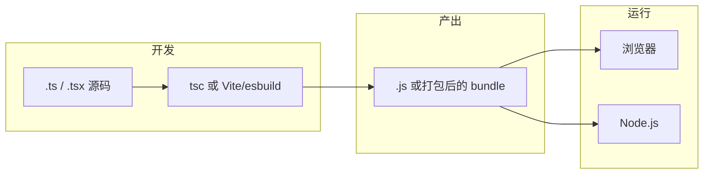
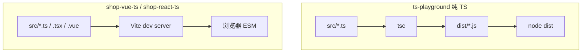

# TypeScript 入门与环境配置

## 本章衔接

[00 学习路线图](../TypeScript/00-学习路线图与说明.md) 已经告诉你：TypeScript 学什么、和 [Vue](../Vue/00-学习路线图与说明.md) / [React](../React/00-学习路线图与说明.md) 怎么配合、以及 **shop-vue / shop-react** 最终要迁到 `.ts`。本章是 **TypeScript 系列的第一块实操地基**。

<!-- 修改说明: 2026-06-30 按 EXPANSION-STANDARD 扩充 §0、DevTools/tsc 八步、FAQ≥12、闭卷自测、费曼 -->

---

## 0. 读前导读（零基础也能跟上）

> **读者假设**：你已会 [HTML CSS JS 06](../HTML%20CSS%20JS/06-JavaScript基础语法与数据类型.md) 变量/函数，或 [JS 07](../HTML%20CSS%20JS/07-JavaScript流程控制函数对象数组与ES6基础.md) 箭头函数与解构。本章不重复教 JS 语法，只教 **如何给 JS 贴类型标签** 并跑通编译器。

### 0.1 用一句话弄懂本章

**一句话**：安装 Node + TypeScript，写第一个 `hello.ts`，用 `tsc` 编译成 `hello.js`，再创建 Vite 的 vue-ts / react-ts 项目——让类型检查真正跑起来。

**生活类比**：JavaScript 是裸机快递；TypeScript 是在发货前贴 **重量/易碎/收件人** 标签；`tsc` 是仓库扫描仪——标签与内容不符就拒收。

**为什么重要**：[Vue 08 联调](../Vue/08-Axios网络请求与前后端联调.md) 和 [TS 07 Vue+TS](./07-Vue3与TypeScript.md) 都假设你已有 `tsconfig.json` 和 `lang="ts"` 环境。

---

### 0.2 你需要提前知道什么

| 能力 | 对应资料 | 不会则 |
|------|----------|--------|
| JS 变量、函数、对象 | [JS 06～07](../HTML%20CSS%20JS/06-JavaScript基础语法与数据类型.md) | 先补 JS |
| ES6 模块化 | [JS 09](../HTML%20CSS%20JS/11-前端工程化调试Git与包管理基础.md) | 06 章前补 |
| 终端 `npm` | [Vue 01](../Vue/01-Vue入门与环境搭建.md) | 跟 01 章 §3 安装 Node |

---

### 0.3 本章知识地图（☐→☑）

- [ ] 口述 TS 与 JS 关系（超集、编译、类型擦除）
- [ ] `node -v`、`npx tsc -v` 成功
- [ ] 独立完成 hello.ts → tsc → node
- [ ] 读懂 `tsconfig.json` 至少 5 个字段
- [ ] 创建 ts-playground 并 `tsc --watch`
- [ ] 创建 shop-vue-ts 或 shop-react-ts 并 `npm run dev`
- [ ] VS Code 选 Use Workspace Version
- [ ] 闭卷自测 ≥ 7/10

---

### 0.4 建议学习时长

| 阶段 | 时间 |
|------|------|
| §1～§2 概念 | 30 分钟 |
| §3～§5 环境 + hello.ts | 1 小时 |
| §6～§7 ts-playground + watch | 1 小时 |
| §8 Vite + TS 项目 | 45 分钟 |
| §9 DevTools + 自测 | 30 分钟 |
| **合计** | **约 3～4 小时** |

---

### 0.5 可验证成果

1. 终端执行 `tsc hello.ts` 生成 `hello.js`，且故意 `greet(123)` 时 tsc 报 `TS2345`。
2. `ts-playground` 里 `npm run build && npm start` 打印 shop 摘要。
3. 浏览器打开 `localhost:5173` 的 vue-ts 或 react-ts 欢迎页。

---

### 0.6 核心术语三件套

**术语（TypeScript）**：JavaScript 的超集，增加静态类型；编译为 JS 后运行。
**生活类比**：给 JS **贴类型标签**——`name: string` 表示这个变量只能装字符串。
**为什么重要**：全系列基础；Vue `<script lang="ts">` 即在此之上。
**本章用到的地方**：§1、§4 hello.ts。

**术语（tsc）**：TypeScript 官方编译器，把 `.ts` 转为 `.js` 并做类型检查。
**生活类比**：仓库扫描仪——扫描标签与货物是否一致。
**为什么重要**：CI 里 `tsc --noEmit` 是团队质量门禁。
**本章用到的地方**：§4、§5、§9 DevTools 八步。

**术语（tsconfig.json）**：告诉 tsc 编译哪些文件、输出目录、是否 strict。
**生活类比**：仓库 **总规章**——所有包裹同一标准检验。
**为什么重要**：shop 全项目共享一份 strict 规则。
**本章用到的地方**：§5。

---

**前置要求**（不会请先补课）：

| 能力 | 对应资料 |
|------|----------|
| JS 变量、函数、对象 | [HTML CSS JS 06～07](../HTML%20CSS%20JS/00-学习路线图与说明.md) |
| ES6 模块化 import/export | [HTML CSS JS 09](../HTML%20CSS%20JS/11-前端工程化调试Git与包管理基础.md) |
| 会用终端执行 `npm` 命令 | [Vue 01](../Vue/01-Vue入门与环境搭建.md) 或 [React 01](../React/01-React入门与环境搭建.md) 环境部分 |

如果你 **完全不会 JavaScript**，请先学 HTML CSS JS，不要从本章硬啃——TypeScript 是 **在 JS 之上加类型层**，不是替代 JS。

本章你要完成四件具体的事：

1. 理解 TypeScript 和 JavaScript 的关系、编译流程
2. 在本机安装 Node.js，能用 `tsc` 编译 `hello.ts`
3. 读懂 `tsconfig.json` 最基础的几个字段
4. 用 Vite 创建带 TypeScript 的 **react-ts** 或 **vue-ts** 模板项目并成功 `npm run dev`

这是后面 02～11 章、以及 shop 项目 JS→TS 迁移（[10 章预告](../TypeScript/10-项目实战JS到TS迁移.md)）的起点。

---

## 1. TypeScript 是什么

### 1.1 一句话定义

**TypeScript（简称 TS）** 是微软开发的、在 **JavaScript 语法之上增加静态类型系统** 的语言。你写的 `.ts` 文件经 **编译器 `tsc`**（或 Vite 内置的 esbuild）转成 **普通 `.js`**，最终在浏览器或 Node 里跑的仍是 JavaScript。

### 1.2 通俗理解：给 JS 加「说明书」

| 类比 | JavaScript | TypeScript |
|------|------------|------------|
| 快递 | 只写「一个盒子」 | 写「易碎、重 2kg、内含手机」 |
| 函数 | `function add(a, b) { return a + b }` | `function add(a: number, b: number): number { return a + b }` |
| 出错时机 | 用户点了按钮、接口返回了才崩 | **写代码时** IDE 红线、**编译时** `tsc` 报错 |

TypeScript **不发明新的运行时能力**（没有 TS 专属的「引擎 API」）。它的价值在 **开发阶段**：更早发现错误、更好的自动补全、重构更安全。

### 1.3 TypeScript 和 JavaScript 的关系

```text
你写的代码（.ts / .tsx）
        ↓  类型检查 + 编译（擦除类型）
浏览器 / Node 执行的代码（.js）
```

要点：

- **超集**：合法 JS 几乎总是合法 TS（少数例外如 `enum` 是 TS 独有）
- **可选渐进**：老项目可以 `.js` 和 `.ts` 混用，慢慢迁移（见 [10 章](../TypeScript/10-项目实战JS到TS迁移.md)）
- **类型擦除**：编译后类型信息消失，运行时没有 `typeof number` 这种「类型守卫」以外的 TS 魔法

### 1.4 为什么前端要学 TypeScript

真实业务里 Vue 3 / React 新项目 **大多默认 TS 模板**。只学 JS 版框架会遇到：

| 场景 | 只有 JS | 有 TS |
|------|---------|-------|
| API 字段拼错 `user.nmae` | 运行时才 `undefined` | 编写时红线 |
| 组件 props 传错类型 | 控制台 warning | 编译期拦截 |
| 重构改函数参数 | 全局搜索碰运气 | IDE 列出所有引用 |
| 面试 | 「了解」不够 | 能讲 interface、泛型、utility types |

与 [Java 后端](../../后端学习/Java/00-学习路线图与说明.md) 联调时，TS 的 `interface` 和 Java 的 DTO 概念相通——重点是 **JSON 字段对齐**，见框架 08 章与 Java 04。

### 1.5 深入解释：为什么「类型只在编译期」

```typescript
// ts
const price: number = 99
```

编译成 JS 后大致是：

```javascript
const price = 99
```

**为什么这样设计？**

1. **兼容现有 JS 生态**：所有 npm 包、浏览器引擎无需改
2. **零运行时开销**：类型检查不拖慢线上性能
3. **渐进采用**：可以先不加类型，再慢慢收紧 `strict`

若类型留在运行时，要么要新虚拟机，要么要额外库——成本太高。TS 选择 **编译期守门员 + 运行时仍是 JS** 这条路。

---

## 2. TypeScript 编译流程

### 2.1 从 `.ts` 到可执行代码



### 2.2 两种常见编译方式

| 方式 | 命令 / 工具 | 典型场景 |
|------|-------------|----------|
| **tsc** | `npx tsc` | 纯 TS 练习、Node 脚本、库项目 |
| **Vite** | `npm run dev` / `build` | Vue/React 前端工程（内部用 esbuild 转 TS，类型检查靠 IDE + 可选 `tsc --noEmit`） |

初学阶段：**先用 `tsc` 理解「编译」**，再用 Vite 体验真实前端工程。

### 2.3 `.ts` 和 `.tsx` 的区别

| 扩展名 | 含义 |
|--------|------|
| `.ts` | 纯 TypeScript，不含 JSX |
| `.tsx` | 含 JSX（React 组件必须用 `.tsx`） |
| `.vue` + `<script lang="ts">` | Vue 单文件组件里的 TS 块 |

---

## 3. 环境准备（Windows 详细步骤）

### 3.1 安装 Node.js

1. 打开 https://nodejs.org/
2. 下载 **LTS**（推荐 18 或 20）
3. 安装时勾选 **Add to PATH**
4. 打开 **PowerShell**：

```bash
node -v
# 预期输出：v18.x.x 或 v20.x.x

npm -v
# 预期输出：9.x.x 或 10.x.x
```

**若提示「不是内部或外部命令」**：重启终端；仍不行则检查系统环境变量 `Path` 是否包含 Node 安装目录。

### 3.2 配置 npm 镜像（国内强烈建议）

```bash
npm config set registry https://registry.npmmirror.com

npm config get registry
# 预期输出：https://registry.npmmirror.com/
```

### 3.3 安装 TypeScript 编译器

**方式 A：全局安装（练习方便）**

```bash
npm install -g typescript

tsc -v
# 预期输出：Version 5.x.x
```

**方式 B：仅项目内安装（工程推荐，后面 Vite 项目会用）**

```bash
npm install typescript --save-dev
npx tsc -v
# 预期输出：Version 5.x.x
```

两种方式二选一即可；本章练习用 **全局 `tsc`** 或 **`npx tsc`** 都行。

### 3.4 VS Code / Cursor 插件

| 插件 | 作用 |
|------|------|
| 内置 TypeScript | 无需额外装，`.ts` 自动有类型提示 |
| ESLint | 代码规范（Vite 模板可选带） |
| Vue - Official | 学 Vue 主线时装（`.vue` + TS） |

右下角编码确认为 **UTF-8**。

---

## 4. 第一个 TypeScript 文件：hello.ts

### 4.1 创建练习目录

在例如 `f:\study\projects` 下：

```bash
mkdir ts-hello
cd ts-hello
```

### 4.2 编写 hello.ts

新建 `hello.ts`（注意扩展名是 `.ts`）：

```typescript
// hello.ts — 第一个 TypeScript 程序
function greet(name: string): string {
  return `你好，${name}！欢迎学习 TypeScript。`
}

const message: string = greet('shop 学员')
console.log(message)

const version: number = 5
console.log('当前 TS 大版本约：', version)
```

要点：

- `name: string` 表示参数必须是字符串
- `: string` 在函数后表示返回值类型
- `const message: string` 显式标注变量类型（下一章会讲「类型推断」）

### 4.3 用 tsc 编译

```bash
tsc hello.ts
```

**预期输出**：终端无报错；当前目录出现 `hello.js`。

```bash
dir
# 预期看到：hello.ts  hello.js
```

查看 `hello.js`（类型已被擦掉）：

```javascript
function greet(name) {
  return `你好，${name}！欢迎学习 TypeScript。`
}
const message = greet('shop 学员')
console.log(message)
const version = 5
console.log('当前 TS 大版本约：', version)
```

### 4.4 用 Node 运行编译结果

```bash
node hello.js
```

**预期输出**：

```text
你好，shop 学员！欢迎学习 TypeScript。
当前 TS 大版本约： 5
```

### 4.5 故意写错类型（体验 TS 守门）

把 `hello.ts` 里 `greet(123)` 改成传数字，保存后：

```bash
tsc hello.ts
```

**预期输出（报错示例）**：

```text
hello.ts:7:24 - error TS2345: Argument of type 'number' is not assignable to parameter of type 'string'.

7 const message: string = greet(123)
                         ~~~

Found 1 error in hello.ts:7
```

这就是 **编译期拦截**——JS 里 `123` 会被当成字符串拼接或产生奇怪结果，TS 直接不让编译通过（除非你关掉检查或用 `any`，02 章讲）。

---

## 5. tsconfig.json 初识

单独 `tsc hello.ts` 只编译一个文件。真实项目用 **`tsconfig.json`** 告诉编译器：编译哪些文件、输出到哪、严格程度等。

### 5.1 在 ts-hello 里生成默认配置

```bash
cd f:\study\projects\ts-hello
tsc --init
```

**预期输出**：

```text
Created a new tsconfig.json
```

会生成一个带很多注释的 `tsconfig.json`。初学可 **精简** 为：

```json
{
  "compilerOptions": {
    "target": "ES2020",
    "module": "ESNext",
    "moduleResolution": "node",
    "strict": true,
    "esModuleInterop": true,
    "skipLibCheck": true,
    "outDir": "./dist",
    "rootDir": "./src"
  },
  "include": ["src/**/*"]
}
```

### 5.2 核心字段说明

| 字段 | 含义 | 初学建议 |
|------|------|----------|
| `target` | 编译后 JS 语法版本 | `ES2020` 或 `ES2022` |
| `module` | 模块系统 | 前端/Vite 用 `ESNext` |
| `strict` | 开启严格类型检查套件 | 先 `true`，卡住见 [09 章](../TypeScript/09-工程化与tsconfig深入.md) |
| `outDir` | 编译输出目录 | `dist` |
| `rootDir` | 源码根目录 | `src` |
| `include` | 哪些文件参与编译 | `["src/**/*"]` |

### 5.3 调整目录并批量编译

```bash
mkdir src
move hello.ts src\hello.ts
```

若 `hello.js` 还在根目录，可删除：

```bash
del hello.js
```

执行：

```bash
tsc
```

**预期**：生成 `dist/hello.js`，无报错。

```text
dist/
  hello.js
src/
  hello.ts
tsconfig.json
```

### 5.4 深入解释：为什么需要 tsconfig 而不是每次 tsc 一个文件

小练习可以 `tsc file.ts`，但 **shop-vue / shop-react** 有上百个 `.ts` / `.tsx`：

- 统一 `strict` 规则，避免「这个文件严、那个文件松」
- `include` / `exclude` 控制范围，不编译 `node_modules`
- `paths` 配置 `@/` 别名（[09 章](../TypeScript/09-工程化与tsconfig深入.md)）
- CI 里跑 `tsc --noEmit` 只做类型检查、不产出文件

**一个配置文件 = 整个项目的类型契约。**

---

## 6. 手把手全流程一：ts-playground 练习项目

目标：建立一个 **只练 TS、不碰框架** 的小仓库，习惯 `src` + `tsc` + `watch`。

### 6.1 创建项目

```bash
cd f:\study\projects
mkdir ts-playground
cd ts-playground
npm init -y
npm install typescript --save-dev
npx tsc --init
```

编辑 `tsconfig.json`（在已有基础上改）：

```json
{
  "compilerOptions": {
    "target": "ES2020",
    "module": "CommonJS",
    "strict": true,
    "outDir": "./dist",
    "rootDir": "./src",
    "esModuleInterop": true,
    "skipLibCheck": true
  },
  "include": ["src/**/*"]
}
```

说明：Node 直接跑 `dist` 时，`CommonJS` + `require` 最省事；Vite 项目里会用 `ESNext`。

### 6.2 示例源码

`src/index.ts`：

```typescript
// ts-playground/src/index.ts
interface ShopInfo {
  name: string
  productCount: number
}

const shop: ShopInfo = {
  name: 'shop-vue 练习商城',
  productCount: 128,
}

function formatShopSummary(info: ShopInfo): string {
  return `${info.name} 共有 ${info.productCount} 件商品`
}

console.log(formatShopSummary(shop))
```

`src/utils/price.ts`：

```typescript
export function formatPrice(cents: number): string {
  return `¥${(cents / 100).toFixed(2)}`
}
```

`src/index.ts` 顶部增加：

```typescript
import { formatPrice } from './utils/price'
console.log('示例价格：', formatPrice(19900))
```

### 6.3 编译与运行

```bash
npx tsc
node dist/index.js
```

**预期输出**：

```text
shop-vue 练习商城 共有 128 件商品
示例价格： ¥199.00
```

### 6.4 在 package.json 里加脚本

编辑 `package.json` 的 `scripts`：

```json
{
  "scripts": {
    "build": "tsc",
    "start": "node dist/index.js",
    "dev": "tsc --watch"
  }
}
```

```bash
npm run build
npm start
```

---

## 7. watch 模式：改代码自动编译

开发时不想每次改完都手敲 `tsc`，用 **监听模式**：

```bash
npx tsc --watch
# 或
npm run dev
```

**预期输出**：

```text
[上午10:30:00] Starting compilation in watch mode...

[上午10:30:01] Found 0 errors. Watching for file changes.
```

此时修改 `src/index.ts` 并保存，终端会显示：

```text
[上午10:31:15] File change detected. Starting incremental compilation...

[上午10:31:15] Found 0 errors. Watching for file changes.
```

再执行 `node dist/index.js` 看新结果。Vite 的 `npm run dev` 则是 **不产出 dist、直接热更新浏览器**，理念类似但针对前端工程。

---

## 8. 手把手全流程二：Vite + TypeScript 工程

真实 **shop-vue** / **shop-react** 不会手写 `tsc` 跑页面，而是用 **Vite**。下面二选一；你主线学 Vue 选 A，学 React 选 B。

### 8.1 方式 A：Vue + TS（shop-vue 技术栈）

```bash
cd f:\study\projects
npm create vite@latest shop-vue-ts -- --template vue-ts
cd shop-vue-ts
npm install
```

**预期 `npm install` 结尾**：大量 `added xxx packages`，无 `ERR!`。

```bash
npm run dev
```

**预期输出**：

```text
  VITE v5.x.x  ready in 400 ms

  ➜  Local:   http://localhost:5173/
  ➜  Network: use --host to expose
```

浏览器打开后看到 Vite + Vue 欢迎页。关键文件：

```text
shop-vue-ts/
├── src/
│   ├── App.vue          ← <script setup lang="ts">
│   ├── main.ts          ← 入口是 .ts
│   └── components/
│       └── HelloWorld.vue
├── tsconfig.json
├── tsconfig.app.json
├── tsconfig.node.json
└── vite.config.ts
```

`App.vue` 片段：

```vue
<script setup lang="ts">
import { ref } from 'vue'

const count = ref(0)
</script>
```

`lang="ts"` 表示 script 块用 TypeScript。与 [Vue 01](../Vue/01-Vue入门与环境搭建.md) 的 JS 版对比，只是多了类型与 `.ts` 入口；业务逻辑在 [TS 07](../TypeScript/07-Vue3与TypeScript.md) 深入。

### 8.2 方式 B：React + TS（shop-react 技术栈）

```bash
cd f:\study\projects
npm create vite@latest shop-react-ts -- --template react-ts
cd shop-react-ts
npm install
npm run dev
```

关键文件：

```text
shop-react-ts/
├── src/
│   ├── App.tsx          ← React 组件用 .tsx
│   ├── main.tsx
│   └── vite-env.d.ts
├── tsconfig.json
└── vite.config.ts
```

`App.tsx` 里已有 TS 类型示例（如 `useState`）。详见 [TS 08](../TypeScript/08-React与TypeScript.md)。

### 8.3 Vite 项目里的类型检查

Vite 开发时 **转译很快**，但 **不一定跑完整 tsc**。建议在 `package.json` 加：

```json
{
  "scripts": {
    "typecheck": "tsc --noEmit"
  }
}
```

```bash
npm run typecheck
```

**预期**：无报错时终端安静结束；有类型错误会列出文件和行号。

### 8.4 与纯 tsc 项目的关系



---

## 9. VS Code 的 TypeScript 支持

### 9.1 类型提示与悬停

在 `.ts` 文件里把鼠标悬停在变量上，会显示推断或标注的类型。`Ctrl + 空格` 触发补全。

### 9.2 查看 TS 版本

VS Code 右下角可能显示 `TypeScript 5.x.x`。点击可选择 **Use Workspace Version**（使用项目 `node_modules/typescript`），与 CLI 的 `tsc` 版本一致，避免「编辑器不报错、命令行报错」。

### 9.3 快速修复

光标放在报错处，`Ctrl + .` 打开建议：插入类型、改为 `unknown`、添加 `// @ts-ignore`（慎用）等。

### 9.4 跳转到定义

`F12` 跳转到类型定义；对三方库会跳到 `.d.ts` 声明文件（[06 章](../TypeScript/06-模块声明文件与三方库.md)）。

---

## 9.5 DevTools 与 tsc 八步（手把手）

> 目标：从「写 TS」到「看见编译结果」完整走一遍；与 [JS 06 Console 调试](../HTML%20CSS%20JS/06-JavaScript基础语法与数据类型.md) 互补——那边看运行时，这边看 **编译期**。

| 步骤 | 你的动作 | 预期看到什么 | 若不对 |
|------|----------|--------------|--------|
| 1 | 打开 VS Code/Cursor，新建文件夹 `ts-hello` | 空目录 | — |
| 2 | 新建 `hello.ts`，写 `greet(name: string)` | 悬停 `name` 显示 `string` | 确认文件扩展名是 `.ts` |
| 3 | 终端 `node -v` | `v18.x` 或 `v20.x` | 安装 Node LTS |
| 4 | 终端 `npx tsc -v` | `Version 5.x` | `npm i -g typescript` 或项目内 devDep |
| 5 | `tsc hello.ts` | 无报错，生成 `hello.js` | 看 §13 报错表 |
| 6 | 打开 `hello.js` 对比源码 | **无** `: string` 类型 | 理解类型擦除 |
| 7 | `node hello.js` | 打印问候语 | 先 tsc 再 node |
| 8 | 改 `greet(123)` 再 `tsc` | `TS2345` 红线/终端报错 | 说明类型标签生效 |

**浏览器 DevTools（Vite 项目）**：

| 步骤 | 动作 | 预期 |
|------|------|------|
| 1 | `npm run dev` 后 F12 开 Console | Vite 连接成功 |
| 2 | Sources 里找 `src/main.ts` | 可设断点（TS 源码映射） |
| 3 | 故意改 props 类型错 | 终端或 overlay 报 TS 错（视模板而定） |
| 4 | 右下角 TS 版本 → Use Workspace Version | 与 `npx tsc` 一致 |

```typescript
// hello.ts 逐行读（>10 行示例）
// | 行 | 含义 | 改错会怎样 |
// |----|------|------------|
// | function greet(name: string) | 参数贴 string 标签 | 传 number → TS2345 |
// | : string 返回值 | 必须 return string | return 123 → TS2322 |
// | const message: string = ... | 变量显式标签 | 赋 number → 报错 |
// | console.log(message) | 运行时 JS API | 与 JS 06 相同 |
```

---

## 10. ts-node 与 tsx（可选了解）

若想在 **不先 tsc 出 dist** 的情况下直接跑 `.ts`：

| 工具 | 安装 | 用法 |
|------|------|------|
| **tsx**（推荐） | `npm i -D tsx` | `npx tsx src/index.ts` |
| **ts-node** | `npm i -D ts-node` | `npx ts-node src/index.ts` |

```bash
cd ts-playground
npm install tsx --save-dev
npx tsx src/index.ts
```

**预期输出**：与 `node dist/index.js` 相同。

前端 Vite 项目 **不需要** ts-node；这只在 Node 脚本、练习时省事。生产构建仍靠 `tsc` 或打包器。

---

## 11. 本章知识点清单（可自查）

- [ ] 能口述 TS 与 JS 的关系（超集、编译、类型擦除）
- [ ] Node.js、`tsc -v` 可用
- [ ] 能编写、编译、运行 `hello.ts`
- [ ] 能解释 `tsconfig.json` 里 `strict`、`outDir`、`include`
- [ ] 能创建并运行 `ts-playground`（`tsc` + `node`）
- [ ] 会用 `tsc --watch`
- [ ] 能用 Vite 创建 `vue-ts` 或 `react-ts` 并 `npm run dev`
- [ ] 知道 VS Code 工作区 TS 版本的选择

---

## 12. 分级练习

### 12.1 基础

1. 在 `ts-hello/src` 新建 `calc.ts`，写函数 `add(a: number, b: number): number`，编译后在 Node 里打印 `add(2, 3)`。
2. 故意让 `add('1', 2)` 通过编译失败，抄下完整报错英文关键词。

### 12.2 进阶

在 `ts-playground` 中新增 `src/user.ts`，定义变量 `userName: string` 和 `userId: number`，在 `index.ts` 里 `import` 并打印。用 `npm run dev`（watch）改 `userName` 观察自动编译。

### 12.3 挑战

给 `shop-vue-ts` 或 `shop-react-ts` 的 `App` 增加一个 **带类型** 的 `price: number`（Vue 用 `ref<number>`，React 用 `useState<number>`），页面上显示「商品价格：¥xx」。

### 12.4 参考答案

**基础 — calc.ts**：

```typescript
export function add(a: number, b: number): number {
  return a + b
}

console.log(add(2, 3))
```

```bash
npx tsc
node dist/calc.js
# 预期：5
```

**进阶 — user.ts**：

```typescript
export const userName = '张三'
export const userId = 10001
```

`index.ts`：

```typescript
import { userName, userId } from './user'
console.log(userId, userName)
```

**挑战 — Vue（shop-vue-ts App.vue）**：

```vue
<script setup lang="ts">
import { ref } from 'vue'

const price = ref<number>(19900)

function formatPrice(cents: number): string {
  return `¥${(cents / 100).toFixed(2)}`
}
</script>

<template>
  <p>商品价格：{{ formatPrice(price) }}</p>
</template>
```

**挑战 — React（shop-react-ts App.tsx）**：

```tsx
import { useState } from 'react'

function formatPrice(cents: number): string {
  return `¥${(cents / 100).toFixed(2)}`
}

export default function App() {
  const [price] = useState<number>(19900)
  return <p>商品价格：{formatPrice(price)}</p>
}
```

---

## 13. 常见报错与排查（务必收藏）

| 报错信息（关键词） | 可能原因 | 解决方案 |
|-------------------|---------|---------|
| `'tsc' 不是内部或外部命令` | 未安装 TS 或未在 PATH | `npm i -g typescript` 或用 `npx tsc` |
| `Cannot find module 'typescript'` | 项目未装 devDependency | `npm install typescript --save-dev` |
| `Argument of type 'X' is not assignable to parameter of type 'Y'` | 实参与形参类型不匹配 | 改传参或改类型定义（02 章） |
| `Cannot find name 'xxx'` | 变量未声明或拼写错误 | 检查 import、变量名 |
| `File 'xxx.ts' is not under 'rootDir'` | 文件不在 `rootDir` 下 | 移到 `src` 或改 `rootDir` |
| `Option 'outDir' cannot be overwritten` | 多次冲突配置 | 检查是否有多份 tsconfig |
| `TS5023: Unknown compiler option` | tsconfig 字段写错 | 对照官方文档改字段名 |
| `Port 5173 is in use` | Vite 端口占用 | 关旧进程或 `npm run dev -- --port 5174` |
| 编辑器无红线但 `tsc` 报错 | VS Code 用了不同 TS 版本 | 选 Use Workspace Version |
| `Failed to resolve import` | 路径错误或缺扩展名配置 | 检查相对路径；Vite 用 `@/` 见 09 章 |
| `npm create vite` 卡住 | 网络问题 | 配置 npmmirror 镜像 |
| `Unexpected token '<'` | 把 `.tsx` 当 `.ts` 编译 | React 组件文件用 `.tsx` |

---

## 14. FAQ

**Q1：要先学完 TS 再学 Vue/React 吗？**  
不必。JS 09 完成后可 **并行** 开框架 01 和 TS 01；联调前（[Vue 08](../Vue/08-Axios网络请求与前后端联调.md)）建议完成 TS 01～06。

**Q2：全局 `tsc` 和项目内 `typescript` 冲突吗？**  
可能版本不一致。工程里优先 `npx tsc`，编辑器用 Workspace Version。

**Q3：`strict: true` 太严怎么办？**  
先理解报错含义，09 章讲如何逐步开启；不要长期关 strict。

**Q4：create-vue 和 `vite --template vue-ts` 区别？**  
`create-vue` 是 Vue 官方脚手架，可选 TS；`vite vue-ts` 是更薄的 Vite 模板。本资料 shop 项目可用任一，类型学习等价。

**Q5：和后端 Java 类型一样吗？**  
概念类似（类、接口），但 TS 类型不保留到运行时；联调看 JSON 字段是否一致。

**Q6：「给 JS 贴类型标签」在哪一步生效？**  
**写代码时** IDE 提示 + **tsc 编译时** 报错；`node` 跑 `.js` 时不检查类型。

**Q7：为什么要先 tsc 再 node？**  
Node 只执行 JS；`.ts` 必须先编译。Vite dev 在内存里转译，概念相同。

**Q8：`tsconfig` 里 `rootDir` 和 `outDir` 搞反会怎样？**  
报 `File is not under 'rootDir'` 或输出目录混乱；源码放 `src/`，输出放 `dist/`。

**Q9：Vite 项目还要不要 tsc？**  
**要。** 开发时 Vite 转译快但可能不做完整类型检查；加 `"typecheck": "tsc --noEmit"`。

**Q10：Windows 下 `move`/`del` 命令不熟？**  
可用资源管理器拖动文件；或用 PowerShell `Move-Item`、`Remove-Item`。

**Q11：tsx 和 tsc 选哪个练手？**  
初学 **先 tsc** 理解编译产物；熟练后用 `tsx` 直接跑 `.ts` 省事。

**Q12：01 章和 [TS 07 Vue+TS](./07-Vue3与TypeScript.md) 什么关系？**  
01 搭环境；07 在 `.vue` 里写 `lang="ts"`、`defineProps`。07 依赖 01～06。

---

## 14.1 闭卷自测

1. **概念**：TS 编译后类型去哪了？（类型擦除）
2. **概念**：`.ts` 和 `.tsx` 区别？
3. **概念**：`strict: true` 大致管什么？
4. **概念**：Vite 与纯 `tsc` 项目各适合什么场景？
5. **概念**：Workspace Version 解决什么问题？
6. **动手**：写出编译 `hello.ts` 并运行的两条命令。
7. **动手**：`tsconfig.json` 里 `include` 的作用？
8. **综合**：为何 `greet(123)` 在 JS 可能不崩、在 TS 编译失败？
9. **综合**：shop-vue-ts 里 `main.ts` 与 JS 版 Vue 项目差在哪？
10. **综合**：从 01 到 [Vue 08](../Vue/08-Axios网络请求与前后端联调.md) 还需学 TS 哪几章？

### 自测参考答案

1. 擦除；`.js` 里无 `: string` 等注解。
2. `.tsx` 可含 JSX（React）；`.ts` 纯 TS。
3. 严格空值、隐式 any 等一整套检查。
4. tsc：练习/Node 脚本；Vite：Vue/React 前端工程。
5. 编辑器与 CLI 使用同一 TS 版本，避免「编辑器不报错、tsc 报错」。
6. `tsc hello.ts` → `node hello.js`。
7. 指定哪些文件参与编译，如 `["src/**/*"]`。
8. JS 可能隐式转换；TS 参数贴了 `string` 标签，123 不匹配。
9. 入口 `.ts`、`script lang="ts"`、多份 tsconfig。
10. 02～06（类型、interface、泛型、类、模块）。

---

## 14.2 费曼检验

**请 3 分钟向朋友解释：TypeScript 是什么、为什么要先装 Node。**

**对照提纲**：

1. **贴标签**：TS 给 JS 加类型，编译成 JS 后在浏览器跑。
2. **tsc 扫描仪**：编译时发现标签贴错；比运行时报错更早。
3. **Node 是工具链**：跑 npm、tsc、Vite；浏览器不直接执行 `.ts`。

---

## 15. 学完标准

完成本章时，你应能 **在不查资料的情况下**：

1. 用三句话说明 TypeScript 是什么、和 JavaScript 的关系
2. 独立创建 `hello.ts`，执行 `tsc` 与 `node`，并解释 `hello.js` 里为何没有类型
3. 说出 `tsconfig.json` 中至少 4 个字段的作用
4. 独立创建 `ts-playground` 并完成 `src` → `dist` 编译运行
5. 使用 `tsc --watch` 或 npm 脚本监听编译
6. 用 Vite 创建 `vue-ts` 或 `react-ts` 项目并成功打开 localhost:5173
7. 遇到 `TS2345` 类报错时，能读懂「哪个类型不能赋给哪个类型」

---

## 16. 下一章预告

环境能跑、编译流程懂了，但 `hello.ts` 里的 `string`、`number` 只是冰山一角。真实 shop 项目里还有：**商品列表数组、库存元组、可能为空的用户信息、`any` 与 `unknown` 的取舍**。

下一章（[02 基本类型与类型注解](../TypeScript/02-基本类型与类型注解.md)）系统讲 **原始类型、数组、元组、void、never、类型推断、字面量类型入门、对象类型**，并用 **Product / User** 为 shop-vue、shop-react 打类型地基。届时你会写出：

```typescript
interface Product {
  id: number
  name: string
  price: number
  inStock: boolean
}
```

而不是「全是 any、靠运气调接口」。

---

*下一章：[02 基本类型与类型注解](../TypeScript/02-基本类型与类型注解.md)*
