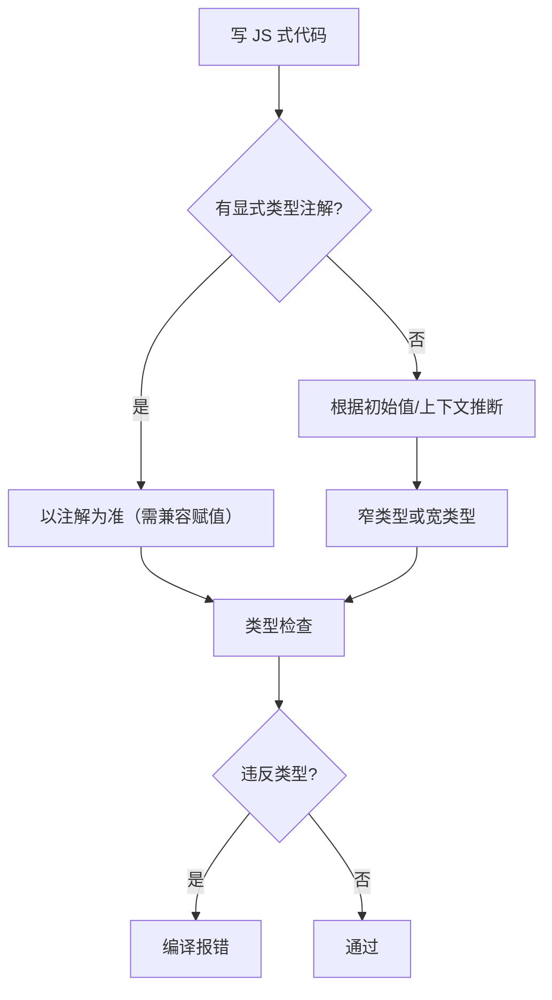

# 基本类型与类型注解

## 本章衔接

上一章（[01 TypeScript 入门与环境配置](../TypeScript/01-TypeScript入门与环境配置.md)）你已经能跑 `tsc`、读懂 `tsconfig.json` 基础字段、用 Vite 拉起 **vue-ts / react-ts** 项目。本章进入 TypeScript 的 **第一座核心大山：类型系统本身**。

<!-- 修改说明: 2026-06-30 按 EXPANSION-STANDARD 扩充 §0、DevTools/tsc、FAQ≥12、闭卷自测、费曼 -->

---

## 0. 读前导读（零基础也能跟上）

> **读者假设**：熟悉 [HTML CSS JS 06](../HTML%20CSS%20JS/06-JavaScript基础语法与数据类型.md) 的 string/number/boolean/数组/对象。TS 原始类型与 JS **运行时一致**，多的是 **贴类型标签** 的写法。

### 0.1 用一句话弄懂本章

**一句话**：给变量、参数、返回值贴上 `string`/`number`/`boolean` 等标签，并学会 `any`/`unknown`/`never`/`void` 的取舍——为 shop 的 `Product`、`User` 打地基。

**生活类比**：

| 概念 | 类比 |
|------|------|
| `let price: number` | 盒子上贴「只装数字」 |
| `Product[]` | 一排同款商品货架 |
| `[page, size]` 元组 | 固定两格的快递格口 |
| `unknown` | 未开箱包裹——先检查再动 |
| `interface Product` | **合同**预览（03 章展开） |

**为什么重要**：[Vue 07 Pinia](../Vue/07-Pinia状态管理.md) 的 `ref<Product[]>`、[TS 07](./07-Vue3与TypeScript.md) 的 props 都建立在基本类型之上。

---

### 0.2 你需要提前知道什么

| 缺什么 | 跳到哪 |
|--------|--------|
| JS 七种类型、typeof | [JS 06 §4～§11](../HTML%20CSS%20JS/06-JavaScript基础语法与数据类型.md) |
| 箭头函数、解构 | [JS 07](../HTML%20CSS%20JS/07-JavaScript流程控制函数对象数组与ES6基础.md) |
| 还没装 tsc | [TS 01 §3～§4](./01-TypeScript入门与环境配置.md) |

---

### 0.3 本章知识地图（☐→☑）

- [ ] 变量/参数/返回值注解
- [ ] `null`/`undefined` 与 strictNullChecks
- [ ] `T[]`、元组、readonly
- [ ] `any` vs `unknown` vs `never` vs `void`
- [ ] 类型推断与 `as const`
- [ ] `interface Product` / `User` / `CartLine`
- [ ] 完成 `ts-types-lab`
- [ ] 闭卷自测 ≥ 7/10

---

### 0.4 建议学习时长

| 阶段 | 时间 |
|------|------|
| §1～§3 注解与原始类型 | 1.5 小时 |
| §4～§9 数组/元组/any/unknown | 2 小时 |
| §10～§12 推断/字面量/对象 | 1.5 小时 |
| §13 shop-types 实战 | 1 小时 |
| 自测 + 练习 | 1 小时 |
| **合计** | **约 6～7 小时** |

---

### 0.5 可验证成果

1. `shop-types.ts` 通过 `strict: true` 的 `tsc`。
2. 能解释为何 shop 金额用 `priceCents: number`（分）而非浮点元。
3. 写 `parseQuantity(input: unknown)` 不用 `any`。

---

**前置**：熟悉 [HTML CSS JS 06～07](../HTML%20CSS%20JS/00-学习路线图与说明.md) 里的 JS 数据类型（string、number、boolean、null、undefined、对象、数组）。TypeScript 的原始类型与 JS **运行时行为一致**，多出来的是 **编译期的约束与推断**。

本章你要完成：

1. 掌握 `string` / `number` / `boolean` / `null` / `undefined` 及注解写法
2. 会写数组类型、元组，理解 `any` / `unknown` / `never` / `void`
3. 理解 **类型推断** 与 **字面量类型** 入门
4. 用 **对象类型** 描述 shop 的 `Product`、`User`，为 [03 接口与联合类型](../TypeScript/03-接口类型别名与联合交叉.md) 铺路

建议在 `ts-playground`（01 章创建）或新建 `ts-types-lab` 里跟敲本章所有示例。

---

## 1. 类型注解是什么

### 1.1 语法形式

在 **变量、函数参数、返回值** 上标明「这里应该是什么类型」：

```typescript
// ts-types-lab/src/01-annotation.ts
let shopName: string = 'shop-vue 商城'
let productCount: number = 42
let isOpen: boolean = true

function greet(customer: string): string {
  return `欢迎光临，${customer}`
}

console.log(greet(shopName), productCount, isOpen)
```

| 位置 | 示例 | 含义 |
|------|------|------|
| 变量 | `let x: number = 1` | `x` 只能是 number |
| 参数 | `(id: number)` | 调用时必须传 number |
| 返回值 | `(): string` | 函数必须返回 string |

### 1.2 注解 vs 类型推断

```typescript
let price = 19900        // 推断为 number，不必写 : number
let title = '无线耳机'   // 推断为 string

// price = '九十九'  // 报错：不能将 string 赋给 number
```

**何时显式写类型？**

- 函数参数（无默认值时推断不出来）
- 变量先声明后赋值、或需要「更宽/更窄」类型时
- 导出 API、组件 props，方便他人阅读

### 1.3 深入解释：为什么推断不是「偷懒」，而是默认最佳实践

```typescript
const ids = [1, 2, 3]
// ids 推断为 number[]，若你写 const ids: number[] = [1, 2, 3] 也可以

ids.push(4)     // OK
// ids.push('4') // 报错
```

若到处手写 `: number`：

- 改逻辑时要 **改两处**（值和类型），容易不一致
- 代码噪音大，掩盖真正需要约束的地方

TS 哲学：**能推断就推断，不能推断或需要契约时再注解**。接口、函数边界、组件 props 是注解的重点区。

---

## 2. 原始类型：string、number、boolean

### 2.1 string（字符串）

```typescript
let productName: string = '机械键盘 K87'
let sku: string = 'KB-2024-001'
let description: string = `商品：${productName}，SKU：${sku}`

// 模板字符串推断也是 string
const tag = `#${sku}`
```

与 JS 一致：单引号、双引号、反引号均可。

### 2.2 number（数字）

```typescript
let priceCents: number = 29900      // 整数
let discountRate: number = 0.15     // 小数
let temperature: number = -5
let hex: number = 0xff              // 十六进制
let binary: number = 0b1010         // 二进制

// 没有 int / float 区分，全是 number
```

**shop 惯例**：金额用 **分（整数）** 存，避免浮点误差：`19900` 表示 ¥199.00。展示时用 `formatPrice`（[04 章](../TypeScript/04-函数类型与泛型.md)）。

### 2.3 boolean（布尔）

```typescript
let inStock: boolean = true
let isDeleted: boolean = false
let canCheckout: boolean = priceCents > 0 && inStock
```

注意：不要用 `number` 代替 `boolean`（如 `1/0`），TS 在严格模式下会拦 `if (1)` 以外的错误赋值。

### 2.4 运行示例

`src/02-primitives.ts`：

```typescript
export function formatProductLine(
  name: string,
  priceCents: number,
  inStock: boolean,
): string {
  const status = inStock ? '有货' : '售罄'
  const priceYuan = (priceCents / 100).toFixed(2)
  return `${name} — ¥${priceYuan}（${status}）`
}

console.log(formatProductLine('蓝牙耳机', 15900, true))
```

```bash
npx tsc && node dist/02-primitives.js
# 预期：蓝牙耳机 — ¥159.00（有货）
```

---

## 3. null 与 undefined

### 3.1 含义

| 类型 | JS 含义 | 典型场景 |
|------|---------|----------|
| `undefined` | 未赋值、缺省 | 可选字段未传、`find` 没找到 |
| `null` | 刻意为空 | 后端返回「用户无头像」显式 null |

```typescript
let nickname: string | undefined = undefined
let avatarUrl: string | null = null

nickname = '小明'
avatarUrl = 'https://cdn.example.com/a.png'
```

`string | undefined` 是 **联合类型** 预览，[03 章](../TypeScript/03-接口类型别名与联合交叉.md) 系统讲。

### 3.2 strictNullChecks

`tsconfig` 里 `strict: true` 包含 **严格空值检查**：

```typescript
let email: string = undefined
// 报错：Type 'undefined' is not assignable to type 'string'
```

必须显式：

```typescript
let email: string | undefined
email = undefined // OK
```

### 3.3 可选属性入门

```typescript
type UserPreview = {
  id: number
  name: string
  nickname?: string // 等价 nickname: string | undefined
}

const u: UserPreview = { id: 1, name: '李四' }
// nickname 可不写
```

### 3.4 深入解释：为什么 null 和 undefined 要分开

历史上 JS 混用两者；TS 在严格模式下逼你 **在类型上区分「没字段」和「空值」**，减少：

```typescript
function getLength(s: string) {
  return s.length
}

getLength(undefined) // 运行时崩，strict 下编译就拦
```

联调时看后端 JSON：字段缺失 vs `"avatar": null` 语义不同，前端类型应反映这一点（03 章 interface 会用在 `User` 上）。

---

## 4. 数组类型

### 4.1 两种写法

```typescript
let productIds: number[] = [101, 102, 103]
let tags: Array<string> = ['热销', '新品', '包邮']

// 多维
let matrix: number[][] = [[1, 2], [3, 4]]
```

`number[]` 与 `Array<number>` **等价**，团队选一种风格统一即可；本资料多用 `T[]`。

### 4.2 只读数组

```typescript
const categories: readonly string[] = ['数码', '服饰', '食品']
// categories.push('家电') // 报错：readonly 不能 push
```

### 4.3 shop 商品列表示例

```typescript
interface Product {
  id: number
  name: string
  priceCents: number
  inStock: boolean
}

const productList: Product[] = [
  { id: 101, name: '机械键盘', priceCents: 29900, inStock: true },
  { id: 102, name: '显示器', priceCents: 129900, inStock: false },
]

function listInStock(items: Product[]): Product[] {
  return items.filter((p) => p.inStock)
}

console.log(listInStock(productList).length) // 1
```

此处 `interface` 先亮相，03 章会对比 `type`；本章重点是 **数组元素类型**。

### 4.4 元组 Tuple 入门预告

数组是同类型元素的「可变长度列表」；**元组** 是 **固定长度、各位置类型可不同**：

```typescript
// 下一节详讲
type Point2D = [number, number]
const rgb: [number, number, number] = [255, 128, 0]
```

---

## 5. 元组（Tuple）

### 5.1 定义与用法

```typescript
// 坐标、RGB、分页 [page, pageSize]
type PageQuery = [number, number]

const defaultPage: PageQuery = [1, 20]

function parsePage(query: PageQuery): { page: number; size: number } {
  const [page, size] = query
  return { page, size }
}

console.log(parsePage([2, 50]))
// 预期：{ page: 2, size: 50 }
```

### 5.2 可选元素与剩余元素

```typescript
type StringNumberBooleans = [string, number?, ...boolean[]]
const row: StringNumberBooleans = ['订单号', 10001, true, false]
```

### 5.3 shop 场景：API 返回二元组

```typescript
// [错误码, 数据] — 仅作练习，真实项目用对象更常见
type ApiTuple<T> = [number, T | null]

function mockFetchProduct(id: number): ApiTuple<Product> {
  if (id === 102) {
    return [0, { id: 102, name: '显示器', priceCents: 129900, inStock: false }]
  }
  return [404, null]
}

const [code, data] = mockFetchProduct(102)
if (code === 0 && data !== null) {
  console.log(data.name)
}
```

### 5.4 元组 vs 数组

| | 数组 `number[]` | 元组 `[number, number]` |
|--|----------------|-------------------------|
| 长度 | 任意 | 固定（除非剩余元素） |
| 元素类型 | 通常相同 | 各位置可不同 |
| 适用 | 商品列表 | 分页参数、坐标、React `useState` 配对 |

---

## 6. any：关闭类型检查（慎用）

### 6.1 行为

```typescript
let legacy: any = 'hello'
legacy = 42
legacy.foo.bar() // 编译不报错，运行可能崩
```

`any` 让 TS **放弃检查**，与写 JS 无异。

### 6.2 何时会出现

- 迁移老 JS：`let x: any` 临时兜底
- 错误使用：懒得写类型
- 某些动态 JSON 未建模

### 6.3 为什么应少用

```typescript
function broken(price: any) {
  return price + 100 // 若 price 是 string，结果不可预期
}

broken('199') // '199100'
```

`noImplicitAny: true`（在 `strict` 里）会逼你给 **隐式 any** 补类型。长期靠 `any` 会失去 TS 价值。

---

## 7. unknown：安全的「未知类型」

### 7.1 与 any 对比

```typescript
let input: unknown = JSON.parse('{"id":1}')

// input.id     // 报错：unknown 上不能任意访问
// input + 1    // 报错

if (typeof input === 'object' && input !== null && 'id' in input) {
  const obj = input as { id: number }
  console.log(obj.id)
}
```

| | `any` | `unknown` |
|--|-------|-----------|
| 赋值 | 任意类型可赋给 any | 几乎任意可赋给 unknown |
| 使用 | 可直接操作 | 必须先 **收窄** 或断言 |
| 安全 | 低 | 高 |

### 7.2 典型场景：解析外部数据

```typescript
function parseUserId(raw: unknown): number | null {
  if (typeof raw === 'number' && Number.isInteger(raw)) {
    return raw
  }
  if (typeof raw === 'string' && /^\d+$/.test(raw)) {
    return Number(raw)
  }
  return null
}

console.log(parseUserId('10001')) // 10001
console.log(parseUserId(null))    // null
```

收窄手法在 [05 章](../TypeScript/05-类枚举与类型收窄.md) 展开（`typeof`、`in`、自定义 type guard）。

---

## 8. never：永不存在的值

### 8.1 含义

`never` 表示 **不可能发生** 的类型：

```typescript
function fail(message: string): never {
  throw new Error(message)
}

function infiniteLoop(): never {
  while (true) {
    // 永不返回
  }
}
```

### 8.2 联合类型中的 never

```typescript
type Demo = string | never // 等价 string
```

### 8.3 穷尽检查（预览）

```typescript
type OrderStatus = 'pending' | 'paid' | 'shipped'

function assertNever(x: never): never {
  throw new Error(`Unexpected: ${x}`)
}

function handleStatus(status: OrderStatus): string {
  switch (status) {
    case 'pending':
      return '待支付'
    case 'paid':
      return '已支付'
    case 'shipped':
      return '已发货'
    default:
      return assertNever(status)
  }
}
```

若将来给 `OrderStatus` 加了 `'cancelled'` 却忘了改 `switch`，`status` 流入 `default` 时类型不是 `never`，**编译报错**——防止漏分支。

---

## 9. void：无有意义返回值

### 9.1 函数返回 void

```typescript
function logProduct(name: string, price: number): void {
  console.log(`${name}: ¥${price / 100}`)
  // 不要 return 一个有用的值；return; 或 return undefined 可以
}

logProduct('鼠标', 8900)
```

`void` 表示调用方 **不应依赖返回值**。与 `undefined` 不同：`void` 是「忽略返回值」的契约。

### 9.2 void 变量（少见）

```typescript
let useless: void = undefined
// 只有 undefined 能赋给 void
```

事件回调常用 `() => void`（React/Vue 事件类型在 07/08 章）。

---

## 10. 类型推断详解

### 10.1 变量推断

```typescript
const fixedPrice = 9900           // number 字面量 → number
const literal = '包邮' as const   // 字面量类型 '包邮'，见下节
let mutable = '包邮'              // string
```

### 10.2 函数返回值推断

```typescript
function double(n: number) {
  return n * 2 // 推断返回 number
}

const triple = (n: number) => n * 3 // 推断 (n: number) => number
```

### 10.3 上下文推断

```typescript
const products: Product[] = []
products.push({
  id: 1,
  name: 'U盘',
  priceCents: 5900,
  inStock: true,
})
// push 的参数从 products 元素类型推断为 Product
```

### 10.4 推断流程（直觉图）



---

## 11. 字面量类型入门

### 11.1 字符串与数字字面量

```typescript
type Currency = 'CNY' | 'USD'
let currency: Currency = 'CNY'
// currency = 'EUR' // 报错

type HttpOk = 200
const ok: HttpOk = 200
```

### 11.2 as const 断言

```typescript
const SHOP_CONFIG = {
  name: 'shop-vue',
  version: 1,
  features: ['cart', 'checkout'],
} as const

// SHOP_CONFIG.name 类型为 'shop-vue' 而非 string
// SHOP_CONFIG.features 为 readonly ['cart', 'checkout']
```

### 11.3 shop 订单状态

```typescript
type PaymentMethod = 'wechat' | 'alipay' | 'card'

interface OrderDraft {
  userId: number
  payMethod: PaymentMethod
}

const draft: OrderDraft = {
  userId: 10001,
  payMethod: 'wechat',
}
```

字面量 + 联合 = **枚举的轻量替代**（[05 章 enum](../TypeScript/05-类枚举与类型收窄.md) 对比）。

---

## 12. 对象类型基础

### 12.1 type 与 interface（本章用 interface 描述形状）

```typescript
interface Product {
  id: number
  name: string
  priceCents: number
  inStock: boolean
  description?: string
  tags?: string[]
}
```

### 12.2 只读与可选

```typescript
interface User {
  readonly id: number
  name: string
  email?: string
  phone?: string
}

const user: User = { id: 10001, name: '王五' }
// user.id = 2 // 报错：readonly
```

### 12.3 索引签名（动态键）

```typescript
interface StockMap {
  [productId: number]: number // 库存数量
}

const stock: StockMap = {
  101: 50,
  102: 0,
}
```

### 12.4 函数属性

```typescript
interface PriceFormatter {
  format(cents: number): string
}

const formatter: PriceFormatter = {
  format(cents) {
    return `¥${(cents / 100).toFixed(2)}`
  },
}
```

03 章会深入 `interface` vs `type`、交叉类型；本章掌握 **对象形状** 即可。

---

## 13. shop 实战：Product 与 User 类型体系

与 [shop-vue](../Vue/00-学习路线图与说明.md) / [shop-react](../React/00-学习路线图与说明.md) 对齐，在 `src/shop-types.ts` 集中定义（后续可迁到真实项目 `src/types/`）。

```typescript
// src/shop-types.ts — shop 核心实体类型（本章版）

/** 商品 */
export interface Product {
  id: number
  name: string
  priceCents: number
  inStock: boolean
  coverUrl?: string
  categoryId: number
  tags?: string[]
}

/** 用户 */
export interface User {
  readonly id: number
  username: string
  displayName: string
  email?: string
  avatarUrl?: string | null
  role: 'customer' | 'admin'
}

/** 购物车行：商品 + 数量 */
export type CartLine = {
  product: Product
  quantity: number
}

/** 分页查询元组 */
export type PageTuple = [page: number, pageSize: number]

export function createDefaultPage(): PageTuple {
  return [1, 20]
}

export function calcCartTotal(lines: CartLine[]): number {
  return lines.reduce((sum, line) => sum + line.product.priceCents * line.quantity, 0)
}

export function findProductById(list: Product[], id: number): Product | undefined {
  return list.find((p) => p.id === id)
}

// --- 演示数据 ---
const catalog: Product[] = [
  {
    id: 101,
    name: '机械键盘 K87',
    priceCents: 29900,
    inStock: true,
    categoryId: 1,
    tags: ['热销'],
  },
  {
    id: 102,
    name: '27 寸显示器',
    priceCents: 129900,
    inStock: false,
    categoryId: 1,
  },
]

const currentUser: User = {
  id: 10001,
  username: 'zhangsan',
  displayName: '张三',
  email: 'zhangsan@example.com',
  avatarUrl: null,
  role: 'customer',
}

const lines: CartLine[] = [
  { product: catalog[0], quantity: 2 },
]

console.log('用户', currentUser.displayName)
console.log('购物车合计（分）', calcCartTotal(lines))
console.log('默认分页', createDefaultPage())
```

```bash
npx tsc && node dist/shop-types.js
```

**预期输出**：

```text
用户 张三
购物车合计（分） 59800
默认分页 [ 1, 20 ]
```

### 13.1 与框架项目的衔接

| 文件（概念） | Vue shop-vue-ts | React shop-react-ts |
|--------------|-----------------|---------------------|
| 类型定义 | `src/types/product.ts` | `src/types/product.ts` |
| 列表 state | `ref<Product[]>` | `useState<Product[]>` |
| 用户 store | Pinia + `User`（07 章） | Zustand + `User`（08 章） |

[10 章 JS→TS 迁移](../TypeScript/10-项目实战JS到TS迁移.md) 会把 `.js` 里的松散对象换成上述 interface。

### 13.2 深入解释：为什么商城要先建模 Product / User

没有类型时：

```javascript
function showPrice(p) {
  return p.price / 100 // 后端改成分 priceCents，页面显示错 100 倍
}
```

有类型后：

```typescript
function showPrice(p: Product) {
  return p.priceCents / 100 // 改字段名时全项目编译失败，被迫改对
}
```

**类型 = 业务词汇表**。`Product`、`User`、`CartLine` 与产品、后端 DTO 对齐后，联调（[Java 04](../../后端学习/Java/04-SpringBoot核心开发.md)、框架 08）成本大幅下降。

---

## 14. 类型注解常见写法速查

| 场景 | 写法 |
|------|------|
| 字符串 | `let s: string` |
| 数字 | `let n: number` |
| 布尔 | `let b: boolean` |
| 可能为空 | `let x: string \| null` |
| 可能未定义 | `let x: string \| undefined` |
| 数字数组 | `number[]` 或 `Array<number>` |
| 元组 | `[number, string]` |
| 对象 | `interface X { ... }` |
| 函数 | `(a: number, b: number): number` |
| 无返回值 | `(): void` |
| 不知道类型 | `unknown`（优先）而非 `any` |

---

## 15. 手把手全流程：types-lab 综合练习

```bash
cd f:\study\projects
mkdir ts-types-lab
cd ts-types-lab
npm init -y
npm install typescript --save-dev
npx tsc --init
```

精简 `tsconfig.json`：

```json
{
  "compilerOptions": {
    "target": "ES2020",
    "module": "CommonJS",
    "strict": true,
    "outDir": "./dist",
    "rootDir": "./src",
    "esModuleInterop": true,
    "skipLibCheck": true
  },
  "include": ["src/**/*"]
}
```

按本章顺序创建：

```text
src/
  01-annotation.ts
  02-primitives.ts
  shop-types.ts
  lab-main.ts      ← 汇总运行
```

`lab-main.ts`：

```typescript
import { calcCartTotal, createDefaultPage, type Product } from './shop-types'

const flashSale: Product = {
  id: 201,
  name: '限时秒杀耳机',
  priceCents: 9900,
  inStock: true,
  categoryId: 2,
}

console.log('秒杀商品', flashSale.name)
console.log('分页', createDefaultPage())
console.log('空购物车', calcCartTotal([]))
```

```bash
npx tsc
node dist/lab-main.js
```

**预期**：

```text
秒杀商品 限时秒杀耳机
分页 [ 1, 20 ]
空购物车 0
```

---

## 16. 本章知识点清单

- [ ] 能写变量、参数、返回值的类型注解
- [ ] 理解 `null` / `undefined` 与 `strictNullChecks`
- [ ] 会写 `T[]`、`readonly`、元组
- [ ] 能解释 `any` vs `unknown` vs `never` vs `void`
- [ ] 理解类型推断与何时显式注解
- [ ] 会用字面量类型与 `as const`
- [ ] 能用 `interface` 描述 `Product`、`User`
- [ ] 能在 shop-types 里组合 `CartLine`、`PageTuple`

---

## 17. 分级练习

### 17.1 基础

1. 定义 `boolean` 变量 `isVip`，`string` 数组 `coupons`，编译运行打印。
2. 写函数 `repeatName(name: string, times: number): string`，返回重复 `times` 次的 name。

### 17.2 进阶

1. 给 `Product` 增加 `weightGram?: number`，更新 `catalog` 数据。
2. 写 `getUserLabel(user: User): string`，无 `email` 时只返回 `displayName`，有则返回 `displayName <email>`。
3. 用元组类型表示 RGB，写 `toHex(rgb: [number, number, number]): string`（简单实现即可）。

### 17.3 挑战

1. 写 `parseQuantity(input: unknown): number`，合法正整数才返回，否则抛错或返回 `never` 路径用 `throw`。
2. 定义 `ApiResult<T>` 为 `{ code: number; data: T | null; message?: string }`，写 `mockGetUser(id: number): ApiResult<User>`。

### 17.4 参考答案

**基础 repeatName**：

```typescript
function repeatName(name: string, times: number): string {
  return name.repeat(times)
}
console.log(repeatName('券', 3)) // 券券券
```

**进阶 getUserLabel**：

```typescript
function getUserLabel(user: User): string {
  if (user.email) {
    return `${user.displayName} <${user.email}>`
  }
  return user.displayName
}
```

**进阶 toHex**：

```typescript
function toHex(rgb: [number, number, number]): string {
  const parts = rgb.map((n) => n.toString(16).padStart(2, '0'))
  return `#${parts.join('')}`
}
console.log(toHex([255, 128, 0])) // #ff8000
```

**挑战 parseQuantity**：

```typescript
function parseQuantity(input: unknown): number {
  if (typeof input === 'number' && Number.isInteger(input) && input > 0) {
    return input
  }
  if (typeof input === 'string' && /^\d+$/.test(input)) {
    const n = Number(input)
    if (n > 0) return n
  }
  throw new Error('Invalid quantity')
}
```

**挑战 ApiResult**：

```typescript
interface ApiResult<T> {
  code: number
  data: T | null
  message?: string
}

function mockGetUser(id: number): ApiResult<User> {
  if (id === 10001) {
    return {
      code: 0,
      data: {
        id: 10001,
        username: 'zhangsan',
        displayName: '张三',
        role: 'customer',
      },
    }
  }
  return { code: 404, data: null, message: '用户不存在' }
}
```

---

## 18. 常见报错与排查

| 报错信息（关键词） | 可能原因 | 解决方案 |
|-------------------|---------|---------|
| `Type 'string' is not assignable to type 'number'` | 把字符串赋给 number 变量 | 改值或改类型注解 |
| `Type 'undefined' is not assignable to type 'string'` | strict 下未声明可空 | 用 `string \| undefined` 或可选属性 |
| `Object is possibly 'undefined'` | 使用可能为 undefined 的值 | 判空、`?.`、非空断言（慎用） |
| `Property 'x' does not exist on type` | 对象上无该字段 | 补 interface 或改字段名 |
| `Argument of type 'X' is not assignable to parameter of type 'Y'` | 传参类型不对 | 检查函数签名与调用处 |
| `Type 'any' is not assignable` | 严格模式下 any 流入 | 用具体类型或 unknown + 收窄 |
| `Tuple type '[...]' of length N has no element at index M` | 元组下标越界 | 检查元组长度定义 |
| `The type 'readonly ...' is readonly` | 修改 readonly 数组 | 复制后再改，或不用 readonly |
| `Index signature for type 'string' is missing` | 动态键未声明索引签名 | 加 `[key: string]: T` 或 Record |
| `This kind of expression is always truthy` | 类型收窄写错 | 检查条件逻辑 |
| `Parameter 'x' implicitly has an 'any' type` | 参数无类型且无法推断 | 补类型注解 |
| `Type 'never' is not assignable` | switch 漏分支或逻辑死代码 | 补全分支或改类型 |

---

## 19. FAQ

**Q1：`number[]` 和 `[number, number]` 何时选哪个？**  
长度固定、各位置语义不同用元组；同质列表用数组。

**Q2：能用 `any` 快速跑通吗？**  
练习可以，shop 项目与面试不行。用 `unknown` + 收窄代替。

**Q3：`interface` 和 `type` 用哪个？**  
对象形状两者都可；03 章对比。团队统一风格即可。

**Q4：金额用 number 安全吗？**  
展示层注意除 100；金融级用整数分或 decimal 库，类型仍是 `number`。

**Q5：和 Java 的 `int`、`String` 对应关系？**  
概念类似，但 TS 只有 `number`、`string` 等，且仅编译期存在。

**Q6：类型推断和 [JS 06](../HTML%20CSS%20JS/06-JavaScript基础语法与数据类型.md) 的弱类型有何不同？**  
JS 运行时随意改类型；TS 推断后 **再赋值不同类型** 会编译报错。

**Q7：`readonly` 和 `const` 区别？**  
`const` 变量不能重新绑定；`readonly` 属性不能重新赋值，对象引用仍可换。

**Q8：为什么 `avatarUrl?: string | null` 两种空都要写？**  
字段缺失（undefined）与后端显式 `null` 语义不同，联调见 [Vue 08](../Vue/08-Axios网络请求与前后端联调.md)。

**Q9：`never` 和 `void` 初学者怎么记？**  
`void`：函数不关心返回值；`never`：函数 **永不正常返回**（throw、死循环）。

**Q10：`as const` 和字面量类型有什么用？**  
锁定配置对象为只读窄类型，避免 `'shop-vue'` 被拓宽成 `string`。

**Q11：02 章的 Product 和 03 章重复吗？**  
02 打 **基本形状**；03 加 **ApiResult、联合、交叉** 与后端对齐。

**Q12：如何在 DevTools 里验证类型？**  
类型 **编译期** 验证——改错类型看 tsc/IDE 红线；运行时 Console 看不到类型（已擦除）。

---

## 19.1 DevTools 与 tsc 验证基本类型

| 步骤 | 动作 | 预期 | 若不对 |
|------|------|------|--------|
| 1 | `ts-types-lab` 里 `npx tsc` | 0 errors | 看 §18 报错表 |
| 2 | `shop-types.ts` 里 `priceCents = '99'` | TS2322 | 标签是 number |
| 3 | `catalog[0].priice` 故意拼错 | Property does not exist | interface 合同生效 |
| 4 | `parseQuantity(null)` 若返回 number | 需 unknown 收窄 | 见 §7 |
| 5 | IDE 悬停 `Product` | 显示 interface 字段 | 09 章 paths |

---

## 19.2 闭卷自测

1. **概念**：类型推断何时优于显式注解？
2. **概念**：`unknown` 比 `any` 安全在哪？
3. **概念**：元组与 `number[]` 区别？
4. **概念**：`strictNullChecks` 下 `email: string` 能否赋 `undefined`？
5. **概念**：为何 shop 用 `priceCents` 整数？
6. **动手**：写 `interface User` 含 `readonly id` 和可选 `email`。
7. **动手**：写 `findProductById` 返回 `Product | undefined`。
8. **综合**：`CartLine` 含嵌套 `Product`，说明类型如何防字段拼错。
9. **综合**：从 JS 06 的 `typeof` 到 TS 02 的 `unknown` 收窄，有何延续？
10. **综合**：02 章类型如何被 [TS 07 Vue+TS](./07-Vue3与TypeScript.md) 消费？

### 自测参考答案

1. 有初始值且类型明确时让 TS 推断；函数参数、导出 API 显式注解。
2. unknown 使用前必须收窄；any 可任意操作。
3. 元组长度固定、各位置类型可不同；数组元素通常同型、长度可变。
4. 不能；需 `string | undefined` 或 `email?`。
5. 避免浮点误差；与后端「分」对齐。
6. `interface User { readonly id: number; name: string; email?: string }`
7. `list.find(p => p.id === id)` 返回 `Product | undefined`。
8. 访问 `line.product.priceCents` 拼错 `price` 全项目编译失败。
9. 都用 typeof/判断缩小类型；TS 在编译期强制。
10. `ref<Product[]>`、`defineProps<{ product: Product }>()` 等。

---

## 19.3 费曼检验

**3 分钟解释：什么是类型注解、为什么不用 any。**

**对照提纲**：

1. **贴标签**：`: number` 告诉编译器这格只放数字。
2. **合同雏形**：interface 描述对象有哪些字段（03 章完整讲）。
3. **unknown 开箱检查**：外部数据先验证再用，any 等于关检查。

---

## 20. 学完标准

1. 不查资料写出 `Product`、`User` 的 `interface`，并各举 3 个字段说明类型选择理由
2. 解释 `any`、`unknown`、`never`、`void` 各适合什么场景
3. 能读懂并修复 `TS2322`、`TS2345` 类「类型不兼容」报错
4. 能写 `Product[]` 过滤函数、`CartLine[]` 合计函数且通过 `strict` 编译
5. 说清「类型推断」与「显式注解」各自适用时机
6. 完成 `ts-types-lab` 综合练习并成功运行 `lab-main.ts`

---

## 21. 下一章预告

本章的 `Product`、`User` 用 `interface` 描述 **固定形状**；实际业务还有：

- 多种支付方式、订单状态 → **联合类型** `type Status = 'pending' | 'paid'`
- API 统一包装 → `ApiResult<T>` **泛型**（[04 章](../TypeScript/04-函数类型与泛型.md)）
- `interface` 与 `type` 何时选谁、交叉类型 `A & B`

下一章（[03 接口、类型别名与联合交叉](../TypeScript/03-接口类型别名与联合交叉.md)）在 shop 类型上叠加 **`ApiResult<T>`、`PageResult<T>`**，让 axios 响应和列表分页都有据可依。同时你会系统掌握 **字面量联合** 替代魔法字符串。

---

*下一章：[03 接口、类型别名与联合交叉](../TypeScript/03-接口类型别名与联合交叉.md)*
