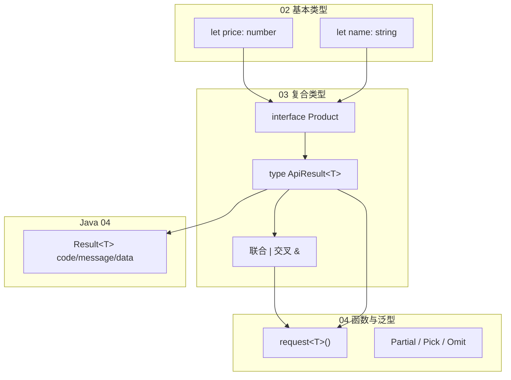
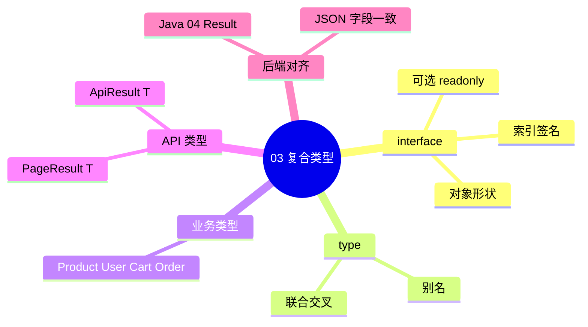

# 接口、类型别名与联合交叉

## 本章与上一章的关系

[02-基本类型与类型注解](./02-基本类型与类型注解.md) 教会你用 `string`、`number`、`boolean`、数组、元组给变量「贴标签」。但 shop 项目里一个**商品**有 `id`、`name`、`price`、`stock` 四个字段，一个**用户**有 `id`、`username`、`email`——如果每个函数都写四个独立参数，代码会迅速失控。

这一章引入 **interface（接口）** 和 **type（类型别名）**，用**一个名字描述一整块对象形状**；再用 **联合 `|`** 和 **交叉 `&`** 表达「可能是 A 或 B」「同时满足 A 和 B」。最后定义 **`ApiResult<T>`** 和 **`PageResult<T>`**，与后端 [04-SpringBoot核心开发](../../后端学习/Java/04-SpringBoot核心开发.md) 的 `Result<T>` JSON 结构一一对齐——这是 Vue/React 08 章联调时 TypeScript 化的**第一块基石**。



**学完本章，你应该能在 `src/types/` 下独立写出 shop 项目全部核心业务类型。**

---

## 1. 为什么需要 interface 和 type？

### 1.1 没有对象类型时的问题

```typescript
// ❌ 每个函数重复写形状，改字段要改 N 处
function renderProduct(p: { id: number; name: string; price: number; stock: number }) {}
function addToCart(p: { id: number; name: string; price: number; stock: number }) {}
function formatProductRow(p: { id: number; name: string; price: number; stock: number }) {}
```

### 1.2 用 interface 一次定义、处处复用

```typescript
interface Product {
  id: number
  name: string
  price: number
  stock: number
}

function renderProduct(p: Product) {}
function addToCart(p: Product) {}
```

| 对比项 | 内联对象类型 | interface / type |
|--------|-------------|------------------|
| 复用 | 复制粘贴 | 导入一次 |
| 重构 | 全局搜索 | IDE 自动追踪引用 |
| 可读性 | 函数签名臃肿 | 语义清晰 |
| 扩展 | 难 | `extends` / 交叉 `&` |

**TypeScript 类型只在编译期存在**，运行时仍是普通 JS 对象——这与 Java 的 `interface` 在 JVM 里的行为不同，但**描述数据形状**的思路相通。

---

## 2. interface 基础：描述 shop 实体

### 2.1 Product — 商品

```typescript
// src/types/product.ts
export interface Product {
  id: number
  name: string
  price: number       // 单位：元，保留两位小数由展示层处理
  stock: number
  categoryId?: number // 可选：见 §3
}
```

### 2.2 User — 用户

对应后端 [04 章 UserVO](../../后端学习/Java/04-SpringBoot核心开发.md)：`id`、`name`、`age`。shop 前端扩展了电商字段：

```typescript
// src/types/user.ts
export interface User {
  id: number
  username: string
  email: string
  avatar?: string
}
```

### 2.3 CartItem — 购物车项

```typescript
// src/types/cart.ts
import type { Product } from './product'

export interface CartItem {
  productId: number
  quantity: number
  product: Product   // 嵌套：购物车项持有完整商品快照
}
```

### 2.4 Order — 订单

```typescript
// src/types/order.ts
export interface Order {
  id: number
  orderNo: string
  userId: number
  totalAmount: number
  status: OrderStatus  // 字面量联合，见 §10
  items: OrderItem[]
  createdAt: string    // ISO 8601 字符串，JSON 无 Date 类型
}

export interface OrderItem {
  productId: number
  productName: string
  price: number
  quantity: number
}
```

---

## 3. 可选属性 `?` 与只读 `readonly`

### 3.1 可选属性

字段名后加 `?` 表示**可以不存在**（类型为 `T | undefined`）：

```typescript
interface Product {
  id: number
  name: string
  price: number
  stock: number
  description?: string   // 可能没有详情
  thumbnail?: string
}

const p1: Product = { id: 1, name: '机械键盘', price: 299, stock: 50 }
const p2: Product = {
  id: 2,
  name: '显示器',
  price: 1299,
  stock: 10,
  description: '27 寸 4K',
}
```

**访问可选属性要防御性编程**（05 章类型收窄会系统讲）：

```typescript
function showDesc(p: Product) {
  // 安全：可选链
  console.log(p.description?.slice(0, 50) ?? '暂无描述')
}
```

### 3.2 readonly — 禁止重新赋值

```typescript
interface CartSummary {
  readonly itemCount: number
  readonly totalPrice: number
}

const summary: CartSummary = { itemCount: 3, totalPrice: 897 }
// summary.itemCount = 5  // ❌ TS2540: Cannot assign to 'itemCount' because it is a read-only property
```

| 修饰符 | 含义 | 典型场景 |
|--------|------|----------|
| 无 | 可读可写 | 普通表单字段 |
| `?` | 可缺失 | 详情页扩展字段 |
| `readonly` | 可读不可写 | 计算结果、API 快照 |

### 3.3 readonly 与 const 的区别

```typescript
const nums = [1, 2, 3] as const           // 元组只读 + 字面量类型
interface Point { readonly x: number; readonly y: number }
```

`readonly` 只阻止**属性重新赋值**，不阻止对象整体被替换（除非变量本身是 `const`）。

---

## 4. 索引签名 — 动态键的对象

当对象的键是**运行时才知道**的字符串或数字时，用索引签名：

```typescript
// 按分类统计库存：{ "键盘": 120, "鼠标": 80 }
interface StockByCategory {
  [categoryName: string]: number
}

const stockMap: StockByCategory = {
  键盘: 120,
  鼠标: 80,
  显示器: 45,
}

// 商品规格：颜色 → 库存
interface ProductSpecs {
  [specKey: string]: string | number
}

const specs: ProductSpecs = {
  color: '黑色',
  weight: 850,
  warranty: '1年',
}
```

### 4.1 索引签名注意事项

```typescript
// ❌ 索引签名与已知属性类型冲突
interface Bad {
  id: number
  [key: string]: string  // id 是 number，与 string 冲突
}

// ✅ 已知属性类型要兼容索引值类型
interface Good {
  id: number
  [key: string]: string | number
}
```

---

## 5. type 类型别名

`type` 给任意类型起别名，**不仅能描述对象**：

```typescript
// 对象形状 — 与 interface 类似
type Product = {
  id: number
  name: string
  price: number
  stock: number
}

// 原始类型别名
type ProductId = number
type Price = number

// 联合别名
type Id = number | string

// 函数类型别名（04 章详讲）
type FormatPrice = (price: number) => string
```

### 5.1 导出与导入

```typescript
// src/types/index.ts — 统一出口
export type { Product } from './product'
export type { User } from './user'
export type { CartItem } from './cart'
export type { Order, OrderItem } from './order'
export type { ApiResult, PageResult } from './api'
```

组件里：

```typescript
import type { Product, ApiResult } from '@/types'
```

`import type` 只导入类型，编译后会被擦掉，有利于 tree-shaking。

---

## 6. interface vs type：什么时候用哪个？

| 能力 | interface | type |
|------|-----------|------|
| 描述对象形状 | ✅ 首选 | ✅ 可以 |
| 声明合并（同名自动合并） | ✅ | ❌ |
| 联合 `A \| B` | ❌ 不能直接 | ✅ |
| 交叉 `A & B` | 用 extends | ✅ |
| 映射类型 / 条件类型 | ❌ | ✅ |
| 原始类型别名 | ❌ | ✅ |
| 元组 | 可以但不 idiomatic | ✅ |

### 6.1 为什么对象形状优先 interface？

**团队惯例 + 错误信息更友好**：当你写 `class ProductService implements Product` 时，interface 的 `implements` 语义更自然。第三方库（如 Vue 的 `DefineComponent`）也大量用 interface。

**什么时候用 type？**

- 联合类型：`type Status = 'pending' | 'paid'`
- 工具类型组合：`type ProductPreview = Pick<Product, 'id' | 'name' | 'price'>`
- 需要 `|` 表达「二选一」时

```typescript
// interface 适合「实体」
interface User {
  id: number
  username: string
}

// type 适合「变体」
type LoginPayload =
  | { type: 'password'; username: string; password: string }
  | { type: 'sms'; phone: string; code: string }
```

### 6.2 声明合并示例

```typescript
interface Window {
  shopDebug?: boolean
}
// 与 lib.dom.d.ts 里的 Window 自动合并，全局生效
```

**不要用 type 重复定义同名**——会直接报错。扩展第三方类型时，声明合并是 interface 的独家能力。

---

## 7. 联合类型 `|` — 「可能是 A，也可能是 B」

```typescript
type ProductId = number | string

function getProduct(id: ProductId): Product | null {
  // 实现略
  return null
}

// API 字段可能是 null（后端没填）
type Nullable<T> = T | null
type OptionalProduct = Product | null
```

### 7.1 联合类型的窄化预览

```typescript
function printId(id: number | string) {
  if (typeof id === 'number') {
    console.log(id.toFixed(0))  // 这里 id 是 number
  } else {
    console.log(id.toUpperCase())  // 这里 id 是 string
  }
}
```

完整收窄技巧在 [05 章](./05-类枚举与类型收窄.md) 系统讲解。

### 7.2 shop 场景：搜索结果

```typescript
type SearchResult = Product | User

function renderSearchItem(item: SearchResult) {
  if ('price' in item) {
    // TypeScript 推断 item 为 Product
    return `${item.name} ¥${item.price}`
  }
  return `${item.username} (${item.email})`
}
```

---

## 8. 交叉类型 `&` — 「同时满足 A 和 B」

```typescript
interface Timestamps {
  createdAt: string
  updatedAt: string
}

// Product 带上时间戳
type ProductWithMeta = Product & Timestamps

const p: ProductWithMeta = {
  id: 1,
  name: '键盘',
  price: 299,
  stock: 50,
  createdAt: '2026-01-01T00:00:00Z',
  updatedAt: '2026-06-01T12:00:00Z',
}
```

### 8.1 interface extends 等价写法

```typescript
interface ProductWithMeta extends Product, Timestamps {}
```

| 写法 | 语义 | 推荐 |
|------|------|------|
| `A & B` | 交叉 | type 别名组合 |
| `interface X extends A, B` | 继承 | 实体扩展 |

### 8.2 交叉冲突时

```typescript
type Conflict = { id: number } & { id: string }
// id 变成 number & string → never，几乎无法赋值
```

---

## 9. 字面量联合 — 有限枚举值

```typescript
// 订单状态 — 比 string 更安全
type OrderStatus = 'pending' | 'paid' | 'shipped' | 'completed' | 'cancelled'

interface Order {
  id: number
  orderNo: string
  status: OrderStatus  // 只能是五个字符串之一
  totalAmount: number
}

function canCancel(order: Order): boolean {
  return order.status === 'pending' || order.status === 'paid'
}

// ❌ order.status = 'PENDING'  // 大小写错误，编译期拦截
// ❌ order.status = 'refunded'   // 不在联合里
```

### 9.1 支付渠道

```typescript
type PaymentMethod = 'wechat' | 'alipay' | 'card'

interface CheckoutForm {
  addressId: number
  paymentMethod: PaymentMethod
  remark?: string
}
```

### 9.2 与后端约定对齐

后端 Java 可能用枚举 `OrderStatus.PENDING`，JSON 序列化后常见两种：

| 后端序列化 | 前端 type |
|-----------|-----------|
| `"PENDING"` 字符串 | `'PENDING' \| 'PAID' \| ...` |
| `0, 1, 2` 数字 | `0 \| 1 \| 2` 或配合 enum（05 章） |

**联调前必须 curl 看真实 JSON**，不要猜字段值。见 [Java 04 §15 开发规范](../../后端学习/Java/04-SpringBoot核心开发.md)。

---

## 10. ApiResult\<T\> — 对齐 Spring Boot Result

后端 [04 章 Result.java](../../后端学习/Java/04-SpringBoot核心开发.md)：

```java
public class Result<T> {
    private Integer code;    // 0 = 成功
    private String message;
    private T data;
}
```

JSON 响应示例：

```json
{
  "code": 0,
  "message": "success",
  "data": { "id": 1, "name": "机械键盘", "price": 299, "stock": 50 }
}
```

前端类型定义：

```typescript
// src/types/api.ts

/** 与 Spring Boot Result&lt;T&gt; 对齐，code === 0 表示成功 */
export interface ApiResult<T> {
  code: number
  message: string
  data: T
}

/** 业务失败时 data 常为 null */
export type ApiFail = ApiResult<null>
```

### 10.1 使用示例

```typescript
import type { ApiResult } from '@/types/api'
import type { Product } from '@/types/product'

// 单个商品
type ProductDetailResponse = ApiResult<Product>

// 商品列表
type ProductListResponse = ApiResult<Product[]>

// 登录 — data 里是 token
interface LoginData {
  token: string
}
type LoginResponse = ApiResult<LoginData>
```

### 10.2 类型守卫：判断是否成功

```typescript
export function isApiSuccess<T>(res: ApiResult<T>): res is ApiResult<T> & { code: 0; data: T } {
  return res.code === 0
}

async function fetchProduct(id: number): Promise<Product> {
  const res: ApiResult<Product> = await fetch(`/api/products/${id}`).then(r => r.json())
  if (!isApiSuccess(res)) {
    throw new Error(res.message)
  }
  return res.data
}
```

### 10.3 为什么前端要单独定义 ApiResult 而不是 any？

**这是本章第二个「为什么」深入解释：**

1. **拦截器解包**：Vue 08 章响应拦截器 `return res.data`，若 `res` 是 `any`，`data` 里字段拼错零提示。
2. **code 语义**：`code !== 0` 时 `data` 可能是 `null`，联合类型能表达这种分支。
3. **与 Java 泛型对应**：Java `Result<List<UserVO>>` ↔ TS `ApiResult<User[]>`，全栈同学沟通成本最低。
4. **重构安全**：后端把 `message` 改成 `msg`，TS 全项目报错；`any` 则静默失败。

---

## 11. PageResult\<T\> — 分页列表

[Java 04 §13 分页思路](../../后端学习/Java/04-SpringBoot核心开发.md) 与 [05 章 MyBatis 分页](../../后端学习/Java/05-MyBatis事务与接口工程化.md) 约定 `data` 结构：

```json
{
  "code": 0,
  "message": "success",
  "data": {
    "list": [{ "id": 1, "name": "键盘", "price": 299, "stock": 50 }],
    "total": 128,
    "pageNum": 1,
    "pageSize": 10
  }
}
```

```typescript
// src/types/api.ts

/** 分页数据体 — 对应后端 Page 包装 */
export interface PageResult<T> {
  list: T[]
  total: number
  pageNum: number
  pageSize: number
}

/** 完整 HTTP 响应：Result 包 PageResult */
export type ApiPageResponse<T> = ApiResult<PageResult<T>>

// 商品分页
export type ProductPageResponse = ApiPageResponse<Product>
```

### 11.1 分页查询参数

```typescript
export interface PageQuery {
  pageNum?: number
  pageSize?: number
  keyword?: string
}

export interface ProductQuery extends PageQuery {
  categoryId?: number
  minPrice?: number
  maxPrice?: number
}
```

### 11.2 组件中使用

```typescript
async function loadProducts(query: ProductQuery): Promise<PageResult<Product>> {
  const params = new URLSearchParams()
  if (query.pageNum) params.set('pageNum', String(query.pageNum))
  if (query.pageSize) params.set('pageSize', String(query.pageSize))

  const res: ApiResult<PageResult<Product>> =
    await fetch(`/api/products?${params}`).then(r => r.json())

  if (res.code !== 0) throw new Error(res.message)
  return res.data
}
```

---

## 12. 手把手实操：搭建 `src/types/` 类型层

### 12.1 创建 Vite + TS 练习项目（若尚无 shop-ts）

```bash
npm create vite@latest shop-ts -- --template vue-ts
cd shop-ts
npm install
```

### 12.2 目录结构

```text
src/
  types/
    product.ts
    user.ts
    cart.ts
    order.ts
    api.ts
    index.ts
```

### 12.3 完整 `api.ts`

```typescript
// src/types/api.ts
import type { Product } from './product'

export interface ApiResult<T> {
  code: number
  message: string
  data: T
}

export interface PageResult<T> {
  list: T[]
  total: number
  pageNum: number
  pageSize: number
}

export interface PageQuery {
  pageNum?: number
  pageSize?: number
}

export type ProductPageResponse = ApiResult<PageResult<Product>>

export function isApiSuccess<T>(
  res: ApiResult<T>
): res is ApiResult<T> & { code: 0; data: T } {
  return res.code === 0
}
```

### 12.4 模拟后端 JSON 做类型检查

新建 `src/mock/product-response.ts`：

```typescript
import type { ApiResult, PageResult } from '@/types/api'
import type { Product } from '@/types/product'

/** 模拟 GET /api/products?pageNum=1&pageSize=10 */
export const mockProductPage: ApiResult<PageResult<Product>> = {
  code: 0,
  message: 'success',
  data: {
    list: [
      { id: 1, name: '机械键盘', price: 299, stock: 50 },
      { id: 2, name: '无线鼠标', price: 89, stock: 200 },
    ],
    total: 2,
    pageNum: 1,
    pageSize: 10,
  },
}

// 故意写错字段 — 取消注释观察 TS 报错
// mockProductPage.data.list[0].priice = 100  // ❌ Property 'priice' does not exist
```

### 12.5 在组件中消费

```vue
<script setup lang="ts">
import { ref, onMounted } from 'vue'
import type { Product } from '@/types'
import type { PageResult } from '@/types/api'
import { mockProductPage } from '@/mock/product-response'

const products = ref<Product[]>([])
const total = ref(0)
const loading = ref(false)

onMounted(() => {
  loading.value = true
  const page: PageResult<Product> = mockProductPage.data
  products.value = page.list
  total.value = page.total
  loading.value = false
})
</script>
```

```mermaid
sequenceDiagram
    participant V as Vue 组件
    participant T as types/api.ts
    participant B as Spring Boot

    V->>B: GET /api/products?pageNum=1
    B-->>V: ApiResult&lt;PageResult&lt;Product&gt;&gt;
    V->>T: 赋值给 ref&lt;Product[]&gt;
    Note over V,T: 字段拼错 → 编译红线
```

---

## 13. DTO / VO 命名：前后端对照

| 后端 Java（04 章） | 前端 TypeScript | 用途 |
|-------------------|-----------------|------|
| `UserDTO` | `CreateUserDto` | POST 请求体 |
| `UserVO` | `User` | GET 响应体 |
| `Result<T>` | `ApiResult<T>` | 统一包装 |
| `PageResult` / Map | `PageResult<T>` | 分页 data |

```typescript
/** 对应 UserDTO — POST /api/users */
export interface CreateUserDto {
  name: string
  age: number
}

/** 对应 UserVO — GET 响应 */
export interface UserVo {
  id: number
  name: string
  age: number
}
```

shop 项目里 `User` 比 `UserVo` 字段多（`email`、`avatar`），是前端扩展；联调真实接口时以 **curl 实际 JSON** 为准，必要时写 adapter 映射。

---

## 14. 常见报错与排查

| 报错信息 | 可能原因 | 排查步骤 | 解决方案 |
|---------|---------|---------|---------|
| `Property 'xxx' does not exist on type 'Product'` | 字段名拼写错误或 interface 未定义该字段 | 对照 API JSON 与 interface | 修正拼写或补充字段 |
| `Type 'X' is not assignable to type 'Y'` | 联合类型分支未收窄就访问专属属性 | 看报错行是否在 if 外用了 `.price` | 用 `in` / `typeof` 收窄（05 章） |
| `Object is possibly 'undefined'` | 访问了可选属性 `?` | 看是否 `obj.optional.xxx` | 用 `?.` 或 if 判断 |
| `Index signature for type 'string' is missing` | 动态键赋值但未声明索引签名 | 看对象是否有 `[key: string]` | 添加索引签名或改用 `Record`（04 章） |
| `Cannot assign to 'xxx' because it is a read-only property` | 修改了 `readonly` 字段 | 看左侧是否赋值 | 创建新对象或去掉 readonly |
| `Interface 'X' incorrectly extends interface 'Y'` | extends 后属性类型不兼容 | 对比父子 interface 同名字段 | 统一类型或改用交叉 |
| `'A' only refers to a type, but is being used as a value` | 把 type 当运行时值用 | 是否 `Product()` 当函数调 | 仅作类型注解；运行时用普通对象 |
| `Duplicate identifier 'Product'` | interface 与 type 同名 | 全局搜索 Product 定义 | 删重或改名 |
| `Type 'null' is not assignable to type 'Product'` | strictNullChecks 下未声明 null | 看变量是否可能为 null | 用 `Product \| null` 或判空 |
| `Excessive stack depth comparing types` | 交叉/递归类型过深 | 检查是否 A & B & C 循环引用 | 简化类型或拆 interface |
| `Property 'data' does not exist on type 'Product'` | 忘记 ApiResult 包装层 | 看 fetch 返回是整包还是 data | 用 `ApiResult<Product>` 再取 `.data` |
| `Type 'string' is not assignable to type 'OrderStatus'` | 字面量联合值写错 | 对比后端枚举字符串 | 修正为 `'pending'` 等合法值 |

---

## 15. 常见问题 FAQ

### Q1：interface 和 type 能互相替代吗？

描述纯对象时大多可以。涉及联合、工具类型、声明合并时按 §6 表格选择。

### Q2：ApiResult 的 code 用 number 还是 0 | 1？

初学用 `number` 即可。严格项目可写 `code: 0 | 1 | 401` 等字面量联合，配合类型守卫。

### Q3：后端 data 为 null 时泛型怎么写？

`ApiResult<Product | null>` 或失败分支单独 `ApiFail = ApiResult<null>`。

### Q4：JSON 里日期是字符串还是 Date？

**JSON 没有 Date 类型**，传输永远是 string（ISO 8601）。前端 interface 写 `createdAt: string`，展示时再 `new Date(createdAt)`。

### Q5：要不要每个 API 都定义 Response 类型？

**核心接口要**（登录、列表、详情、下单）。临时调试可用 `ApiResult<unknown>`，但不应长期留在生产代码。

### Q6：PageResult 的 list 能改成 records 吗？

可以，但**必须与后端字段一致**。若 Java 返回 `records`，前端 interface 也写 `records`，不要自作主张改 `list`。

---

## 16. 分级练习

### 16.1 基础：定义 Cart 与 CartItem

**题目**：定义 `CartItem`（含 `productId`、`quantity`、`product: Product`）和 `Cart`（含 `userId`、`items: CartItem[]`、`updatedAt: string`）。

**参考答案**：

```typescript
import type { Product } from './product'

export interface CartItem {
  productId: number
  quantity: number
  product: Product
}

export interface Cart {
  userId: number
  items: CartItem[]
  updatedAt: string
}
```

---

### 16.2 进阶：字面量联合 + 订单状态机

**题目**：定义 `OrderStatus` 五种状态；写函数 `getStatusLabel(status: OrderStatus): string` 返回中文标签。

**参考答案**：

```typescript
type OrderStatus = 'pending' | 'paid' | 'shipped' | 'completed' | 'cancelled'

const STATUS_LABELS: Record<OrderStatus, string> = {
  pending: '待支付',
  paid: '已支付',
  shipped: '已发货',
  completed: '已完成',
  cancelled: '已取消',
}

function getStatusLabel(status: OrderStatus): string {
  return STATUS_LABELS[status]
}
```

---

### 16.3 挑战：ApiResult + 联合表达登录结果

**题目**：登录可能成功（`data: { token: string }`）或失败（`code: 1, data: null`）。用 `ApiResult` 和类型守卫写 `parseLoginResponse`。

**参考答案**：

```typescript
interface LoginData {
  token: string
}

function parseLoginResponse(res: ApiResult<LoginData | null>): string {
  if (res.code !== 0 || !res.data?.token) {
    throw new Error(res.message || '登录失败')
  }
  return res.data.token
}
```

---

### 16.4 挑战+：交叉类型扩展 Product

**题目**：定义 `ProductWithDiscount = Product & { discountRate: number; salePrice: number }`，写函数计算 `salePrice = price * (1 - discountRate)`。

**参考答案**：

```typescript
type ProductWithDiscount = Product & {
  discountRate: number
  salePrice: number
}

function applyDiscount(p: Product, rate: number): ProductWithDiscount {
  return {
    ...p,
    discountRate: rate,
    salePrice: Math.round(p.price * (1 - rate) * 100) / 100,
  }
}
```

---

## 17. 学完标准

- [ ] 能用 interface 描述 Product、User、Cart、Order 等 shop 实体
- [ ] 理解 `?` 可选与 `readonly` 的区别与使用场景
- [ ] 会写索引签名描述动态键对象
- [ ] 能说明 interface 与 type 的核心差异，并正确选型
- [ ] 会用联合 `\|` 和交叉 `&` 组合类型
- [ ] 能定义 `ApiResult<T>`、`PageResult<T>` 并与 Java 04 `Result<T>` JSON 对齐
- [ ] 能在 `src/types/` 建立统一导出，组件中用 `import type` 消费
- [ ] 看到 TS 报错能从 §14 表格快速定位原因

---

## 18. 本章小结



interface 和 type 解决了「数据长什么样」；下一章解决「函数怎么传、怎么返回」以及 **泛型 `T`**——让 `request<Product>()` 和 `request<User>()` 共用一套逻辑，同时保持类型安全。

---

## 下一章预告

[04-函数类型与泛型](./04-函数类型与泛型.md) 将讲解：函数类型注解、可选/默认/剩余参数、泛型约束 `extends`、工具类型 `Partial` / `Pick` / `Omit` / `Record`，并实现 **`request<T>()`** 泛型封装——直接对接本章的 `ApiResult<T>`，为 Vue/React 联调章节做好 API 层准备。

---

*下一章：04 函数类型与泛型*
