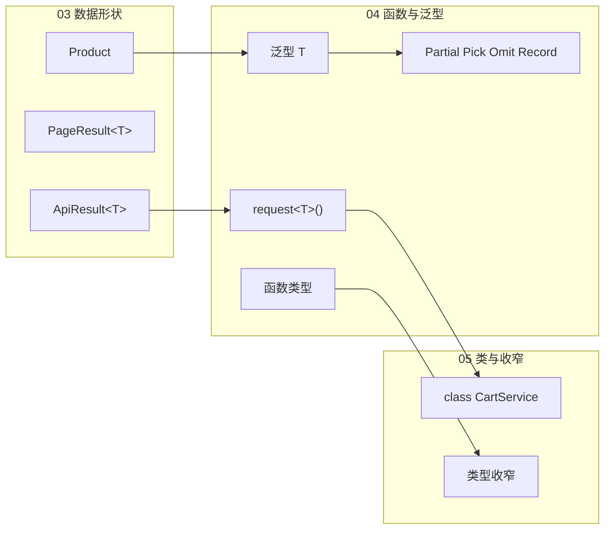
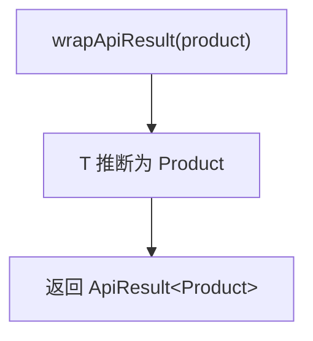
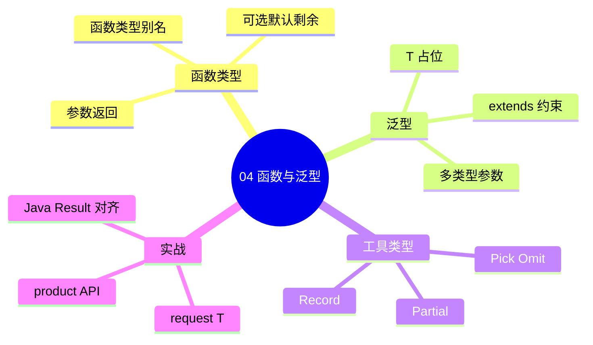

# 函数类型与泛型

<!-- 修改说明: 2026-06-30 按 EXPANSION-STANDARD 扩充 §0、DevTools/tsc、FAQ≥12、闭卷自测、费曼 -->

## 0. 读前导读（零基础也能跟上）

> **读者假设**：已完成 [TS 03](./03-接口类型别名与联合交叉.md) 的 `ApiResult<T>`。本章讲 **函数类型** 与 **泛型万能模具**——一套 `request<T>()` 适配 Product、User、Order。

### 0.1 用一句话弄懂本章

**一句话**：给函数参数/返回值贴标签，用 **泛型 `<T>`（万能模具）** 写可复用逻辑，并实现 `request<T>()` 对接 `ApiResult<T>`。

**生活类比**：

| 概念 | 类比 |
|------|------|
| 函数类型 | 菜谱——输入几种料、输出什么菜 |
| **泛型 `<T>`** | **万能模具**——同一套模具灌不同材料得不同形状 |
| `Partial<T>` | 装修可选包——字段全变可选 |
| `Pick/Omit` | 从合同里摘章节或删章节 |
| `request<T>()` | 同一快递流程，T 决定包裹内物类型 |

**为什么重要**：[Vue 08](../Vue/08-Axios网络请求与前后端联调.md) axios 封装、[TS 07](./07-Vue3与TypeScript.md) 的 API 模块都依赖本章。

---

### 0.2 你需要提前知道什么

| 缺什么 | 跳到哪 |
|--------|--------|
| JS 函数、箭头函数 | [JS 06～07](../HTML%20CSS%20JS/07-JavaScript流程控制函数对象数组与ES6基础.md) |
| ApiResult 合同 | [TS 03 §10](./03-接口类型别名与联合交叉.md) |
| Promise 入门 | [JS 08](../HTML%20CSS%20JS/09-JavaScript异步编程网络请求与本地存储.md) |

---

### 0.3 本章知识地图（☐→☑）

- [ ] 函数参数/返回值/别名类型
- [ ] 可选、默认、剩余、解构参数
- [ ] 泛型函数与 `extends` 约束
- [ ] Partial/Pick/Omit/Record
- [ ] 实现 `request<T>()`
- [ ] productApi 模块
- [ ] 闭卷自测 ≥ 7/10

---

### 0.4 建议学习时长

**约 6～8 小时**（含 request 封装与练习）。

---

### 0.5 可验证成果

1. `request<Product>('/api/products/1')` 返回类型为 `Product`。
2. `updateProduct(id, Partial<Product>)` 通过编译。
3. 能口述 **泛型 = 万能模具**。

---

## 本章与上一章的关系

[03-接口类型别名与联合交叉](./03-接口类型别名与联合交叉.md) 定义了 `Product`、`ApiResult<T>`、`PageResult<T>` 等**数据形状**。但 shop 项目还需要大量**函数**：格式化价格、过滤商品、封装 HTTP 请求——这些函数的参数和返回值同样值得类型保护。

这一章系统讲解 **函数类型注解**、**可选/默认/剩余参数**，以及 TypeScript 的杀手锏 **泛型 `<T>`**：写一套逻辑，适配多种类型而不丢类型信息。你将实现 **`request<T>()`** 泛型请求函数，直接消费 `ApiResult<T>`；并入门 **`Partial`、`Pick`、`Omit`、`Record`** 四个最高频工具类型。



**泛型是 TypeScript 与 Java 泛型概念最接近的一章**——后端 `Result<T>`、`List<UserVO>` 在前端的镜像就是 `ApiResult<T>`、`T[]`。

---

## 1. 为什么函数也需要类型？

### 1.1 没有类型时的隐患

```typescript
// ❌ 参数顺序搞反，运行时才 discover
function addToCart(productId, quantity) {
  // productId 和 quantity 传反了也不会报错
}

addToCart(2, 101)  // 本意：商品 101，数量 2
```

### 1.2 有类型时的保护

```typescript
function addToCart(productId: number, quantity: number): void {
  if (quantity <= 0) throw new Error('数量必须大于 0')
  // ...
}

addToCart(101, 2)   // ✅
// addToCart('101', 2)  // ❌ 编译错误
// addToCart(101)       // ❌ 缺少参数
```

| 收益 | 说明 |
|------|------|
| 参数校验 | 类型、个数在编写期检查 |
| 返回值文档 | 调用方知道拿到什么 |
| IDE 补全 | 输入 `.` 自动提示 |
| 重构 | 改签名 → 所有调用处报错 |

---

## 2. 函数类型基础

### 2.1 完整语法

```typescript
function formatPrice(price: number, currency = '¥'): string {
  return `${currency}${price.toFixed(2)}`
}

// 箭头函数等价
const formatPriceArrow = (price: number, currency = '¥'): string => {
  return `${currency}${price.toFixed(2)}`
}
```

语法：`function 名(参数: 类型, ...): 返回类型 { ... }`

### 2.2 函数类型别名

```typescript
type FormatPriceFn = (price: number, currency?: string) => string

const fn: FormatPriceFn = (price, currency = '¥') => `${currency}${price.toFixed(2)}`

// 作为对象属性 — shop 工具集
interface ShopUtils {
  formatPrice: FormatPriceFn
  calcTotal: (items: { price: number; quantity: number }[]) => number
}
```

### 2.3 void 与 never

```typescript
// void — 无 meaningful 返回值（console、setState）
function logProduct(p: Product): void {
  console.log(p.name)
}

// never — 永不返回（抛错、死循环）
function assertNever(x: never): never {
  throw new Error(`Unexpected: ${x}`)
}
```

---

## 3. 可选参数、默认参数与剩余参数

### 3.1 可选参数 `?`

```typescript
function searchProducts(keyword: string, categoryId?: number): Product[] {
  // categoryId 可能是 undefined
  console.log(categoryId ?? '全部分类')
  return []
}

searchProducts('键盘')
searchProducts('键盘', 1)
// searchProducts()  // ❌ keyword 必填
```

**注意**：可选参数后面的参数必须也是可选的，或使用默认值。

### 3.2 默认参数

```typescript
function fetchProductPage(
  query: PageQuery = {},
  pageSize = 10
): Promise<PageResult<Product>> {
  const pageNum = query.pageNum ?? 1
  const size = query.pageSize ?? pageSize
  // ...
  return Promise.resolve({ list: [], total: 0, pageNum, pageSize: size })
}
```

| 特性 | 可选 `?` | 默认值 `= value` |
|------|---------|-----------------|
| 可不传 | ✅ | ✅ |
| 类型含 undefined | 是 | 否（有默认值时） |
| 运行时值 | undefined | 默认值 |

### 3.3 剩余参数（Rest Parameters）

```typescript
function calcCartTotal(...items: { price: number; quantity: number }[]): number {
  return items.reduce((sum, item) => sum + item.price * item.quantity, 0)
}

calcCartTotal({ price: 299, quantity: 1 }, { price: 89, quantity: 2 })
// 478
```

**类型化剩余参数**：

```typescript
function mergeCartItems(...items: CartItem[]): CartItem[] {
  return items
}
```

### 3.4 解构参数

```typescript
interface AddToCartParams {
  productId: number
  quantity: number
  userId: number
}

function addToCart({ productId, quantity, userId }: AddToCartParams): void {
  // ...
}

addToCart({ productId: 1, quantity: 2, userId: 100 })
```

---

## 4. 泛型入门 — 类型参数 `T`

### 4.1 为什么需要泛型？

没有泛型时，要么重复写函数，要么退化成 `any`：

```typescript
// ❌ 重复
function wrapProduct(data: Product): ApiResult<Product> { return { code: 0, message: 'ok', data } }
function wrapUser(data: User): ApiResult<User> { return { code: 0, message: 'ok', data } }

// ❌ any 丢失类型
function wrapAny(data: any): ApiResult<any> { return { code: 0, message: 'ok', data } }
const r = wrapAny(product)
r.data.name  // 无补全，拼错不报错
```

### 4.2 泛型函数

```typescript
function wrapApiResult<T>(data: T): ApiResult<T> {
  return {
    code: 0,
    message: 'success',
    data,
  }
}

const productResult = wrapApiResult<Product>({ id: 1, name: '键盘', price: 299, stock: 50 })
// productResult.data 自动推断为 Product

const userResult = wrapApiResult({ id: 1, username: 'alice', email: 'a@b.com' })
// T 自动推断为 { id: number; username: string; email: string }
```

**`T` 是占位符**，调用时由传入的实参或显式类型实参决定。



### 4.3 显式 vs 推断

```typescript
// 推断 — 推荐
const r1 = wrapApiResult(product)

// 显式 — 推断失败或需约束时使用
const r2 = wrapApiResult<Product>(product)
const r3 = wrapApiResult<null>(null)
```

---

## 5. 泛型约束 `extends`

### 5.1 限制 T 必须有 id

```typescript
interface HasId {
  id: number
}

function findById<T extends HasId>(list: T[], id: number): T | undefined {
  return list.find(item => item.id === id)
}

const products: Product[] = [/* ... */]
const users: User[] = [/* ... */]

findById(products, 1)  // T = Product
findById(users, 1)     // T = User
// findById([1, 2, 3], 1)  // ❌ number 没有 id
```

### 5.2 约束为 keyof — 安全取属性

```typescript
function getProperty<T, K extends keyof T>(obj: T, key: K): T[K] {
  return obj[key]
}

const p: Product = { id: 1, name: '键盘', price: 299, stock: 50 }
getProperty(p, 'name')   // string
getProperty(p, 'price')  // number
// getProperty(p, 'foo')  // ❌ Argument of type '"foo"' is not assignable
```

### 5.3 多个约束

```typescript
function merge<T extends object, U extends object>(a: T, b: U): T & U {
  return { ...a, ...b }
}

const merged = merge({ id: 1 }, { name: '键盘', price: 299 })
// { id: number } & { name: string; price: number }
```

---

## 6. 工具类型：Partial、Pick、Omit、Record

### 6.1 Partial\<T\> — 全部变可选

**场景**：更新商品时只传部分字段（PATCH 语义）。

```typescript
type PartialProduct = Partial<Product>
// { id?: number; name?: string; price?: number; stock?: number; ... }

function updateProduct(id: number, patch: Partial<Product>): Promise<Product> {
  // PATCH /api/products/:id
  return Promise.resolve({ id, name: '', price: 0, stock: 0, ...patch })
}

updateProduct(1, { price: 259 })       // ✅ 只改价格
updateProduct(1, { name: '新名字', stock: 10 })
```

### 6.2 Pick\<T, Keys\> — 摘取部分字段

**场景**：列表页卡片只需 id、name、price。

```typescript
type ProductCard = Pick<Product, 'id' | 'name' | 'price'>

function toProductCard(p: Product): ProductCard {
  return { id: p.id, name: p.name, price: p.price }
}
```

### 6.3 Omit\<T, Keys\> — 排除部分字段

**场景**：创建商品时不传 id（后端生成）。

```typescript
type CreateProductDto = Omit<Product, 'id'>

function createProduct(dto: CreateProductDto): Promise<Product> {
  return Promise.resolve({ id: Date.now(), ...dto })
}

createProduct({ name: '鼠标', price: 89, stock: 100 })
// createProduct({ id: 1, name: 'x', price: 1, stock: 1 })  // ❌ id 不应传
```

### 6.4 Record\<Keys, ValueType\> — 字典对象

**场景**：订单状态 → 中文标签；分类 id → 名称。

```typescript
type OrderStatus = 'pending' | 'paid' | 'shipped' | 'completed' | 'cancelled'

const statusLabels: Record<OrderStatus, string> = {
  pending: '待支付',
  paid: '已支付',
  shipped: '已发货',
  completed: '已完成',
  cancelled: '已取消',
}

// 数字 id → 分类名
const categoryMap: Record<number, string> = {
  1: '键盘',
  2: '鼠标',
  3: '显示器',
}
```

### 6.5 工具类型对照表

| 工具类型 | 作用 | shop 典型用法 |
|---------|------|--------------|
| `Partial<T>` | 所有属性可选 | PATCH 更新 |
| `Pick<T, K>` | 取部分键 | 列表卡片 DTO |
| `Omit<T, K>` | 去掉部分键 | 创建 DTO（无 id） |
| `Record<K, V>` | 键值映射 | 状态文案、枚举映射 |

---

## 7. 多个类型参数

### 7.1 Map 函数 — T 进 U 出

```typescript
function mapList<T, U>(list: T[], mapper: (item: T) => U): U[] {
  return list.map(mapper)
}

const names = mapList(products, p => p.name)           // string[]
const ids = mapList(products, p => p.id)                 // number[]
const cards = mapList(products, p => toProductCard(p))   // ProductCard[]
```

### 7.2 元组返回 — 类似 React useState

```typescript
function useToggle(initial = false): [boolean, () => void] {
  let state = initial
  const toggle = () => { state = !state }
  return [state, toggle]
}
```

### 7.3 键值对转换

```typescript
function entriesOf<T extends object>(obj: T): [keyof T, T[keyof T]][] {
  return Object.entries(obj) as [keyof T, T[keyof T]][]
}
```

---

## 8. 泛型 interface 与泛型 type

```typescript
// 泛型接口 — API 客户端配置
interface ApiClientConfig<TError = string> {
  baseURL: string
  timeout: number
  onError?: (err: TError) => void
}

// 泛型 type — 分页 + 排序
type SortedPageResult<T, SortKey extends keyof T> = PageResult<T> & {
  sortBy: SortKey
  sortOrder: 'asc' | 'desc'
}
```

---

## 9. 为什么 request\<T\>() 必须泛型？

**深入解释 #1**：

Vue/React 08 章的 Axios 封装在响应拦截器里 `return res.data`，组件侧拿到的是**解包后的 data**。若写成 `any`：

```typescript
async function request(url: string): Promise<any> { /* ... */ }

const data = await request('/api/products/1')
data.priice  // 拼写错误，零提示，页面显示 undefined
```

泛型版：

```typescript
async function request<T>(url: string): Promise<T> {
  const res: ApiResult<T> = await fetch(url).then(r => r.json())
  if (res.code !== 0) throw new Error(res.message)
  return res.data
}

const product = await request<Product>('/api/products/1')
product.price  // ✅ 补全
// product.priice  // ❌ 编译错误
```

**深入解释 #2 — 与 Java 泛型的对应**：

| Java 后端 | TypeScript 前端 |
|-----------|----------------|
| `Result<ProductVO> getById()` | `request<Product>(url)` → `Product` |
| `Result<List<ProductVO>> list()` | `request<Product[]>(url)` → `Product[]` |
| `Result<PageResult<ProductVO>> page()` | `request<PageResult<Product>>(url)` |

全栈沟通时说「这个接口返回 `Result` 包 `Product`」→ 前端 `ApiResult<Product>` → 拦截器解包后 `request<Product>` 返回 `Product`。**三层泛型一一对应**，是联调效率的关键。

---

## 10. 手把手：实现 `request<T>()` 与 API 模块

### 10.1 项目准备

在 shop-ts 或现有项目中：

```bash
npm install axios
```

确保已有 [03 章](./03-接口类型别名与联合交叉.md) 的 `src/types/api.ts`。

### 10.2 `src/api/request.ts`

```typescript
import axios, { type AxiosRequestConfig } from 'axios'
import type { ApiResult } from '@/types/api'

const instance = axios.create({
  baseURL: import.meta.env.VITE_API_BASE_URL || '',
  timeout: 15000,
  headers: { 'Content-Type': 'application/json' },
})

/** 泛型 GET — 返回解包后的 data: T */
export async function request<T>(
  url: string,
  config?: AxiosRequestConfig
): Promise<T> {
  const response = await instance.get<ApiResult<T>>(url, config)
  const res = response.data

  if (res.code !== 0) {
    throw new Error(res.message || '请求失败')
  }

  return res.data
}

/** 泛型 POST */
export async function post<T, D = unknown>(
  url: string,
  data?: D,
  config?: AxiosRequestConfig
): Promise<T> {
  const response = await instance.post<ApiResult<T>>(url, data, config)
  const res = response.data

  if (res.code !== 0) {
    throw new Error(res.message || '请求失败')
  }

  return res.data
}
```

### 10.3 `src/api/product.ts`

```typescript
import { request, post } from './request'
import type { Product } from '@/types/product'
import type { PageResult, PageQuery } from '@/types/api'
import type { CreateProductDto } from '@/types/product'

export function getProductList(params?: PageQuery) {
  return request<PageResult<Product>>('/api/products', { params })
}

export function getProductById(id: number) {
  return request<Product>(`/api/products/${id}`)
}

export function createProduct(dto: CreateProductDto) {
  return post<Product, CreateProductDto>('/api/products', dto)
}
```

### 10.4 `src/types/product.ts` 补充 DTO

```typescript
export interface Product {
  id: number
  name: string
  price: number
  stock: number
  categoryId?: number
}

export type CreateProductDto = Omit<Product, 'id'>
export type UpdateProductDto = Partial<Omit<Product, 'id'>>
export type ProductCard = Pick<Product, 'id' | 'name' | 'price'>
```

### 10.5 组件中使用

```vue
<script setup lang="ts">
import { ref, onMounted } from 'vue'
import { getProductList } from '@/api/product'
import type { Product } from '@/types/product'

const products = ref<Product[]>([])
const total = ref(0)
const error = ref<string | null>(null)

async function loadData() {
  try {
    error.value = null
    const page = await getProductList({ pageNum: 1, pageSize: 10 })
    products.value = page.list
    total.value = page.total
  } catch (e) {
    error.value = e instanceof Error ? e.message : '加载失败'
  }
}

onMounted(loadData)
</script>
```

```mermaid
sequenceDiagram
    participant C as ProductList.vue
    participant A as api/product.ts
    participant R as request&lt;T&gt;
    participant B as Spring Boot

    C->>A: getProductList()
    A->>R: request&lt;PageResult&lt;Product&gt;&gt;
    R->>B: GET /api/products
    B-->>R: ApiResult&lt;PageResult&lt;Product&gt;&gt;
    R-->>A: PageResult&lt;Product&gt;
    A-->>C: list + total 类型安全
```

---

## 11. 函数重载（Overload）入门

同一函数名，不同参数组合 → 不同返回类型：

```typescript
function getOrder(id: number): Order
function getOrder(orderNo: string): Order
function getOrder(idOrNo: number | string): Order {
  if (typeof idOrNo === 'number') {
    return { id: idOrNo, orderNo: '', status: 'pending', totalAmount: 0, items: [], userId: 0, createdAt: '' }
  }
  return { id: 0, orderNo: idOrNo, status: 'pending', totalAmount: 0, items: [], userId: 0, createdAt: '' }
}

const o1 = getOrder(1)       // Order
const o2 = getOrder('NO001') // Order
```

**初学建议**：优先用可选参数或联合类型；重载适合库作者 API 设计。

---

## 12. 回调与事件处理函数类型

```typescript
type ProductFilter = (product: Product) => boolean

function filterProducts(list: Product[], predicate: ProductFilter): Product[] {
  return list.filter(predicate)
}

filterProducts(products, p => p.price < 500)
filterProducts(products, p => p.stock > 0)

// 排序
type ProductComparator = (a: Product, b: Product) => number

function sortProducts(list: Product[], compare: ProductComparator): Product[] {
  return [...list].sort(compare)
}

sortProducts(products, (a, b) => a.price - b.price)
```

Vue 3 事件（07 章详讲）：

```typescript
type AddToCartHandler = (productId: number, quantity: number) => void
```

---

## 13. 泛型默认值

```typescript
interface ApiRequestOptions<T = unknown> {
  url: string
  method?: 'GET' | 'POST'
  transform?: (data: T) => T
}

const opts: ApiRequestOptions<Product> = {
  url: '/api/products/1',
  transform: (data) => ({ ...data, name: data.name.trim() }),
}
```

---

## 14. 常见 shop 工具函数集

```typescript
// src/utils/product.ts
import type { Product, ProductCard } from '@/types/product'
import type { CartItem } from '@/types/cart'

export function toProductCard(p: Product): ProductCard {
  return { id: p.id, name: p.name, price: p.price }
}

export function calcCartTotal(items: CartItem[]): number {
  return items.reduce((sum, item) => sum + item.product.price * item.quantity, 0)
}

export function isInStock(p: Product, quantity = 1): boolean {
  return p.stock >= quantity
}

export function formatPrice(price: number, currency = '¥'): string {
  return `${currency}${price.toFixed(2)}`
}
```

---

## 15. 常见报错与排查

| 报错信息 | 可能原因 | 排查步骤 | 解决方案 |
|---------|---------|---------|---------|
| `Expected N arguments, but got M` | 参数个数不对 | 对照函数签名 | 补参或设默认值 |
| `Type 'X' is not assignable to type 'T'` | 泛型推断与显式 T 冲突 | 看 `request<X>` 的 X | 修正类型实参 |
| `Argument of type 'X' is not assignable to parameter of type 'Y'` | 传入类型不匹配 | 看入参对象缺字段 | 补全或改 DTO 类型 |
| `Generic type 'X' requires N type argument(s)` | 使用泛型未传 T | 找 `ApiResult` 等 | 写 `ApiResult<Product>` |
| `Type 'K' cannot be used to index type 'T'` | keyof 约束不足 | 检查 `K extends keyof T` | 加 extends 约束 |
| `'T' is declared but its value is never read` | 泛型参数未使用 | 是否多余 T | 删掉或用 `_T` |
| `Function lacks ending return statement` | 并非所有分支 return | 检查 if/else | 补 return 或改返回类型 |
| `A required parameter cannot follow an optional parameter` | 可选参数顺序错 | 必填参数放前面 | 调整顺序或改默认 |
| `Rest parameter must be last` | `...args` 不在最后 | 检查参数列表 | 把 rest 移到最后 |
| `Excessive stack depth comparing types` | 工具类型嵌套过深 | 简化 Pick/Omit 链 | 拆 type 别名 |
| `Promise<X> is not assignable to Promise<Y>` | async 返回类型不对 | 看 async 函数声明 | 修正 Promise 泛型 |
| `Object is of type 'unknown'` | 泛型约束太宽 | 加 extends 或断言 | 收窄后再用 |

---

## 16. 常见问题 FAQ

### Q1：什么时候显式写 `<T>`，什么时候靠推断？

**优先推断**。仅在推断为过于宽泛（如 `{}`）或需要 `T` 与参数无关时显式指定。

### Q2：Partial 和可选参数有什么区别？

`Partial<Product>` 是**类型层面**全可选；函数可选参数是**单个参数**可不传。PATCH 接口用 `Partial<Product>` 作 body 类型。

### Q3：Omit 和 Pick 怎么选？

字段少 → `Pick`；字段多、排除少 → `Omit`。创建 DTO 常用 `Omit<T, 'id'>`。

### Q4：request 返回 Promise\<T\> 还是 T？

async 函数自动包 Promise；调用方 `await request<Product>(...)` 得到 `Product`。

### Q5：泛型和 union 能一起用吗？

可以：`function first<T>(arr: T[]): T | undefined`。

### Q6：axios.get\<T\> 和 request\<T\> 两层泛型区别？

`axios.get<ApiResult<Product>>` 描述**原始响应**；`request<Product>` 描述**解包后 data**，组件更简洁。

### Q7：泛型万能模具——何时必须写 `<T>`？

调用处推断不出 T 时显式写：`request<Product>(url)`；多数情况 return 可推断。

### Q8：`Partial<Product>` 能用于 POST 创建吗？

创建用 `CreateProductDto`（Omit id）；更新 PATCH 用 `Partial<Omit<Product,'id'>>`。

### Q9：04 与 [JS 07 箭头函数](../HTML%20CSS%20JS/07-JavaScript流程控制函数对象数组与ES6基础.md) 关系？

语法相同；多的是参数与返回值 **类型标签**。

### Q10：`Record<K,V>` 在 shop 用在哪？

按分类 ID 分组商品、订单状态中文映射 `Record<OrderStatus, string>`。

### Q11：函数 overload 本章为何不讲？

shop 项目 overload 少用；面试见 [11 章](./11-面试专题与知识点总表.md)。初学掌握泛型 + 联合即可。

### Q12：04 完成后下一步？

[05 类与收窄](./05-类枚举与类型收窄.md)——CartService class + 联合类型收窄。

---

## 16.1 DevTools 与 tsc 验证泛型

| 步骤 | 动作 | 预期 | 若不对 |
|------|------|------|--------|
| 1 | `request<Product>` 返回值赋给 `User` | TS2322 | 模具 T 不同 |
| 2 | 悬停 `request` 看泛型推断 | 显示 `<Product>` | 显式传 T |
| 3 | `Partial<Product>` 缺必填字段 | 若变量类型是 Partial 则 OK | 区分 Create vs Update |
| 4 | `npm run typecheck` | 0 errors | §15 报错表 |
| 5 | F12 Network 联调时 | 运行时仍靠 JSON；类型助编写期 | 见 Vue 08 |

---

## 16.2 闭卷自测

1. **概念**：泛型 **万能模具** 指什么？
2. **概念**：`Partial<T>` 做什么？
3. **概念**：`Pick<T, K>` 与 `Omit<T, K>` 区别？
4. **概念**：函数 `void` 返回值含义？
5. **概念**：`extends` 约束泛型例子？
6. **动手**：写 `first<T>(arr: T[]): T | undefined`。
7. **动手**：写 `request<T>(url): Promise<T>` 签名（可伪实现）。
8. **综合**：`request<PageResult<Product>>` 与 03 章类型如何组合？
9. **综合**：为何 TS 拦不住「参数类型对但业务顺序错」？
10. **综合**：04 章 API 层如何服务 [TS 07 Vue+TS](./07-Vue3与TypeScript.md)？

### 自测参考答案

1. 一套函数/类逻辑，T 占位不同数据类型，复用代码不丢类型。
2. 所有属性变可选，适合 PATCH 更新。
3. Pick 保留指定键；Omit 排除指定键。
4. 调用方不应依赖返回值；可 `return` 空或 `undefined`。
5. `<T extends { id: number }>` 要求 T 必有 id。
6. `return arr[0]`
7. `async function request<T>(url: string): Promise<T> { ... }`
8. T 为 `PageResult<Product>`，解包后得 list/total。
9. TS 只检查类型不检查业务语义；用对象参数或命名规范。
10. `productApi.list()` 在 Vue 组件里赋值 `ref<Product[]>`。

---

## 16.3 费曼检验

**3 分钟解释：泛型是什么、和 any 有什么区别。**

**对照提纲**：

1. **万能模具**：`request<T>` 一份代码，T=Product 或 User。
2. **不丢类型**：any 无检查；泛型保留 T 的信息。
3. **工具类型**：Partial/Pick 在合同上批量改字段规则。

---

## 17. 分级练习

### 17.1 基础：formatOrderAmount

**题目**：写 `formatOrderAmount(amount: number): string`，返回 `¥xx.xx` 格式。

**参考答案**：

```typescript
function formatOrderAmount(amount: number): string {
  return `¥${amount.toFixed(2)}`
}
```

---

### 17.2 进阶：泛型 first / last

**题目**：实现 `first<T>(arr: T[]): T | undefined` 和 `last<T>(arr: T[]): T | undefined`。

**参考答案**：

```typescript
function first<T>(arr: T[]): T | undefined {
  return arr[0]
}

function last<T>(arr: T[]): T | undefined {
  return arr[arr.length - 1]
}

const p = first(products)  // Product | undefined
```

---

### 17.3 挑战：groupBy 泛型函数

**题目**：`groupBy<T, K extends string | number>(list: T[], keyFn: (item: T) => K): Record<K, T[]>`

**参考答案**：

```typescript
function groupBy<T, K extends string | number>(
  list: T[],
  keyFn: (item: T) => K
): Record<K, T[]> {
  const result = {} as Record<K, T[]>
  for (const item of list) {
    const key = keyFn(item)
    if (!result[key]) result[key] = []
    result[key].push(item)
  }
  return result
}

const byCategory = groupBy(products, p => p.categoryId ?? 0)
```

---

### 17.4 挑战+：完整 product API 模块

**题目**：用 `request<T>`、`post<T,D>` 实现 `getProductList`、`getProductById`、`createProduct`、`updateProduct`（PATCH，body 为 `Partial<Product>`）。

**参考答案**：

```typescript
import { request, post } from './request'
import type { Product, CreateProductDto } from '@/types/product'
import type { PageResult, PageQuery } from '@/types/api'

export const productApi = {
  list: (params?: PageQuery) =>
    request<PageResult<Product>>('/api/products', { params }),

  detail: (id: number) =>
    request<Product>(`/api/products/${id}`),

  create: (dto: CreateProductDto) =>
    post<Product, CreateProductDto>('/api/products', dto),

  update: (id: number, patch: Partial<Omit<Product, 'id'>>) =>
    post<Product>(`/api/products/${id}`, patch),
}
```

---

## 18. 学完标准

- [ ] 能为 shop 业务函数写清参数类型与返回类型
- [ ] 熟练使用可选、默认、剩余、解构参数
- [ ] 理解泛型 `T` 的作用，能写 `function fn<T>(...)`
- [ ] 会用 `extends` 约束泛型（`HasId`、`keyof T`）
- [ ] 掌握 `Partial`、`Pick`、`Omit`、`Record` 及 shop 场景
- [ ] 能实现 `request<T>()` 对接 `ApiResult<T>` 与 [Java 04 Result](../../后端学习/Java/04-SpringBoot核心开发.md)
- [ ] 能用多个类型参数写 `mapList<T, U>` 等转换函数
- [ ] 能从 §15 报错表快速定位函数/泛型相关错误

---

## 19. 本章小结



函数与泛型让 **API 层和工具层** 类型安全；下一章进入 **class、enum** 以及 **类型收窄**——在联合类型和可空值上安全地分支，为 Pinia store 和复杂订单状态机打基础。

---

## 下一章预告

[05-类枚举与类型收窄](./05-类枚举与类型收窄.md) 将讲解：`public` / `private` / `protected`、`implements` 接口、数字/字符串枚举、`typeof` / `instanceof` / `in` 收窄、**可辨识联合（discriminated unions）** 处理支付/物流状态，以及 `null` / `undefined` 检查——让 `Order.status` 分支代码既安全又易读。

---

*下一章：05 类、枚举与类型收窄*
