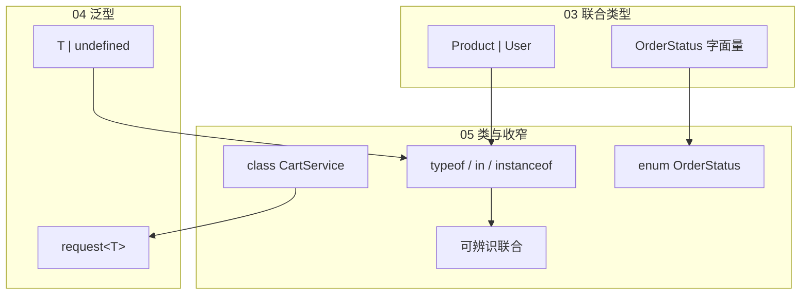
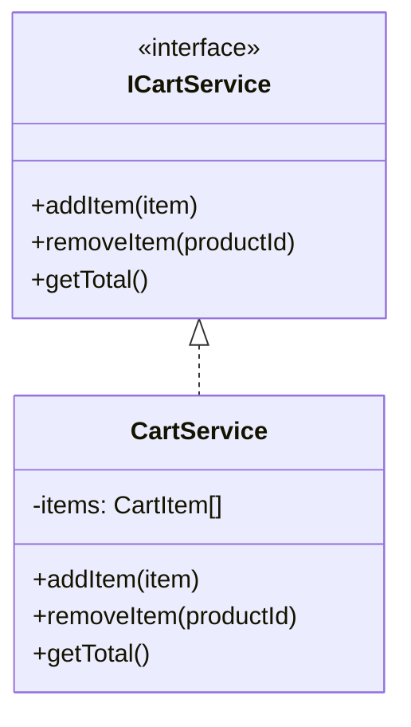
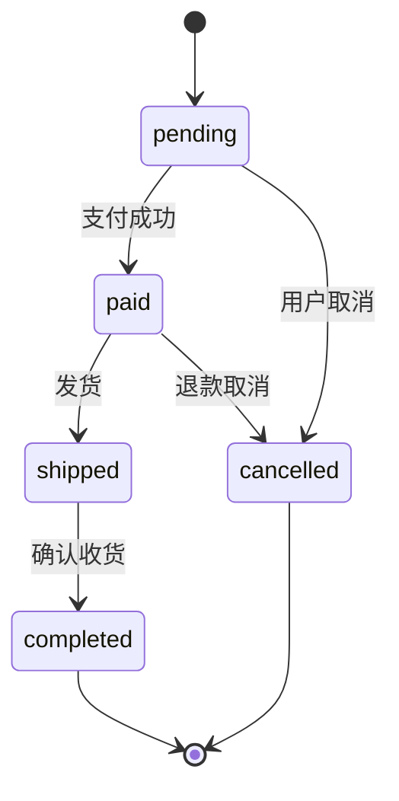
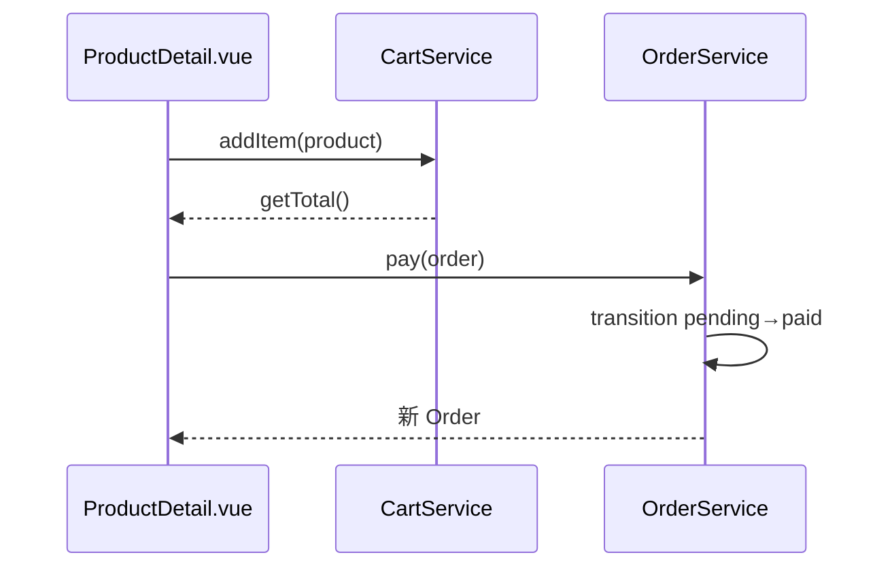
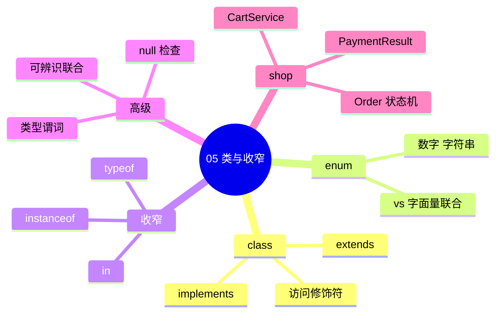

# 类、枚举与类型收窄

## 本章与上一章的关系

[04-函数类型与泛型](./04-函数类型与泛型.md) 用泛型 `request<T>()` 和工具类型搞定了 **API 层与纯函数**。shop 项目里还有**有状态的对象**：购物车服务要维护 items、订单服务要校验状态流转——适合用 **class** 组织；订单状态、支付渠道等有限集合适合用 **enum** 或字面量联合。

更重要的是：03 章的 `Product | User`、04 章的 `T | undefined`、API 的 `data: T | null` 在用时必须**缩窄（narrow）**到具体类型，否则 TypeScript 不允许访问专属属性。这一章系统讲解 **`typeof`、`instanceof`、`in`、可辨识联合、null 检查**，让你写分支代码时编译器能「看懂」你的意图。



**学完本章，你能用 class 封装 shop 业务逻辑，并在联合类型上写出零 `any` 的安全分支。**

---

## 1. 为什么需要 class？

### 1.1 纯函数的局限

```typescript
// 散落的全局函数 + 变量 — 难测试、难封装
let cartItems: CartItem[] = []

function addItem(item: CartItem) { cartItems.push(item) }
function clearCart() { cartItems = [] }
function getTotal() { /* 依赖 cartItems */ }
```

### 1.2 class 封装状态与方法

```typescript
class CartService {
  private items: CartItem[] = []

  addItem(item: CartItem): void {
    const existing = this.items.find(i => i.productId === item.productId)
    if (existing) {
      existing.quantity += item.quantity
    } else {
      this.items.push({ ...item })
    }
  }

  clear(): void {
    this.items = []
  }

  getTotal(): number {
    return this.items.reduce(
      (sum, i) => sum + i.product.price * i.quantity,
      0
    )
  }

  getItems(): readonly CartItem[] {
    return this.items
  }
}
```

| 对比 | 函数 + 模块变量 | class |
|------|----------------|-------|
| 状态归属 | 模块级，易污染 | 实例私有 |
| 多实例 | 需闭包或 Map | `new CartService()` |
| 接口契约 | 无强制 | `implements ICartService` |
| 与 Java 对照 | — | 结构相似，TS 无访问修饰符运行时 enforcement* |

\*TypeScript 的 `private`/`protected` 只在编译期检查；运行时仍是普通 JS 对象。Java 的 `private` 在 JVM 层强制。

---

## 2. class 基础语法

### 2.1 Product 模型类（可选 — shop 更常用 interface）

```typescript
class ProductModel {
  constructor(
    public id: number,
    public name: string,
    public price: number,
    public stock: number
  ) {}

  isAvailable(qty = 1): boolean {
    return this.stock >= qty
  }

  applyDiscount(rate: number): number {
    return Math.round(this.price * (1 - rate) * 100) / 100
  }
}

const keyboard = new ProductModel(1, '机械键盘', 299, 50)
keyboard.isAvailable(2)  // true
```

**参数属性**：`constructor(public id: number)` 等价于声明属性 + 赋值。

### 2.2 访问修饰符

| 修饰符 | 类内 | 子类 | 外部 |
|--------|------|------|------|
| `public`（默认） | ✅ | ✅ | ✅ |
| `protected` | ✅ | ✅ | ❌ |
| `private` | ✅ | ❌ | ❌ |

```typescript
class OrderService {
  private orders: Order[] = []

  protected validateStatusTransition(from: OrderStatus, to: OrderStatus): boolean {
    const allowed: Record<OrderStatus, OrderStatus[]> = {
      pending: ['paid', 'cancelled'],
      paid: ['shipped', 'cancelled'],
      shipped: ['completed'],
      completed: [],
      cancelled: [],
    }
    return allowed[from]?.includes(to) ?? false
  }

  public cancelOrder(order: Order): Order {
    if (!this.validateStatusTransition(order.status, 'cancelled')) {
      throw new Error('当前状态不可取消')
    }
    return { ...order, status: 'cancelled' }
  }
}
```

### 2.3 readonly 属性

```typescript
class OrderSnapshot {
  readonly orderNo: string
  readonly createdAt: string

  constructor(orderNo: string, createdAt: string) {
    this.orderNo = orderNo
    this.createdAt = createdAt
  }
}
```

---

## 3. implements — class 实现 interface

03 章定义的 interface 是**契约**；class **implements** 保证实例符合形状：

```typescript
// src/types/cart.ts
export interface ICartService {
  addItem(item: CartItem): void
  removeItem(productId: number): void
  clear(): void
  getTotal(): number
  getItems(): readonly CartItem[]
}

// src/services/cart-service.ts
export class CartService implements ICartService {
  private items: CartItem[] = []

  addItem(item: CartItem): void {
    const idx = this.items.findIndex(i => i.productId === item.productId)
    if (idx >= 0) {
      this.items[idx] = {
        ...this.items[idx],
        quantity: this.items[idx].quantity + item.quantity,
      }
    } else {
      this.items.push(item)
    }
  }

  removeItem(productId: number): void {
    this.items = this.items.filter(i => i.productId !== productId)
  }

  clear(): void {
    this.items = []
  }

  getTotal(): number {
    return this.items.reduce((s, i) => s + i.product.price * i.quantity, 0)
  }

  getItems(): readonly CartItem[] {
    return this.items
  }
}
```

**好处**：

- 测试时可 `implements ICartService` 写 Mock
- 换 Pinia store 时 interface 不变
- 与 Java `class XxxService implements XxxService` 同构



---

## 4. 继承 extends

```typescript
class BaseService {
  protected baseURL: string

  constructor(baseURL: string) {
    this.baseURL = baseURL
  }

  protected log(msg: string): void {
    console.log(`[${this.constructor.name}] ${msg}`)
  }
}

class ProductService extends BaseService {
  async fetchById(id: number): Promise<Product> {
    this.log(`fetch product ${id}`)
    const res = await fetch(`${this.baseURL}/api/products/${id}`)
    const json: ApiResult<Product> = await res.json()
    if (json.code !== 0) throw new Error(json.message)
    return json.data
  }
}
```

**TS 与 Java**：都支持单继承（一个父 class）；interface 可多 implements / extends。

---

## 5. 枚举 enum

### 5.1 数字枚举（Numeric Enum）

```typescript
enum PaymentStatus {
  Pending,    // 0
  Success,    // 1
  Failed,     // 2
  Refunded,   // 3
}

const status = PaymentStatus.Success  // 1

// 反向映射（仅数字枚举）
const label = PaymentStatus[1]  // 'Success'
```

**注意**：编译后数字枚举会生成双向映射对象，体积略大。现代项目更推荐 **字符串枚举** 或 **字面量联合**（03 章）。

### 5.2 字符串枚举（String Enum）

```typescript
enum OrderStatusEnum {
  Pending = 'pending',
  Paid = 'paid',
  Shipped = 'shipped',
  Completed = 'completed',
  Cancelled = 'cancelled',
}

function canShip(status: OrderStatusEnum): boolean {
  return status === OrderStatusEnum.Paid
}
```

与后端 JSON 对齐：

```json
{ "status": "paid" }
```

```typescript
const order: Order = {
  id: 1,
  orderNo: 'NO001',
  status: OrderStatusEnum.Paid as OrderStatus,  // 或直接统一用 enum
  // ...
}
```

### 5.3 enum vs 字面量联合 — 为什么两种都有？

**深入解释 #1**：

| 特性 | `enum` | `type Status = 'a' \| 'b'` |
|------|--------|---------------------------|
| 运行时存在 | ✅ 有对象 | ❌ 擦掉 |
| 反向映射 | 数字 enum 有 | 无 |
| tree-shaking | 字符串 enum 较差 | 更好 |
| 简洁 | 需 import enum | 内联字符串 |

**shop 项目建议**：

- 与后端约定好的字符串状态 → **字面量联合**（03 章）或 **字符串 enum**
- 需要运行时遍历所有值 → `enum` 或 `const` 对象 + `as const`

```typescript
const ORDER_STATUSES = ['pending', 'paid', 'shipped', 'completed', 'cancelled'] as const
type OrderStatus = typeof ORDER_STATUSES[number]
```

### 5.4 const enum（了解）

```typescript
const enum Direction {
  Up,
  Down,
}
```

编译时内联，无运行时对象。库作者用，业务代码少用。

---

## 6. typeof 类型收窄

### 6.1 基础 typeof

```typescript
function printProductId(id: number | string) {
  if (typeof id === 'number') {
    console.log(id.toFixed(0))
  } else {
    console.log(id.toUpperCase())
  }
}
```

### 6.2 typeof 与 null 陷阱

```typescript
function badCheck(value: string | null) {
  if (typeof value === 'object') {
    // ⚠️ null 的 typeof 也是 'object'！
    // value 仍可能是 null
  }
}
```

**正确 null 检查见 §11**。

### 6.3 typeof 用于字面量配置

```typescript
const defaultPageSize = 10 as const
type PageSize = typeof defaultPageSize  // 10

const apiRoutes = {
  products: '/api/products',
  orders: '/api/orders',
  login: '/api/login',
} as const

type ApiRouteKey = keyof typeof apiRoutes       // 'products' | 'orders' | 'login'
type ApiRoutePath = typeof apiRoutes[ApiRouteKey]  // '/api/products' | ...
```

---

## 7. instanceof 收窄

用于 **class 实例** 判断：

```typescript
class ApiError extends Error {
  constructor(
    message: string,
    public code: number
  ) {
    super(message)
    this.name = 'ApiError'
  }
}

class NetworkError extends Error {
  constructor(message: string) {
    super(message)
    this.name = 'NetworkError'
  }
}

function handleError(err: unknown) {
  if (err instanceof ApiError) {
    console.log('业务错误', err.code, err.message)
  } else if (err instanceof NetworkError) {
    console.log('网络错误', err.message)
  } else if (err instanceof Error) {
    console.log('通用错误', err.message)
  } else {
    console.log('未知错误', err)
  }
}
```

**instanceof 只对 class 有效**，interface 编译后不存在，不能用 `instanceof Product`（Product 是 interface）。

---

## 8. in 操作符收窄

检查对象是否含有某属性：

```typescript
type SearchResult = Product | User

function renderSearchResult(item: SearchResult): string {
  if ('price' in item) {
    // item: Product
    return `${item.name} ¥${item.price}`
  }
  // item: User
  return `${item.username} <${item.email}>`
}
```

### 8.1 与可选属性

```typescript
interface Product {
  id: number
  name: string
  price: number
  description?: string
}

function hasDescription(p: Product): p is Product & { description: string } {
  return 'description' in p && p.description !== undefined
}
```

---

## 9. 可辨识联合（Discriminated Unions）

**最强大的收窄模式**：联合成员共享一个 **discriminant（辨识字段）**，通常是字面量类型的 `type` 或 `kind` 字段。

### 9.1 支付结果

```typescript
type PaymentResult =
  | { type: 'success'; orderId: number; paidAmount: number }
  | { type: 'failed'; reason: string; errorCode: number }
  | { type: 'pending'; expireAt: string }

function handlePayment(result: PaymentResult): void {
  switch (result.type) {
    case 'success':
      console.log(`订单 ${result.orderId} 支付 ¥${result.paidAmount}`)
      break
    case 'failed':
      console.log(`失败: ${result.reason} (${result.errorCode})`)
      break
    case 'pending':
      console.log(`待支付，过期 ${result.expireAt}`)
      break
    default: {
      const _exhaustive: never = result
      return _exhaustive
    }
  }
}
```

`default` 里赋给 `never` 叫 **穷尽检查（exhaustiveness checking）**：若新增第四种 `type` 却未处理，编译报错。

### 9.2 物流通知

```typescript
type ShipmentEvent =
  | { kind: 'created'; trackingNo: string }
  | { kind: 'in_transit'; location: string }
  | { kind: 'delivered'; signedBy: string }

function renderShipmentEvent(event: ShipmentEvent): string {
  switch (event.kind) {
    case 'created':
      return `运单已创建: ${event.trackingNo}`
    case 'in_transit':
      return `运输中: ${event.location}`
    case 'delivered':
      return `已签收: ${event.signedBy}`
  }
}
```

### 9.3 为什么可辨识联合优于 boolean 标志？

**深入解释 #2**：

```typescript
// ❌ 多个 boolean — 非法组合无法禁止
interface BadOrder {
  isPaid: boolean
  isShipped: boolean
  isCancelled: boolean
  // isPaid=true, isCancelled=true 同时成立？
}

// ✅ 互斥状态 — 类型系统保证合法
type GoodOrderState =
  | { status: 'pending' }
  | { status: 'paid'; paidAt: string }
  | { status: 'shipped'; trackingNo: string }
  | { status: 'cancelled'; reason: string }
```

可辨识联合把 **业务状态机** 编码进类型，减少非法状态；与后端状态流转（04 章 OrderService.validateStatusTransition）前后呼应。



---

## 10. 类型谓词（Type Predicates）

自定义收窄函数：

```typescript
function isProduct(item: Product | User): item is Product {
  return 'price' in item
}

function isUser(item: Product | User): item is User {
  return 'username' in item
}

function processItem(item: Product | User) {
  if (isProduct(item)) {
    addToCart(item)
  } else if (isUser(item)) {
    sendWelcomeEmail(item)
  }
}
```

ApiResult 成功守卫（03 章）也是类型谓词：

```typescript
function isApiSuccess<T>(res: ApiResult<T>): res is ApiResult<T> & { code: 0; data: T } {
  return res.code === 0
}
```

---

## 11. null 与 undefined 检查

### 11.1 严格空值检查 strictNullChecks

`tsconfig.json` 开启 `strictNullChecks`（`strict: true` 包含）后：

```typescript
function getProductName(p: Product | null): string {
  // return p.name  // ❌ Object is possibly 'null'

  if (p === null) {
    return '未知商品'
  }
  return p.name  // ✅ p: Product
}
```

### 11.2 可选链 `?.` 与空值合并 `??`

```typescript
function showUserAvatar(user: User | undefined) {
  const url = user?.avatar ?? '/default-avatar.png'
  return url
}

function getFirstProductName(list: Product[] | null) {
  return list?.[0]?.name ?? '暂无商品'
}
```

### 11.3 非 null 断言 `!`（慎用）

```typescript
function dangerous(id: number) {
  const el = document.getElementById(`product-${id}`)!
  // 断言 el 一定存在 — 若 DOM 没有会运行时崩溃
  el.textContent = '...'
}
```

**仅在逻辑上 100% 确定时使用**；优先 if 收窄。

### 11.4 空值收窄对照

| 写法 | 作用 |
|------|------|
| `if (x === null)` | 排除 null |
| `if (x == null)` | 排除 null 和 undefined |
| `x?.prop` | 可选链 |
| `x ?? default` | null/undefined 时默认值 |
| `x!` | 告诉编译器「一定非空」（ risky ） |

---

## 12. 联合类型收窄策略总表

| 场景 | 推荐方式 | 示例 |
|------|---------|------|
| 原始类型 | `typeof` | `typeof x === 'string'` |
| class 实例 | `instanceof` | `err instanceof ApiError` |
| 对象形状 | `in` | `'price' in item` |
| 状态机 | 可辨识联合 + `switch` | `switch (e.type)` |
| 自定义 | 类型谓词 | `item is Product` |
| 可空 | `=== null` / `?.` | `user?.email` |
| 穷尽 | `never` 赋值 | `default: never` |

---

## 13. 手把手：Order 状态机 + CartService

### 13.1 定义类型

```typescript
// src/types/order.ts
export type OrderStatus = 'pending' | 'paid' | 'shipped' | 'completed' | 'cancelled'

export interface Order {
  id: number
  orderNo: string
  userId: number
  totalAmount: number
  status: OrderStatus
  items: OrderItem[]
  createdAt: string
}

export interface OrderItem {
  productId: number
  productName: string
  price: number
  quantity: number
}
```

### 13.2 OrderService class

```typescript
// src/services/order-service.ts
import type { Order, OrderStatus } from '@/types/order'

const TRANSITIONS: Record<OrderStatus, OrderStatus[]> = {
  pending: ['paid', 'cancelled'],
  paid: ['shipped', 'cancelled'],
  shipped: ['completed'],
  completed: [],
  cancelled: [],
}

export class OrderService {
  transition(order: Order, next: OrderStatus): Order {
    const allowed = TRANSITIONS[order.status]
    if (!allowed.includes(next)) {
      throw new Error(`不能从 ${order.status} 转为 ${next}`)
    }
    return { ...order, status: next }
  }

  pay(order: Order): Order {
    return this.transition(order, 'paid')
  }

  ship(order: Order): Order {
    return this.transition(order, 'shipped')
  }
}
```

### 13.3 支付结果可辨识联合

```typescript
// src/types/payment.ts
export type PaymentResult =
  | { type: 'success'; orderId: number; transactionId: string }
  | { type: 'failed'; message: string }
  | { type: 'cancelled' }

export function parsePaymentResponse(data: unknown): PaymentResult {
  if (typeof data !== 'object' || data === null) {
    throw new Error('无效响应')
  }
  const obj = data as Record<string, unknown>
  if (obj.type === 'success' && typeof obj.orderId === 'number') {
    return {
      type: 'success',
      orderId: obj.orderId,
      transactionId: String(obj.transactionId ?? ''),
    }
  }
  if (obj.type === 'failed') {
    return { type: 'failed', message: String(obj.message ?? '支付失败') }
  }
  if (obj.type === 'cancelled') {
    return { type: 'cancelled' }
  }
  throw new Error('未知支付结果')
}
```

### 13.4 在 Vue 组件中使用

```vue
<script setup lang="ts">
import { ref } from 'vue'
import { CartService } from '@/services/cart-service'
import type { Product } from '@/types/product'

const cart = new CartService()
const message = ref('')

function handleAdd(product: Product) {
  cart.addItem({
    productId: product.id,
    quantity: 1,
    product,
  })
  message.value = `已加入购物车，合计 ${cart.getTotal().toFixed(2)} 元`
}
</script>
```



---

## 14. 静态成员与抽象类（了解）

```typescript
abstract class BaseEntity {
  abstract getDisplayName(): string

  static compareById<T extends { id: number }>(a: T, b: T): number {
    return a.id - b.id
  }
}

class UserEntity extends BaseEntity {
  constructor(public username: string, public id: number) {
    super()
  }
  getDisplayName() {
    return this.username
  }
}
```

shop 项目以 **interface + 函数/class 服务** 为主，抽象类较少用。

---

## 15. 与后端 API 形状对照

参考 [Java 04 Result 与 VO](../../后端学习/Java/04-SpringBoot核心开发.md)：

| 后端 | 前端 class/interface | 收窄要点 |
|------|---------------------|---------|
| `UserVO` | `interface User` | 直接赋值 |
| `Result<T>` | `ApiResult<T>` | `code === 0` 守卫 |
| Java enum | `enum` 或字面量联合 | JSON 字符串对齐 |
| `null` data | `T \| null` | 判空后再用 |
| 404 异常 | `ApiError` class | `instanceof ApiError` |

```typescript
// 对接登录接口
async function login(username: string, password: string): Promise<string> {
  const res: ApiResult<{ token: string } | null> =
    await fetch('/api/login', {
      method: 'POST',
      body: JSON.stringify({ username, password }),
    }).then(r => r.json())

  if (res.code !== 0 || res.data === null) {
    throw new ApiError(res.message, res.code)
  }
  return res.data.token
}
```

---

## 16. 常见报错与排查

| 报错信息 | 可能原因 | 排查步骤 | 解决方案 |
|---------|---------|---------|---------|
| `Property 'x' does not exist on type 'A \| B'` | 联合未收窄 | 看访问属性前是否有 if/switch | typeof / in / 可辨识联合 |
| `Object is possibly 'null'` | strictNullChecks | 找可能为 null 的变量 | if 判空或 `?.` |
| `Object is possibly 'undefined'` | 可选属性或数组越界 | 看 `arr[i]`、`obj?.x` | 默认值或守卫 |
| `Class 'X' incorrectly implements interface 'Y'` | 缺方法或签名不对 | 对照 interface 成员 | 补全 implements 方法 |
| `Cannot assign to 'x' because it is a read-only property` | 改 readonly | class 内赋值只读字段 | constructor 初始化 |
| `This member must have an 'override' modifier` | 子类重写未标 override | TS 4.3+ 严格 | 加 `override` 关键字 |
| `The switch statement is not exhaustive` | 可辨识联合缺 case | 看 union 所有 type | 补 case 或 default never |
| `Type 'X' is not assignable to type 'never'` | 穷尽检查失败 — 好事 | 说明有未处理分支 | 补全 switch case |
| `Only public and protected methods...` | private 方法被外部调 | 看调用方 | 改 public 或换 API |
| `An enum member cannot have a numeric name` | 数字 enum 命名冲突 | 检查 enum 定义 | 改用字符串 enum |
| `Argument of type 'unknown' is not assignable` | catch 的 err 是 unknown | 先收窄 err | instanceof / 类型谓词 |
| `'instanceof' expression is not valid` | 对 interface 用 instanceof | Product 是 interface | 改用 `in` 或类型谓词 |

---

## 17. 常见问题 FAQ

### Q1：shop 项目用 class 还是 Pinia？

**Pinia store 管 UI 状态**（响应式）；**class service 管纯业务**（Cart 计算、Order 状态机）。可组合：`const cart = new CartService()` 在 store action 里调用。

### Q2：enum 编译后体积大怎么办？

优先字面量联合 + `as const` 对象；或 `const enum`（确认构建工具支持内联）。

### Q3：private 真的安全吗？

仅编译期。运行时仍可 `cart['items']` 访问。敏感逻辑放后端。

### Q4：interface 和 class implements 必须字段完全一致吗？

是的，缺任何成员都会报错。可选成员用 `?`。

### Q5：unknown 和 any 在 catch 里用哪个？

**strict 下 catch 是 unknown**。用 `instanceof Error` 收窄，禁止直接 `err.message`。

### Q6：可辨识联合的 discriminant 必须叫 type 吗？

不必。常见 `type`、`kind`、`status`；同一联合内字段名和类型值唯一即可。

---

## 18. 分级练习

### 18.1 基础：implements 写一个 MockCartService

**题目**：实现 `ICartService`，内部用固定数组，不修改。

**参考答案**：

```typescript
export class MockCartService implements ICartService {
  constructor(private readonly initial: CartItem[] = []) {}

  addItem(item: CartItem): void {
    /* mock: no-op */ void item
  }
  removeItem(productId: number): void {
    void productId
  }
  clear(): void {}
  getTotal(): number {
    return this.initial.reduce((s, i) => s + i.product.price * i.quantity, 0)
  }
  getItems(): readonly CartItem[] {
    return this.initial
  }
}
```

---

### 18.2 进阶：字符串 enum + 函数

**题目**：定义 `PaymentMethod` 字符串 enum（wechat / alipay / card），写 `getPaymentLabel(m: PaymentMethod): string`。

**参考答案**：

```typescript
enum PaymentMethod {
  Wechat = 'wechat',
  Alipay = 'alipay',
  Card = 'card',
}

function getPaymentLabel(m: PaymentMethod): string {
  const map: Record<PaymentMethod, string> = {
    [PaymentMethod.Wechat]: '微信支付',
    [PaymentMethod.Alipay]: '支付宝',
    [PaymentMethod.Card]: '银行卡',
  }
  return map[m]
}
```

---

### 18.3 挑战：可辨识联合 — 优惠券

**题目**：定义 `Coupon` 为固定金额 `{ kind: 'fixed'; amount: number }` 或折扣 `{ kind: 'percent'; rate: number }`，写 `applyCoupon(price: number, coupon: Coupon): number`。

**参考答案**：

```typescript
type Coupon =
  | { kind: 'fixed'; amount: number }
  | { kind: 'percent'; rate: number }

function applyCoupon(price: number, coupon: Coupon): number {
  switch (coupon.kind) {
    case 'fixed':
      return Math.max(0, price - coupon.amount)
    case 'percent':
      return Math.round(price * (1 - coupon.rate) * 100) / 100
    default: {
      const _: never = coupon
      return _
    }
  }
}
```

---

### 18.4 挑战+：完整 ApiError + 统一 handle

**题目**：`ApiError extends Error` 含 `code`；`NetworkError extends Error`；写 `handleShopError(err: unknown): string` 用 instanceof 分支。

**参考答案**：

```typescript
class ApiError extends Error {
  constructor(message: string, public code: number) {
    super(message)
    this.name = 'ApiError'
  }
}

class NetworkError extends Error {
  constructor(message: string) {
    super(message)
    this.name = 'NetworkError'
  }
}

function handleShopError(err: unknown): string {
  if (err instanceof ApiError) {
    return `[${err.code}] ${err.message}`
  }
  if (err instanceof NetworkError) {
    return `网络异常: ${err.message}`
  }
  if (err instanceof Error) {
    return err.message
  }
  return '未知错误'
}
```

---

## 19. 学完标准

- [ ] 会用 `public` / `private` / `protected` / `readonly` 组织 class
- [ ] 能让 class `implements` 03 章 interface 契约
- [ ] 理解数字 enum 与字符串 enum，能与后端 JSON 对齐
- [ ] 会用 `typeof`、`instanceof`、`in` 做类型收窄
- [ ] 能设计可辨识联合表达 PaymentResult、ShipmentEvent 等
- [ ] 会在 `strictNullChecks` 下正确处理 `null` / `undefined`
- [ ] 能写类型谓词 `item is Product` 和 ApiResult 守卫
- [ ] 能实现 CartService、OrderService 并接入 Vue 组件

---

## 20. 本章小结



03～05 章完成了 TypeScript **类型系统核心**：数据形状、函数泛型、类与收窄。下一章 [06-模块声明文件与三方库](./06-模块声明文件与三方库.md) 进入工程化——`.d.ts`、为无类型 npm 包补声明、`@/` 路径别名类型，让 shop 项目完整跑在 strict TypeScript 之上。

---

## 下一章预告

**06 模块、声明文件与三方库** 将讲解：ES Module 与 TS 模块、`declare module` 扩展第三方库、编写 `global.d.ts`、安装 `@types/xxx`，以及 Vite 项目中 `@/` 路径在 `tsconfig paths` 里的配置——解决「引了 lodash 但没有类型」这类 everyday 工程问题。

---

*下一章：06 模块、声明文件与三方库*
