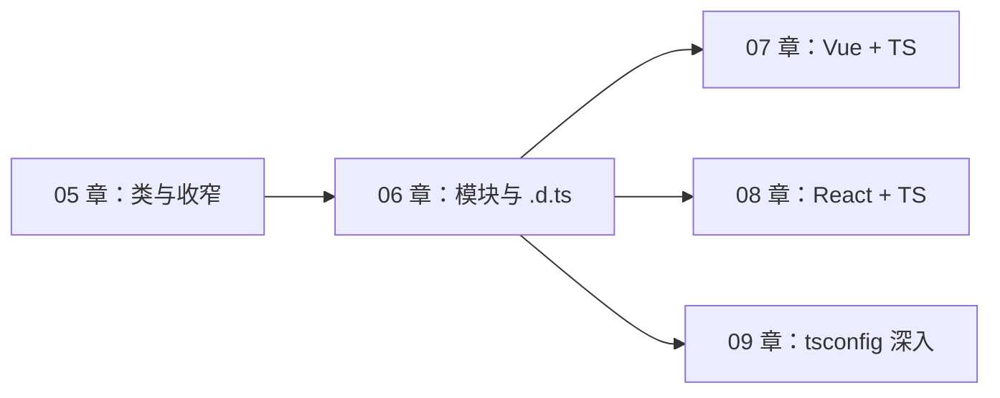
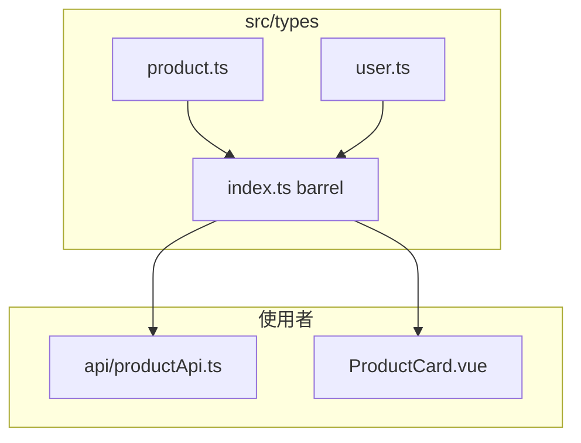
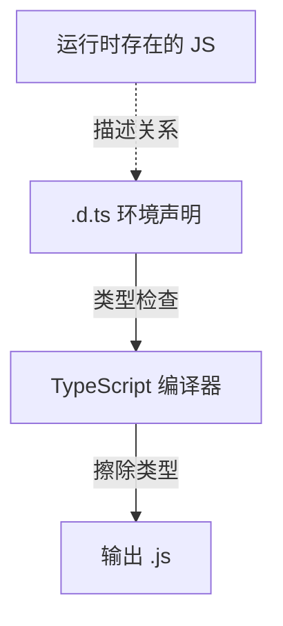
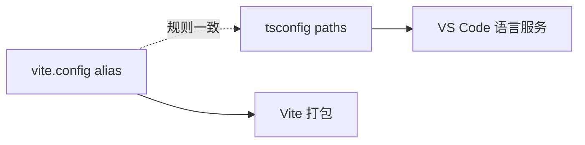
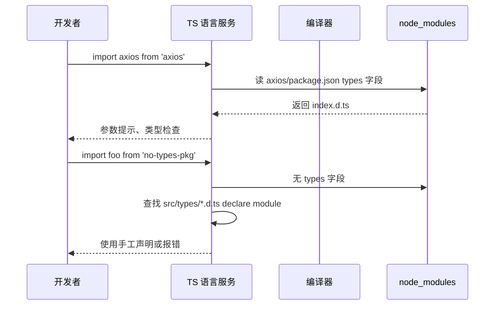
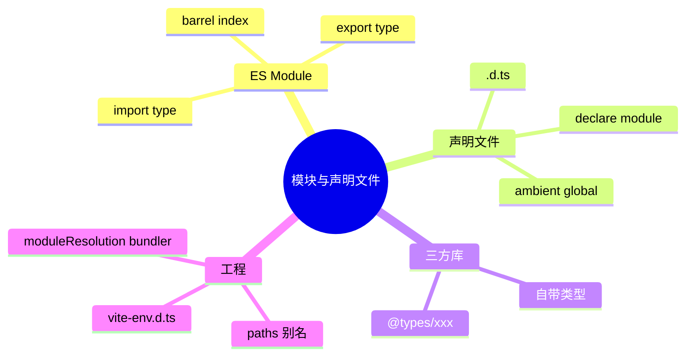

# 模块、声明文件与三方库

## 本章衔接

你在 [05-类、枚举与类型收窄](./05-类、枚举与类型收窄.md) 里学会了 `class`、`enum` 和类型收窄——这些知识大多写在**单个 `.ts` 文件**里。真实项目却是**几十个文件互相 import**：

- `src/types/product.ts` 导出 `Product` 接口
- `src/api/request.ts` 导入 `Product` 并调用后端
- `src/components/ProductCard.vue` 再导入同一套类型

同时，npm 上大量包是 **纯 JavaScript** 写的（没有 `.ts` 源码），TypeScript 怎么知道 `axios.get` 的参数类型？答案是 **声明文件（`.d.ts`）** 和 **`@types/xxx` 社区类型包**。

本章解决三件事：

1. **ES Module 的 import/export 与类型导出**
2. **为 JS 库和自研模块补类型**（`declare module`、ambient 声明）
3. **Vite 项目里的路径别名 `@/` 与 `vite-env.d.ts`**



**前置检查**：

- 已完成 [HTML CSS JS 09-模块化](../HTML%20CSS%20JS/09-JavaScript模块化.md)（`import`/`export` 语法）
- 已完成 TS 01～05（interface、泛型、类）
- 本机可运行 `npx tsc -v`（期望 5.x）
- 可选：已有 [shop-vue](../Vue/00-学习路线图与说明.md) 或 [shop-react](../React/00-学习路线图与说明.md) 项目，便于迁移练习

**与 shop 项目的关系**：本章结束后，你应能为 `shop` 项目建立 `src/types/` 目录、配置 `@/` 别名类型、并为缺少类型的 npm 包写声明。

---

## 1. ES Module 回顾：值与类型的双重导出

### 1.1 值的导出与导入

与 JavaScript 完全一致：

```typescript
// src/utils/formatPrice.ts
export function formatPrice(price: number): string {
  return `¥ ${price.toFixed(2)}`
}

export const TAX_RATE = 0.13
```

```typescript
// src/components/ProductCard.ts（逻辑文件示例）
import { formatPrice, TAX_RATE } from '../utils/formatPrice'

console.log(formatPrice(99), TAX_RATE)
```

### 1.2 类型的导出与导入

类型在编译后会被擦掉，但 **模块边界上的类型导出** 对大型项目至关重要：

```typescript
// src/types/product.ts
export interface Product {
  id: number
  name: string
  price: number
  stock?: number
  img?: string
}

export type ProductId = Product['id']

export type ApiResult<T> = {
  code: number
  message: string
  data: T
}
```

```typescript
// src/api/productApi.ts
import type { Product, ApiResult } from '../types/product'
//     ^^^^^^ import type：仅导入类型，编译后完全移除，避免循环依赖

export async function fetchProducts(): Promise<ApiResult<Product[]>> {
  const res = await fetch('/api/products')
  return res.json()
}
```

### 1.3 `export type` 与 `export interface` 的区别

| 写法 | 说明 |
|------|------|
| `export interface User { ... }` | 接口可声明合并（同名 interface 可叠加） |
| `export type Role = 'admin' \| 'user'` | 类型别名，适合联合、交叉、工具类型 |
| `export type { Product }` | 重新导出已有类型 |
| `export { type Product }` | TS 4.5+ 混合导出值与类型 |

```typescript
// src/types/index.ts — 统一出口（barrel file）
export type { Product, ProductId, ApiResult } from './product'
export type { User, LoginForm } from './user'
export { formatPrice } from '../utils/formatPrice'
```

### 1.4 为什么需要 `import type`

```typescript
// ❌ 普通 import 可能把类型当值用，或触发不必要的运行时加载
import { Product } from './types/product'

// ✅ 明确只导入类型
import type { Product } from './types/product'
```

**深入解释**：TypeScript 3.8+ 的 `import type` 保证该导入**绝不会**出现在编译后的 JS 里。在 `verbatimModuleSyntax: true`（09 章详讲）开启时，类型必须用 `import type` 或 `export type`，否则报错。

### 1.5 默认导出 vs 命名导出

```typescript
// 命名导出（推荐：利于重构、Tree-shaking、IDE 跳转）
export interface CartItem { productId: number; qty: number }

// 默认导出
export default interface AppConfig {
  apiBase: string
}
```

```typescript
import type { CartItem } from './types/cart'
import type AppConfig from './types/config'
```

**团队约定**：类型文件优先 **命名导出**；组件文件（Vue/React）可保留默认导出。



---

## 2. 声明文件 `.d.ts` 是什么

### 2.1 核心概念

| 概念 | 说明 |
|------|------|
| `.ts` | 既有类型又有实现，编译产出 `.js` |
| `.d.ts` | **只有类型声明，没有实现**，编译后不生成额外 JS |
| 作用 | 告诉 TS「某个 JS 模块里有什么类型」 |

类比：`.d.ts` 是**菜单**，`.js` 是**厨房做的菜**。顾客（TS 编译器）看菜单就知道有什么，不必进厨房。

### 2.2 最简单的声明文件

**`src/types/global.d.ts`**（项目内全局补充）：

```typescript
// 扩展 Window 对象
interface Window {
  __APP_VERSION__: string
}

// 全局类型（不需要 export 时，文件内直接写）
type ID = string | number
```

只要该文件被 `tsconfig.json` 的 `include` 覆盖，全局类型自动生效。

### 2.3 为单个 JS 模块写声明

假设你有 **`src/legacy/math.js`**（无类型）：

```javascript
export function add(a, b) {
  return a + b
}

export const PI = 3.14159
```

同级创建 **`src/legacy/math.d.ts`**：

```typescript
export function add(a: number, b: number): number
export const PI: number
```

TypeScript 会自动把 `math.js` 与 `math.d.ts` **配对**。导入时就有类型提示：

```typescript
import { add, PI } from './legacy/math'
add('1', 2) // ❌ 编译报错：参数类型不匹配
```

### 2.4 声明文件 vs 普通 TS 文件

| 对比项 | `.ts` | `.d.ts` |
|--------|-------|---------|
| 能否写函数体 | ✅ | ❌ 只能写签名 |
| 编译输出 | 生成 `.js` | 不生成（或被合并） |
| 典型场景 | 业务逻辑 | 三方库、全局扩展、JS 迁移 |

---

## 3. `declare` 关键字家族

### 3.1 `declare module` — 为无类型 npm 包补声明

某老旧包 `legacy-utils` 没有自带类型，也没有 `@types/legacy-utils`：

```typescript
// src/types/legacy-utils.d.ts
declare module 'legacy-utils' {
  export function parseDate(str: string): Date
  export function formatCNY(amount: number): string
  const version: string
  export default version
}
```

使用：

```typescript
import legacyUtils, { parseDate } from 'legacy-utils'

parseDate('2026-06-18') // ✅ 有提示
legacyUtils // string
```

**注意**：`declare module 'xxx'` 叫 **模块扩充（Module Augmentation）** 或 **手工模块声明**，只提供类型，**不改变运行时行为**。如果包根本不存在，运行仍会报错。

### 3.2 通配符模块声明（资源文件）

Vite / Webpack 项目常导入图片、样式：

```typescript
// src/vite-env.d.ts 或 src/types/assets.d.ts
declare module '*.vue' {
  import type { DefineComponent } from 'vue'
  const component: DefineComponent<object, object, unknown>
  export default component
}

declare module '*.svg' {
  const src: string
  export default src
}

declare module '*.css' {
  const classes: Record<string, string>
  export default classes
}
```

没有这些声明时，`import logo from './logo.svg'` 会报 **找不到模块"./logo.svg"或其相应的类型声明**。

### 3.3 `declare global` — 扩充全局命名空间

```typescript
// src/types/global.d.ts
export {}  // ← 关键：让文件成为模块，才能用 declare global

declare global {
  interface Window {
    shopDebug: boolean
  }

  // 全局变量（配合 webpack DefinePlugin 等）
  const __BUILD_TIME__: string
}

export type ShopEnv = 'dev' | 'prod'
```

### 3.4 `declare const` / `declare function` — 环境声明

常见于**第三方脚本通过 `<script>` 标签注入**：

```typescript
// 页面上有 <script src="https://cdn.example.com/analytics.js">
declare const Analytics: {
  track(event: string, payload?: Record<string, unknown>): void
}

Analytics.track('page_view', { path: '/products' })
```

### 3.5 Ambient Declarations（环境声明）小结

**Ambient** = 「环境里的、悬浮的」—— 描述**已存在于运行时**的东西，而不是你正在实现的代码。

| 语法 | 用途 |
|------|------|
| `declare module 'pkg'` | 无类型 npm 包 |
| `declare global` | 扩充 `window`、全局接口 |
| `declare const` | CDN 注入的全局变量 |
| `.d.ts` 中的 `interface`（无 export） | 全局类型 |



---

## 4. `@types` 社区类型包

### 4.1 DefinitelyTyped 生态

npm 上大量包的类型由社区维护，命名规则：**`@types/包名`**。

```bash
npm install -D @types/node
npm install -D @types/lodash-es
```

| 包 | 类型来源 |
|----|----------|
| `react` | 自带类型（无需 @types） |
| `vue` | 自带类型 |
| `axios` | 自带类型 |
| `lodash` | 需 `@types/lodash` |
| `express` | 需 `@types/express` |

### 4.2 如何判断要不要装 @types

1. 导入包，看 IDE 是否有类型提示
2. 若无，查 [DefinitelyTyped](https://github.com/DefinitelyTyped/DefinitelyTyped) 或 npm 搜 `@types/包名`
3. 若仍无，自己写 `declare module`（§3.1）

### 4.3 安装示例与预期

```bash
cd shop-vue
npm install -D @types/node
```

**预期**：`package.json` 的 `devDependencies` 出现 `"@types/node": "^20.x"`，无需 import 即可在 `vite.config.ts` 里使用 `process`、`__dirname`（配合 node 类型）。

```typescript
// vite.config.ts
import { defineConfig } from 'vite'
import path from 'node:path'

export default defineConfig({
  resolve: {
    alias: {
      '@': path.resolve(__dirname, 'src'),
    },
  },
})
```

### 4.4 `@types` 与自带类型的冲突

偶尔包升级后自带类型，又与旧版 `@types/xxx` 冲突：

| 现象 | 解决 |
|------|------|
| 标识符重复声明 | 卸载 `@types/xxx` |
| 类型版本不匹配 | 对齐包与 @types 的主版本号 |

---

## 5. 三斜线指令（Triple-Slash Directives）简析

### 5.1 是什么

以 `///` 开头的**文件顶部**指令，用于告诉编译器如何解析类型。现代项目**更推荐 `tsconfig.json`**，但读老项目、声明文件时会遇到。

```typescript
/// <reference types="node" />
/// <reference path="./other.d.ts" />
```

| 指令 | 作用 |
|------|------|
| `/// <reference types="node" />` | 引入 `@types/node` 全局类型 |
| `/// <reference path="./foo.d.ts" />` | 引入相对路径声明文件 |
| `/// <reference lib="dom" />` | 引入 DOM 内置库 |

### 5.2 现代替代方案

```json
// tsconfig.json — 推荐用配置代替三斜线
{
  "compilerOptions": {
    "types": ["node", "vite/client"],
    "lib": ["ES2020", "DOM", "DOM.Iterable"]
  },
  "include": ["src/**/*.ts", "src/**/*.d.ts", "src/**/*.vue"]
}
```

**结论**：知道三斜线即可；新项目优先 `tsconfig` + `vite-env.d.ts`。

---

## 6. 路径别名 `@/` 与类型解析

### 6.1 为什么需要别名

```typescript
// ❌ 深层相对路径难维护
import { Product } from '../../../types/product'

// ✅ 别名
import type { Product } from '@/types/product'
```

### 6.2 Vite 配置（运行时）

```typescript
// vite.config.ts
import { defineConfig } from 'vite'
import vue from '@vitejs/plugin-vue'
import path from 'node:path'

export default defineConfig({
  plugins: [vue()],
  resolve: {
    alias: {
      '@': path.resolve(__dirname, 'src'),
    },
  },
})
```

### 6.3 TypeScript 配置（类型解析）

**仅配 Vite 不够**——TS 语言服务需要 `tsconfig.json` 的 `paths`：

```json
{
  "compilerOptions": {
    "baseUrl": ".",
    "paths": {
      "@/*": ["src/*"]
    }
  },
  "include": ["src/**/*.ts", "src/**/*.tsx", "src/**/*.vue"]
}
```

| 配置位置 | 作用 |
|----------|------|
| `vite.config` alias | 打包、dev server 模块解析 |
| `tsconfig` paths | IDE 跳转、类型检查 |

两者**路径规则必须一致**，否则运行时正常但 IDE 报红，或反之。

### 6.4 常见 `@/` 目录约定（shop 项目）

```text
src/
├── types/          ← Product、User、ApiResult
├── api/            ← request.ts、productApi.ts
├── components/
├── stores/
├── composables/    ← Vue
├── hooks/          ← React
└── utils/
```

```typescript
import type { Product } from '@/types/product'
import { useCartStore } from '@/stores/cart'
import { formatPrice } from '@/utils/formatPrice'
```



---

## 7. `vite-env.d.ts` 详解

### 7.1 Vite 项目的标准入口声明

用 `npm create vite@latest` 创建 TS 模板时，自带：

```typescript
// src/vite-env.d.ts
/// <reference types="vite/client" />
```

这一行引入 Vite 客户端类型，包括：

- `import.meta.env` 的环境变量类型
- `import.meta.hot`（HMR）
- 静态资源模块（部分模板已含 `*.svg` 等）

### 7.2 扩展环境变量类型

```typescript
// src/vite-env.d.ts
/// <reference types="vite/client" />

interface ImportMetaEnv {
  readonly VITE_API_BASE: string
  readonly VITE_APP_TITLE: string
  // 更多以 VITE_ 开头的变量...
}

interface ImportMeta {
  readonly env: ImportMetaEnv
}
```

使用：

```typescript
const base = import.meta.env.VITE_API_BASE
// import.meta.env.VITE_SECRET  // ❌ 未在接口声明的变量会报错
```

**规则**：Vite 只暴露以 `VITE_` 前缀的变量到客户端；在 `ImportMetaEnv` 里声明后才有类型提示。

### 7.3 Vue 项目完整 `vite-env.d.ts` 模板

```typescript
/// <reference types="vite/client" />

declare module '*.vue' {
  import type { DefineComponent } from 'vue'
  const component: DefineComponent<{}, {}, unknown>
  export default component
}

interface ImportMetaEnv {
  readonly VITE_API_BASE: string
}

interface ImportMeta {
  readonly env: ImportMetaEnv
}
```

### 7.4 React 项目模板

```typescript
/// <reference types="vite/client" />

interface ImportMetaEnv {
  readonly VITE_API_BASE: string
}

interface ImportMeta {
  readonly env: ImportMetaEnv
}
```

React 的 `.tsx` 组件一般不需要 `declare module '*.vue'`，但若导入 `.svg` 作为 URL 仍需资源声明（§3.2）。

---

## 8. 模块解析策略简述

### 8.1 `moduleResolution`

`tsconfig.json` 中常见：

| 值 | 场景 |
|----|------|
| `node` / `node10` | 传统 Node |
| `bundler` | **Vite、Webpack 5**（推荐新项目） |
| `node16` / `nodenext` | 纯 Node ESM 包 |

```json
{
  "compilerOptions": {
    "module": "ESNext",
    "moduleResolution": "bundler",
    "allowImportingTsExtensions": true,
    "resolveJsonModule": true
  }
}
```

### 8.2 `package.json` 的 `exports` 字段

现代包通过 `exports` 限制子路径。类型解析失败时：

1. 查包文档的推荐导入路径
2. 查包内 `package.json` 的 `types` / `typings` 字段
3. 必要时 `declare module 'pkg/subpath'`

---

## 9. 手把手：为 shop 项目搭建类型基础设施

以下以 **shop-vue** 为例（shop-react 同理，扩展名改为 `.tsx`）。

### 9.1 第一步：创建 Vite + TS 项目（或迁移）

```bash
npm create vite@latest shop-vue-ts -- --template vue-ts
cd shop-vue-ts
npm install
npm run dev
```

**预期输出**：

```text
VITE v5.x.x  ready in xxx ms
➜  Local:   http://localhost:5173/
```

浏览器打开无报错；`src/vite-env.d.ts` 已存在。

### 9.2 第二步：定义业务类型

**`src/types/product.ts`**：

```typescript
export interface Product {
  id: number
  name: string
  price: number
  stock?: number
  img?: string
  category?: string
}

export interface CartItem extends Product {
  qty: number
}
```

**`src/types/api.ts`**：

```typescript
export interface ApiResult<T> {
  code: number
  message: string
  data: T
}

export interface PageResult<T> {
  list: T[]
  total: number
  page: number
  pageSize: number
}
```

**`src/types/index.ts`**：

```typescript
export type { Product, CartItem } from './product'
export type { ApiResult, PageResult } from './api'
```

### 9.3 第三步：配置 `@/` 别名

确认 `vite.config.ts` 与 `tsconfig.json` 的 `paths` 已配置（§6.2、§6.3）。

**验证**：新建 `src/api/productApi.ts`：

```typescript
import type { Product, ApiResult } from '@/types'

export async function fetchProducts(): Promise<ApiResult<Product[]>> {
  const base = import.meta.env.VITE_API_BASE || '/api'
  const res = await fetch(`${base}/products`)
  if (!res.ok) throw new Error('请求失败')
  return res.json() as Promise<ApiResult<Product[]>>
}
```

在 IDE 中 `Ctrl+点击` `Product` 应跳转到 `types/product.ts`。

### 9.4 第四步：为假的无类型包写声明

假设安装了一个只有 JS 的包 `price-badge`：

```bash
npm install price-badge
```

**`src/types/price-badge.d.ts`**：

```typescript
declare module 'price-badge' {
  export interface BadgeOptions {
    currency?: string
    decimals?: number
  }
  export function renderPrice(price: number, options?: BadgeOptions): string
}
```

**`tsconfig.json`** 确保 `include` 含 `src/**/*.d.ts`。

### 9.5 第五步：扩展 `vite-env.d.ts`

```typescript
/// <reference types="vite/client" />

declare module '*.vue' {
  import type { DefineComponent } from 'vue'
  const component: DefineComponent<object, object, unknown>
  export default component
}

interface ImportMetaEnv {
  readonly VITE_API_BASE: string
}

interface ImportMeta {
  readonly env: ImportMetaEnv
}
```

根目录 **`.env.development`**：

```env
VITE_API_BASE=/api
```

### 9.6 验证清单

| 步骤 | 预期 |
|------|------|
| `npm run dev` | 无模块解析错误 |
| `import type { Product } from '@/types'` | 无红线，可跳转 |
| `import.meta.env.VITE_API_BASE` | 有 string 提示 |
| 故意 `price: 'abc'` 赋值给 Product | 编译报错 |
| `npx vue-tsc --noEmit`（若已装） | 0 errors |

---

## 10. 类型-only 导入与 Tree-shaking

### 10.1 编译前后对比

```typescript
// 输入
import type { Product } from '@/types/product'
import { formatPrice } from '@/utils/formatPrice'

const p: Product = { id: 1, name: 'T恤', price: 99 }
console.log(formatPrice(p.price))
```

```javascript
// 输出（类型已擦除）
import { formatPrice } from '@/utils/formatPrice'
const p = { id: 1, name: 'T恤', price: 99 }
console.log(formatPrice(p.price))
```

### 10.2 循环依赖与 `import type`

当 `A.ts` 与 `B.ts` 互相引用类型时，用 `import type` 可避免运行时循环加载：

```typescript
// A.ts
import type { BMeta } from './B'
export interface AMeta { linked: BMeta }

// B.ts
import type { AMeta } from './A'
export interface BMeta { ref: AMeta }
```

---

## 11. 从 JS 项目渐进迁移类型

### 11.1 允许 JS 与 TS 共存

```json
{
  "compilerOptions": {
    "allowJs": true,
    "checkJs": false
  }
}
```

策略：

1. 先建 `types/` 与 `.d.ts`
2. 新文件用 `.ts`，老文件保持 `.js`
3. 关键 API 层优先改 `.ts`
4. 详见 [10-项目实战 JS→TS 迁移](./10-项目实战JS到TS迁移.md)

### 11.2 JSDoc 作桥梁

暂不改 `.js` 时可用 JSDoc：

```javascript
/**
 * @param {import('./types/product').Product} product
 */
export function addToCart(product) {
  // ...
}
```

---

## 12. 常见报错与排查

| 报错信息 | 可能原因 | 排查步骤 | 解决方案 |
|---------|---------|---------|---------|
| 找不到模块 `"@/types/product"` 或其相应的类型声明 | `paths` 未配或与 Vite 不一致 | 对比 vite.config 与 tsconfig | 统一 `baseUrl` + `paths` |
| 找不到模块 `"./logo.svg"` 或其相应的类型声明 | 缺资源模块声明 | 查 vite-env.d.ts | 添加 `declare module '*.svg'` |
| 无法找到模块 `"xxx"` 的声明文件 | 包无类型 | npm 搜 @types/xxx | 安装 @types 或自写 declare module |
| `import type` 与 `verbatimModuleSyntax` 冲突 | 用普通 import 导入类型 | 看 tsconfig | 改为 `import type` |
| 标识符 `X` 重复 | 同时存在 @types 与自带类型 | 查 node_modules 包内 .d.ts | 卸载多余 @types |
| 文件 `x.d.ts` 不是模块 | 缺少 export/import | 打开 .d.ts | 加 `export {}` 或 export 语句 |
| 类型 `X` 不能赋值给类型 `Y`（跨包导入） | 重复安装两份类型结构相同但来源不同 | 查 import 路径 | 统一从 `@/types` 导出 |
| `import.meta.env.XXX` 不存在 | 未扩展 ImportMetaEnv | 查 vite-env.d.ts | 声明 `readonly VITE_XXX` |
| 模块 `"*.vue"` 已解析但无默认导出 | vue 声明过时 | 查 defineComponent 泛型 | 更新 §7.3 模板 |
| `require is not defined` | ESM 项目用了 CommonJS require | 查导入方式 | 改为 `import` 或配置 interop |
| 三斜线引用找不到类型 | types 字段缺失 | 查 tsconfig types | 加 `"types": ["vite/client"]` |
| `allowImportingTsExtensions` 报错 | 导入写了 `.ts` 扩展名 | 看 import 路径 | 去掉扩展名或开启对应选项 |

---

## 13. 深入理解：声明文件如何被找到



**查找顺序（简化）**：

1. 相对/绝对路径 → 找同名 `.ts` / `.tsx` / `.d.ts`
2. `node_modules/包名` → 读 `package.json` 的 `types` / `typings` / `exports`
3. `@types/包名`（`typeRoots` 默认含 `node_modules/@types`）
4. 项目 `include` 下的全局 `.d.ts`

---

## 14. 常见问题 FAQ

### Q1：每个 `.js` 文件都要配 `.d.ts` 吗？

不必。优先把**稳定 API 层**（types、api、utils）改成 `.ts`；遗留 JS 可用 JSDoc 或一次性 `declare module`。

### Q2：`declare module` 写 `any` 可以吗？

```typescript
declare module 'legacy-no-doc' {
  const content: any
  export default content
}
```

可以应急，但失去类型安全。逐步替换为具体类型。

### Q3：`src/types` 和 `src/@types` 放哪？

都可以，关键是 `tsconfig include` 覆盖。本资料统一用 **`src/types/`** 放业务类型，**`src/types/*.d.ts` 或 `src/vite-env.d.ts`** 放环境声明。

### Q4：要不要把 `vite-env.d.ts` 放进 `include`？

`create vite` 模板已放在 `src/` 下且 `include: ["src"]`，一般无需额外配置。

### Q5：路径别名能用 `@@/` 或多个吗？

可以。`paths` 里加多条即可，但团队应克制别名数量，避免记忆负担。

---

## 15. 本章小结



你已具备「**让 TS 认识模块与外部世界**」的能力。下一章进入 [Vue 3 + TypeScript](./07-Vue3与TypeScript.md)，把 `Product`、`CartItem` 类型真正用到 `.vue` 组件和 Pinia Store 里。

---

## 练习建议

### 基础题

1. 创建 `src/types/user.ts`，导出 `User` 接口（`id`、`username`、`avatar?`），并从 `src/types/index.ts` 统一 re-export。
2. 在 `tsconfig.json` 配置 `@/*` → `src/*`，写 `import type { User } from '@/types'` 验证跳转。
3. 扩展 `vite-env.d.ts`，声明 `VITE_API_BASE`，在代码中使用并故意访问未声明变量看报错。

### 进阶题

4. 为一个无类型的假想包 `hello-metrics` 写 `declare module`，包含 `track(name: string): void`。
5. 写 `src/types/global.d.ts`，给 `Window` 增加 `__SHOP_DEBUG__: boolean`，并在代码里读取（用 `// @ts-expect-error` 测试未声明属性报错）。

### 挑战题

6. 在 shop 项目中把 `formatPrice` 抽到 `src/utils/formatPrice.ts`，`Product` 类型从 `@/types` 导入，并保证 Vite 与 `vue-tsc` 均通过。

---

## 练习参考答案

### 基础题 1～3

**`src/types/user.ts`**：

```typescript
export interface User {
  id: number
  username: string
  avatar?: string
}
```

**`src/types/index.ts`**：

```typescript
export type { User } from './user'
export type { Product, CartItem } from './product'
```

**`tsconfig.json` 片段**：

```json
{
  "compilerOptions": {
    "baseUrl": ".",
    "paths": { "@/*": ["src/*"] }
  }
}
```

**`vite-env.d.ts` 片段**：

```typescript
interface ImportMetaEnv {
  readonly VITE_API_BASE: string
}
```

### 进阶题 4～5

**`src/types/hello-metrics.d.ts`**：

```typescript
declare module 'hello-metrics' {
  export function track(name: string): void
}
```

**`src/types/global.d.ts`**：

```typescript
export {}

declare global {
  interface Window {
    __SHOP_DEBUG__: boolean
  }
}
```

### 挑战题 6

**`src/utils/formatPrice.ts`**：

```typescript
export function formatPrice(price: number, currency = '¥'): string {
  return `${currency} ${price.toFixed(2)}`
}
```

组件内：

```typescript
import type { Product } from '@/types'
import { formatPrice } from '@/utils/formatPrice'
```

---

## 学完标准

完成本章后，你应能：

| # | 能力 | 自检方式 |
|---|------|----------|
| 1 | 用 `import type` / `export type` 组织类型模块 | 能写 `types/index.ts` barrel |
| 2 | 解释 `.d.ts` 与 `.ts` 的区别 | 能口述「菜单 vs 厨房」类比 |
| 3 | 为无类型包写 `declare module` | 完成练习 4 且无红线 |
| 4 | 安装并使用 `@types/xxx` | 能判断何时需要安装 |
| 5 | 配置 `@/` 别名且 Vite 与 TS 一致 | `Ctrl+点击` 跳转成功 |
| 6 | 维护 `vite-env.d.ts` 与环境变量类型 | `import.meta.env.VITE_*` 有提示 |
| 7 | 处理资源文件模块声明 | 导入 `.vue` / `.svg` 不报错 |
| 8 | 查表解决「找不到模块」类错误 | 能独立排查 §12 中至少 5 种 |

---

## 下一章预告

06 章搭好了 **类型模块与声明基础设施**。07 章将把这些类型搬进 [Vue 3](../Vue/05-组合式API与script-setup.md) 的 `<script setup lang="ts">`：`defineProps` 泛型、`defineEmits`、`ref`/`computed` 类型，以及 [Pinia](../Vue/07-Pinia状态管理.md) Store 的完整类型化，并以 **shop-vue 的 ProductCard** 为主线实战。

若你主学 React，可先浏览 07 章，精读 [08 React + TypeScript](./08-React与TypeScript.md)。

---

*下一章：07 Vue 3 与 TypeScript*
