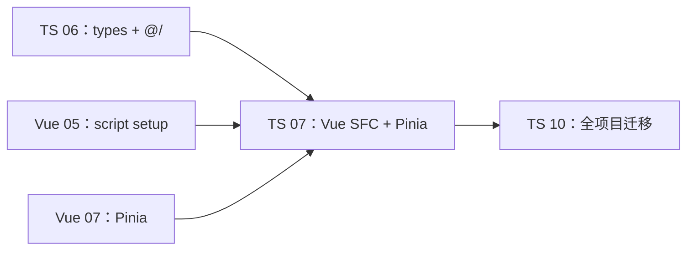
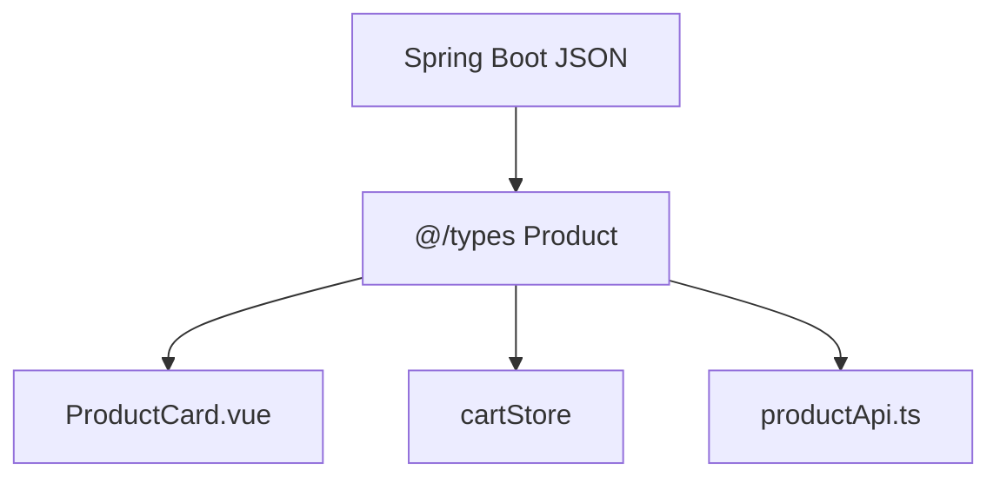
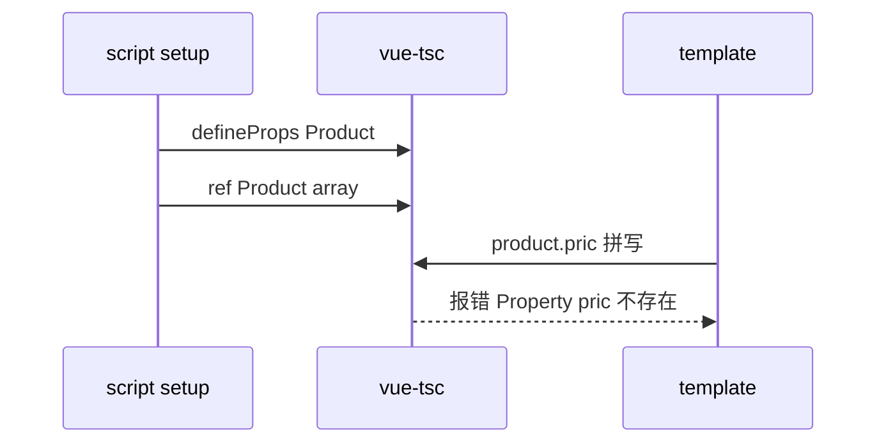
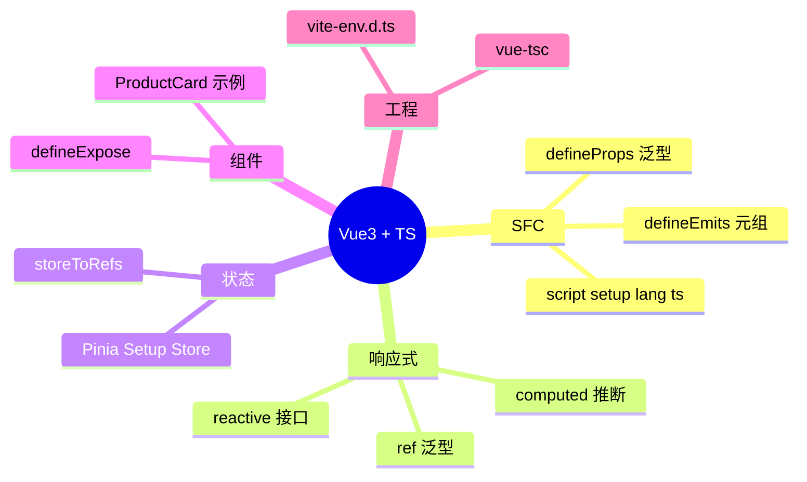

# Vue 3 与 TypeScript

## 本章衔接

[06-模块声明文件与三方库](./06-模块声明文件与三方库.md) 里，你已经在 `src/types/` 定义了 `Product`、`ApiResult`，并配置好了 `@/` 别名与 `vite-env.d.ts`。但这些类型尚未进入 **Vue 单文件组件（SFC）** 和 **Pinia Store**。

若你按 [Vue 学习路线](../Vue/00-学习路线图与说明.md) 推进，04～07 章的 `shop-vue` 组件与 Store 目前多半是 **JavaScript** 写法：

- `defineProps({ product: { type: Object } })` — 运行时校验，无编译期类型
- `const cartItems = ref([])` — 推断为 `never[]` 或 `any[]`
- Pinia Store 无泛型，重构时 IDE 无法追踪

本章目标：**把 shop-vue 核心文件改为 TypeScript**，获得与后端 [Java 04](../../后端学习/Java/04-SpringBoot核心开发.md) 联调时「字段拼错即报错」的体验。



**前置检查**：

- 完成 TS 01～06
- 完成 [Vue 05-组合式 API 与 script setup](../Vue/05-组合式API与script-setup.md)
- 建议已读 [Vue 07-Pinia 状态管理](../Vue/07-Pinia状态管理.md)（本章会加类型层）
- `shop-vue` 可 `npm run dev`；推荐安装 `vue-tsc` 做类型检查

**读法建议**：Vue 主线同学 **精读本章**；React 主线同学 **浏览一遍** 即可，重点看「类型思维」如何映射到 08 章。

---

## 0. 读前导读（零基础也能跟上）

### 0.1 用一句话弄懂本章

把 [06 章](./06-模块声明文件与三方库.md) 写好的 `Product`、`ApiResult` 等类型，**搬进 Vue 单文件组件和 Pinia Store**，让 props 传错、emit 拼错、Store 字段写错在 **保存文件时** 就报红，而不是等用户点按钮才崩。

### 0.2 你需要提前知道什么（真不会就先跳到哪一章）

| 你现在的状态 | 建议动作 |
|--------------|----------|
| 不会 JS 变量、函数 | 先学 [HTML CSS JS 06～07](../HTML%20CSS%20JS/00-学习路线图与说明.md) |
| 没用过 Vue 3 `<script setup>` | 先读 [Vue 05](../Vue/05-组合式API与script-setup.md) 前 3 节 |
| 不会 `interface`、`import type` | 回 [TS 03](./03-接口类型别名与联合交叉.md)、[TS 06](./06-模块声明文件与三方库.md) |
| 已有 shop-vue 能跑 | **直接跟 §2、§8 手把手改 ProductCard** |

### 0.3 本章知识地图（学完后应能勾选全部 ☐→☑）

- ☐ 能解释：为什么 `defineProps({ type: Object })` 拦不住 `product.pric` 拼错
- ☐ 会在 SFC 里写 `<script setup lang="ts">`
- ☐ 会用 `defineProps<{ product: Product }>()` + `withDefaults`
- ☐ 会用 `defineEmits` 元组语法约束事件载荷
- ☐ 会给 `ref<Product[]>([])` 显式泛型，避免 `never[]`
- ☐ 能写 Pinia Setup Store 并配合 `storeToRefs`
- ☐ 能独立完成 ProductCard.vue 的 TS 版并通过 `vue-tsc`
- ☐ 知道模板 ref + `defineExpose` 的类型写法

### 0.4 建议学习时长与节奏

| 阶段 | 时长 | 内容 |
|------|------|------|
| 通读 §1～2 | 30 min | 建立「JS 写法 vs TS 写法」对比 |
| 跟做 §2 + §8 | 60～90 min | 改 shop-vue 核心文件 |
| 精读 §3～7 | 45 min | props/emits/ref/Pinia 类型细节 |
| 练习 + 闭卷自测 | 30 min | 见章末 §16 |

### 0.5 学完本章你能做什么（可验证的具体动作）

1. 新建 `ProductCard.vue`，`script setup lang="ts"`，`defineProps<{ product: Product }>()`
2. 故意写 `:product="{ id: 1 }"`（缺 `price`），`npm run type-check` **必须报错**
3. 点击「加入购物车」后 Pinia DevTools 里 `items` 有完整 `Product` 字段提示
4. 向没学过 Vue 的同学解释：`lang="ts"` 和 `defineProps` 泛型各自解决什么问题

---

## 1. 为什么在 Vue 3 里用 TypeScript

### 1.1 JS 写法的隐性成本

[Vue 04](../Vue/04-组件基础与组件通信.md) 的 `ProductCard` 用运行时 props：

```js
defineProps({
  product: { type: Object, required: true },
})
```

问题：

| 问题 | 后果 |
|------|------|
| `product` 是 `Object` | `product.pric` 拼错无提示 |
| emit 事件名手写字符串 | 父组件 `@add-crat` 静默失效 |
| Store 的 `items` 无类型 | `item.qty` 写成 `item.quantity` 运行才错 |
| 重构改字段名 | 靠全局搜索，易漏 |

### 1.2 TS 写法的收益

| 场景 | TS 表现 |
|------|---------|
| props 传错类型 | 模板与脚本均报红 |
| emit 载荷类型 | `defineEmits` 泛型约束 payload |
| API 响应 | `ref<Product[]>` 自动推导 |
| Pinia | 完整 state/getter/action 推断 |
| 与后端对齐 | `Product` 接口一处定义，全项目复用 |



---

## 2. 启用 TypeScript：项目与 SFC 配置

### 2.1 创建或迁移到 vue-ts 模板

**单文件组件（SFC，Single File Component）**：一个 `.vue` 文件里同时写 `<template>`、`<script>`、`<style>` 的 Vue 组件格式。
**生活类比**：像「一页 PPT」——上面是画面（模板）、中间是逻辑（脚本）、下面是样式，三页合订成一本。
**为什么重要**：`lang="ts"` 只加在 `<script>` 上，模板类型由 `vue-tsc` 根据 script 里的 props 推断。
**本章用到的地方**：§2.2、§8.2

| 步骤 | 你的动作 | 预期看到什么 | 若不对 |
|------|----------|--------------|--------|
| 1 | `npm create vite@latest shop-vue -- --template vue-ts` | 询问项目名后生成目录 | 检查 Node ≥ 18 |
| 2 | `cd shop-vue && npm install` | `added xxx packages` | 换 npm 镜像或删 lock 重试 |
| 3 | `npm install pinia vue-router` | 依赖写入 package.json | 见 §12 报错表 |
| 4 | `npm install -D vue-tsc` | devDependencies 出现 vue-tsc | 与 typescript 主版本兼容 |
| 5 | `npm run dev` | `Local: http://localhost:5173/` | 查端口占用 |
| 6 | `npm run type-check` | 无输出、exit code 0 | 见 §12 |

```bash
npm create vite@latest shop-vue -- --template vue-ts
cd shop-vue
npm install
npm install pinia vue-router
npm install -D vue-tsc
```

**`package.json` scripts 补充**：

```json
{
  "scripts": {
    "dev": "vite",
    "build": "vue-tsc -b && vite build",
    "type-check": "vue-tsc --noEmit"
  }
}
```

**`npm run type-check` 预期**：无类型错误时静默退出，code 0。

### 2.2 单文件组件启用 TS

```vue
<script setup lang="ts">
// 此处代码按 TypeScript 解析
</script>
```

| 属性 | 含义 |
|------|------|
| `setup` | 组合式 API 语法糖 |
| `lang="ts"` | script 块使用 TypeScript（默认是 JS） |

**注意**：`<template>` 和 `<style>` 不写字面量 `lang="ts"`；模板类型检查由 `vue-tsc` 基于 script 中的 props/emits 推断。

### 2.3 `tsconfig` 与 Vue 插件

Vite Vue-TS 模板通常包含：

```json
// tsconfig.app.json
{
  "compilerOptions": {
    "jsx": "preserve",
    "jsxImportSource": "vue",
    "moduleResolution": "bundler",
    "strict": true,
    "paths": { "@/*": ["./src/*"] }
  },
  "include": ["src/**/*.ts", "src/**/*.tsx", "src/**/*.vue"]
}
```

`vue-tsc` 会读取 `.vue` 文件并做类型检查。

---

## 3. `defineProps` 与泛型写法

### 3.1 类型声明式（推荐）

**defineProps 泛型**：在 `<script setup>` 里用 TypeScript 类型描述父组件传入的 props，编译期检查，无需运行时 `type: Object`。
**生活类比**：像快递单上写「必须收 iPhone 15 一台」——少字段、错型号，发货前（编译）就拦下。
**为什么重要**：`type: Object` 只保证「是个对象」，不保证有 `price`；泛型 props 与 `@/types` 的 `Product` 对齐。
**本章用到的地方**：§3.1～§3.3、§8.2

Vue 3.3+ 支持**基于泛型的类型声明**，编译期检查，无运行时 props 对象：

```vue
<script setup lang="ts">
import type { Product } from '@/types'

const props = defineProps<{
  product: Product
  showPrice?: boolean
}>()

// props.product.price 有完整提示
</script>
```

带默认值需配合 `withDefaults`：

```vue
<script setup lang="ts">
import type { Product } from '@/types'

const props = withDefaults(
  defineProps<{
    product: Product
    showPrice?: boolean
  }>(),
  {
    showPrice: true,
  }
)
</script>
```

### 3.2 运行时声明 + `PropType`（过渡方案）

从 JS 迁移时常见：

```vue
<script setup lang="ts">
import type { PropType } from 'vue'
import type { Product } from '@/types'

defineProps({
  product: {
    type: Object as PropType<Product>,
    required: true,
  },
  showPrice: {
    type: Boolean,
    default: true,
  },
})
</script>
```

| 方式 | 优点 | 缺点 |
|------|------|------|
| `defineProps<{...}>()` | 简洁、类型即文档 | 默认值需 `withDefaults` |
| `PropType` + 运行时 | 保留运行时校验 | 样板代码多 |

**新项目优先泛型写法**。

### 3.3 不要用解构丢失响应式

```vue
<script setup lang="ts">
import type { Product } from '@/types'

// ❌ 直接解构 props 会失去响应式（除非用 toRefs）
const { product } = defineProps<{ product: Product }>()

// ✅ 模板里用 props.product，或：
const props = defineProps<{ product: Product }>()
</script>

<template>
  <p>{{ props.product.name }}</p>
</template>
```

Vue 3.5+ 对解构有改进，初学阶段 **模板中直接用 `props.xxx` 最稳妥**。

---

## 4. `defineEmits` 类型

### 4.1 元组语法（推荐）

```vue
<script setup lang="ts">
import type { Product } from '@/types'

const emit = defineEmits<{
  'add-cart': [product: Product]
  'view-detail': [id: number]
}>()

function handleAdd(product: Product) {
  emit('add-cart', product)
}
</script>
```

父组件：

```vue
<ProductCard
  :product="p"
  @add-cart="onAddCart"
/>
```

```typescript
function onAddCart(product: Product) {
  // product 类型自动推断
}
```

### 4.2 事件名与载荷错误示例

```typescript
emit('add-cart', { id: '1', name: 'x', price: 1 })
// ❌ id 应为 number

emit('add-crat', product)
// ❌ 事件名拼写错误，编译报错
```

### 4.3 与 Pinia 协作时

[ProductCard](../Vue/07-Pinia状态管理.md) 在 07 章改为直接调 `cartStore.add(product)`，可 **不再 emit**。类型重点落在 **Store 的 `add` 参数** 上（§8）。

---

## 5. `ref`、`reactive` 与 `computed` 类型

### 5.1 `ref` 显式泛型

```typescript
import { ref } from 'vue'
import type { Product } from '@/types'

// 空数组必须标注，否则是 never[]
const list = ref<Product[]>([])

// 简单值可自动推断
const keyword = ref('')        // Ref<string>
const loading = ref(false)     // Ref<boolean>

// 可空对象
const current = ref<Product | null>(null)
```

访问时记得 `.value`：

```typescript
list.value.push({ id: 1, name: 'T恤', price: 99 })
if (current.value) {
  console.log(current.value.name)
}
```

### 5.2 `reactive` 与类型

```typescript
import { reactive } from 'vue'
import type { Product } from '@/types'

interface FilterState {
  keyword: string
  category: string
  minPrice: number
}

const filter = reactive<FilterState>({
  keyword: '',
  category: 'all',
  minPrice: 0,
})

// 整对象替换会丢响应式 — 应改字段
filter.keyword = '手机'
```

**经验**：表单/筛选状态用 `reactive<Interface>`；列表、可空实体用 `ref<T>`。

### 5.3 `computed` 推断

```typescript
import { computed } from 'vue'

const filteredList = computed(() => {
  return list.value.filter((p) =>
    p.name.includes(keyword.value)
  )
})
// ComputedRef<Product[]>

const total = computed(() =>
  filteredList.value.reduce((sum, p) => sum + p.price, 0)
)
// ComputedRef<number>
```

显式标注（复杂逻辑时）：

```typescript
const stats = computed<{ count: number; total: number }>(() => ({
  count: filteredList.value.length,
  total: filteredList.value.reduce((s, p) => s + p.price, 0),
}))
```

### 5.4 模板中的类型收窄

```vue
<template>
  <p v-if="current">{{ current.name }}</p>
</template>
```

`v-if="current"` 后，模板内 `current` 收窄为 `Product`（非 null）。

---

## 6. 组合式函数（Composables）类型

与 [Vue 05](../Vue/05-组合式API与script-setup.md) 的 `useProducts` 对应，加上类型：

**`src/composables/useProducts.ts`**：

```typescript
import { ref, computed } from 'vue'
import type { Product } from '@/types'
import { fetchProducts } from '@/api/productApi'

export function useProducts() {
  const products = ref<Product[]>([])
  const keyword = ref('')
  const loading = ref(false)
  const error = ref<string | null>(null)

  const filteredProducts = computed(() =>
    products.value.filter((p) =>
      p.name.toLowerCase().includes(keyword.value.toLowerCase())
    )
  )

  async function load() {
    loading.value = true
    error.value = null
    try {
      const res = await fetchProducts()
      if (res.code === 0) {
        products.value = res.data
      } else {
        error.value = res.message
      }
    } catch (e) {
      error.value = e instanceof Error ? e.message : '未知错误'
    } finally {
      loading.value = false
    }
  }

  return {
    products,
    keyword,
    loading,
    error,
    filteredProducts,
    load,
  }
}
```

组件中导入即有完整返回类型推断。

---

## 7. Pinia Store 类型化

对照 [Vue 07-Pinia](../Vue/07-Pinia状态管理.md)，将 `.js` Store 改为 `.ts`。

### 7.1 Setup Store（推荐）

**`src/stores/cart.ts`**：

```typescript
import { defineStore } from 'pinia'
import { ref, computed } from 'vue'
import type { Product, CartItem } from '@/types'

export const useCartStore = defineStore('cart', () => {
  const items = ref<CartItem[]>([])

  const totalCount = computed(() =>
    items.value.reduce((sum, item) => sum + item.qty, 0)
  )

  const totalPrice = computed(() =>
    items.value.reduce((sum, item) => sum + item.price * item.qty, 0)
  )

  const isEmpty = computed(() => items.value.length === 0)

  function add(product: Product, qty = 1) {
    const exist = items.value.find((i) => i.id === product.id)
    if (exist) {
      exist.qty += qty
    } else {
      items.value.push({ ...product, qty })
    }
  }

  function remove(id: number) {
    items.value = items.value.filter((i) => i.id !== id)
  }

  function updateQty(id: number, qty: number) {
    const item = items.value.find((i) => i.id === id)
    if (!item) return
    if (qty <= 0) {
      remove(id)
    } else {
      item.qty = qty
    }
  }

  function clear() {
    items.value = []
  }

  return {
    items,
    totalCount,
    totalPrice,
    isEmpty,
    add,
    remove,
    updateQty,
    clear,
  }
})
```

### 7.2 `storeToRefs` 保持响应式

```vue
<script setup lang="ts">
import { storeToRefs } from 'pinia'
import { useCartStore } from '@/stores/cart'

const cartStore = useCartStore()
const { items, totalCount, isEmpty } = storeToRefs(cartStore)
// items 是 Ref<CartItem[]>，模板可直接用
</script>
```

```typescript
// ❌ 直接解构丢响应式
const { items } = useCartStore()
```

### 7.3 userStore 类型示例

**`src/stores/user.ts`**：

```typescript
import { defineStore } from 'pinia'
import { ref, computed } from 'vue'

const TOKEN_KEY = 'shop_token'
const USERNAME_KEY = 'shop_username'

export const useUserStore = defineStore('user', () => {
  const token = ref(localStorage.getItem(TOKEN_KEY) || '')
  const username = ref(localStorage.getItem(USERNAME_KEY) || '')

  const isLoggedIn = computed(() => !!token.value)
  const displayName = computed(() => username.value || '游客')

  function setLogin(newToken: string, name: string) {
    token.value = newToken
    username.value = name
    localStorage.setItem(TOKEN_KEY, newToken)
    localStorage.setItem(USERNAME_KEY, name)
  }

  function logout() {
    token.value = ''
    username.value = ''
    localStorage.removeItem(TOKEN_KEY)
    localStorage.removeItem(USERNAME_KEY)
  }

  return { token, username, isLoggedIn, displayName, setLogin, logout }
})
```

### 7.4 Options Store 类型（了解）

```typescript
import { defineStore } from 'pinia'
import type { CartItem } from '@/types'

interface CartState {
  items: CartItem[]
}

export const useCartStore = defineStore('cart', {
  state: (): CartState => ({
    items: [],
  }),
  getters: {
    totalCount(state): number {
      return state.items.reduce((s, i) => s + i.qty, 0)
    },
  },
  actions: {
    add(item: CartItem) {
      this.items.push(item)
    },
  },
})
```

新项目仍推荐 **Setup Store**，与 `<script setup lang="ts">` 一致。

---

## 8. 手把手：ProductCard 完整 TS 版

对照 [Vue 07 §11.1](../Vue/07-Pinia状态管理.md)，将 `ProductCard.vue` 类型化。

### 8.1 类型定义（若 06 章未完成）

**`src/types/product.ts`**：

```typescript
export interface Product {
  id: number
  name: string
  price: number
  stock?: number
  img?: string
  category?: string
}

export interface CartItem extends Product {
  qty: number
}
```

### 8.2 ProductCard.vue

**逐行读**（script 核心逻辑）：

| 行号/代码 | 含义 | 改错会怎样 |
|-----------|------|------------|
| `import type { Product }` | 只导入类型，编译后擦除 | 写成普通 import 在 strict 下可能触发多余加载警告 |
| `withDefaults(defineProps<{...}>(), {...})` | 必填 `product`，可选 `showPrice` 默认 true | 缺 `withDefaults` 时可选 prop 无默认值 |
| `computed(() => props.product.stock === 0)` | 推断为 `ComputedRef<boolean>` | 若 `stock` 未在 Product 定义，type-check 报错 |
| `cartStore.add(props.product)` | 参数必须是 `Product` | 传 `{ id: 1 }` 会报类型不兼容 |
| 模板里 `product.name` | 模板可直接用 prop 名 | script 里须 `props.product` 或不解构 |

**`src/components/ProductCard.vue`**：

```vue
<script setup lang="ts">
import { computed } from 'vue'
import { useCartStore } from '@/stores/cart'
import type { Product } from '@/types'

const props = withDefaults(
  defineProps<{
    product: Product
    showPrice?: boolean
  }>(),
  { showPrice: true }
)

const cartStore = useCartStore()

const isSoldOut = computed(() => props.product.stock === 0)

const formattedPrice = computed(() =>
  `¥ ${props.product.price.toFixed(2)}`
)

function handleAdd() {
  if (isSoldOut.value) return
  cartStore.add(props.product)
}
</script>

<template>
  <article class="card" :class="{ 'card--sold': isSoldOut }">
    
    <h3>{{ product.name }}</h3>
    <p v-if="showPrice" class="price">{{ formattedPrice }}</p>
    <p v-if="isSoldOut" class="badge">售罄</p>
    <div class="actions">
      <router-link :to="`/products/${product.id}`">详情</router-link>
      <button type="button" :disabled="isSoldOut" @click="handleAdd">
        加入购物车
      </button>
    </div>
  </article>
</template>

<style scoped>
.card {
  background: #fff;
  border: 1px solid #eee;
  border-radius: 8px;
  padding: 16px;
}
.card--sold { opacity: 0.6; }
.thumb { width: 100%; height: 120px; object-fit: cover; border-radius: 4px; }
.price { color: #e74c3c; margin: 8px 0; }
.badge { color: #999; font-size: 12px; }
.actions { display: flex; gap: 12px; align-items: center; }
button {
  padding: 6px 12px;
  background: #42b983;
  color: #fff;
  border: none;
  border-radius: 4px;
  cursor: pointer;
}
button:disabled { background: #ccc; cursor: not-allowed; }
</style>
```

### 8.3 父组件 ProductList / HomeView

```vue
<script setup lang="ts">
import { onMounted } from 'vue'
import ProductCard from '@/components/ProductCard.vue'
import { useProducts } from '@/composables/useProducts'

const { filteredProducts, keyword, loading, load } = useProducts()

onMounted(() => {
  load()
})
</script>

<template>
  <section>
    <input v-model="keyword" placeholder="搜索商品" />
    <p v-if="loading">加载中...</p>
    <div v-else class="grid">
      <ProductCard
        v-for="p in filteredProducts"
        :key="p.id"
        :product="p"
      />
    </div>
  </section>
</template>

<style scoped>
.grid {
  display: grid;
  grid-template-columns: repeat(auto-fill, minmax(200px, 1fr));
  gap: 16px;
}
</style>
```

### 8.4 验证清单

| 步骤 | 预期 |
|------|------|
| `:product="{ id: 1, name: 'x' }"` 缺 `price` | `vue-tsc` 报错 |
| `cartStore.add` 传入非 Product | 报红 |
| 点击加购 | Pinia DevTools 可见 items |
| `npm run type-check` | exit code 0 |

---

## 9. `ComponentPublicInstance` 与模板 ref

### 9.1 何时需要

[Vue 04 §12](../Vue/04-组件基础与组件通信.md) 用父组件 `ref` 调子组件 `expose` 的方法。TS 需标注 ref 类型。

子组件 **SearchBar.vue**：

```vue
<script setup lang="ts">
import { ref } from 'vue'

const inputRef = ref<HTMLInputElement | null>(null)

function focus() {
  inputRef.value?.focus()
}

defineExpose({ focus })
</script>

<template>
  <input ref="inputRef" />
</template>
```

父组件：

```vue
<script setup lang="ts">
import { ref } from 'vue'
import type { ComponentPublicInstance } from 'vue'
import SearchBar from '@/components/SearchBar.vue'

// 方式 1：自定义 expose 接口（推荐）
interface SearchBarExpose {
  focus: () => void
}

const searchBarRef = ref<SearchBarExpose | null>(null)

// 方式 2：ComponentPublicInstance（较宽，少约束）
// const searchBarRef = ref<ComponentPublicInstance | null>(null)

function onPageShow() {
  searchBarRef.value?.focus()
}
</script>

<template>
  <SearchBar ref="searchBarRef" />
</template>
```

### 9.2 `ComponentPublicInstance` 说明

`ComponentPublicInstance` 是 Vue 3 对「组件实例」的公共类型，包含 `$el`、`$emit` 等。日常更推荐 **为 `defineExpose` 声明专用接口**，类型更精确。

### 9.3 DOM ref 类型

```typescript
const el = ref<HTMLDivElement | null>(null)
const btn = ref<HTMLButtonElement | null>(null)
```

模板：`<div ref="el">` — `vue-tsc` 会校验 ref 与元素匹配。

---

## 10. 路由与 Router 类型（简要）

```typescript
// src/router/index.ts
import { createRouter, createWebHistory } from 'vue-router'
import type { RouteRecordRaw } from 'vue-router'

const routes: RouteRecordRaw[] = [
  { path: '/', component: () => import('@/views/HomeView.vue') },
  { path: '/products/:id', component: () => import('@/views/ProductDetailView.vue') },
]

const router = createRouter({
  history: createWebHistory(),
  routes,
})

export default router
```

组件内：

```typescript
import { useRoute, useRouter } from 'vue-router'

const route = useRoute()
const productId = Number(route.params.id) // params 默认 string | string[]

const router = useRouter()
router.push({ name: 'cart' })
```

详情见 [Vue 06-Router](../Vue/06-Vue-Router路由管理.md)；TS 层重点是 **`RouteRecordRaw`** 与 **`route.params` 收窄**。

---

## 11. 与 Axios 联调的类型衔接

[Vue 08](../Vue/08-Axios网络请求与前后端联调.md) 将对接后端。提前准备：

**`src/api/request.ts`**：

```typescript
import axios from 'axios'
import type { AxiosInstance, InternalAxiosRequestConfig } from 'axios'
import type { ApiResult } from '@/types'

const request: AxiosInstance = axios.create({
  baseURL: import.meta.env.VITE_API_BASE || '/api',
  timeout: 10000,
})

request.interceptors.response.use((response) => {
  return response.data as ApiResult<unknown>
})

export default request

export async function get<T>(url: string): Promise<ApiResult<T>> {
  return request.get(url)
}
```

确保 JSON 字段与 [Java DTO](../../后端学习/Java/04-SpringBoot核心开发.md) 一致，否则 TS 再严也无法阻止运行时字段缺失——**类型是前后端契约的文档**。

---

## 12. 常见报错与排查

| 报错信息 | 可能原因 | 排查步骤 | 解决方案 |
|---------|---------|---------|---------|
| 类型 `{ id: string }` 不能赋给 `Product` | API 返回 id 为字符串 | 看 Network 响应 | 统一类型或 `Number(id)` 转换 |
| `Property 'value' does not exist` | 忘了 ref 的 .value | 看变量是否 Ref | 脚本里用 `.value` |
| `getActivePinia was called with no active Pinia` | main.ts 未 use pinia | 查 main.ts 顺序 | `app.use(pinia)` 在 mount 前 |
| 解构 store 后 UI 不更新 | 未用 storeToRefs | 对比 §7.2 | `storeToRefs(cartStore)` |
| `defineProps` 默认值不生效 | 泛型 props 未用 withDefaults | 查 script | 包一层 `withDefaults` |
| 模板中 `product` 可能为 undefined | 可选 prop 未收窄 | 加 v-if | `v-if="product"` 或必填 |
| `vue-tsc` 找不到模块 `@/types` | paths 未配 | tsconfig | 见 TS 06 章 |
| `emit` 参数类型不匹配 | 元组载荷写错 | 看 defineEmits | 对齐 `[product: Product]` |
| `ComponentPublicInstance` 上无 `focus` | expose 未声明类型 | 子组件 defineExpose | 父组件用自定义 Expose 接口 |
| `never[]` 不能 push | ref 未标注泛型 | `ref([])` | `ref<Product[]>([])` |
| 导入 `.vue` 无默认导出 | vite-env.d.ts 缺失 | 查声明文件 | 补 `declare module '*.vue'` |
| Pinia action 内 `this` 类型错误 | Options Store 混用 | 改 Setup Store | `defineStore('id', () => {...})` |
| `computed` 返回类型过宽 | 复杂分支推断失败 | 显式泛型 | `computed<{ count: number }>(...)` |
| 模板中可选 prop 报错 | strictNullChecks | v-if 收窄 | `v-if="product"` 后再访问字段 |
| `useProducts` 返回类型丢失 | composable 未 export 类型 | 补 interface | 见 §6 UseProductsReturn |

---

## 12.1 深入解释：vue-tsc 如何检查模板

Vue 单文件组件的 `<template>` **不写** TypeScript，但 `vue-tsc` 会根据 `<script setup>` 里的 `defineProps`、`defineEmits`、`ref` 类型，**推断模板里** `product.name`、`emit('add-cart', p)` 是否合法。



**为什么 `npm run dev` 不报错？** Vite 用 esbuild 转译 `.vue`，**不做**这套模板类型关联。工程上必须 CI 跑 `vue-tsc --noEmit`（见 [09 章](./09-工程化与tsconfig深入.md) §13）。

**shop 验证**：故意在 ProductList 模板写 `{{ p.pric }}`，保存后 `npm run type-check` 应失败。

---

## 12.2 深入解释：Pinia 与 composable 的类型边界

| 层级 | 类型来源 | shop 示例 |
|------|----------|-----------|
| `@/types` | 业务契约 | `Product`、`CartItem` |
| composable | 局部状态 + 返回类型 | `useProducts()` |
| Pinia store | 跨路由全局 | `useCartStore` |
| 组件 | props/emits | `ProductCard.vue` |

**原则**：DTO 放 `types/`；**可复用逻辑**无全局需求用 composable；**跨页共享**用 Pinia。类型都从 `@/types` import，避免在组件里重复 `interface Product`。

---

## 13. Vue 3 + TS 最佳实践清单

| 实践 | 说明 |
|------|------|
| 统一 `@/types` | Product、User、ApiResult 一处维护 |
| SFC 一律 `lang="ts"` | 新组件不写 JS |
| props 用泛型 + withDefaults | 少写 PropType 样板 |
| 列表/实体用 `ref<T>` | 避免 never[] |
| Store 用 Setup Store + `.ts` | 与 composable 风格统一 |
| 提交前跑 `vue-tsc --noEmit` | CI 可接同一命令 |
| 模板 ref 声明 Expose 接口 | 优于宽泛的 ComponentPublicInstance |



---

## 14. 常见问题 FAQ

### Q1：`<script setup>` 里能用 `interface` 吗？

可以。`interface Props {}` 与 `type Props = {}` 均可用于 `defineProps<Props>()`。

### Q2：模板里需要写类型吗？

不需要。模板类型由 `vue-tsc` 根据 script 推断；错误会标在模板或 script 引用处。

### Q3：Pinia 和 composable 如何选择？

跨路由、全局态 → Pinia（见 [Vue 07](../Vue/07-Pinia状态管理.md)）；单页或局部复用逻辑 → composable。

### Q4：能不能部分组件 TS、部分 JS？

可以（`allowJs: true`），但 shop 迁移目标应是 **全 TS**（[10 章](./10-项目实战JS到TS迁移.md)）。

### Q5：和 React 08 章的关系？

类型定义（`Product`、`ApiResult`）**两边可共用概念**；组件写法不同，但 `@/types` 思路一致。

### Q6：`defineModel` 和 props + emit 怎么选？

Vue 3.4+ 的 `defineModel<string>()` 适合 **v-model 双向绑定**（如 SearchBar 的 keyword）；单向数据流用 props + emit 更清晰。TS 写法：`defineModel<string>('keyword', { default: '' })`。

### Q7：Element Plus 组件 ref 类型怎么写？

`ref<InstanceType<typeof ElForm> | null>(null)`；若类型过深报错，可先用 `ComponentPublicInstance` 过渡，再收窄到具体 Expose 方法。

### Q8：`vue-tsc` 和 Vite 开发时类型检查一样吗？

开发时 IDE 与 `vue-tsc` 共用 tsconfig；Vite HMR **不跑**完整类型检查。提交前必须 `npm run type-check`。

### Q9：Pinia Options Store 还要学吗？

Setup Store 与 `<script setup lang="ts">` 风格一致，新项目优先 Setup；面试可能问 Options Store 的 `state: (): CartState => ({})` 写法。

### Q10：模板里能用可选链 `product?.name` 吗？

可以；`strictNullChecks` 下若 `product` 是可选 prop，模板用 `v-if="product"` 收窄后更干净，可选链适合深层字段。

### Q11：composable 返回值要手写返回类型吗？

简单 composable 可让 TS 推断；对外发布的 composable 或返回字段多时，显式 `interface UseProductsReturn` 更利于文档与跳转（见 §6）。

### Q12：为什么 `ref([])` 是 `never[]`？

空数组无元素，TS 推断「永远不会有元素类型」；必须 `ref<Product[]>([])` 或 `ref([] as Product[])`（后者不如泛型清晰）。

### Q13：路由 `params.id` 为什么是 string？

Vue Router 路径参数默认字符串；详情页用 `Number(route.params.id)` 或 `zod` 校验后再赋给 `ref<number>`。

### Q14：能否在 `.vue` 里写 `enum`？

可以但不推荐；订单状态等用 `as const` + 联合类型（见 [TS 11 §11](./11-面试专题与知识点总表.md)）。

### Q15：迁移时先改 Store 还是先改组件？

先 **types + api**，再 **stores**（组件依赖 store），最后 **components/views**（见 [10 章](./10-项目实战JS到TS迁移.md) §2）。

---

## 14.1 Vue 3.4+ defineModel 与 TS（补充）

**defineModel**：为 `v-model:xxx` 提供双向绑定 props + emit 的语法糖，带泛型后 keyword 类型为 `Ref<string>`。

```vue
<script setup lang="ts">
const keyword = defineModel<string>('keyword', { default: '' })
</script>

<template>
  <input v-model="keyword" />
</template>
```

父组件：`<SearchBar v-model:keyword="kw" />`，`kw` 须为 `ref<string>` 或兼容类型。

---

## 15. 本章小结

本章把 [06 章](./06-模块声明文件与三方库.md) 的类型基础设施接入了 Vue 3 生态：`defineProps` / `defineEmits` 泛型、`ref`/`computed` 标注、Pinia Setup Store，以及 **shop-vue ProductCard** 的完整 TS 实现。完成后，你的商城组件具备 **编译期 props 校验** 与 **Store 重构安全网**。

---

## 练习建议

### 基础题

1. 将 `CartBadge.vue` 改为 `lang="ts"`，`defineProps<{ count: number }>()`。
2. 为 `LoginForm.vue` 定义 `defineEmits<{ success: [username: string] }>()`。
3. 在 `useProducts.ts` 中为 `keyword` 和 `filteredProducts` 确认类型推断无误。

### 进阶题

4. 实现 `SearchBar.vue`：`v-model:keyword` 用 `defineModel<string>()`（Vue 3.4+）或 props + emit，并写全类型。
5. `ProductDetailView.vue` 从 `route.params.id` 取 id，请求详情，使用 `ref<Product | null>(null)`。

### 挑战题

6. 为 `cartStore.add` 增加库存校验：`product.stock` 不足时 `throw` 或返回 `false`，调用方类型化处理；补全 `vue-tsc` 通过。

---

## 练习参考答案

### 基础题 1：CartBadge.vue

```vue
<script setup lang="ts">
defineProps<{
  count: number
}>()
</script>

<template>
  <span class="badge">🛒 {{ count }}</span>
</template>
```

### 基础题 2：LoginForm.vue emit

```vue
<script setup lang="ts">
import { ref } from 'vue'

const emit = defineEmits<{
  success: [username: string]
}>()

const username = ref('')
const password = ref('')

function handleSubmit() {
  if (username.value && password.value) {
    emit('success', username.value)
  }
}
</script>
```

### 进阶题 4：defineModel 示例

```vue
<script setup lang="ts">
const keyword = defineModel<string>('keyword', { default: '' })
</script>

<template>
  <input v-model="keyword" placeholder="搜索" />
</template>
```

### 挑战题 6：库存校验

```typescript
function add(product: Product, qty = 1): boolean {
  if (product.stock !== undefined && product.stock <= 0) return false
  const exist = items.value.find((i) => i.id === product.id)
  const nextQty = (exist?.qty ?? 0) + qty
  if (product.stock !== undefined && nextQty > product.stock) return false
  // ... 原有逻辑
  return true
}
```

```vue
function handleAdd() {
  const ok = cartStore.add(props.product)
  if (!ok) alert('库存不足')
}
```

---

## 16. 闭卷自测

1. **概念**：`defineProps({ type: Object })` 与 `defineProps<{ product: Product }>()` 在类型安全上差在哪？
2. **概念**：为什么 `const { product } = defineProps<...>()` 可能丢响应式？
3. **概念**：`storeToRefs` 解决什么问题？
4. **概念**：`defineEmits` 元组 `[product: Product]` 语法表示什么？
5. **概念**：`ref([])` 推断为 `never[]` 的原因？
6. **概念**：模板 ref 为何推荐自定义 Expose 接口而非宽泛的 `ComponentPublicInstance`？
7. **动手**：写出带 `withDefaults` 的 `defineProps`，含必填 `product: Product` 与可选 `showPrice?: boolean` 默认 true。
8. **动手**：写 Pinia Setup Store 片段：`items: ref<CartItem[]>([])` 与 `add(product: Product)`。
9. **综合**：说明 ProductCard 从 JS 迁到 TS 需改哪 4 处（文件扩展/属性、props、store 调用、type-check 脚本）。
10. **综合**：对比 Vue `defineEmits` 与 React props 回调 `onAddCart` 的类型表达异同（链 [08 章](./08-React与TypeScript.md)）。

### 自测参考答案

1. 前者只校验「是对象」，不校验字段；后者编译期要求完整 `Product` 形状。
2. 解构后 prop 不再是响应式引用；应用 `props.xxx` 或 Vue 3.5+ 解构规则 / `toRefs`。
3. 从 store 解构 state/getter 时保持 `Ref` 类型，模板仍响应式。
4. 事件名对应载荷类型：`add-cart` 必须传 `Product` 类型参数。
5. 空数组无元素，TS 无法推断元素类型。
6. Expose 接口只暴露 `focus()` 等方法，父组件 ref 类型更精确。
7. 见 §3.1 `withDefaults` 示例。
8. 见 §7.1 cart store 完整代码。
9. `lang="ts"`、`defineProps` 泛型、`cartStore.add` 参数类型、`package.json` 的 `vue-tsc` 脚本。
10. Vue 用 emit 元组；React 用 Props 里的 `(product: Product) => void` 回调，语义同构。

---

## 17. 费曼检验

请 **不看资料**，用 3 分钟向没学过编程的朋友解释「Vue 3 为什么要加 TypeScript」。

**对照提纲**（应提到以下至少 3 点）：

1. **Props 像快递清单**：泛型 props 规定父组件必须传齐 `Product` 字段，拼错 `price` 保存时就红。
2. **Store 像仓库台账**：Pinia 里 `items` 有类型，改字段名 IDE 能列出所有引用。
3. **和 06 章类型文件衔接**：`@/types` 一处定义，组件、API、Store 共用，与 Java 后端 JSON 对齐。
4. **验证方式**：`npm run type-check`（vue-tsc）通过才算真 TS 化，光 `npm run dev` 不够。

---

## 学完标准

| # | 能力 | 自检方式 |
|---|------|----------|
| 1 | 新建 `.vue` 默认 `script setup lang="ts"` | 无 JS 新组件 |
| 2 | `defineProps` 泛型 + `withDefaults` | ProductCard 通过 type-check |
| 3 | `defineEmits` 元组约束事件载荷 | 故意错事件名会报错 |
| 4 | `ref<Product[]>` 等显式泛型 | 无 never[] 问题 |
| 5 | Pinia Setup Store 全 `.ts` | cart/user store 有完整推断 |
| 6 | `storeToRefs` 正确使用 | 购物车页数据响应式 |
| 7 | 模板 ref + `defineExpose` 类型 | 能调子组件 focus |
| 8 | `npm run type-check` 通过 | exit code 0 |

---

## 下一章预告

Vue 路线同学可继续把列表页、路由守卫改为 TS，并阅读 [09-工程化与 tsconfig 深入](./09-工程化与tsconfig深入.md) 开启 `strict` 全量修错。

**React 主线**请转 [08 React 与 TypeScript](./08-React与TypeScript.md)：同一套 `Product` 类型，在 `.tsx`、`useState` 泛型、Zustand 中的写法对照学习。两章 **类型文件可复用**，组件层二选一精读即可。

---

*下一章：08 React 与 TypeScript（React 主线）/ 09 工程化与 tsconfig 深入（Vue 续）*
