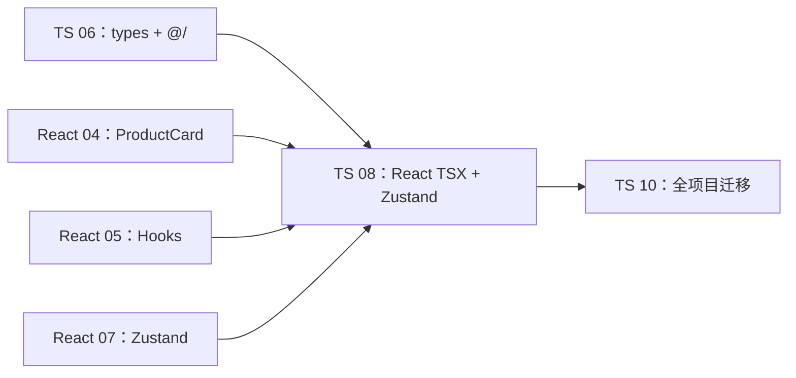
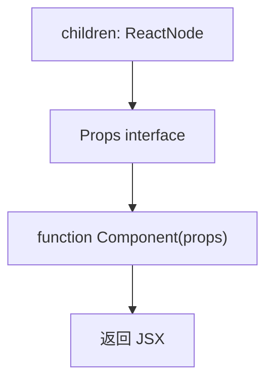
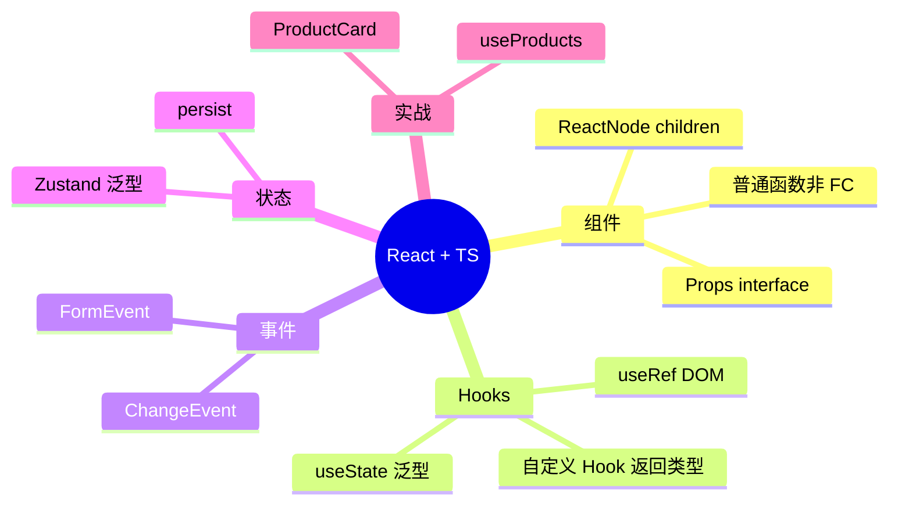

# React 与 TypeScript

## 本章衔接

[06-模块声明文件与三方库](./06-模块声明文件与三方库.md) 建立了 `src/types/` 与 `@/` 别名；[07-Vue3与TypeScript](./07-Vue3与TypeScript.md) 展示了同一套 `Product` 类型在 Vue SFC 中的用法。若你主学 [React 路线](../React/00-学习路线图与说明.md)，本章是 **框架 + TS 的正式入口**。

[React 04](../React/04-组件通信与组合.md) 已在 §8.2 预告了 `ProductCard.tsx` 的 interface 写法；[05-Hooks](../React/05-Hooks核心与自定义Hooks.md) 的 `useProducts`、`useCart` 仍是 JS。本章把它们 **全面类型化**，并对照 [07-Zustand](../React/07-Zustand状态管理.md) 完成 `userStore` / `cartStore` 的 TS 版本。



**前置检查**：

- 完成 TS 01～06
- 完成 React 01～05（至少理解 `useState`、`useEffect`、自定义 Hook）
- 建议已读 [React 07-Zustand](../React/07-Zustand状态管理.md)
- `shop-react` 可 `npm run dev`

**Vue 主线同学**：浏览本章即可，重点理解 **同一业务类型在 React 中的表达差异**（props interface vs `defineProps`、Zustand vs Pinia）。

---

## 0. 读前导读（零基础也能跟上）

### 0.1 用一句话弄懂本章

把 shop-react 的组件、Hooks、Zustand Store 从 `.jsx` 改成 **`.tsx` + Props 接口 + 泛型 Hooks**，获得与 [07 Vue 章](./07-Vue3与TypeScript.md) 同级的编译期类型安全。

### 0.2 你需要提前知道什么

| 状态 | 动作 |
|------|------|
| 不会 React Hooks | 先读 [React 05](../React/05-Hooks核心与自定义Hooks.md) |
| 不会 TS interface / 泛型 | 回 [TS 03](./03-接口类型别名与联合交叉.md)、[04](./04-函数类型与泛型.md) |
| 主学 Vue | 浏览 §3～§4、§9，理解「类型思维」即可 |
| 已有 shop-react | 跟 §2、§10 改 ProductCard + cartStore |

### 0.3 本章知识地图（学完后 ☐→☑）

- ☐ 能写 `interface ProductCardProps` + 函数组件解构 props
- ☐ 说清 `React.FC` vs 普通函数 vs `React.ReactNode` 选型
- ☐ 会用 `useState<Product[]>([])`、`useRef<HTMLInputElement>(null)`
- ☐ 表单事件用 `ChangeEvent` / `FormEvent`，不用 `any`
- ☐ 自定义 Hook 有明确返回类型（如 `UseProductsReturn`）
- ☐ Zustand `create<CartState>()(persist(...))` 双括号写法
- ☐ `forwardRef` + `useImperativeHandle` 暴露子组件方法
- ☐ `npm run type-check` 通过

### 0.4 建议学习时长与节奏

| 阶段 | 时长 | 内容 |
|------|------|------|
| §1～2 环境与 Props | 40 min | 对比 Vue defineProps |
| §4～7 事件与 Hooks | 50 min | 重点 ChangeEvent |
| §9～10 Zustand + 实战 | 60 min | cartStore + ProductCard |
| 闭卷自测 | 25 min | §16 |

### 0.5 学完本章你能做什么

1. 新建 `ProductCard.tsx`，缺 `price` 时 `tsc` 报错
2. LoginForm 的 `onSubmit` 使用 `FormEvent<HTMLFormElement>`
3. 向同学解释：为什么社区更推荐普通函数而非 `React.FC`

---

## 1. 为什么在 React 里用 TypeScript

### 1.1 JS + PropTypes 的局限

[React 04](../React/04-组件通信与组合.md) 用 PropTypes 做运行时检查：

```jsx
ProductCard.propTypes = {
  product: PropTypes.shape({ id: PropTypes.number }).isRequired,
}
```

| 局限 | 说明 |
|------|------|
| 仅开发环境警告 | 生产构建常剥离 PropTypes |
| 无 IDE 强提示 | 跳转、重构弱于 TS |
| 与 Hooks 泛型脱节 | `useState([])` 推断差 |
| 事件 handler 无约束 | `onChange` 参数易写错 |

### 1.2 TypeScript 在 React 中的收益

| 能力 | 示例 |
|------|------|
| Props 编译期检查 | `product: Product` 缺字段即报错 |
| Hooks 泛型 | `useState<Product[]>([])` |
| 事件类型 | `ChangeEvent<HTMLInputElement>` |
| 自定义 Hook 返回值 | 自动推断 `{ list, loading }` |
| Zustand selector | `useCartStore(s => s.items)` 元素类型明确 |

---

## 2. 启用 TypeScript：React + Vite 模板

### 2.1 创建项目

| 步骤 | 你的动作 | 预期看到什么 | 若不对 |
|------|----------|--------------|--------|
| 1 | `npm create vite@latest shop-react -- --template react-ts` | 生成 react-ts 模板 | Node ≥ 18 |
| 2 | `npm install zustand react-router-dom` | package.json 更新 | 见 §12 |
| 3 | `npm install -D @types/react @types/react-dom` | devDependencies | React 18+ 主包自带类型，@types 补全 JSX |
| 4 | `npm run dev` | localhost:5173 可访问 | 端口冲突换 `--port` |
| 5 | `npm run type-check` | exit 0 | 见 §12 |

```bash
npm create vite@latest shop-react -- --template react-ts
cd shop-react
npm install
npm install zustand react-router-dom
npm install -D @types/react @types/react-dom
```

**说明**：React 18+ 主包 **自带类型**，`@types/react` 仍建议安装以获取最新 JSX 类型定义。

### 2.2 脚本与检查

```json
{
  "scripts": {
    "dev": "vite",
    "build": "tsc -b && vite build",
    "type-check": "tsc --noEmit"
  }
}
```

```bash
npm run type-check
```

**预期**：无错误时静默退出 code 0。

### 2.3 文件扩展名约定

| 扩展名 | 用途 |
|--------|------|
| `.ts` | 纯逻辑、Store、API、类型 |
| `.tsx` | 含 JSX 的组件 |
| 避免 `.jsx` | 新代码统一 `.tsx` |

---

## 3. 组件 Props：interface 与解构

### 3.1 标准写法（推荐）

```tsx
// src/components/ProductCard.tsx
import type { Product } from '@/types'

export interface ProductCardProps {
  product: Product
  showPrice?: boolean
  onAddCart?: (product: Product) => void
}

export default function ProductCard({
  product,
  showPrice = true,
  onAddCart,
}: ProductCardProps) {
  const isSoldOut = product.stock === 0

  function handleAdd() {
    if (isSoldOut) return
    onAddCart?.(product)
  }

  return (
    <article className="card">
      <h3>{product.name}</h3>
      {showPrice && <p className="price">¥ {product.price.toFixed(2)}</p>}
      <button type="button" disabled={isSoldOut} onClick={handleAdd}>
        加入购物车
      </button>
    </article>
  )
}
```

### 3.2 `type` vs `interface` 用于 Props

| 选择 | 建议 |
|------|------|
| `interface ProductCardProps` | 组件 Props 首选，可扩展 |
| `type ProductCardProps = { ... }` | 联合 props、工具类型组合时 |

```typescript
type ButtonProps = React.ComponentProps<'button'> & {
  variant?: 'primary' | 'ghost'
}
```

### 3.3 子组件与 `children`

见 §4（`React.ReactNode` vs `FC`）。

---

## 4. `React.FC` vs 普通函数 vs `React.ReactNode`

### 4.1 历史：`React.FC`（Functional Component）

```tsx
import type { FC } from 'react'

const CartBadge: FC<{ count: number }> = ({ count }) => {
  return <span>🛒 {count}</span>
}
```

早期 `FC` 自动包含 `children`，且隐式 `displayName`。React 18 起 **`FC` 不再默认含 children**，社区风格转向 **普通函数 + 显式 Props**。

### 4.2 现代推荐：普通函数声明

```tsx
interface CartBadgeProps {
  count: number
}

export default function CartBadge({ count }: CartBadgeProps) {
  return <span className="badge">🛒 {count}</span>
}
```

| 对比 | `React.FC<Props>` | `function Comp(props: Props)` |
|------|-------------------|-------------------------------|
| children | 需手动写在 Props 里 | 同上，显式更清晰 |
| 隐式 children 时代包袱 | 有 | 无 |
| 团队主流 | 逐渐减少 | **推荐** |
| 泛型组件 | 别扭 | 更自然 |

### 4.3 `React.ReactNode` 是什么

**ReactNode**：React 能渲染到屏幕上的「任意合法内容」的类型集合（字符串、数字、JSX、null、数组等）。
**生活类比**：像舞台「可上场的东西」——台词、道具、演员、空场（null）都算。
**为什么重要**：容器组件的 `children` 应标 `React.ReactNode`，比 `ReactElement` 更宽、更符合实际。
**本章用到的地方**：§4.3～§4.4

**`ReactNode`** = React 可渲染的任何内容：

```typescript
type ReactNode =
  | string
  | number
  | boolean
  | null
  | undefined
  | ReactElement
  | ReactNode[]
  // ...
```

典型用途：**带 children 的容器组件**

```tsx
interface CardProps {
  title: string
  children: React.ReactNode
  footer?: React.ReactNode
}

export function Card({ title, children, footer }: CardProps) {
  return (
    <section className="card">
      <h2>{title}</h2>
      <div className="body">{children}</div>
      {footer && <footer>{footer}</footer>}
    </section>
  )
}
```

### 4.4 `ReactElement` vs `ReactNode`

| 类型 | 范围 |
|------|------|
| `ReactNode` | 更广，含 string、number、null 等 |
| `ReactElement` | 仅 JSX 元素，如 `<div />` |

插槽只要「能显示的内容」用 **`ReactNode`**；约束「必须是一个 React 元素」时用 `ReactElement`。

### 4.5 不建议的写法

```tsx
// ❌ 避免：无 Props 时用空对象或 any
const App = () => { ... }

// ✅ 无 props 可不写接口
export default function App() {
  return <div>...</div>
}
```



---

## 5. `useState` 泛型

### 5.1 基本用法

```tsx
import { useState } from 'react'
import type { Product } from '@/types'

const [keyword, setKeyword] = useState('')           // string
const [loading, setLoading] = useState(false)        // boolean
const [list, setList] = useState<Product[]>([])      // 必须泛型，否则 never[]
const [current, setCurrent] = useState<Product | null>(null)
```

### 5.2 对象 state

```tsx
interface FilterState {
  keyword: string
  category: string
}

const [filter, setFilter] = useState<FilterState>({
  keyword: '',
  category: 'all',
})

// 不可变更新
setFilter((prev) => ({ ...prev, keyword: '手机' }))
```

### 5.3 惰性初始化

```tsx
const [cart, setCart] = useState<Product[]>(() => {
  const raw = localStorage.getItem('cart')
  return raw ? JSON.parse(raw) : []
})
```

### 5.4 与 `useReducer` 简要对比

复杂状态机可用 `useReducer<State, Action>()`，shop 项目 Zustand 已覆盖大部分全局态，组件内 **`useState` + 泛型** 足够。

---

## 6. `useRef` 类型

### 6.1 DOM ref

```tsx
import { useRef, useEffect } from 'react'

function SearchBar() {
  const inputRef = useRef<HTMLInputElement>(null)

  useEffect(() => {
    inputRef.current?.focus()
  }, [])

  return <input ref={inputRef} type="search" />
}
```

**注意**：初始值 `null`，类型写 `HTMLInputElement | null`；`useRef<HTMLInputElement>(null)` 由 React 类型定义处理。

### 6.2 可变值 ref（不触发重渲染）

```tsx
const timerRef = useRef<ReturnType<typeof setTimeout> | null>(null)

function start() {
  timerRef.current = setTimeout(() => {}, 1000)
}

function stop() {
  if (timerRef.current) clearTimeout(timerRef.current)
}
```

### 6.3 转发 ref：`forwardRef`

```tsx
import { forwardRef, useImperativeHandle, useRef } from 'react'

export interface SearchBarHandle {
  focus: () => void
}

interface SearchBarProps {
  placeholder?: string
}

const SearchBar = forwardRef<SearchBarHandle, SearchBarProps>(
  function SearchBar({ placeholder }, ref) {
    const inputRef = useRef<HTMLInputElement>(null)

    useImperativeHandle(ref, () => ({
      focus: () => inputRef.current?.focus(),
    }))

    return <input ref={inputRef} placeholder={placeholder} />
  }
)

export default SearchBar
```

父组件：

```tsx
const searchRef = useRef<SearchBarHandle>(null)
searchRef.current?.focus()
```

对应 Vue 的 `defineExpose` + 模板 ref（见 [TS 07 §9](./07-Vue3与TypeScript.md)）。

---

## 7. 事件类型

### 7.1 常用事件映射

| 场景 | 类型 |
|------|------|
| input / textarea 输入 | `ChangeEvent<HTMLInputElement>` |
| select 变更 | `ChangeEvent<HTMLSelectElement>` |
| form 提交 | `FormEvent<HTMLFormElement>` |
| button 点击 | `MouseEvent<HTMLButtonElement>` |
| 键盘 | `KeyboardEvent<HTMLInputElement>` |

### 7.2 `ChangeEvent` 示例

```tsx
import type { ChangeEvent } from 'react'

function SearchBar({
  value,
  onChange,
}: {
  value: string
  onChange: (value: string) => void
}) {
  function handleChange(e: ChangeEvent<HTMLInputElement>) {
    onChange(e.target.value)
  }

  return <input value={value} onChange={handleChange} />
}
```

### 7.3 `FormEvent` 与登录表单

```tsx
import type { FormEvent } from 'react'
import { useState } from 'react'

interface LoginFormProps {
  onSuccess: (username: string) => void
}

export default function LoginForm({ onSuccess }: LoginFormProps) {
  const [username, setUsername] = useState('')
  const [password, setPassword] = useState('')

  function handleSubmit(e: FormEvent<HTMLFormElement>) {
    e.preventDefault()
    if (!username || !password) return
    onSuccess(username)
  }

  return (
    <form onSubmit={handleSubmit}>
      <input
        value={username}
        onChange={(e) => setUsername(e.target.value)}
      />
      <input
        type="password"
        value={password}
        onChange={(e) => setPassword(e.target.value)}
      />
      <button type="submit">登录</button>
    </form>
  )
}
```

### 7.4 为什么不写 `any`

```tsx
// ❌
function handleChange(e: any) {
  setKeyword(e.target.value)
}

// ✅ IDE 能提示 target、currentTarget
function handleChange(e: ChangeEvent<HTMLInputElement>) {
  setKeyword(e.target.value)
}
```

### 7.5 回调 props 类型

```tsx
interface ProductListProps {
  products: Product[]
  onAddCart: (product: Product) => void
}
```

与 Vue 的 `defineEmits<{ 'add-cart': [product: Product] }>()` 同构。

---

## 8. 自定义 Hooks 类型

对照 [React 05](../React/05-Hooks核心与自定义Hooks.md) 的 `useProducts`。

**`src/hooks/useProducts.ts`**：

```typescript
import { useState, useMemo, useCallback, useEffect } from 'react'
import type { Product } from '@/types'
import { fetchProducts } from '@/api/productApi'

interface UseProductsReturn {
  products: Product[]
  keyword: string
  setKeyword: (v: string) => void
  filteredProducts: Product[]
  loading: boolean
  error: string | null
  reload: () => Promise<void>
}

export function useProducts(): UseProductsReturn {
  const [products, setProducts] = useState<Product[]>([])
  const [keyword, setKeyword] = useState('')
  const [loading, setLoading] = useState(false)
  const [error, setError] = useState<string | null>(null)

  const filteredProducts = useMemo(
    () =>
      products.filter((p) =>
        p.name.toLowerCase().includes(keyword.toLowerCase())
      ),
    [products, keyword]
  )

  const reload = useCallback(async () => {
    setLoading(true)
    setError(null)
    try {
      const res = await fetchProducts()
      if (res.code === 0) {
        setProducts(res.data)
      } else {
        setError(res.message)
      }
    } catch (e) {
      setError(e instanceof Error ? e.message : '未知错误')
    } finally {
      setLoading(false)
    }
  }, [])

  useEffect(() => {
    reload()
  }, [reload])

  return {
    products,
    keyword,
    setKeyword,
    filteredProducts,
    loading,
    error,
    reload,
  }
}
```

**显式返回类型 `UseProductsReturn`** 便于文档化；也可省略让 TS 自动推断。

组件使用：

```tsx
const { filteredProducts, keyword, setKeyword, loading } = useProducts()
```

---

## 9. Zustand Store 类型化

对照 [React 07](../React/07-Zustand状态管理.md)。

### 9.1 基础：state 与 actions 一次定义

**`src/stores/cartStore.ts`**：

```typescript
import { create } from 'zustand'
import { persist, createJSONStorage } from 'zustand/middleware'
import type { Product, CartItem } from '@/types'

interface CartState {
  items: CartItem[]
  totalCount: () => number
  totalPrice: () => number
  add: (product: Product, qty?: number) => void
  remove: (id: number) => void
  updateQty: (id: number, qty: number) => void
  clear: () => void
}

export const useCartStore = create<CartState>()(
  persist(
    (set, get) => ({
      items: [],

      totalCount: () =>
        get().items.reduce((sum, item) => sum + item.qty, 0),

      totalPrice: () =>
        get().items.reduce(
          (sum, item) => sum + item.price * item.qty,
          0
        ),

      add: (product, qty = 1) => {
        set((state) => {
          const exist = state.items.find((i) => i.id === product.id)
          if (exist) {
            return {
              items: state.items.map((i) =>
                i.id === product.id
                  ? { ...i, qty: i.qty + qty }
                  : i
              ),
            }
          }
          return {
            items: [...state.items, { ...product, qty }],
          }
        })
      },

      remove: (id) => {
        set((state) => ({
          items: state.items.filter((i) => i.id !== id),
        }))
      },

      updateQty: (id, qty) => {
        if (qty <= 0) {
          get().remove(id)
          return
        }
        set((state) => ({
          items: state.items.map((i) =>
            i.id === id ? { ...i, qty } : i
          ),
        }))
      },

      clear: () => set({ items: [] }),
    }),
    {
      name: 'shop-cart',
      storage: createJSONStorage(() => localStorage),
    }
  )
)
```

**`create<CartState>()(...)`** 双括号写法是 TS 下配合 `persist` 中间件的推荐形式（Zustand 4+）。

### 9.2 Selector 订阅

```tsx
import { useCartStore } from '@/stores/cartStore'

function CartBadge() {
  const totalCount = useCartStore((state) =>
    state.items.reduce((s, i) => s + i.qty, 0)
  )
  return <span>🛒 {totalCount}</span>
}
```

或调用 getter：

```tsx
const totalCount = useCartStore((s) => s.totalCount())
```

### 9.3 userStore 类型

**`src/stores/userStore.ts`**：

```typescript
import { create } from 'zustand'
import { persist, createJSONStorage } from 'zustand/middleware'

interface UserState {
  token: string
  username: string
  isLoggedIn: () => boolean
  setLogin: (token: string, username: string) => void
  logout: () => void
}

export const useUserStore = create<UserState>()(
  persist(
    (set, get) => ({
      token: '',
      username: '',

      isLoggedIn: () => !!get().token,

      setLogin: (token, username) => set({ token, username }),

      logout: () => set({ token: '', username: '' }),
    }),
    {
      name: 'shop-user',
      storage: createJSONStorage(() => localStorage),
    }
  )
)
```

### 9.4 组件外使用（类型安全）

```typescript
import { useCartStore } from '@/stores/cartStore'

// 非 React 上下文，如 axios 拦截器
const token = useUserStore.getState().token
useCartStore.getState().clear()
```

### 9.5 与 Pinia 对照

| Pinia (Vue) | Zustand (React) |
|-------------|-----------------|
| `defineStore('cart', () => {...})` | `create<CartState>()(...)` |
| `useCartStore()` | `useCartStore(selector)` |
| `storeToRefs` | 细粒度 selector |
| `cartStore.add(p)` | `useCartStore.getState().add(p)` |

---

## 10. 手把手：shop-react 核心文件 TS 化

### 10.1 类型文件

**`src/types/product.ts`** 与 **Vue 版相同**（见 [TS 06](./06-模块声明文件与三方库.md) / [TS 07](./07-Vue3与TypeScript.md)）。

**`src/types/index.ts`**：

```typescript
export type { Product, CartItem } from './product'
export type { ApiResult, PageResult } from './api'
```

### 10.2 ProductCard.tsx（Zustand 版）

**逐行读**：

| 行号/代码 | 含义 | 改错会怎样 |
|-----------|------|------------|
| `export interface ProductCardProps` | 组件对外契约，可单独 export 供测试 mock | 不写 interface 则 props 推断弱 |
| `useCartStore((s) => s.add)` | selector 只订阅 `add`，减少重渲染 | 选整个 state 会导致任意变更都重渲染 |
| `product.stock === 0` | `stock?` 可选时结果为 boolean \| undefined | strict 下需处理 undefined |
| `onClick={handleAdd}` | 无参点击，product 来自闭包 | 若改成 `onClick={add}` 需 bind 参数 |
| `className={cardClass}` | 字符串 class，非 TS 特有问题 | — |

```tsx
import { useCartStore } from '@/stores/cartStore'
import type { Product } from '@/types'

export interface ProductCardProps {
  product: Product
  showPrice?: boolean
}

function formatPrice(price: number) {
  return `¥ ${price.toFixed(2)}`
}

export default function ProductCard({
  product,
  showPrice = true,
}: ProductCardProps) {
  const add = useCartStore((s) => s.add)
  const isSoldOut = product.stock === 0

  function handleAdd() {
    if (isSoldOut) return
    add(product)
  }

  const cardClass = [
    'card',
    product.isHot ? 'card--hot' : '',
    isSoldOut ? 'card--sold' : '',
  ]
    .filter(Boolean)
    .join(' ')

  return (
    <article className={cardClass}>
      {product.img && (
        
      )}
      <h3>{product.name}</h3>
      {showPrice && (
        <p className="price">{formatPrice(product.price)}</p>
      )}
      {isSoldOut && <span className="badge">售罄</span>}
      <div className="actions">
        <a href={`/products/${product.id}`}>详情</a>
        <button type="button" disabled={isSoldOut} onClick={handleAdd}>
          加入购物车
        </button>
      </div>
    </article>
  )
}
```

### 10.3 ProductList 页面

```tsx
import ProductCard from '@/components/ProductCard'
import { useProducts } from '@/hooks/useProducts'
import type { ChangeEvent } from 'react'

export default function ProductListPage() {
  const { filteredProducts, keyword, setKeyword, loading, error } =
    useProducts()

  function handleSearch(e: ChangeEvent<HTMLInputElement>) {
    setKeyword(e.target.value)
  }

  if (loading) return <p>加载中...</p>
  if (error) return <p className="error">{error}</p>

  return (
    <section>
      <input
        value={keyword}
        onChange={handleSearch}
        placeholder="搜索商品"
      />
      <div className="grid">
        {filteredProducts.map((p) => (
          <ProductCard key={p.id} product={p} />
        ))}
      </div>
      {filteredProducts.length === 0 && (
        <p className="empty">没有匹配商品</p>
      )}
    </section>
  )
}
```

### 10.4 AppHeader 组合 Store

```tsx
import { useCartStore } from '@/stores/cartStore'
import { useUserStore } from '@/stores/userStore'

export default function AppHeader() {
  const totalCount = useCartStore((s) =>
    s.items.reduce((n, i) => n + i.qty, 0)
  )
  const displayName = useUserStore((s) => s.username || '游客')

  return (
    <header className="header">
      <h1>Shop React</h1>
      <span>你好，{displayName}</span>
      <span className="badge">🛒 {totalCount}</span>
    </header>
  )
}
```

### 10.5 验证清单

| 步骤 | 预期 |
|------|------|
| `npm run type-check` | 0 errors |
| ProductCard 缺 `price` | 类型报错 |
| 加购 | localStorage `shop-cart` 更新 |
| 搜索框 onChange | `ChangeEvent` 无误 |

---

## 11. React Router 类型（简要）

```tsx
import { useParams, useNavigate } from 'react-router-dom'

export default function ProductDetailPage() {
  const { id } = useParams<{ id: string }>()
  const navigate = useNavigate()
  const productId = Number(id)

  function goCart() {
    navigate('/cart')
  }

  // ...
}
```

路由配置见 [React 06](../React/06-React-Router路由管理.md)。

---

## 12. 常见报错与排查

| 报错信息 | 可能原因 | 排查步骤 | 解决方案 |
|---------|---------|---------|---------|
| 不能将类型 `X` 分配给 `IntrinsicAttributes & Props` | 父组件 props 传错 | 看调用处 | 对齐 ProductCardProps |
| `Type 'never[]' is not assignable` | useState 未加泛型 | `useState([])` | `useState<Product[]>([])` |
| `Property 'value' does not exist on type 'EventTarget'` | 事件未用 ChangeEvent | onChange 参数 | `ChangeEvent<HTMLInputElement>` |
| `Object is possibly 'null'` | ref.current 未收窄 | 访问 ref | 可选链 `ref.current?.focus()` |
| `JSX element type does not have construct or call signatures` | 默认/命名导出混用 | import 方式 | 与 export default 一致 |
| `children` 类型错误 | 未声明 ReactNode | 容器组件 Props | `children: React.ReactNode` |
| Zustand `create` 泛型与 persist 冲突 | 少写一层 `()` | 查 store 定义 | `create<State>()(persist(...))` |
| 模块 `@/types` 找不到 | tsconfig paths | 见 TS 06 | 配置 paths |
| `e.preventDefault` 报错 | 用了 MouseEvent 而非 FormEvent | form onSubmit | `FormEvent<HTMLFormElement>` |
| Hook 返回值组件解构错 | 返回类型变更 | useProducts | 更新接口或解构字段 |
| `'React' refers to a UMD global` | 未导入 React 且 jsx 配置旧 | tsconfig jsx | 用 `react-jsx` runtime |
| selector 返回引用不稳定导致无限渲染 | 每次返回新对象 | 用 useShallow | `import { useShallow } from 'zustand/react/shallow'` |
| `useEffect` 依赖数组类型报错 | 函数引用变化 | useCallback | 稳定 reload 引用 |
| 条件渲染后 TS 仍报 possibly null | 未在 JSX 内收窄 | 提前 return 或 && | `if (!user) return null` |
| 默认 props 解构默认值 | 与 TS 可选字段重复 | 解构默认 | `showPrice = true` 在参数列表 |
| 第三方 UI 库 props 无类型 | 版本过旧 | 升级 @types | 查组件库 TS 支持说明 |

---

## 12.1 深入解释：React 18 JSX 与 tsconfig jsx

`"jsx": "react-jsx"` 时 **不必** 每个文件 `import React from 'react'`；JSX 转译由自动 runtime 处理。若报错 `'React' refers to a UMD global`，检查 tsconfig 是否仍为 `"jsx": "react"`（旧模式）。

**shop-react 验证**：

```bash
npm run type-check
# 预期：ProductCard.tsx 无 React UMD 报错
```

---

## 12.2 深入解释：Zustand selector 与重渲染

```tsx
// ❌ 每次返回新数组，引用变，组件可能无限重渲染
const bad = useCartStore((s) => s.items.map((i) => i.qty))

// ✅ 只订阅标量
const count = useCartStore((s) =>
  s.items.reduce((n, i) => n + i.qty, 0)
)

// ✅ 需选多个字段时用 useShallow
import { useShallow } from 'zustand/react/shallow'
const { items, add } = useCartStore(
  useShallow((s) => ({ items: s.items, add: s.add }))
)
```

对照 Vue Pinia 的 `storeToRefs`：都是 **避免订阅整个 store** 导致无关更新。

---

## 13. React + TS 最佳实践

| 实践 | 说明 |
|------|------|
| 组件用 `function` + Props interface | 少用 `React.FC` |
| children 显式 `React.ReactNode` | 避免隐式 any |
| 事件用 React 内置 Event 泛型 | 不用 any |
| 列表 state 必写 `useState<T[]>([])` | 避免 never[] |
| Store 用 `create<State>()()` + interface | 与 middleware 兼容 |
| 细粒度 Zustand selector | 减少重渲染 |
| 共享类型放 `@/types` | 与 Vue 版对齐字段 |



---

## 14. 常见问题 FAQ

### Q1：还要装 PropTypes 吗？

纯 TS 新项目 **不必**。类型检查由 `tsc` 负责。

### Q2：`React.FC` 算错吗？

不算，但 **官方与社区更推荐普通函数**。面试可答：显式 Props 更清晰，且避免历史 children 包袱。

### Q3：`useState` 和 Zustand 如何划分？

与 Vue 相同：组件内临时 → `useState`；跨路由全局 → Zustand（[React 07](../React/07-Zustand状态管理.md)）。

### Q4：能否和 Vue 共用 types 文件夹？

monorepo 可以抽 `packages/types`；两个独立项目则 **各复制一份 interface**，字段与后端 JSON 对齐即可。

### Q5：`as const` 在 React 里用吗？

常用于字面量联合，如 `const tabs = ['home', 'cart'] as const`。

### Q6：`useShallow` 什么时候需要？

Zustand selector 返回 **新对象/新数组** 时，每次渲染引用变，可能无限循环；用 `useShallow` 浅比较（见 §12 报错表）。

### Q7：为什么拦截器里不能顶层 `useUserStore()`？

React Hook 只能在组件或自定义 Hook 内调用；模块级用 `useUserStore.getState()`（对比 [10 章](./10-项目实战JS到TS迁移.md) §5.4）。

### Q8：`children` 还要写在 Props 里吗？

不用 `React.FC` 后，需要 children 的组件 **显式** `children: React.ReactNode`。

### Q9：`.tsx` 和 `.ts` 怎么分？

含 JSX 用 `.tsx`；纯 Store、API、Hook 无 JSX 用 `.ts`。

### Q10：`React.ChangeEvent` 和原生 `Event` 区别？

ChangeEvent 带泛型 `HTMLInputElement`，`e.target.value` 有类型；原生 Event 的 target 是 EventTarget，需断言。

### Q11：泛型组件怎么写？

`function List<T>({ items }: { items: T[] }) { ... }`，比 `React.FC` 更自然。

### Q12：与 Vue 07 共用 types 吗？

独立项目各维护一份 `src/types`，字段与后端 JSON 对齐；monorepo 可抽 `packages/types`。

### Q13：`npm run build` 为什么要先 `tsc -b`？

Vite 转译不做完整类型检查；build 前 tsc 拦截类型错误进生产包。

### Q14：PropTypes 和 TS 能共存吗？

能但不推荐；TS 项目删除 PropTypes 减包体，类型由 tsc 负责。

### Q15：事件 handler 用 inline 箭头函数影响类型吗？

不影响；`onChange={(e) => setKeyword(e.target.value)}` 中 `e` 仍可推断为 ChangeEvent。

---

## 14.1 useReducer 类型化（了解）

复杂局部状态机可 typed reducer：

```tsx
type CartAction =
  | { type: 'add'; product: Product }
  | { type: 'clear' }

interface CartState {
  items: CartItem[]
}

function cartReducer(state: CartState, action: CartAction): CartState {
  switch (action.type) {
    case 'add':
      return { items: [...state.items, { ...action.product, qty: 1 }] }
    case 'clear':
      return { items: [] }
    default:
      return state
  }
}
```

shop 项目全局态已用 Zustand，组件内简单态用 `useState` 即可；面试可答「复杂表单步骤可用 useReducer + 判别联合」。

---

## 15. 本章小结

本章将 [06 章](./06-模块声明文件与三方库.md) 的类型层接入了 React：`Props` interface、`useState` / `useRef` 泛型、`ChangeEvent` / `FormEvent`、类型化自定义 Hook、Zustand `create<State>()`，并完成 **shop-react ProductCard + Store** 实战。与 [07 Vue 章](./07-Vue3与TypeScript.md) 对照，你应能理解 **同一业务模型在两大框架下的类型表达**。

---

## 练习建议

### 基础题

1. 将 `CartBadge.tsx` 改为 TS，`interface { count: number }`。
2. `LoginForm.tsx` 使用 `FormEvent<HTMLFormElement>` 处理提交。
3. `useState<Product[]>([])` 加载假数据并 map 渲染 `ProductCard`。

### 进阶题

4. 实现 `useDebounce<T>(value: T, delay: number): T` 泛型 Hook，用于搜索 keyword。
5. `cartStore.add` 返回 `boolean` 表示是否成功，ProductCard 根据结果显示提示。

### 挑战题

6. 用 `forwardRef` + `useImperativeHandle` 封装 `SearchBar`，父组件 `useRef<SearchBarHandle>` 调用 `focus()`。

---

## 练习参考答案

### 基础题 1：CartBadge.tsx

```tsx
interface CartBadgeProps {
  count: number
}

export default function CartBadge({ count }: CartBadgeProps) {
  return <span className="badge">🛒 {count}</span>
}
```

### 基础题 2：LoginForm 片段

```tsx
function handleSubmit(e: FormEvent<HTMLFormElement>) {
  e.preventDefault()
  onSuccess(username)
}
```

### 进阶题 4：useDebounce

```typescript
import { useState, useEffect } from 'react'

export function useDebounce<T>(value: T, delay: number): T {
  const [debounced, setDebounced] = useState(value)

  useEffect(() => {
    const id = setTimeout(() => setDebounced(value), delay)
    return () => clearTimeout(id)
  }, [value, delay])

  return debounced
}
```

### 挑战题 6

见 §6.3 `forwardRef` 完整示例。

---

## 16. 闭卷自测

1. 为什么新项目更推荐 `function Comp(props: Props)` 而非 `React.FC<Props>`？
2. `useState([])` 与 `useState<Product[]>([])` 推断差异？
3. `ReactNode` 与 `ReactElement` 范围谁更大？
4. Zustand `create<State>()()` 为何多一层括号？
5. `ChangeEvent<HTMLInputElement>` 解决什么问题？
6. `forwardRef` 与 Vue `defineExpose` 的对应关系？
7. 手写 `interface LoginFormProps { onSuccess: (username: string) => void }`。
8. 写 selector：`useCartStore(s => s.items.reduce(...))` 的类型来源？
9. shop-react 从 jsx 迁 tsx 最少改哪 5 处？
10. 对比 Pinia `storeToRefs` 与 Zustand 细粒度 selector。

### 自测参考答案

1. FC 历史包袱（children）、泛型组件别扭；显式 Props 更清晰。
2. 前者 `never[]`；后者 `Product[]`。
3. ReactNode 更大（含 string、number、null 等）。
4. 配合 `persist` 等 middleware 的 TS 泛型推断（Zustand 4+）。
5. 让 `e.target.value` 有 string 类型，避免 EventTarget。
6. 父 ref 调子组件命令式方法；React 用 useImperativeHandle。
7. 见 §7.3 LoginForm。
8. 来自 `CartState.items: CartItem[]`。
9. 改扩展名、Props interface、useState 泛型、Store interface、package.json type-check。
10. 都为了避免解构丢失响应式/减少无关重渲染；Vue 用 storeToRefs，React 用 selector。

---

## 17. 费曼检验

3 分钟向朋友解释：**React 里 TypeScript 主要管什么？**

**提纲**：① Props 接口像菜单，传错菜（字段）厨房（编译器）拒单；② useState 泛型防止空数组变 never[]；③ 事件类型让输入框 value 有提示；④ 与 Vue 共用 Product 类型概念，写法不同。

---

## 学完标准

| # | 能力 | 自检方式 |
|---|------|----------|
| 1 | 新组件使用 `.tsx` + Props interface | 无 PropTypes 新代码 |
| 2 | 说清 `FC` vs 普通函数 vs `ReactNode` | 能口述 §4 表格 |
| 3 | `useState` / `useRef` 正确泛型 | 无 never[] / null 报错 |
| 4 | 表单与输入事件类型正确 | LoginForm type-check 通过 |
| 5 | 自定义 Hook 有明确返回类型 | useProducts 可跳转推断 |
| 6 | Zustand `create<State>()()` | cart/user store 完整类型 |
| 7 | ProductCard 对接 cartStore | 加购 + 角标联动 |
| 8 | `npm run type-check` 通过 | exit code 0 |

---

## 下一章预告

框架 TS 化完成后，无论 Vue 还是 React，都建议继续 [09-工程化与 tsconfig 深入](./09-工程化与tsconfig深入.md)：开启 **`strict: true`**、配置 **ESLint + TypeScript**、统一 **路径与 CI type-check**。

随后在 [10-项目实战 JS→TS 迁移](./10-项目实战JS到TS迁移.md) 中，把 [shop-vue](../Vue/11-Vue项目实战与面试准备.md) 或 [shop-react](../React/11-React项目实战与面试准备.md) **整仓迁移**为 TypeScript，并与 [Java 08+](../../后端学习/Java/04-SpringBoot核心开发.md) 联调接口类型对齐。

---

*下一章：09 工程化与 tsconfig 深入*
