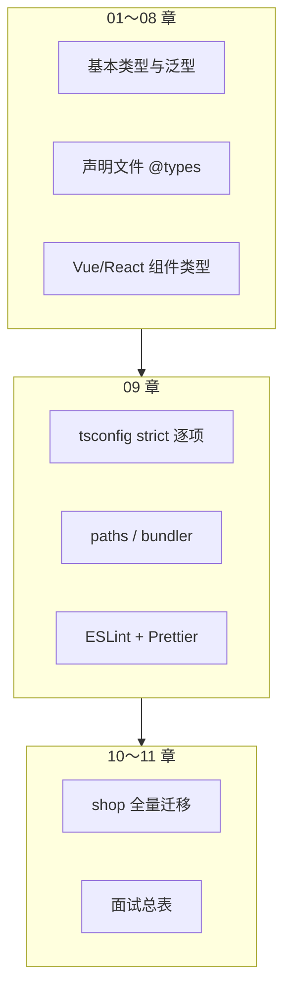
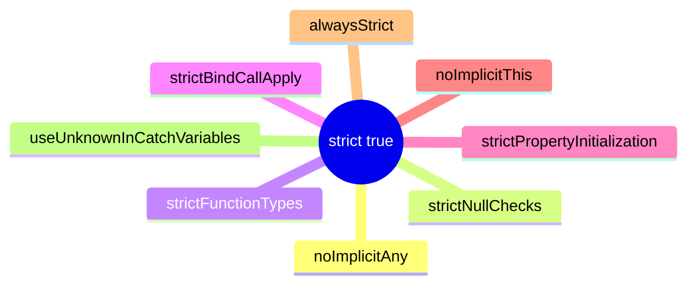
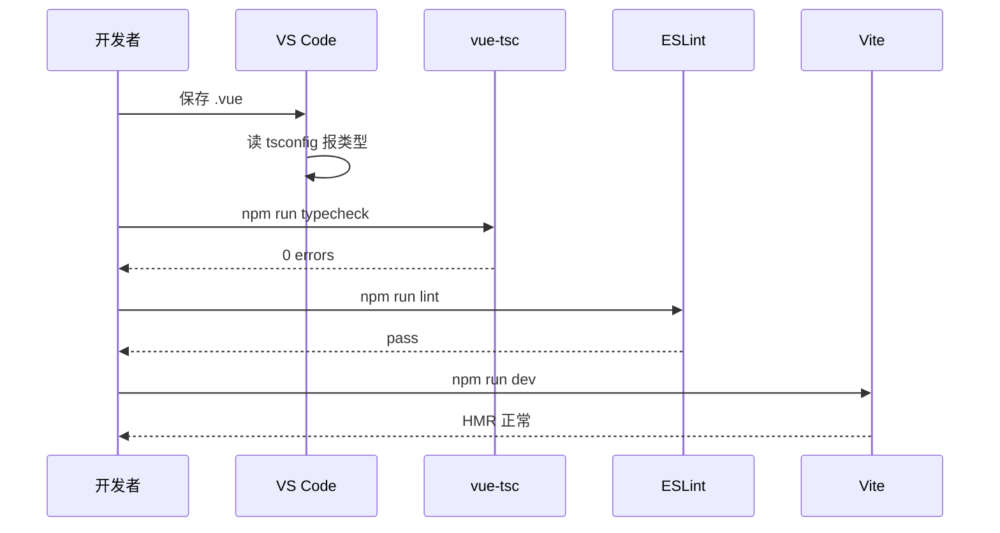

# 工程化与 tsconfig 深入

> **文件编码**：UTF-8。本章在 **shop-vue** 或 **shop-react** 项目上实操，请先完成 [01 章](./01-TypeScript入门与环境配置.md)（若尚未编写，可先按本章示例新建 Vite+TS 项目）与 [06 章](./06-模块声明文件与三方库.md) 的模块基础；框架 TS 写法见 [07 Vue](./07-Vue3与TypeScript.md) / [08 React](./08-React与TypeScript.md)。

---

## 本章衔接

01 章你认识了 `tsconfig.json` 的「开关面板」，06 章学会了 `.d.ts` 与 `@types`，07/08 章给组件和 Store 补了类型。但真实项目里还会遇到：

- 开了 `strict` 后满屏红线，不知道先修哪个
- `@/` 路径在编辑器里能跳转，但 `tsc` 报「找不到模块」
- ESLint 与 Prettier 和 TypeScript 规则冲突
- 同事说要用 `moduleResolution: "bundler"`，和 `node` 有什么区别？

**本章目标**：把 `tsconfig` 每一项讲透，搭好 **TypeScript + ESLint + Prettier** 工程底座，为 [10 章 JS→TS 迁移](./10-项目实战JS到TS迁移.md) 铺路。



---

## 0. 读前导读（零基础也能跟上）

### 0.1 用一句话弄懂本章

`tsconfig.json` 是 TypeScript 的**总开关**；本章教你逐项理解 `strict`、`paths`、`moduleResolution: bundler`，并搭好 **ESLint + Prettier**，让 shop 项目在保存与 CI 里都能拦住类型错误。

### 0.2 你需要提前知道什么

| 状态 | 动作 |
|------|------|
| 没跑过 `tsc` | 先读 [TS 01](./01-TypeScript入门与环境配置.md) |
| 不会 import type | 回 [TS 06](./06-模块声明文件与三方库.md) |
| 已有 shop-vue/react | 直接跟 §12 从零配置 |
| 只会复制 tsconfig | 精读 §2 strict 逐项 |

### 0.3 本章知识地图（☐→☑）

- ☐ 说清 `strict: true` 至少 5 个子项及业务影响
- ☐ 解释 `include` / `exclude` / 被 import 的陷阱
- ☐ 会用 `moduleResolution: bundler` + `module: ESNext`
- ☐ tsconfig `paths` 与 Vite `alias` **双写**
- ☐ 搭 ESLint flat config + Prettier 不冲突
- ☐ 理解「dev 正常但 typecheck 挂」的原因
- ☐ shop 项目 `npm run check` 通过

### 0.4 建议学习时长与节奏

| 阶段 | 时长 | 内容 |
|------|------|------|
| §1～2 tsconfig + strict | 60 min | 核心，可暂停做笔记 |
| §4～5 模块解析与 paths | 40 min | 对照 vite.config |
| §10～12 ESLint + 手把手 | 50 min | 跟做 shop |
| 闭卷自测 | 30 min | §19 |

### 0.5 学完本章你能做什么

1. 独立写出 §1.1 最小 tsconfig 并解释每个字段
2. 故意只配 paths 不配 Vite alias，复现 build 失败并修复
3. 开启 `strictNullChecks` 后修 3 处 `possibly undefined`
4. 向同事解释：为什么 CI 必须跑 `vue-tsc` 而不能只 `vite build`

---

## 1. tsconfig.json 是什么？谁在读它？

`tsconfig.json` 是 TypeScript 编译器的**项目配置文件**。以下工具都会读取它（或继承它）：

| 消费者 | 用途 |
|--------|------|
| `tsc` | 命令行编译、类型检查 |
| VS Code / Cursor | 语言服务：红线、跳转、补全 |
| Vite / webpack | 通常用 `esbuild` 转译，但 IDE 仍靠 tsconfig |
| `vue-tsc` | Vue SFC 的类型检查 |
| ESLint `@typescript-eslint` | 解析 TS AST |

**核心认知**：Vite 开发时**不一定跑完整 tsc**，但 CI 里应加 `tsc --noEmit` 或 `vue-tsc --noEmit`，否则类型错误可能漏到生产。

### 1.1 最小可运行配置（Vite 前端）

```json
{
  "compilerOptions": {
    "target": "ES2020",
    "module": "ESNext",
    "moduleResolution": "bundler",
    "strict": true,
    "jsx": "react-jsx",
    "lib": ["ES2020", "DOM", "DOM.Iterable"],
    "skipLibCheck": true,
    "isolatedModules": true,
    "noEmit": true,
    "resolveJsonModule": true,
    "esModuleInterop": true,
    "allowSyntheticDefaultImports": true,
    "baseUrl": ".",
    "paths": {
      "@/*": ["src/*"]
    }
  },
  "include": ["src/**/*.ts", "src/**/*.tsx", "src/**/*.vue"],
  "exclude": ["node_modules", "dist"]
}
```

Vue 项目把 `jsx` 改为 `"preserve"` 或删掉；`include` 加上 `src/**/*.vue`。

### 1.2 配置文件层级

```text
tsconfig.json          ← 根配置（可被 extends）
tsconfig.app.json      ← Vite 官方模板常拆「应用」与「Node 脚本」
tsconfig.node.json     ← 仅 vite.config.ts
```

子配置写法：

```json
{
  "extends": "./tsconfig.json",
  "compilerOptions": { "composite": true },
  "include": ["packages/shared/src"]
}
```

---

## 2. `strict` 全家桶：逐项拆开讲

`"strict": true` 是**快捷开关**，等价于同时打开下面多项。初学者建议：**先理解每一项，再决定何时全开**。



### 2.1 `noImplicitAny` — 禁止隐式 any

**noImplicitAny**：未写类型且 TS 推断不出时，报错而不是默认为 `any`。
**生活类比**：像入职必须填工号——不能默认「临时工」糊弄过去。
**为什么重要**：`any` 会关闭检查，是大型项目 bug 温床。
**本章用到的地方**：§2.1、§2.9 渐进开启

**含义**：未写类型且 TS 推断不出时，**报错**而不是默认为 `any`。

```typescript
// ts
// ❌ noImplicitAny: true 时报错
function greet(name) {
  return `Hello, ${name}`
}

// ✅
function greet(name: string): string {
  return `Hello, ${name}`
}
```

**为什么重要**：`any` 会关闭类型检查，是大型项目 bug 温床。迁移老 JS 时可暂时 `allowJs` + 局部 `// @ts-expect-error`，但最终应消灭隐式 any。

### 2.2 `strictNullChecks` — null 和 undefined 进类型系统

**strictNullChecks**：`string` 不再自动包含 `null`/`undefined`，使用前必须收窄。
**生活类比**：像「可选 toppings」——没点就不能假设盘里有。
**为什么重要**：API 的 `data`、`userInfo` 常可能为空，不开此项会运行时 NPE。
**本章用到的地方**：§2.2、§14 报错表 #3

**含义**：`string` 不再自动包含 `null`/`undefined`；访问前必须收窄。

```typescript
// ts
interface User {
  name: string
  nickname?: string  // string | undefined
}

function printLen(s: string) {
  console.log(s.length)
}

const u: User = { name: '张三' }
// ❌ Argument of type 'string | undefined' is not assignable to parameter of type 'string'
printLen(u.nickname)

// ✅ 可选链 + 默认值
printLen(u.nickname ?? '')
```

**shop 项目高频场景**：Axios 响应 `data` 可能为 `null`（见 [Vue 08](../Vue/08-Axios网络请求与前后端联调.md) Result 约定）；Pinia 里 `userInfo` 未登录时为 `null`。

### 2.3 `strictFunctionTypes` — 函数参数双向协变关闭

**含义**：函数类型检查更严格，**回调参数**不能乱放宽。

```typescript
// ts
type Handler = (x: string | number) => void

const fn: Handler = (x: string) => console.log(x)
// ❌ 若关闭 strictFunctionTypes，可能不报错；开启后：
// Type '(x: string) => void' is not assignable to type 'Handler'
```

日常写 React 事件、`Array.prototype.sort` 比较器时较少踩坑，但面试会问「TS 函数参数是协变还是逆变」——开启此项后参数按**逆变**检查。

### 2.4 `strictBindCallApply` — bind/call/apply 类型安全

```typescript
// ts
function add(a: number, b: number): number {
  return a + b
}

add.call(null, 1, 2)     // ✅
add.call(null, 1, '2')   // ❌ 第二个参数应是 number
```

### 2.5 `strictPropertyInitialization` — 类属性必须初始化

```typescript
// ts
class Product {
  // ❌ Property 'id' has no initializer and is not definitely assigned
  id: number
  name: string = ''

  constructor(id: number) {
    this.id = id  // 或在声明处 id: number = 0，或 id!: number
  }
}
```

Vue/React 项目里纯数据 interface 更常见；写 **DTO 类** 对接 Java 时会遇到。

### 2.6 `noImplicitThis` — this 必须有类型

```typescript
// ts
const obj = {
  count: 0,
  inc() {
    this.count++  // ✅ this 推断为 obj 类型
  },
}

const inc = obj.inc
inc()  // ❌ The 'this' context of type 'void' is not assignable...
```

**对策**：箭头函数、`bind`、或明确接口。

### 2.7 `alwaysStrict` — 输出 JS 带 `"use strict"`

与 ES 模块默认严格模式叠加，现代打包工具下影响较小，开着无害。

### 2.8 `useUnknownInCatchVariables` — catch 里用 unknown 不用 any

```typescript
// ts
try {
  await fetch('/api/x')
} catch (e) {
  // e 类型为 unknown，不能 e.message
  if (e instanceof Error) {
    console.error(e.message)
  }
}
```

**最佳实践**：永远不要用 `catch (e: any)`。

### 2.9 渐进开启 strict 的推荐顺序

| 阶段 | 配置 | 说明 |
|------|------|------|
| 1 | `strict: false` + `allowJs: true` | 老项目先跑起来 |
| 2 | 单独开 `noImplicitAny` | 消灭最多隐患 |
| 3 | 开 `strictNullChecks` | 工作量最大，收益最高 |
| 4 | `strict: true` 一次全开 | 新项目默认 |

```bash
npx tsc --noEmit
# 预期：列出所有类型错误；修完应 0 error
```

---

## 3. `include`、`exclude`、`files`

### 3.1 三者区别

| 字段 | 作用 |
|------|------|
| `include` |  glob 匹配**要纳入**编译/检查的文件 |
| `exclude` | 从 include 结果中**排除**（默认已排除 node_modules） |
| `files` | **显式文件列表**，与 include 二选一为主 |

### 3.2 常见 include 写法

```json
{
  "include": [
    "src/**/*.ts",
    "src/**/*.tsx",
    "src/**/*.vue",
    "src/**/*.d.ts",
    "env.d.ts"
  ]
}
```

**注意**：

- 只写 `"include": ["src"]` 通常够用，但**不会**自动包含根目录的 `vite-env.d.ts`，需显式加入
- 测试文件：`"**/*.test.ts"` 可放进 include，或用单独 `tsconfig.test.json`

### 3.3 exclude 陷阱

```json
{
  "exclude": ["node_modules", "dist", "coverage"]
}
```

- `exclude` **不会**阻止 import 被排除的文件——若 A.ts import 了 `scripts/gen.ts`，gen 仍会被检查
- 想彻底不检查某目录：不要从 include 匹配到它，且不要有文件 import 它

### 3.4 命令行只检查部分文件

```bash
npx tsc --noEmit src/api/request.ts
# 仍受 tsconfig 约束，且会拉取依赖图
```

---

## 4. `moduleResolution`: `node` vs `bundler` vs `node16`

TypeScript 5.x 为 **Vite / webpack** 场景新增 `"bundler"`。

| 值 | 适用 | 特点 |
|----|------|------|
| `node` / `node10` | 老 Node、部分 CJS | 经典 Node 解析 |
| `node16` / `nodenext` | Node ESM 包 | 看 package.json `exports` |
| **`bundler`** | **Vite、webpack、esbuild** | 允许无扩展名 import、package.json `exports` |

### 4.1 为什么 Vite 项目用 bundler？

```typescript
// ts — 源码里常不写 .ts 扩展名
import { getProducts } from '@/api/product'
import logo from './logo.svg'
```

- `node` 解析可能要求 `.js` 扩展名或报找不到模块
- `bundler` 与打包器行为一致，**IDE 和 tsc 不打架**

### 4.2 与 `module` 搭配

```json
{
  "compilerOptions": {
    "module": "ESNext",
    "moduleResolution": "bundler",
    "allowImportingTsExtensions": true,
    "noEmit": true
  }
}
```

`allowImportingTsExtensions` 仅在与 `noEmit` + bundler 联用时合法。

### 4.3 深入：package.json exports

三方库若只导出：

```json
{
  "exports": {
    ".": { "import": "./dist/index.mjs", "types": "./dist/index.d.ts" }
  }
}
```

`bundler` / `node16` 能正确解析；老 `node` 可能失败 → 表现就是「找不到模块 xxx」。

---

## 5. `paths` 与 `baseUrl` 路径别名

### 5.1 tsconfig 配置

```json
{
  "compilerOptions": {
    "baseUrl": ".",
    "paths": {
      "@/*": ["src/*"],
      "@api/*": ["src/api/*"],
      "@types/*": ["src/types/*"]
    }
  }
}
```

### 5.2 Vite 同步别名（必须双写）

| 步骤 | 你的动作 | 预期看到什么 | 若不对 |
|------|----------|--------------|--------|
| 1 | tsconfig 设 `baseUrl: "."` + `paths: { "@/*": ["src/*"] }` | IDE `@/` 跳转正常 | 重启 TS Server |
| 2 | vite.config `resolve.alias['@']` 指向 `./src` | `npm run dev` 无 resolve 错误 | 见 §14 #1 |
| 3 | 新建 `import x from '@/api/request'` | dev + typecheck 均通过 | 只配一边会分裂 |
| 4 | `npx vue-tsc --noEmit` | 0 errors | paths 拼写一致 |

**`vite.config.ts`**：

```typescript
import { defineConfig } from 'vite'
import vue from '@vitejs/plugin-vue'
import { fileURLToPath, URL } from 'node:url'

export default defineConfig({
  plugins: [vue()],
  resolve: {
    alias: {
      '@': fileURLToPath(new URL('./src', import.meta.url)),
    },
  },
})
```

| 只配一边的后果 |
|----------------|
| 仅 tsconfig：IDE 正常，`npm run build` 失败 |
| 仅 Vite：运行正常，编辑器 import 报红 |

### 5.3 类型声明 `env.d.ts`

```typescript
/// <reference types="vite/client" />

declare module '*.vue' {
  import type { DefineComponent } from 'vue'
  const component: DefineComponent<object, object, unknown>
  export default component
}
```

---

## 6. `composite` 与项目引用（Project References）

### 6.1 何时需要？

- Monorepo：`packages/shared`、`apps/shop-vue`
- 先编译公共类型包，再编译应用

### 6.2 开启 composite

```json
// packages/shared/tsconfig.json
{
  "compilerOptions": {
    "composite": true,
    "declaration": true,
    "declarationMap": true,
    "outDir": "dist",
    "rootDir": "src"
  },
  "include": ["src"]
}
```

根目录：

```json
{
  "files": [],
  "references": [
    { "path": "./packages/shared" },
    { "path": "./apps/shop-vue" }
  ]
}
```

### 6.3 构建命令

```bash
npx tsc -b
# 预期：按依赖顺序编译，输出 .tsbuildinfo
```

**初学 shop 单包项目**：可不启 composite；知道概念即可，Monorepo 岗位常问。


---

## 7. `incremental` 增量编译

```json
{
  "compilerOptions": {
    "incremental": true,
    "tsBuildInfoFile": "./node_modules/.cache/tsconfig.tsbuildinfo"
  }
}
```

| 项 | 说明 |
|----|------|
| 作用 | 二次 `tsc` 只检查变更文件，大型项目明显加速 |
| 产物 | `.tsbuildinfo`（应加入 `.gitignore`） |
| 与 composite | composite 隐含 incremental |

```bash
npx tsc --noEmit
# 第一次：较慢
npx tsc --noEmit
# 第二次：预期明显更快，终端可能显示 incremental compile
```

**Vite 开发**：热更新走 esbuild，不靠 incremental；**CI 类型检查**受益最大。

---

## 8. `skipLibCheck`

```json
{
  "compilerOptions": {
    "skipLibCheck": true
  }
}
```

**含义**：跳过对 `node_modules/**/*.d.ts` 的类型检查。

| 开 | 关 |
|----|-----|
| 编译快，少被三方库 d.ts 冲突折磨 | 更严格，可能因 @types 版本打架失败 |

**业界默认**：`true`。若你发现某个库类型确实错了，用 `declare module 'xxx'` 局部覆盖，而不是关 skipLibCheck。

---

## 9. 其他高频 compilerOptions

| 选项 | 推荐值 | 说明 |
|------|--------|------|
| `isolatedModules` | `true` | 每文件可单独转译，契合 Vite |
| `noEmit` | `true` | 只检查不输出，交给 Vite 打包 |
| `resolveJsonModule` | `true` | `import data from './x.json'` |
| `esModuleInterop` | `true` | `import React from 'react'` 兼容 CJS |
| `verbatimModuleSyntax` | 可选 `true` | TS 5+ 强制 type-only import 用 `import type` |

```typescript
// verbatimModuleSyntax 开启时
import type { User } from '@/types/user'  // ✅ 纯类型
import { login } from '@/api/auth'         // 值导入
```

---

## 10. ESLint + typescript-eslint

### 10.1 三者分工

| 工具 | 职责 |
|------|------|
| TypeScript | **类型**对错 |
| ESLint | **代码质量**、部分类型相关规则（如 no-floating-promises） |
| Prettier | **格式**（缩进、引号、换行） |

**不要**用 ESLint 的缩进规则与 Prettier 打架。

### 10.2 安装（Flat Config ESLint 9+）

```bash
cd shop-vue
npm install -D eslint @eslint/js typescript-eslint eslint-plugin-vue vue-eslint-parser
```

### 10.3 `eslint.config.js` 示例（Vue + TS）

```javascript
import js from '@eslint/js'
import pluginVue from 'eslint-plugin-vue'
import tseslint from 'typescript-eslint'
import globals from 'globals'

export default tseslint.config(
  { ignores: ['dist', 'node_modules'] },
  js.configs.recommended,
  ...tseslint.configs.recommended,
  ...pluginVue.configs['flat/recommended'],
  {
    files: ['**/*.{ts,vue}'],
    languageOptions: {
      ecmaVersion: 'latest',
      sourceType: 'module',
      globals: globals.browser,
      parserOptions: {
        parser: tseslint.parser,
      },
    },
    rules: {
      '@typescript-eslint/no-unused-vars': ['warn', { argsIgnorePattern: '^_' }],
      '@typescript-eslint/no-explicit-any': 'warn',
      'vue/multi-word-component-names': 'off',
    },
  },
)
```

React 项目把 `eslint-plugin-vue` 换成 `eslint-plugin-react-hooks`。

### 10.4 常用 typescript-eslint 规则

| 规则 | 建议 | 原因 |
|------|------|------|
| `no-explicit-any` | warn | 迁移期允许，逐步清零 |
| `no-floating-promises` | error | 防止忘记 await |
| `consistent-type-imports` | warn | 利于 tree-shaking |
| `no-non-null-assertion` | warn | 少用 `!` 断言 |

### 10.5 package.json 脚本

```json
{
  "scripts": {
    "lint": "eslint src --ext .ts,.tsx,.vue",
    "typecheck": "vue-tsc --noEmit"
  }
}
```

React 项目 `"typecheck": "tsc --noEmit"`。

```bash
npm run typecheck
# 预期：Found 0 errors
```

---

## 11. Prettier 集成

### 11.1 安装

```bash
npm install -D prettier eslint-config-prettier
```

`eslint-config-prettier` **关闭** ESLint 中与 Prettier 冲突的格式规则。

### 11.2 在 flat config 末尾关闭冲突

```javascript
import eslintConfigPrettier from 'eslint-config-prettier'

export default tseslint.config(
  // ... 前面配置
  eslintConfigPrettier,
)
```

### 11.3 `.prettierrc`

```json
{
  "semi": false,
  "singleQuote": true,
  "printWidth": 100,
  "trailingComma": "es5"
}
```

### 11.4 保存时格式化（VS Code）

`.vscode/settings.json`：

```json
{
  "editor.defaultFormatter": "esbenp.prettier-vscode",
  "editor.formatOnSave": true,
  "editor.codeActionsOnSave": {
    "source.fixAll.eslint": "explicit"
  }
}
```

**顺序**：先 ESLint fix，再 Prettier；或仅 Prettier 管格式、ESLint 管逻辑。

---

## 12. 手把手：从零配置 shop 工程化（完整流程）

以下以 **shop-vue** 为例；shop-react 将 `.vue` 换 `.tsx`、`vue-tsc` 换 `tsc` 即可。

### 12.1 第一步：添加 TypeScript 依赖

```bash
cd shop-vue
npm install -D typescript vue-tsc @vue/tsconfig
```

预期：

```text
added 3 packages in 3s
```

### 12.2 第二步：生成并调整 tsconfig

```bash
npx tsc --init
```

用本章 §1.1 模板覆盖 `compilerOptions`，保存。

### 12.3 第三步：添加 `env.d.ts`

在 `src/env.d.ts` 写入 §5.3 内容。

### 12.4 第四步：同步 Vite 别名

确认 `vite.config.ts` 与 tsconfig `paths` 一致（§5.2）。

### 12.5 第五步：安装 ESLint + Prettier

按 §10、§11 执行，创建 `eslint.config.js`、`.prettierrc`。

### 12.6 第六步：渐进 strict

```json
{
  "compilerOptions": {
    "strict": false,
    "noImplicitAny": true,
    "strictNullChecks": false
  }
}
```

修完 `npx vue-tsc --noEmit` 无错后，改 `"strict": true`。

### 12.7 第七步：CI 脚本（可选）

```json
{
  "scripts": {
    "check": "npm run typecheck && npm run lint"
  }
}
```

```bash
npm run check
# 预期：typecheck 0 errors + lint 无 error
```



---

## 13. 深入解释：为什么「运行正常但 typecheck 失败」？

| 原因 | 说明 |
|------|------|
| Vite 用 esbuild 转译 | esbuild **不做**完整类型检查 |
| 只改了 js 没改 d.ts | 运行的是 JS 语义 |
| `// @ts-ignore` 太多 | 掩盖问题 |
| IDE 用了不同 tsconfig | 检查右下角「使用的 TS 版本」 |

**工程习惯**：提交前跑 `npm run typecheck`，与 10 章迁移验收标准一致。

---

## 13.1 常见问题 FAQ（扩充）

### Q1：`strict: false` 能上线吗？

能跑，但失去 TS 主要价值；迁移期可 false，最终应 true。

### Q2：`checkJs: true` 什么时候开？

老项目 JS 多、暂不 rename 时，对稳定 JS 开 JSDoc + checkJs；全 TS 后关。

### Q3：`types` 字段和 `@types` 关系？

`compilerOptions.types` 限制**自动**注入的全局包；不设则加载所有 `@types/*`。

### Q4：Monorepo 必须 composite 吗？

单 shop 不必；多包共享类型再开 references。

### Q5：ESLint 的 `no-explicit-any` 和 tsc 冲突吗？

不冲突；eslint 是 warn/error 策略，tsc 管类型正确性。

### Q6：Prettier 单引号与 ESLint 双引号？

用 `eslint-config-prettier` 关 ESLint 格式规则，以 Prettier 为准。

### Q7：`verbatimModuleSyntax` 值得开吗？

TS 5+ 新项目推荐；强制 `import type`，利于 tree-shaking。

### Q8：vue-tsc 比 tsc 慢怎么办？

`incremental: true`、CI 缓存 `.tsbuildinfo`、只 typecheck 变更 PR 路径（进阶）。

### Q9：为什么 exclude node_modules 还不够？

被 include 的文件 **import** 了 exclude 目录下的文件，仍会进检查图。

### Q10：tsconfig.app.json 和 tsconfig.node.json 分工？

app 检 src 业务；node 检 vite.config.ts，避免 DOM lib 混用。

---

## 13.2 CI 集成 typecheck 示例（GitHub Actions 片段）

```yaml
# .github/workflows/check.yml 片段
- name: Typecheck
  run: npm run typecheck
- name: Lint
  run: npm run lint
```

**预期**：PR 上 typecheck 失败则合并 blocked。与 [10 章](./10-项目实战JS到TS迁移.md) 迁移验收一致。

---

## 14. 常见报错与排查

| # | 现象 | 原因 | 解决 |
|---|------|------|------|
| 1 | `Cannot find module '@/api/request'` | paths 未配或 Vite 别名未同步 | 双写 tsconfig + vite.config |
| 2 | `Could not find a declaration file for module 'xxx'` | 缺 @types | `npm i -D @types/xxx` 或自建 `xxx.d.ts` |
| 3 | `Object is possibly 'undefined'` | strictNullChecks | 可选链 `?.`、`??`、if 收窄 |
| 4 | `Type 'X' is not assignable to type 'Y'` | 字段或泛型不匹配 | 对照 interface 定义 |
| 5 | `Parameter 'e' implicitly has an 'any' type` | noImplicitAny | 补类型或 `(e: unknown)` |
| 6 | `The 'import.meta' meta-property is only allowed when...` | 缺 vite/client 类型 | `/// <reference types="vite/client" />` |
| 7 | `File 'x.vue' is not a module` | 缺 vue 模块声明 | env.d.ts 声明 `*.vue` |
| 8 | `Option 'bundler' can only be used when 'module' is es2015+` | module 太旧 | `"module": "ESNext"` |
| 9 | ESLint `Parsing error` on `.vue` | 未用 vue-eslint-parser | 见 §10.3 flat 配置 |
| 10 | Prettier 与 ESLint 缩进冲突 | 未用 eslint-config-prettier | 安装并 extends prettier |
| 11 | `Duplicate identifier` 全局类型 | 多处 declare 同名 | 合并到一个 env.d.ts |
| 12 | `incremental` 缓存诡异 | tsbuildinfo 过期 | 删 `.tsbuildinfo` 重跑 |
| 13 | `rootDir` / `outDir` 与 Vite 冲突 | 误开 emit | 前端保持 noEmit true | 仅 tsc 检查 |
| 14 | 双 tsconfig 版本不一致 | IDE 用错配置 | 右下角选 workspace TS | 重启 TS Server |
| 15 | `@typescript-eslint/no-floating-promises` 误报 | 故意 fire-and-forget | void 前缀 | `void fetchList()` |

---

## 14.1 深入解释：strict 全开前后 shop 错误类型分布（示例）

迁移 shop 时记录 `vue-tsc` 报错类别，便于排期：

| 错误类别 | 约占（经验） | 典型修法 |
|----------|--------------|----------|
| implicit any | 25% | 补参数/返回值类型 |
| possibly undefined | 35% | `?.`、`??`、if 守卫 |
| not assignable | 20% | 对齐 `@/types` 与后端 JSON |
| 找不到模块 | 10% | paths + env.d.ts |
| 组件 props/emit | 10% | defineProps 泛型 |

**命令记录基线**：

```bash
npm run typecheck 2>&1 | findstr /c:"error TS"
# Windows：统计 TS 错误条数，迁移后应归零
```

---

## 14.2 tsconfig 字段速查（shop 常用）

| 字段 | shop 推荐 | 一句话 |
|------|-----------|--------|
| target | ES2020 | 编译目标语法级别 |
| module | ESNext | 保持 ESM |
| moduleResolution | bundler | 与 Vite 一致 |
| strict | true（最终） | 严格模式全家桶 |
| allowJs | true→false | 迁移期 true |
| noEmit | true | 只检查不输出 js |
| isolatedModules | true | 每文件可独立转译 |
| skipLibCheck | true | 跳过 node_modules d.ts |

---

## 15. 命令预期输出速查

```bash
npx tsc -v
# Version 5.4.x

npx vue-tsc --noEmit
# vue-tsc 2.x using typescript 5.x
# （无输出或 Found 0 errors 为成功）

npx eslint src/App.vue
# （无输出为成功；有 issue 会列出行号）

npx prettier --check "src/**/*.{ts,vue}"
# All matched files use Prettier code style!
```

---

## 16. shop 项目 tsconfig 检查清单

| 检查项 | 通过 |
|--------|------|
| `strict: true` | ⬜ |
| `moduleResolution: "bundler"` | ⬜ |
| `@/*` paths + Vite alias 一致 | ⬜ |
| `include` 含 `*.vue` 或 `*.tsx` | ⬜ |
| `skipLibCheck: true` | ⬜ |
| `npm run typecheck` 0 error | ⬜ |
| `npm run lint` 无 error | ⬜ |
| Prettier format on save 生效 | ⬜ |

---

## 17. 练习建议

### 基础题

1. 列出 `strict: true` 包含的至少 **5** 个子选项，并各写一句人话解释。
2. 说明 `include` 与 `exclude` 的区别；为什么 `exclude` 不能阻止被 import 的文件参与检查？
3. 复制 §1.1 配置到本地项目，执行 `tsc --noEmit`，记录报错数量。

### 进阶题

4. 故意只配 tsconfig `paths` 不配 Vite alias，观察 `npm run dev` 与 IDE 表现差异。
5. 开启 `strictNullChecks`，修复 shop `request` 拦截器里 3 处可能为 `undefined` 的访问。
6. 配置 ESLint `no-floating-promises`，找出一个未 await 的 Promise 并修复。

### 挑战题

7. 新建 `tsconfig.node.json` 单独检查 `vite.config.ts`。
8. 用 `composite` + `references` 拆一个 `packages/types` 子包（文档级设计即可）。

---

## 18. 练习参考答案

### 基础题 1（示例答案）

| 子选项 | 人话 |
|--------|------|
| noImplicitAny | 不许偷偷变成 any |
| strictNullChecks | null/undefined 要显式处理 |
| strictFunctionTypes | 函数参数类型不能乱兼容 |
| strictBindCallApply | bind/call/apply 参数类型要对 |
| strictPropertyInitialization | 类字段要有初值或在构造函数赋值 |
| noImplicitThis | this 不能是模糊的 |
| alwaysStrict | 输出严格模式 JS |
| useUnknownInCatchVariables | catch 里用 unknown |

### 基础题 2（示例答案）

`include` 指定哪些 glob 进入项目；`exclude` 从 include 结果里去掉目录。若 `utils/legacy.ts` 被 exclude 但 `api.ts` 仍 `import` 它，TypeScript 仍会检查 `legacy.ts`，因为它在依赖图中。

### 基础题 3

记录你本地的 `Found N errors`，作为 10 章迁移前基线。

### 进阶题 4

预期：IDE 跳转 `@/` 正常；`npm run dev` 报 `Failed to resolve import "@/..."`。

### 进阶题 5（思路）

```typescript
// 响应拦截器片段
const res = response.data
if (res.code !== 0) {
  const msg = res.message ?? '请求失败'
  ElMessage.error(msg)
  return Promise.reject(new Error(msg))
}
return res.data as T  // 调用方仍要处理 data 可能 null
```

### 进阶题 6

```typescript
// ❌ floating promise
onMounted(() => {
  fetchList()  // 未 await
})
// ✅
onMounted(async () => {
  await fetchList()
})
```

---

## 学完标准

完成本章后，你应能：

| # | 标准 | 自检 |
|---|------|------|
| 1 | 口述 `strict` 下至少 5 个子项含义 | ⬜ |
| 2 | 独立配置 `moduleResolution: bundler` + `paths` | ⬜ |
| 3 | 解释 tsconfig paths 与 Vite alias 为何要双写 | ⬜ |
| 4 | 说清 `skipLibCheck`、`incremental` 的作用 | ⬜ |
| 5 | 搭好 ESLint + typescript-eslint + Prettier 不冲突 | ⬜ |
| 6 | `npm run typecheck` 在 shop 项目上 0 error（或列出待修清单） | ⬜ |
| 7 | 能查表解决 §14 中任意 3 类报错 | ⬜ |

---

## 19. 闭卷自测

1. 列举 `strict: true` 包含的 5 个子选项（名称 + 一句人话）。
2. `include` 与 `exclude` 区别？exclude 为何不能阻止被 import 的文件？
3. Vite 项目为何用 `moduleResolution: bundler` 而非 `node`？
4. `skipLibCheck: true` 跳过什么、不跳过什么？
5. `incremental` 产物是什么、应否提交 git？
6. TypeScript / ESLint / Prettier 各管什么？
7. 写出 tsconfig `paths` 与 vite alias 各一行配置。
8. 修一例 `Object is possibly 'undefined'`（写可选链或 if 守卫）。
9. 说明「npm run dev 正常但 typecheck 失败」的 2 个原因。
10. shop 渐进开 strict 的推荐顺序（链 §2.9）。

### 自测参考答案

1. 见 §18 基础题 1 表：noImplicitAny、strictNullChecks 等。
2. include 指定 glob；exclude 仅过滤 include 结果；依赖图仍拉入被 import 文件。
3. bundler 与 Vite 无扩展名 import、exports 行为一致。
4. 跳过 node_modules 内 d.ts 检查；不跳过你自己写的 .ts。
5. `.tsbuildinfo`；加入 .gitignore。
6. TS 类型；ESLint 质量/部分类型规则；Prettier 格式。
7. `"@/*": ["src/*"]` + `alias: { '@': pathToSrc }`。
8. `res.message ?? '失败'` 或 `if (user) print(user.name)`。
9. Vite 用 esbuild 不 full check；或 IDE/tsconfig 不一致。
10. noImplicitAny → strictNullChecks → strict true。

---

## 20. 费曼检验

3 分钟解释：**tsconfig 的 paths 和 Vite alias 为什么要配两遍？**

**提纲**：① paths 给 tsc/IDE；② alias 给打包运行时；③ 只配一边会「编辑器不红但 build 挂」或相反；④ shop 项目 `@/` 是标准实践。

---

## 下一章预告

[10 章：项目实战 JS 到 TS 迁移](./10-项目实战JS到TS迁移.md) 将以 **shop-vue / shop-react** 为主线，按文件夹给出迁移清单：重命名 `.js` → `.ts`、建立 `src/types`、给 [Axios 封装](../Vue/08-Axios网络请求与前后端联调.md) 和 Pinia/Zustand 补类型、`allowJs` 渐进策略，以及迁移顺序与常见坑。学完 09 章的配置，10 章就是「照着清单打勾」。

---

*UTF-8 | 交叉引用：[Vue 08](../Vue/08-Axios网络请求与前后端联调.md) · [React 08](../React/08-Axios网络请求与前后端联调.md) · [修改规范](../../修改规范.md)*
