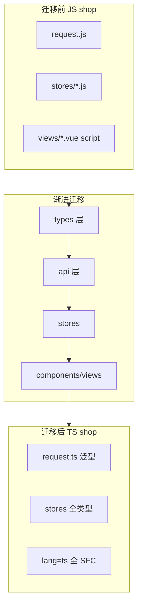
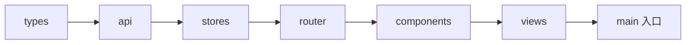
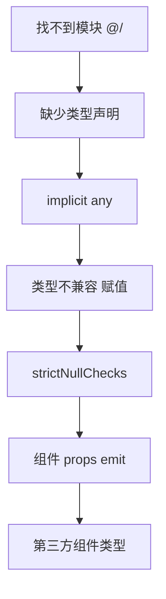

# 项目实战：JavaScript 到 TypeScript 迁移

> **文件编码**：UTF-8。本章以 **shop-vue**（Vue 主线）或 **shop-react**（React 主线）为实战对象，请确保已完成框架 [08 章 Axios 联调](../Vue/08-Axios网络请求与前后端联调.md)（Vue）或 [React 08](../React/08-Axios网络请求与前后端联调.md)，以及 TypeScript [07](./07-Vue3与TypeScript.md) / [08](./08-React与TypeScript.md) 框架 TS 入门、[09 章 tsconfig](./09-工程化与tsconfig深入.md) 工程配置。

---

## 本章衔接

08 章联调后，shop 项目已是「能跑的 JS 全栈前端」：`request.js`、Pinia/Zustand、Router、多个 views 页面。但：

- API 字段拼错要运行时才暴露
- 重构 `userStore.login` 签名时不敢改
- 简历写「熟悉 TypeScript」却拿不出 TS 项目

**本章目标**：用 **渐进式迁移** 把 shop 从 `.js` / `.jsx` / `.vue`(script js) 迁到 **全 TypeScript**，并建立可复用的 `src/types` 分层。迁移不是一天重写，而是 **allowJs + 按文件夹分批 + 先类型后 strict**。



与平行文档对照：

| 主题 | Vue | React | 本章 |
|------|-----|-------|------|
| Axios 联调 | [Vue 08](../Vue/08-Axios网络请求与前后端联调.md) | [React 08](../React/08-Axios网络请求与前后端联调.md) | 给 request 加泛型 |
| 状态管理 | [Vue 07 Pinia](../Vue/07-Pinia状态管理.md) | [React 07 Zustand](../React/07-Zustand状态管理.md) | Store 类型化 |
| 组件 TS | [TS 07](./07-Vue3与TypeScript.md) | [TS 08](./08-React与TypeScript.md) | SFC / TSX 改写 |

---

## 1. 迁移前：现状盘点与基线

### 1.1 典型 shop-vue 目录（08 章后）

```text
shop-vue/
├── src/
│   ├── api/
│   │   ├── request.js
│   │   ├── auth.js
│   │   ├── product.js
│   │   └── order.js
│   ├── stores/
│   │   ├── user.js
│   │   └── cart.js
│   ├── router/
│   │   └── index.js
│   ├── views/
│   │   ├── ProductList.vue
│   │   ├── ProductDetail.vue
│   │   ├── Cart.vue
│   │   ├── Login.vue
│   │   └── ...
│   ├── components/
│   │   └── ProductCard.vue
│   ├── App.vue
│   └── main.js
├── vite.config.js
└── package.json
```

### 1.2 典型 shop-react 目录

```text
shop-react/
├── src/
│   ├── api/
│   │   └── request.js
│   ├── stores/
│   │   ├── userStore.js
│   │   └── cartStore.js
│   ├── pages/
│   │   └── ProductListPage.jsx
│   ├── components/
│   │   └── ProductCard.jsx
│   ├── App.jsx
│   └── main.jsx
└── vite.config.js
```

### 1.3 迁移前自检命令

```bash
cd shop-vue   # 或 shop-react
npm run dev   # 必须能跑
git status    # 建议先 commit 或建分支 feature/ts-migrate
```

```bash
# 记录 JS 文件数量（PowerShell）
(Get-ChildItem -Recurse src -Include *.js,*.jsx).Count
# 预期：例如 15～25，作为迁移完成对比
```

### 1.4 创建迁移分支

```bash
git checkout -b feature/ts-migrate
```

---

## 2. 迁移总策略：四原则

| 原则 | 说明 |
|------|------|
| **先类型层，后业务层** | 先 `src/types`，再 api → stores → views |
| **先叶子，后根** | 先 `product.ts` API，再改依赖它的组件 |
| **允许 JS 共存** | `allowJs: true` 直到最后一波 |
| **strict 最后全开** | 见 [09 章](./09-工程化与tsconfig深入.md) §2.9 |



---

## 3. 第 0 步：安装依赖与初始化 tsconfig

### 3.1 shop-vue

```bash
cd shop-vue
npm install -D typescript vue-tsc @vue/tsconfig @types/node
```

### 3.2 shop-react

```bash
cd shop-react
npm install -D typescript @types/react @types/react-dom @types/node
```

### 3.3 tsconfig（迁移期）

```json
{
  "compilerOptions": {
    "target": "ES2020",
    "module": "ESNext",
    "moduleResolution": "bundler",
    "strict": false,
    "noImplicitAny": true,
    "allowJs": true,
    "checkJs": false,
    "jsx": "preserve",
    "lib": ["ES2020", "DOM", "DOM.Iterable"],
    "skipLibCheck": true,
    "isolatedModules": true,
    "noEmit": true,
    "resolveJsonModule": true,
    "esModuleInterop": true,
    "baseUrl": ".",
    "paths": {
      "@/*": ["src/*"]
    }
  },
  "include": ["src/**/*.ts", "src/**/*.tsx", "src/**/*.vue", "src/**/*.js", "src/**/*.jsx"],
  "exclude": ["node_modules", "dist"]
}
```

React 项目 `"jsx": "react-jsx"`。

### 3.4 重命名 vite 配置

```bash
# Vue
mv vite.config.js vite.config.ts
# React 同理
```

`vite.config.ts` 顶部类型提示：

```typescript
/// <reference types="vitest/config" />  // 可选
import { defineConfig } from 'vite'
```

### 3.5 package.json 脚本

```json
{
  "scripts": {
    "dev": "vite",
    "build": "vue-tsc --noEmit && vite build",
    "typecheck": "vue-tsc --noEmit"
  }
}
```

React：`"build": "tsc --noEmit && vite build"`。

```bash
npm run typecheck
# 迁移初期：允许有 error，记录数量
```

---

## 4. 第 1 步：建立 `src/types` 文件夹结构

### 4.1 推荐结构

```text
src/types/
├── index.ts          # 统一 re-export
├── api.ts            # ApiResult、PageResult
├── user.ts           # User、LoginForm
├── product.ts        # Product、ProductQuery
├── cart.ts           # CartItem
├── order.ts          # Order、OrderItem
└── env.d.ts          # vite、*.vue 声明（也可放 src 根）
```

### 4.2 与后端 Result 对齐

参考 [Java 04](../../后端学习/Java/04-SpringBoot核心开发.md) 与 [Vue 08 §2.3](../Vue/08-Axios网络请求与前后端联调.md)：

```typescript
// src/types/api.ts
export interface ApiResult<T = unknown> {
  code: number
  message: string
  data: T
}

export interface PageResult<T> {
  list: T[]
  total: number
  page: number
  pageSize: number
}

export interface PageQuery {
  page?: number
  pageSize?: number
  keyword?: string
}
```

### 4.3 领域类型

```typescript
// src/types/user.ts
export interface User {
  id: number
  username: string
  nickname?: string
  avatar?: string
}

export interface LoginPayload {
  username: string
  password: string
}

export interface LoginResult {
  token: string
  user: User
}
```

```typescript
// src/types/product.ts
export interface Product {
  id: number
  name: string
  price: number
  stock: number
  description?: string
  imageUrl?: string
}
```

```typescript
// src/types/cart.ts
import type { Product } from './product'

export interface CartItem {
  productId: number
  quantity: number
  product: Product
}
```

```typescript
// src/types/index.ts
export type { ApiResult, PageResult, PageQuery } from './api'
export type { User, LoginPayload, LoginResult } from './user'
export type { Product } from './product'
export type { CartItem } from './cart'
```

### 4.4 env.d.ts

```typescript
/// <reference types="vite/client" />

interface ImportMetaEnv {
  readonly VITE_API_BASE_URL: string
}

interface ImportMeta {
  readonly env: ImportMetaEnv
}

declare module '*.vue' {
  import type { DefineComponent } from 'vue'
  const component: DefineComponent<object, object, unknown>
  export default component
}
```

**为什么先建 types？** 后续 api、stores、组件都 import 同一套 interface，避免循环依赖和重复定义。

---

## 5. 第 2 步：迁移 `api` 层（Axios 类型化）

### 5.1 `request.js` → `request.ts`

对照 [Vue 08 §6](../Vue/08-Axios网络请求与前后端联调.md) 原 JS 拦截器，加入泛型：

```typescript
// src/api/request.ts
import axios, { type AxiosInstance, type InternalAxiosRequestConfig } from 'axios'
import type { ApiResult } from '@/types'
import { useUserStore } from '@/stores/user'
import router from '@/router'

const request: AxiosInstance = axios.create({
  baseURL: import.meta.env.VITE_API_BASE_URL || '',
  timeout: 15000,
  headers: { 'Content-Type': 'application/json' },
})

request.interceptors.request.use((config: InternalAxiosRequestConfig) => {
  const userStore = useUserStore()
  const token = userStore.token
  if (token && config.headers) {
    config.headers.Authorization = `Bearer ${token}`
  }
  return config
})

request.interceptors.response.use(
  (response) => {
    const res = response.data as ApiResult<unknown>
    if (res.code !== 0) {
      const msg = res.message ?? '请求失败'
      return Promise.reject(new Error(msg))
    }
    return response
  },
  (error) => {
    if (error.response?.status === 401) {
      const userStore = useUserStore()
      userStore.logout()
      router.push({ path: '/login', query: { redirect: router.currentRoute.value.fullPath } })
    }
    return Promise.reject(error)
  },
)

/** 业务层用：直接拿到 data，且带泛型 */
export async function http<T>(config: Parameters<AxiosInstance['request']>[0]): Promise<T> {
  const res = await request(config)
  const body = res.data as ApiResult<T>
  return body.data as T
}

export default request
```

### 5.2 `product.js` → `product.ts`

```typescript
// src/api/product.ts
import { http } from './request'
import type { Product, PageQuery, PageResult } from '@/types'

export function fetchProductList(params?: PageQuery) {
  return http<PageResult<Product>>({
    url: '/api/products',
    method: 'get',
    params,
  })
}

export function fetchProductDetail(id: number) {
  return http<Product>({
    url: `/api/products/${id}`,
    method: 'get',
  })
}
```

### 5.3 `auth.js` → `auth.ts`

```typescript
import { http } from './request'
import type { LoginPayload, LoginResult, User } from '@/types'

export function loginApi(data: LoginPayload) {
  return http<LoginResult>({ url: '/api/login', method: 'post', data })
}

export function fetchProfile() {
  return http<User>({ url: '/api/user/profile', method: 'get' })
}
```

### 5.4 React 版差异

- `useUserStore` 从 Zustand 文件 import，不用 `useUserStore()` 在模块顶层（Pinia 可以，Zustand 要在拦截器里 `useUserStore.getState()`）

```typescript
import { useUserStore } from '@/stores/userStore'

// 拦截器内
const token = useUserStore.getState().token
```

### 5.5 删除旧 `.js` 的时机

确认全项目 import 已指向 `.ts` 后删除 `request.js`，避免重复模块。

```bash
npm run typecheck
# 预期：api 相关 error 应明显减少
```

---

## 6. 第 3 步：迁移 `stores` 层

### 6.1 Pinia `user.js` → `user.ts`

```typescript
// src/stores/user.ts
import { ref, computed } from 'vue'
import { defineStore } from 'pinia'
import type { User, LoginPayload } from '@/types'
import { loginApi, fetchProfile } from '@/api/auth'

export const useUserStore = defineStore('user', () => {
  const token = ref<string | null>(localStorage.getItem('token'))
  const userInfo = ref<User | null>(null)

  const isLoggedIn = computed(() => !!token.value)

  async function login(payload: LoginPayload) {
    const res = await loginApi(payload)
    token.value = res.token
    userInfo.value = res.user
    localStorage.setItem('token', res.token)
  }

  function logout() {
    token.value = null
    userInfo.value = null
    localStorage.removeItem('token')
  }

  async function loadProfile() {
    if (!token.value) return
    userInfo.value = await fetchProfile()
  }

  return { token, userInfo, isLoggedIn, login, logout, loadProfile }
})
```

### 6.2 Pinia `cart.js` → `cart.ts`

```typescript
import { ref, computed } from 'vue'
import { defineStore } from 'pinia'
import type { CartItem, Product } from '@/types'

export const useCartStore = defineStore('cart', () => {
  const items = ref<CartItem[]>([])

  const totalCount = computed(() =>
    items.value.reduce((sum, i) => sum + i.quantity, 0),
  )

  const totalPrice = computed(() =>
    items.value.reduce((sum, i) => sum + i.quantity * i.product.price, 0),
  )

  function addItem(product: Product, quantity = 1) {
    const existing = items.value.find((i) => i.productId === product.id)
    if (existing) {
      existing.quantity += quantity
    } else {
      items.value.push({ productId: product.id, quantity, product })
    }
  }

  function removeItem(productId: number) {
    items.value = items.value.filter((i) => i.productId !== productId)
  }

  function clear() {
    items.value = []
  }

  return { items, totalCount, totalPrice, addItem, removeItem, clear }
})
```

### 6.3 Zustand `userStore.ts`（React）

```typescript
import { create } from 'zustand'
import type { User, LoginPayload } from '@/types'
import { loginApi } from '@/api/auth'

interface UserState {
  token: string | null
  userInfo: User | null
  isLoggedIn: boolean
  login: (payload: LoginPayload) => Promise<void>
  logout: () => void
}

export const useUserStore = create<UserState>((set) => ({
  token: localStorage.getItem('token'),
  userInfo: null,
  isLoggedIn: !!localStorage.getItem('token'),
  login: async (payload) => {
    const res = await loginApi(payload)
    localStorage.setItem('token', res.token)
    set({ token: res.token, userInfo: res.user, isLoggedIn: true })
  },
  logout: () => {
    localStorage.removeItem('token')
    set({ token: null, userInfo: null, isLoggedIn: false })
  },
}))
```

### 6.4 `storeToRefs` 与类型

```vue
<script setup lang="ts">
import { storeToRefs } from 'pinia'
import { useCartStore } from '@/stores/cart'

const cartStore = useCartStore()
const { totalPrice, items } = storeToRefs(cartStore)
</script>
```

---

## 7. 第 4 步：迁移 `router`

### 7.1 `router/index.js` → `index.ts`

```typescript
import { createRouter, createWebHistory, type RouteRecordRaw } from 'vue-router'
import { useUserStore } from '@/stores/user'

const routes: RouteRecordRaw[] = [
  {
    path: '/login',
    name: 'Login',
    component: () => import('@/views/Login.vue'),
    meta: { guest: true },
  },
  {
    path: '/products',
    name: 'ProductList',
    component: () => import('@/views/ProductList.vue'),
  },
  {
    path: '/cart',
    name: 'Cart',
    component: () => import('@/views/Cart.vue'),
    meta: { requiresAuth: true },
  },
]

const router = createRouter({
  history: createWebHistory(import.meta.env.BASE_URL),
  routes,
})

router.beforeEach((to, _from, next) => {
  const userStore = useUserStore()
  if (to.meta.requiresAuth && !userStore.isLoggedIn) {
    next({ path: '/login', query: { redirect: to.fullPath } })
  } else {
    next()
  }
})

export default router
```

### 7.2 扩展 RouteMeta 类型

```typescript
// src/types/router.d.ts
import 'vue-router'

declare module 'vue-router' {
  interface RouteMeta {
    requiresAuth?: boolean
    guest?: boolean
    keepAlive?: boolean
  }
}
```

React Router 可对 `loader` / `params` 用泛型或 zod 校验，初学保持 `createBrowserRouter` + TS 即可。

---

## 8. 第 5 步：迁移组件与 views

### 8.1 Vue SFC：改 `lang="ts"`

**迁移前**：

```vue
<script setup>
const props = defineProps(['product'])
</script>
```

**迁移后**：

```vue
<script setup lang="ts">
import type { Product } from '@/types'

const props = defineProps<{
  product: Product
}>()

const emit = defineEmits<{
  addCart: [product: Product]
}>()
</script>
```

### 8.2 ProductList.vue 示例片段

```vue
<script setup lang="ts">
import { ref, onMounted } from 'vue'
import type { Product } from '@/types'
import { fetchProductList } from '@/api/product'
import ProductCard from '@/components/ProductCard.vue'

const list = ref<Product[]>([])
const loading = ref(false)

onMounted(async () => {
  loading.value = true
  try {
    const res = await fetchProductList()
    list.value = res.list
  } finally {
    loading.value = false
  }
})
</script>
```

### 8.3 React：`ProductCard.jsx` → `ProductCard.tsx`

```tsx
import type { Product } from '@/types'

interface ProductCardProps {
  product: Product
  onAddCart: (product: Product) => void
}

export function ProductCard({ product, onAddCart }: ProductCardProps) {
  return (
    <div className="product-card">
      <h3>{product.name}</h3>
      <p>¥{product.price}</p>
      <button type="button" onClick={() => onAddCart(product)}>
        加入购物车
      </button>
    </div>
  )
}
```

### 8.4 模板 ref

```vue
<script setup lang="ts">
import { ref } from 'vue'
import type { ElForm } from 'element-plus'

const formRef = ref<InstanceType<typeof ElForm> | null>(null)
</script>
```

---

## 9. 第 6 步：入口 `main.js` → `main.ts`

```typescript
// src/main.ts
import { createApp } from 'vue'
import { createPinia } from 'pinia'
import ElementPlus from 'element-plus'
import 'element-plus/dist/index.css'
import App from './App.vue'
import router from './router'

const app = createApp(App)
app.use(createPinia())
app.use(router)
app.use(ElementPlus)
app.mount('#app')
```

`index.html` 中脚本改为：

```html
<script type="module" src="/src/main.ts"></script>
```

---

## 10. 按文件夹迁移检查清单

### 10.1 shop-vue 清单

| 顺序 | 路径 | 动作 | 完成 |
|------|------|------|------|
| 1 | `src/types/**` | 新建全部 interface | ⬜ |
| 2 | `src/env.d.ts` | Vite + vue 声明 | ⬜ |
| 3 | `src/api/request.*` | 泛型 http + 拦截器类型 | ⬜ |
| 4 | `src/api/auth,product,order` | 改 .ts | ⬜ |
| 5 | `src/stores/*` | 改 .ts + 类型 | ⬜ |
| 6 | `src/router/index.*` | RouteRecordRaw + meta | ⬜ |
| 7 | `src/components/**` | lang=ts + props | ⬜ |
| 8 | `src/views/**` | lang=ts | ⬜ |
| 9 | `src/App.vue` | lang=ts | ⬜ |
| 10 | `src/main.*` | main.ts | ⬜ |
| 11 | `vite.config.*` | .ts | ⬜ |
| 12 | 删除残留 `.js` | 无重复模块 | ⬜ |
| 13 | `allowJs: false` | tsconfig | ⬜ |
| 14 | `strict: true` | 修完全部红线 | ⬜ |

### 10.2 shop-react 清单

| 顺序 | 路径 | 动作 | 完成 |
|------|------|------|------|
| 1～4 | 同 Vue | types + api | ⬜ |
| 5 | `src/stores/*Store.ts` | Zustand interface | ⬜ |
| 6 | `src/routes/**` 或 App 内路由 | TSX | ⬜ |
| 7 | `src/components/**` | .tsx + Props | ⬜ |
| 8 | `src/pages/**` | .tsx | ⬜ |
| 9 | `main.tsx` | 入口 | ⬜ |
| 10～14 | 同 Vue | 收尾 | ⬜ |

---

## 11. 修错顺序：先解决哪类 error？



| 优先级 | 错误类型 | 处理策略 |
|--------|----------|----------|
| P0 | Cannot find module | paths、后缀、env.d.ts |
| P1 | implicit any | 补注解或泛型 |
| P2 | not assignable | 对齐 types 定义 |
| P3 | possibly undefined | `?.` / 守卫 |
| P4 | Vue emit / ref | 查 TS 07 示例 |

```bash
npm run typecheck 2>&1 | head -30
# 每次只修一类，避免乱
```

---

## 12. allowJs 渐进迁移详解

### 12.1 三阶段

| 阶段 | allowJs | checkJs | 说明 |
|------|---------|---------|------|
| A | true | false | JS 不参与检查，TS 文件引用 JS |
| B | true | true | 可选：对稳定 JS 开检查 |
| C | false | - | 全 TS，最终态 |

### 12.2 JS 与 TS 混用 import

```typescript
// utils/format.ts
export function formatPrice(n: number): string {
  return `¥${n.toFixed(2)}`
}
```

```javascript
// 临时未迁移的 legacy.js
import { formatPrice } from './format.ts'  // bundler 允许
export function show(p) {
  return formatPrice(p)
}
```

### 12.3 `// @ts-check` 单文件升级

```javascript
// @ts-check
/** @type {import('@/types').Product} */
const p = { id: 1, name: 'x', price: 1, stock: 1 }
```

适合迁移中期「先文档化再改后缀」。

---

## 13. 常见迁移陷阱（必读）

| # | 陷阱 | 表现 | 对策 |
|---|------|------|------|
| 1 | **重复文件** | `request.js` 与 `request.ts` 并存 | 删 JS，全局搜 import |
| 2 | **默认导出类型丢失** | `import App from './App.vue'` 报 any | env.d.ts 声明模块 |
| 3 | **Pinia 解构丢响应式** | 模板不更新 | 用 `storeToRefs` |
| 4 | **reactive 整体替换** | TS 推断变窄 | 用 ref 或类型断言 |
| 5 | **Axios 响应已是 T 又 .data** | 双重 data | 统一 http 封装一层 |
| 6 | **可选链过度** | 掩盖真实 bug | strict 下应用类型表达可选 |
| 7 | **enum 与 union 混用** | 后端数字对不上 | 优先 `as const` + union |
| 8 | **大量 as any** | 失去迁移意义 | 改为 `unknown` + 收窄 |
| 9 | **忘记改 index.html** | 仍指向 main.js | 改 main.ts |
| 10 | **CI 不跑 typecheck** | 合并后爆雷 | build 前加 vue-tsc |
| 11 | **第三方无类型** | 报 could not find declaration | @types 或 declare module |
| 12 | **路由懒加载组件** | 推断为 any | `() => import(...)` 保持，靠 vue 声明 |

---

## 14. 手把手：一天迁移 MVP（最小路径）

适合时间紧的同学：**只迁核心链路**，其余 `allowJs` 暂留。

### 14.1 上午（3h）

1. 完成 §3 tsconfig + §4 types（1h）
2. 迁 `request.ts` + `product.ts` + `auth.ts`（1h）
3. 迁 `user` store（30min）
4. `npm run dev` 验证登录 + 列表（30min）

### 14.2 下午（3h）

1. 迁 `ProductList.vue` / `ProductListPage.tsx`（1h）
2. 迁 `ProductCard`（30min）
3. 迁 `router` + `main.ts`（1h）
4. `npm run typecheck`，修 P0～P2 错误（30min）

### 14.3 验收命令

```bash
npm run dev
# 浏览器：商品列表、登录、加购无报错

npm run typecheck
# 目标：核心路径 0 error；非核心可暂留 warning

npm run build
# 目标：构建成功
```

---

## 15. 与 Vue 08 / React 08 的代码对照

| 模块 | Vue 08 JS 版要点 | 迁移后 TS 要点 |
|------|------------------|----------------|
| 拦截器 | `response.data.code` | `as ApiResult<T>` |
| token | `userStore.token` | `ref<string \| null>` |
| 列表 | 假数组 `ref([])` | `ref<Product[]>([])` |
| 登录 | `login(username, password)` | `LoginPayload` 对象 |

详细拦截器逻辑见 [Vue 08 §6～8](../Vue/08-Axios网络请求与前后端联调.md)；React 版见 [React 08 §6～10](../React/08-Axios网络请求与前后端联调.md)。

---

## 16. 常见报错与排查（迁移专题）

| # | 现象 | 原因 | 解决 |
|---|------|------|------|
| 1 | `找不到模块“@/api/request”` | paths 或文件仍 .js | 改 ts + tsconfig paths |
| 2 | `无法找到模块“./App.vue”的声明` | 缺 env.d.ts | §4.4 |
| 3 | `参数“product”隐式具有“any”类型` | props 未类型化 | defineProps 泛型 |
| 4 | `不能将类型“null”分配给类型“User”` | strictNullChecks | `User \| null` |
| 5 | `类型“number \| undefined”不能赋给“number”` | 可选字段 | 默认值或守卫 |
| 6 | `属性“value”在类型“Product”上不存在` | 忘了 ref .value | 脚本里用 `.value` |
| 7 | `Excessive stack depth` | 类型循环引用 | 拆 interface 或用 type |
| 8 | `Duplicate identifier 'Product'` | types 与组件同名 | 类型放 types/ 用 import type |
| 9 | `Could not find a declaration file for 'element-plus'` | 库自带类型，检查 skipLibCheck | 升级 element-plus |
| 10 | `emit 类型“addCart”的参数不匹配` | emit 泛型写错 | `[product: Product]` 元组 |
| 11 | `import.meta.env` 无类型 | 缺 ImportMetaEnv | env.d.ts 扩展 |
| 12 | build 过但 typecheck 挂 | 脚本未加 vue-tsc | 改 package.json build |

---

## 17. 迁移完成验收标准（项目级）

| 功能 | 验收 | 通过 |
|------|------|------|
| 登录 | token 类型 string，store 无 any | ⬜ |
| 商品列表 | `Product[]` 渲染 | ⬜ |
| 加购 | `addItem(product: Product)` | ⬜ |
| 401 | 拦截器跳转类型安全 | ⬜ |
| `npm run typecheck` | 0 errors | ⬜ |
| `src` 下无 `.js` 业务文件 | 仅配置脚本可例外 | ⬜ |
| `strict: true` | tsconfig | ⬜ |

---

## 18. 练习建议

### 基础题

1. 画出 shop 迁移的文件夹顺序图（api → stores → views）。
2. 手写 `ApiResult<T>` 与 `Product` interface。
3. 把 `defineProps(['title'])` 改成 TS 写法。

### 进阶题

4. 为 `order.ts` API 补全 `Order`、`createOrder` 类型。
5. 在 `request.ts` 中为 401 分支补全 `router` 类型，避免 `any`。
6. 扩展 `RouteMeta`，为 `keepAlive` 提供类型提示。

### 挑战题

7. 用 **泛型** 封装 `useRequest<T>(fetcher: () => Promise<T>)` composable（Vue）或 hook（React）。
8. 全项目开启 `strict: true` 并清零 typecheck。

---

## 19. 练习参考答案

### 基础题 2

见 §4.2、§4.3 代码块。

### 基础题 3

```vue
<script setup lang="ts">
defineProps<{ title: string }>()
</script>
```

### 进阶题 4（示例）

```typescript
// types/order.ts
export interface OrderItem {
  productId: number
  quantity: number
  price: number
}

export interface Order {
  id: number
  userId: number
  items: OrderItem[]
  totalAmount: number
  status: 'pending' | 'paid' | 'shipped'
  createdAt: string
}

// api/order.ts
export function createOrder(items: OrderItem[]) {
  return http<Order>({ url: '/api/orders', method: 'post', data: { items } })
}
```

### 进阶题 7（Vue composable 思路）

```typescript
// composables/useRequest.ts
import { ref, type Ref } from 'vue'

export function useRequest<T>(fetcher: () => Promise<T>) {
  const data: Ref<T | null> = ref(null)
  const loading = ref(false)
  const error = ref<Error | null>(null)

  async function run() {
    loading.value = true
    error.value = null
    try {
      data.value = await fetcher()
    } catch (e) {
      error.value = e instanceof Error ? e : new Error(String(e))
    } finally {
      loading.value = false
    }
  }

  return { data, loading, error, run }
}
```

### 挑战题 8

```json
{ "compilerOptions": { "strict": true, "allowJs": false } }
```

逐类修 §16 表格错误，每修一类提交一次 git commit 便于回滚。

---

## 学完标准

| # | 标准 | 自检 |
|---|------|------|
| 1 | 能按 §10 清单独立完成 shop 核心迁移 | ⬜ |
| 2 | 能解释 types → api → stores 顺序的原因 | ⬜ |
| 3 | 写出带泛型的 `http<T>` 封装 | ⬜ |
| 4 | Pinia/Zustand store 无显式 any | ⬜ |
| 5 | 说清 allowJs 三阶段 | ⬜ |
| 6 | 能列举 §13 中至少 5 个陷阱 | ⬜ |
| 7 | shop 项目 `npm run typecheck` 通过 | ⬜ |

---

## 下一章预告

[11 章：面试专题与知识点总表](./11-面试专题与知识点总表.md) 汇总 **30+ 道 TypeScript 面试题**（TS vs JS、any vs unknown、interface vs type、泛型与工具类型、Vue/React TS 追问），并提供像 [Vue 14](../Vue/14-补充知识点总表.md) 一样的 **自评总表**、**7 天复习计划** 与 **Vue↔React TS 对照**。迁移完成后，用 11 章冲刺面试。

---

*UTF-8 | shop 联调：[Vue 08](../Vue/08-Axios网络请求与前后端联调.md) · [React 08](../React/08-Axios网络请求与前后端联调.md) · 工程配置：[TS 09](./09-工程化与tsconfig深入.md)*
