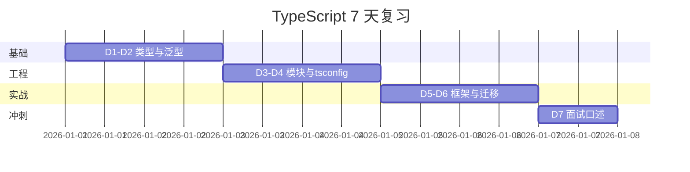

# 面试专题与知识点总表

> **文件编码**：UTF-8。本章是 TypeScript 系列的**收官篇**：常考题口述 + 查漏补缺总表 + 7 天复习计划。建议配合 [10 章 shop 迁移](./10-项目实战JS到TS迁移.md) 项目经验，每题尽量结合自己做过的 `types/`、`request.ts`、Store 回答。

---

## 本章衔接

01～06 章打类型基础，07/08 章对接 Vue/React，09 章工程化，10 章实战迁移。面试时考官不会考你背 `tsconfig` 每个字段，但会考：

- **为什么**用 TS、和 JS 本质区别
- `any` / `unknown` / 联合类型怎么选
- `interface` 和 `type` 区别
- 泛型、工具类型在 API 层怎么用
- 你项目里 **Props、Store、Axios** 怎么写的

本章提供 **30+ 问答框架**、与 [Vue 14](../Vue/14-补充知识点总表.md) 同风格的 **自评总表**，以及 **Vue ↔ React TS 对照**。


**使用方式**：

1. 每题先 **自己口述 2 分钟**，再对照参考答案查漏
2. 每题准备 **1 个 shop 例子**（如 `ApiResult<T>`、`defineProps`）
3. 回答结构：**定义 → 原理 → 场景 → 项目实践 → 对比/边界**

### 0.1 用一句话弄懂本章

把 01～10 章浓缩成 **35+ 道面试口述题 + 带零基础解释的自评总表 + 7 天复习计划**，冲刺「会写 TS 项目 + 讲得清类型概念」。

### 0.2 你需要提前知道什么

| 状态 | 动作 |
|------|------|
| 只学了 TS 01～04 | 先补 06～10 或边复习边查表 |
| 没有 shop 迁移经验 | 至少跟做 [10 章](./10-项目实战JS到TS迁移.md) §14 MVP |
| 主学 Vue | 精读 §21～23、§36 左列 |
| 主学 React | 精读 §24～27、§36 右列 |

### 0.3 本章知识地图（☐→☑）

- ☐ 能 30 秒讲清 TS 与 JS 关系
- ☐ any / unknown / never 对比不卡壳
- ☐ interface vs type 能选型
- ☐ 说出 5 个工具类型及场景
- ☐ 能白板写 `ApiResult<T>` + `http<T>`
- ☐ Vue 或 React 主线各答 3 道框架 TS 题
- ☐ §38 自评 80% 为 🔶 或 ✅
- ☐ 完成 7 天计划 D7 模拟面试

### 0.4 建议学习时长与节奏

| 阶段 | 时长 | 内容 |
|------|------|------|
| §1～20 核心题 | 3～4 h | 每题口述 2 min |
| §38 自评打标 | 1 h | 标 ⬜/🔶/✅ |
| §40 七天计划 | 7×1.5 h | 按表执行 |
| §47 打卡区 | 持续 | 记录薄弱项 |

### 0.5 学完本章你能做什么

1. 随机抽 10 题口述，结构含「项目实践」
2. 自评表标出 ⬜ 项并回对应章节
3. 联调 [Vue 14](../Vue/14-补充知识点总表.md) 做全栈模拟面
4. 简历写「shop 全量 TS 迁移 + strict CI」有据可查

---

## 0. 通用回答框架

| 步骤 | 内容 |
|------|------|
| 1 | 一句话定义 |
| 2 | 原理或机制 |
| 3 | 使用场景 |
| 4 | shop 项目里怎么用 |
| 5 | 与 JS / 对立概念对比 |

---

## 1. TypeScript 和 JavaScript 是什么关系？为什么要用 TS？

**框架（30 秒）**  
TypeScript 是 JavaScript 的**超集**：语法上多了一套**静态类型系统**，编译（或 IDE 检查）后**擦掉类型**，输出仍是 JS。目的是在**编码阶段**发现错误，提升重构信心和 IDE 体验。

**深入（1 分钟）**  
- JS 动态类型，变量类型运行时才知道  
- TS 通过 `tsc`/语言服务做**静态分析**，类型不对编译不过（或 IDE 报红）  
- 不改变运行时语义，没有 TS 虚拟机  

**项目结合**  
shop 迁移里用 `Product` interface 描述商品；`fetchProductList` 返回 `PageResult<Product>`，字段拼错立刻提示。

**对比**  
| | JS | TS |
|---|-----|-----|
| 类型 | 运行时 | 编译期 + 擦除 |
| 重构 | 靠测试和搜索 | IDE 精准改引用 |
| 学习成本 | 低 | 需学类型语法 |

**零基础解释**：JavaScript 像口头约定「箱子里是手机」；TypeScript 像书面清单，发货前核对清单，不对就不让发。清单（类型）不会跟着箱子进仓库（浏览器），最后仍是普通 JS。

---

## 2. TS 的类型检查发生在什么时候？运行时还有类型吗？

**答**  
主要发生在 **开发时**（IDE）和 **构建时**（`tsc --noEmit`、`vue-tsc`）。Vite 开发常用 esbuild **转译不检查**，所以 CI 必须跑 typecheck。

**运行时**  
类型被擦除，**不存在**运行时的 `Product` 类型对象。若要做运行时校验，需 **zod / io-ts** 等（进阶）。

**项目**  
`npm run build` 前加 `vue-tsc --noEmit`，见 [09 章](./09-工程化与tsconfig深入.md)。

---

## 3. `any` 和 `unknown` 区别？什么时候用哪个？

| | any | unknown |
|---|-----|---------|
| 赋值 | 可赋给任意类型 | 只能赋给 unknown / any |
| 使用 | 任意操作不报错 | 必须先**收窄**再使用 |
| 意图 | 放弃检查 | 安全的「不知道类型」 |

```typescript
let a: any = 1
let s: string = a  // ✅ 危险

let u: unknown = 1
// let s2: string = u  // ❌
if (typeof u === 'string') {
  const s2 = u  // ✅
}
```

**原则**：禁用 `any`（eslint warn）；外部数据用 `unknown` + 类型守卫；实在来不及用 `// @ts-expect-error` 并注明 TODO。

**项目**  
Axios 错误回调里 `catch (e: unknown)`，见 [09 章 strict](./09-工程化与tsconfig深入.md) `useUnknownInCatchVariables`。

**零基础解释**：`any` 像免检绿色通道，什么都能过但危险；`unknown` 像封条包裹，必须先拆开检查里面是什么才能用。

---

## 4. `never` 类型是什么？

**答**  
表示**永不出现**的值：抛错函数、死循环、穷尽检查分支。

```typescript
function assertNever(x: never): never {
  throw new Error('unexpected: ' + x)
}

type Status = 'pending' | 'paid'
function handle(s: Status) {
  if (s === 'pending') return 1
  if (s === 'paid') return 2
  return assertNever(s)
}
```

**面试加分**：说明 TS 用 `never` 做**联合类型穷尽检查**，改 union 少分支会编译报错。

---

## 5. `interface` 和 `type` 区别？怎么选？

| 维度 | interface | type |
|------|-----------|------|
| 扩展 | `extends`、**声明合并** | 交叉 `&`、不能重复同名合并 |
| 适合 | 对象形状、类实现 | 联合、元组、映射、条件类型 |
| 性能 | 大项目略优（历史原因） | 更灵活 |

```typescript
interface User {
  id: number
  name: string
}

type ID = string | number
type Result<T> = { ok: true; data: T } | { ok: false; error: string }
```

**团队规范（推荐）**  
- **数据模型 / API**：`interface`（`Product`、`User`）  
- **联合 / 工具**：`type`（`Status`、`Nullable<T>`）

**项目**  
`src/types/product.ts` 用 interface；`OrderStatus` 用 `type OrderStatus = 'pending' | 'paid'`。

**零基础解释**：interface 像可追加的表格模板（同名还能合并）；type 像一次性写死的公式，适合「要么 A 要么 B」这种选项。

---

## 6. 联合类型与交叉类型？

**联合 `A | B`**：可以是 A **或** B，用前要**收窄**（`typeof`、`in`、判别联合）。

**交叉 `A & B`**：同时满足 A 和 B。

```typescript
type Admin = User & { role: 'admin' }
```

**项目**  
路由 meta：`requiresAuth?: boolean` 是可选属性，类型上是 `boolean | undefined`，访问时注意 strictNullChecks。

---

## 7. 什么是类型收窄（Type Narrowing）？

**答**  
在分支里把宽类型变窄：`typeof`、`instanceof`、`in`、判别字段、`===`。

```typescript
function printId(id: string | number) {
  if (typeof id === 'string') {
    console.log(id.toUpperCase())
  } else {
    console.log(id.toFixed(0))
  }
}
```

**Vue**  
`if (userInfo.value) { ... }` 后 TS 知非 null。

---

## 8. 泛型是什么？解决什么问题？

**答**  
**类型参数化**：写一次函数/接口，多种类型复用，且保持类型关系。

```typescript
function first<T>(arr: T[]): T | undefined {
  return arr[0]
}

const n = first([1, 2])   // number | undefined
const s = first(['a'])    // string | undefined
```

**项目**  
`ApiResult<T>`、`http<T>()`、`ref<Product[]>([])`、`useState<Product[]>([])` 都是泛型。

**零基础解释**：泛型像「可调节的模具」——同一个函数或盒子格式，可以装 Product 也可以装 User，但装什么类型取出来还是什么类型。

---

## 9. 泛型约束 `extends` 怎么用？

```typescript
function getProp<T, K extends keyof T>(obj: T, key: K): T[K] {
  return obj[key]
}
```

**场景**  
工具函数只接受对象某已知键；API 分页 `T` 必须是 `{ id: number }` 等。

---

## 10. 常用工具类型（Utility Types）有哪些？

| 工具类型 | 作用 | 示例 |
|----------|------|------|
| `Partial<T>` | 全可选 | 更新用户 PATCH |
| `Required<T>` | 全必选 | 表单提交 |
| `Pick<T, K>` | 取部分键 | `Pick<User, 'id' \| 'name'>` |
| `Omit<T, K>` | 去掉键 | `Omit<User, 'password'>` |
| `Record<K, V>` | 字典 | `Record<string, Product>` |
| `Readonly<T>` | 只读 | 配置对象 |
| `ReturnType<F>` | 函数返回值 | 推断 API |
| `Parameters<F>` | 函数参数元组 | 包装函数 |

```typescript
type UserUpdate = Partial<Omit<User, 'id'>>
```

**项目**  
编辑商品表单：`Partial<Product>` 只提交变更字段。

**零基础解释（工具类型）**：

| 工具 | 零基础解释 |
|------|------------|
| Partial | 所有字段变可选，像「只交改过的表单项」 |
| Required | 所有字段变必填，像「交完整表」 |
| Pick | 只复印几列，像「只要姓名和电话」 |
| Omit | 删掉几列，像「表格不要密码列」 |
| Record | 字典，像「每个键对应同一种值」 |

---

## 11. `enum` 和 `as const` 对象谁更好？

**答**  
现代 TS 更推荐 **`as const` + 联合类型**：

```typescript
const OrderStatus = {
  Pending: 'pending',
  Paid: 'paid',
} as const

type OrderStatus = (typeof OrderStatus)[keyof typeof OrderStatus]
```

`enum` 会生成运行时代码，数字 enum 有反向映射，tree-shaking 不友好。面试说「项目里订单状态用 string union」。

---

## 12. 什么是声明合并（Declaration Merging）？

**答**  
同名 `interface` 会自动合并：

```typescript
interface User { id: number }
interface User { name: string }
// 等价 User { id, name }
```

`type` 不能合并。用于扩展第三方类型，如 `vue-router` 的 `RouteMeta`（见 [10 章](./10-项目实战JS到TS迁移.md) §7.2）。

---

## 13. `.d.ts` 是干什么的？`declare module` 呢？

**答**  
`.d.ts` 只含**类型声明**，无实现。`declare module 'xxx'` 为无类型的 JS 库补形状。

**项目**  
`env.d.ts` 声明 `*.vue`；无类型库临时 `declare module 'legacy-lib'`。

详见 [06 章](./06-模块声明文件与三方库.md)。

---

## 14. `tsconfig` 里 `strict` 包含什么？

**答**  
`noImplicitAny`、`strictNullChecks`、`strictFunctionTypes`、`strictBindCallApply`、`strictPropertyInitialization`、`noImplicitThis`、`alwaysStrict`、`useUnknownInCatchVariables` 等。

**口述技巧**  
重点讲 **noImplicitAny** 和 **strictNullChecks** 对业务代码影响最大。详见 [09 章](./09-工程化与tsconfig深入.md) §2。

---

## 15. `moduleResolution: bundler` 是什么？

**答**  
TS 5 为 Vite/webpack 准备的解析模式：支持无扩展名 import、package.json `exports`，与打包器一致。

**对比** `node`：Node 经典解析，纯 Node 项目或老工具链用。

---

## 16. `paths` 和 Vite alias 为什么要配两遍？

**答**  
`paths` 给 **tsc/IDE**；Vite `resolve.alias` 给 **打包运行时**。只配一边会「编辑器不红但 build 挂」或反过来。

---

## 17. `skipLibCheck` 开还是关？

**答**  
一般 **开**：跳过 `node_modules` 里 d.ts 检查，加快编译，避免三方库类型冲突。自己写的类型错误不会被 skip。

---

## 18. 类型断言 `as` 和非空断言 `!` 有什么问题？

**答**  
告诉编译器「我比你还懂」，可能掩盖 bug。`user!.name` 若 user 真是 null 会运行时崩。

**原则**  
优先类型守卫；断言用于 DOM `document.getElementById('root') as HTMLElement` 等确定场景。

---

## 19. `readonly` 和 `const` 区别？

| | const | readonly |
|---|-------|----------|
| 层级 | 变量绑定 | 对象属性 |
| 用于 | 基本类型、引用不可变 | interface 字段、元组 |

```typescript
const arr: readonly number[] = [1, 2]
// arr.push(3)  // ❌
```

---

## 20. 什么是结构化类型（Structural Typing）？

**答**  
TS 看**形状**不看名义：有相同结构就兼容（鸭子类型）。

```typescript
interface Point { x: number; y: number }
function log(p: Point) { console.log(p.x) }
log({ x: 1, y: 2, z: 3 })  // 多余属性可能报错（ excess property check）
```

**对比 Java**  
Java 名义类型，必须 implements 接口。

---

## 21. Vue 3 + TS：`defineProps` 怎么写？

**推荐**：

```vue
<script setup lang="ts">
import type { Product } from '@/types'
const props = defineProps<{
  product: Product
  showPrice?: boolean
}>()
</script>
```

**带默认值** 用 `withDefaults`：

```typescript
withDefaults(defineProps<{ size?: 'sm' | 'md' }>(), { size: 'md' })
```

详见 [07 章](./07-Vue3与TypeScript.md)。

---

## 22. Vue：`defineEmits` 类型写法？

```typescript
const emit = defineEmits<{
  addCart: [product: Product]
  updateQuantity: [id: number, qty: number]
}>()
```

元组语法 `[product: Product]` 是 TS 4+ 事件类型推荐写法。

---

## 23. Pinia Store 如何类型化？

**答**  
Setup Store：`ref`/`computed` 自动推断；导出函数参数补类型。

```typescript
async function login(payload: LoginPayload) { ... }
```

`storeToRefs` 保持响应式类型。见 [10 章](./10-项目实战JS到TS迁移.md) §6。

---

## 24. React + TS：组件 Props 怎么写？

```tsx
interface ProductCardProps {
  product: Product
  onAddCart: (product: Product) => void
}

export function ProductCard({ product, onAddCart }: ProductCardProps) {
  return <button onClick={() => onAddCart(product)}>加购</button>
}
```

**FC 是否用 `React.FC`？**  
现代风格更推荐 **直接 props 接口**，不用 `FC`（隐式 children、泛型别扭）。见 [08 章](./08-React与TypeScript.md)。

---

## 25. `useState` 泛型什么时候要手写？

```typescript
const [list, setList] = useState<Product[]>([])
const [user, setUser] = useState<User | null>(null)
```

初始值为 `null` 或 `[]` 时推断过宽，需泛型参数。

---

## 26. React 事件类型怎么写？

```typescript
function handleChange(e: React.ChangeEvent<HTMLInputElement>) {
  setKeyword(e.target.value)
}

function handleSubmit(e: React.FormEvent<HTMLFormElement>) {
  e.preventDefault()
}
```

**原则**  
用 `React.*Event<元素>`，避免 `any`。

---

## 27. Zustand 如何写 Store 类型？

```typescript
interface CartState {
  items: CartItem[]
  addItem: (p: Product) => void
}

export const useCartStore = create<CartState>((set, get) => ({
  items: [],
  addItem: (p) => set({ items: [...get().items, /* ... */] }),
}))
```

---

## 28. Axios 响应如何做类型安全？

**答**  
封装 `http<T>`，拦截器解包 `ApiResult<T>`，业务层 `await http<Product[]>(...)`。

对照 [Vue 08](../Vue/08-Axios网络请求与前后端联调.md) Result 约定与 [10 章](./10-项目实战JS到TS迁移.md) §5。

---

## 29. 前后端联调字段对不上怎么办？

**答**  
1. 以前端 `types` 为契约，与后端 Swagger/OpenAPI 对齐  
2. 编译期：interface 字段与文档一致  
3. 运行期（可选）：zod 校验 `data`  
4. 联调会议统一 `code` 含义（0 vs 200）

---

## 30. 如何把 JS 项目迁到 TS？步骤概述？

**答（结合 10 章）**  
1. `allowJs` + tsconfig + env.d.ts  
2. 建 `src/types`  
3. 迁 api → stores → router → views  
4. `lang="ts"` / `.tsx`  
5. 关 allowJs，`strict: true`  
6. CI `typecheck`

---

## 31. TS 性能会变差吗？

**答**  
运行时无影响（类型擦除）。开发时类型检查占 CPU，用 `incremental`、`skipLibCheck` 优化。Vite HMR 仍快。

---

## 32. 你项目里遇到过哪些 TS 难点？（开放题）

**参考方向**  
- strictNullChecks 修 Axios data  
- `defineProps` 与 Element Plus 组件 ref 类型  
- 路径别名双配置  
- 第三方无 @types 时 declare module  

用 **STAR**：迁移背景 → 任务 → 建立 types 层 → typecheck 通过。

---

## 33. 条件类型和 `infer` 了解吗？（高级）

**答（了解即可）**  
```typescript
type ElementType<T> = T extends (infer U)[] ? U : never
type Item = ElementType<Product[]>  // Product
```

面试初级岗说到「工具类型够用，复杂 infer 查文档」即可。

**零基础解释**：infer 像「从形状里猜出里面装的是什么类型」，例如从「数组类型」猜「元素类型」。

---

## 33.1 更多手写题（面试白板）

### 实现 `MyOmit<T, K>`

```typescript
type MyOmit<T, K extends keyof T> = {
  [P in keyof T as P extends K ? never : P]: T[P]
}
```

### 实现 `Nullable<T>`

```typescript
type Nullable<T> = T | null | undefined
```

### 函数 overload 与联合（了解）

```typescript
function format(input: string): string
function format(input: number): string
function format(input: string | number): string {
  return String(input)
}
```

shop 场景：`fetchProductDetail(id: number)` 与 `fetchProductList()` 返回不同类型，用泛型 `http<T>` 比 overload 更统一。

---

## 34. `satisfies` 运算符（TS 4.9+）？

```typescript
const config = {
  theme: 'dark',
  strict: true,
} satisfies { theme: string; strict: boolean }
```

既保留字面量窄类型，又检查满足 interface。用于配置对象。

---

## 35. 手写题：实现 `MyPartial<T>`

```typescript
type MyPartial<T> = {
  [K in keyof T]?: T[K]
}
```

扩展：实现 `MyPick<T, K extends keyof T>`。

```typescript
type MyPick<T, K extends keyof T> = {
  [P in K]: T[P]
}
```

---

## 35.1 更多面试追问（Vue/React 专项）

### Q：Vue 里 ref 和 reactive 在 TS 下怎么选？

| 场景 | 推荐 | 零基础解释 |
|------|------|------------|
| 列表、可空实体 | `ref<T>` | 单个盒子，用 .value 打开 |
| 表单/筛选多字段 | `reactive<Interface>` | 一张表单对象，改字段即可 |
| 从 store 解构 | `storeToRefs` | 拆出来仍是响应式 Ref |

### Q：React 里 props 回调和 Vue emit 如何对照口述？

Vue：`defineEmits<{ addCart: [product: Product] }>()` → 子组件 `emit('addCart', p)`。  
React：`onAddCart: (product: Product) => void` → 子组件 `onAddCart?.(product)`。  
**同一 Product 类型**，只是事件机制不同。

### Q：迁移项目面试怎么讲难点？

1. **strictNullChecks**：Axios `data` 可能 null，用 `??` 与守卫。  
2. **paths 双写**：编辑器与 Vite 各认一遍 alias。  
3. **第三方无类型**：`declare module` 应急 + 提 issue/换库。

---

## 36. Vue ↔ React TypeScript 对照总表

| 场景 | Vue 3 + TS | React 18 + TS |
|------|------------|---------------|
| 组件文件 | `.vue` + `<script setup lang="ts">` | `.tsx` |
| Props | `defineProps<{ }>()` | `interface Props` + 解构 |
| 事件 | `defineEmits<{ }>()` | props 回调 `onXxx` |
| 响应式 | `ref<T>`、`computed` | `useState<T>`、`useMemo` |
| 全局状态 | Pinia setup store | Zustand `create<T>()` |
| 模板 ref | `ref<InstanceType<typeof ElForm>>` | `useRef<HTMLInputElement>(null)` |
| 路由 meta | 扩展 `vue-router` RouteMeta | `loader` + 类型或 react-router 泛型 |
| 入口 | `main.ts` | `main.tsx` |
| 类型检查 | `vue-tsc --noEmit` | `tsc --noEmit` |
| 文档 | [TS 07](./07-Vue3与TypeScript.md) | [TS 08](./08-React与TypeScript.md) |

---

## 37. 常见报错速记（面试口述版）

| 报错关键词 | 含义 | 一句解决 | 零基础解释 |
|------------|------|----------|------------|
| implicitly has an 'any' type | 缺类型 | 补注解或开推断 | 变量没贴标签，检查员不知道它是什么 |
| not assignable | 类型不匹配 | 对齐 interface | 填表格式不对，和模板对不上 |
| possibly 'undefined' | 严格空值 | `?.` 或守卫 | 东西可能没有，用之前要先确认在不在 |
| Cannot find module | 模块解析 | paths / 声明文件 | 地址写错或缺地图，找不到文件 |
| Excessive stack depth | 类型过深 | 简化泛型或拆类型 | 类型嵌套太多层，检查员算不过来 |
| Property 'value' does not exist | ref 忘 .value | 脚本里用 .value | Vue 的 ref 像盒子，要打开 .value 才拿到里面 |
| Unused '@ts-expect-error' | 注释多余 | 删注释 | 你标记「这里会有错」但错已经修好了 |
| The 'import.meta' meta-property | 缺 vite 类型 | env.d.ts | Vite 环境变量需要单独登记 |
| Type 'never' is not assignable | never[] 等 | 给泛型 | 空列表没说明装什么类型 |
| Duplicate identifier | 重复定义 | 合并声明 | 同一个名字定义了两遍 |

完整表见 [09 章 §14](./09-工程化与tsconfig深入.md)、[10 章 §16](./10-项目实战JS到TS迁移.md)。

---

## 37.1 高频题口述模板（STAR + shop）

**题：你如何在项目里用 TypeScript？**

| 段 | 说什么 |
|----|--------|
| S | shop 原是 JS，联调后字段拼错要运行才发现 |
| T | 负责渐进迁 TS，目标 strict + CI typecheck |
| A | 建 types 层 → http\<T\> → Pinia setup store → lang=ts |
| R | typecheck 0 error，重构 Product 字段 IDE 全项目改引用 |

**题：any 和 unknown 怎么选？**

| 段 | 说什么 |
|----|--------|
| 定义 | any 放弃检查；unknown 必须先收窄 |
| 项目 | Axios catch 用 unknown；禁止新代码 any |
| 边界 | 遗留库临时 declare module，标注 TODO |

---

## 38. 知识点自评总表（01～11）

复习时在「自评」列标记：**⬜ 知道 / 🔶 会用 / ✅ 会讲**。「零基础解释」用一句话向完全不懂编程的朋友说明该点。

### 38.1 入门与基础类型（01～02）

| 知识点 | 文档 | 掌握标准 | 零基础解释 | 自评 |
|--------|------|----------|------------|------|
| tsc / Vite+TS | 01 | 能跑通 hello.ts | 像把带批注的草稿交给检查员，再变成浏览器能跑的普通 JS | ⬜ |
| 基本类型注解 | 02 | string/number/boolean | 给变量贴标签：这是数字、那是文字，贴错就报警 | ⬜ |
| 数组与元组 | 02 | `T[]`、`[string, number]` | 数组是一排同类盒子；元组是固定几个格子各放指定类型 | ⬜ |
| any vs unknown | 02/11 | 能对比 | any 是免检通道；unknown 是封条包裹，打开前要先检查 | ⬜ |
| 类型断言 as | 02 | 知道风险 | 强行告诉编译器「我确定它是啥」，猜错运行时仍会崩 | ⬜ |

### 38.2 接口与联合（03）

| 知识点 | 文档 | 掌握标准 | 零基础解释 | 自评 |
|--------|------|----------|------------|------|
| interface 对象形状 | 03 | 写 User/Product | 像填表模板：姓名、价格这些字段必须对齐 | ⬜ |
| type 别名 | 03 | 联合类型 Status | 给几种可能状态起个总名字，如「待付款或已付款」 | ⬜ |
| interface vs type | 03/11 | 能选型 | interface 像可追加的表格；type 像一次性定义的公式 | ⬜ |
| 交叉类型 & | 03 | Admin 示例 | 要同时满足两张表的所有要求 | ⬜ |
| 字面量类型 | 03 | as const | 把选项锁死成几个固定词，不能乱写别的 | ⬜ |

### 38.3 函数与泛型（04）

| 知识点 | 文档 | 掌握标准 | 零基础解释 | 自评 |
|--------|------|----------|------------|------|
| 函数类型注解 | 04 | 参数与返回值 | 函数门口挂牌：进什么、出什么，不对就不让进 | ⬜ |
| 泛型函数 | 04 | `first<T>` | 一个模具适配多种材料，仍保持材料类型一致 | ⬜ |
| 泛型约束 extends | 04 | keyof 示例 | 泛型加规则：必须是某对象的键名之类 | ⬜ |
| Partial/Pick/Omit | 04/11 | 各说一句 | 从完整表格里改部分、抽几列、删几列的复印技巧 | ⬜ |
| 泛型 interface | 04 | ApiResult<T> | 统一快递盒格式：code、message、里面装什么由 T 决定 | ⬜ |

### 38.4 类与收窄（05）

| 知识点 | 文档 | 掌握标准 | 零基础解释 | 自评 |
|--------|------|----------|------------|------|
| class 类型 | 05 | 属性与方法 | 像员工档案类：有哪些字段、能做什么动作 | ⬜ |
| 访问修饰符 | 05 | public/private | private 是办公室内部，外面不能随便改 | ⬜ |
| typeof 收窄 | 05 | 联合分支 | 先问「你是字符串还是数字」再分别处理 | ⬜ |
| instanceof / in | 05 | 对象判别 | 看对象属于哪类、有没有某个字段再分支 | ⬜ |
| 判别联合 | 05 | never 穷尽 | 所有情况都写了分支，漏一种编译器就提醒 | ⬜ |

### 38.5 模块与声明（06）

| 知识点 | 文档 | 掌握标准 | 零基础解释 | 自评 |
|--------|------|----------|------------|------|
| ESM import/export | 06 | type-only import | 像从别的文件借工具；type-only 只借说明书不借实物 | ⬜ |
| .d.ts 声明文件 | 06 | 补无类型库 | 给只有 JS 的库写「使用说明书」，没有实现代码 | ⬜ |
| @types 包 | 06 | npm 安装 | 社区帮无 TS 的 npm 包写的说明书合集 | ⬜ |
| declare module | 06 | wildcard 模块 | 告诉 TS：这个包长这样，先信我 | ⬜ |
| 路径别名类型 | 06/09 | @/ 跳转 | `@/` 是快捷方式，TS 和打包器都要认识这条路 | ⬜ |

### 38.6 工程化（09）

| 知识点 | 文档 | 掌握标准 | 零基础解释 | 自评 |
|--------|------|----------|------------|------|
| strict 子项 | 09 | 说 5 个 | 一组严格开关：不许偷偷 any、要处理空值等 | ⬜ |
| include/exclude | 09 | 区别 | 指定哪些文件参与检查；exclude 不能挡住被引用的文件 | ⬜ |
| moduleResolution bundler | 09 | 为何 Vite 用 | 让 TS 的找文件方式和 Vite 打包方式一致 | ⬜ |
| paths + Vite alias | 09 | 双写原因 | 编辑器认一遍、打包器再认一遍，少配就一边失灵 | ⬜ |
| ESLint+Prettier | 09 | 不冲突配置 | ESLint 管代码质量，Prettier 管排版，别两套打架 | ⬜ |
| incremental/skipLibCheck | 09 | 作用 | 第二次检查更快；跳过 node_modules 里说明书互掐 | ⬜ |

### 38.7 框架 TS（07/08）

| 知识点 | 文档 | 掌握标准 | 零基础解释 | 自评 |
|--------|------|----------|------------|------|
| defineProps 泛型 | 07 | Product 示例 | 父组件传参必须带齐 Product 字段，像验货单 | ⬜ |
| defineEmits 元组 | 07 | 事件类型 | 规定能发哪些事件、每个事件附带什么数据 | ⬜ |
| Pinia 类型 | 07/10 | setup store | 全局购物车台账，改字段 IDE 能搜到所有用法 | ⬜ |
| React Props 接口 | 08 | 不用 FC 也可 | 组件入口参数写清楚，不用老式 FC 包装 | ⬜ |
| useState 泛型 | 08 | `useState<T[]>([])` | 空列表要说明装什么，否则 TS 以为永远空 | ⬜ |
| 事件类型 | 08 | ChangeEvent | 输入框改动事件，让 e.target.value 有类型 | ⬜ |
| Zustand 泛型 | 08/10 | create<State> | 给 React 全局状态仓库写清结构和动作 | ⬜ |

### 38.8 迁移实战（10）

| 知识点 | 文档 | 掌握标准 | 零基础解释 | 自评 |
|--------|------|----------|------------|------|
| types 目录结构 | 10 | api/user/product | 先统一名词表，全项目说同一种「商品、用户」 | ⬜ |
| http<T> 封装 | 10 | 能默写骨架 | 请求函数说「我要 Product」，返回就是 Product | ⬜ |
| allowJs 渐进 | 10 | 三阶段 | 先 JS TS 混住，再慢慢全改 TS，最后关 JS 通道 | ⬜ |
| 迁移顺序 | 10 | api→store→view | 先字典和接口，再仓库，最后页面，避免返工 | ⬜ |
| 迁移陷阱 | 10 | 说 5 个 | 如两个 request 文件、解构 store 不刷新等 | ⬜ |

### 38.9 面试表达（11）

| 知识点 | 文档 | 掌握标准 | 零基础解释 | 自评 |
|--------|------|----------|------------|------|
| TS vs JS 30 秒版 | §1 | 不卡壳 | TS 是给 JS 加检查员，运行还是 JS | ⬜ |
| 工具类型举例 | §10 | ≥3 个 | Partial 像只交改过的表单项 | ⬜ |
| 项目 STAR | §32 | 能讲迁移 | 背景→任务→types 层→typecheck 通过 | ⬜ |
| Vue↔React 对照 | §36 | 说 3 行 | 同一 Product，props 写法不同，类型文件思路同 | ⬜ |
| 7 天复习计划 | §40 | 执行 D7 | 按表回炉薄弱章 + 模拟面 | ⬜ |

### 38.10 零基础自测对照（口述用）

| 若面试官问 | 30 秒零基础版 |
|------------|---------------|
| 什么是 TS | JS 加检查清单，清单不进浏览器 |
| 为什么不用 any | 免检会放过拼写错误，大项目必踩坑 |
| interface 和 type | 表格模板 vs 一次性公式/选项 |
| 泛型干嘛 | 一个模具多种材料，类型不丢 |
| strict 是什么 | 一组严格开关，尤其不许空值糊弄 |
| Vue props 类型 | 父组件传参必须和 Product 清单一致 |
| 迁移顺序 | 先名词表 types，再接口、仓库、页面 |

---

## 39. 能力矩阵（1～5 分）

| 维度 | 1 分 | 3 分 | 5 分 |
|------|------|------|------|
| 类型基础 | 只会 string/number | interface+泛型 | 工具类型熟练 |
| 类型收窄 | 不懂 | typeof/可选链 | 判别联合+never |
| 工程配置 | 只会复制 tsconfig | 会改 strict/paths | ESLint+CI 全套 |
| 框架 TS | 全是 any | props+store 有类型 | 组件库 ref 类型 |
| 项目迁移 | 没做过 | 跟过 10 章 | 独立迁 shop |
| 面试表达 | 说不出 | 能答 15 题 | 35 题+项目结合 |

低于 3 分回对应章节重学。

---

## 40. 7 天复习计划

| 天 | 主题 | 动作 | 产出 |
|----|------|------|------|
| **D1** | 01～02 基础 | 重做类型报错实验；自评 §38.1 | 手写 10 个类型注解 |
| **D2** | 03～04 接口泛型 | 默写 ApiResult、Partial/Pick | types/api.ts 草稿 |
| **D3** | 05～06 收窄模块 | 练 5 道收窄题；读 env.d.ts | 能讲 declare module |
| **D4** | 09 工程化 | 配 strict+paths+eslint | shop typecheck 跑通 |
| **D5** | 07 或 08 框架 | 精读你主线；浏览另一条 | 改 2 个组件 lang=ts |
| **D6** | 10 迁移 | 对照清单勾 shop 项目 | 迁移验收 §17 |
| **D7** | 11 面试 | 口述 §1～35 抽 20 题；自评总表 | 薄弱点回炉 2 章 |



---

## 41. shop 项目 TS 验收总表（联调 10 章）

| 项 | 验收 | 通过 |
|----|------|------|
| `src/types` 完整 | User/Product/ApiResult | ⬜ |
| request 泛型 | http<T> 无 any | ⬜ |
| store 类型 | login payload 类型 | ⬜ |
| 列表页 | Product[] | ⬜ |
| props | defineProps/Props 接口 | ⬜ |
| typecheck 0 error | npm run typecheck | ⬜ |
| strict true | tsconfig | ⬜ |

---

## 42. 与 Vue 14 / React 面试章对照

| 本文档 | Vue | React |
|--------|-----|-------|
| §21～23 Vue TS | [Vue 13](../Vue/13-高频场景题与面试专题.md) | — |
| §24～27 React TS | — | React 13（若有） |
| 自评总表 §38 | [Vue 14](../Vue/14-补充知识点总表.md) | React 14 |
| shop 迁移 | [Vue 08](../Vue/08-Axios网络请求与前后端联调.md) | [React 08](../React/08-Axios网络请求与前后端联调.md) |

**复习组合**：TS 11 自评 + Vue/React 14 自评 + 框架 13 场景题。

---

## 43. 练习建议

### 基础题

1. 不看文档口述：TS 和 JS 关系、为何要 TS。
2. 手写 `interface Product` + `type ApiResult<T>`。
3. 解释 any 和 unknown 各一个使用场景。

### 进阶题

4. 实现 `MyReadonly<T>`：`{ readonly [K in keyof T]: T[K] }`。
5. 口述 shop 从 JS 迁 TS 的 6 个步骤。
6. 对比 Pinia 与 Zustand 在 TS 下的写法（§36 表）。

### 挑战题

7. 30 分钟内口述 §1～20 任意 10 题，录音自评。
8. 根据自评表标出所有 ⬜，制定二轮 3 天计划。

---

## 44. 练习参考答案（节选）

### 基础题 1（30 秒版）

TypeScript 是 JavaScript 的超集，增加静态类型，编译后擦除类型变成 JS；用于提前发现错误、改善重构和 IDE，大型前端项目标配。

### 进阶题 4

```typescript
type MyReadonly<T> = {
  readonly [K in keyof T]: T[K]
}
```

### 进阶题 5

allowJs 初始化 → types 层 → api 泛型 → stores → router → 组件 lang=ts → 关 allowJs → strict true → CI typecheck。

---

## 45. 常见报错与排查（面试调试向）

| # | 现象 | 原因 | 解决 |
|---|------|------|------|
| 1 | Parameter implicitly has an 'any' type | noImplicitAny | 补类型 |
| 2 | Object is possibly 'undefined' | strictNullChecks | 守卫 |
| 3 | Type 'X' is not assignable to type 'Y' | 形状不一致 | 改 interface |
| 4 | Cannot find module '@/types' | paths | tsconfig |
| 5 | Property 'value' does not exist on type 'number' | ref 忘 .value | .value |
| 6 | Argument of type 'string' is not assignable to parameter of type 'number' | 泛型/参数错 | 改调用 |
| 7 | Could not find a declaration file | 缺 d.ts | @types |
| 8 | Excessive stack depth comparing types | 泛型嵌套过深 | 简化 |
| 9 | Unused '@ts-expect-error' directive | 错误已修 | 删注释 |
| 10 | The 'import.meta' meta-property | 缺 vite/client | env.d.ts |

---

## 46. 一句话速记（各章）

| 章 | 一句话 |
|----|--------|
| 01 | tsc + Vite 模板，会跑 typecheck |
| 02 | 基本类型，any 少用 unknown 收窄 |
| 03 | interface 对象，type 联合 |
| 04 | 泛型+Partial/Pick/Omit |
| 05 | 类与 typeof/in 收窄 |
| 06 | d.ts 与 @types 补洞 |
| 07 | defineProps/emits，Pinia 类型 |
| 08 | Props 接口，useState 泛型 |
| 09 | strict 逐项，paths 双写 |
| 10 | types→api→store→view 迁移 |
| 11 | 本表+35 题，7 天冲刺 |

---

## 47. 我的复习打卡区

```text
本轮复习开始日期：
自评完成度（§38 共 ___ 项 ✅）：
shop TS 验收（§41 共 ___ 项通过）：
最薄弱 3 项：
  1.
  2.
  3.
计划重学章节：
面试日期：
```

---

## 48. 闭卷自测（收官）

1. 30 秒版：TS 是什么、为何用？
2. any vs unknown 各一个反例。
3. 手写 `ApiResult<T>`。
4. Partial 和 Pick 区别？
5. strict 里影响最大的两个子项？
6. paths 为何要双写？
7. Vue defineProps 与 React Props interface 对照一句。
8. shop 迁移顺序 6 步。
9. 口述 `http<T>` 解包流程。
10. 自评表 §38 你有多少 ✅？不足 80% 回哪几章？

### 自测参考答案

见 §1、§3、§4.3、§10、§14、§16、§36、§30、§5.1、§38 打标结果。

---

## 49. 费曼检验（全系列）

向朋友 **3 分钟** 讲「我学的 TypeScript 到底解决了什么」：

1. **编译期守门**：字段拼错、props 传错先报红。
2. **工程底座**：tsconfig strict + CI typecheck + 与 Vite 双配 alias。
3. **项目闭环**：shop 从 JS 迁到 TS，types/http/store/组件一条链。
4. **面试**：35 题 + 自评表，每题带 shop 例子。

---

## 学完标准（全系列收官）

| # | 标准 | 自检 |
|---|------|------|
| 1 | 能口述 §1～20 核心题不卡壳 | ⬜ |
| 2 | 能白板写 ApiResult<T> + http<T> | ⬜ |
| 3 | interface vs type、any vs unknown 对比清晰 | ⬜ |
| 4 | 说出 5 个以上工具类型及场景 | ⬜ |
| 5 | Vue 或 React 主线组件 TS 能写 | ⬜ |
| 6 | shop 迁移验收 §41 全通过 | ⬜ |
| 7 | 自评表 §38 至少 80% 为 🔶 或 ✅ | ⬜ |
| 8 | 完成 7 天计划 D7 模拟面试 | ⬜ |

---

## 下一章预告

TypeScript **00～11 系列至此完结**。后续建议：

- 回到 [Vue 13/14](../Vue/13-高频场景题与面试专题.md) 或 React 面试章做**全栈口述**
- 与 [Java 15 总表](../../后端学习/Java/15-补充知识点总表.md) 联调复习
- 工作中持续把 **strict + typecheck** 保持进 CI

---

*UTF-8 | 全系列索引：[00 学习路线图](./00-学习路线图与说明.md) · 规范：[修改规范](../../修改规范.md)*
