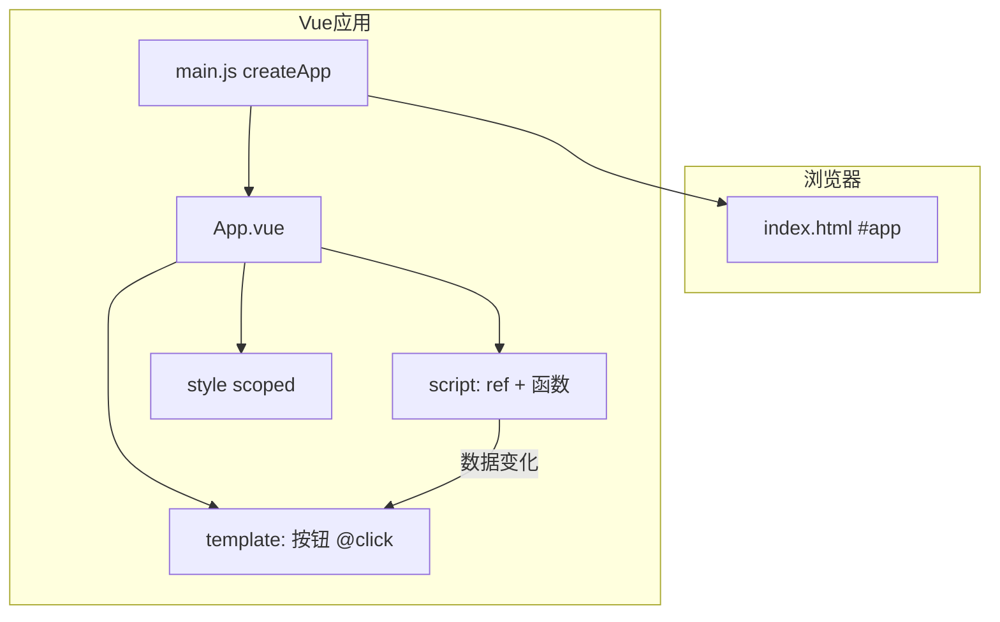

# Vue 入门与环境搭建

## 本章与上一章的关系

00 路线图告诉你 Vue 学什么、按什么顺序、用什么工具。前提是你已经会用 HTML/CSS/JS 搭静态页、会用 `fetch` 调接口、会在浏览器 F12 里看 Console 和 Network——Vue **不是替代**这些基础，而是让你用**更工程化、更可维护**的方式组织它们。

如果你还不会 HTML 标签、CSS 选择器、JS 变量和函数，请先回到 [HTML CSS JS 01～07](../HTML%20CSS%20JS/00-学习路线图与说明.md)。地基不牢，学框架会很痛苦：不是 Vue 难，而是你不知道 Vue 在帮你省掉哪些原生 DOM 操作的脏活。

这一章你要完成三件具体的事：

1. 在本机装好 Node.js 和 VS Code 插件
2. 用官方脚手架创建 `shop-vue` 项目并成功 `npm run dev`
3. 看懂 `.vue` 单文件组件（SFC）三块结构，写出第一个带计数器的页面

这是后面 02～11 章共用同一个项目仓库的起点。

---

## 1. Vue 是什么

### 1.1 一句话定义

Vue（读音 /vjuː/，像 view）是一套用于构建用户界面的 **渐进式 JavaScript 框架**，由尤雨溪（Evan You）创建，目前主流版本是 **Vue 3**。

### 1.2 通俗理解

你可以把 Vue 理解成三层能力叠加：

| 能力 | 说明 | 对应你以前怎么干 |
|------|------|------------------|
| **声明式渲染** | 你描述「数据长什么样」，Vue 负责把页面画出来 | 以前：自己 `innerHTML` 或拼字符串 |
| **响应式** | 数据变了，用到它的 DOM **自动更新** | 以前：改数据后手动找 DOM 节点改文字 |
| **组件化** | 页面拆成独立、可复用的小块（`.vue` 文件） | 以前：一个 HTML 几千行，或复制粘贴 |

### 1.3 什么是「渐进式」

「渐进式」意思是：**你可以只用 Vue 的一小部分，也可以用它做完整单页应用（SPA）**。

- 只想让某个 `<div>` 有交互？可以只在那个区域用 Vue
- 想做完整商城前台？Vue + Router + Pinia + Axios 全家桶

不像有些框架「一上来就要你接受整套方案」，Vue 允许你按阶段慢慢加能力——但本资料会按**完整项目路线**教，最终目标是能独立做 shop-vue 商城。

### 1.4 Vue 在真实工作中的位置

```text
用户浏览器
  ↓ 请求 HTML/JS/CSS
Nginx / CDN 托管 Vue 打包后的 dist
  ↓ Vue 应用运行
Axios 发 HTTP 请求
  ↓ JSON
Spring Boot 后端（你后端学习资料里的 demo）
  ↓
MySQL / Redis
```

前端岗位日常：

- 按设计稿/原型用 Vue 写页面和交互
- 调后端 REST 接口，渲染列表、表单、详情
- 处理 loading、报错、空数据、权限跳转
- 和后端、产品联调

所以你学 Vue 不是「学一个库的名字」，而是学**现代 Web 前端开发的主工作方式之一**（国内尤其常见）。

### 1.5 Vue 生态一览（现在不必全会，先有个地图）

| 名称 | 作用 | 本资料哪章学 |
|------|------|-------------|
| Vue 3 核心 | 响应式、组件、模板 | 01～05 |
| Vue Router | 多页面路由（SPA） | 06 |
| Pinia | 全局状态管理 | 07 |
| Axios | HTTP 请求 | 08 |
| Element Plus | UI 组件库 | 09 |
| Vite | 开发与打包工具 | 01 用、10 详讲 |
| VueUse | 常用组合式工具集 | 进阶可选 |
| Vitest | 单元测试 | 进阶可选 |

---

## 2. Vue 2 和 Vue 3 怎么选

**本资料只教 Vue 3。** 2024 年以后新项目、新教程、新招聘要求默认 Vue 3。

| 对比项 | Vue 2（2016～2023 主流） | Vue 3（当前主流） |
|--------|-------------------------|-------------------|
| 发布时间 | 2016 | 2020 正式版 |
| 构建工具 | vue-cli + Webpack（慢） | Vite（极快） |
| API 风格 | Options API（data/methods/mounted） | Composition API + `<script setup>` |
| 响应式实现 | `Object.defineProperty` | `Proxy` |
| 对新增属性/数组索引 | 需 `$set` 才响应 | 原生支持 |
| 状态管理 | Vuex | Pinia（官方推荐） |
| TypeScript | 支持一般 | 一等公民 |
| 维护状态 | 2023 年底停止维护（除安全） | 活跃开发 |

**面试怎么说**：「新项目用 Vue 3 + Vite + Pinia + Composition API；维护老项目可能遇到 Vue 2 + Vuex。」

### 2.1 Options API 长什么样（了解即可，05 章对比）

```js
// Vue 2 / Vue 3 都支持的旧写法，本资料不作为主力
export default {
  data() {
    return { count: 0 }
  },
  methods: {
    add() { this.count++ }
  },
  mounted() {
    console.log('挂载完成')
  }
}
```

问题：同一个功能的 `data`、`methods`、`mounted` **散落各处**，组件上千行时很难维护。所以 Vue 3 主推**组合式 API**——相关逻辑写在一起（05 章详讲）。

---

## 3. 环境准备（Windows 详细步骤）

### 3.1 安装 Node.js

1. 打开 https://nodejs.org/
2. 下载 **LTS** 版本（推荐 18 或 20）
3. 安装时勾选「Add to PATH」
4. 安装完成后打开 **PowerShell** 或 **CMD**：

```bash
node -v
# 预期输出：v18.x.x 或 v20.x.x

npm -v
# 预期输出：9.x.x 或 10.x.x
```

**若提示不是内部或外部命令**：

- 重启终端；仍不行则检查系统环境变量 `Path` 是否包含 Node 安装目录
- Windows：设置 → 系统 → 关于 → 高级系统设置 → 环境变量

### 3.2 配置 npm 镜像（国内建议，可选但强烈推荐）

```bash
npm config set registry https://registry.npmmirror.com

npm config get registry
# 预期输出：https://registry.npmmirror.com/
```

### 3.3 VS Code 插件

| 插件 | 作用 |
|------|------|
| **Vue - Official**（原 Volar） | `.vue` 高亮、跳转、类型提示 |
| ESLint | 代码规范检查 |
| Prettier | 格式化（可选） |

**注意**：如果装过旧版 Vetur，请**禁用** Vetur，避免和 Volar 冲突。

VS Code 右下角编码确认为 **UTF-8**。

### 3.4 浏览器与 Vue DevTools

- 浏览器：Chrome 或 Edge
- 扩展商店搜索 **Vue.js devtools**，安装后 F12 会出现 **Vue** 面板（开发模式可见组件树）

---

## 4. 第一个 Vue 项目：手把手全流程

### 4.1 创建 shop-vue

在你想放项目的目录（例如 `f:\study\projects`）打开终端：

```bash
npm create vue@latest shop-vue
```

这是官方脚手架 **create-vue**（不是过时的 vue-cli）。

**交互选项建议**（初学可以后面章节再加 Router/Pinia）：

```text
✔ Project name: … shop-vue
✔ Add TypeScript? … No
✔ Add JSX Support? … No
✔ Add Vue Router for Single Page Application development? … No   ← 06 章手动加
✔ Add Pinia for state management? … No                        ← 07 章手动加
✔ Add Vitest for Unit Testing? … No
✔ Add an End-to-End Testing Solution? … No
✔ Add ESLint for code quality? … Yes
```

```bash
cd shop-vue
npm install
```

```text
# 预期：大量 added xxx packages，最后无 ERR!
```

### 4.2 启动开发服务器

```bash
npm run dev
```

```text
# 预期输出：
  VITE v5.x.x  ready in 500 ms

  ➜  Local:   http://localhost:5173/
  ➜  Network: use --host to expose
  ➜  press h + enter to show help
```

浏览器访问 `http://localhost:5173/`：

- 看到 Vue 绿色图标 + 「You did it!」或欢迎页 → **成功**
- 终端不要关，它负责热更新

**停止服务**：终端里 `Ctrl + C`。

### 4.3 完整目录结构说明

```text
shop-vue/
├── .vscode/                 ← VS Code 推荐配置（可保留）
├── public/                  ← 静态资源，原样复制到 dist 根目录
│   └── favicon.ico
├── src/                     ← 你 99% 的时间都在这里写代码
│   ├── assets/              ← 需要打包处理的资源（图片、全局 css）
│   │   └── main.css
│   ├── components/          ← 可复用子组件（04 章大用）
│   │   └── HelloWorld.vue   ← 脚手架自带，后面可删
│   ├── App.vue              ← 根组件，应用的「最外层」
│   └── main.js              ← 入口：创建 Vue 应用并挂载
├── index.html               ← 整个 SPA 唯一 HTML 壳子
├── package.json             ← 依赖、脚本命令
├── vite.config.js           ← Vite 配置（代理、别名等，08 章改）
├── jsconfig.json            ← 路径别名 @ 提示（可选）
└── README.md
```

### 4.4 index.html：整个应用的壳

```html
<!DOCTYPE html>
<html lang="zh-CN">
  <head>
    <meta charset="UTF-8" />
    <link rel="icon" href="/favicon.ico" />
    <meta name="viewport" content="width=device-width, initial-scale=1.0" />
    <title>shop-vue 商城</title>
  </head>
  <body>
    <div id="app"></div>
    <script type="module" src="/src/main.js"></script>
  </body>
</html>
```

要点：

- 只有一个 `<div id="app">`，Vue 会把整个应用渲染进去
- `type="module"` 表示 ES Module，Vite 依赖这个
- **没有** 传统多页面的几十个 html 文件——这是 SPA 的特点

### 4.5 main.js：应用入口

```js
import './assets/main.css'
import { createApp } from 'vue'
import App from './App.vue'

createApp(App).mount('#app')
```

执行顺序：

1. 引入全局样式
2. `createApp(App)` 创建应用实例，根组件是 `App.vue`
3. `.mount('#app')` 挂载到 `index.html` 的 `#app` 节点

后面章节会在这里 `.use(router).use(pinia)` 等。

### 4.6 package.json：依赖与脚本

```json
{
  "name": "shop-vue",
  "version": "0.0.0",
  "private": true,
  "type": "module",
  "scripts": {
    "dev": "vite",
    "build": "vite build",
    "preview": "vite preview"
  },
  "dependencies": {
    "vue": "^3.4.0"
  },
  "devDependencies": {
    "@vitejs/plugin-vue": "^5.0.0",
    "vite": "^5.0.0"
  }
}
```

| 命令 | 作用 |
|------|------|
| `npm run dev` | 开发模式，支持热更新 HMR |
| `npm run build` | 生产打包到 `dist/` |
| `npm run preview` | 本地预览打包后的 dist |

---

## 5. 改写 App.vue：第一个完整页面

删除脚手架里 `HelloWorld` 相关引用，把 `src/App.vue` **整文件替换**为：

```vue
<script setup>
import { ref } from 'vue'

const shopName = ref('shop-vue 练习商城')
const count = ref(0)
const slogan = ref('数据驱动视图，告别手动改 DOM')

function increment() {
  count.value++
}

function decrement() {
  if (count.value > 0) {
    count.value--
  }
}

function reset() {
  count.value = 0
}
</script>

<template>
  <div class="app">
    <header class="header">
      <h1>{{ shopName }}</h1>
      <p class="slogan">{{ slogan }}</p>
    </header>

    <main class="main">
      <section class="counter-card">
        <h2>点击计数器（响应式入门）</h2>
        <p class="count-display">当前计数：<strong>{{ count }}</strong></p>
        <div class="btn-group">
          <button type="button" class="btn" @click="decrement">－</button>
          <button type="button" class="btn btn-primary" @click="increment">＋</button>
          <button type="button" class="btn btn-ghost" @click="reset">重置</button>
        </div>
        <p v-if="count >= 10" class="tip">🎉 已经点了 10 次以上了！</p>
      </section>
    </main>

    <footer class="footer">
      <small>第 01 章 · Vue 入门 · 保存文件后页面应自动刷新</small>
    </footer>
  </div>
</template>

<style scoped>
.app {
  min-height: 100vh;
  display: flex;
  flex-direction: column;
  font-family: system-ui, -apple-system, "Segoe UI", sans-serif;
  background: #f5f7fa;
  color: #1f2937;
}
.header {
  text-align: center;
  padding: 48px 16px 24px;
}
.header h1 {
  font-size: 28px;
  margin-bottom: 8px;
}
.slogan {
  color: #6b7280;
}
.main {
  flex: 1;
  display: flex;
  justify-content: center;
  padding: 16px;
}
.counter-card {
  background: #fff;
  border-radius: 12px;
  padding: 32px;
  box-shadow: 0 4px 20px rgba(0, 0, 0, 0.06);
  width: 100%;
  max-width: 420px;
  text-align: center;
}
.count-display {
  font-size: 20px;
  margin: 20px 0;
}
.count-display strong {
  color: #42b983;
  font-size: 32px;
}
.btn-group {
  display: flex;
  gap: 12px;
  justify-content: center;
}
.btn {
  padding: 10px 20px;
  border: 1px solid #d1d5db;
  border-radius: 8px;
  background: #fff;
  cursor: pointer;
  font-size: 16px;
}
.btn:hover {
  border-color: #42b983;
}
.btn-primary {
  background: #42b983;
  color: #fff;
  border-color: #42b983;
}
.btn-ghost {
  color: #6b7280;
}
.tip {
  margin-top: 16px;
  color: #42b983;
}
.footer {
  text-align: center;
  padding: 16px;
  color: #9ca3af;
}
</style>
```

**验证步骤**：

1. 保存 `App.vue`
2. 浏览器应**自动刷新**（Vite HMR），无需 F5
3. 点「＋」「－」「重置」，数字变化
4. 计数到 10 以上出现祝贺文案（`v-if` 预览）



---

## 6. 单文件组件 SFC 深入

### 6.1 为什么用 .vue 而不是 .js + .html

| 方式 | 问题 |
|------|------|
| 一个巨大 index.html | HTML/CSS/JS 混在一起，难维护 |
| JS 里拼模板字符串 | 没高亮、没提示、难读 |
| **SFC 单文件组件** | 结构/逻辑/样式分区，编辑器友好，组件可复用 |

### 6.2 三块职责

```vue
<script setup>
// ① 逻辑层：数据、计算、方法、生命周期、调接口
</script>

<template>
  <!-- ② 视图层：HTML 结构 + Vue 指令 -->
</template>

<style scoped>
/* ③ 样式层：只影响本组件（scoped） */
</style>
```

### 6.3 scoped 是什么

`<style scoped>` 会给本组件元素加上唯一属性选择器，**避免样式污染全局**。

例如按钮样式不会意外改掉别的页面的 button——组件化项目必备。

### 6.4 和原生 JS 的对比（同一功能）

**原生写法**：

```html
<p id="countEl">0</p>
<button id="addBtn">+1</button>
<script>
  let count = 0
  const el = document.getElementById('countEl')
  document.getElementById('addBtn').addEventListener('click', () => {
    count++
    el.textContent = count
  })
</script>
```

**Vue 写法**：

```vue
<script setup>
import { ref } from 'vue'
const count = ref(0)
</script>
<template>
  <p>{{ count }}</p>
  <button @click="count++">+1</button>
</template>
```

数据 `count` 变 → 模板里用到 `count` 的地方**自动更新**。这就是「声明式 UI」。

---

## 7. ref 与响应式入门

### 7.1 为什么需要 ref

```js
let count = 0  // 普通变量
count++        // Vue 不知道你改了，模板不会更新
```

```js
const count = ref(0)
count.value++  // Vue 追踪到了，模板会更新
```

`ref` 把值包成一个**响应式引用对象**，Vue 3 用 Proxy 监听变化。

### 7.2 script 里 vs template 里

| 位置 | 写法 |
|------|------|
| `<script setup>` | `count.value` |
| `<template>` | `{{ count }}`（自动解包，不要写 .value） |

### 7.3 在 DevTools 里观察

F12 → Vue 面板 → 选中 `<App>` → 看 setup 里的 `shopName`、`count` 等，点击按钮时数值应同步变。

---

## 8. 模板语法速览（02 章会系统讲）

| 语法 | 名称 | 示例 |
|------|------|------|
| `{{ msg }}` | 文本插值 | `{{ shopName }}` |
| `v-if` / `v-else` | 条件渲染 | `v-if="count >= 10"` |
| `v-for` | 列表渲染 | `v-for="p in products"` |
| `v-bind:` 或 `:` | 动态绑定属性 | `:disabled="loading"` |
| `v-on:` 或 `@` | 事件监听 | `@click="increment"` |
| `v-model` | 双向绑定 | `v-model="keyword"`（03 章） |

---

## 9. 虚拟 DOM 是什么（建立直觉，不必深挖源码）

浏览器操作真实 DOM 比较慢。Vue 先在内存里维护一棵「虚拟 DOM 树」（JS 对象描述节点），数据变化时：

1. 生成新的虚拟 DOM
2. 和旧的做 **diff** 对比
3. 只把**真正变化**的部分更新到真实 DOM

所以你写 `{{ count }}` 就行，不用操心具体改哪个 DOM 节点——但要知道：**不是魔法，是框架在帮你 diff**。

---

## 10. 热更新 HMR 是什么

开发时保存 `.vue` 文件，Vite 通过 **HMR（热模块替换）** 只替换改动的模块，**尽量保持页面状态**（有时状态会丢，刷新即可）。

比「改一行代码就整页刷新」高效得多。

---

## 11. 用 Git 管理 shop-vue（强烈建议第一天就做）

```bash
cd shop-vue
git init
git add .
git commit -m "chore: init shop-vue via create-vue"
```

每完成一章练习打一次 commit，方便回滚。

---

## 12. 本章知识点清单（可自查）

- [ ] Node.js、npm 可用
- [ ] `npm create vue@latest` 创建项目
- [ ] 能解释 `index.html`、`main.js`、`App.vue` 各自职责
- [ ] 能解释 SFC 三块：script / template / style scoped
- [ ] 会用 `ref`，知道 script 里 `.value`、模板里自动解包
- [ ] 会用 `@click`、`{{ }}`、`v-if`
- [ ] 知道 Vue 3 和 Vue 2 的主要区别
- [ ] 会开 DevTools 看组件

---

## 13. 分级练习

**基础**：把 `shopName` 改成你的昵称  
**进阶**：加「减少」「重置」按钮，`count` 不小于 0  
**挑战**：用 `computed` 显示「偶数 / 奇数」（需 `import { computed } from 'vue'`）

### 13.1 参考答案（挑战）

```vue
<script setup>
import { ref, computed } from 'vue'

const count = ref(0)
const parity = computed(() => (count.value % 2 === 0 ? '偶数' : '奇数'))

function increment() { count.value++ }
function decrement() { if (count.value > 0) count.value-- }
</script>

<template>
  <p>计数：{{ count }}（{{ parity }}）</p>
  <button @click="increment">+1</button>
  <button @click="decrement">-1</button>
</template>
```

### 13.2 进阶练习：改页面标题

在 `index.html` 里改 `<title>`，或在 `main.js` 里：

```js
document.title = 'shop-vue 商城'
```

---

## 13.3 常见报错与排查（务必收藏）

| 报错信息（关键词） | 可能原因 | 解决方案 |
|-------------------|---------|---------|
| `'npm' 不是内部或外部命令` | Node 未装或未进 PATH | 重装 Node LTS，重启终端 |
| `npm create vue` 很慢/失败 | 网络 | 配置 npmmirror 镜像 |
| `Port 5173 is in use` | 端口占用 | 关掉其他 Vite；或 `npm run dev -- --port 5174` |
| `[plugin:vite:vue] Invalid end tag` | template 标签未闭合 | 检查 `<div>` 配对 |
| `Failed to resolve import` | 路径错或文件不存在 | 检查 import 路径大小写 |
| 页面一片空白 | `#app` 不存在或 mount 失败 | 看 `index.html` 和 `main.js` |
| 改了代码不更新 | 未保存或 dev 进程挂了 | Ctrl+S；重启 `npm run dev` |
| `count is not defined` | 未在 script 声明 | 确认 `const count = ref(0)` |
| 模板里写了 `count.value` | 模板会自动解包 | 模板里写 `{{ count }}` 即可 |
| Volar 和 Vetur 冲突 | 两个插件同时启用 | 禁用 Vetur，只用 Vue - Official |
| 中文乱码 | 编码不是 UTF-8 | VS Code 右下角改 UTF-8 保存 |

---

## 14. FAQ

**Q：Vue 和 React 怎么选？**  
国内 Vue 岗位很多，尤其中后台；React 生态全球最大。会一个，另一个学起来快。本路线选 Vue 3。

**Q：要学 TypeScript 吗？**  
初学先用 JavaScript 把概念打通；就业后大部分 Vue 3 项目会逐步上 TS，可作为第二阶段。

**Q：create-vue 和 vue-cli 区别？**  
vue-cli 偏 Vue 2 时代 + Webpack，已不推荐新项目；create-vue + Vite 是 Vue 3 官方默认。

**Q：一个 .vue 文件是一个组件吗？**  
是的。文件名一般 PascalCase，如 `ProductCard.vue`。

**Q：必须用 VS Code 吗？**  
推荐 VS Code + Volar；WebStorm 对 Vue 支持也很好。

**Q：为什么按钮要加 `type="button"`？**  
在 `<form>` 里，button 默认 `type="submit"` 会触发表单提交；普通按钮建议显式写 `type="button"`。

---

## 15. 下一章预告

这一章你能跑起 `shop-vue`、改 `App.vue`、理解 `ref` 和 SFC 了——但真实商城要展示**一堆商品**，要根据库存显示「售罄」，要循环渲染卡片。光靠一个计数器不够。

下一章（02 模板语法与响应式原理）系统讲 `v-for`、`:key`、`v-if` vs `v-show`、`:class` 动态样式、`reactive` 对象，以及**完整静态商品列表页**——那是你 shop-vue 的第一个「像业务」的页面。

---

*下一章：02 模板语法与响应式原理*
