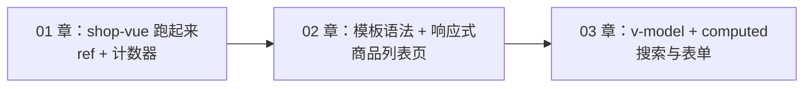
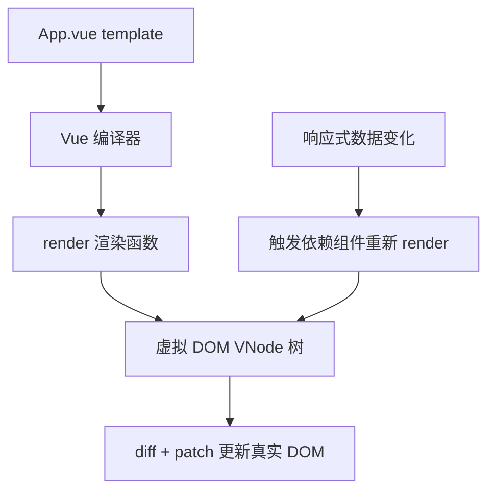
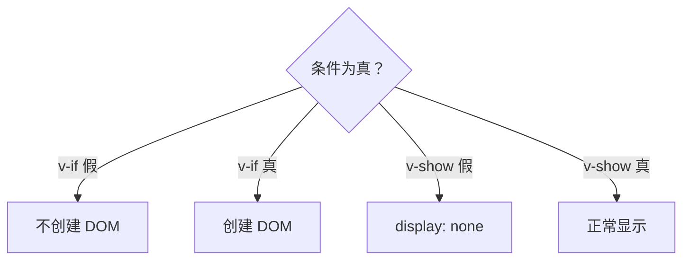
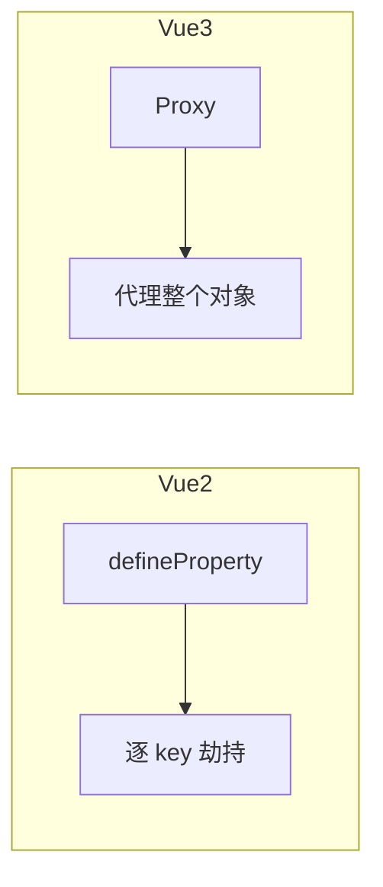
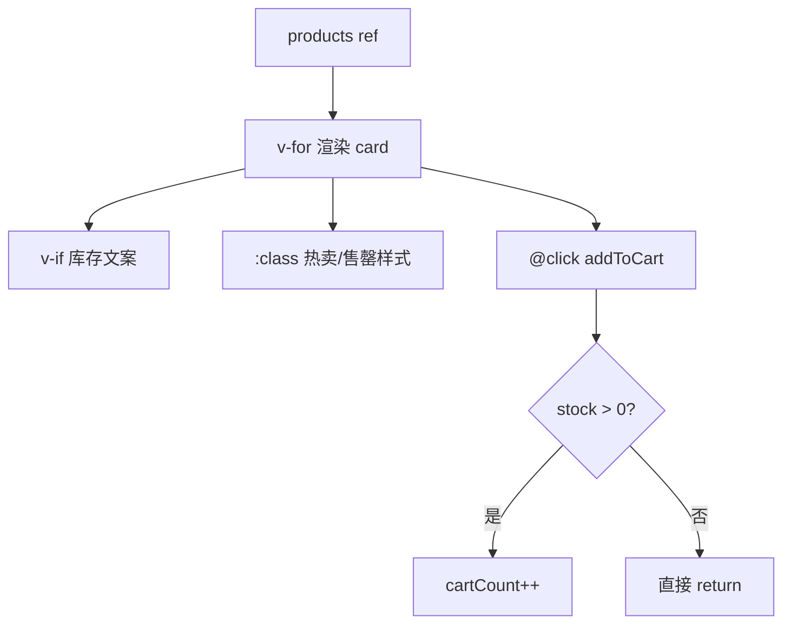

# 模板语法与响应式原理

<!-- 修改说明: 2026-06-30 按 EXPANSION-STANDARD 扩充 §0 导读、DevTools、FAQ、闭卷自测、费曼检验 -->

## 0. 读前导读（零基础也能跟上）

> **读者假设**：你已跑通 [01 shop-vue](./01-Vue入门与环境搭建.md)，会 `ref`、`@click`、`{{ }}`。本章系统学模板指令和响应式，把计数器页升级成**静态商品列表页**。

### 0.1 用一句话弄懂本章

**一句话**：在 `<template>` 里用 `v-for`、`v-if`、`:class` 等指令描述「数据长什么样」，Vue 用 Proxy 监听数据变化并自动更新 DOM——你不再手写 `innerHTML`。

**生活类比——模板像「Excel 公式 + 条件格式」**：

| 指令 | 类比 | 示例 |
|------|------|------|
| `{{ }}` | 单元格引用 | `{{ product.name }}` |
| `v-for` | 向下填充多行 | 一行商品模板复制 N 条 |
| `v-if` | IF 条件格式 | 库存为 0 显示「售罄」 |
| `:class` | 按规则变色 | 低库存标红 |
| `ref/reactive` | 数据源工作表 | 改单元格，视图自动重算 |

**为什么重要**：这是 Vue 日常开发 80% 的写法；08 章从 [Java 04](../../后端学习/Java/04-SpringBoot核心开发.md) 拉 JSON 后，**模板语法不变**，只换数据来源。

**本章用到的地方**：§6 v-for、§7 v-if、§10 Proxy、§15 商品列表实操。

---

### 0.2 你需要提前知道什么

| 水平 | 建议 |
|------|------|
| 01 章未跑通 shop-vue | 先完成 [01-Vue入门与环境搭建](./01-Vue入门与环境搭建.md) §4 |
| 不会 JS 数组 map/filter | 补 [06-JavaScript基础语法](../HTML%20CSS%20JS/06-JavaScript基础语法与数据类型.md) §13 |
| 已会 01 章 ref | **从 §2 插值开始跟做 §15 实操** |

---

### 0.3 本章知识地图（学完后应能勾选全部 ☐→☑）

- [ ] 熟练使用 `{{ }}`、`:bind`、`@click` 及修饰符
- [ ] `v-for` 循环列表且 **始终** `:key="id"`（不用 index）
- [ ] 正确选择 `v-if` vs `v-show`
- [ ] 会用 `ref` 和 `reactive`，知道 script/template 访问差异
- [ ] 能口述 Vue 3 Proxy 相对 Vue 2 defineProperty 的优势
- [ ] 完成 shop-vue 静态商品列表页（§15）
- [ ] 会用 template ref + `onMounted` 聚焦输入框
- [ ] 会用 Vue DevTools 查看 `products` 数组与 `cartCount`
- [ ] 能对照 Java 04 的 Product VO 字段设计前端 `products` 结构
- [ ] 闭卷自测 ≥ 8/10

---

### 0.4 建议学习时长与节奏

| 阶段 | 时间 | 内容 |
|------|------|------|
| 指令速览 §2～§7 | 2 小时 | 边读边在 App.vue 试 |
| 响应式 §8～§11 | 1.5 小时 | ref/reactive/Proxy |
| §15 商品列表实操 | 2 小时 | **主线练习，必做** |
| DevTools + 自测 | 45 分钟 | §20 步骤表 |

---

### 0.5 学完本章你能做什么（可验证）

1. shop-vue 首页展示 ≥3 个商品卡片，含名称、价格、库存、售罄态。
2. 点击「加入购物车」，`cartCount` 增加，DevTools 可见。
3. 用 `:key="product.id"` 的 `v-for`，列表增删不丢输入框焦点。
4. 口述：后端 [Java 04 ProductVO](../../后端学习/Java/04-SpringBoot核心开发.md) 的 `id/name/price/stock` 如何对应前端字段。

---

### 0.6 核心术语三件套

**术语（v-for 列表渲染）**：根据数组/对象重复渲染一段模板。
**生活类比**：Excel 向下填充——一行商品模板复制成 N 行。
**为什么重要**：商品列表、订单列表、评论列表都靠它；`:key` 写错是线上 bug 高发区。
**本章用到的地方**：§6、§15 商品列表。

**术语（Proxy 代理）**：Vue 3 用来拦截对象读写的 ES6 特性，实现响应式。
**生活类比**：仓库管理员——任何人进出（get/set）都要登记，变了就通知价签更新。
**为什么重要**：面试常问 Vue2/Vue3 差异；理解后才知道「改了数据为何有时不更新」。
**本章用到的地方**：§10 响应式原理。

**术语（:key 列表身份）**：给 v-for 每一项 stable 唯一标识，帮助 diff 算法复用 DOM。
**生活类比**：学生学号——换座位（排序）仍是对的人；用行号（index）换班就乱套。
**为什么重要**：用 index 做 key 在增删/输入框场景会导致状态错乱。
**本章用到的地方**：§6.3、§15 实操。

---

## 本章与上一章的关系

01 章你在 `shop-vue` 里完成了环境搭建，改写了 `App.vue` 计数器，第一次接触了 `ref`、`{{ }}` 插值和 `@click` 事件。那一章的重点是「项目能跑起来、SFC 三块结构能看懂」。

**这一章是 Vue 核心能力的第一次系统展开**：模板语法（怎么在 HTML 里绑定数据）和响应式原理（数据变了页面为什么自动变）。学完后，你要把 01 章的计数器页面**升级**为带商品列表、库存状态、动态样式的**静态商城列表页**——数据仍写在前端，不接后端，但渲染逻辑已经和真实项目非常接近。



**前置检查**（本章开始前请确认）：

- `npm run dev` 能正常打开 `http://localhost:5173/`
- `App.vue` 里计数器点击有反应
- 知道 `<script setup>`、`ref`、`template`、`style scoped` 各管什么

---

## 1. 模板是什么：Vue 的「视图描述语言」

Vue 的 `<template>` 不是普通 HTML，而是**带指令的 HTML**。你在模板里写：

- 数据占位：`{{ product.name }}`
- 条件：`v-if="stock > 0"`
- 循环：`v-for="p in products"`
- 绑定：`:class="{ sold: !stock }"`
- 事件：`@click="addToCart(p)"`

Vue 编译器会把这些模板转成渲染函数，再变成真实 DOM。**你只管描述「数据长什么样」，不用自己 `document.querySelector` 改节点**——这就是 01 章 slogan 里说的「数据驱动视图」。

### 1.1 模板编译大致流程



**为什么要知道这个？** 面试常问「Vue 怎么更新 DOM」；日常开发遇到「改了数据页面不更新」，也要知道问题出在**数据是否响应式**还是**模板写法**上。

---

## 2. 插值表达式 `{{ }}`

### 2.1 基本用法

在元素**文本内容**里嵌入 JavaScript **表达式**（有返回值的一行代码）：

```vue
<template>
  <p>{{ shopName }}</p>
  <p>{{ count + 1 }}</p>
  <p>{{ ok ? '有货' : '缺货' }}</p>
  <p>{{ message.split('').reverse().join('') }}</p>
</template>
```

```vue
<script setup>
import { ref } from 'vue'

const shopName = ref('shop-vue 练习商城')
const count = ref(0)
const ok = ref(true)
const message = ref('Hello Vue')
</script>
```

### 2.2 插值里能写什么、不能写什么

| 能写 | 不能写 |
|------|--------|
| 变量、三元运算、算术 | `if/for/while` 语句 |
| 方法调用 `formatPrice(p.price)` | 多行语句、带 `return` 的函数体 |
| 可选链 `user?.name` | 声明变量 `const x = 1` |

**为什么？** 模板表达式会被编译成函数返回值，必须是**单个表达式**。分支用 `v-if`，循环用 `v-for`。

### 2.3 常见坑：显示原始 `{{ xxx }}`

| 现象 | 原因 |
|------|------|
| 页面上 literal 显示 `{{ count }}` | 写在 `<pre>` 外但 Vue 没挂载；或拼写在了普通 html 文件里 |
| 显示空白 | 变量未定义或未从 script 暴露 |
| 显示 `[object Object]` | 直接插值对象，应取属性 `{{ user.name }}` |

### 2.4 一次渲染：`v-once`

列表里某个统计数字不需要跟着频繁更新时：

```html
<p v-once>商城名称：{{ shopName }}</p>
```

只渲染一次，后续数据变也不更新——**少用**，除非明确知道这块是静态的。

---

## 3. 原始 HTML 与 v-html

默认 `{{ }}` 会**转义** HTML，防 XSS：

```vue
<script setup>
const raw = ref('<strong>加粗</strong>')
</script>

<template>
  <p>{{ raw }}</p>        <!-- 显示字面量 <strong>加粗</strong> -->
  <p v-html="raw"></p>    <!-- 真正渲染加粗 -->
</template>
```

**真实案例**：后台富文本编辑器返回的商品详情 HTML，用 `v-html` 渲染——**必须信任内容来源**，用户输入的内容绝不能直接 `v-html`，否则 XSS 攻击。

---

## 4. 属性绑定 v-bind（简写 `:`）

HTML 属性默认是字符串。要绑**动态值**，用 `v-bind` 或 `:`：

```vue
<script setup>
import { ref } from 'vue'

const imgUrl = ref('https://via.placeholder.com/120x120?text=Book')
const productUrl = ref('/product/1')
const isHot = ref(true)
const stock = ref(0)
</script>

<template>
  <!-- 动态 src、href -->
  
  <a :href="productUrl">查看详情</a>

  <!-- 动态 class：对象语法 -->
  <span :class="{ hot: isHot, 'sold-out': stock === 0 }">标签</span>

  <!-- 动态 class：数组语法 -->
  <span :class="['badge', isHot ? 'badge-hot' : '']">促销</span>

  <!-- 动态 style -->
  <p :style="{ color: stock > 0 ? '#333' : '#999', fontSize: '14px' }">库存提示</p>

  <!-- 布尔属性：disabled 没有值也要绑布尔 -->
  <button :disabled="stock === 0">购买</button>
</template>
```

### 4.1 为什么 `:disabled="stock === 0"` 而不是 `disabled="stock === 0"`

后者会把属性值当成字符串 `"stock === 0"`，在 HTML 里**非空字符串即为 true**，按钮永远 disabled。

### 4.2 批量绑定对象

```vue
<script setup>
const attrs = ref({ id: 'card-1', 'data-category': 'book' })
</script>

<template>
  <div v-bind="attrs">商品卡片</div>
</template>
```

---

## 5. 事件绑定 v-on（简写 `@`）

### 5.1 基本点击

```vue
<script setup>
import { ref } from 'vue'

const count = ref(0)

function increment() {
  count.value++
}

function handleClick(event, item) {
  console.log('原生事件对象', event)
  console.log('业务数据', item)
}
</script>

<template>
  <button @click="increment">+1</button>
  <button @click="count++">内联表达式</button>
  <button @click="handleClick($event, { id: 1 })">传参</button>
</template>
```

### 5.2 事件修饰符

| 修饰符 | 作用 | 商城场景 |
|--------|------|----------|
| `.prevent` | 阻止默认行为 | 表单 `@submit.prevent` |
| `.stop` | 阻止冒泡 | 卡片内按钮不触发卡片点击 |
| `.once` | 只触发一次 | 「领取优惠券」防重复点 |
| `.enter` | 回车触发 | 搜索框 `@keyup.enter="search"` |

```html
<form @submit.prevent="onSubmit">
  <input @keyup.enter="doSearch" />
</form>

<div @click="onCardClick">
  <button @click.stop="addToCart">加入购物车</button>
</div>
```

### 5.3 按键修饰符

```html
<input @keyup.enter="search" />
<input @keyup.esc="clearKeyword" />
```

---

## 6. 列表渲染 v-for

### 6.1 遍历数组

```vue
<script setup>
import { ref } from 'vue'

const products = ref([
  { id: 1, name: 'Java 编程思想', price: 99, stock: 10, category: 'book' },
  { id: 2, name: 'Spring Boot 实战', price: 79, stock: 0, category: 'book' },
  { id: 3, name: '机械键盘 K87', price: 299, stock: 5, category: 'digital' },
])
</script>

<template>
  <ul>
    <li v-for="item in products" :key="item.id">
      {{ item.name }} — ¥{{ item.price }}
    </li>
  </ul>
</template>
```

### 6.2 带索引

```html
<li v-for="(item, index) in products" :key="item.id">
  {{ index + 1 }}. {{ item.name }}
</li>
```

### 6.3 为什么 `:key` 必须有

Vue 用 key 识别节点身份，列表增删改时**高效复用 DOM**。

| key 写法 | 评价 |
|----------|------|
| `:key="item.id"` | ✅ 稳定唯一，推荐 |
| `:key="index"` | ⚠️ 排序/插入时可能错乱 |
| 不写 key | ❌ 控制台警告，更新行为不可控 |

**真实案例**：购物车数量 badge 闪烁、输入框焦点丢失——常见原因就是 `v-for` 用了 index 当 key 或没写 key。

### 6.4 遍历对象

```vue
<script setup>
const user = ref({ name: '张三', level: 'VIP', points: 1200 })
</script>

<template>
  <p v-for="(value, key) in user" :key="key">
    {{ key }}: {{ value }}
  </p>
</template>
```

### 6.5 v-for 与 v-if 不要写同一元素上

Vue 3 仍**不推荐**：

```html
<!-- 不推荐 -->
<li v-for="p in products" v-if="p.stock > 0" :key="p.id">
```

应改为 `computed` 过滤（03 章）或 `<template v-for>` 包一层。

---

## 7. 条件渲染 v-if / v-else / v-else-if 与 v-show

### 7.1 v-if 系列：真正创建/销毁 DOM

```vue
<template>
  <span v-if="item.stock > 0" class="in-stock">有货</span>
  <span v-else-if="item.stock === 0" class="sold-out">售罄</span>
  <span v-else class="unknown">状态未知</span>
</template>
```

### 7.2 v-show：仅切换 display

```vue
<template>
  <div v-show="isLoggedIn">欢迎回来，{{ username }}</div>
</template>
```

### 7.3 怎么选

| 指令 | DOM | 切换开销 | 适用 |
|------|-----|----------|------|
| `v-if` | 不满足时不渲染 | 切换时有创建/销毁成本 | 很少切换、权限块、大块内容 |
| `v-show` | 始终在 DOM | 只改 CSS | Tab 切换、频繁显隐 |

**商城案例**：「售罄」标签用 `v-if`（每个商品固定）；顶部「登录/用户信息」切换用 `v-show`（可能频繁切换）。



---

## 8. ref：响应式基本类型与「单一引用」

01 章已用过 `ref`，这里系统巩固。

```js
import { ref } from 'vue'

const count = ref(0)
const shopName = ref('shop-vue')
const products = ref([])  // 数组、对象也可以包在 ref 里
```

### 8.1 访问规则（极其重要）

| 位置 | 写法 |
|------|------|
| `<script setup>` 里 | `count.value++` |
| `<template>` 里 | `{{ count }}`（自动解包，不要 `.value`） |

**为什么 template 不用 `.value`？** 编译器对模板里的 ref 自动 unwrap，减少噪音。

### 8.2 在 script 里解构 ref 会失去响应式

```js
const count = ref(0)
const { value } = count  // 只是数字 0，不再响应式
```

需要解构时用 `toRefs`（05 章 composable 详讲），初学先不要解构 ref。

### 8.3 替换整个数组/对象

```js
products.value = [...products.value, newProduct]  // ✅
products.value.push(newProduct)                   // ✅ 变异方法也可
products = []  // ❌ 重新赋值变量本身，不是 ref 内的值
```

---

## 9. reactive：响应式对象

适合**一组相关字段**放一起：

```vue
<script setup>
import { reactive } from 'vue'

const filterState = reactive({
  keyword: '',
  category: 'all',
  sortBy: 'default',
})

function resetFilter() {
  filterState.keyword = ''
  filterState.category = 'all'
}
</script>

<template>
  <input v-model="filterState.keyword" />
  <p>当前分类：{{ filterState.category }}</p>
</template>
```

### 9.1 ref vs reactive 怎么选

| 场景 | 推荐 |
|------|------|
| 数字、字符串、布尔、可能整体替换的列表 | `ref` |
| 固定结构的对象（表单、筛选条件） | `reactive` |
| 不确定 | **统一用 `ref`** 也完全没问题 |

### 9.2 reactive 的局限

- 不能对整个 reactive 对象重新赋值（会丢响应式）
- 解构属性会丢响应式（需 `toRefs`）

```js
let state = reactive({ count: 0 })
state = { count: 1 }  // ❌ 断链
state.count++         // ✅
```

---

## 10. 响应式原理：Vue 3 为什么用 Proxy

### 10.1 从「手动改 DOM」到「自动追踪依赖」

传统写法：

```js
let count = 0
document.querySelector('#num').textContent = count
function add() {
  count++
  document.querySelector('#num').textContent = count  // 每次都要手动同步
}
```

Vue 写法：

```js
const count = ref(0)
// template: {{ count }}  —— 数据变，DOM 自动变
```

### 10.2 Vue 2：Object.defineProperty

- 递归遍历对象属性，逐个 `getter/setter`
- **新增属性**检测不到（需 `Vue.set` / `this.$set`）
- **数组索引/length** 需特殊处理

### 10.3 Vue 3：Proxy 代理整个对象

```js
// 简化理解，非 Vue 源码
const raw = { name: 'Vue 书', price: 99 }
const observed = new Proxy(raw, {
  get(target, key) {
    track(key)   // 收集依赖：谁在用这个属性
    return target[key]
  },
  set(target, key, value) {
    target[key] = value
    trigger(key) // 通知更新
    return true
  },
})
```

**好处**：

- 新增/删除属性可追踪
- 数组下标赋值可追踪
- 性能与语义更完整



### 10.4 为什么改了数据页面不更新？排查清单

1. 改的是普通变量，不是 `ref/reactive`
2. `ref` 在 script 里忘了 `.value`
3. 直接通过索引改数组且未触发响应（Vue 3 一般可以，但应用级替换更安全）
4. 对象被「脱响应式」：`JSON.parse` 后未包 ref、解构丢失

---

## 11. 数组与对象的响应式更新

### 11.1 安全操作

```js
const products = ref([{ id: 1, name: 'A' }])

products.value.push({ id: 2, name: 'B' })
products.value[0].stock = 5
products.value = products.value.filter(p => p.stock > 0)
```

### 11.2 合并对象

```js
import { reactive } from 'vue'
const form = reactive({ username: '', password: '' })
Object.assign(form, { username: 'admin', password: '123456' })
```

---

## 12. 模板引用 template ref（DOM 元素）

有时要直接操作 DOM：聚焦搜索框、读取宽度、集成非 Vue 图表库。

```vue
<script setup>
import { ref, onMounted } from 'vue'

const searchInputRef = ref(null)

onMounted(() => {
  searchInputRef.value?.focus()
  console.log('input 元素', searchInputRef.value)
})
</script>

<template>
  <input ref="searchInputRef" placeholder="搜索商品" />
</template>
```

**注意**：

- 脚本里 `const searchInputRef = ref(null)` 与模板 `ref="searchInputRef"` **名字一致**
- 在 `onMounted` 之前 `searchInputRef.value` 是 `null`

### 12.1 组件上的 ref

04 章会详讲：父组件通过 ref 调用子组件暴露的方法（`defineExpose`）。

---

## 13. 样式与 class 动态绑定实战

### 13.1 商品卡片状态样式

```vue
<template>
  <div
    v-for="p in products"
    :key="p.id"
    class="card"
    :class="{
      'card--hot': p.isHot,
      'card--sold-out': p.stock === 0,
    }"
  >
    <h3>{{ p.name }}</h3>
  </div>
</template>

<style scoped>
.card {
  border: 1px solid #eee;
  border-radius: 8px;
  padding: 16px;
}
.card--hot {
  border-color: #f56c6c;
}
.card--sold-out {
  opacity: 0.55;
}
</style>
```

### 13.2 scoped 与 :deep()

子组件根元素样式父组件 scoped 能打到；**深层子节点**需：

```css
:deep(.inner-title) {
  color: red;
}
```

---

## 14. 指令速查表

| 指令 | 简写 | 作用 |
|------|------|------|
| `v-bind` | `:` | 动态属性 |
| `v-on` | `@` | 事件 |
| `v-model` | — | 双向绑定（03 章） |
| `v-if` / `v-else` | — | 条件渲染 |
| `v-show` | — | 显隐 |
| `v-for` | — | 列表 |
| `v-html` | — | 原始 HTML |
| `v-text` | — | 等同 textContent |
| `v-pre` | — | 跳过编译 |
| `v-once` | — | 只渲染一次 |
| `v-memo` | — | 性能优化（进阶） |

---

## 15. 手把手实操：把 shop-vue 改成商品列表页

下面是一套**完整可运行**改造，延续 01 章项目，**整文件替换** `src/App.vue`。

### 15.1 目标效果

- 顶部商城标题
- 商品卡片网格：名称、价格、库存/售罄
- 售罄商品灰显、按钮 disabled
- 点击「加入购物车」弹出提示（03 章接购物车逻辑）

### 15.2 第一步：确认项目运行

```bash
cd shop-vue
npm run dev
```

### 15.3 第二步：替换 App.vue

```vue
<script setup>
import { ref } from 'vue'

const shopName = ref('shop-vue 练习商城')
const cartCount = ref(0)

const products = ref([
  {
    id: 1,
    name: 'Java 编程思想',
    price: 99,
    stock: 10,
    category: 'book',
    isHot: true,
    img: 'https://via.placeholder.com/160x160?text=Java',
  },
  {
    id: 2,
    name: 'Spring Boot 实战',
    price: 79,
    stock: 0,
    category: 'book',
    isHot: false,
    img: 'https://via.placeholder.com/160x160?text=Spring',
  },
  {
    id: 3,
    name: 'Redis 设计与实现',
    price: 89,
    stock: 3,
    category: 'book',
    isHot: true,
    img: 'https://via.placeholder.com/160x160?text=Redis',
  },
  {
    id: 4,
    name: '机械键盘 K87',
    price: 299,
    stock: 5,
    category: 'digital',
    isHot: false,
    img: 'https://via.placeholder.com/160x160?text=Keyboard',
  },
])

function formatPrice(price) {
  return price.toFixed(2)
}

function addToCart(product) {
  if (product.stock <= 0) {
    return
  }
  cartCount.value++
  alert(`已加入购物车：${product.name}`)
}

function getCategoryLabel(category) {
  const map = { book: '图书', digital: '数码' }
  return map[category] || '其他'
}
</script>

<template>
  <div class="page">
    <header class="header">
      <div>
        <h1>{{ shopName }}</h1>
        <p class="subtitle">第 02 章 · 模板语法与响应式 · 静态商品列表</p>
      </div>
      <div class="cart-badge">🛒 {{ cartCount }}</div>
    </header>

    <main class="main">
      <p class="tip">提示：售罄商品按钮不可点；保存文件后应热更新。</p>

      <div class="grid">
        <article
          v-for="p in products"
          :key="p.id"
          class="card"
          :class="{
            'card--hot': p.isHot,
            'card--sold-out': p.stock === 0,
          }"
        >
          
          <span v-if="p.isHot" class="tag tag-hot">热卖</span>
          <span class="tag tag-cat">{{ getCategoryLabel(p.category) }}</span>

          <h3 class="title">{{ p.name }}</h3>
          <p class="price">¥{{ formatPrice(p.price) }}</p>

          <p v-if="p.stock > 0" class="stock">库存：{{ p.stock }}</p>
          <p v-else class="stock stock--empty">售罄</p>

          <button
            type="button"
            class="btn"
            :disabled="p.stock === 0"
            @click="addToCart(p)"
          >
            {{ p.stock > 0 ? '加入购物车' : '暂时缺货' }}
          </button>
        </article>
      </div>
    </main>

    <footer class="footer">
      <small>数据写在前端 ref 中 · 08 章对接 Spring Boot 接口</small>
    </footer>
  </div>
</template>

<style scoped>
.page {
  min-height: 100vh;
  background: #f5f7fa;
  color: #1f2937;
  font-family: system-ui, -apple-system, 'Segoe UI', sans-serif;
}
.header {
  display: flex;
  justify-content: space-between;
  align-items: center;
  padding: 24px 32px;
  background: #fff;
  border-bottom: 1px solid #e5e7eb;
}
.subtitle {
  color: #6b7280;
  font-size: 14px;
  margin-top: 4px;
}
.cart-badge {
  background: #42b983;
  color: #fff;
  padding: 8px 16px;
  border-radius: 999px;
  font-weight: 600;
}
.main {
  padding: 24px 32px;
}
.tip {
  color: #6b7280;
  margin-bottom: 16px;
}
.grid {
  display: grid;
  grid-template-columns: repeat(auto-fill, minmax(220px, 1fr));
  gap: 20px;
}
.card {
  position: relative;
  background: #fff;
  border-radius: 12px;
  padding: 16px;
  border: 1px solid #e5e7eb;
  box-shadow: 0 2px 8px rgba(0, 0, 0, 0.04);
}
.card--hot {
  border-color: #fca5a5;
}
.card--sold-out {
  opacity: 0.65;
}
.cover {
  width: 100%;
  border-radius: 8px;
  display: block;
  margin-bottom: 12px;
}
.tag {
  display: inline-block;
  font-size: 12px;
  padding: 2px 8px;
  border-radius: 4px;
  margin-right: 6px;
  margin-bottom: 8px;
}
.tag-hot {
  background: #fee2e2;
  color: #dc2626;
}
.tag-cat {
  background: #e0f2fe;
  color: #0369a1;
}
.title {
  font-size: 16px;
  margin: 0 0 8px;
}
.price {
  color: #e74c3c;
  font-size: 20px;
  font-weight: 700;
  margin: 0 0 8px;
}
.stock {
  font-size: 13px;
  color: #059669;
  margin: 0 0 12px;
}
.stock--empty {
  color: #9ca3af;
}
.btn {
  width: 100%;
  padding: 10px;
  border: none;
  border-radius: 8px;
  background: #42b983;
  color: #fff;
  cursor: pointer;
  font-size: 14px;
}
.btn:disabled {
  background: #d1d5db;
  cursor: not-allowed;
}
.footer {
  text-align: center;
  padding: 24px;
  color: #9ca3af;
  font-size: 13px;
}
</style>
```

### 15.3.1 products 数组与模板核心逐行读

| 行号/字段 | 含义 | 改错会怎样 |
|-----------|------|------------|
| `products = ref([...])` | 响应式商品数组 | 普通数组赋值可能丢失响应式 |
| `id: 1` | 业务主键，供 `:key` 使用 | 缺 id 或 key 用 index 会 DOM 错乱 |
| `name / price / stock` | 与 [Java 04 VO](../../后端学习/Java/04-SpringBoot核心开发.md) 对齐 | 08 章联调字段名不一致要改 DTO 或前端 |
| `v-for="p in products"` | 循环渲染卡片 | 漏写 `in` 语法错误 |
| `:key="p.id"` | 稳定列表身份 | 用 index 增删时输入框/状态乱 |
| `v-if="p.stock > 0"` | 有货才显示「有货」文案 | 与 v-show 混用同一元素不推荐 |
| `:class="{ 'card--sold-out': p.stock === 0 }"` | 售罄灰显 | 绑字符串 `'p.stock===0'` 永远真 |
| `:disabled="p.stock === 0"` | 售罄禁用按钮 | 绑 `disabled="p.stock===0"` 变成字符串永远禁用 |
| `@click="addToCart(p)"` | 点击传当前商品对象 | 忘传参则函数里拿不到 p |
| `cartCount.value++` | 购物车计数响应式 +1 | 普通变量 UI 不更新 |

**08 章预览**：把 `products` 初始值改为 `ref([])`，在 `onMounted` 里 `axios.get('/api/products')` 赋值；模板本节**一行不改**。

### 15.4 第三步：验证清单

| 步骤 | 预期 |
|------|------|
| 保存文件 | 浏览器自动刷新 |
| 4 张商品卡片 | 网格布局正常 |
| Spring Boot 实战 | 显示售罄、按钮灰 |
| 点击有货商品 | alert + 右上角 cartCount +1 |
| F12 Console | 无红色报错 |

### 15.5 数据流图



---

## 16. 扩展实操：分类标签与 v-show 切换

在列表上方加分类说明（为 03 章筛选铺垫）：

```vue
<script setup>
import { ref } from 'vue'
const showDigitalOnly = ref(false)
// ... products 同上
</script>

<template>
  <label>
    <input type="checkbox" v-model="showDigitalOnly" />
    只看数码（v-model 预览，03 章详讲）
  </label>

  <article
    v-for="p in products"
    v-show="!showDigitalOnly || p.category === 'digital'"
    :key="p.id"
    class="card"
  >
    <!-- 卡片内容 -->
  </article>
</template>
```

---

## 17. 扩展实操：模板 ref 自动聚焦

```vue
<script setup>
import { ref, onMounted } from 'vue'
const pageTitleRef = ref(null)

onMounted(() => {
  document.title = '商品列表 - shop-vue'
})
</script>

<template>
  <h1 ref="pageTitleRef">{{ shopName }}</h1>
</template>
```

---

## 18. 与后端数据的对应关系（预习）

现在 `products` 是前端写死的。08 章接 [Java 04 Spring Boot 核心开发](../../后端学习/Java/04-SpringBoot核心开发.md) 后，结构大致对应：

| 前端字段 | 后端 VO 字段 | Java 04 中的位置 |
|----------|--------------|------------------|
| `id` | `id` | `@GetMapping("/api/products")` 返回 JSON |
| `name` | `name` / `title` | ProductDTO / VO |
| `price` | `price` | `BigDecimal` 序列化为 number |
| `stock` | `stock` | 库存字段 |
| `category` | `category` | 枚举或字符串 |

**模板语法不变**，变的只是数据从 `ref([...])` 变成 `onMounted` 里 `axios.get('/api/products')` 赋值。后端统一返回 `Result<T>` 格式时，前端取 `res.data.data`（08 章详讲）。

---

## 19. 性能与最佳实践（本章能用的）

1. `v-for` 必写稳定 `:key`
2. 大列表考虑虚拟滚动（进阶，Element Plus 表格）
3. 避免在模板写复杂逻辑，抽到 `computed` 或方法
4. 图片加 `loading="lazy"`（原生属性）
5. 静态区块用 `v-once` 谨慎使用

---

## 20. DevTools 调试技巧（手把手步骤表）

| 步骤 | 你的动作 | 预期看到什么 | 若不对 |
|------|----------|--------------|--------|
| 1 | 完成 §15 商品列表后 `npm run dev` | 页面有多张商品卡 | 先完成 §15 |
| 2 | F12 → **Vue** → 选 `<App>` | Setup 里有 `products` 数组 | 确认是 ref/reactive |
| 3 | 展开 `products[0]` | id、name、price、stock 字段 | 与 script 里 mock 一致 |
| 4 | 点击「加入购物车」 | `cartCount` +1 | 检查 @click 是否改 ref |
| 5 | DevTools 里改某商品 `stock` 为 0 | 「售罄」或按钮 disabled 出现 | 检查 v-if/:disabled 绑定 |
| 6 | **Components** 树看子元素 | v-for 渲染多个节点 | key 错可能列表乱序 |
| 7 | 改 `category` 过滤（若做了 §16） | 列表条数变 | computed 依赖见 03 章 |

1. 安装 Vue DevTools 扩展（01 章 §7.3）
2. 打开 F12 → **Vue** 面板
3. 选中 `App` 组件 → 查看 `setup` 里的 `products`、`cartCount`
4. 直接在 DevTools 改 `cartCount`，页面应同步变——亲眼看到**响应式**
5. 用 **Timeline** 录制点击事件，观察组件 re-render（进阶）

**与 Network 联调预习**：08 章在 Chrome **Network** 面板看 `/api/products` 请求；响应 JSON 结构应对齐 [Java 04](../../后端学习/Java/04-SpringBoot核心开发.md) Controller 返回体。

---

## 21. 常见误区汇总

| 误区 | 正确理解 |
|------|----------|
| Vue 会扫描整个页面 | 只管理挂载在 `#app` 内的子树 |
| `reactive` 比 `ref` 高级 | 只是适用场景不同 |
| 模板里可以用 `console.log` | 不行，用 `@click` 或 script |
| 响应式等于深拷贝 | 仍是引用，改 nested 属性会联动 |
| CSS 也能响应式 | 只有绑了 `:style` / `:class` 才行 |

---

## 22. 分级练习

### 22.1 基础题：分类标签

**要求**：给每个商品显示分类标签（图书/数码），无库存显示「售罄」红色标签。

<details>
<summary>参考答案</summary>

```vue
<template>
  <span class="tag">{{ getCategoryLabel(p.category) }}</span>
  <span v-if="p.stock === 0" class="tag tag-sold">售罄</span>
</template>
```

</details>

### 22.2 进阶题：分类筛选按钮

**要求**：顶部按钮「全部 / 图书 / 数码」，点击只显示对应分类（用 `ref` + 模板内过滤，或提前用方法）。

<details>
<summary>参考答案</summary>

```vue
<script setup>
import { ref, computed } from 'vue'

const activeCategory = ref('all')
const products = ref([/* 同 15.3 */])

const displayedProducts = computed(() => {
  if (activeCategory.value === 'all') return products.value
  return products.value.filter(p => p.category === activeCategory.value)
})
</script>

<template>
  <div class="filters">
    <button @click="activeCategory = 'all'">全部</button>
    <button @click="activeCategory = 'book'">图书</button>
    <button @click="activeCategory = 'digital'">数码</button>
  </div>
  <article v-for="p in displayedProducts" :key="p.id" class="card">
    <!-- ... -->
  </article>
</template>
```

</details>

### 22.3 挑战题：售罄商品排到最后

**要求**：列表展示时，有货在前、售罄在后（提示：`computed` + `sort`）。

<details>
<summary>参考答案</summary>

```js
const sortedProducts = computed(() => {
  return [...products.value].sort((a, b) => {
    if (a.stock === 0 && b.stock > 0) return 1
    if (a.stock > 0 && b.stock === 0) return -1
    return a.id - b.id
  })
})
```

</details>

---

## 23. 常见报错与排查

| 报错/现象 | 可能原因 | 解决方案 |
|-----------|----------|----------|
| `[Vue warn] Missing required prop: key` / v-for 缺 key | 未写 `:key` | 使用唯一 id：`:key="p.id"` |
| 页面显示 `{{ shopName }}` 原文 | 不在 Vue 挂载区或拼写错误 | 确认内容在 `App.vue` 的 template |
| 改了数据 UI 不变 | 普通变量或非响应式赋值 | 使用 `ref/reactive` 并正确 `.value` |
| `Cannot read properties of null (reading 'focus')` | 过早访问 template ref | 放到 `onMounted` |
| 列表乱序/输入框丢焦点 | key 用了 index | 改用业务 id |
| `:disabled="0"` 按钮仍不可点 | 绑了字符串 | 绑布尔表达式 `:disabled="stock === 0"` |
| 样式不生效 | scoped 选择器打不到子组件 | 使用 `:deep()` |
| `v-html` 后脚本执行 | XSS 风险内容 | 仅信任后端消毒后的 HTML |
| 图片裂图 | 绑错字段或 URL 空 | 检查 `:src="p.img"` 与占位图 |
| HMR 不刷新 | 终端 dev 挂了 | 重启 `npm run dev` |
| ESLint 'xxx' is defined but never used | 声明未使用变量 | 删除或用起来 |

---

## 24. FAQ

**Q1：`ref` 和 `reactive` 初学只学一个行吗？**  
可以。团队里很多人**全部用 `ref`**，减少心智负担；`reactive` 适合表单对象。

**Q2：为什么 script 里要写 `.value`，template 不用？**  
模板编译自动解包 ref；script 是标准 JS，需通过 `.value` 访问包装对象。

**Q3：v-if 和 v-show 可以一起用吗？**  
可以但不常见。同一元素通常二选一；外层 `v-if` 控制渲染，内层 `v-show` 控制显隐。

**Q4：能不能在 `{{ }}` 里调接口？**  
不要。副作用放 `onMounted` / `watch`；模板只做展示。

**Q5：Vue 3 还需要 `$set` 吗？**  
不需要。Proxy 能检测新增属性；仍应用响应式 API 改数据。

**Q6：商品列表为什么要 `formatPrice` 方法？**  
价格展示规则统一（两位小数、千分位），避免模板里散落逻辑。

**Q7：`v-for` 的 key 能用 index 吗？**  
列表会增删、排序、有输入框时**禁止**用 index；用业务 `id`，否则 DOM 复用错乱。

**Q8：reactive 对象能整个替换吗？**  
可以 `Object.assign(form, newObj)` 或重新 `reactive({...})`；丢失引用时注意下游依赖。

**Q9：模板里能写 `v-if` 和 `v-for` 同一元素吗？**  
Vue 3 允许但**不推荐**；用 `<template v-for>` 外包一层再 `v-if`，或先用 computed 过滤。

**Q10：Proxy 和 Vue 2 的 Object.defineProperty 差在哪？**  
Proxy 能监听新增/删除属性、数组索引变化；Vue 2 需 `$set` 且初始化时要遍历 key。

**Q11：静态商品数据和 Java 后端字段对不上怎么办？**  
以 [Java 04](../../后端学习/Java/04-SpringBoot核心开发.md) 的 DTO/VO 为准；前端 mock 字段名先对齐，08 章联调少改模板。

**Q12：`:deep()` 什么时候用？**  
scoped 样式选不到子组件内部元素时，用 `:deep(.el-input)` 等穿透（09 章 Element Plus 常用）。

---

## 25. 学完标准

- [ ] 熟练使用 `{{ }}`、`v-bind`（`:`）、`v-on`（`@`）
- [ ] 熟练使用 `v-for` 且 **始终写 `:key="id"`**
- [ ] 能区分并正确选择 `v-if` 与 `v-show`
- [ ] 理解 `ref` / `reactive` 用法及 script 与 template 访问差异
- [ ] 能说出 Vue 3 Proxy 相对 Vue 2 defineProperty 的主要优势
- [ ] 独立完成 shop-vue 静态商品列表页并通过验证清单
- [ ] 会用 template ref + `onMounted` 做 DOM 操作

---

## 26. 知识点清单

| 序号 | 知识点 | 掌握程度自评 |
|------|--------|--------------|
| 1 | 插值 `{{ }}` 与表达式限制 | ☐ |
| 2 | `v-html` 与 XSS | ☐ |
| 3 | `v-bind` / `:` 动态属性 | ☐ |
| 4 | `v-on` / `@` 与事件修饰符 | ☐ |
| 5 | `v-for` 与 `:key` | ☐ |
| 6 | `v-if` / `v-else` / `v-show` | ☐ |
| 7 | `ref` 创建与 `.value` | ☐ |
| 8 | `reactive` 对象 | ☐ |
| 9 | Proxy 响应式原理（概念） | ☐ |
| 10 | 数组/对象更新注意事项 | ☐ |
| 11 | template ref | ☐ |
| 12 | 动态 `:class` / `:style` | ☐ |
| 13 | `scoped` 样式 | ☐ |
| 14 | shop-vue 商品列表实操 | ☐ |

---

## 27. 闭卷自测

1. 插值 `{{ }}` 里能写 `if` 语句吗？能写什么？
2. `v-if` 和 `v-show` 在 DOM 和行为上各有什么不同？何时用哪个？
3. 为什么 `v-for` 必须写 `:key="id"`？用 index 会导致什么问题？
4. script 里 `count.value++` 而模板里 `count++` 合法吗？为什么？
5. `reactive` 和 `ref` 各适合什么类型的数据？
6. Vue 3 响应式基于什么 API？相对 Vue 2 解决了什么问题？
7. `v-html` 有什么安全风险？正确做法是什么？
8. **动手**：给商品列表加「仅显示有货」checkbox，用 computed 或 v-if 过滤。
9. **动手**：DevTools 把某商品 stock 改为 0，确认 UI 显示售罄。
10. **综合**：说明从 Java 04 返回的 JSON 数组如何变成页面上的商品卡片（至少 4 步）。

### 27.1 自测参考答案

1. 不能写语句；只能写表达式，如三元、`+`、方法调用。
2. v-if 条件假时不渲染 DOM；v-show 始终渲染用 CSS display 切换。频繁切换用 v-show；很少出现用 v-if。
3. key 帮助 diff 识别节点身份；index 在增删时错位导致状态错乱、输入框焦点丢失。
4. 模板自动解包 ref，编译后等价 value 操作；script 必须 .value。
5. ref 适合基本类型和「整对象替换」；reactive 适合固定结构的表单对象。
6. Proxy；新增属性、数组下标、Map/Set 等无需 $set。
7. XSS；只渲染信任来源 HTML，用户输入用 `{{ }}` 转义。
8. `const inStockOnly = ref(false)` + computed 过滤 `stock > 0` 或 v-if 包列表项。
9. F12 → Vue → products[i].stock=0 → 售罄文案/禁用按钮出现。
10. axios GET → 解析 Result.data → 赋给 products ref → template v-for 渲染 → :key 绑定 id。

---

## 28. 费曼检验

3 分钟向朋友解释「Vue 模板语法 + 响应式」：

1. **模板**：像填表模板，写 `v-for` 就按数据复制多份；写 `v-if` 决定显不显示。
2. **响应式**：数据是「活」的，改 ref/reactive，页面自己变，不用你找 DOM。
3. **联调**：后端 Java 04 只负责给 JSON 数组；前端这套模板以后接 API 不用重写。

---

## 28.1 练习建议

| 级别 | 任务 | 验收 |
|------|------|------|
| 基础 | 给商品加 `rating` 字段并显示 | v-for 与插值 |
| 进阶 | 分类 tab 用 v-show 切换（§16） | 不销毁 DOM |
| 挑战 | template ref 搜索框自动聚焦（§17） | onMounted focus |
| 联调 | 对照 Java 04 Product 字段设计 mock | 08 章零改 template |

### 28.2 v-if vs v-show 选型表（扩展）

| 场景 | 推荐 | 原因 |
|------|------|------|
| 售罄标签偶尔出现 | v-if | 少渲染节点 |
| Tab 频繁切换 | v-show | 避免反复创建销毁 |
| 权限菜单大量项 | v-if | 无权限不渲染 |
| 加载中 skeleton | v-if | 加载完才挂载 |
| 表单错误提示闪动 | v-show | 切换快 |

### 28.3 shop-vue 02 章完成自检（对照 summer 路线）

```text
☐ products 至少 4 条 mock，字段含 id/name/price/stock/category
☐ v-for 使用 :key="p.id"
☐ 售罄 card 有 card--sold-out 样式且按钮 disabled
☐ addToCart 会检查 stock，cartCount 在 header 显示
☐ DevTools 能展开 products 数组并改 stock 看 UI
☐ 读过 Java 04 商品/用户接口返回 JSON 结构（08 章联调）
```

---

## 下一章预告

列表能展示了，但还缺「用户输入驱动数据」：搜索框、登录表单、数量加减都要**双向绑定**——改输入框，数据要变；改数据，输入框也要变。03 章讲 **v-model、computed、watch**，把 shop-vue 升级成可搜索、可校验表单的交互页。

---

*下一章：03 计算属性、侦听器与表单绑定*
