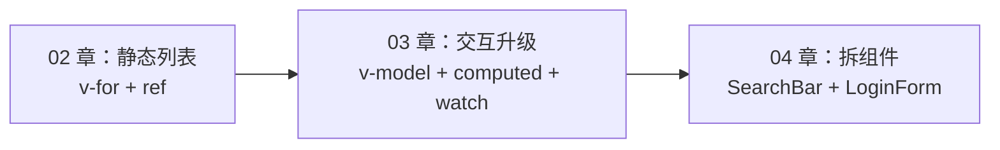
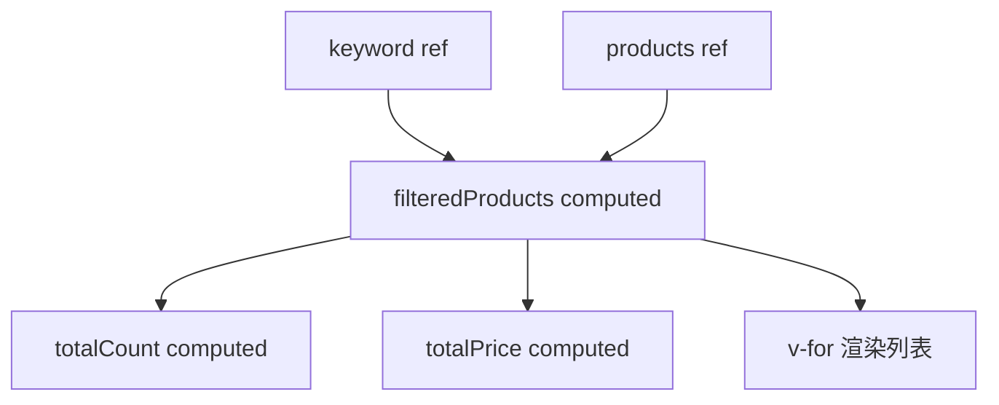

# 计算属性、侦听器与表单绑定

<!-- 修改说明: 2026-06-30 按 EXPANSION-STANDARD 扩充 §0 导读、DevTools、FAQ、闭卷自测、费曼检验 -->

## 0. 读前导读（零基础也能跟上）

> **读者假设**：02 章已完成静态商品列表。本章学 **v-model、computed、watch**，把 shop-vue 升级为可搜索、可填表、可校验的交互页。

### 0.1 用一句话弄懂本章

**一句话**：`v-model` 让输入框和数据双向同步；`computed` 根据数据**自动算出**展示结果（带缓存）；`watch` 在数据变化时**执行副作用**（搜素、存 localStorage、调接口）。

**生活类比**：

| API | 类比 |
|-----|------|
| **v-model** | 对讲机：你说一句，对方听见；对方回一句，你也听见 |
| **computed** | 收银台自动小计：商品变了，总价自己重算 |
| **watch** | 保安：有人进门（数据变）就登记或报警 |

**为什么重要**：搜索过滤、登录表单是商城标配；03 章表单字段与 [Java 04 登录 DTO](../../后端学习/Java/04-SpringBoot核心开发.md) 对齐后，08 章 `axios.post` 即可联调。

---

### 0.2 你需要提前知道什么

| 水平 | 建议 |
|------|------|
| 02 章 v-for/ref 不熟 | 先完成 [02-模板语法与响应式原理](./02-模板语法与响应式原理.md) §15 |
| 不懂 JS 数组 filter | 补 [06-JS 基础 §13](../HTML%20CSS%20JS/06-JavaScript基础语法与数据类型.md) |
| 已会 02 章列表页 | **从 §2 v-model 跟做 §12 实操** |

---

### 0.3 本章知识地图（☐→☑）

- [ ] 熟练使用 `v-model` 及 `.trim`、`.number`、`.lazy`
- [ ] 用 `computed` 做搜索过滤、统计、排序（理解缓存）
- [ ] 区分 computed vs methods vs watch
- [ ] 用 `watch` 做防抖搜索、localStorage 持久化
- [ ] 写带 `@submit.prevent` 和前端校验的登录表单
- [ ] 完成 shop-vue §12 搜索 + 登录升级
- [ ] 知道 loginForm 字段与 Java 04 `@RequestBody` DTO 对应关系
- [ ] DevTools 里改 `keyword` 看 computed 列表变化
- [ ] 闭卷自测 ≥ 8/10

---

### 0.4 建议学习时长

| 阶段 | 时间 |
|------|------|
| v-model + computed §2～§4 | 2 小时 |
| watch + 表单 §5～§9 | 2 小时 |
| §12 shop-vue 实操 | 2 小时 |
| 自测 | 45 分钟 |

---

### 0.5 可验证成果

1. 搜索框输入关键字，商品列表实时过滤（computed）。
2. 登录表单空用户名提交，显示错误提示且不刷新页面。
3. 口述：为何密码不能 watch 存 localStorage；后端 [Java 04](../../后端学习/Java/04-SpringBoot核心开发.md) 仍要 `@Valid` 校验。

---

### 0.6 核心术语三件套

**术语（v-model 双向绑定）**：表单控件值与 ref/reactive 属性同步，改任一方另一方更新。
**生活类比**：对讲机——你说一句对方听见，对方回一句你也听见。
**为什么重要**：搜索框、登录、数量输入的基础；04 章组件 v-model 是它的扩展。
**本章用到的地方**：§2、§7 登录表单。

**术语（computed 计算属性）**：根据响应式依赖**同步**算出派生值，依赖不变则缓存上次结果。
**生活类比**：收银台小计——商品变了总价才重算，没人动就显示上次数字。
**为什么重要**：过滤列表、统计数量、禁用按钮条件都应用 computed，避免模板里堆逻辑。
**本章用到的地方**：§3、§10、§12 实操。

**术语（watch 侦听器）**：指定数据源变化时执行**副作用**（请求、日志、localStorage）。
**生活类比**：保安——有人进门（数据变）才登记或报警，不是一直算总数。
**为什么重要**：防抖搜索、持久化购物车草稿；与 computed 分工是 Vue 面试高频题。
**本章用到的地方**：§4、§5、§11。

---

## 本章与上一章的关系

02 章你在 `shop-vue` 里用 `v-for` 渲染了静态商品列表，用 `ref` 存商品数据和 `cartCount`，用 `@click` 触发加入购物车。页面能「展示」，但还缺三类真实交互：

1. **搜索框**：用户输入关键词，列表实时过滤
2. **统计信息**：过滤后多少件、总价多少——依赖搜索词和商品列表**派生**出来
3. **表单**：登录、注册、收货地址——输入框和 JS 数据要**双向同步**，还要校验

这一章引入 **v-model（双向绑定）**、**computed（计算属性）**、**watch（侦听器）**，把 02 章的商品列表页升级成「可搜索、可统计、可提交表单」的页面。04 章再把搜索栏、登录表单拆成独立组件。



**前置检查**：

- 02 章 `App.vue` 商品列表能正常显示
- 理解 `ref` 在 script 里要 `.value`
- 终端 `npm run dev` 正常运行

---

## 1. 单向数据流回顾：为什么需要 v-model

02 章的数据流是**单向**的：

```text
父数据 products → 模板渲染 → 用户点击 → 调方法改 cartCount
```

搜索框、登录框需要**反向**：

```text
用户键盘输入 → 更新 keyword / form.username → 模板自动刷新
```

如果只用 `:value` + `@input` 可以手动实现，但写法啰嗦。**v-model** 是语法糖，把「绑定值 + 监听输入」合成一行。

---

## 2. v-model 双向绑定

### 2.1 基本用法

```vue
<script setup>
import { ref } from 'vue'

const keyword = ref('')
const username = ref('')
</script>

<template>
  <input v-model="keyword" placeholder="搜索商品" />
  <p>你输入的是：{{ keyword }}</p>

  <input v-model="username" placeholder="用户名" />
</template>
```

**效果**：输入框文字变 → `keyword` 变；代码里 `keyword.value = 'Vue'` → 输入框文字变。

### 2.2 本质：v-model 是什么语法糖

`v-model="keyword"` 编译后等价于：

```html
<input
  :value="keyword"
  @input="keyword = $event.target.value"
/>
```

Vue 3 对不同类型组件/元素有统一的 **`modelValue` + `update:modelValue`** 约定（04 章自定义组件会用到）。

### 2.3 修饰符

| 修饰符 | 作用 | 示例 |
|--------|------|------|
| `.lazy` | 改 `change` 事件再同步 | `v-model.lazy="keyword"` |
| `.trim` | 去首尾空格 | `v-model.trim="username"` |
| `.number` | 输入转数字 | `v-model.number="age"` |

```vue
<template>
  <input v-model.trim="keyword" placeholder="搜索（自动 trim）" />
  <input v-model.number="quantity" type="number" />
</template>
```

**为什么搜索要 trim？** 用户复制粘贴 `"  Java  "`，不 trim 会搜不到 `Java 书籍`。

### 2.4 表单相关元素的 v-model

#### 文本

```html
<input v-model="text" />
<textarea v-model="desc"></textarea>
```

#### 复选框

```vue
<script setup>
const agree = ref(false)           // 单个 checkbox
const hobbies = ref([])            // 多个 checkbox
</script>

<template>
  <label><input type="checkbox" v-model="agree" /> 同意协议</label>

  <label><input type="checkbox" value="book" v-model="hobbies" /> 图书</label>
  <label><input type="checkbox" value="digital" v-model="hobbies" /> 数码</label>
  <p>已选：{{ hobbies }}</p>
</template>
```

#### 单选

```vue
<script setup>
const payMethod = ref('alipay')
</script>

<template>
  <label><input type="radio" value="alipay" v-model="payMethod" /> 支付宝</label>
  <label><input type="radio" value="wechat" v-model="payMethod" /> 微信</label>
</template>
```

#### 下拉

```vue
<select v-model="category">
  <option value="all">全部分类</option>
  <option value="book">图书</option>
  <option value="digital">数码</option>
</select>
```

---

## 3. 计算属性 computed

### 3.1 解决什么问题

模板里可以写表达式，但复杂逻辑不应堆在模板里：

```html
<!-- 不推荐：又长又每次 render 都算 -->
<p>{{ products.filter(p => p.name.includes(keyword)).length }}</p>
```

**computed** = 根据响应式依赖**自动计算**的派生值，且有**缓存**。

### 3.2 基本语法

```vue
<script setup>
import { ref, computed } from 'vue'

const products = ref([
  { id: 1, name: 'Java 编程思想', price: 99, stock: 10 },
  { id: 2, name: 'Spring Boot 实战', price: 79, stock: 0 },
  { id: 3, name: 'Vue 3 设计与实现', price: 89, stock: 5 },
])
const keyword = ref('')

const filteredProducts = computed(() => {
  const kw = keyword.value.trim().toLowerCase()
  if (!kw) return products.value
  return products.value.filter(p =>
    p.name.toLowerCase().includes(kw)
  )
})

const totalCount = computed(() => filteredProducts.value.length)

const totalPrice = computed(() =>
  filteredProducts.value.reduce((sum, p) => sum + p.price, 0)
)
</script>

<template>
  <input v-model.trim="keyword" placeholder="搜索商品名" />
  <p>共 {{ totalCount }} 件，合计 ¥{{ totalPrice.toFixed(2) }}</p>
  <div v-for="p in filteredProducts" :key="p.id">{{ p.name }}</div>
</template>
```

### 3.3 缓存机制：computed vs methods

| 对比项 | computed | methods |
|--------|----------|---------|
| 调用方式 | `filteredProducts`（属性） | `filterProducts()`（函数） |
| 缓存 | 依赖不变则返回缓存 | 每次调用都执行 |
| 适用 | 派生数据、过滤、统计 | 事件处理、无缓存计算 |
| 是否应有副作用 | ❌ 不应调接口、改 DOM | 可以（但不推荐滥用） |

**真实案例**：商品列表页顶部「共 N 件 / 合计 ¥X」——用 computed；按钮 `@click="addToCart"`——用 method。



### 3.4 可写 computed（了解）

多数时候 computed 只读；特殊场景需要 getter + setter：

```js
const fullName = computed({
  get() {
    return `${firstName.value} ${lastName.value}`
  },
  set(val) {
    const parts = val.split(' ')
    firstName.value = parts[0]
    lastName.value = parts[1] || ''
  },
})
```

商城场景少用，知道即可。

### 3.5 computed 里常见错误

```js
// ❌ 忘记 .value
const bad = computed(() => keyword.trim())

// ✅
const good = computed(() => keyword.value.trim())
```

---

## 4. 侦听器 watch

### 4.1 什么时候用 watch 而不是 computed

| 场景 | 用谁 |
|------|------|
| 根据 A、B 算出 C 展示 | computed |
| A 变化时**打日志、调接口、写 localStorage** | watch |
| 异步操作、防抖搜索 | watch |

**原则**：能 computed 就算出来展示；需要**副作用**才 watch。

### 4.2 侦听 ref

```vue
<script setup>
import { ref, watch } from 'vue'

const keyword = ref('')

watch(keyword, (newVal, oldVal) => {
  console.log(`搜索词：${oldVal} → ${newVal}`)
  // 08 章：这里 axios 调搜索接口
})
</script>
```

### 4.3 选项：immediate 与 deep

```js
watch(keyword, (val) => {
  console.log('当前', val)
}, { immediate: true })  // 立即执行一次

watch(
  () => form.user,
  (user) => { /* ... */ },
  { deep: true }  // 深度侦听对象内部变化
)
```

### 4.4 侦听多个来源

```js
watch([keyword, category], ([kw, cat]) => {
  console.log('筛选条件', kw, cat)
})
```

### 4.5 watchEffect（自动收集依赖）

```vue
<script setup>
import { ref, watchEffect } from 'vue'

const keyword = ref('')
const category = ref('all')

watchEffect(() => {
  console.log(`当前筛选：${category.value} + ${keyword.value}`)
  // 用到谁就会侦听谁
})
</script>
```

**对比**：

- `watch`：明确指定侦听源，可拿 oldValue
- `watchEffect`：自动追踪函数内用到的响应式数据，立即运行

---

## 5. 防抖搜索：watch 真实案例

用户每敲一个字就过滤，小列表没问题；接接口时会造成**请求风暴**。用 300ms 防抖：

```vue
<script setup>
import { ref, watch, computed } from 'vue'

const keyword = ref('')
const debouncedKeyword = ref('')
let timer = null

watch(keyword, (val) => {
  clearTimeout(timer)
  timer = setTimeout(() => {
    debouncedKeyword.value = val
  }, 300)
})

const products = ref([
  { id: 1, name: 'Java 书籍', price: 99 },
  { id: 2, name: 'Vue 实战', price: 79 },
])

const filteredProducts = computed(() => {
  const kw = debouncedKeyword.value.trim().toLowerCase()
  if (!kw) return products.value
  return products.value.filter(p => p.name.toLowerCase().includes(kw))
})
</script>
```

**为什么不用 computed 直接绑 keyword？** 本地小列表可以直接绑；防抖是**延迟更新 debouncedKeyword**，computed 依赖 debounced 即可。08 章还会讲 `@vueuse/core` 的 `useDebounceFn`。

---

## 6. 表单处理与 @submit.prevent

### 6.1 阻止页面刷新

原生 form 提交会刷新页面（整页 reload），SPA 必须阻止：

```html
<form @submit.prevent="onSubmit">
  <button type="submit">登录</button>
</form>
```

等价于 `@submit` + `event.preventDefault()`。

### 6.2 为什么前端校验了后端还要校验

| 层级 | 目的 |
|------|------|
| 前端 | 即时反馈、减少无效请求、提升体验 |
| 后端 | **安全**——前端可被绕过，必须 `@Valid` 再验一遍（后端 04 章） |

**真实事故**：只在前端限制密码长度，攻击者直接 Postman 发 1 位密码——后端不验就入库。

---

## 7. 登录表单完整示例

```vue
<script setup>
import { reactive, ref } from 'vue'

const form = reactive({
  username: '',
  password: '',
  remember: false,
})

const errors = ref({})
const loading = ref(false)

function validate() {
  errors.value = {}
  if (!form.username.trim()) {
    errors.value.username = '请输入用户名'
  }
  if (!form.password) {
    errors.value.password = '请输入密码'
  } else if (form.password.length < 6) {
    errors.value.password = '密码至少 6 位'
  }
  return Object.keys(errors.value).length === 0
}

function onSubmit() {
  if (!validate()) return
  loading.value = true
  // 08 章替换为 axios.post('/api/login', form)
  setTimeout(() => {
    loading.value = false
    alert(`登录成功：${form.username}`)
  }, 800)
}
</script>

<template>
  <form class="login-form" @submit.prevent="onSubmit">
    <h2>用户登录</h2>

    <div class="field">
      <label>用户名</label>
      <input v-model.trim="form.username" placeholder="请输入用户名" />
      <p v-if="errors.username" class="err">{{ errors.username }}</p>
    </div>

    <div class="field">
      <label>密码</label>
      <input v-model="form.password" type="password" placeholder="至少 6 位" />
      <p v-if="errors.password" class="err">{{ errors.password }}</p>
    </div>

    <label class="remember">
      <input type="checkbox" v-model="form.remember" /> 记住我
    </label>

    <button type="submit" class="btn" :disabled="loading">
      {{ loading ? '登录中...' : '登录' }}
    </button>
  </form>
</template>

<style scoped>
.login-form {
  max-width: 360px;
  margin: 40px auto;
  padding: 32px;
  background: #fff;
  border-radius: 12px;
  box-shadow: 0 4px 20px rgba(0, 0, 0, 0.06);
}
.field {
  margin-bottom: 16px;
}
.field label {
  display: block;
  margin-bottom: 6px;
  font-size: 14px;
}
.field input {
  width: 100%;
  padding: 10px 12px;
  border: 1px solid #d1d5db;
  border-radius: 8px;
  box-sizing: border-box;
}
.err {
  color: #e74c3c;
  font-size: 12px;
  margin: 4px 0 0;
}
.remember {
  display: flex;
  align-items: center;
  gap: 8px;
  margin-bottom: 20px;
  font-size: 14px;
}
.btn {
  width: 100%;
  padding: 12px;
  border: none;
  border-radius: 8px;
  background: #42b983;
  color: #fff;
  cursor: pointer;
}
.btn:disabled {
  opacity: 0.6;
  cursor: not-allowed;
}
</style>
```

### 7.1 登录表单逐行读与 Java 04 字段对照

| 行号/代码 | 含义 | 改错会怎样 |
|-----------|------|------------|
| `reactive({ username, password })` | 表单对象一次绑定多字段 | 每个 input 单独 ref 也能用但啰嗦 |
| `v-model.trim="form.username"` | 双向绑定并去空格 | 忘 trim 搜索/登录可能带空格失败 |
| `errors = ref({})` | 字段级错误信息 | 用 reactive 也行，ref 便于整体替换 |
| `validate()` | 提交前前端校验 | 只做前端校验不安全，后端 [Java 04 @Valid](../../后端学习/Java/04-SpringBoot核心开发.md) 必做 |
| `@submit.prevent="onSubmit"` | 阻止整页刷新 | 漏 prevent 表单默认 GET/POST 刷新 |
| `loading.value = true` | 按钮 loading 态 | 08 章 axios  finally 里改 false |
| `setTimeout` 模拟 | 占位异步 | 08 章换 `axios.post('/api/auth/login', form)` |

**Java 04 联调 Checklist**：

| 前端 form 字段 | 后端 DTO | 说明 |
|----------------|----------|------|
| `username` | `username` | `@RequestBody` JSON 键名一致 |
| `password` | `password` | 永不存 localStorage |
| — | `Result<UserVO>` | 前端判断 `res.data.code === 0` |

---

## 8. 注册表单：更多控件

```vue
<script setup>
import { reactive, ref } from 'vue'

const form = reactive({
  username: '',
  email: '',
  password: '',
  confirm: '',
  gender: 'male',
  role: 'buyer',
})

const errors = ref({})

function validate() {
  errors.value = {}
  if (!form.username.trim()) errors.value.username = '必填'
  if (!form.email.includes('@')) errors.value.email = '邮箱格式不对'
  if (form.password.length < 6) errors.value.password = '密码至少 6 位'
  if (form.password !== form.confirm) errors.value.confirm = '两次密码不一致'
  return Object.keys(errors.value).length === 0
}
</script>

<template>
  <form @submit.prevent="validate() && alert('注册成功')">
    <input v-model.trim="form.username" placeholder="用户名" />
    <input v-model="form.email" placeholder="邮箱" />
    <input v-model="form.password" type="password" placeholder="密码" />
    <input v-model="form.confirm" type="password" placeholder="确认密码" />

    <label><input type="radio" value="male" v-model="form.gender" /> 男</label>
    <label><input type="radio" value="female" v-model="form.gender" /> 女</label>

    <select v-model="form.role">
      <option value="buyer">买家</option>
      <option value="seller">卖家</option>
    </select>
  </form>
</template>
```

---

## 9. 实时校验 vs 提交时校验

| 策略 | 做法 | 体验 |
|------|------|------|
| 提交时校验 | 只在 `onSubmit` 里 `validate()` | 简单，初学推荐 |
| 失焦校验 | `@blur="validateField('username')"` | 中等 |
| 实时校验 | `watch(() => form.username, ...)` | 即时反馈，注意性能 |

```js
watch(
  () => form.password,
  (pwd) => {
    if (pwd && pwd.length < 6) {
      errors.value.password = '密码至少 6 位'
    } else {
      delete errors.value.password
    }
  }
)
```

---

## 10. 搜索 + 分类 + 排序：computed 组合

```vue
<script setup>
import { ref, computed } from 'vue'

const keyword = ref('')
const category = ref('all')
const sortBy = ref('default')

const products = ref([
  { id: 1, name: 'Java 书', price: 99, category: 'book', stock: 5 },
  { id: 2, name: '键盘', price: 299, category: 'digital', stock: 2 },
  { id: 3, name: 'Vue 书', price: 79, category: 'book', stock: 0 },
])

const displayedProducts = computed(() => {
  let list = [...products.value]

  const kw = keyword.value.trim().toLowerCase()
  if (kw) {
    list = list.filter(p => p.name.toLowerCase().includes(kw))
  }

  if (category.value !== 'all') {
    list = list.filter(p => p.category === category.value)
  }

  if (sortBy.value === 'price-asc') {
    list.sort((a, b) => a.price - b.price)
  } else if (sortBy.value === 'price-desc') {
    list.sort((a, b) => b.price - a.price)
  } else {
    list.sort((a, b) => {
      if (a.stock === 0 && b.stock > 0) return 1
      if (a.stock > 0 && b.stock === 0) return -1
      return a.id - b.id
    })
  }

  return list
})
</script>
```

**为什么用 `[...products.value]` 再 sort？** `sort` 会**原地修改**数组，可能污染源数据；拷贝后排序更安全。

---

## 11. localStorage 持久化：watch 案例

```vue
<script setup>
import { ref, watch } from 'vue'

const keyword = ref(localStorage.getItem('shop-keyword') || '')

watch(keyword, (val) => {
  localStorage.setItem('shop-keyword', val)
})
</script>
```

**注意**：07 章 Pinia 更适合管理「购物车、用户信息」等全局状态；这里演示 watch 副作用。

---

## 12. 手把手实操：升级 shop-vue 为可搜索商城页

在 02 章商品列表基础上，增加搜索栏、统计条、简单登录表单（同页 Tab 切换，04 章再拆组件）。

### 12.1 目标

- 顶部搜索框 `v-model` + computed 过滤
- 显示「共 N 件 / 合计 ¥X」
- 下方 Tab：「商品列表 | 用户登录」
- 登录表单带校验与 loading

### 12.2 完整 App.vue（整文件替换）

```vue
<script setup>
import { ref, computed, reactive, watch } from 'vue'

const activeTab = ref('products')
const shopName = ref('shop-vue 练习商城')
const keyword = ref('')
const cartCount = ref(0)

const products = ref([
  { id: 1, name: 'Java 编程思想', price: 99, stock: 10, category: 'book', isHot: true, img: 'https://via.placeholder.com/160?text=Java' },
  { id: 2, name: 'Spring Boot 实战', price: 79, stock: 0, category: 'book', isHot: false, img: 'https://via.placeholder.com/160?text=Spring' },
  { id: 3, name: 'Redis 设计与实现', price: 89, stock: 3, category: 'book', isHot: true, img: 'https://via.placeholder.com/160?text=Redis' },
  { id: 4, name: '机械键盘 K87', price: 299, stock: 5, category: 'digital', isHot: false, img: 'https://via.placeholder.com/160?text=Key' },
])

const category = ref('all')

const filteredProducts = computed(() => {
  let list = products.value
  const kw = keyword.value.trim().toLowerCase()
  if (kw) {
    list = list.filter(p => p.name.toLowerCase().includes(kw))
  }
  if (category.value !== 'all') {
    list = list.filter(p => p.category === category.value)
  }
  return list
})

const stats = computed(() => ({
  count: filteredProducts.value.length,
  total: filteredProducts.value.reduce((s, p) => s + p.price, 0),
}))

watch(keyword, (val) => {
  console.log('[watch] 搜索词变化：', val)
})

function formatPrice(n) {
  return n.toFixed(2)
}

function addToCart(p) {
  if (p.stock <= 0) return
  cartCount.value++
  alert(`已加入：${p.name}`)
}

function getCategoryLabel(c) {
  return { book: '图书', digital: '数码' }[c] || '其他'
}

/* ---------- 登录表单 ---------- */
const loginForm = reactive({ username: '', password: '', remember: false })
const loginErrors = ref({})
const loginLoading = ref(false)

function validateLogin() {
  loginErrors.value = {}
  if (!loginForm.username.trim()) loginErrors.value.username = '请输入用户名'
  if (!loginForm.password) loginErrors.value.password = '请输入密码'
  else if (loginForm.password.length < 6) loginErrors.value.password = '密码至少 6 位'
  return Object.keys(loginErrors.value).length === 0
}

function onLoginSubmit() {
  if (!validateLogin()) return
  loginLoading.value = true
  setTimeout(() => {
    loginLoading.value = false
    alert(`登录成功：${loginForm.username}`)
  }, 600)
}
</script>

<template>
  <div class="page">
    <header class="header">
      <div>
        <h1>{{ shopName }}</h1>
        <p class="sub">第 03 章 · v-model · computed · watch</p>
      </div>
      <span class="badge">🛒 {{ cartCount }}</span>
    </header>

    <nav class="tabs">
      <button :class="{ active: activeTab === 'products' }" @click="activeTab = 'products'">商品列表</button>
      <button :class="{ active: activeTab === 'login' }" @click="activeTab = 'login'">用户登录</button>
    </nav>

    <!-- 商品 Tab -->
    <main v-show="activeTab === 'products'" class="main">
      <section class="toolbar">
        <input v-model.trim="keyword" class="search" placeholder="搜索商品名称..." />
        <select v-model="category" class="select">
          <option value="all">全部分类</option>
          <option value="book">图书</option>
          <option value="digital">数码</option>
        </select>
      </section>

      <p class="stats">
        共 <strong>{{ stats.count }}</strong> 件，
        合计 <strong>¥{{ formatPrice(stats.total) }}</strong>
        <span v-if="keyword">（关键词：{{ keyword }}）</span>
      </p>

      <div class="grid">
        <article
          v-for="p in filteredProducts"
          :key="p.id"
          class="card"
          :class="{ 'card--sold': p.stock === 0 }"
        >
          
          <span v-if="p.isHot" class="hot">热卖</span>
          <span class="cat">{{ getCategoryLabel(p.category) }}</span>
          <h3>{{ p.name }}</h3>
          <p class="price">¥{{ formatPrice(p.price) }}</p>
          <p v-if="p.stock > 0" class="stock">库存 {{ p.stock }}</p>
          <p v-else class="sold">售罄</p>
          <button :disabled="p.stock === 0" @click="addToCart(p)">加入购物车</button>
        </article>
      </div>

      <p v-if="filteredProducts.length === 0" class="empty">没有匹配的商品</p>
    </main>

    <!-- 登录 Tab -->
    <main v-show="activeTab === 'login'" class="main">
      <form class="login" @submit.prevent="onLoginSubmit">
        <h2>登录 shop-vue</h2>
        <div class="field">
          <input v-model.trim="loginForm.username" placeholder="用户名" />
          <p v-if="loginErrors.username" class="err">{{ loginErrors.username }}</p>
        </div>
        <div class="field">
          <input v-model="loginForm.password" type="password" placeholder="密码（≥6位）" />
          <p v-if="loginErrors.password" class="err">{{ loginErrors.password }}</p>
        </div>
        <label><input type="checkbox" v-model="loginForm.remember" /> 记住我</label>
        <button type="submit" :disabled="loginLoading">
          {{ loginLoading ? '登录中...' : '登录' }}
        </button>
      </form>
    </main>
  </div>
</template>

<style scoped>
.page { min-height: 100vh; background: #f5f7fa; font-family: system-ui, sans-serif; }
.header { display: flex; justify-content: space-between; align-items: center; padding: 20px 24px; background: #fff; border-bottom: 1px solid #e5e7eb; }
.sub { color: #6b7280; font-size: 13px; }
.badge { background: #42b983; color: #fff; padding: 6px 14px; border-radius: 999px; }
.tabs { display: flex; gap: 8px; padding: 12px 24px; background: #fff; }
.tabs button { padding: 8px 16px; border: 1px solid #e5e7eb; background: #fff; border-radius: 8px; cursor: pointer; }
.tabs button.active { background: #42b983; color: #fff; border-color: #42b983; }
.main { padding: 20px 24px; }
.toolbar { display: flex; gap: 12px; margin-bottom: 12px; }
.search { flex: 1; max-width: 400px; padding: 10px 12px; border: 1px solid #d1d5db; border-radius: 8px; }
.select { padding: 10px; border-radius: 8px; }
.stats { margin-bottom: 16px; color: #374151; }
.grid { display: grid; grid-template-columns: repeat(auto-fill, minmax(200px, 1fr)); gap: 16px; }
.card { background: #fff; padding: 14px; border-radius: 10px; border: 1px solid #e5e7eb; position: relative; }
.card img { width: 100%; border-radius: 6px; }
.card--sold { opacity: 0.6; }
.hot { font-size: 11px; background: #fee2e2; color: #dc2626; padding: 2px 6px; border-radius: 4px; }
.cat { font-size: 11px; background: #e0f2fe; color: #0369a1; padding: 2px 6px; border-radius: 4px; margin-left: 4px; }
.price { color: #e74c3c; font-weight: 700; }
.stock { color: #059669; font-size: 13px; }
.sold { color: #9ca3af; }
.card button { width: 100%; margin-top: 8px; padding: 8px; border: none; border-radius: 6px; background: #42b983; color: #fff; cursor: pointer; }
.card button:disabled { background: #d1d5db; cursor: not-allowed; }
.empty { text-align: center; color: #9ca3af; padding: 40px; }
.login { max-width: 360px; margin: 0 auto; background: #fff; padding: 28px; border-radius: 12px; }
.field { margin-bottom: 12px; }
.field input { width: 100%; padding: 10px; box-sizing: border-box; border: 1px solid #d1d5db; border-radius: 8px; }
.err { color: #e74c3c; font-size: 12px; margin: 4px 0 0; }
.login button { width: 100%; margin-top: 16px; padding: 10px; background: #42b983; color: #fff; border: none; border-radius: 8px; cursor: pointer; }
</style>
```

### 12.3 验证清单

| 操作 | 预期 |
|------|------|
| 输入 `Java` | 只显示 Java 相关商品，stats 更新 |
| 选分类「数码」 | 只显示键盘 |
| 搜不存在词 | 「没有匹配的商品」 |
| 切登录 Tab | 空提交 → 红色错误 |
| 正确登录 | loading → alert 成功 |
| F12 Console | 输入搜索词有 watch 日志 |

---

## 13. computed 链式依赖

```js
const filtered = computed(() => { /* ... */ })
const pageCount = computed(() => Math.ceil(filtered.value.length / pageSize.value))
const pagedList = computed(() => {
  const start = (currentPage.value - 1) * pageSize.value
  return filtered.value.slice(start, start + pageSize.value)
})
```

Vue 会按依赖关系缓存，**不要**在 computed 里做无限循环依赖。

---

## 14. 数量输入：v-model.number

```vue
<script setup>
import { ref, computed } from 'vue'
const qty = ref(1)
const price = ref(99)
const lineTotal = computed(() => qty.value * price.value)
</script>

<template>
  <input v-model.number="qty" type="number" min="1" />
  <p>小计：¥{{ lineTotal }}</p>
</template>
```

**坑**：`v-model.number` 遇到空字符串会得到 `NaN`，提交前要校验。

---

## 15. 与 Spring Boot 登录接口的字段对应（预习）

| 前端 loginForm | 后端 DTO | Java 04 说明 |
|----------------|----------|--------------|
| `username` | `username` / `name` | `@RequestBody LoginDTO` |
| `password` | `password` | `@NotBlank` 后端再校验 |
| — | `Result<T>` 统一返回 | `code=0` 成功，`code=1` 业务错误 |

08 章 `axios.post('/api/auth/login', loginForm)` 替换 `setTimeout` 模拟即可。完整 Controller 写法见 [Java 04 Spring Boot 核心开发](../../后端学习/Java/04-SpringBoot核心开发.md) §3～§7。

---

## 15.1 DevTools 调试 v-model 与 computed（步骤表）

| 步骤 | 动作 | 预期 | 若不对 |
|------|------|------|--------|
| 1 | F12 → Vue → App | 有 `keyword`、`filteredProducts` | 完成 §12 实操 |
| 2 | 搜索框输入「手机」 | `keyword` 变；列表条数减少 | 检查 v-model 绑定 |
| 3 | 看 computed 或 setup 里过滤结果 | 只剩名称含「手机」的项 | computed 依赖 keyword |
| 4 | 清空搜索框 | 列表恢复 | computed 重新计算 |
| 5 | 改 loginForm.username | 输入框文字同步 | v-model 双向 |
| 6 | Network（08 章）POST login | 见 Java 04 返回 JSON | 本章可跳过 |

---

## 16. 模板里该用 computed 还是 method

| 需求 | 选择 |
|------|------|
| 列表过滤结果 | computed |
| 格式化价格 `formatPrice(p.price)` | method（纯函数，依赖参数） |
| 点击「加入购物车」 | method |
| 是否显示空状态 | computed `isEmpty` |

---

## 17. watch 清理副作用

```js
import { watch, onUnmounted } from 'vue'

let timer = null
watch(keyword, (val) => {
  clearTimeout(timer)
  timer = setTimeout(() => doSearch(val), 300)
})

onUnmounted(() => {
  clearTimeout(timer)
})
```

组件销毁时清定时器，避免内存泄漏——05 章生命周期会再强调。

---

## 18. 分级练习

### 18.1 基础：搜索 + computed

**要求**：仅搜索框 + 过滤商品名，显示件数。

<details>
<summary>参考答案</summary>

见本文 §3.2 完整示例。

</details>

### 18.2 进阶：登录校验

**要求**：用户名非空、密码 ≥6 位，错误信息显示在输入框下方。

<details>
<summary>参考答案</summary>

见本文 §7 登录表单完整示例。

</details>

### 18.3 挑战：300ms 防抖 + computed

**要求**：watch keyword 防抖后更新 `debouncedKeyword`，computed 依赖 debounced。

<details>
<summary>参考答案</summary>

见本文 §5 防抖搜索完整代码。

</details>

### 18.4 挑战：价格区间筛选

**要求**：两个 `v-model.number` 输入最低价/最高价，computed 过滤。

<details>
<summary>参考答案</summary>

```vue
<script setup>
import { ref, computed } from 'vue'
const minPrice = ref(0)
const maxPrice = ref(9999)
const products = ref([/* ... */])

const filtered = computed(() =>
  products.value.filter(p =>
    p.price >= minPrice.value && p.price <= maxPrice.value
  )
)
</script>
```

</details>

---

## 19. 常见报错与排查

| 报错/现象 | 可能原因 | 解决方案 |
|-----------|----------|----------|
| 输入框不能输入 | 只有 `:value` 无 `@input` | 改用 `v-model` |
| 输入框闪一下又回退 | 父组件 props 覆盖 | 子组件用本地 state + emit（04 章） |
| computed 不更新 | 依赖不是响应式 | 确保 ref/reactive |
| computed 里改其他状态 | 违反纯函数约定 | 改到 watch 或 method |
| watch 不触发 | 侦听普通变量 | 包 ref 或 getter 函数 |
| 表单提交刷新页面 | 未 prevent | `@submit.prevent` |
| checkbox 绑定异常 | 单个用 boolean，多个用 array | 见 §2.4 |
| `v-model.number` 得 NaN | 输入非数字 | 校验或默认值 |
| 深度 watch 死循环 | 在 callback 里改同一对象 | 加条件判断 |
| trim 后仍搜不到 | 数据源本身有空格 | 后端或入库时 trim |
| stats 不随筛选变 | computed 依赖写错 | 依赖 `filteredProducts` |
| ESLint 报 unused | 引入未使用 | 删除多余 import |

---

## 20. FAQ

**Q1：computed 和 watch 怎么选？**  
展示用 computed；副作用（请求、日志、存储）用 watch。

**Q2：v-model 能用在组件上吗？**  
能。04 章 `SearchBar` 可 `v-model:keyword` 或 props + emit。

**Q3：为什么 computed 里不要用 async？**  
computed 应同步返回值；异步用 watch + ref 存结果。

**Q4：登录密码要 watch 实时提示吗？**  
看产品；初学提交时校验即可。

**Q5：多个 computed 会重复计算吗？**  
有缓存；依赖不变不会重算。

**Q6：reactive 表单整对象 v-model 子字段行吗？**  
行，`v-model="form.username"` 直接绑定 reactive 属性。

**Q7：`.lazy` 修饰符干什么？**  
input 在 **change** 事件（失焦）时才更新 v-model，适合大表单减少计算次数。

**Q8：watch 能 watch 多个源吗？**  
可以 `watch([a, b], ([newA, newB]) => {...})` 或分开两个 watch。

**Q9：为什么前端校验了后端还要校验？**  
前端可绕过；[Java 04](../../后端学习/Java/04-SpringBoot核心开发.md) 的 `@Valid` 是安全底线。

**Q10：computed 里能调 axios 吗？**  
不要；异步放 watch 或 onMounted，结果存 ref，computed 只读 ref。

**Q11：防抖搜索为什么用 watch 不用 computed？**  
computed 同步；防抖要 delay 和 clearTimeout，属于副作用。

**Q12：radio/checkbox v-model 绑定什么类型？**  
单个 checkbox→boolean；多个→数组；radio→选中项的值。

---

## 21. 学完标准

- [ ] 熟练使用 `v-model` 及 `.trim`、`.number`、`.lazy`
- [ ] 会用 `computed` 做过滤、统计、排序
- [ ] 能区分 computed 与 methods，理解缓存
- [ ] 会用 `watch` / `watchEffect` 处理副作用
- [ ] 能写带校验、loading 的登录表单
- [ ] 完成 shop-vue §12 升级并验证清单
- [ ] 理解前后端双重校验的原因

---

## 22. 知识点清单

| 序号 | 知识点 | 自评 |
|------|--------|------|
| 1 | v-model 原理与语法糖 | ☐ |
| 2 | v-model 修饰符 | ☐ |
| 3 | 各类表单控件绑定 | ☐ |
| 4 | computed 定义与缓存 | ☐ |
| 5 | computed vs methods | ☐ |
| 6 | watch 基础与选项 | ☐ |
| 7 | watchEffect | ☐ |
| 8 | 防抖搜索模式 | ☐ |
| 9 | 表单 @submit.prevent | ☐ |
| 10 | 前端表单校验 | ☐ |
| 11 | 多条件 computed 组合 | ☐ |
| 12 | shop-vue 搜索+登录实操 | ☐ |

---

## 23. 闭卷自测

1. `v-model` 在原生 input 上本质是哪两个绑定的语法糖？
2. computed 的「缓存」是什么意思？依赖不变时会怎样？
3. watch 和 watchEffect 各适合什么场景？
4. `@submit.prevent` 解决什么问题？
5. 为什么 computed 里不宜写异步请求？
6. `.trim` 和 `.number` 修饰符各解决什么坑？
7. 前端 loginForm 与 Java 04 LoginDTO 为什么要字段名一致？
8. **动手**：给搜索加 300ms 防抖 watch。
9. **动手**：登录密码少于 6 位提交时显示错误。
10. **综合**：描述「用户输入关键字 → 列表变短」的数据流（v-model → ref → computed → v-for）。

### 23.1 自测参考答案

1. `:value` + `@input`（或 `:modelValue` + `@update:modelValue` 在组件上）。
2. 依赖 ref 不变则返回上次结果不重算；依赖变才重新执行函数。
3. watch 明确侦听源+可拿新旧值；watchEffect 自动收集依赖、立即跑一遍。
4. 阻止表单默认提交导致整页刷新。
5. computed 应同步纯函数；异步无法返回即时值且难缓存。
6. trim 去首尾空格；number 把字符串转数字，空串变 NaN 需校验。
7. JSON 键名一致，axios 直接 post 对象，后端 `@RequestBody` 才能映射。
8. `let timer; watch(keyword, v => { clearTimeout(timer); timer=setTimeout(()=>...,300) })`。
9. submit 里 `if (password.length<6) errors.password='至少6位'; return`。
10. 输入框 v-model keyword → keyword ref 变 → filteredProducts computed 重算 → template v-for 渲染新列表。

---

## 24. 费曼检验

3 分钟解释本章三件事：

1. **v-model**：输入框和变量绑在一起，改任一方另一方跟着变。
2. **computed**：像自动更新的 Excel 公式，适合「算出来给人看」。
3. **watch**：像闹钟，数据变了再去干别的事（搜素、存储）；表单以后 POST 给 Java 04 后端。

---

## 24.1 练习建议

| 级别 | 任务 | 验收 |
|------|------|------|
| 基础 | 搜索框 `.trim` + computed 过滤 | 空格不影响结果 |
| 进阶 | 分类 + 价格排序 computed 链 | stats 随筛选变 |
| 挑战 | watch 防抖 300ms + loading 态 | 快速输入只请求一次 |
| 联调 | 表单字段与 Java 04 LoginDTO 对齐 | Postman 能直接 POST 同 JSON |

### 24.2 computed vs watch vs method 决策树

```text
要展示在模板上的派生值？ → computed
要响应变化执行副作用（请求/存储/日志）？ → watch
带参数格式化（formatPrice(p.price)）？ → method
组件 v-model 双向？ → ref/reactive + v-model（03 章）
```

### 24.3 shop-vue 03 章完成自检

```text
☐ 搜索框 v-model keyword，filteredProducts 为 computed
☐ 登录表单 @submit.prevent，空用户名/短密码有 errors
☐ loading 态禁用提交按钮
☐ 可选：watch keyword 防抖或 localStorage 持久化 keyword
☐ loginForm 字段名与 Java 04 LoginDTO 一致（阅读 04 章 §3）
☐ DevTools 改 keyword 见列表条数变化
```

---

## 下一章预告

03 章把搜索栏、商品卡片、登录表单都写在 `App.vue` 里——文件越来越长。04 章教你拆成 `SearchBar.vue`、`ProductCard.vue`、`LoginForm.vue`，用 **props 传数据、emit 传事件**，建立单向数据流。这是写任何 Vue 项目的基本功。

---

*下一章：04 组件基础与组件通信*
