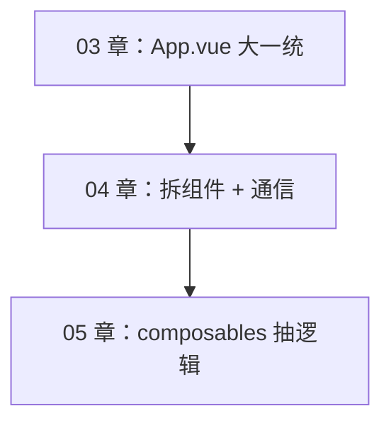
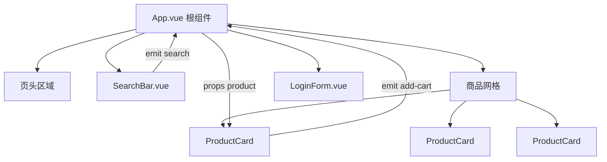
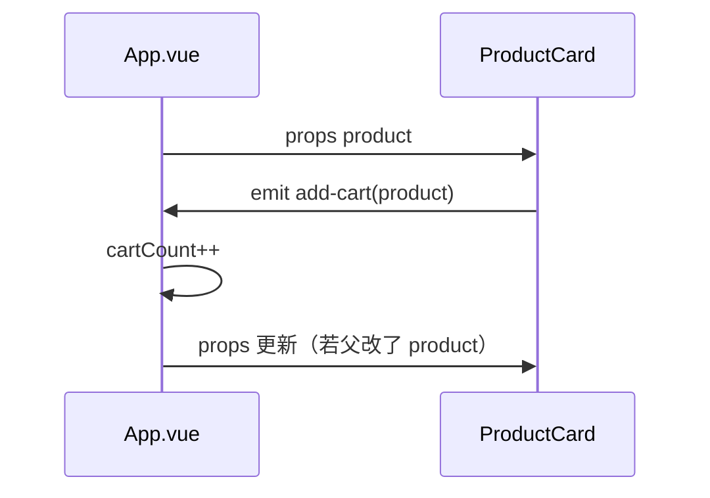

# 组件基础与组件通信

<!-- 修改说明: 2026-06-30 按 EXPANSION-STANDARD 扩充 §0 导读、DevTools、FAQ、闭卷自测、费曼检验 -->

## 0. 读前导读（零基础也能跟上）

> **读者假设**：03 章把搜索、登录都堆在 `App.vue`。本章拆成 `ProductCard`、`SearchBar`、`LoginForm` 等组件，学 **props 下传、emit 上报、单向数据流**。

### 0.1 用一句话弄懂本章

**一句话**：页面拆成多个 `.vue` 文件；父组件用 **props** 给子组件传数据，子组件用 **emit** 通知父组件改数据——数据永远从父流向子，子不直接改 props。

**生活类比——公司汇报链**：

| 概念 | 类比 |
|------|------|
| **App.vue（父）** | 部门经理，握有真实数据 |
| **ProductCard（子）** | 员工，只接收任务单（props） |
| **emit** | 员工填完回执交给经理 |
| **单向数据流** | 任务单从经理下发，员工不能私自改存档 |

**为什么重要**：真实项目没有五千行的 App.vue；04 章拆法与 08 章调 [Java 04 API](../../后端学习/Java/04-SpringBoot核心开发.md) 时「容器组件拉数据、展示组件纯 UI」一致。

---

### 0.2 你需要提前知道什么

| 水平 | 建议 |
|------|------|
| 03 章 v-model/computed 不熟 | 先完成 [03-计算属性侦听器与表单绑定](./03-计算属性侦听器与表单绑定.md) |
| 不会 import 模块 | 补 [06-JS 基础 §3](../HTML%20CSS%20JS/06-JavaScript基础语法与数据类型.md) |
| 已会 03 章 | **从 §4 props 跟做 §6～§10** |

---

### 0.3 本章知识地图（☐→☑）

- [ ] 创建 `.vue` 并在父组件 import 注册
- [ ] `defineProps` / `defineEmits` 熟练使用
- [ ] 理解单向数据流，子组件不直接改 props
- [ ] `v-model:propName` 在自定义组件上的用法
- [ ] 完成 SearchBar + ProductCard + LoginForm + CartBadge
- [ ] 知道 provide/inject、slot、defineExpose 适用场景
- [ ] DevTools 里看到组件树层级与各组件 props
- [ ] 闭卷自测 ≥ 8/10

---

### 0.4 建议学习时长

| 阶段 | 时间 |
|------|------|
| props/emit §4～§5 | 1.5 小时 |
| 四个组件实操 §6～§10 | 3 小时 |
| 插槽/进阶 §14～§17 | 1 小时 |
| 自测 | 45 分钟 |

---

### 0.5 可验证成果

1. `App.vue` 代码行数明显减少，components 目录有 ≥4 个组件。
2. 点击 ProductCard「加入购物车」，App 里 cartCount 增加（emit 链路通）。
3. DevTools 组件树：App → SearchBar / ProductCard / LoginForm 层级清晰。

---

### 0.6 核心术语三件套

**术语（props 父传子）**：父组件向子组件传递只读数据。
**生活类比**：经理下发任务单——员工按单展示，不能私自改存档。
**为什么重要**：组件通信基础；08 章父组件从 Java 04 拉数据后通过 props 分给卡片。
**本章用到的地方**：§4、§6 ProductCard。

**术语（emit 子传父）**：子组件向父组件发送事件，附带 payload。
**生活类比**：员工填完回执交给经理——「加购了这件商品」。
**为什么重要**：子组件不直接改父 state，保持单向数据流可追踪。
**本章用到的地方**：§5、§6 add-cart。

**术语（单向数据流）**：数据从父流向子，子通过 emit 请求父更新。
**生活类比**：公司汇报链——预算（state）只由经理改，员工提申请（emit）。
**为什么重要**：Vue/React 共通架构原则；Pinia 是全局「经理办公室」。
**本章用到的地方**：§3、§11 通信全景。

---

## 本章与上一章的关系

03 章你在 `shop-vue` 的 `App.vue` 里实现了搜索过滤、统计条、登录表单、Tab 切换——功能完整，但**一个文件承担太多职责**：商品卡片 HTML 重复、搜索逻辑和列表耦在一起、登录表单无法复用到别的页面。

Vue 的核心工程化手段是**组件化**：每个 `.vue` 文件是一个独立、可复用、可测试的 UI 单元。这一章把 03 章的页面拆成：

```text
App.vue
├── SearchBar.vue       ← 搜索 + 分类
├── ProductCard.vue     ← 单个商品（v-for 复用 N 次）
├── LoginForm.vue       ← 登录表单
└── CartBadge.vue       ← 购物车角标
```

学会 **props 父→子**、**emit 子→父**、**单向数据流**，是后面 Router、Pinia、Element Plus 的基础。



**前置检查**：

- 03 章 shop-vue 搜索、登录功能正常
- 理解 `defineProps` 在 01 章已零星出现时可回看
- `src/components/` 目录已存在（脚手架自带）

---

## 1. 什么是组件

### 1.1 定义

组件 = 可复用的 Vue 实例，包含自己的 `<script>`、`<template>`、`<style scoped>`。

**类比后端**：一个组件像 Spring 里的一个「小 Controller + 小 DTO + 小模板片段」，但前后端一体封装在 `.vue` 里。

### 1.2 为什么要拆

| 不拆 | 拆组件后 |
|------|----------|
| `App.vue` 500+ 行 | 每个文件 50～120 行 |
| 改卡片样式要在大文件里找 | 只打开 `ProductCard.vue` |
| 登录表单无法复用 | `LoginForm` 挂到任意页 |
| 难以分工 | 多人并行改不同组件 |

### 1.3 组件树



---

## 2. 创建与注册组件

### 2.1 文件放哪

约定：`src/components/` 放**通用**组件；`src/views/` 放**页面级**组件（06 章 Router 用）。

```text
shop-vue/src/
├── components/
│   ├── SearchBar.vue
│   ├── ProductCard.vue
│   ├── LoginForm.vue
│   └── CartBadge.vue
├── App.vue
└── main.js
```

### 2.2 局部注册（本资料主力）

`<script setup>` 里 import 即可用，**无需** `components: { }` 选项：

```vue
<script setup>
import ProductCard from './components/ProductCard.vue'
</script>

<template>
  <ProductCard :product="p" />
</template>
```

### 2.3 全局注册（了解）

```js
// main.js — 仅极通用组件（如图标按钮）才全局注册
import BaseButton from './components/BaseButton.vue'
app.component('BaseButton', BaseButton)
```

**为什么不推荐滥用？** 隐式依赖、Tree-shaking 不友好、跳转定义麻烦。

---

## 3. 单向数据流

Vue 推荐：**数据从父到子用 props 流下去；子要改数据通过 emit 通知父改**。

```text
父 state (products, keyword)
    ↓ props
子组件展示
    ↓ emit('update')
父组件改 state
    ↓ props 自动更新
子组件重新渲染
```

**为什么？** 数据流向可预测，不会出现「多个子组件 secretly 改同一份数据」的调试噩梦。



---

## 4. props：父传子

### 4.1 基本用法

父：

```html
<ProductCard :product="p" :show-price="true" />
```

子 `ProductCard.vue`：

```vue
<script setup>
const props = defineProps({
  product: {
    type: Object,
    required: true,
  },
  showPrice: {
    type: Boolean,
    default: true,
  },
})
</script>

<template>
  <h3>{{ product.name }}</h3>
  <p v-if="showPrice">¥{{ product.price }}</p>
</template>
```

### 4.2 类型与校验

| 选项 | 作用 |
|------|------|
| `type` | `String/Number/Boolean/Array/Object/Function` |
| `required: true` | 必传，否则 dev 警告 |
| `default` | 默认值（对象/数组用工厂函数） |

```js
defineProps({
  count: { type: Number, default: 0 },
  tags: { type: Array, default: () => [] },
})
```

### 4.3 props 只读

```js
// ❌ 不要直接改 props
props.product.stock--

// ✅ 通知父组件
emit('update-stock', props.product.id, props.product.stock - 1)
```

**为什么？** 保证单一数据源在父级（或 Pinia），子组件保持纯展示 + 事件上报。

### 4.4 布尔 props 简写

```html
<ProductCard show-price />
<!-- 等价 :show-price="true" -->
```

### 4.5 传递多种类型

```html
:product="p"           <!-- 对象 -->
:price="99"            <!-- 数字 -->
:active="idx === 0"    <!-- 表达式 -->
```

---

## 5. emit：子传父

### 5.1 定义与触发

```vue
<script setup>
const props = defineProps({ product: Object })
const emit = defineEmits(['add-cart', 'view-detail'])

function onAdd() {
  if (props.product.stock <= 0) return
  emit('add-cart', props.product)
}

function onView() {
  emit('view-detail', props.product.id)
}
</script>

<template>
  <button @click="onAdd">加入购物车</button>
  <button @click="onView">详情</button>
</template>
```

父：

```vue
<ProductCard
  :product="p"
  @add-cart="onAddCart"
  @view-detail="id => router.push('/product/' + id)"
/>
```

### 5.2 事件命名

- **模板里**：推荐 kebab-case `@add-cart`
- **defineEmits**：`'add-cart'` 或 camelCase `'addCart'`（Vue 自动映射）

### 5.3 emit 校验（可选）

```js
const emit = defineEmits({
  'add-cart'(product) {
    return product && product.id
  },
})
```

### 5.4 v-model 本质是 props + emit

```html
<!-- 父 -->
<SearchBar v-model:keyword="keyword" />

<!-- 子 SearchBar 等价于 -->
<!-- :keyword="keyword" @update:keyword="keyword = $event" -->
```

03 章把 keyword 放父组件；04 章 SearchBar 内部输入，**emit 给父**更新 keyword——模式相同。

---

## 6. 手把手：ProductCard.vue

**创建** `src/components/ProductCard.vue`：

```vue
<script setup>
const props = defineProps({
  product: {
    type: Object,
    required: true,
  },
})

const emit = defineEmits(['add-cart'])

function formatPrice(price) {
  return Number(price).toFixed(2)
}

function onAdd() {
  if (props.product.stock <= 0) return
  emit('add-cart', props.product)
}
</script>

<template>
  <article
    class="card"
    :class="{
      'card--hot': product.isHot,
      'card--sold': product.stock === 0,
    }"
  >
    
    <span v-if="product.isHot" class="tag tag-hot">热卖</span>
    <h3 class="title">{{ product.name }}</h3>
    <p class="price">¥{{ formatPrice(product.price) }}</p>
    <p v-if="product.stock > 0" class="stock">库存 {{ product.stock }}</p>
    <p v-else class="sold">售罄</p>
    <button
      type="button"
      class="btn"
      :disabled="product.stock === 0"
      @click="onAdd"
    >
      {{ product.stock > 0 ? '加入购物车' : '暂时缺货' }}
    </button>
  </article>
</template>

<style scoped>
.card {
  background: #fff;
  border: 1px solid #e5e7eb;
  border-radius: 12px;
  padding: 16px;
}
.card--hot { border-color: #fca5a5; }
.card--sold { opacity: 0.65; }
.cover { width: 100%; border-radius: 8px; margin-bottom: 10px; }
.tag-hot { font-size: 11px; background: #fee2e2; color: #dc2626; padding: 2px 8px; border-radius: 4px; }
.title { font-size: 16px; margin: 8px 0; }
.price { color: #e74c3c; font-size: 20px; font-weight: 700; }
.stock { color: #059669; font-size: 13px; }
.sold { color: #9ca3af; }
.btn {
  width: 100%;
  padding: 10px;
  border: none;
  border-radius: 8px;
  background: #42b983;
  color: #fff;
  cursor: pointer;
}
.btn:disabled { background: #d1d5db; cursor: not-allowed; }
</style>
```

### 6.1 ProductCard 逐行读（props + emit）

| 行号/代码 | 含义 | 改错会怎样 |
|-----------|------|------------|
| `defineProps({ product: { required: true }})` | 声明只读入参 | 父未传则控制台 warn |
| `product.name` 模板直接用 | props 自动解包 | script 里用 `props.product` |
| `:disabled="product.stock === 0"` | 售罄禁用 | 子组件不能 `product.stock--` 改 props |
| `emit('add-cart', props.product)` | 通知父组件加购 | 事件名与父 `@add-cart` 一致 |
| `formatPrice` 放子组件内 | 展示逻辑内聚 | 也可 props 传函数，通常不必 |
| `scoped` 样式 | 不污染其他卡片 | 父想改子内部要用 `:deep` |

**数据流**：父 `v-for` 传 `:product="p"` → 子展示 → 子 `emit` → 父 `onAddCart` 调 `useCart` 或改 state → 08 章父还可在此调 [Java 04 库存接口](../../后端学习/Java/04-SpringBoot核心开发.md) 校验。

---

## 7. 手把手：SearchBar.vue

两种设计：

| 方案 | 说明 |
|------|------|
| A：受控 | keyword 在父，SearchBar 只 emit |
| B：非受控 | keyword 在 SearchBar 内部，emit 搜索事件 |

**方案 A**（与 03 章 computed 过滤配合，推荐）：

```vue
<script setup>
defineProps({
  keyword: { type: String, default: '' },
  category: { type: String, default: 'all' },
})

const emit = defineEmits(['update:keyword', 'update:category'])
</script>

<template>
  <div class="search-bar">
    <input
      :value="keyword"
      placeholder="搜索商品..."
      class="input"
      @input="emit('update:keyword', $event.target.value)"
    />
    <select
      :value="category"
      class="select"
      @change="emit('update:category', $event.target.value)"
    >
      <option value="all">全部分类</option>
      <option value="book">图书</option>
      <option value="digital">数码</option>
    </select>
  </div>
</template>

<style scoped>
.search-bar { display: flex; gap: 12px; margin-bottom: 16px; }
.input { flex: 1; max-width: 400px; padding: 10px 12px; border: 1px solid #d1d5db; border-radius: 8px; }
.select { padding: 10px; border-radius: 8px; }
</style>
```

父组件用法（v-model 语法糖）：

```vue
<SearchBar
  v-model:keyword="keyword"
  v-model:category="category"
/>
```

**为什么用 v-model:keyword？** Vue 3 支持**多个 v-model**，命名参数对应 `update:keyword` 事件。

---

## 8. 手把手：LoginForm.vue

```vue
<script setup>
import { reactive, ref } from 'vue'

const emit = defineEmits(['login-success'])

const form = reactive({
  username: '',
  password: '',
  remember: false,
})

const errors = ref({})
const loading = ref(false)

function validate() {
  errors.value = {}
  if (!form.username.trim()) errors.value.username = '请输入用户名'
  if (!form.password) errors.value.password = '请输入密码'
  else if (form.password.length < 6) errors.value.password = '密码至少 6 位'
  return Object.keys(errors.value).length === 0
}

function onSubmit() {
  if (!validate()) return
  loading.value = true
  setTimeout(() => {
    loading.value = false
    emit('login-success', { username: form.username, remember: form.remember })
  }, 600)
}
</script>

<template>
  <form class="login-form" @submit.prevent="onSubmit">
    <h2>用户登录</h2>
    <div class="field">
      <input v-model.trim="form.username" placeholder="用户名" />
      <p v-if="errors.username" class="err">{{ errors.username }}</p>
    </div>
    <div class="field">
      <input v-model="form.password" type="password" placeholder="密码（≥6位）" />
      <p v-if="errors.password" class="err">{{ errors.password }}</p>
    </div>
    <label class="remember">
      <input type="checkbox" v-model="form.remember" /> 记住我
    </label>
    <button type="submit" :disabled="loading">
      {{ loading ? '登录中...' : '登录' }}
    </button>
  </form>
</template>

<style scoped>
.login-form { max-width: 360px; margin: 0 auto; padding: 28px; background: #fff; border-radius: 12px; }
.field { margin-bottom: 12px; }
.field input { width: 100%; padding: 10px; box-sizing: border-box; border: 1px solid #d1d5db; border-radius: 8px; }
.err { color: #e74c3c; font-size: 12px; }
.remember { display: flex; gap: 8px; margin-bottom: 16px; font-size: 14px; }
button { width: 100%; padding: 10px; background: #42b983; color: #fff; border: none; border-radius: 8px; cursor: pointer; }
button:disabled { opacity: 0.6; }
</style>
```

父：

```vue
<LoginForm @login-success="onLoginSuccess" />
```

---

## 9. 手把手：CartBadge.vue

```vue
<script setup>
defineProps({
  count: { type: Number, default: 0 },
})
</script>

<template>
  <span class="badge" :class="{ 'badge--empty': count === 0 }">
    🛒 {{ count }}
  </span>
</template>

<style scoped>
.badge {
  background: #42b983;
  color: #fff;
  padding: 8px 16px;
  border-radius: 999px;
  font-weight: 600;
}
.badge--empty { background: #9ca3af; }
</style>
```

---

## 10. 组装 App.vue（完整可运行）

```vue
<script setup>
import { ref, computed } from 'vue'
import SearchBar from './components/SearchBar.vue'
import ProductCard from './components/ProductCard.vue'
import LoginForm from './components/LoginForm.vue'
import CartBadge from './components/CartBadge.vue'

const activeTab = ref('products')
const shopName = ref('shop-vue 练习商城')
const keyword = ref('')
const category = ref('all')
const cartCount = ref(0)
const username = ref('')

const products = ref([
  { id: 1, name: 'Java 编程思想', price: 99, stock: 10, category: 'book', isHot: true, img: 'https://via.placeholder.com/160?text=Java' },
  { id: 2, name: 'Spring Boot 实战', price: 79, stock: 0, category: 'book', isHot: false, img: 'https://via.placeholder.com/160?text=Spring' },
  { id: 3, name: 'Redis 设计与实现', price: 89, stock: 3, category: 'book', isHot: true, img: 'https://via.placeholder.com/160?text=Redis' },
  { id: 4, name: '机械键盘 K87', price: 299, stock: 5, category: 'digital', isHot: false, img: 'https://via.placeholder.com/160?text=Key' },
])

const filteredProducts = computed(() => {
  let list = products.value
  const kw = keyword.value.trim().toLowerCase()
  if (kw) list = list.filter(p => p.name.toLowerCase().includes(kw))
  if (category.value !== 'all') list = list.filter(p => p.category === category.value)
  return list
})

const stats = computed(() => ({
  count: filteredProducts.value.length,
  total: filteredProducts.value.reduce((s, p) => s + p.price, 0),
}))

function onAddCart(product) {
  cartCount.value++
  alert(`已加入购物车：${product.name}`)
}

function onLoginSuccess(payload) {
  username.value = payload.username
  activeTab.value = 'products'
  alert(`欢迎，${payload.username}`)
}
</script>

<template>
  <div class="page">
    <header class="header">
      <div>
        <h1>{{ shopName }}</h1>
        <p class="sub">第 04 章 · 组件化 · props / emit</p>
        <p v-if="username" class="welcome">你好，{{ username }}</p>
      </div>
      <CartBadge :count="cartCount" />
    </header>

    <nav class="tabs">
      <button :class="{ active: activeTab === 'products' }" @click="activeTab = 'products'">商品</button>
      <button :class="{ active: activeTab === 'login' }" @click="activeTab = 'login'">登录</button>
    </nav>

    <main v-show="activeTab === 'products'" class="main">
      <SearchBar v-model:keyword="keyword" v-model:category="category" />
      <p class="stats">
        共 {{ stats.count }} 件，合计 ¥{{ stats.total.toFixed(2) }}
      </p>
      <div class="grid">
        <ProductCard
          v-for="p in filteredProducts"
          :key="p.id"
          :product="p"
          @add-cart="onAddCart"
        />
      </div>
      <p v-if="filteredProducts.length === 0" class="empty">没有匹配商品</p>
    </main>

    <main v-show="activeTab === 'login'" class="main">
      <LoginForm @login-success="onLoginSuccess" />
    </main>
  </div>
</template>

<style scoped>
.page { min-height: 100vh; background: #f5f7fa; font-family: system-ui, sans-serif; }
.header { display: flex; justify-content: space-between; align-items: center; padding: 20px 24px; background: #fff; border-bottom: 1px solid #e5e7eb; }
.sub { color: #6b7280; font-size: 13px; }
.welcome { color: #42b983; font-size: 14px; margin-top: 4px; }
.tabs { display: flex; gap: 8px; padding: 12px 24px; background: #fff; }
.tabs button { padding: 8px 16px; border: 1px solid #e5e7eb; background: #fff; border-radius: 8px; cursor: pointer; }
.tabs button.active { background: #42b983; color: #fff; border-color: #42b983; }
.main { padding: 20px 24px; }
.stats { margin-bottom: 16px; }
.grid { display: grid; grid-template-columns: repeat(auto-fill, minmax(200px, 1fr)); gap: 16px; }
.empty { text-align: center; color: #9ca3af; padding: 40px; }
</style>
```

### 10.1 验证清单

| 步骤 | 预期 |
|------|------|
| 创建 4 个组件文件 + 改 App.vue | 无 import 报错 |
| 搜索 / 分类 | 列表与 stats 联动 |
| 点加入购物车 | alert + CartBadge +1 |
| 登录成功 | 欢迎文案 + 切回商品 Tab |

---

## 11. 组件通信方式全景

| 方式 | 方向 | 场景 | 本章/后续 |
|------|------|------|-----------|
| props | 父 → 子 | 数据、配置 | ✅ 本章 |
| emit | 子 → 父 | 事件、提交 | ✅ 本章 |
| v-model | 父 ↔ 子 | 表单型双向 | ✅ 本章 |
| provide/inject | 祖先 → 后代 | 跨多层配置 | 12 章 |
| ref + expose | 父 → 子实例 | 调子方法 | 本章 §12 |
| Pinia | 任意 | 全局购物车、用户 | 07 章 |
| Event Bus | 任意 | ❌ Vue 3 不推荐 | — |

---

## 12. 父组件 ref 调用子组件

子组件暴露方法：

```vue
<!-- SearchBar.vue 补充 -->
<script setup>
import { ref } from 'vue'

const inputRef = ref(null)

function focus() {
  inputRef.value?.focus()
}

defineExpose({ focus })
</script>

<template>
  <input ref="inputRef" ... />
</template>
```

父：

```vue
<script setup>
import { ref, onMounted } from 'vue'
import SearchBar from './components/SearchBar.vue'

const searchBarRef = ref(null)

onMounted(() => {
  searchBarRef.value?.focus()
})
</script>

<template>
  <SearchBar ref="searchBarRef" ... />
</template>
```

**原则**：优先 props/emit；ref 调用是**命令式**逃生舱，少用。

---

## 13. provide / inject 预览

主题色、语言包等**深层**传递，避免 props 钻透：

```js
// App.vue
import { provide, ref } from 'vue'
const theme = ref('light')
provide('theme', theme)

// 深层 Child.vue
import { inject } from 'vue'
const theme = inject('theme')
```

07 章 Pinia 更适合全局业务状态；provide 适合插件型配置。

---

## 14. 插槽 slot 入门

父组件往子组件**内部**塞内容：

```vue
<!-- BasePanel.vue -->
<template>
  <div class="panel">
    <header><slot name="header">默认标题</slot></header>
    <main><slot /></main>
    <footer><slot name="footer" /></footer>
  </div>
</template>

<!-- 使用 -->
<BasePanel>
  <template #header>商品筛选</template>
  <SearchBar ... />
  <template #footer>共 100 件</template>
</BasePanel>
```

12 章详讲作用域插槽 `slot props`。

---

## 15. 动态组件 component :is

Tab 切换不同组件：

```vue
<script setup>
import { shallowRef } from 'vue'
import ProductList from './ProductList.vue'
import LoginForm from './components/LoginForm.vue'

const tabs = { products: ProductList, login: LoginForm }
const activeTab = shallowRef('products')
</script>

<template>
  <component :is="tabs[activeTab]" />
</template>
```

06 章 Router 是更标准的「页面级切换」方案。

---

## 16. 组件命名规范

| 类型 | 规范 | 示例 |
|------|------|------|
| 文件名 | PascalCase | `ProductCard.vue` |
| 模板使用 | PascalCase 或 kebab-case | `<ProductCard />` |
| emit 事件 | kebab-case | `add-cart` |
| props | camelCase 定义，模板 kebab | `showPrice` / `show-price` |

---

## 17. scoped 样式与组件边界

每个组件 `<style scoped>` 只影响本组件模板生成的 DOM（通过 data 属性选择器）。

**父组件无法直接改子组件内部 class**——应通过 props 传 variant，或子组件暴露 CSS 变量。

---

## 18. 为什么子组件不要复制父组件 state

反模式：

```js
// ❌ 子组件
const localKeyword = ref(props.keyword)  // 只在初始化同步一次
```

父 keyword 变了，子 local 不变。**受控组件**应始终用 props + emit，或 05 章 composable 共享 ref。

---

## 19. 组件拆分粒度

| 过细 | 合适 | 过粗 |
|------|------|------|
| 每个按钮一个组件 | 商品卡片、搜索栏 | 整个商城一个 App |

经验：**同一 UI 出现 2 次以上**或**超过 80 行独立逻辑**就考虑拆。

---

## 20. 与 Element Plus 的关系（预习）

09 章用的 `ElButton`、`ElInput` 也是组件——props 对应 attributes，emit 对应 events，`v-model` 对应 modelValue。本章原理完全适用。表单提交仍对接 [Java 04 Spring Boot](../../后端学习/Java/04-SpringBoot核心开发.md) REST 接口。

---

## 20.1 DevTools 看组件树（步骤表）

| 步骤 | 动作 | 预期 | 若不对 |
|------|------|------|--------|
| 1 | 完成 §10 组装 App | 页面功能正常 | — |
| 2 | F12 → Vue → 展开 App | 子节点有 ProductCard 等 | 检查 import |
| 3 | 点选 ProductCard | Props 里见 product 对象 | 父 `:product="p"` |
| 4 | 点 SearchBar | keyword / modelValue | v-model 绑定 |
| 5 | 触发 add-cart | 父 cartCount 增加 | emit 名一致 |
| 6 | LoginForm | 表单 state 在子 setup | 提交 emit 给父 |

---

## 21. 分级练习

### 21.1 基础：ProductCard

**要求**：props 接收 `product`，emit `add-cart`，售罄 disabled。

<details>
<summary>参考答案</summary>

见 §6 完整 `ProductCard.vue`。

</details>

### 21.2 进阶：SearchBar v-model

**要求**：双 v-model 绑定 keyword 与 category。

<details>
<summary>参考答案</summary>

见 §7 `SearchBar.vue` + 父组件 `v-model:keyword` / `v-model:category`。

</details>

### 21.3 挑战：CartBadge + 父 state

**要求**：父维护 `cartCount`，ProductCard emit 后父 +1，CartBadge 显示。

<details>
<summary>参考答案</summary>

见 §9 CartBadge + §10 App.vue 的 `onAddCart`。

</details>

### 21.4 挑战：EmptyState 组件

**要求**：无商品时显示 `EmptyState`，props 传 `message`。

<details>
<summary>参考答案</summary>

```vue
<!-- EmptyState.vue -->
<script setup>
defineProps({ message: { type: String, default: '暂无数据' } })
</script>
<template>
  <div class="empty">{{ message }}</div>
</template>
```

```vue
<EmptyState v-if="filteredProducts.length === 0" message="没有匹配商品" />
```

</details>

---

## 22. 常见报错与排查

| 报错/现象 | 可能原因 | 解决方案 |
|-----------|----------|----------|
| `Failed to resolve component: ProductCard` | 未 import | `import ProductCard from '...'` |
| props 一直是 undefined | 父未传或名字错 | 检查 `:product="p"` |
| `[Vue warn] Set operation on key "x" failed: target is readonly` | 子组件改 props | emit 让父改 |
| emit 父收不到 | 事件名拼写 | `@add-cart` 与 `defineEmits` 一致 |
| v-model 不更新 | 未 emit update:xxx | 子 emit `update:keyword` |
| 组件样式不生效 | 选择器错或未 scoped | 检查 class 名 |
| 循环里组件 state 共享 | 在 setup 外定义 ref | ref 放 setup 内或 composable |
| `defineProps is not defined` | 非 script setup | 改用 `<script setup>` |
| 热更新后组件消失 | 语法错误 | 看终端 Vite 报错 |
| ref 调子方法 undefined | 未 defineExpose | 子组件 expose 方法 |
| 多个根节点 ref 歧义 | Vue 3 多根 | ref 绑到具体元素 |

---

## 23. FAQ

**Q1：props 能传函数吗？**  
能，如 `:formatter="formatPrice"`，但通常格式化放子组件内部。

**Q2：兄弟组件怎么通信？**  
共同父组件中转，或 07 章 Pinia。

**Q3：必须写 prop 类型吗？**  
开发期强烈建议，配合 TS 更好（进阶）。

**Q4：template 里组件名大小写？**  
PascalCase 推荐；DOM 内嵌模板时浏览器会转小写，SFC 无此问题。

**Q5：为什么 LoginForm 的 form 放子组件？**  
表单 UI 与校验封装在一起；提交结果 emit 给父——职责清晰。

**Q6：和 React 的 props/callback 一样吗？**  
概念类似；Vue 还有 v-model 语法糖。

**Q7：子组件能 v-model 绑 props 吗？**  
不能改 props；应 `emit('update:modelValue', val)` 让父改。

**Q8：多个组件需要同一 cartCount 怎么办？**  
04 章放 App 中转；07 章 Pinia 全局状态更合适。

**Q9：defineProps 要写类型吗？**  
JS 项目用对象/数组写法；TS 项目用泛型（TypeScript 07 章）。

**Q10：组件名为什么推荐 PascalCase？**  
与 SFC 文件名一致；DevTools 和 IDE 跳转更清晰。

**Q11：LoginForm 提交后谁调后端？**  
推荐父/App 或 08 章 composable 调 [Java 04 API](../../后端学习/Java/04-SpringBoot核心开发.md)；子组件只 emit 表单数据。

**Q12：scoped 样式为什么打不到子组件根外？**  
scoped 加 data 属性选择器；穿透用 `:deep()`。

---

## 24. 学完标准

- [ ] 能创建 `.vue` 组件并在父级 import 使用
- [ ] 熟练使用 `defineProps`、`defineEmits`
- [ ] 理解单向数据流，不直接改 props
- [ ] 会用 `v-model:propName` 做组件双向绑定
- [ ] 完成 SearchBar + ProductCard + LoginForm + CartBadge 拆分
- [ ] 知道 provide/inject、slot、defineExpose 的适用场景

---

## 25. 知识点清单

| 序号 | 知识点 | 自评 |
|------|--------|------|
| 1 | 组件化意义与目录结构 | ☐ |
| 2 | 局部注册 import | ☐ |
| 3 | 单向数据流 | ☐ |
| 4 | defineProps 类型与默认值 | ☐ |
| 5 | defineEmits 与 kebab-case | ☐ |
| 6 | 组件 v-model 多个 | ☐ |
| 7 | defineExpose + ref | ☐ |
| 8 | slot 基础 | ☐ |
| 9 | provide/inject 概念 | ☐ |
| 10 | scoped 样式边界 | ☐ |
| 11 | shop-vue 四组件实操 | ☐ |

---

## 26. 闭卷自测

1. 什么是单向数据流？子组件为什么不能 `props.xxx = 1`？
2. `defineProps` 和 `defineEmits` 在 script setup 里做什么？
3. 父传 `:product="p"`，子如何声明接收？
4. 子要通知父「加入购物车」，完整 emit 流程是什么？
5. 组件上的 `v-model:keyword` 等价于哪两个绑定？
6. `defineExpose` 解决什么问题？
7. slot 和 props 各适合传什么？
8. **动手**：新建 `EmptyState.vue`，无商品时 App 显示它。
9. **动手**：DevTools 查看 ProductCard 的 props 是否随 v-for 变化。
10. **综合**：画 App → ProductCard 的数据流（props 下、emit 上）。

### 26.1 自测参考答案

1. 数据从父到子；props 只读，直接改破坏可追踪性且 Vue 警告。
2. 声明入参 props 与可发出事件列表（编译宏，无需 import）。
3. `defineProps({ product: { type: Object, required: true } })` 或数组写法。
4. 子 `emit('add-cart', product)`；父模板 `@add-cart="onAddCart"` 改 cart。
5. `:keyword="keyword"` + `@update:keyword="keyword = $event"`（或 v-model 语法糖）。
6. 默认 script setup 不暴露方法；父 ref 调子方法需 expose。
7. props 传数据；slot 传结构/HTML 片段（如卡片 footer）。
8. `v-if="products.length===0"` 渲染 `<EmptyState message="暂无商品"/>`。
9. 每个 ProductCard 实例 props.product.id 应对应不同商品。
10. 父 products → v-for → :product 下传；子按钮 → emit → 父 handler 更新 cartCount。

---

## 27. 费曼检验

3 分钟解释组件通信：

1. **拆文件**：一块 UI 一个 `.vue`，App 像拼乐高。
2. **props 下、emit 上**：经理给任务、员工交回执，数据源头在父。
3. **联调**：08 章父组件请求 Java 04，再把数据 props 给卡片组件展示。

---

## 27.1 练习建议

| 级别 | 任务 | 验收 |
|------|------|------|
| 基础 | ProductCard 加「详情」emit | 父 console.log id |
| 进阶 | SearchBar 双 v-model keyword+category | 父 computed 过滤 |
| 挑战 | LoginForm 封装校验 emit submit | 父接收 form 对象 |
| 联调 | 父 onLogin 用 fetch 调 Java 04 占位接口 | Network 见 POST |

### 27.2 props 校验写法对照

```js
// 简单
defineProps(['product'])

// 推荐：类型 + 必填
defineProps({
  product: { type: Object, required: true },
  size: { type: String, default: 'md', validator: v => ['sm','md','lg'].includes(v) },
})

// 默认值工厂（对象/数组必用函数）
defineProps({
  tags: { type: Array, default: () => [] },
})
```

### 27.3 shop-vue 04 章完成自检

```text
☐ src/components/ 下有 ProductCard、SearchBar、LoginForm、CartBadge
☐ App.vue 只负责组装与 state，无大段商品 HTML
☐ ProductCard 不直接改 props.product.stock
☐ emit 事件名 kebab-case，与 @add-cart 一致
☐ LoginForm submit emit 表单对象，父可 console 或调 Java 04
☐ DevTools 组件树层级 App → 子组件 清晰
```

---

## 下一章预告

04 章组件能拆了，但 `filteredProducts`、`cartCount` 逻辑仍堆在 `App.vue`。05 章系统讲**组合式 API**：生命周期、`composables/useCart.js`、`useProducts.js` 抽逻辑——让组件只负责「拼 UI」，业务逻辑可测试、可复用。这也是 Vue 3 相对 Vue 2 Options API 的最大工程优势。

---

*下一章：05 组合式 API 与 script setup*
