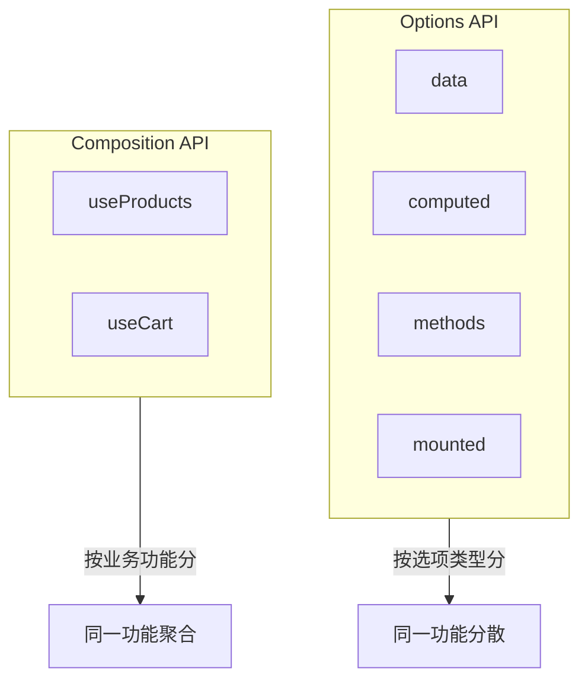
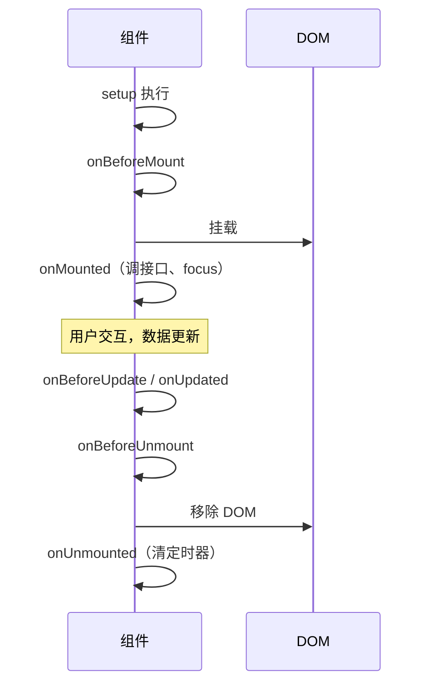

# 组合式 API 与 script setup

## 本章与上一章的关系

04 章你把 `shop-vue` 拆成了 `SearchBar`、`ProductCard`、`LoginForm`、`CartBadge`，`App.vue` 主要负责**组装**和**持有状态**（`products`、`keyword`、`cartCount`）。但父组件里仍有一大段：

- `filteredProducts` 的 computed 逻辑
- `onAddCart` 购物车逻辑
- 商品数据初始化

这些如果写在每个页面里会**重复**；如果全堆在 `App.vue` 会**臃肿**。

**组合式 API（Composition API）** 的解法：把「一组相关的 ref、computed、watch、函数」抽到 **`composables/useXxx.js`**，任何组件 `import { useCart } from '@/composables/useCart'` 即可复用。`<script setup>` 是组合式 API 的**官方推荐语法糖**——04 章你已经在用，这一章把它**讲透**。


**前置检查**：

- 04 章四个组件 + App.vue 能正常运行
- 理解 ref、computed、defineProps（02～04 章）
- 可选：在 `vite.config.js` 或 `jsconfig.json` 配置 `@` 指向 `src`（下面会给出）

---

## 1. 为什么要有组合式 API

### 1.1 Options API 的组织方式

Vue 2 时代默认写法（Vue 3 仍支持）：

```js
export default {
  data() {
    return {
      products: [],
      keyword: '',
      cartItems: [],
    }
  },
  computed: {
    filteredProducts() { /* 依赖 products + keyword */ },
    cartCount() { /* 依赖 cartItems */ },
  },
  methods: {
    addToCart() { /* ... */ },
    setKeyword() { /* ... */ },
  },
  mounted() {
    // 拉商品列表
  },
}
```

**问题**：「商品列表」相关的 data、computed、methods、mounted **散落四个选项里**；「购物车」又占另一组。组件 500 行时，你要上下滚动才能改一个功能。

### 1.2 组合式 API 的组织方式

**按功能聚合**：

```js
// useProducts.js — 商品相关全在这里
// useCart.js     — 购物车相关全在这里
```

组件里：

```vue
<script setup>
const { filteredProducts, keyword, setKeyword } = useProducts()
const { cartCount, add } = useCart()
</script>
```



### 1.3 真实工作场景

| 场景 | 组合式 API 收益 |
|------|-----------------|
| 商城列表 + 购物车 | `useCart` 在列表页、详情页、顶栏复用 |
| 表格分页 + 筛选 | `usePagination` 多页面复用 |
| 维护 Vue 2 老项目 | 可用 `@vue/composition-api` 渐进迁移 |

---

## 2. script setup 是什么

### 2.1 语法糖本质

```vue
<script setup>
import { ref } from 'vue'
const count = ref(0)
function add() { count.value++ }
</script>

<template>
  <button @click="add">{{ count }}</button>
</template>
```

等价于传统 setup 函数 + 自动 return：

```js
export default {
  setup() {
    const count = ref(0)
    function add() { count.value++ }
    return { count, add }
  },
}
```

**好处**：

- 顶层绑定自动暴露给 template
- 更少样板代码
- 更好 TypeScript 推断（进阶）

### 2.2 编译器宏：无需 import

| 宏 | 作用 |
|----|------|
| `defineProps` | 声明 props |
| `defineEmits` | 声明 emit |
| `defineExpose` | 暴露给父 ref |
| `defineOptions` | 组件名等（3.3+） |

它们是**编译期**处理的，不是运行时函数。

### 2.3 与普通 script 共存（少见）

```vue
<script>
export default { name: 'ProductList' }
</script>

<script setup>
// 组合式逻辑
</script>
```

---

## 3. 响应式 API 回顾与进阶

### 3.1 ref 与 reactive（02 章复习）

```js
import { ref, reactive } from 'vue'

const count = ref(0)
const form = reactive({ username: '', password: '' })
```

### 3.2 toRef / toRefs：解构 reactive 不丢响应式

```js
import { reactive, toRefs } from 'vue'

const state = reactive({ keyword: '', category: 'all' })
const { keyword, category } = toRefs(state)
// keyword 是 ref，在 script 里 keyword.value
```

### 3.3 readonly / shallowRef（了解）

- `readonly(state)`：禁止修改，用于下发配置
- `shallowRef`：只追踪 `.value` 替换，适合大型不可变数据

---

## 4. 生命周期钩子

### 4.1 对照表

| Options API | 组合式 API | 时机 |
|-------------|------------|------|
| `beforeCreate` | —（用 setup 本身） | 实例初始化 |
| `created` | —（用 setup 本身） | 数据观测完成 |
| `beforeMount` | `onBeforeMount` | DOM 挂载前 |
| `mounted` | `onMounted` | DOM 已挂载 |
| `beforeUpdate` | `onBeforeUpdate` | 数据变→DOM 更新前 |
| `updated` | `onUpdated` | DOM 已更新 |
| `beforeUnmount` | `onBeforeUnmount` | 卸载前 |
| `unmounted` | `onUnmounted` | 已卸载 |

### 4.2 常用模式

```vue
<script setup>
import { ref, onMounted, onUnmounted } from 'vue'

const products = ref([])
let timer = null

onMounted(async () => {
  // 08 章：axios.get('/api/products')
  products.value = [
    { id: 1, name: 'Java 书籍', price: 99 },
  ]
  timer = setInterval(() => console.log('heartbeat'), 5000)
})

onUnmounted(() => {
  clearInterval(timer)
})
</script>
```



### 4.3 为什么 onMounted 里调接口

SSR 场景 setup 会在服务端跑，没有 `window`/DOM；**浏览器专用**逻辑放 `onMounted`。

---

## 5. 组合式函数 composable 规范

### 5.1 命名与位置

- 文件名：`useXxx.js` 或 `useXxx.ts`
- 目录：`src/composables/`
- 函数名：`use` 前缀，如 `useCart`、`useProducts`

### 5.2 基本结构

```js
// composables/useCounter.js
import { ref } from 'vue'

export function useCounter(initial = 0) {
  const count = ref(initial)

  function increment() {
    count.value++
  }

  function decrement() {
    if (count.value > 0) count.value--
  }

  function reset() {
    count.value = initial
  }

  return { count, increment, decrement, reset }
}
```

组件：

```vue
<script setup>
import { useCounter } from '@/composables/useCounter'

const { count, increment } = useCounter(10)
</script>
```

### 5.3 约定（Vue 官方风格指南）

1. **以 `use` 开头**
2. 调用时应在 `setup` 或 `<script setup>` **同步**执行
3. 返回 ref/reactive/computed，保持响应式
4. 副作用（watch、onMounted）在 composable 内可注册，注意 **onUnmounted 清理**

### 5.4 状态共享：每次调用 vs 单例

```js
// 每次调用独立状态（默认）
export function useCounter() {
  const count = ref(0)
  return { count }
}

// 单例共享（购物车常用）
const cartItems = ref([])
export function useCart() {
  function add(item) { /* 改 cartItems */ }
  return { cartItems, add }
}
```

**为什么 useCart 常做单例？** 顶栏 badge、列表页、详情页要看到**同一份**购物车——模块级 `ref` 只创建一次。

---

## 6. 手把手：useProducts.js

**创建** `src/composables/useProducts.js`：

```js
import { ref, computed } from 'vue'

const products = ref([
  { id: 1, name: 'Java 编程思想', price: 99, stock: 10, category: 'book', isHot: true, img: 'https://via.placeholder.com/160?text=Java' },
  { id: 2, name: 'Spring Boot 实战', price: 79, stock: 0, category: 'book', isHot: false, img: 'https://via.placeholder.com/160?text=Spring' },
  { id: 3, name: 'Redis 设计与实现', price: 89, stock: 3, category: 'book', isHot: true, img: 'https://via.placeholder.com/160?text=Redis' },
  { id: 4, name: '机械键盘 K87', price: 299, stock: 5, category: 'digital', isHot: false, img: 'https://via.placeholder.com/160?text=Key' },
])

const keyword = ref('')
const category = ref('all')

export function useProducts() {
  const filteredProducts = computed(() => {
    let list = products.value
    const kw = keyword.value.trim().toLowerCase()
    if (kw) {
      list = list.filter(p => p.name.toLowerCase().includes(kw))
    }
    if (category.value !== 'all') {
      list = list.filter(p => p.category === category.value)
    }
    return list
  })

  const stats = computed(() => ({
    count: filteredProducts.value.length,
    total: filteredProducts.value.reduce((s, p) => s + p.price, 0),
  }))

  function setKeyword(val) {
    keyword.value = val
  }

  function setCategory(val) {
    category.value = val
  }

  async function fetchProducts() {
    // 08 章替换为 axios
    // products.value = await api.getProducts()
  }

  return {
    products,
    keyword,
    category,
    filteredProducts,
    stats,
    setKeyword,
    setCategory,
    fetchProducts,
  }
}
```

---

## 7. 手把手：useCart.js

**创建** `src/composables/useCart.js`：

```js
import { ref, computed } from 'vue'

const items = ref([])

export function useCart() {
  const totalCount = computed(() =>
    items.value.reduce((sum, i) => sum + i.qty, 0)
  )

  const totalPrice = computed(() =>
    items.value.reduce((sum, i) => sum + i.price * i.qty, 0)
  )

  const isEmpty = computed(() => items.value.length === 0)

  function add(product) {
    if (product.stock <= 0) return false
    const exist = items.value.find(i => i.id === product.id)
    if (exist) {
      if (exist.qty >= product.stock) return false
      exist.qty++
    } else {
      items.value.push({
        id: product.id,
        name: product.name,
        price: product.price,
        stock: product.stock,
        qty: 1,
      })
    }
    return true
  }

  function remove(id) {
    items.value = items.value.filter(i => i.id !== id)
  }

  function clear() {
    items.value = []
  }

  return {
    items,
    totalCount,
    totalPrice,
    isEmpty,
    add,
    remove,
    clear,
  }
}
```

**为什么 stock 校验放 add 里？** 业务规则集中，组件只 `add(p)` 并根据返回值提示。

---

## 8. 配置路径别名 @

**vite.config.js**：

```js
import { fileURLToPath, URL } from 'node:url'
import { defineConfig } from 'vite'
import vue from '@vitejs/plugin-vue'

export default defineConfig({
  plugins: [vue()],
  resolve: {
    alias: {
      '@': fileURLToPath(new URL('./src', import.meta.url)),
    },
  },
})
```

**jsconfig.json**（编辑器跳转）：

```json
{
  "compilerOptions": {
    "paths": {
      "@/*": ["./src/*"]
    }
  },
  "exclude": ["node_modules", "dist"]
}
```

之后：

```js
import { useCart } from '@/composables/useCart.js'
```

---

## 9. 重构 App.vue（完整可运行）

```vue
<script setup>
import { ref, onMounted } from 'vue'
import SearchBar from '@/components/SearchBar.vue'
import ProductCard from '@/components/ProductCard.vue'
import LoginForm from '@/components/LoginForm.vue'
import CartBadge from '@/components/CartBadge.vue'
import { useProducts } from '@/composables/useProducts.js'
import { useCart } from '@/composables/useCart.js'

const activeTab = ref('products')
const shopName = ref('shop-vue 练习商城')
const username = ref('')

const {
  keyword,
  category,
  filteredProducts,
  stats,
  fetchProducts,
} = useProducts()

const { totalCount, add } = useCart()

function onAddCart(product) {
  const ok = add(product)
  if (ok) {
    alert(`已加入：${product.name}`)
  } else {
    alert('库存不足或已售罄')
  }
}

function onLoginSuccess(payload) {
  username.value = payload.username
  activeTab.value = 'products'
}

onMounted(() => {
  fetchProducts()
  console.log('[onMounted] shop-vue 第 05 章组合式 API 已就绪')
})
</script>

<template>
  <div class="page">
    <header class="header">
      <div>
        <h1>{{ shopName }}</h1>
        <p class="sub">第 05 章 · composables · useProducts / useCart</p>
        <p v-if="username" class="welcome">你好，{{ username }}</p>
      </div>
      <CartBadge :count="totalCount" />
    </header>

    <nav class="tabs">
      <button :class="{ active: activeTab === 'products' }" @click="activeTab = 'products'">商品</button>
      <button :class="{ active: activeTab === 'login' }" @click="activeTab = 'login'">登录</button>
    </nav>

    <main v-show="activeTab === 'products'" class="main">
      <SearchBar v-model:keyword="keyword" v-model:category="category" />
      <p class="stats">
        共 {{ stats.count }} 件，合计 ¥{{ stats.total.toFixed(2) }}
      </p>
      <div class="grid">
        <ProductCard
          v-for="p in filteredProducts"
          :key="p.id"
          :product="p"
          @add-cart="onAddCart"
        />
      </div>
      <p v-if="filteredProducts.length === 0" class="empty">没有匹配商品</p>
    </main>

    <main v-show="activeTab === 'login'" class="main">
      <LoginForm @login-success="onLoginSuccess" />
    </main>
  </div>
</template>

<style scoped>
.page { min-height: 100vh; background: #f5f7fa; font-family: system-ui, sans-serif; }
.header { display: flex; justify-content: space-between; align-items: center; padding: 20px 24px; background: #fff; border-bottom: 1px solid #e5e7eb; }
.sub { color: #6b7280; font-size: 13px; }
.welcome { color: #42b983; font-size: 14px; margin-top: 4px; }
.tabs { display: flex; gap: 8px; padding: 12px 24px; background: #fff; }
.tabs button { padding: 8px 16px; border: 1px solid #e5e7eb; background: #fff; border-radius: 8px; cursor: pointer; }
.tabs button.active { background: #42b983; color: #fff; border-color: #42b983; }
.main { padding: 20px 24px; }
.stats { margin-bottom: 16px; }
.grid { display: grid; grid-template-columns: repeat(auto-fill, minmax(200px, 1fr)); gap: 16px; }
.empty { text-align: center; color: #9ca3af; padding: 40px; }
</style>
```

### 9.1 ProductCard 无需大改

仍 emit `add-cart`；购物车状态改由 **useCart 单例**维护，`CartBadge` 绑 `totalCount` 自动更新。

### 9.2 验证清单

| 操作 | 预期 |
|------|------|
| 多次加同一商品 | totalCount 递增，受 stock 上限 |
| 售罄商品 | add 返回 false，alert 库存不足 |
| 搜索/分类 | stats 与列表联动 |
| Console | onMounted 日志 |
| 刷新页面 | 购物车清空（07 章 Pinia 持久化） |

---

## 10. useCart 在多个组件复用演示

```vue
<!-- 假设未来 CartSummary.vue -->
<script setup>
import { useCart } from '@/composables/useCart.js'
const { items, totalPrice, clear } = useCart()
</script>

<template>
  <div>
    <p v-for="i in items" :key="i.id">{{ i.name }} x {{ i.qty }}</p>
    <p>合计 ¥{{ totalPrice.toFixed(2) }}</p>
    <button @click="clear">清空</button>
  </div>
</template>
```

与 `App.vue` 的 `useCart()` 是**同一份** `items` ref。

---

## 11. watch 与 composable

```js
// composables/useSearchHistory.js
import { ref, watch } from 'vue'

export function useSearchHistory(keywordRef) {
  watch(keywordRef, (val) => {
    if (val.trim()) {
      console.log('[history]', val)
    }
  })
}
```

```vue
<script setup>
import { useProducts } from '@/composables/useProducts.js'
import { useSearchHistory } from '@/composables/useSearchHistory.js'

const { keyword } = useProducts()
useSearchHistory(keyword)
</script>
```

---

## 12. Options API 与 Composition API 对照

| 功能 | Options | Composition |
|------|---------|-------------|
| 数据 | `data()` | `ref` / `reactive` |
| 计算 | `computed: { }` | `computed(() => )` |
| 侦听 | `watch: { }` | `watch()` / `watchEffect` |
| 方法 | `methods: { }` | 普通函数 |
| 挂载 | `mounted()` | `onMounted()` |
| props | `props: { }` | `defineProps()` |
| emit | `emits: [ ]` | `defineEmits()` |

### 12.1 同一计数器两种写法

**Options**：

```js
export default {
  data: () => ({ count: 0 }),
  methods: {
    add() { this.count++ },
  },
}
```

**Composition + script setup**：

```vue
<script setup>
import { ref } from 'vue'
const count = ref(0)
const add = () => count.value++
</script>
```

---

## 13. 为什么 script setup 里没有 this

Options API 里 `this.count`、`this.$emit` 依赖组件实例。`<script setup>` 编译后**没有 `this`**，直接用顶层变量和 `defineEmits`。

```js
// ❌ script setup
this.count++

// ✅
count.value++
```

---

## 14. composable vs mixin

Vue 2 的 mixin 问题：

- 命名冲突
- 来源不清晰
- 难以 Tree-shake

Composable：

- 显式 import
- 显式 return 暴露什么
- TypeScript 友好

---

## 15. composable vs Pinia

| | composable | Pinia |
|---|------------|-------|
| 状态作用域 | 模块级或每次调用 | 全局 store |
| DevTools | 一般 | 专用面板 |
| 持久化 | 手写 | 插件 |
| 适用 | 可复用逻辑、局部共享 | 用户、购物车、权限 |

**07 章**会把 `useCart` 迁到 Pinia；05 章的 composable 是理解 Pinia 的台阶。

---

## 16. 异步 composable 模式

```js
export function useUser() {
  const user = ref(null)
  const loading = ref(false)
  const error = ref(null)

  async function load(id) {
    loading.value = true
    error.value = null
    try {
      // user.value = await api.getUser(id)
    } catch (e) {
      error.value = e.message
    } finally {
      loading.value = false
    }
  }

  return { user, loading, error, load }
}
```

组件 `onMounted(() => load(1))`。

---

## 17. 模板 ref 与 defineExpose（复习）

```vue
<script setup>
import { ref } from 'vue'
const inputRef = ref(null)
defineExpose({ focus: () => inputRef.value?.focus() })
</script>
```

---

## 18. 项目目录建议（05 章完成后）

```text
shop-vue/src/
├── composables/
│   ├── useProducts.js
│   ├── useCart.js
│   └── useSearchHistory.js   ← 可选
├── components/
│   ├── SearchBar.vue
│   ├── ProductCard.vue
│   ├── LoginForm.vue
│   └── CartBadge.vue
├── views/                    ← 06 章 Router 使用
├── App.vue
└── main.js
```

---

## 19. 常见 composable 反模式

| 反模式 | 问题 | 正确 |
|--------|------|------|
| 在 composable 外创建 ref 却期望隔离 | 意外共享 | ref 在函数内创建 |
| composable 里不写 onUnmounted 清理 | 泄漏 | 配对清理 |
| return 普通变量 | 丢响应式 | return ref/computed |
| 在 if 里调用 useXxx | 违反规则 | 顶层同步调用 |
| 把 UI DOM 操作全塞 composable | 难测 | DOM 放组件，逻辑放 composable |

---

## 20. 与 TypeScript（进阶预告）

```ts
// composables/useCart.ts
import { ref, computed, type Ref } from 'vue'

export interface CartItem {
  id: number
  name: string
  price: number
  qty: number
}

export function useCart() {
  const items: Ref<CartItem[]> = ref([])
  // ...
}
```

本资料主线用 JS，面试可提 TS + Vue 3 是一等公民。

---

## 21. 分级练习

### 21.1 基础：onMounted 日志

**要求**：App.vue `onMounted` 打印 `shop-vue mounted`。

<details>
<summary>参考答案</summary>

```js
onMounted(() => {
  console.log('shop-vue mounted')
})
```

</details>

### 21.2 进阶：useCounter

**要求**：抽 `useCounter`，含 count、increment、decrement、reset。

<details>
<summary>参考答案</summary>

见 §5.2 完整 `useCounter.js`。

</details>

### 21.3 挑战：useCart + ProductCard 联动

**要求**：加购后 CartBadge 实时变；超库存拒绝。

<details>
<summary>参考答案</summary>

见 §7 `useCart.js` + §9 App.vue 的 `onAddCart` 与 `:count="totalCount"`。

</details>

### 21.4 挑战：useLocalStorage

**要求**：封装 `useLocalStorage(key, defaultValue)`，keyword 持久化。

<details>
<summary>参考答案</summary>

```js
import { ref, watch } from 'vue'

export function useLocalStorage(key, defaultValue = '') {
  const stored = localStorage.getItem(key)
  const data = ref(stored !== null ? stored : defaultValue)

  watch(data, (val) => {
    localStorage.setItem(key, val)
  })

  return data
}
```

</details>

---

## 22. 常见报错与排查

| 报错/现象 | 可能原因 | 解决方案 |
|-----------|----------|----------|
| `onMounted is not defined` | 未 import | `import { onMounted } from 'vue'` |
| composable 状态不共享 | 每次调用新建 ref | 模块级 ref（useCart 模式） |
| composable 意外共享 | 模块级 ref 误用 | 改到函数内创建 |
| `@/` 路径无法解析 | 未配 alias | 配置 vite + jsconfig §8 |
| 模板变量 undefined | composable 未 return | 检查 return 列表 |
| `this is undefined` | script setup 用 this | 直接用变量 |
| 购物车刷新丢失 | 内存 state | 07 Pinia persist |
| onMounted 调两次 | 开发 Strict Mode | 生产正常；注意清理 |
| watch 重复注册 | composable 被多次 setup | 设计单例或 onScopeDispose |
| HMR 后 cart 翻倍 | 热更新副作用 | 刷新页面；unmount 清理 |

---

## 23. FAQ

**Q1：新项目还要学 Options API 吗？**  
要**能读懂**老代码；**新写**只用 Composition + script setup。

**Q2：setup 和 onMounted 哪个调接口？**  
浏览器接口、DOM 相关放 `onMounted`；纯数据初始化可在 setup 顶层（注意 SSR）。

**Q3：useCart 和 Pinia 选哪个？**  
小 demo 用 composable；多页面共享 + DevTools 用 Pinia（07 章）。

**Q4：composable 能互相调用吗？**  
能，如 `useCheckout` 内部 `useCart()`。

**Q5：为什么 ref 放模块顶层？**  
实现跨组件单例；要隔离则放 `useXxx` 函数内。

**Q6：和 React Hooks 一样吗？**  
相似（逻辑复用）；Vue composable 无 Hooks 的调用顺序限制那么严，但仍需顶层同步调用。

---

## 24. 学完标准

- [ ] 理解组合式 API 相对 Options API 的优势
- [ ] 熟练使用 `<script setup>` 与编译器宏
- [ ] 熟练使用 `onMounted`、`onUnmounted` 及清理副作用
- [ ] 能编写 `composables/useXxx.js` 并在组件复用
- [ ] 完成 `useProducts` + `useCart` 重构 shop-vue
- [ ] 理解 composable 单例 vs 实例隔离
- [ ] 配置 `@` 路径别名

---

## 25. 知识点清单

| 序号 | 知识点 | 自评 |
|------|--------|------|
| 1 | 组合式 API 动机 | ☐ |
| 2 | script setup 语法糖 | ☐ |
| 3 | defineProps / defineEmits / defineExpose | ☐ |
| 4 | 生命周期钩子对照 | ☐ |
| 5 | composable 命名与结构 | ☐ |
| 6 | 状态共享模式 | ☐ |
| 7 | useProducts 实现 | ☐ |
| 8 | useCart 实现 | ☐ |
| 9 | Options vs Composition | ☐ |
| 10 | composable vs Pinia | ☐ |
| 11 | 路径别名 @ | ☐ |
| 12 | shop-vue 05 章重构 | ☐ |

---

## 下一章预告

05 章 `shop-vue` 仍是「一个 App.vue 里 Tab 切换商品/登录」——不像真实商城有多 URL。06 章引入 **Vue Router**：`/products`、`/login`、`/cart` 各对应独立页面组件，浏览器地址栏、前进后退、路由守卫都能用起来——这才是 SPA 的标准形态。

---

*下一章：06 Vue Router 路由管理*
