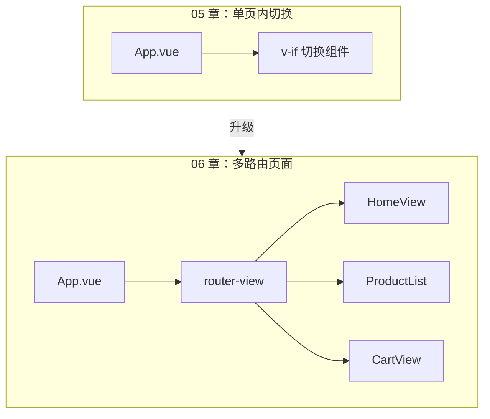
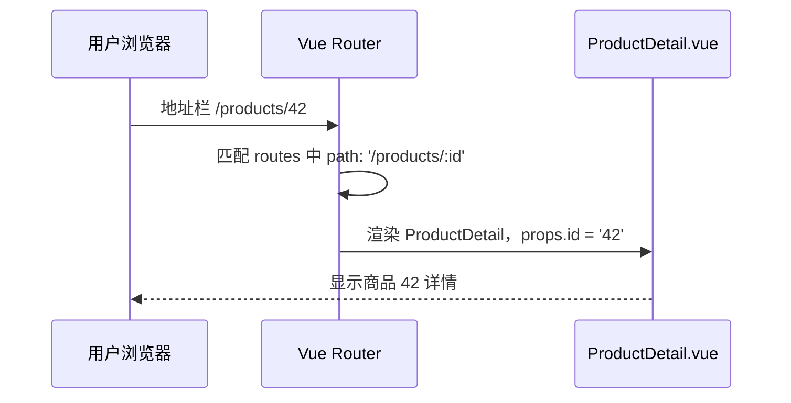
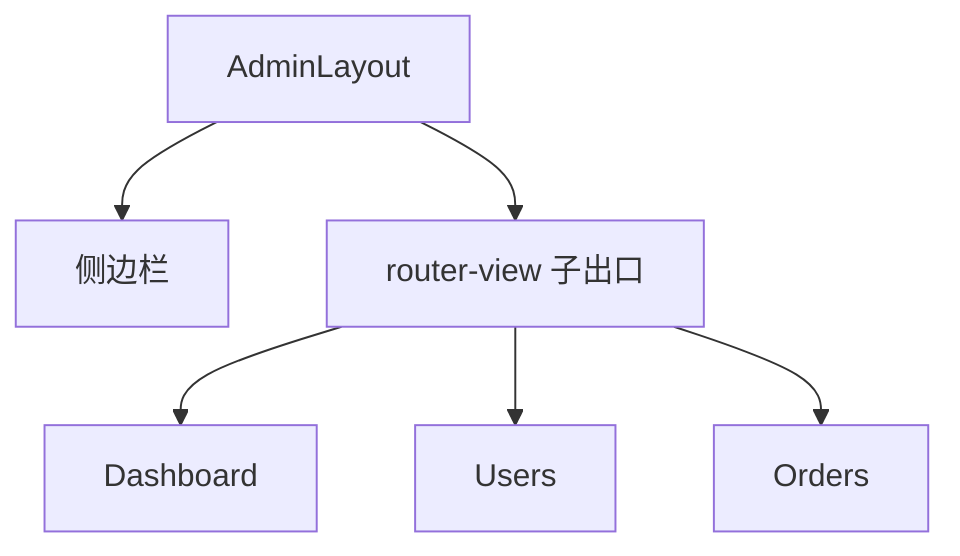
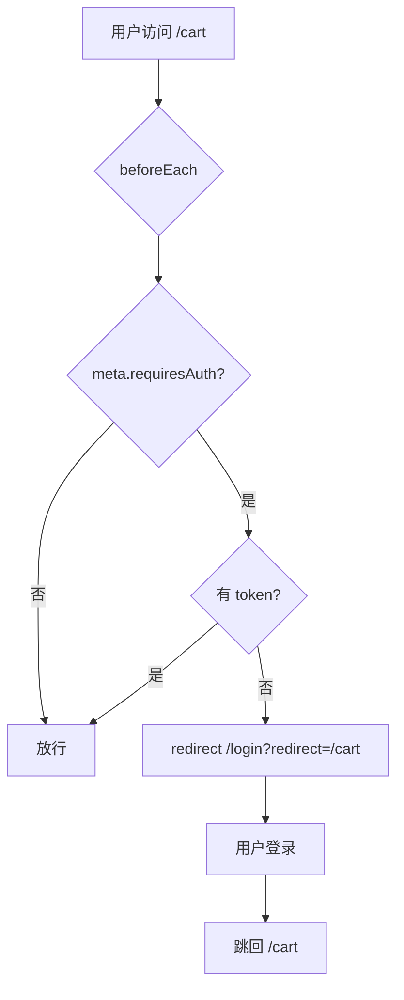
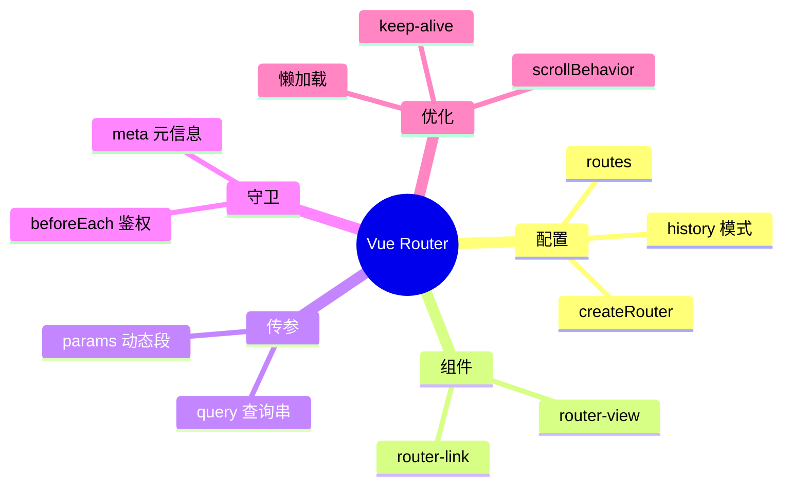

# Vue Router 路由管理

## 本章与上一章的关系

05 章之前，`shop-vue` 的所有内容都在**一个页面**里通过 `v-if` / 组件切换来展示。真实商城项目有首页、商品列表、商品详情、登录、购物车、个人中心等——每个功能对应一个「页面」，但 SPA（单页应用）不能每次跳转都整页刷新。

**Vue Router** 是 Vue 官方路由库，负责：

- 把 **URL 路径** 映射到 **Vue 组件**
- 在 `<router-view>` 里切换视图，**无整页刷新**
- 支持传参、导航守卫、懒加载、嵌套路由

这一章给 `shop-vue` 加上完整路由体系，为 07 章 Pinia 跨页面共享状态、08 章按页面调不同接口打基础。



---

## 1. SPA 是什么？为什么需要路由

### 1.1 单页应用 vs 传统多页

| 对比项 | 传统多页（MPA） | SPA + Vue Router |
|--------|------------------|------------------|
| 页面切换 | 浏览器整页刷新，白屏闪烁 | 只替换 `<router-view>` 区域 |
| HTML 文件 | 每个页面一个 `.html` | 通常只有一个 `index.html` |
| 状态共享 | 跨页需 Cookie / Session | Pinia 内存态即时共享 |
| 首屏加载 | 每页独立加载 | 首次加载 JS 较多，后续极快 |
| SEO | 天然友好 | 需 SSR/Nuxt 等方案（进阶） |
| 典型场景 | 官网、博客 | 后台管理、商城前台 |

### 1.2 URL 与视图的映射关系

用户访问 `http://localhost:5173/products/42` 时：



**为什么不用 `<a href="/products">`？**  
普通 `<a>` 会触发整页刷新，Vue 应用重新初始化，Pinia 状态丢失。必须用 `<router-link>` 或 `router.push()`，由 Router 在客户端切换组件。

---

## 2. Vue Router 4 核心概念速览

| 概念 | 说明 |
|------|------|
| `routes` | 路由表：path → component 映射 |
| `createRouter()` | 创建路由实例 |
| `createWebHistory()` | HTML5 History 模式（无 `#`） |
| `<router-view>` | 当前匹配组件的渲染出口 |
| `<router-link>` | 声明式导航，自动加 `router-link-active` 类 |
| `useRoute()` | 读取当前路由信息（params、query、meta） |
| `useRouter()` | 编程式导航（push、replace、go） |
| `beforeEach` | 全局前置守卫，鉴权常用 |

---

## 3. 安装 Vue Router

### 3.1 方式 A：创建项目时勾选

```bash
npm create vue@latest shop-vue
# ✔ Add Vue Router? → Yes
```

### 3.2 方式 B：现有项目手动安装

```bash
cd shop-vue
npm install vue-router@4
```

验证：

```bash
npm list vue-router
# 预期：vue-router@4.x.x
```

---

## 4. 项目目录规划（shop-vue 路由版）

完成本章后，`shop-vue` 路由相关目录如下：

```text
shop-vue/
├── src/
│   ├── router/
│   │   └── index.js          ← 路由配置中心
│   ├── views/                ← 页面级组件（与路由一一对应）
│   │   ├── HomeView.vue
│   │   ├── ProductList.vue
│   │   ├── ProductDetail.vue
│   │   ├── LoginView.vue
│   │   ├── CartView.vue
│   │   └── NotFoundView.vue
│   ├── components/           ← 可复用小组件
│   │   ├── AppHeader.vue
│   │   └── ProductCard.vue
│   ├── App.vue
│   └── main.js
└── vite.config.js
```

**约定**：`views/` 放「页面」，`components/` 放「部件」。一个路由通常对应一个 view。

---

## 5. 手把手：完整路由配置 `src/router/index.js`

```js
import { createRouter, createWebHistory } from 'vue-router'

// 懒加载：首屏只加载当前页，其他页按需下载（§18 详讲）
const HomeView = () => import('../views/HomeView.vue')
const ProductList = () => import('../views/ProductList.vue')
const ProductDetail = () => import('../views/ProductDetail.vue')
const LoginView = () => import('../views/LoginView.vue')
const CartView = () => import('../views/CartView.vue')
const NotFoundView = () => import('../views/NotFoundView.vue')

const routes = [
  {
    path: '/',
    name: 'home',
    component: HomeView,
    meta: { title: '首页' },
  },
  {
    path: '/products',
    name: 'products',
    component: ProductList,
    meta: { title: '商品列表' },
  },
  {
    path: '/products/:id',
    name: 'product-detail',
    component: ProductDetail,
    props: true,  // 将 params.id 作为 props 传给组件
    meta: { title: '商品详情' },
  },
  {
    path: '/login',
    name: 'login',
    component: LoginView,
    meta: { title: '登录', guestOnly: true },
  },
  {
    path: '/cart',
    name: 'cart',
    component: CartView,
    meta: { title: '购物车', requiresAuth: true },
  },
  // 404 兜底：必须放在最后
  {
    path: '/:pathMatch(.*)*',
    name: 'not-found',
    component: NotFoundView,
    meta: { title: '页面不存在' },
  },
]

const router = createRouter({
  history: createWebHistory(import.meta.env.BASE_URL),
  routes,
  // 切换路由后滚动到顶部
  scrollBehavior(to, from, savedPosition) {
    if (savedPosition) return savedPosition
    return { top: 0 }
  },
})

// 全局前置守卫（§16 详讲）
router.beforeEach((to, from) => {
  // 设置页面标题
  document.title = `${to.meta.title || '商城'} - shop-vue`

  const token = localStorage.getItem('token')

  // 需要登录的页面
  if (to.meta.requiresAuth && !token) {
    return { name: 'login', query: { redirect: to.fullPath } }
  }

  // 已登录用户不应再访问登录页
  if (to.meta.guestOnly && token) {
    return { name: 'home' }
  }
})

export default router
```

---

## 6. 注册路由：`src/main.js`

```js
import { createApp } from 'vue'
import App from './App.vue'
import router from './router'

const app = createApp(App)
app.use(router)
app.mount('#app')
```

```bash
npm run dev
# 预期：http://localhost:5173 可访问，控制台无报错
```

---

## 7. 根组件：`src/App.vue`

```vue
<script setup>
import AppHeader from '@/components/AppHeader.vue'
</script>

<template>
  <div id="app">
    <AppHeader />
    <main class="main-content">
      <!-- 当前路由匹配的组件渲染在这里 -->
      <router-view />
    </main>
  </div>
</template>

<style>
* { box-sizing: border-box; margin: 0; padding: 0; }
body { font-family: system-ui, -apple-system, sans-serif; background: #fafafa; }
.main-content { max-width: 1200px; margin: 0 auto; padding: 24px 16px; }
</style>
```

---

## 8. 导航栏组件：`src/components/AppHeader.vue`

```vue
<script setup>
import { useRoute } from 'vue-router'

const route = useRoute()
</script>

<template>
  <header class="header">
    <router-link to="/" class="logo">🛒 shop-vue</router-link>
    <nav>
      <router-link to="/">首页</router-link>
      <router-link to="/products">商品</router-link>
      <router-link to="/cart">购物车</router-link>
      <router-link to="/login">登录</router-link>
    </nav>
    <span class="debug">当前路由：{{ route.path }}</span>
  </header>
</template>

<style scoped>
.header {
  display: flex;
  align-items: center;
  gap: 24px;
  padding: 12px 24px;
  background: #fff;
  border-bottom: 1px solid #eee;
  position: sticky;
  top: 0;
  z-index: 100;
}
.logo { font-weight: bold; font-size: 1.2rem; text-decoration: none; color: #42b983; }
nav { display: flex; gap: 16px; flex: 1; }
nav a {
  text-decoration: none;
  color: #666;
  padding: 4px 8px;
  border-radius: 4px;
}
/* router-link 激活时自动添加 router-link-active 类 */
nav a.router-link-active {
  color: #42b983;
  font-weight: 600;
  background: #e8f5e9;
}
.debug { font-size: 12px; color: #999; }
</style>
```

**为什么用 `<router-link>` 而不是 `<a href>`？**

- `<router-link to="/products">` → 客户端导航，不刷新
- `<a href="/products">` → 整页请求，Vite dev server 可能 404（生产需 Nginx fallback）

---

## 9. 页面视图完整代码

### 9.1 `src/views/HomeView.vue`

```vue
<script setup>
</script>

<template>
  <section class="home">
    <h1>欢迎来到 shop-vue 商城</h1>
    <p>这是首页。点击导航栏「商品」浏览商品列表。</p>
    <router-link to="/products" class="btn">去逛逛 →</router-link>
  </section>
</template>

<style scoped>
.home { text-align: center; padding: 60px 20px; }
h1 { margin-bottom: 16px; color: #333; }
p { color: #666; margin-bottom: 24px; }
.btn {
  display: inline-block;
  padding: 12px 24px;
  background: #42b983;
  color: #fff;
  text-decoration: none;
  border-radius: 6px;
}
</style>
```

### 9.2 `src/views/ProductList.vue`

```vue
<script setup>
import { ref } from 'vue'
import ProductCard from '@/components/ProductCard.vue'

// 05 章假数据，08 章换成 axios
const products = ref([
  { id: 1, name: 'Vue3 实战教程', price: 59.9, category: 'book' },
  { id: 2, name: '机械键盘', price: 399, category: 'digital' },
  { id: 3, name: '显示器支架', price: 129, category: 'digital' },
])
</script>

<template>
  <section>
    <h2>商品列表</h2>
    <div class="grid">
      <ProductCard
        v-for="p in products"
        :key="p.id"
        :product="p"
      />
    </div>
  </section>
</template>

<style scoped>
h2 { margin-bottom: 20px; }
.grid {
  display: grid;
  grid-template-columns: repeat(auto-fill, minmax(240px, 1fr));
  gap: 16px;
}
</style>
```

### 9.3 `src/components/ProductCard.vue`

```vue
<script setup>
defineProps({
  product: { type: Object, required: true },
})
</script>

<template>
  <article class="card">
    <h3>{{ product.name }}</h3>
    <p class="price">¥ {{ product.price }}</p>
    <router-link :to="`/products/${product.id}`" class="link">
      查看详情
    </router-link>
  </article>
</template>

<style scoped>
.card {
  background: #fff;
  border: 1px solid #eee;
  border-radius: 8px;
  padding: 16px;
}
.price { color: #e74c3c; font-size: 1.2rem; margin: 8px 0; }
.link { color: #42b983; text-decoration: none; }
</style>
```

### 9.4 `src/views/ProductDetail.vue`

```vue
<script setup>
import { computed } from 'vue'
import { useRoute, useRouter } from 'vue-router'

// props: true 时，路由 params 自动作为 props 传入
const props = defineProps({
  id: { type: String, required: true },
})

const route = useRoute()
const router = useRouter()

// 模拟根据 id 查商品
const product = computed(() => {
  const map = {
    '1': { id: 1, name: 'Vue3 实战教程', price: 59.9, desc: '从入门到实战' },
    '2': { id: 2, name: '机械键盘', price: 399, desc: '青轴，RGB 背光' },
    '3': { id: 3, name: '显示器支架', price: 129, desc: '气压升降' },
  }
  return map[props.id] || null
})

function goBack() {
  router.back()
}
</script>

<template>
  <section v-if="product">
    <button class="back" @click="goBack">← 返回</button>
    <h2>{{ product.name }}</h2>
    <p class="price">¥ {{ product.price }}</p>
    <p>{{ product.desc }}</p>
    <p class="meta">路由 params.id = {{ id }}，fullPath = {{ route.fullPath }}</p>
  </section>
  <section v-else>
    <p>商品不存在</p>
    <router-link to="/products">返回列表</router-link>
  </section>
</template>

<style scoped>
.back { margin-bottom: 16px; cursor: pointer; }
.price { color: #e74c3c; font-size: 1.5rem; margin: 12px 0; }
.meta { margin-top: 24px; font-size: 12px; color: #999; }
</style>
```

### 9.5 `src/views/LoginView.vue`

```vue
<script setup>
import { reactive } from 'vue'
import { useRoute, useRouter } from 'vue-router'

const route = useRoute()
const router = useRouter()

const form = reactive({ username: '', password: '' })

function onSubmit() {
  // 07 章用 Pinia，08 章调真实接口
  localStorage.setItem('token', 'demo-token-' + Date.now())
  // 登录成功后跳回原来想去的页面
  const redirect = route.query.redirect || '/'
  router.push(redirect)
}
</script>

<template>
  <section class="login">
    <h2>用户登录</h2>
    <form @submit.prevent="onSubmit">
      <label>
        用户名
        <input v-model="form.username" required />
      </label>
      <label>
        密码
        <input v-model="form.password" type="password" required />
      </label>
      <button type="submit">登录</button>
    </form>
    <p v-if="route.query.redirect" class="hint">
      请先登录以访问：{{ route.query.redirect }}
    </p>
  </section>
</template>

<style scoped>
.login { max-width: 360px; margin: 40px auto; }
label { display: block; margin-bottom: 12px; }
input { width: 100%; padding: 8px; margin-top: 4px; }
button { width: 100%; padding: 10px; background: #42b983; color: #fff; border: none; cursor: pointer; }
.hint { margin-top: 12px; font-size: 13px; color: #666; }
</style>
```

### 9.6 `src/views/CartView.vue`

```vue
<script setup>
import { ref } from 'vue'

const items = ref([
  { id: 1, name: 'Vue3 实战教程', price: 59.9, qty: 1 },
])
</script>

<template>
  <section>
    <h2>购物车</h2>
    <p v-if="items.length === 0">购物车是空的</p>
    <ul v-else>
      <li v-for="item in items" :key="item.id">
        {{ item.name }} × {{ item.qty }} — ¥ {{ item.price * item.qty }}
      </li>
    </ul>
  </section>
</template>
```

### 9.7 `src/views/NotFoundView.vue`

```vue
<template>
  <section class="not-found">
    <h1>404</h1>
    <p>您访问的页面不存在</p>
    <router-link to="/">返回首页</router-link>
  </section>
</template>

<style scoped>
.not-found { text-align: center; padding: 80px 20px; }
h1 { font-size: 4rem; color: #ddd; }
</style>
```

### 9.8 配置路径别名 `@`

**`vite.config.js`**：

```js
import { defineConfig } from 'vite'
import vue from '@vitejs/plugin-vue'
import { fileURLToPath, URL } from 'node:url'

export default defineConfig({
  plugins: [vue()],
  resolve: {
    alias: {
      '@': fileURLToPath(new URL('./src', import.meta.url)),
    },
  },
})
```

---

## 10. 动态路由与 params 传参

### 10.1 路由定义

```js
{ path: '/products/:id', component: ProductDetail, props: true }
```

`:id` 是动态段，匹配 `/products/1`、`/products/abc` 等。

### 10.2 三种读取 params 的方式

```vue
<!-- 方式 1：props: true（推荐） -->
<script setup>
const props = defineProps({ id: String })
</script>

<!-- 方式 2：useRoute -->
<script setup>
import { useRoute } from 'vue-router'
const route = useRoute()
console.log(route.params.id)
</script>

<!-- 方式 3：watch params 变化（同一组件复用时） -->
<script setup>
import { watch } from 'vue'
import { useRoute } from 'vue-router'
const route = useRoute()
watch(() => route.params.id, (newId) => {
  console.log('商品切换为', newId)
  // 重新请求详情数据
})
</script>
```

### 10.3 为什么同一详情页切换 id 时组件不重新创建？

Vue Router 复用同一组件实例以提升性能。从 `/products/1` 跳到 `/products/2` 时，`onMounted` **不会**再次执行。必须 `watch route.params.id` 或在 `onBeforeRouteUpdate` 里刷新数据：

```js
import { onBeforeRouteUpdate } from 'vue-router'

onBeforeRouteUpdate((to) => {
  // to.params.id 是新 id
  loadProduct(to.params.id)
})
```

---

## 11. 查询参数 query

### 11.1 跳转带 query

```js
router.push({
  path: '/products',
  query: { category: 'book', page: 1 },
})
// URL: /products?category=book&page=1
```

```html
<router-link :to="{ name: 'products', query: { category: 'digital' } }">
  数码产品
</router-link>
```

### 11.2 读取 query

```js
import { useRoute } from 'vue-router'
const route = useRoute()
console.log(route.query.category) // 'book'
```

### 11.3 params vs query 怎么选？

| 类型 | 特点 | 典型场景 |
|------|------|----------|
| **params** | 路径一部分，RESTful 风格 | 商品 id、用户 id |
| **query** | `?` 后面，可选、可多个 | 搜索关键词、分页、筛选 |

---

## 12. 编程式导航

### 12.1 常用 API

```js
import { useRouter } from 'vue-router'
const router = useRouter()

router.push('/products')                    // 入栈导航
router.push({ name: 'product-detail', params: { id: '2' } })
router.replace('/login')                      // 替换当前历史，不可后退
router.go(-1)                                 // 后退
router.back()                                 // 等同 go(-1)
```

### 12.2 push 与 replace 的生产场景

- **push**：正常跳转，用户可点浏览器后退
- **replace**：登录成功后跳首页（不希望用户「后退」回到登录页）
- **replace**：支付完成跳结果页

```js
// 登录成功
router.replace({ name: 'home' })
```

---

## 13. 命名路由

```js
{ path: '/products/:id', name: 'product-detail', component: ProductDetail }
```

```js
router.push({ name: 'product-detail', params: { id: '3' } })
```

**注意**：使用 `name` + `params` 跳转时，必须传齐所有动态 params，否则 Vue Router 4 会报警告或 params 丢失。推荐用 `path` 或确保 params 完整。

---

## 14. 嵌套路由与 Layout

商城后台常见「左侧菜单 + 右侧内容」布局，用**嵌套路由**：

```js
{
  path: '/admin',
  component: AdminLayout,
  children: [
    { path: '', component: AdminDashboard },
    { path: 'users', component: AdminUsers },
    { path: 'orders', component: AdminOrders },
  ],
}
```

**`AdminLayout.vue`**：

```vue
<template>
  <div class="admin">
    <aside>侧边栏</aside>
    <main>
      <!-- 子路由渲染出口 -->
      <router-view />
    </main>
  </div>
</template>
```



---

## 15. 路由 meta 字段

`meta` 是自定义元信息，守卫和组件都能读：

```js
{ path: '/cart', meta: { requiresAuth: true, title: '购物车', roles: ['user'] } }
```

```js
router.beforeEach((to) => {
  if (to.meta.requiresAuth && !token) return '/login'
  if (to.meta.roles && !hasRole(to.meta.roles)) return '/403'
})
```

---

## 16. 导航守卫详解

### 16.1 守卫类型

| 守卫 | 触发时机 |
|------|----------|
| `beforeEach` | 全局，每次导航前 |
| `beforeResolve` | 全局，解析完所有组件后 |
| `afterEach` | 全局，导航完成后（不能拦截） |
| `beforeEnter` | 单条路由 |
| `onBeforeRouteLeave` | 组件内，离开前 |
| `onBeforeRouteUpdate` | 组件内，同组件 params 变化 |

### 16.2 完整鉴权流程



### 16.3 Vue Router 4 守卫返回值（替代 next）

```js
router.beforeEach((to, from) => {
  if (!token && to.meta.requiresAuth) {
    return { name: 'login', query: { redirect: to.fullPath } }
  }
  // return false 取消导航
  // return '/login' 字符串路径
})
```

07 章会改为从 Pinia 读 token，逻辑更清晰。

---

## 17. 路由懒加载

```js
const ProductList = () => import('../views/ProductList.vue')
```

Vite/Webpack 自动代码分割，首屏 bundle 更小。

**按模块分组**（生产优化）：

```js
const ProductList = () => import(
  /* webpackChunkName: "product" */ '../views/ProductList.vue'
)
```

---

## 18. History 模式 vs Hash 模式

| 模式 | URL 样子 | 配置 | 部署注意 |
|------|----------|------|----------|
| History | `/products/1` | `createWebHistory()` | 服务器需 fallback 到 index.html |
| Hash | `/#/products/1` | `createWebHashHistory()` | 无需服务器配置 |

生产环境推荐 History + Nginx `try_files`（10 章详解）。

---

## 19. keep-alive 缓存页面

列表页滚到中间 → 进详情 → 返回，希望列表保持滚动位置和筛选状态：

```vue
<router-view v-slot="{ Component }">
  <keep-alive :include="['ProductList']">
    <component :is="Component" />
  </keep-alive>
</router-view>
```

被缓存组件会触发 `onActivated` / `onDeactivated` 而非 `onMounted` / `onUnmounted`。

---

## 20. 生产级案例：登录重定向

**需求**：未登录访问 `/cart` → 登录 → 自动回到 `/cart`。

已在 §5 `beforeEach` 和 §9.5 `LoginView` 实现。核心：

```js
// 守卫
return { name: 'login', query: { redirect: to.fullPath } }

// 登录成功
router.push(route.query.redirect || '/')
```

---

## 21. 生产级案例：面包屑导航

```vue
<script setup>
import { computed } from 'vue'
import { useRoute } from 'vue-router'

const route = useRoute()
const breadcrumbs = computed(() => {
  return route.matched
    .filter(r => r.meta.title)
    .map(r => ({ title: r.meta.title, path: r.path }))
})
</script>

<template>
  <nav class="breadcrumb">
    <span v-for="(item, i) in breadcrumbs" :key="item.path">
      <router-link v-if="i < breadcrumbs.length - 1" :to="item.path">
        {{ item.title }}
      </router-link>
      <span v-else>{{ item.title }}</span>
      <span v-if="i < breadcrumbs.length - 1"> / </span>
    </span>
  </nav>
</template>
```

---

## 22. 生产级案例：路由级权限（RBAC 入门）

```js
const routes = [
  {
    path: '/admin',
    meta: { roles: ['admin'] },
    component: AdminLayout,
    children: [/* ... */],
  },
]

router.beforeEach((to) => {
  const userRole = localStorage.getItem('role') || 'guest'
  if (to.meta.roles && !to.meta.roles.includes(userRole)) {
    return { name: 'home' }
  }
})
```

---

## 23. 学完标准

完成本章后，你应该能够：

- [ ] 独立配置 `createRouter`、`routes`、`<router-view>`、`<router-link>`
- [ ] 使用动态路由 `:id` 和 `query` 传参，并理解 params/query 区别
- [ ] 编写 `beforeEach` 实现登录鉴权 + 重定向
- [ ] 配置懒加载和 404 兜底路由
- [ ] `shop-vue` 具备 6 个基础路由页（含 404）
- [ ] 理解 History 模式部署 fallback 问题

---

## 24. 分级练习

### 24.1 基础：首页 + 商品列表两路由

**要求**：配置 `/` 和 `/products`，导航可切换，激活项高亮。

**参考答案**：见 §5～§9 完整代码。核心 routes：

```js
const routes = [
  { path: '/', component: HomeView },
  { path: '/products', component: ProductList },
]
```

---

### 24.2 进阶：商品详情 `/products/:id`

**要求**：列表点「详情」跳转，详情页显示 id 和商品名。

**参考答案**：见 §9.3 ProductCard 的 `router-link` 和 §9.4 ProductDetail。

验证：

```bash
# 浏览器访问
http://localhost:5173/products/2
# 预期：显示「机械键盘」，params.id = 2
```

---

### 24.3 挑战：未登录访问 `/cart` 跳转 `/login`，登录后回跳

**要求**：完整鉴权 + redirect query。

**参考答案**：

```js
// router/index.js
router.beforeEach((to) => {
  const token = localStorage.getItem('token')
  if (to.meta.requiresAuth && !token) {
    return { name: 'login', query: { redirect: to.fullPath } }
  }
})
```

```js
// LoginView.vue onSubmit
localStorage.setItem('token', 'demo-token')
router.push(route.query.redirect || '/')
```

测试步骤：

1. 清除 localStorage：`localStorage.removeItem('token')`
2. 访问 `/cart` → 应跳 `/login?redirect=/cart`
3. 登录 → 应回到 `/cart`

---

### 24.4 挑战+：404 页面

**要求**：访问 `/abc` 显示 404，不白屏。

**参考答案**：

```js
{ path: '/:pathMatch(.*)*', name: 'not-found', component: NotFoundView }
```

---

## 25. 常见报错与排查

| 报错信息 | 可能原因 | 排查步骤 | 解决方案 |
|---------|---------|---------|---------|
| 页面空白，无内容 | `App.vue` 没有 `<router-view>` | 检查模板 | 添加 `<router-view />` |
| `[Vue Router warn]: No match found for location` | 路径未在 routes 中配置 | 对比 URL 与 routes | 添加对应路由或 404 兜底 |
| 导航链接点击后整页刷新 | 用了 `<a href>` 而非 router-link | 检查导航 HTML | 改用 `<router-link to="...">` |
| `router-link-active` 不高亮 | `to` 路径不匹配或 scoped 样式覆盖 | DevTools 看 class | 确认 path 一致；检查 CSS |
| 刷新页面 404（生产环境） | Nginx/服务器未配置 SPA fallback | 直接访问子路径 | Nginx `try_files $uri /index.html`（10 章） |
| 动态 params 为 undefined | 未配置 `props: true` 或 name 跳转漏 params | 看 route.params | 设 `props: true` 或用 path 跳转 |
| 详情页切换 id 数据不更新 | 组件被复用，onMounted 不触发 | `/products/1` → `/products/2` | watch params 或 onBeforeRouteUpdate |
| `[Vue Router warn]: Discarded invalid param(s)` | params 含非法字符或路由名错误 | 检查 push 参数 | 用 `router.push({ path: '/products/1' })` |
| `getActivePinia was called with no active Pinia` | 在 pinia 安装前于守卫用 store | 07 章常见 | 守卫里先用 localStorage，或确保 pinia 已 use |
| 嵌套路由子页面空白 | 父组件缺 `<router-view>` | 检查 Layout | 父组件加子 `<router-view />` |
| `Uncaught Error: Infinite redirect` | 守卫互相 redirect 死循环 | 查 beforeEach 逻辑 | login 页设 `meta: { requiresAuth: false }` |
| History 模式 dev 正常 prod 404 | 静态服务器不识别前端路由 | 部署后直访子路径 | 配 fallback 或改 hash 模式 |

---

## 26. 常见问题 FAQ

### Q1：Vue Router 3 和 4 有什么区别？

Vue Router 4 专为 Vue 3 设计：`createRouter` 替代 `new VueRouter`，Composition API 提供 `useRoute()` / `useRouter()`，守卫不再推荐 `next()` 回调而改用返回值。

### Q2：为什么推荐 `props: true`？

解耦组件与 `$route`，便于单元测试；组件像普通组件一样接收 props，语义更清晰。

### Q3：多个 `<router-view>` 怎么用？

命名视图：`components: { default: Foo, sidebar: Bar }`，模板里 `<router-view name="sidebar" />`。用于同一 URL 同时展示多个区域。

### Q4：路由守卫里能发 axios 请求吗？

可以但不推荐阻塞导航太久。常见做法：守卫只检查本地 token，异步权限在组件 `onMounted` 里拉取。

### Q5：如何实现「离开页面前确认」？

```js
import { onBeforeRouteLeave } from 'vue-router'
onBeforeRouteLeave((to, from) => {
  if (hasUnsavedChanges) {
    return window.confirm('有未保存修改，确定离开？')
  }
})
```

### Q6：路由和 Pinia 谁先安装？

`main.js` 里顺序一般不影响，但守卫里用 Pinia store 时，必须 `app.use(createPinia())` 在 `app.mount` 之前。

---

## 27. 本章小结



你已为 `shop-vue` 搭好多页面骨架。下一章用 **Pinia** 把登录态、购物车从 localStorage 和组件局部 state 抽到全局 store，路由守卫也会更优雅。

---

## 下一章预告

路由能切换页面了，但「当前登录用户」「购物车里有什么」多个页面都要用——props 一层层传太痛苦，localStorage 手工同步容易出 bug。下一章（07 Pinia）用**全局状态管理**集中存放，任意组件都能读写，并与路由守卫深度联动。

---

*下一章：07 Pinia 状态管理*
