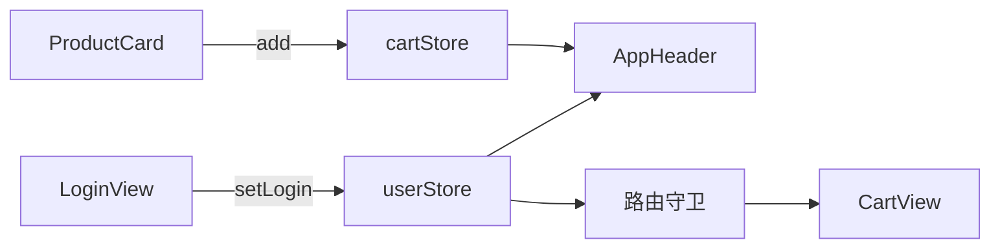
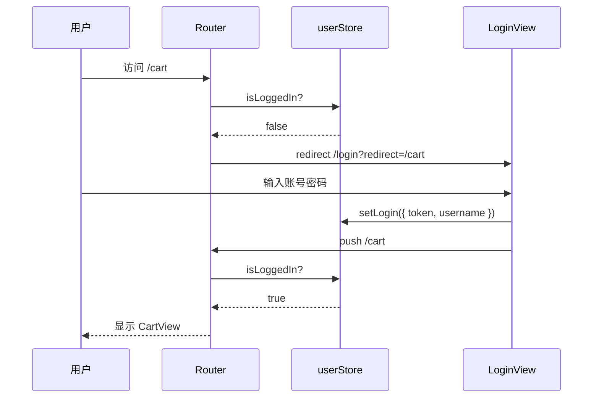
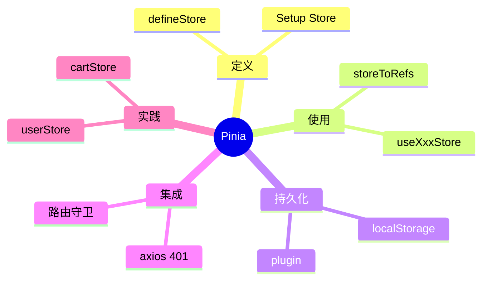

# Pinia 状态管理

## 本章与上一章的关系

06 章给 `shop-vue` 加上了多页面路由。现在你会遇到新问题：

- 导航栏要显示「当前登录用户」和「购物车数量」——但它们在 `AppHeader.vue`，数据却在 `LoginView` 和 `ProductCard` 里产生
- 路由守卫要判断「是否登录」——06 章临时用 `localStorage.getItem('token')`，和组件里的登录逻辑重复
- 刷新页面后，购物车内存数据丢失

**Pinia** 是 Vue 3 官方推荐的状态管理库（替代 Vuex），把「跨组件、跨路由」的共享数据集中到一个 **Store** 里，任意组件 `useXxxStore()` 即可读写，且完全响应式。

这一章给 `shop-vue` 加 `userStore` 和 `cartStore`，并和 06 章路由守卫联动，为 08 章「登录后带 token 调 Spring Boot 接口」做准备。



---

## 1. 什么时候需要 Pinia？什么时候不需要？

| 场景 | 推荐方案 | 原因 |
|------|----------|------|
| 父 → 子传数据 | `props` | 简单直接 |
| 子 → 父通知 | `emit` | 单向数据流 |
| 2～3 个兄弟组件共享 | 提升到共同父组件，或 **composable** | 范围有限 |
| **跨路由、跨多层组件** | **Pinia** | 避免 prop drilling |
| 用户信息、token、购物车 | **Pinia** | 全局业务态 |
| 主题、语言、侧边栏折叠 | **Pinia** | 全局 UI 态 |
| 仅表单内部临时状态 | 组件内 `ref` | 无需全局 |
| 服务端列表数据 | 组件/composable + API | 一般不进 store（除非缓存） |

**经验法则**：如果两个不相关的页面组件需要同一份数据，就该考虑 Pinia。

---

## 2. Pinia vs Vuex vs 全局变量

| 对比 | 全局变量 `window.xxx` | Vuex 4 | Pinia |
|------|----------------------|--------|-------|
| 响应式 | ❌ 需手动 | ✅ | ✅ |
| DevTools | ❌ | ✅ | ✅ 更友好 |
| TypeScript | ❌ | 一般 | ✅ 优秀 |
| API 复杂度 | 低 | mutations/actions 繁琐 | 直观，无 mutations |
| Vue 3 官方 | — | 兼容 | **推荐** |

---

## 3. 安装与项目配置

### 3.1 安装

```bash
cd shop-vue
npm install pinia
```

### 3.2 注册 `src/main.js`

```js
import { createApp } from 'vue'
import { createPinia } from 'pinia'
import App from './App.vue'
import router from './router'

const app = createApp(App)
const pinia = createPinia()

app.use(pinia)   // 必须在 app.mount 之前
app.use(router)
app.mount('#app')
```

### 3.3 目录结构

```text
src/
├── stores/
│   ├── user.js       ← 用户 / 登录态
│   ├── cart.js       ← 购物车
│   └── index.js      ← 可选：统一导出
├── components/
├── views/
└── main.js
```

---

## 4. 两种 Store 定义风格

### 4.1 Setup Store（推荐，与 Composition API 一致）

```js
import { defineStore } from 'pinia'
import { ref, computed } from 'vue'

export const useCounterStore = defineStore('counter', () => {
  const count = ref(0)
  const double = computed(() => count.value * 2)
  function increment() { count.value++ }
  return { count, double, increment }
})
```

### 4.2 Options Store（类 Vuex）

```js
export const useCounterStore = defineStore('counter', {
  state: () => ({ count: 0 }),
  getters: {
    double: (state) => state.count * 2,
  },
  actions: {
    increment() { this.count++ },
  },
})
```

本章全部使用 **Setup Store**，与 `<script setup>` 风格统一。

---

## 5. 手把手：完整 `userStore`

**`src/stores/user.js`**：

```js
import { defineStore } from 'pinia'
import { ref, computed } from 'vue'

const TOKEN_KEY = 'shop_token'
const USERNAME_KEY = 'shop_username'

export const useUserStore = defineStore('user', () => {
  // --- state ---
  const token = ref(localStorage.getItem(TOKEN_KEY) || '')
  const username = ref(localStorage.getItem(USERNAME_KEY) || '')

  // --- getters ---
  const isLoggedIn = computed(() => !!token.value)
  const displayName = computed(() => username.value || '游客')

  // --- actions ---
  function setLogin(payload) {
    // payload: { token, username }
    token.value = payload.token
    username.value = payload.username
    localStorage.setItem(TOKEN_KEY, payload.token)
    localStorage.setItem(USERNAME_KEY, payload.username)
  }

  function logout() {
    token.value = ''
    username.value = ''
    localStorage.removeItem(TOKEN_KEY)
    localStorage.removeItem(USERNAME_KEY)
  }

  /** 08 章：App 启动时可用 token 换用户信息 */
  async function fetchProfile() {
    if (!token.value) return
    // 08 章对接 GET /api/users/me
    // username.value = data.name
  }

  return {
    token,
    username,
    isLoggedIn,
    displayName,
    setLogin,
    logout,
    fetchProfile,
  }
})
```

**为什么 token 存 localStorage？**

- 刷新页面后 Pinia 内存清空，localStorage 可恢复登录态
- 08 章 axios 拦截器从 store 读 token 发 Header
- 生产环境更推荐 httpOnly Cookie（安全进阶），初学 localStorage 足够

---

## 6. 手把手：完整 `cartStore`

**`src/stores/cart.js`**：

```js
import { defineStore } from 'pinia'
import { ref, computed } from 'vue'

const CART_KEY = 'shop_cart'

function loadCartFromStorage() {
  try {
    const raw = localStorage.getItem(CART_KEY)
    return raw ? JSON.parse(raw) : []
  } catch {
    return []
  }
}

export const useCartStore = defineStore('cart', () => {
  const items = ref(loadCartFromStorage())

  // --- getters ---
  const totalCount = computed(() =>
    items.value.reduce((sum, item) => sum + item.qty, 0)
  )

  const totalPrice = computed(() =>
    items.value.reduce((sum, item) => sum + item.price * item.qty, 0)
  )

  const isEmpty = computed(() => items.value.length === 0)

  // --- 内部：持久化 ---
  function persist() {
    localStorage.setItem(CART_KEY, JSON.stringify(items.value))
  }

  // --- actions ---
  function add(product) {
    const exist = items.value.find(i => i.id === product.id)
    if (exist) {
      exist.qty++
    } else {
      items.value.push({
        id: product.id,
        name: product.name,
        price: product.price,
        qty: 1,
      })
    }
    persist()
  }

  function remove(productId) {
    items.value = items.value.filter(i => i.id !== productId)
    persist()
  }

  function updateQty(productId, qty) {
    const item = items.value.find(i => i.id === productId)
    if (!item) return
    if (qty <= 0) {
      remove(productId)
    } else {
      item.qty = qty
      persist()
    }
  }

  function clear() {
    items.value = []
    persist()
  }

  return {
    items,
    totalCount,
    totalPrice,
    isEmpty,
    add,
    remove,
    updateQty,
    clear,
  }
})
```

---

## 7. 统一导出（可选）`src/stores/index.js`

```js
export { useUserStore } from './user'
export { useCartStore } from './cart'
```

---

## 8. 在组件中使用 Store

### 8.1 基本用法

```vue
<script setup>
import { useUserStore } from '@/stores/user'
import { useCartStore } from '@/stores/cart'

const userStore = useUserStore()
const cartStore = useCartStore()
</script>

<template>
  <header>
    <span v-if="userStore.isLoggedIn">
      你好，{{ userStore.displayName }}
      <button @click="userStore.logout()">退出</button>
    </span>
    <router-link v-else to="/login">登录</router-link>

    <router-link to="/cart">
      购物车 ({{ cartStore.totalCount }})
    </router-link>
  </header>
</template>
```

### 8.2 模板里可直接解构吗？

**不能直接解构 state**，会丢失响应式：

```js
// ❌ 错误：count 不再是响应式
const { totalCount } = useCartStore()
```

**正确：用 `storeToRefs` 解构 state/getters**：

```js
import { storeToRefs } from 'pinia'
import { useCartStore } from '@/stores/cart'

const cartStore = useCartStore()
const { totalCount, items } = storeToRefs(cartStore)
// actions 可直接解构，不需要 storeToRefs
const { add, clear } = cartStore
```

### 8.3 修改 state 的三种方式

```js
// 1. 直接改（简单场景）
cartStore.items.push(...)

// 2. 调 action（推荐，便于维护副作用）
cartStore.add(product)

// 3. $patch 批量改
cartStore.$patch({ items: [] })
```

---

## 9. 更新 AppHeader.vue（完整）

**`src/components/AppHeader.vue`**：

```vue
<script setup>
import { storeToRefs } from 'pinia'
import { useUserStore } from '@/stores/user'
import { useCartStore } from '@/stores/cart'
import { useRouter } from 'vue-router'

const userStore = useUserStore()
const cartStore = useCartStore()
const { isLoggedIn, displayName } = storeToRefs(userStore)
const { totalCount } = storeToRefs(cartStore)
const router = useRouter()

function handleLogout() {
  userStore.logout()
  cartStore.clear()  // 可选：退出清空购物车
  router.push('/login')
}
</script>

<template>
  <header class="header">
    <router-link to="/" class="logo">🛒 shop-vue</router-link>
    <nav>
      <router-link to="/">首页</router-link>
      <router-link to="/products">商品</router-link>
      <router-link to="/cart">
        购物车
        <span v-if="totalCount > 0" class="badge">{{ totalCount }}</span>
      </router-link>
    </nav>
    <div class="user-area">
      <template v-if="isLoggedIn">
        <span>{{ displayName }}</span>
        <button class="link-btn" @click="handleLogout">退出</button>
      </template>
      <router-link v-else to="/login">登录</router-link>
    </div>
  </header>
</template>

<style scoped>
.header {
  display: flex;
  align-items: center;
  gap: 24px;
  padding: 12px 24px;
  background: #fff;
  border-bottom: 1px solid #eee;
}
.logo { font-weight: bold; text-decoration: none; color: #42b983; }
nav { display: flex; gap: 16px; flex: 1; }
nav a { text-decoration: none; color: #666; }
nav a.router-link-active { color: #42b983; font-weight: 600; }
.badge {
  background: #e74c3c;
  color: #fff;
  font-size: 12px;
  padding: 2px 6px;
  border-radius: 10px;
  margin-left: 4px;
}
.user-area { display: flex; gap: 12px; align-items: center; }
.link-btn { background: none; border: none; color: #666; cursor: pointer; }
</style>
```

---

## 10. 更新 LoginView.vue（完整）

**`src/views/LoginView.vue`**：

```vue
<script setup>
import { reactive, ref } from 'vue'
import { useRoute, useRouter } from 'vue-router'
import { useUserStore } from '@/stores/user'

const route = useRoute()
const router = useRouter()
const userStore = useUserStore()

const form = reactive({ username: '', password: '' })
const loading = ref(false)
const errMsg = ref('')

async function onSubmit() {
  if (!form.username || !form.password) {
    errMsg.value = '请填写用户名和密码'
    return
  }
  loading.value = true
  errMsg.value = ''
  try {
    // 07 章模拟登录；08 章换成 axios
    await new Promise(r => setTimeout(r, 500))
    userStore.setLogin({
      token: 'demo-jwt-' + Date.now(),
      username: form.username,
    })
    const redirect = route.query.redirect || '/'
    router.push(redirect)
  } catch (e) {
    errMsg.value = e.message || '登录失败'
  } finally {
    loading.value = false
  }
}
</script>

<template>
  <section class="login">
    <h2>用户登录</h2>
    <form @submit.prevent="onSubmit">
      <label>
        用户名
        <input v-model="form.username" placeholder="admin" />
      </label>
      <label>
        密码
        <input v-model="form.password" type="password" placeholder="123456" />
      </label>
      <p v-if="errMsg" class="err">{{ errMsg }}</p>
      <button type="submit" :disabled="loading">
        {{ loading ? '登录中...' : '登录' }}
      </button>
    </form>
    <p v-if="route.query.redirect" class="hint">
      登录后将跳转到：{{ route.query.redirect }}
    </p>
  </section>
</template>

<style scoped>
.login { max-width: 360px; margin: 40px auto; }
label { display: block; margin-bottom: 12px; }
input { width: 100%; padding: 8px; margin-top: 4px; box-sizing: border-box; }
.err { color: #e74c3c; font-size: 14px; }
button { width: 100%; padding: 10px; background: #42b983; color: #fff; border: none; cursor: pointer; }
button:disabled { opacity: 0.6; }
.hint { margin-top: 12px; font-size: 13px; color: #666; }
</style>
```

---

## 11. 更新 ProductCard 与 CartView

### 11.1 `src/components/ProductCard.vue`

```vue
<script setup>
import { useCartStore } from '@/stores/cart'

defineProps({
  product: { type: Object, required: true },
})

const cartStore = useCartStore()

function handleAdd(product) {
  cartStore.add(product)
}
</script>

<template>
  <article class="card">
    <h3>{{ product.name }}</h3>
    <p class="price">¥ {{ product.price }}</p>
    <div class="actions">
      <router-link :to="`/products/${product.id}`">详情</router-link>
      <button @click="handleAdd(product)">加入购物车</button>
    </div>
  </article>
</template>

<style scoped>
.card { background: #fff; border: 1px solid #eee; border-radius: 8px; padding: 16px; }
.price { color: #e74c3c; margin: 8px 0; }
.actions { display: flex; gap: 12px; }
button { padding: 6px 12px; background: #42b983; color: #fff; border: none; border-radius: 4px; cursor: pointer; }
</style>
```

### 11.2 `src/views/CartView.vue`

```vue
<script setup>
import { storeToRefs } from 'pinia'
import { useCartStore } from '@/stores/cart'

const cartStore = useCartStore()
const { items, totalCount, totalPrice, isEmpty } = storeToRefs(cartStore)
</script>

<template>
  <section>
    <h2>购物车 ({{ totalCount }} 件)</h2>
    <p v-if="isEmpty">购物车是空的，<router-link to="/products">去逛逛</router-link></p>
    <table v-else class="cart-table">
      <thead>
        <tr><th>商品</th><th>单价</th><th>数量</th><th>小计</th><th></th></tr>
      </thead>
      <tbody>
        <tr v-for="item in items" :key="item.id">
          <td>{{ item.name }}</td>
          <td>¥ {{ item.price }}</td>
          <td>
            <button @click="cartStore.updateQty(item.id, item.qty - 1)">-</button>
            {{ item.qty }}
            <button @click="cartStore.updateQty(item.id, item.qty + 1)">+</button>
          </td>
          <td>¥ {{ (item.price * item.qty).toFixed(2) }}</td>
          <td><button @click="cartStore.remove(item.id)">删除</button></td>
        </tr>
      </tbody>
      <tfoot>
        <tr>
          <td colspan="3">合计</td>
          <td colspan="2">¥ {{ totalPrice.toFixed(2) }}</td>
        </tr>
      </tfoot>
    </table>
    <button v-if="!isEmpty" class="clear-btn" @click="cartStore.clear()">清空购物车</button>
  </section>
</template>

<style scoped>
.cart-table { width: 100%; border-collapse: collapse; margin-top: 16px; }
.cart-table th, .cart-table td { border: 1px solid #eee; padding: 8px; text-align: left; }
.clear-btn { margin-top: 16px; padding: 8px 16px; }
</style>
```

---

## 12. Pinia 与路由守卫联动

### 12.1 更新 `src/router/index.js`

```js
import { createRouter, createWebHistory } from 'vue-router'
import { useUserStore } from '@/stores/user'

const routes = [
  // ... 与 06 章相同 ...
  {
    path: '/cart',
    name: 'cart',
    component: () => import('../views/CartView.vue'),
    meta: { requiresAuth: true, title: '购物车' },
  },
  {
    path: '/login',
    name: 'login',
    component: () => import('../views/LoginView.vue'),
    meta: { guestOnly: true, title: '登录' },
  },
]

const router = createRouter({
  history: createWebHistory(),
  routes,
})

router.beforeEach((to) => {
  const userStore = useUserStore()

  if (to.meta.title) {
    document.title = `${to.meta.title} - shop-vue`
  }

  if (to.meta.requiresAuth && !userStore.isLoggedIn) {
    return { name: 'login', query: { redirect: to.fullPath } }
  }

  if (to.meta.guestOnly && userStore.isLoggedIn) {
    return { name: 'home' }
  }
})

export default router
```



**注意**：`beforeEach` 里调用 `useUserStore()` 必须在 `app.use(pinia)` 之后。由于守卫在导航时触发，此时 app 已挂载，没有问题。

---

## 13. 在 setup 外使用 Store

axios 拦截器、路由守卫等非组件上下文也能用，但需传入 pinia 实例：

```js
// main.js
const pinia = createPinia()
app.use(pinia)

// 某些工具文件
import { useUserStore } from '@/stores/user'
import pinia from '@/stores/pinia-instance'  // 需单独 export

const userStore = useUserStore(pinia)
```

更简单做法：08 章拦截器里直接 `useUserStore()`，因为拦截器在请求发出时 app 已运行。

---

## 14. Store 之间互相调用

```js
// cart.js
import { useUserStore } from './user'

function checkout() {
  const userStore = useUserStore()
  if (!userStore.isLoggedIn) {
    throw new Error('请先登录')
  }
  // 提交订单...
}
```

**规则**：在 action 内部调用其他 store，不要在 store 顶层互相 import 形成循环依赖。

---

## 15. 持久化插件（进阶）

手写 localStorage 够用。生产可用 `pinia-plugin-persistedstate`：

```bash
npm install pinia-plugin-persistedstate
```

```js
import { createPinia } from 'pinia'
import piniaPluginPersistedstate from 'pinia-plugin-persistedstate'

const pinia = createPinia()
pinia.use(piniaPluginPersistedstate)
```

```js
export const useUserStore = defineStore('user', () => {
  // ...
}, {
  persist: { key: 'shop-user', paths: ['token', 'username'] },
})
```

---

## 16. Pinia DevTools 调试

1. 安装 Vue DevTools 浏览器扩展
2. 打开 DevTools → Vue → Pinia 面板
3. 可查看 store 状态、时间旅行、手动 patch

**为什么比 console.log 好？** 复杂购物车状态下，能一眼看到 `items` 数组变化链。

---

## 17. 生产级案例：登录态过期统一处理

08 章 axios 响应拦截器收到 401 时：

```js
if (error.response?.status === 401) {
  const userStore = useUserStore()
  userStore.logout()
  router.push({ name: 'login', query: { redirect: route.fullPath } })
}
```

Store 的 `logout` 清 token，守卫和 UI 自动同步。

---

## 18. 生产级案例：购物车与服务端同步

真实商城登录后，购物车可能存数据库：

```js
async function syncFromServer() {
  const data = await fetchCartApi()
  items.value = data
  persist()
}

async function add(product) {
  // 先乐观更新 UI
  // ...本地 add 逻辑...
  try {
    await addCartItemApi(product.id)
  } catch {
    // 失败回滚
    remove(product.id)
  }
}
```

---

## 19. 生产级案例：多 Store 拆分原则

| Store | 职责 |
|-------|------|
| `useUserStore` | token、用户信息、权限 |
| `useCartStore` | 购物车 CRUD |
| `useAppStore` | 主题、语言、侧边栏 |
| `useProductStore` | 可选：商品缓存、筛选条件 |

**不要**一个巨型 store 包打天下，按业务域拆分。

---

## 20. composable vs Pinia

| | composable | Pinia |
|--|------------|-------|
| 作用域 | 每次调用独立状态（除非用全局 ref） | 全局单例 |
| DevTools | 无 | 有 |
| 持久化 | 需手写 | 插件支持 |
| 适用 | 封装逻辑、局部复用 | 跨页面共享业务态 |

05 章 `useCart` composable 在多人协作项目里应升级为 `cartStore`。

---

## 21. 学完标准

- [ ] 会用 `defineStore` 定义 Setup 风格 store
- [ ] 会在组件中 `useXxxStore()`，会用 `storeToRefs` 解构
- [ ] 完成 `userStore` + `cartStore`，含 localStorage 持久化
- [ ] 路由守卫从 Pinia 读 `isLoggedIn`，替代裸 localStorage
- [ ] 理解 store 间调用、action 封装副作用的最佳实践

---

## 22. 分级练习

### 22.1 基础：userStore 存 username，导航栏显示

**参考答案**：见 §5 userStore 和 §9 AppHeader。验证：登录后导航栏显示用户名。

---

### 22.2 进阶：cartStore 加购后角标更新

**步骤**：

1. ProductCard 调 `cartStore.add(product)`
2. AppHeader 显示 `cartStore.totalCount`

**参考答案**：见 §6、§11。验证：点「加入购物车」，角标 +1。

---

### 22.3 挑战：刷新页面后 token 与购物车从 localStorage 恢复

**参考答案**：已在 §5、§6 的 `loadCartFromStorage` 和 token 初始化实现。

**验证**：

```bash
# 1. 登录并加购
# 2. F5 刷新
# 预期：仍显示登录用户名，购物车数量不变
```

---

### 22.4 挑战+：退出登录清空购物车并跳登录页

**参考答案**：见 §9 `handleLogout`：

```js
function handleLogout() {
  userStore.logout()
  cartStore.clear()
  router.push('/login')
}
```

---

## 23. 常见报错与排查

| 报错信息 | 可能原因 | 排查步骤 | 解决方案 |
|---------|---------|---------|---------|
| `getActivePinia was called with no active Pinia` | 在 pinia 安装前调用 useStore | 看调用栈 | 确保 `app.use(pinia)` 在 mount 前；守卫内一般 OK |
| 解构后数据不更新 | 直接解构 state 丢响应式 | 改 UI 不刷新 | 用 `storeToRefs` 解构 state/getters |
| 刷新丢失登录态 | 没持久化 token | Application → localStorage | setLogin 时写 localStorage |
| 两页面购物车不同步 | 没用同一 store 或各自 ref | 检查 import | 统一 `useCartStore()` |
| 修改 state 无效 | 改了副本非 store 内对象 | 看 items 引用 | 通过 action 修改；用 `$patch` |
| 守卫里 isLoggedIn 永远 false | store 初始化顺序问题 | 登录后立即访问 | 确认 setLogin 更新了 token ref |
| `[🍍]: A getter cannot be written` | 试图给 computed getter 赋值 | 看报错行 | 改底层 state，不要改 getter |
| 热更新后 store 状态怪异 | HMR 边界问题 | dev 环境 | 刷新页面；生产无此问题 |
| 循环依赖报错 | store A import store B 顶层互引 | 看 import 链 | 在 action 内动态 useStore |
| JSON.parse 购物车失败 | localStorage 被手动改坏 | Console 看 CART_KEY | try/catch 兜底返回 [] |
| Pinia DevTools 看不到 | 未装扩展或生产模式 | 浏览器扩展 | 装 Vue DevTools；用 dev 构建 |
| `$reset is not a function` | Setup Store 无内置 $reset | Options vs Setup | 手写 reset action |

---

## 24. 常见问题 FAQ

### Q1：Pinia 和 localStorage 同时用会不会重复？

不会冲突。Pinia 是运行时响应式源；localStorage 是持久化层。模式：`state 变 → action 里 persist()`，启动时从 localStorage  hydrate 到 ref。

### Q2：要不要把所有 API 数据都放 Pinia？

不必。列表页数据通常组件内 `ref` + `onMounted` 拉取；需要跨页缓存（如商品筛选条件）再放 store。

### Q3：Setup Store 和 Options Store 怎么选？

新项目一律 Setup Store，与 `<script setup>` 一致。维护老 Vuex 项目可能见到 Options Store。

### Q4：多个 tab 页签会共享 Pinia 吗？

同一浏览器同域多个 tab 共享 localStorage，但 Pinia 内存独立。一个 tab logout 清 localStorage，另一个 tab 需监听 `storage` 事件同步。

### Q5：Pinia 能替代 EventBus 吗？

大部分场景可以。跨组件通信用 store 更清晰；极少量一次性的兄弟通信 emit 仍够用。

### Q6：生产环境 token 放 localStorage 安全吗？

有 XSS 风险。进阶方案：httpOnly Cookie + SameSite、短 token + refresh token。初学阶段先理解流程。

---

## 25. 本章小结



Pinia 管好了登录态和购物车，但商品数据仍是组件里的假数组。下一章用 **Axios** 对接 [Spring Boot 04 章](../../后端学习/Java/04-SpringBoot核心开发.md) 的 REST 接口，让页面显示**真数据**。

---

## 下一章预告

07 章 store 能存 token 了，08 章将：**封装 Axios** → **调 `/api/login`、`/api/users`** → **Vite 代理/CORS 联调** → **登录流程打通**。这是 Vue 学习路线与后端学习路线的**交汇点**。

---

*下一章：08 Axios 网络请求与前后端联调*
