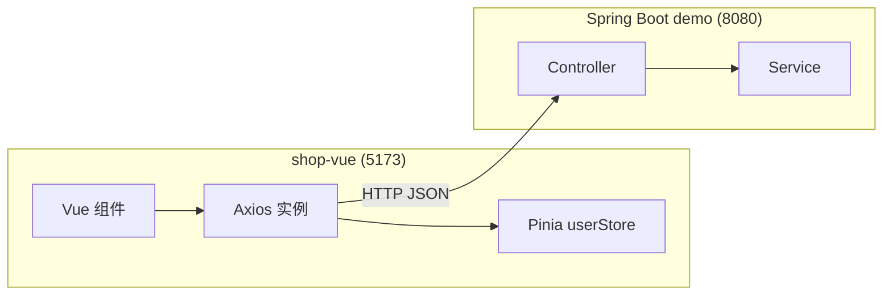
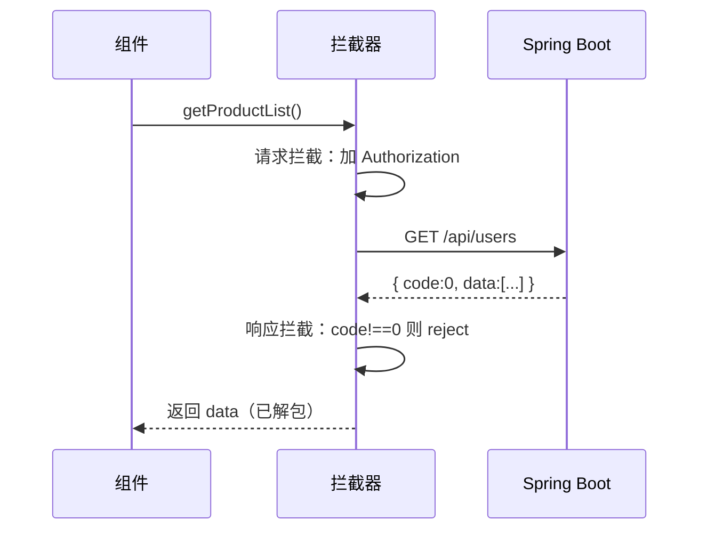
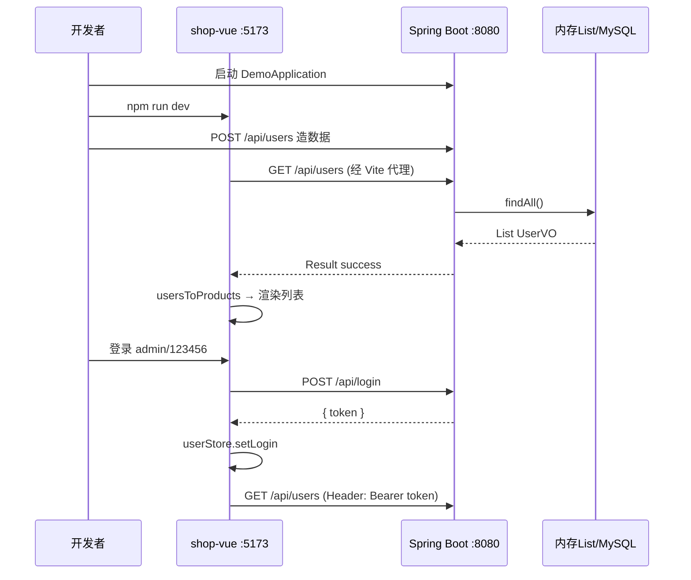
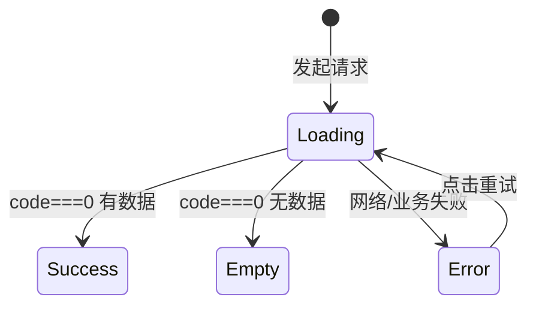
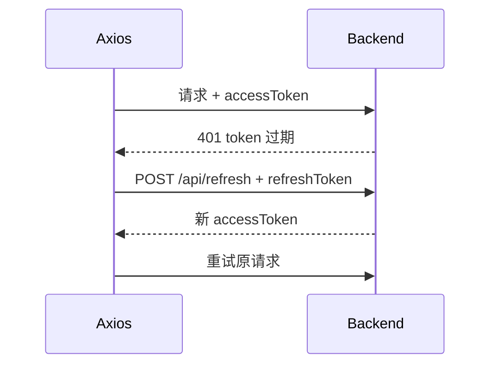
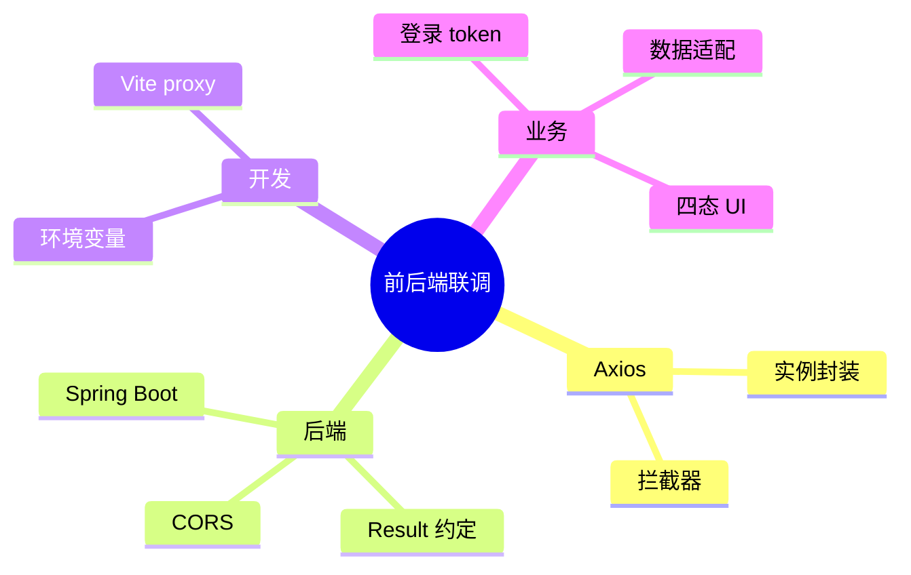

# Axios 网络请求与前后端联调

<!-- 修改说明: 2026-06-30 按 EXPANSION-STANDARD 扩充 §0 导读、request 逐行读、Network/DevTools、计网06 CORS、FAQ 12 题、闭卷自测、费曼检验 -->

## 0. 读前导读（零基础也能跟上）

> **读者假设**：07 章 Pinia 能存 token，但商品仍是假数据。本章用 **Axios** 调 Spring Boot 接口，完成前后端联调——Vue 路线与 Java 路线的**交汇点**。

### 0.1 用一句话弄懂本章

**一句话**：Axios 是浏览器里的「快递员」——按 [Java 04 REST 约定](../../后端学习/Java/04-SpringBoot核心开发.md) 发 HTTP 请求，拦截器自动带 token、统一解析 `{ code, message, data }`，组件只关心 `data`。

**生活类比**：

| 概念 | 类比 |
|------|------|
| **Axios 实例** | 专属快递公司：统一地址、超时、包装规范 |
| **请求拦截器** | 出库贴单：每个包裹自动贴会员号（Bearer token） |
| **响应拦截器** | 收货验货：`code !== 0` 拒收并报错 |
| **Vite proxy** | 前台代收：浏览器以为寄给 5173，实际转 8080 |

**为什么重要**：没有联调，Vue 只是本地玩具；联调后 shop-vue 与 [Java 04 demo](../../后端学习/Java/04-SpringBoot核心开发.md) 形成完整全栈闭环。

---

### 0.2 你需要提前知道什么

| 水平 | 建议 |
|------|------|
| 07 章 Pinia/token 不熟 | 先完成 [07-Pinia状态管理](./07-Pinia状态管理.md) |
| HTTP 方法/status 不熟 | 补 [计网 04 HTTP](../计算机网络/04-HTTP协议深入.md) |
| CORS 红字看不懂 | 必读 [计网 06 §10 CORS](../计算机网络/06-缓存Cookie与会话机制.md) |
| 已会 07 章 | **从 §2 联调清单跟做 §6～§13** |

**后端必配（Java 路线）**：

| 章 | 内容 |
|----|------|
| [Java 04](../../后端学习/Java/04-SpringBoot核心开发.md) | Controller、`Result<T>`、`POST /api/login`、CorsConfig |
| [Java 06](../../后端学习/Java/06-MySQL基础索引与事务.md) | 05 章后真实 `/api/products` 来自 MySQL |
| [Java 07](../../后端学习/Java/07-Redis核心原理与缓存实战.md) | JWT/session 存 Redis（进阶） |

---

### 0.3 本章知识地图（☐→☑）

- [ ] 封装 Axios 实例 + 请求/响应拦截器
- [ ] 对接 Spring Boot `Result`（code === 0）
- [ ] 配置 Vite proxy；理解 CORS 与 [计网 06](../计算机网络/06-缓存Cookie与会话机制.md) 一致
- [ ] 登录 POST /api/login → token → Pinia → 后续 Bearer
- [ ] 列表/详情四态 UI（loading/error/empty/success）
- [ ] Network 面板验收请求与响应
- [ ] 闭卷自测 ≥ 8/10

---

### 0.4 建议学习时长

| 阶段 | 时间 |
|------|------|
| 联调清单 + proxy §2～§4 | 1 小时 |
| request.js + API 模块 §6～§8 | 2 小时 |
| 页面改造 + 联调流程 §9～§13 | 2.5 小时 |
| CORS 排查 + Network + 自测 | 1 小时 |

---

### 0.5 可验证成果

1. `curl localhost:8080/api/users` 与浏览器 Network 里 `/api/users` 均 200。
2. 登录 admin/123456 后，后续请求 Header 含 `Authorization: Bearer ...`。
3. 后端未启动时，页面显示「网络错误」而非白屏。
4. 能口述：dev 用 proxy 为何无 CORS；生产用 Nginx 同域（10 章）。

---

### 0.6 核心术语三件套

**术语（CORS 跨域资源共享）**：浏览器安全策略——不同源（协议/域/端口）的 JS 默认不能读对方 API 响应；需后端 `Access-Control-Allow-*` 或 dev proxy 同源转发。
**生活类比**：保安（浏览器）不让 A 店的人读 B 店仓库清单，除非 B 店老板签字（CORS 头）。详见 [计网 06 §10～§11](../计算机网络/06-缓存Cookie与会话机制.md)。
**为什么重要**：5173 调 8080 必遇；不懂 CORS 联调必卡。
**本章用到的地方**：§4 Vite proxy、§2.2 CorsConfig、§25 报错表。

**术语（拦截器 Interceptor）**：请求发出前/响应返回后的统一钩子。
**生活类比**：快递出库自动贴会员号；入库统一验货盖章。
**为什么重要**：token、401 登出、Result 解包只写一次。
**本章用到的地方**：§6 request.js。

**术语（Vite dev proxy）**：开发服务器把 `/api` 转发到后端，浏览器只请求同源 5173。
**生活类比**：前台代收——你交给 5173 前台，它转给 8080 仓库，保安不拦。
**为什么重要**：本地开发首选，避免配 CORS 也能联调。
**本章用到的地方**：§4 vite.config.js。

---

## 本章与上一章的关系

07 章 Pinia 管好了登录态（token）和购物车，但 `ProductList.vue` 里的商品仍是**写死的假数组**。后端 [Java 04-SpringBoot核心开发](../../后端学习/Java/04-SpringBoot核心开发.md) 或 [Python 04-FastAPI核心开发](../../后端学习/Python/04-FastAPI核心开发.md) 已经教你搭建了 `demo` / `demo-api` 项目，提供：

- `GET /api/users` — 用户列表
- `GET /api/users/{id}` — 单个用户
- `POST /api/users` — 新增用户
- `POST /api/login` — JWT 登录（04 章挑战练习）
- 统一返回 `Result<T>`：`{ code, message, data }`

这一章用 **Axios** 调这些接口，完成 **前后端联调**。商城场景下，我们暂时用 `/api/users` 数据**模拟商品列表**（id → 商品 id，name → 商品名），08 章重点是打通「请求 → 解析 → 渲染 → 登录带 token」全链路；05 章后端接 MySQL 后可换成真实 `/api/products`。



**这是 Vue 学习路线和后端学习路线的交汇点。**

---

## 1. 为什么用 Axios 而不是 fetch？

| 能力 | fetch | Axios |
|------|-------|-------|
| JSON 自动解析 | 需手动 `.json()` | 自动 |
| 请求/响应拦截器 | 无 | ✅ 统一 token、错误 |
| 超时控制 | 需 AbortController | `timeout` 配置 |
| 取消请求 | AbortController | CancelToken / AbortController |
| 浏览器/Node 同 API | 部分差异 | 一致 |
| 上传进度 | 有限 | `onUploadProgress` |
| 并发 helper | 无 | `axios.all` / 自行 Promise.all |

**生产项目几乎都用 Axios 或封装 fetch  mimicking Axios。** 本章用 Axios Industry 标准做法。

---

## 2. 联调前检查清单

### 2.1 后端 demo 已启动

```bash
# 在 IDEA 运行 DemoApplication，或：
cd demo
./mvnw spring-boot:run

# 预期控制台：
Started DemoApplication in 2.xxx seconds
```

验证：

```bash
curl http://localhost:8080/api/users
# 预期：{"code":0,"message":"success","data":[...]}
```

### 2.2 后端 CORS 已配置

参考 [04 章 §47](../../后端学习/Java/04-SpringBoot核心开发.md)：

```java
@Configuration
public class CorsConfig implements WebMvcConfigurer {
    @Override
    public void addCorsMappings(CorsRegistry registry) {
        registry.addMapping("/api/**")
            .allowedOriginPatterns("*")
            .allowedMethods("GET", "POST", "PUT", "DELETE", "OPTIONS")
            .allowedHeaders("*")
            .allowCredentials(true);
    }
}
```

### 2.3 统一返回结构 Result

04 章 demo 约定 **`code === 0` 表示成功**：

```json
{
  "code": 0,
  "message": "success",
  "data": { "id": 1, "name": "张三", "age": 20 }
}
```

业务失败：

```json
{
  "code": 1,
  "message": "用户名不能为空",
  "data": null
}
```

前端拦截器必须按此约定解析。

---

## 3. 安装 Axios

```bash
cd shop-vue
npm install axios
```

---

## 4. Vite 开发代理（推荐）

开发环境前端 `http://localhost:5173`，后端 `http://localhost:8080`，浏览器视为**跨域**。两种方案：

| 方案 | 原理 | 适用 |
|------|------|------|
| **Vite proxy** | 开发服务器转发 `/api` | 本地开发首选 |
| **CORS** | 后端允许跨域 Header | 直连后端、生产 |

**`vite.config.js`**：

```js
import { defineConfig } from 'vite'
import vue from '@vitejs/plugin-vue'
import { fileURLToPath, URL } from 'node:url'

export default defineConfig({
  plugins: [vue()],
  resolve: {
    alias: {
      '@': fileURLToPath(new URL('./src', import.meta.url)),
    },
  },
  server: {
    port: 5173,
    proxy: {
      '/api': {
        target: 'http://localhost:8080',
        changeOrigin: true,
        // 可选：打印代理日志
        // configure: (proxy) => proxy.on('proxyReq', (_, req) => console.log('代理:', req.url)),
      },
    },
  },
})
```

代理后，前端 `baseURL` 设为空字符串，请求 `/api/users` 会被 Vite 转发到 `http://localhost:8080/api/users`，**浏览器无跨域问题**。

### 4.1 CORS 与 [计网 06](../计算机网络/06-缓存Cookie与会话机制.md) 对照

**同源**：协议 + 域名 + 端口三者相同。`http://localhost:5173` 与 `http://localhost:8080` **不同源**（端口不同）。

| 现象 | 原因 | 解决 |
|------|------|------|
| Console 红字 `blocked by CORS policy` | 浏览器收到响应但无 `Access-Control-Allow-Origin` | dev 用 §4 proxy；或 Java CorsConfig |
| Postman 正常、浏览器失败 | CORS 是**浏览器**策略，Postman 不校验 | 配后端 CORS 或 proxy |
| OPTIONS 预检失败 | 带 `Authorization`、`Content-Type: application/json` 触发预检 | [计网 06 §10.2](../计算机网络/06-缓存Cookie与会话机制.md) 允许 OPTIONS |

**与 Java 04 一致的后端配置**（直连 8080 时必开）：

```java
// 见 Java 04 CorsConfig — 与计网 06 §11.2 相同
registry.addMapping("/api/**")
    .allowedOriginPatterns("*")
    .allowedMethods("GET", "POST", "PUT", "DELETE", "OPTIONS")
    .allowedHeaders("*")
    .allowCredentials(true);
```

**生产环境**：Nginx 同域托管静态 + `/api` 反代（10 章），浏览器视为同源，**无需 CORS**。

### 4.2 联调启动手把手步骤表

| 步骤 | 你的动作 | 预期看到什么 | 若不对 |
|------|----------|--------------|--------|
| 1 | IDEA 运行 DemoApplication | 8080 Started | [Java 04](../../后端学习/Java/04-SpringBoot核心开发.md) demo 未建 |
| 2 | `curl localhost:8080/api/users` | code:0 + data 数组 | Controller 路径 |
| 3 | `cd shop-vue && npm run dev` | 5173 可开 | 依赖未装 |
| 4 | 改 vite.config 后 | **重启** dev server | proxy 不生效 |
| 5 | 浏览器 /products | Network GET /api/users 200 | 后端未启 |
| 6 | Console | 无 CORS 红字 | 未走 proxy 或缺 CorsConfig |
| 7 | Postman 同 URL | 与浏览器 Response 一致 | 业务逻辑问题 |

---

## 5. 环境变量

**`.env.development`**：

```env
VITE_API_BASE_URL=
```

**`.env.production`**：

```env
VITE_API_BASE_URL=/api
```

生产环境由 Nginx 把 `/api` 反代到 Spring Boot（10 章）。

---

## 6. 手把手：封装 Axios 实例 `src/api/request.js`

```js
import axios from 'axios'
import { useUserStore } from '@/stores/user'
import router from '@/router'

const request = axios.create({
  baseURL: import.meta.env.VITE_API_BASE_URL || '',
  timeout: 15000,
  headers: {
    'Content-Type': 'application/json',
  },
})

// ========== 请求拦截器 ==========
request.interceptors.request.use(
  (config) => {
    const userStore = useUserStore()
    if (userStore.token) {
      config.headers.Authorization = `Bearer ${userStore.token}`
    }
    return config
  },
  (error) => Promise.reject(error)
)

// ========== 响应拦截器 ==========
request.interceptors.response.use(
  (response) => {
    const res = response.data

    // 与 Spring Boot Result 约定：code === 0 成功
    if (res.code !== 0) {
      return Promise.reject(new Error(res.message || '业务请求失败'))
    }

    // 直接返回 data 字段，组件里少写一层 .data
    return res.data
  },
  (error) => {
    const status = error.response?.status
    const message = error.response?.data?.message || error.message

    if (status === 401) {
      const userStore = useUserStore()
      userStore.logout()
      router.push({
        name: 'login',
        query: { redirect: router.currentRoute.value.fullPath },
      })
      return Promise.reject(new Error('登录已过期，请重新登录'))
    }

    if (status === 403) {
      return Promise.reject(new Error('没有权限'))
    }

    if (status === 404) {
      return Promise.reject(new Error('接口不存在'))
    }

    if (status >= 500) {
      return Promise.reject(new Error('服务器错误，请稍后重试'))
    }

    if (error.code === 'ECONNABORTED') {
      return Promise.reject(new Error('请求超时'))
    }

    if (!error.response) {
      return Promise.reject(new Error('网络错误，请检查后端是否启动'))
    }

    return Promise.reject(new Error(message))
  }
)

export default request
```

### 6.1 `request.js` 逐行读

| 行号/字段 | 含义 | 改错会怎样 |
|-----------|------|------------|
| `axios.create({ baseURL, timeout })` | 独立实例，不污染全局 axios | 直接用 axios 难统一配置 |
| `import.meta.env.VITE_API_BASE_URL` | 环境变量，build 时注入 | 忘 `VITE_` 前缀则 undefined |
| 请求拦截 `Authorization` | 从 userStore 读 token 贴 Bearer | 漏则后端 401（[Java 04](../../后端学习/Java/04-SpringBoot核心开发.md)） |
| `res.code !== 0` reject | 对齐 Spring `Result` 业务失败 | 只认 HTTP 200 会漏业务错误 |
| `return res.data` | 组件直接拿 data，少写一层 | 改 return 整个 res 则组件要 `.data.data` |
| `status === 401` | token 失效统一 logout + 跳登录 | 漏则用户卡在错误页反复 401 |
| `!error.response` | 后端未启动/断网 | 应提示「检查后端是否启动」 |

---



---

## 7. API 模块拆分

### 7.1 `src/api/auth.js`

```js
import request from './request'

/** 登录 — 对应 04 章 LoginController */
export function login(data) {
  return request.post('/api/login', data)
  // data: { username, password }
  // 返回 data: { token: 'xxx' }
}

/** 注册（若后端实现了 /api/register） */
export function register(data) {
  return request.post('/api/register', data)
}
```

### 7.2 `src/api/product.js`

```js
import request from './request'

/**
 * 商品列表 — 本章用 /api/users 模拟
 * 后端返回 UserVO[]，前端映射为商品结构
 */
export function getProductList(params = {}) {
  return request.get('/api/users', { params })
}

/** 商品详情 — 用 /api/users/{id} 模拟 */
export function getProductById(id) {
  return request.get(`/api/users/${id}`)
}

/** 05 章后端有真实 Product 接口时可替换为： */
// export function getProductList(params) {
//   return request.get('/api/products', { params })
// }
```

### 7.3 `src/api/user.js`

```js
import request from './request'

export function createUser(data) {
  return request.post('/api/users', data)
}

export function deleteUser(id) {
  return request.delete(`/api/users/${id}`)
}
```

### 7.4 `src/api/index.js`（统一导出）

```js
export * from './auth'
export * from './product'
export * from './user'
```

---

## 8. 数据适配：UserVO → 商品展示

后端 `UserVO` 结构：

```json
{ "id": 1, "name": "张三", "age": 20 }
```

前端商品卡片需要 `{ id, name, price }`。在 composable 里做适配：

**`src/composables/useProductAdapter.js`**：

```js
/** 将 UserVO 映射为商品展示结构（联调模拟用） */
export function userToProduct(user) {
  return {
    id: user.id,
    name: user.name,
    price: (user.age || 1) * 10,  // 用 age 模拟价格，仅演示
    category: user.age > 25 ? 'premium' : 'normal',
    desc: `年龄 ${user.age} 岁`,
  }
}

export function usersToProducts(users) {
  return (users || []).map(userToProduct)
}
```

---

## 9. 更新 ProductList.vue（完整四态）

**`src/views/ProductList.vue`**：

```vue
<script setup>
import { ref, onMounted } from 'vue'
import { getProductList } from '@/api/product'
import { usersToProducts } from '@/composables/useProductAdapter'
import ProductCard from '@/components/ProductCard.vue'

const list = ref([])
const loading = ref(false)
const error = ref('')
const isEmpty = ref(false)

async function loadData() {
  loading.value = true
  error.value = ''
  isEmpty.value = false
  try {
    const data = await getProductList()
    // 拦截器已解包，data 即 UserVO[]
    const products = usersToProducts(data)
    list.value = products
    isEmpty.value = products.length === 0
  } catch (e) {
    error.value = e.message || '加载失败'
  } finally {
    loading.value = false
  }
}

onMounted(loadData)
</script>

<template>
  <section>
    <h2>商品列表</h2>

    <!-- 加载态 -->
    <div v-if="loading" class="state-box">
      <p>加载中...</p>
    </div>

    <!-- 错误态 -->
    <div v-else-if="error" class="state-box error">
      <p>{{ error }}</p>
      <button @click="loadData">重试</button>
    </div>

    <!-- 空态 -->
    <div v-else-if="isEmpty" class="state-box">
      <p>暂无商品，请先在后台添加用户数据</p>
      <p class="hint">curl -X POST http://localhost:8080/api/users -H "Content-Type: application/json" -d "{\"name\":\"Vue教程\",\"age\":59}"</p>
    </div>

    <!-- 正常态 -->
    <div v-else class="grid">
      <ProductCard v-for="p in list" :key="p.id" :product="p" />
    </div>
  </section>
</template>

<style scoped>
h2 { margin-bottom: 20px; }
.grid {
  display: grid;
  grid-template-columns: repeat(auto-fill, minmax(240px, 1fr));
  gap: 16px;
}
.state-box { padding: 40px; text-align: center; color: #666; }
.state-box.error { color: #e74c3c; }
.hint { font-size: 12px; margin-top: 8px; word-break: break-all; }
button { margin-top: 12px; padding: 8px 16px; cursor: pointer; }
</style>
```

---

## 10. 更新 ProductDetail.vue

**`src/views/ProductDetail.vue`**：

```vue
<script setup>
import { ref, watch } from 'vue'
import { useRoute, useRouter } from 'vue-router'
import { getProductById } from '@/api/product'
import { userToProduct } from '@/composables/useProductAdapter'
import { useCartStore } from '@/stores/cart'

const props = defineProps({ id: { type: String, required: true } })
const route = useRoute()
const router = useRouter()
const cartStore = useCartStore()

const product = ref(null)
const loading = ref(false)
const error = ref('')

async function loadDetail(id) {
  loading.value = true
  error.value = ''
  product.value = null
  try {
    const data = await getProductById(id)
    product.value = userToProduct(data)
  } catch (e) {
    error.value = e.message
  } finally {
    loading.value = false
  }
}

watch(() => props.id, (newId) => loadDetail(newId), { immediate: true })
</script>

<template>
  <section>
    <button class="back" @click="router.back()">← 返回</button>

    <div v-if="loading">加载中...</div>
    <div v-else-if="error" class="err">{{ error }}</div>
    <div v-else-if="product">
      <h2>{{ product.name }}</h2>
      <p class="price">¥ {{ product.price }}</p>
      <p>{{ product.desc }}</p>
      <button @click="cartStore.add(product)">加入购物车</button>
    </div>
  </section>
</template>

<style scoped>
.back { margin-bottom: 16px; cursor: pointer; }
.price { color: #e74c3c; font-size: 1.5rem; margin: 12px 0; }
.err { color: #e74c3c; }
button { padding: 8px 16px; background: #42b983; color: #fff; border: none; cursor: pointer; }
</style>
```

---

## 11. 更新 LoginView.vue（真实接口）

**`src/views/LoginView.vue`**：

```vue
<script setup>
import { reactive, ref } from 'vue'
import { useRoute, useRouter } from 'vue-router'
import { useUserStore } from '@/stores/user'
import { login } from '@/api/auth'

const route = useRoute()
const router = useRouter()
const userStore = useUserStore()

const form = reactive({ username: '', password: '' })
const loading = ref(false)
const errMsg = ref('')

async function onSubmit() {
  loading.value = true
  errMsg.value = ''
  try {
    const data = await login(form)
    // data: { token: '...' }
    userStore.setLogin({
      token: data.token,
      username: form.username,
    })
    router.push(route.query.redirect || '/')
  } catch (e) {
    errMsg.value = e.message
  } finally {
    loading.value = false
  }
}
</script>

<template>
  <section class="login">
    <h2>用户登录</h2>
    <form @submit.prevent="onSubmit">
      <label>用户名 <input v-model="form.username" required /></label>
      <label>密码 <input v-model="form.password" type="password" required /></label>
      <p v-if="errMsg" class="err">{{ errMsg }}</p>
      <button type="submit" :disabled="loading">
        {{ loading ? '登录中...' : '登录' }}
      </button>
    </form>
  </section>
</template>

<style scoped>
.login { max-width: 360px; margin: 40px auto; }
label { display: block; margin-bottom: 12px; }
input { width: 100%; padding: 8px; margin-top: 4px; box-sizing: border-box; }
.err { color: #e74c3c; }
button { width: 100%; padding: 10px; background: #42b983; color: #fff; border: none; cursor: pointer; }
</style>
```

---

## 12. 后端 Login 接口（联调必备）

> 以下示例为 **Spring Boot（Java）**；若你走 Python 路线，见 [Python 04 §8 JWT 入门](../../后端学习/Python/04-FastAPI核心开发.md) 与 [Python 10 项目实战](../../后端学习/Python/10-后端项目实战与面试准备.md)，接口契约（`Result<T>`、`/api/login`）保持一致即可。

若你尚未实现 04 章 JWT 挑战，可先加**简化版登录**（无 JWT，返回假 token）：

**`dto/LoginDTO.java`**：

```java
package com.example.demo.dto;

import jakarta.validation.constraints.NotBlank;

public class LoginDTO {
    @NotBlank(message = "用户名不能为空")
    private String username;
    @NotBlank(message = "密码不能为空")
    private String password;

    public String getUsername() { return username; }
    public void setUsername(String username) { this.username = username; }
    public String getPassword() { return password; }
    public void setPassword(String password) { this.password = password; }
}
```

**`controller/LoginController.java`**：

```java
package com.example.demo.controller;

import com.example.demo.common.Result;
import com.example.demo.dto.LoginDTO;
import jakarta.validation.Valid;
import org.springframework.web.bind.annotation.*;

import java.util.Map;
import java.util.UUID;

@RestController
public class LoginController {

    @PostMapping("/api/login")
    public Result<Map<String, String>> login(@Valid @RequestBody LoginDTO dto) {
        // 演示：任意非空用户名密码均通过；生产应查库比对
        if ("admin".equals(dto.getUsername()) && "123456".equals(dto.getPassword())) {
            String token = UUID.randomUUID().toString();
            return Result.success(Map.of("token", token));
        }
        return Result.fail("用户名或密码错误");
    }
}
```

测试：

```bash
curl -X POST http://localhost:8080/api/login \
  -H "Content-Type: application/json" \
  -d "{\"username\":\"admin\",\"password\":\"123456\"}"
# 预期：{"code":0,"message":"success","data":{"token":"..."}}
```

完整 JWT 版见 [04 章 §49 挑战参考答案](../../后端学习/Java/04-SpringBoot核心开发.md)。

---

## 13. 完整联调流程



### 13.1 逐步验证

```bash
# 终端 1：后端
cd demo && ./mvnw spring-boot:run

# 终端 2：前端
cd shop-vue && npm run dev

# 终端 3：造数据
curl -X POST http://localhost:8080/api/users \
  -H "Content-Type: application/json" \
  -d "{\"name\":\"Vue3教程\",\"age\":59}"
curl -X POST http://localhost:8080/api/users \
  -H "Content-Type: application/json" \
  -d "{\"name\":\"机械键盘\",\"age\":39}"
```

浏览器：

1. 打开 `http://localhost:5173/products` → 应看到商品卡片
2. F12 → Network → 看到 `/api/users` 状态 200
3. 登录 `admin` / `123456` → 应跳首页，localStorage 有 token

### 13.2 Network 面板联调步骤表（必做）

| 步骤 | 你的动作 | 预期看到什么 | 若不对 |
|------|----------|--------------|--------|
| 1 | F12 → **Network**，勾选 Preserve log | 列表页刷新 | — |
| 2 | 打开 `/products` | 出现 `users` 或 `/api/users`，Status **200** | 后端未启；看 §25 Network Error |
| 3 | 点该请求 → **Headers** | Request URL 为 `localhost:5173/api/...`（走 proxy） | baseURL 写死 8080 可能 CORS |
| 4 | **Response** 标签 | JSON 含 `"code":0,"data":[...]` | 对齐 [Java 04 Result](../../后端学习/Java/04-SpringBoot核心开发.md) |
| 5 | **Preview** | data 数组有 name、id 等字段 | 后端无数据 → §13.1 curl POST 造数 |
| 6 | 登录提交 | `login` POST 200，Response 含 token | LoginController 未实现 |
| 7 | 登录后再请求列表 | Request Headers 有 `Authorization: Bearer ...` | 请求拦截器未读 userStore |
| 8 | 停后端再点重试 | 页面显示网络错误，非白屏 | 拦截器 `!error.response` 分支 |
| 9 | 故意错 token | 401 → 跳登录页 | 响应拦截器 401 分支 |
| 10 | 对比 Postman | 同 URL Postman 200 但浏览器 CORS | 开 proxy 或 CorsConfig |

**DevTools Console**：业务失败应显示拦截器 reject 的 message，而非未捕获异常。

### 13.3 与 Java 04/06/07 联调里程碑

| 里程碑 | 前端验收 | 后端验收（Java） |
|--------|----------|------------------|
| M1 列表通 | Network GET 200，列表渲染 | [Java 04](../../后端学习/Java/04-SpringBoot核心开发.md) `UserController` 或内存 List |
| M2 登录通 | POST login → Pinia token | LoginController 返回 `Result<{token}>` |
| M3 带 token | Headers 有 Bearer | 04 章 JWT 过滤器（可选） |
| M4 真商品 | `/api/products` | [Java 06 MySQL](../../后端学习/Java/06-MySQL基础索引与事务.md) product 表 + MyBatis |
| M5 会话 | 401 统一 logout | [Java 07 Redis](../../后端学习/Java/07-Redis核心原理与缓存实战.md) token 黑名单（进阶） |

### 13.4 shop-vue 08 章完成自检

```text
☐ src/api/request.js 请求/响应拦截器完整
☐ vite.config.js proxy /api → 8080
☐ ProductList 四态：loading/error/empty/success
☐ LoginView 调真实 POST /api/login
☐ 401 自动 logout + redirect
☐ Network 无 CORS 红字（dev proxy 或 CorsConfig）
☐ 能口述 [计网 06 CORS](../计算机网络/06-缓存Cookie与会话机制.md) 与 proxy 区别
```

---

每个依赖接口的页面必须处理：

| 状态 | 变量 | UI 建议 |
|------|------|---------|
| loading | `loading === true` | 骨架屏、`v-loading`（09 章） |
| error | `error !== ''` | 错误文案 + 重试按钮 |
| empty | `list.length === 0` | 插图 + 引导文案 |
| success | 以上皆否 | 正常业务 UI |



---

## 15. composable 封装请求逻辑

**`src/composables/useRequest.js`**：

```js
import { ref } from 'vue'

export function useRequest(asyncFn) {
  const data = ref(null)
  const loading = ref(false)
  const error = ref('')

  async function execute(...args) {
    loading.value = true
    error.value = ''
    try {
      data.value = await asyncFn(...args)
      return data.value
    } catch (e) {
      error.value = e.message
      throw e
    } finally {
      loading.value = false
    }
  }

  return { data, loading, error, execute }
}
```

使用：

```js
const { data, loading, error, execute } = useRequest(getProductList)
onMounted(() => execute())
```

---

## 16. 并发请求与依赖请求

```js
import { getProductById } from '@/api/product'

// 并发
const [detail, recommend] = await Promise.all([
  getProductById(id),
  getProductList({ category: 'hot' }),
])

// 依赖：先登录再拉个人信息
await login(form)
await fetchProfile()
```

---

## 17. 取消重复请求（防抖）

快速切换 Tab 时，旧请求后返回覆盖新数据：

```js
import axios from 'axios'

let cancelFn = null

async function loadDetail(id) {
  if (cancelFn) cancelFn('取消上一次请求')
  const source = axios.CancelToken.source()
  cancelFn = source.cancel

  const data = await request.get(`/api/users/${id}`, {
    cancelToken: source.token,
  })
  // ...
}
```

或使用 AbortController（Axios 1.x 推荐）。

---

## 18. 文件上传（了解）

```js
export function uploadAvatar(file) {
  const formData = new FormData()
  formData.append('file', file)
  return request.post('/api/upload', formData, {
    headers: { 'Content-Type': 'multipart/form-data' },
  })
}
```

---

## 19. 生产级案例：统一错误 Toast

09 章用 Element Plus `ElMessage`，08 章可先用 `alert` 或在拦截器：

```js
// 响应拦截 error 分支
console.error('[API Error]', message)
// 09 章：ElMessage.error(message)
```

---

## 20. 生产级案例：Token 刷新（思路）



实现要点：401 时判断能否 refresh，避免 logout 死循环；用队列暂存并发请求。

---

## 21. 生产级案例：接口 Mock（后端未完成时）

```js
// vite.config.js
export default defineConfig({
  plugins: [
    {
      name: 'mock-api',
      configureServer(server) {
        server.middlewares.use('/api/users', (req, res) => {
          res.setHeader('Content-Type', 'application/json')
          res.end(JSON.stringify({
            code: 0,
            message: 'success',
            data: [{ id: 1, name: 'Mock商品', age: 99 }],
          }))
        })
      },
    },
  ],
})
```

或使用 MSW（Mock Service Worker）。

---

## 22. RESTful 与后端约定对照

| 前端方法 | 后端注解 | 示例 |
|----------|----------|------|
| GET | `@GetMapping` | 列表、详情 |
| POST | `@PostMapping` | 创建、登录 |
| PUT | `@PutMapping` | 全量更新 |
| PATCH | `@PatchMapping` | 部分更新 |
| DELETE | `@DeleteMapping` | 删除 |

详见 [04 章 §51 RESTful 规范](../../后端学习/Java/04-SpringBoot核心开发.md)。

---

## 23. 学完标准

- [ ] 会封装 Axios 实例 + 请求/响应拦截器
- [ ] 能对接 Spring Boot `Result` 结构（code === 0）
- [ ] 会配置 Vite 代理，理解 CORS 原理
- [ ] 登录流程：POST /api/login → token → Pinia → 后续请求带 Bearer
- [ ] 列表/详情页具备 loading/error/empty/success 四态
- [ ] 401 自动 logout 并跳登录页

---

## 24. 分级练习

### 24.1 基础：GET 列表并 v-for 渲染

**参考答案**：见 §9 ProductList.vue。

---

### 24.2 进阶：POST 登录，存 token

**参考答案**：见 §11 LoginView + §6 请求拦截器。

验证：登录后 Network 里后续请求 Header 含 `Authorization: Bearer xxx`。

---

### 24.3 挑战：401 自动跳登录页

**参考答案**：见 §6 响应拦截器 `status === 401` 分支。

测试：手动 `userStore.token = 'invalid'`，刷新访问需鉴权页，应跳登录。

---

### 24.4 挑战+：新增用户 API 对接

```vue
<script setup>
import { createUser } from '@/api/user'
async function handleAdd() {
  await createUser({ name: '新商品', age: 88 })
  await loadData()
}
</script>
```

---

## 25. 常见报错与排查

| 报错信息 | 可能原因 | 排查步骤 | 解决方案 |
|---------|---------|---------|---------|
| `Network Error` | 后端未启动或端口错 | `curl localhost:8080/api/users` | 启动 DemoApplication |
| CORS policy blocked | 没用代理且后端无 CORS | 看 Console 红字 | 配 Vite proxy 或 CorsConfig |
| `404 Not Found` on /api/xxx | 路径或方法不对 | 对比 Controller 注解 | 修正 URL；GET 勿用 POST |
| `401 Unauthorized` | token 无效/过期/未带 | 看 Request Headers | 重新登录；检查 Bearer 格式 |
| 数据是 undefined | 拦截器解包层级错 | 看 Network Response 原始 JSON | 对齐 `res.data.data` 或改拦截器 |
| `code !== 0` 业务失败 | 参数校验失败 | 看 message 字段 | 对齐 DTO 字段名 |
| `timeout of 15000ms exceeded` | 后端慢或死锁 | 看后端日志 | 调大 timeout；修后端 |
| 代理不生效 | vite.config 改完未重启 | 重启 dev server | `npm run dev` |
| `Required request body is missing` | POST 没带 JSON body | 看 Request Payload | 设 Content-Type；传对象 |
| 登录成功但立刻 401 | token 格式与后端不一致 | 看后端 Interceptor | 对齐 JWT 解析逻辑 |
| 刷新后请求不带 token | Pinia 未持久化 | Application localStorage | userStore setLogin 写 storage |
| `Whitelabel Error Page` | 访问了 8080 根路径 | 正常，/ 无映射 | 只访问 /api/** |
| OPTIONS 预检失败 | CORS 未允许 OPTIONS | Network 里 OPTIONS 红 | CorsConfig 加 OPTIONS |

---

## 26. 常见问题 FAQ

### Q1：开发用 proxy，生产怎么办？

生产 Nginx：`location /api { proxy_pass http://backend:8080; }`，前端 `VITE_API_BASE_URL=/api`，同域无跨域。

### Q2：为什么拦截器 return res.data 而不是整个 res？

减少组件里 `.data.data` 重复书写；业务失败已在拦截器 reject。

### Q3：GET 请求 params 怎么传？

```js
request.get('/api/users', { params: { pageNum: 1, pageSize: 10 } })
// 实际 URL: /api/users?pageNum=1&pageSize=10
```

### Q4：前后端字段名不一致怎么办？

 adapter 层映射（见 §8），或后端 `@JsonProperty`，或统一命名规范。

### Q5：能否在 SSR/Nuxt 里用同样封装？

可以，但 `localStorage` 和 `useUserStore` 需防 Node 端 undefined，token 改从 Cookie 读。

### Q6：axios 和 fetch 能混用吗？

能但不推荐；统一实例便于拦截器治理。

### Q7：为什么 dev 用 proxy 生产用 Nginx？

dev：Vite 内置转发，零 CORS 烦恼。生产：同域 `/api` 反代到 Spring Boot（[Java 09 Nginx](../../后端学习/Java/09-LinuxDockerNginx部署基础.md)），与 [计网 06 §11.3](../计算机网络/06-缓存Cookie与会话机制.md) 一致。

### Q8：OPTIONS 预检是什么？

浏览器对「非简单请求」先发 OPTIONS 问服务器是否允许跨域；见 [计网 06 §10.2](../计算机网络/06-缓存Cookie与会话机制.md)。CorsConfig 必须允许 OPTIONS。

### Q9：本章为何用 `/api/users` 模拟商品？

04 章 demo 已有 User CRUD；[Java 06 MySQL](../../后端学习/Java/06-MySQL基础索引与事务.md) 接 product 表后改 `/api/products` 即可，前端只改 api 模块 URL。

### Q10：LoginDTO 字段名必须一致吗？

必须。前端 `{ username, password }` 与 [Java 04 LoginDTO](../../后端学习/Java/04-SpringBoot核心开发.md) 一致，否则 400 或校验失败。

### Q11：Bearer 和 Cookie 会话选哪个？

前后端分离 JWT + Header 常见；Cookie 会话见 [计网 06 §8 Session](../计算机网络/06-缓存Cookie与会话机制.md)。shop-vue 路线用 Bearer + Pinia。

### Q12：401 和 code!==0 有何区别？

401 是 HTTP 层未授权；code!==0 是 HTTP 200 但业务失败（如「用户名不能为空」）。拦截器要分别处理。

---

## 27. 本章小结



接口通了，但手写 HTML/CSS 做表格、表单、分页太慢。下一章（09 Element Plus）接入主流 UI 组件库，快速搭出专业界面。

---

## 28. 闭卷自测

1. 为什么生产项目常用 Axios 而不是裸 fetch？
2. Vite proxy 如何解决开发环境跨域？
3. 响应拦截器为何判断 `res.code !== 0`？
4. 请求拦截器如何自动带 token？
5. params 与 query 在 axios.get 中如何传递？
6. 页面四态指哪四种？各用什么变量表示？
7. CORS 错误时 Postman 为何可能正常？（见 [计网 06](../计算机网络/06-缓存Cookie与会话机制.md)）
8. **动手**：Network 确认 GET /api/users 200 且 Preview 有 data 数组。
9. **动手**：登录后任意 API 请求 Headers 含 Authorization。
10. **综合**：画出 5173→proxy→8080→[Java 04 Controller](../../后端学习/Java/04-SpringBoot核心开发.md) 的数据流。

### 28.1 自测参考答案

1. 拦截器、超时、JSON 自动解析、统一错误处理。
2. 浏览器只请求同源 5173，Vite 服务端转发到 8080，无跨域。
3. Spring Boot 统一 Result 约定 code===0 成功，否则业务错误应 reject。
4. 读 userStore.token，设 `config.headers.Authorization = 'Bearer '+token`。
5. `request.get(url, { params: { page: 1 } })` → `?page=1`。
6. loading、error、empty、success；见 §14 表。
7. CORS 是浏览器策略，Postman 不执行同源限制。
8. F12 Network → users → Status 200 → Preview 见 code:0 与 data 数组。
9. 登录后 Network → 任选一 API → Request Headers → Authorization。
10. Vue 组件 → axios → Vite proxy /api → Spring Boot Controller → Service → 返回 Result JSON → 拦截器解包 → 组件渲染。

---

## 29. 费曼检验

3 分钟解释前后端联调：

1. **快递员（Axios）**：前端不直接碰数据库，只按约定 URL 要 JSON；[Java 04](../../后端学习/Java/04-SpringBoot核心开发.md) 负责真正查数据。
2. **贴会员号（token）**：登录后每个包裹自动贴 Bearer，后端认才给货。
3. **保安与前台（CORS/proxy）**：开发时 Vite 前台代收避免保安拦；生产同域 Nginx 一家店不拦（[计网 06](../计算机网络/06-缓存Cookie与会话机制.md)）。

---

## 下一章预告

08 章联调成功后，`shop-vue` 已具备真实数据流。下一章用 **Element Plus** 把登录表单、商品表格、分页、消息提示换成企业级 UI，并介绍按需引入与布局工程化。

---

*下一章：09 Element Plus 与 UI 工程化*
