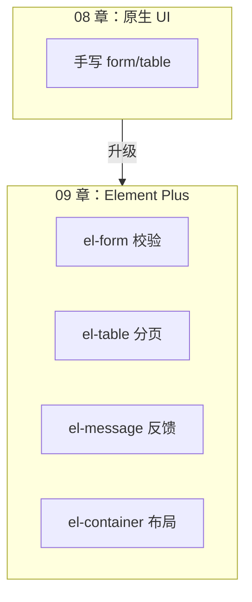
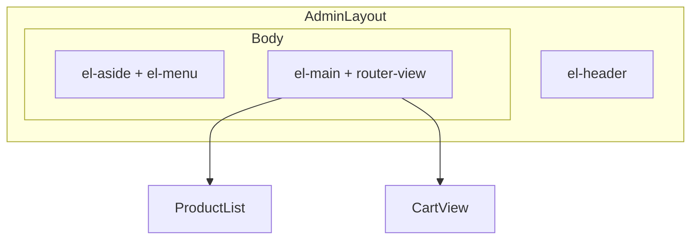
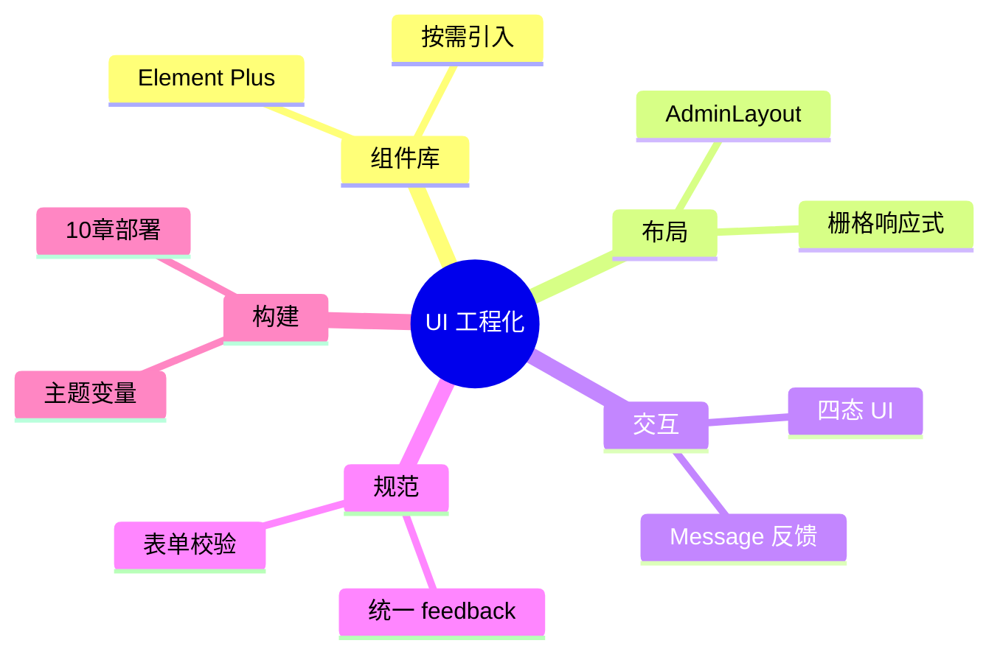

# Element Plus 与 UI 工程化

<!-- 修改说明: 2026-06-30 按 EXPANSION-STANDARD 扩充 §0 导读、DevTools、FAQ 12 题、闭卷自测、费曼检验 -->

## 0. 读前导读（零基础也能跟上）

> **读者假设**：08 章 shop-vue 已能调 [Java 04](../../后端学习/Java/04-SpringBoot核心开发.md) 接口，但 UI 仍是手写 HTML。本章接入 **Element Plus**，快速搭表单、表格、分页与消息反馈。

### 0.1 用一句话弄懂本章

**一句话**：Element Plus 是 Vue 3 的**预制 UI 积木**——`el-form`、`el-table`、`ElMessage` 替手写 CSS，让你专注业务与 [Java 04 REST](../../后端学习/Java/04-SpringBoot核心开发.md) 数据绑定。

**生活类比**：

| 概念 | 类比 |
|------|------|
| **el-form + rules** | 带校验的登记台：漏填自动红字 |
| **el-table** | 标准货架：条纹、loading、分页 |
| **ElMessage** | 广播喇叭：操作成功/失败一声提示 |
| **el-container** | 商场布局：顶栏+侧栏+主内容 |

---

### 0.2 你需要提前知道什么

| 水平 | 建议 |
|------|------|
| 08 章 Axios 四态不熟 | 先完成 [08-Axios网络请求与前后端联调](./08-Axios网络请求与前后端联调.md) |
| 06 章嵌套路由 | AdminLayout 用 [06 §14](./06-Vue-Router路由管理.md) |
| 已会 08 章 | **从 §2 安装跟做 §4～§20** |

**后端衔接**：表格数据来自 [Java 04 GET 列表](../../后端学习/Java/04-SpringBoot核心开发.md)；分页参数 `pageNum/pageSize` 与 [Java 06 MySQL LIMIT](../../后端学习/Java/06-MySQL基础索引与事务.md) 对应。

---

### 0.3 本章知识地图（☐→☑）

- [ ] 全量/按需引入 Element Plus + 图标
- [ ] el-form 校验、el-table 分页、ElMessage 反馈
- [ ] AdminLayout + 嵌套路由工程化布局
- [ ] 与 08 章四态 UI 结合（v-loading、empty）
- [ ] DevTools 检查组件 DOM 与样式
- [ ] 闭卷自测 ≥ 8/10

---

### 0.4 建议学习时长

| 阶段 | 时间 |
|------|------|
| 安装 + 全量引入 §2～§4 | 1 小时 |
| 表单/表格/登录页改造 §5～§20 | 3 小时 |
| 布局 + 按需引入 §21～§28 | 1.5 小时 |
| 自测 | 45 分钟 |

---

### 0.5 可验证成果

1. 登录页 el-form 校验：空用户名提交有红色提示。
2. 商品列表 el-table + 分页，loading 态可见。
3. 加购/删除有 ElMessage.success 提示。
4. 09 章完成后 10 章 `npm run build` 体积可接受（§28 按需优化）。

---

### 0.6 核心术语三件套

**术语（Element Plus）**：基于 Vue 3 的企业级 UI 组件库，Element UI 的继任者。
**生活类比**：宜家成品家具——不用自己锯木头，拼起来就能用。
**为什么重要**：国内中后台/商城运营台岗位高频；与 Spring Boot 后台场景契合。
**本章用到的地方**：全文。

**术语（表单校验 rules）**：声明字段规则，提交时统一验证。
**生活类比**：登机口核对护照——缺一项不让过。
**为什么重要**：与 [Java 04 @Valid DTO](../../后端学习/Java/04-SpringBoot核心开发.md) 前后端双重校验。
**本章用到的地方**：登录/注册 el-form。

**术语（按需引入）**：只打包用到的组件，减小 dist 体积。
**生活类比**：只买用到的宜家模块，不搬整仓库。
**为什么重要**：10 章生产构建优化；§28 unplugin 配置。
**本章用到的地方**：§28。

---

## 本章与上一章的关系

08 章 `shop-vue` 已能调 Spring Boot 接口、展示真实数据，但界面仍是原生 HTML + 手写 CSS：表单没有校验提示、表格没有条纹和 loading、操作反馈靠 `alert`。在团队协作和企业项目中，这种效率无法支撑中后台、商城运营台等场景。

**Element Plus** 是 Vue 3 生态最流行的 UI 组件库（饿了么开源，Element UI 的 Vue 3 继任者），提供 Button、Form、Table、Dialog、Pagination 等 **60+** 开箱即用组件。本章给 `shop-vue` 全面接入 Element Plus，并介绍布局工程化、按需引入、主题定制——为 10 章生产构建部署做好 UI 基础。



---

## 1. 为什么选 Element Plus？

| 组件库 | Vue 版本 | 特点 |
|--------|----------|------|
| Element Plus | Vue 3 | 中后台首选，文档中文，生态大 |
| Ant Design Vue | Vue 3 | 阿里系，设计规范严格 |
| Naive UI | Vue 3 | 全 TS，主题灵活 |
| Vuetify | Vue 3 | Material Design |

**选型理由（shop-vue / 初学）**：

- 国内岗位需求高，面试常问
- 与 08 章 Spring Boot 后台管理场景天然契合
- 中文文档完善：https://element-plus.org/zh-CN/

---

## 2. 安装

```bash
cd shop-vue
npm install element-plus
npm install @element-plus/icons-vue   # 图标包，几乎必装
```

验证：

```bash
npm list element-plus
# element-plus@2.x.x
```

---

## 3. 引入方式对比

| 方式 | 包体积 | 复杂度 | 适用 |
|------|--------|--------|------|
| **全量引入** | 大 | 低 | 学习、小项目 |
| **按需自动引入** | 小 | 中 | 生产推荐 |
| **手动按需** | 最小 | 高 | 极致优化 |

本章先**全量引入**跑通，§28 讲按需优化。

---

## 4. 全量引入配置 `src/main.js`

```js
import { createApp } from 'vue'
import ElementPlus from 'element-plus'
import 'element-plus/dist/index.css'
import zhCn from 'element-plus/dist/locale/zh-cn.mjs'
import * as ElementPlusIconsVue from '@element-plus/icons-vue'

import { createPinia } from 'pinia'
import App from './App.vue'
import router from './router'

const app = createApp(App)

// 注册所有图标为全局组件
for (const [key, component] of Object.entries(ElementPlusIconsVue)) {
  app.component(key, component)
}

app.use(ElementPlus, { locale: zhCn })
app.use(createPinia())
app.use(router)
app.mount('#app')
```

```bash
npm run dev
# 预期：组件样式正常，日期等组件显示中文
```

---

## 5. 常用组件速览

| 组件 | 标签 | 典型场景 |
|------|------|----------|
| 按钮 | `el-button` | 提交、操作 |
| 输入框 | `el-input` | 表单字段 |
| 表单 | `el-form` / `el-form-item` | 校验、布局 |
| 表格 | `el-table` / `el-table-column` | 数据列表 |
| 分页 | `el-pagination` | 列表分页 |
| 卡片 | `el-card` | 内容分组 |
| 消息 | `ElMessage` | 成功/失败提示 |
| 对话框 | `el-dialog` | 确认、编辑弹窗 |
| 布局 | `el-container` 系列 | 后台整体框架 |
| 菜单 | `el-menu` | 侧边导航 |
| 加载 | `v-loading` | 表格/区域 loading |
| 空状态 | `el-empty` | 无数据 |
| 标签 | `el-tag` | 状态展示 |
| 下拉 | `el-select` | 筛选 |

官方文档每个组件都有示例，本章聚焦 shop-vue 实战。

---

## 6. 布局工程化：AdminLayout

商城前台可保持简洁 Header；后台管理采用经典 **Header + Aside + Main**：

**`src/layouts/AdminLayout.vue`**：

```vue
<script setup>
import { computed } from 'vue'
import { useRoute } from 'vue-router'
import { useUserStore } from '@/stores/user'
import { storeToRefs } from 'pinia'

const route = useRoute()
const userStore = useUserStore()
const { displayName, isLoggedIn } = storeToRefs(userStore)

const activeMenu = computed(() => route.path)
</script>

<template>
  <el-container class="layout">
    <el-header class="header">
      <span class="title">🛒 shop-vue 管理台</span>
      <div class="user">
        <template v-if="isLoggedIn">
          <el-icon><User /></el-icon>
          {{ displayName }}
        </template>
        <router-link v-else to="/login">登录</router-link>
      </div>
    </el-header>

    <el-container>
      <el-aside width="220px" class="aside">
        <el-menu
          :default-active="activeMenu"
          router
          background-color="#304156"
          text-color="#bfcbd9"
          active-text-color="#409EFF"
        >
          <el-menu-item index="/">
            <el-icon><HomeFilled /></el-icon>
            <span>首页</span>
          </el-menu-item>
          <el-menu-item index="/products">
            <el-icon><Goods /></el-icon>
            <span>商品管理</span>
          </el-menu-item>
          <el-menu-item index="/cart">
            <el-icon><ShoppingCart /></el-icon>
            <span>购物车</span>
          </el-menu-item>
        </el-menu>
      </el-aside>

      <el-main class="main">
        <router-view />
      </el-main>
    </el-container>
  </el-container>
</template>

<style scoped>
.layout { min-height: 100vh; }
.header {
  display: flex;
  align-items: center;
  justify-content: space-between;
  background: #fff;
  border-bottom: 1px solid #eee;
}
.title { font-size: 18px; font-weight: 600; }
.aside { background: #304156; }
.main { background: #f0f2f5; padding: 20px; }
.user { display: flex; align-items: center; gap: 8px; }
</style>
```

**路由嵌套**（可选，前台/后台分离）：

```js
{
  path: '/',
  component: AdminLayout,
  children: [
    { path: '', component: HomeView },
    { path: 'products', component: ProductList },
    { path: 'cart', component: CartView },
  ],
}
```



---

## 7. 手把手：登录页（完整 Element Plus 版）

**`src/views/LoginView.vue`**：

```vue
<script setup>
import { reactive, ref } from 'vue'
import { useRoute, useRouter } from 'vue-router'
import { useUserStore } from '@/stores/user'
import { login } from '@/api/auth'
import { ElMessage } from 'element-plus'

const route = useRoute()
const router = useRouter()
const userStore = useUserStore()

const formRef = ref(null)
const loading = ref(false)

const form = reactive({
  username: '',
  password: '',
})

const rules = {
  username: [
    { required: true, message: '请输入用户名', trigger: 'blur' },
    { min: 2, max: 20, message: '长度 2～20 字符', trigger: 'blur' },
  ],
  password: [
    { required: true, message: '请输入密码', trigger: 'blur' },
    { min: 6, message: '密码至少 6 位', trigger: 'blur' },
  ],
}

async function onSubmit() {
  const valid = await formRef.value.validate().catch(() => false)
  if (!valid) return

  loading.value = true
  try {
    const data = await login(form)
    userStore.setLogin({ token: data.token, username: form.username })
    ElMessage.success('登录成功')
    router.push(route.query.redirect || '/')
  } catch (e) {
    ElMessage.error(e.message || '登录失败')
  } finally {
    loading.value = false
  }
}

function onReset() {
  formRef.value.resetFields()
}
</script>

<template>
  <div class="login-page">
    <el-card class="login-card" shadow="hover">
      <template #header>
        <h2 class="card-title">用户登录</h2>
      </template>

      <el-form
        ref="formRef"
        :model="form"
        :rules="rules"
        label-width="80px"
        @keyup.enter="onSubmit"
      >
        <el-form-item label="用户名" prop="username">
          <el-input
            v-model="form.username"
            placeholder="admin"
            :prefix-icon="User"
            clearable
          />
        </el-form-item>

        <el-form-item label="密码" prop="password">
          <el-input
            v-model="form.password"
            type="password"
            placeholder="123456"
            show-password
            :prefix-icon="Lock"
          />
        </el-form-item>

        <el-form-item>
          <el-button type="primary" :loading="loading" @click="onSubmit">
            登录
          </el-button>
          <el-button @click="onReset">重置</el-button>
        </el-form-item>
      </el-form>

      <el-alert
        v-if="route.query.redirect"
        :title="`登录后将跳转到：${route.query.redirect}`"
        type="info"
        :closable="false"
        show-icon
      />
    </el-card>
  </div>
</template>

<script>
import { User, Lock } from '@element-plus/icons-vue'
export default { components: { User, Lock } }
</script>

<style scoped>
.login-page {
  min-height: 100vh;
  display: flex;
  align-items: center;
  justify-content: center;
  background: linear-gradient(135deg, #667eea 0%, #764ba2 100%);
}
.login-card { width: 420px; }
.card-title { margin: 0; text-align: center; }
</style>
```

**为什么用 ElMessage 而不是 alert？**

- 非阻塞，用户体验好
- 风格统一，可配置 duration、type
- 08 章 axios 拦截器也可统一 `ElMessage.error`

---

## 8. 手把手：商品表格 + 分页 + 搜索

**`src/views/ProductList.vue`**（Element Plus 完整版）：

```vue
<script setup>
import { ref, reactive, onMounted } from 'vue'
import { getProductList } from '@/api/product'
import { usersToProducts } from '@/composables/useProductAdapter'
import { useCartStore } from '@/stores/cart'
import { ElMessage } from 'element-plus'

const cartStore = useCartStore()

const tableData = ref([])
const loading = ref(false)
const total = ref(0)

const query = reactive({
  keyword: '',
  pageNum: 1,
  pageSize: 10,
})

async function loadData() {
  loading.value = true
  try {
    const data = await getProductList({
      pageNum: query.pageNum,
      pageSize: query.pageSize,
    })
    let products = usersToProducts(data)

    // 前端关键字过滤（后端有搜索接口时应传给后端）
    if (query.keyword) {
      products = products.filter(p =>
        p.name.includes(query.keyword)
      )
    }

    tableData.value = products
    total.value = products.length
  } catch (e) {
    ElMessage.error(e.message)
  } finally {
    loading.value = false
  }
}

function handleSearch() {
  query.pageNum = 1
  loadData()
}

function handleReset() {
  query.keyword = ''
  query.pageNum = 1
  loadData()
}

function handleAddCart(row) {
  cartStore.add(row)
  ElMessage.success(`已加入购物车：${row.name}`)
}

function handlePageChange(page) {
  query.pageNum = page
  loadData()
}

onMounted(loadData)
</script>

<template>
  <el-card shadow="never">
    <template #header>
      <div class="card-header">
        <span>商品管理</span>
        <el-button type="primary" :icon="Refresh" circle @click="loadData" />
      </div>
    </template>

    <!-- 搜索栏 -->
    <el-form :inline="true" :model="query" class="search-form">
      <el-form-item label="关键字">
        <el-input
          v-model="query.keyword"
          placeholder="商品名称"
          clearable
          @keyup.enter="handleSearch"
        />
      </el-form-item>
      <el-form-item>
        <el-button type="primary" @click="handleSearch">搜索</el-button>
        <el-button @click="handleReset">重置</el-button>
      </el-form-item>
    </el-form>

    <!-- 表格 -->
    <el-table
      :data="tableData"
      v-loading="loading"
      stripe
      border
      style="width: 100%"
      empty-text="暂无数据"
    >
      <el-table-column prop="id" label="ID" width="80" sortable />
      <el-table-column prop="name" label="商品名" min-width="180" />
      <el-table-column prop="price" label="价格" width="120">
        <template #default="{ row }">
          <span class="price">¥ {{ row.price }}</span>
        </template>
      </el-table-column>
      <el-table-column prop="category" label="分类" width="120">
        <template #default="{ row }">
          <el-tag :type="row.category === 'premium' ? 'warning' : 'info'">
            {{ row.category }}
          </el-tag>
        </template>
      </el-table-column>
      <el-table-column label="操作" width="220" fixed="right">
        <template #default="{ row }">
          <el-button
            size="small"
            type="primary"
            link
            @click="$router.push(`/products/${row.id}`)"
          >
            详情
          </el-button>
          <el-button
            size="small"
            type="success"
            link
            @click="handleAddCart(row)"
          >
            加购
          </el-button>
        </template>
      </el-table-column>
    </el-table>

    <!-- 分页 -->
    <div class="pagination-wrap">
      <el-pagination
        v-model:current-page="query.pageNum"
        v-model:page-size="query.pageSize"
        :total="total"
        :page-sizes="[10, 20, 50]"
        layout="total, sizes, prev, pager, next, jumper"
        background
        @current-change="handlePageChange"
        @size-change="loadData"
      />
    </div>
  </el-card>
</template>

<script>
import { Refresh } from '@element-plus/icons-vue'
export default { components: { Refresh } }
</script>

<style scoped>
.card-header { display: flex; justify-content: space-between; align-items: center; }
.search-form { margin-bottom: 16px; }
.price { color: #f56c6c; font-weight: 600; }
.pagination-wrap { margin-top: 16px; display: flex; justify-content: flex-end; }
</style>
```

### 8.1 商品表格模板关键行逐行读

| 模板/脚本 | 含义 | 改错会怎样 |
|-----------|------|------------|
| `:data="tableData"` | 绑定 08 章 API 结果 | 空数组显示空表 |
| `v-loading="loading"` | 四态 loading | 漏则请求中无反馈 |
| `el-table-column prop="name"` | 列字段与 VO 对齐 | prop 错则列空白 |
| `@current-change` 分页 | 触发 loadData 新 pageNum | 漏则翻页不请求 |
| `ElMessage.success` | 加购反馈 | 用 alert 体验差 |
| `usersToProducts` | UserVO→商品 adapter | 08 章换真实 Product 可删 |

---

**`src/views/ProductDetail.vue`**：

```vue
<script setup>
import { ref, watch } from 'vue'
import { useRouter } from 'vue-router'
import { getProductById } from '@/api/product'
import { userToProduct } from '@/composables/useProductAdapter'
import { useCartStore } from '@/stores/cart'
import { ElMessage } from 'element-plus'

const props = defineProps({ id: { type: String, required: true } })
const router = useRouter()
const cartStore = useCartStore()

const product = ref(null)
const loading = ref(false)

async function loadDetail(id) {
  loading.value = true
  product.value = null
  try {
    const data = await getProductById(id)
    product.value = userToProduct(data)
  } catch (e) {
    ElMessage.error(e.message)
  } finally {
    loading.value = false
  }
}

function handleAddCart() {
  cartStore.add(product.value)
  ElMessage.success('已加入购物车')
}

watch(() => props.id, loadDetail, { immediate: true })
</script>

<template>
  <el-card v-loading="loading" shadow="never">
    <el-page-header @back="router.back()" content="商品详情" />

    <el-descriptions v-if="product" :column="1" border class="detail">
      <el-descriptions-item label="ID">{{ product.id }}</el-descriptions-item>
      <el-descriptions-item label="名称">{{ product.name }}</el-descriptions-item>
      <el-descriptions-item label="价格">
        <span class="price">¥ {{ product.price }}</span>
      </el-descriptions-item>
      <el-descriptions-item label="描述">{{ product.desc }}</el-descriptions-item>
    </el-descriptions>

    <el-empty v-else-if="!loading" description="商品不存在" />

    <div v-if="product" class="actions">
      <el-button type="primary" size="large" @click="handleAddCart">
        加入购物车
      </el-button>
    </div>
  </el-card>
</template>

<style scoped>
.detail { margin-top: 24px; }
.price { color: #f56c6c; font-size: 20px; font-weight: 600; }
.actions { margin-top: 24px; }
</style>
```

---

## 10. 购物车页 Element Plus 版

**`src/views/CartView.vue`**：

```vue
<script setup>
import { storeToRefs } from 'pinia'
import { useCartStore } from '@/stores/cart'
import { ElMessage, ElMessageBox } from 'element-plus'

const cartStore = useCartStore()
const { items, totalCount, totalPrice, isEmpty } = storeToRefs(cartStore)

async function handleClear() {
  await ElMessageBox.confirm('确定清空购物车？', '提示', { type: 'warning' })
  cartStore.clear()
  ElMessage.success('已清空')
}

function handleQtyChange(row, val) {
  cartStore.updateQty(row.id, val)
}
</script>

<template>
  <el-card shadow="never">
    <template #header>
      <span>购物车 ({{ totalCount }} 件)</span>
    </template>

    <el-empty v-if="isEmpty" description="购物车是空的">
      <el-button type="primary" @click="$router.push('/products')">
        去逛逛
      </el-button>
    </el-empty>

    <template v-else>
      <el-table :data="items" border>
        <el-table-column prop="name" label="商品" />
        <el-table-column prop="price" label="单价" width="120">
          <template #default="{ row }">¥ {{ row.price }}</template>
        </el-table-column>
        <el-table-column label="数量" width="160">
          <template #default="{ row }">
            <el-input-number
              :model-value="row.qty"
              :min="1"
              :max="99"
              size="small"
              @change="(val) => handleQtyChange(row, val)"
            />
          </template>
        </el-table-column>
        <el-table-column label="小计" width="120">
          <template #default="{ row }">
            ¥ {{ (row.price * row.qty).toFixed(2) }}
          </template>
        </el-table-column>
        <el-table-column label="操作" width="100">
          <template #default="{ row }">
            <el-button type="danger" link @click="cartStore.remove(row.id)">
              删除
            </el-button>
          </template>
        </el-table-column>
      </el-table>

      <div class="footer">
        <span class="total">合计：<strong>¥ {{ totalPrice.toFixed(2) }}</strong></span>
        <el-button type="danger" plain @click="handleClear">清空</el-button>
        <el-button type="primary">去结算（演示）</el-button>
      </div>
    </template>
  </el-card>
</template>

<style scoped>
.footer {
  margin-top: 20px;
  display: flex;
  align-items: center;
  justify-content: flex-end;
  gap: 12px;
}
.total { margin-right: auto; font-size: 16px; }
.total strong { color: #f56c6c; font-size: 20px; }
</style>
```

---

## 11. 首页 Element Plus 版

**`src/views/HomeView.vue`**：

```vue
<template>
  <el-row :gutter="20">
    <el-col :span="8">
      <el-card shadow="hover">
        <el-statistic title="商品总数" :value="128" />
      </el-card>
    </el-col>
    <el-col :span="8">
      <el-card shadow="hover">
        <el-statistic title="今日订单" :value="36" />
      </el-card>
    </el-col>
    <el-col :span="8">
      <el-card shadow="hover">
        <el-statistic title="待发货" :value="12" />
      </el-card>
    </el-col>
  </el-row>

  <el-card class="welcome" shadow="never">
    <h2>欢迎来到 shop-vue 商城</h2>
    <p>本章已接入 Element Plus，请从左侧菜单进入商品管理。</p>
    <el-button type="primary" @click="$router.push('/products')">
      浏览商品
    </el-button>
  </el-card>
</template>

<style scoped>
.welcome { margin-top: 20px; text-align: center; padding: 40px; }
h2 { margin-bottom: 12px; }
p { color: #666; margin-bottom: 20px; }
</style>
```

---

## 12. 全局样式与 Element Plus 共存

**`src/styles/index.css`**：

```css
/* 重置与 Element 共存 */
html, body, #app {
  margin: 0;
  padding: 0;
  height: 100%;
}

/* 覆盖 Element 变量（CSS 变量） */
:root {
  --el-color-primary: #409eff;
}
```

在 `main.js` 引入：`import '@/styles/index.css'`

---

## 13. 表单校验规则详解

| 规则属性 | 说明 | 示例 |
|----------|------|------|
| `required` | 必填 | `{ required: true, message: '...' }` |
| `min` / `max` | 长度 | 密码至少 6 位 |
| `pattern` | 正则 | 手机号 |
| `validator` | 自定义函数 | 两次密码一致 |
| `trigger` | 触发时机 | `blur` / `change` |

自定义校验：

```js
const validatePass2 = (rule, value, callback) => {
  if (value !== form.password) {
    callback(new Error('两次密码不一致'))
  } else {
    callback()
  }
}
```

---

## 14. Table 高级：自定义列与 slot

```vue
<el-table-column label="状态">
  <template #default="{ row }">
    <el-tag :type="row.status === 1 ? 'success' : 'danger'">
      {{ row.status === 1 ? '上架' : '下架' }}
    </el-tag>
  </template>
</el-table-column>
```

`#default="{ row, column, $index }"` 是 Element Plus 表格列 slot 的标准写法。

---

## 15. Dialog 弹窗：新增商品（演示）

**`src/components/ProductFormDialog.vue`**：

```vue
<script setup>
import { reactive, ref, watch } from 'vue'
import { createUser } from '@/api/user'
import { ElMessage } from 'element-plus'

const props = defineProps({
  visible: Boolean,
})
const emit = defineEmits(['update:visible', 'success'])

const formRef = ref(null)
const loading = ref(false)
const form = reactive({ name: '', age: 1 })

const rules = {
  name: [{ required: true, message: '请输入名称', trigger: 'blur' }],
  age: [{ required: true, message: '请输入价格系数', trigger: 'blur' }],
}

watch(() => props.visible, (val) => {
  if (val) {
    form.name = ''
    form.age = 1
  }
})

async function handleSubmit() {
  const valid = await formRef.value.validate().catch(() => false)
  if (!valid) return
  loading.value = true
  try {
    await createUser({ name: form.name, age: form.age })
    ElMessage.success('新增成功')
    emit('success')
    emit('update:visible', false)
  } catch (e) {
    ElMessage.error(e.message)
  } finally {
    loading.value = false
  }
}
</script>

<template>
  <el-dialog
    :model-value="visible"
    title="新增商品"
    width="480px"
    @update:model-value="emit('update:visible', $event)"
  >
    <el-form ref="formRef" :model="form" :rules="rules" label-width="80px">
      <el-form-item label="名称" prop="name">
        <el-input v-model="form.name" />
      </el-form-item>
      <el-form-item label="价格系数" prop="age">
        <el-input-number v-model="form.age" :min="1" />
      </el-form-item>
    </el-form>
    <template #footer>
      <el-button @click="emit('update:visible', false)">取消</el-button>
      <el-button type="primary" :loading="loading" @click="handleSubmit">
        确定
      </el-button>
    </template>
  </el-dialog>
</template>
```

---

## 16. Message / MessageBox / Notification

```js
import { ElMessage, ElMessageBox, ElNotification } from 'element-plus'

ElMessage.success('操作成功')
ElMessage.error('操作失败')
ElMessage.warning('请注意')
ElMessage.info('提示信息')

ElMessageBox.confirm('确定删除？', '警告', { type: 'warning' })
  .then(() => { /* 确认 */ })
  .catch(() => { /* 取消 */ })

ElNotification({
  title: '系统通知',
  message: '您有一条新订单',
  type: 'info',
  duration: 4500,
})
```

**在 axios 拦截器里统一错误提示**：

```js
import { ElMessage } from 'element-plus'
// 响应 error 分支
ElMessage.error(message)
```

---

## 17. v-loading 指令

```vue
<div v-loading="loading" element-loading-text="加载中...">
  <!-- 内容 -->
</div>

<el-table v-loading="loading" :data="tableData" />
```

---

## 18. 图标使用方式

```vue
<!-- 方式 1：全局注册后直接用 -->
<el-icon><Edit /></el-icon>

<!-- 方式 2：el-button 的 icon 属性 -->
<el-button :icon="Search">搜索</el-button>

<script setup>
import { Search, Edit } from '@element-plus/icons-vue'
</script>
```

---

## 19. 暗色模式（了解）

Element Plus 2.x 支持暗色 CSS 变量：

```js
import 'element-plus/theme-chalk/dark/css-vars.css'
```

配合 `html class="dark"` 切换。商城项目可按需接入。

---

## 20. 生产级案例：统一反馈封装

**`src/utils/feedback.js`**：

```js
import { ElMessage, ElMessageBox, ElNotification } from 'element-plus'

export const feedback = {
  success(msg) { ElMessage.success(msg) },
  error(msg) { ElMessage.error(msg || '操作失败') },
  confirm(msg, title = '提示') {
    return ElMessageBox.confirm(msg, title, { type: 'warning' })
  },
  notify(title, message) {
    ElNotification({ title, message, type: 'info' })
  },
}
```

组件里 `feedback.success('保存成功')`，便于以后换 UI 库。

---

## 21. 生产级案例：表格页模板抽取

大型项目会把「搜索 + 表格 + 分页」抽成 `ProTable` 组件，props 传入 columns、fetchApi。思路：

```vue
<ProTable
  :columns="columns"
  :request="getProductList"
  :adapt="usersToProducts"
/>
```

本章先写完整页面，熟悉后再抽象。

---

## 22. 生产级案例：权限按钮

```vue
<el-button v-if="userStore.hasPermission('product:add')" type="primary">
  新增
</el-button>
```

`userStore` 存角色/权限码，与后端 RBAC 对齐。

---

## 23. 与 08 章 axios 联动清单

| 场景 | Element Plus 组件 |
|------|-------------------|
| 请求 loading | `v-loading`、`:loading="loading"` |
| 成功/失败 | `ElMessage` |
| 删除确认 | `ElMessageBox.confirm` |
| 表单提交 | `el-form` validate + `:loading` |
| 空数据 | `el-empty` |
| 401 跳转 | 拦截器 + 登录页 `el-form` |

---

## 24. 响应式布局

```vue
<el-row :gutter="20">
  <el-col :xs="24" :sm="12" :md="8" :lg="6">
    <el-card>卡片</el-card>
  </el-col>
</el-row>
```

`:xs` 手机、`:md` 平板、`:lg` 桌面——Element Plus 基于 24 栅格。

---

## 25. 学完标准

- [ ] 会安装配置 Element Plus + 中文 locale + 图标
- [ ] 会用 Form 校验、Table、Pagination、Message
- [ ] 会用 `el-container` 做后台布局
- [ ] shop-vue 登录、列表、购物车、详情均换成 Element UI
- [ ] 理解全量 vs 按需引入取舍

---

## 26. 分级练习

### 26.1 基础：按钮 + Message 提示

```vue
<el-button type="primary" @click="ElMessage.success('Hello Element Plus')">
  点我
</el-button>
```

---

### 26.2 进阶：Form 校验登录

**参考答案**：见 §7 完整 LoginView。

---

### 26.3 挑战：Table + 分页对接后端

**参考答案**：见 §8 ProductList.vue。

验证：表格显示 `/api/users` 数据，分页器可切换（前端模拟 total）。

---

### 26.4 挑战+：Dialog 新增商品并刷新列表

在 ProductList 加「新增」按钮，打开 §15 ProductFormDialog，`@success="loadData"`。

---

## 27. 常见报错与排查

| 报错信息 | 可能原因 | 排查步骤 | 解决方案 |
|---------|---------|---------|---------|
| 样式全乱/无样式 | 未引入 CSS | 看 main.js | `import 'element-plus/dist/index.css'` |
| 图标不显示 | 未装或未注册 icons | 看组件名 | `npm i @element-plus/icons-vue` 并注册 |
| `formRef.value.validate is not a function` | formRef 未绑定 | 看 template | `ref="formRef"` 对应 `const formRef = ref(null)` |
| 表单 rules 不触发 | prop 与 model 字段不一致 | 对照 prop | `el-form-item prop="username"` 对应 `form.username` |
| 中文显示英文 | 未配 locale | 日期选择器等 | `app.use(ElementPlus, { locale: zhCn })` |
| `el-table` 数据不更新 | 非响应式赋值 | Vue DevTools | 整体替换数组引用 |
| Dialog 无法关闭 | v-model 绑定错 | 看 emit | 用 `:model-value` + `@update:model-value` |
| 按需引入组件未注册 | 自动导入配错 | 看 vite 插件 | 检查 unplugin-vue-components 配置 |
| Sass 变量编译失败 | 主题定制方式旧 | 看 EP 版本 | 用 CSS 变量 `--el-color-primary` |
| 分页 current-page 不同步 | 双向绑定漏了 | 看 v-model | `v-model:current-page="query.pageNum"` |
| Message 弹出多次 | 拦截器重复调用 | 看 axios | 合并错误处理，避免双 toast |
| 暗色模式样式冲突 | 未引入 dark css | html class | 按文档引入 dark/css-vars.css |
| 打包体积过大 | 全量引入 | 看 dist assets | 改按需引入（§28） |

---

## 28. 按需引入（生产优化）

```bash
npm install -D unplugin-vue-components unplugin-auto-import
```

**`vite.config.js`**：

```js
import AutoImport from 'unplugin-auto-import/vite'
import Components from 'unplugin-vue-components/vite'
import { ElementPlusResolver } from 'unplugin-vue-components/resolvers'

export default defineConfig({
  plugins: [
    vue(),
    AutoImport({
      resolvers: [ElementPlusResolver()],
    }),
    Components({
      resolvers: [ElementPlusResolver()],
    }),
  ],
})
```

之后 `main.js` 可移除全量 `app.use(ElementPlus)`，组件用时自动导入。

---

## 29. 主题定制

```css
:root {
  --el-color-primary: #42b983;
  --el-color-primary-light-3: #66c9a0;
  --el-color-primary-dark-2: #359268;
}
```

或用 SCSS 变量（需 sass）：见官方「自定义主题」文档。

---

## 30. 常见问题 FAQ

### Q1：Element UI 和 Element Plus 能混用吗？

不能。Element UI 仅 Vue 2；Vue 3 项目只用 Element Plus。

### Q2：ElMessage 为什么要单独 import？

它是函数式组件，不是模板标签。按需引入时从 `element-plus` 导入。

### Q3：表格列太多横向溢出怎么办？

给 `el-table` 设 `max-height` 或列 `fixed="right"`，或外层包 `el-scrollbar`。

### Q4：如何全局改默认组件尺寸？

```js
app.use(ElementPlus, { size: 'small', locale: zhCn })
```

### Q5：Element Plus 支持 Vue 2 吗？

不支持。Vue 2 用 Element UI。

### Q6：和 Tailwind CSS 冲突吗？

一般不冲突。注意两者都改全局样式时优先级；组件库样式优先用 `:deep()` 覆盖。

### Q7：el-table 数据从哪来？

08 章 Axios 调 [Java 04 GET 列表](../../后端学习/Java/04-SpringBoot核心开发.md)；`:data="list"` 绑定 ref，`:loading="loading"` 绑四态。

### Q8：表单 rules 与后端 @Valid 关系？

前端 rules 提升体验；后端 [Java 04 DTO @NotBlank](../../后端学习/Java/04-SpringBoot核心开发.md) 才是安全底线，双重校验。

### Q9：v-loading 和 loading ref 区别？

`v-loading` 是 Element 指令盖遮罩；`loading ref` 是 08 章逻辑变量，可绑 `:loading="loading"` 给 el-table。

### Q10：AdminLayout 和 06 章嵌套路由？

见 [06 §14 嵌套路由](./06-Vue-Router路由管理.md)；父 Layout 里 `<router-view />` 渲染子页。

### Q11：图标 `<el-icon><Plus /></el-icon>` 不显示？

需 `@element-plus/icons-vue` 并在 main.js 全局注册或按需 import 组件。

### Q12：build 后 Element 样式丢失？

生产 build 须 import CSS 或按需插件正确解析；10 章 build 后 preview 验收。

---

## 30.1 DevTools 验收 Element Plus（步骤表）

| 步骤 | 你的动作 | 预期看到什么 | 若不对 |
|------|----------|--------------|--------|
| 1 | 登录页空提交 | el-form 表单项下红色校验文案 | rules 未配或 prop 未对应 |
| 2 | 正确登录 | ElMessage.success 弹出 | 未 import ElMessage |
| 3 | 商品列表加载 | el-table 有 v-loading 遮罩 | loading ref 未绑 |
| 4 | Elements 检查表头 | `el-table__header` 结构 | 全量 CSS 未引入 |
| 5 | 分页点击 | 触发 @current-change，Network 带 page 参数 | 08 章 API params |
| 6 | 窄屏 F12 设备模式 | el-col 栅格换行 | 未用 el-row/el-col |
| 7 | Vue DevTools | 组件树见 ElForm、ElTable | 组件名正常 |

### 30.2 与 Java 04/06 表单—表格字段对照

| UI 组件 | 绑定字段 | 后端 DTO/VO（Java） |
|---------|----------|---------------------|
| el-input username | `form.username` | [Java 04 LoginDTO.username](../../后端学习/Java/04-SpringBoot核心开发.md) |
| el-table-column name | `row.name` | UserVO.name / ProductVO.name |
| el-pagination pageNum | `@current-change` | [Java 06 分页参数](../../后端学习/Java/06-MySQL基础索引与事务.md) LIMIT offset |
| el-form rules | 前端校验 | `@Valid @NotBlank` 后端二次校验 |

**原则**：字段名前后端一致，减少 adapter 层；不一致时在 08 章 composable 映射（见 useProductAdapter）。

### 30.3 shop-vue 09 章完成自检

```text
☐ main.js 全量 Element Plus + zhCn + 图标
☐ LoginView 用 el-form + rules
☐ ProductList 用 el-table + v-loading + 分页
☐ 操作反馈用 ElMessage，非 alert
☐ AdminLayout + 嵌套路由（可选）
☐ build 后 preview 样式正常（10 章）
```

---

## 31. UI 工程化最佳实践清单



1. **统一布局**：AdminLayout + 嵌套路由  
2. **统一反馈**：feedback.js / ElMessage  
3. **统一表格页**：搜索 + Table + Pagination 模式  
4. **统一表单**：rules 抽离到独立文件  
5. **统一 loading**：v-loading 或表格 :loading  
6. **图标规范**：只用 @element-plus/icons-vue  
7. **样式规范**：优先组件 props，少写 magic CSS  

---

## 33. 闭卷自测

1. Element Plus 与 Element UI 能否混用？为什么？
2. ElMessage 为什么要从 `element-plus` import 而非模板标签？
3. el-form 的 `:rules` 和 `prop` 如何配合？
4. 全量引入与按需引入对 build 体积有何影响？
5. el-table 如何展示 08 章 loading/error 四态？
6. `:deep()` 使用场景？
7. AdminLayout 嵌套路由的关键 HTML 是什么？
8. **动手**：登录空字段触发校验红字。
9. **动手**：表格分页切换时 Network 请求带 page 参数。
10. **综合**：09 章 UI + 08 章 API + [Java 04](../../后端学习/Java/04-SpringBoot核心开发.md) 如何组成列表页？

### 33.1 自测参考答案

1. 不能；Element UI 仅 Vue 2，Vue 3 用 Element Plus。
2. 函数式调用，非声明式组件。
3. 每项 `prop="username"` 对应 rules 里同名字段规则。
4. 全量大包大；按需 tree-shaking 减小 dist（§28）。
5. `:data` + `:loading` + v-if error/empty 分支或 slot empty。
6. scoped 样式穿透子组件（如改 el-input 内层）。
7. 父 Layout 模板含 `<router-view />` 渲染子路由。
8. rules 设 required → 空提交 → 字段下红色 message。
9. @current-change → loadData({ pageNum }) → axios params。
10. el-table 绑 Axios 返回 list；loading 绑请求态；数据来自 Java 04 Controller。

---

## 34. 费曼检验

3 分钟解释为何用 Element Plus：

1. **省时间**：表单校验、表格、分页不用手写 CSS，对接 [Java 04](../../后端学习/Java/04-SpringBoot核心开发.md) 列表即可。
2. **像正规军**：Message、Loading 反馈统一，不像学生作业 alert。
3. **为上线准备**：09 章 UI + 10 章 build 才是可交付成品。

---

## 35. 本章小结

你已将 `shop-vue` 从「能跑的原型」升级为「像样的中后台界面」：登录有校验、列表有表格分页、操作有 Message 反馈、整体有 Layout 框架。下一章进入 **Vite 构建与部署**，把 `npm run dev` 的开发成果变成用户可访问的生产站点。

---

## 下一章预告

界面像样了，怎么交给用户访问？下一章（10 Vite 构建与部署）讲 `npm run build` 打 `dist` 包、环境变量、Nginx 托管 SPA fallback——和 [后端 09 章](../../后端学习/Java/09-LinuxDockerNginx部署基础.md) 前后端一起部署，完成从开发到上线的闭环。

---

*下一章：10 Vite 构建与项目部署*
