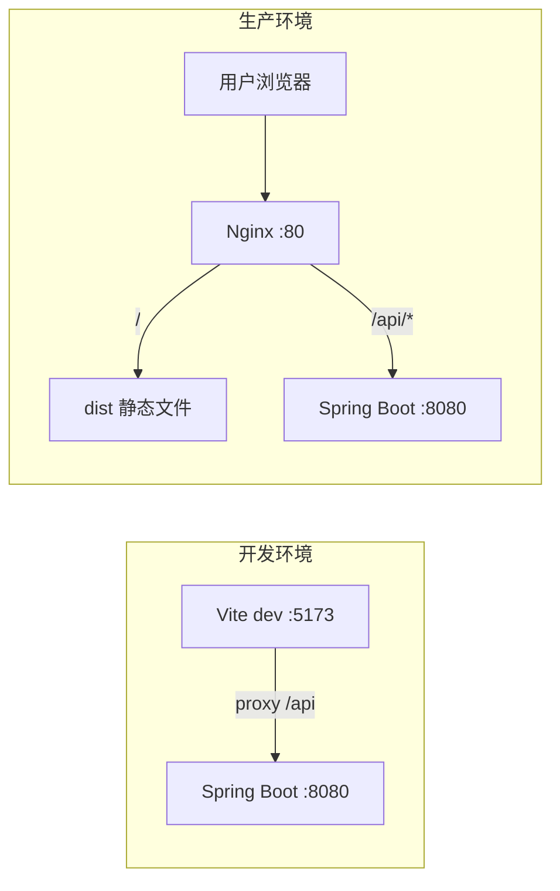

# Vite 构建与项目部署

> **文件编码**：UTF-8。本章在 `shop-vue` 项目上演示，请先完成 01～09 章。

---

## 本章与上一章的关系

09 章 `shop-vue` 在 `npm run dev` 下跑得好好的——页面刷新快、热更新顺手。但 **Vite 开发服务器不能给用户用**：它未压缩、未优化、且通常只监听 localhost。

这一章学 **生产构建与部署**：

1. 理解 Vite 开发模式 vs 生产模式的差异
2. 配置 `vite.config.js`、环境变量、路径别名
3. `npm run build` 生成 `dist` 静态资源
4. 用 Nginx 托管 SPA，并反代 `/api` 到 Spring Boot
5. 可选 Docker 一键部署前后端
6. 打包优化与常见故障排查

对应 [后端 09 章 Linux/Docker/Nginx](../../后端学习/Java/09-LinuxDockerNginx部署基础.md) 的 Nginx 反代——**前后端联调的最后一块拼图**。完成后，用户通过 `http://你的域名/` 访问商城前台，通过同域 `/api` 访问后端，无需 CORS。



---

## 1. Vite 是什么

Vite（法语「快」）是 Vue 3 生态默认的**构建工具**，由 Vue 作者尤雨溪团队推动。

### 1.1 开发模式（`npm run dev`）

- 利用浏览器原生 **ES Module**，源码不预先打包
- 依赖用 **esbuild** 预构建（极快）
- 修改文件 → **HMR** 热更新，通常毫秒级
- 启动时间：**秒级**（Webpack 大项目可能分钟级）

### 1.2 生产模式（`npm run build`）

- 使用 **Rollup** 打包、Tree-shaking、代码分割
- 输出静态文件：`index.html` + `assets/*.js` + `assets/*.css`
- 文件名带 **content hash**（利于 CDN 缓存）
- 可选压缩：esbuild minify 或 terser

### 1.3 与 Webpack 对比（面试口述）

| 维度 | Vite | Webpack（Vue CLI） |
|------|------|---------------------|
| 开发启动 | ESM 按需加载，快 | 全量打包后启动，慢 |
| 热更新 | 精确到模块 | 可能较慢 |
| 生产打包 | Rollup | Webpack |
| Vue 3 默认 | ✅ create-vue | Vue 2 时代常用 |

---

## 2. 项目脚本与产物结构

`package.json` 典型脚本：

```json
{
  "scripts": {
    "dev": "vite",
    "build": "vite build",
    "preview": "vite preview"
  }
}
```

| 命令 | 作用 | 典型场景 |
|------|------|----------|
| `npm run dev` | 启动开发服务器 | 日常开发 |
| `npm run build` | 生产构建 → `dist/` | 上线前 |
| `npm run preview` | 本地预览 dist | 验证 build 结果 |

**build 成功后 dist 结构**：

```text
dist/
├── index.html                 # 入口 HTML，引用 hashed JS/CSS
├── favicon.ico
└── assets/
    ├── index-a1b2c3d4.js      # 主包 + 路由 chunk
    ├── index-e5f6g7h8.css
    ├── ProductList-i9j0k1l2.js  # 懒加载路由 chunk（若配置了）
    └── ...
```

---

## 3. vite.config.js 完整配置详解

在 `shop-vue` 根目录创建或完善 `vite.config.js`：

```js
import { fileURLToPath, URL } from 'node:url'
import { defineConfig, loadEnv } from 'vite'
import vue from '@vitejs/plugin-vue'

// https://vitejs.dev/config/
export default defineConfig(({ command, mode }) => {
  // mode: development | production
  const env = loadEnv(mode, process.cwd(), '')
  const isDev = command === 'serve'

  return {
    // 部署子路径时必须设置，见 §5
    base: env.VITE_BASE_URL || '/',

    plugins: [vue()],

    resolve: {
      alias: {
        '@': fileURLToPath(new URL('./src', import.meta.url)),
      },
    },

    server: {
      host: '0.0.0.0',   // 局域网手机可访问
      port: 5173,
      open: true,        // 启动自动打开浏览器
      proxy: {
        '/api': {
          target: env.VITE_API_PROXY_TARGET || 'http://localhost:8080',
          changeOrigin: true,
          // 若后端没有 /api 前缀，可 rewrite：
          // rewrite: (path) => path.replace(/^\/api/, ''),
        },
      },
    },

    preview: {
      port: 4173,
      proxy: {
        '/api': {
          target: 'http://localhost:8080',
          changeOrigin: true,
        },
      },
    },

    build: {
      outDir: 'dist',
      assetsDir: 'assets',
      sourcemap: false,           // 生产一般关；调试可开 true
      chunkSizeWarningLimit: 800, // kB，超过警告
      rollupOptions: {
        output: {
          manualChunks: {
            vue: ['vue', 'vue-router', 'pinia'],
            element: ['element-plus'],
          },
        },
      },
    },

    css: {
      devSourcemap: true,
    },
  }
})
```

### 3.1 配置项说明

| 配置 | 含义 | 常见坑 |
|------|------|--------|
| `base` | 静态资源公共路径 | 子目录部署忘改 → 白屏 |
| `resolve.alias` | `@` → `src` | 需配合 jsconfig/tsconfig paths |
| `server.proxy` | 开发环境跨域 | 只 dev 有效，生产靠 Nginx |
| `build.outDir` | 输出目录 | 默认 dist |
| `manualChunks` | 分包策略 | 避免单 js 过大 |

### 3.2 jsconfig.json（配合 @ 别名）

```json
{
  "compilerOptions": {
    "baseUrl": ".",
    "paths": {
      "@/*": ["src/*"]
    }
  },
  "exclude": ["node_modules", "dist"]
}
```

---

## 4. 环境变量体系

Vite 使用 **dotenv** 加载 `.env*` 文件。规则：

1. 只有 **`VITE_` 前缀** 的变量会暴露给客户端（`import.meta.env`）
2. 不要在前端 env 里放密钥（任何人能在打包 js 里看到）
3. `mode` 决定加载哪个文件

### 4.1 文件优先级（高 → 低）

```text
.env                # 所有模式
.env.local          # 所有模式，git 忽略
.env.[mode]         # 指定模式，如 .env.production
.env.[mode].local   # 指定模式，本地覆盖
```

### 4.2 shop-vue 推荐 env 文件

**.env**（公共默认值）：

```env
VITE_APP_TITLE=Shop Vue 商城
```

**.env.development**：

```env
# 开发：Axios baseURL 可写完整地址，或写 /api 走 proxy
VITE_API_BASE_URL=/api
VITE_API_PROXY_TARGET=http://localhost:8080
VITE_BASE_URL=/
```

**.env.production**：

```env
# 生产：与 Nginx 同域，相对路径 /api
VITE_API_BASE_URL=/api
VITE_BASE_URL=/
```

**.env.staging**（可选预发）：

```env
VITE_API_BASE_URL=https://staging.example.com/api
VITE_BASE_URL=/
```

### 4.3 在代码中使用

```js
// src/api/request.js
import axios from 'axios'

const request = axios.create({
  baseURL: import.meta.env.VITE_API_BASE_URL,
  timeout: 15000,
})

// 读取其他变量
console.log(import.meta.env.MODE)           // development | production
console.log(import.meta.env.PROD)           // boolean
console.log(import.meta.env.VITE_APP_TITLE)

export default request
```

### 4.4 TypeScript 类型提示（可选 env.d.ts）

```ts
/// <reference types="vite/client" />

interface ImportMetaEnv {
  readonly VITE_APP_TITLE: string
  readonly VITE_API_BASE_URL: string
  readonly VITE_BASE_URL: string
}

interface ImportMeta {
  readonly env: ImportMetaEnv
}
```

### 4.5 多环境 build 命令

```json
{
  "scripts": {
    "build": "vite build",
    "build:staging": "vite build --mode staging"
  }
}
```

---

## 5. base 路径与子目录部署

### 5.1 根路径部署（最常见）

```js
// vite.config.js
export default defineConfig({
  base: '/',
})
```

Nginx：

```nginx
location / {
    root /usr/share/nginx/html/shop;
    try_files $uri $uri/ /index.html;
}
```

### 5.2 子路径部署（如 https://example.com/shop/）

```js
export default defineConfig({
  base: '/shop/',
})
```

```env
# .env.production
VITE_BASE_URL=/shop/
```

Nginx：

```nginx
location /shop/ {
    alias /usr/share/nginx/html/shop/;
    try_files $uri $uri/ /shop/index.html;
}
```

**Vue Router** 需同步：

```js
const router = createRouter({
  history: createWebHistory(import.meta.env.BASE_URL),
  routes,
})
```

---

## 6. 生产构建流程

### 6.1 标准步骤

```bash
# 1. 安装依赖（CI 或首次）
npm ci

# 2. 生产构建
npm run build

# 预期终端输出：
# vite v5.x.x building for production...
# ✓ 128 modules transformed.
# dist/index.html                   0.45 kB
# dist/assets/index-xxxxx.js      150.00 kB │ gzip: 55 kB
# ✓ built in 5.23s
```

### 6.2 本地预览 dist

```bash
npm run preview
# ➜  Local:   http://localhost:4173/
```

**注意**：preview 不会自动帮你配后端。若页面要调接口：

- preview 的 proxy 已在 vite.config 配置，或
- 手动起 Nginx 反代，或
- 临时改 `.env.production` 指向可访问的后端（不推荐提交）

### 6.3 build 前检查清单

- [ ] `.env.production` 中 `VITE_API_BASE_URL` 正确
- [ ] 无 `console.log` 敏感信息（可选 eslint 规则）
- [ ] 路由使用 `createWebHistory(import.meta.env.BASE_URL)`
- [ ] 图片大文件是否放 `public/` 或 CDN
- [ ] `npm run build` 无 ERROR（WARN 可暂时忽略）

---

## 7. Nginx 部署前端（详细）

### 7.1 上传 dist

```bash
# 本地打包后上传到服务器
scp -r dist/* user@your-server:/usr/share/nginx/html/shop/
```

或使用 CI/CD 在服务器上 `git pull && npm ci && npm run build`。

### 7.2 完整 Nginx 配置（前后端同机）

```nginx
# /etc/nginx/conf.d/shop.conf

upstream spring_boot {
    server 127.0.0.1:8080;
    keepalive 32;
}

server {
    listen 80;
    server_name localhost;   # 生产改为 yourdomain.com

    # 可选：gzip 压缩
    gzip on;
    gzip_types text/plain text/css application/json application/javascript text/xml;
    gzip_min_length 1024;

    # Vue 静态资源
    location / {
        root /usr/share/nginx/html/shop;
        index index.html;
        try_files $uri $uri/ /index.html;
    }

    # 静态资源强缓存（带 hash 的文件）
    location /assets/ {
        root /usr/share/nginx/html/shop;
        expires 1y;
        add_header Cache-Control "public, immutable";
    }

    # API 反代到 Spring Boot
    location /api/ {
        proxy_pass http://spring_boot;
        proxy_http_version 1.1;
        proxy_set_header Host $host;
        proxy_set_header X-Real-IP $remote_addr;
        proxy_set_header X-Forwarded-For $proxy_add_x_forwarded_for;
        proxy_set_header X-Forwarded-Proto $scheme;
        proxy_connect_timeout 60s;
        proxy_read_timeout 60s;
    }

    # 健康检查（可选）
    location /nginx-health {
        return 200 'ok';
        add_header Content-Type text/plain;
    }
}
```

### 7.3 为什么需要 try_files

SPA 只有物理文件 `index.html`，路由如 `/products/1` **没有** `products/1.html`。

用户 **刷新** 或直接访问 `/cart` 时，Nginx 会按路径找文件 → 404。  
`try_files $uri $uri/ /index.html` 表示：找不到就 fallback 到 `index.html`，由 **Vue Router** 在浏览器里解析路由。

### 7.4 HTTPS（生产建议）

```nginx
server {
    listen 443 ssl http2;
    server_name yourdomain.com;

    ssl_certificate     /etc/nginx/ssl/fullchain.pem;
    ssl_certificate_key /etc/nginx/ssl/privkey.pem;

    # ... 同上 location / 和 /api/
}

server {
    listen 80;
    server_name yourdomain.com;
    return 301 https://$host$request_uri;
}
```

可用 Let's Encrypt + certbot 免费证书。

### 7.5 验证与重载

```bash
nginx -t
# 预期：syntax is ok ... test is successful

nginx -s reload
# 或 systemctl reload nginx
```

浏览器访问 `http://服务器IP/`，F12 → Network：

- `index.html` 200
- `assets/*.js` 200
- 登录后 `/api/login` 200（同域）

---

## 8. Docker 部署方案

### 8.1 仅前端 Docker（Nginx 托管 dist）

**Dockerfile**（放在 shop-vue 根目录）：

```dockerfile
# 阶段 1：构建
FROM node:20-alpine AS builder
WORKDIR /app
COPY package*.json ./
RUN npm ci
COPY . .
RUN npm run build

# 阶段 2：运行
FROM nginx:1.25-alpine
COPY --from=builder /app/dist /usr/share/nginx/html
COPY nginx/default.conf /etc/nginx/conf.d/default.conf
EXPOSE 80
CMD ["nginx", "-g", "daemon off;"]
```

**nginx/default.conf**：

```nginx
server {
    listen 80;
    server_name localhost;
    root /usr/share/nginx/html;
    index index.html;

    location / {
        try_files $uri $uri/ /index.html;
    }

    location /api/ {
        proxy_pass http://host.docker.internal:8080;
        proxy_set_header Host $host;
        proxy_set_header X-Real-IP $remote_addr;
    }
}
```

> Linux 上 `host.docker.internal` 可能需 Docker 20.10+ 加 `extra_hosts`；更稳妥是 docker-compose 把前端、后端放同一 network。

### 8.2 docker-compose 前后端一起（推荐）

```yaml
# docker-compose.yml（项目根目录或 deploy/）
version: '3.8'

services:
  mysql:
    image: mysql:8.0
    environment:
      MYSQL_ROOT_PASSWORD: 123456
      MYSQL_DATABASE: study_db
    ports:
      - "3306:3306"
    volumes:
      - mysql_data:/var/lib/mysql

  redis:
    image: redis:7-alpine
    ports:
      - "6379:6379"

  backend:
    build: ./backend          # Spring Boot Dockerfile
    ports:
      - "8080:8080"
    depends_on:
      - mysql
      - redis
    environment:
      SPRING_PROFILES_ACTIVE: prod

  frontend:
    build: ./shop-vue
    ports:
      - "80:80"
    depends_on:
      - backend

volumes:
  mysql_data:
```

**构建与启动**：

```bash
docker compose build
docker compose up -d
docker compose ps
# 预期：frontend、backend、mysql、redis 均为 Up
```

前端 Nginx 中 `proxy_pass http://backend:8080;`（服务名即主机名）。

### 8.3 .dockerignore

```text
node_modules
dist
.git
.env.local
*.md
```

---

## 9. 开发 proxy vs 生产 Nginx 对照

| 场景 | 浏览器请求 | 实际转发 |
|------|------------|----------|
| 开发 | `http://localhost:5173/api/products` | Vite → `http://localhost:8080/api/products` |
| 生产 | `http://domain.com/api/products` | Nginx → `http://127.0.0.1:8080/api/products` |

Axios 统一写：

```js
baseURL: import.meta.env.VITE_API_BASE_URL  // 开发/生产都是 /api
```

**好处**：代码不分环境，只改 env 和部署层。

---

## 10. 打包体积优化

### 10.1 路由懒加载（06 章应已做）

```js
{
  path: '/products',
  component: () => import('@/views/ProductList.vue'),
}
```

### 10.2 Element Plus 按需引入

```js
// vite.config.js
import AutoImport from 'unplugin-auto-import/vite'
import Components from 'unplugin-vue-components/vite'
import { ElementPlusResolver } from 'unplugin-vue-components/resolvers'

plugins: [
  vue(),
  AutoImport({ resolvers: [ElementPlusResolver()] }),
  Components({ resolvers: [ElementPlusResolver()] }),
]
```

### 10.3 分析打包体积

```bash
npm run build -- --mode production
# 或安装 rollup-plugin-visualizer
```

关注：单个 chunk 是否 > 500KB；是否重复打包 lodash 等。

### 10.4 其他手段

| 手段 | 说明 |
|------|------|
| 图片 WebP / 压缩 | assets 或 CDN |
| CDN 外链 vue（一般不推荐） | 减少 bundle，增外部依赖 |
| `build.target: 'es2015'` | 兼容老浏览器，体积略增 |
| 预加载 `rel=modulepreload` | Vite 自动处理 |

---

## 11. CI/CD 简要（GitHub Actions 示例）

```yaml
# .github/workflows/deploy-frontend.yml
name: Deploy Frontend

on:
  push:
    branches: [main]
    paths: ['shop-vue/**']

jobs:
  build:
    runs-on: ubuntu-latest
    defaults:
      run:
        working-directory: shop-vue
    steps:
      - uses: actions/checkout@v4
      - uses: actions/setup-node@v4
        with:
          node-version: '20'
          cache: 'npm'
          cache-dependency-path: shop-vue/package-lock.json
      - run: npm ci
      - run: npm run build
      - name: Upload dist
        uses: actions/upload-artifact@v4
        with:
          name: dist
          path: shop-vue/dist
```

---

## 12. 前后端一起部署检查清单

- [ ] 前端 `VITE_API_BASE_URL=/api`（走 Nginx 反代，非 localhost:8080）
- [ ] 后端接口统一 `/api` 前缀（或与 Nginx rewrite 一致）
- [ ] Nginx `try_files` 配好 SPA 路由
- [ ] `dist` 资源路径与 `base` 一致
- [ ] 后端 CORS：同域部署可关；跨域需配 `allowedOrigins`
- [ ] 401/403 时前端拦截器跳登录
- [ ] HTTPS 证书有效（生产）
- [ ] 防火墙放行 80/443

---

## 13. 常见报错与排查（完整表）

| 现象 | 可能原因 | 排查步骤 | 解决方案 |
|------|----------|----------|----------|
| build 失败 | TS/语法错误、依赖缺失 | 看终端第一行 ERROR | 修代码；`rm -rf node_modules && npm ci` |
| build 成功但 preview 白屏 | base 路径错 | Network 看 js/css 404 | 改 `base`；Router history base |
| 部署后白屏 | 同上或 Nginx root 错 | 看 `/assets/*.js` 状态码 | 对齐 root 与 dist 上传路径 |
| 刷新子路由 404 | 无 try_files | 直接访问 /cart 复现 | Nginx 加 `try_files ... /index.html` |
| 接口 404 | proxy_pass 路径重复/少了 | 看 Nginx access.log | `location /api/` 与后端 `@RequestMapping` 对齐 |
| 接口 CORS 错误 | 生产仍跨域 | Request URL 是否不同域 | 改 Nginx 同域或后端 CORS |
| 接口连 localhost | production env 未生效 | 打包产物里搜 localhost | 改 `.env.production` 重新 build |
| 413 Request Entity Too Large | 上传文件超 Nginx 限制 | 上传接口 | `client_max_body_size 20m;` |
| 502 Bad Gateway | 后端未启动 | `curl localhost:8080` | 起 Spring Boot；查 docker logs |
| 504 Gateway Timeout | 后端慢或死锁 | 后端日志 | 优化 SQL；调 proxy_read_timeout |
| Mixed Content | HTTPS 页请求 HTTP API | Console 警告 | API 也走 HTTPS |
| 环境变量 undefined | 未 VITE_ 前缀 | `import.meta.env` 打印 | 变量名改 `VITE_XXX` |
| 缓存旧版本 | index.html 被缓存 | 强刷无效 | index 不缓存；assets 长缓存 |

### 13.1 白屏排查五步

1. F12 → **Console** 有无红色报错
2. **Network** 过滤 JS，是否 404
3. 查看 **index.html** 里 script src 路径是否带错误 prefix
4. 确认 `vite.config.js` 的 `base` 与 Nginx location 一致
5. 本地 `npm run preview` 是否正常（缩小问题在构建还是部署）

---

## 14. 手把手：从零部署到服务器

### 14.1 本地验证

```bash
cd shop-vue
npm run build
npm run preview
# 浏览器打开 4173，能看页面（接口需后端或 proxy）
```

### 14.2 上传 + Nginx

```bash
scp -r dist/* root@YOUR_IP:/usr/share/nginx/html/shop/
ssh root@YOUR_IP
vi /etc/nginx/conf.d/shop.conf   # 粘贴 §7.2 配置
nginx -t && nginx -s reload
```

### 14.3 验收

- [ ] 首页打开正常
- [ ] 刷新 `/products/1` 不 404
- [ ] 登录成功，Network 见 `/api/login` 200
- [ ] 购物车、下单流程通

---

## 15. 学完标准

- [ ] 能解释 Vite dev 与 build 的区别
- [ ] 会配置 `vite.config.js`：alias、proxy、build
- [ ] 会写 `.env.development` / `.env.production` 并在代码中读取
- [ ] 会 `npm run build` + `preview` 验证
- [ ] 会配 Nginx：`root` + `try_files` + `/api` 反代
- [ ] 理解 SPA 部署为何必须 fallback
- [ ] 会用排错表定位白屏、404、跨域问题
- [ ] （可选）会用 Docker 多阶段构建前端镜像

---

## 16. 分级练习

### 基础

1. 执行 `npm run build`，确认 `dist/` 生成
2. `npm run preview` 本地访问成功
3. 修改 `.env.production` 中 `VITE_APP_TITLE`，build 后在页面标题验证

### 进阶

1. 配置 `manualChunks` 分离 element-plus，对比 build 日志体积
2. 写 `jsconfig.json` 使 `@/components/xxx` 跳转正常
3. 本地用 Docker 跑 Nginx 镜像挂载 dist（`-v $(pwd)/dist:/usr/share/nginx/html`）

### 挑战

1. 完整 Nginx：静态 + `/api` 反代 + gzip，浏览器完成登录→下单
2. docker-compose 同时起 frontend + backend + mysql
3. 子路径 `/shop/` 部署，Router base 与 Nginx alias 全部配对

### 参考答案要点（挑战 1）

- 使用 §7.2 完整配置
- Spring Boot 监听 8080，context-path 若有 `/api` 则 proxy 不要重复 strip
- 前端 Axios `baseURL: '/api'`

---

## 17. FAQ

**Q：build 后还能改 .env 吗？**  
不能。env 在 **构建时** 注入 js。改 env 必须重新 `npm run build`。

**Q：能用 history 还是 hash 模式？**  
推荐 **history**（URL 美观）。hash 模式（`#/cart`）无需服务器 fallback，但 URL 丑。

**Q：preview 和 dev 有什么区别？**  
preview  Serving 的是 **已打包的 dist**，接近生产；dev 是源码 ESM。

**Q：静态资源放 public 还是 assets？**  
`public/` 原样复制到 dist 根；`src/assets` 会被打包并 hash。

---

## 下一章预告

构建部署通了——下一章（11 Vue 项目实战与面试准备）把 `shop-vue` 扩展成完整**商城前台 MVP**：需求规格、接口清单、四周计划、简历与面试话术，与 [后端 10 章](../../后端学习/Java/10-后端项目实战与面试准备.md) 前后端一起讲。

---

*下一章：11 Vue 项目实战与面试准备*
