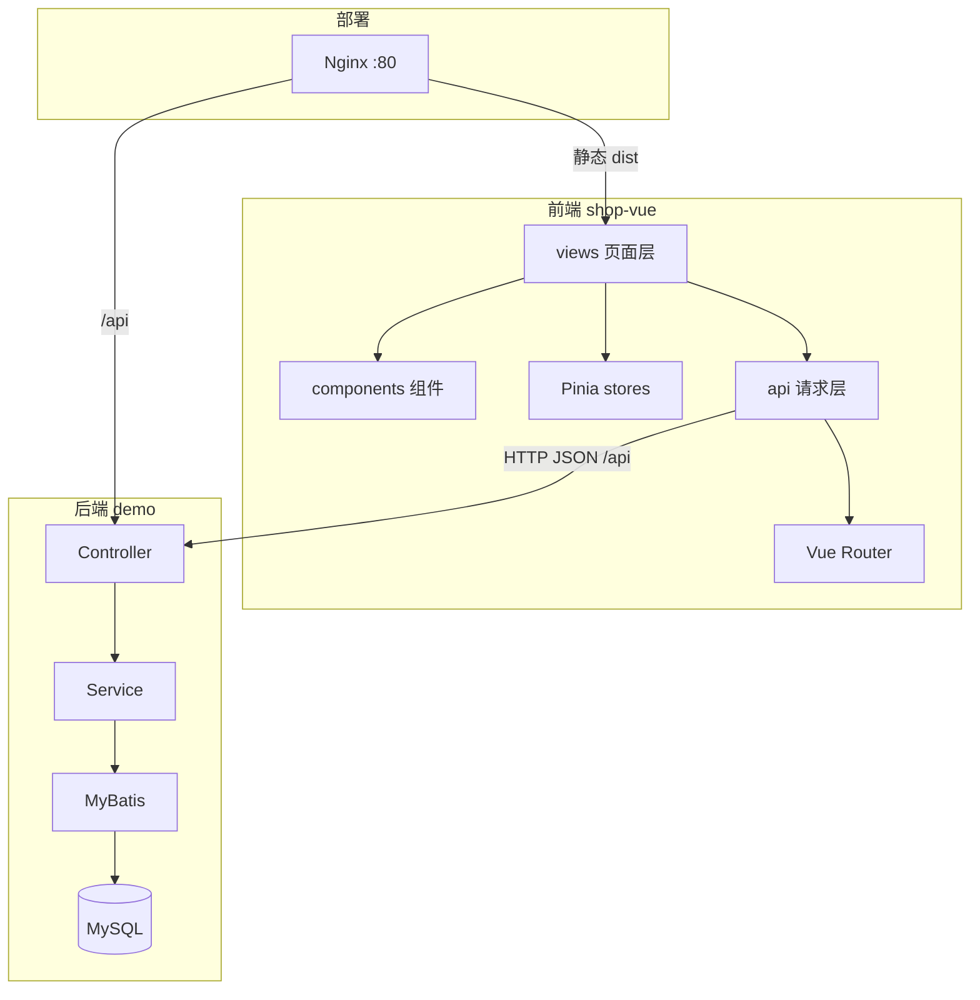
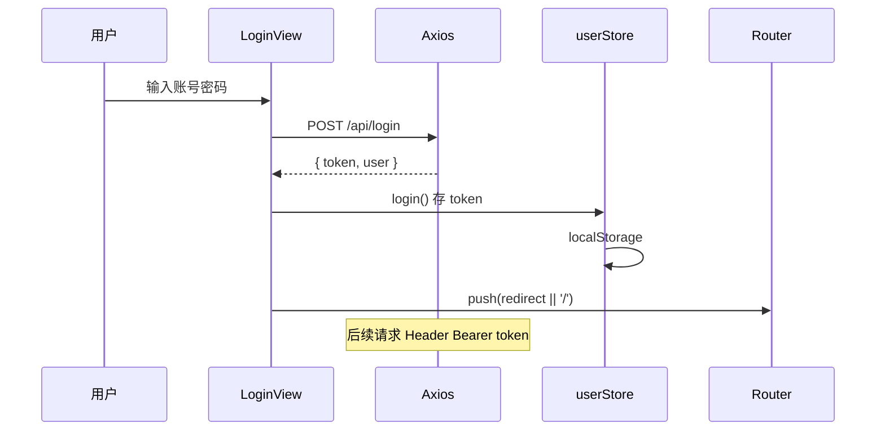
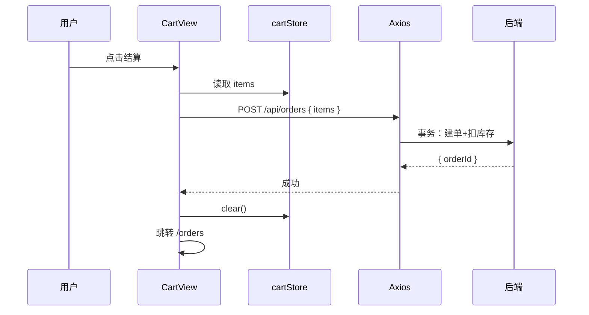

# Vue 项目实战与面试准备

<!-- 修改说明: 2026-06-30 按 EXPANSION-STANDARD 扩充 §0 导读、DevTools 验收、FAQ 12 题、闭卷自测、费曼检验 -->

> **文件编码**：UTF-8。本章假设你已完成 01～10 章，拥有可运行的 `shop-vue` 骨架。

## 0. 读前导读（零基础也能跟上）

> **读者假设**：01～10 章技术点已学，但仍是「章节练习」。本章是**总装车间**——把 shop-vue 串成可写简历、可讲 20 分钟的 MVP，并与 [Java 10 项目实战](../../后端学习/Java/10-后端项目实战与面试准备.md) 对齐。

### 0.1 用一句话弄懂本章

**一句话**：不是学新语法，而是**按 PRD 把 06 路由 + 07 Pinia + 08 Axios + 09 UI + 10 部署串成完整商城**，并准备面试话术。

**生活类比**：

| 概念 | 类比 |
|------|------|
| **MVP** | 商场试营业：核心动线通，装修可简 |
| **四层架构** | views / stores / api / components 分工 |
| **四周计划** | 施工排期：先骨架再联调再部署 |
| **1 分钟介绍** | 电梯演讲：评委 60 秒听懂你做了什么 |

---

### 0.2 你需要提前知道什么

| 水平 | 建议 |
|------|------|
| 01～10 任一章未完成 | 先补对应章，至少 06～08 必完成 |
| 后端 demo 未跑通 | 完成 [Java 04](../../后端学习/Java/04-SpringBoot核心开发.md) |
| 数据库版商城 | [Java 06 MySQL](../../后端学习/Java/06-MySQL基础索引与事务.md) + 05 章 MyBatis |

**全栈三角**：

| 前端 | 后端 |
|------|------|
| Vue 08 Axios | [Java 04 REST + Result](../../后端学习/Java/04-SpringBoot核心开发.md) |
| Pinia token | [Java 04 JWT / Java 07 Redis](../../后端学习/Java/07-Redis核心原理与缓存实战.md) |
| 10 Nginx 部署 | [Java 09 Nginx + Java 10 项目](../../后端学习/Java/09-LinuxDockerNginx部署基础.md) |

---

### 0.3 本章知识地图（☐→☑）

- [ ] shop-vue MVP 功能清单与页面清单
- [ ] 前后端接口对照表（与 Java 04/06 一致）
- [ ] 四周迭代计划可执行
- [ ] 1/3/15 分钟项目介绍稿
- [ ] README + 截图 + Git 提交规范
- [ ] DevTools 全流程验收
- [ ] 闭卷自测 ≥ 8/10

---

### 0.4 建议学习时长

| 阶段 | 时间 |
|------|------|
| 读 PRD + 架构 §2～§5 | 2 小时 |
| 按 Week 计划实施 | 2～4 周（每天 1～2h） |
| 面试稿 + README §6～§12 | 3 小时 |
| 自测 + 模拟答辩 | 2 小时 |

---

### 0.5 可验证成果

1. 演示：注册/登录 → 列表 → 详情 → 加购 → 下单（或 MVP 子集）。
2. GitHub 仓库含 README、3+ 截图、清晰 commit。
3. 15 分钟内讲清：为何 Pinia、拦截器做了什么、SPA 部署注意什么。
4. （可选）部署 URL 可给面试官访问。

---

## 本章与上一章的关系

01～10 章你把 Vue 3 技术栈都过了一遍——但知识还是「点状」的：02 写列表、06 配路由、07 建 store、08 调接口，每一章各自为战。

这一章就是 **总装车间**：把 `shop-vue` 串成能写进简历、面试能讲 **20 分钟** 的**商城前台 MVP**，并与 Spring Boot 后端配套演示。11 章不要求大量新语法，而是要求你 **串起来、做出来、讲清楚**。



---

## 1. 为什么最后一定要落到项目

你学 Vue、Router、Pinia、Axios，不是为了背 API，而是为了 **做项目**。

没有项目，你会：

- 知识点散，不知道状态放 Pinia 还是 props
- 面试讲「用过 Vue」，追问购物车怎么设计就卡住
- 简历空泛，HR 筛不过

**一个能演示的 shop-vue + 能对接的后端**，是初级前端/全栈岗位的核心筹码。

---

## 2. 项目定位：shop-vue 商城前台

**类型**：C 端简易电商前台（用户浏览、加购、下单）  
**用户角色**：普通用户（不含复杂商家后台）  
**数据**：真实 MySQL 接口（非纯 mock）

### 2.1 功能范围（MVP 必做 vs 可选）

| 模块 | MVP 必做 | 可选加分 |
|------|----------|----------|
| 用户 | 注册、登录、退出、个人信息展示 | 修改头像、忘记密码 |
| 商品 | 列表分页、详情、关键词搜索 | 分类筛选、排序 |
| 购物车 | 加购、改数量、删除、算总价 | 持久化到服务端 |
| 订单 | 提交订单、订单列表、订单详情 | 取消订单、模拟支付 |
| 工程 | 路由守卫、Axios 拦截、Loading | 骨架屏、错误边界 |

### 2.2 技术栈清单

| 层次 | 技术 | 版本建议 |
|------|------|----------|
| 框架 | Vue 3 | 3.4+ |
| 构建 | Vite | 5.x |
| 路由 | Vue Router | 4.x |
| 状态 | Pinia | 2.x |
| HTTP | Axios | 1.x |
| UI | Element Plus | 2.x |
| 后端 | Spring Boot + MyBatis | 见后端 04～10 |
| 部署 | Nginx +（可选）Docker | 见 10 章 |

---

## 3. 完整 MVP 需求规格说明（PRD 简版）

### 3.1 用户故事

1. **访客** 打开首页，看到推荐商品与入口
2. **访客** 浏览商品列表，搜索商品名，点进详情
3. **用户** 注册账号并登录
4. **登录用户** 将商品加入购物车，修改数量
5. **登录用户** 在购物车提交订单，看到订单列表
6. **未登录用户** 访问购物车/下单时，跳转登录页，登录后回跳

### 3.2 页面清单

| 路由 | 页面 | 组件要点 |
|------|------|----------|
| `/` | Home | 轮播/横幅、热门商品卡片 |
| `/login` | Login | el-form 校验 |
| `/register` | Register | 二次确认密码 |
| `/products` | ProductList | el-table 或卡片 grid、分页、搜索 |
| `/products/:id` | ProductDetail | 详情、库存、加购按钮 |
| `/cart` | Cart | 表格、数量步进器、结算 |
| `/orders` | OrderList | 订单表格、状态标签 |
| `/orders/:id` | OrderDetail | 明细行、金额汇总 |

### 3.3 非功能需求

- 首屏加载：路由懒加载
- 接口超时：15s，超时 Toast 提示
- 401：清 token，跳 `/login?redirect=`
- 移动端：PC 优先，基本响应式（可选）

---

## 4. 推荐目录结构（完整版）

```text
shop-vue/
├── public/
│   └── favicon.ico
├── src/
│   ├── api/
│   │   ├── request.js       # Axios 实例 + 拦截器
│   │   ├── auth.js          # login / register / profile
│   │   ├── product.js       # list / detail / search
│   │   └── order.js         # create / list / detail
│   ├── assets/
│   │   └── styles/
│   │       └── main.css
│   ├── components/
│   │   ├── layout/
│   │   │   ├── AppHeader.vue    # Logo、导航、登录态
│   │   │   └── AppFooter.vue
│   │   ├── product/
│   │   │   ├── ProductCard.vue
│   │   │   └── ProductSearch.vue
│   │   └── common/
│   │       ├── EmptyState.vue
│   │       └── PageLoading.vue
│   ├── composables/
│   │   ├── useAuth.js
│   │   ├── useProducts.js
│   │   └── useCart.js
│   ├── router/
│   │   └── index.js
│   ├── stores/
│   │   ├── user.js
│   │   └── cart.js
│   ├── utils/
│   │   ├── storage.js       # token 读写
│   │   └── format.js        # 价格格式化
│   ├── views/
│   │   ├── HomeView.vue
│   │   ├── LoginView.vue
│   │   ├── RegisterView.vue
│   │   ├── ProductListView.vue
│   │   ├── ProductDetailView.vue
│   │   ├── CartView.vue
│   │   ├── OrderListView.vue
│   │   └── OrderDetailView.vue
│   ├── App.vue
│   └── main.js
├── .env.development
├── .env.production
├── vite.config.js
├── package.json
├── README.md
└── docs/
    └── API.md               # 接口对照表（可选）
```

---

## 5. 核心代码骨架（面试能讲）

### 5.1 Axios 封装 request.js

```js
import axios from 'axios'
import { ElMessage } from 'element-plus'
import { useUserStore } from '@/stores/user'
import router from '@/router'

const request = axios.create({
  baseURL: import.meta.env.VITE_API_BASE_URL,
  timeout: 15000,
})

request.interceptors.request.use((config) => {
  const userStore = useUserStore()
  if (userStore.token) {
    config.headers.Authorization = `Bearer ${userStore.token}`
  }
  return config
})

request.interceptors.response.use(
  (response) => {
    const res = response.data
    // 与后端统一 Result：{ code: 0, message, data }
    if (res.code !== 0 && res.code !== 200) {
      ElMessage.error(res.message || '请求失败')
      return Promise.reject(new Error(res.message))
    }
    return res.data
  },
  (error) => {
    if (error.response?.status === 401) {
      const userStore = useUserStore()
      userStore.logout()
      router.push({ path: '/login', query: { redirect: router.currentRoute.value.fullPath } })
    }
    ElMessage.error(error.message || '网络异常')
    return Promise.reject(error)
  }
)

export default request
```

### 5.2 userStore

```js
import { defineStore } from 'pinia'
import { ref, computed } from 'vue'
import { loginApi, getProfileApi } from '@/api/auth'

export const useUserStore = defineStore('user', () => {
  const token = ref(localStorage.getItem('token') || '')
  const userInfo = ref(null)

  const isLoggedIn = computed(() => !!token.value)

  async function login(form) {
    const data = await loginApi(form)
    token.value = data.token
    localStorage.setItem('token', data.token)
    userInfo.value = data.user
  }

  function logout() {
    token.value = ''
    userInfo.value = null
    localStorage.removeItem('token')
  }

  async function fetchProfile() {
    if (!token.value) return
    userInfo.value = await getProfileApi()
  }

  return { token, userInfo, isLoggedIn, login, logout, fetchProfile }
})
```

### 5.3 cartStore

```js
import { defineStore } from 'pinia'
import { ref, computed } from 'vue'

export const useCartStore = defineStore('cart', () => {
  const items = ref([])  // { id, name, price, qty, stock }

  const totalCount = computed(() => items.value.reduce((s, i) => s + i.qty, 0))
  const totalPrice = computed(() =>
    items.value.reduce((s, i) => s + i.price * i.qty, 0)
  )

  function addItem(product, qty = 1) {
    const exist = items.value.find((i) => i.id === product.id)
    if (exist) {
      exist.qty = Math.min(exist.qty + qty, product.stock)
    } else {
      items.value.push({ ...product, qty })
    }
  }

  function removeItem(id) {
    items.value = items.value.filter((i) => i.id !== id)
  }

  function clear() {
    items.value = []
  }

  return { items, totalCount, totalPrice, addItem, removeItem, clear }
})
```

### 5.4 路由守卫

```js
router.beforeEach((to, from, next) => {
  const userStore = useUserStore()
  if (to.meta.requiresAuth && !userStore.isLoggedIn) {
    next({ path: '/login', query: { redirect: to.fullPath } })
  } else {
    next()
  }
})
```

---

## 6. 完整 API 接口清单（前后端契约）

与 [后端 10 章](../../后端学习/Java/10-后端项目实战与面试准备.md) 对齐。统一响应：

```json
{
  "code": 0,
  "message": "success",
  "data": { }
}
```

### 6.1 认证模块

| 接口 | 方法 | 请求体 / 参数 | 响应 data | 前端调用处 |
|------|------|---------------|-----------|------------|
| `/api/register` | POST | `{ username, password, nickname? }` | `{ userId }` | RegisterView |
| `/api/login` | POST | `{ username, password }` | `{ token, user: { id, username, nickname } }` | LoginView |
| `/api/user/profile` | GET | Header: Bearer token | `{ id, username, nickname, avatar? }` | AppHeader / 个人中心 |
| `/api/logout` | POST | Header: token | null | 退出（可选调后端黑名单） |

### 6.2 商品模块

| 接口 | 方法 | 参数 | 响应 data | 前端 |
|------|------|------|-----------|------|
| `/api/products` | GET | `pageNum`, `pageSize`, `keyword?` | `{ list: Product[], total }` | ProductList |
| `/api/products/{id}` | GET | path id | `Product` 详情 | ProductDetail |
| `/api/products/hot` | GET | `limit=8` | `Product[]` | Home |

**Product 字段示例**：

```json
{
  "id": 1,
  "name": "无线鼠标",
  "price": 99.00,
  "stock": 100,
  "description": "...",
  "imageUrl": "/images/mouse.jpg",
  "categoryId": 2
}
```

### 6.3 订单模块

| 接口 | 方法 | 请求 | 响应 | 前端 |
|------|------|------|------|------|
| `/api/orders` | POST | `{ items: [{ productId, quantity }] }` | `{ orderId, orderNo, totalAmount }` | CartView 结算 |
| `/api/orders` | GET | `pageNum`, `pageSize` | `{ list, total }` | OrderList |
| `/api/orders/{id}` | GET | path id | 订单 + 明细行 | OrderDetail |
| `/api/orders/{id}/cancel` | PUT | — | null | 可选 |

### 6.4 错误码约定

| code | 含义 | 前端处理 |
|------|------|----------|
| 0 / 200 | 成功 | 正常取 data |
| 400 | 参数错误 | ElMessage 展示 message |
| 401 | 未登录 | 拦截器跳登录 |
| 403 | 无权限 | 提示 |
| 500 | 服务器错误 | 提示 + 日志 |

---

## 7. 四周里程碑（Week-by-Week 详细计划）

### Week 1：骨架 + 路由 + 假数据

**目标**：页面能切换，Layout 统一，商品列表用本地 JSON。

| 天 | 任务 | 产出 |
|----|------|------|
| D1 | 整理目录结构；AppHeader/Footer | layout 组件 |
| D2 | 配置 router 全部路由 + lazy import | 8 个空页面能跳转 |
| D3 | ProductCard + ProductList 假数据 | 列表 UI |
| D4 | ProductDetail 假数据 + 路由 params | `/products/1` |
| D5 | Home 热门区 + 样式微调 | W1 验收 |

**验收**：

- [ ] 3 个以上页面可切换，浏览器前进后退正常
- [ ] 详情页 URL 带 id
- [ ] README 写启动命令

### Week 2：Pinia + 登录 + 路由守卫

| 天 | 任务 | 产出 |
|----|------|------|
| D1 | userStore + Login/Register 表单 | 表单校验 |
| D2 | token 持久化 localStorage | 刷新仍登录 |
| D3 | cartStore 加购/删/算价 | 详情页加购 |
| D4 | meta.requiresAuth + beforeEach | 未登录不进 /cart |
| D5 | 登录 redirect 回跳 | W2 验收 |

**验收**：

- [ ] 未登录访问 `/cart` → `/login?redirect=/cart`
- [ ] 登录后进购物车，加购数量正确

### Week 3：Axios 联调 + Element Plus

| 天 | 任务 | 产出 |
|----|------|------|
| D1 | request.js 拦截器 | 统一 Result |
| D2 | 对接 GET /api/products 分页 | 列表来自 DB |
| D3 | 对接 login + profile | 真实 token |
| D4 | 对接 detail + POST order | 详情与下单 |
| D5 | el-table 订单列表 + Loading | W3 验收 |

**验收**：

- [ ] Network 见 `/api/products` 200
- [ ] 登录后 Header 带 Authorization
- [ ] 下单后订单列表有数据

### Week 4：打磨 + 部署 + 文档 + 面试准备

| 天 | 任务 | 产出 |
|----|------|------|
| D1 | 空状态、错误提示、边界（库存不足） | UX |
| D2 | npm run build + Nginx 或 Docker | 可访问部署版 |
| D3 | README：架构图、接口表、截图 | 文档 |
| D4 | 写 1min / 3min 项目介绍，录音 | 面试稿 |
| D5 | 模拟面试 20 分钟 | W4 验收 |

**验收**：

- [ ] 部署环境完整走通：注册→登录→加购→下单
- [ ] Git 仓库公开或可提供
- [ ] 15 分钟内讲清架构

---

## 8. 业务流程图

### 8.1 登录流程



### 8.2 下单流程



---

## 9. 项目亮点（面试怎么说）

不要只说「用了 Vue」——要说 **解决了什么问题**：

| 亮点 | 问题 | 方案 | 可追问准备 |
|------|------|------|------------|
| Pinia 购物车 | 跨页面共享 cart | cartStore 集中状态 | 为何不用 props 层层传 |
| 路由守卫 | 未登录访问受保护页 | meta + beforeEach | 守卫执行顺序 |
| Axios 拦截器 | 每个请求手写 token | 请求拦截统一 Header | 401 怎么处理 |
| 环境分离 | 开发/生产 API 不同 | .env + Vite proxy / Nginx | build 后 env 能否改 |
| 路由懒加载 | 首屏 js 过大 | `() => import()` | 如何分析体积 |
| 与后端联调 | 跨域 | dev proxy + 生产同域 | [计网 06 CORS](../计算机网络/06-缓存Cookie与会话机制.md) |

### 9.1 面试追问速查（结合 Java 04/06/07）

| 面试官问 | 回答要点 | 延伸 |
|----------|----------|------|
| 为什么 Pinia 不用 props？ | 跨路由共享，避免 prop drilling | 07 章 cartStore |
| 401 怎么处理？ | 响应拦截 logout + redirect | 08 章 + 06 守卫 |
| SPA 部署注意什么？ | try_files fallback | 10 章 + [Java 09](../../后端学习/Java/09-LinuxDockerNginx部署基础.md) |
| 前后端字段不一致？ | adapter 层或统一 DTO | [Java 04 VO](../../后端学习/Java/04-SpringBoot核心开发.md) |
| 购物车数据存哪？ | MVP localStorage；进阶 MySQL | [Java 06](../../后端学习/Java/06-MySQL基础索引与事务.md) |
| 如何做登录态？ | JWT Bearer + Pinia + 可选 Redis | [Java 07](../../后端学习/Java/07-Redis核心原理与缓存实战.md) |
| Vite 和 Webpack 区别？ | dev ESM 快，build Rollup | 10 章 §1 |
| Element Plus 为何按需？ | 减小 dist 体积 | 09 章 §28 |

---

## 10. 简历描述模板

### 10.1 标准版（可直接改）

```text
【项目名称】shop-vue 简易电商前台 | Vue 3 + Vite + Pinia + Element Plus
【时间】2024.xx - 2024.xx
【项目链接】https://github.com/你的用户名/shop-vue
【描述】
- 基于 Vue 3 组合式 API 完成商品浏览、搜索、详情、购物车、订单等核心页面，组件化拆分 ProductCard、Layout 等 10+ 组件
- 使用 Pinia 管理用户登录态与购物车，Vue Router 配置导航守卫实现未登录拦截与 redirect 回跳
- 封装 Axios 请求/响应拦截器，对接 Spring Boot REST 接口，统一处理 token 与 401 跳转
- Element Plus 构建表单校验、表格分页与后台式 Layout；Vite 打包后经 Nginx 与后端同域部署
【技术栈】Vue 3, Vite, Pinia, Vue Router, Axios, Element Plus, Nginx
【个人职责】独立负责前端全部模块设计与实现，与后端约定 REST 接口并完成联调
```

### 10.2 精简版（一行项目）

```text
shop-vue：Vue3 商城前台，Pinia 购物车 + Router 鉴权 + Axios 对接 Spring Boot，Nginx 部署
```

### 10.3 全栈联合描述（前后端都写）

```text
【全栈练手】简易电商系统
- 前端 shop-vue：Vue 3 + Pinia + Element Plus，完成 C 端购物流程
- 后端 demo-api：Spring Boot + MyBatis + Redis 商品缓存，JWT 登录，下单事务扣库存
- 部署：Docker Compose 起 MySQL/Redis，Nginx 托管前端并反代 /api
```

**原则**：每条 **动词 + 技术 + 效果**，能经得住追问。

---

## 11. 面试话术脚本

### 11.1 自我介绍（1 分钟）

```text
面试官您好，我是 XXX，目前主攻前端 / 全栈方向。系统学习过 HTML/CSS/JS 和 Vue 3 生态，
完成了一个名为 shop-vue 的电商前台项目。技术栈是 Vue 3 组合式 API、Vite、Pinia、Vue Router
和 Element Plus。项目中我负责整体页面结构、状态管理和后端接口联调：用户登录后 token 由 Pinia
配合 localStorage 持久化，Axios 拦截器统一携带；购物车用 cartStore 跨页面维护；路由守卫
拦截未登录访问。部署上使用 Vite 打包，Nginx 托管静态资源并反代 API 到 Spring Boot。
希望找前端 / 全栈实习或初级岗位，谢谢。
```

### 11.2 项目介绍（3 分钟）

```text
【背景】这是一个简易 B2C 商城的用户端，配合 Spring Boot 后端，实现从浏览到下单的完整链路。

【架构】前端是标准 SPA：views 负责页面，components 复用 UI，Pinia 管 user 和 cart 两个 store，
api 层封装 Axios。路由按业务拆分，列表和详情用动态路由传 id。

【核心流程 1 - 登录】用户提交表单，POST /api/login，后端返回 JWT。前端存 Pinia 和 localStorage，
之后请求拦截器自动加 Authorization。401 时清 token 跳登录，并带上 redirect 方便回跳。

【核心流程 2 - 购物车】加购时调 cartStore.addItem，同一商品合并数量。结算时把 items 映射为
{ productId, quantity } POST 创建订单，成功后清空购物车并跳订单列表。

【难点】一个是部署后刷新子路由 404，通过 Nginx try_files 解决；另一个是开发环境跨域，用 Vite proxy，
生产同域反代，代码里 baseURL 统一 /api。

【收获】理解了状态该放哪一层、前后端接口契约怎么定、以及 SPA 部署和联调的区别。
```

### 11.3 常见追问应答要点

**Q：为什么用 Pinia 不用 Vuex？**  
Pinia 是 Vue 3 官方推荐，API 更简洁，无 mutations，TS 友好，多 store 无需 modules 嵌套。

**Q：购物车为什么放前端 store 不每次调后端？**  
MVP 阶段简化，减少接口；生产可同步服务端购物车，登录时 merge 本地与远程。

**Q：怎么防止重复下单？**  
前端：结算按钮 loading + 禁用；后端：幂等键 / 订单号唯一（见后端 10 章）。

**Q：token 存哪？安全吗？**  
localStorage，方便 SPA；有 XSS 风险，需防注入、HttpOnly Cookie 更安全但跨域复杂。初级能说清权衡即可。

---

## 12. 前后端联调演示步骤（面试可现场操作）

1. 启动 MySQL：`docker compose up -d mysql`（或后端 09 章 compose）
2. 启动 Spring Boot：`mvn spring-boot:run` 或 IDEA Run（8080）
3. 验证后端：`curl http://localhost:8080/api/products?pageNum=1&pageSize=10`
4. 启动前端：`cd shop-vue && npm run dev`（5173）
5. 浏览器：注册 → 登录 → 商品列表 → 详情加购 → 购物车 → 下单 → 订单列表
6. DevTools → Network：检查 `/api/login`、Authorization Header、响应 code

**生产演示**：Nginx 80 端口同样流程。

---

## 13. README 模板（复制到仓库）

```markdown
# shop-vue

简易电商前台，Vue 3 + Vite + Pinia + Element Plus。

## 功能

- 用户注册 / 登录
- 商品列表、搜索、详情
- 购物车、提交订单、订单列表

## 技术栈

Vue 3, Vite, Vue Router, Pinia, Axios, Element Plus

## 本地启动

\`\`\`bash
npm install
npm run dev
\`\`\`

需后端运行在 http://localhost:8080，或修改 .env.development。

## 构建

\`\`\`bash
npm run build
npm run preview
\`\`\`

## 接口说明

见 docs/API.md 或后端 Swagger。

## 截图

（贴首页、列表、购物车截图）

## 作者

XXX
```

---

## 14. 项目迭代版本规划

| 版本 | 内容 | 面试价值 |
|------|------|----------|
| v0.1 | 假数据 + 路由 | 低 |
| v0.5 | Pinia + 守卫 | 中 |
| v1.0 MVP | 全接口联调 | **简历可用** |
| v1.1 | 部署 + README | 高 |
| v2.0 | 骨架屏、虚拟列表、TS | 加分 |

---

## 15. 项目难点准备（至少 2 个）

### 难点 1：401 与登录回跳

- **问题**：token 过期后用户仍停留在需登录页，操作报一堆错
- **原因**：仅页面守卫不够，接口也会 401
- **解决**：响应拦截器统一 logout + redirect query
- **不足**：未做 refresh token

### 难点 2：生产环境刷新 404

- **问题**：本地 dev 正常，部署后刷新 `/cart` Nginx 404
- **原因**：SPA history 模式无物理文件
- **解决**：`try_files $uri $uri/ /index.html`
- **不足**：子路径部署时 base 易配错

---

## 16. 学完标准（全路线 + 本章）

- [ ] shop-vue 可演示完整业务流程（注册→下单）
- [ ] Git 仓库含 README、接口说明、至少 3 张截图
- [ ] 8+ 页面、2 个 Pinia store、Axios 封装完整
- [ ] 能在 **15 分钟**内讲清架构与个人职责
- [ ] 能回答：为什么 Pinia、为什么拦截器、SPA 部署注意什么
- [ ] 有 1 分钟 / 3 分钟项目介绍稿
- [ ] （可选）部署版 URL 可给面试官访问

---

## 17. 分级练习

**基础**：按 Week 1 完成路由 + 假数据列表  
**进阶**：按 Week 3 完成全部 API 联调  
**挑战**：Docker 一键起前后端 + 15 分钟无卡顿项目答辩录音

---

## 18. FAQ

**Q：只做前端够吗？**  
纯前端岗可以；实习/全栈建议后端也能 demo。接口可以先用 Mock（json-server），但 **真实联调** 更有说服力。

**Q：要做管理后台吗？**  
MVP 不做。有余力可做简易 admin：商品 CRUD 表格，练 Element Plus 表单。

**Q：要做移动端吗？**  
初学 PC 即可。响应式用 el-col 栅格；移动端另学 Vant + UniApp。

**Q：Git 提交太乱怎么办？**  
按 Week squash 或 rebase 整理 commit message，体现迭代过程。

**Q：shop-vue 必须对接 MySQL 吗？**  
MVP 可用 [Java 04](../../后端学习/Java/04-SpringBoot核心开发.md) 内存 List；简历加分接 [Java 06 MySQL](../../后端学习/Java/06-MySQL基础索引与事务.md)。

**Q：Redis 在前端项目里体现什么？**  
前端不直连 Redis；后端 [Java 07](../../后端学习/Java/07-Redis核心原理与缓存实战.md) 存 session/缓存，前端只感知接口变快。

**Q：401 和路由守卫都要做吗？**  
都要：守卫拦页面；08 拦截器拦 API 返回 401（§15 难点 1）。

**Q：接口文档放哪？**  
README 链 Swagger 或 `docs/API.md`，与 Java 04 Controller 路径一致。

**Q：面试要讲多深？**  
校招/实习：15 分钟架构 + 2 难点 + 1 可改进点；不必背源码。

**Q：和 [Java 10](../../后端学习/Java/10-后端项目实战与面试准备.md) 如何分工？**  
Java 10 讲后端 MVP 与部署；本章讲前端 MVP 与全栈串联话术。

**Q：Week 1 最小交付是什么？**  
06 路由 + 假数据列表 + 07 空 cartStore，能演示页面跳转。

---

## 18.1 项目全流程 DevTools 验收（步骤表）

| 步骤 | 你的动作 | 预期看到什么 | 若不对 |
|------|----------|--------------|--------|
| 1 | 未登录访问 /cart | redirect `/login?redirect=/cart` | 06 守卫 + 07 store |
| 2 | 登录 | Network POST /api/login 200；Pinia token 有值 | 08 auth.js |
| 3 | 商品列表 | GET /api/users 或 /api/products 200 | [Java 04/06](../../后端学习/Java/06-MySQL基础索引与事务.md) |
| 4 | 加购 | Pinia cart items +1；09 ElMessage | 07 cartStore |
| 5 | 提交订单（若实现） | POST 201/200 | 后端 Order API |
| 6 | 401 模拟 | 清 token 或错 token → 跳登录 | 08 响应拦截器 |
| 7 | build + preview | 全流程仍通 | 10 章 env/base |

### 18.2 全栈接口清单（与 Java 04/06 对齐）

| 功能 | 方法 | 路径 | 前端模块 | 后端章 |
|------|------|------|----------|--------|
| 登录 | POST | `/api/login` | api/auth.js | [Java 04](../../后端学习/Java/04-SpringBoot核心开发.md) |
| 用户列表（模拟商品） | GET | `/api/users` | api/product.js | Java 04 |
| 商品列表 | GET | `/api/products` | api/product.js | [Java 06 MySQL](../../后端学习/Java/06-MySQL基础索引与事务.md) |
| 商品详情 | GET | `/api/products/{id}` | api/product.js | Java 06 |
| 创建订单 | POST | `/api/orders` | api/order.js | Java 06 order 表 |
| 缓存热点商品（可选） | — | 后端内部 | — | [Java 07 Redis](../../后端学习/Java/07-Redis核心原理与缓存实战.md) |

### 18.3 shop-vue 11 章 MVP 验收清单

```text
☐ 8+ 页面可导航，404 兜底
☐ userStore + cartStore + Axios 封装
☐ 登录→列表→详情→加购 可演示
☐ README + 3 截图 + 接口说明
☐ 1 分钟 / 15 分钟介绍稿各一版
☐ 能讲清 401 与 SPA 部署难点（§15）
☐ （可选）部署 URL 可访问
```

---

## 19. 闭卷自测

1. shop-vue MVP 必做模块有哪些？
2. 前端四层 architecture 指什么？
3. 为什么简历要写 shop-vue 而不是「学过 Vue」？
4. 401 与路由守卫如何配合？
5. SPA 生产刷新 404 如何解决？
6. Pinia 与 props 在项目中如何分工？
7. 1 分钟项目介绍应含哪四要素？
8. **动手**：按 Week 1  checklist 自检路由页。
9. **动手**：用 DevTools 完成 §18.1 七步验收。
10. **综合**：向面试官描述前后端一次登录请求的完整链路（Vue + [Java 04](../../后端学习/Java/04-SpringBoot核心开发.md)）。

### 19.1 自测参考答案

1. 用户登录、商品列表/详情、购物车、（订单）；路由守卫 + Axios 封装。
2. views / components / stores / api（+ router）。
3. 项目证明能串栈、能联调、能部署，可追问细节。
4. 守卫防未登录进页；拦截器处理 token 过期 API 401。
5. Nginx try_files fallback index.html（10 章）。
6. 页面局部 UI 用 props；跨页 user/cart 用 Pinia。
7. 项目名 + 技术栈 + 核心功能 + 个人职责。
8. /、/products、/login、/cart 可导航，守卫生效。
9. 逐步执行 §18.1 表，全绿即 MVP 达标。
10. LoginView submit → axios POST /api/login → setLogin token → 拦截器带 Bearer → Java Controller 校验 → Result 返回。

---

## 20. 费曼检验

3 分钟项目答辩提纲：

1. **是什么**：Vue3 商城前台 MVP，对接 Spring Boot REST（[Java 04](../../后端学习/Java/04-SpringBoot核心开发.md)）。
2. **你怎么做**：06 路由分屏、07 全局状态、08 联调、09 UI、10 部署。
3. **难点与收获**：401 统一处理、SPA 部署 fallback；下一步接 [Java 06 MySQL](../../后端学习/Java/06-MySQL基础索引与事务.md) 真实商品表。

---

## 下一章预告

11 章项目能跑了——还有一些 Vue 特性平时做项目会碰到：**插槽、KeepAlive、Teleport、自定义指令、性能优化**。下一章（12 Vue 进阶特性）查漏补缺，并为 13 章面试深挖打基础。

---

*下一章：12 Vue 进阶特性 · 配合 13 场景题、14 总表冲刺面试*
