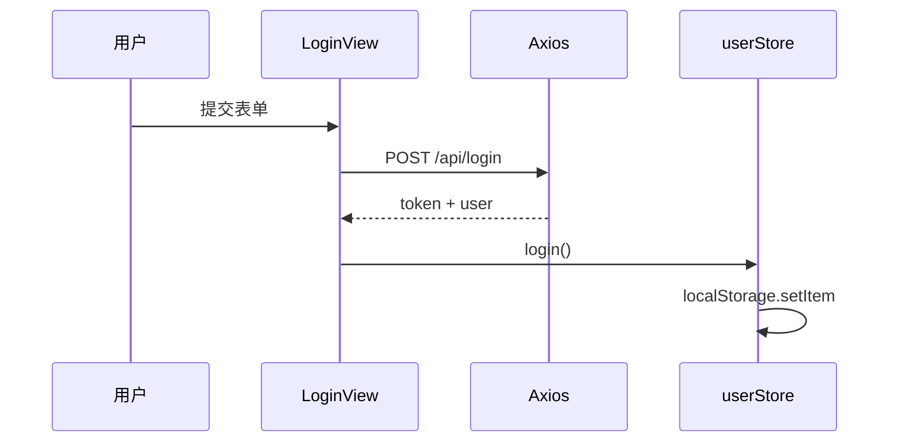

# 高频场景题与面试专题

<!-- 修改说明: 2026-06-30 按 EXPANSION-STANDARD 扩充 §0 导读、追加场景题、FAQ≥10、闭卷自测、费曼检验 -->

> **文件编码**：UTF-8。本章是「怎么讲」——建议配合 [11 章 shop-vue](./11-Vue项目实战与面试准备.md) 项目，每题尽量结合自己做过的功能回答。

---

## 0. 读前导读（零基础也能跟上）

> **读者假设**：01～12 技术章已学或 shop-vue 已跑通；本章不教新语法，只教 **面试怎么答**。

### 0.1 用一句话弄懂本章

**一句话**：把 Vue 知识点翻译成 **面试官能听懂的口述稿**——每题按「定义→原理→场景→项目→边界」五步法，尽量带 shop-vue 例子。

**生活类比**：

| 概念 | 类比 |
|------|------|
| **五步法** | 答题模板：先报菜名再讲做法再讲你点过哪道 |
| **STAR** | 讲故事：背景→任务→行动→结果 |
| **速记卡 §26** | 考前小抄：进考场前 10 分钟过一遍 |
| **手写题 §29** | 默写菜谱：防抖、深拷贝要会写骨架 |

---

### 0.2 你需要提前知道什么

| 水平 | 建议 |
|------|------|
| 没做过 shop-vue | 先完成 [11 章](./11-Vue项目实战与面试准备.md) Week 1～2 |
| 只会背答案 | 每题 **先口述 2 分钟** 再对照，避免背书感 |
| 全栈面试 | 本章 + [Java 14 场景题](../../后端学习/Java/14-高频场景设计与面试专题.md) |
| 前端零基础 | 先补 [HTML CSS JS 13](../HTML%20CSS%20JS/13-前端高频场景题与面试专题.md) 原生题 |

---

### 0.3 本章知识地图（☐→☑）

- [ ] 掌握技术题五步法与 STAR 结构
- [ ] 25+ 题每题能讲 1～2 分钟
- [ ] 至少 10 题能结合 shop-vue
- [ ] 准备好 2 个项目难点 STAR 故事
- [ ] 手写防抖、深拷贝能默写
- [ ] 闭卷自测 ≥ 8/10

---

### 0.4 建议学习时长

| 阶段 | 时间 |
|------|------|
| §0 框架 + §1～10 核心题 | 4 小时 |
| §11～25 场景题 | 4 小时 |
| 模拟面试 + 录音复盘 | 3 小时 |
| 考前 §26 速记 | 30 分钟 |

---

### 0.5 可验证成果

1. 随机抽 5 题，每题 2 分钟内讲清且不卡壳。
2. 能白板画登录、下单时序图。
3. 能完整 STAR 讲一个真实踩坑（401 或 SPA 404）。
4. 手写 debounce 5 分钟内默写正确。

---

## 本章与上一章的关系

01～12 章教 **怎么做**（写组件、配路由、调接口）；13 章教 **怎么讲**（面试口述、场景设计、追问应对）。

**使用方式**：

1. 每题先 **自己口述 2 分钟**，再对照框架查漏
2. 每题准备 **1 个 shop-vue 例子**（没有就说学习项目）
3. 回答结构：**定义 → 原理/作用 → 场景 → 项目实践 → 不足/扩展**

---

## 0. 通用回答框架（STAR + 技术五步法）

### 0.1 技术题五步法

1. **一句话定义**（让面试官知道你会）
2. **原理或机制**（展开深度）
3. **使用场景**（证明有工程经验）
4. **项目里怎么用**（shop-vue 具体模块）
5. **边界 / 优化 / 对比**（加分项）

### 0.2 项目场景题 STAR

- **S**ituation：业务背景
- **T**ask：你的任务
- **A**ction：技术方案
- **R**esult：效果或可量化结果

---

## 1. 说说你对 Vue 的理解？Vue 3 有什么特点？

**框架（30 秒）**  
Vue 是**渐进式** JavaScript 框架：可以只用来增强页面某一块，也可以配合 Router、Pinia 做完整 SPA。核心是**响应式数据驱动视图** + **组件化**开发，降低直接操作 DOM 的成本。

**Vue 3 特点（1 分钟）**  
- 响应式从 `Object.defineProperty` 换成 **Proxy**，监听更完整、性能更好  
- **Composition API** + `script setup`，逻辑按功能组织，composables 复用  
- 官方推荐 **Pinia** 做状态管理，**Vite** 做构建  
- 支持 Fragment 多根节点、Teleport、更好的 TypeScript 支持  

**项目结合**  
我在 shop-vue 里用 Vue 3 组合式 API 完成商城前台，Pinia 管用户和购物车，Axios 对接 Spring Boot。

**对比 React（若被追问）**  
Vue 模板 + 自动依赖追踪；React JSX + 手动管理更新。国内 Vue 岗位多，原理都是组件化 + 单向数据流思想。

---

## 2. Vue 3 响应式原理是什么？ref 和 reactive 区别？

**原理**  
Vue 3 用 **Proxy** 代理对象（ref 包一层对象），在 **get** 时 **track** 依赖，在 **set** 时 **trigger** 更新，调度组件 re-render。

**ref vs reactive**

| | ref | reactive |
|---|-----|----------|
| 适用 | 基本类型、任意值、模板 ref | 对象、数组 |
| 访问 | `.value`（模板自动解包） | 直接属性 |
| 解构 | 整体 ref 可保留响应式 | 解构丢响应式，需 `toRefs` |
| 重新赋值 | `ref.value = newObj`  OK | reactive 不能整体替换引用 |

**项目**  
shop-vue 里 `userStore` 的 `token` 用 ref，`cartStore.items` 用 ref 数组。

**对比 Vue 2**  
Vue 2 无法监听属性新增、数组索引，需 `Vue.set`；Vue 3 Proxy 无此问题。

**追问：为什么 ref 也要 .value？**  
JS 基本类型无法被 Proxy「代理成一个对象属性」，所以包成 `{ value: x }` 的对象。

---

## 3. computed 和 watch 的区别？分别用在什么场景？

**computed**  
- 基于依赖的**派生数据**  
- **有缓存**，依赖不变不重算  
- 应返回**同步**值，不写副作用  
- 例：`cartStore.totalPrice`、`filteredProducts`

**watch**  
- **监听**某个源变化，执行**副作用**  
- 无缓存，变化就执行  
- 适合：调接口、存 localStorage、防抖搜索  
- 例：监听 `route.params.id` 拉详情；监听 `keyword` 防抖请求

**watchEffect**  
自动收集函数内依赖，适合「跟多个源有关的副作用」，如 `document.title`。

**项目**  
商品搜索：keyword 用 watch + 300ms 防抖调 `/api/products?keyword=`；列表展示用 computed 过滤（本地假数据阶段）。

---

## 4. v-model 的本质是什么？组件上怎么用？

**原生元素**  
```html
<input v-model="text" />
<!-- 等价于 -->
<input :value="text" @input="text = $event.target.value" />
```

**组件上（Vue 3）**  
默认：`modelValue` prop + `update:modelValue` emit。

```vue
<!-- 子 CustomInput.vue -->
<script setup>
defineProps(['modelValue'])
defineEmits(['update:modelValue'])
</script>
<template>
  <input
    :value="modelValue"
    @input="$emit('update:modelValue', $event.target.value)"
  />
</template>
```

**多个 v-model**  
`v-model:title` → `title` + `update:title`（Vue 3.4+ 亦可 `defineModel`）。

**项目**  
Element Plus 表单控件内部都遵循此约定；自定义 `QuantityStepper` 可封装 `v-model` 绑定数量。

---

## 5. 组件通信有哪些方式？你怎么选？

| 方式 | 场景 | shop-vue 例子 |
|------|------|---------------|
| props / emit | 父子 | ProductCard 收 product，emit add-cart |
| v-model | 父子双向 | 数量步进器 |
| provide / inject | 跨多层、少变配置 | 主题、locale（少用） |
| Pinia | 全局共享 | user、cart |
| attrs / $slots | 透传、插槽 | 封装 el-button |
| event bus | Vue 3 不推荐 | 用 Pinia 替代 |

**选型原则**  
能局部不全局；能 props 不上 Pinia；跨页面持久状态 → Pinia。

---

## 6. 说说 Vue 生命周期（组合式 API 版）

**常用钩子**  
- `onBeforeMount` / `onMounted`：DOM 挂载前后；**调接口放 mounted**  
- `onBeforeUpdate` / `onUpdated`：更新前后；少用手动操作 DOM  
- `onBeforeUnmount` / `onUnmounted`：**清定时器、解绑事件**  
- KeepAlive：`onActivated` / `onDeactivated`

**项目**  
ProductDetail：`onMounted` 调 `fetchDetail(id)`；`onUnmounted` 取消未完成请求（AbortController 可选）。

**对比 Options**  
`beforeCreate/created` 在 setup 里直接写代码即可，无对应钩子。

---

## 7. nextTick 是干什么的？

DOM 更新是**异步**的。修改响应式数据后，立刻读 DOM 可能还是旧值。

```js
count.value++
await nextTick()
// 此时 DOM 已更新
```

**场景**：聚焦新出现的 input、获取更新后的元素高度。  
**项目**：登录错误后 `nextTick(() => inputRef.value.focus())`。

---

## 8. Vue Router 导航守卫执行顺序？你怎么做登录鉴权？

**顺序（简化）**  
```text
全局 beforeEach
  → 路由独享 beforeEnter
  → 组件内 beforeRouteEnter（仅 enter）
  → 全局 beforeResolve
  → 全局 afterEach（无 next）
```

**鉴权方案**  
1. 路由 meta：`{ requiresAuth: true }`  
2. `beforeEach`：无 token 则 `next('/login?redirect=' + to.fullPath)`  
3. Axios 响应拦截：401 清 token 再跳登录（**双保险**）

**项目**  
`/cart`、`/orders` 设 `requiresAuth`；LoginView 登录成功读 `route.query.redirect`。

**history vs hash**  
history 需 Nginx `try_files`；hash 无需服务器配置但 URL 带 `#`。

---

## 9. Pinia 和 Vuex 有什么区别？为什么用 Pinia？

| Pinia | Vuex |
|-------|------|
| 无 mutations，直接改 state / actions | mutations 同步，actions 异步 |
| 多 store，扁平 | 单 store + modules |
| 完美配合 setup、TS | Vue 2 时代主流 |
| 体积小，官方推荐 Vue 3 | 维护模式 |

**项目**  
`useUserStore`、`useCartStore` 两个独立 store；actions 里调 api。

**持久化**  
手动 localStorage 或 `pinia-plugin-persistedstate` 持久化 token。

---

## 10. 如何优化 Vue 应用首屏和运行性能？

**加载阶段**  
- 路由懒加载 `() => import()`  
- 异步组件、重组件按需  
- Element Plus 按需引入  
- CDN / gzip / Brotli（Nginx）  
- 图片 lazy、WebP

**运行阶段**  
- computed 缓存，避免模板重复计算  
- v-show vs v-if 正确选择  
- 长列表：分页或虚拟滚动  
- KeepAlive 缓存列表页  
- shallowRef 大对象

**分析**  
`npm run build` 看 chunk 体积；Vue DevTools Performance。

**项目**  
shop-vue 路由全 lazy；build 时 manualChunks 拆 vue 和 element-plus。

---

## 11. 场景：列表页搜索防抖怎么做？

**需求**  
输入 keyword 不要每个字符都请求接口。

**方案**  
1. `ref keyword` + `watch(keyword, debouncedFetch, { debounce: 300 })`（Vue 3.5+ watch debounce 选项）  
2. 或 composable：

```js
export function useDebouncedRef(value, delay = 300) {
  const debounced = ref(value.value)
  let timer
  watch(value, (v) => {
    clearTimeout(timer)
    timer = setTimeout(() => { debounced.value = v }, delay)
  })
  return debounced
}
```

3. 请求层 AbortController 取消上一次未完成的请求

**项目**  
ProductList 搜索框绑定 keyword，300ms 后调 `GET /api/products?keyword=`。

---

## 12. 场景：登录流程怎么设计？token 存哪？

**流程**  
注册/登录 → 后端返回 JWT → 存 Pinia + localStorage → 请求拦截器带 Header → 401 清 token 跳登录。



**存储选型**

| 位置 | 优点 | 缺点 |
|------|------|------|
| localStorage | 简单、持久 | XSS 可读 |
| sessionStorage | 关 tab 失效 | 同左 |
| HttpOnly Cookie | 防 XSS 读 | 跨域、CSRF 要配 |

**项目**  
shop-vue 用 localStorage + Bearer；能说清 XSS 风险和 Cookie 方案更佳。

---

## 13. 场景：购物车状态怎么设计？

**数据结构**  
```js
items: [{ id, name, price, qty, stock }]
```

**派生**  
`totalCount`、`totalPrice` 用 computed。

**操作**  
`addItem` 合并同 id；`removeItem`；`clear` 下单成功后。

**持久化**  
可选 localStorage 或 pinia-plugin；登录后可与服务端 cart merge（进阶）。

**下单**  
POST `/api/orders` body: `{ items: [{ productId, quantity }] }`。

**项目**  
cartStore 独立于页面，Header 显示 badge 数量。

---

## 14. 场景：前后端联调跨域怎么解决？

| 环境 | 方案 |
|------|------|
| 开发 | Vite `server.proxy`：`/api` → `localhost:8080` |
| 生产 | Nginx 同域反代 `/api`；或后端 CORS |
| 代码 | Axios `baseURL: '/api'`，环境只改部署层 |

**CORS 口述**  
浏览器同源策略；跨域需服务端返回 `Access-Control-Allow-Origin` 等头；带 Cookie 时要 `credentials`。

**项目**  
dev 用 vite.config proxy；上线 Nginx 反代，前后端同域无 CORS。

---

## 15. 场景：SPA 部署后刷新子路由 404 怎么办？

**原因**  
history 模式下 `/cart` 无物理文件，Nginx 默认找文件 404。

**解决**  
```nginx
try_files $uri $uri/ /index.html;
```

**同时检查**  
`vite.config base`、Router `createWebHistory(import.meta.env.BASE_URL)`。

**项目**  
10 章部署踩坑；面试可讲排查 Network 里 js 404 vs 路由 404。

---

## 16. Vite 为什么比 Webpack 快？

**开发**  
- 冷启动：ESM 按需编译，不打包整图  
- 依赖预构建：esbuild 处理 node_modules  
- HMR：精确到模块，极快  

**生产**  
Rollup 打包，与 Webpack 同属构建，差异主要在 **dev 体验**。

---

## 17. key 的作用？为什么 v-for 不要用 index 作 key？

**key** 帮助 diff 算法识别节点身份，**复用 DOM** 而非错复用。

**index 作 key 问题**  
列表增删排序时，index 变但 DOM 复用导致**状态错乱**（输入框内容串行）。

**应用**  
`v-for="p in products" :key="p.id"`。

---

## 18. Vue 和 React 的区别？（常问）

| Vue | React |
|-----|-------|
| 模板 + SFC | JSX |
| 自动依赖追踪 | setState/useState 显式更新 |
| 官方 Router/Pinia | 生态 React Router/Redux |
| 学习曲线相对平缓 | 函数式思维强 |

**态度**  
框架是工具；懂组件化、状态管理、性能优化可迁移。

---

## 19. 如何封装 Axios？拦截器做什么？

**封装**  
`axios.create({ baseURL, timeout })` 单例。

**请求拦截**  
加 token、加 traceId、POST 统一 Content-Type。

**响应拦截**  
解包 `{ code, data, message }`；401 跳登录；统一 ElMessage 错误。

**项目**  
见 11 章 request.js；业务 api 只关心 `getProductList(params)`。

---

## 20. Element Plus 表单校验怎么用？

```vue
<el-form ref="formRef" :model="form" :rules="rules">
  <el-form-item label="用户名" prop="username">
    <el-input v-model="form.username" />
  </el-form-item>
</el-form>
```

```js
const rules = {
  username: [{ required: true, message: '必填', trigger: 'blur' }],
  password: [{ min: 6, message: '至少6位', trigger: 'blur' }],
}
await formRef.value.validate()
```

**项目**  
LoginView、RegisterView 完整校验后再调 loginApi。

---

## 21. 场景：防止重复提交订单

**前端**  
- 按钮 `:loading` + `:disabled`  
- v-debounce 指令  
- 提交成功后 disable 至跳转  

**后端（应一起讲）**  
幂等 token、订单号唯一、数据库唯一约束。

---

## 22. 场景：商品详情页数据从哪来？缓存怎么做？

**前端**  
- 路由 params.id → `onMounted` 或 `watch id` 请求  
- 可选：Pinia 缓存最近浏览列表  

**后端**  
Redis 缓存商品详情（Cache Aside）；前端可配合 KeepAlive 减请求。

**口述**  
第二次进详情：KeepAlive 不 remount 则不请求；否则看 HTTP 304 或后端 Redis。

---

## 23. 说说 slot 插槽？作用域插槽是什么？

**插槽**  
父组件向子组件注入**模板内容**；子提供 `<slot />` 占位。

**具名插槽**  
`<slot name="header" />` + `#header`。

**作用域插槽**  
子传数据给父自定义渲染：`<slot :item="row" />`，父 `#default="{ item }"`。

**项目**  
ProductCard 的 footer 插槽放「加购」按钮；表格列自定义用 Element `#default="{ row }"`。

---

## 24. KeepAlive 原理和使用注意？

**作用**  
缓存组件实例，切换不销毁，保留 scroll、表单输入。

**注意**  
- `include` 匹配 **组件 name**  
- script setup 需 `defineOptions({ name: 'Xxx' })`  
- `activated/deactivated` 替代反复 mounted  

**项目**  
ProductListView 缓存，详情不缓存。

---

## 25. 你项目中最大的难点是什么？（开放题模板）

**模板 1：401 与登录态**  
问题：token 过期后操作报错。  
解决：响应拦截器统一 logout + redirect。  
不足：未做 refresh token。

**模板 2：部署刷新 404**  
问题：Nginx 未配 try_files。  
解决：SPA fallback + base 对齐。  

**模板 3：购物车跨页**  
问题：props 无法跨路由。  
解决：Pinia cartStore。  

选 **真实踩过的坑**，别编没做过的分布式。

---

## 26. 口述题速记卡（考前 10 分钟）

### Vue 核心
- 响应式：Proxy track/trigger  
- v-model：modelValue + emit  
- diff：同层比较 + key  
- nextTick：DOM 异步更新后  

### 工程
- Vite dev ESM / build Rollup  
- env 仅 VITE_ 前缀  
- SPA：try_files  

### 项目
- Pinia：user + cart  
- 守卫 + 401 双保险  
- proxy vs Nginx 反代  

---

## 27. 分级准备计划

| 等级 | 要求 |
|------|------|
| 基础 | 27 题每题能讲 1 分钟 |
| 进阶 | 每题结合 shop-vue 举 1 例 |
| 冲刺 | 模拟面试 45 分钟 + 录音复盘 |

**建议节奏**  
- 项目完成后：每天 5 题  
- 面试前 1 周：全部过一遍  
- 面试前 1 天：§26 速记 + 11 章 3 分钟项目稿  

---

## 28. FAQ

**Q1：没做过大型项目怎么答？**  
诚实说学习项目量级；强调 **设计思路、技术选型、踩坑与解决**。

**Q2：Vue 2 项目经验怎么迁移到 Vue 3？**  
说清 Composition API、Pinia、Vite 差异；Options API 语法仍兼容。

**Q3：要背源码吗？**  
初级：响应式、diff、调度流程 **口述级别** 即可；不必背每一行。

**Q4：算法要考吗？**  
前端岗常考 JS 基础 + 手写题（防抖、深拷贝、Promise）；配合 [后端 13 章](../../后端学习/Java/13-算法与数据结构基础.md) 数组链表即可。

**Q5：面试官追问「你不懂怎么办」？**  
诚实说「这块我了解不深，我的理解是…，回去会补」；不要编造分布式经验。

**Q6：项目介绍超过 3 分钟怎么办？**  
准备 1/3/15 分钟三版；3 分钟版只讲：项目名、技术栈、核心功能、你的职责、一个难点。

**Q7：Vue 和 React 都要会吗？**  
国内 Vue 岗多；懂组件化思想可迁移。被问到对比用 §18 表，态度开放。

**Q8：手写题写不完整怎么办？**  
先写 **思路 + 边界**（空值、循环引用）；骨架对 partial credit 常有分。

**Q9：shop-vue 和后端怎么一起讲？**  
强调 REST 约定、401 双保险、Nginx 同域反代；对齐 [Java 04](../../后端学习/Java/04-SpringBoot核心开发.md)。

**Q10：Pinia 持久化面试怎么说？**  
token 存 localStorage 简单可行；能说 XSS 风险与 HttpOnly Cookie 方案加分。

**Q11：KeepAlive 和路由缓存是一回事吗？**  
KeepAlive 缓存 **组件实例**；路由只是触发切换。include 匹配组件 name。

**Q12：模拟面试怎么练？**  
录音 45 分钟：项目 5min + 抽 10 题 + 2 手写；回听找「嗯啊」和逻辑跳跃。

---

## 31. 追加场景题（Vue 3 进阶）

### 31.1 场景：大列表卡顿怎么优化？

**五步法**  
1. **定义**：渲染上万 DOM 节点导致主线程阻塞、滚动掉帧。  
2. **原理**：浏览器 Layout/Paint 与 Vue patch 都在主线程。  
3. **场景**：商品列表、订单历史。  
4. **项目**：shop-vue 用分页；进阶用 el-table-v2 或 vue-virtual-scroller。  
5. **边界**：稳定 `:key="item.id"`；computed 过滤；v-memo（3.2+）；图片 lazy。

### 31.2 场景：组件库二次封装要注意什么？

**要点**  
- props 透传：`v-bind="$attrs"`  
- 插槽透传：`<slot v-for="(_, name) in $slots" :name="name" />`  
- 不要破坏 el-form 的 prop 校验链  
- 样式：`:deep()` 改内部类名

### 31.3 场景：环境变量泄露风险？

**答**  
`VITE_` 前缀变量会 **打进前端包**，任何人 F12 可见；密钥、DB 密码绝不能放前端。生产 API 用 Nginx 同域 `/api` 相对路径。

### 31.4 场景：如何做前端错误监控（了解）？

**答**  
`app.config.errorHandler` 捕获；window.onerror / unhandledrejection；上报 Sentry（工作后常见）。MVP 阶段 Console + ElMessage 即可。

### 31.5 场景：Composable 怎么设计？

**答**  
以 `useXxx` 命名；单一职责（useAuth、useCart）；返回 ref/computed/方法；注意在 setup 顶层调用；可测性：逻辑与 UI 分离。

---

## 32. 模拟面试题单（45 分钟）

| 顺序 | 类型 | 题目 | 建议时长 |
|------|------|------|----------|
| 1 | 项目 | 3 分钟介绍 shop-vue | 3 min |
| 2 | 原理 | Vue 3 响应式 | 2 min |
| 3 | 原理 | computed vs watch | 2 min |
| 4 | 工程 | Vite 为什么快 | 2 min |
| 5 | 场景 | 登录 token 设计 | 3 min |
| 6 | 场景 | SPA 部署 404 | 2 min |
| 7 | 场景 | 搜索防抖 | 2 min |
| 8 | 对比 | Pinia vs Vuex | 2 min |
| 9 | 开放 | 最大难点 STAR | 3 min |
| 10 | 手写 | debounce | 5 min |
| 11 | 手写 | 深拷贝（简化） | 5 min |
| 12 | 追问 | Vue vs React | 2 min |

---

## 33. 闭卷自测

1. 技术题五步法哪五步？
2. ref 和 reactive 区别？各举 shop-vue 一例。
3. v-model 在组件上的 prop 和 emit 叫什么？
4. 路由守卫和 Axios 401 如何双保险？
5. history 模式 SPA 刷新 404 怎么解决？
6. key 为什么不能用 index？
7. **动手**：5 分钟内默写 debounce。
8. **动手**：画登录时序图（用户→LoginView→Axios→后端→Pinia）。
9. **综合**：用 STAR 讲一个 shop-vue 踩坑。
10. **综合**：列举 3 种跨域解决方案及 shop-vue 用的哪种。

### 33.1 自测参考答案

1. 定义→原理→场景→项目实践→边界/优化/对比。
2. ref：token 基本类型/任意值；reactive：对象集合（少用，Pinia 用 ref 更多）。
3. modelValue + update:modelValue。
4. beforeEach 拦未登录；响应拦截器 token 过期清 store 跳登录。
5. Nginx `try_files $uri $uri/ /index.html;`。
6. 增删排序时 index 变，DOM 错复用导致状态错乱。
7. 见 §29 debounce 代码。
8. 见 §12 mermaid 时序图。
9. 401 或 SPA 404 模板见 §25。
10. CORS、dev proxy、生产 Nginx 反代；shop-vue dev proxy + 生产同域反代。

---

## 34. 费曼检验

3 分钟向非技术朋友解释「Vue 是什么、你为什么学它」：

1. **是什么**：做网页界面的工具，改数据页面自动更新，不用手动改 HTML。
2. **为什么学**：找前端/全栈工作常用；shop-vue 证明我能做完整商城前台。
3. **和写原生网页区别**：原生要自己找元素改文字；Vue 像 Excel——改单元格图表自动变。

---

## 29. 手写题常考（简要思路）

### 防抖 debounce

```js
function debounce(fn, delay) {
  let timer
  return function (...args) {
    clearTimeout(timer)
    timer = setTimeout(() => fn.apply(this, args), delay)
  }
}
```

### 深拷贝（简化）

```js
function deepClone(obj, map = new WeakMap()) {
  if (obj === null || typeof obj !== 'object') return obj
  if (map.has(obj)) return map.get(obj)
  const clone = Array.isArray(obj) ? [] : {}
  map.set(obj, clone)
  for (const key of Object.keys(obj)) {
    clone[key] = deepClone(obj[key], map)
  }
  return clone
}
```

---

## 30. 学完标准

- [ ] 本文 **25+ 题**均能按五步法回答  
- [ ] 至少 **10 题**能结合 shop-vue  
- [ ] 准备好 **2 个项目难点** STAR 故事  
- [ ] 能画登录、下单时序图（白板）  
- [ ] 模拟面试 30 分钟不严重卡顿  

---

## 下一章预告

13 章是「怎么答」——14 章是「有没有漏」。用总表逐项自评 ⬜ / 🔶 / ✅，面试前 30 分钟快速过薄弱项，并配合 [后端 15 章总表](../../后端学习/Java/15-补充知识点总表.md) 做全栈复习。

---

*下一章：14 补充知识点总表*
