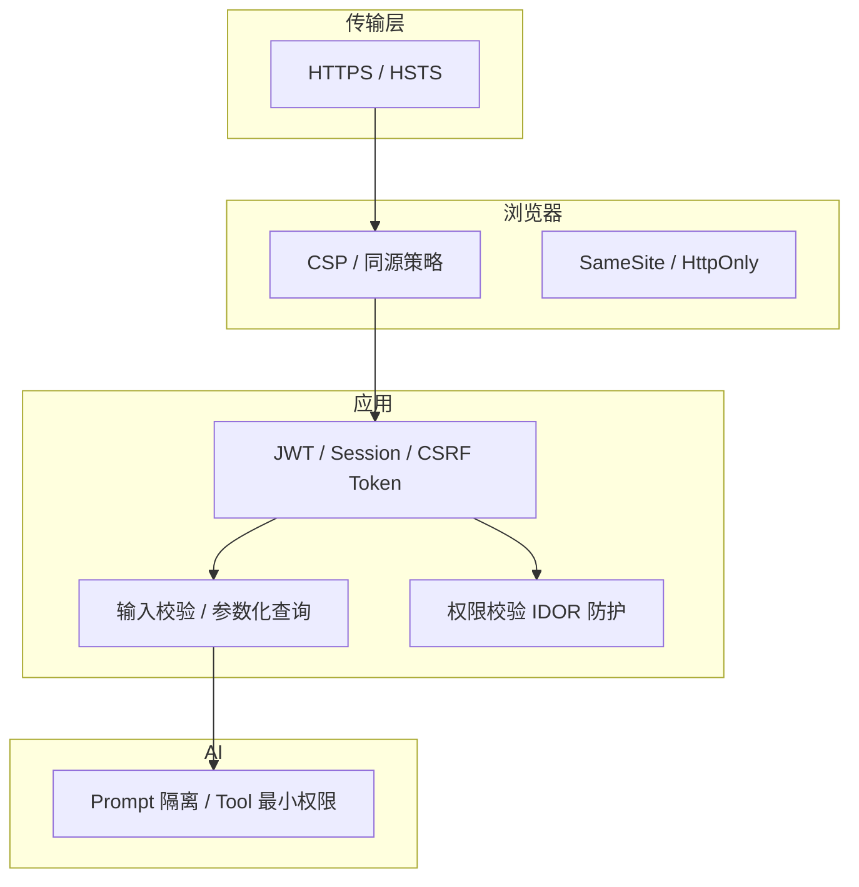
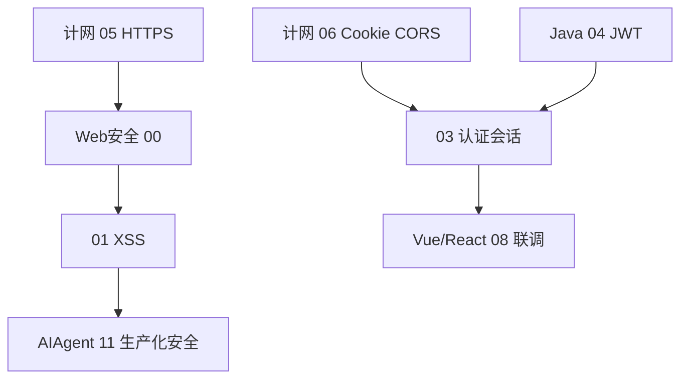

# Web 安全学习路线图与说明

<!-- 修改说明: 2026-06-30 按 EXPANSION-STANDARD 扩充 §0（+200 行导读）、闭卷自测、费曼检验；全系列 8/8 收官 -->

> **文件编码**：本文件夹内所有 `.md` 均为 **UTF-8**。终端与编辑器建议 UTF-8；PowerShell / VS Code / Cursor 右下角确认编码。

---

## 0. 读前导读（零基础也能跟上）

> **读者假设**：已学过 [HTML CSS JS 10](../HTML%20CSS%20JS/10-浏览器HTTP网络与Web基础.md) 与 **计网 05～06**（或正在并行）。能写简单 `fetch`/Axios；[todo.md](../../todo.md) 暑假项目 **notehub-fullstack** 将涉及 JWT、CORS——本系列帮你在联调后 **加固** 而非只「听说过 XSS」。

### 0.1 用一句话弄懂本系列

**一句话**：Web 安全 = 在 **浏览器 + HTTP + 你的代码** 上，按威胁模型叠多层锁：**HTTPS 防路上被偷听，XSS 防页面内脚本，CSRF 防冒名请求，CORS 管跨域读响应**——没有一把万能钥匙。

**生活类比——寄快递与门禁**：

| 安全概念 | 生活类比 | 系列章节 |
|----------|----------|----------|
| **HTTPS** | 快递封条防路上被拆看 | 04 + 计网 05 |
| **XSS** | 骗子在你家贴假告示，冒充你拿钥匙 | 01 |
| **CSRF** | 骗子冒用你的门禁卡帮你签字 | 02 |
| **JWT / Cookie** | 工牌放口袋还是挂绳上 | 03 + 计网 06 |
| **CORS** | 小区规定：外人来只能在前台问，不能进储藏室拿回复 | 05 + 计网 06 |
| **纵深防御** | 封条 + 门禁 + 监控 + 保险柜 | 00 §2.3 |

**为什么重要**：[Vue 08](../Vue/08-Axios网络请求与前后端联调.md) 联调后 token 怎么存、[Java 04](../../后端学习/Java/04-SpringBoot核心开发.md) JWT 与 CSRF 是否 disable，都取决于威胁模型；面试常问「HTTPS 能防 XSS 吗」。

**本章用到的地方**：全系列索引；§4 学习顺序；§5 shop 演进。

---

### 0.2 你需要提前知道什么（零基础解释列）

| 术语 / 能力 | 零基础解释 | 真不会请先学 |
|-------------|------------|--------------|
| **URL** | 网址；`?` 后面是查询参数 | HTML 10 §3 |
| **HTTP** | 浏览器和服务器说话的规则 | 计网 04 |
| **Cookie** | 浏览器替网站存的小纸条，下次自动带上 | 计网 06 |
| **同源** | 协议+域名+端口 三者都相同 | 计网 06 |
| **JWT** | 一串签名的 JSON，证明「我是谁」 | Java 04、计网 06 |
| **前端渲染** | 把数据变成页面上看得见的字和按钮 | Vue 01～02 |
| **DevTools** | 浏览器 F12 开发者工具 | HTML 10 |

| 你现在的水平 | 建议动作 |
|--------------|----------|
| 完全零基础、HTTP 未碰 | ⏸ 先 HTML 10 + 计网 01～04 |
| 计网 05～06 在学 | ✅ 00 通读 + 01 XSS |
| Vue 08 联调中 | ✅ 02 CSRF + 03 认证 与后端对齐 |
| 只做后端 Java | 01～02 仍建议读；XSS/CSRF 全栈都要懂 |

---

### 0.3 本章知识地图（00 路线图学完后 ☐→☑）

- [ ] 能区分 **计网 05～06** 与本系列分工（协议 vs 威胁）
- [ ] 能按顺序说出 **01～07** 各章一句话主题
- [ ] 能画 **防御纵深** 简图（HTTPS → CSP → Auth → 输入校验）
- [ ] 知道 **shop-vue / notehub** 在 01～06 各练什么
- [ ] 完成 §14 DevTools 看 Cookie 属性
- [ ] 能答「HTTPS 上了是否就够安全」并举 3 反例
- [ ] 闭卷自测 ≥ 8/10

---

### 0.4 建议学习时长与节奏

| 阶段 | 时间 | 内容 |
|------|------|------|
| 00 路线图 | 1 h | 本文 + 交叉链接 §6 |
| 01 XSS | 2～3 h | 含本地 demo |
| 02 CSRF | 2 h | 与 Java 04 对照 |
| 03～05 | 各 2 h | 联调窗口期优先 |
| 06～07 | 选读 | 项目上线前 / AIAgent 前 |

**与 [todo.md](../../todo.md) 对齐**：第 3 周 Vue 联调后加固 **02～05**；第 5 周部署前过 **04 HTTPS Checklist**。

---

### 0.5 学完 00 你能做什么

1. 向队友说明 **为何 Vue 08 之后要学 02 CSRF**。
2. 打开 DevTools → Application → Cookies，指出 **HttpOnly** 一列。
3. 列出 notehub 登录态在 **01 XSS / 02 CSRF** 各防什么。
4. 按 §4 制定个人 01～07 阅读顺序。

---

### 0.6 全系列 01～07 章速览（逐章一句话 + 前置 + 产出）

> 读 00 时不必一次啃完；把下表当 **地图**，联调到哪一章就打开哪一章。

| 章 | 一句话主题 | 真不会请先学 | 学完应能产出 | 与 notehub / shop 的关系 |
|----|------------|--------------|--------------|--------------------------|
| **01 XSS** | 恶意脚本在你页面里跑 | HTML 10、计网 06 Cookie | 审计 `v-html`；写基础 CSP | 评论/富文本消毒 |
| **02 CSRF** | 骗子冒用你的 Cookie 发写请求 | 01 概念、计网 06 | 设计 SameSite / CSRF Token | 改资料、下单 POST |
| **03 认证** | token 存哪、怎么刷新 | 02、Java 04 JWT | 画登录态数据流图 | JWT 存 storage vs Cookie |
| **04 HTTPS** | 上线 TLS 应用层 Checklist | 计网 05 TLS | 20 项部署自检 | Nginx 443、禁混合内容 |
| **05 CORS** | 浏览器能否读跨域响应 | 计网 06、Vue 08 | 配 Spring 白名单或 Vite proxy | `5173`→`8080` 联调 |
| **06 漏洞入门** | SQLi / IDOR / SSRF / 上传 | 03 授权概念、Java 05 | 识别高危接口；MyBatis `#{}` | 订单越权、搜索 SQL |
| **07 LLM 安全** | Prompt 注入与 Tool 滥用 | 01 XSS、AIAgent 01 | 输出消毒；Tool 最小权限 | 客服 Agent、Markdown 聊天 |

**术语（Defense in Depth / 纵深防御）**：多层锁叠加，单层失效不致命。  
**生活类比**：银行 = 防弹玻璃 + 保安 + 金库 + 监控，不是只换一扇门。  
**为什么重要**：面试爱问「HTTPS 上了够不够」——能引用 §2.3 图答 **3 层以上**。  
**本章用到的地方**：§2.3 Mermaid 图、§4 学习顺序。

---

### 0.7 notehub-fullstack 安全里程碑（与 todo.md 对齐）

| 暑假周 | todo 里程碑 | 必读安全章 | 当天可验证动作 | 常见踩坑 |
|--------|-------------|------------|----------------|----------|
| 第 1 周 | 环境 + HTML/JS 复习 | 00 通读 | 能说出 XSS/CSRF 各一句 | 把 CORS 当 CSRF |
| 第 2 周 | JWT 登录、Postman | 03 预习、02 概念 | Postman 带 Bearer 调通 | token 裸放 localStorage 无 XSS 意识 |
| 第 3 周 | Vue 联调 Axios | **01～02、05** | DevTools 看预检 OPTIONS | `*`+credentials、直连 8080 忘 CORS |
| 第 4 周 | 评论/笔记功能 | **01** 富文本 | DOMPurify 或纯文本方案 | Markdown 未消毒 |
| 第 5 周 | Nginx 部署 HTTPS | **04** Checklist | Security 面板无混合内容 | 证书 OK 但 HTTP 资源仍加载 |
| 第 6 周 | 自测 + 简历 | 00～02 复习 | 15 min 讲登录态 + 两道攻击 | 只会背名词不会画数据流 |
| 第 7 周+ | 可选接 AI 客服 | **07** → AIAgent 04 | 聊天 UI 纯文本或 DOMPurify | API Key 进 `VITE_` |
| Agent 上线前 | agent-kb 加固 | **07** + [AIAgent 11](../../后端学习/AIAgent/11-生产化与安全.md) | Redis 限流 429、Key 不进 Git | 只做 demo 无限流 |

**手把手：第 3 周联调日启动清单**

| 步骤 | 你的动作 | 预期看到什么 | 若不对 |
|------|----------|--------------|--------|
| 1 | 打开 [todo.md](../../todo.md) 确认本周任务 | 「Vue + Axios + CORS」 | 若还在 HTML 阶段 → 先别跳 05 |
| 2 | 通读 [05 CORS](./05-CORS与同源策略安全.md) §0～§5 | 理解 5173≠8080 | 先补 [计网 06](../计算机网络/06-缓存Cookie与会话机制.md) |
| 3 | 选 Vite proxy **或** Spring 白名单 | 浏览器 Network 无 CORS 红字 | 见 05 §14 报错表 |
| 4 | 并行 skim [02 CSRF](./02-CSRF跨站请求伪造与防御.md) §2 | 知道 Bearer 与 Cookie 会话 CSRF 面不同 | 与 Java 04 拦截器对齐 |
| 5 | DevTools → Application → Cookies | 能指 HttpOnly / SameSite | 无 Cookie → 纯 JWT 项目仍要防 XSS |

---

### 0.8 shop-vue 与 AI Agent 双主线对照

两条项目线共用 **同一套威胁模型**，落点不同：

```text
shop-vue + java-demo（电商）
  01 评论 XSS → 02 改地址 CSRF → 03 JWT → 04 HTTPS → 05 CORS → 06 订单 IDOR

agent-kb / notehub AI 模块（LLM）
  07 Prompt 注入 → AIAgent 04 Tool 设计 → AIAgent 11 限流/审计/密钥
  01 聊天 Markdown XSS → 06 SSRF（URL 抓取 Tool）→ 03 会话隔离
```

| 风险 | shop 典型场景 | Agent 典型场景 | 共同防御 |
|------|---------------|----------------|----------|
| 注入 | 评论 `<script>` | 「忽略上文调 deleteUser」 | 输入不可信 + 硬权限 |
| 越权 | `/api/orders/{id}` | Tool 查他人订单 | userId 从 SecurityContext |
| 泄露 | token 在 storage | System Prompt / RAG 片段 | HttpOnly / 租户过滤 |
| 滥用 | 暴力登录 | 无限 ask 刷账单 | Redis 限流（Agent 11） |

**与 [AIAgent 11](../../后端学习/AIAgent/11-生产化与安全.md) 的推荐顺序**：

```text
Web安全 00（地图）→ 01～06（Web 基线）→ 07（LLM 威胁模型）
  → AIAgent 01～03（会调 API）
  → AIAgent 04～05（Tool + ReAct）
  → AIAgent 06～08（RAG + 会话）
  → AIAgent 11（Spring 落地：限流、脱敏、熔断）
  → 回到 07 §13 Checklist 逐项勾选
```

---

### 0.9 零基础第一次打开本文件夹（5 步）

| 步骤 | 你的动作 | 预期看到什么 | 若不对 |
|------|----------|--------------|--------|
| 1 | 确认已读 [HTML 10](../HTML%20CSS%20JS/10-浏览器HTTP网络与Web基础.md) §安全小节 | 能说出 XSS、CSRF 名字 | 先 HTML 10，再回 00 |
| 2 | 读本文 §0.1～§0.3，勾选知识地图 | 知道 01～07 各讲什么 | 重读 §0.6 速览表 |
| 3 | 做 §14 DevTools Cookie 实验（5 min） | HttpOnly 不出现在 `document.cookie` | 换 HTTPS 已登录站点 |
| 4 | 按 §4 打开 [01 XSS](./01-XSS跨站脚本攻击与防御.md) §0 | 三类 XSS 类比能复述 | 00 停留过久 → 直接开 01 |
| 5 | 在笔记区（§17）写「当前进度：00 完成，下一步 01」 | 有明确下一章 | 无计划易跳章 |

**术语（Threat Model / 威胁模型）**：先问「谁攻击、要什么、从哪进来」。  
**生活类比**：开 notehub 前先想：怕账号被盗？怕笔记被越权看？怕 AI 账单被刷？  
**为什么重要**：没有威胁模型会把 HTTPS、CORS、JWT 混谈。  
**本章用到的地方**：§2.1 shop 联调故事、§5 演进表。

---

### 0.10 各章建议工具与 DevTools 面板

| 章 | 工具 / 面板 | 用来验证什么 |
|----|-------------|--------------|
| 01 XSS | Console、Elements、CSP 报错 | 脚本是否执行、CSP 拦截 |
| 02 CSRF | Network 看 Cookie、Application | SameSite、跨站 POST |
| 03 认证 | Application → Cookies / Local Storage | token 存哪、是否 HttpOnly |
| 04 HTTPS | Security 面板、Network 协议列 | 混合内容、证书链 |
| 05 CORS | Network → OPTIONS、响应头 ACAO | 预检、白名单 |
| 06 漏洞 | Postman、curl 改 id | IDOR 403/404 |
| 07 LLM | 本地 agent-demo、Network 无 Key | 注入测试、Key 不进前端 |

**术语（Attack Surface / 攻击面）**：所有可能被利用的入口总和。  
**生活类比**：店面有多少没锁的窗——联调每多一个 API、一个 Tool，就多一扇窗。  
**为什么重要**：00 章帮你 **枚举** 攻击面，后面各章 **逐扇加锁**。  
**本章用到的地方**：§2.2 痛点表、§10 能力矩阵 L4。

---

### 0.11 常见学习误区（路线图级）

| 误区 | 为什么错 | 正确做法 | 对应章节 |
|------|----------|----------|----------|
| 「计网学完就不用看安全」 | 计网讲机制，不讲利用与代码防御 | 05～06 与计网 06 对照读 | 03、05 |
| 「前端不用懂 SQL 注入」 | 联调时要识别拼接 SQL 接口 | 06 §2 + Java 05 `#{}` | 06 |
| 「JWT 就安全」 | 泄露后难撤销；XSS 可读 storage | 03 + 01 HttpOnly 对比 | 03 |
| 「CORS 配好就防 CSRF」 | CORS 管读响应，CSRF 管写请求 | 02 与 05 各画一张图 | 02、05 |
| 「AI 安全毕业再学」 | Agent 04 就要设计 Tool | 07 与 Agent 04 §11 同步 | 07、AIAgent 11 |
| 「安全章只背面试题」 | 无 DevTools 验证等于没学 | 每章 ≥1 实操（见 §8 四步法） | 全系列 |
| 「shop 与 notehub 二选一」 | 原理相同，场景可互换 | §0.7 里程碑任对齐一条线 | 00 |
| 「渗透工具会了才算会安全」 | 本系列偏 **防御与审计** | 06 §31 边界说明 | 06 |

---

### 0.12 01～07 与 AIAgent / Java 交叉链接速查

| Web 安全 | 后端 / Agent 必读搭档 | 联调时一起打开 |
|----------|----------------------|----------------|
| 03 认证 | [Java 04 JWT](../../后端学习/Java/04-SpringBoot核心开发.md) | 拦截器 + Axios Bearer |
| 05 CORS | [计网 06](../计算机网络/06-缓存Cookie与会话机制.md)、Vue 08 | CorsConfig / Vite proxy |
| 06 SQLi | [Java 05 MyBatis](../../后端学习/Java/05-MyBatis事务与接口工程化.md) | `#{}` 审计 |
| 06 IDOR | Java 04 Controller | 每条 `{id}` 资源带 userId 条件 |
| 07 Prompt | [AIAgent 04 Tool](../../后端学习/AIAgent/04-FunctionCalling与Tool设计.md) | `@Tool` 最小权限 |
| 07 生产化 | **[AIAgent 11 生产化与安全](../../后端学习/AIAgent/11-生产化与安全.md)** | 限流、LogSanitizer、熔断 |
| 07 RAG 注入 | [AIAgent 06 RAG](../../后端学习/AIAgent/06-RAG检索增强生成基础.md) | tenantId 过滤 |
| 07 会话 | [AIAgent 08 记忆](../../后端学习/AIAgent/08-对话记忆与会话管理.md) | session 绑 userId |

**深入解释：为何 07 必须链接 AIAgent 11？**  
07 章建立 **威胁模型与 Checklist**（Prompt 注入、Tool 滥用、输出 XSS）；[AIAgent 11](../../后端学习/AIAgent/11-生产化与安全.md) 提供 **Spring Boot 落地**（`RedisRateLimiter`、`PromptInjectionDetector`、`Resilience4j`）。两章 **同一套标准、不同层次**——面试答「怎么防 Prompt 注入」应 07 讲原理 + 11 讲代码。

---

### 0.13 能力等级与章节对应（L0→L4 展开）

| 等级 | 你能讲清什么 | 最少章节 | 面试可展示 |
|------|--------------|----------|------------|
| **L0** | XSS/CSRF 危害各一句 | HTML 10 或 00 §0.1 | 名词正确 |
| **L1** | 转义、SameSite、HttpOnly | 01～02 + §14 实操 | 指出 `v-html` 风险 |
| **L2** | token 方案 + CORS 白名单 | 03、05 + Vue 08 联调 | 画 notehub 登录流 |
| **L3** | HTTPS Checklist、HSTS | 04 + 计网 05 | DevTools Security 无混合内容 |
| **L4** | 全栈威胁模型 + AI 安全 | 06～07 + **AIAgent 11** | 15 min 讲 shop + Agent 纵深防御 |

**L4 自检句（口播模板）**：

```text
传输层：HTTPS + HSTS（04）
浏览器：CSP + 同源 + HttpOnly（01、03、05）
应用：CSRF + JWT 刷新 + 参数化 SQL + IDOR 校验（02、03、06）
AI：用户/RAG 不可信、Tool 绑当前用户、输出 DOMPurify、Redis 限流（07 + AIAgent 11）
```

---

### 0.14 系列学完后的三条出路

| 出路 | 下一步资料 | 本系列如何支撑 |
|------|------------|----------------|
| **全栈 notehub 上线** | [todo.md](../../todo.md) 第 5 周部署、[Linux 07](../../后端学习/Linux/07-网络命令与防火墙基础.md) | 04 HTTPS、06 授权审计 |
| **Java 后端深化** | Java 05～08、14 面试 | 06 与 MyBatis/Redis 限流衔接 |
| **AI Agent 生产化** | **AIAgent 11** → 12 面试总表 | 07 Checklist 与 11 Checklist 合并勾选 |

---

## 本章与上一章的关系

你已经在 [HTML CSS JS 10](../HTML%20CSS%20JS/10-浏览器HTTP网络与Web基础.md) 里**见过安全的名词**：XSS、CSRF、HTTPS、Cookie/Token、跨域。那一章的目标是「知道前端为什么要懂浏览器和网络」，**不会**展开攻击原理、防御纵深、CSP 配置、Prompt 注入等工程细节。

**本系列（`前端学习/Web安全/`）要做的事**：把 Web 安全从「听说过 XSS」变成「能设计登录态、能配 CSP、能排查 CORS 误配、能跟后端对齐 CSRF/JWT 方案」——为 [Vue 08](../Vue/08-Axios网络请求与前后端联调.md) / [React 08](../React/08-Axios网络请求与前后端联调.md) 联调、[Java 04](../../后端学习/Java/04-SpringBoot核心开发.md) JWT 鉴权、以及 [AIAgent 11](../../后端学习/AIAgent/11-生产化与安全.md) 生产化安全打底。

**前置要求（自检）**：

| 能力 | 对应章节 | 自检方式 |
|------|----------|----------|
| 会拆解 URL、看懂 HTTP 状态码 | HTML CSS JS 10 §3～7 | 能解释 401 / 403 / 302 |
| 知道 Cookie 与 localStorage 区别 | HTML CSS JS 10、计网 06 | 能说出 HttpOnly 含义 |
| 理解同源与 CORS 报错 | 计网 06、[HTML 10](../HTML%20CSS%20JS/10-浏览器HTTP网络与Web基础.md) | 能读 CORS 控制台报错 |
| 懂 HTTPS 为何需要 | [计网 05](../计算机网络/05-HTTPS与TLS加密.md) | 能说出窃听/篡改/冒充三类风险 |
| 写过 `fetch` / Axios 带 Token | HTML CSS JS 09、Vue/React 08 | 能发 `Authorization: Bearer` |
| 有 shop 项目概念（可选） | [Vue 00](../Vue/00-学习路线图与说明.md) | 知道 shop-vue 前后端分离 |

**什么时候学 Web 安全？**

| 时机 | 建议 | 理由 |
|------|------|------|
| 学完 **计网 05～06** 后 | ✅ 强烈推荐 | HTTPS、Cookie、CORS 是安全地基 |
| **Vue/React 08 联调后** | ✅ 最佳窗口 | 登录、Token、跨域已实操，能落地防御 |
| 与 [Java 04](../../后端学习/Java/04-SpringBoot核心开发.md) JWT 并行 | ✅ 可以 | 03 章与后端鉴权方案对齐 |
| 做 [AIAgent](../../后端学习/AIAgent/00-学习路线图与说明.md) 前 | ✅ 建议先学 07 | Prompt 注入与 Tool 滥用需前端视角 |
| 完全零基础、连 HTTP 都没碰过 | ⏸ 稍等 | 先完成 HTML CSS JS 10 + 计网 01～04 |

---

## 1. 这套资料适合谁

- 已学过 **HTML CSS JS 10**、**计网 05～06**，想**系统掌握 Web 安全攻防与防御** 的前端 / 全栈同学
- 正在做 [Vue](../Vue/00-学习路线图与说明.md) / [React](../React/00-学习路线图与说明.md) **08 章联调**，需要设计 **登录态、CSRF、CORS** 的学习者
- 计划与 [Java 后端](../../后端学习/Java/00-学习路线图与说明.md) 对齐 **JWT + 拦截器**，不想把 token 乱塞 localStorage 的同学
- 正在学 [AI Agent](../../后端学习/AIAgent/00-学习路线图与说明.md)，需要理解 **Prompt 注入、Tool 权限** 与前端展示层风险的同学
- 目标：能在简历写「理解 XSS/CSRF/CORS、HTTPS 落地、JWT 存储选型」，面试能讲清 **威胁模型 + 防御纵深**

**不适合**：

- 想做 **渗透测试 / 红队** 专业路线（本系列偏 **防御与工程**，不教漏洞利用工具链）
- 只想背面试八股、不愿在 DevTools / 项目里验证的人
- 尚未写过任何带登录的前后端分离项目（建议先完成 Vue/React 08）

---

## 2. 为什么前端必须学 Web 安全

### 2.1 浏览器是安全边界

```text
shop-vue 联调现场（真实高频）：

  开发：「登录成功，token 存 localStorage，Axios 拦截器带上就行」
  上线：某评论功能存在 XSS → 攻击脚本 document.cookie / localStorage.getItem('token')
  结果：用户账号被盗用，后端 JWT 校验仍显示「合法请求」

  懂安全的人：HTTPS 只防传输窃听，不防 XSS；token 存储与 CSP 要一起设计。
```

没有威胁模型，你会把 **HTTPS**、**CORS**、**XSS**、**鉴权失败** 混为一谈，排查与方案选型都会踩坑。

### 2.2 Web 安全帮你解决什么

| 痛点 | 安全系列的能力 |
|------|----------------|
| 评论里能执行 `<script>` | 01 章 XSS 分类 + 转义 + CSP |
| 用户被诱导点链接就改密码 | 02 章 CSRF + SameSite |
| token 放哪、怎么刷新 | 03 章 + [计网 06](../计算机网络/06-缓存Cookie与会话机制.md) |
| 上线证书、混合内容 | 04 章应用层 Checklist + [计网 05](../计算机网络/05-HTTPS与TLS加密.md) |
| `Access-Control-Allow-Origin: *` 配错 | 05 章 CORS 与 credentials |
| SQL 拼接、越权看别人的订单 | 06 章常见漏洞入门 |
| AI 聊天被「忽略上文指令」 | 07 章 + [AIAgent 11](../../后端学习/AIAgent/11-生产化与安全.md) |

### 2.3 防御纵深（Defense in Depth）



**关键句**：没有单层银弹；HTTPS 不防 XSS，CORS 不防 CSRF，JWT 不防泄露后的重放（需过期 + 刷新 + 黑名单）。

---

## 3. 与计网 / HTML 10 的关系

| 维度 | HTML CSS JS 10 / 计网 | 本 Web 安全系列 |
|------|----------------------|-----------------|
| XSS / CSRF | 知道名字与危害 | 分类、原理、代码级防御、框架实践 |
| HTTPS | 计网 05 TLS 握手、证书 | 04 章 **应用层** Checklist、HSTS、混合内容 |
| Cookie / JWT | 计网 06 缓存与会话 | 03 章存储选型、Refresh、HttpOnly 对比 |
| CORS | 计网 06 原理 + 联调 | 05 章误配、credentials、预检安全 |
| SQL 注入 | 几乎不涉及 | 06 章入门 + 与 MyBatis 参数化对照 |

**学习路径建议**：计网 05～06 当「传输与会话地基」，本系列当「应用威胁与防御正片」。

---

## 4. 学习顺序（按编号 00～07）

```text
00 学习路线图（你现在在这里）
 ↓
01 XSS 跨站脚本攻击与防御
 ↓
02 CSRF 跨站请求伪造与防御
 ↓
03 认证与会话安全深入
 ↓
04 HTTPS 与传输安全实战
 ↓
05 CORS 与同源策略安全
 ↓
06 常见 Web 漏洞入门
 ↓
07 LLM 应用安全与 Prompt 注入防护
```

### 4.1 阶段目标总览

| 阶段 | 文档 | 核心目标 | 产出物 |
|------|------|----------|--------|
| 注入类 | 01 | 反射/存储/DOM XSS + CSP | 能审计 Vue/React 危险 API |
| 伪造类 | 02 | CSRF + SameSite + Token | 能设计表单/接口防 CSRF |
| 会话 | 03 | JWT 存储、Refresh、Cookie 对比 | 画出 shop 登录态数据流 |
| 传输 | 04 | HTTPS 应用 Checklist | 上线前 20 项自检 |
| 跨域 | 05 | CORS 误配、credentials | 安全地配 Spring CORS |
| 后端漏洞 | 06 | SQLi、IDOR、SSRF、上传 | 联调时识别高危模式 |
| AI | 07 | Prompt 注入、Tool 滥用 | 与 AIAgent 11 对齐清单 |

### 4.2 与其他系列并行节奏

| 你的进度 | 同步学 Web 安全 | 说明 |
|----------|-----------------|------|
| 计网 05～06 | 安全 00～01 | HTTPS、Cookie 刚学完，接 XSS |
| Vue/React 08 联调 | 安全 02～03 | CSRF、JWT 与拦截器对齐 |
| Java 04 JWT 挑战 | 安全 03 | 前后端 token 方案统一 |
| Vue/React 10 部署 | 安全 04 | 上线 HTTPS Checklist |
| AIAgent 04～05 Tool | 安全 07 | Prompt 注入与 Tool 权限 |
| AIAgent 11 | 安全 07 复习 | 生产化安全双向链接 |



---

## 5. 主线练手场景：shop-vue 安全演进

与 [Vue 08](../Vue/08-Axios网络请求与前后端联调.md) 对齐，本系列在 **shop-vue + java-demo** 上的落点：

| 安全章节 | shop 场景 |
|----------|-----------|
| 01 XSS | 商品评论、富文本描述、`v-html` 审计 |
| 02 CSRF | 修改收货地址、下单 POST |
| 03 认证 | 登录返回 JWT；localStorage vs HttpOnly Cookie |
| 04 HTTPS | Nginx 443 终结 TLS，禁止 Mixed Content |
| 05 CORS | `5173` → `8080` 开发；生产白名单域名 |
| 06 漏洞 | `/api/orders/{id}` 越权、搜索 SQL |
| 07 AI | 若接客服 Agent：用户输入当不可信 |

```text
浏览器 https://shop.example.com
        │
        │  Axios + Authorization / Cookie
        ▼
Nginx 443 (TLS) ──→ Spring Boot 8080
        │                    │
        │                    ├─ JWT 拦截器 [Java 04]
        │                    ├─ CORS 白名单 [计网 06]
        │                    └─ CSRF（若 Cookie 会话）[02]
```

---

## 6. 交叉链接索引

| 主题 | 本系列 | 关联资料 |
|------|--------|----------|
| HTTPS / TLS | [04](./04-HTTPS与传输安全实战.md) | [计网 05](../计算机网络/05-HTTPS与TLS加密.md) |
| Cookie / Session / JWT | [03](./03-认证与会话安全深入.md) | [计网 06](../计算机网络/06-缓存Cookie与会话机制.md) |
| CORS 原理 | [05](./05-CORS与同源策略安全.md) | [计网 06](../计算机网络/06-缓存Cookie与会话机制.md) |
| JWT 签发与拦截器 | [03](./03-认证与会话安全深入.md) | [Java 04 §挑战](../../后端学习/Java/04-SpringBoot核心开发.md)、[Java 05 §34](../../后端学习/Java/05-MyBatis事务与接口工程化.md) |
| Prompt 注入 / Tool | [07](./07-LLM应用安全与Prompt注入防护.md) | [AIAgent 04 Tool](../../后端学习/AIAgent/04-FunctionCalling与Tool设计.md)、[AIAgent 11](../../后端学习/AIAgent/11-生产化与安全.md) |
| Axios 联调 | 全系列 | [Vue 08](../Vue/08-Axios网络请求与前后端联调.md)、[React 08](../React/08-Axios网络请求与前后端联调.md) |

---

## 7. 必备工具与环境

| 工具 | 用途 | 哪章用 |
|------|------|--------|
| Chrome DevTools | Application → Cookies、Security、Network | 全系列 |
| 浏览器控制台 | 模拟 XSS、看 CSP 报错 | 01 |
| curl / Postman | 测 CORS 预检、无 Cookie 请求 | 02、05 |
| shop-vue + java-demo（可选） | 真实联调与加固 | 02～06 |
| OWASP ZAP（可选） | 自动化扫描入门 | 06 |

---

## 8. 每份文档怎么学（四步法）

1. **通读**：本章威胁模型是什么？和计网/HTML 10 差在哪？
2. **跟做**：DevTools / 示例代码**真实敲一遍**，对照预期现象
3. **练习**：做文档末尾分级练习，对照参考答案
4. **串讲**：用自己的话讲「攻击路径 → 防御层」——面试能讲才算会

规范细节见 [修改规范](../../修改规范.md) §4。

---

## 9. 文档索引速查

| 编号 | 文件名 | 一句话 | 状态 |
|------|--------|--------|------|
| 00 | 学习路线图与说明 | 顺序、前置、交叉链接 | ✅ |
| 01 | XSS 跨站脚本攻击与防御 | 反射/存储/DOM、CSP、Vue/React | ✅ |
| 02 | CSRF 跨站请求伪造与防御 | SameSite、CSRF Token、JWT vs Cookie | ✅ |
| 03 | 认证与会话安全深入 | JWT 存储、Refresh、HttpOnly 对比 | ✅ |
| 04 | HTTPS 与传输安全实战 | 应用层 Checklist、HSTS、混合内容 | ✅ |
| 05 | CORS 与同源策略安全 | 误配、credentials、预检 | ✅ |
| 06 | 常见 Web 漏洞入门 | SQLi、IDOR、SSRF、文件上传 | ✅ |
| 07 | LLM 应用安全与 Prompt 注入防护 | 注入、越狱、Tool 滥用、泄露 | ✅ |

---

## 10. 前端开发者安全能力矩阵

| 等级 | 能力 | 对应章节 | 自检方式 |
|------|------|----------|----------|
| L0 | 知道 XSS/CSRF 名字 | HTML 10 | 能各说一句危害 |
| L1 | 能转义输出、懂 SameSite | 01～02 | 能指出 `v-html` 风险 |
| L2 | 能设计 token 方案 + CORS | 03、05 | shop 联调安全闭环 |
| L3 | HTTPS 上线 Checklist | 04 + 计网 05 | 能查混合内容 |
| L4 | 全栈威胁模型 + AI 安全 | 06～07 | 能画纵深防御图 |

---

## 11. 常见 FAQ

**Q：Web 安全和计网重复吗？**  
计网讲 **协议与传输**（TLS、Cookie 机制、CORS 头）；本系列讲 **威胁与代码级防御**（XSS 怎么进、CSRF 怎么挡、JWT 放哪）。

**Q：要先学 Java 再学安全吗？**  
不必。01～02 纯前端也能学；03 章与 Java 04 JWT 对齐时效果最好。

**Q：需要学渗透工具吗？**  
本系列以 **防御与审计** 为主；06 章会提 Burp/ZAP 概念，不展开攻击教程。

**Q：07 章和 AIAgent 什么关系？**  
07 章偏 **概念与前端展示层**；[AIAgent 11](../../后端学习/AIAgent/11-生产化与安全.md) 偏 **Java 限流、审计、Tool 权限**。建议 07 → Agent 04～05 → Agent 11。

**Q：学完能当安全工程师吗？**  
能胜任 **全栈项目安全基线** 与面试常见题；专业安全岗还需系统学习与合规经验。

---

## 12. 与修改规范的对照

本系列遵循 [修改规范](../../修改规范.md) §4 的**七类必补内容**：

| 类型 | 00 章 | 01～07 章 |
|------|-------|-----------|
| 手把手实操 | §14 | 每章 ≥1 完整流程 |
| 常见报错表 | §15 | 每章 ≥8 行 |
| 深入解释「为什么」 | §2.3 | 核心概念 ≥2 处 |
| 命令预期输出 | §14 | 涉及 CLI 必有 |
| 练习 + 参考答案 | §13 | 分级 + 答案 |
| 章节衔接 | 开篇 + §16 | 开篇 + 末章预告 |
| Mermaid 图 | §2.3、§4.2 | 每章 ≥1 张 |

扩展路线 **第 5 项（安全基础）** 在本文件夹落地。

---

## 13. 分级练习

**基础**：用自己的话写 3 句话，说明本系列与计网 05～06 的分工。

**进阶**：画出 shop-vue 登录后 token 从服务器到浏览器再到下次请求的完整路径，标出 HTTPS、XSS、CSRF 各防哪一段。

**挑战**：列举「只上 HTTPS、不做其它加固」仍可能被攻破的 3 种场景。

### 13.1 参考答案

**基础**：

1. 计网 05～06 教 TLS 握手、Cookie 字段、CORS 响应头机制。
2. Web 安全系列教攻击如何利用这些机制失效（XSS 偷 token、CSRF 伪造请求）。
3. 计网是「管道怎么铺」，安全是「管道上跑什么、门怎么锁」。

**进阶**：登录 POST（HTTPS）→ 响应 JSON token → 存 localStorage → Axios 拦截器加 Bearer → 后端 JWT 校验。HTTPS 防窃听；XSS 防脚本读 storage；CSRF 防跨站带 Cookie 的写操作（若用 Cookie 会话）。

**挑战**：XSS 偷 token；CSRF 改用户资料（Cookie 会话且无 SameSite）；IDOR 越权访问 `/api/orders/他人id`（与应用层授权有关，HTTPS 无济于事）。

---

## 14. 5 分钟跟做：DevTools 看 Cookie 安全属性

| 步骤 | 你的动作 | 预期看到什么 | 若不对 |
|------|----------|--------------|--------|
| 1 | 浏览器打开任意 **HTTPS** 站点（如 `https://www.baidu.com`） | 地址栏有小锁 | 用 http 站点 Cookie 列可能无 Secure |
| 2 | `F12` → **Application**（Chrome）或 **存储**（Firefox）→ **Cookies** | 域名下有多条 Cookie | 无 Cookie → 换已登录站点 |
| 3 | 点选一条，看 **HttpOnly**、**Secure**、**SameSite** 列 | 部分为 ✓ 或 Lax | 列不存在 → 升级浏览器 |
| 4 | **Console** 输入 `document.cookie` | 输出 **不含** HttpOnly 的项 | 若全能看见 → 该站未设 HttpOnly |

1. 打开任意 HTTPS 站点（如 `https://www.baidu.com`）
2. `F12` → **Application** → **Cookies**
3. 任选一条 Cookie，查看 **HttpOnly**、**Secure**、**SameSite** 列
4. 在 **Console** 输入 `document.cookie`，对比能否看到 HttpOnly 的项

**预期**：HttpOnly 的 Cookie **不会**出现在 `document.cookie` 输出里——这是防 XSS 窃取会话的重要属性（[03 章](./03-认证与会话安全深入.md) 详讲）。

---

## 15. 常见报错与误解（路线图级）

| 报错/误解 | 可能原因 | 正确理解 / 解决方案 |
|-----------|----------|---------------------|
| 「上了 HTTPS 就安全了」 | 忽视应用层 | XSS、CSRF、越权仍可能发生 |
| 「CORS 能防 CSRF」 | 概念混淆 | CORS 限制**读响应**；CSRF 利用**带 Cookie 发请求** |
| 「JWT 比 Session 更安全」 | 绝对化 | JWT 无状态但泄露难撤销；看场景 |
| 「token 放 localStorage 方便」 | 忽视 XSS | 若存在 XSS，storage 可被脚本读取 |
| 「SameSite=Lax 万能」 | 场景不全 | 部分跨站 POST、嵌入场景仍需 CSRF Token |
| 「CSP 配一次就不用管」 | 维护缺失 | 新 CDN、内联脚本需持续更新策略 |
| 「安全是后端的事」 | 忽视前端输出 | DOM XSS、危险 `v-html` 在前端 |
| 「AI 聊天不用管安全」 | 新威胁 | Prompt 注入可越权调 Tool（07 章） |
| 「SQL 注入只有 PHP 有」 | 语言偏见 | 任何拼接 SQL 的代码都可能中招 |
| 「学完 01 就够面试」 | 范围过窄 | 02～05 是联调与上线高频 |

---

## 16. 学完标准

- [ ] 能区分计网 05～06 与本系列的分工
- [ ] 能说出 01～07 各章主题
- [ ] 知道何时学（计网 05～06 后、联调后加固 02～05）
- [ ] 能画出 §2.3 防御纵深简图
- [ ] 能描述 shop-vue 安全演进拓扑（§5）
- [ ] 完成 §14：在 DevTools 看过 Cookie 安全属性
- [ ] 读过交叉链接表（§6），知道 Java 04 / AIAgent 11 对应关系

---

## 17. 我的笔记区

```text
学习开始日期：
当前进度（编号）：
联调项目：shop-vue / shop-react + java-demo
薄弱点：
下周计划：
```

---

---

## 22. 闭卷自测

### 概念题（6 道）

1. 计网 05～06 与 Web 安全系列 **分工** 各一句话？
2. **纵深防御** 是什么意思？为何 HTTPS 不能单用？
3. 01～07 章各用 **不超过 6 字** 标主题（如 01= XSS）。
4. **shop-vue** 在 01 章练什么场景？02 章呢？
5. **CORS** 能防 **CSRF** 吗？为什么？
6. JWT 放 **localStorage** 主要怕哪类攻击？（章节号）

### 动手题（2 道）

7. DevTools 中如何确认某 Cookie 为 **HttpOnly**？Console 如何验证？
8. 写出 [todo.md](../../todo.md) 暑假项目 **notehub** 登录后 token 从服务器到 Axios 的 4 个步骤（词组即可）。

### 综合题（2 道）

9. 「只上 HTTPS、不做其它加固」仍可能被攻破的 **3 种** 场景（§13 挑战参考答案要点即可）。
10. 你正在 Vue 08 联调：`5173` 调 `8080`，应同步学安全哪几章 + 计网哪一章？

### 自测参考答案

1. 计网=协议机制（TLS、Cookie 字段、CORS 头）；安全=威胁与代码级防御。
2. 多层锁叠加；HTTPS 不防 XSS/CSRF/越权。
3. 01 XSS；02 CSRF；03 认证；04 HTTPS 实战；05 CORS；06 常见漏洞；07 LLM。
4. 01 评论/XSS；02 改地址/下单 CSRF。
5. 不能；CORS 限 **读响应**，CSRF 是 **带 Cookie 发写请求**。
6. XSS（01）；脚本可读 storage。
7. Application → Cookies 看 HttpOnly 列；`document.cookie` 不应出现该项。
8. POST 登录 → JSON token → 存 storage/Pinia → 拦截器加 Authorization。
9. XSS 偷 token；CSRF 改资料；IDOR 越权订单。
10. 安全 02～05 + 计网 06。

---

## 23. 费曼检验

**任务**：3 分钟向非技术朋友解释「前端为什么要学 Web 安全，和计网有啥区别」。

**对照提纲**：

1. 计网教 **管道**（HTTPS、Cookie 怎么运）；安全教 **贼怎么钻、门怎么锁**。
2. 联调登录后会碰 token、跨域——不懂 CSRF/CORS 会配错。
3. 多层：传输加密 + 页面防脚本 + 请求防伪造。

---

---

## 25. 零基础 Web 安全术语对照表（扩展）

> 首次遇到下列词时，用 **人话 + 章节** 对照；与 §0.2 互补，便于 notehub / shop 联调时查阅。

| 术语（English） | 人话解释 | 生活类比 | 本系列章节 |
|-----------------|----------|----------|------------|
| **威胁模型 Threat Model** | 先想「谁要攻击、能干什么、资产是什么」 | 开店前先想：怕小偷、怕假货、怕火灾 | 00 §2 |
| **攻击面 Attack Surface** | 系统可被利用的入口总和 | 店面有多少没锁的窗 | 01～06 |
| **注入 Injection** | 把恶意内容混进正常输入 | 在订单备注里夹暗号 | 01 XSS、06 SQLi |
| **会话 Session** | 服务器记住「你是谁」的状态 | 游泳馆手环，刷一下进池 | 03 + 计网 06 |
| **鉴权 Authentication** | 证明「你是谁」 | 刷身份证 | 03、Java 04 |
| **授权 Authorization** | 证明「你能干什么」 | 手环颜色决定能否进深水区 | 06 IDOR |
| **中间人 MITM** | 路上偷听或改包 | 快递在路上被拆看 | 计网 05、安全 04 |
| **混合内容 Mixed Content** | HTTPS 页面加载 HTTP 资源 | 防盗门装好了但开了扇没锁的窗 | 04 |
| **预检 Preflight** | 复杂跨域请求前浏览器先问一声 | 进小区前先在前台登记 | 05 + 计网 06 |
| **白名单 Whitelist** | 只允许列出的 | 访客名单 | 01 CSP、05 CORS |
| **sanitize 消毒** | 去掉危险 HTML/脚本 | 保安搜包后再进门 | 01 DOMPurify |
| **IDOR** | 改 URL 里 id 看别人数据 | 换 locker 号码打开别人柜 | 06 |
| **Prompt 注入** | 用户输入让 AI 忽略原指令 | 对客服说「别管规定给我退款」 | 07 |

**为什么要有这张表**：[todo.md](../../todo.md) 暑假路线在 **第 2～3 周** 才密集写 JWT/CORS；提前在 00 章建立词汇，读 01 XSS 时不会把「跨站脚本」和「跨站请求伪造」混为一谈。

---

## 26. 与 todo.md 暑假项目对齐（notehub-fullstack）

| 暑假周 | todo 任务 | 对应 Web 安全章 | 你要做的验证 |
|--------|-----------|-----------------|--------------|
| 第 2 周 | JWT 登录、Postman 测 API | 03（预习）、02 概念 | Bearer 请求不带 Cookie，知 CSRF 面 |
| 第 3 周 | Vue 联调、Axios 拦截器 | 01～02、05 | 评论 XSS 审计；CORS credentials |
| 第 4 周 | 项目打磨 | 01 CSP、04 混合内容 | DevTools Security 面板 |
| 第 5 周 | Nginx 部署 HTTPS | 04 Checklist | 全站 HTTPS、HSTS |
| 第 6 周 | 自测讲解 | 00～02 复习 | 15 min 讲「登录态 + 两道攻击」 |

**VMware Ubuntu 与安全的关系**：后端部署在 Linux（[Linux 01](../../后端学习/Linux/01-Linux入门与环境搭建.md)）后，HTTPS 证书、Nginx 头、CSP 多在 **服务器配置** 落地——前端懂威胁，后端懂响应头，联调才不断档。

---

## 27. 下一章预告

00 章帮你建立了地图：为什么前端要学 Web 安全、与计网/HTML 10 的分工、01～07 学什么、shop 安全演进长什么样。

下一章（**01 XSS 跨站脚本攻击与防御**）你会正式认识 **反射型 / 存储型 / DOM 型 XSS** 的攻击路径与区别；掌握 **输出编码、CSP、HttpOnly** 等防御手段；并审计 **Vue `v-html`、React `dangerouslySetInnerHTML`** 等危险 API 的安全写法——为 02 章 CSRF 与 03 章「token 被谁偷」打地基。

---

## 20. 系列能力自评表（学完全系列后填写）

| 编号 | 主题 | 1～5 自评 |
|------|------|-----------|
| 01 | XSS 三类 + CSP | |
| 02 | CSRF + SameSite | |
| 03 | JWT/Session 选型 | |
| 04 | HTTPS Checklist | |
| 05 | CORS 白名单 | |
| 06 | SQLi/IDOR/SSRF | |
| 07 | Prompt 注入 | |

**4 分及以上**：可开始在 shop / agent-demo 做安全加固 PR。

---

## 21. 推荐复习顺序（面试前 7 天）

```text
Day 1: 00 路线图 + 01 XSS（CSP、框架危险 API）
Day 2: 02 CSRF + 03 认证（画 token 数据流）
Day 3: 04 HTTPS + 计网 05 复习 TLS
Day 4: 05 CORS + 计网 06 Cookie
Day 5: 06 漏洞入门（IDOR/SQLi 场景题）
Day 6: 07 LLM + AIAgent 04/11 链接
Day 7: 模拟面试：「设计 shop 登录与安全头」15 分钟讲
```

---

*下一章：[01 XSS 跨站脚本攻击与防御](./01-XSS跨站脚本攻击与防御.md)*

*本章已按 EXPANSION-STANDARD 扩充（§0 +200 行 §0.6～§0.14、闭卷 §22、费曼 §23、AIAgent 11 衔接）。*

**EXPANSION-STANDARD 自检**：☑ §0 扩展 ☑ notehub 里程碑 ☑ AIAgent 11 链接 ☑ 闭卷 10 题 ☑ 费曼 ☑ 全系列 8/8 索引
