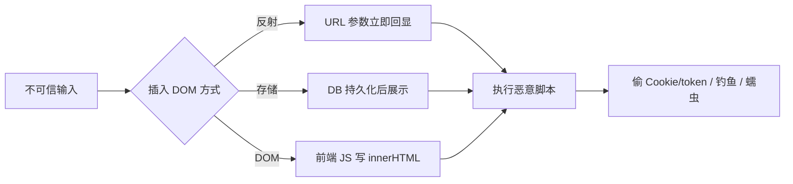
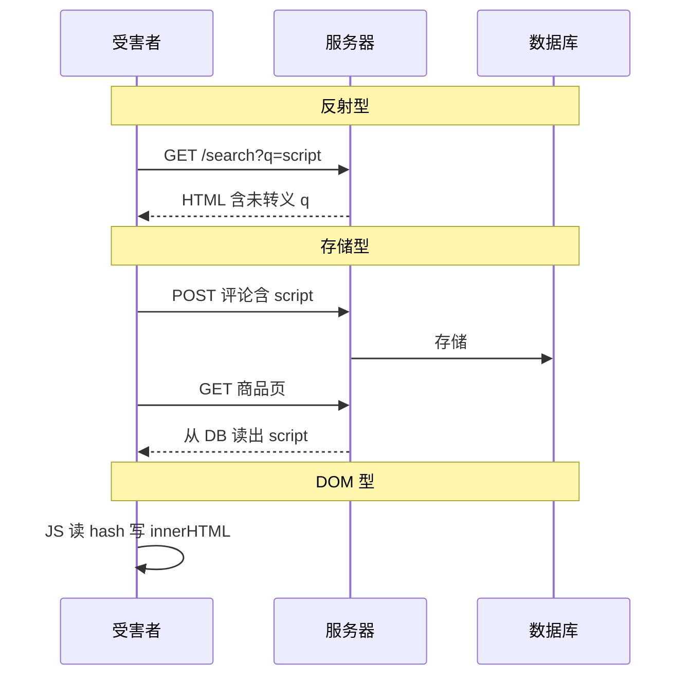
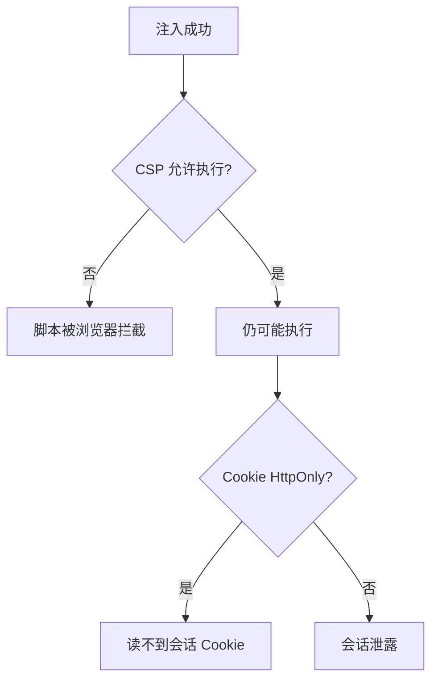

# XSS 跨站脚本攻击与防御

<!-- 修改说明: 2026-06-30 按 EXPANSION-STANDARD 扩充 §0、步骤表、FAQ、闭卷自测、费曼检验 -->

> **文件编码**：UTF-8。  
> **定位**：Web 安全系列 **01 章**——讲清 **反射型 / 存储型 / DOM 型 XSS** 的攻击路径，掌握 **输出编码、CSP、框架安全写法**，并与 shop 评论场景、[计网 05 HTTPS](../计算机网络/05-HTTPS与TLS加密.md)「HTTPS 不防 XSS」对齐。

---

## 0. 读前导读（零基础也能跟上）

> **读者假设**：完成 [Web 安全 00](./00-学习路线图与说明.md) 与 **计网 05～06**；能写 Vue/React 简单页面。本地 demo 在 **Windows 浏览器** 即可；与 [todo.md](../../todo.md) **notehub** 评论功能直接相关。

### 0.1 用一句话弄懂本章

**一句话**：**XSS = 攻击者的 JavaScript 在你的网页里跑起来**——偷 token、改页面、代你点击；防法是 **别乱用 innerHTML/v-html、输出转义、上 CSP**。

**生活类比**：

| 类型 | 类比 |
|------|------|
| **反射型 XSS** | 骗子给你一张假传单，你当场念出上面的诈骗话术 |
| **存储型 XSS** | 骗子在公告栏贴假通知，所有来的人都看到 |
| **DOM 型 XSS** | 你家自己把传单内容贴进窗户（前端 JS 写 DOM） |
| **CSP** | 小区规定：只有备案装修队能施工（只允许白名单脚本） |
| **DOMPurify** | 保安先检查传单，撕掉危险字再贴 |

---

### 0.2 你需要提前知道什么

| 水平 | 建议 |
|------|------|
| 不知 Cookie / localStorage | 先 [计网 06](../计算机网络/06-缓存Cookie与会话机制.md) |
| 未写过 Vue/React | 可先读 §1～§2 概念，框架节后补 |
| notehub 评论将用 Markdown | 本章 §7 + §26 必读 |

---

### 0.3 本章知识地图（☐→☑）

- [ ] 区分反射 / 存储 / DOM 三类 XSS
- [ ] 解释 **HTTPS 为何不防 XSS**
- [ ] 会用 `textContent` 替代危险 `innerHTML`
- [ ] 审计 `v-html` / `dangerouslySetInnerHTML`
- [ ] 读懂 CSP 拦截控制台报错
- [ ] 完成 §12 本地 demo + 修复
- [ ] 闭卷自测 ≥ 8/10

---

### 0.4 建议学习时长

| 阶段 | 时间 |
|------|------|
| §1～§3 三类 XSS | 1 h |
| §4～§6 编码与 CSP | 1 h |
| §7～§8 Vue/React | 1 h |
| §12 实操 + 自测 | 45 min |

---

### 0.5 学完你能做什么

1. 审计 notehub 评论组件是否危险使用 `v-html`。
2. 写一条基础 `Content-Security-Policy` 响应头。
3. 向产品解释「评论为什么不能裸 HTML」。

---

## 本章衔接

| 你已具备 | 本章继续 |
|----------|----------|
| [HTML 10](../HTML%20CSS%20JS/10-浏览器HTTP网络与Web基础.md) 知道 XSS 危害 | 三类 XSS 原理与代码级防御 |
| [计网 05](../计算机网络/05-HTTPS与TLS加密.md) HTTPS 防窃听 | **应用层**脚本注入仍可能发生 |
| [计网 06](../计算机网络/06-缓存Cookie与会话机制.md) HttpOnly Cookie | XSS 与 token 存储强相关（链到 [03](./03-认证与会话安全深入.md)） |
| Vue/React 模板语法 | `v-html` / `dangerouslySetInnerHTML` 审计 |

**学完本章你应该能**：识别三类 XSS；在 Vue/React 中安全渲染用户内容；配置基础 CSP；向产品解释「为什么评论不能裸 `innerHTML`」。



---

## 1. XSS 是什么？

### 1.1 定义

**术语（XSS / Cross-Site Scripting）**：攻击者把 **恶意 JavaScript** 注入受害者浏览器所访问的页面，在 **同源上下文** 执行。
**生活类比**：在你家客厅贴了一张「自动帮你转账」的隐形指令，客人进门就执行。
**为什么重要**：可偷 session/token、蠕虫传播；notehub 评论是 **存储型** 高发区。
**本章用到的地方**：§1～§3、§12 实操。

> 缩写 XSS 而非 CSS，是为了避免与 Cascading Style Sheets 混淆。

### 1.2 攻击者能做什么

| 能力 | 示例 |
|------|------|
| 读取同源数据 | `document.cookie`、`localStorage.getItem('token')` |
| 伪造用户操作 | 自动点击「确认转账」「修改邮箱」 |
| 键盘记录 | 监听 `input` 事件 |
| 钓鱼 | 注入假登录框覆盖真页面 |
| 蠕虫传播 | 存储型 XSS 在评论区自我复制（历史案例：社交网络） |

### 1.3 为什么前端必须主导防御？（深入解释 ①）

XSS 的 **注入点** 常在：

- 服务端模板把用户输入拼进 HTML（存储/反射）
- **前端** 用 `innerHTML`、`v-html`、`document.write` 渲染未消毒内容（DOM XSS）

后端返回 JSON 本身不一定是 XSS，但前端 **错误地当 HTML 插入** 就会中招。因此 **输出编码 + CSP + 框架默认转义** 是前端必修课。

```text
shop-vue 商品评论：

  用户提交：
  后端原样存 JSON
  前端：v-html="comment.content"  ← 灾难
```

---

## 2. 三类 XSS 对比

| 类型 | 恶意脚本来源 | 持久性 | 典型入口 | shop 场景 |
|------|--------------|--------|----------|-----------|
| **反射型 Reflected** | 当前请求（如 URL 参数） | 不持久 | 搜索框、错误页 | `?q=<script>...` 诱骗点击 |
| **存储型 Stored** | 数据库/文件 | 持久 | 评论、昵称、富文本 | 评论区蠕虫 |
| **DOM 型** | 纯前端 JS 处理 | 视实现 | `location.hash`、`innerHTML` | SPA 搜索高亮 |



### 2.1 反射型 XSS

**流程**：攻击者构造带 payload 的 URL → 诱骗受害者点击 → 服务器 **把参数 echo 进响应 HTML** → 浏览器执行。

```html
<!-- 危险的服务端模板（示意） -->
<p>搜索关键词：<?= $_GET['q'] ?></p>
```

```text
https://shop.example.com/search?q=<script>alert(document.domain)</script>
```

**特点**：需要社会工程（发链接）；不污染数据库；一次一受害者。

### 2.2 存储型 XSS

**流程**：攻击者提交恶意内容 → **存入 DB** → 所有访问该页面的用户中招。

**危害最大**：一次注入、持续影响；可蠕虫化。

shop 评论、用户昵称、工单描述、后台公告栏都是高危面。

### 2.3 DOM 型 XSS

**流程**：恶意数据 **不经过服务端回显 HTML**，由前端 JS 读 `location`、`document.referrer` 等写入 DOM。

```javascript
// 危险示例
const keyword = new URLSearchParams(location.search).get('q');
document.getElementById('result').innerHTML = '您搜索的是：' + keyword;
```

**特点**：扫描器常漏报；纯静态站也可能存在。

### 2.4 深入：三类如何区分排查？（深入解释 ②）

| 排查问题 | 反射 | 存储 | DOM |
|----------|------|------|-----|
| 换浏览器/清缓存后 payload 还在？ | 否（需再点链接） | 是 | 视是否写库 |
| View Source 能看到脚本？ | 常在 HTML 源码 | 常在 HTML 源码 | 可能只在运行时 DOM |
| 禁用 JS 还显示 payload 文本？ | 可能 | 可能 | 往往不执行但节点可能有 |

---

## 3. XSS 载荷（Payload）常见形态

仅用于 **本地防御测试**，禁止对他人站点使用。

| 形态 | 示例 | 绕过思路 |
|------|------|----------|
| 经典 script | `<script>alert(1)</script>` | 过滤 script 标签 |
| 事件处理器 | `` | 过滤不全标签 |
| javascript: URL | `<a href="javascript:alert(1)">` | URL 协议黑名单 |
| SVG | `<svg onload=alert(1)>` | 非常规标签 |
| 编码绕过 | `&#60;script&#62;` | 多重解码 |
| 模板注入 | `${alert(1)}` 在错误模板引擎 | 与 XSS 交界 |

**防御原则**：不依赖「黑名单过滤 script」单点，用 **上下文相关编码 + CSP**。

---

## 4. 输出编码（Contextual Encoding）

### 4.1 核心原则

**在正确的上下文中转义**——HTML 实体、属性、JS、URL 规则不同。

| 输出上下文 | 转义方式 | 错误后果 |
|------------|----------|----------|
| HTML 文本节点 | `&lt;` `&gt;` `&amp;` | 标签被解析 |
| HTML 属性 | 引号 + 实体编码 | 属性逃逸 |
| JavaScript 字符串 | `\x`、Unicode 转义 | 字符串闭合 |
| URL | 百分号编码 | `javascript:` 注入 |

### 4.2 浏览器原生 API

```javascript
// 安全：当纯文本插入
const div = document.createElement('div');
div.textContent = userInput; // 不会解析 HTML
parent.appendChild(div);

// 危险
div.innerHTML = userInput;
```

### 4.3 服务端模板

| 技术 | 安全默认 |
|------|----------|
| Vue 插值 `{{ }}` | 默认 HTML 转义 |
| React JSX `{var}` | 默认转义 |
| Thymeleaf `th:text` | 转义 |
| Thymeleaf `th:utext` | **不转义**——慎用 |

---

## 5. Content Security Policy（CSP）

### 5.1 CSP 是什么

**内容安全策略**：通过 HTTP 响应头 `Content-Security-Policy`，告诉浏览器 **哪些来源的脚本可以执行**，从而大幅削弱 XSS 危害（即使注入了内联脚本也可能不执行）。

### 5.2 常见指令

| 指令 | 含义 |
|------|------|
| `default-src 'self'` | 默认只允许同源 |
| `script-src 'self'` | 脚本只允许同源文件 |
| `script-src 'nonce-xxx'` | 带匹配 nonce 的内联脚本可执行 |
| `object-src 'none'` | 禁止 Flash 等 |
| `base-uri 'self'` | 限制 `<base href>` |
| `frame-ancestors 'self'` | 防点击劫持（类似 X-Frame-Options） |

### 5.3 响应头示例

```http
Content-Security-Policy: default-src 'self'; script-src 'self'; style-src 'self' 'unsafe-inline'; img-src 'self' data: https:; object-src 'none'; base-uri 'self'; frame-ancestors 'self'
```

### 5.4 报告模式（调试用）

```http
Content-Security-Policy-Report-Only: script-src 'self'; report-uri /api/csp-report
```

先观察违规报告，再切强制模式。

### 5.5 Spring Boot 配置 CSP（配合 Java 04）

```java
@Bean
SecurityFilterChain filterChain(HttpSecurity http) throws Exception {
    http.headers(headers -> headers
        .contentSecurityPolicy(csp -> csp
            .policyDirectives("default-src 'self'; script-src 'self'; object-src 'none'")
        )
    );
    return http.build();
}
```

生产环境需把 Vite 构建的 hash 脚本、CDN 域名加入白名单。

### 5.6 CSP 局限（深入解释 ③）

- `'unsafe-inline'` 会削弱防护
- 允许 `cdn.jsdelivr.net` 全站脚本时，该 CDN 被攻破仍可能 XSS
- **不替代**输入校验；与转义 **叠加** 使用



---

## 6. 其它 HTTP 安全头（与 XSS 协同）

| 头 | 作用 |
|----|------|
| `X-Content-Type-Options: nosniff` | 防 MIME 嗅探执行脚本 |
| `Referrer-Policy: strict-origin-when-cross-origin` | 减少 URL 中敏感参数泄露 |
| `Permissions-Policy` | 限制相机、麦克风等 API |

详见 [04 HTTPS 与传输安全实战](./04-HTTPS与传输安全实战.md)。

---

## 7. Vue 安全实践

### 7.1 默认安全：模板插值

```vue
<template>
  <!-- 安全：user.name 会被转义 -->
  <p>欢迎，{{ user.name }}</p>
</template>
```

### 7.2 危险 API

| API | 风险 |
|-----|------|
| `v-html` | 按 HTML 解析，等同 innerHTML |
| 动态 `v-bind:href="userUrl"` | `javascript:` 协议 |
| 编译用户提供的模板 | 任意代码执行 |

```vue
<!-- 危险 -->
<div v-html="comment.content"></div>

<!-- 若必须富文本：用 DOMPurify 消毒后再 v-html -->
<div v-html="sanitizedHtml"></div>
```

### 7.3 DOMPurify 集成示例

```bash
npm install dompurify
npm install -D @types/dompurify
```

```vue
<script setup lang="ts">
import DOMPurify from 'dompurify';
import { computed } from 'vue';

const props = defineProps<{ rawHtml: string }>();
const sanitizedHtml = computed(() =>
  DOMPurify.sanitize(props.rawHtml, {
    ALLOWED_TAGS: ['b', 'i', 'em', 'strong', 'a', 'p', 'br'],
    ALLOWED_ATTR: ['href', 'title'],
  })
);
</script>

<template>
  <div v-html="sanitizedHtml"></div>
</template>
```

### 7.4 shop-vue 评论组件建议

```text
普通评论 → 纯文本 {{ content }}，换行用 CSS white-space: pre-wrap
富文本评论 → 后端白名单存储 + 前端 DOMPurify + CSP
禁止 → 直接 v-html 后端字符串
```

---

## 8. React 安全实践

### 8.1 JSX 默认转义

```tsx
// 安全
<p>{user.bio}</p>
```

### 8.2 危险 API

```tsx
// 危险
<div dangerouslySetInnerHTML={{ __html: comment.content }} />
```

### 8.3 安全富文本组件

```tsx
import DOMPurify from 'dompurify';

type Props = { html: string };

export function SafeHtml({ html }: Props) {
  const clean = DOMPurify.sanitize(html);
  return <div dangerouslySetInnerHTML={{ __html: clean }} />;
}
```

### 8.4 链接安全

```tsx
function SafeLink({ href, children }: { href: string; children: React.ReactNode }) {
  const safe =
    href.startsWith('https://') || href.startsWith('http://') || href.startsWith('/');
  if (!safe) return <span>{children}</span>;
  return (
    <a href={href} rel="noopener noreferrer" target="_blank">
      {children}
    </a>
  );
}
```

---

## 9. Cookie / Token 与 XSS 的关系

| 存储位置 | XSS 能否读取 | 说明 |
|----------|--------------|------|
| `document.cookie`（非 HttpOnly） | ✅ | 经典窃取目标 |
| HttpOnly Cookie | ❌ JS 读不到 | 仍可能被 CSRF 滥用（见 [02](./02-CSRF跨站请求伪造与防御.md)） |
| localStorage / sessionStorage | ✅ | JWT 常见存放点，XSS 即全盘泄露 |
| 内存变量 | ✅ | 页面内脚本可 hook |

**结论**：防 XSS 仍是根本；HttpOnly 是 **纵深** 一层。详见 [03 认证与会话安全](./03-认证与会话安全深入.md)。

---

## 10. 输入校验 vs 输出编码

| 策略 | 位置 | 作用 |
|------|------|------|
| 输入校验 | 服务端 + 客户端 | 长度、格式、白名单标签 |
| 输出编码 | 服务端模板 + 前端渲染 | 最后一道防线 |
| CSP | HTTP 头 | 限制执行面 |

**不要**只做输入黑名单（容易绕过）；**必须**在输出侧编码。

---

## 11. 富文本编辑器风险

| 组件 | 注意点 |
|------|--------|
| TinyMCE / Quill | 粘贴 Word/HTML 可能带脚本 |
| Markdown 渲染 | `marked` + `DOMPurify` 串联 |
| 图片上传 | SVG 内嵌 script（见 [06](./06-常见Web漏洞入门.md) 文件上传） |

---

## 12. 手把手实操：本地反射型 XSS 演示（仅 localhost）

| 步骤 | 你的动作 | 预期看到什么 | 若不对 |
|------|----------|--------------|--------|
| 1 | 在 Windows 用 Cursor 创建 `xss-demo-unsafe.html`（见下方代码） | 文件保存 UTF-8 | |
| 2 | 浏览器打开 `file:///.../xss-demo-unsafe.html?q=test` | 页面显示 `test` | 路径用正斜杠 |
| 3 | URL 改为 `?q=` | **弹出 alert** | 未弹出 → 检查是否用修复版 |
| 4 | 把 `innerHTML` 改为 `textContent`（§12.3） | 显示原始字符串，**无弹窗** | |
| 5 | （可选）加 CSP meta，再试 payload | 控制台 CSP 违规 | |

### 12.1 危险页面（仅供学习，勿部署公网）

创建 `xss-demo-unsafe.html`：

```html
<!DOCTYPE html>
<html lang="zh-CN">
<head>
  <meta charset="UTF-8" />
  <title>XSS 演示（不安全）</title>
</head>
<body>
  <p>您搜索的是：<span id="out"></span></p>
  <script>
    const q = new URLSearchParams(location.search).get('q') || '';
    document.getElementById('out').innerHTML = q; // 故意危险
  </script>
</body>
</html>
```

### 12.2 触发

浏览器打开：

```text
file:///.../xss-demo-unsafe.html?q=
```

**预期**：弹出 `alert('XSS')`——证明 DOM 型 XSS。

### 12.3 修复版

```javascript
document.getElementById('out').textContent = q;
```

**预期**：页面显示原始字符串，不执行脚本。

### 12.4 验证 CSP

用本地静态服务器加响应头（或用 meta，仅部分指令有效）：

```html
<meta http-equiv="Content-Security-Policy" content="script-src 'self'" />
```

再试内联 `onerror`——现代浏览器可能仍拦截内联事件 handler（视策略而定）。

---

## 13. 手把手实操：DevTools 审计 shop 评论

| 步骤 | 你的动作 | 预期 | 若不对 |
|------|----------|------|--------|
| 1 | 评论框输入 `<b>粗体</b><script>console.log('xss')</script>` | 提交成功或前端校验 | |
| 2 | 若用 `{{ }}` 显示 | 页面见 **字面量** `<script>` | 见 script 执行 → 危险 |
| 3 | 若用 `v-html` | Console **不应** 输出 xss | 有输出 → 改 DOMPurify |
| 4 | Network 看 POST 响应/列表 API | 知后端是否原样存 | 后端也要校验 |

```text
1. 在评论框输入：<b>粗体</b><script>console.log('xss')</script>
2. 若页面用 {{ }} 显示 → 应看到字面量 script 文本
3. 若用 v-html → Console 可能输出 xss → 立刻改实现
4. Network 看 API 是否原样存储 → 后端也应消毒或拒绝
```

---

## 14. XSS 与 HTTPS（交叉 [计网 05](../计算机网络/05-HTTPS与TLS加密.md)）

| 威胁 | HTTPS | XSS 防御 |
|------|-------|----------|
| 传输中窃听 token | ✅ | — |
| 页面内脚本读 storage | — | ❌ HTTPS 无帮助 |
| 篡改 JS 文件（CDN） | 部分（SRI） | CSP + Subresource Integrity |

```html
<script src="https://cdn.example.com/app.js"
        integrity="sha384-..."
        crossorigin="anonymous"></script>
```

---

## 15. 防御清单（Checklist）

```text
□ 默认用框架转义输出，禁止随意 v-html / dangerouslySetInnerHTML
□ 富文本必须 DOMPurify + 标签白名单
□ 配置 CSP script-src，避免 unsafe-inline
□ 会话 Cookie 设 HttpOnly + Secure + SameSite
□ JWT 若放 localStorage，必须同步强化 XSS 面（CSP + 审计）
□ 上传文件类型与 Content-Type 校验（06 章）
□ 安全响应头：X-Content-Type-Options、Referrer-Policy
□ 定期依赖扫描（npm audit）
```

---

## 16. 常见报错与现象表

| 现象 / 控制台报错 | 可能原因 | 解决方案 |
|-------------------|----------|----------|
| CSP `Refused to execute inline script` | CSP 禁止内联 | 用 nonce/hash 或外链脚本 |
| CSP `Refused to load script from ...` | 脚本域不在白名单 | 调整 `script-src` |
| `v-html` 后样式错乱但无脚本 | 允许了 HTML 标签 | 正常；确认 DOMPurify 范围 |
| DOMPurify 后 `onerror` 仍执行 | 未安装或 bypass | 升级 DOMPurify；检查配置 |
| React 显示 `&lt;script&gt;` 文本 | 转义生效 | 符合预期 |
| 评论含 `<` 被截断 | 错误过滤 | 用转义而非删除 |
| `javascript:` 链接点击执行 | href 未校验 | SafeLink 白名单协议 |
| localStorage token 消失 | 恶意脚本 `clear` | 先修 XSS；考虑 HttpOnly |
| SVG 上传后 XSS | SVG 含 script | 禁止 SVG 或消毒 |
| Markdown 中 `<script>` 执行 | 未对 HTML 块消毒 | marked + DOMPurify |
| Vue 编译警告 `Error compiling template` | 用户输入当模板 | 禁止动态模板编译 |
| hash 路由 `#` DOM XSS | 读 hash 写 innerHTML | 用 textContent |

---

## 17. 案例简表（历史与典型）

| 案例 | 类型 | 教训 |
|------|------|------|
| 社交网络蠕虫 | 存储型 | 评论消毒 + CSP |
| 搜索反射链接钓鱼 | 反射型 | 参数 HTML 编码 |
| 第三方广告脚本 | 供应链 | CSP + SRI |
| SPA hash XSS | DOM 型 | 勿 innerHTML 拼接 URL |
| npm 包投毒 | 供应链 | lockfile + audit |

---

## 18. 与 CSRF / 认证章节的衔接

- XSS 偷 **Cookie / token** → [03](./03-认证与会话安全深入.md)
- 有 Cookie 会话时 XSS 可帮 CSRF → [02](./02-CSRF跨站请求伪造与防御.md)
- AI 聊天界面渲染模型输出 → [07](./07-LLM应用安全与Prompt注入防护.md)（模型输出当不可信 HTML）

---

## 19. 面试高频题

**Q：反射型和存储型 XSS 区别？**  
反射型恶意脚本在 **当前 URL/请求** 中，需诱骗点击；存储型 **写入持久存储**，危害面更广。

**Q：CSP 能完全防 XSS 吗？**  
不能，但能 **限制脚本执行面**，显著降低危害；需与转义、HttpOnly 叠加。

**Q：Vue 的 `{{ }}` 为什么安全？**  
编译期将插值走 **文本节点** 并 HTML 转义，不解析标签。

**Q：HTTPS 能防 XSS 吗？**  
不能。XSS 是 **页面内** 执行，与传输加密无关（[计网 05](../计算机网络/05-HTTPS与TLS加密.md)）。

---

## 20. 练习建议

### 基础

1. 用自己的话解释三类 XSS，各举一个 shop 场景。
2. 说明 `textContent` 与 `innerHTML` 的区别。

### 进阶

3. 为 shop 评论写 Vue 组件：纯文本版 + DOMPurify 富文本版。
4. 写一条 `Content-Security-Policy`，允许同源脚本和 `https://cdn.jsdelivr.net`。

### 挑战

5. 设计「搜索高亮关键词」功能，输入含 `<script>` 时仍安全（不用 innerHTML 拼接）。

### 20.1 参考答案（节选）

**基础 1**：反射——钓鱼搜索链接；存储——评论蠕虫；DOM——前端读 `?q=` 写 DOM。

**进阶 4 示例**：

```http
Content-Security-Policy: default-src 'self'; script-src 'self' https://cdn.jsdelivr.net; style-src 'self' 'unsafe-inline'; img-src 'self' data: https:; object-src 'none'
```

**挑战 5 思路**：用 `textContent` 显示全文，用多个 `<mark>` 包裹匹配片段（通过文本节点切分，而非正则替换成 HTML 字符串）。

---

## 21. 学完标准

- [ ] 能区分反射 / 存储 / DOM 三类 XSS
- [ ] 能解释上下文相关输出编码
- [ ] 能配置基础 CSP 并读懂浏览器拦截报错
- [ ] 能审计 Vue `v-html` 与 React `dangerouslySetInnerHTML`
- [ ] 能说明 XSS 与 HttpOnly / localStorage JWT 的关系
- [ ] 完成 §12 本地演示与修复
- [ ] 能复述「HTTPS 不防 XSS」

---

## 22. 我的笔记区

```text
本项目 XSS 高危点：
CSP 现状：
富文本方案：
待修复 PR：
```

---

## 23. 下一章预告

01 章你掌握了 **脚本如何进页面、如何在浏览器里执行**。下一章（**02 CSRF 跨站请求伪造与防御**）讨论另一种跨站攻击：攻击者 **不执行脚本**，而是 **借用受害者浏览器已登录的 Cookie** 替你发请求——你会学习 **SameSite、CSRF Token、JWT 放 Header 与 Cookie 会话的差异**，并与 [Java 04](../../后端学习/Java/04-SpringBoot核心开发.md) 联调形态对齐。

---

---

## 30. 常见问题 FAQ

**Q：HTTPS 能防 XSS 吗？**  
不能。HTTPS 防 **传输路上** 窃听；XSS 是 **页面内** 执行恶意脚本（[计网 05](../计算机网络/05-HTTPS与TLS加密.md)）。

**Q：Vue 的 `{{ }}` 为什么安全？**  
编译为 **文本节点** 并 HTML 转义，不解析标签。

**Q：只用 DOMPurify 够吗？**  
不够。应 **转义 + CSP + HttpOnly** 叠加；DOMPurify 是富文本场景重要一层。

**Q：后端 JSON 要 HTML 转义吗？**  
JSON 里通常不需要；XSS 发生在 **前端把 JSON 当 HTML 插进 DOM** 时。

**Q：notehub 评论用 Markdown 怎么办？**  
`marked` 渲染后 **必须** 再 DOMPurify（§11、§26）。

**Q：CSP 报 inline script 被拒？**  
生产用 **nonce/hash** 或外链脚本；开发可临时 Report-Only 调策略。

**Q：和 CSRF 区别？**  
XSS **执行脚本** 偷凭证；CSRF **不执行脚本** 冒用 Cookie 发请求（[02](./02-CSRF跨站请求伪造与防御.md)）。

---

## 31. 闭卷自测

### 概念题（6 道）

1. 反射型与存储型 XSS **来源与持久性** 区别？
2. DOM 型 XSS 为何扫描器常漏报？
3. **上下文相关编码** 指什么？HTML 文本与 HTML 属性为何不同？
4. CSP `script-src 'self'` 大致限制什么？
5. HttpOnly Cookie 能否被 XSS **读取**？localStorage JWT 呢？
6. 输入黑名单过滤 `<script>` 为何不可靠？

### 动手题（2 道）

7. 写出修复 DOM XSS 的一行：`innerHTML = q` 应改成什么 API？
8. 写一条 CSP，允许同源脚本 + `https://cdn.jsdelivr.net`。

### 综合题（2 道）

9. notehub 用 **localStorage + Bearer JWT**：列出 **XSS 成功后** 攻击者可做的 2 件事 + 应叠哪些防御。
10. 设计「搜索高亮」：为何不能用 `innerHTML` 拼接高亮 HTML？安全思路一句。

### 自测参考答案

1. 反射来自当前请求、需诱骗点击；存储写入 DB、持久影响所有访问者。
2. 恶意 HTML 可能仅运行时由 JS 写入 DOM，源码中不明显。
3. 按输出位置选规则；属性逃逸可打破标签边界。
4. 仅允许同源 JS 文件，限制内联与外链域。
5. HttpOnly JS 读不到；localStorage 可被 XSS 读。
6. 可用 `` 等绕过黑名单。
7. `textContent = q`（或 createTextNode）。
8. `Content-Security-Policy: default-src 'self'; script-src 'self' https://cdn.jsdelivr.net; object-src 'none'`
9. 读 token 调 API；改 DOM 钓鱼；强 CSP + 防 XSS + 短过期 token + 审计。
10. 用户输入含 `<script>` 会被执行；用 TextNode 切分 + `<mark>` 包裹文本节点。

---

## 32. 费曼检验

**任务**：3 分钟说明「XSS 是什么、notehub 评论怎么防」。

**对照提纲**：

1. 恶意 JS 在同源页面跑 → 偷 storage、代操作。
2. 三类：URL 反射、DB 存储、前端 DOM。
3. 评论默认 `{{ }}`；富文本 DOMPurify + CSP；HTTPS 不替代。

---

## 33. 附录 A：上下文编码速查表

| 上下文 | 示例危险输入 | 编码方式 |
|--------|--------------|----------|
| HTML 文本 | `<script>` | `&lt;script&gt;` |
| HTML 属性双引号 | `" onmouseover=alert(1)` | `&quot;` 实体 |
| JS 单引号字符串 | `'; alert(1);//` | `\'` 或 Unicode |
| URL 查询参数 | `&a=1` | `encodeURIComponent` |
| CSS（少见） | `expression(...)` | 避免动态 CSS |

**Vue/React 默认插值**已处理 HTML 文本上下文；问题集中在 **故意 HTML 渲染** 与 **动态 URL**。

---

## 25. 附录 B：CSP 违规上报处理

```javascript
// 前端可选：report-uri 改为 report-to（新规范）
document.addEventListener('securitypolicyviolation', (e) => {
  console.warn('CSP violation', e.blockedURI, e.violatedDirective);
});
```

服务端 `/api/csp-report` 接收 JSON 日志，用于发现 **第三方脚本被注入** 或 **策略过严** 误杀。

---

## 26. 附录 C：shop 评论模块安全设计（完整范例）

```text
【产品需求】支持粗体、链接，不支持图片/脚本

【后端】
- 存库：原始 Markdown 或净化后 HTML（二选一，团队统一）
- 拒绝：明显 script 标签入库（辅助，不替代前端）
- 列表接口：不返回其它用户 PII

【前端 CommentItem.vue】
- 默认：{{ content }} + pre-wrap
- 富文本模式：marked → DOMPurify（白名单 a,p,strong,em）→ v-html
- CSP：script-src 'self'，禁止 inline

【测试用例】
1. payload <script>alert(1)</script> → 显示为文本或剥离
2. <a href="javascript:..."> → 链接失效或变 span
3. 超长 10 万字符 → 截断 4xx
```

---

## 27. 附录 D：扩展面试题

**Q：`innerHTML` 和 `outerHTML` 区别？**  
`innerHTML` 替换子节点；`outerHTML` 含自身标签，赋值会 **替换整个元素**，同样危险。

**Q：Mutation XSS（mXSS）？**  
浏览器解析 HTML 时的规范化差异导致消毒后仍可能变异执行；保持 DOMPurify 更新，优先 `textContent`。

**Q：JSON 响应中的 `<` 需要转义吗？**  
JSON 里通常不需要 HTML 实体；XSS 发生在 **把 JSON 字段当 HTML 插入** 时。

**Q：postMessage 跨窗口 XSS？**  
`message` 事件须校验 `event.origin` 与白名单，勿直接 `innerHTML` 消息内容。

---

## 28. 附录 E：npm 依赖与供应链

```bash
npm audit
npm audit fix
```

| 风险 | 说明 |
|------|------|
| 恶意 postinstall | 锁版本、审查依赖 |
| 被攻破的 CDN | SRI + CSP |
| 旧版 DOMPurify | 定期升级 |

---

## 29. 附录 F：分级练习补充

**进阶 6**：在 Spring Boot 为 `index.html` 添加 CSP 头，允许 Vite 构建产物同源脚本。

**挑战 6**：实现关键词高亮：输入 `hello<script>` 搜索 `hello`，输出安全高亮（拆分 TextNode，不用正则替换 HTML）。

---

*上一章：[00 学习路线图与说明](./00-学习路线图与说明.md)*  
*下一章：[02 CSRF 跨站请求伪造与防御](./02-CSRF跨站请求伪造与防御.md)*
