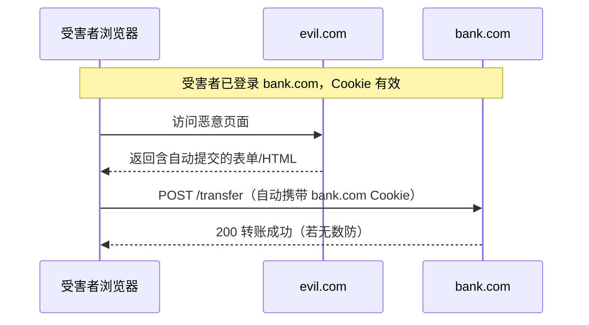
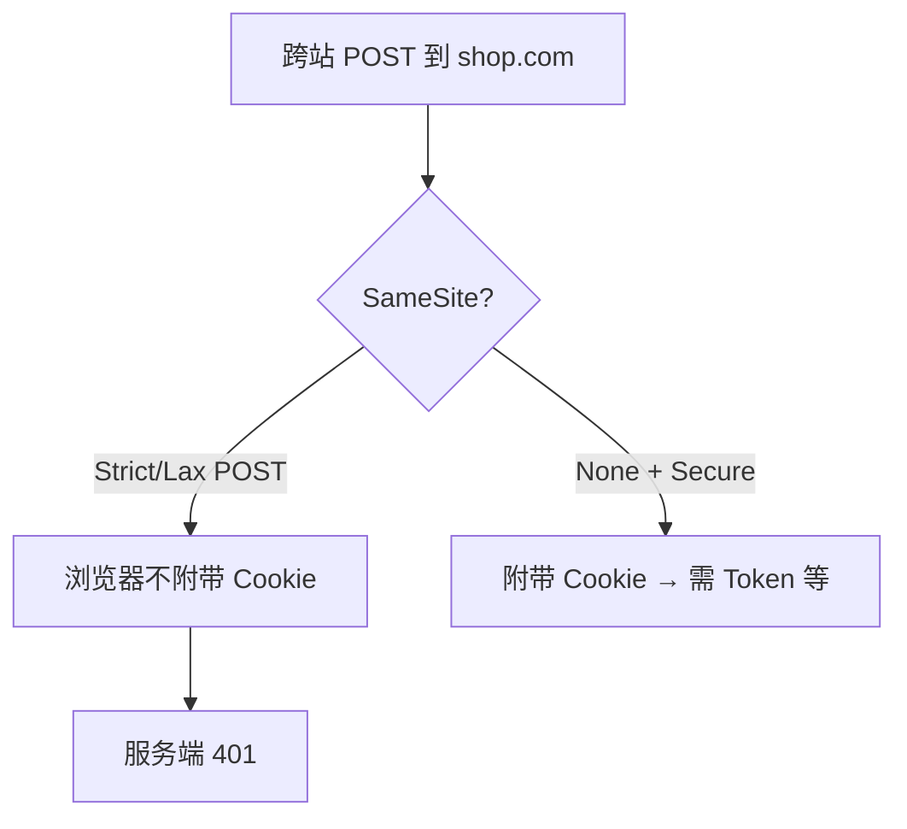
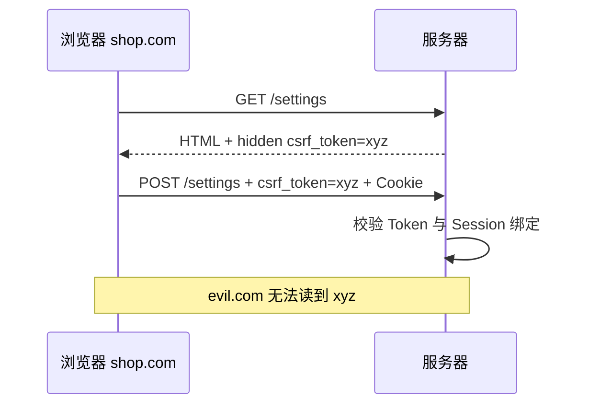
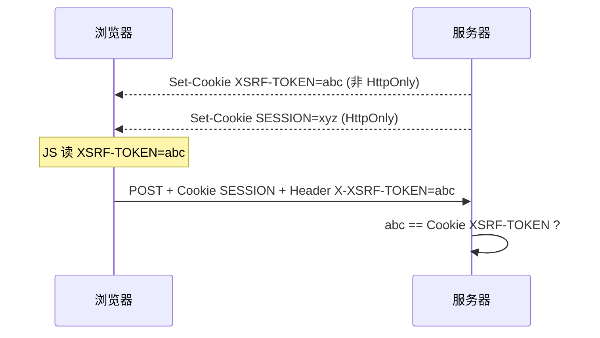

# CSRF 跨站请求伪造与防御

<!-- 修改说明: 2026-06-30 按 EXPANSION-STANDARD 扩充 §0、步骤表、FAQ、闭卷自测、费曼检验 -->

> **文件编码**：UTF-8。  
> **定位**：Web 安全系列 **02 章**——讲清 **CSRF 攻击原理**、**SameSite Cookie**、**CSRF Token**、**JWT Bearer 与 Cookie 会话的差异**，并与 shop 修改资料、[Java 04](../../后端学习/Java/04-SpringBoot核心开发.md) 鉴权方式对齐。

---

## 0. 读前导读（零基础也能跟上）

> **读者假设**：已读 [01 XSS](./01-XSS跨站脚本攻击与防御.md)；理解 Cookie 自动附带。[todo.md](../../todo.md) **notehub** 若用 JWT Bearer，本章帮你理解 **为何常 disable CSRF** 以及 **换 HttpOnly Cookie 时必须加回**。

### 0.1 用一句话弄懂本章

**一句话**：**CSRF = 骗子诱使你已登录的浏览器，替你去点「确认转账」**——浏览器会自动带上 **Cookie**，服务器以为是本人；防法是 **SameSite、CSRF Token、别用 GET 改数据**。

**生活类比**：

| 概念 | 类比 |
|------|------|
| **CSRF** | 你已刷卡进门，骗子跟在后面按你的卡帮你签单 |
| **SameSite** | 门禁规定：外人不能跟卡进写操作区 |
| **CSRF Token** | 每笔交易还要对暗号，外人看不到暗号 |
| **Bearer JWT** | 工牌在你自己手里，外人表单 **递不上** 工牌 |
| **CORS** | 外人问前台「刚才签单成功没」——前台可拒绝告知 |

---

### 0.2 你需要提前知道什么

| 水平 | 建议 |
|------|------|
| 未读 01 XSS | 先区分 XSS（偷）与 CSRF（借） |
| 未读计网 06 Cookie | 先 [计网 06](../计算机网络/06-缓存Cookie与会话机制.md) |
| Java 04 JWT 联调中 | 本章 §5 + §12 与后端配置对照 |

---

### 0.3 本章知识地图（☐→☑）

- [ ] 说清 CSRF 与 XSS、CORS 区别（各一句）
- [ ] 解释 SameSite Strict/Lax/None
- [ ] 描述 CSRF Token 同步器模式
- [ ] 对比 Bearer JWT vs Cookie Session 的 CSRF 面
- [ ] 完成 §10 或 §11 实操观察
- [ ] 闭卷自测 ≥ 8/10

---

### 0.4 建议学习时长

| 阶段 | 时间 |
|------|------|
| §1～§5 原理与 JWT | 1.5 h |
| §10～§12 实操 | 1 h |
| 自测 | 30 min |

---

### 0.5 学完你能做什么

1. 为 notehub **写操作** 列出 CSRF 防护清单。
2. 解释 Spring Boot JWT 项目为何常见 `csrf().disable()`。
3. 配置 Axios `xsrfCookieName` / `withCredentials` 的场景。

---

## 本章衔接

| 上一章 [01 XSS](./01-XSS跨站脚本攻击与防御.md) | 本章 |
|---------------------------------------------|------|
| 攻击者 **在页面内执行脚本** | 攻击者 **诱导浏览器发请求**（常无需脚本） |
| 偷 token / Cookie（若可读） | **滥用** 已自动附带的 Cookie |
| CSP、转义 | SameSite、CSRF Token、双重 Cookie |

| 关联章节 | 关系 |
|----------|------|
| [计网 06 Cookie](../计算机网络/06-缓存Cookie与会话机制.md) | Cookie 属性是 CSRF 防御基础 |
| [03 认证与会话](./03-认证与会话安全深入.md) | JWT 在 Header 时 CSRF 面不同 |
| [05 CORS](./05-CORS与同源策略安全.md) | CORS **不能**防 CSRF |



---

## 1. CSRF 是什么？

### 1.1 定义

**术语（CSRF / Cross-Site Request Forgery）**：攻击者诱导已登录用户访问恶意页，利用浏览器 **自动附带目标站 Cookie**，以用户身份发送非本意请求。
**生活类比**：你已登录网银，骗子网站偷偷提交转账表单——浏览器替你带上了会话 Cookie。
**为什么重要**：改地址、下单、改密码等 **写操作** 高发；与 [Java 04](../../后端学习/Java/04-SpringBoot核心开发.md) Session/JWT 选型直接相关。
**本章用到的地方**：§2～§5、§10～§12。

### 1.2 与 XSS 的区别

| 维度 | XSS | CSRF |
|------|-----|------|
| 需要执行恶意脚本 | 通常需要 | 不一定（表单/img 即可） |
| 读取响应 | 可以（同源） | 跨站一般 **读不到** 响应 |
| 主要滥用 | 同源 DOM / storage | **Cookie 自动附带** |
| 典型防御 | 转义、CSP | SameSite、CSRF Token |

### 1.3 为什么浏览器会「帮」攻击者？（深入解释 ①）

浏览器对 **同源请求** 会按策略附带 Cookie（见 [计网 06](../计算机网络/06-缓存Cookie与会话机制.md)）。从 `evil.com` 发起的请求 **目标是 `bank.com`** 时：

- 若 Cookie 无 `SameSite` 限制，可能 **跨站附带**
- 银行服务器只看到「合法 Cookie + 合法 Session」→ 误以为是用户本人操作

**CSRF 利用的是「身份凭证自动发送」**，不是窃取凭证本身（那是 XSS 范畴）。

---

## 2. CSRF 攻击条件

```text
1. 受害者已在目标站登录（有效 Session Cookie）
2. 目标接口依赖 Cookie 识别身份（无二次验证）
3. 攻击者能构造可触发的请求（GET/POST 表单、img、fetch 等）
4. 无 CSRF Token / SameSite 等防护
```

### 2.1 可伪造的请求类型

| 方式 | 示例 | 说明 |
|------|------|------|
| HTML 表单 POST | `<form action="https://shop.com/api/address" method="POST">` | 经典 |
| GET（若接口用 GET 改数据） | `` | **禁止 GET 改状态** |
| 自动提交 JS | `form.submit()` | 需用户访问恶意页 |

### 2.2 shop-vue 高危操作示例

| 接口 | 方法 | CSRF 风险 |
|------|------|-----------|
| 修改收货地址 | POST | 高（Cookie 会话） |
| 下单 | POST | 高 |
| 修改密码 | POST | 高（应加强验证） |
| 查询订单列表 | GET | 低（只读；但注意 JSON 泄露见 CORS） |

---

## 3. SameSite Cookie

### 3.1 属性取值

| 值 | 跨站请求是否带 Cookie | 典型场景 |
|----|----------------------|----------|
| `Strict` | 几乎不带 | 高安全后台 |
| `Lax` | 部分带（顶级导航 GET） | **现代浏览器默认** |
| `None` | 带（须配合 `Secure`） | 跨站嵌入、OAuth |

### 3.2 Lax 能防什么？

- 跨站 **POST 表单** 多数情况 **不带** Cookie → 防经典 CSRF
- 顶级导航 GET（点击链接）可能仍带 Cookie

### 3.3 设置示例

```http
Set-Cookie: SESSION=abc; Path=/; HttpOnly; Secure; SameSite=Lax
```

Spring Boot：

```java
ResponseCookie.from("SESSION", value)
    .httpOnly(true)
    .secure(true)
    .sameSite("Lax")
    .build();
```

### 3.4 SameSite 局限（深入解释 ②）

- 子域间、同站（same-site）攻击仍可能发生
- `SameSite=None` 的第三方 Cookie 场景 CSRF 面回归
- **不能替代** CSRF Token（企业后台常双层）



---

## 4. CSRF Token（同步器令牌）

### 4.1 原理

服务端生成 **随机不可预测 Token**，嵌入表单或页面；写操作请求须带 **相同 Token**；攻击者跨站 **无法读取** 目标站页面中的 Token（同源策略），故无法伪造。



### 4.2 常见实现

| 方式 | Token 位置 | 校验 |
|------|------------|------|
| 表单隐藏域 | `<input name="_csrf" value="...">` | POST body |
| 自定义头 | `X-CSRF-TOKEN` | Header（SPA 常用） |
| 双重 Cookie | Cookie `XSRF-TOKEN` + Header 同名 | 值一致（须防子域） |

### 4.3 Spring Security CSRF

```java
http.csrf(csrf -> csrf
    .csrfTokenRepository(CookieCsrfTokenRepository.withHttpOnlyFalse())
);
```

前端 Axios（Cookie 会话 + 双重提交）：

```javascript
axios.defaults.xsrfCookieName = 'XSRF-TOKEN';
axios.defaults.xsrfHeaderName = 'X-CSRF-TOKEN';
```

### 4.4 SPA + JWT 还要 CSRF 吗？

| 鉴权方式 | CSRF 风险 | 原因 |
|----------|-----------|------|
| **Cookie Session**（自动附带） | **高** | 必须 SameSite + Token |
| **Authorization: Bearer**（手动 Header） | **低** | 跨站表单 **无法** 自定义 Header（简单请求限制） |
| Bearer 放 Cookie 且自动发送 | 高 | 等同 Session |

详见 [03 JWT 存储](./03-认证与会话安全深入.md)。

---

## 5. JWT vs Cookie 与 CSRF

### 5.1 典型 shop 联调方案（[Java 04](../../后端学习/Java/04-SpringBoot核心开发.md)）

```text
登录 POST /api/login → { "token": "eyJ..." }
前端 localStorage 存 token
Axios 拦截器：Authorization: Bearer eyJ...
```

**CSRF**：恶意站点 `<form>` **不能** 设置 `Authorization` 头（浏览器限制）→ 经典 CSRF **较难**。

**但**：XSS 可偷 localStorage → [01 XSS](./01-XSS跨站脚本攻击与防御.md)。

### 5.2 HttpOnly Cookie 存 JWT

```text
登录 Set-Cookie: ACCESS_TOKEN=eyJ...; HttpOnly; Secure; SameSite=Lax
Axios withCredentials: true
```

**CSRF**：Cookie 自动附带 → **必须** SameSite + CSRF Token 或二次验证。

### 5.3 对比表

| 方案 | XSS 风险 | CSRF 风险 | 刷新复杂度 |
|------|----------|-----------|------------|
| localStorage + Bearer | 高 | 低 | 中 |
| HttpOnly Cookie JWT | 低（Cookie） | 高 | 中 |
| HttpOnly Session ID | 低 | 高 | 服务端会话 |

**没有完美方案**，只有威胁模型下的权衡。

---

## 6. 双重提交 Cookie 模式

### 6.1 流程

1. 服务端 Set-Cookie: `XSRF-TOKEN=random`（**非** HttpOnly，让 JS 能读）
2. 前端读 Cookie，设 Header `X-XSRF-TOKEN: random`
3. 服务端比对 Cookie 与 Header

### 6.2 风险

- 若存在 **子域 XSS**，子域可能读父域 Cookie（视 Domain 设置）
- 须保证子域不可控或统一消毒

---

## 7. 敏感操作二次验证

即使防住 CSRF，仍建议：

| 操作 | 加固 |
|------|------|
| 改密码 | 旧密码 + 邮件验证码 |
| 绑手机 | 短信 OTP |
| 大额转账 | 支付密码 / 人脸 |

---

## 8. GET 不应改状态（REST 规范）

```text
危险：GET /api/user/delete?id=1  ← img 标签即可触发
正确：DELETE /api/user/1 + CSRF Token + 鉴权
```

**Idempotent GET** 是 CSRF 面缩小的重要习惯。

---

## 9. 跨域 fetch 与 CSRF

简单 POST `application/x-www-form-urlencoded` 跨站 **可以** 发，且可能带 Cookie（视 SameSite）。

```javascript
// evil.com 上 — 不能读响应，但可能触发写操作
fetch('https://shop.com/api/address', {
  method: 'POST',
  credentials: 'include',
  body: 'city=Hacked',
});
```

`credentials: 'include'` 在恶意脚本里同样受 Cookie 策略约束；**Lax/Strict** 是关键。

**CORS 不防 CSRF**：CORS 限制的是 **读响应**，不是 **发请求**（[05 章](./05-CORS与同源策略安全.md)）。

---

## 10. 手把手实操：SameSite 观察

| 步骤 | 你的动作 | 预期 | 若不对 |
|------|----------|------|--------|
| 1 | 启动 notehub 或 shop 后端 `8080`，前端 `5173` | 两端口可访问 | 见 Vue 08 环境 |
| 2 | 登录后 DevTools → Application → Cookies | 见 `SameSite` 列多为 **Lax** | |
| 3 | 在 **5173** Console 执行跨站 POST（§10.3 代码） | 多数情况 **401/403**（Cookie 未带） | 若 200 → 查 SameSite=None |
| 4 | 记录 Network 请求 **Request Headers** 是否含 Cookie | Lax 跨站 XHR POST 常无 Session | |

### 10.1 准备两个本地端口（示意）

- `http://localhost:5173` — 前端 shop
- `http://localhost:8080` — Spring Boot，登录后 Set-Cookie

### 10.2 检查 Cookie

DevTools → Application → Cookies → 看 `SameSite` 列。

### 10.3 从另一 Origin 发 POST

在 `5173` 页面 Console（模拟跨站）：

```javascript
fetch('http://localhost:8080/api/profile', {
  method: 'POST',
  credentials: 'include',
  headers: { 'Content-Type': 'application/json' },
  body: JSON.stringify({ nickname: 'csrf-test' }),
});
```

**预期（Lax + 跨站 XHR POST）**：多数现代浏览器 **不附带** Cookie → 401/403。

**预期（SameSite=None）**：可能附带 → 需 CSRF Token。

---

## 11. 手把手实操：Spring CSRF + Vue

### 11.1 后端开启 CSRF（Session 模式）

```java
@Bean
public SecurityFilterChain chain(HttpSecurity http) throws Exception {
    http.csrf(Customizer.withDefaults());
    return http.build();
}
```

### 11.2 前端先 GET 取 Token

```javascript
await axios.get('/api/csrf', { withCredentials: true });
// Spring 将 Token 写入 Cookie XSRF-TOKEN
await axios.post('/api/profile', data, { withCredentials: true });
```

**预期**：第二次请求自动带 `X-XSRF-TOKEN`（Axios 配置后）。

---

## 12. JWT 项目的 CSRF 配置建议

```text
方案 A：Bearer + localStorage
  → Spring Security: csrf().disable() 常见（仅 API JSON）
  → 必须强防 XSS

方案 B：JWT in HttpOnly Cookie
  → 必须 enable CSRF 或 Strict SameSite + 自定义头双检
  → Axios withCredentials: true
```

[Java 04](../../后端学习/Java/04-SpringBoot核心开发.md) JWT 挑战多为方案 A；生产需明确文档说明威胁模型。

---

## 13. OAuth / 第三方登录 CSRF（state 参数）

```text
GET /oauth/authorize?...&state=random
回调时校验 state 与发起前 session 中一致
```

`state` 本质是 **防 CSRF 的 Token**。

---

## 14. 常见报错与现象表

| 现象 | 可能原因 | 解决方案 |
|------|----------|----------|
| `403 Forbidden` POST 突然失败 | Spring CSRF 开启但无 Token | 配 XSRF Cookie/Header |
| 跨站 POST 仍成功 | SameSite=None 或无 CSRF | 改 Lax + Token |
| Axios 401 仅跨域 | Cookie 未带 | `withCredentials` + CORS Allow-Credentials |
| `Invalid CSRF Token` | Token 过期或双端不一致 | 重新 GET 页面或 `/csrf` |
| JWT 项目误开 CSRF | 前后端未传 Token | API 纯 Bearer 可 disable（评估风险） |
| GET 删除成功 | 危险 GET 接口 | 改 POST/DELETE + 鉴权 |
| 子域 CSRF | Cookie Domain=.example.com | 隔离子域；Token 绑定 |
| 预检通过仍 CSRF | 混淆 CORS 与 CSRF | CORS 不防写操作 |
| 登录后第三方表单提交 | Lax 未覆盖的场景 | Strict + Token |
| iframe 内 CSRF | 嵌入场景 Cookie 策略 | frame-ancestors + SameSite |
| 移动端 WebView | Cookie 策略差异 | 实测目标 WebView |
| 双 Cookie 不一致 | 手动改 Header | 用框架自动同步 |

---

## 15. 案例简表

| 场景 | 攻击 | 防御 |
|------|------|------|
| 银行转账表单 | 隐藏表单 POST | Token + 二次验证 |
| 路由器改 DNS | 管理员已登录 | SameSite Strict |
| 社交「关注」 | img GET | 不用 GET 改状态 |
| SPA Cookie JWT | fetch credentials | CSRF Header |

---

## 16. 防御 Checklist

```text
□ 写操作不用 GET
□ Session Cookie：HttpOnly + Secure + SameSite=Lax 起步
□ Cookie 鉴权 API：CSRF Token 或双重 Cookie
□ JWT 仅 Header：评估 csrf disable；强化 XSS
□ 敏感操作：密码/OTP 再确认
□ OAuth 使用 state
□ 日志记录异常跨站 Referer（辅助，非唯一）
```

---

## 17. 面试高频题

**Q：CSRF 和 XSS 区别？**  
XSS 在受害页面 **执行脚本**；CSRF **借用 Cookie** 发请求，不必读响应。

**Q：CORS 能防 CSRF 吗？**  
不能。跨站请求 **可以发出**；CORS 限制 **读取响应**。

**Q：JWT 放 localStorage 为什么 CSRF 风险低？**  
跨站无法随意设置 `Authorization` 头（非简单请求或浏览器限制）。

**Q：SameSite=Lax 够吗？**  
对多数 POST CSRF 有效；高安全场景加 Token + 敏感操作二次验证。

---

## 18. 与 03 章衔接

- Cookie JWT 的 CSRF 面 → [03 认证与会话安全深入](./03-认证与会话安全深入.md)
- Refresh Token 放 HttpOnly Cookie 时的双 Token CSRF 设计

---

## 19. 练习建议

### 基础

1. 画出 CSRF 攻击序列图（受害者、恶意站、目标站）。
2. 解释 SameSite=Lax 对 POST 表单的影响。

### 进阶

3. 对比 shop 两种登录态方案的 CSRF/XSS 风险表。
4. 写 Spring Security 配置：Session 模式开启 CSRF + Cookie Repository。

### 挑战

5. 设计「JWT Access HttpOnly Cookie + Refresh HttpOnly + CSRF」双 Cookie 流程图。

### 19.1 参考答案（节选）

**挑战 5 要点**：

```mermaid
sequenceDiagram
    participant C as 客户端
    participant S as 服务器
    C->>S: POST /login
    S-->>C: Set-Cookie ACCESS HttpOnly; REFRESH HttpOnly; XSRF-TOKEN
    C->>S: POST /api/order Header X-XSRF-TOKEN + Cookie
    S->>S: 校验 CSRF + Access JWT
    C->>S: POST /refresh（仅 REFRESH Cookie）
    S-->>C: 新 ACCESS
```

---

## 20. 学完标准

- [ ] 能解释 CSRF 与 XSS、CORS 的区别
- [ ] 能说明 SameSite 三种取值
- [ ] 能描述 CSRF Token 同步器模式
- [ ] 能对比 JWT Bearer 与 Cookie Session 的 CSRF 面
- [ ] 完成 §10 SameSite 观察或等价实验
- [ ] 能列出 shop 写操作 CSRF 防护清单

---

## 21. 我的笔记区

```text
当前鉴权方案：
CSRF 策略：
待测跨站 POST：
```

---

## 22. 下一章预告

02 章你掌握了 **跨站伪造请求** 与 Cookie 策略。下一章（**03 认证与会话安全深入**）系统对比 **JWT 存储、Refresh Token、HttpOnly Cookie、Session**，并与 [计网 06](../计算机网络/06-缓存Cookie与会话机制.md)、[Java 04 JWT](../../后端学习/Java/04-SpringBoot核心开发.md) 对齐，形成可落地的 shop 登录态方案。

---

---

## 47. 常见问题 FAQ

**Q：CSRF 和 XSS 谁先防？**  
都重要；XSS 可偷 Token **辅助** CSRF，但 CSRF 可不依赖 XSS（纯 HTML 表单即可）。

**Q：JWT 放 Header 还要 CSRF Token 吗？**  
纯 API **Bearer 手动加 Header** 时 CSRF 面低，Spring 常 disable；**JWT 进 HttpOnly Cookie** 则 **必须** 防 CSRF。

**Q：CORS 配好了为什么还能 CSRF？**  
CORS 不阻止 **请求发出**；只限制攻击者 **读响应**。

**Q：SameSite=Lax 够吗？**  
多数 POST CSRF 够；高安全后台加 **Token + 敏感操作 OTP**。

**Q：GET 删除为何危险？**  
`` 即可触发；**写操作禁止 GET**。

**Q：Postman 能过是否说明无 CSRF？**  
不能。必须在 **浏览器跨站** 场景测（§34）。

**Q：notehub 用 [todo.md](../../todo.md) JWT 方案要注意什么？**  
`csrf disable` + **强防 XSS**（01 章）；Refresh 若进 Cookie 要重新评估 CSRF。

---

## 48. 闭卷自测

### 概念题（6 道）

1. CSRF 攻击成立 **4 条件**（§2）说两个以上。
2. XSS 与 CSRF **目标与手段** 各一句对比。
3. SameSite **Strict / Lax / None** 跨站 POST 带 Cookie 行为差异？
4. CSRF Token 为何攻击者猜不到？（同源策略一句）
5. 为何 **CORS 不能防 CSRF**？
6. OAuth 的 **state** 参数与 CSRF 关系？

### 动手题（2 道）

7. 写出 Spring Session 模式开启 CSRF 时 Axios 两个 xsrf 相关配置项名。
8. DevTools 中如何确认 Cookie 的 SameSite 值？

### 综合题（2 道）

9. 对比 notehub **方案 A**（localStorage Bearer）与 **方案 B**（HttpOnly Cookie JWT）的 XSS/CSRF 风险表（各一行）。
10. 画出 CSRF 三方图：受害者浏览器、evil.com、shop.com——标 Cookie 在哪一步被带上。

### 自测参考答案

1. 已登录；接口认 Cookie；攻击者可构造请求；无 SameSite/Token 等防护。
2. XSS 执行脚本偷数据；CSRF 借 Cookie 发请求不必读响应。
3. Strict/Lax 跨站 POST 多不带；None+Secure 会带。
4. Token 在目标站页面/接口，evil 跨源读不到。
5. 跨站请求可发出；CORS 只限读响应体。
6. state 防 OAuth 回调被伪造，本质 CSRF Token。
7. `xsrfCookieName` / `xsrfHeaderName`（或 X-XSRF-TOKEN）。
8. Application → Cookies → SameSite 列。
9. A：XSS 高 CSRF 低；B：XSS Cookie 低 CSRF 高需 Token。
10. 受害者访问 evil → 自动 POST shop → 浏览器附 shop Cookie → shop 误以为本人。

---

## 49. 费曼检验

**任务**：3 分钟说明「CSRF 是什么、notehub JWT 方案为什么 CSRF 风险低但仍要防 XSS」。

**对照提纲**：

1. 已登录 Cookie 自动送 → 恶意站代你 POST。
2. SameSite/Token；GET 不能改状态。
3. Bearer 在 Header 跨站表单带不上 → CSRF 低；token 在 storage → XSS 仍致命。

---

## 50. 附录 A：CSRF 攻击载体大全

| 载体 | HTML 示意 | 条件 |
|------|-----------|------|
| 自动表单 | `<form action="https://bank.com/transfer" method="POST">` | Cookie 会话 |
| img GET | `` | GET 改状态（错误设计） |
| iframe | 隐藏 iframe 提交 | 较旧技巧 |
| fetch/XHR | 跨站 JS 发 POST | SameSite 限制 |
| 顶级导航 GET | `<a href="https://shop.com/logout">` | Lax 可能带 Cookie |

---

## 24. 附录 B：SameSite 浏览器默认时间线（了解）

| 时期 | Chrome 等默认 |
|------|-----------------|
| 旧版 | 无 SameSite → 跨站常带 Cookie |
| 2020+ | `Lax` 为默认（无显式设置时） |
| `None` | 必须 `Secure`，用于跨站嵌入 |

联调时若第三方 Cookie 失效，先查 **是否误依赖 None**。

---

## 25. 附录 C：Spring Security CSRF 与 REST API

```java
// 纯 JWT Header API（无 Cookie）常见配置
http.csrf(csrf -> csrf.disable());
```

**前提**：

1. 绝不把 JWT 放可被跨站自动发送的 Cookie（或已 Strict+Token）
2. 强防 XSS（token 在 storage 时）
3. 文档化威胁模型供审计

**混合站**（页面 Cookie 会话 + API JSON）→ **不要** 无脑 disable。

---

## 26. 附录 D：双提交 Cookie 完整时序



---

## 27. 附录 E：shop 写操作 CSRF 矩阵

| 接口 | Session Cookie | Bearer localStorage |
|------|----------------|---------------------|
| POST /api/address | 必须 Token/Lax | CSRF 低 |
| POST /api/login | 无 Cookie 前无 CSRF | N/A |
| POST /api/logout | CSRF 常见 | 清 storage 即可 |
| 文件上传 multipart | CSRF Token | Bearer |

---

## 28. 附录 F：扩展面试题

**Q：JSON 请求为何能跨站发出？**  
`Content-Type: application/json` 触发预检，但 **简单表单** 不能设自定义 JSON；跨站 **简单 POST** 仍可能带 Cookie。

**Q：SameSite=Strict 对 OAuth 影响？**  
从外站跳回可能不带 Cookie，需 OAuth 标准流程处理。

**Q：GraphQL 与 CSRF？**  
POST JSON + Cookie 会话同样面临 CSRF；防御同 REST。

---

## 29. 附录 G：扩展练习

**进阶 6**：用 HTML 文件写纯静态「恶意页」，对本地 shop 的 Cookie 会话 POST（在合法测试环境），验证 Lax 是否阻挡。

**挑战 7**：设计 BFF（Backend For Frontend）同域 Cookie 会话，前端只调同域 `/api`，分析 CSRF 面是否缩小。

---

## 30. 附录 H：Referer 与 Origin 校验（辅助）

```java
String origin = request.getHeader("Origin");
String referer = request.getHeader("Referer");
// 仅作辅助日志或额外校验，不能替代 CSRF Token（Referer 可缺失或被剥离）
```

敏感写操作：**Token 为主**，Referer 为辅。

---

## 31. 附录 I：CSRF 与文件上传

```html
<form action="https://shop.com/api/upload" method="POST" enctype="multipart/form-data">
  <input type="file" name="file" />
</form>
```

跨站仍可尝试 POST（视 SameSite）；**上传接口同样要 CSRF 防护** 或 Cookie 策略 + 鉴权。

---

## 32. 附录 J：历史漏洞 CVE 学习方向（了解）

搜索 `CSRF` + 知名 CMS 历史 CVE，阅读摘要以理解「默认未开 CSRF」后果——**仅阅读**，不对公网未授权测试。

---

## 33. 附录 K：与 Vue/React 08 拦截器对照

| 章节 | 内容 |
|------|------|
| Vue 08 | Axios 请求/响应拦截、401 跳登录 |
| 安全 02 | 写操作 CSRF、withCredentials |
| 安全 03 | token 存哪、刷新队列 |

三章代码应 **同一分支** 联调，避免各写各的。

---

## 34. 附录 L：Postman 与 CSRF

Postman 默认不带浏览器 Cookie 策略，可手动加 Cookie 测 API——**不能**用 Postman「能过」证明 CSRF 安全；必须在 **浏览器跨站** 场景验证。

---

## 35. 附录 M：嵌入式 iframe 中的 CSRF

若 shop 被嵌入 `evil.com` 的 iframe，还受 `X-Frame-Options` / `frame-ancestors` 限制（[01 CSP](./01-XSS跨站脚本攻击与防御.md)）。CSRF 与点击劫持常一起评估。

---

## 36. 附录 N：完整 Spring Security 片段（Session + CSRF）

```java
@Bean
SecurityFilterChain apiChain(HttpSecurity http) throws Exception {
    http
        .securityMatcher("/api/**")
        .authorizeHttpRequests(auth -> auth
            .requestMatchers("/api/login", "/api/register").permitAll()
            .anyRequest().authenticated()
        )
        .csrf(csrf -> csrf
            .csrfTokenRepository(CookieCsrfTokenRepository.withHttpOnlyFalse())
        )
        .sessionManagement(s -> s.sessionCreationPolicy(SessionCreationPolicy.IF_REQUIRED));
    return http.build();
}
```

JWT 纯 API 分支可另建 `SecurityFilterChain` 用 `requestMatchers` 区分。

---

## 37. 附录 O：练习题补充参考答案

**挑战 7 BFF**：浏览器只访问 `https://shop.com`；Nginx 反代 `/api` 到 Spring；Cookie `Domain=shop.com`；跨站 `evil.com` 对 `shop.com` 为跨站 POST，SameSite=Lax 仍保护；CSRF 面小于「API 独立域 + Cookie」。

---

## 38. 附录 P：学完打卡

- [ ] 能画 CSRF 与 CORS 对比表  
- [ ] 能配置 Axios xsrf Cookie/Header  
- [ ] 能说明 JWT Bearer 项目为何常 disable CSRF  

---

## 39. 附录 Q：CSRF Token 存储服务端方式

| 方式 | 说明 |
|------|------|
| Session 存 Token | 经典同步器 |
| Redis 存 Token | 分布式 Session |
| 双重 Cookie | 无服务端存 Token，比对小写 |

Spring `CookieCsrfTokenRepository` 属于 **Cookie 存 Token 供比对** 家族。

---

## 40. 附录 R：与修改规范对照

本章满足 [修改规范](../../修改规范.md) §4：实操 §10～11、报错表 §14、Mermaid 多张、练习 §19、衔接开篇与章末。

---

## 41. 附录 S：Remember Me 与 CSRF

「记住我」常延长 Cookie 有效期 → **CSRF 窗口更长**。若启用 Remember Me，须 **同等 CSRF 防护**，且 Cookie `Secure` + `HttpOnly`。

---

## 42. 附录 T：跨站 WebSocket 与 CSRF（了解）

WebSocket 握手带 `Origin` 头，服务端应校验；与 HTTP CSRF 不同但同样要 **拒绝非预期 Origin** 的连接。

---

## 43. 附录 U：学完标准补充自测

1. 不看笔记画出 CSRF 攻击三方图。  
2. 写出 `Set-Cookie` 四个安全相关属性及作用。  
3. 说明为何 shop 用 Bearer JWT 时 Spring 常 `csrf().disable()`。  

---

## 44. 附录 V：shop 写操作审计建议

对 `POST/PUT/DELETE` 记录 `userId`、IP、`User-Agent`、资源 id，便于事后追查 **疑似 CSRF 成功** 的异常写操作（同一用户短时间异地多次改地址等）。

---

## 45. 附录 W：与 HTML CSS JS 10 的衔接句（复习）

HTML 10 提到 CSRF 危害；本章补齐 **SameSite、Token、JWT 与 Cookie 差异**。复习时先扫 10 章安全小节，再回本章 §2～§5 画攻击图。

---

## 46. 附录 X：本章学完打卡

- [ ] 完成 §10 或 §11 至少一项实操  
- [ ] 能向队友解释 CSRF 与 CORS 区别一句话版  

**一句话版**：CSRF 是跨站 **发请求** 带 Cookie；CORS 管跨站 **读响应**。

---

*上一章：[01 XSS](./01-XSS跨站脚本攻击与防御.md)*  
*下一章：[03 认证与会话安全深入](./03-认证与会话安全深入.md)*
