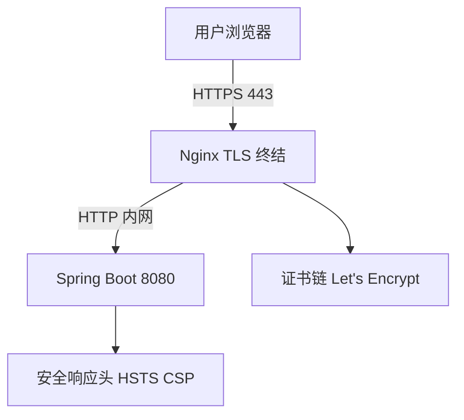
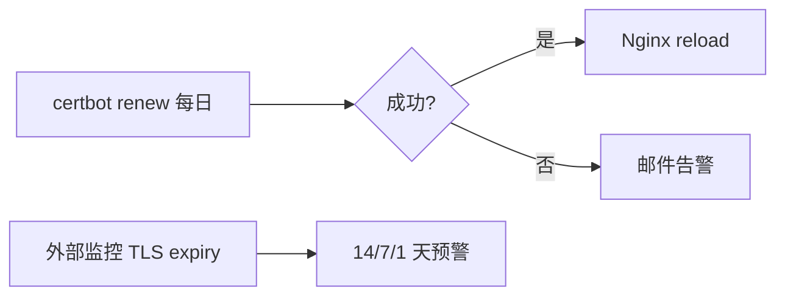

# HTTPS 与传输安全实战

<!-- 修改说明: 2026-06-30 按 EXPANSION-STANDARD 扩充 §0、步骤表、FAQ≥10、闭卷自测、费曼检验；与 todo.md 第 5 周部署对齐 -->

> **文件编码**：UTF-8。  
> **定位**：Web 安全系列 **04 章**——在 [计网 05 HTTPS/TLS](../计算机网络/05-HTTPS与TLS加密.md) 原理之上，提供 **应用层上线 Checklist**、**HSTS、混合内容、证书运维、反向代理**，让 shop 从开发 HTTP 安全迁到生产 HTTPS。

---

## 0. 读前导读（零基础也能跟上）

> **读者假设**：已读 [计网 05](../计算机网络/05-HTTPS与TLS加密.md) TLS 概念；[03 认证](./03-认证与会话安全深入.md) Secure Cookie。[todo.md](../../todo.md) 第 5 周 **Ubuntu + Nginx + jar** 部署时本章为上线清单。

### 0.1 用一句话弄懂本章

**一句话**：生产必须 **HTTPS**——证书、80→443 跳转、HSTS、混合内容清零、Nginx 反代头；否则 Cookie Secure 失效、浏览器报红、token 明文裸奔。

**生活类比**：

| 概念 | 类比 |
|------|------|
| **HTTP** | 明信片（谁都能看） |
| **HTTPS** | 密封挂号信 + 验公章 |
| **证书** | 工商局颁发的营业执照 |
| **HSTS** | 邮局规定：寄过挂号信后禁止改明信片 |
| **混合内容** | 密封信里夹了张明文小纸条 |
| **Nginx TLS 终结** | 大门保安验身份，内场走普通通道 |

---

### 0.2 你需要提前知道什么

| 水平 | 建议 |
|------|------|
| 计网 05 未读 | 先 TLS 握手概念 |
| Linux 06 nginx | 可并行装 nginx 练 §7 |
| 仅 localhost 开发 | §2 区分 dev/prod |

---

### 0.3 本章知识地图（☐→☑）

- [ ] 说清 HTTPS 防窃听/篡改/冒充
- [ ] 完成 §3 应用层 Checklist 讲解
- [ ] 配置 HSTS 与 Mixed Content 排查
- [ ] 读懂 Nginx 443 反代示例
- [ ] certbot/mkcert 场景区分
- [ ] DevTools Security 对比 HTTP/HTTPS
- [ ] 闭卷自测 ≥ 8/10

---

### 0.4 建议学习时长

| 阶段 | 时间 |
|------|------|
| §1～§5 原理与混合内容 | 1.5 h |
| §6～§8 证书与 Nginx | 2 h |
| §9 DevTools + §14 自检 | 1 h |
| 自测 | 30 min |

---

### 0.5 学完你能做什么

1. 对照 §14 二十项自检部署 notehub 到 HTTPS。
2. 用 DevTools Issues 修光 Mixed Content。
3. 解释 Secure Cookie 为何依赖 HTTPS。

---

## 本章衔接

| [计网 05](../计算机网络/05-HTTPS与TLS加密.md) 已讲 | 本章侧重 |
|---------------------------------------------------|----------|
| TLS 握手、对称/非对称 | **前端与全栈部署**要做什么 |
| CA 证书链 | Let's Encrypt、续期、测试环境 |
| 混合内容概念 | DevTools 排查与修复清单 |
| shop token 传输 | 与 [03 认证](./03-认证与会话安全深入.md) Cookie Secure 联动 |



**关键句**：计网 05 回答「TLS 怎么握手」；本章回答「上线前我逐条勾选什么」。

---

## 1. 为什么生产必须 HTTPS？

### 1.1 三类风险（复习）

| 风险 | 无 HTTPS | 有 HTTPS |
|------|----------|----------|
| 窃听 | Wi-Fi 可见密码/JWT | 密文 |
| 篡改 | 可改 JSON | 完整性校验 |
| 冒充 | 假服务器 | 证书校验 |

详见 [计网 05 §1](../计算机网络/05-HTTPS与TLS加密.md)。

### 1.2 浏览器额外约束

| 能力 | 要求 |
|------|------|
| `Secure` Cookie | 需 HTTPS |
| Service Worker | 需 Secure Context |
| 部分 Geolocation 等 API | 需 HTTPS |
| HTTP/2 多路复用（生产） | 事实标准需 HTTPS |

### 1.3 深入：HTTPS 不解决什么？（深入解释 ①）

| 仍须应用层防护 | 对应章 |
|----------------|--------|
| XSS | [01](./01-XSS跨站脚本攻击与防御.md) |
| CSRF | [02](./02-CSRF跨站请求伪造与防御.md) |
| 越权 | [06](./06-常见Web漏洞入门.md) |
| Prompt 注入 | [07](./07-LLM应用安全与Prompt注入防护.md) |

---

## 2. 开发环境 vs 生产环境

| 环境 | 协议 | 说明 |
|------|------|------|
| Vite `5173` | HTTP | localhost 浏览器例外 |
| Spring `8080` | HTTP | 内网可 HTTP |
| 生产 `shop.com` | **HTTPS 443** | 用户可见必须 TLS |
| API 子域 `api.shop.com` | HTTPS | 与前端同信任域或 CORS 白名单 |

```text
开发：http://localhost:5173 → proxy → http://localhost:8080  ✅ 可接受
生产：http://shop.com  ❌ 不安全 + Cookie Secure 失效 + 混合内容
```

---

## 3. 应用层 HTTPS Checklist（核心）

### 3.1 证书与域名

```text
□ 域名 DNS A/AAAA 记录指向正确服务器
□ 证书 SAN 覆盖所有对外域名（www + apex + api）
□ 证书未过期（监控 <30 天告警）
□ 私钥权限 600，不入 Git
□ 测试环境可用 mkcert / 自签（仅本地信任）
```

### 3.2 强制 HTTPS

```text
□ HTTP 80 301 跳转 HTTPS（保留 path/query）
□ 启用 HSTS（见 §4）
□ 内网跳转链接写 https:// 不写 http://
□ 邮件/短信里的链接用 HTTPS
```

### 3.3 Cookie 与 Token

```text
□ 所有会话 Cookie：Secure + HttpOnly + SameSite（[03](./03-认证与会话安全深入.md)）
□ 禁止生产 HTTP 下 Set-Cookie 无 Secure
□ JWT 传输仅在 TLS 内（禁止生产 HTTP Bearer）
```

### 3.4 混合内容（Mixed Content）

```text
□ 页面 HTTPS 后，所有 script/img/css/api 用 https:// 或相对路径 //
□ 禁止 http:// 第三方脚本
□ 升级 insecure request（CSP upgrade-insecure-requests 可选）
□ DevTools Issues 面板零 Mixed Content
```

### 3.5 API 与前端分离

```text
□ 前端 VITE_API_BASE=https://api.shop.com
□ CORS 白名单仅 https 生产域（[05](./05-CORS与同源策略安全.md)）
□ 禁止 Access-Control-Allow-Origin: * 且 credentials: true
```

### 3.6 反向代理

```text
□ Nginx ssl_protocols TLSv1.2 TLSv1.3
□ proxy_set_header X-Forwarded-Proto $scheme
□ Spring forward-headers-strategy: framework
□ 隐藏 Server 版本头（可选）
```

### 3.7 安全响应头

```text
□ Strict-Transport-Security
□ Content-Security-Policy（[01](./01-XSS跨站脚本攻击与防御.md)）
□ X-Content-Type-Options: nosniff
□ Referrer-Policy
□ Permissions-Policy
```

### 3.8 监控与应急

```text
□ 证书到期监控（cron + 邮件）
□ TLS 弱套件扫描（SSL Labs 抽检）
□ 泄露密钥轮换预案
```

---

## 4. HSTS（HTTP Strict Transport Security）

### 4.1 作用

告诉浏览器：**在 max-age 内只许用 HTTPS 访问本域**，避免 SSL 剥离攻击（先 http 再劫持）。

### 4.2 响应头

```http
Strict-Transport-Security: max-age=31536000; includeSubDomains; preload
```

| 指令 | 含义 |
|------|------|
| `max-age` | 秒数，常用一年 |
| `includeSubDomains` | 子域同样强制 |
| `preload` | 可提交浏览器预加载列表（谨慎） |

### 4.3 注意

- **首次访问仍可能 HTTP**（直到收到 HSTS 头）→ 仍需 301
- 提交 preload 后难退回 HTTP → 确认全站 HTTPS 再开

### 4.4 Nginx 示例

```nginx
add_header Strict-Transport-Security "max-age=31536000; includeSubDomains" always;
```

---

## 5. 混合内容详解

### 5.1 类型

| 类型 | 示例 | 浏览器行为（现代） |
|------|------|-------------------|
| Active Mixed | HTTPS 页加载 `http://` script | **通常阻止** |
| Passive Mixed | `http://` 图片 | 可能加载但警告 |

### 5.2 修复手法

```html
<!-- 坏 -->
<script src="http://cdn.example.com/lib.js"></script>

<!-- 好 -->
<script src="https://cdn.example.com/lib.js"></script>

<!-- 或协议相对（谨慎，视环境） -->
<script src="//cdn.example.com/lib.js"></script>
```

```javascript
// Axios baseURL
const api = import.meta.env.VITE_API_BASE; // https://api.shop.com
```

### 5.3 CSP 辅助

```http
Content-Security-Policy: upgrade-insecure-requests
```

自动尝试把子资源升级到 HTTPS（无法升级则失败）。

---

## 6. 证书获取与续期（Let's Encrypt）

### 6.1 流程概览

```text
1. 证明域名控制权（HTTP-01 / DNS-01）
2. 签发 90 天证书
3. certbot 自动续期 cron
4. Nginx reload
```

### 6.2 certbot 示意（Linux 服务器）

```bash
sudo certbot --nginx -d shop.com -d www.shop.com -d api.shop.com
```

**预期**：证书路径 `/etc/letsencrypt/live/shop.com/fullchain.pem`

### 6.3 本地开发 mkcert

```bash
mkcert -install
mkcert localhost 127.0.0.1 ::1
```

Vite HTTPS：

```javascript
// vite.config.js
import fs from 'fs';
export default {
  server: {
    https: {
      key: fs.readFileSync('localhost-key.pem'),
      cert: fs.readFileSync('localhost.pem'),
    },
  },
};
```

---

## 7. Nginx 完整示例（shop 生产）

```nginx
upstream spring_boot {
    server 127.0.0.1:8080;
}

server {
    listen 443 ssl http2;
    server_name api.shop.com;

    ssl_certificate     /etc/letsencrypt/live/shop.com/fullchain.pem;
    ssl_certificate_key /etc/letsencrypt/live/shop.com/privkey.pem;
    ssl_protocols       TLSv1.2 TLSv1.3;
    ssl_prefer_server_ciphers on;

    add_header Strict-Transport-Security "max-age=31536000; includeSubDomains" always;
    add_header X-Content-Type-Options nosniff always;
    add_header X-Frame-Options SAMEORIGIN always;

    location /api/ {
        proxy_pass http://spring_boot;
        proxy_set_header Host $host;
        proxy_set_header X-Real-IP $remote_addr;
        proxy_set_header X-Forwarded-For $proxy_add_x_forwarded_for;
        proxy_set_header X-Forwarded-Proto $scheme;
    }
}

server {
    listen 80;
    server_name api.shop.com;
    return 301 https://$host$request_uri;
}
```

前端静态：

```nginx
server {
    listen 443 ssl http2;
    server_name shop.com;
    root /var/www/shop-vue/dist;
    index index.html;
    location / {
        try_files $uri $uri/ /index.html;
    }
}
```

与 [计网 05 §26](../计算机网络/05-HTTPS与TLS加密.md) 对照学习。

---

## 8. Spring Boot 与代理头

```yaml
# application.yml
server:
  forward-headers-strategy: framework
```

使 `request.isSecure()`、重定向 URL 识别 `X-Forwarded-Proto: https`。

---

## 9. DevTools 排查 HTTPS 问题

| 步骤 | 你的动作 | 预期看到什么 | 若不对 |
|------|----------|--------------|--------|
| 1 | 打开 https 站点 → Security 面板 | Connection: Secure | 证书无效见 §13 |
| 2 | 打开 http://neverssl.com 对比 | Not secure | 理解差异 |
| 3 | Issues 面板筛 Mixed Content | 生产应为 0 条 | 改 http 资源为 https |
| 4 | Network 看请求 URL 协议 | 全 https 或相对路径 | 查 VITE_API_BASE |
| 5 | Application → Cookies | Secure 列打勾 | 无 HTTPS 则 Cookie 失败 |

### 9.1 Security 面板

| 项 | 健康值 |
|----|--------|
| Connection | Secure |
| Certificate | Valid |
| Protocol | TLS 1.3 |

### 9.2 Issues 面板

过滤 **Mixed Content** → 逐条改 URL。

### 9.3 手把手：对比 HTTP/HTTPS 站点

```text
1. 打开 http://neverssl.com → Security: Not secure
2. 打开 https://www.baidu.com → Secure + 证书信息
3. 记录 Protocol 与 Certificate issuer
```

---

## 10. TLS 配置硬化（运维向）

| 项 | 建议 |
|----|------|
| 协议 | TLS 1.2+，优先 1.3 |
| 套件 | 禁用 SSLv3、TLS 1.0/1.1 |
| 密钥长度 | RSA 2048+ / ECDSA |
| OCSP Stapling | 可选，减少握手延迟 |

**检测**：[SSL Labs](https://www.ssllabs.com/ssltest/) 抽检（外网域名）。

---

## 11. WebSocket 与 SSE

| 协议 | 生产要求 |
|------|----------|
| `wss://` | TLS 上的 WebSocket |
| SSE `https://` | 与 API 同证书策略 |

[AIAgent 03 SSE](../../后端学习/AIAgent/03-流式对话-SSE与会话管理.md) 上线须 HTTPS。

---

## 12. 与 [03 认证](./03-认证与会话安全深入.md) 联动

```http
Set-Cookie: REFRESH=...; HttpOnly; Secure; SameSite=Strict; Path=/api/auth/refresh
```

**无 HTTPS → Secure Cookie 浏览器可能拒绝** → 登录态在生产直接失效。

---

## 13. 常见报错与现象表

| 现象 | 可能原因 | 解决方案 |
|------|----------|----------|
| `NET::ERR_CERT_AUTHORITY_INVALID` | 自签未信任 | 导入 CA 或用公网证书 |
| `NET::ERR_CERT_DATE_INVALID` | 证书过期 | certbot renew |
| Mixed Content blocked | HTTP 子资源 | 改 https 或相对路径 |
| Cookie 未设置 | 无 Secure 在 HTTPS 页 | 检查 Set-Cookie |
| 301 循环 | 代理头错误 | X-Forwarded-Proto |
| HSTS 无法访问 http 测试 | 曾发 HSTS | 清 HSTS 缓存或换域 |
| `SSL_ERROR_NO_CYPHER_OVERLAP` | 套件过旧客户端 | 调整 ssl_ciphers |
| API CORS + HTTPS | 白名单仍是 http:// | 改 https 源 |
| Vite 热更新 wss 失败 | 未配 https server | mkcert + vite https |
| 证书域名不匹配 | SAN 缺 api 子域 | 重签含所有主机名 |
| 私钥泄露 | Git 误提交 | 轮换证书+密钥 |
| 仅 IP 访问证书警告 | 证书绑域名 | 用域名访问 |

---

## 14. 上线前 20 项自检（可打印）

```text
 1. DNS 解析正确
 2. 443 可连、80 跳 443
 3. 证书有效、链完整
 4. HSTS 已加（确认不会回退 HTTP）
 5. 前端全资源 HTTPS
 6. API baseURL 为 https
 7. Cookie Secure + HttpOnly
 8. JWT 不经 HTTP 明文
 9. CORS 仅 https 白名单
10. CSP 已配置
11. X-Content-Type-Options
12. 无 Mixed Content Issues
13. WebSocket 用 wss
14. 日志不打印完整 token
15. 密钥环境变量注入
16. 续期 cron 正常
17. 备份私钥安全存储
18. 压测下 TLS 性能可接受
19. 移动端证书链信任正常
20. 回滚方案（旧证书保留 24h）
```

---

## 15. 案例简表

| 案例 | 问题 | 教训 |
|------|------|------|
| 咖啡店 Wi-Fi | HTTP 登录被抓 | 全站 HTTPS |
| 证书过期致全站红 | 无监控 | 到期告警 |
| CDN HTTP 脚本 | 混合内容 | 统一 https URL |
| HSTS preload 后无法测 http | 过早 preload | 稳定后再提交 |

---

## 16. 面试高频题

**Q：HTTPS 和 HTTP 区别？**  
HTTP 明文；HTTPS = HTTP + TLS，提供机密性、完整性、服务器认证。

**Q：HSTS 作用？**  
强制浏览器用 HTTPS，防降级攻击。

**Q：混合内容是什么？**  
HTTPS 页面加载 HTTP 子资源；active 脚本会被拦。

---

## 17. 练习建议

### 基础

1. 默写 §3 Checklist 中 Cookie 与混合内容各 3 条。
2. 说明为何生产不能继续用 `http://api.shop.com`。

### 进阶

3. 写 Nginx 片段：80→443 跳转 + `/api` 反代 + HSTS。
4. 列出 Vite 生产构建后要检查的 5 个环境变量/URL。

### 挑战

5. 设计证书到期前 14/7/1 天的告警与自动续期验证流程图。

### 17.1 参考答案（挑战 5）



---

## 18. 学完标准

- [ ] 能对照计网 05 说明本章「应用层」增量
- [ ] 能完成 §3 应用层 Checklist 讲解
- [ ] 能配置 HSTS 与读懂 Mixed Content 报错
- [ ] 能写基础 Nginx HTTPS 反代
- [ ] 完成 §9 DevTools Security 对比
- [ ] 能说明 Secure Cookie 与 HTTPS 依赖关系

---

## 19. 我的笔记区

```text
生产域名：
证书到期日：
Nginx 配置路径：
待修 Mixed Content：
```

---

---

## 39.5 部署演练时间线（todo 第 5 周）

| 天 | VMware / 服务器 | Checklist 条目 |
|----|-----------------|----------------|
| D-7 | mkcert 或 staging 证书 | §3.1 域名 |
| D-3 | Nginx 443 反代 jar | §7、§14 1～8 |
| D-1 | `certbot renew --dry-run` | §6、§23 |
| D0 | 切换 DNS / 演示 URL | todo 部署标准 |
| D+1 | DevTools Mixed Content | §5、§9 |

**Nginx + Spring 逐行核对（最小集）**：

| 配置行 | 作用 | 漏了会怎样 |
|--------|------|------------|
| `listen 443 ssl` | TLS | 明文 |
| `return 301 https://...` | 80 跳转 | 用户走 HTTP |
| `proxy_set_header X-Forwarded-Proto $scheme` | 后端知 HTTPS | 重定向 http |
| `add_header Strict-Transport-Security ...` | HSTS | 降级风险 |
| `ssl_certificate` / `key` | 证书链 | 浏览器红锁 |

```bash
# VMware 内快速验证（nginx 已装）
curl -I http://127.0.0.1/          # 应 301 或 200 视配置
curl -Ik https://127.0.0.1/       # -k 仅自签测试
sudo nginx -t && sudo systemctl reload nginx
```

与 [Linux 06 nginx](../../后端学习/Linux/02-进程信号systemd与日志.md)、[Linux 07 ufw](../../后端学习/Linux/03-网络端口DNS防火墙与curl.md) 联用：放行 443 前先 `ufw allow OpenSSH`。

---

## 40. 常见问题 FAQ

**Q1：开发 localhost HTTP 可以吗？**  
可以；浏览器对 localhost 例外。**生产用户可见域名必须 HTTPS**。

**Q2：HTTPS 能防 XSS 吗？**  
**不能**；仅保护传输过程。XSS 仍可读 DOM/storage，见 [01](./01-XSS跨站脚本攻击与防御.md)。

**Q3：HSTS 和 301 跳转区别？**  
301 每次可能先走 HTTP；HSTS 让浏览器**跳过** HTTP 直接 HTTPS（在 max-age 内）。

**Q4：混合内容 Active 和 Passive？**  
Active（script）通常被拦；Passive（img）可能加载但警告；**全部改 https**。

**Q5：Let's Encrypt 证书多久过期？**  
**90 天**；certbot 自动续期，需 cron/`certbot renew --dry-run` 验证。

**Q6：mkcert 和 Let's Encrypt 区别？**  
mkcert **仅本机信任**，开发 Vite HTTPS；公网用 Let's Encrypt 或商业 CA。

**Q7：Nginx 终结 TLS 后内网 HTTP 安全吗？**  
**内网可信**时可 HTTP；`X-Forwarded-Proto` 让 Spring 知悉外部 HTTPS。

**Q8：私钥能进 Git 吗？**  
**绝不**；权限 600；泄露必须轮换证书。

**Q9：Vite 生产构建还要 HTTPS 吗？**  
静态资源托管在 **https 站点**；`VITE_API_BASE` 必须 **https://** API。

**Q10：VMware 里如何练 HTTPS？**  
mkcert + Vite/nginx 本地 443；或 hosts 指域名 + certbot（需公网 DNS 则跳过）。

**Q11：HTTP/2 必须要 HTTPS 吗？**  
浏览器侧 **事实标准** 要；Nginx `listen 443 ssl http2`。

**Q12：notehub 暑假最低部署标准？**  
[todo.md](../../todo.md) 学生机：**443 可访问** 或完整文档；至少 **80→443 + 证书有效 + API https**。

---

## 41. 闭卷自测

### 概念题（6 道）

1. HTTPS 相对 HTTP 多解决哪三类风险？
2. `Strict-Transport-Security` max-age 做什么？
3. 为何生产 JWT/Cookie 不应走 HTTP？
4. `X-Forwarded-Proto` 给谁用、解决什么？
5. Mixed Content 典型例子？
6. TLS 终止在 Nginx 的优点（一句）？

### 动手题（2 道）

7. 写 Nginx 一行：80 强制 301 到 https（保留 path）。
8. 写 `.env.production` 中 API 地址应满足什么协议要求？

### 综合题（2 道）

9. 从 §14 二十项自检中任选 8 项说明你会如何验证（命令或 DevTools）。
10. notehub 前端 https、后端仅 HTTP 内网——浏览器到 Nginx 到 Spring 的数据流与加密边界？

### 自测参考答案

1. 窃听、篡改、冒充（服务器身份）。
2. 浏览器在 max-age 内强制 HTTPS 访问该域。
3. 明文传输 token 可被窃听；Secure Cookie 可能无法工作。
4. 给 Spring 等后端；让其生成正确 https 重定向与 `isSecure()`。
5. HTTPS 页加载 `http://` 的 script/link/img。
6. 证书集中管理、减轻 Java CPU TLS 负担。
7. `return 301 https://$host$request_uri;`
8. 必须 `https://` 开头，无 http 生产 API。
9. 示例：curl -I 看 301；openssl/certbot 看日期；DevTools Issues；Security 面板；CORS 白名单 https…
10. 用户↔Nginx **TLS 加密**；Nginx↔Spring **内网 HTTP 明文**（信任边界在内网）。

**§14 自检精简口诀**：DNS→443→证书→HSTS→混内→API https→Cookie Secure→CORS https→续期 cron。

---

## 42. 费曼检验

**任务**：3 分钟说明「为什么 notehub 上线不能继续用 http://，以及你要勾选的 5 条 HTTPS 清单」。

**对照提纲**：

1. 密码/token **明文**；Wi-Fi 可嗅探。
2. **Secure Cookie**、现代 API 要安全上下文。
3. **301+HSTS**、证书有效、**无混合内容**、API **https**、Nginx **Forwarded-Proto**。

---

## 43. 下一章预告（原 §20）

04 章你完成了 **传输层上线加固**。下一章（**05 CORS 与同源策略安全**）深入 **跨域配置误用**：`Allow-Origin: *` 与 credentials、预检缓存、私有网络访问——与 [计网 06 CORS](../计算机网络/06-缓存Cookie与会话机制.md) 原理对照，避免「能联调但生产裸奔」。

---

## 21. 附录 A：与 [计网 05](../计算机网络/05-HTTPS与TLS加密.md) 章节映射

| 计网 05 节 | 本章对应 |
|------------|----------|
| §1 为什么 HTTPS | §1 复习 + 浏览器约束 |
| §2～3 加密与 CA | 证书运维 §6 |
| §4 TLS 握手 | 排查时理解即可 |
| §6 混合内容 | §5 扩展 |
| §26 Nginx 示例 | §7 扩展 shop 版 |

读计网 05 **不懂部署** 时，以本章 Checklist 为操作清单。

---

## 22. 附录 B：Subresource Integrity（SRI）

```html
<link rel="stylesheet" href="https://cdn.example.com/app.css"
      integrity="sha384-oqVuAfXRKap7fdgcCY5uykM6+R9GqAw8IbqnXzWYdwpdmf0tApJCJtII/jocGL7g="
      crossorigin="anonymous">
```

CDN 被篡改时浏览器拒绝加载——与 [01 CSP](./01-XSS跨站脚本攻击与防御.md) 互补。

---

## 23. 附录 C：Let's Encrypt 续期 cron

```bash
# /etc/cron.d/certbot 示例
0 3 * * * root certbot renew --quiet --deploy-hook "systemctl reload nginx"
```

**验证续期**（干跑）：

```bash
sudo certbot renew --dry-run
```

**预期**：`Congratulations, all simulated renewals succeeded`。

---

## 24. 附录 D：Vite 生产环境变量检查

```bash
# .env.production 示例
VITE_API_BASE=https://api.shop.com
VITE_ENABLE_MOCK=false
```

```text
□ 无 http:// API 地址
□ 无内网 IP 暴露给公网构建
□ source map 上传策略（避免源码泄露）
```

---

## 25. 附录 E：移动端与 WebView

| 问题 | 说明 |
|------|------|
| 自签证书 | App 需内置信任或公网证书 |
| 混合内容 | WebView 同样拦截 |
| 证书钉扎 | 高级 App 可选 |

---

## 26. 附录 F：TLS 指纹与 WAF（了解）

企业 WAF、CDN 提供 TLS 1.3、OCSP、HTTP/3；前端主要确保 **链接全 https**，细节由运维负责。

---

## 27. 附录 G：扩展面试题

**Q：TLS 终止在 Nginx 还是 Spring？**  
常见 Nginx 终结，内网 HTTP；减轻 Java CPU 负担，证书集中管理。

**Q：forwarded headers 伪造？**  
仅信任内网 Nginx 设 `X-Forwarded-Proto`；勿让客户端直连 Spring 并信该头。

---

## 28. 附录 H：shop 上线演练脚本

```text
Day -7:  staging 全站 HTTPS + 证书
Day -3:  跑 §14 二十项自检
Day -1:  压测、SSL Labs A-
Day 0:   切换 DNS，监控 4xx/5xx 与证书
Day +1:  查 Mixed Content 用户反馈
```

---

## 29. 附录 I：HTTP/3 与 QUIC（了解）

HTTP/3 基于 QUIC（UDP），仍依赖 TLS 1.3。Nginx 1.25+ 可配 `listen 443 quic`。前端无感，**证书与域名要求不变**。

---

## 30. 附录 J：零信任与 mTLS（扩展）

服务间 mTLS（双向证书）超出前端日常，但面试可能问：**用户到 Nginx** 仍是单向 HTTPS；**Nginx 到内网服务** 可加固 mTLS。

---

## 31. 附录 K：HTTPS 与 Web 安全系列闭环

```text
04 HTTPS 传输加密
  → 01～03 应用层 token/XSS/CSRF
  → 05 CORS 跨域读
  → 06～07 漏洞与 AI
```

缺一层的「假安全」：仅有 HTTPS 仍可能 XSS 偷 Bearer。

---

## 32. 附录 L：Cloudflare / CDN HTTPS 注意

```text
□ 橙云代理时证书可由 CDN 边缘提供
□ 源站可用 Full (Strict) 加密回源
□ 缓存规则：API /api/* 一般 no-store
□ 勿缓存 Set-Cookie 响应
```

与 [Vue 10 部署](../Vue/10-Vite构建与项目部署.md) 衔接。

---

## 33. 附录 M：openssl 快速检查本地证书

```powershell
# Git Bash 或安装 OpenSSL 后
openssl x509 -in cert.pem -noout -dates -subject
```

**预期**：`notAfter` 在未来；`subject` 含你的域名。

---

## 34. 附录 N：常见 HTTPS 面试连环问

1. 为什么需要证书？→ 身份认证，防冒充。  
2. 对称密钥怎么传递？→ TLS 握手里用非对称协商。  
3. HTTPS 能防 XSS 吗？→ 不能。  
4. Secure Cookie 没有 HTTPS 会怎样？→ 浏览器可能拒绝写入或不发送。  

---

## 35. 附录 O：与 Linux 13 Nginx 部署衔接

[Linux 13 Nginx](../../后端学习/Linux/08-NginxTLS与反向代理.md) 部署 shop 时，TLS 证书与 80→443 跳转应与本章 §7、§14 一致。

---

## 36. 附录 P：免费证书与商业证书选型

| 类型 | 适用 |
|------|------|
| Let's Encrypt | 绝大多数公网站点 |
| 通配符 `*.shop.com` | 多子域，可能需 DNS-01 |
| EV/OV | 金融展示信任条（可选） |

---

## 37. 附录 Q：HTTP 严格安全上下文（Secure Contexts）

浏览器将 `https://`、`localhost`、`127.0.0.1` 等视为 **安全上下文**，部分 API 仅在此时可用。生产站点应确保用户始终处于 HTTPS 上下文，避免功能降级到不安全页面。

---

## 38. 附录 R：学完打卡

- [ ] 能口述 §3 应用层 Checklist 至少 15 项  
- [ ] 能在 DevTools 定位 Mixed Content  
- [ ] 能说明 HSTS 与 301 的关系  

---

## 39. 附录 S：TLS 1.0/1.1 下线检查

```bash
# 可用 nmap 或 SSL Labs 检测；Nginx 应仅 TLSv1.2+
```

老旧客户端无法访问是 **预期** 安全收益。

---

*上一章：[03 认证与会话安全](./03-认证与会话安全深入.md)*  
*下一章：[05 CORS 与同源策略安全](./05-CORS与同源策略安全.md)*  
*原理深入：[计网 05 HTTPS](../计算机网络/05-HTTPS与TLS加密.md)*

*本章已按 EXPANSION-STANDARD 扩充（§0+DevTools 步骤表+FAQ+自测+费曼）。*

**EXPANSION-STANDARD 自检**：☑ §0 ☑ 步骤表 §9 ☑ FAQ≥10 ☑ 闭卷 10 题 ☑ 费曼 ☑ 部署语境
