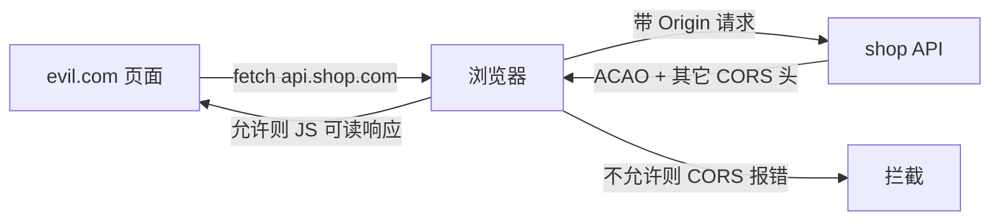
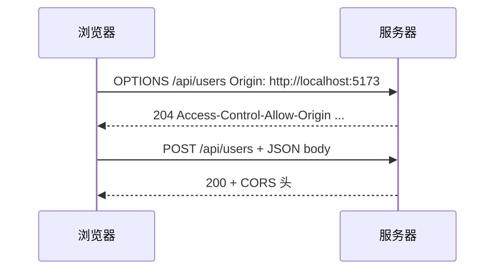
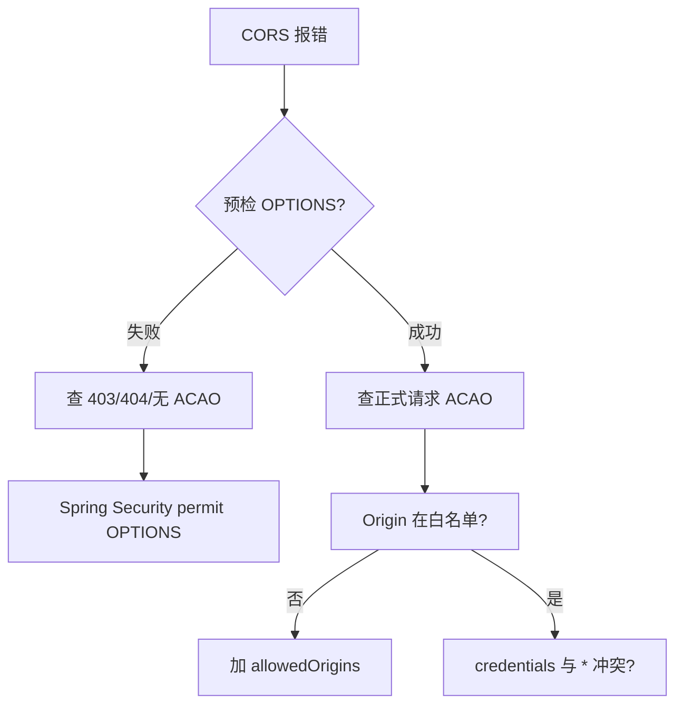

# CORS 与同源策略安全

<!-- 修改说明: 2026-06-30 按 EXPANSION-STANDARD 扩充 §0、步骤表、FAQ≥10、闭卷自测、费曼检验；与 todo.md Vue 联调/CORS 对齐 -->

> **文件编码**：UTF-8。  
> **定位**：Web 安全系列 **05 章**——在 [计网 06 CORS](../计算机网络/06-缓存Cookie与会话机制.md) 原理上，聚焦 **配置误用、credentials、预检安全**，避免 shop 联调配置原样抄到生产。

---

## 0. 读前导读（零基础也能跟上）

> **读者假设**：已读 [计网 06](../计算机网络/06-缓存Cookie与会话机制.md)；[todo.md](../../todo.md) 第 3 周 **Vue + Axios + CORS** 联调。VMware 上后端 8080、Vite 5173 **不同源**，本章解释报错与正确配置。

### 0.1 用一句话弄懂本章

**一句话**：**CORS 管浏览器能不能读跨域响应**——`*`+credentials 非法、反射 Origin 会泄密；开发用 **Vite proxy**，生产用 **白名单** 或 **Nginx 同域反代**。

**生活类比**：

| 概念 | 类比 |
|------|------|
| **同源策略** | 银行默认不让外人看回单 |
| **CORS** | 银行贴公告：允许某分店前台复印回单 |
| **预检 OPTIONS** | 进门前先问「我能带这些材料吗？」 |
| **Vite proxy** | 前端假装和后端同一柜台（同源） |
| **反射 Origin** | 来谁都给复印 — 包括骗子 |
| **CSRF** | 骗子能寄信但不能看回信（与 CORS 不同） |

---

### 0.2 你需要提前知道什么

| 水平 | 建议 |
|------|------|
| 未读计网 06 | 先简单/预检请求 |
| 02 CSRF | 区分 CORS 与 CSRF |
| Java 04 联调 | 对照 §5 Spring 配置 |

---

### 0.3 本章知识地图（☐→☑）

- [ ] 同源三要素；5173 vs 8080 是否同源
- [ ] 简单请求 vs 预检触发条件
- [ ] 禁止 `*` + credentials
- [ ] Spring 白名单 CorsConfig
- [ ] Vite proxy vs 生产 Nginx 同域
- [ ] 完成 §11 curl 预检或 §12 浏览器实验
- [ ] 闭卷自测 ≥ 8/10

---

### 0.4 建议学习时长

| 阶段 | 时间 |
|------|------|
| §1～§4 原理与误配 | 1.5 h |
| §5～§7 Spring/Vite | 1.5 h |
| §11～§12 实操 | 1 h |
| 自测 | 30 min |

---

### 0.5 学完你能做什么

1. 修复 notehub 浏览器 CORS 报错（白名单或 proxy）。
2. 用 curl 模拟 OPTIONS 预检并读响应头。
3. 向队友解释「Postman 能通、浏览器不行」。

---

## 本章衔接

| [计网 06](../计算机网络/06-缓存Cookie与会话机制.md) | 本章 |
|-----------------------------------------------------|------|
| 同源定义、简单/预检请求 | **错误配置后果**与加固 |
| Vite proxy 开发方案 | 生产白名单策略 |
| `Access-Control-Allow-Origin` | 与 credentials 组合规则 |

| 易混淆 | 澄清 |
|--------|------|
| CORS | 限制 **跨源读响应**（浏览器 enforced） |
| CSRF | 跨站 **发请求**（[02](./02-CSRF跨站请求伪造与防御.md)） |
| 同源策略 | 比 CORS 更广的安全模型 |



---

## 1. 同源策略回顾

### 1.1 源（Origin）组成

```text
源 = 协议 + 主机 + 端口
https://shop.com:443/path  →  源 https://shop.com:443
http://localhost:5173    ≠  http://localhost:8080
```

### 1.2 同源策略限制什么

| 限制 | 说明 |
|------|------|
| DOM 跨域读 | iframe 跨域不可读内容 |
| AJAX/fetch 读响应 | 默认跨源响应不可读 → CORS 放宽 |
| Cookie 发送 | 另有 Cookie 策略（SameSite） |

### 1.3 深入：CORS 不是「放行所有跨域」（深入解释 ①）

CORS 是 **服务器声明**「允许哪些 Origin **读取**响应」；不配置则浏览器挡 **JS 读**，但 **请求可能已到达服务器**（对 CSRF 写操作仍危险）。

---

## 2. 简单请求 vs 预检请求

### 2.1 简单请求条件（须同时满足）

| 条件 | 允许 |
|------|------|
| 方法 | GET、HEAD、POST |
| 头 | 仅 CORS 安全列表（如 Accept、Content-Type 限三种） |
| Content-Type | `text/plain`、`multipart/form-data`、`application/x-www-form-urlencoded` |

**shop Axios JSON POST** 带 `Content-Type: application/json` → **非简单** → **预检 OPTIONS**。

### 2.2 预检流程



### 2.3 预检缓存

```http
Access-Control-Max-Age: 86400
```

减少 OPTIONS 次数；**配置变更后**用户可能缓存旧策略最多 max-age 秒。

---

## 3. 核心响应头

| 头 | 作用 |
|----|------|
| `Access-Control-Allow-Origin` | 允许的源（**不能** * 与 credentials 同用） |
| `Access-Control-Allow-Credentials` | `true` 时允许带 Cookie |
| `Access-Control-Allow-Methods` | 预检允许的方法 |
| `Access-Control-Allow-Headers` | 预检允许的请求头 |
| `Access-Control-Expose-Headers` | 允许 JS 读的自定义响应头 |
| `Vary: Origin` | 缓存代理按 Origin 区分（重要） |

---

## 4. 致命误配：`Allow-Origin: *` + credentials

```http
Access-Control-Allow-Origin: *
Access-Control-Allow-Credentials: true
```

**浏览器规则**：二者 **不能同时** 对 JS 生效。正确做法：

```http
Access-Control-Allow-Origin: https://shop.com
Access-Control-Allow-Credentials: true
Vary: Origin
```

且 `Allow-Origin` **必须回显具体 Origin**，不能 `*`。

### 4.1 反射 Origin 风险

```java
// 危险：反射任意 Origin
String origin = request.getHeader("Origin");
response.setHeader("Access-Control-Allow-Origin", origin);
response.setHeader("Access-Control-Allow-Credentials", "true");
```

攻击者站 `https://evil.com` 也能被反射 → **等于任意站可读带 Cookie 的响应**。

**正确**：白名单校验：

```java
private static final Set<String> ALLOWED = Set.of(
    "http://localhost:5173",
    "https://shop.com"
);

String origin = request.getHeader("Origin");
if (origin != null && ALLOWED.contains(origin)) {
    response.setHeader("Access-Control-Allow-Origin", origin);
    response.setHeader("Access-Control-Allow-Credentials", "true");
    response.setHeader("Vary", "Origin");
}
```

---

## 5. Spring Boot CORS 配置

### 5.1 全局 CorsConfiguration

```java
@Configuration
public class CorsConfig implements WebMvcConfigurer {
    @Override
    public void addCorsMappings(CorsRegistry registry) {
        registry.addMapping("/api/**")
            .allowedOrigins("http://localhost:5173", "https://shop.com")
            .allowedMethods("GET", "POST", "PUT", "DELETE", "OPTIONS")
            .allowedHeaders("*")
            .allowCredentials(true)
            .maxAge(3600);
    }
}
```

### 5.2 Spring Security 集成

```java
@Bean
CorsConfigurationSource corsConfigurationSource() {
    CorsConfiguration config = new CorsConfiguration();
    config.setAllowedOrigins(List.of("https://shop.com"));
    config.setAllowCredentials(true);
    config.setAllowedMethods(List.of("GET", "POST", "PUT", "DELETE"));
    UrlBasedCorsConfigurationSource source = new UrlBasedCorsConfigurationSource();
    source.registerCorsConfiguration("/api/**", config);
    return source;
}
```

与 [Java 04](../../后端学习/Java/04-SpringBoot核心开发.md) 联调一致。

---

## 6. 前端 withCredentials

```javascript
axios.defaults.withCredentials = true;
axios.defaults.baseURL = 'https://api.shop.com';
```

| 组合 | 要求 |
|------|------|
| `withCredentials: true` | 服务端 `Allow-Credentials: true` + 具体 Origin |
| Bearer only 无 Cookie | 通常 `withCredentials: false` |

---

## 7. Vite 开发代理 vs 生产 CORS

### 7.1 开发 proxy（推荐）

```javascript
// vite.config.js
export default {
  server: {
    proxy: {
      '/api': {
        target: 'http://localhost:8080',
        changeOrigin: true,
      },
    },
  },
};
```

浏览器只见 **同源** `5173/api` → **无 CORS**。

### 7.2 生产

前后端不同域 → **必须** 正确 CORS 或 **同域 Nginx 反代** `/api`。

```nginx
# 同域反代：无浏览器 CORS 问题
location /api/ {
    proxy_pass http://127.0.0.1:8080/api/;
}
```

---

## 8. Expose-Headers 与 Authorization

默认 JS 只能读 **安全列表** 响应头。若需读 `X-Total-Count`：

```http
Access-Control-Expose-Headers: X-Total-Count, Authorization
```

---

## 9. 私有网络访问（Private Network Access）

Chrome 逐步限制 **公网页访问内网**（如 `192.168.x.x`）：

```http
Access-Control-Allow-Private-Network: true
```

预检可能带 `Access-Control-Request-Private-Network: true`。企业内网联调需关注。

---

## 10. JSON 接口信息泄露场景

即使 CSRF 不能读响应，**错误 CORS** 可导致：

```text
用户登录 bank.com → 访问 evil.com → evil 的 JS fetch bank.com/api/balance credentials:include
若 ACAO 反射 evil → 攻击者 JS 读到 JSON 余额
```

**防御**：严格 Origin 白名单 + 敏感 API 额外鉴权。

---

## 11. 手把手实操：curl 模拟预检

| 步骤 | 你的动作 | 预期看到什么 | 若不对 |
|------|----------|--------------|--------|
| 1 | Spring Boot 8080 已启动 | health/login 可访问 | [06 Linux curl](../../后端学习/Linux/03-网络端口DNS防火墙与curl.md) |
| 2 | 执行下方 OPTIONS curl | 204/200 | 路径与 API 一致 |
| 3 | 响应含 `Access-Control-Allow-Origin` | 具体 Origin 非 `*` | 查 §5 CorsConfig |
| 4 | 含 `Allow-Methods`、`Allow-Headers` | 含 POST、content-type | 预检失败看 Security |
| 5 | 浏览器 fetch 同 URL 对比 | 与 curl 一致 | 仅浏览器 enforced |

```powershell
curl -i -X OPTIONS http://localhost:8080/api/users `
  -H "Origin: http://localhost:5173" `
  -H "Access-Control-Request-Method: POST" `
  -H "Access-Control-Request-Headers: content-type,authorization"
```

**预期**：`204` 或 `200`，且含：

```http
Access-Control-Allow-Origin: http://localhost:5173
Access-Control-Allow-Methods: ...
```

---

## 12. 手把手实操：故意触发 CORS 报错

在 `http://localhost:5173` Console：

```javascript
fetch('http://localhost:8080/api/users', {
  headers: { 'Content-Type': 'application/json' },
});
```

**预期（未配 CORS）**：

```text
Access to fetch at 'http://localhost:8080/api/users' from origin 'http://localhost:5173'
has been blocked by CORS policy
```

配好 [§5](#5-spring-boot-cors-配置) 后应成功。

---

## 13. 常见报错与现象表

| 现象 | 可能原因 | 解决方案 |
|------|----------|----------|
| CORS policy blocked | 无 ACAO 或 Origin 不匹配 | 白名单 |
| Credentials flag is true but ACAO is * | 规范冲突 | 具体 Origin |
| Response to preflight doesn't pass | OPTIONS 未处理 | Security 放行 OPTIONS |
| 预检 403 | Spring Security 拦截 | `requestMatchers(OPTIONS).permitAll()` |
| 能 Postman 不能浏览器 | 非浏览器无 CORS | 正常；修浏览器侧 |
| 生产突然 CORS 失败 | 新域名未加入 | 更新 allowedOrigins |
| 缓存旧 CORS | Max-Age 太长 | 降 max-age 或改 Vary |
| 反射任意 Origin | 危险代码 | 改白名单 |
| withCredentials 无效 | 未 Allow-Credentials | 设为 true |
| 自定义头被拦 | 未 Allow-Headers | 加 authorization 等 |
| Nginx 丢 CORS 头 | 代理未转发 | 在 Nginx 或后端统一加 |
| 同域仍报错 | 协议/端口不同 | 检查源定义 |

---

## 14. 安全 Checklist

```text
□ 生产禁止 ACAO: * + credentials
□ Origin 白名单显式枚举 https 域
□ 反射 Origin 前必须校验白名单
□ 设置 Vary: Origin
□ 开发用 proxy，生产用同域反代或严格 CORS
□ 敏感接口不依赖「藏」在 CORS 后（仍须鉴权）
□ OPTIONS 与正式请求策略一致
□ 文档记录允许的第三方 Origin（若有）
```

---

## 15. CORS 与 CSRF 对照（再强调）

| | CORS | CSRF |
|---|------|------|
| 防谁读 | 跨站 JS 读响应 | 不防 |
| 防谁写 | 不防发请求 | 要 SameSite/Token |
| shop Cookie JWT | 配错 CORS = 数据泄露 | 配错 SameSite = 被改数据 |

---

## 16. 面试高频题

**Q：CORS 能防 CSRF 吗？**  
不能。

**Q：为什么 JSON POST 要预检？**  
`Content-Type: application/json` 非简单请求。

**Q：开发环境 CORS 怎么省事？**  
Vite proxy 同源转发。

---

## 17. 练习建议

### 基础

1. 写出同源三要素；举 localhost 5173 与 8080 是否同源。
2. 解释为何 `Allow-Origin: *` 与 credentials 冲突。

### 进阶

3. 写 Spring `CorsConfig` 允许 `https://shop.com` 与 `http://localhost:5173`。
4. 设计生产 Nginx 同域 `/api` 反代，说明为何可省 CORS。

### 挑战

5. 分析「反射 Origin」攻击步骤并写修复代码。

### 17.1 参考答案（挑战 5）

攻击：用户访问 evil.com → JS fetch 带 bank Cookie → 服务端反射 `ACAO: https://evil.com` → JS 读余额 JSON。修复：白名单 `ALLOWED.contains(origin)`。

---

## 18. 学完标准

- [ ] 能区分 CORS、CSRF、同源策略
- [ ] 能解释预检触发条件
- [ ] 能配置 Spring CORS 且避免反射漏洞
- [ ] 能选择 proxy vs 生产白名单
- [ ] 完成 §11 curl 预检或 §12 浏览器实验
- [ ] 能对照计网 06 说出本章安全增量

---

## 19. 我的笔记区

```text
开发 proxy 配置：
生产 Origin 白名单：
是否同域反代：
```

---

---

## 48.5 三环境 CORS/联调决策表（todo 对照）

| 环境 | 前端 URL | 后端 | 推荐方案 | 禁止 |
|------|----------|------|----------|------|
| 本地 | localhost:5173 | localhost:8080 | **Vite proxy** | 生产抄 `*` ACAO |
| VM 联调 | Windows 浏览器 | VM:8080 | 桥接 IP + CORS 白名单 | 反射 Origin |
| staging | https://stg.shop.com | api stg | 白名单或同域 /api | localhost in prod |
| prod | https://shop.com | 同域 Nginx | **同域反代** | credentials + `*` |

**Axios + Spring 联调步骤表**：

| 步骤 | 前端（Vue 08） | 后端（Java 04） |
|------|----------------|-----------------|
| 1 | `vite.config.js` proxy `/api` | 可不开 CORS |
| 2 | 改直连 8080 测试 | `CorsConfig` 加 5173 |
| 3 | `withCredentials: true` | `allowCredentials(true)` + 具体 Origin |
| 4 | Network 看 OPTIONS | Security 放行 OPTIONS |
| 5 | 生产 build | `allowedOrigins` 仅 https 域 |

```javascript
// 开发 proxy 最小块（todo 第 3 周）
server: {
  proxy: {
    '/api': { target: 'http://127.0.0.1:8080', changeOrigin: true }
  }
}
```

**浏览器 vs curl 对照**：

| 工具 | CORS | 适用 |
|------|------|------|
| curl | 不检查 | 后端 API 通断 |
| Postman | 不检查 | 接口调试 |
| Chrome fetch | **检查** | 真实用户路径 |

与 [计网 06](../计算机网络/06-缓存Cookie与会话机制.md) 对照：机制在计网，**不要配错**在本章。

---

## 49. 常见问题 FAQ

**Q1：CORS 能防 CSRF 吗？**  
**不能**。CORS 限制跨站 **读响应**；CSRF 写请求仍可能到达服务器 → [02 CSRF](./02-CSRF跨站请求伪造与防御.md)。

**Q2：Postman 能调通浏览器 CORS 报错？**  
正常；**CORS 仅浏览器** enforced。Postman 无同源策略。

**Q3：为什么 JSON POST 要预检？**  
`Content-Type: application/json` **非简单请求**，浏览器先发 OPTIONS。

**Q4：`*` 和 credentials 为何冲突？**  
规范要求 credentials 时 **Allow-Origin 必须是具体源**，不能 wildcard。

**Q5：反射 Origin 有什么风险？**  
任意 evil.com 可被反射 → 带 Cookie 的响应被 **evil 的 JS 读取**。

**Q6：开发用 proxy 还要配 CORS 吗？**  
浏览器请求 **5173/api** 同源 → **通常不需要**；直连 8080 才要。

**Q7：生产同域 Nginx 反代 `/api` 还要 CORS 吗？**  
用户只见 `https://shop.com` → **浏览器视角同源** → 可省 CORS。

**Q8：预检 403 常见原因？**  
Spring Security **未放行 OPTIONS**；CORS 过滤器顺序在认证之后。

**Q9：`withCredentials: true` 要注意什么？**  
服务端 `Allow-Credentials: true` + **具体 Origin**；前端 Cookie 会话才带得上。

**Q10：Vary: Origin 为什么重要？**  
CDN/缓存按 Origin 区分响应；缺失可能 **A 源策略缓存给 B 源**。

**Q11：curl 不受 CORS 限制？**  
对；[Linux 07](../../后端学习/Linux/03-网络端口DNS防火墙与curl.md) curl 测通 ≠ 浏览器通。

**Q12：notehub 暑假推荐联调方式？**  
[todo.md](../../todo.md)：**Vite proxy 开发**；上线 **https 同域反代** 或严格白名单。

---

## 50. 闭卷自测

### 概念题（6 道）

1. 同源三要素；http://localhost:5173 与 :8080 同源吗？
2. 简单请求三条件概要？
3. 预检请求由谁发起、方法是什么？
4. 为何 JSON POST 触发预检？
5. CORS 与 CSRF 各防什么（各一句）？
6. `Access-Control-Expose-Headers` 解决什么问题？

### 动手题（2 道）

7. 写 Spring `addCorsMappings` 允许 `http://localhost:5173` 且 credentials 的关键两行配置名。
8. 写 Vite proxy `/api` → `8080` 的最小配置块键名。

### 综合题（2 道）

9. 描述「反射 Origin」攻击三步与修复一句。
10. notehub 从开发切生产：前端 baseURL 与 CORS 策略应如何变化？

### 自测参考答案

1. 协议+主机+端口；**不同源**（端口不同）。
2. 方法 GET/HEAD/POST；头为安全列表；Content-Type 三种之一。
3. **浏览器**自动发 **OPTIONS**。
4. application/json 不属于简单 Content-Type 列表。
5. CORS：跨站 JS **读响应**；CSRF：跨站 **滥用 Cookie 发写请求**。
6. 允许 JS 读取自定义响应头（如 X-Total-Count）。
7. `allowedOrigins("http://localhost:5173")` + `allowCredentials(true)`（不能用 *）。
8. `server.proxy['/api'].target='http://localhost:8080'`（加 changeOrigin）。
9. 用户访问 evil → fetch bank 带 Cookie → 服务端反射 evil Origin → JS 读 JSON；修复：**白名单 contains(origin)**。
10. 开发 proxy 或 localhost 白名单；生产 **https 域名白名单** 或同域反代，去掉 `*` 与 localhost。

**CORS 响应头四句诀**：Allow-Origin 具体源；Credentials true 配具体源；Methods/Headers 含预检；Vary Origin 防缓存串。

---

## 51. 费曼检验

**任务**：3 分钟说明「Vue 5173 调 Spring 8080 为什么浏览器报 CORS、你有哪两种正规解法」。

**对照提纲**：

1. **不同源** → 默认不能读响应；不是「服务器没收到请求」。
2. **解法 A**：Vite **proxy** 同源转发；**解法 B**：Spring **白名单** ACAO + credentials 规则。
3. **生产** 优先 **同域 Nginx /api** 或 https 白名单；禁止 `*`+credentials 与反射 Origin。

---

## 52. 下一章预告（原 §20）

05 章你加固了 **浏览器跨域读响应** 的配置。下一章（**06 常见 Web 漏洞入门**）简要覆盖 **SQL 注入、IDOR、SSRF、文件上传**——偏后端但前端联调与全栈面试必知，并与 [Java 05 MyBatis](../../后端学习/Java/05-MyBatis事务与接口工程化.md) 参数化查询对齐。

---

## 21. 附录 A：与 [计网 06](../计算机网络/06-缓存Cookie与会话机制.md) 对照精读

| 计网 06 主题 | 本章安全增量 |
|--------------|--------------|
| § CORS 简单请求 | 预检安全、误配后果 |
| Vite proxy | 生产同域反代策略 |
| Cookie 与跨域 | credentials 组合 |
| 面试题 CORS | 反射 Origin 漏洞 |

建议：计网 06 学 **机制**，本章学 **不要配错**。

---

## 22. 附录 B：Access-Control 请求头完整示例

```http
OPTIONS /api/users HTTP/1.1
Origin: http://localhost:5173
Access-Control-Request-Method: POST
Access-Control-Request-Headers: authorization,content-type
```

```http
HTTP/1.1 204 No Content
Access-Control-Allow-Origin: http://localhost:5173
Access-Control-Allow-Methods: GET,POST,PUT,DELETE,OPTIONS
Access-Control-Allow-Headers: authorization,content-type
Access-Control-Allow-Credentials: true
Access-Control-Max-Age: 3600
Vary: Origin
```

---

## 23. 附录 C：Spring Security 顺序问题

CORS 过滤器须在 **认证之前** 处理 OPTIONS，否则预检 401：

```java
http.cors(Customizer.withDefaults())
    .csrf(...)
    .authorizeHttpRequests(auth -> auth
        .requestMatchers(HttpMethod.OPTIONS, "/**").permitAll()
        ...
    );
```

---

## 24. 附录 D：多环境 Origin 配置

```yaml
# application-dev.yml
cors:
  allowed-origins:
    - http://localhost:5173
    - http://localhost:3000

# application-prod.yml
cors:
  allowed-origins:
    - https://shop.com
    - https://www.shop.com
```

**禁止** prod 带 `localhost`。

---

## 25. 附录 E：GraphQL 与 CORS

GraphQL 常为 POST JSON → 预检；CORS 规则同 REST。**注意**：GraphQL 单端点可能集中更多敏感查询，CORS 正确 **不等于** 授权正确。

---

## 26. 附录 F：微服务网关 CORS

```text
方案 1：仅在 API Gateway 统一 CORS，微服务不再加
方案 2：各服务各自 CORS（易不一致）
推荐 1 + 网关白名单与 [04 HTTPS](./04-HTTPS与传输安全实战.md) 一致
```

---

## 27. 附录 G：扩展报错表

| 现象 | 原因 | 处理 |
|------|------|------|
| 仅 Safari 失败 | ITP / 跨域 Cookie | 同域或 Storage |
| Postman 有 ACAO 浏览器无 | 响应来自不同层 | 查 Nginx 与 Boot 谁写头 |
| 重复 ACAO 头 | Nginx+Boot 双写 | 只保留一层 |
| 预检 200 正式 无 CORS | 路由不同过滤器 | 统一 `/api/**` |
| WebSocket 跨域 | 非 CORS 同一套 | 查 `Origin` 握手校验 |

---

## 28. 附录 H：扩展练习

**挑战 6**：写「错误配置」列表 5 条（如 `*`+credentials、反射 Origin、生产带 *），并逐条写攻击步骤一句话。

**挑战 7**：画 shop 生产推荐拓扑：`shop.com` 与 `api.shop.com` 同站还是分域？各对 CORS 的影响。

---

## 29. 附录 I：fetch 与 axios 跨域对照

| 库 | credentials | 默认 |
|----|-------------|------|
| fetch | `credentials: 'include'` | same-origin |
| axios | `withCredentials: true` | false |

忘记开启时：**Cookie 会话** 会表现为随机 401，易误判为 CORS。

---

## 30. 附录 J：常见面试追问题

**Q：JSONP 能替代 CORS 吗？**  
历史方案，只支持 GET，且执行远程脚本——**不安全**，已淘汰。

**Q：WebSocket 需要 CORS 吗？**  
握手带 `Origin`，服务端应校验；与 HTTP CORS 不同机制。

---

## 31. 附录 K：shop 三环境 CORS 策略表

| 环境 | 前端 | 后端 CORS 策略 |
|------|------|----------------|
| 本地 | 5173 + proxy | 可不开（走 proxy） |
| staging | https://stg.shop.com | 白名单 stg |
| prod | https://shop.com | 仅 prod 域或同域反代 |

---

## 32. 附录 L：预检失败排查流程图



---

## 33. 附录 M：Access-Control-Expose-Headers 实战

分页列表常需：

```http
Access-Control-Expose-Headers: X-Total-Count, X-Page-Size
```

否则前端 `response.headers.get('X-Total-Count')` 为 `null`。

---

## 34. 附录 N：与 [Vue 08](../Vue/08-Axios网络请求与前后端联调.md) 联调清单

```text
□ baseURL 开发走 /api proxy 还是直连 8080？
□ 若直连 8080：Spring CORS 必配
□ 生产构建：baseURL 改为 https API
□ 拦截器 Authorization 与 withCredentials 勿冲突
```

---

## 35. 附录 O：CORS 安全误区的课堂实验

在团队内部分享时演示：

1. 错误配置 `ACAO: *` + `credentials: true` → 浏览器拒绝  
2. 反射 `Origin` → 用两个不同 localhost 端口演示读 Cookie 响应（测试环境）  
3. 正确白名单 → 仅 shop 域可读  

---

## 36. 附录 P：练习题参考答案（挑战 7）

**同域反代（推荐）**：用户只见 `https://shop.com`，`/api` 由 Nginx 转发 → **浏览器视角同源** → 无 CORS。  
**分域 `api.shop.com`**：需 CORS 白名单 `https://shop.com` + credentials；证书需覆盖两主机名或使用通配符。

---

## 37. 附录 Q：CORS 与缓存中间层

CDN 缓存 API 响应时，若 `Vary: Origin` 缺失，可能把 **允许 A 源的响应** 错误缓存给 B 源。API 响应建议 `Cache-Control: no-store` 或正确 `Vary`。

---

## 38. 附录 R：Spring @CrossOrigin 注解注意

```java
@CrossOrigin(origins = "https://shop.com", allowCredentials = "true")
@GetMapping("/api/public")
```

类级注解易 **过宽**；优先集中 `CorsConfig` 白名单，代码评审可见。

---

## 39. 附录 S：fetch 简单请求实验脚本

在浏览器 Console（`http://localhost:5173`）：

```javascript
// 简单 POST，无自定义头 — 可能不预检
fetch('http://localhost:8080/api/test', {
  method: 'POST',
  mode: 'cors',
  body: new URLSearchParams({ a: '1' }),
});
```

对比带 `Content-Type: application/json` 的 OPTIONS 差异。

---

## 40. 附录 T：学完打卡

- [ ] 能独立配置 Spring CORS 白名单  
- [ ] 能解释 credentials 与 `*` 冲突  
- [ ] 能选择 proxy / 同域反代 / CORS 三种联调方案之一  

---

## 41. 附录 U：troubleshooting 速查

```text
CORS 报错 + 401 → 先分清是预检失败还是未带 Token
CORS 报错 + 200 但 JS 读不到 → 缺 ACAO 或 credentials 配置
仅 IE 失败 → 忽略；检查现代浏览器
```

---

## 42. 附录 V：修改规范对照

本章含 curl 预检实操、Spring 配置、≥12 行报错表、Mermaid 流程图、分级练习与计网 06 交叉链接，符合 [修改规范](../../修改规范.md) §4 七类必补内容。

---

## 43. 附录 W：学完打卡

- [ ] 能默写简单请求三条件  
- [ ] 能解释为何 JSON POST 触发预检  
- [ ] 能在 shop 联调中选择 proxy 或 CORS 并说明理由  

---

## 44. 附录 X：Access-Control-Request-Private-Network

企业内网 Chrome 特性：公网页访问 `http://192.168.x.x` 时预检可能要求：

```http
Access-Control-Allow-Private-Network: true
```

内网管理后台与公网 SaaS 集成时需关注。

---

## 45. 附录 Y：学完标准补充自测

1. 解释「简单请求」与「预检请求」触发条件。  
2. 复述 `Allow-Origin: *` 与 `credentials: true` 为何冲突。  
3. 对比 Vite proxy 与生产 CORS 白名单的适用场景。  

---

## 46. 附录 Z：生产事故案例（简）

某团队将 `allowedOrigins("*")` 与 `allowCredentials(true)` 同时提交生产，导致部分浏览器 **拒绝全部跨域读** 或旧配置 **反射 Origin** 泄露数据。修复：枚举 `https://shop.com` + `Vary: Origin` + 去掉 `*`。

---

## 47. 附录 AA：与 React 08 对齐

[React 08](../React/08-Axios网络请求与前后端联调.md) 与 [Vue 08](../Vue/08-Axios网络请求与前后端联调.md) 的 `baseURL`、`withCredentials` 配置应与本章及 [计网 06](../计算机网络/06-缓存Cookie与会话机制.md) 一致，避免「Vue 能联调、React 不能」的配置漂移。

---

## 48. 附录 AB：本章学完打卡

- [ ] 完成 §11 curl 预检或 §12 浏览器实验  
- [ ] 能默写 CORS 核心响应头 4 个  

**四头**：`Access-Control-Allow-Origin`、`Allow-Credentials`、`Allow-Methods`、`Allow-Headers`。

*下一章：[06 常见 Web 漏洞入门](./06-常见Web漏洞入门.md)*

---

*上一章：[04 HTTPS](./04-HTTPS与传输安全实战.md)*  
*下一章：[06 常见 Web 漏洞入门](./06-常见Web漏洞入门.md)*  
*原理：[计网 06 CORS](../计算机网络/06-缓存Cookie与会话机制.md)*

*本章已按 EXPANSION-STANDARD 扩充（§0+curl 预检步骤表+FAQ+自测+费曼）。*

**EXPANSION-STANDARD 自检**：☑ §0 ☑ 步骤表 §11 ☑ FAQ≥10 ☑ 闭卷 10 题 ☑ 费曼 ☑ Vue 联调语境
